# خواننده تلگرام

<!-- TOP_NAV START -->

<!-- TOP_NAV END -->

<!-- MSG START -->

---
📅 بروزرسانی: 1405/02/18 16:12
---

## VahidOOnLine — post 238885

  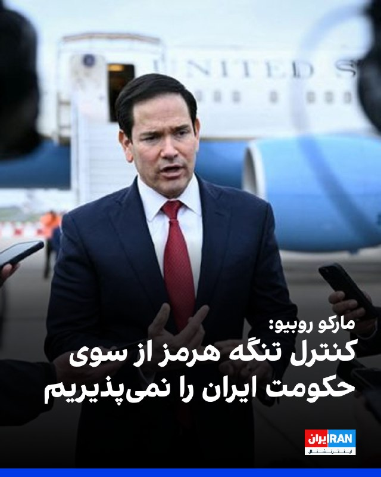

مارکو روبیو، وزیر خارجه ایالات متحده که به ایتالیا سفر کرده، گفت که ما کنترل تنگه هرمز توسط جمهوری اسلامی را نخواهیم پذیرفت و همچنین همه موافقند که داشتن سلاح هسته‌ای از سوی جمهوری اسلامی غیرقابل قبول است.»

او در خصوص مذاکرات با دولت لبنان نیز گفت: «ما می‌خواهیم دولت مشروع لبنان قوی باشد و حزب‌الله مانعی برای این امر است.»

روبیو ادامه داد: «حزب‌الله کاملا یک نیروی نیابتی جمهوری اسلامی است و بدون آنها وجود نخواهد داشت.»
روبیو تاکید کرد که ما در تلاشیم تا تامین مالی حزب‌الله را متوقف کنیم.
‌🏁 🇬🇧 IranintlTV

🤖 @VahidOOnLine

## mwarmonitor — post 8684

🇺🇸🛸وزارت جنگ ایالات متحده اسناد مربوط به برخوردها با «پدیده‌های ناشناس غیرعادی» (UAP) را از حالت محرمانه خارج کرده و منتشر کرده است. این وزارتخانه اعلام کرده که فایل‌های بیشتری نیز به‌صورت تدریجی در آینده منتشر خواهد شد.

@mwarmonitor

## mwarmonitor — post 8683

🔴روبیو: آمریکا انتظار دارد امروز پاسخ ایران به پیش‌نویس توافق برای پایان دادن به جنگ را دریافت کند.

@mwarmonitor

## mwarmonitor — post 8682

  

🔴در حال حاضر بیش از ۷۰ نفتکش وجود دارد که نیروهای ایالات متحده مانع ورود یا خروج آن‌ها به/از بنادر ایران شده‌اند. این کشتی‌های تجاری در مجموع توانایی انتقال بیش از ۱۶۶ میلیون بشکه نفت ایران را دارند که ارزش آن بیش از ۱۳ میلیارد دلار برآورد می‌شود.

@mwarmonitor

## mwarmonitor — post 8681

📌امروز هشتمین سالگرد خروج دونالد ترامپ از توافق هسته‌ای ایران برجام است که در زمان دولت اوباما مذاکره شده بود.

@mwarmonitor

## IranIntlTV — post 336133

  

مارکو روبیو، وزیر خارجه ایالات متحده که به ایتالیا سفر کرده، گفت که ما کنترل تنگه هرمز توسط جمهوری اسلامی را نخواهیم پذیرفت و همچنین همه موافقند که داشتن سلاح هسته‌ای از سوی جمهوری اسلامی غیرقابل قبول است.»

او در خصوص مذاکرات با دولت لبنان نیز گفت: «ما می‌خواهیم دولت مشروع لبنان قوی باشد و حزب‌الله مانعی برای این امر است.»

روبیو ادامه داد: «حزب‌الله کاملا یک نیروی نیابتی جمهوری اسلامی است و بدون آنها وجود نخواهد داشت.»
روبیو تاکید کرد که ما در تلاشیم تا تامین مالی حزب‌الله را متوقف کنیم.
https://iranintl.com/202605082560

## Persian_Trend_Official — post 13696

  

💢احمد علم‌الهدی، امام جمعه مشهد

«متاسفانه آنچه دشمن می‌خواست با بمباران ایجاد کند، یک عده با سودجویی می‌خواهند ایجاد کنند؛ این گرانی همانقدر مردم را ناراضی میکند که دشمن می‌خواست با حملات و بمباران خود به آن دست پیدا کند، این‌ها همه پیاده نظام آمریکا در داخل کشور هستند.»

▪️او افزود: «عوامل دشمن لبنیات، خودرو، پتروشیمی و فولاد را گران می‌کنند.»

🫆:Tony

📌 @persian_trend_official
پرشین ترند | متفاوت‌ترین کانال نظامی

## IranianMinds — post 19796

🔴فرماندار میناب:

در پی حمله دیشب آمریکا، ۱۰ ملوان مجروح و ۵ ملوان مفقود شدند.

@IranianMinds

## BBCPersian — post 280497

🔻روبیو: انتظار داریم پاسخ ایران به پیشنهاد آمریکا را امروز دریافت کنیم

وزیر خارجه آمریکا می‌گوید که واشنگتن انتظار دارد که پاسخ ایران به پیشنهادهای آمریکا برای پایان جنگ را امروز دریافت کند.

مارکو روبیو در جریان سفرش به رم، به خبرنگاران گفت: «ما انتظار داریم که امروز در مقطعی پاسخ آنها را دریافت کنیم... امیدوارم که آنچه ارائه می‌کنند، جدی باشد.»

اظهارات آقای روبیو در حالی است که وزیر خارجه ایران آمریکا را متهم کرده است که با «ماجراجویی نظامی بی‌خردانه» دیپلماسی را «قربانی» می‌کند.

عباس عراقچی هشدار داده است که «ایرانیان هرگز در برابر فشار سر خم نمی‌کنند.»

این اظهارات پس از آن است که تبادل آتش میان ایران و آمریکا در منطقه خلیج فارس سطح تنش را افزایش داده است هرچند دونالد ترامپ می‌گوید که آتش‌بس همچنان پابرجاست.

وزارت خارجه ایران دیروز گفت که مشغول بررسی طرح پیشنهادی آمریکا برای پایان جنگ است.

https://bbc.in/4u1nbfe
@BBCPersian

## BBCPersian — post 280496

  <a href="telegram/content/BBCPersian_280496_1778244141.mp4" target="_blank">🎬 Download video</a>

🔻ارتش فرانسه ویدیویی از عبور ناو هواپیمابر «شارل دوگل» از کانال سوئز به سوی تنگه هرمز منتشر کرده است.

گفته می‌شود این ناو در چارچوب ماموریتی بالقوه با هدف کمک به باز کردن تنگه هرمز در حال حرکت به سوی منطقه است.

در بیانیه ارتش فرانسه که ۱۶ اردیبهشت (۶ مه) همزمان با این ویدیو منتشر شد، این ناو به همراه کشتی‌های جنگی ایتالیا و هلند از مسیر کانال سوئز وارد دریای سرخ شده‌اند.

فرانسه همچنین با اشاره به پیامدهای اقتصادی جهانی ناشی از تنش‌ها و اقدامات متقابل ایالات متحده و ایران از واشنگتن و تهران خواسته است طرح‌هایی را برای پایان دادن به درگیری‌ها بررسی کنند.

@BBCPersian

## alonews — post 118668

  <a href="telegram/content/alonews_118668_1778244142.webm" target="_blank">🎬 Download video</a>

👈روبیو: کنترل تنگه هرمز توسط ایران غیرقابل قبول است

✅ @AloNews خبر جنگ

## alonews — post 118667

  <a href="telegram/content/alonews_118667_1778244142.webm" target="_blank">🎬 Download video</a>

👈فرماندار میناب: در پی حمله دیشب آمریکا، 10 ملوان مجروح و 5 ملوان مفقود شدن

✅ @AloNews خبر جنگ

---
📅 بروزرسانی: 1405/02/18 16:02
---

## VahidOOnLine — post 238884

  <a href="telegram/content/VahidOOnLine_238884_1778243545.mp4" target="_blank">🎬 Download video</a>

مارکو روبیو، وزیر خارجه آمریکا، در رم اعلام کرد واشنگتن انتظار دارد امروز از جمهوری‌اسلامی درباره مذاکرات مربوط به پایان جنگ پاسخ دریافت کند. او گفت: «امیدوارم این یک پیشنهاد جدی باشد.»
روبیو همچنین افزود اگر گزارش‌ها درباره تلاش تهران برای ایجاد یک نهاد جدید جهت کنترل ترافیک کشتیرانی و دریافت عوارض در تنگه هرمز صحت داشته باشد، این موضوع برای آمریکا «غیرقابل قبول» خواهد بود.
‌🏁 🇬🇧 ManotoTV

🤖 @VahidOOnLine

## VahidOOnLine — post 238883

  <a href="telegram/content/VahidOOnLine_238883_1778243545.mp4" target="_blank">🎬 Download video</a>

بررسی‌ها نشان می‌دهد نفتکش Ocean Koi توقیف شده توسط ارتش در نزدیکی تنگه هرمز، بخشی از «ناوگان سایه» جمهوری‌اسلامی بوده و از سال ۲۰۲۰ در حمل نفت ایران فعالیت داشته. آمریکا در فوریه ۲۰۲۶ آن را تحریم کرده بود. این نفتکش با پرچم باربادوس و مالک/اپراتور آن شرکت Ocean Kudos Shipping (مستقر در جزایر مارشال، با ارتباط چینی) ثبت شده است
طبق اعلام رسمی ارتش، تکاوران نیروی دریایی ارتش با «عملیات ویژه» این نفتکش را به دلیل «تلاش برای اختلال در صادرات نفت ایران و آسیب به منافع ملی» توقیف کردند. خبرگزاری مهر نیز گزارش داده محموله نفت روی آن متعلق به ایران بوده است. در بیانیه ارتش آمده کشتی به سواحل جنوبی ایران هدایت و به مقامات قضایی تحویل داده شده است.
‌🏁 🇬🇧 ManotoTV

🤖 @VahidOOnLine

## VahidOOnLine — post 238882

  <a href="telegram/content/VahidOOnLine_238882_1778243546.mp4" target="_blank">🎬 Download video</a>

جورجیا ملونی، نخست‌وزیر ایتالیا، امروز با مارکو روبیو، وزیر خارجه آمریکا، دیدار کرد؛ در شرایطی که روابط دولت او با دولت دونالد ترامپ به‌دلیل جنگ با ایران دچار تنش کم‌سابقه‌ای شده است. ملونی که پیش‌تر از نزدیک‌ترین متحدان ترامپ در اروپا محسوب می‌شد، گفته بود جنگی که در ۲۸ فوریه آغاز شده «غیرقانونی» است. او همچنین اظهارات انتقادی ترامپ علیه پاپ لئون چهاردهم را «غیرقابل قبول» توصیف کرده بود. مارکو روبیو در سفری دو روزه به ایتالیا حضور دارد. سفری که هدف آن کاهش تنش‌ها با پاپ پس از حملات بی‌سابقه ترامپ به او و همچنین رسیدگی به نارضایتی واشنگتن از مخالفت ایتالیا با حمایت از جنگ آمریکا و اسرائیل علیه ایران عنوان شده است.
‌🏁 🇬🇧 ManotoTV

🤖 @VahidOOnLine

## VahidOOnLine — post 238881

  

پوریا غلامعلی، جوان ۳۲ ساله و فعال صنف کامپیوتر، در جریان اعتراضات ۱۸ دی تهران در منطقه هفت‌حوض با شلیک مستقیم به قلب و سر کشته شد.

او جوانی ورزشکار و شیفته طبیعت بود که به گفته اطرافیانش، توان مالی مناسبی داشت و تنها به امید آزادی ایران به اعتراضات پیوسته بود.

خانواده پوریا پس از دو روز، از کشته شدن او به دست ماموران حکومتی باخبر شدند.

اصابت گلوله به سر، شناسایی این جوان ۳۲ ساله را دشوار کرده بود. همکاران پوریا در نهایت از طریق تتوهایی که بر بدن داشت، توانستند او را شناسایی کنند.

بر اساس اطلاعات رسیده به ایران‌اینترنشنال، علی‌اصغر غلامعلی، پدر پوریا و خادم مسجد، به دلیل ناتوانی مالی در تامین مبلغ مورد نیاز برای تحویل پیکر پسرش و تحت فشارهای امنیتی، پذیرفت او را «بسیجی» معرفی کنند.

ماموران به خانواده پوریا پیشنهاد استفاده از برخی امتیازات حکومتی را در ازای بسیجی خواندن او داده بودند.

با این‌حال، دوستان پوریا برای جلوگیری از مصادره حکومتی این جاویدنام، در مراسم تشییع و خاکسپاری او، شعارهای اعتراضی سر دادند.
‌🏁 🇬🇧 IranintlTV

🤖 @VahidOOnLine

## VahidOOnLine — post 238880

  

مارکو روبیو، وزیر خارجه آمریکا گفت که قرار است امروز پاسخ جمهوری اسلامی به طرح پیشنهادی صلح دریافت شود.

وزیر خارجه آمریکا ابراز امیدواری کرد که پاسخ جمهوری اسلامی جدی باشد و باعث ورود به فرآیند مذاکرات جدی شود.

او افزود: «حملات پنجشنبه ربطی به عملیات خشم حماسی نداشت.»
‌🏁 🇬🇧 IranintlTV

🤖 @VahidOOnLine

## pm_afshaa — post 90360

🔴روبیو: ما امروز باید از ایران پاسخی دریافت کنیم

💧 Rainbet.com the #1 Non-KYC Crypto Casino & Sportsbook @rainbetcom

😁 @Pm_Afshaa

## DEJradio — post 4520

  <a href="telegram/content/DEJradio_4520_1778243548.webm" target="_blank">🎬 Download video</a>

🔺📢 جمهوری اسلامی یک کشتی دیگر را در دریای عمان توقیف کرد

روابط عمومی ارتش جمهوری اسلامی اعلام کرد این نیرو یک نفتکش با نام «اوشن کوی» را به اتهام آنچه تلاش برای اخلال در صادرات نفت ایران خوانده، توقیف کرده و به سواحل جنوبی ایران منتقل کرده است.

بر همین اساس ادعا شده که این کشتی حامل محموله نفتی ایران بوده و با سوءاستفاده از شرایط تنش‌آلود منطقه، قصد آسیب زدن و ایجاد اختلال در روند صادرات نفت جمهوری اسلامی را داشته است.

#دریای_عمان #جمهوری_اسلامی
@DEJradio

## IranIntlTV — post 336132

  

پوریا غلامعلی، جوان ۳۲ ساله و فعال صنف کامپیوتر، در جریان اعتراضات ۱۸ دی تهران در منطقه هفت‌حوض با شلیک مستقیم به قلب و سر کشته شد.

او جوانی ورزشکار و شیفته طبیعت بود که به گفته اطرافیانش، توان مالی مناسبی داشت و تنها به امید آزادی ایران به اعتراضات پیوسته بود.

خانواده پوریا پس از دو روز، از کشته شدن او به دست ماموران حکومتی باخبر شدند.

اصابت گلوله به سر، شناسایی این جوان ۳۲ ساله را دشوار کرده بود. همکاران پوریا در نهایت از طریق تتوهایی که بر بدن داشت، توانستند او را شناسایی کنند.

بر اساس اطلاعات رسیده به ایران‌اینترنشنال، علی‌اصغر غلامعلی، پدر پوریا و خادم مسجد، به دلیل ناتوانی مالی در تامین مبلغ مورد نیاز برای تحویل پیکر پسرش و تحت فشارهای امنیتی، پذیرفت او را «بسیجی» معرفی کنند.

ماموران به خانواده پوریا پیشنهاد استفاده از برخی امتیازات حکومتی را در ازای بسیجی خواندن او داده بودند.

با این‌حال، دوستان پوریا برای جلوگیری از مصادره حکومتی این جاویدنام، در مراسم تشییع و خاکسپاری او، شعارهای اعتراضی سر دادند.
https://iranintl.com/202605089285

## Shin_Persian — post 5889

Open Source Intel ✓ @Osint613
Fri, 08 May 2026 12:12:53 UTC

Secretary of State Rubio says the U.S. expects a response from Iran today.

فارسی

روبیو، وزیر امور خارجه، می‌گوید ایالات متحده انتظار دارد ایران امروز پاسخ دهد.

𝕏 · @shin_persian

## ManotoTV — post 105138

  <a href="telegram/content/ManotoTV_105138_1778243549.mp4" target="_blank">🎬 Download video</a>

مارکو روبیو، وزیر خارجه آمریکا، در رم اعلام کرد واشنگتن انتظار دارد امروز از جمهوری‌اسلامی درباره مذاکرات مربوط به پایان جنگ پاسخ دریافت کند. او گفت: «امیدوارم این یک پیشنهاد جدی باشد.»
روبیو همچنین افزود اگر گزارش‌ها درباره تلاش تهران برای ایجاد یک نهاد جدید جهت کنترل ترافیک کشتیرانی و دریافت عوارض در تنگه هرمز صحت داشته باشد، این موضوع برای آمریکا «غیرقابل قبول» خواهد بود.

## ManotoTV — post 105137

  <a href="telegram/content/ManotoTV_105137_1778243550.mp4" target="_blank">🎬 Download video</a>

بررسی‌ها نشان می‌دهد نفتکش Ocean Koi توقیف شده توسط ارتش در نزدیکی تنگه هرمز، بخشی از «ناوگان سایه» جمهوری‌اسلامی بوده و از سال ۲۰۲۰ در حمل نفت ایران فعالیت داشته. آمریکا در فوریه ۲۰۲۶ آن را تحریم کرده بود. این نفتکش با پرچم باربادوس و مالک/اپراتور آن شرکت Ocean Kudos Shipping (مستقر در جزایر مارشال، با ارتباط چینی) ثبت شده است
طبق اعلام رسمی ارتش، تکاوران نیروی دریایی ارتش با «عملیات ویژه» این نفتکش را به دلیل «تلاش برای اختلال در صادرات نفت ایران و آسیب به منافع ملی» توقیف کردند. خبرگزاری مهر نیز گزارش داده محموله نفت روی آن متعلق به ایران بوده است. در بیانیه ارتش آمده کشتی به سواحل جنوبی ایران هدایت و به مقامات قضایی تحویل داده شده است.

## ManotoTV — post 105136

  <a href="telegram/content/ManotoTV_105136_1778243550.mp4" target="_blank">🎬 Download video</a>

جورجیا ملونی، نخست‌وزیر ایتالیا، امروز با مارکو روبیو، وزیر خارجه آمریکا، دیدار کرد؛ در شرایطی که روابط دولت او با دولت دونالد ترامپ به‌دلیل جنگ با ایران دچار تنش کم‌سابقه‌ای شده است. ملونی که پیش‌تر از نزدیک‌ترین متحدان ترامپ در اروپا محسوب می‌شد، گفته بود جنگی که در ۲۸ فوریه آغاز شده «غیرقانونی» است. او همچنین اظهارات انتقادی ترامپ علیه پاپ لئون چهاردهم را «غیرقابل قبول» توصیف کرده بود. مارکو روبیو در سفری دو روزه به ایتالیا حضور دارد. سفری که هدف آن کاهش تنش‌ها با پاپ پس از حملات بی‌سابقه ترامپ به او و همچنین رسیدگی به نارضایتی واشنگتن از مخالفت ایتالیا با حمایت از جنگ آمریکا و اسرائیل علیه ایران عنوان شده است.

## DW_Farsi — post 124433

  

🔶 کاهش اعتبار بین‌المللی آمریکا در دوران ترامپ

بر اساس یک نظرسنجی، وجهه بین‌المللی آمریکا در دوران ریاست‌جمهوری دونالد ترامپ به‌شدت کاهش یافته است.

مطالعه سالانه «شاخص ادراک دموکراسی» (Democracy Perception Index) که روز جمعه ۸ مه (۱۸ اردیبهشت) منتشر شد، نشان می‌دهد ایالات متحده در اروپا بیش از هر منطقه دیگری با نگاه منفی مواجه است. همچنین در این گزارش آمده که چین اکنون به طور متوسط در تمام مناطق جهان تصویر مثبت‌تری نسبت به آمریکا دارد.

در این نظرسنجی که توسط سازمان "ائتلاف دموکراسی‌ها" متعلق به آندرس فوگ راسموسن، دبیرکل پیشین ناتو، در بهار امسال انجام شد، شاخص محبوبیت جهانی آمریکا از منفی ۵ درصد در سال گذشته به منفی ۱۶ درصد سقوط کرده است.

به این ترتیب، حتی روسیه با امتیاز منفی ۱۱ درصد نیز به طور متوسط محبوب‌تر از آمریکا ارزیابی شده است. تنها کشورهایی که وضعیت بدتری از آمریکا داشته‌اند عبارت‌اند از اسرائیل، کره شمالی، افغانستان و ایران.
@dw_farsi

## Persian_Trend_Official — post 13695

  <a href="telegram/content/Persian_Trend_Official_13695_1778243552.mp4" target="_blank">🎬 Download video</a>

روبیو: کنترل تنگه هرمز توسط ایران غیرقابل قبول است

💢هرگونه تلاش ایران برای ایجاد اقتدار برای کنترل ناوبری در تنگه هرمز غیرقابل قبول خواهد بود.

💢برخی از کشورهای اروپایی مانع از استفاده ما از پایگاه‌های ناتو در مواقع اضطراری و بحرانی شده‌اند و در ماموریت‌های ما مانع‌تراشی کرده‌اند.

▪️این یک مشکل است که باید مورد بررسی قرار گیرد

🫆:Tony

📌 @persian_trend_official
پرشین ترند | متفاوت‌ترین کانال نظامی

## Persian_Trend_Official — post 13694

  

به گزارش تسنیم

💢دستور بازگشایی پناهگاه‌های عمومی در حیفا

رسانه‌های عبری: شهردار کریات‌آتا در حیفا دستور داد پناهگاه‌های عمومی در شهر باز شوند.

🫆:Tony

📌 @persian_trend_official
پرشین ترند | متفاوت‌ترین کانال نظامی

## RadioFarda — post 156969

  

🔸سنتکام، فرماندهی مرکزی ایالات متحده، اعلام کرد از زمان آغاز محاصره دریایی تا روز جمعه، ۱۸ اردیبهشت مانع از ورود یا خروج بیش از ۷۰ نفتکش از بنادر ایران شده است.

🔸سنتکام در پیام تازه‌اش در شبکه اجتماعی ایکس نوشته که این کشتی‌های تجاری ظرفیت حمل بیش از ۱۶۶ میلیون بشکه نفت ایران به ارزش تخمینی بیش از ۱۳ میلیارد دلار را دارند.

🔸این موضوع ساعاتی پس از آن اعلام شد که ارتش آمریکا گفت نیروهایش در نخستین ساعات بامداد جمعه حملات «تحریک‌نشدهٔ» ایران علیه ناوشکن‌های آمریکایی در تنگه هرمز را رهگیری کرده و در پاسخ، «تأسیسات نظامی ایران» را هدف قرار دادند.

🔸ایالات متحده در واکنش به اقدام ایران در بستن تنگه هرمز، از ۲۴ فروردین یک محاصره دریایی بر بنادر و کشتیرانی ایران اعمال کرده و بر مبنای آن، ورود و خروج هر کشتی از مبدأ یا به مقصد بنادر ایران را ممنوع کرده است.

🔸تنگه هرمز، گذرگاهی به عرض تنها ۳۴ کیلومتر میان ایران و عمان، مسیر اتصال خلیج فارس به اقیانوس هند است و راه اصلی عبور حدود یک‌پنجم نفت جهان و کالاهای حیاتی دیگر از جمله کودهای شیمیایی به‌شمار می‌رود.

@RadioFarda

## IranianMinds — post 19795

🔴العربیه:

ارتش اسرائیل شهرک طورا در جنوب لبنان را هدف حملات هوایی قرار داد.

@IranianMinds

## IranianMinds — post 19794

  <a href="telegram/content/IranianMinds_19794_1778243555.mp4" target="_blank">🎬 Download video</a>

🔴 مارکو روبیو درباره ایران:

آنچه دیروز دیدید ناوشکن‌های آمریکایی بود که در آب‌های بین‌المللی در حال حرکت بودند که توسط ایرانی‌ها به سمت آنها شلیک شد.

ما برای محافظت از خود پاسخ دفاعی دادیم.

این جدا و متمایز از عملیات خشم حماسی است.

@IranianMinds

## manototv — post 105138

  <a href="telegram/content/manototv_105138_1778243556.mp4" target="_blank">🎬 Download video</a>

مارکو روبیو، وزیر خارجه آمریکا، در رم اعلام کرد واشنگتن انتظار دارد امروز از جمهوری‌اسلامی درباره مذاکرات مربوط به پایان جنگ پاسخ دریافت کند. او گفت: «امیدوارم این یک پیشنهاد جدی باشد.»
روبیو همچنین افزود اگر گزارش‌ها درباره تلاش تهران برای ایجاد یک نهاد جدید جهت کنترل ترافیک کشتیرانی و دریافت عوارض در تنگه هرمز صحت داشته باشد، این موضوع برای آمریکا «غیرقابل قبول» خواهد بود.

## manototv — post 105137

  <a href="telegram/content/manototv_105137_1778243557.mp4" target="_blank">🎬 Download video</a>

بررسی‌ها نشان می‌دهد نفتکش Ocean Koi توقیف شده توسط ارتش در نزدیکی تنگه هرمز، بخشی از «ناوگان سایه» جمهوری‌اسلامی بوده و از سال ۲۰۲۰ در حمل نفت ایران فعالیت داشته. آمریکا در فوریه ۲۰۲۶ آن را تحریم کرده بود. این نفتکش با پرچم باربادوس و مالک/اپراتور آن شرکت Ocean Kudos Shipping (مستقر در جزایر مارشال، با ارتباط چینی) ثبت شده است
طبق اعلام رسمی ارتش، تکاوران نیروی دریایی ارتش با «عملیات ویژه» این نفتکش را به دلیل «تلاش برای اختلال در صادرات نفت ایران و آسیب به منافع ملی» توقیف کردند. خبرگزاری مهر نیز گزارش داده محموله نفت روی آن متعلق به ایران بوده است. در بیانیه ارتش آمده کشتی به سواحل جنوبی ایران هدایت و به مقامات قضایی تحویل داده شده است.

## manototv — post 105136

  <a href="telegram/content/manototv_105136_1778243557.mp4" target="_blank">🎬 Download video</a>

جورجیا ملونی، نخست‌وزیر ایتالیا، امروز با مارکو روبیو، وزیر خارجه آمریکا، دیدار کرد؛ در شرایطی که روابط دولت او با دولت دونالد ترامپ به‌دلیل جنگ با ایران دچار تنش کم‌سابقه‌ای شده است. ملونی که پیش‌تر از نزدیک‌ترین متحدان ترامپ در اروپا محسوب می‌شد، گفته بود جنگی که در ۲۸ فوریه آغاز شده «غیرقانونی» است. او همچنین اظهارات انتقادی ترامپ علیه پاپ لئون چهاردهم را «غیرقابل قبول» توصیف کرده بود. مارکو روبیو در سفری دو روزه به ایتالیا حضور دارد. سفری که هدف آن کاهش تنش‌ها با پاپ پس از حملات بی‌سابقه ترامپ به او و همچنین رسیدگی به نارضایتی واشنگتن از مخالفت ایتالیا با حمایت از جنگ آمریکا و اسرائیل علیه ایران عنوان شده است.

## alonews — post 118666

  <a href="telegram/content/alonews_118666_1778243559.webm" target="_blank">🎬 Download video</a>

👈میثم ظهوریان، عضو کمیسیون اقتصادی مجلس: برآورد واقع‌بینانه از درآمد تنگه هرمز سالی ۸ میلیارد دلار است نه ۱۰۰ میلیارد دلار

✅ @AloNews خبر جنگ

## alonews — post 118665

  <a href="telegram/content/alonews_118665_1778243559.webm" target="_blank">🎬 Download video</a>

👈مارکو روبیو: آنچه دیروز دیدید، ناوشکن‌های آمریکایی بودند که در آب‌های بین‌المللی در حال حرکت بودند و توسط ایرانی‌ها مورد اصابت گلوله قرار گرفتند.

🔴ما برای محافظت از خودمان واکنش دفاعی نشان دادیم.

🔴این با عملیات خشم حماسی کاملاً متفاوت است

✅ @AloNews خبر جنگ

## alonews — post 118664

  <a href="telegram/content/alonews_118664_1778243559.mp4" target="_blank">🎬 Download video</a>

👈 مارکو روبیو: یکی از دلایل اصلی حضور ایالات متحده در ناتو، توانایی استقرار نیروها در اروپا برای به کارگیری در شرایط اضطراری دیگر است. اکنون دیگر این مورد صادق نیست، حداقل در مورد برخی از اعضای ناتو. این مشکلی است که باید مورد بررسی قرار گیرد.

✅ @AloNews خبر جنگ

## alonews — post 118663

  <a href="telegram/content/alonews_118663_1778243561.mp4" target="_blank">🎬 Download video</a>

👈 مارکو روبیو: ترامپ همیشه آزادانه درباره احساسات خود نسبت به سیاست ایالات متحده صحبت خواهد کرد. رئیس‌جمهور همواره در راستای منافع بهترین ایالات متحده عمل خواهد کرد.

🔴به نظر من می‌توانیم این کار را انجام دهیم و همچنان رابطه‌ای سازنده با کلیسا داشته باشیم.

✅ @AloNews خبر جنگ

## alonews — post 118662

  <a href="telegram/content/alonews_118662_1778243562.webm" target="_blank">🎬 Download video</a>

👈روبیو : با پاپ فرانسیس در مورد وضعیت ایران گفتگو کردم.

🔴 اگر آتش‌بس با ایران برقرار نشود، در پاسخ به تیراندازی آن‌ها به سمت ما، به سمتشان شلیک خواهیم کرد.

✅ @AloNews خبر جنگ

---
📅 بروزرسانی: 1405/02/18 15:52
---

## VahidOOnLine — post 238879

  

وزارت خارجه جمهوری اسلامی در بیانیه‌ای حمله ارتش آمریکا به دو نفتکش متعلق به جمهوری اسلامی در حوالی بندر جاسک و تنگه هرمز و «تعرض» به چند نقطه در مناطق ساحلی مشرف به این تنگه را محکوم کرد و آن را «نقض آشکار» تفاهم آتش‌بس خواند.

وزارت خارجه جمهوری اسلامی، این اقدامات را «تجاوزکارانه و تحریک‌آمیز» دانست.
‌🏁 🇬🇧 IranintlTV

🤖 @VahidOOnLine

## DEJradio — post 4519

  <a href="telegram/content/DEJradio_4519_1778242966.webm" target="_blank">🎬 Download video</a>

🔺📢 جمهوری اسلامی یک کشتی دیگر را در دریای عمان توقیف کرد

روابط عمومی ارتش جمهوری اسلامی اعلام کرد این نیرو یک نفتکش با نام «اوشن کوی» را به اتهام آنچه تلاش برای اخلال در صادرات نفت ایران خوانده، توقیف کرده و به سواحل جنوبی ایران منتقل کرده است.

بر همین اساس ادعا شده که این کشتی حامل محموله نفتی ایران بوده و با سوءاستفاده از شرایط تنش‌آلود منطقه، قصد آسیب زدن و ایجاد اختلال در روند صادرات نفت جمهوری اسلامی را داشته است.

#دریای_عمان #جمهوری_اسلامی
@DEJradio

## IranIntlTV — post 336131

  

مارکو روبیو، وزیر خارجه آمریکا گفت که قرار است امروز پاسخ جمهوری اسلامی به طرح پیشنهادی صلح دریافت شود.

وزیر خارجه آمریکا ابراز امیدواری کرد که پاسخ جمهوری اسلامی جدی باشد و باعث ورود به فرآیند مذاکرات جدی شود.

او افزود: «حملات پنجشنبه ربطی به عملیات خشم حماسی نداشت.»
https://iranintl.com/202605088334

## IranIntlTV — post 336130

  

وزارت خارجه جمهوری اسلامی در بیانیه‌ای حمله ارتش آمریکا به دو نفتکش متعلق به جمهوری اسلامی در حوالی بندر جاسک و تنگه هرمز و «تعرض» به چند نقطه در مناطق ساحلی مشرف به این تنگه را محکوم کرد و آن را «نقض آشکار» تفاهم آتش‌بس خواند.

وزارت خارجه جمهوری اسلامی، این اقدامات را «تجاوزکارانه و تحریک‌آمیز» دانست.
https://iranintl.com/202605080674

## DW_Farsi — post 124432

🔶 جمهوری اسلامی از توقیف یک نفت‌کش در خلیج عمان خبر داد

ایران روز جمعه یک نفتکش به نام "اوشن کوئی" را در خلیج عمان به دلیل تلاش ادعایی برای مختل کردن صادرات نفت ایران توقیف کرد. رسانه‌های دولتی ایران به نقل از بیانیه ارتش این خبر را اعلام کردند.

در این بیانیه آمده است که این نفتکش با پرچم باربادوس، حامل نفت ایران بوده و «با سوءاستفاده از شرایط منطقه‌ای قصد آسیب رساندن و اخلال در صادرات نفت» را داشته است.

بر اساس گزارش رسانه‌های دولتی، این نفتکش که از ماه فوریه تحت تحریم‌های آمریکا قرار داشته، به سواحل جنوبی ایران هدایت و به مقامات قضایی تحویل داده شده است.

این توقیف پس از درگیری میان نیروهای آمریکا و ایران در تنگه هرمز رخ داد؛ گذرگاهی که خلیج فارس را به خلیج عمان متصل می‌کند.

ایران از زمان آغاز جنگ آمریکا و اسرائیل علیه ایران در ۲۸ فوریه، تا حد زیادی این آبراه باریک را که محل عبور حدود یک‌پنجم جریان نفت جهان است، مسدود کرده است.
@dw_farsi

## Persian_Trend_Official — post 13693

🔴مارکو روبیو: 💢ترامپ همیشه آزادانه درباره احساساتش نسبت به سیاست‌های ایالات متحده صحبت خواهد کرد. رئیس‌جمهور همیشه در جهت منافع ایالات متحده عمل خواهد کرد. 💢فکر می‌کنم می‌توانیم این کار را انجام دهیم و همچنان رابطه‌ای سازنده با کلیسا داشته باشیم. 🫆:Tony…

## Persian_Trend_Official — post 13692

🔴مارکو روبیو: 💢ترامپ همیشه آزادانه درباره احساساتش نسبت به سیاست‌های ایالات متحده صحبت خواهد کرد. رئیس‌جمهور همیشه در جهت منافع ایالات متحده عمل خواهد کرد. 💢فکر می‌کنم می‌توانیم این کار را انجام دهیم و همچنان رابطه‌ای سازنده با کلیسا داشته باشیم. 🫆:Tony…

## Persian_Trend_Official — post 13691

  <a href="telegram/content/Persian_Trend_Official_13691_1778242969.mp4" target="_blank">🎬 Download video</a>

🔴مارکو روبیو:

💢ترامپ همیشه آزادانه درباره احساساتش نسبت به سیاست‌های ایالات متحده صحبت خواهد کرد. رئیس‌جمهور همیشه در جهت منافع ایالات متحده عمل خواهد کرد.

💢فکر می‌کنم می‌توانیم این کار را انجام دهیم و همچنان رابطه‌ای سازنده با کلیسا داشته باشیم.

🫆:Tony

📌 @persian_trend_official
پرشین ترند | متفاوت‌ترین کانال نظامی

## Persian_Trend_Official — post 13690

  

🔴لاوروف: اگر اوکراین به مسکو حمله کند، رحمی در کار نخواهد بود‼️

💢لاوروف وزیر امور خارجه روسیه در واکنش به تهدید رئیس‌جمهور اوکراین درباره حمله به مسکو در زمان برپایی مراسم روز پیروزی در جنگ جهانی دوم (فردا شنبه ۹ می- ۱۹ اردیبهشت) گفت: در این صورت، هیچ رحمی بر آنها نخواهد بود.

🫆:Tony

📌 @persian_trend_official
پرشین ترند | متفاوت‌ترین کانال نظامی

## IranianMinds — post 19793

  <a href="telegram/content/IranianMinds_19793_1778242972.mp4" target="_blank">🎬 Download video</a>

🔴 مارکو روبیو:

دلیل اینکه لبنان با بمباران مواجه می شود، حزب الله است.

حزب الله این را به آنها تحمیل می کند.

@IranianMinds

## IranianMinds — post 19792

  <a href="telegram/content/IranianMinds_19792_1778242975.mp4" target="_blank">🎬 Download video</a>

🔴 مارکو روبیو:

ما امروز در مقطعی منتظر پاسخ ایران هستیم. ما هنوز آن را دریافت نکرده ایم.

امیدوارم پیشنهاد جدی باشه , فقط امیدوارم.

@IranianMinds

## BBCPersian — post 280495

🔻دیدار روبیو و ملونی در سایه تنش‌ آمریکا و ایتالیا بر سر جنگ ایران

وزیرخارجه آمریکا و نخست‌وزیر ایتالیا در رم دیدار و گفت‌و‌گو کردند.

دیدار مارکو روبیو و جورجا ملونی در بحبوحه تنش بین دولت ایتالیا و دونالد ترامپ به‌دلیل اختلافاتشان درباره جنگ ایران و انتقادهای بی‌سابقه رئیس‌جمهور آمریکا از پاپ لئون صورت گرفته است.

انتظار می‌رفت که در این دیدار دو طرف در مورد وضعیت خلیج فارس، جنگ روسیه و اوکراین، تعرفه‌های آمریکا بر کالاهای اروپایی و همچنین سیاست‌های مربوط به کوبا گفت‌وگو شود.

خانم ملونی پیش‌تر یکی از حامیان اصلی آقای ترامپ در اروپا محسوب می‌شد و تلاش داشت به‌عنوان پل ارتباطی میان واشنگتن و اتحادیه اروپا عمل کند، اما جنگ ایران این توازن را تحت تاثیر قرار داده است؛ زیرا اکنون او باید میان وفاداری به آمریکا و افکار عمومی ایتالیا که با جنگ مخالف هستند، تعادل برقرار کند.

آنتونیو تایانی، وزیر خارجه ایتالیا، پیش از این دیدار گفته بود: « معتقدم اروپا به آمریکا نیاز دارد، ایتالیا به آمریکا نیاز دارد، اما آمریکا هم به اروپا و ایتالیا نیاز دارد.»

روابط دو طرف پس از انتقادهای اخیر آقای ترامپ از پاپ لئون دچار تنش شد. اظهارات دونالد ترامپ درباره پاپ با واکنش منفی گسترده‌ای روبرو شد و خانم ملونی این اظهارات را «غیرقابل قبول» توصیف کرد.

آقای ترامپ در واکنش، خانم ملونی را به «بی‌جسارتی» متهم کرد و حتی تهدید کرد نیروهای آمریکایی را از ایتالیا خارج خواهد کرد.

@BBCPersian

## alonews — post 118661

  <a href="telegram/content/alonews_118661_1778242978.webm" target="_blank">🎬 Download video</a>

👈الجزیره: یک مورد مشکوک جدید به ویروس هانتاویروس در یک شهروند بریتانیایی در جزیره تریستان دا کونا در اقیانوس اطلس جنوبی شناسایی شد، این در حالی است که تلاش‌ها برای ردیابی مسافران کشتی تفریحی لوکسی که ویروس در آن شیوع پیدا کرد و افراد نزدیک به آنها ادامه دارد

✅ @AloNews خبر جنگ

## alonews — post 118660

  <a href="telegram/content/alonews_118660_1778242978.webm" target="_blank">🎬 Download video</a>

👈 روبیو: ما امروز باید از ایران پاسخی دریافت کنیم

✅ @AloNews خبر جنگ

---
📅 بروزرسانی: 1405/02/18 15:42
---

## VahidOOnLine — post 238878

  

♦️وزارت امور خارجه جمهوری اسلامی ایران، روز جمعه با انتشار بیانیه‌ای به حمله نیروهای آمریکایی به دو نفتکش متعلق به ایران در حوالی بندر جاسک و تنگه هرمز واکنش نشان داد.
در این بیانیه آمده است حملات آمریکا به نفتکش‌ها و چند منطقه ساحلی مشرف به تنگه هرمز در شامگاه پنجشنبه و بامداد جمعه، با پاسخ مقتدرانه و «سیلی سنگین» نیروهای مسلح ایران مواجه شده و «متجاوزان در رسیدن به اهداف خود ناکام مانده‌اند.»
وزارت خارجه ایران این اقدامات را «نقض آشکار تفاهم آتش‌بس مورخ ۱۹ فروردین‌ماه» توصیف کرده و نوشته است این حملات «نقض فاحش بند ۴ ماده ۲ منشور ملل متحد و مصداق بارز عمل تجاوزکارانه بر اساس قطعنامه ۳۳۱۴ مجمع عمومی سازمان ملل» است.
در این بیانیه ادعا شده، آمریکا در «یافتن راه حل معقول برای خروج از باتلاقی خودساخته» سردرگم است. تهران همچنین نسبت به پیامدهای خطرناک بی‌تفاوتی و مماشات سازمان ملل در برابر قانون‌شکنی‌های هیات حاکمه آمریکا هشدار داده است.
در پایان، وزارت امور خارجه ایران با اعلام آنکه حضور نظامی آمریکا در منطقه خلیج فارس و دریای عمان عامل اصلی ناامنی و بی‌ثباتی است، بار دیگر از کشورهای منطقه خواست تا با پایبندی به سیاست حسن همسایگی و بر اساس یک سازوکار امنیتی درون‌زا و بدون دخالت بازیگران مخرب خارجی، برای ایجاد صلح و ثبات پایدار تلاش کنند.

این بیانیه در حالی منتشر می‌شود که  پیش از ظهر پنجشنبه ۱۸ اردیبهشت از توقیف یک نفت‌کش دیگر در تنگه هرمز خبر داده بود. سخنگوی قرارگاه خاتم‌الانبیا سپاه پاسداران نیز در بیانیه‌ای اعلام کرد نیروهای مسلح جمهوری اسلامی در پاسخ، شناورهای نظامی آمریکا در شرق تنگه هرمز و جنوب چابهار را هدف قرار داده‌اند.
‌🇸🇦 Indypersian

🤖 @VahidOOnLine

## pm_afshaa — post 90359

  

پست جدید ترامپ :لیزر , بینگ , بینگ , از بین رفت

💧 Rainbet.com the #1 Non-KYC Crypto Casino & Sportsbook @rainbetcom

😁 @Pm_Afshaa

## kianmeli1 — post 87271

🔴روبیو: منتظر دریافت پاسخ ایران امروز هستم
https://t.me/kianmeli1

## DW_Farsi — post 124431

🔶 آیا ویروس هانتا کابوس کرونا را زنده خواهد ساخت؟

خبرهای حاکی از مرگ سه نفر از مسافران یک کشتی تفریحی متعلق به یک شرکت هلندی در آب‌های اقیانوس اطلس بر اثر ابتلا به ویروس هانتا (Hantavirus) بسیاری را دل‌نگران کرده است؛ آن هم در شرایطی که هنوز خاطرات مربوط به همه‌گیری جهانی ابتلا به ویروس کرونا از ذهن‌ها پاک نشده است.

با این حال سازمان جهانی بهداشت شیوع مرگبار ویروس هانتا در کشتی تفریحی "ام‌وی هوندیوس" (MV Hondius) را آغاز یک پاندمی جدید تلقی نمی‌کند.

ماریا فن‌ کرک‌هوفه، هماهنگ‌کننده کمک‌های اضطراری این سازمان، در جمع خبرنگاران در ژنو تصریح کرد: «این کووید نیست. این یک ویروس کاملاً متفاوت است.»

همچنین رومان ولفل، رئیس مؤسسه میکروبیولوژی ارتش آلمان، در مصاحبه با شبکه "تاگس شاو ۲۴" گفت که هانتا به اندازه "سارس-کوو-۲"، ویروس عامل بیماری کووید ـ ۱۹ یا کرونا و ویروس‌های آنفلوانزا مسری نیست و برای انتقال آن، نیاز به تماسی بسیار نزدیک‌تر است.

سازمان جهانی بهداشت به دلیل دوره نهفتگی یا کمون طولانی‌مدت شش هفته‌ای این ویروس احتمال بروز موارد بیشتری از ابتلا را رد نمی‌کند.

اما عبدی رحمان محمود، رئیس بخش هشدار و واکنش اضطراری این سازمان، تأکید کرده که به اعتقاد او، این یک شیوع محدود خواهد بود، البته "به شرطی که اقدامات حفاظتی بهداشت عمومی اجرا شود و همه کشورها همبستگی نشان دهند."

تا کنون ابتلای پنج نفر به ویروس هانتا تأیید شده است. طبق اعلام سازمان جهانی بهداشت، علاوه بر این موارد، سه مورد مشکوک نیز وجود دارد.

تا کنون سه نفر، شامل یک زوج مسن هلندی و یک زن آلمانی جان خود را از دست داده‌اند.

کشتی هلندی یادشده که با حدود ۱۵۰ سرنشین چندین روز در نزدیکی کشور جزیره‌ای کیپ‌ورد (دماغه‌سبز) لنگر انداخته بود، روز چهارشنبه ششم مه مسیر خود را به سمت جزیره تنریف، از مجمع‌الجزایر قناری اسپانیا تغییر داد و طبق اعلام دولت این کشور، انتظار می‌رود روز یکشنبه ۱۰ مه به بندر گرانادیا در این جزیره برسد.
@dw_farsi

## DW_Farsi — post 124430

🔶 آمریکا خواستار آزادی فوری نرگس محمدی، برنده جایزه نوبل صلح شد

ایالات متحده از ایران خواست نرگس محمدی، فعال حقوق بشر ایرانی و برنده جایزه نوبل صلح، را که به شدت بیمار است فوراً از زندان آزاد کند.

رایلی بارنز، مقام ارشد مسئول حقوق بشر در وزارت خارجه آمریکا، در شبکه اجتماعی ایکس نوشت که این زندانی ۵۴ ساله باید درمان پزشکی لازم را دریافت کند و "جهان نظاره‌گر است".

او افزود: «نرگس محمدی اکنون در وضعیت بحرانی قرار دارد و مراقبت پزشکی کاملاً ناکافی دریافت می‌کند.»

"بنیاد محمدی" و بستگان او روز چهارشنبه اعلام کرده بودند که او "میان مرگ و زندگی" قرار دارد.

بارنز همچنین نوشت: «رژیم ایران نرگس محمدی را زندانی کرده، چون صدای خود را بلند کرده بود، چون از طرف مردم ایران و امیدهای آنان برای زندگی بهتر سخن گفته بود.»

این فعال حقوق بشر در سال ۲۰۲۳ به خاطر مبارزه‌اش علیه سرکوب زنان و مخالفت با مجازات اعدام در ایران، موفق به دریافت جایزه نوبل صلح شد.
@dw_farsi

## Persian_Trend_Official — post 13689

  

امارات: همچنان آماده‌ هستیم‼️

💢وزارت دفاع امارات پس از اعلام آمار حملات ایران شامل موشک‌های بالستیک، کروز و پهپادها و همچنین شمار کشته‌ها و زخمی‌ها اعلام کرد

«همچنان در آمادگی کامل هستیم.»

💢طبق ادعای وزارت دفاع امارات، با احتساب ۲ زخمی امروز، شمار مجروحان این کشور از آغاز جنگ به ۲۳۰ نفر و تعداد کشته‌ها به ۱۳ نفر رسیده است.

🫆:Tony

📌 @persian_trend_official
پرشین ترند | متفاوت‌ترین کانال نظامی

## Persian_Trend_Official — post 13688

  <a href="telegram/content/Persian_Trend_Official_13688_1778242339.webm" target="_blank">🎬 Download video</a>

☆Phantom☆

📌 @persian_trend_official
پرشین ترند | متفاوت‌ترین کانال نظامی

## Persian_Trend_Official — post 13687

🔴اسرائیل به حملات خود در جنوب لبنان ادامه می‌دهد

💢خبرگزاری رسمی لبنان (NNA) گزارش داد که اسرائیل یک موتورسیکلت را در منطقه «حومین التحتا» در جنوب لبنان هدف قرار داده و همچنین حمله پهپادی دیگری را به شهرک «عرب الجل» در نزدیکی روستای «عنقون» انجام داده است.

💢پیش‌تر نیز یک حمله پهپادی دیگر شهر «دیر أنطار» در منطقه بنت جبیل را هدف قرار داده بود.

🫆:Tony

📌 @persian_trend_official
پرشین ترند | متفاوت‌ترین کانال نظامی

## IranianMinds — post 19791

🔴 مارکو روبیو :

ما امروز یک پاسخ از ایران دریافت میکنیم و امیدوارم اونا جدی باشن!

@IranianMinds

## IranianMinds — post 19790

🔴 دبیر ستاد امر به معروف و نهی از منکر :

اینترنت دیگر هرگز برنخواهد گشت , همانطور که رهبرمان دیگر برنمیگردد !

@IranianMinds

## IranianMinds — post 19789

  

🔴 پست جدید ترامپ :

لیزر , بینگ , بینگ , از بین رفت

@IranianMinds

## alonews — post 118659

  <a href="telegram/content/alonews_118659_1778242340.webm" target="_blank">🎬 Download video</a>

👈سنتکام: الان بیش از ۷۰ نفتکش به‌خاطر حضور و کنترل نیروهای آمریکا نتونستن وارد یا خارجِ بنادر ایران بشن

🔴این کشتی‌ها روی‌هم حدود ۱۶۶ میلیون بشکه نفت، به ارزش بیشتر از ۱۳ میلیارد دلار، ظرفیت حمل دارن

✅ @AloNews خبر جنگ

---
📅 بروزرسانی: 1405/02/18 15:32
---

## VahidOOnLine — post 238877

  <a href="telegram/content/VahidOOnLine_238877_1778241758.mp4" target="_blank">🎬 Download video</a>

تانکر ترکرز که به ردیابی نفتکش‌ها می‌پردازد گزارش داده است در دو روز گذشته، سه نفتکش متعلق به شرکت ملی نفتکش ایران که بدون محموله بوده‌اند، پس از بازگشت به سمت ایران و عبور از منطقه اقتصادی ویژه پاکستان ، از خط محاصره نیروی دریایی آمریکا عبور کرده‌اند. در این گزارش آمده این سه نفتکش در مجموع توان حمل ۵ میلیون بشکه نفت خام ایران را دارند.
همچنین تأیید شده دو فروند از این سه نفتکش در تصاویر ماهواره‌ای مشاهده شده‌اند، در حالی که یک نفتکش دیگر احتمالا HASNA شب گذشته در در نزدیکی ساحل «شناس» عمان، حدود ۲۵۴ مایل دریایی معادل ۴۷۰ کیلومتری غرب خط محاصره دیده شده است. (تایید نشده)
در ادامه گزارش آمده طبق اعلام سنتکام در تاریخ ۶ مه ۲۰۲۶: «پس از آنکه خدمه نفتکش HASNA از اجرای هشدارهای مکرر سر باز زدند، نیروهای آمریکایی با شلیک چند گلوله از توپ ۲۰ میلی‌متری جنگنده F/A-18 سوپر هورنت که از ناو آبراهام لینکلن بلند شده بود، سکان نفتکش را از کار انداختند. HASNA دیگر در مسیر حرکت به سمت ایران نیست.»
‌🏁 🇬🇧 ManotoTV

🤖 @VahidOOnLine

## VahidOOnLine — post 238876

  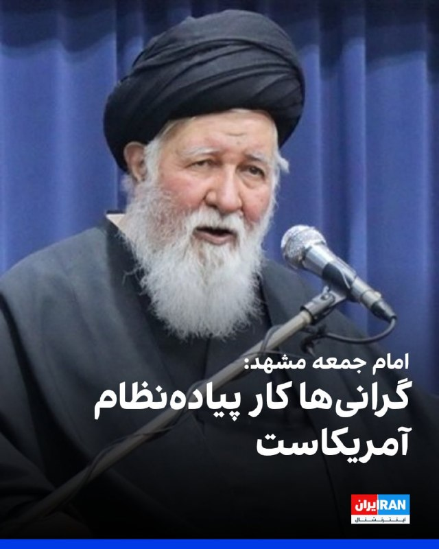

احمد علم‌الهدی، امام جمعه مشهد گفت: «متاسفانه آنچه دشمن می‌خواست با بمباران ایجاد کند، یک عده با سودجویی می‌خواهند ایجاد کنند؛ این گرانی همانقدر مردم را ناراضی میکند که دشمن می‌خواست با حملات و بمباران خود به آن دست پیدا کند، این‌ها همه پیاده نظام آمریکا در داخل کشور هستند.»

او افزود: «عوامل دشمن لبنیات، خودرو، پتروشیمی و فولاد را گران می‌کنند.»

علم‌الهدی ادامه داد: «دو تا کوره ذوب آهن فولاد مبارکه را دشمن بمباران کرده است، در حالیکه همچنان تولید در حال انجام است و هم تولیدات گذشته به اندازه بیش از یکسال مصرف داخلی و صادرات انبار شده است. در این مشهد ما به هر آهن فروشی مراجعه کنید، یکی دو زمین انبار تیرآهن و میل گرد قرار داده است، پس چرا یکمرتبه قیمت را گران کردید؟»
iranintl
‌🏁 🇬🇧 IranintlTV

🤖 @VahidOOnLine

## VahidOOnLine — post 238875

  <a href="telegram/content/VahidOOnLine_238875_1778241759.mp4" target="_blank">🎬 Download video</a>

⭕️روبیو و ملونی در رم دیدار کردند

♦️مارک روبیو، وزیر امور خارجه آمریکا، در جریان سفر به رم با جورجا ملونی، نخست‌وزیر ایتالیا، دیدار و گفتگو کرد.
این دیدار در شرایطی انجام شد که تنش‌ها میان واشنگتن، رم و واتیکان بر سر جنگ ایران و مواضع اخیر دونالد ترامپ افزایش یافته است.

روبیو در سفر خود تلاش دارد اختلافات ایجادشده پس از انتقادهای ترامپ از ایتالیا و واتیکان را کاهش دهد.
محور اصلی گفتگوها نیز تحولات خاورمیانه، امنیت منطقه و روابط فراآتلانتیک عنوان شده است.
‌🇸🇦 Indypersian

🤖 @VahidOOnLine

## IranIntlTV — post 336129

  

احمد علم‌الهدی، امام جمعه مشهد گفت: «متاسفانه آنچه دشمن می‌خواست با بمباران ایجاد کند، یک عده با سودجویی می‌خواهند ایجاد کنند؛ این گرانی همانقدر مردم را ناراضی میکند که دشمن می‌خواست با حملات و بمباران خود به آن دست پیدا کند، این‌ها همه پیاده نظام آمریکا در داخل کشور هستند.»

او افزود: «عوامل دشمن لبنیات، خودرو، پتروشیمی و فولاد را گران می‌کنند.»

علم‌الهدی ادامه داد: «دو تا کوره ذوب آهن فولاد مبارکه را دشمن بمباران کرده است، در حالیکه همچنان تولید در حال انجام است و هم تولیدات گذشته به اندازه بیش از یکسال مصرف داخلی و صادرات انبار شده است. در این مشهد ما به هر آهن فروشی مراجعه کنید، یکی دو زمین انبار تیرآهن و میل گرد قرار داده است، پس چرا یکمرتبه قیمت را گران کردید؟»
iranintl.com/202605082163

## ManotoTV — post 105135

  <a href="telegram/content/ManotoTV_105135_1778241762.mp4" target="_blank">🎬 Download video</a>

تانکر ترکرز که به ردیابی نفتکش‌ها می‌پردازد گزارش داده است در دو روز گذشته، سه نفتکش متعلق به شرکت ملی نفتکش ایران که بدون محموله بوده‌اند، پس از بازگشت به سمت ایران و عبور از منطقه اقتصادی ویژه پاکستان ، از خط محاصره نیروی دریایی آمریکا عبور کرده‌اند. در این گزارش آمده این سه نفتکش در مجموع توان حمل ۵ میلیون بشکه نفت خام ایران را دارند.
همچنین تأیید شده دو فروند از این سه نفتکش در تصاویر ماهواره‌ای مشاهده شده‌اند، در حالی که یک نفتکش دیگر احتمالا HASNA شب گذشته در در نزدیکی ساحل «شناس» عمان، حدود ۲۵۴ مایل دریایی معادل ۴۷۰ کیلومتری غرب خط محاصره دیده شده است. (تایید نشده)
در ادامه گزارش آمده طبق اعلام سنتکام در تاریخ ۶ مه ۲۰۲۶: «پس از آنکه خدمه نفتکش HASNA از اجرای هشدارهای مکرر سر باز زدند، نیروهای آمریکایی با شلیک چند گلوله از توپ ۲۰ میلی‌متری جنگنده F/A-18 سوپر هورنت که از ناو آبراهام لینکلن بلند شده بود، سکان نفتکش را از کار انداختند. HASNA دیگر در مسیر حرکت به سمت ایران نیست.»

## manototv — post 105135

  <a href="telegram/content/manototv_105135_1778241762.mp4" target="_blank">🎬 Download video</a>

تانکر ترکرز که به ردیابی نفتکش‌ها می‌پردازد گزارش داده است در دو روز گذشته، سه نفتکش متعلق به شرکت ملی نفتکش ایران که بدون محموله بوده‌اند، پس از بازگشت به سمت ایران و عبور از منطقه اقتصادی ویژه پاکستان ، از خط محاصره نیروی دریایی آمریکا عبور کرده‌اند. در این گزارش آمده این سه نفتکش در مجموع توان حمل ۵ میلیون بشکه نفت خام ایران را دارند.
همچنین تأیید شده دو فروند از این سه نفتکش در تصاویر ماهواره‌ای مشاهده شده‌اند، در حالی که یک نفتکش دیگر احتمالا HASNA شب گذشته در در نزدیکی ساحل «شناس» عمان، حدود ۲۵۴ مایل دریایی معادل ۴۷۰ کیلومتری غرب خط محاصره دیده شده است. (تایید نشده)
در ادامه گزارش آمده طبق اعلام سنتکام در تاریخ ۶ مه ۲۰۲۶: «پس از آنکه خدمه نفتکش HASNA از اجرای هشدارهای مکرر سر باز زدند، نیروهای آمریکایی با شلیک چند گلوله از توپ ۲۰ میلی‌متری جنگنده F/A-18 سوپر هورنت که از ناو آبراهام لینکلن بلند شده بود، سکان نفتکش را از کار انداختند. HASNA دیگر در مسیر حرکت به سمت ایران نیست.»

## alonews — post 118658

  <a href="telegram/content/alonews_118658_1778241763.webm" target="_blank">🎬 Download video</a>

👈رویترز: قیمت نفت و طلا روز جمعه پس از تشدید درگیری‌ها بین ایالات متحده و ایران که آتش‌بس شکننده بین دو طرف را تهدید می‌کند ، افزایش یافت، در حالی که دلار و شاخص‌های سهام اروپا و ژاپن کاهش یافت.

🔴قیمت نفت خام برنت با ۱.۴۱ درصد افزایش به ۱۰۱.۴۷ دلار در هر بشکه رسید، در حالی که قیمت نفت خام وست تگزاس اینترمدیت آمریکا با ۱.۱۸ درصد افزایش به ۹۵.۹۳ دلار در هر بشکه رسید.

✅ @AloNews خبر جنگ

## alonews — post 118657

  <a href="telegram/content/alonews_118657_1778241763.webm" target="_blank">🎬 Download video</a>

👈تنکر ترکرز: مجموع ظرفیت سه نفتکش ایرانی که محاصره آمریکا را شکستند ۵ میلیون بشکه نفت خام ایران است.

✅ @AloNews خبر جنگ

---
📅 بروزرسانی: 1405/02/18 15:22
---

## VahidOOnLine — post 238874

  

آژیرهای هشدار درباره شلیک راکت و موشک از لبنان، در حیفا و شش منطقه دیگر اسرائیل به صدا درآمد.

بنا بر گزارش‌ها حزب‌الله درتلافی کشته شدن فرمانده نیروهای رضوان این گروه، سه موشک به شمال اسرائیل شلیک کرد.

رسانه‌های اسرائیلی گزارش دادند این حملات هیچ تلفات و خسارتی نداشته است.

iranintl
‌🏁 🇬🇧 IranintlTV

🤖 @VahidOOnLine

## VahidOOnLine — post 238873

  

مقتدی صدر، رهبر جریان صدر، در پیامی خطاب به علی الزیدی، نخست‌وزیر مکلف عراق، تاکید کرد «افراد یا جریان‌های دارای شاخه مسلح» نباید در کابینه آینده این کشور حضور داشته باشند.

او خواستار آن شد که گروه‌های مسلح یا در قالب تشکیلاتی با عنوان «سربازان شعائر دینی» زیر نظر هیات حج سازماندهی شوند یا به «نهادهای امدادرسان و بشردوستانه» تبدیل شوند. صدر همچنین بر حفظ استقلال عراق و دوری از هرگونه دخالت خارجی «نه شرقی و نه غربی» تاکید کرد و گفت دولت آینده باید خواسته‌های مردم عراق را برآورده کند.

او ادامه داد: «هیچ فردی از جریان صدر را در کابینه وزارتی نمی‌پذیریم و هیچ وزیری نماینده ما نخواهد بود.»

در روزهای اخیر، گمانه‌زنی‌ها درباره ترکیب دولت آینده عراق بالا گرفته است. ۱۶ اردیبهشت، یک مقام ارشد وزارت خارجه آمریکا اعلام کرد واشینگتن از نخست‌وزیر عراق انتظار دارد برای محدود کردن نفوذ گروه‌های مسلح نزدیک به جمهوری اسلامی، «اقدام‌های عملی» انجام دهد.

iranintl
‌🏁 🇬🇧 IranintlTV

🤖 @VahidOOnLine

## pm_afshaa — post 90358

🔴گاردین: جمهوری اسلامی اعدام‌ها را به‌صورت روزانه و پنهانی ادامه می‌دهد؛ خانواده‌ها زیر فشار و ایران در خاموشی اینترنتی

💧 Rainbet.com the #1 Non-KYC Crypto Casino & Sportsbook @rainbetcom

😁 @Pm_Afshaa

## IranIntlTV — post 336128

  

آژیرهای هشدار درباره شلیک راکت و موشک از لبنان، در حیفا و شش منطقه دیگر اسرائیل به صدا درآمد.

بنا بر گزارش‌ها حزب‌الله درتلافی کشته شدن فرمانده نیروهای رضوان این گروه، سه موشک به شمال اسرائیل شلیک کرد.

رسانه‌های اسرائیلی گزارش دادند این حملات هیچ تلفات و خسارتی نداشته است.

iranintl.com/202605081286

## IranIntlTV — post 336127

  

مقتدی صدر، رهبر جریان صدر، در پیامی خطاب به علی الزیدی، نخست‌وزیر مکلف عراق، تاکید کرد «افراد یا جریان‌های دارای شاخه مسلح» نباید در کابینه آینده این کشور حضور داشته باشند.

او خواستار آن شد که گروه‌های مسلح یا در قالب تشکیلاتی با عنوان «سربازان شعائر دینی» زیر نظر هیات حج سازماندهی شوند یا به «نهادهای امدادرسان و بشردوستانه» تبدیل شوند. صدر همچنین بر حفظ استقلال عراق و دوری از هرگونه دخالت خارجی «نه شرقی و نه غربی» تاکید کرد و گفت دولت آینده باید خواسته‌های مردم عراق را برآورده کند.

او ادامه داد: «هیچ فردی از جریان صدر را در کابینه وزارتی نمی‌پذیریم و هیچ وزیری نماینده ما نخواهد بود.»

در روزهای اخیر، گمانه‌زنی‌ها درباره ترکیب دولت آینده عراق بالا گرفته است. ۱۶ اردیبهشت، یک مقام ارشد وزارت خارجه آمریکا اعلام کرد واشینگتن از نخست‌وزیر عراق انتظار دارد برای محدود کردن نفوذ گروه‌های مسلح نزدیک به جمهوری اسلامی، «اقدام‌های عملی» انجام دهد.

iranintl.com/202605084373

## IranIntlTV — post 336126

  <a href="telegram/content/IranIntlTV_336126_1778241164.mp4" target="_blank">🎬 Download video</a>

امانوئل مکرون، رییس‌جمهور فرانسه، در مراسم هشتاد و یکمین سالگرد پیروزی متفقین بر آلمان نازی در پاریس حضور یافت و با نثار گل بر مزار سربازان گمنام، با مقام‌های نظامی و کهنه‌سربازان دیدار کرد.
گفت‌وگو با جلال ایجادی، استاد جامعه‌شناسی دانشگاه کنام
@iranintltv

## FarsiVOA — post 217188

  <a href="telegram/content/FarsiVOA_217188_1778241167.mp4" target="_blank">🎬 Download video</a>

در جریان نمایشگاه صنایع دفاعی ساها ۲۰۲۶، دولت ترکیه از جدیدترین دستاورد موشکی خود به نام «ییلدیریم‌هان» رونمایی کرد. این موشک به عنوان اولین موشک بالستیک قاره‌پیمای این کشور معرفی شده است.

طبق داده‌های رسمی، این موشک دارای برد ۶ هزار کیلومتر است. این پرتابه با استفاده از سوخت مایع و موتورهای چهارگانه، توانایی دستیابی به سرعت‌های فراصوت (هایپرسونیک) را دارد.

برخی تحلیلگران بین‌المللی این اقدام آنکارا را گامی در جهت افزایش توان بازدارندگی مستقل و تغییر دکترین نظامی ترکیه در منطقه ارزیابی می‌کنند.

ناظران سیاسی معتقدند دستیابی به تکنولوژی موشک‌های میان‌برد و قاره‌پیما توسط یک عضو ناتو، می‌تواند بر معادلات امنیتی اروپا و خاورمیانه اثرگذار باشد.
@FarsiVOA

## RadioFarda — post 156968

  

🔸امارات متحده عربی اعلام کرد پدافند هوایی این کشور روز جمعه ۱۸ اردیبهشت «دو موشک بالستیک و سه پهپاد شلیک‌شده از سوی ایران» را رهگیری کرده است. این حمله، به‌گفتهٔ مقام‌های اماراتی، سه زخمی بر جا گذاشت.

🔸وزارت دفاع امارات در بیانیه‌اش همچنین اعلام کرد از زمان آغاز «حملات آشکار ایران»، پدافند هوایی این کشور در مجموع با ۵۵۱ موشک بالستیک، ۲۹ موشک کروز و ۲۲۶۳ پهپاد مقابله کرده است.

🔸بر اساس این بیانیه، سه نفر در حمله روز جمعه زخمی شدند و شمار کل مجروحان به ۲۳۰ نفر از ملیت‌های مختلف رسیده است.

🔸وزارت دفاع امارات همچنین اعلام کرد در ساعات گذشته هیچ کشته‌ای گزارش نشده، اما از آغاز حملات، دو نفر کشته شده‌اند. این بیانیه همچنین از کشته شدن یک شهروند مراکشی که با نیروهای مسلح امارات قرارداد همکاری داشته خبر داده و شمار کل جان‌باختگان غیرنظامی را ۱۰ نفر اعلام کرده است.

🔸وزارت دفاع امارات تأکید کرده است که این کشور همچنان در آمادگی کامل برای مقابله با هرگونه تهدید قرار دارد و با هر اقدامی که امنیت و ثبات کشور را هدف قرار دهد، برخورد خواهد کرد.

@Radiofarda

## IranianMinds — post 19788

  

دیده شده در تجمع حکومتی :

@IranianMinds

## BBCPersian — post 280494

  

🔻در روزهای اخیر تصاویری از تجمع مقابل دادگستری شهرکرد در شبکه‌های اجتماعی منتشر شده که در آن بنری با مضمون «مطالبه عدالت برای مریم آقابابایی دیده می‌شود.
رسانه‌های ایران گزارش دادند که این زن جوان «توسط راننده یک تاکسی اینترنتی ربوده شده و به قتل رسیده است.»
خبرگزاری فارس گفت‌وگویی با برادر مقتول، اسماعیل آقابابایی، منتشر کرده که درباره جزئیات حادثه توضیح می‌دهد. به گفته او، خانم آقابابایی ساعت ۱۱:۴۵ روز پنجشنبه، ۱۰ اردیبهشت، برای تهیه دارو از منزل خارج شده و ساعت ۱۲:۳۳ برای خرید کارت بانکی کشیده است. 
او افزود: «خواهرم پس از خروج از داروخانه، از طریق تلفن همراه خود یک دستگاه خودروی اینترنتی درخواست می‌کند، اما پس از آن تلفن همراه او از دسترس خارج شد و تماس ما برای گفت‌وگو با او به نتیجه نرسید.»
خبرگزاری‌های ایران به نقل از پلیس نوشته‌اند که راننده تاکسی اینترنتی دستگیر شده و تحقیقات تکمیلی برای روشن شدن ابعاد این پرونده ادامه دارد.
در ادامه گفت‌وگوی برادر مریم آقابابایی آمده است: «قاتل در اعترافات خود به جزئیات قتل اعتراف کرده است.

ادامه خبر:
https://bbc.in/4dwBW3F
📷UGC
@BBCPersian

## Dirty_Kids — post 389101

وزارت دفاع امارات اعلام کرد سامانه‌های پدافند هوایی این کشور با دو موشک بالستیک و سه پهپاد مقابله کرده‌اند. در پی رهگیری و انهدام این پرتابه‌ها، ۳ نفر مجروح شدند.

@Dirty_Kids 👻

## Dirty_Kids — post 389100

‏از آدمهایی که پول رستوران رو تقسیم بر تعداد نفرات میکنن فرار میکنم! پدرسگا هرکی هر چی خورده رو باید حساب کنه!

مالیاتشم لحاظ کنید!

@Dirty_Kids 👻

## Dirty_Kids — post 389099

  

رافضی و فانتزی‌هاش!
گاه با سرچ احکام کنیز
گاه با گرفتن خلبان زن
الانم استان امارات!!!

این قوم عجیب گرفتار هپروت شدن!

@Dirty_Kids 👻

## Dirty_Kids — post 389098

چند وقت پیش تصمیم گرفتم هر روز نیم ساعت پیاده‌روی کنم، به خودم قول دادم که اگه یه روز انجامش ندادم اون ۳۰ دقیقه رو به تایم فرداش اضافه کنم. این تصمیم زندگی‌مو کاملاً متحول کرده. فردا باید ۳ ماه پیاده‌روی کنم.

@Dirty_Kids 👻

## configx2ray — post 38644

  <a href="https://t.me/ConfigX2ray/38644" target="_blank">📎 Download file</a>

کانفیگ برای Npv tunnel ⭕️

به هیچ وج دانلود نزنید باهاش
❤️

رمز فایل : @ConfigX2ray

Channel : https://t.me/ConfigX2ray

## alonews — post 118654

  <a href="telegram/content/alonews_118654_1778241174.mp4" target="_blank">🎬 Download video</a>

👈اوکراین امروز صبح برای سومین بار در ۹ روز، به پالایشگاه نفت لوک‌اوئیل-پرمنفت‌اورگسینتز در پرم، روسیه حمله کرد.

✅ @AloNews خبر جنگ

## alonews — post 118653

  <a href="telegram/content/alonews_118653_1778241177.webm" target="_blank">🎬 Download video</a>

👈 کامالا هریس: آمریکا کمتر قابل اعتماد شده است.

🔴ما برای دوستانمان کمتر قابل اعتماد شده‌ایم. به عنوان یک دوست، غیرقابل اعتماد.

🔴و بنابراین نفوذ خود را نیز از دست داده‌ایم.

✅ @AloNews خبر جنگ

---
📅 بروزرسانی: 1405/02/18 15:12
---

## VahidOOnLine — post 238872

  

♦️وزارت دفاع امارات متحده عربی روز جمعه اعلام کرد سامانه‌های پدافند هوایی این کشور با دو موشک بالستیک و سه پهپاد شلیک‌شده از ایران درگیر شدند.
بر اساس بیانیه منتشرشده در شبکه اجتماعی اکس، در این حملات سه نفر به‌طور متوسط زخمی شده‌اند.
در پی تحولات نظامی شامگاه پنجشنبه در خلیج فارس، وزارت دفاع امارات متحده عربی در ساعات اولیه بامداد جمعه اعلام کرده بود نیروی هوایی در حال واکنش به تهدید‌های موشکی و پهپادی از سوی ایران است.
‌🇸🇦 Indypersian

🤖 @VahidOOnLine

## VahidOOnLine — post 238871

  <a href="telegram/content/VahidOOnLine_238871_1778240544.mp4" target="_blank">🎬 Download video</a>

وزارت دفاع امارات متحده عربی اعلام کرد سامانه‌های پدافندی این کشور موفق شده‌اند دو موشک بالستیک و سه پهپاد شلیک‌شده از ایران را رهگیری و منهدم کنند و در این حادثه سه نفر به‌طور متوسط زخمی شده‌اند. این وزارتخانه در پستی در شبکه اجتماعی اکس نوشت: «از آغاز حملات آشکار ایران به امارات، سامانه‌های پدافندی در مجموع با ۵۵۱ موشک بالستیک، ۲۹ موشک کروز و ۲,۲۶۳ پهپاد درگیر شده‌اند.
‌🏁 🇬🇧 ManotoTV

🤖 @VahidOOnLine

## VahidOOnLine — post 238870

  <a href="telegram/content/VahidOOnLine_238870_1778240545.mp4" target="_blank">🎬 Download video</a>

وزارت خارجه جمهوری‌اسلامی در بیانیه‌ای، آمریکا را به نقض آتش‌بس متهم و اعلام کرد ارتش آمریکا به دو نفتکش ایرانی در نزدیکی بندر جاسک و تنگه هرمز، همچنین حملات به چند نقطه ساحلی مشرف به تنگه هرمز حمله کرده است و «این حملات با پاسخ مقتدرانه و سیلی سنگین نیروهای مسلح جمهوری اسلامی ایران مواجه شد و متجاوزان در رسیدن به اهداف نامشروعشان ناکام ماندند.» در بیانیه وزارت خارجه جمهوری‌اسلامی آمده این حملات در ساعات پایانی پنج‌شنبه ۱۷ اردیبهشت و بامداد جمعه ۱۸ اردیبهشت انجام شده است.
‌🏁 🇬🇧 ManotoTV

🤖 @VahidOOnLine

## VahidOOnLine — post 238869

  <a href="telegram/content/VahidOOnLine_238869_1778240546.mp4" target="_blank">🎬 Download video</a>

عباس عراقچی، وزیر خارجه جمهوری‌اسلامی در شبکه اکس نوشته: «هر وقت یک راه‌حل دیپلماتیک روی میز قرار می‌گیرد، آمریکا به‌جای آن به سراغ یک ماجراجویی نظامی بی‌پروا می‌رود. آیا این یک تاکتیک فشار خشن است؟ یا نتیجه این است که یک بازیگر مخرب دوباره رئیس‌جمهور آمریکا را به سمت یک باتلاق دیگر می‌کشاند؟» عراقچی همراه با توییت خود نوشته: «سازمان سیا اشتباه می‌کند و ذخایر موشکی و ظرفیت پرتابگر‌های جمهوری‌اسلامی در مقایسه با ۹ اسفند (روز نخست حملات اسرائیل و آمریکا به ایران)، در سطح ۷۵ درصد نیست و رقم صحیح ۱۲۰ درصد است»
‌🏁 🇬🇧 ManotoTV

🤖 @VahidOOnLine

## VahidOOnLine — post 238868

  <a href="telegram/content/VahidOOnLine_238868_1778240547.mp4" target="_blank">🎬 Download video</a>

عباس عراقچی، وزیر خارجه جمهوری‌اسلامی در شبکه اکس نوشته: هر وقت یک راه‌حل دیپلماتیک روی میز قرار می‌گیرد، آمریکا به‌جای آن به سراغ یک ماجراجویی نظامی بی‌پروا می‌رود. آیا این یک تاکتیک فشار خشن است؟ یا نتیجه این است که یک بازیگر مخرب دوباره رئیس‌جمهور آمریکا را به سمت یک باتلاق دیگر می‌کشاند؟»
همزمان وزارت خارجه جمهوری‌اسلامی در بیانیه‌ای، آمریکا را به نقض آتش‌بس متهم و اعلام کرد ارتش آمریکا به دو نفتکش ایرانی در نزدیکی بندر جاسک و تنگه هرمز، همچنین حملات به چند نقطه ساحلی مشرف به تنگه هرمز حمله کرده است و «این حملات با پاسخ مقتدرانه و سیلی سنگین نیروهای مسلح جمهوری اسلامی ایران مواجه شد و متجاوزان در رسیدن به اهداف نامشروعشان ناکام ماندند.» در بیانیه وزارت خارجه جمهوری‌اسلامی آمده این حملات در ساعات پایانی پنج‌شنبه ۱۷ اردیبهشت و بامداد جمعه ۱۸ اردیبهشت انجام شده است.
‌🏁 🇬🇧 ManotoTV

🤖 @VahidOOnLine

## VahidOOnLine — post 238867

  

♦️عباس عراقچی، وزیر امور خارجه جمهوری اسلامی ایران، روز جمعه ۱۸ اردیبهشت ماه، در بیانیه‌ای با انتقاد از سیاست‌های واشنگتن، ارزیابی‌های اخیر آژانس اطلاعات مرکزی آمریکا (سیا) درباره کاهش توان تسلیحاتی ایران را «نادرست» توصیف کرد.

عراقچی با انتشار متنی در شبکه اجتماعی اکس، با اعلام آنکه واشنگتن همیشه رویکرد نظامی را بر دیپلماسی ترجیح می‌دهد، نوشت: «هر بار که یک راه‌حل دیپلماتیک روی میز قرار می‌گیرد، ایالات متحده مسیر یک ماجراجویی نظامی بی‌پروا را انتخاب می‌کند. آیا این یک تاکتیک فشار خام و ابتدایی است؟ یا باز هم نتیجه «بازی خراب‌کنی» است که رئیس‌جمهور آمریکا را فریب داده و به باتلاق دیگری کشانده است؟ علت هر چه که باشد، نتیجه یکی است: ایرانی‌ها هرگز تسلیم فشار نمی‌شوند و دیپلماسی همواره اولین قربانی است.»

وزیر امور خارجه ایران در ادامه این بیانیه، داده‌های اطلاعاتی آمریکا درباره میزان تخریب توان دفاعی ایران زیر سوال برد و افزود: «ارزیابی سازمان سیا نادرست است. ذخایر موشکی و ظرفیت پرتابگرهای ما در مقایسه با ۲۸ فوریه روی ۷۵ درصد نیست، بلکه رقم واقعی ۱۲۰ درصد است. درباره میزان آمادگی ما برای دفاع از مردممان نیز این رقم ۱,۰۰۰ درصد است.»
این اظهارات در بحبوحه گمانه‌زنی‌های رسانه‌ها مبنی بر احتمال دست‌یابی به توافق میان تهران و واشنگتن مطرح می‌شود.
درگیری پنجشنبه شب در تنگه هرمز از زمان آتش‌بس میان دو طرف از ۱۹ فروردین، جدی‌ترین و خطرناک‌ترین مورد نقض آتش‌بس به شمار می‌رود. این در حالی است که دونالد ترامپ، رئیس جمهوری آمریکا با کم‌اهمیت خواندن درگیری نیمه‌شب پنجشنبه، اعلام کرد آتش‌بس به قوت خود باقی است.
‌🇸🇦 Indypersian

🤖 @VahidOOnLine

## pm_afshaa — post 90357

70 روز از قطعی اینترنت گذشت

## pm_afshaa — post 90356

70 روز از قطعی اینترنت گذشت

## pm_afshaa — post 90355

🔴کانال 15 اسرائیل:حزب‌الله لبنان یک پهپاد انتحاری شامل ماده منفجره را به سمت اسرائیل شلیک کرد که باعث ایجاد تلفات در ارتش اسرائیل شده

💧 Rainbet.com the #1 Non-KYC Crypto Casino & Sportsbook @rainbetcom

😁 @Pm_Afshaa

## kianmeli1 — post 87270

  

🔴وزارت دفاع امارات متحده عربی اعلام کرد که پدافند هوایی این کشور در چند ساعت گذشته ۳ پهپاد و ۲ موشک بالستیک ایرانی را رصد کرده است.
این حمله منجر به زخمی شدن حداقل ۳ نفر شده است.
https://t.me/kianmeli1

## IranIntlTV — post 336125

  <a href="telegram/content/IranIntlTV_336125_1778240550.mp4" target="_blank">🎬 Download video</a>

در فایل صوتی منتشرشده از یک اتاق کلاب‌هاوس، یک پزشک با صدایی بغض‌آلود از بحران روانی جامعه و کمبود دارو برای درمان مشکلات روحی و روانی مردم سخن می‌گوید.
گفت‌وگو با صبا آلاله، روان‌تحلیل‌گر
@iranintltv

## ManotoTV — post 105134

  <a href="telegram/content/ManotoTV_105134_1778240552.mp4" target="_blank">🎬 Download video</a>

وزارت دفاع امارات متحده عربی اعلام کرد سامانه‌های پدافندی این کشور موفق شده‌اند دو موشک بالستیک و سه پهپاد شلیک‌شده از ایران را رهگیری و منهدم کنند و در این حادثه سه نفر به‌طور متوسط زخمی شده‌اند. این وزارتخانه در پستی در شبکه اجتماعی اکس نوشت: «از آغاز حملات آشکار ایران به امارات، سامانه‌های پدافندی در مجموع با ۵۵۱ موشک بالستیک، ۲۹ موشک کروز و ۲,۲۶۳ پهپاد درگیر شده‌اند.

## ManotoTV — post 105133

  <a href="telegram/content/ManotoTV_105133_1778240553.mp4" target="_blank">🎬 Download video</a>

وزارت خارجه جمهوری‌اسلامی در بیانیه‌ای، آمریکا را به نقض آتش‌بس متهم و اعلام کرد ارتش آمریکا به دو نفتکش ایرانی در نزدیکی بندر جاسک و تنگه هرمز، همچنین حملات به چند نقطه ساحلی مشرف به تنگه هرمز حمله کرده است و «این حملات با پاسخ مقتدرانه و سیلی سنگین نیروهای مسلح جمهوری اسلامی ایران مواجه شد و متجاوزان در رسیدن به اهداف نامشروعشان ناکام ماندند.» در بیانیه وزارت خارجه جمهوری‌اسلامی آمده این حملات در ساعات پایانی پنج‌شنبه ۱۷ اردیبهشت و بامداد جمعه ۱۸ اردیبهشت انجام شده است.

## ManotoTV — post 105132

  <a href="telegram/content/ManotoTV_105132_1778240554.mp4" target="_blank">🎬 Download video</a>

عباس عراقچی، وزیر خارجه جمهوری‌اسلامی در شبکه اکس نوشته: «هر وقت یک راه‌حل دیپلماتیک روی میز قرار می‌گیرد، آمریکا به‌جای آن به سراغ یک ماجراجویی نظامی بی‌پروا می‌رود. آیا این یک تاکتیک فشار خشن است؟ یا نتیجه این است که یک بازیگر مخرب دوباره رئیس‌جمهور آمریکا را به سمت یک باتلاق دیگر می‌کشاند؟» عراقچی همراه با توییت خود نوشته: «سازمان سیا اشتباه می‌کند و ذخایر موشکی و ظرفیت پرتابگر‌های جمهوری‌اسلامی در مقایسه با ۹ اسفند (روز نخست حملات اسرائیل و آمریکا به ایران)، در سطح ۷۵ درصد نیست و رقم صحیح ۱۲۰ درصد است»

## ManotoTV — post 105131

  <a href="telegram/content/ManotoTV_105131_1778240554.mp4" target="_blank">🎬 Download video</a>

عباس عراقچی، وزیر خارجه جمهوری‌اسلامی در شبکه اکس نوشته: هر وقت یک راه‌حل دیپلماتیک روی میز قرار می‌گیرد، آمریکا به‌جای آن به سراغ یک ماجراجویی نظامی بی‌پروا می‌رود. آیا این یک تاکتیک فشار خشن است؟ یا نتیجه این است که یک بازیگر مخرب دوباره رئیس‌جمهور آمریکا را به سمت یک باتلاق دیگر می‌کشاند؟»
همزمان وزارت خارجه جمهوری‌اسلامی در بیانیه‌ای، آمریکا را به نقض آتش‌بس متهم و اعلام کرد ارتش آمریکا به دو نفتکش ایرانی در نزدیکی بندر جاسک و تنگه هرمز، همچنین حملات به چند نقطه ساحلی مشرف به تنگه هرمز حمله کرده است و «این حملات با پاسخ مقتدرانه و سیلی سنگین نیروهای مسلح جمهوری اسلامی ایران مواجه شد و متجاوزان در رسیدن به اهداف نامشروعشان ناکام ماندند.» در بیانیه وزارت خارجه جمهوری‌اسلامی آمده این حملات در ساعات پایانی پنج‌شنبه ۱۷ اردیبهشت و بامداد جمعه ۱۸ اردیبهشت انجام شده است.

## FarsiVOA — post 217187

🔺رویترز: حمل پنهانی دست‌کم شش میلیون بشکه نفت امارات از تنگه هرمز

▪️خبرگزاری رویترز با استناد به داده‌های شرکت‌های ردیابی نفتکش‌ها می‌گوید امارات در ماه گذشته دست‌کم شش میلیون بشکه نفت خام را به صورت پنهانی از تنگه هرمز عبور داده و راهی بازارها کرده است.

▪️دست‌کم چهار نفتکش در ماه آوریل، محموله‌های تولید شده از میادین نفتی «زاکوم» و «داس» شرکت ملی نفت ابوظبی را با خاموش کردن سیستم شناسایی خودکار، به صورت پنهانی از تنگه هرمز گذرانده‌اند.

▪️این موضوع نشان می‌دهد امارات تا چه میزان حاضر به ریسک ترانزیت نفت از تنگه هرمز در میانه انسداد این آبراهه توسط جمهوری اسلامی و حملات به کشتی‌ها است.

⬇️ بیشتر بخوانید:
https://ir.voanews.com/a/8147959.html

## FarsiVOA — post 217186

🔺جمهوری اسلامی یک نفتکش تحریمی «حامل نفت ایران» را توقیف کرد

▪️رسانه‌های داخلی ایران به نقل از ارتش جمهوری اسلامی اعلام کردند که نیروهای ارتش نفتکش «اوشن کوی» را در دریای عمان به اتهام ادعایی «اخلال در صادرات نفت ایران» توقیف کرده‌اند.

▪️ادعا شده این نفتکش «حامل نفت ایران»، «با سوءاستفاده از شرایط منطقه در صدد لطمه زدن و ایجاد اخلال در صادرات نفت ایران» بوده است.

▪️پیشتر وزارت خزانه‌داری آمریکا در ماه فوریه، نفتکش «اوشن کوی» با پرچم باربادوس را که متعلق به شرکت «اوشن کودوس شیپینگ» مستقر در جزایر مارشال است، تحریم کرده بود.

▪️بر اساس اعلام این وزارتخانه اوشن کوی دست‌کم از سال ۲۰۲۰ به‌عنوان بخشی از شبکه مخفی صادرات نفت ایران موسوم به «ناوگان سایه» فعالیت کرده است.

⬇️ بیشتر بخوانید:
https://ir.voanews.com/a/8147958.html

## RadioFarda — post 156967

  

🔸عباس عراقچی، وزیر خارجه جمهوری اسلامی، روز جمعه در واکنش به حمله تازه ارتش آمریکا به «مواضع نظامی» ایران در پیامی در شبکه ایکس ایالات متحده را متهم کرد که «هر بار راه حلی دیپلماتیک روی میز است» به سراغ «ماجراجویی نظامی» می‌رود.

🔸در پی انتشار گزارش‌هایی در رسانه‌ها و شبکه‌های اجتماعی از شنیده شدن صدای چند انفجار در جنوب ایران، خبرگزاری فارس، نزدیک به سپاه پاسداران، شامگاه پنجشنبه اعلام کرد بخش‌هایی از اسکله بهمن در جزیره قشم هدف قرار گرفته است.

🔸ساعتی بعد، سنتکام، فرماندهی مرکزی ارتش آمریکا در منطقه خاورمیانه، بامداد جمعه خبر داد که مواضع نظامی در خاک ایران را هدف قرار داده است.

🔸به گفته سنتکام، این حملات پس از آن انجام شده که ایران ناوهای در حال عبور از تنگه هرمز را هدف قرار داده است.

🔸سنتکام در عین حال می‌گوید که در پی «بالا بردن سطح تنش» نیست.

🔸عراقچی در ادامه پیام تازه خود می‌پرسد: «آیا این کار تاکتیکی برای فشار است؟‌ یا حاصل کار یک خرابکار که بار دیگر به دنبال کشاندن رئیس جمهور آمریکا به باتلاقی دیگر است؟»

@Radiofarda

## RadioFarda — post 156966

  <a href="https://t.me/radiofarda/156966" target="_blank">📎 Download file</a>

📻بشنوید: ساعت ۱۴ با رادیوفردا،۱۸ اردیبهشت ۱۴۰۵‌

@Radiofarda

## BBCPersian — post 280493

یک زوج ایرانی که در دوبی پرستارند، در گفت‌وگو با بی‌بی‌سی مشکلات مربوط به تمدید ویزای خود و گروهی از ایرانیان ساکن امارات متحده عربی را تشریح کردند. این زوج که قصد تغییر محل کارشان را داشته‌اند، پس از لغو ویزا متوجه شده‌اند که امکان درخواست ویزای جدید «برای…

## BBCPersian — post 280492

  <a href="telegram/content/BBCPersian_280492_1778240556.mp4" target="_blank">🎬 Download video</a>

یک زوج ایرانی که در دوبی پرستارند، در گفت‌وگو با بی‌بی‌سی مشکلات مربوط به تمدید ویزای خود و گروهی از ایرانیان ساکن امارات متحده عربی را تشریح کردند. این زوج که قصد تغییر محل کارشان را داشته‌اند، پس از لغو ویزا متوجه شده‌اند که امکان درخواست ویزای جدید «برای ایرانیان» وجود ندارد و در آستانه ترک اجباری این کشور هستند.

این زوج که مشخصاتشان نزد بی‌بی‌سی محفوظ است، توضیح دادند: «اگر قصد تغییر کارفرما داشته باشید، باید ویزای قبلی را لغو کنید. ما هم مدرک لغو ویزا را به کارفرمای جدید دادیم تا کار ویزای جدید شروع شود. اما همزمان با آغاز جنگ، امارات بدون اینکه اعلام کند، در سیستم خللی ایجاد کرده که وقتی گزینه ملیت را ایران انتخاب می‌کنی و کد ۲۰۱ وارد می‌شود، سیستم خطا می‌دهد. این مشکل فقط برای ایرانی‌هاست.»

## BBCPersian — post 280491

  

🔻وزیر خارجه ایران، آمریکا را متهم کرد که با «ماجراجویی نظامی بی‌خردانه» دیپلماسی «قربانی» می‌کند.

عباس عراقچی در پستی در شبکه اجتماعی ایکس نوشت: «هر زمان که یک راه‌ حل دیپلماتیک روی میز قرار می گیرد، ایالات متحده به‌ یک ماجراجویی نظامی بی‌خردانه رو می‌آورد.»

آقای عراقچی در ادامه می‌نویسد که دلیل این اقدام چه «صرفاً یک تاکتیک کور برای اعمال فشار» باشد و چه «فریبکاری یک خرابکار» که می‌خواهد «رئیس‌جمهور آمریکا را به باتلاقی تازه بکشاند» و یا هر دلیل دیگری «نتیجه همیشه یکی است: ایرانیان هرگز در برابر فشار سر خم نمی‌کنند، ولی این دیپلماسی است که همواره قربانی می‌شود.»

آقای عراقچی همچنین ارزیابی سازمان اطلاعات مرکزی آمریکا از ذخایر موشکی ایران را اشتباه توصیف کرد و نوشت: «ذخایر موشکی و ظرفیت پرتابگرهای ما نسبت به ۹ اسفند در سطح ۷۵ درصد نیست؛ رقم صحیح ۱۲۰ درصد است.»

دیشب نیروهای ایرانی و آمریکایی در آب‌های جنوبی ایران تبادل آتش کردند، هرچند دونالد ترامپ می‌گوید که آتش‌بس همچنان برقرار است.

📷Getty
@BBCPersian

## configx2ray — post 38643

  

عالی

## manototv — post 105134

  <a href="telegram/content/manototv_105134_1778240561.mp4" target="_blank">🎬 Download video</a>

وزارت دفاع امارات متحده عربی اعلام کرد سامانه‌های پدافندی این کشور موفق شده‌اند دو موشک بالستیک و سه پهپاد شلیک‌شده از ایران را رهگیری و منهدم کنند و در این حادثه سه نفر به‌طور متوسط زخمی شده‌اند. این وزارتخانه در پستی در شبکه اجتماعی اکس نوشت: «از آغاز حملات آشکار ایران به امارات، سامانه‌های پدافندی در مجموع با ۵۵۱ موشک بالستیک، ۲۹ موشک کروز و ۲,۲۶۳ پهپاد درگیر شده‌اند.

## manototv — post 105133

  <a href="telegram/content/manototv_105133_1778240561.mp4" target="_blank">🎬 Download video</a>

وزارت خارجه جمهوری‌اسلامی در بیانیه‌ای، آمریکا را به نقض آتش‌بس متهم و اعلام کرد ارتش آمریکا به دو نفتکش ایرانی در نزدیکی بندر جاسک و تنگه هرمز، همچنین حملات به چند نقطه ساحلی مشرف به تنگه هرمز حمله کرده است و «این حملات با پاسخ مقتدرانه و سیلی سنگین نیروهای مسلح جمهوری اسلامی ایران مواجه شد و متجاوزان در رسیدن به اهداف نامشروعشان ناکام ماندند.» در بیانیه وزارت خارجه جمهوری‌اسلامی آمده این حملات در ساعات پایانی پنج‌شنبه ۱۷ اردیبهشت و بامداد جمعه ۱۸ اردیبهشت انجام شده است.

## manototv — post 105132

  <a href="telegram/content/manototv_105132_1778240562.mp4" target="_blank">🎬 Download video</a>

عباس عراقچی، وزیر خارجه جمهوری‌اسلامی در شبکه اکس نوشته: «هر وقت یک راه‌حل دیپلماتیک روی میز قرار می‌گیرد، آمریکا به‌جای آن به سراغ یک ماجراجویی نظامی بی‌پروا می‌رود. آیا این یک تاکتیک فشار خشن است؟ یا نتیجه این است که یک بازیگر مخرب دوباره رئیس‌جمهور آمریکا را به سمت یک باتلاق دیگر می‌کشاند؟» عراقچی همراه با توییت خود نوشته: «سازمان سیا اشتباه می‌کند و ذخایر موشکی و ظرفیت پرتابگر‌های جمهوری‌اسلامی در مقایسه با ۹ اسفند (روز نخست حملات اسرائیل و آمریکا به ایران)، در سطح ۷۵ درصد نیست و رقم صحیح ۱۲۰ درصد است»

## manototv — post 105131

  <a href="telegram/content/manototv_105131_1778240563.mp4" target="_blank">🎬 Download video</a>

عباس عراقچی، وزیر خارجه جمهوری‌اسلامی در شبکه اکس نوشته: هر وقت یک راه‌حل دیپلماتیک روی میز قرار می‌گیرد، آمریکا به‌جای آن به سراغ یک ماجراجویی نظامی بی‌پروا می‌رود. آیا این یک تاکتیک فشار خشن است؟ یا نتیجه این است که یک بازیگر مخرب دوباره رئیس‌جمهور آمریکا را به سمت یک باتلاق دیگر می‌کشاند؟»
همزمان وزارت خارجه جمهوری‌اسلامی در بیانیه‌ای، آمریکا را به نقض آتش‌بس متهم و اعلام کرد ارتش آمریکا به دو نفتکش ایرانی در نزدیکی بندر جاسک و تنگه هرمز، همچنین حملات به چند نقطه ساحلی مشرف به تنگه هرمز حمله کرده است و «این حملات با پاسخ مقتدرانه و سیلی سنگین نیروهای مسلح جمهوری اسلامی ایران مواجه شد و متجاوزان در رسیدن به اهداف نامشروعشان ناکام ماندند.» در بیانیه وزارت خارجه جمهوری‌اسلامی آمده این حملات در ساعات پایانی پنج‌شنبه ۱۷ اردیبهشت و بامداد جمعه ۱۸ اردیبهشت انجام شده است.

## alonews — post 118652

  <a href="telegram/content/alonews_118652_1778240564.mp4" target="_blank">🎬 Download video</a>

👈جدید از امارات؛ دود بزرگی تو نزدیکی فرودگاه بلند شده

✅ @AloNews خبر جنگ

## alonews — post 118650

تعرفه سرویس های Vip 
⭕️ 
✅ 1 گیگابایت 
⬅️ 250/000 تومان 
✅ 3 گیگابایت 
⬅️ 700/000 تومان استارلینک Vip 
💫 
🌟 
⭐️ 5 گیگابایت 
⬅️ 1/200/000 تومان 
⭐️ 10 گیگابایت 
⬅️ 2/200/000 تومان ویژگی های سرویس های Vip : 
❤️‍🔥 
✅ متصل در تمامی دستگاه و اپراتور ها 
✅ مناسب استفاده…

## alonews — post 118649

تعرفه سرویس های Vip 
⭕️

✅ 1 گیگابایت 
⬅️ 250/000 تومان

✅ 3 گیگابایت 
⬅️ 700/000 تومان

استارلینک Vip 
💫 
🌟

⭐️ 5 گیگابایت 
⬅️ 1/200/000 تومان

⭐️ 10 گیگابایت 
⬅️ 2/200/000 تومان

ویژگی های سرویس های Vip : 
❤️‍🔥

✅ متصل در تمامی دستگاه و اپراتور ها

✅ مناسب استفاده روزمره در تمامی برنامه ها

✅ دارای ساب برای اطلاع لحظه ای باقیمانده

✅ تک لینک بدون نیاز به بروزرسانی های متعدد
 برای خرید از پشتیبانی به ایدی زیر پیام بدید.
👇

🔤 @expressuport

خرید فوری از ربات.
👇

🔤 @vpn_express_sup_bot

---
📅 بروزرسانی: 1405/02/18 15:02
---

## VahidOOnLine — post 238866

  

وزارت دفاع امارات متحده عربی اعلام کرد سامانه‌های پدافند هوایی این کشور در روز جمعه، با موشک‌ها و پهپادهای شلیک‌شده از ایران مقابله کرده‌اند و در جریان این حملات سه نفر مجروح شدند.

امارات متحده عربی اعلام کرد دو موشک بالستیک و سه پهپاد از سوی ایران به این کشور پرتاب شده است.
iranintl
‌🏁 🇬🇧 IranintlTV

🤖 @VahidOOnLine

## pm_afshaa — post 90354

🔴وزارت دفاع امارات : امروز ایران 2 موشک بالستیک و 3 پهپاد به سمت ما شلیک کرد

💧 Rainbet.com the #1 Non-KYC Crypto Casino & Sportsbook @rainbetcom

😁 @Pm_Afshaa

## pm_afshaa — post 90353

  <a href="telegram/content/pm_afshaa_90353_1778239939.webm" target="_blank">🎬 Download video</a>

فیلترشکن v2rayپرسرعت ‼️
                                                    

✅ مناسب برای تمام اینترنت‌ها (همراه اول ایرانسل رایتل اینترنت خانگی و ..)

✅ قابل استفاده برای تمام سیستم عامل ها 

😎 ضمانت بازگشت وجه در صورت عدم اتصال

✅ پشتیبانی ۲۴ ساعته تا آخرین مدت اعتبار اشتراک   
  

😎 اشتراک 10 گیگ 😎

✅ فقط و فقط 1/500/000 ✅

👩‍💻 آیدی ثبت سفارش✨پشتیبانی #خریدوفروش : 👇
@SuportSevenStarsVpn

لینک ورود به کانال اصلی:
            
 https://t.me/sevenstars_VPN

## DEJradio — post 4518

  <a href="telegram/content/DEJradio_4518_1778239940.webm" target="_blank">🎬 Download video</a>

🚨
⭕️ وزارت دفاع امارات متحده عربی اعلام کرد سامانه‌های پدافند هوایی این کشور امروز دو موشک بالستیک و سه پهپاد پرتاب‌شده از سوی جمهوری اسلامی را رهگیری کرده‌اند.بر اساس بیانیۀ این وزارتخانه، در جریان این حملات سه نفر به‌طور متوسط زخمی شده‌اند.

#حمله_موشکی #امارات
@DEJradio

## IranIntlTV — post 336124

  <a href="telegram/content/IranIntlTV_336124_1778239940.mp4" target="_blank">🎬 Download video</a>

علی خضریان، عضو کمیسیون امنیت ملی مجلس، گفت جمهوری اسلامی باید همان رفتاری را که با پایگاه‌های نظامی اقلیم کردستان دارد با امارات نیز انجام دهد و اماراتی‌ها باید همواره منتظر باشند که هر پایگاهی در کشورشان هدف حمله جمهوری اسلامی قرار گیرد.
گفت‌وگو با عطا محامد، کارشناس روابط بین‌الملل
@iranintltv

## IranIntlTV — post 336123

  

وزارت دفاع امارات متحده عربی اعلام کرد سامانه‌های پدافند هوایی این کشور در روز جمعه، با موشک‌ها و پهپادهای شلیک‌شده از ایران مقابله کرده‌اند و در جریان این حملات سه نفر مجروح شدند.

امارات متحده عربی اعلام کرد دو موشک بالستیک و سه پهپاد از سوی ایران به این کشور پرتاب شده است.
iranintl.com/202605080659

## FarsiVOA — post 217185

  

سازمان خواربار و کشاورزی ملل متحد، فائو، از افزایش قیمت مواد غذایی برای سومین ماه متوالی به خاطر انسداد تنگه هرمز خبر داد. بر اساس این گزارش، شاخص قیمت مواد غذایی در ماه آوریل ۱.۶ درصد نسبت به ماه پیش از آن افزایش داشته است.

پیشتر فائو پیش‌بینی کرده بود که به خاطر انسداد تنگه هرمز، قیمت جهانی مواد غذایی برای کل سال جاری ۱۶ درصد افزایش یابد.

حدود ۲۰ درصد از نفت و گاز مایع مصرفی جهان به همراه ۳۵ درصد از تجارت کودهای کشاورزی از تنگه هرمز می‌گذرد؛ اما از ۹ اسفند جمهوری اسلامی آن را مسدود کرده و باعث اخلال و افزایش قیمت انرژی و کودهای کشاورزی شده است.
@FarsiVOA

## RadioFarda — post 156965

  <a href="telegram/content/RadioFarda_156965_1778239943.mp4" target="_blank">🎬 Download video</a>

🔸مارکو روبیو، وزیر امور خارجه آمریکا که به ایتالیا سفر کرده است، روز جمعه ۱۸ اردیبهشت در دومین روز کاری خود با جورجیا ملونی، نخست‌وزیر ایتالیا، دیدار کرد.

🔸 روبیو روز گذشته در واتیکان با پاپ لئو، رهبر کاتولیک‌های جهان دیدار و گفت‌وگو کرد.

🔸این دیدارها پس از هفته‌ها تنش بین رم و واتیکان با کاخ سفید به دلیل مواضعشان در قبال جنگ ایران بر انجام شد.

🔸پاپ لئو، منتقد صریح جنگ آمریکا و اسرائیل با ایران بود و دونالد ترامپ در پاسخ، پاپِ متولد آمریکا را به حمایت از تلاش تهران برای دستیابی به سلاح‌های هسته‌ای متهم کرد و او را «ضعیف در برابر جرم و جنایت» خواند.

@RadioFarda

## IranianMinds — post 19787

🔴 عراقچی :

سازمان Cia اشتباه میکنه , موجودی موشک و ظرفیت پرتابگر ما در مقایسه با 28 فوریه 75 درصد نیست. رقم صحیح 120 درصد است.

@IranianMinds

## IranianMinds — post 19786

  

🔴 ارتش اسرائیل : این فرمانده تروریست جهاد اسلامی رو در جنوب لبنان از بین بردیم.

@IranianMinds

## alonews — post 118647

  <a href="telegram/content/alonews_118647_1778239945.mp4" target="_blank">🎬 Download video</a>

👈 صبح زود امروز، پهپادهای اوکراینی به گروزنی، جمهوری چچن روسیه، حمله کردند.

🔴 ایستگاه راه‌آهن شهر هدف قرار گرفت و همچنین پهپادها منطقه خانکالا را هدف گرفتند، جایی که یکی از بزرگ‌ترین پایگاه‌های نظامی روسیه قرار دارد.

🔴 یک پهپاد همچنین به ساختمانی از سازمان امنیت فدرال (FSB) در روستای زنامنسکویه در چچن حمله کرد

✅ @AloNews خبر جنگ

---
📅 بروزرسانی: 1405/02/18 14:56
---

## VahidOOnLine — post 238865

  

عباس عراقچی در واکنش به گزارش‌هایی درباره ارزیابی نهادهای اطلاعاتی آمریکا از توان موشکی جمهوری اسلامی، در شبکه ایکس نوشت: «سازمان سیا اشتباه می‌کند. موجودی موشکی و ظرفیت پرتابگرهای ما در مقایسه با ۹ اسفند در سطح ۷۵ درصد نیست. رقم صحیح ۱۲۰ درصد است. اما درباره آمادگی ما برای دفاع از مردم‌مان: هزار درصد.»

او افزود: «هر زمان که یک راه‌حل دیپلماتیک روی میز قرار می‌گیرد، آمریکا یک ماجراجویی نظامی ناخردانه را انتخاب می‌کند.»
وزیر خارجه جمهوری اسلامی ادامه داد: «آیا این یک تاکتیک کور برای اعمال فشار است؟ یا نتیجه آن است که یک خرابکار، بار دیگر رییس‌جمهوری آمریکا را به باتلاقی دیگر کشانده است؟ علت هرچه باشد، نتیجه یکی است: ایرانیان هرگز در برابر فشار سر خم نمی‌کنند و دیپلماسی همیشه قربانی است.»
iranintl
‌🏁 🇬🇧 IranintlTV

🤖 @VahidOOnLine

## IranIntlTV — post 336122

  

عباس عراقچی در واکنش به گزارش‌هایی درباره ارزیابی نهادهای اطلاعاتی آمریکا از توان موشکی جمهوری اسلامی، در شبکه ایکس نوشت: «سازمان سیا اشتباه می‌کند. موجودی موشکی و ظرفیت پرتابگرهای ما در مقایسه با ۹ اسفند در سطح ۷۵ درصد نیست. رقم صحیح ۱۲۰ درصد است. اما درباره آمادگی ما برای دفاع از مردم‌مان: هزار درصد.»

او افزود: «هر زمان که یک راه‌حل دیپلماتیک روی میز قرار می‌گیرد، آمریکا یک ماجراجویی نظامی ناخردانه را انتخاب می‌کند.»
وزیر خارجه جمهوری اسلامی ادامه داد: «آیا این یک تاکتیک کور برای اعمال فشار است؟ یا نتیجه آن است که یک خرابکار، بار دیگر رییس‌جمهوری آمریکا را به باتلاقی دیگر کشانده است؟ علت هرچه باشد، نتیجه یکی است: ایرانیان هرگز در برابر فشار سر خم نمی‌کنند و دیپلماسی همیشه قربانی است.»
iranintl.com/202605081151

## Persian_Trend_Official — post 13686

  <a href="telegram/content/Persian_Trend_Official_13686_1778239617.webm" target="_blank">🎬 Download video</a>

💢امارات اعلام کرد که از آغاز جنگ تاکنون هدف ۵۵۱ موشک بالستیک، ۲۹ موشک کروز و ۲۲۶۳ پهپاد ایرانی قرار گرفته است.

🫆:Tony

📌 @persian_trend_official
پرشین ترند | متفاوت‌ترین کانال نظامی

## Persian_Trend_Official — post 13685

  

💢بیانیه وزارت خارجه درباره نقض آتش‌بس توسط آمریکا

وزارت خارجه جمهوری اسلامی ایران:
🔹اقدام تجاوزکارانه ارتش تروریستی آمریکا علیه ۲ فروند نفتکش متعلق به جمهوری اسلامی ایران در حوالی بندر جاسک و تنگه هرمز و تعرضات صورت‌گرفته علیه چند نقطه در مناطق ساحلی مشرف به تنگه هرمز، که در ساعات پایانی پنج‌شنبه شب ۱۷ اردیبهشت و ساعات اولیه بامداد جمعه ۱۸ اردیبهشت صورت گرفت، را به شدت محکوم می‌کنیم.

🔹این حملات با پاسخ مقتدرانه و «سیلی سنگین» نیروهای مسلح جمهوری اسلامی ایران مواجه شد و متجاوزان در رسیدن به اهداف نامشروعشان ناکام ماندند.

🫆:Tony

📌 @persian_trend_official
پرشین ترند | متفاوت‌ترین کانال نظامی

## RadioFarda — post 156964

  

🔸 دبیرکل سازمان بین‌المللی دریانوردی (IMO) روز پنجشنبه، ۱۷ اردیبهشت از گرفتار شدن حدود ۱۵۰۰ کشتی و خدمه آن‌ها در خلیج‌فارس در پی مسدود شدن تنگه هرمز توسط ایران خبر داد.

🔸آرسنیو دومینگز در جریان کنفرانس دریانوردی قاره آمریکا در پاناما گفت: «در حال حاضر تقریبا ۲۰ هزار دریانورد و حدود ۱۵۰۰ کشتی در منطقه گرفتار هستند.»

🔸او که در جمع مدیران صنعت دریانوردی و نمایندگان این سازمان صحبت می کرد، گفت: «خدمه این کشتی‌ها افراد بی‌گناهی هستند که هر روز برای منافع کشورهای دیگر تلاش می‌کنند، اما اکنون در دام موقعیت‌های ژئوپلیتیکی افتاده‌اند که خارج از کنترل آن‌هاست.»

🔸این کشتی‌ها بیش از دو ماه است که به‌دلیل جنگ آمریکا و اسرائیل با ایران و بسته شدن تنگهٔ هرمز از سوی سپاه پاسداران به رغم آتش‌بس در خلیج فارس گیر افتاده‌اند.

🔸آمریکا روز ۱۴ اردیبهشت اجرای عملیاتی برای هدایت عبور کشتی‌ها در تنگه هرمز با نام «پروژه آزادی» را آغاز کرد اما اجرای این عملیات پس از ۳۶ ساعت به دستور دونالد ترامپ متوقف شد.

@RadioFarda

## IranianMinds — post 19785

🔴 احمد خاتمی:

تا زمانی‌که دیوانه‌ای مثل ترامپ هست، باید مقابلش ایستاد و جنگ را تمام شده ندانست.
نیروهای مسلح ما همیشه باید دست به ماشه باشند.

@IranianMinds

## alonews — post 118646

  <a href="telegram/content/alonews_118646_1778239619.webm" target="_blank">🎬 Download video</a>

👈وزارت دفاع امارات: از ابتدای جنگ، ایران مجموعاً ۵۵۱ موشک بالستیک، ۲۹ موشک کروز و ۲۲۶۳ پهپاد به سمت امارات شلیک کرده است

✅ @AloNews خبر جنگ

---
📅 بروزرسانی: 1405/02/18 14:52
---

## VahidOOnLine — post 238864

یک فایل ضبط‌شده از اتاقی در پلتفرم کلاب‌هاوس در فضای مجازی منتشرشده که در آن تعدادی از فعالان و افراد شاغل در حوزه علمی یا پزشکی به مناظره درباره وضعیت ایران می‌پردازند. یک پزشک در این اتاق با صدای گریان از وضعیت روانی و اجتماعی مردم روایت می‌کند و می‌گوید حتی برای درمان مشکلات روانی و روحی مردم دارو پیدا نمی‌شود. صدای این پزشک برای حفظ امنیتش تغییر داده شده است.
‌🏁 🇬🇧 IranintlTV

🤖 @VahidOOnLine

## VahidOOnLine — post 238863

  

مشاهدات شما از کمبود یا گرانی داروهای مربوط به اعصاب و روان چیست؟

روی لینک زیر کلیک کنید و پیام‌های خود از طریق مدیا‌بات برای ما بفرستید. 

t.me

پیام‌های شما به صورت زیر‌نویس در تلویزیون و همچنین در بخش‌های مختلف‌ خبری منتشر خواهد شد.
‌🏁 🇬🇧 IranintlTV

🤖 @VahidOOnLine

## mwarmonitor — post 8680

  

🇦🇪وزارت دفاع امارات متحده عربی
۰۸-۰۵-۲۰۲۶
🔸دفاع هوایی امارات با ۲ موشک بالستیک و ۳ پهپاد مقابله کرد
🔹وزارت دفاع اعلام کرد که در تاریخ ۸ مه ۲۰۲۶، پدافند هوایی امارات با ۲ موشک بالستیک و ۳ پهپاد که از سمت ایران می‌آمدند، مقابله کرده است.
از زمان آغاز حملات آشکار ایران، پدافند هوایی امارات با ۵۵۱ موشک بالستیک، ۲۹ موشک کروز و ۲۲۶۳ پهپاد مقابله کرده است.
🔹این حملات منجر به ۳ مورد جراحت متوسط شده است و به این ترتیب تعداد کل مجروحان به ۲۳۰ نفر از ملیت‌های مختلف رسید.
🔸در ساعات گذشته هیچ مورد شهادت یا فوتی ثبت نشده است. با این حال، از زمان شروع حملات آشکار ایران، تعداد کل شهدا به دو شهید رسیده است، علاوه بر شهادت یک غیرنظامی با ملیت مراکشی که با نیروهای مسلح قرارداد داشت.
🔸 همچنین تعداد کل کشته‌شدگان شامل ۱۰ غیرنظامی از ملیت‌های مختلف است.
🔹وزارت دفاع تأکید می‌کند که در آمادگی کامل برای مقابله با هرگونه تهدید قرار دارد و با قاطعیت با هر چیزی که امنیت کشور را هدف قرار دهد برخورد می‌کند، تا از حاکمیت، امنیت، ثبات و منافع و مقدرات ملی محافظت نماید.

@mwarmonitor

## kianmeli1 — post 87269

🔴فوری- چند نفر زخمی بر اثر حمله موشکی به امارات گزارش میشود
https://t.me/kianmeli1

## kianmeli1 — post 87268

🔴فوری - حمله موشکی به امارات
https://t.me/kianmeli1

## kianmeli1 — post 87267

  

🔴عراقچی

هر زمان که یک راه‌حل دیپلماتیک روی میز قرار می گیرد، ایالات متحده به‌ یک ماجراجویی نظامی بی‌خردانه رو می‌آورد. آیا این صرفاً یک تاکتیک کور برای اعمال فشار است؟ یا فریب‌کاریِ یک خرابکار است که بار دیگر می‌خواهد رئیس‌جمهور آمریکا را به باتلاقی تازه بکشاند؟

علت هرچه باشد، نتیجه همیشه یکی است: ایرانیان هرگز در برابر فشار سر خم نمی‌کنند، ولی این دیپلماسی است که همواره قربانی می‌شود.

همچنین باید گفت، سازمان سیا اشتباه می‌کند. ذخایر موشکی و ظرفیت پرتابگرهای ما نسبت به ۹ اسفند در سطح ۷۵ درصد نیست؛ رقم صحیح ۱۲۰ درصد است.
و اما آمادگی ما برای دفاع از مردم‌ خود: ۱۰۰۰ درصد!
https://t.me/kianmeli1

## IranIntlTV — post 336121

یک فایل ضبط‌شده از اتاقی در پلتفرم کلاب‌هاوس در فضای مجازی منتشرشده که در آن تعدادی از فعالان و افراد شاغل در حوزه علمی یا پزشکی به مناظره درباره وضعیت ایران می‌پردازند. یک پزشک در این اتاق با صدای گریان از وضعیت روانی و اجتماعی مردم روایت می‌کند و می‌گوید حتی برای درمان مشکلات روانی و روحی مردم دارو پیدا نمی‌شود. صدای این پزشک برای حفظ امنیتش تغییر داده شده است.

## IranIntlTV — post 336120

  

مشاهدات شما از کمبود یا گرانی داروهای مربوط به اعصاب و روان چیست؟

روی لینک زیر کلیک کنید و پیام‌های خود از طریق مدیا‌بات برای ما بفرستید. 

https://t.me/intlmedia_bot

پیام‌های شما به صورت زیر‌نویس در تلویزیون و همچنین در بخش‌های مختلف‌ خبری منتشر خواهد شد.

## IranIntlTV — post 336119

  

🔻رسانه‌های ایران گزارش دادند دو ملی‌پوش تیم ملی بوکس جوانان ایران شامگاه پنجشنبه در محوطه مجموعه ورزشی انقلاب هدف حمله با سلاح سرد قرار گرفتند و مجروح شدند. به نوشته رسانه‌های ایران، مهاجمان «در شرایط عادی نبودند و ظاهرا تحت تاثیر مشروبات الکلی قرار داشتند.»

🔹رضا مهدی‌پور، سرمربی تیم ملی بوکس جوانان، به تسنیم گفت: «ملی‌پوشان پس از تمرین اطراف خوابگاه نشسته بودند که چند نفر به سمت آن‌ها آمدند. آن‌ها از بازیکنان پرسیدند آیا عضو تیم ملی هستند و پس از پاسخ مثبت، شروع به توهین کردند و سپس با چاقو به آن‌ها حمله کردند.»

🔹او گفت: «در جریان درگیری، دو ملی‌پوش از ناحیه دست به صورت سطحی زخمی شدند و بلافاصله به بیمارستان منتقل شدند. اقدامات درمانی لازم برای آن‌ها انجام شد.»

🔹مهدی‌پور گفت: «جراحت‌ها جدی نبود و بازیکنان پس از مداوا به اردو بازگشتند. پس از حادثه، ملی‌پوشان بزرگسال حاضر در اردو دو نفر از مهاجمان را بازداشت و به حراست مجموعه تحویل دادند. یکی از مهاجمان که از چاقو استفاده کرده بود، متواری شده است.»

@iranintltvsport

## DW_Farsi — post 124429

🎥 بولتون: رژیم تهران همچنان مصمم است به سلاح اتمی دست پیدا کند

جان بولتون، مشاور امنیت ملی کاخ سفید در دور اول ترامپ، با بیان این که "رژیم تهران همچنان در پی سلاح اتمی است" به دویچه‌وله فارسی گفت: «آن‌ها ممکن است امتیازهای موقتی بدهند اما اعتمادی نیست که به تعهداتشان پایبند بمانند.»
@dw_farsi

## Persian_Trend_Official — post 13684

💢شهرک «الامارات» اعلام کرد هدف حمله‌ای شامل ۲ موشک بالستیک و ۳ پهپاد که از ایران شلیک شده بودند قرار گرفته است؛ حمله‌ای که در پی آن ۳ نفر زخمی شدند. 🫆:Tony 📌 @persian_trend_official پرشین ترند | متفاوت‌ترین کانال نظامی

## Persian_Trend_Official — post 13683

  <a href="telegram/content/Persian_Trend_Official_13683_1778239341.webm" target="_blank">🎬 Download video</a>

🔴وزارت دفاع امارات: ایران با ۲ موشک بالستیک و ۳ پهپاد به ما حمله کرد. 🫆:Tony 📌 @persian_trend_official پرشین ترند | متفاوت‌ترین کانال نظامی

## Persian_Trend_Official — post 13682

  <a href="telegram/content/Persian_Trend_Official_13682_1778239341.webm" target="_blank">🎬 Download video</a>

🔴وزارت دفاع امارات: ایران با ۲ موشک بالستیک و ۳ پهپاد به ما حمله کرد.

🫆:Tony

📌 @persian_trend_official
پرشین ترند | متفاوت‌ترین کانال نظامی

## IranianMinds — post 19784

🔴 وزارت دفاع امارات :

3 نفر در حملات امروز ایران مجروح شدن

@IranianMinds

## IranianMinds — post 19783

🔴 وزارت دفاع امارات :

امروز ایران 2 موشک بالستیک و 3 پهپاد به سمت ما شلیک کرد

@IranianMinds

## IranianMinds — post 19782

  

🔴 وزارت دفاع امارات :

دوباره هدف حملات موشکی و پهپادی جمهوری اسلامی قرار گرفتیم

@IranianMinds

## configx2ray — post 38642

😋

## alonews — post 118645

  <a href="telegram/content/alonews_118645_1778239343.webm" target="_blank">🎬 Download video</a>

👈ارتش اسرائیل می‌گوید حزب‌الله چندین راکت به غرب جلیل و حیفا شلیک کرده است.

🔴 یک راکت رهگیری شد، در حالی که بقیه به «مناطق باز» اصابت کردند

✅ @AloNews خبر جنگ

## alonews — post 118644

  <a href="telegram/content/alonews_118644_1778239343.webm" target="_blank">🎬 Download video</a>

🔴فوری/وزارت دفاع امارات گزارش داده است که سامانه‌های دفاع هوایی امروز نیز دو موشک بالستیک و سه پهپاد پرتاب شده از ایران را هدف قرار داده‌اند.

🔴 سه مورد جراحت جزئی گزارش شده است.

✅ @AloNews خبر جنگ

---
📅 بروزرسانی: 1405/02/18 14:42
---

## VahidOOnLine — post 238862

  

♦️احمد علم الهدی، خطیب جمعه و نماینده ولی فقیه در مشهد، روز جمعه ۱۸ اردیبهشت، در خطبه‌های نمازجمعه این شهر ادعا کرد، آمریکا پس از شکست نظامی، از جمهوری اسلامی شکست دیپلماتیک خورده است.
علم‌الهدی گفت: «بعد از اینکه دشمن در عرصه نظامی شکست خورد، وارد مهره سوخته مذاکرات شد تا با این کیفیت بتواند تا اندازهای اهداف خود را عملی کند اما در این جهت نیز با بصیرت و هوشیاری مقام معظم رهبری، ایران به دشمن اجازه پیروزی و موفقیت نداد.»

امام جمعه مشهد در ادامه از «نیروی دریایی سپاه پاسداران» به دلیل حمله به «ناوشکن‌های آمریکایی» تشکر کرد.
‌🇸🇦 Indypersian

🤖 @VahidOOnLine

## VahidOOnLine — post 238861

  

روابط عمومی ارتش جمهوری اسلامی اعلام کرد نیروهای ارتش، نفتکش «اوشن کوی» را به دلیل «تلاش برای اخلال در صادرات نفت ایران» توقیف و به سواحل جنوبی ایران منتقل کردند.

بنا بر این گزارش نفتکش «اوشن کوی» حامل محموله نفتی جمهوری اسلامی بوده و با «سوءاستفاده از شرایط منطقه»، در صدد «لطمه زدن و ایجاد اخلال» در صادرات نفت ایران بوده است.
بر اساس برخی گزارش‌ها، این کشتی همان نفتکش «اوشن کوی» با پرچم باربادوس است که وزارت خزانه‌داری آمریکا اوایل سال جاری میلادی آن را در چارچوب آنچه واشینگتن «ناوگان سایه» جمهوری اسلامی برای انتقال فرآورده‌های نفتی تحریم‌شده ایران توصیف کرده بود، تحریم کرد.
‌🏁 🇬🇧 IranintlTV

🤖 @VahidOOnLine

## VahidOOnLine — post 238860

  <a href="telegram/content/VahidOOnLine_238860_1778238726.mp4" target="_blank">🎬 Download video</a>

⭕️گروگان‌گیری در جریان سرقت از بانکی در آلمان

♦️پلیس آلمان روز جمعه ۱۸ اردیبهشت ماه اعلام کرد سارقان یک بانک در شهر زینتسیگ در غرب این کشور، چند نفر را گروگان گرفته‌اند.

پلیس در بیانیه‌ای گفت در جریان این سرقت، چند گروگان‌گیر و گروگان داخل شعبه بانک حضور دارند. راننده یک خودروی حمل پول در میان گروگان‌هاست.
خبرگزاری رویترز تصاویری از نیروهای پلیس مجهز به جلیقه ضدگلوله، کلاه ایمنی و سلاح را در خیابان‌های اطراف بانک منتشر کرد.

هنوز تعداد دقیق مهاجمان و نوع سلاح‌های آنان مشخص نشده است. شهر زینتسیگ در غرب رود راین و میان شهرهای بن و کوبلنتس قرار دارد.
‌🇸🇦 Indypersian

🤖 @VahidOOnLine

## mwarmonitor — post 8679

  <a href="telegram/content/mwarmonitor_8679_1778238728.mp4" target="_blank">🎬 Download video</a>

🔴 فوران قدرتمندی از کوه دوکونو (Dukono) در اندونزی جزیره هالماهرا در اندونزی رخ داده است.

🌋ستونی عظیم از خاکستر و دود تا ارتفاع بیش از ۱۰ کیلومتر به آسمان برخاسته است.

🔸دست‌کم ۳ نفر جان خود را از دست داده‌اند و ۱۵ نفر دیگر با جراحات مختلف در بیمارستان بستری شده‌اند.

@mwarmonitor

## IranIntlTV — post 336118

  

روابط عمومی ارتش جمهوری اسلامی اعلام کرد نیروهای ارتش، نفتکش «اوشن کوی» را به دلیل «تلاش برای اخلال در صادرات نفت ایران» توقیف و به سواحل جنوبی ایران منتقل کردند.

بنا بر این گزارش نفتکش «اوشن کوی» حامل محموله نفتی جمهوری اسلامی بوده و با «سوءاستفاده از شرایط منطقه»، در صدد «لطمه زدن و ایجاد اخلال» در صادرات نفت ایران بوده است.
بر اساس برخی گزارش‌ها، این کشتی همان نفتکش «اوشن کوی» با پرچم باربادوس است که وزارت خزانه‌داری آمریکا اوایل سال جاری میلادی آن را در چارچوب آنچه واشینگتن «ناوگان سایه» جمهوری اسلامی برای انتقال فرآورده‌های نفتی تحریم‌شده ایران توصیف کرده بود، تحریم کرد.
https://iranintl.com/202605080259

## FarsiVOA — post 217184

🔺نارضایتی مقام‌های اطلاعاتی آلمان از رویکرد دولت در برابر تهدیدهای جمهوری اسلامی

▪️نیویورک‌تایمز گزارش داد که مقام‌های اطلاعاتی آلمان از نحوه برخورد رهبران این کشور با تهدید فزاینده حملات مورد حمایت جمهوری اسلامی در داخل آلمان، از زمان آغاز عملیات آمریکا و اسرائیل علیه رژیم ایران در نهم اسفند، ناراضی هستند.

▪️این روزنامه به نقل از پنج مقام ارشد آلمانی که نامشان فاش نشده، گزارش داد که رؤسای نهادهای اطلاعاتی و مقام‌های محلی معتقدند صدراعظم آلمان و وزیر کشورش، هنگام سخن گفتن با افکار عمومی، خطر چنین حملاتی را کم‌اهمیت جلوه داده‌اند.

▪️مقام‌های اطلاعاتی آلمان به این رسانه گفته‌اند که نگران‌اند در نتیجه این رویکرد، افکار عمومی تهدید حملات مورد حمایت جمهوری اسلامی را جدی نگیرد.

⬇️ بیشتر بخوانید:
https://ir.voanews.com/a/8147957.html

## Persian_Trend_Official — post 13681

  

🔴حملات هوایی اسرائیل دو نفر را در «تورا» در جنوب لبنان کشت

💢خبرگزاری رسمی لبنان (NNA) گزارش داد که حملات هوایی اسرائیل به شهر «تورا»، واقع در شمال‌شرق شهر صور در جنوب لبنان، منجر به کشته شدن دو نفر و زخمی شدن شدید پنج نفر دیگر شده است.

▪️بر اساس این گزارش، ساکنان تورا امروز پیش‌تر از سوی نیروهای اسرائیلی دستور تخلیه اجباری دریافت کرده بودند؛ این دستور شامل حدود ده روستای دیگر در جنوب لبنان نیز می‌شد.

💢همچنین اعلام شده پنج فرد زخمی به بیمارستان‌های شهر صور منتقل شده‌اند. به گفته منابع محلی، جنگنده‌های اسرائیلی موج دوم حملات را نیز به تورا انجام داده‌اند و در شهر «تیر فلسیه» در منطقه صور نیز یک خانه را هدف قرار داده‌اند.

🫆:Tony

📌 @persian_trend_official
پرشین ترند | متفاوت‌ترین کانال نظامی

## BBCPersian — post 280490

  

‌🔻سه زن استرالیایی مرتبط با گروه دولت اسلامی (داعش) پس از بازگشت از سوریه به طور رسمی متهم شدند.

کوثر احمد، ۵۳ ساله، و دخترش زینب احمد، ۳۱ ساله، روز جمعه ۱۱ اردیبهشت و کمتر از ۲۴ ساعت پس از بازداشت در فرودگاه، در دادگاهی در ملبورن حاضر شدند.

کوثر احمد با چهار اتهام جنایت علیه بشریت روبرو است و پلیس می‌گوید که او در سال ۲۰۱۴ به سوریه رفته و یک زن «برده» را در خانه خود نگه داشته است. زینب احمد، دختر کوثر نیز با دو اتهام مشابه روبرو است.

در سیدنی، جنای صفر، ۳۲ ساله، نیز در دادگاه حاضر شد و به اتهام ورود و ماندن در منطقه جنگی و پیوستن به داعش متهم شد. او روز پنجشنبه به همراه پسرش وارد سیدنی شد.

پلیس فدرال استرالیا مدعی است که کوثر احمد، که قبلاً با نام کوثر عباس شناخته می‌شد، در سال ۲۰۱۴ به همراه همسر و فرزندانش به سوریه سفر کرده و در خرید یک برده زن به قیمت ۱۰ هزار دلار آمریکا همدست بوده است، و «آگاهانه آن زن را در خانه نگه داشته است.»

پلیس همچنین مدعی است که زینب احمد نیز در سال ۲۰۱۴ به سوریه سفر کرده و آگاهانه یک برده زن را در خانه نگه داشته است.
ادامه از:
https://bbc.in/42nQ1tZ
📷Getty
@BBCPersian

## alonews — post 118641

  <a href="telegram/content/alonews_118641_1778238731.mp4" target="_blank">🎬 Download video</a>

👈رهگیری‌های گنبد آهنین در غرب جلیل، شمال اسرائیل

✅ @AloNews خبر جنگ

## alonews — post 118639

  <a href="telegram/content/alonews_118639_1778238733.webm" target="_blank">🎬 Download video</a>

👈 حمله‌های ارتش اسرائیل به جنوب لبنان

✅ @AloNews خبر جنگ

## alonews — post 118638

  <a href="telegram/content/alonews_118638_1778238733.webm" target="_blank">🎬 Download video</a>

👈پستی در پیامرسان های داخلی در واکنش به فیلترینگ و قطعی اینترنت!

✅ @AloNews خبر جنگ

---
📅 بروزرسانی: 1405/02/18 14:32
---

## VahidOOnLine — post 238859

  <a href="telegram/content/VahidOOnLine_238859_1778238162.mp4" target="_blank">🎬 Download video</a>

آژانس ایمنی هوانوردی اتحادیه اروپا امروز راه را برای استفاده احتمالی از سوخت جت آمریکایی در اروپا باز کرد؛ اقدامی که در پی نگرانی‌ها از کمبود سوخت هواپیما به‌دلیل جنگ آمریکا و اسرائیل با ایران، به‌ویژه سوخت «Jet A-1»، انجام شده است.
این نهاد اروپایی در توصیه‌نامه جدید خود درباره سوخت «Jet A» که در آمریکا تولید می‌شود اما تاکنون به دلایل فنی در اروپا استفاده نشده اعلام کرد: «استفاده احتمالی از این سوخت در اروپا یا دیگر نقاط جهان، در صورت مدیریت صحیح، نگرانی ایمنی ایجاد نخواهد کرد.»
‌🏁 🇬🇧 ManotoTV

🤖 @VahidOOnLine

## VahidOOnLine — post 238858

  <a href="telegram/content/VahidOOnLine_238858_1778238163.mp4" target="_blank">🎬 Download video</a>

♦️مارکو روبیو، وزیر خارجه آمریکا و همتای ایتالیایی‌اش آنتونیو تاجانی، روز جمعه ۱۸ اردیبهشت ماه، در دیداری دوجانبه و پشت درهای بسته با یکدیگر گفتگو کردند.
این دیدار در دومین روز سفر روبیو به ایتالیا و واتیکان انجام می‌شود. سفری که با هدف کاهش تنش‌ها پس از انتقادهای دونالد ترامپ از رم و واتیکان به‌دلیل مواضعشان درباره جنگ با ایران صورت گرفته است.
روبیو قرار است همچنین با جورجیا ملونی، نخست‌وزیر ایتالیا، دیدار کند. اختلاف‌ها میان واشینگتن و رم در هفته‌های اخیر بر سر جنگ ایران، تعرفه‌های تجاری و اظهارات ترامپ درباره پاپ لئو چهاردهم افزایش یافته است.
‌🇸🇦 Indypersian

🤖 @VahidOOnLine

## ManotoTV — post 105130

  <a href="telegram/content/ManotoTV_105130_1778238166.mp4" target="_blank">🎬 Download video</a>

آژانس ایمنی هوانوردی اتحادیه اروپا امروز راه را برای استفاده احتمالی از سوخت جت آمریکایی در اروپا باز کرد؛ اقدامی که در پی نگرانی‌ها از کمبود سوخت هواپیما به‌دلیل جنگ آمریکا و اسرائیل با ایران، به‌ویژه سوخت «Jet A-1»، انجام شده است.
این نهاد اروپایی در توصیه‌نامه جدید خود درباره سوخت «Jet A» که در آمریکا تولید می‌شود اما تاکنون به دلایل فنی در اروپا استفاده نشده اعلام کرد: «استفاده احتمالی از این سوخت در اروپا یا دیگر نقاط جهان، در صورت مدیریت صحیح، نگرانی ایمنی ایجاد نخواهد کرد.»

## FarsiVOA — post 217183

  

دو منبع اتحادیه اروپا اعلام کردند که انتظار می‌رود وزیران خارجه اتحادیه اروپا روز دوشنبه آینده تحریم‌های جدیدی را در ارتباط با انتقال کودکان اوکراینی به روسیه تصویب کنند.

یک دیپلمات ارشد اتحادیه اروپا روز جمعه به رویترز گفت: «نشستی در حاشیه شورای اتحادیه درباره موضوع کودکان ربوده‌شده اوکراینی برگزار خواهد شد». او افزود که اتحادیه اروپا تحریم‌های بیشتری در این زمینه تصویب خواهد کرد.

رویترز نوشت که این منابع آگاه، جزئیاتی درباره هویت افرادی که انتظار می‌رود تحت تحریم قرار گیرند ارائه نکردند.

اوکراین می‌گوید نزدیک به ۲۰ هزار کودک به‌طور غیرقانونی به روسیه و بلاروس منتقل شده‌اند.
@FarsiVOA

## FarsiVOA — post 217182

  

خبرگزاری دولتی ایرنا به نقل از مدیرعامل شرکت آبفای مشهد اعلام کرد که بیش از ۳۰۰ روستا تحت پوشش خدمات این شرکت قرار دارند که با تنش‌های آبی سخت مواجه هستند.

حسین اسماعیلیان گفته است که از این تعداد، ۲۰ روستا به صورت تانکری آب‌رسانی می‌شوند که این آمار در ایام پیک مصرف در تابستان به ۳۵ روستا می‌رسد.

مدیرعامل شرکت آبفای مشهد مدعی شد که اقدامات لازم برای توزیع آب شرب بهداشتی به روستاها در حال پیگیری است، اما روستاییان نیز باید نسبت به محدودیت منابع آبی مطلع باشند و از مصرف آب شرب برای کشاورزی و دامداری پرهیز کنند.

ایرنا در گزارش خود می‌نویسد ٩٨ درصد پهنه شهرستان مشهد در وضعیت «خشکسالی شدید» قرار دارد که ۶٠ درصد از این مساحت، در شرایط «خشکسالی بسیار شدید» است.
@FarsiVOA

## DW_Farsi — post 124428

🔶 امارات درگیر جنگ ایران و بندبازی میان فشار و دیپلماسی

امارات بیش از همه کشورهای خلیج فارس در معرض حملات و آسیب‌های جنبی جنگ آمریکا و اسرائیل علیه جمهوری اسلامی ایران بوده است. ایران بعد از اسرائیل بیشترین حملات موشکی و پهپادی را به امارات داشته است.

شبکه اول تلویزیون آلمان (ARD) در تحلیلی از پیامدهای  جنگ ایران  به مراسم افتتاحیه یک نمایشگاه اقتصادی در ابوظبی اشاره کرده که این هفته دائر بود. در این نمایشگاه  عبارت "با ما سرمایه‌گذاری کنید" بر بالای صحنه آن به چشم می‌خورد و سلطان احمد الجابر، وزیر صنعت نیز امارات نیز در آن سخنرانی کرد.

الجابر در این سخنرانی می‌گوید: «با ما بسازید، با ما سرمایه‌گذاری کنید و در امارات تولید کنید.»
@dw_farsi

## Persian_Trend_Official — post 13680

  

💢 توییت سید عباس عراقچی:

💢هر بار که یک راه‌حل دیپلماتیک روی میز قرار می‌گیرد، ایالات متحده به یک ماجراجویی نظامی نسنجیده و بی‌پروا روی می‌آورد. آیا این یک تاکتیک فشار خام و ابتدایی است؟ یا نتیجه فریب خوردن دوباره رئیس‌جمهور آمریکا توسط یک جریان اخلال‌گر و کشیده شدن به باتلاق دیگری؟

هر چه دلیلش باشد، نتیجه یکی است:

‌‌ایرانیان هرگز در برابر فشار سر تعظیم فرود نمی‌آورند.

🫆:Tony

📌 @persian_trend_official
پرشین ترند | متفاوت‌ترین کانال نظامی

## RadioFarda — post 156963

  <a href="telegram/content/RadioFarda_156963_1778238169.mp4" target="_blank">🎬 Download video</a>

🔸رسانه‌های ایران از «توقیف» یک نفتکش به‌نام اوشن کوی (OCEAN KOI) توسط نیروی دریایی ارتش جمهوری اسلامی ایران خبر دادند.

🔸گزارشی که روز جمعه ۱۸ اردیبهشت در این رسانه‌ها به‌طور یکسان منتشر شد، مدعی است که این نفتکش «حاوی محمولهٔ نفتی ایران» بوده و «با سوءاستفاده از شرایط منطقه در صدد لطمه زدن و ایجاد اخلال در صادرات نفت و منافع ایران بوده است».

🔸این در حالی است که وزارت خزانه‌داری ایالات متحده از فوریه سال جاری میلادی نفتکشی با همین نام OCEAN KOI را به‌عنوان کشتی مرتبط با صادرات نفت و محصولات نفتی ایران در فهرست تحریم‌های خود قرار داده است.

🔸گزارش رسانه‌های حکومتی ایران هیچ توضیحی در مورد جزئیات این «سوءاستفاده» و همچنین زمان و مکان دقیق توقیف این نفتکش ارائه نداده است. همزمان، صداوسیما گزارشی ویدئویی از لحظهٔ سواری شدن یک گروه نظامی از روی قایق‌های کوچک به این نفتکش پخش کرد.

@RadioFarda

## IranianMinds — post 19781

  

وای چه بد ریدی به آمریکا آقا پشمام ترامپ اینو ببینه خودکشی میکنه

@IranianMinds

## configx2ray — post 38639

  <a href="https://t.me/ConfigX2ray/38639" target="_blank">📎 Download file</a>

کانفیگ برای Npv tunnel ⭕️

به هیچ وج دانلود نزنید باهاش
❤️

رمز فایل : @ConfigX2ray

Channel : https://t.me/ConfigX2ray

## manototv — post 105130

  <a href="telegram/content/manototv_105130_1778238174.mp4" target="_blank">🎬 Download video</a>

آژانس ایمنی هوانوردی اتحادیه اروپا امروز راه را برای استفاده احتمالی از سوخت جت آمریکایی در اروپا باز کرد؛ اقدامی که در پی نگرانی‌ها از کمبود سوخت هواپیما به‌دلیل جنگ آمریکا و اسرائیل با ایران، به‌ویژه سوخت «Jet A-1»، انجام شده است.
این نهاد اروپایی در توصیه‌نامه جدید خود درباره سوخت «Jet A» که در آمریکا تولید می‌شود اما تاکنون به دلایل فنی در اروپا استفاده نشده اعلام کرد: «استفاده احتمالی از این سوخت در اروپا یا دیگر نقاط جهان، در صورت مدیریت صحیح، نگرانی ایمنی ایجاد نخواهد کرد.»

## alonews — post 118637

  <a href="telegram/content/alonews_118637_1778238175.webm" target="_blank">🎬 Download video</a>

👈هشدار سید عباس عراقچی نسبت به ماجراجویی جدید امریکا؛ آمادگی ما برای دفاع از مردم‌ خود: ۱۰۰۰ درصد است

🔴هر زمان که یک راه‌حل دیپلماتیک روی میز قرار می گیرد، ایالات متحده به‌ یک ماجراجویی نظامی بی‌خردانه رو می‌آورد. آیا این صرفاً یک تاکتیک کور برای اعمال فشار است؟ یا فریب‌کاریِ یک خرابکار است که بار دیگر می‌خواهد رئیس‌جمهور آمریکا را به باتلاقی تازه بکشاند؟

🔴علت هرچه باشد، نتیجه همیشه یکی است: ایرانیان هرگز در برابر فشار سر خم نمی‌کنند، ولی این دیپلماسی است که همواره قربانی می‌شود.

🔴همچنین باید گفت، سازمان سیا اشتباه می کند. ذخایر موشکی و ظرفیت پرتابگرهای ما نسبت به ۹ اسفند در سطح ۷۵ درصد نیست؛ رقم صحیح ۱۲۰ درصد است.

🔴و اما آمادگی ما برای دفاع از مردم‌ خود: ۱۰۰۰ درصد!

✅ @AloNews خبر جنگ

## alonews — post 118636

  <a href="telegram/content/alonews_118636_1778238175.webm" target="_blank">🎬 Download video</a>

👈سه سرباز ارتش اسرائیل امروز توسط پهپادهای FPV که توسط حزب‌الله پرتاب شده‌اند، زخمی شده‌اند که یکی از آنها به شدت مجروح شده است

✅ @AloNews خبر جنگ

## alonews — post 118635

  <a href="telegram/content/alonews_118635_1778238175.webm" target="_blank">🎬 Download video</a>

👈کرملین: پوتین آماده مذاکره با همه، از جمله اتحادیه اروپا است.

🔴روسیه خود به تنهایی تماس‌هایی با اتحادیه اروپا آغاز نخواهد کرد، اگرچه آماده است گفت‌وگو را تا جایی که اروپا آمادگی دارد، پیش ببرد

✅ @AloNews خبر جنگ

---
📅 بروزرسانی: 1405/02/18 14:22
---

## VahidOOnLine — post 238857

  <a href="telegram/content/VahidOOnLine_238857_1778237525.mp4" target="_blank">🎬 Download video</a>

⭕️شکست سنگین حزب کارگر در انتخابات محلی بریتانیا؛ استارمر مسئولیت را پذیرفت

♦️حزب کارگر در انتخابات محلی بریتانیا شکست سختی خورده است و بسیاری از کرسی‌های خود را در شهرداری‌ها به حزب راست‌گرای «اصلاحات بریتانیا» به‌رهبر نایجل فاراژ، مغز متفکر خروج این کشور از اتحادیه اروپا تسلیم کرده است.

کی‌یر استارمر، نخست وزیر و رهبر حزب کارگر با پذیرش مسئولیت این شکت تاریخی اعلام کرد از مقام خود استعفا نمی‌دهد اما حزب کارگر باید به پیام رای‌دهندگان بیاندیشد و به آن پاسخ دهد.
‌🇸🇦 Indypersian

🤖 @VahidOOnLine

## mwarmonitor — post 8678

🇺🇸ایالات متحده یک هواپیما به اسپانیا اعزام کرده تا مسافران آمریکایی را از کشتی MV Hondius که به ویروس هانتا مبتلا شده، به کشور بازگرداند - BFM

@mwarmonitor

## iaghapour — post 2591

  

⭕️ آپدیت بزرگ تلگرام: ورود دستیار هوشمند به پروفایل شخصی!

تلگرام در آپدیت جدید تمرکز ویژه‌ای روی هوش مصنوعی داشته است. در ادامه مهم‌ترین تغییرات این نسخه را مرور می‌کنیم:

🔹 ربات‌های مهمان: فراخوانی ربات‌ها در هر چت یا گروهی، تنها با تگ کردن آیدی و بدون نیاز به افزودن آن‌ها.

🔸 منشی شخصی هوشمند: قابلیت اتصال مستقیم یک ربات به پروفایل شخصی تا در غیاب شما به پیام‌ها پاسخ دهد!

🔹 تعاملات زنده هوش مصنوعی: تایپ و نمایش لحظه‌ای پاسخ ربات‌ها، به همراه قابلیت جدید ارتباط ربات با ربات برای انجام وظایف پیچیده‌تر.

🔸 امکانات جدید برای کانال‌ها و تولید محتوا: قابلیت محدود کردن نظرسنجی‌ها (بر اساس کشور یا عضویت در کانال)، مشاهده نمودار آرا، و همچنین ساخت استایل‌های متنی سفارشی.

🔹اضافه شدن قابلیت انتخاب فونت از سیستم خودتون (میتونید فونت وزیر رو نصب کنید و استفاده کنید).

با این به‌روزرسانی که شامل جستجوی هوشمند ایموجی‌ها، ارسال بی‌صدای پیام زمان‌بندی‌شده و رفع ۲۰۰ باگ فنی است، تلگرام قدم بزرگی برای ادغام کامل پیام‌رسانی انسان و هوش مصنوعی برداشته است.

🆔 @iaghapour

## IranIntlTV — post 336117

  <a href="telegram/content/IranIntlTV_336117_1778237527.mp4" target="_blank">🎬 Download video</a>

سرخط خبرهای جمعه ۱۸ اردیبهشت
@iranintltv

## Persian_Trend_Official — post 13679

  

💢پست جدید دونالد ترامپ تو تروث سوشال

▪️لیزر: بینگ، بینگ، تموم شد!!!

🫆:Tony

📌 @persian_trend_official
پرشین ترند | متفاوت‌ترین کانال نظامی

## RadioFarda — post 156962

  

🔸مدیر کمیته بین‌المللی صلیب سرخ که در پی جنگ آمریکا و اسرائیل با ایران به تهران سفر کرده، می‌گوید گفت‌وگوهای او با دولت جمهوری اسلامی «محرمانه است». او از پاسخ به پرسش سی‌ان‌ان درباره کمک‌رسانی به مردم در داخل ایران نیز خودداری کرد.

🔸میریانا اسپولیاریچ که در برنامه کریستین امان‌پور در شبکه تلویزیونی سی‌ان‌ان حاضر شده بود، از پاسخ به این پرسش که آیا حکومت ایران کمک‌رسانی به مردم آسیب‌دیده از جنگ را در اولویت گذاشته یا خیر، امتناع می‌کند.

🔸او اما تأکید می‌کند که بر اساس کنوانسیون‌های ژنو در زمان جنگ «باید از جان غیرنظامیان چه در کشور دشمن، و چه در کشورهای همسایه و چه در کشور خود در هر شرایطی محافظت کرد».

🔸کریستین امانپور سپس با اشاره به این که سازمان صلیب سرخ در حوزه حقوق بشر نیز فعال است از او درباره اعدام‌های فله‌ای در داخل کشور می‌پرسد.

🔸این خبرنگار سی‌ان‌ان می‌پرسد که آیا مدیر کمیته صلیب سرخ با مقام‌های جمهوری اسلامی در این باره گفت‌وگویی داشته و آیا برای آن‌ها روشن کرده که اعدام «با دادگاه‌های نمایشی» مخالف کنوانسیون ژنو است.

@RadioFarda

## IranianMinds — post 19780

  <a href="telegram/content/IranianMinds_19780_1778237530.mp4" target="_blank">🎬 Download video</a>

🔴 ترامپ :

به پاپ خیلی محترمانه و با احترام گفتم که ایران نمیتونه سلاح هسته‌ای داشته باشه.

وقتی او از اونا دفاع میکنه، همچنین به پاپ گفتم که ایران ۴۲٬۰۰۰ معترض بیگناه ایرانی رو که هیچ سلاحی نداشتنند رو کشته ...

@IranianMinds

## IranianMinds — post 19779

  <a href="https://t.me/IranianMinds/19779" target="_blank">📎 Download file</a>

📲#اپلیکیشن اندروید سایت جهانی دربی بت

👍اسپانسر لیگ انگلیس
👍
🔥امکان شارژ امن از طریق کارت بانکی
➖➖➖➖➖➖➖➖➖

🪙همین حالا عضو شوید 👇
https://t.me/+aCbq7yy8QY80NzQ0

## IranianMinds — post 19778

  

😤دنبال یه سایت شرط بندی بین المللی بودی که به ایرانیا خدمات بده؟!
⛔

👍دربی بت همون انتخاب  100%

💎ویژگی های سایت جهانی Derby Bet:

⬅️امکان شارژ امن با کارت بانکی

⬅️واریز اول دوبل شارژ می شوید(بونوس۱۰۰٪)

⬅️پر اپشن ترین سایت فعال در ایران

⬅️تسویه حساب کمتر از 5 دقیقه

⬅️برگشت بخشی از باخت به صورت هفتگی

🚨کد هدیه ثبت نام:GG007

⚠️برای دانلود اپلکیشن کلیک کنید
👉
re18

🔔کانال دربی بت :

🪙https://t.me/+aCbq7yy8QY80NzQ0

## alonews — post 118634

  <a href="telegram/content/alonews_118634_1778237533.webm" target="_blank">🎬 Download video</a>

👈پست جدید ترامپ تو ثروث سوشال، لیزر : بینگ، بینگ، تموم شد!!!

✅ @AloNews خبر جنگ

---
📅 بروزرسانی: 1405/02/18 14:12
---

## VahidOOnLine — post 238856

  

حزب دمکرات کردستان ایران در پاسخ به ایران‌اینترنشنال، مشارکت نیروهای آمریکایی در ساقط کردن موشک‌ها و پهپادی جمهوری اسلامی را تایید کرد.

در ۲۴ ساعت گذشته ۱۵ حمله موشکی و پهپادی به مواضع حزب دمکرات کردستان ایران و دیگر احزاب کرد ایرانی در اقلیم کردستان عراق انجام شده است.
‌🏁 🇬🇧 IranintlTV

🤖 @VahidOOnLine

## mwarmonitor — post 8677

🔴حکومت ایران مانند یک گروه خلافکار عمل می‌کند، زیرا منابعی را که متعلق به مردم عراق است غارت می‌کند. وزارت خزانه‌داری آمریکا در حالی که ارتش ایران از نفت عراق برای تأمین مالی تروریسم علیه ایالات متحده و متحدانش سوءاستفاده می‌کند، دست روی دست نخواهد گذاشت.
(سفارت آمریکا در بغداد)

@mwarmonitor

## mwarmonitor — post 8676

  

🚢تانکر نفتی ایران با نام "HASNA" که گفته می‌شود توسط یک فروند جنگنده F/A-18 آمریکا به آن شلیک شده بود، حدود ۱۲ ساعت پیش با استفاده از سیگنال AIS در نزدیکی تنگه هرمز مشاهده شده است.

🔴دیروز سپاه پاسداران انقلاب اسلامی (IRGC) اعلام کرده بود که آمریکا در آب‌های بین‌المللی به یک تانکر نفتی ایران حمله کرده و این موضوع باعث شده ایران در پاسخ، ناوشکن‌های آمریکایی را هدف قرار دهد.

📌احتمال دارد این همان تانکر نفتی باشد که به آن اشاره شده بود.

@mwarmonitor

## IranIntlTV — post 336116

  

حزب دمکرات کردستان ایران در پاسخ به ایران‌اینترنشنال، مشارکت نیروهای آمریکایی در ساقط کردن موشک‌ها و پهپادی جمهوری اسلامی را تایید کرد.

در ۲۴ ساعت گذشته ۱۵ حمله موشکی و پهپادی به مواضع حزب دمکرات کردستان ایران و دیگر احزاب کرد ایرانی در اقلیم کردستان عراق انجام شده است.
https://iranintl.com/202605084632

## FarsiVOA — post 217181

  <a href="telegram/content/FarsiVOA_217181_1778236940.mp4" target="_blank">🎬 Download video</a>

دونالد ترامپ در اقدامی غیرمنتظره، با حضور در بنای یادبود لینکلن از کارگرانی که مشغول بازسازی و زیباسازی این بنای تاریخی هستند، تقدیر کرد.

رئیس‌جمهور آمریکا به تک‌تک کارگران این پروژه، «سکه چالش ریاست‌جمهوری» را اهدا کرد و شخصاً با تمام آن‌ها دست داد.

ترامپ در این دیدار تأکید کرد که فعالیت این افراد نقش کلیدی در «زیباسازی دوباره پایتخت» ایفا می‌کند.

این کارگران که از نقاط مختلف سراسر ایالات متحده برای این پروژه به واشنگتن آمده‌اند، مورد تمجید رئیس‌جمهور قرار گرفتند.

این حرکت ترامپ بازتاب گسترده‌ای در شبکه‌های اجتماعی داشته و به عنوان بخشی از رویکرد او برای قدردانی مستقیم از قشر کارگر آمریکا توصیف شده است.
@FarsiVOA

## FarsiVOA — post 217180

  

وزارت اقیانوس‌ها و شیلات کره جنوبی اعلام کرد که بازرسان دولتی بررسی علت انفجار و آتش‌سوزی در یک کشتی تحت مدیریت این کشور در تنگه هرمز را آغاز کرده‌اند.

شرکت اچ‌ام‌ام که بهره‌برداری از کشتی را بر عهده دارد، اعلام کرد که بازرسان اعزامی از کره جنوبی پس از آنکه کشتی به بندری در دبی یدک‌کشی شده بود، روز جمعه وارد آن شدند. سخنگوی این شرکت گفت که هنوز برای برآورد زمان پایان تحقیقات زود است.

این شرکت پیش‌تر تأیید کرده بود که این کشتی روز پنجشنبه در بندر دبی پهلو گرفت.

بر اساس اعلام شرکت و مقامات سئول، این کشتی روز دوشنبه هنگام لنگر انداختن در نزدیکی امارات متحده عربی دچار انفجار و آتش‌سوزی در بخش اتاق موتور شده است. تمام ۲۴ خدمه کشتی، از جمله ۶ شهروند کره جنوبی، سالم هستند و آسیبی ندیده‌اند.

دونالد ترامپ، رئیس‌جمهور آمریکا، اعلام کرد که جمهوری اسلامی به این کشتی کره جنوبی شلیک کرده و از کره جنوبی خواست به تلاش‌های تحت رهبری آمریکا برای تأمین امنیت کشتیرانی در این تنگه بپیوندد.
@FarsiVOA

## DW_Farsi — post 124427

  

🔶 طرح نماینده جمهوری‌خواه برای مهار اختیارات جنگی ترامپ

تام برت، نماینده جمهوری‌خواه کنگره از ایالت میشیگان، در یک نشست اضطراری لایحه‌ای را برای محدود کردن استفاده از نیروی نظامی در ایران و پایان دادن به درگیری‌ها تا پایان ماه ژوئیه معرفی کرد.

این قانون، شرایطی را برای استفاده کلی از زور، از جمله علیه برنامه هسته‌ای ایران و تامین امنیت تنگه هرمز تعیین می‌کند. این لایحه همچنین تا حد زیادی استفاده از نیروهای زمینی در ایران را ممنوع می‌کند و به گفته کارشناسان، بازتاب‌دهنده نارضایتی فزاینده بخشی از جمهوری‌خواهان کنگره از ادامه وضعیت جنگی با ایران است.
@dw_farsi

## DW_Farsi — post 124426

  

🔶 خضریان: امارات "پایگاه دشمن" است و آن را دیگر همسایه نمی‌بینیم

علی خضریان، عضو کمیسیون امنیت ملی مجلس شورای اسلامی، امارات متحده عربی را "پایگاه متخاصم دشمن" خواند و گفت جمهوری اسلامی دیگر امارات را به عنوان همسایه نمی‌بینید.

او در ادامه مدعی شد: «شائبه جدی وجود دارد که هواپیماهای امارات با پاک کردن پرچم این کشور، مستقیم به خاک ایران حمله کرده‌اند. از این پس با امارات به مانند اقلیم کردستان رفتار می‌شود و هر لحظه لازم باشد به امارات حمله می‌کنیم.»
@dw_farsi

## Persian_Trend_Official — post 13678

  

🔴ارتش اسرائیل (IDF) اعلام کرد:

💢مدتی پیش یک پهپاد انفجاری که توسط سازمان حزب‌الله پرتاب شده بود، در خاک اسرائیل و در نزدیکی مرز اسرائیل و لبنان سقوط کرد. در نتیجه این حادثه، یک سرباز ارتش اسرائیل به‌شدت مجروح و یک سرباز دیگر به‌طور متوسط زخمی شد.

به گفته ارتش اسرائیل، این حادثه «نقض دیگر توافقات آتش‌بس» از سوی حزب‌الله محسوب می‌شود.

💢در حادثه‌ای دیگر که پیش‌تر امروز (جمعه) رخ داد، حزب‌الله چند پهپاد انفجاری را به سمت نیروهای ارتش اسرائیل که در جنوب لبنان در حال فعالیت بودند، شلیک کرد. در نتیجه این حمله، یک سرباز اسرائیلی به‌طور متوسط زخمی شد و او نیز به بیمارستان منتقل شده و خانواده‌اش در جریان قرار گرفته‌اند.

💢همچنین در ساعات اخیر، حزب‌الله چند گلوله خمپاره و راکت به سمت نیروهای اسرائیلی در جنوب لبنان شلیک کرد. نیروی هوایی اسرائیل موفق شد یکی از پرتاب‌ها را رهگیری کند و بقیه خمپاره‌ها در نزدیکی نیروها فرود آمدند. در این حادثه هیچ زخمی از طرف اسرائیل گزارش نشده است. همچنین آژیر هشدار طبق روال به صدا درنیامده است.

🫆:Tony

📌 @persian_trend_official
پرشین ترند | متفاوت‌ترین کانال نظامی

## BBCPersian — post 280489

  

🔻روابط عمومی ارتش ایران در بیانیه‌ای از توقیف یک نفتکش «متخلف» در دریای عمان خبر داده است.

بر اساس این بیانیه، نفتکش توقیف شده «اوشن کوی» نام دارد و «حاوی محموله نفتی جمهوری اسلامی ایران» بوده است.

در بیانیه ارتش آمده است که این نفتکش «با سوءاستفاده از شرایط منطقه در صدد لطمه زدن و ایجاد اخلال در صادرات نفت و منافع ملت ایران بود.»

صداوسیمای جمهوری اسلامی همراه با بیانیه روابط عمومی ارتش ایران، ویدیویی را هم منتشر کرده است که می‌گوید مربوط به توقیف این نفتکش است و آن را در تاریکی شب نشان می‌دهد.

📷ISNA
@BBCPersian

## Dirty_Kids — post 389097

آکسیوس فریبم داد، وال استریت ژورنال عذابم می‌دهد، از نیویورک تایمز وحشت دارم

@Dirty_Kids 👻

## Dirty_Kids — post 389095

- از ته دل که نقض نکردی؟
+ معلومه که نه دیووووونه

@Dirty_Kids 👻

## configx2ray — post 38637

بعد از سالیان سال ما هم یه سرور اختصاصی بدیم بهتون 
😈 چهار عدد سرور اختصاصی 6 گیگابایتی موجوده 
👍 بدونه ضریب و بدونه قطعی 
⚡️ همراه با ساب اختصاصی
⚡️ اینم با معذرت کامل تقدیم میشه 1500 تومان 
💖 کسی نیاز داشت میتونه پیام بده بفرستم بهش 
❤️ ایدی جهت خرید : Id…

## configx2ray — post 38636

بعد از سالیان سال ما هم یه سرور اختصاصی بدیم بهتون 
😈

چهار عدد سرور اختصاصی 6 گیگابایتی موجوده 
👍
بدونه ضریب و بدونه قطعی 
⚡️

همراه با ساب اختصاصی
⚡️

اینم با معذرت کامل تقدیم میشه 1500 تومان 
💖

کسی نیاز داشت میتونه پیام بده بفرستم بهش 
❤️

ایدی جهت خرید :

Id : @Mehrabhabo 
🌟

## alonews — post 118633

  <a href="telegram/content/alonews_118633_1778236946.mp4" target="_blank">🎬 Download video</a>

👈سرگئی لاوروف: در اروپا، بسیاری از مردم آشکارا خواستار تکرار تجربه هیتلر هستند.

🔴آنها برای حمله‌ای دیگر به کشور ما آماده می‌شوند با هدف آشکار شکست استراتژیک آن.

✅ @AloNews خبر جنگ

---
📅 بروزرسانی: 1405/02/18 14:01
---

## VahidOOnLine — post 238855

  <a href="telegram/content/VahidOOnLine_238855_1778236296.mp4" target="_blank">🎬 Download video</a>

صدا و سیمای جمهوری‌اسلامی در گزارشی از توقیف نفتکش «اوشن کیوی» در دریای عمان توسط ارتش خبر داده است. بر پایه این گزارش Ocean Koi «در صدد ایجاد اخلال در صادرات نفت و منافع ملت ایران» توصیف شده که تا سواحل جنوبی ایران اسکورت و «به مقامات قضایی» تحویل داده شده است.
‌🏁 🇬🇧 ManotoTV

🤖 @VahidOOnLine

## VahidOOnLine — post 238854

  <a href="telegram/content/VahidOOnLine_238854_1778236296.mp4" target="_blank">🎬 Download video</a>

آسیا نخستین محموله نفت کوره مکزیک در ۹ ماه گذشته را دریافت کرد؛ اقدامی که پس از اختلال صادرات خاورمیانه به‌دلیل جنگ ایران و افزایش قیمت سوخت در آسیا رخ داده است.
به گزارش رویترز، کاهش عرضه از عراق و کویت از مسیر تنگه هرمز باعث شده بازار آسیا به‌دنبال منابع جایگزین برود. در همین راستا، نفتکش «اوریون» حامل ۱۶۰ هزار تن نفت کوره مکزیک به سنگاپور رسیده و شرکت دولتی پمکس نیز محموله دیگری برای تحویل در ژوئن عرضه کرده است.
معامله‌گران می‌گویند افزایش قیمت در آسیا و مازاد عرضه در قاره آمریکا، صادرات نفت کوره مکزیک به شرق آسیا را سودآورتر کرده است.
‌🏁 🇬🇧 ManotoTV

🤖 @VahidOOnLine

## VahidOOnLine — post 238853

  <a href="telegram/content/VahidOOnLine_238853_1778236297.mp4" target="_blank">🎬 Download video</a>

♦️ارتش جمهوری اسلامی روز جمعه ۱۸ اردیبهشت ماه، اعلام کرد نفتکش اوشن کوی (OCEAN KOI) را در تنگه هرمز توقیف کرده است.

براساس کزارش خبرگزاری صداوسیما تکاوران ارتش جمهوری اسلامی این نفتکش را «که در صدد ایجاد اخلال در صادرات نفت و منافع ملت ایران بود، توقیف کردند.»

مقام‌های ارتش درباره اینکه این نفتکش تحت مالکیت کجاست و با پرچم چه کشوری در حرکت بوده و مبدا و مقصد حرکت آن کجا بوده است، توضحی نداده‌اند.
‌🇸🇦 Indypersian

🤖 @VahidOOnLine

## VahidOOnLine — post 238852

  <a href="telegram/content/VahidOOnLine_238852_1778236300.mp4" target="_blank">🎬 Download video</a>

⭕️فوران آتشفشان در اندونزی؛ دست‌کم ۳ کوهنورد کشته و ۱۰ نفر ناپدید شدند

♦️روز جمعه ۱۸ اردیبهشت و در پی فوران آتشفشان «دوکونو» در جزیره هالماهرا در شرق اندونزی، دست‌کم سه کوهنورد، از جمله دو گردشگر خارجی، جان باختند و ۱۰ نفر دیگر ناپدید شدند.

به گزارش خبرگزاری فرانسه مقام‌های محلی اعلام کردند این آتشفشان روز جمعه ستونی از خاکستر را تا ارتفاع حدود ۱۰ کیلومتری به هوا فرستاد. عملیات جست‌وجو و امدادرسانی برای یافتن مفقودشدگان همچنان ادامه دارد. اندونزی به‌دلیل قرار گرفتن در «حلقه آتش» اقیانوس آرام، یکی از فعال‌ترین مناطق آتشفشانی جهان به شمار می‌رود.
‌🇸🇦 Indypersian

🤖 @VahidOOnLine

## VahidOOnLine — post 238851

  <a href="telegram/content/VahidOOnLine_238851_1778236303.mp4" target="_blank">🎬 Download video</a>

رویترز گزارش داده «وزارت اقیانوس‌های» کره جنوبی اعلام کرد که دولت در حال بررسی علت انفجار در یک کشتی تحت مدیریت کره جنوبی است؛ این در حالی است که تردیدهایی درباره هدف حمله قرار گرفتن این کشتی در تنگه هرمز وجود دارد.
بر اساس اعلام شرکت بهره‌بردار کشتی و مقام‌های کره جنوبی، این کشتی روز دوشنبه هنگام لنگر انداختن در نزدیکی امارات متحده عربی، در بخش موتورخانه دچار انفجار و آتش‌سوزی شد.
دونالد ترامپ گفته جمهوری‌اسلامی به این کشتی کره جنوبی شلیک کرده و از سئول خواست به تلاش‌های تحت رهبری آمریکا برای تأمین امنیت کشتیرانی در تنگه هرمز بپیوندد. کره جنوبی هنوز به این درخواست پاسخ نداده است.
سفارت جمهوری‌اسلامی در کره جنوبی مسئولیت این آتش‌سوزی را رد کرد و اعلام کرد که «قاطعانه اتهام دخالت نیروهای مسلح ایران در آسیب واردشده به این کشتی را رد و تکذیب می‌کند.»
گزارش‌ها حاکی از آن است که هر ۲۴ خدمه کشتی، از جمله شش شهروند کره جنوبی، در این حادثه آسیبی ندیده‌اند.
سخنگوی وزارت اقیانوس‌های کره جنوبی گفت هنوز برای برآورد زمان پایان این تحقیقات زود است.
‌🏁 🇬🇧 ManotoTV

🤖 @VahidOOnLine

## VahidOOnLine — post 238850

  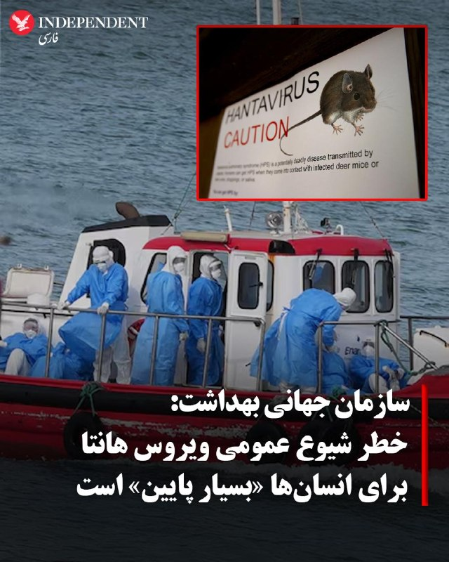

♦️سازمان جهانی بهداشت روز جمعه اعلام کرد خطر شیوع سویه مرگبار ویروس هانتا برای عموم مردم «بسیار پایین» است، چرا که این ویروس تنها از طریق «تماس بسیار نزدیک» منتقل می‌شود.
کریستین لیندمایر، سخنگوی سازمان جهانی بهداشت، در نشست خبری ژنو گفت: «این ویروس خطرناک است، اما فقط برای فردی که واقعا آلوده شده و خطر آن برای عموم مردم همچنان بسیار پایین باقی می‌ماند.»
او با اشاره به کشتی کروز «ام‌وی هوندیوس» افزود، در برخی موارد حتی افرادی که در یک کابین با مبتلایان اقامت داشته‌اند، به این بیماری خطرناک مبتلا نشده‌اند.
‌🇸🇦 Indypersian

🤖 @VahidOOnLine

## VahidOOnLine — post 238849

  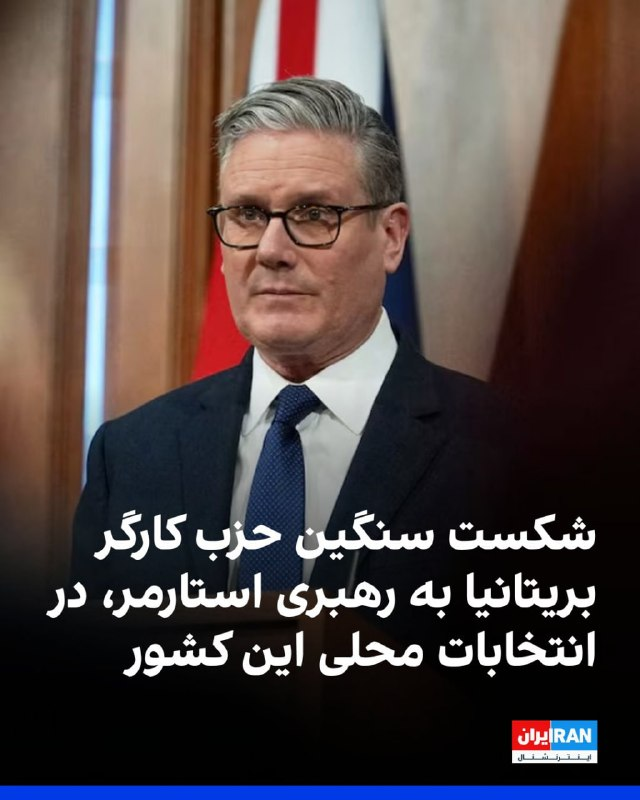

حزب کارگر بریتانیا به رهبری کی‌یر استارمر در انتخابات محلی این کشور با شکست‌های سنگین روبه‌رو شد. خبرگزاری رویترز نوشت این نتایج عمق نارضایتی از نخست‌وزیر بریتانیا را نشان داد و تنها دو سال پس از پیروزی قاطع او در انتخابات سراسری، تردیدها را درباره آینده سیاسی‌اش افزایش داد.

حزب کارگر جمعه، ۱۸ اردیبهشت در مناطقی که نتایج اولیه اعلام شد، بخش قابل توجهی از آرای خود را از دست داد؛ از جمله در پایگاه‌های سنتی‌اش در مناطق صنعتی سابق در مرکز و شمال انگلستان و همچنین در بخش‌هایی از لندن. بیشترین سود را حزب راست‌گرای «ریفورم یو کی» (اصلاح بریتانیا) به رهبری نایجل فاراژ برد. حزبی که بیش از ۳۵۰ کرسی شوراهای محلی در انگلستان را به دست آورد و اکنون می‌تواند به اپوزیسیون اصلی در اسکاتلند و ولز در برابر حزب ملی‌گرای اسکاتلند و حزب پلاید کامری تبدیل شود.

رویترز نوشت نتایج اولیه نشان داد نظام سنتی دو‌حزبی بریتانیا در حال فروپاشی و تبدیل شدن به یک دموکراسی چند‌حزبی است. تحولی که به گفته تحلیل‌گران، یکی از بزرگ‌ترین دگرگونی‌های سیاست بریتانیا در یک قرن گذشته به شمار می‌رود.
iranintl
‌🏁 🇬🇧 IranintlTV

🤖 @VahidOOnLine

## VahidOOnLine — post 238848

  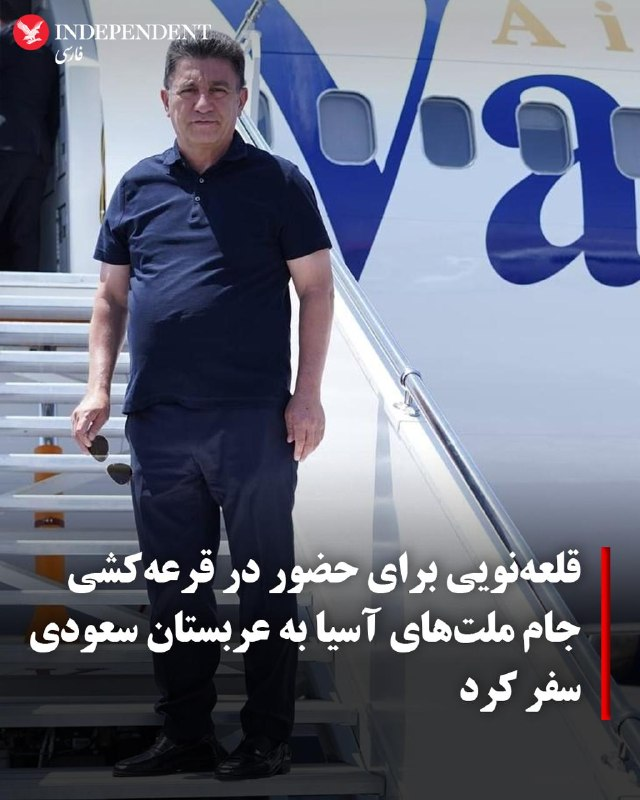

♦️امیر قلعه‌نویی، سرمربی تیم فوتبال مردان ایران، روز جمعه ۱۸ اردیبهشت برای حضور در مراسم قرعه‌کشی جام ملت‌های آسیا به عربستان سعودی سفر کرد.
مراسم قرعه‌کشی رقابت‌های جام ملت‌های آسیا شامگاه شنبه در ریاض برگزار خواهد شد. به گزارش فارس، قلعه‌نویی پس از مشخص‌شدن حریفان ایران در رقابت‌های جام ملت‌های آسیا دوشنبه به ایران بازخواهد گشت.
‌🇸🇦 Indypersian

🤖 @VahidOOnLine

## VahidOOnLine — post 238847

  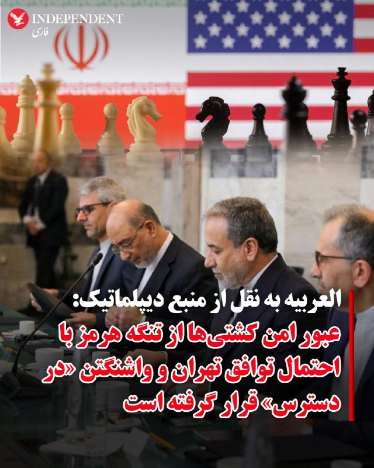

♦️شبکه خبری العربیه روز جمعه ۱۸ اردیبهشت ماه به نقل از منبعی دیپلماتیک گزارش کرد، جمهوری اسلامی ممکن است روز جمعه پاسخ خود را به پیشنهاد اخیر آمریکا برای پایان جنگ ارائه کند.
العربیه به نقل از این دیپلمات می‌نویسد، با وجود باقی بودن اختلافاتی در مورد تنگه هرمز، دستیابی به توافقی برای عبور امن کشتی‌ها از این آبراهه حیاتی اکنون «در دسترس» قرار گرفته است.
به گزارش العربیه واشنگتن خواستار دریافت پاسخ سریع تهران شده و مذاکرات بر سر وضعیت تنگه هرمز همچنان ادامه دارد.
اسماعیل بقایی، سخنگوی وزارت خارجه جمهوری اسلامی، پیش‌تر گفته بود تهران هنوز به جمع‌بندی نهایی درباره پیشنهاد آمریکا نرسیده و هنوز پاسخ رسمی به واشنگتن ارائه نکرده است. همزمان، وب‌سایت آکسیوس به نقل از یک مقام آمریکایی گزارش داد که پاسخ ایران احتمالا امروز جمعه ارسال خواهد شد.
در همین حال، محمدباقر قالیباف، رئیس مجلس جمهوری اسلامی، گزارش‌ها درباره نزدیک بودن توافق را «عملیات فریب آمریکا» توصیف کرد و مدعی شد واشنگتن در بازگشایی تنگه هرمز ناکام مانده است.
‌🇸🇦 Indypersian

🤖 @VahidOOnLine

## VahidOOnLine — post 238846

🔻ضربه سنگین به حزب کارگر در انتخابات محلی بریتانیا و پیروزی گسترده حزب اصلاح بریتانیا

حزب کارگر بریتانیا به رهبری کی‌یر استارمر در انتخابات محلی این کشور با شکست‌های سنگین روبه‌رو شد. خبرگزاری رویترز نوشت این نتایج عمق نارضایتی از نخست‌وزیر بریتانیا را نشان داد و تنها دو سال پس از پیروزی قاطع او در انتخابات سراسری، تردیدها را درباره آینده سیاسی‌اش افزایش داد.

حزب کارگر جمعه ۱۸ اردیبهشت در مناطقی که نتایج اولیه اعلام شد، بخش قابل توجهی از آرای خود را از دست داد؛ از جمله در پایگاه‌های سنتی‌اش در مناطق صنعتی سابق در مرکز و شمال انگلستان و همچنین در بخش‌هایی از لندن.

بیشترین سود را حزب راست‌گرای «ریفورم یو کی» (اصلاح بریتانیا) به رهبری نایجل فاراژ برد. حزبی که بیش از ۳۵۰ کرسی شوراهای محلی در انگلستان را به دست آورد و اکنون می‌تواند به اپوزیسیون اصلی در اسکاتلند و ولز در برابر حزب ملی‌گرای اسکاتلند و حزب پلاید کامری تبدیل شود.

رویترز نوشت نتایج اولیه نشان داد نظام سنتی دو‌حزبی بریتانیا در حال فروپاشی و تبدیل شدن به یک دموکراسی چند‌حزبی است. تحولی که به گفته تحلیل‌گران، یکی از بزرگ‌ترین دگرگونی‌های سیاست بریتانیا در یک قرن گذشته به شمار می‌رود.

جان کرتیس، از شناخته‌شده‌ترین کارشناسان افکارسنجی در بریتانیا، گفت: «اوضاع تقریبا به همان اندازه‌ای که برای حزب کارگر پیش‌بینی می‌شد بد بوده؛ یا حتی بدتر.»

فشار بر استارمر افزایش یافت

انتخابات ۱۳۶ شورای محلی در انگلستان، در کنار انتخابات پارلمان‌های محلی اسکاتلند و ولز، مهم‌ترین آزمون افکار عمومی پیش از انتخابات سراسری ۲۰۲۹ محسوب می‌شود.

برخی نمایندگان حزب کارگر هشدار داده‌اند اگر این حزب در اسکاتلند عملکرد ضعیفی داشته باشد، قدرت را در ولز از دست بدهد و نتواند بخش زیادی از حدود ۲۵۰۰ کرسی تحت دفاع خود در انگلستان را حفظ کند، فشارها بر استارمر برای کناره‌گیری یا دست‌کم تعیین جدول زمانی خروجش از قدرت افزایش خواهد یافت.

با این حال، متحدان استارمر به سرعت از او حمایت کردند و گفتند اکنون زمان مناسبی برای اقدام علیه نخست‌وزیر نیست.

جان هیلی، وزیر دفاع بریتانیا، گفت آخرین چیزی که رای‌دهندگان می‌خواهند «آشوب احتمالی ناشی از رقابت در رهبری حزب» است.

او گفت: «فکر می‌کنم استارمر هنوز می‌تواند اوضاع را تغییر دهد.»

فروپاشی نظم سنتی

دو حزب سنتی کارگر و محافظه‌کار، بخشی از آرای خود را به حزب اصلاح بریتانیا و در سوی دیگر طیف سیاسی، به حزب سبز واگذار کردند.

هم‌زمان انتظار می‌رود احزاب ملی‌گرا در اسکاتلند و ولز نیز پیروز شوند.

فاراژ، نتایج به دست آمده را «تغییری تاریخی در سیاست بریتانیا» توصیف کرد.

حزب کارگر در برخی از مهم‌ترین حوزه‌های مورد توجه، تقریبا از صحنه حذف شد.

این حزب برای نخستین بار در حدود ۵۰ سال گذشته، کنترل شورای منطقه تیم‌ساید در منچستر بزرگ را از دست داد؛ پس از آن‌که حزب اصلاح بریتانیا هر ۱۴ کرسی تحت دفاع حزب کارگر را تصاحب کرد.

در ویگان، منطقه‌ای معدنی که حزب کارگر بیش از نیم‌قرن آن را در اختیار داشت، این حزب هر ۲۰ کرسی خود را به حزب اصلاح بریتانیا واگذار کرد.

در سالفورد نیز حزب کارگر تنها سه کرسی از ۱۶ کرسی تحت دفاع خود را حفظ کرد.

ربکا لانگ بیلی، نماینده حزب کارگر از سالفورد، این نتایج را «ویران‌کننده روحیه» توصیف کرد.

سقوط آرای احزاب سنتی

اگرچه دولت‌های مستقر معمولا در انتخابات میان‌دوره‌ای با افت محبوبیت مواجه می‌شوند، اما نظرسنجی‌ها نشان می‌دهد حزب کارگر ممکن است بیشترین تعداد کرسی شوراهای محلی از زمان شکست سنگین دولت جان میجر، نخست‌وزیر محافظه‌کار بریتانیا، در سال ۱۹۹۵ را از دست بدهد. زمانی که دولت او درگیر رسوایی‌های مکرر فساد شد.

حزب اصلاح بریتانیا در نتایج اولیه ۳۳۵ کرسی شوراهای محلی در انگلستان را به دست آورد، در حالی که حزب کارگر ۲۴۷ کرسی و حزب محافظه‌کار ۱۲۷ کرسی از دست دادند.

قرار است بیشتر نتایج، از جمله انتخابات اسکاتلند و ولز، تا پایان روز جمعه اعلام شود.

تغییر مواضع و رسوایی‌ها؛ تضعیف جایگاه استارمر

استارمر، وکیل پیشین، در سال ۲۰۲۴ با یکی از بزرگ‌ترین اکثریت‌های پارلمانی تاریخ معاصر بریتانیا به قدرت رسید؛ با این وعده که پس از سال‌ها آشفتگی سیاسی، ثبات را به کشور بازگرداند.

اما دوران نخست‌وزیری او با مجموعه‌ای از عقب‌نشینی‌های سیاسی، تغییر مداوم مشاوران و انتصاب پیتر مندلسون به‌عنوان سفیر بریتانیا در آمریکا همراه شد. فردی که تنها ۹ ماه پس از آغاز کارش، به‌دلیل ارتباط با جفری اپستین، مجرم جنسی آمریکایی، برکنار شد.

استارمر تاکید کرد قصد دارد حزب کارگر را در انتخابات بعدی نیز رهبری کند.
‌🏁 🇬🇧 IranintlTV

🤖 @VahidOOnLine

## VahidOOnLine — post 238845

  <a href="telegram/content/VahidOOnLine_238845_1778236307.mp4" target="_blank">🎬 Download video</a>

نتایج اولیه انتخابات محلی در بریتانیا نشان می‌دهد حزب کارگر به رهبری کی‌یر استارمر با شکست‌های سنگینی روبه‌رو شده و حزب راست‌گرای «رفرم یو‌کی» به رهبری نایجل فاراژ در حال پیشروی در مناطق مختلف کشور است.
تا صبح جمعه، حزب کارگر بیش از ۲۵۸ کرسی شورا را از دست داده و حزب رفرم یو‌کی ۳۸۲ کرسی به دست آورده بود. برخی از بزرگ‌ترین شکست‌های حزب کارگر در مناطق موسوم به «دیوار قرمز» رخ داده؛ مناطقی صنعتی در شمال انگلستان که به‌طور سنتی از پایگاه‌های اصلی رأی این حزب به شمار می‌روند.
کی‌یر استارمر با وجود این نتایج اعلام کرد استعفا نخواهد داد و انتظار دارد در انتخابات سراسری بعدی در سال ۲۰۲۹ نیز رهبر حزب باقی بماند. او گفت: «من قرار نیست به سادگی کنار بکشم.

کنار بکشم.»
‌🏁 🇬🇧 ManotoTV

🤖 @VahidOOnLine

## VahidOOnLine — post 238844

  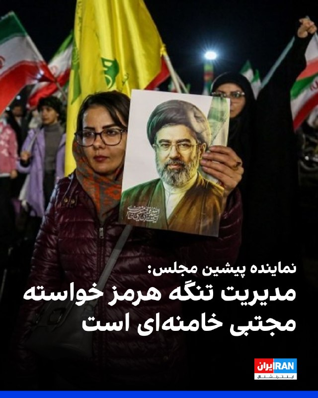

ابوالقاسم جراره، دبیرکل جبهه شریان و نماینده پیشین مجلس، گفت پیام ما به «دشمنان، همراهان دشمن و دیگر کشورها» این است که تنگه هرمز مانند گذشته باز نمی‌شود. او افزود مدیریت تنگه هرمز خواسته مجتبی خامنه‌ای است و در پیام او آمده این تنگه راهبردی با «مدیریت و روش جدیدی» اداره خواهد شد.

او از نهادهای امنیتی جمهوری اسلامی خواست «کودتاچیان» و کسانی را که به گفته او بر مذاکره با آمریکا و دیگر «دشمنان» اصرار دارند، دستگیر و به مردم معرفی کنند.
‌🏁 🇬🇧 IranintlTV

🤖 @VahidOOnLine

## VahidOOnLine — post 238843

  <a href="telegram/content/VahidOOnLine_238843_1778236309.mp4" target="_blank">🎬 Download video</a>

نتایج اولیه انتخابات محلی در بریتانیا نشان می‌دهد حزب کارگر به رهبری کی‌یر استارمر با شکست‌های سنگینی روبه‌رو شده و حزب راست‌گرای «رفرم یو‌کی» به رهبری نایجل فاراژ در حال پیشروی در مناطق مختلف کشور است.
تا صبح جمعه، حزب کارگر بیش از ۲۵۸ کرسی شورا را از دست داده و حزب رفرم یو‌کی ۳۸۲ کرسی به دست آورده بود. برخی از بزرگ‌ترین شکست‌های حزب کارگر در مناطق موسوم به «دیوار قرمز» رخ داده؛ مناطقی صنعتی در شمال انگلستان که به‌طور سنتی از پایگاه‌های اصلی رأی این حزب به شمار می‌روند.
کی‌یر استارمر با وجود این نتایج اعلام کرد استعفا نخواهد داد و انتظار دارد در انتخابات سراسری بعدی در سال ۲۰۲۹ نیز رهبر حزب باقی بماند. او گفت: «من قرار نیست به سادگی کنار بکشم.
‌🏁 🇬🇧 ManotoTV

🤖 @VahidOOnLine

## VahidOOnLine — post 238842

  

پایگاه خبری ارم‌نیوز امارات متحده عربی گزارش داد نسخه فاش‌شده تفاهم تهران و واشینگتن، بیش از آنکه یک توافق جامع باشد، به یادداشتی برای کاهش تنش‌ها شباهت دارد.

ارم‌نیوز افزود این تفاهم بر توقف درگیری‌ها، حل‌وفصل بحران تنگه هرمز و آغاز مسیری کوتاه برای مذاکرات متمرکز است و پرونده‌های هسته‌ای، موشکی و نیروهای نیابتی را به مراحل بعدی موکول می‌کند.
iranintl
‌🏁 🇬🇧 IranintlTV

🤖 @VahidOOnLine

## VahidOOnLine — post 238841

  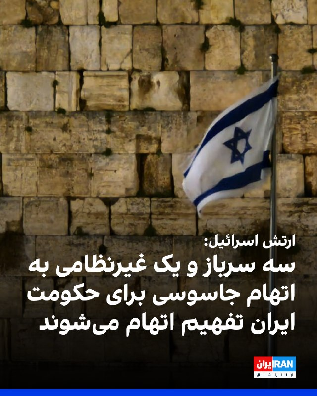

ارتش و سازمان امنیت داخلی اسرائیل اعلام کردند سه سرباز و یک شهروند غیرنظامی جمعه به اتهام جاسوسی برای جمهوری اسلامی در دادگاه تفهیم اتهام خواهند شد.

بر اساس این گزارش، این سربازان که در یک مدرسه فنی وابسته به نیروی هوایی اسرائیل آموزش می‌دیدند، از تاسیسات نظامی عکس‌برداری کرده‌اند.

مقام‌های اسرائیلی همچنین اعلام کردند این سه سرباز پیش از اعزام به خدمت و زمانی که هنوز به سن قانونی نرسیده بودند، با ماموران امنیتی جمهوری اسلامی در ارتباط بودند و ماموریت‌های جاسوسی انجام دادند.
‌🏁 🇬🇧 IranintlTV

🤖 @VahidOOnLine

## VahidOOnLine — post 238840

  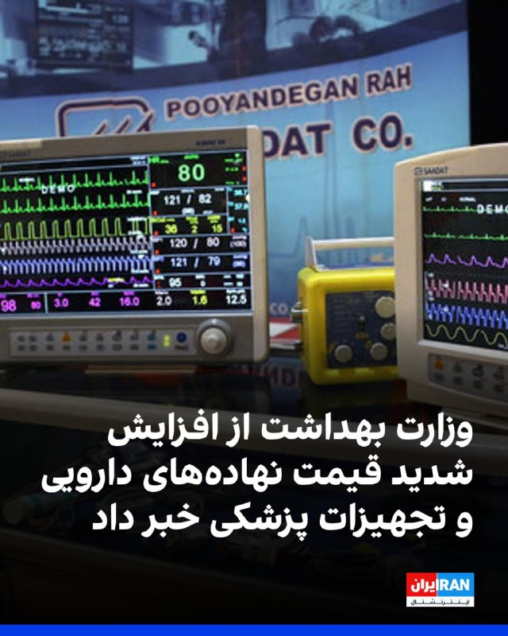

مهدی پیرصالحی، معاون وزیر بهداشت، از کمبود و افزایش شدید قیمت نهاده‌های دارویی، تجهیزات پزشکی، مقوا، فویل‌های آلومینیومی و بسته‌بندی‌های پت خبر داد.

او افزود: «برای جبران هزینه‌های تولید و حفظ پایداری زنجیره تامین دارو، افزایش قیمت‌ها ضروری ارزیابی شده است.»

پیرصالحی ادامه داد: «فعالان و تولیدکنندگان صنعت دارو با ارائه مستندات هزینه‌ای، افزایش بسیار بیشتری را برای پوشش کامل هزینه‌های تحمیل‌شده پیشنهاد کرده‌اند.»
iranintl
‌🏁 🇬🇧 IranintlTV

🤖 @VahidOOnLine

## VahidOOnLine — post 238839

  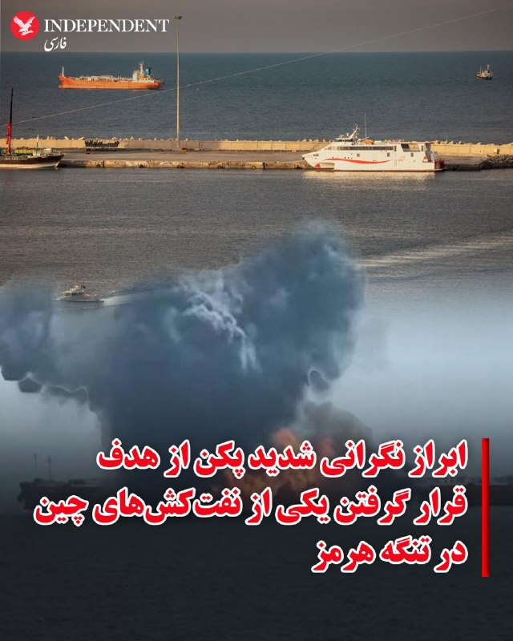

♦️چین روز جمعه تایید کرد یک نفتکش حامل خدمه چینی در تنگه هرمز هدف حمله قرار گرفته است. لین جیان، سخنگوی وزارت خارجه چین، با ابراز نگرانی عمیق درباره کشتی‌های آسیب‌دیده در جریان درگیری‌های خاورمیانه گفت چند شهروند چینی در این نفتکش حضور دارند اما تاکنون گزارشی از تلفات خدمه منتشر نشده است.
رسانه چینی «کایشین» پیش‌تر گزارش داده بود یک نفتکش متعلق به چین روز دوشنبه در نزدیکی تنگه هرمز هدف حمله قرار گرفته است.
‌🇸🇦 Indypersian

🤖 @VahidOOnLine

## VahidOOnLine — post 238838

  

ابراهیم رضایی، سخنگوی کمیسیون امنیت ملی مجلس گفت که آمریکا «با چند ناوچه و ناوشکن»، قادر به عبور از تنگه هرمز نیست.

رضایی خطاب به مقام‌های ایالات متحده افزود: «با کل نیروی دریایی‌تان هم توان عبور از تنگه هرمز را نخواهید داشت. فقط مثل یک بچه لوس، کتک می‌خورید و برمی‌گردید.» iranintl
‌🏁 🇬🇧 IranintlTV

🤖 @VahidOOnLine

## VahidOOnLine — post 238837

  <a href="telegram/content/VahidOOnLine_238837_1778236315.mp4" target="_blank">🎬 Download video</a>

ارتش و سازمان امنیت داخلی این کشور اعلام کردند یک شهروند و سه سرباز سابق به اتهام جاسوسی برای جمهوری اسلامی تحت پیگرد قرار گرفته‌اند و قرار است علیه آن‌ها در دادگاه حیفا کیفرخواست صادر شود.
بر اساس این گزارش، متهمان به دستور یک عامل اطلاعاتی جمهوری اسلامی از مکان‌هایی مانند مدرسه فنی نیروی هوایی، ایستگاه‌های قطار، مراکز خرید و دوربین‌های امنیتی تصویربرداری کرده و تصاویر و ویدیوها را ارسال کرده‌اند.
مقام‌های اسرائیلی همچنین اعلام کردند این افراد پیش از خدمت سربازی جذب شده بودند و یکی از متهمان دیگر افراد را برای همکاری با عامل اطلاعاتی جمهوری اسلامی جذب کرده است.
‌🏁 🇬🇧 ManotoTV

🤖 @VahidOOnLine

## VahidOOnLine — post 238836

  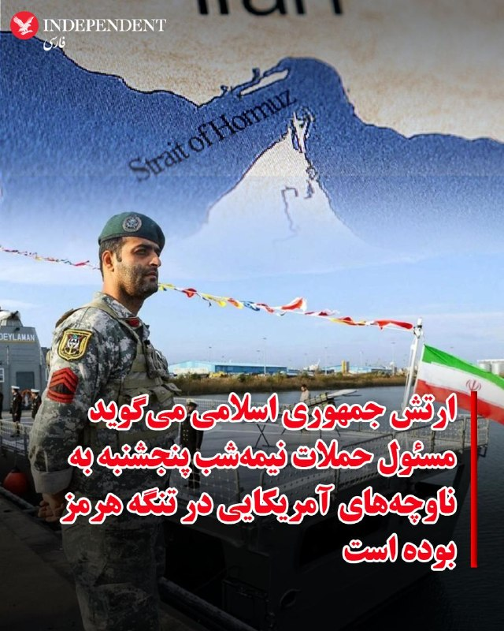

♦️نیروی دریایی ارتش جمهوری اسلامی با صدور بیانیه‌‌ای اعلام کرد حمله شامگاه پنجشنبه به ناوشکن‌های آمریکایی در زمان خروج از تنگه هرمز با موشک‌ها و پهپادهای ارتش انجام شده است.
در این بیانیه آمده است: «نیروی دریایی ارتش، با انواع موشک، پهپاد رزمی و راکت، ناوشکن‌های آمریکایی را که با نقض آتش‌بس، به نفتکش‌های ایرانی در نزدیکی تنگه هرمز و در آب‌های سرزمینی تعرض کرده بودند، مورد حمله قرار داد.»
این خبر در حالی منتشر می‌شود که به گفته مقام‌های آمریکایی و ازجمله دونالد ترامپ، رئیس جمهوری ایالات متحده، قایق‌های کوچک هم در این حمله نقش داشتند؛ تاکتیک رزمی که براساس داده‌ها، منحصر به نیروهای سپاه پاسداران است.
‌🇸🇦 Indypersian

🤖 @VahidOOnLine

## mwarmonitor — post 8675

🔸اژه‌ای ؛ ‏عناصر خائن به وطن را وفق قانون، قاطعانه محاکمه و مجازات می‌کنیم و در این راه از سرزنش سرزنشگران ابایی نداریم؛ لکن از دایره شرع و قانون و عدالت خروج نمی‌کنیم.

📝 وقتی لاشخوری در قامت قاضی‌القضات، دهان متعفن به واژه‌ی «عدالت» می‌آلاید، گویی شیطان در کلیسا موعظه‌ی طهارت می‌کند. این انگل‌های تاریخ‌مصرف‌گذشته که عمری است از خون جوانان و نان سفره‌ی محرومان ارتزاق کرده‌اند، چنان دچار ماخولیای قدرت شده‌اند که گمان می‌کنند با چند جمله‌ی مضحک درباره‌ی «دایره‌ی شرع»، می‌توانند بوی گندِ جنایاتشان را پنهان کنند. حقیقت آن است که این موجود، نه پیرو دین، که زالوصفتی است که ردایِ شریعت را کفنِ حقیقت کرده تا در سایه‌ی آن، شهوتِ قدرت و شکنجه‌گری‌اش را ارضا کند.
🔹قلمی که این جانیان با آن حکم صادر می‌کنند، نه از مرکب، که از زهرِ کینه‌ی این ضحاکانِ زمانه پر شده است. سخن گفتن از «قانون» توسط کسی که خودِ قانون را به فاحشگی کشانده، تهوع‌آورترین پرده‌ی این سیرکِ خونین است. این انگل‌هایِ عمامه‌به‌سر که در توهمِ تقدس دست‌وپا می‌زنند، باید بدانند که روزِ حسابِ زمینی نزدیک است؛ روزی که نه غرشِ هواپیماهای جنگی، بلکه خشمِ گره‌خورده‌ی دست‌هایِ پینه‌بسته‌ی مردم، این بت‌هایِ کاغذی را در لجن‌زارِ تاریخ فرو خواهد کشید. آنجاست که طعمِ واقعیِ آن «احکامی» را که سال‌ها برای دیگران پیچیده‌اند، با تمامِ وجود خواهند چشید و درخواهند یافت که عدالتِ واقعی، نه در کتاب‌هایِ خاک‌گرفته‌ی حوزوی، بلکه در کفِ خیابان و در مشت‌هایِ گره‌کرده‌ی ملتی است که دیگر چیزی برای از دست دادن ندارند.
🔹بویِ تعفنِ این انگل، حتی با دریاها آبِ توبه هم پاک نمی‌شود؛ چرا که او و هم‌کاسه‌هایش، مفاهیمِ متعالی انسانی را به لجن کشیده‌اند. این ژانر به پرده‌ی آخرش نزدیک شده و هیچ «سرزنشگر» یا منتقدی به اندازه‌ی خودِ این دژخیمان، زمینه‌ی سقوطِ مفتضحانه‌شان را فراهم نکرده است. روزی که ترازویِ واقعی برپا شود، این جانیان نه به عنوانِ قاضی، بلکه به عنوانِ منفورترین زباله‌هایِ تاریخ، در پیشگاهِ انسانیت محاکمه خواهند شد.

@mwarmonitor

## mwarmonitor — post 8674

  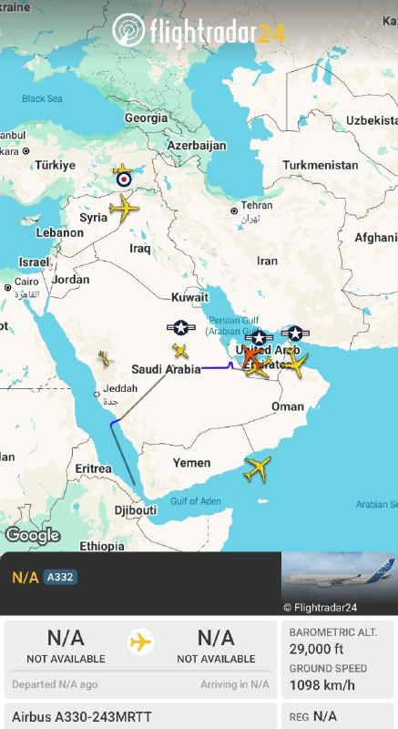

✈️🇫🇷یک فروند هواپیمای سوخت‌رسان A330 نیروی هوایی فرانسه که از جیبوتی برخاسته، در نزدیکی امارات متحده عربی در حال سوخت‌رسانی هوایی به جنگنده‌ها است.

@mwarmonitor

## mwarmonitor — post 8673

🔴در دو روز گذشته، سه نفتکشِ خالی از محموله متعلق به (NITC) پس از بازگشت به ایران از مسیر منطقه انحصاری اقتصادی (EEZ) پاکستان، موفق شدند از خط محاصره نیروی دریایی آمریکا عبور کنند.

🔴 مجموع ظرفیت حمل این سه نفتکش حدود ۵ میلیون بشکه نفت خام ایران است.

🔹تأییدشده: دو فروند از این سه نفتکش در تصاویر ماهواره‌ای مشاهده شده‌اند.
🔸تأییدنشده: نفتکش سومی شب گذشته (۷ مه ۲۰۲۶) در داده‌های AIS در سواحل عمان دیده شد؛ حدود ۲۵۴ مایل دریایی (۴۷۰ کیلومتر) در غرب خط محاصره. نام این نفتکش HASNA (9212917) است. توجه داشته باشید که هنوز تأیید بصری HASNA انجام نشده است. هویت دو نفتکش دیگر که به‌طور بصری شناسایی شده‌اند، با مشتریان ما به اشتراک گذاشته شده است.

📌بر اساس اعلام (CENTCOM) در ۶ مه ۲۰۲۶:
«پس از آن‌که خدمه نفتکش Hasna به هشدارهای مکرر توجه نکردند، نیروهای آمریکا با شلیک چند گلوله از توپ ۲۰ میلی‌متری یک جنگنده نیروی دریایی ایالات متحده که از ناو به پرواز درآمده بود، سکان (rudder) این نفتکش را از کار انداختند. Hasna دیگر به سمت ایران در حال تردد نیست.»

@mwarmonitor

## mwarmonitor — post 8671

✈️هواپیمای E-11A BACN (یک هواپیمای گره ارتباطی میدان نبرد) نیروی هوایی ایالات متحده (USAF) با شماره 24-9049 که از پایگاه هوایی شاهزاده سلطان 🇸🇦 به پرواز درآمده بود، امروز صبح برای چندین ساعت بر فراز عراق فعال بود.

🔸همچنین پهپاد MQ-4C Triton نیروی دریایی ایالات متحده (US Navy) با شماره 169804 که از پایگاه هوایی موفق السلطي 🇯🇴 عملیات می‌کند، بر فراز خلیج فارس فعال است (ترانسپوندرها خاموش هستند).

@mwarmonitor

## mwarmonitor — post 8669

🇮🇱ارتش اسرائیل ‼️ هشدار فوری به ساکنان لبنانِ حاضر در روستای العباسیة

🔸 در پی نقض توافق آتش‌بس توسط حزب‌الله، ارتش دفاعی اسرائیل ناچار است با قدرت علیه آن اقدام کند. ارتش دفاعی اسرائیل قصد آسیب رساندن به شما را ندارد.

🔸 برای حفظ امنیت شما، باید فوراً منازل خود را تخلیه کرده و حداقل تا فاصله ۱۰۰۰ متر از روستا به مناطق باز و غیرمسکونی منتقل شوید.

🔸 هر فردی که در نزدیکی نیروها، تأسیسات یا تجهیزات رزمی حزب‌الله حضور داشته باشد، جان خود را در معرض خطر قرار می‌دهد!

📍 محل هشدار: العباسیة

@mwarmonitor

## mwarmonitor — post 8668

🔰دیوید آلبرایت ؛ گزارش جدید ما: تحلیل جامع تأسیسات هسته‌ای ایران که در جریان جنگ اخیر هدف قرار گرفتند – فاز دوم جنگ ایران

مایلم گزارش جامع خود را به اشتراک بگذارم که شامل توضیحات تفصیلی و تصاویر ماهواره‌ای با وضوح بالا از تأسیسات مرتبط با برنامه هسته‌ای است که در جریان جنگ ایران ـ که از ۲۸ فوریه آغاز شد و در ۷/۸ آوریل ۲۰۲۶ با آتش‌بس پایان یافت ـ توسط اسرائیل و ایالات متحده هدف قرار گرفته و منهدم شده‌اند. این مؤسسه توانسته است دست‌کم شش سایت هسته‌ای را که مورد حمله قرار گرفته‌اند شناسایی کند. سه سایت دیگر نیز هدف حمله بوده‌اند که ممکن است به فعالیت‌های هسته‌ای مرتبط باشند، اما اطلاعات موجود برای قطعیت کافی نیست. در مجموع، شش تا نه سایت که اخیراً مورد حمله قرار گرفته‌اند، ماهیت هسته‌ای داشته‌اند.

چهار تصویر از مجموع ۳۳ تصویر این گزارش پیوست شده‌اند. توضیحات (کپشن) این تصاویر در انتهای این متن آمده است.

به نظر می‌رسد اولویت اسرائیل در فاز دوم جنگ، بیش از هر چیز، تضعیف بیشتر توانایی ایران برای ساخت خودِ سلاح هسته‌ای بوده است؛ فرایندی که «تسلیحاتی‌سازی هسته‌ای» نامیده می‌شود. برخی از این سایت‌های هدف‌گرفته‌شده مرتبط با تسلیحاتی‌سازی، برای نخستین بار به‌صورت عمومی افشا شده‌اند و ابعاد تازه‌ای از گستره فعالیت‌های مرتبط با سلاح هسته‌ای ایران را روشن می‌کنند. از میان شش تا نه سایتی که در بالا ذکر شد، چهار تا هفت سایت ـ یعنی تقریباً همه آن‌ها ـ به‌طور مستقیم به ساخت سلاح هسته‌ای مربوط بوده‌اند یا احتمالاً چنین نقشی داشته‌اند. در مجموع، پنج سایت مرتبط با تسلیحاتی‌سازی هسته‌ای در ژوئن ۲۰۲۵ هدف حمله قرار گرفتند. در هر دو فاز جنگ، در مجموع نه تا دوازده سایت درگیر در توسعه و ساخت سلاح هسته‌ای هدف قرار داده شده‌اند.

حملات فاز دوم، توانایی ایران برای ساخت سلاح هسته‌ای را بیش از پیش عقب انداخته است. گزارش‌های اخیر رسانه‌ای مبنی بر این‌که جامعه اطلاعاتی آمریکا به این نتیجه رسیده که فاز دوم جنگ، جدول زمانی ایران برای ساخت سلاح هسته‌ای را به عقب نینداخته، با میزان تخریب مشهود در تأسیسات تسلیحاتی‌سازی هسته‌ای همخوانی ندارد و نیازمند توضیح و بررسی دقیق‌تری است.

این حملات شایسته اعتبار دادن هستند، زیرا هم زمان لازم برای تکمیل یک سلاح هسته‌ای را به‌طور قابل توجهی افزایش داده‌اند و هم احتمال شکست در صورت تلاش برای ساخت آن را بالا برده‌اند. اگرچه رژیم جدید ایران به‌طور گسترده به‌عنوان رژیمی با انگیزه بیشتر برای تصمیم‌گیری جهت ساخت سلاح هسته‌ای تلقی می‌شود، اما ابزارها و توانمندی‌های آن برای انجام این کار به‌شدت تضعیف شده و اعتمادبه‌نفسش برای اقدام نیز کاهش یافته است. در حالی که پیش از جنگ ژوئن ۲۰۲۵ ایران می‌توانست با تقریباً ۱۰۰ درصد قطعیت، در کمتر از شش ماه از آستانه عبور کرده و یک سلاح هسته‌ای غیرقابل‌حمل با موشک بسازد، اکنون اگر در ماه‌های آینده چنین تلاشی کند، با مسیر بسیار دشوارتری روبه‌رو خواهد بود. احتمال موفقیت ـ چه در نه ماه، چه یک سال یا دو سال ـ از نظر فنی بسیار نامطمئن‌تر و به‌طور معناداری کمتر از ۱۰۰ درصد است. همین خطر واقعیِ شکست در ساخت موفق یک سلاح هسته‌ای می‌تواند عاملی بازدارنده در تصمیم‌گیری برای تلاش در این مسیر باشد.

📝مطالعه گزارش کامل تصویربرداری ماهواره‌ای:

1. مین‌زدایی (Min-Zadayi): سایتی که پیش‌تر ناشناخته بود و مظنون است که نقشی کلیدی در تلاش ایران برای بازسازی توانمندی‌های سلاح هسته‌ای پس از ژوئن ۲۰۲۵ داشته باشد. نمای نزدیک از دهانه بزرگ ایجادشده در دامنه تپه و دهانه‌های کوچک‌تر روی سطح بتنی مجاور که ظاهراً سقف یک بخش نیمه‌مدفون بوده است.

2. دو ساختمان تازه هدف‌گرفته‌شده: این ساختمان‌ها در نزدیکی سایت پیش‌تر هدف قرار گرفته‌شدهٔ (ژوئن ۲۰۲۵) «مُجده» وابسته به SPND قرار دارند و از طریق مسیرهای پیاده‌رو به آن متصل‌اند. هر سه در توسعه سلاح هسته‌ای نقش داشته‌اند.

3. دانشگاه مالک‌اشتر: نمای قبل و بعد از ساختمان کارگاهی بزرگ که در اثر حمله هوایی اسرائیل منهدم شده است.

4. ساختمان آزمایشگاهی ـ مهندسی: نمای قبل و بعد از تخریب ساختمان آزمایشگاهی ـ مهندسی متصل به دانشگاه مالک‌اشتر و سایت مُجده.

@mwarmonitor

## mwarmonitor — post 8667

  <a href="telegram/content/mwarmonitor_8667_1778236317.mp4" target="_blank">🎬 Download video</a>

📝 در فیلم «نورنبرگ» سکانس تکان‌دهنده‌ای وجود دارد که عمق استراتژی سیاسی را نشان می‌دهد: سیاستمداران آمریکایی برای محاکمه و اعدام سران نازی، به این نتیجه می‌رسند که تایید رئیس‌جمهور کافی نیست؛ آن‌ها برای همراه کردن افکار عمومی جهان، به تایید پاپ نیاز دارند.
وقتی پاپ در ابتدا با اعدام‌ها مخالفت می‌کند، نماینده آمریکا با یک جمله او را در بن‌بست اخلاقی قرار می‌دهد:
«ما در هر صورت نازی‌ها را نابود می‌کنیم، اما تاریخ قضاوت خواهد کرد که کلیسای کاتولیک در کنار آن‌ها ایستاد یا در برابرشان!»

🔸این فشار دیپلماتیک، پاپ را ناچار می‌کند تا برای حفظ وجهه تاریخی کلیسا، با دادگاه نورنبرگ موافقت کرده و آن را عملی برای خیرِ جهان بنامد.

🔸پیوند با واقعیت امروز
امروز نیز در میانه تنش‌ها، شاهد سفر مارکو روبیو به واتیکان و دیدار او با پاپ هستیم. این حرکت یادآور همان الگوی قدیمی است؛ تلاشی برای کسب مشروعیت اخلاقی و مذهبی در سطح بین‌الملل، پیش از برداشتن گام‌های بزرگتر در شطرنج سیاست. گویا تاریخ بار دیگر در حال تکرار است و سیاستمداران به دنبال جلب نظر «بالاترین مرجع» هستند.

@mwarmonitor

## mwarmonitor — post 8666

🇺🇸سنتکام از کشتی‌های جنگی ایالات متحده در حین عبور از تنگه هرمز محافظت می‌کند
فرماندهی مرکزی ایالات متحده (U.S. Central Command)

🔴تامپا، فلوریدا — نیروهای ایالات متحده حملات بی‌دلیل ایران را دفع کردند و در حالی که ناوشکن‌های موشک‌انداز نیروی دریایی آمریکا در تاریخ ۷ می (۱۷ اردیبهشت) در حال عبور از تنگه هرمز به سمت دریای عمان بودند، با حملات دفاع از خود به آن‌ها پاسخ دادند.
🔸نیروهای ایرانی همزمان با عبور کشتی‌های USS Truxtun (DDG 103)، USS Rafael Peralta (DDG 115) و USS Mason (DDG 87) از این آبراه بین‌المللی، چندین موشک، پهپاد و قایق‌های کوچک را به کار گرفتند. به هیچ‌یک از دارایی‌های ایالات متحده آسیبی وارد نشد.
🔸فرماندهی مرکزی ایالات متحده (سنتکام) تهدیدات ورودی را از بین برد و تأسیسات نظامی ایران که مسئول حمله به نیروهای آمریکایی بودند، از جمله سایت‌های پرتاب موشک و پهپاد، مراکز فرماندهی و کنترل، و گره‌های اطلاعاتی، نظارتی و شناسایی را هدف قرار داد.
🔸سنتکام به دنبال تشدید تنش نیست، اما همچنان مستقر و آماده محافظت از نیروهای آمریکایی باقی می‌ماند.

@mwarmonitor

## mwarmonitor — post 8665

سه ناوشکن آمریکایی تراز اول، همین حالا با موفقیت کامل و در حالی که زیر آتش بودند، از تنگه هرمز عبور کردند. هیچ آسیبی به این سه ناوشکن وارد نشد، اما آسیب شدیدی به مهاجمان ایرانی وارد گشت. آن‌ها به همراه تعداد بی‌شماری از قایق‌های کوچک که برای جایگزینی نیروی دریایی کاملاً از هم پاشیده‌شان استفاده می‌شوند، به‌طور کامل نابود شدند. این قایق‌ها سریع و بااقتدار به قعر دریا رفتند.
موشک‌هایی به سمت ناوشکن‌های ما شلیک شد که به سادگی ساقط شدند. به همین ترتیب، پهپادها آمدند و در میان زمین و آسمان خاکستر شدند. آن‌ها بسیار زیبا به درون اقیانوس سقوط کردند، درست مانند سقوط یک پروانه به سمت گورش! یک کشور معمولی اجازه می‌داد این ناوشکن‌ها عبور کنند، اما ایران یک کشور معمولی نیست. آن‌ها توسط دیوانگان رهبری می‌شوند و اگر فرصت استفاده از سلاح هسته‌ای را داشتند، بدون تردید این کار را می‌کردند — اما آن‌ها هرگز چنین فرصتی نخواهند داشت.
همان‌طور که امروز دوباره آن‌ها را از پا درآوردیم، اگر توافق‌نامه‌شان را سریعاً امضا نکنند، در آینده آن‌ها را بسیار سخت‌تر و با خشونت بسیار بیشتر در هم خواهیم کوبید! سه ناوشکن ما با خدمه فوق‌العاده‌شان، اکنون به محاصره دریایی ما که به راستی یک «دیوار فولادی» است، ملحق خواهند شد.

رئیس‌جمهور دونالد جی. ترامپ

@mwarmonitor

## mwarmonitor — post 8664

🔴یک مقام آمریکایی در گفتگو با اکسیوس تأیید کرد که روز پنجشنبه نیروهای ایالات متحده و ایران در تنگه هرمز به تبادل آتش پرداختند.

🔰گزارش رسانه‌های ایران: رسانه‌های دولتی ایران اعلام کردند که نیروی دریایی این کشور سه ناوشکن آمریکایی را هدف قرار داده است.

🔸گزارش مقام آمریکایی: این مقام مسئول اظهار داشت که ایالات متحده حملاتی را علیه اهدافی در تنگه هرمز انجام داده است.
🔸تصویر کلی (The Big Picture)
به گفته مقام آمریکایی، این درگیری به معنای ازسرگیری جنگ نیست؛ با این حال، ارتش ایران حملات ایالات متحده را نقض آتش‌بس توصیف کرده و تهدید به انتقام‌جویی نموده است. در حال حاضر میزان دقیق حملات و خسارات وارده مشخص نیست.
🔸ارتش ایران مدعی شد که ایالات متحده یک نفتکش و یک کشتی دیگر را در هنگام ورود به تنگه هدف قرار داده است.
🔸رئیس‌جمهور ترامپ روز سه‌شنبه دستور توقف عملیات نیروی دریایی برای تسهیل کشتی‌رانی را صادر کرد، اما محاصره دریایی ایالات متحده همچنان پابرجاست.
🔸به نظر می‌رسد این تقابل زمانی رخ داده که ایالات متحده قصد داشته این محاصره را اعمال کند.
🔰مروری بر رویدادهای اخیر
ایران روز دوشنبه در واکنش به عملیاتی از سوی آمریکا (که اکنون متوقف شده)، به شناورهای نیروی دریایی آمریکا، کشتی‌های تجاری و امارات متحده عربی شلیک کرده بود.
🔸عقب‌نشینی ترامپ در حالی صورت گرفت که ایالات متحده و ایران در حال مذاکره بر سر یک یادداشت تفاهم یک‌صفحه‌ای هستند؛ سندی که هدف آن پایان دادن به خصومت‌ها و زمینه‌سازی برای مذاکرات دقیق‌تر و گسترده‌تر است.

@mwarmonitor

## mwarmonitor — post 8663

🇮🇷🇺🇸ایران: واشنگتن آتش‌بس را نقض کرده است. الجزیره

@mwarmonitor

## mwarmonitor — post 8662

🇮🇷ستاد کل مشترک نیروهای مسلح ایران: ایالات متحده با همکاری برخی کشورهای منطقه، حملات هوایی علیه مناطق غیرنظامی انجام داده است — به نقل از پرس‌تی‌وی.

@mwarmonitor

## mwarmonitor — post 8661

📝آتش‌بسِ پوشالی: از بوسه تا گاز ! 📌این دو هفته آتش‌بس، چیزی جز یک «تنفسِ مصنوعی» وسطِ یک دعوای ناموسی نیست. همه‌چیز دقیقاً مثل همین ویدیو شروع می‌شود؛ با بوسه‌هایی که بوی خیانت می‌دهند و آغوش‌هایی که فقط برای پیدا کردنِ جای چاقو باز شده‌اند. درست در لحظه‌ای…

## mwarmonitor — post 8660

⚠️خبر فوری: به گفته یک مقام ارشد آمریکایی، ارتش ایالات متحده حملاتی را علیه جزیره قشم و بندرعباس ایران انجام داده است — به نقل از فاکس نیوز. @mwarmonitor

## mwarmonitor — post 8659

⚠️خبر فوری: به گفته یک مقام ارشد آمریکایی، ارتش ایالات متحده حملاتی را علیه جزیره قشم و بندرعباس ایران انجام داده است — به نقل از فاکس نیوز.

@mwarmonitor

## mwarmonitor — post 8658

📝 ترامپ احتمالاً تهش توئیت می‌زنه: «اصلاً برخورد فیزیکی در کار نبوده، فقط داشتیم با برادران ایرانی روی ناوشکن، تست مقاومت بدنه و کیفیت رنگ بدنه انجام می‌دادیم؛ عالی بود، ۱۰ از ۱۰!»
از توجه شما سپاسگزارم دونالد جی ترامپ

@mwarmonitor

## mwarmonitor — post 8657

🔴 تبادل آتش بین ایران و ایالات متحده در تنگه هرمز، به نقل از روزنامه «Israel Hayom» و با استناد به منابع اسرائیلی.

@mwarmonitor

## mwarmonitor — post 8656

🇮🇱دورون کادوش از رادیو نظامی ارتش اسرائیل می‌گوید: تا جایی که آن‌ها مطلع هستند، ایران اخیراً پس از حمله آمریکا به یک نفتکش ایرانی، به ناوشکن‌های موشکی آمریکا حمله کرده است.

اسرائیل «تحولات را به‌دقت زیر نظر دارد».

@mwarmonitor

## mwarmonitor — post 8655

  

✈️🇦🇪نیروی هوایی امارات (UAE) یک فروند C-17A از آنکارا بازگشته که در آنجا تجهیزات نظامی (احتمالاً پهپاد) را تحویل گرفته است.

✈️در همین حال، ۶ فروند تانکر سوخت‌رسان نیروی هوایی آمریکا (USAF) در آسمان امارات فعال هستند و در حال سوخت‌رسانی به جنگنده‌ها می‌باشند.

@mwarmonitor

## pm_afshaa — post 90352

🔴خبرگزاری سی بی اس:هیچ آسیب و خسارتی به کشتی های مورد هدف قرار گرفته آمریکایی وارد نشده

💧 Rainbet.com the #1 Non-KYC Crypto Casino & Sportsbook @rainbetcom

😁 @Pm_Afshaa

## pm_afshaa — post 90351

🔴نیروی دریایی سپاه در بندر خمیر هرمزگان، مجموعه کشتی‌سازی جزیره قشم، ساختمان هماهنگی سپاه در اسکله بهمن جزیره قشم، سایت موشکی سیریک و پایگاه هوایی بندرعباس از اهداف حملات شب گذشته امریکا بودن

💧 Rainbet.com the #1 Non-KYC Crypto Casino & Sportsbook @rainbetcom

😁 @Pm_Afshaa

## pm_afshaa — post 90350

ستاد فرماندهی قرارگاه خاتم: برخی کشورهای ساحلی خلیج فارس از آمریکا در تجاوز شبانه حمایت کردند و این موضوع برای ایران بی‌پاسخ نخواهد ماند

💧 Rainbet.com the #1 Non-KYC Crypto Casino & Sportsbook @rainbetcom

😁 @Pm_Afshaa

## pm_afshaa — post 90349

🔴ارتش ایالات متحده در بیانیه‌ای رسمی: ایران چندین موشک، پهپاد و قایق کوچک را به سمت کشتی‌های جنگی که از تنگه هرمز عبور می‌کردند، شلیک کرد. ارتش ایالات متحده تأسیسات نظامی ایرانی مسئول حمله به نیروهای آمریکایی را هدف قرار داد

💧 Rainbet.com the #1 Non-KYC Crypto Casino & Sportsbook @rainbetcom

😁 @Pm_Afshaa

## pm_afshaa — post 90348

  <a href="telegram/content/pm_afshaa_90348_1778236320.mp4" target="_blank">🎬 Download video</a>

مستندی از شلیک موشک از جنوب کشور به سمت ناو های امریکایی

💧 Rainbet.com the #1 Non-KYC Crypto Casino & Sportsbook @rainbetcom

😁 @Pm_Afshaa

## pm_afshaa — post 90347

🔴ترامپ: آتش‌بس برقرار است و ادامه دارد

💧 Rainbet.com the #1 Non-KYC Crypto Casino & Sportsbook @rainbetcom

😁 @Pm_Afshaa

## pm_afshaa — post 90346

🔴فاکس‌نیوز:بیش از 15 موشک به بندر نفتی فجیره امارات شلیک شده

💧 Rainbet.com the #1 Non-KYC Crypto Casino & Sportsbook @rainbetcom

😁 @Pm_Afshaa

## pm_afshaa — post 90345

تسنیم :3 تا ناوشکن آمریکایی رو زدیم

💧 Rainbet.com the #1 Non-KYC Crypto Casino & Sportsbook @rainbetcom

😁 @Pm_Afshaa

## pm_afshaa — post 90344

انفجار در دبی

## pm_afshaa — post 90343

🔴دو موشک کروز که به سمت ناوشکن آمریکایی که در سواحل ابوظبی لنگر انداخته بود شلیک شدن

💧 Rainbet.com the #1 Non-KYC Crypto Casino & Sportsbook @rainbetcom

😁 @Pm_Afshaa

## pm_afshaa — post 90342

حملات موشکی سپاه به سمت ناو های آمریکا در تنگه هرمز

💧 Rainbet.com the #1 Non-KYC Crypto Casino & Sportsbook @rainbetcom

😁 @Pm_Afshaa

## pm_afshaa — post 90341

انفجار در ابوظبی

💧 Rainbet.com the #1 Non-KYC Crypto Casino & Sportsbook @rainbetcom

😁 @Pm_Afshaa

## pm_afshaa — post 90340

محمود آباد اصفهانو زدن

## pm_afshaa — post 90339

صداسیمای گنده گوز جمهوری اسهالی:آمریکا برای خارج کردن دو فروند کشتی خود اقدام به ضربه زدن به برخی نقاط کرد اما بلافاصله با واکنش محکم نیروهای ما مواجه شد

💧 Rainbet.com the #1 Non-KYC Crypto Casino & Sportsbook @rainbetcom

😁 @Pm_Afshaa

## pm_afshaa — post 90338

امریکا اعلام کرد حملات امشب در پاسخ حمله جمهوری اسلامی به امارات بوده

💧 Rainbet.com the #1 Non-KYC Crypto Casino & Sportsbook @rainbetcom

😁 @Pm_Afshaa

## pm_afshaa — post 90337

انفجار در میناب

💧 Rainbet.com the #1 Non-KYC Crypto Casino & Sportsbook @rainbetcom

😁 @Pm_Afshaa

## pm_afshaa — post 90336

🔴سنتکام مسئولیت حمله به بندرعباس، قشم و تهران را برعهده گرفت

💧 Rainbet.com the #1 Non-KYC Crypto Casino & Sportsbook @rainbetcom

😁 @Pm_Afshaa

## pm_afshaa — post 90335

🔴فاکس نیوز تایید کرد حملات به قشم و بندرعباس توسط امریکا انجام شده 
💧 Rainbet.com the #1 Non-KYC Crypto Casino & Sportsbook @rainbetcom 
😁 @Pm_Afshaa

## pm_afshaa — post 90334

🔴فاکس نیوز تایید کرد حملات به قشم و بندرعباس توسط امریکا انجام شده

💧 Rainbet.com the #1 Non-KYC Crypto Casino & Sportsbook @rainbetcom

😁 @Pm_Afshaa

## pm_afshaa — post 90333

♨️
♨️
♨️

## iaghapour — post 2590

مومن‌نسب: فضای مجازی به هیچ وجه نباید به حالت قبل برگردد

حالا این آدم انقدر مهم نیست که دربارش صحبت کنیم ولی خواستم بگم این همون آدمیه که چندسال پیش تو صداوسیما میگفت من خطرات اینترنت رو میدونم و اطلاع دارم یک نفر با 2 گیگ اینترنت حامله شده و پدر دختره با گریه اینو برای من تعریف می‌کرد...

🆔 @iaghapour

## iaghapour — post 2589

🔻اطلاعیه مهم: معرفی فروشندگان کانفیگ

طبق نتایج نظرسنجی اخیر، قصد داریم فروشندگان قدیمی و معتبری که از قبل می‌شناسیم را یکی‌یکی برای خرید به شما معرفی کنیم.

📌 قوانین و شرایط مربوط به فروشندگان:

— عدم پذیرش فروشنده جدید: در حال حاضر شخص جدیدی معرفی نمی‌شود؛ بنابراین لطفاً در قسمت «تماس با ما» برای معرفی خود پیام ندهید. افرادی که معرفی می‌شوند، همگی پیش‌تر در کانال ما سابقه تبلیغ داشته‌اند.

— تضمین خرید شما: مبلغی از پول این افراد نزد ما به عنوان امانت می‌ماند تا در صورت بروز هرگونه مشکل، بتوانیم مطالبات شما کاربران عزیز را پیگیری کنیم.

— ضمانت بازگشت وجه: این فروشندگان موظف‌اند در صورت لزوم (بسته به شرایطی که خودشان به شما اعلام می‌کنند)، بین ۴۸ تا ۷۲ ساعت امکان عودت وجه را فراهم کنند.

— قیمت منصفانه: تمامی این افراد تعهد داده‌اند که نسبت به شرایط بازار، قیمت‌های منصفانه‌تری برای کاربران کانال ما در نظر بگیرند.

— معرفی فروشندگان صرفاً در زمینه فروش کانفیگ انجام می‌شود. هیچ‌یک از فروشندگان معرفی‌شده مجاز نیستند پس از معرفی، در کانال شخصی خود تبلیغات مربوط به "اوتباند" قرار دهند و یا به کاربران پیشنهاد خرید آن را بدهند.

⚠️ نکات مهم برای کاربران عزیز:

— انتظارات از کیفیت: کانفیگ‌ها باید بتوانند تلگرام، اینستاگرام و یوتیوب را به راحتی باز کنند. با توجه به شرایط فعلی اینترنت، داشتن سرعت‌های بسیار بالایِ گذشته کمی دور از انتظار است (هرچند ممکن است کیفیت سرویس‌ها عالی باشد)، پس لطفاً واقع‌بین باشید.

— اختلال و پشتیبانی: ممکن است در طول هفته، گاهی با اختلال مواجه شوید. پشتیبان‌ها موظف‌اند در سریع‌ترین زمان ممکن مشکل را حل کنند؛ اما لطفاً صبور باشید، حداقل یک ساعت به آن‌ها فرصت دهید و از ایجاد فشار زودهنگام به پشتیبانی کانال‌ها خودداری کنید.

— در ضمن، توجه داشته باشید که ما ذی‌نفع این کانال‌ها نیستیم و فقط به دلیل درخواست‌های زیاد شما این دوستان را معرفی می‌کنیم.

## iaghapour — post 2588

  

💢 سخنگو وزارت خارجه حذف تیک آبی خود در شبکه X را (سرکوب حقیقت) خواند.

68 روزه اینترنت مردم ایران رو قطع کردن، بعد یه تیک آبی‌شو گرفتن میگه حقیقت سرکوب شد.

🆔 @iaghapour

## iaghapour — post 2587

🔻 تسنیم: درآمد طرح اینترنت «پرو» در سال به ۹۶ هزار میلیارد تومن می‌رسه!

🔹خب با این رقم‌های نجومی و پول هنگفتی که درمیاد، معلومه که از این تبعیضی که راه انداختن حسابی راضی‌ان. وقتی محدودیت و فیلترینگ این‌قدر براشون سود داره، چرا نباید اینترنت داخلی و بسته رو بیشتر تحویل بگیرن؟

🔸این وسط یه تشکر ویژه و خسته نباشید هم باید بگیم به اون دسته از دوستانی که رفتن تو صف اینترنت پرو و این سیستم طبقاتی رو خیلی راحت پذیرفتن. از رئیس فلان اتحادیه و مدیر فلان اداره بگیر تا نماینده صنف لاستیک‌فروش‌ها و یه سری کسب‌وکارهایی که واقعاً بدون اینترنت آزاد هم کارشون لنگ نمی‌موند. تو شرایطی که ۹۹ درصد مردم هیچ دسترسیِ عادی به اینترنت آزاد ندارن، مرسی از شماها که رفتین این اینترنت رو گرفتین و با این کارتون، قشنگ به این تبعیض و نابرابری رسمیت دادین!

پ.ن: البته به این نکته هم توجه کنید که خبرگذاری داخلی اینو گفته و ممکنه دقیقا مقصودشون از این حرف هم همین باشه که بگن چقدر این طرح خوب و سودآور هستش و...

🆔 @iaghapour

## iaghapour — post 2585

⭕️ وعده بازگشت به وضعیت عادی؛ توجیه محدودیت‌ها یا امید به بهبود اینترنت؟

معاون ارتباطات دفتر رئیس‌جمهور به تازگی اعلام کرده که وضعیت فعلی اینترنت مورد تایید دولت نیست و رئیس‌جمهور، محمدرضا عارف را مامور ساماندهی این شرایط کرده است. به گفته او، این محدودیت‌های شدید و قطعی‌ها صرفا تصمیماتی از سوی شورای عالی امنیت ملی و به دلیل شرایط خاص امنیتی و جنگی بوده‌اند.

🔹 وعده روزهای بهتر: این مقام مسئول قول داده که با عبور از این شرایط ویژه، اینترنت نه تنها به حالت قبل برمی‌گردد، بلکه وضعیتی بهتر از گذشته پیدا خواهد کرد و وعده‌های انتخاباتی رئیس‌جمهور در این زمینه همچنان پیگیری می‌شوند.

🔸 دفاع از اینترنت پرو: در واکنش به انتقادات، دولت ادعا می‌کند طرح «اینترنت پرو» صرفا برای نجات کسب‌وکارها در روزهای محدودیت ایجاد شده و نباید به آن برچسب اینترنت طبقاتی زد؛ چرا که به گفته آن‌ها، در شرایط عادی اصلا نیازی به چنین طرحی نخواهد بود.

🔹 کاهش محدودیت‌های عمومی: خبر دیگر این است که قرار شده تدابیر جدیدی برای دسترسی بهتر سایر شهروندان به اینترنت اتخاذ شود تا فشار محدودیت‌های فعلی روی مردم کاهش یابد.

در حالی که دولت تلاش می‌کند قطعی‌ها و طرح‌های بحث‌برانگیزی مثل اینترنت پرو را صرفا به شرایط اضطراری گره بزند، کاربران و کسب‌وکارها همچنان منتظرند تا ببینند آیا این وعده‌ها در عمل به یک اینترنت آزاد و بدون محدودیت ختم می‌شود یا صرفا وعده‌ای برای کنترل نارضایتی‌های فعلی است.

🆔 @iaghapour

## iaghapour — post 2584

⭕️ ایده عجیب در مجلس: تاسیس «اینستاگرام دولتی» و مدیریت کامل اینترنت!

نمایندگان مجلس در تازه‌ترین نشست خود با وزیر ارتباطات، از طرح‌ها و نگاه‌های جدیدی برای کنترل بیشتر فضای مجازی پرده برداشتند. در این جلسه، پیشنهاد ایجاد یک پلتفرم کاملا دولتی مشابه اینستاگرام مطرح شد تا به زعم آن‌ها، نیاز کشور برطرف شود.

🔹 اینستاگرام دولتی: یکی از نمایندگان با اشاره به بازار سیاه و چند میلیونی فیلترشکن‌ها، رسما پیشنهاد ساخت یک سکوی دولتی شبیه اینستاگرام را برای پر کردن جای خالی این پلتفرم ارائه داده است.

🔸 رویای مدیریت اینترنت: نایب رئیس مجلس تاکید کرده که مشکل آن‌ها اصل اینترنت نیست، بلکه می‌خواهند در صحنه بین‌المللی، مدیریت اینترنت کاملا در دست خودشان باشد و این فضا را به یک جبهه تقابل تشبیه کرده است.

🔹 فرصت‌سازی از بحران: بخش قابل توجهی از صحبت‌های نمایندگان، حسرت خوردن برای از دست رفتن فرصت در شرایط ملتهب و جنگی است؛ آن‌ها معتقدند باید از این شرایط استفاده می‌کردند تا مردم و کسب‌وکارها به اجبار به سمت سکوهای داخلی کوچ کنند.

این صحبت‌ها به وضوح نشان می‌دهد که دغدغه اصلی، کاهش نارضایتی مردم از قیمت و کیفیت اینترنت نیست؛ بلکه تلاش برای بومی‌سازی اجباری، قطع ارتباط با شبکه‌های اجتماعی بین‌المللی و کشاندن کاربران به پلتفرم‌های تحت کنترل و نظارت است. / زومیت

✍🏻 پ.ن: از سوپر اپلیکیشن های ایتا و سروش و گپ و بله که از تلگرام کپی کردین مشخصه توانایی اینکار رو دارید.

🆔 @iaghapour

## iaghapour — post 2583

⭕️ مرگ خاموش اقتصاد خرد: نابودی ۴۰ درصد از کسب‌وکارهای اینستاگرامی!

قطعی‌ها و محدودیت‌های اینترنتی فقط حق دسترسی آزاد ما به شبکه‌های اجتماعی را سلب نکرده، بلکه تیشه به ریشه‌ی اقتصاد خرد و معیشت مردم زده است. طبق اعلام پشوتن پورپزشک، عضو هیئت‌مدیره اتحادیه کسب‌وکارهای مجازی، فیلترینگ و اختلالات باعث نابودی بخش عظیمی از مشاغل آنلاین شده است.

🔹 فاجعه‌ی آماری: نزدیک به ۴۰ درصد از کسب‌وکارهای اینستاگرامی برای همیشه از بین رفته‌اند؛ این یعنی مرگ مستقیم بیش از ۴۰۰ هزار شغل!

🔸 دومینوی ویرانی: وقتی شوکی مثل محدودیت اینترنت وارد می‌شود، ابتدا کسب‌وکارهای کوچک و آسیب‌پذیر می‌میرند، اما این نابودی با کمی تاخیر گریبان شرکت‌های بزرگ اقتصادی را هم خواهد گرفت.

🔹 زنجیره‌ی به هم پیوسته: کسب‌وکارهای بزرگ در تولید، تامین و توزیع به شدت به همین کسب‌وکارهای خرد وابسته‌اند. توهم مصونیت برای شرکت‌های بزرگ، در نهایت منجر به فروپاشی خود آن‌ها می‌شود. منبع: زومیت

🆔 @iaghapour

## iaghapour — post 2581

اسم این زندگــــــی نبود
یک مبارزه تمام عیار بود...

#جوانی #زندگی #جنگ #اینترنت

## iaghapour — post 2580

⭕️ حل مشکل دانلود از ریلیز گیت‌هاب با LatestReleaseMirror

اگر در دانلود فایل‌ها از بخش ریلیزهای (Releases) گیت‌هاب به دلیل محدودیت‌های اینترنت مشکل دارید، این اسکریپت کاربردی دقیقاً برای شما ساخته شده است!

ابزار LatestReleaseMirror به صورت خودکار فایل‌های آخرین آپدیتِ ریپازیتوری‌های دلخواه شما را دریافت کرده و آن‌ها را به عنوان فایل‌های عادی در ساختار پوشه‌های گیت‌هاب ذخیره می‌کند؛ در نتیجه می‌توانید آن‌ها را به راحتی و حتی با اینترنت داخلی دانلود کنید.

🔹 دریافت و آپدیت خودکار آخرین نسخه با استفاده از GitHub Actions.
🔸 امکان فیلتر کردن فایل‌های مورد نیاز (مثلاً فقط نسخه‌های ویندوز یا اندروید)
🔹 دسته‌بندی تمیز فایل‌های خروجی در مسیرهای مشخص.

🔗 لینک ریپازیتوری و راهنمای استفاده

🆔 @iaghapour

## iaghapour — post 2579

ركورد جديد سرعت اينترنت ژاپن:

با سرعت 1.02 پتابيت بر ثانيه، كل نتفليكس را در 1 ثانيه دانلود مى‌كند.

✍ ما هم اینجا باید با DNStt وصل بشیم تا بزور بتونیم فقط این خبر رو بخونیم...

🆔 @iaghapour

## iaghapour — post 2578

⭕️ اسکریپت بهینه شده XHTTP Relay ECO برای Vercel Pro

🔹 نسخه ECO طوری تیون شده که علاوه بر امنیت سفت‌وسخت v1.3، کم‌هزینه‌ترین رفتار ممکن روی Vercel Pro رو داشته باشه؛ یعنی با کنترل هوشمند Timeout، Inflight، Throttle و Logها، مصرف منابع و هزینه نهایی تا جای ممکن پایین نگه داشته میشه.

🔸فقط با GET، HEAD و POST کار می‌کنه تا امنیت بالاتر بره.
🔹 احراز هویت فقط از طریق هدر x-relay-key انجام میشه
🔸هدرهای اضافی پلتفرم و hop-by-hop رو بی‌رحمانه فیلتر می‌کنیم.
🔹روی آپلود و دانلود محدودیت سرعت (Throttling) واقعی گذاشتیم.
🔸بردیمش روی Node runtime با لیمیت ۱۲۸ مگابایت رم و مدیریت کانکشن‌های همزمان.

🔗 اطلاعات بیشتر در گیت‌هاب پروژه

🆔 @iaghapour

## iaghapour — post 2577

⭕️ ورژن جدید کلاینت اندروید GooseRelayVPN منتشر شد

کلاینت اندروید GooseRelayVPN که هسته GooseRelay را از طریق Go mobile اجرا می‌کند و رابط کاربری کامل برای مدیریت VPN، پروفایل‌ها، لاگ‌ها و تنظیمات ارائه می‌دهد. این اپ یک SOCKS5 محلی روی اندروید ایجاد می‌کند و ترافیک TCP را از معماری GooseRelay عبور می‌دهد.

🔹هسته پروژه به ورژن 1.5.0 آپدیت شد.
🔸قابلیت fake dns اضافه شد.
🔹باگ ها در این نسخه برطرف شدن.

🔗 آدرس گیت‌هاب پروژه

🆔 @iaghapour

## iaghapour — post 2576

  

⭕️ آموزش ساخت فیلترشکن رایگان و شخصی به 2 روش با نت ملی

🔹با استفاده از دو ابزار قدرتمند MHRV و Nova-Proxy، دیگه نیازی به خرید کانفیگ‌ها و سرورهای گرون‌قیمت ندارید. تو این آموزش قدم‌به‌قدم به ۲ روش مختلف پیش میریم تا بتونید یه اتصال پایدار و بدون قطعی داشته باشید. حتماً تا آخر ویدیو همراه من باشید.

🔗 لینک ویدیو در یوتیوب

🔗 دانلود ویدیو با لینک مستقیم

🔹 دانلود کلاینت ویندوز

🔸 دانلود کلاینت اندروید

#آموزش #فیلترشکن #mhrv #novaproxy #رایگان
برای دور زدن فیلترینگ و آموزش تکنولوژی و هوش مصنوعی ما رو دنبال کنید 💚
🆔@iaghapour

## iaghapour — post 2575

  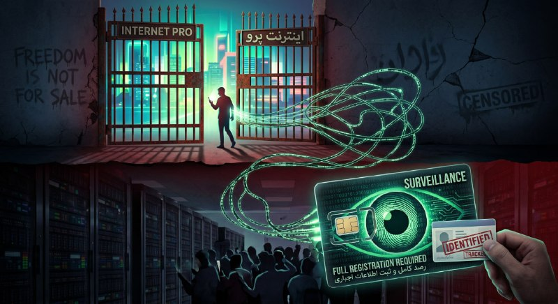

⭕️ پشت‌پرده‌ی «اینترنت پرو»؛ امتیاز ویژه یا تله‌ی نظارتی؟

این روزها سیم‌کارت‌های بدون فیلتر با نام «اینترنت پرو» در ازای دریافت هزینه و ثبت کامل مشخصات هویتی به فروش می‌رسند. اما هدف اصلی این طرح، دلسوزی برای نیاز اینترنتی اقشار مختلف نیست.

هدف اصلی و پنهان این ماجرا، چیزی جز «تشخیص هویت دقیق و رصد لحظه‌ایِ کاربر» نیست. 👁‍🗨

وقتی اینترنت آزاد را مستقیماً با نام و کد ملی خودتان دریافت می‌کنید دقیقاً چه اتفاقی می‌افتد؟

🔹 پایان گمنامی: تمام سایت‌هایی که سر می‌زنید و محتوایی که می‌بینید، مستقیماً و شفاف روی نام خودتان ثبت و مانیتور می‌شود.

🔸 تزریق خودسانسوری: وقتی می‌دانید هر کلیک شما رصد می‌شود، ناخودآگاه وارد یک «زندان شیشه‌ای» می‌شوید که خودتان هزینه‌اش را داده‌اید!

🔹 تجارت با حقوق اولیه: حق بدیهی دسترسی به اینترنت آزاد را مسدود کرده‌اند و حالا همان را به قیمت نقض حریم خصوصی، به عنوان یک «آپشن ویژه» به خودمان می‌فروشند.

«اینترنت پرو» یک امکان رفاهی نیست؛ ابزاری برای کنترل نقطه‌ای و عادی‌سازیِ اینترنت طبقاتی است. بهای اصلی این سیم‌کارت‌ها پول نیست؛ حریم خصوصی ماست.

🆔 @iaghapour

## iaghapour — post 2573

  

⭕️ کلاینت اندروید GooseRelayVPN

🔹کلاینت اندروید GooseRelayVPN که هسته GooseRelay را از طریق Go mobile اجرا می‌کند و رابط کاربری کامل برای مدیریت VPN، پروفایل‌ها، لاگ‌ها و تنظیمات ارائه می‌دهد. این اپ یک SOCKS5 محلی روی اندروید ایجاد می‌کند و ترافیک TCP را از معماری GooseRelay عبور می‌دهد.

🔹پیکربندی مبتنی بر پروفایل
🔸وضعیت و تله‌متری در صفحه Home
🔹تب Logs برای عیب‌یابی Android/Core
🔸قابلیت Split Tunneling و Internet Sharing

🔗 آدرس گیت‌هاب پروژه

🆔 @iaghapour

## iaghapour — post 2572

💢 رئیس اتحادیه کسب‌وکارهای مجازی:
به شرکت‌ها زنگ می‌زنند و پیشنهاد فروش اینترنت بدون فیلتر(پرو) برای کارمندانشان را می‌دهند.

⁉️ اگر موضوع واقعاً امنیت ملی است، چطور با پرداخت پول، امنیت تأمین می‌شود؟!

منبع: کانال خبری

🆔 @iaghapour

## iaghapour — post 2571

## iaghapour — post 2570

✍🏻 دوستان، همان‌طور که خودتون در جریان هستید، من در این چند ماه حتی یک مورد تبلیغ فیلترشکن، اوتباند و موارد مشابه قرار ندادم. الان هم واقعاً تمایلی به این کار ندارم، چون شرایط اصلاً به‌گونه‌ای نیست که بشه کسی را معرفی کرد.

با این حال، در همین چند ماه پیام‌های بسیار زیادی داشتیم که درخواست می‌کردند حتماً یک شخص معتبر را معرفی کنیم؛ چرا که خیلی‌ها از کلاهبرداری‌های پیاپی خسته شدن و ارسال این دست پیام‌ها تا به همین امروز هم ادامه داره.

به همین دلیل، اگه خودتون موافق باشید، افرادی رو که از قبل با ما همکاری می‌کردند و تا حدودی قابل‌اطمینان هستند، یکی‌یکی به شما معرفی کنیم. در این مورد ذکر چند نکته ضروری هستش:

🔸عدم تضمین صددرصدی: ناگفته نماند ما واقعاً نمیتونیم کسی را با اطمینان ۱۰۰ درصدی تأیید کنیم، اما افرادی که معرفی میشن همگی سابقه همکاری با ما را دارن.

🔹عدم پذیرش تبلیغ جدید و اوتباند: تا زمانی که شرایط استیبل و پایدار نشود، تبلیغ هیچ فرد جدیدی را قبول نمی‌کنیم. در ضمن، تبلیغ فروش اوتباند هم به‌هیچ‌وجه پذیرفته نمی‌شود.

🔸قیمت‌های منصفانه: تمام سعی ما بر اینه افرادی را معرفی کنیم که در این زمینه منصف باشند و قیمت‌های بالایی ارائه ندهند. ولی خب، طبیعتاً نمیشه انتظار قیمت‌های قدیمی را داشت؛ چون همان‌طور که خودتون میدونید در حال حاضر هیچ‌کس با اون قیمت‌های قبلی فروشی نداره.

اگه تمایل دارید، لطفاً در نظرسنجی زیر شرکت کنید. البته نظر شخصی خودم اینه که اگه در حال حاضر واقعاً مشکل خاصی ندارید، در نظرسنجی همان گزینه (خیر) را انتخاب کنید.

## iaghapour — post 2569

⚠️ هشدار مهم درباره اسکریپت VPN Over GitHub

▪️لطفاً از این ابزار به عنوان فیلترشکن استفاده نکنید!

🚫 بن شدن اکانت: تبدیل گیت‌هاب به تونل ترافیک، خلاف قوانین این سایت است و خیلی زود باعث مسدود شدن حساب شما می‌شود.

🐢 سرعت بسیار پایین: برای هر ارتباط به یک بار push و pull نیاز دارد که آن را عملاً غیرقابل استفاده می‌کند.

🔻خطر برای برنامه‌نویس‌ها: گیت‌هاب یک سایت حیاتی برای توسعه‌دهندگان است؛ سوءاستفاده از آن ممکن است باعث حساسیت شده و دسترسی به این پلتفرم مهم را دوباره از کار بیندازد. (خارج شدن از لیست سفید و...)

🆔@iaghapour

## iaghapour — post 2567

ای بابا روش Vercel چرا بسته شد؟ هنوز آموزش نداده بودم که.😁

سازمان فیلترینگ زرنگ شده ها. فک کنم خودشون رو آپدیت کردن دیگه به کانال من نگاه نمیکنن :)

## DEJradio — post 4517

  <a href="telegram/content/DEJradio_4517_1778236324.mp4" target="_blank">🎬 Download video</a>

🚨
🔸 نمایش استیصال - سیرک مزدوران

*غنچه استوارنیا

#سیرک #سرکوبگران
@DEJradio

## DEJradio — post 4516

  <a href="telegram/content/DEJradio_4516_1778236326.webm" target="_blank">🎬 Download video</a>

🚨📢 نماینده آمریکا در سازمان ملل: جمهوری اسلامی به یک کشتی چینی حمله کرده است مایک والتز، سفیر ایالات متحده در سازمان ملل، تأیید کرد یک کشتی متعلق به چین روز دوشنبه در جریان حملات جمهوری اسلامی در تنگ هرمز هدف قرار گرفته است. رسانه‌های چینی گزارش دادند این…

## DEJradio — post 4515

  <a href="telegram/content/DEJradio_4515_1778236327.webm" target="_blank">🎬 Download video</a>

🚨📢 منابع دژ گزارش دادند که ماموران امنیتی، پس از دستیابی به پرونده شماری از دانش‌آموزان دبیرستان دخترانه «شرافت» در تهران منطقه ۱۳، به صورت تلفنی آنها را تهدید جنسی کرده‌اند.
خانواده این دانش‌آموزان نگران از وضعیت فرزندانشان با پلیس تماس گرفتند اما پیگیری آنها به نتیجه نرسیده است.

آنها نمی‌دانند چرا دختران آنها مورد تهدید قرار گرفته‌اند، اما متوجه شدند مسئولان مدرسه پرونده دانش‌آموزان را در اختیار ماموران امنیتی قرار دادند.

این افراد با حرف‌های زشت و رکیک دختران را خطاب قرار دادند و گفته‌اند ترددشان را زیر نظر دارند: "حواسمون بهتون هست."

#دبیرستان_شرافت #تهران
@DEJradio

## DEJradio — post 4514

  <a href="telegram/content/DEJradio_4514_1778236328.webm" target="_blank">🎬 Download video</a>

🔺📢 خبرگزاری تسنیم بامداد جمعه ۱۸ اردیبهشت ۱۴۰۵ وابسته به سـ.ـپاه پاسداران ادعا کرد سه ناوشکن آمریکایی در نزدیکی تنگه هرمز هدف حمله نیروی دریایی قرار گرفت. ادعا شد: «ناوشکن‌های آمریکا به سمت دریای عمان در حال فرار هستند.»
گفته شد حمله به ناوشکن‌های آمریکایی از طریق موشک و پ‍هپادهای انتحاری صورت گرفته است.
ساعاتی پیش از مراکزی در قشم و بندرعباس توسط آمریکا [یا به گفته برخی منابع امارات] هدف قرار گرفت.

#تنگه_هرمز
@DEJradio

## DEJradio — post 4513

  <a href="telegram/content/DEJradio_4513_1778236328.mp4" target="_blank">🎬 Download video</a>

🔺🎥 پنجشنبه شب ۱۷ اردیبهشت ۱۴۰۵ با پرواز پهپادها در آسمان تهران توپ‌های پدافند فعال شد.

#پدافند #تهران
@DEJradio

## DEJradio — post 4512

  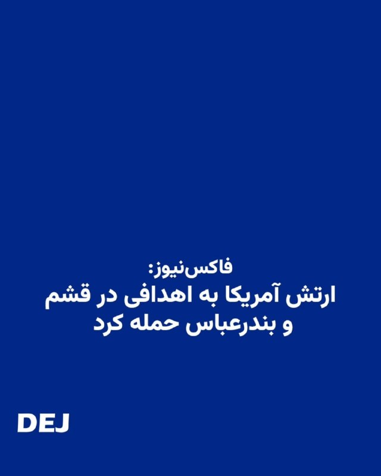

🛩️
🔥 فاکس‌نیوز گزارش داد ارتش آمریکا اهدافی را در بندرعباس و جزیره قشم هدف حمله قرار داده است. منابع داخلی گزارش داده بودند امارات به این مراکز حمله کرده است.
همزمان رسانه‌های ایران از فعال شدن پدافند هوایی و وقوع درگیری در اطراف قشم و بندرعباس خبر می‌دهند.
این تحولات در شرایطی رخ می‌دهد که تنش‌ها در خلیج فارس و اطراف تنگه هرمز وارد مرحله‌ای تازه و پرتنش شده است.

#تنگه_هرمز #جمهوری_اسلامی
@DEJradio

## DEJradio — post 4511

  <a href="telegram/content/DEJradio_4511_1778236330.webm" target="_blank">🎬 Download video</a>

🚨📢 نماینده آمریکا در سازمان ملل: جمهوری اسلامی به یک کشتی چینی حمله کرده است

مایک والتز، سفیر ایالات متحده در سازمان ملل، تأیید کرد یک کشتی متعلق به چین روز دوشنبه در جریان حملات جمهوری اسلامی در تنگ هرمز هدف قرار گرفته است.
رسانه‌های چینی گزارش دادند این نخستین بار از زمان آغاز درگیری‌های اخیر در منطقه است که یک شناور چینی در این تنش‌ها آسیب می‌بیند.

#تنگه_هرمز #جمهوری_اسلامی
@DEJradio

## DEJradio — post 4510

  <a href="telegram/content/DEJradio_4510_1778236331.webm" target="_blank">🎬 Download video</a>

🤡
🔺 خضریان عضو کمیسیون امنیت ملی مجلس:
نیروهای مسلح ما برای هیچ غنیمتی، تنگه اُحد جمهوری اسلامی را رها نخواهند کرد

علی خضریان عضو کمیسیون امنیت ملی مجلس شورای اسلامی با اشاره به جلسه‌ای که با عباس عراقچی داشته است گفت، «من به شما اطمینان می‌دهم نیروهای مسلح ما برای هیچ غنیمتی، تنگه احد جمهوری اسلامی را رها نخواهند کرد. فرمان نائب امام زمان مبنی بر حفظ این تنگه که حق ماست، رها نخواهد شد.»

#تنگه_هرمز #نیروهای_مسلح
@DEJradio

## DEJradio — post 4509

  <a href="telegram/content/DEJradio_4509_1778236332.webm" target="_blank">🎬 Download video</a>

🔺📢 منابع میدانی:
هیچکدام از موشک‌ها و پهپادهای نیروهای مسلح جمهوری اسلامی به ناوشکن‌های آمریکا اصابت نکرده است

ناوشکن‌های آمریکایی که برای اسکورت کشتی‌های تجاری بعد از عبور از تنگه هرمز وارد خلیج فارس شده بودند، پنجشنبه ۱۷ اردیبهشت از تنگه عبور کردند و وارد دریای عمان شدند. در هر دو بار تعدادی موشک کروز و بالستیک ضد کشتی و پهپاد انتحاری به سمت آنها شلیک شد اما هیچ کدام از آنها به ناوشکن‌ها اصابت نکرد و عملاً این حملات بی‌نتیجه بود زیرا سیستم‌های پدافنی این ناوشکن‌ها در بالاترین سطح با پرتابه‌ها مقابله کرد.

برخی منابع غیررسمی داخلی با انتقاد از عملکرد نیروهای مسلح جمهوری اسلامی گفته‌اند این وضعیت نه تنها موجب افزایش اعتماد به نفس آمریکایی‌ها و کشتی‌های تجاری برای عبور از تنگه شد بلکه آنها را برای ورود به جزایر و حتی سواحل جنوبی ایران راسخ‌تر می‌کند.

سخنگوی قرارگاه خاتم‌الانبیا ادعا کرده بود نیروهای مسلح شناورهای نظامی آمریکا در شرق تنگه هرمز را «هدف» قرار دادند. این در حالیست که آمریکا حداقل دو نفتکش جمهوری اسلامی را که قصد داشتند از محاصره دریایی عبور کنند هدف قرار دادند.

#تنگه_هرمز #حملات_هدفمند
@DEJradio

## DEJradio — post 4508

  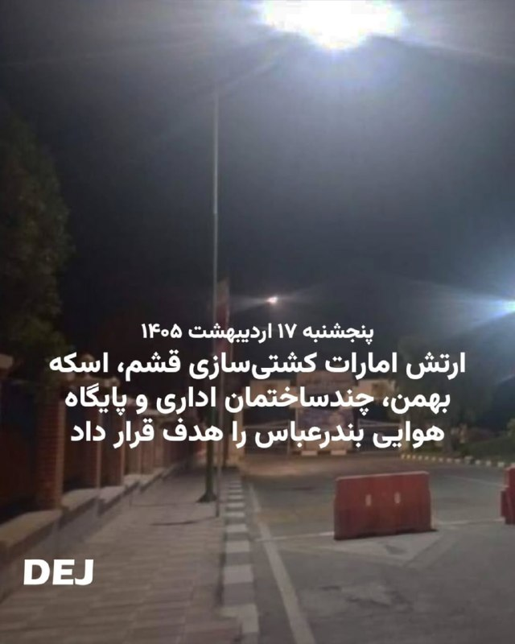

🛩️
🔥 بر اساس گزارش‌ رسانه‌های داخل ایران، پنجشنبه شب ۱۷ اردیبهشت ۱۴۰۵ ارتش امارات کشتی‌سازی قشم، اسکله بهمن، چندساختمان اداری و پایگاه هوایی بندرعباس را هدف قرار داد.

#قشم #حملات_هدفمند
@DEJradio

## DEJradio — post 4507

  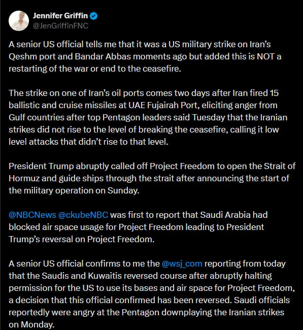

📱 
⭕️ جنیفر گریفین، خبرنگار فاکس نیوز، به نقل از یک مقام ارشد آمریکایی نوشت حمله‌ای که لحظاتی پیش به بندر قشم و بندرعباس انجام شد، یک عملیات نظامی آمریکا بوده است. این مقام تأکید کرده که این حمله به معنای آغاز دوبارۀ جنگ یا پایان آتش‌بس نیست.
به گفتۀ این مقام آمریکایی، حمله به یکی از بنادر نفتی ایران دو روز پس از آن انجام شد که جمهوری اسلامی ۱۵ موشک بالستیک و کروز به سمت بندر فجیره در امارات شلیک کرد؛ حمله‌ای که خشم کشورهای حاشیۀ خلیج فارس را برانگیخت. این در حالی است که مقام‌های پنتاگون روز سه‌شنبه گفته بودند حملات جمهوری اسلامی در حدی نبوده که نقض آتش‌بس تلقی شود و آن را حملاتی «سطح پایین» توصیف کرده بودند.
جنیفر گریفین همچنین نوشت دونالد ترامپ پس از اعلام آغاز عملیات نظامی «پروژۀ آزادی» برای بازگشایی تنگۀ هرمز و هدایت کشتی‌ها، به‌طور ناگهانی این عملیات را متوقف کرد.
او به نقل از یک مقام ارشد آمریکایی افزود عربستان سعودی و کویت نیز به‌طور ناگهانی مجوز استفاده آمریکا از پایگاه‌ها و حریم هوایی خود برای اجرای «پروژۀ آزادی» را متوقف کرده بودند؛ تصمیمی که به گفتۀ این مقام، بعداً لغو شد. بر اساس این گزارش، مقام‌های سعودی از کم‌اهمیت جلوه دادن حملات جمهوری اسلامی از سوی پنتاگون خشمگین شده بودند.

#پروژه_آزادی #ترامپ #تنگه_هرمز
@DEJradio

## DEJradio — post 4506

  <a href="telegram/content/DEJradio_4506_1778236334.webm" target="_blank">🎬 Download video</a>

🧨
🚨 خبرگزاری‌های داخلی از انفجارهای تازه در سیریک خبر می‎دهند.

#انفجار #سیریک
@DEJradio

## DEJradio — post 4505

  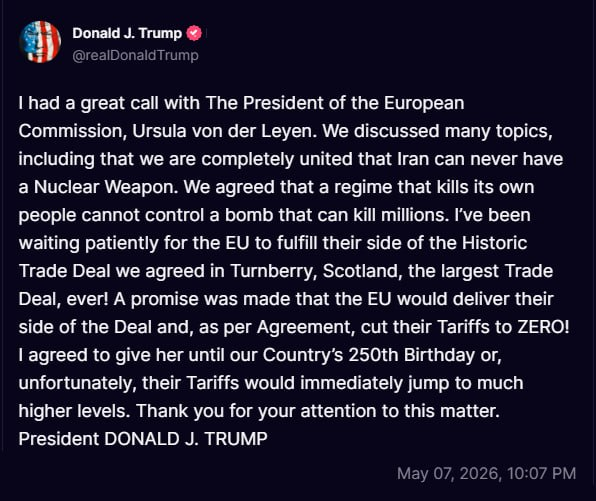

🇺🇸 
⭕️ دونالد ترامپ، رئیس جمهوری ایالات متحده، اعلام کرد در گفت‌وگویی تلفنی با اورزولا فون در لاین، رئیس کمیسیون اروپا، درباره موضوعات مختلف از جمله جمهوری اسلامی و روابط تجاری آمریکا و اتحادیه اروپا رایزنی کرده است.
ترامپ در پیامی در شبکه اجتماعی تروث سوشال تأکید کرد واشینگتن و اتحادیه اروپا در این موضوع هم‌نظر هستند که جمهوری اسلامی هرگز نباید به سلاح هسته‌ای دست پیدا کند. او همچنین نوشت رژیمی که مردم خود را می‌کشد، نباید به سلاحی دسترسی داشته باشد که توان نابودی میلیون‌ها نفر را دارد.
رئیس جمهوری آمریکا در بخش دیگری از پیام خود، از اتحادیه اروپا خواست به تعهداتش در توافق تجاری «تاریخی» دو طرف که در ترنبری اسکاتلند مورد توافق قرار گرفته بود، عمل کند. ترامپ مدعی شد اتحادیه اروپا متعهد شده بود تعرفه‌های خود را به صفر کاهش دهد.
او هشدار داد در صورتی که اتحادیه اروپا تا دویست‌وپنجاهمین سالگرد استقلال آمریکا به تعهدات خود عمل نکند، واشینگتن تعرفه‌های جدید و بسیار بالاتری علیه کالاهای اروپایی اعمال خواهد کرد.

#ترامپ #اروپا
@DEJradio

## DEJradio — post 4504

  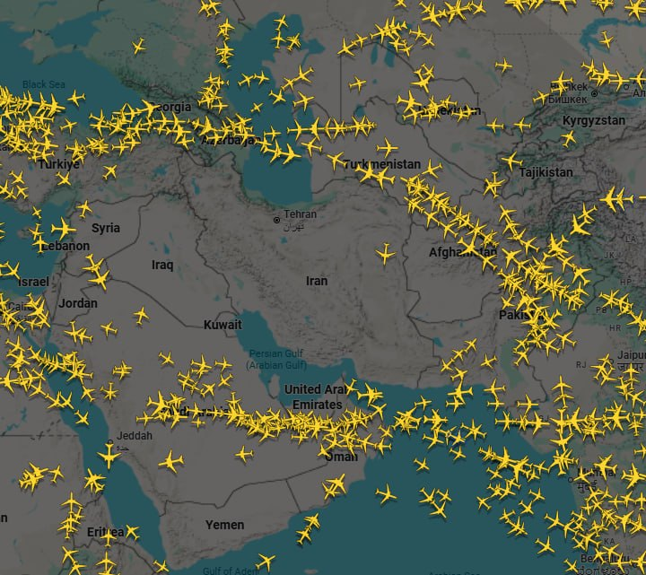

📡
🚨 آخرین شرایط ترافیک هوایی بر فراز منطقه

#ترافیک_هوایی #خاورمیانه
@DEJradio

## DEJradio — post 4503

  <a href="telegram/content/DEJradio_4503_1778236336.webm" target="_blank">🎬 Download video</a>

🚨
🔺 سنتکام: مواضع نظامی و تاسیسات اطلاعاتی و نظامی جمهوری اسلامی هدف قرار گرفتند.

در پی درگیری شامگاه پنج‌شنبه در منطقع تنگه هرمز، سنتکام اعلام کرد نیروهای آمریکایی شامگاه هفتم مه، حملات جمهوری اسلامی علیه ناوشکن‌های نیروی دریایی آمریکا در حال عبور از تنگۀ هرمز به سمت دریای عمان را رهگیری کرده و در پاسخ، حملات دفاعی انجام داده‌اند.
بر اساس بیانیۀ فرماندهی مرکزی ایالات متحده، نیروهای جمهوری اسلامی چندین موشک، پهپاد و شناور تندرو را به سمت ناوشکن‌های «یواس‌اس تراکستون»، «یواس‌اس رافائل پرالتا» و «یواس‌اس میسن» شلیک کردند، اما هیچ‌یک از شناورهای آمریکایی هدف قرار نگرفتند.
سنتکام اعلام کرد در پاسخ به این حملات، مواضع نظامی جمهوری اسلامی شامل پایگاه‌های پرتاب موشک و پهپاد، مراکز فرماندهی و کنترل، و تأسیسات اطلاعاتی و شناسایی را هدف قرار داده است.

#سنتکام #تنگه_هرمز
@DEJradio

## DEJradio — post 4502

  <a href="telegram/content/DEJradio_4502_1778236337.webm" target="_blank">🎬 Download video</a>

🔺
⭕️ شبکۀ فاکس نیوز به نقل از یک مقام آمریکایی گزارش داد حملات ایالات متحده در واکنش به شلیک ۱۵ موشک بالستیک، موشک کروز و پهپاد از سوی جمهوری اسلامی به سمت بندر فجیره در امارات انجام شده است.

#تنگه_هرمز #فجیره
@DEJradio

## DEJradio — post 4501

⭕️
💣 خبرگزاری های رسمی داخلی از شنیده شدن صدای انفجار در میناب خبر میدهند. #میناب #انفجار @DEJradio

## DEJradio — post 4500

🔸
⭕️ سخنگوی ستاد کل قرارگاه خاتم‌الانبیا، ایالات متحده را به نقض آتش‌بس متهم کرد. او مدعی شد نیروهای آمریکایی یک نفتکش ایرانی را در نزدیکی جاسک و یک کشتی دیگر را در سواحل فجیره هدف قرار داده‌اند.
این مقام نظامی جمهوری اسلامی همچنین ادعا کرد هم‌زمان حملات هوایی به مناطقی در بندر خمیر، سیرک و جزیرۀ قشم با هماهنگی چند کشور منطقه انجام شده است.
به ادعای سخنگوی قرارگاه خاتم‌الانبیا، در واکنش به این حملات، نیروهای مسلح جمهوری اسلامی شناورهای نظامی آمریکا را در شرق تنگۀ هرمز و جنوب بندر چابهار هدف قرار داده‌اند.

#تنگه_هرمز #جنگ
@DEJradio

## DEJradio — post 4499

💣 خبرگزاری‌های محلی از وقوع انفجار در شهر ابوظبی خبر میدهند. #انفجار #ابوظبی @DEJradio

## DEJradio — post 4498

  <a href="telegram/content/DEJradio_4498_1778236337.mp4" target="_blank">🎬 Download video</a>

🚨🎥 صدای انفجارها در منطقه بندرعباس همچنان ادامه دارد.

#انفجار #بندرعباس
@DEJradio

## mamlekate — post 103477

📝 قطعی اینترنت در ایران وارد هفتادمین روز شد

🧠 جهت یادآوری: لوکیشن علی لاریجانی در تاریک‌ترین قطعی اینترنت لو رفت و ترور شد.

Arash
@mamlekate

## mamlekate — post 103476

  <a href="telegram/content/mamlekate_103476_1778236339.mp4" target="_blank">🎬 Download video</a>

💬 لیلاز: «نوار ظریف که منتشر شد پالسی بود به آمریکایی‌ها، اما آنها حاضر نشدند چیزی حتی سمبلیک به دولت روحانی بدهند»

💬 این عرزشی‌ها الکی نمیگن ظریف رو اعدام کنید

⬆️ فایل مثلا لو رفته ظریف (۵ سال پیش)
t.me/mamlekate/57448

@mamlekate

## mamlekate — post 103475

  <a href="telegram/content/mamlekate_103475_1778236341.mp4" target="_blank">🎬 Download video</a>

خبرنگار:بعد از حملات امروز، هنوز آتش‌بس با ایران برقراره؟
ترامپ: بله، برقراره! امروز خواستن به خورده بازی دربیارن، ما هم نابودشون کردیم. اگه آتش‌بس لغو شه خو‌دتون میفهمید!یه نور خیلی بزرگ از ایران بلند میشه که همه می‌بینن. بهتره زودتر توافق رو امضا کنن.

smn242424
@mamlekate

## mamlekate — post 103473

  <a href="telegram/content/mamlekate_103473_1778236342.mp4" target="_blank">🎬 Download video</a>

آنچه گذشت

@mamlekate

## mamlekate — post 103472

📝 ترامپ پس از حمله متقابل به بنادر جنوبی ایران: نوازشی دوستانه بود، در حال مذاکره هستیم

ارتش آمریکا پنجشنبه شب به دنبال حمله موشکی سپاه پاسداران به سه ناو آمریکایی در حال عبور از تنگه هرمز بنادر جنوبی ایران را هدف قرار داد. همزمان صدای انفجارهایی در غرب تهران به گوش رسید و تصاویر منتشر شده فعالیت ممتد پدافند هوایی را نشان می‌دهد. ترامپ ساعتی پس از این اقدام به ان‌بی‌سی گفت که آتش‌بس برقرار است و تنها «نوازشی دوستانه» اتفاق افتاده است. او همچنین در شبکه اجتماعی تروث نوشت که ایران را دیوانگان اداره می‌کنند. رئیس‌جمهوری آمریکا افزود: سه ناوشکن نیروی دریایی ایالات متحده زیر آتش نیروهای ایرانی از تنگه هرمز خارج شدند. ناوشکن‌ها آسیب ندیدند، اما خسارت بزرگی به مهاجمان وارد شد.

پیام قبلی کانال:
t.me/mamlekate/103468

@mamlekate

## mamlekate — post 103471

📝 الو اصفهان ۱۸ اردیبهشت ساعت ۱:۲۳ صدای چندتا انفجار پشت سرهم اومد ۱:۵۶ هم یه انفجار دیگه

📝۲۳:۵۳ غرب تهران فعالیت پدافند

📝درود جنت آباد صدای پدافند و ۲ برخورد قطعی

📝 امارات از حمله‌های موشکی و پهپادی از سمت ایران خبر داد

@mamlekate

## mamlekate — post 103470

📝 آیا ترامپ پیروزی در جنگ ایران را با شکست عوض می‌کند؟

مارک ای. تیسن، ستون‌نویس روزنامه واشینگتن‌پست در تحلیلی به تصمیمات و اقدامات اخیر دونالد ترامپ، رییس‌جمهوری آمریکا، پرداخته و هشدار داده که او در آستانه آن است که پیروزی در جنگ ایران را با شکست معاوضه کند زیرا نحوه پایان دادن به جنگ، به اندازه نحوه آغاز آن اهمیت دارد.

@mamlekate

## mamlekate — post 103469

📝 عربستان و کویت محدودیت‌های دسترسی نظامی آمریکا به پایگاه‌ها و حریم هوایی خود را لغو کردند

روزنامه وال‌استریت ژورنال گزارش داد که عربستان سعودی و کویت محدودیت‌های دسترسی نظامی آمریکا به پایگاه‌ها و حریم هوایی خود را لغو کردند. این اقدام راه را برای ازسرگیری «پروژه آزادی» آمریکا برای باز کردن تنگه هرمز را هموار می‌کند.

@mamlekate

## mamlekate — post 103468

❓ الو پنج‌شنبه ۱۷ اردیبهشت ۱۴۰۵ ساعت ۲۲:۳۴ پنج تا صدای انفجار شنیدم. بندرعباس.

@mamlekate

## mamlekate — post 103467

📝 استاندار تهران اعلام کرد از روز شنبه ۱۹ اردیبهشت ۱۴۰۵، حضور کارکنان همه وزارتخانه‌ها، سازمان‌ها و دستگاه‌های اجرایی مستقر در استان تهران به‌صورت ۱۰۰ درصدی خواهد بود.

محمدصادق معتمدیان همچنین گفت فعالیت مدارس و دانشگاه‌ها نیز طبق تصمیم وزارت آموزش و پرورش و وزارت علوم، به شکل حضوری و طبق روال اعلام‌شده ادامه خواهد داشت.

ManotoTV
@mamlekate

## mamlekate — post 103466

  <a href="telegram/content/mamlekate_103466_1778236344.mp4" target="_blank">🎬 Download video</a>

📊 وقتی این سری هم جون سالم دربردی

📝 مسعود پزشکیان، رئیس‌جمهور ایران، شامگاه ۱۶ اردیبهشت  با حضور در  نشستی با نمایندگان اصناف و بازاریان در وزارت صنعت، معدن و تجارت با اشاره به دیدار خود با مجتبی خامنه‌‌ای، رهبر سوم جمهوری اسلامی او را «صمیمی و متواضع» توصیف کرد.

او در بخش دیگری از سخنانش گفت که با «وحدت و تحمل دیدگاه‌های متفاوت» ایران می‌تواند بر تمامی مشکلات و فشارها غلبه کند. او در ادامه گفت: «الان می‌بینید کسانی در خیابان‌ها از ایران دفاع می‌کنند که قبلا ما می‌خواستیم آنها را جریمه کنیم.» به‌نظر می رسد اشاره او به تجمعات شبانه و حضور طرفداران غیر سنتی جمهوری اسلامی با پوشش‌هایی کاملا دور از چارچوب‌های حکومت درباره حجاب باشد.

مشخص نیست که این نخستین دیدار آقای پزشکیان با مجتبی خامنه‌ای پس از رهبری  باشد اما این نخستین‌بار است که او درباره آن به‌طور علنی سخن گفته است.
bbcpersian

📝 ترامپ به پی‌بی‌اس: توافق با جمهوری اسلامی شامل انتقال اورانیوم غنی‌شده به آمریکا می‌شود؛ غنی‌سازی ۳.۶۷ در توافق نخواهد بود

@mamlekate

## mamlekate — post 103465

  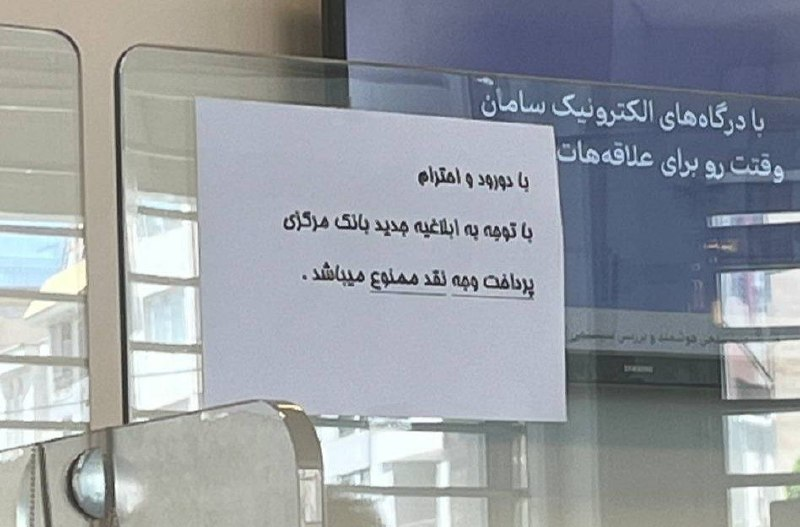

سلام ۱۷ اردیبهشت ۱۴۰۵ به بانک سامان سعادت اباد مراجعه کردم ۲ میلیون تومان معادل یک کیلو گوشت پول بگیرم. پشت باجه کاغذ زدن طبق ابلاغیه بانک مرکزی پرداخت وجه نقد ممنوع است!

فکر کن نهادی که وظیفه‌ش تضمین اعتبار به پول کشوره، خودش ابلاغ کرده که پول کشور را نمی‌دهم! حتی به مقدار یک کیلو گوشت!

@mamlekate

## mamlekate — post 103464

📝 وال‌استریت ژورنال جزئیات تازه‌ای از چارچوب پیشنهادی آمریکا به جمهوری اسلامی منتشر کرد

وال‌استریت ژورنال جزئیات تازه‌ای از چارچوب پیشنهادی آمریکا به جمهوری اسلامی منتشر کرد که به نوشته این روزنامه، در صورت پذیرش تهران، به مذاکرات ۳۰ روزه برای توافق نهایی منجر خواهد شد.

📝 سی‌ان‌ان: ایران پنجشنبه پاسخ خود به پیشنهاد آمریکا را ارائه می‌کند

یک منبع منطقه‌ای به خبرگزاری سی‌اِن‌اِن گفته است که انتظار می‌رود جمهوری اسلامی روز پنجشنبه پاسخ خود به پیشنهاد ایالات متحده برای پایان دادن به جنگ را به میانجی‌ها ارائه کند.

@mamlekate

## mamlekate — post 103463

📝 بلومبرگ: چین از بانک‌هایش خواست اعطای وام‌های جدید به پالایشگاه‌های تحریم‌شده را متوقف کنند

در آستانه سفر ترامپ به چین، بلومبرگ بر اساس اظهارات منابع آگاه گزارش داد که نهاد ناظر مالی چین به بزرگ‌ترین بانک‌های این کشور توصیه کرده است که به طور موقت اعطای وام‌های جدید به پنج پالایشگاهی را که اخیراً به دلیل ارتباطشان با نفت ایران از سوی آمریکا تحریم شده‌اند، متوقف کنند.

@mamlekate

## mamlekate — post 103461

  <a href="telegram/content/mamlekate_103461_1778236347.mp4" target="_blank">🎬 Download video</a>

📝 در حالی که گمانه‌زنی‌ها درباره محتوای پیشنهادهای متقابل تهران و واشنگتن برای ازسرگیری مذاکرات ادامه دارد، دونالد ترامپ در پاسخ به خبرنگاران تاکید کرد که جمهوری اسلامی با دست نیافتن به سلاح هسته‌ای «موافقت کرده است». او تاکید کرد که ایران «نمی‌تواند و نخواهد توانست» به سلاح هسته‌ای دست یابد و این موضوع را بخشی از تفاهمات مطرح‌شده دانست، هرچند جزئیات بیشتری ارائه نکرد.

آکسیوس پیش‌تر گزارش داده بود که در یکی از بندهای پیشنهاد آمریکا، توقف غنی‌سازی در مقابل رفع تدریجی تحریم‌ها مطرح شده است. این در حالی است که پیش‌تر مقامات جمهوری اسلامی هرگونه مذاکره درباره توقف غنی‌سازی را رد کرده بودند و بر ادامه این برنامه در چارچوب سیاست‌های اعلامی تاکید داشتند.

📝 دونالد ترامپ، رئیس‌جمهوری آمریکا، روز چهارشنبه ۱۶ اردیبهشت، در دفتر بیضی کاخ سفید با ابراز خوش‌بینی نسبت به پایان جنگ، از پیشرفت جدی در روند مذاکرات خبر داد. او تاکید کرد که در ۴۴ ساعت گذشته گفتگوهای بسیار مثبتی با مقام‌های جمهوری اسلامی انجام شده و دستیابی به یک توافق نهایی «بسیار محتمل» است.

ترامپ با اشاره به وضعیت نظامی کنونی گفت که توان دفاعی ایران به‌شدت کاهش یافته و نیروهای هوایی و دریایی این کشور عملا از کار افتاده‌اند. او با بیان اینکه «ما پیروز شده‌ایم»، اعلام کرد که جمهوری اسلامی اکنون تمایل زیادی برای دستیابی به توافق دارد.

رئیس‌جمهوری آمریکا شرط اصلی هرگونه توافق را دست نیافتن ایران به سلاح هسته‌ای و خروج ذخایر اورانیوم غنی‌شده از این کشور عنوان کرد. او هشدار داد که اگرچه به دیپلماسی امیدوار است، اما در صورت شکست مذاکرات، ایالات متحده آماده است تا گام‌های نظامی بسیار بزرگ‌تری بردارد.

indypersian
@mamlekate

## mamlekate — post 103460

  

📝 پخش مستقیم بازی تیم ملی با خودش، همراه با وی‌ای‌آر و حضور مقامات سیاسی

در حالی که فوتبال ایران در تعطیلی مطلق به سر می‌برد و حریفان تدارکاتی تیم ملی، در آستانه جام جهانی، بازی با ایران را لغو کرده‌اند، تیم ملی فوتبال دومین بازی‌ تدارکاتی درون تیمی را در استادیوم پاس قوامین، وابسته به نیروی انتظامی، برگزار کرد.

این دیدار علاوه بر اینکه از صدا و سیمای جمهوری اسلامی به طور مستقیم پخش شد، وی ای آر هم داشت.

اسماعیل بقایی، سخنگوی وزارت امور خارجه، این بازی بدون تماشاگر را که با نتیجه سه بر یک به سود تیم سفید به پایان رسید، از نزدیک تماشا کرد.

قرار بود تیم ملی فوتبال در اردوی ترکیه با تیم های مقدونیه و آنگولا دیدار کند که این دو تیم به دلیل شرایط فعلی در ایران از بازی با تیم ملی انصراف دادند.

@mamlekate

## mamlekate — post 103459

📝 عراقچی در چین: توافقی جامع با آمریکا می‌خواهیم

عباس عراقچی، وزیر امور خارجه جمهوری اسلامی، که به پکن رفته است، روز چهارشنبه اعلام کرد در مذاکرات با ایالات متحده، تنها «یک توافق عادلانه و جامع» را خواهد پذیرفت. این در حالی است که دونالد ترامپ، رئیس‌جمهوری آمریکا، از «پیشرفت بزرگ» در این روند خبر داده است.

عراقچی پس از دیدار با وانگ یی، همتای چینی‌اش در پکن، به رسانه‌های ایرانی گفت: «ما تمام تلاشمان را برای حفظ حقوق و منافع مشروعمان در مذاکرات به کار خواهیم گرفت و فقط یک توافق عادلانه و جامع را می‌پذیریم.»

📝 منابع آمریکایی و پاکستانی: واشینگتن و تهران به چارچوبی برای پایان جنگ نزدیک شده‌اند

📝 جزئیات تفاهم احتمالی یک‌صفحه‌ای آمریکا و ایران برای پایان جنگ به روایت اکسیوس

هم‌زمان با اعلام تعلیق «پروژه آزادی» و اظهارات دونالد ترامپ درباره این توقف کوتاه‌مدت این طرح به منظور مشخص شدن اینکه تهران و واشنگتن به توافق نهایی می‌رسند یا نه، برخی رسانه‌ها از نزدیک شدن دو کشور به تفاهم برای پایان جنگ خبر دادند.

رسانه آمریکایی اکسیوس روز چهارشنبه به نقل از منابع آگاه نوشت که ایالات متحده و جمهوری اسلامی به یک «یادداشت تفاهم کوتاه» نزدیک شده‌اند که هدفش توقف جنگ و شروع مذاکرات گسترده‌تر است، هرچند هنوز توافق نهایی نشده است.

@mamlekate

## mamlekate — post 103458

  <a href="telegram/content/mamlekate_103458_1778236349.mp4" target="_blank">🎬 Download video</a>

📝 دونالد ترامپ: «پروژه آزادی» مدت کوتاهی متوقف می‌شود؛ محاصره دریایی جمهوری اسلامی ادامه دارد

دونالد ترامپ، رئیس‌جمهوری آمریکا عصر سه‌شنبه اعلام کرد که به دلیل دستیابی به «پیشرفت بزرگ» در مذاکرات با ایران در جهت حصول توافق برای پایان دادن به جنگ و بازگشایی تنگه هرمز، عملیات نظامی جدید آمریکا، موسوم به «پروژه آزادی» را که در این تنگه در حال اجرا بود، موقتا تعلیق می‌کند.

آقای ترامپ در شبکه اجتماعی «تروت‌سوشال» نوشت: «بنا بر درخواست پاکستان و دیگر کشورها و با توجه به موفقیت نظامی چشمگیری که در جریان کارزار علیه کشور ایران داشته‌ایم و همچنین با توجه به این واقعیت که پیشرفت بزرگی در مسیر دستیابی به توافق کامل و نهایی با نمایندگان ایران حاصل شده است، ما متقابلا توافق کرده‌ایم که در حالی که محاصره با قوت کامل برقرار خواهد بود، «پروژه آزادی» برای مدت کوتاهی متوقف شود تا مشخص شود آیا توافق می‌تواند نهایی و امضا شود یا نه.»

euronewspe
@mamlekate

## VahidOnline — post 75324

  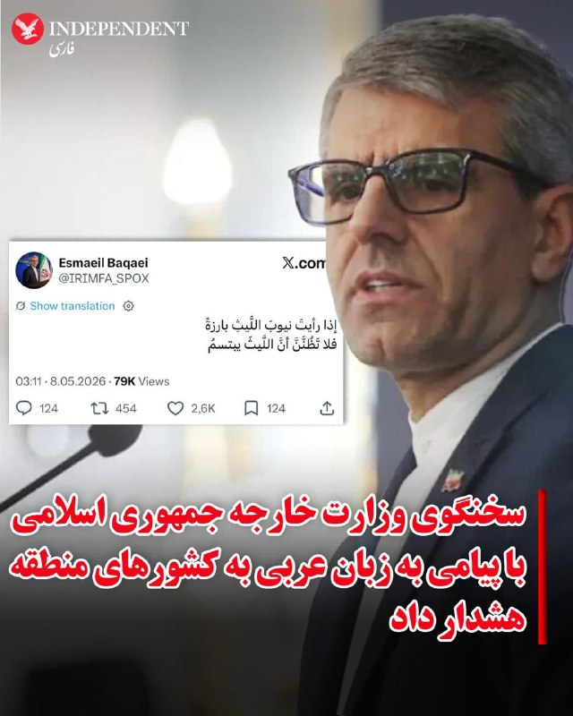

اسماعیل بقایی، سخنگوی وزارت امور خارجه جمهوری اسلامی روز جمعه ۱۸ اردیبهشت و پس از حملات متقابل در خلیج فارس، تنگه هرمز و انتشار گزارش‌ها از مقابله پدافند امارات متحده با موشک‌ها و پهپادها، پیامی «تهدیدآمیز» به زبان عربی منتشر کرد.

بقایی در این پیام نوشت: «اگر دندان‌های شیر را دیدی که بیرون زده‌اند، تصور نکن که شیر لبخند می‌زند.»

به نظر می‌رسد با توجه به حملات روزهای گذشته به بندر فجیره و دیگر نقاط امارات و اتهام‌های قرارگاه خاتم‌الانبیا پس از درگیری در تنگه هرمز، بقایی با این پیام امارات متحده عربی را تهدید کرده است.
@VahidOOnLine

📡 @VahidOnline

## VahidOnline — post 75323

  

امارات متحده عربی اوایل روز جمعه اعلام کرد که سامانه‌های پدافند هوایی آن در حال مقابله با حملات پهپادی و موشکی از ایران هستند.
@VahidHeadline

📡 @VahidOnline

## VahidOnline — post 75315

  <a href="telegram/content/VahidOnline_75315_1778236352.mp4" target="_blank">🎬 Download video</a>

ترامپ در گفت‌وگو با خبرنگاران در واشینگتن، با اشاره به درگیری جدید آمریکا و جمهوری اسلامی در تنگه هرمز گفت نیروهای جمهوری اسلامی با آمریکا «شوخی» کردند، اما آن‌ها ظرف حدود دو دقیقه نابود شدند.
او گفت: «امروز سه ناوشکن درجه‌یک آمریکا از تنگه عبور کردند. هر کشور دیگری در چنین شرایطی چنین کاری نمی‌کرد. به آن‌ ناوشکن‌ها موشک و پهپاد شلیک کردند و این قایق‌های احمقانه را به سویشان فرستادند. آن‌ها ظرف حدود دو دقیقه نابود شدند. نفتکششان هدف قرار گرفت. می‌دانید با نفتکش چه کردیم؟ نمی‌خواستیم شرایط حادی ایجاد شود، بنابراین سکان آن را زدیم و نفتکش شروع کرد به چرخیدن دور خودش. نباید امروز این کار را می‌کردند.»
ترامپ افزود: «همه موشک‌هایشان سرنگون شد. همه پهپادهایشان سرنگون شد و کسانی که آن‌ها را شلیک کردند نیز دیگر در میان ما نیستند.»
@VahidOOnLine
دونالد ترامپ، رئیس‌جمهوری آمریکا، روز پنج‌شنبه گفت پیشنهاد واشنگتن برای پایان دادن به درگیری با ایران، بسیار فراتر از یک «پیشنهاد یک‌صفحه‌ای» بوده است. سی‌ان‌ان نوشت، تهران همچنان در حال بررسی پیام‌های ارسال‌شده از سوی آمریکا از طریق میانجی‌های پاکستان است.
ترامپ در پاسخ به پرسشی درباره اینکه آیا ایران به آنچه «پیشنهاد یک‌صفحه‌ای» توصیف شده پاسخ داده است یا نه، این توصیف را رد کرد.
او به خبرنگاران گفت: «خب، این بیشتر از یک پیشنهاد یک‌صفحه‌ای است. این پیشنهادی بود که اساسا می‌گفت آنها سلاح هسته‌ای نخواهند داشت، گردوغبار هسته‌ای را به ما تحویل خواهند داد و بسیاری چیزهای دیگری را که ما می‌خواهیم.»
وقتی از او پرسیده شد آیا ایران با این شروط موافقت کرده است، ترامپ گفت: «آنها موافقت کرده‌اند. اما وقتی موافقت می‌کنند، خیلی معنا ندارد، چون روز بعد فراموش می‌کنند که موافقت کرده بودند.»
او افزود: «و می‌دانید، ما با مجموعه‌های متفاوتی از رهبران طرف هستیم.»
@VahidOOnLine
ترامپ در واشینگتن به خبرنگاران گفت: «مقام‌های ایران بهتر است خیلی سریع توافقشان را امضا کنند. مذاکرات بسیار خوب پیش می‌رود، اما باید بفهمند اگر امضا نشود، درد زیادی خواهند داشت. آن‌ها خیلی بیشتر از من می‌خواهند امضا کنند.»
ترامپ گفت: «ما اکنون در ایران با مجموعه‌های متفاوتی از رهبران سروکار داریم. وقتی درباره تغییر حکومت صحبت می‌کنید، آن‌ها مدام از تغییر حکومت حرف می‌زنند. ما حکومت اول را کنار زدیم. حکومت دوم را کنار زدیم. بیشتر حکومت سوم را کنار زدیم. بعد می‌گویند آیا این تغییر حکومت است؟ من فکر می‌کنم این نهایت تغییر حکومت است.»
@VahidOOnLine
دونالد ترامپ عصر پنج‌شنبه گفت: «ما هرگز اجازه نخواهیم داد» جمهوری اسلامی به سلاح هسته‌ای دست پیدا کند. آقای ترامپ گفت: «احتمال آن صفر است. خودشان هم این را می‌دانند و با آن موافقت کرده‌اند. حالا باید ببینیم آیا حاضرند توافق را امضا کنند یا نه.»
@VahidHeadline
ترامپ پنج‌شنبه به خبرنگاران گفت آمریکا با وجود تازه‌ترین تبادل آتش با جمهوری‌اسلامی در نزدیکی تنگه هرمز، در حال مذاکره با حکومت ایران است و افزود پاکستان از واشینگتن خواسته است در طول این گفت‌وگوها، طرح او برای اسکورت کشتی‌ها به خارج از این آبراه را دنبال نکند.
@VahidOOnLine

📡 @VahidOnline

## VahidOnline — post 75314

  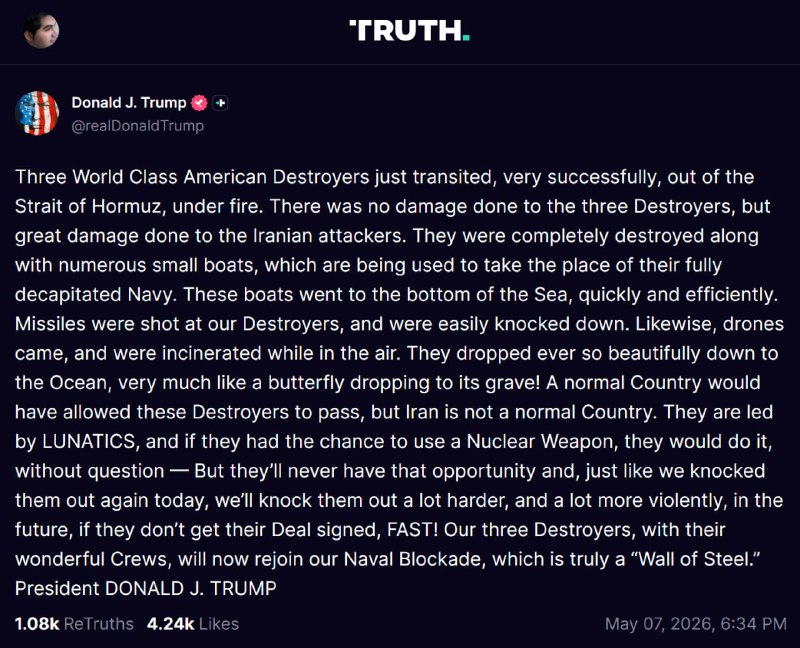

ترامپ: ایران را دیوانگان هدایت می‌کنند

پست ترامپ، ترجمه ماشین:
سه ناوشکن درجه‌یک آمریکایی به‌تازگی، با موفقیت کامل و در حالی که زیر آتش بودند، از تنگه هرمز خارج شدند. هیچ آسیبی به این سه ناوشکن وارد نشد، اما به مهاجمان ایرانی آسیب سنگینی وارد شد. آن‌ها به‌طور کامل نابود شدند، همراه با شمار زیادی قایق کوچک که اکنون برای جایگزینی نیروی دریایی کاملاً از سر بریده‌شده‌شان استفاده می‌شوند. این قایق‌ها به‌سرعت و با کارایی کامل به قعر دریا رفتند.

به‌سوی ناوشکن‌های ما موشک شلیک شد و به‌راحتی سرنگون شدند. پهپادها نیز آمدند و در هوا سوزانده شدند. آن‌ها به‌شکلی بسیار زیبا به سوی اقیانوس سقوط کردند؛ درست مانند پروانه‌ای که به سوی گور خود فرو می‌افتد!

یک کشور عادی اجازه می‌داد این ناوشکن‌ها عبور کنند، اما ایران یک کشور عادی نیست. آن‌ها را دیوانگانی هدایت می‌کنند و اگر فرصت استفاده از سلاح هسته‌ای را داشتند، بی‌تردید این کار را می‌کردند — اما هرگز چنین فرصتی نخواهند داشت و همان‌طور که امروز دوباره آن‌ها را از پا درآوردیم، اگر توافق خود را سریع امضا نکنند، در آینده بسیار سخت‌تر و بسیار خشن‌تر آن‌ها را از پا درخواهیم آورد!

سه ناوشکن ما، همراه با خدمه فوق‌العاده‌شان، اکنون دوباره به محاصره دریایی ما خواهند پیوست؛ محاصره‌ای که واقعاً یک «دیوار فولادین» است.

رئیس‌جمهور دونالد جی. ترامپ
realDonaldTrump

📡 @VahidOnline

## VahidOnline — post 75313

  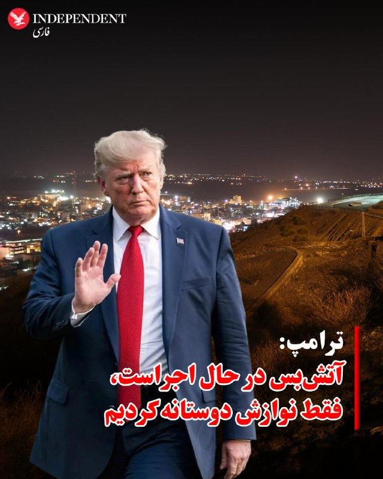

♦️دونالد ترامپ، رئیس‌جمهوری آمریکا در پی حمله‌ها به بنادر جنوبی ایران و شنیده شدن صدای انفجار در غرب تهران به ای‌بی‌سی گفت که ارتش آمریکا در اقدامی دفاعی به رژیم ایران یک «نوازش دوستانه» داده است و آتش‌بس همچنان در حال اجراست. او گفت حمله‌های متقابل به ایران فقط یک نوازش دوستانه بوده است.
@VahidOOnLine

📡 @VahidOnline

## VahidOnline — post 75312

  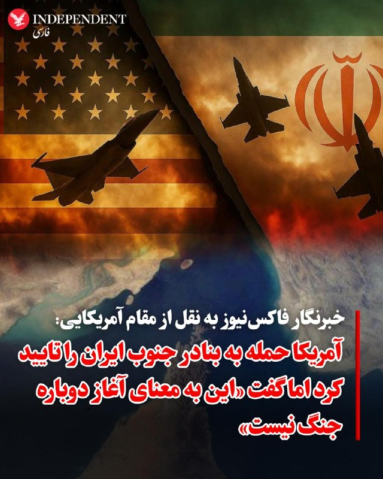

♦️جنیفر گریفین، خبرنگار فاکس‌نیوز، در شبکه اجتماعی اکس به نقل از یک مقام ارشد ایالات متحده از حملات نظامی این کشور به بندر قشم و بندرعباس خبر داد. این مقام آمریکایی تاکید کرد که این اقدام به معنای شروع دوباره جنگ یا پایان آتش‌بس نیست. این حملات دو روز پس از شلیک موشک‌های بالستیک ایران به بندر فجیره امارات صورت می‌گیرد. گزارش‌ها همچنین از حمله به ایستگاه بازرسی دریایی بندر کرگان در میناب حکایت دارد.
@VahidOOnLine

📡 @VahidOnline

## VahidOnline — post 75311

  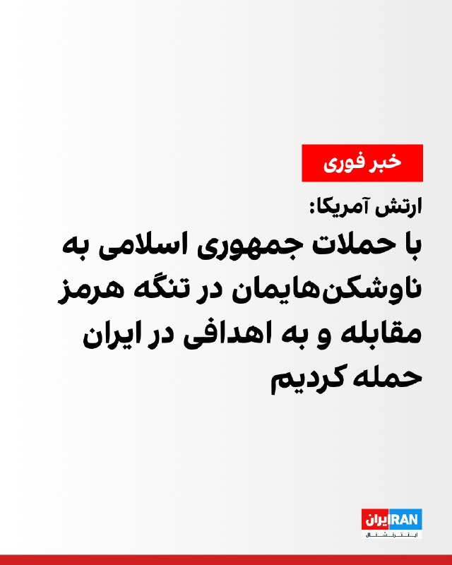

ستاد فرماندهی مرکزی آمریکا، سنتکام، اعلام کرد نیروهای آمریکایی ۱۷ اردیبهشت همزمان با عبور ناوشکن‌های مجهز به موشک هدایت‌شونده آمریکا از تنگه هرمز به سوی دریای عمان، حملات موشکی، پهپادی و قایق‌های کوچک جمهوری اسلامی را رهگیری و به منابع این حمله‌ها در ایران حمله کردند.

طبق اعلام سنتکام، نیروهای جمهوری اسلامی در حالی این حمله‌ها را با چندین موشک، پهپاد و قایق‌های کوچک انجام دادند که ناوهای یواس‌اس تراکستون، یواس‌اس رافائل پرالتا و یواس‌اس میسون از این گذرگاه بین‌المللی دریایی عبور می‌کردند و هیچ‌یک از تجهیزات یا دارایی‌های آمریکا هدف قرار نگرفت.

سنتکام گفت نیروهای آمریکا ضمن دفع این تهدیدها، تاسیسات نظامی ایران را که مسئول حمله به نیروهای آمریکایی بودند، از جمله محل‌های پرتاب موشک و پهپاد، مراکز فرماندهی و کنترل و گره‌های اطلاعاتی، نظارتی و شناسایی، هدف قرار دادند.

سنتکام تاکید کرد که به دنبال تشدید تنش نیست، اما همچنان در موقعیت مناسب قرار دارد و آماده حفاظت از نیروهای آمریکایی است.
@VahidOOnLine

📡 @VahidOnline

## VahidOnline — post 75310

  <a href="telegram/content/VahidOnline_75310_1778236355.mp4" target="_blank">🎬 Download video</a>

قرارگاه خاتم النبیاء که مدیریت جنگ در ایران را بر عهده دارد، ساعتی بعد از گزارش‌ها از حملات و رد و بدل شدن آتش در حوالی تنگه هرمز، با انتشار بیانیه‌ای این حملات را «نقض اتش‌بس» و در پی «همکاری چند کشور منطقه با آمریکا» ارزیابی کرده و گفته است: «ارتش متجاوز، تروریست و راهزن آمریکا با نقض آتش‌بس یک کشتی نفتکش ایرانی و در حال حرکت از آبهای ساحلی ایران در منطقه جاسک به سمت تنگه هرمز و همچنین یک کشتی دیگر در حال ورود به تنگه هرمز را روبروی بندر فجیره امارات مورد هدف قرار دادند و همزمان مناطق غیرنظامی را با همکاری برخی از کشورهای منطقه در سواحل بندر خمیر، سیریک و جزیره قشم مورد تعرض هوایی خود قرار دادند.»

این قرارگاه در ادامه مدعی شده که نیروهای نظامی ایران به این حملات واکنش نشان داده‌اند: «نیروهای مسلح جمهوری اسلامی ایران نیز بلافاصله و در اقدامی متقابل شناورهای نظامی آمریکا در شرق تنگه هرمز و جنوب بندر چابهار را مورد هجوم قرار داده و خسارات قابل توجهی به‌ آنها وارد نمودند.»
@VahidHeadline

📡 @VahidOnline

## VahidOnline — post 75309

  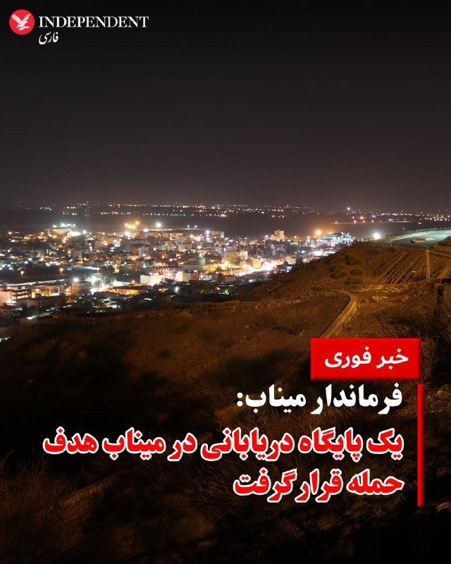

گویا پیام دریافتی پست قبل درست بود:

خبرگزاری مهر بامداد جمعه ۱۸ اردیبهشت‌ماه به نقل از محمد رادمهر، معاون استاندار و فرماندار ویژه میناب، گزارش داد یک پایگاه دریابانی در این شهرستان هدف حمله قرار گرفته است.

به گفته رادمهر، این حمله ساعت ۰۰:۱۰ توسط اسرائیل و آمریکا انجام شده است.

همزمان فاکس‌نیوز گزارش داد آمریکا حملاتی را به جزیره قشم و بندرعباس در جنوب ایران انجام داده است.
@VahidOOnLine

📡 @VahidOnline

## VahidOnline — post 75308

هرمزگان
پیام‌های دریافتی:

وحید بندر صدای انفجار اومد الان

الان ساعت دوازده شب صدای دو انفجار دیگه در بندرعباس شنیده شد

همین الان بندرعباس صدای انفجار اومد

سلام بندرعباس ۰۰:۰۰ یک صدا اومد

۰۰:۰۲ بامداد جمعه ۱۸ اردیبهشت صدای تک انفجار این دفعه از فاصله بسیار دورتر ظاهرا از مناطقی در نزدیکی جزیره لارک یا هرمز بود.
خودم همچنان در همین محدوده نزدیک اسکله بهمن، محله دوحه و چابهار هستم

👈 پاسگاه بندرکرگان در میناب استان هرمزگان مورد اصابت موشک آمریکایی قرار گرفت.
پاسگاه دریایی است. می‌گفتند پهپاد از همین نقطه بلند شده.

📡 @VahidOnline

## VahidOnline — post 75307

  <a href="telegram/content/VahidOnline_75307_1778236357.mp4" target="_blank">🎬 Download video</a>

ویدیو و پیام‌های دریافتی:

وحید جان سلام ۲۳:۵۳ غرب تهران فعالیت پدافند

غرب تهران نمی‌فهمم صدای پدافنده یا انفجار ۱۱:۵۳

سلام غرب تهران چنتا صدای انفجار و پدافند ۲۳:۵۲
صدا ها مرتب و پشت سر هم نیست

وحید من غرب تهرانم، ازادی. ساعت ۱۱:۵۳ صدای انفجار دور میاد
چندتا پشت هم

ساعت ۲۳:۵۰ امشب ۱۷ اردیبهشت صدای انفجار یا پدافند محدوده غرب تهران.

۱۱:۵۳ تهران شهرک اکباتان ۴ افنجار دور شنیده شد
مطمعنم صدا پدافند نبود انفجار دور بود
۱۱:۵۴ صدای پدافند به صدای انفجار ها اضافه شد شهرک اکباتان

ساعت 23:53، ممتد صدهای پدافند و مشابه انفجار باغ فیض غرب تهران

صدای چندین انفجار الان سمت شهران ۲۳:۵۴

سلام ساعت ۲۳:۵۲ دقیقه صدای چندین وحشتناک انفجار سمت غرب تهران شهران

پدافند غرب تهران داره میزنه

از غرب، جنت اباد نمی دونم پدافندها فعال شده یا داره می زنه

غرب تهران بلوار فردوس ساعت ۱۱:۵۴
صداهای متعدد میاد
شبیه پدافند

صدای انفجار و پدافند
جنت آباد ساعت 1154 شب
امشب

سلام وحید همین الان دوتا صدای انفجار اومد سمت بلوار فردوس غرب صدای پندافند هم میاد به شدت

چند تا صدای انفجار و پدافند میاد سمت غرب
منطقه ۵ ساعت ۱۱:۵۲ دقیقه

بلوار فردوس شرق، غرب تهران از ساعت ۲۳:۵۰ دقیقه صداهای ممتد شبیه فعالیت پدافند میاد، و یا حتی شلیک یه چیزی فراتر از پدافند

سلام محدوده چیتگر فعالیت شدید پدافند ساعت ۲۳:۵۴

وحید ۱۱:۴۵ شب، جنت‌اباد مرکزی تهران، یه عالمه صدا که فک میکنم پدافند بودن

وحید جان همین الان غرب تهران (سمت میدون آزادی) صدای پدافند شدید میاد
سمت شهرک نفت هم همینطور...

صدای پدافند از دور در مرکز تهران ساعت ۲۳:۵۵ شنیده میشه

صدای ضد هوایی بوضوح در جنت‌آباد شنیده میشه

سلام وحید همین الان کلی صدای پدافند تو تهرانسر اومد ساعت ۲۳:۵۰

وحید سلام شهرک غرب ۲۳ و ۵۳ پدافند فعال شد.

سلام وحید جان ۲۳:۵۵ منطقه ۱۰ صدای بم عجیبی اومد چند بار پشت سر هم. شک دارم چی بود.

وحید جان ساعت ۱۱:۵۴ جنت آباد مرکزی بنظر صدای پدافند میاد چندتا پشت سر هم

سلام وحید جان ما تهران، جنت آبادیم، پدافند فعال شده، انفجار نیست

۱۱:۵۷ دو مرتبه صدای انفجار و پدافند شدید غرب تهران شهرک اکباتان

ساعت ۱۱:۵۷ باز صدای پدافند شدید و صدای انفجار. جنگ اینجوری صدای پدافند نبود.

غرب تهران، ساعت 23:57 تشخیص نمی‌دم صدای انفجاره یا پدافند، اما صدا مهیبه

وحید جان ساعت ۱۱:۵۷ جنت آباد مرکزی بنظر صدای پدافند میاد چندتا پشت سر هم

صدای ممتد پدافند غرب تهران ۲۳:۵۷ همچنان ادامه داره

۲۳:۵۷ سمت مرزداران غرب تهران صدای پیدافند میاد همینجوری

ساعت ۱۱:۵۷ باز صدای پدافند شدید و صدای انفجار.

غرب تهران، ساعت 23:57 تشخیص نمی‌دم صدای انفجاره یا پدافند، اما صدا مهیبه

11:57 صدای انفجار میاد بعید میدونم پدافند باشه جنت آباد مرکزی

صداها وحشتناکه ۱۱:۵۷غرب تهران جنت اباد مثل زمان جنگ

الان صدای خیلی شدید تر میاد ۲۳:۵۷

جردن ۲۳:۵۵ صدای پدافند میاد

سلام وحید همین الان دوتا صدای انفجار اومد سمت بلوار فردوس غرب صدای پندافند هم میاد به شدت

ساعت ۱۱:۵۷ بازم صدای انفجار و پدافند، انفجار هم هست ولی انفجارهای بزرگی نیستن

باز هم به صدا انفجار میاد، به نظر پدافند باشه
ساعت ۲۳:۵۸، شهران

ساعت ۱۱:۵۷، همچنان جنت‌اباد مرکزی تهران، همچنان صدای پشت سر هم به احتمال زیاد پدافند

سلام ۸ انفجار مجدد ساعت ۲۳:۵۷ غرب تهران شهران

غرب تهران سیمون بولیوار دوباره صدای احتمالا پدافند ۲۳:۵۷

سلام وحید جان ۱۱:۵۶ صدای پدافند شدید محدوده دریاچه و میدان المپیک میاد

همین لحظه ۱۱:۵۸ همچنان ضد هوایی شدید

سلام سمت شهرآرا صدای پدافند میاد پشت هم

ما مرزداران هستیم
از دوردست خیلی صدای انفجار میاد
ساعت ۲۳:۵۶

📡 @VahidOnline

## VahidOnline — post 75306

  <a href="telegram/content/VahidOnline_75306_1778236357.mp4" target="_blank">🎬 Download video</a>

صداوسیما به نقل از یک مقام آگاه نظامی گزارش داد «به دنبال تعرض ارتش آمریکا به یک نفت‌کش ایرانی، یگان‌های متعرض دشمن در محدوده تنگه هرمز زیر آتش موشکی جمهوری اسلامی قرار گرفتند که پس از تحمل خسارت مجبور به فرار شدند.»
@VahidOOnLine

📡 @VahidOnline

## VahidOnline — post 75305

  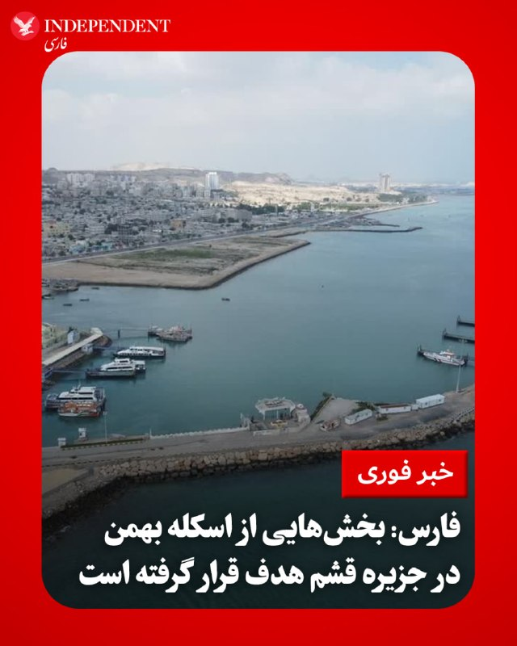

خبرگزاری فارس، وابسته به سپاه پاسداران، در خبری اختصاصی اعلام کرد که صداهای انفجار که پنجشنبه‌شب، ۱۷ اردیبهشت در حوالی بندرعباس شنیده شد، مربوط به «تبادل آتش» میان نیروهای مسلح جمهوری اسلامی و ایالات متحده بوده است.
به گفته فارس، در جریان این تبادل آتش، بخش‌هایی از اسکله بهمن در جزیره قشم هدف قرار گرفته است.
@VahidOOnLine
آپدیت: منابع غیررسمی حکومتی و سپاهی میگن امارات اسکله بهمن رو هدف گرفته.
📡 @VahidOnline

## kianmeli1 — post 87266

  <a href="telegram/content/kianmeli1_87266_1778236359.mp4" target="_blank">🎬 Download video</a>

🔴سپاه فیلمی از لحظه شلیک موشک به ناوشکن های امریکا منتشر کرد

همزمان دقایقی پیش ترامپ گفت هیچ صدمه ای به ناوشکن ها نرسیده است
https://t.me/kianmeli1

## kianmeli1 — post 87265

  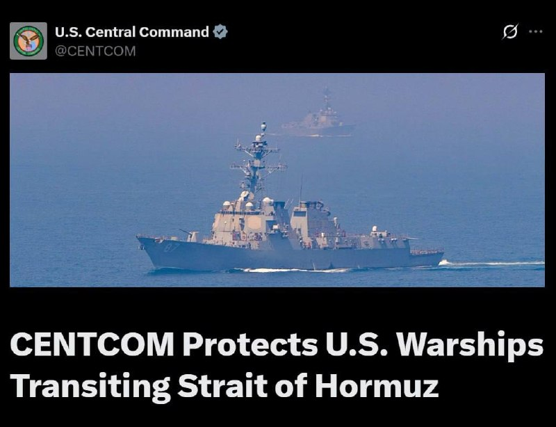

🔴فوری

بیانیه سنتکام:

«ایالات متحده تأسیسات نظامی ایران، از جمله سایت‌های پرتاب موشک و پهپاد؛ مکان‌های فرماندهی و کنترل؛ و مراکز اطلاعاتی، نظارتی و شناسایی را هدف قرار داد.»
https://t.me/kianmeli1

## kianmeli1 — post 87264

🔴فوری-انبار قایق های تندرو سپاه هدف حمله آمریکا قرار گرفته است
https://t.me/kianmeli1

## kianmeli1 — post 87263

🔴فوری-جت‌های جنگنده بر فراز کویت و بغداد مشاهده شدند.
https://t.me/kianmeli1

## kianmeli1 — post 87262

  

🔴فوری- فرماندهی دریایی سپاه

سه ناوشکن امریکا را در تنگه هرمز با موشک بالستیک و کروز هدف قرار داده ایم و فرار کردند
https://t.me/kianmeli1

## kianmeli1 — post 87261

🔴فوری-اسراییل
آتش بس فرو پاشید
https://t.me/kianmeli1

## kianmeli1 — post 87260

🔴فوری-ایست بازرسی دریایی بندر کرگان در میناب بمباران شد
https://t.me/kianmeli1

## kianmeli1 — post 87259

🔴فوری-فرماندار میناب

پایگاه دریابانی میناب زیر آتش امریکاست
https://t.me/kianmeli1

## kianmeli1 — post 87258

🔴فوری- پدافند تهران مجددا فعال شد
https://t.me/kianmeli1

## kianmeli1 — post 87257

🔴فوری-رویترز- چندین ناو امریکا آسیب جدی دیده اند و همچنان زیر آتش اند
https://t.me/kianmeli1

## kianmeli1 — post 87256

  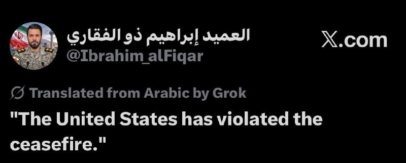

🔴فوری-سخنگو خاتم

آمریکا آتش‌بس را نقض کرده است.
https://t.me/kianmeli1

## kianmeli1 — post 87255

🔴فوری-پایگاه دریابانی میناب بمباران شد
https://t.me/kianmeli1

## kianmeli1 — post 87254

🔴فوری-موج دیگری از پهپادها و موشک‌های ضد کشتی ایران به سمت ناوهای جنگی آمریکا مستقر در نزدیکی ساحل امارات شلیک شد.
https://t.me/kianmeli1

## kianmeli1 — post 87253

🔴فوری-حمله امریکا به بندر خمیر و سیریک
https://t.me/kianmeli1

## kianmeli1 — post 87252

🔴فوری-دو نفتکش ایران هدف قرار گرفته شد در بندر جاسک و نزدیک فجیره
https://t.me/kianmeli1

## kianmeli1 — post 87251

  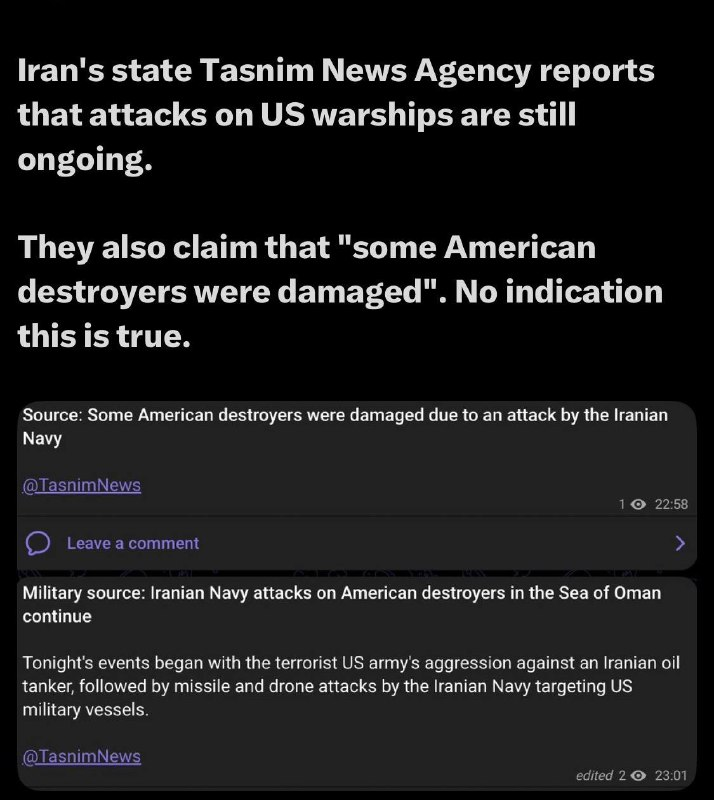

🔴فوری-تسنیم

حملات به ناوهای امریکا ادامه دارد-خسارت سنگین وارد شده است
https://t.me/kianmeli1

## kianmeli1 — post 87250

🔴فوری-فاکس نیوز

بیش از ۱۵ موشک به بندر نفتی فجیره امارات شلیک شده است
https://t.me/kianmeli1

## kianmeli1 — post 87249

🔴فوری-رویترز

ناوهای امریکا در تنگه هرمز موشکباران شده اند

US naval units near the Strait of Hormuz came under Iranian missile fire and were forced to retreat after sustaining damage - Reuters
https://t.me/kianmeli1

## kianmeli1 — post 87248

🔴فوری

انفجار در ابوظبی، امارات
https://t.me/kianmeli1

## kianmeli1 — post 87247

🔴فوری-سه ناوشکن امریکا هدف موشک سپاه قرار گرفت
https://t.me/kianmeli1

## IranIntlTV — post 336115

  <a href="telegram/content/IranIntlTV_336115_1778236363.mp4" target="_blank">🎬 Download video</a>

🔻تیم بسکتبال زنان استقلال قهرمان لیگ برتر شد. استقلال در حالی به مقام قهرمانی دست پیدا کرد که دیگر تیم فینالیست یعنی آکادمی سحر در زمین مسابقه حاضر نشد تا زنان آبی پوش روی سکوی نخست این مسابقات بایستند و جشن قهرمانی برگزار کنند.

🔹تیم بسکتبال زنان استقلال در بازی اول فینال برابر تیم آکادمی سحر پیروز شده بود و بدون انجام بازی دوم قهرمان این دوره از مسابقات شد.

@iranintltvsport

## IranIntlTV — post 336114

  <a href="telegram/content/IranIntlTV_336114_1778236365.mp4" target="_blank">🎬 Download video</a>

مشخص نبودن زمان دقیق امتحانات نهایی دانش‌آموزان و نحوه برگزاری آن‌ها، از جمله پیام‌هایی است که شهروندان برای مدیا‌بات ایران اینترنشنال فرستاده‌اند.

لیلا سعادتی، خبرنگار ایران‌اینترنشنال، گزارش می‌دهد
@iranintltv

## IranIntlTV — post 336113

  

حزب کارگر بریتانیا به رهبری کی‌یر استارمر در انتخابات محلی این کشور با شکست‌های سنگین روبه‌رو شد. خبرگزاری رویترز نوشت این نتایج عمق نارضایتی از نخست‌وزیر بریتانیا را نشان داد و تنها دو سال پس از پیروزی قاطع او در انتخابات سراسری، تردیدها را درباره آینده سیاسی‌اش افزایش داد.

حزب کارگر جمعه، ۱۸ اردیبهشت در مناطقی که نتایج اولیه اعلام شد، بخش قابل توجهی از آرای خود را از دست داد؛ از جمله در پایگاه‌های سنتی‌اش در مناطق صنعتی سابق در مرکز و شمال انگلستان و همچنین در بخش‌هایی از لندن. بیشترین سود را حزب راست‌گرای «ریفورم یو کی» (اصلاح بریتانیا) به رهبری نایجل فاراژ برد. حزبی که بیش از ۳۵۰ کرسی شوراهای محلی در انگلستان را به دست آورد و اکنون می‌تواند به اپوزیسیون اصلی در اسکاتلند و ولز در برابر حزب ملی‌گرای اسکاتلند و حزب پلاید کامری تبدیل شود.

رویترز نوشت نتایج اولیه نشان داد نظام سنتی دو‌حزبی بریتانیا در حال فروپاشی و تبدیل شدن به یک دموکراسی چند‌حزبی است. تحولی که به گفته تحلیل‌گران، یکی از بزرگ‌ترین دگرگونی‌های سیاست بریتانیا در یک قرن گذشته به شمار می‌رود.
iranintl.com/202605080194

## IranIntlTV — post 336112

🔻ضربه سنگین به حزب کارگر در انتخابات محلی بریتانیا و پیروزی گسترده حزب اصلاح بریتانیا

حزب کارگر بریتانیا به رهبری کی‌یر استارمر در انتخابات محلی این کشور با شکست‌های سنگین روبه‌رو شد. خبرگزاری رویترز نوشت این نتایج عمق نارضایتی از نخست‌وزیر بریتانیا را نشان داد و تنها دو سال پس از پیروزی قاطع او در انتخابات سراسری، تردیدها را درباره آینده سیاسی‌اش افزایش داد.

حزب کارگر جمعه ۱۸ اردیبهشت در مناطقی که نتایج اولیه اعلام شد، بخش قابل توجهی از آرای خود را از دست داد؛ از جمله در پایگاه‌های سنتی‌اش در مناطق صنعتی سابق در مرکز و شمال انگلستان و همچنین در بخش‌هایی از لندن.

بیشترین سود را حزب راست‌گرای «ریفورم یو کی» (اصلاح بریتانیا) به رهبری نایجل فاراژ برد. حزبی که بیش از ۳۵۰ کرسی شوراهای محلی در انگلستان را به دست آورد و اکنون می‌تواند به اپوزیسیون اصلی در اسکاتلند و ولز در برابر حزب ملی‌گرای اسکاتلند و حزب پلاید کامری تبدیل شود.

رویترز نوشت نتایج اولیه نشان داد نظام سنتی دو‌حزبی بریتانیا در حال فروپاشی و تبدیل شدن به یک دموکراسی چند‌حزبی است. تحولی که به گفته تحلیل‌گران، یکی از بزرگ‌ترین دگرگونی‌های سیاست بریتانیا در یک قرن گذشته به شمار می‌رود.

جان کرتیس، از شناخته‌شده‌ترین کارشناسان افکارسنجی در بریتانیا، گفت: «اوضاع تقریبا به همان اندازه‌ای که برای حزب کارگر پیش‌بینی می‌شد بد بوده؛ یا حتی بدتر.»

فشار بر استارمر افزایش یافت

انتخابات ۱۳۶ شورای محلی در انگلستان، در کنار انتخابات پارلمان‌های محلی اسکاتلند و ولز، مهم‌ترین آزمون افکار عمومی پیش از انتخابات سراسری ۲۰۲۹ محسوب می‌شود.

برخی نمایندگان حزب کارگر هشدار داده‌اند اگر این حزب در اسکاتلند عملکرد ضعیفی داشته باشد، قدرت را در ولز از دست بدهد و نتواند بخش زیادی از حدود ۲۵۰۰ کرسی تحت دفاع خود در انگلستان را حفظ کند، فشارها بر استارمر برای کناره‌گیری یا دست‌کم تعیین جدول زمانی خروجش از قدرت افزایش خواهد یافت.

با این حال، متحدان استارمر به سرعت از او حمایت کردند و گفتند اکنون زمان مناسبی برای اقدام علیه نخست‌وزیر نیست.

جان هیلی، وزیر دفاع بریتانیا، گفت آخرین چیزی که رای‌دهندگان می‌خواهند «آشوب احتمالی ناشی از رقابت در رهبری حزب» است.

او گفت: «فکر می‌کنم استارمر هنوز می‌تواند اوضاع را تغییر دهد.»

فروپاشی نظم سنتی

دو حزب سنتی کارگر و محافظه‌کار، بخشی از آرای خود را به حزب اصلاح بریتانیا و در سوی دیگر طیف سیاسی، به حزب سبز واگذار کردند.

هم‌زمان انتظار می‌رود احزاب ملی‌گرا در اسکاتلند و ولز نیز پیروز شوند.

فاراژ، نتایج به دست آمده را «تغییری تاریخی در سیاست بریتانیا» توصیف کرد.

حزب کارگر در برخی از مهم‌ترین حوزه‌های مورد توجه، تقریبا از صحنه حذف شد.

این حزب برای نخستین بار در حدود ۵۰ سال گذشته، کنترل شورای منطقه تیم‌ساید در منچستر بزرگ را از دست داد؛ پس از آن‌که حزب اصلاح بریتانیا هر ۱۴ کرسی تحت دفاع حزب کارگر را تصاحب کرد.

در ویگان، منطقه‌ای معدنی که حزب کارگر بیش از نیم‌قرن آن را در اختیار داشت، این حزب هر ۲۰ کرسی خود را به حزب اصلاح بریتانیا واگذار کرد.

در سالفورد نیز حزب کارگر تنها سه کرسی از ۱۶ کرسی تحت دفاع خود را حفظ کرد.

ربکا لانگ بیلی، نماینده حزب کارگر از سالفورد، این نتایج را «ویران‌کننده روحیه» توصیف کرد.

🔗متن کامل گزارش را اینجا بخوانید

@iranintltv

## IranIntlTV — post 336109

  <a href="telegram/content/IranIntlTV_336109_1778236368.mp4" target="_blank">🎬 Download video</a>

وزارت دفاع ملی ترکیه ابراز امیدواری کرد جمهوری اسلامی و آمریکا با رویکردی خویشتندارانه و سازنده، زمینه دائمی شدن آتش‌بس را فراهم کنند.
جزییات بیشتر با نرگس هورخش، خبرنگار ایران‌اینترنشنال
@iranintltv

## IranIntlTV — post 336108

  

ابوالقاسم جراره، دبیرکل جبهه شریان و نماینده پیشین مجلس، گفت پیام ما به «دشمنان، همراهان دشمن و دیگر کشورها» این است که تنگه هرمز مانند گذشته باز نمی‌شود. او افزود مدیریت تنگه هرمز خواسته مجتبی خامنه‌ای است و در پیام او آمده این تنگه راهبردی با «مدیریت و روش جدیدی» اداره خواهد شد.

او از نهادهای امنیتی جمهوری اسلامی خواست «کودتاچیان» و کسانی را که به گفته او بر مذاکره با آمریکا و دیگر «دشمنان» اصرار دارند، دستگیر و به مردم معرفی کنند.
https://iranintl.com/202605085394

## IranIntlTV — post 336107

  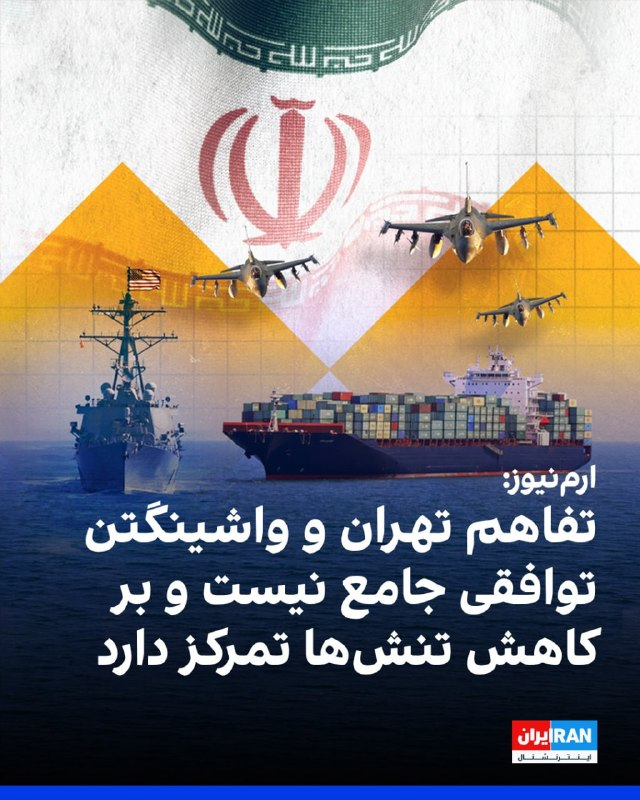

پایگاه خبری ارم‌نیوز امارات متحده عربی گزارش داد نسخه فاش‌شده تفاهم تهران و واشینگتن، بیش از آنکه یک توافق جامع باشد، به یادداشتی برای کاهش تنش‌ها شباهت دارد.

ارم‌نیوز افزود این تفاهم بر توقف درگیری‌ها، حل‌وفصل بحران تنگه هرمز و آغاز مسیری کوتاه برای مذاکرات متمرکز است و پرونده‌های هسته‌ای، موشکی و نیروهای نیابتی را به مراحل بعدی موکول می‌کند.
iranintl.com/202605088965

## IranIntlTV — post 336106

  

ارتش و سازمان امنیت داخلی اسرائیل اعلام کردند سه سرباز و یک شهروند غیرنظامی جمعه به اتهام جاسوسی برای جمهوری اسلامی در دادگاه تفهیم اتهام خواهند شد.

بر اساس این گزارش، این سربازان که در یک مدرسه فنی وابسته به نیروی هوایی اسرائیل آموزش می‌دیدند، از تاسیسات نظامی عکس‌برداری کرده‌اند.

مقام‌های اسرائیلی همچنین اعلام کردند این سه سرباز پیش از اعزام به خدمت و زمانی که هنوز به سن قانونی نرسیده بودند، با ماموران امنیتی جمهوری اسلامی در ارتباط بودند و ماموریت‌های جاسوسی انجام دادند.
https://iranintl.com/202605086185

## IranIntlTV — post 336105

🔻قلعه‌نویی در گفت‌وگو با سایت فیفا: تیم ملی در جام‌جهانی می‌تواند کاری حماسی انجام دهد

امیر قلعه‌نویی، سرمربی تیم ملی، در گفت‌وگو با سایت فیفا گفت: «بازیکنانم می‌توانند در جام جهانی کاری حماسی انجام دهند. این توانایی را دارند و از نظر فنی می‌توانند جام جهانی متفاوتی برای ایران رقم بزنند.»

قلعه‌نویی گفت: «می‌خواهیم در این جام جهانی خاطرات بزرگی خلق کنیم. با تجربه‌ای که بازیکنان از جام‌های جهانی قبلی دارند، آماده‌ایم برای نخستین بار به مرحله حذفی صعود کنیم.»

او گفت: «تنها دو ماه تا جام جهانی باقی مانده، اما همچنان در شرایط سختی قرار داریم. تنها به حضور در مرحله گروهی راضی نخواهیم بود. می‌خواهم فوتبال خوبی ارائه دهیم، نه فقط برای گرفتن نتیجه بازی کنیم.»

تیم ملی ایران در مرحله گروهی جام جهانی با بلژیک، مصر و نیوزیلند هم‌گروه است.

به‌دلیل جنگ و انزوای جمهوری اسلامی، تیم ایران نتوانسته بازی تدارکاتی مناسبی برگزار کند و حتی تیم‌های آنگولا و مقدونیه هم حاضر به بازی با تیم امیر قلعه‌نویی نشدند.

🔗وب‌سایت ایران‌اینترنشنال

@iranintltv

## IranIntlTV — post 336104

  

مهدی پیرصالحی، معاون وزیر بهداشت، از کمبود و افزایش شدید قیمت نهاده‌های دارویی، تجهیزات پزشکی، مقوا، فویل‌های آلومینیومی و بسته‌بندی‌های پت خبر داد.

او افزود: «برای جبران هزینه‌های تولید و حفظ پایداری زنجیره تامین دارو، افزایش قیمت‌ها ضروری ارزیابی شده است.»

پیرصالحی ادامه داد: «فعالان و تولیدکنندگان صنعت دارو با ارائه مستندات هزینه‌ای، افزایش بسیار بیشتری را برای پوشش کامل هزینه‌های تحمیل‌شده پیشنهاد کرده‌اند.»
iranintl.com/202605080781

## IranIntlTV — post 336103

  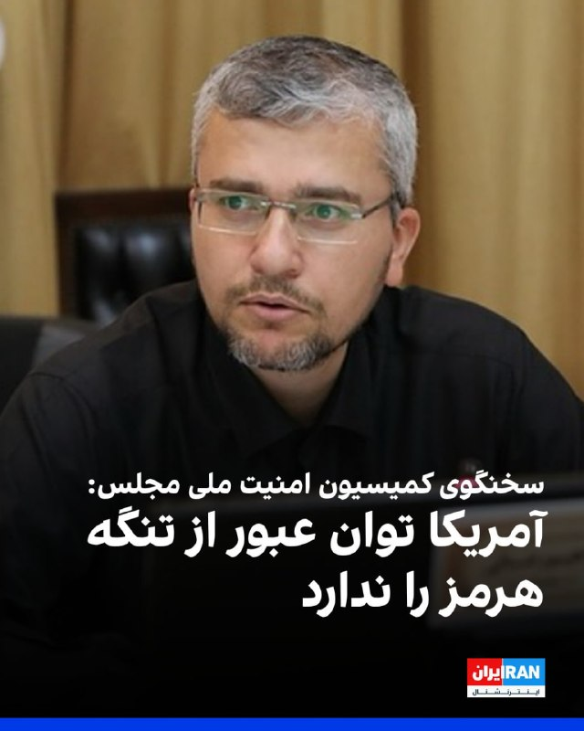

ابراهیم رضایی، سخنگوی کمیسیون امنیت ملی مجلس گفت که آمریکا «با چند ناوچه و ناوشکن»، قادر به عبور از تنگه هرمز نیست.

رضایی خطاب به مقام‌های ایالات متحده افزود: «با کل نیروی دریایی‌تان هم توان عبور از تنگه هرمز را نخواهید داشت. فقط مثل یک بچه لوس، کتک می‌خورید و برمی‌گردید.»
iranintl.com/202605083622

## IranIntlTV — post 336102

یک دانش‌آموز با ارسال پیامی به ایران اینترنشنال از کیفیت بسیار پایین آموزش مجازی در دوره قطع اینترنت در ایران روایت کرده و می‌گوید کیفیت آن افتضاح و سرعتش کمتر از لاک‌پشت است.

## IranIntlTV — post 336100

  

روح‌الله مومن‌نسب، دبیر ستاد امر به معروف تهران نوشت نمی‌شود نیروهای مسلح، مرزهای ما و تنگه هرمز را به روی دشمنان ببندند اما دولت فضای مجازی را در اختیار آنان قرار دهد.

او افزود که «فضای مجازی به هیچ وجه نباید به حالت قبل برگردد؛ همان‌طور که امام شهید ما به حالت قبل برنمی‌گردد.»
https://iranintl.com/202605082859

## IranIntlTV — post 336099

  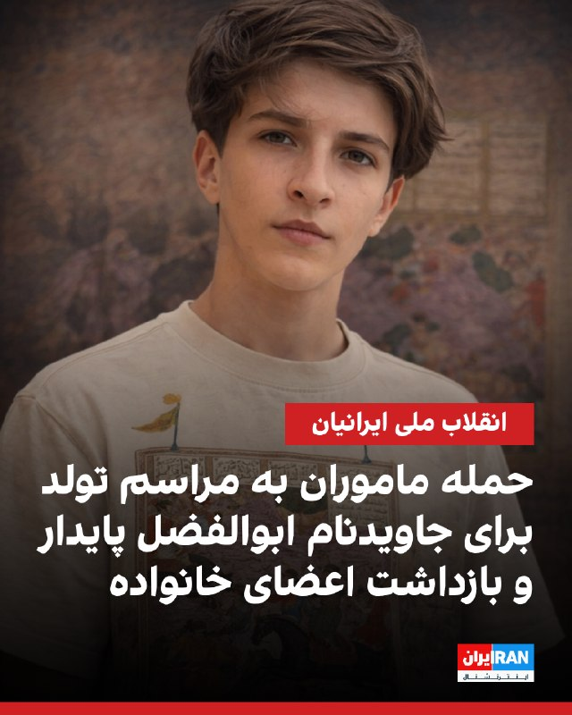

طبق اطلاعات رسیده به ایران اینترنشنال، روز پنجشنبه خانواده جاویدنام ابوالفضل پایدار، ۱۷ ساله که در اعتراضات دی‌ماه کشته شد، در سبزوار برای او جشن تولد گرفته بودند، اما ماموران حکومت این شهر به مراسم او با باتوم و شوکر حمله کردند.

طبق این گزارش، ماموران مادر، خواهرزاده و دایی جاویدنام پایدار رو با خود بردند و آن‌ها را به اردوگاه تربت حیدریه منتقل کردند. در مراسم او ، ۵ زن دیگر هم بازداشت شده‌اند.
https://iranintl.com/202605087859

## IranIntlTV — post 336098

  <a href="telegram/content/IranIntlTV_336098_1778236375.mp4" target="_blank">🎬 Download video</a>

نتایج اولیه انتخابات شوراهای محلی در انگلستان نشان می‌دهد حزب راستگرای ریفورم پیشروی قابل توجهی داشته و حزب کارگر در چندین منطقه کرسی‌های خود را از دست داده است.
گفت‌وگو با علی رشید، عضو تحریریه ایران‌اینترنشنال
@iranintltv

## IranIntlTV — post 336097

  <a href="telegram/content/IranIntlTV_336097_1778236377.mp4" target="_blank">🎬 Download video</a>

یک شهروند روز جمعه ۱۸ اردیبهشت ویدیویی به ایران اینترنشنال ارسال کرده و می‌گوید که پس از شنیده شدن صدای یک جنگنده در آسمان نقطه‌ای در جنوب غربی تهران هدف قرار گرفته و از آن دود بلند می‌شوند.

## IranIntlTV — post 336096

  <a href="telegram/content/IranIntlTV_336096_1778236380.mp4" target="_blank">🎬 Download video</a>

در پی افزایش نگرانی‌ها در اسرائیل درباره احتمال دستیابی آمریکا و جمهوری اسلامی به توافقی ضعیف، نخست‌وزیر اسرائیل شامگاه گذشته نشستی ویژه برگزار کرد. کانال ۱۲ تلویزیون اسرائیل گزارش داد این جلسه پس از دومین گفت‌وگوی تلفنی بنیامین نتانیاهو با دونالد ترامپ، رییس‌جمهوری آمریکا، برگزار شد.

بابک اسحاقی و نیلوفر پورابراهیم، خبرنگاران ایران‌اینترنشنال، گزارش می‌دهند
@iranintltv

## IranIntlTV — post 336095

🔻کشورها مسافران کشتی تفریحی آلوده به هانتاویروس را ردیابی می‌کنند

پس از شیوع هانتاویروس در یک کشتی تفریحی، کشورهای مختلف جهان از روز پنج‌شنبه تلاش کردند مانع گسترش بیشتر این ویروس شوند؛ از جمله با ردیابی افرادی که پیش از شناسایی ویروس از این کشتی پیاده شده‌اند و همچنین کسانی که از آن زمان با آن‌ها تماس نزدیک داشته‌اند.

خبرگزاری رویترز جمعه ۱۸ اردیبهشت نوشت که در این شیوع، سه نفر - یک زوج هلندی و یک شهروند آلمانی - جان خود را از دست داده‌اند.

سازمان بهداشت جهانی اعلام کرد تاکنون ابتلای پنج نفر به این ویروس تایید شده و سه مورد مشکوک دیگر نیز در دست بررسی است.

هانتاویروس معمولا از طریق جوندگان منتقل می‌شود، اما در موارد نادر می‌تواند از انسان به انسان نیز سرایت کند.

شرکت بهره‌بردار کشتی ام‌و هاندییوس (MV Hondius) اعلام کرد با همه مسافرانی که در جزیره سنت هلنا در اقیانوس اطلس جنوبی پیاده شدند - جایی که کشتی در چهارم اردیبهشت ۱۴۰۵ توقف کرده بود - تماس گرفته شده است.

این افراد از دست‌کم ۱۲ کشور هستند؛ از جمله هفت شهروند بریتانیایی و شش شهروند آمریکایی.

نخستین مورد تاییدشده هانتاویروس در این شیوع، اوایل اردیبهشت شناسایی شد.

این کووید نیست!

سازمان بهداشت جهانی بار دیگر تاکید کرد خطر این ویروس برای عموم مردم پایین است؛ هرچند سویه آندین این ویروس که در چند قربانی شناسایی شده، در موارد نادر می‌تواند میان انسان‌ها منتقل شود.

ماریا ون کرخوف، مدیر بخش مدیریت همه‌گیری‌ها و پاندمی‌های سازمان بهداشت جهانی، در یک نشست خبری گفت: «این ویروس کرونا نیست. ویروسی کاملا متفاوت است.»

او افزود: «ما در شرایطی مشابه شش سال پیش نیستیم.»

سازمان بهداشت جهانی اعلام کرد در حال تهیه دستورالعمل مرحله به مرحله برای زمانی است که ده‌ها مسافر باقی‌مانده در کشتی - که اکنون به سمت جزایر قناری حرکت می‌کند - در روز شنبه یا یک‌شنبه پیاده شوند و به کشورهای خود بازگردند.

هیچ یک از این مسافران در حال حاضر علائمی ندارند.

ردیابی تماس‌ها و نظارت پزشکی

مرکز کنترل و پیشگیری بیماری‌های آمریکا (سی‌دی‌سی) اعلام کرد وضعیت را از نزدیک زیر نظر دارد و خطر برای مردم ایالات متحده در حال حاضر «بسیار پایین» است.

شبکه ای‌بی‌سی نیوز گزارش داد سی‌دی‌سی این شیوع را در سطح «واکنش اضطراری سطح ۳» طبقه‌بندی کرده است.

دونالد ترامپ، رییس‌جمهوری آمریکا، گفت درباره هانتاویروس به او گزارش داده شده و ابراز امیدواری کرد وضعیت تحت کنترل باشد.

او به خبرنگاران گفت: «امیدواریم کاملا تحت کنترل باشد.»

ترامپ در پاسخ به این پرسش که آیا آمریکایی‌ها باید نگران گسترش ویروس باشند، گفت: «امیدوارم نه.»

او همچنین بدون ارائه جزییات گفت جمعه گزارشی درباره این ویروس منتشر خواهد شد.

اداره بهداشت ایالت جورجیا اعلام کرد دو نفر از ساکنان این ایالت که پس از پیاده شدن از کشتی به خانه بازگشته‌اند، تحت نظارت قرار دارند، هر چند هیچ علامتی ندارند.

اداره خدمات بهداشتی آریزونا نیز گفت یک شهروند این ایالت که در کشتی حضور داشته و بدون علامت است، تحت مراقبت قرار دارد.

روزنامه نیویورک‌تایمز گزارش داد مقام‌های ایالت کالیفرنیا نیز تعدادی از ساکنان خود را که در این کشتی بوده‌اند، زیر نظر گرفته‌اند.

مقام‌های تگزاس اعلام کردند دو شهروند این ایالت پیش از شناسایی شیوع بیماری به آمریکا بازگشته بودند.

در فرانسه نیز مقام‌ها گفتند یک شهروند فرانسوی با فردی که بیمار شده بود تماس داشته، اما خود او علائمی ندارد.

سازمان بیماری‌های واگیردار سنگاپور اعلام کرد دو نفر از ساکنان این کشور که در کشتی حضور داشتند، قرنطینه و آزمایش شده‌اند.

🔗متن کامل گزارش را اینجا بخوانید

@iranintltv

## IranIntlTV — post 336094

  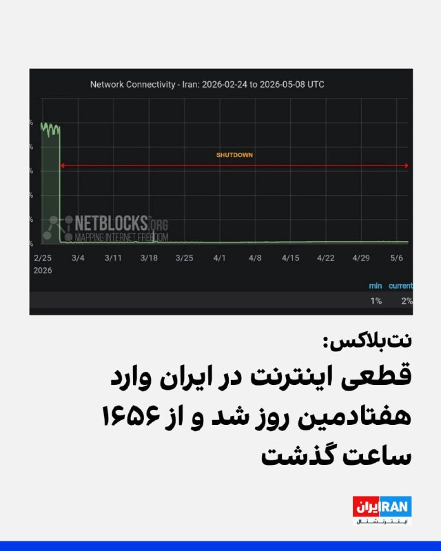

نت‌بلاکس، نهاد ناظر بر اختلال‌های اینترنتی در جهان، صبح جمعه ۱۸ اردیبهشت اعلام کرد قطعی اینترنت در ایران وارد هفتادمین روز شده و مدت این اختلال از ۱۶۵۶ ساعت گذشته است.
نت‌بلاکس تاکید کرد ارتباطات دیجیتال در زمان بحران حیاتی است و محدود کردن خدمات اینترنتی به افراد دارای معلولیت، دانشجویان، کسب‌وکارهای کوچک و عموم مردم آسیب می‌زند. iranintl.com/202605084765

## IranIntlTV — post 336092

  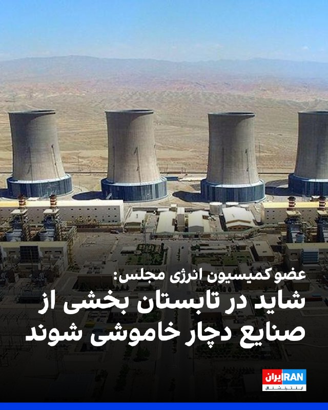

رضا سپهوند، عضو کمیسیون انرژی مجلس، گفت که ممکن است در تابستان خاموشی‌هایی رخ دهد، اما تلاش بر این است که در بخش برق خانگی خاموشی اعمال نشود.

او افزود ممکن است بخشی از صنایع دچار خاموشی شوند، اما میزان آن کمتر از سال گذشته خواهد بود.
این نماینده مجلس ادامه داد: «برخی از توان ما در فولاد مبارکه و پتروشیمی‌های منطقه عسلویه آسیب دیده‌اند و بازسازی آن‌ها هم مدتی زمان خواهد برد.»
https://iranintl.com/202605080425

## FoxNewsChannel — post 3

Channel photo removed

## FoxNewsChannel — post 1

Channel created

## Shin_Persian — post 5888

📦 mhrv-rs v1.9.18 released

• Performance refactor of the full-tunnel mux hot data path (#881)

Files (Android APKs, Windows, macOS, Linux, OpenWRT) on the files channel:

👉 v1.9.18 — all files with SHA-256

Channel:
https://t.me/mhrv_rs
or: https://t.me/+R1OyoHX2boA1ZDgx

#v1918

## Shin_Persian — post 5887

  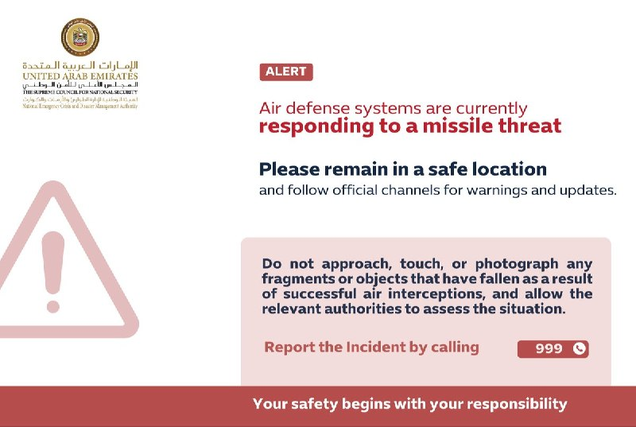

NCEMA UAE ✓ @NCEMAUAE
Fri, 08 May 2026 02:35:52 UTC

Air defense systems are currently responding to a missile threat. Please remain in a safe location and follow official channels for warnings and updates.

فارسی

سامانه‌های پدافند هوایی در حال حاضر در حال مقابله با یک تهدید موشکی هستند. لطفاً در مکان امن بمانید و کانال‌های رسمی را برای هشدارها و به‌روزرسانی‌ها دنبال کنید.

𝕏 · @shin_persian

## Shin_Persian — post 5886

Shin ✓ @hey_itsmyturn
Fri, 08 May 2026 02:35:30 UTC

NOW -
Seek shelter alert in #UAE 🇦🇪

فارسی

فوری -
هشدار پناه گرفتن در امارات متحده عربی (#UAE) 🇦🇪

𝕏 · @shin_persian

## Shin_Persian — post 5885

  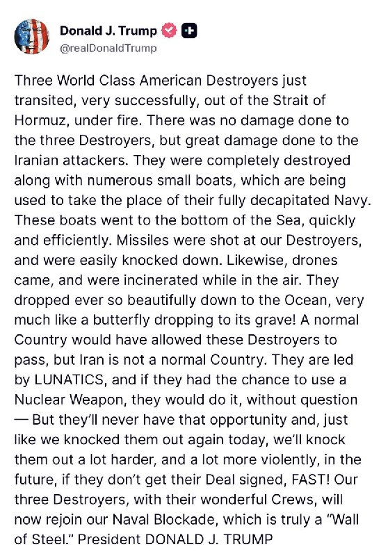

Rapid Response 47 ✓ @RapidResponse47
Thu, 07 May 2026 22:35:05 UTC

𝕏 · @shin_persian

## Shin_Persian — post 5882

  

Faytuks News ✓ @Faytuks
Thu, 07 May 2026 22:04:11 UTC

Iran's state Mehr News agency is reporting a new explosion in Sirik, southern Iran.

فارسی

خبرگزاری دولتی مهر ایران از وقوع انفجاری جدید در سیریک، واقع در جنوب ایران خبر می‌دهد.

𝕏 · @shin_persian

## Shin_Persian — post 5881

  <a href="telegram/content/Shin_Persian_5881_1778236386.mp4" target="_blank">🎬 Download video</a>

Shin ✓ @hey_itsmyturn
Thu, 07 May 2026 21:40:45 UTC

𝕏 · @shin_persian

## Shin_Persian — post 5880

U.S. Central Command ✓ @CENTCOM
Thu, 07 May 2026 21:33:12 UTC

http://x.com/i/article/2052495597194936320

𝕏 · @shin_persian

## Shin_Persian — post 5879

Shin ✓ @hey_itsmyturn
Thu, 07 May 2026 21:30:48 UTC

Jet activity over #Kuwait 🇰🇼

فارسی

فعالیت جنگنده‌ها برفراز #Kuwait 🇰🇼

𝕏 · @shin_persian

## Shin_Persian — post 5878

Shin ✓ @hey_itsmyturn
Thu, 07 May 2026 21:18:24 UTC

Aerial activity in Shiraz, Fars Province, #Iran

فارسی

فعالیت هوایی در شیراز، استان فارس، #Iran

𝕏 · @shin_persian

## Shin_Persian — post 5877

  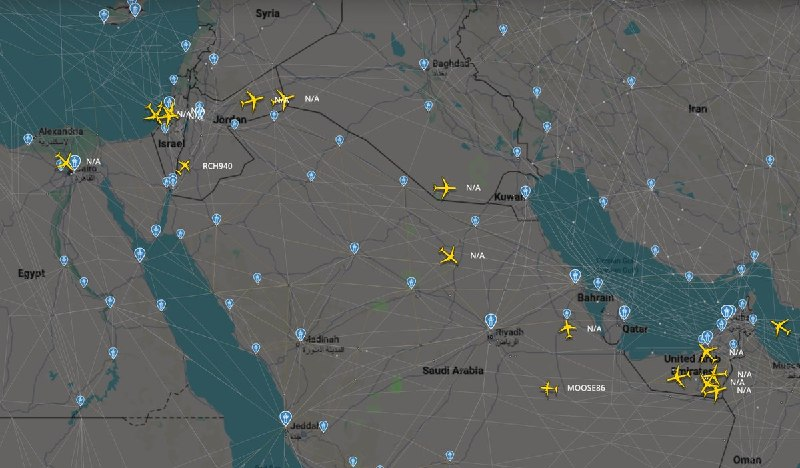

Shin ✓ @hey_itsmyturn
Thu, 07 May 2026 21:12:30 UTC

well..

فارسی

خب..

𝕏 · @shin_persian

## Shin_Persian — post 5876

Shin ✓ @hey_itsmyturn
Thu, 07 May 2026 21:10:52 UTC

Intense jet activity over Baghdad
#Iraq 🇮🇶

فارسی

فعالیت شدید جنگنده‌ها بر فراز بغداد
#Iraq 🇮🇶

𝕏 · @shin_persian

## Shin_Persian — post 5874

Jennifer Griffin ✓ @JenGriffinFNC
Thu, 07 May 2026 20:36:57 UTC

NEW: US military just carried out strikes on Iran’s Qeshm Port and Bandar Abbas: Senior US official tells me, but this is NOT a restarting of the war.

MORE

فارسی

جدید: ارتش ایالات متحده به تازگی حملاتی را علیه بندر قشم و بندرعباس ایران انجام داده است: یک مقام ارشد آمریکایی به من گفت، اما این به معنای شروع مجدد جنگ نیست.

بیشتر (MORE)

𝕏 · @shin_persian

## Shin_Persian — post 5873

Shin ✓ @hey_itsmyturn
Thu, 07 May 2026 20:47:54 UTC

NOW @ 2047Z
AA activity, western Tehran
#Tehran Province, #Iran

فارسی

هم‌اکنون در ۲۰۴۷ زولو (۰۰:۱۷ به وقت تهران)
فعالیت پدافند هوایی، غرب تهران
#استان_تهران، #ایران

𝕏 · @shin_persian

## Shin_Persian — post 5872

Shin ✓ @hey_itsmyturn
Thu, 07 May 2026 20:29:08 UTC

NOW @ 2028Z
Renewed AA activity in western Tehran
#Tehran Province, #Iran

فارسی

هم‌اکنون @ ۲۰۲۸ زولو (ساعت ۲۳:۵۸ به وقت تهران)
فعالیت مجدد پدافند هوایی در غرب تهران
#Tehran Province, #Iran

𝕏 · @shin_persian

## Shin_Persian — post 5871

Shin ✓ @hey_itsmyturn
Thu, 07 May 2026 20:24:29 UTC

AA activity western Tehran
Tehran Province, #Iran

فارسی

فعالیت پدافند هوایی در غرب تهران
استان تهران، #Iran

𝕏 · @shin_persian

## Shin_Persian — post 5870

Shin ✓ @hey_itsmyturn
Thu, 07 May 2026 20:24:10 UTC

NOW -
3 blast sounds in western Tehran
#Tehran Province, #Iran

فارسی

فوری -
شنیده شدن صدای ۳ انفجار در غرب تهران
#Tehran Province, #Iran

𝕏 · @shin_persian

## Shin_Persian — post 5869

  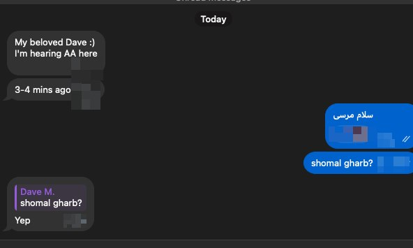

Shin ✓ @hey_itsmyturn
Thu, 07 May 2026 20:14:45 UTC

AA activity, northwestern Tehran
#Tehran Province, #Iran

فارسی

فعالیت پدافند هوایی، شمال غربی تهران
#Tehran Province, #Iran

𝕏 · @shin_persian

## Shin_Persian — post 5867

Shin ✓ @hey_itsmyturn
Thu, 07 May 2026 19:50:09 UTC

Earlier: AA activity in Bidganeh (Bidkaneh), West of Tehran
Regime confirms, adds that it was "due to testing the air defense systems"

فارسی

پیش‌تر: فعالیت پدافند هوایی در بیدگنه، غرب تهران
رژیم تایید کرد و افزود که این موضوع «به دلیل آزمایش سامانه‌های پدافند هوایی» بوده است.

𝕏 · @shin_persian

## Shin_Persian — post 5866

↩️ Quoted tweet: Josh Young ✓ @JoshYoung Thu, 07 May 2026 19:43:33 UTC "Peace" in the Middle East sure is different! https://x.com/i/status/2052467946404950427 ↩️ توییت نقل‌قول شده — برای پاسخ، پست زیر را ببینید. فارسی «صلح» در خاورمیانه واقعاً متفاوت…

## Shin_Persian — post 5865

↩️ Quoted tweet:
Josh Young ✓ @JoshYoung
Thu, 07 May 2026 19:43:33 UTC

"Peace" in the Middle East sure is different!
https://x.com/i/status/2052467946404950427

↩️ توییت نقل‌قول شده — برای پاسخ، پست زیر را ببینید.

فارسی

«صلح» در خاورمیانه واقعاً متفاوت است!
https://x.com/i/status/2052467946404950427

𝕏 · @shin_persian

## Iliaen — post 4433

نیروی دریایی سپاه بندر خمیر (هرمزگان)، شرکت و مجموعه کشتی‌سازی جزیره قشم، ساختمان هماهنگی سپاه در اسکله بهمن جزیره قشم، سایت موشکی سیریک هرمزگان و پایگاه هوایی بندرعباس هدف حملات ایالات متحده در حملات ساعات گذشته بودند.

همچنین تا این لحظه (ساعت ۰۳:۰۷ صبح جمعه)، گزارش‌ها از مشاهده و تداوم حضور پهپادهای شناسایی در خط ساحلی جنوب (بندرعباس، سیریک و بندر جاسک) حکایت دارد.

@iliaen

## Iliaen — post 4432

  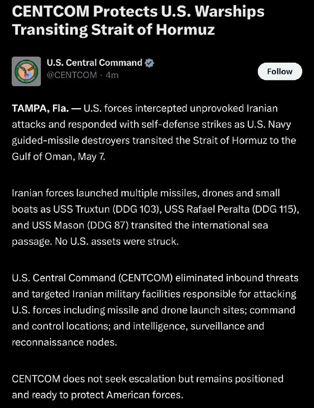

سنتکام در یک اطلاعیه رسمی اعلام کرد:

سایت‌های پرتاب موشک و پهپاد، همچنین مراکز فرماندهی، مرکز کنترل و گره‌های اطلاعاتی، نظارتی و شناسایی جمهوری اسلامی که از آن‌ها جهت حمله به نیروی دریایی ایالات متحده استفاده می‌شد را مورد هدف قرار داد.

@iliaen

## Iliaen — post 4431

  <a href="telegram/content/Iliaen_4431_1778236390.mp4" target="_blank">🎬 Download video</a>

مشاهده یک شی نورانی در آسمان سیریک (هرمزگان)؛ پس از چند دقیقه صدای انفجار شنیده شد.

@iliaen

## Iliaen — post 4430

  <a href="telegram/content/Iliaen_4430_1778236390.mp4" target="_blank">🎬 Download video</a>

ساعت ۲۳:۵۷ پنجشنبه؛ تهران محدوده‌ی شهران

@iliaen

## Iliaen — post 4429

ساعت ۲۳:۵۵ پنجشنبه؛ پدافند غرب تهران فعال شد.

@iliaen

## Iliaen — post 4428

  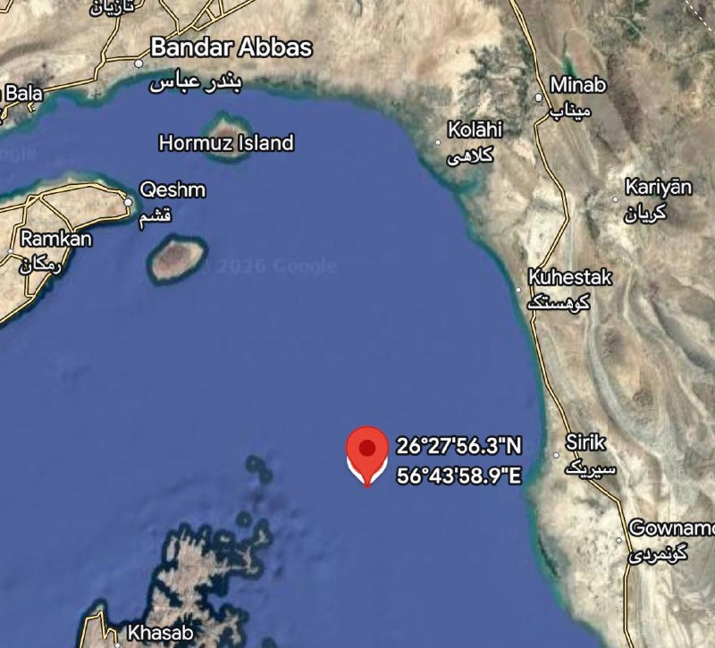

یک موشک از مبدا ناشناس در دریا منفجر شد؛ ممکن است به یک کشتی یا قایق اصابت کرده باشد.

محدوده‌ تصویر و همچنین مختصات زیر محل تقریبی برخورد براساس مشاهده شاهدان است:

26.4656409, 56.7330182

@iliaen

## Iliaen — post 4427

ساعت حدود ۲۳:۱۵ پنجشنبه؛ تعداد ۷ یا ۸ موشک از جنوب هرمزگان به سمت محدوده‌ی تنگه هرمز شلیک شد.

@iliaen

## Iliaen — post 4426

ساعت ۲۲:۱۴ پنجشنبه؛ انفجار بسیار مهیب در سیریک هرمزگان گزارش می‌شود.

@iliaen

## Iliaen — post 4425

  <a href="telegram/content/Iliaen_4425_1778236392.mp4" target="_blank">🎬 Download video</a>

تهرانپارس؛ یک شی نورانی مانند پهپاد در فاصله‌ی چند صدمتری از سطح زمین پرواز می‌کند.

@iliaen

## Iliaen — post 4424

ساعت ۲۲:۰۷ پنجشنبه؛ تعداد ۶ انفجار با فاصله ۴۰ ثانیه از یکدیگر در سیریک (هرمزگان) شنیده شد.

@iliaen

## Iliaen — post 4423

ساعت ۲۲:۰۵ پنجشنبه؛ ساکنان نزدیک به اسکله‌ی بندرعباس از شنیده شدن صدای انفجار در دریا خبر می‌دهند.

@iliaen

## Iliaen — post 4422

سنتکام: نیروی دریایی ایالات متحده ۶ قایق کوچک (تندرو) جمهوری اسلامی را غرق کرد.

@iliaen

## Iliaen — post 4421

ساعت ۱۹:۴۳ دوشنبه؛ چند موشک دیگر از جنوب هرمزگان به سمت خلیج فارس شلیک شد.

@iliaen

## Iliaen — post 4420

آماده دور جدید حملات باشید.

## Iliaen — post 4419

ساعت ۱۹:۱۹ دوشنبه؛ ساکنان دوبی از دریافت پیام هشدار چهارم خبر می‌دهند.

@iliaen

## Iliaen — post 4418

  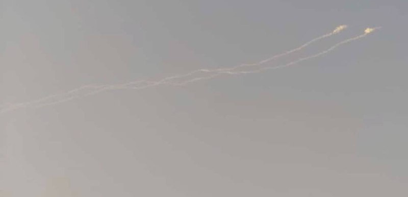

دو موشک در آسمان سیریک (هرمزگان)

@iliaen

## Iliaen — post 4417

ساعت حدود ۱۹:۰۰ دوشنبه؛ یک موشک شلیک شده از سمت سیریک (هرمزگان) چند لحظه بعد در آسمان ایران منفجر شد.

همچنین گزارش‌ها از شنیده شدن یک انفجار مهیب از سمت دریای عمان حکایت دارد.

@iliaen

## Iliaen — post 4416

جمهوری اسلامی درحال حمله پهپادی و موشکی به مکانی در نزدیک دوبی است.

تاکنون ۴ موشک کروز توسط پدافند امارات رهگیری و خنثی شدند؛ همچنین یک نقطه در منطقه نفت فجیره (امارات) هدف اصابت پهپاد قرار گرفت.

@iliaen

## Iliaen — post 4415

ساعت ۱۸:۵۰ دوشنبه؛ برای سومین بار در یک ساعت اخیر هشدار حملات موشکی به ساکنان دوبی ارسال شد.

@iliaen

## Iliaen — post 4414

ساعت حدود ۱۸:۲۰ دوشنبه؛ یک موشک از سمت روستای کرپان (جنوب هرمزگان) به سمت مکانی در خلیج فارس شلیک شد.

@iliaen

## CnnBrk — post 247615

For sale. From $50 in USDT to the best and first offer I get

## CnnBrk — post 247614

A Russian court extends US journalist Evan Gershkovich's pre-trial detention by three months, state media reports. Follow live updates. https://t.co/1kSWVjtS7s — CNN Breaking News (@cnnbrk) May 23, 2023

May 23, 2023 at 04:43PM
via Twitter https://twitter.com/cnnbrk

## CnnBrk — post 247613

Prince Harry cannot pay for his own police security while in the UK, after losing High Court challengehttps://t.co/AWMBnitDaO — CNN Breaking News (@cnnbrk) May 23, 2023

May 23, 2023 at 11:39AM
via Twitter https://twitter.com/cnnbrk

## CnnBrk — post 247612

E. Jean Carroll asks judge to amend her initial defamation case to seek further damages for what Donald Trump said at a CNN town hall https://t.co/FnCHP34sKr — CNN Breaking News (@cnnbrk) May 22, 2023

May 22, 2023 at 10:50PM
via Twitter https://twitter.com/cnnbrk

## CnnBrk — post 247611

Treasury Secretary Janet Yellen reinforces her warning to Congress that it has only a little time left to address the debt ceiling https://t.co/KyjRZSLsds — CNN Breaking News (@cnnbrk) May 22, 2023

May 22, 2023 at 09:39PM
via Twitter https://twitter.com/cnnbrk

## CnnBrk — post 247610

TikTok sues Montana over a bill that would ban the popular short-form video app in the state starting early next year, alleging the state's ban violates the US Constitution, including the First Amendment, as well as other federal laws https://t.co/6wrmVVsLeE — CNN Breaking News (@cnnbrk) May 22, 2023

May 22, 2023 at 09:25PM
via Twitter https://twitter.com/cnnbrk

## CnnBrk — post 247609

Nebraska bill that bans most abortions at 12 weeks and gender-affirming care for those under 19 is signed into law by Republican Gov. Jim Pillen https://t.co/9Ri72Vtv4o — CNN Breaking News (@cnnbrk) May 22, 2023

May 22, 2023 at 07:26PM
via Twitter https://twitter.com/cnnbrk

## CnnBrk — post 247608

Judge enters not guilty pleas on behalf of Bryan Kohberger, the man charged with first-degree murder in the fatal stabbings of four Idaho college students https://t.co/4rTXSb8PDY — CNN Breaking News (@cnnbrk) May 22, 2023

May 22, 2023 at 05:35PM
via Twitter https://twitter.com/cnnbrk

## CnnBrk — post 247607

Longtime Democratic Sen. Tom Carper of Delaware announces he won't seek reelection in 2024, says it's an "opportune time to step aside"https://t.co/6FvQuhUfv3 — CNN Breaking News (@cnnbrk) May 22, 2023

May 22, 2023 at 04:55PM
via Twitter https://twitter.com/cnnbrk

## CnnBrk — post 247606

Turkey's third-placed presidential election candidate backs frontrunner Erdogan in a boost ahead of crucial second-round votehttps://t.co/CBMZE80jnv — CNN Breaking News (@cnnbrk) May 22, 2023

May 22, 2023 at 04:01PM
via Twitter https://twitter.com/cnnbrk

## CnnBrk — post 247605

At least 20 people have been killed and several others injured in a school dormitory fire in Guyana, officials sayhttps://t.co/OMIiXXJKDO — CNN Breaking News (@cnnbrk) May 22, 2023

May 22, 2023 at 11:05AM
via Twitter https://twitter.com/cnnbrk

## CnnBrk — post 247604

Meta receives a record-breaking $1.3 billion fine from European regulators for transferring Facebook's EU user data to servers in the UShttps://t.co/I9Po2ZgjtU — CNN Breaking News (@cnnbrk) May 22, 2023

May 22, 2023 at 10:46AM
via Twitter https://twitter.com/cnnbrk

## CnnBrk — post 247603

President Biden and House Speaker McCarthy are set to meet Monday to discuss the debt ceiling as staff-level talks resume https://t.co/qg1bRjJArf — CNN Breaking News (@cnnbrk) May 21, 2023

May 21, 2023 at 06:51PM
via Twitter https://twitter.com/cnnbrk

## CnnBrk — post 247602

National Treasure was first across the finish line in the 2023 Preakness Stakeshttps://t.co/ZPxpOShkHY — CNN Breaking News (@cnnbrk) May 20, 2023

May 21, 2023 at 12:13AM
via Twitter https://twitter.com/cnnbrk

## CnnBrk — post 247601

Head of Russian private military group Wagner claims complete capture of embattled eastern Ukrainian city of Bakhmut. Ukraine partially disputed it. https://t.co/UCZMdTb9ce — CNN Breaking News (@cnnbrk) May 20, 2023

May 20, 2023 at 03:31PM
via Twitter https://twitter.com/cnnbrk

## CnnBrk — post 247600

Nebraska lawmakers pass a 12-week abortion ban and restrictions on gender-affirming care for those under 19. The governor has said he'll sign the bill. https://t.co/1GTrCBgjFQ — CNN Breaking News (@cnnbrk) May 19, 2023

May 19, 2023 at 11:11PM
via Twitter https://twitter.com/cnnbrk

## CnnBrk — post 247599

The Justice Department wins its antitrust lawsuit that sought to end an alliance between JetBlue and American Airlines https://t.co/pUnXCCNOtN — CNN Breaking News (@cnnbrk) May 19, 2023

May 19, 2023 at 09:27PM
via Twitter https://twitter.com/cnnbrk

## CnnBrk — post 247598

Jim Brown, former fullback for the Cleveland Browns and a prominent activist in the civil rights movement, has died at age 87, his former team tweeted https://t.co/zyICI3bBYA — CNN Breaking News (@cnnbrk) May 19, 2023

May 19, 2023 at 09:16PM
via Twitter https://twitter.com/cnnbrk

## CnnBrk — post 247597

Republican Sen. Tim Scott of South Carolina has filed to run for president in 2024, according to the FEC website https://t.co/aGPEBzzHBu — CNN Breaking News (@cnnbrk) May 19, 2023

May 19, 2023 at 04:43PM
via Twitter https://twitter.com/cnnbrk

## CnnBrk — post 247596

A DC metro police officer is accused of misleading investigators about communications with Proud Boys leader Enrique Tarrio and tipping him off about his arrest https://t.co/KsCYVBHB64 — CNN Breaking News (@cnnbrk) May 19, 2023

May 19, 2023 at 03:57PM
via Twitter https://twitter.com/cnnbrk

## reutersworldchannel — post 151524

  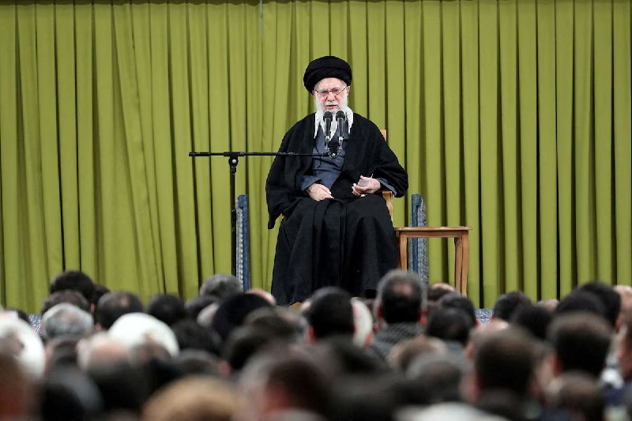

Iran confirms supreme leader Khamenei is dead after US, Israeli attacks

Iranian state media reported that Khamenei "was carrying out his assigned duties and was present at his workplace (his office)".

"This cowardly attack occurred in the early hours of Saturday morning", state media said.

"We have lost a great leader and we are mourning him, a leader who was unique in in terms of purity of spirit, strength of faith, resourcefulness in affairs, courage in the face of the arrogant, and jihad in the path of God", a statement from Iran's Revolutionary Guards said. read more

## reutersworldchannel — post 151523

  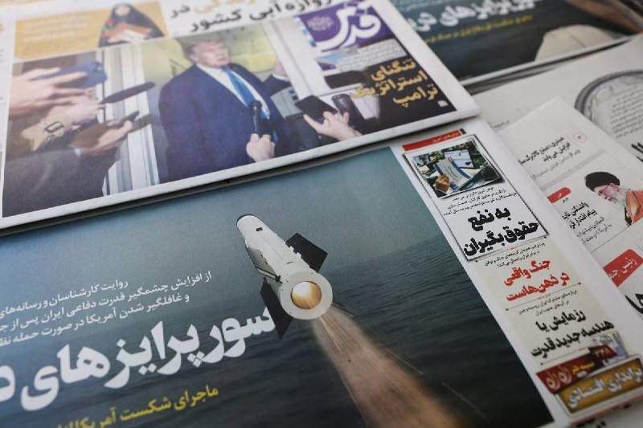

Exclusive: Iran nears deal to buy supersonic anti-ship missiles from China

Iran is close to a deal with China to purchase anti‑ship cruise missiles, according to six people with knowledge of the negotiations, just as the United States deploys a vast naval force near the Iranian coast ahead of possible strikes on the Islamic Republic.

The deal for the Chinese‑made CM‑302 missiles is near completion, though no delivery date has been agreed, the people said. The supersonic missiles have a range of about 290 kilometres and are designed to evade shipborne defences by flying low and fast. Their deployment would significantly enhance Iran’s strike capabilities and pose a threat to U.S. naval forces in the region, two weapons experts said. read more

## reutersworldchannel — post 151522

  

Police arrest King Charles' brother Andrew over misconduct relating to Epstein

King Charles' younger brother Andrew Mountbatten-Windsor was on Thursday arrested on suspicion of misconduct in public office over allegations he sent confidential government documents to Jeffrey Epstein.

Mountbatten-Windsor, celebrating his 66th birthday on Thursday, was arrested and questioned by detectives from Thames Valley Police, which this month said it was looking into allegations that he had passed documents to the late convicted sex offender while working as a trade envoy. read more

## reutersworldchannel — post 151521

  

North Korea says South Korea should take steps to prevent violation of its sovereignty

The sister of North Korea's ruler said on Friday that South Korean authorities should take steps to prevent "reoccurrence of provocative sovereignty violation," state media KCNA reported, referring to a drone flown into its airspace recently.

Kim Yo Jong, the powerful sister of North Korean leader Kim Jong Un, said in a statement she appreciates the South Korean Unification Minister Chung Dong-young's expression of his regret over the "drone intrusion" as "sensible behavior," KCNA reported. read more

## reutersworldchannel — post 151520

  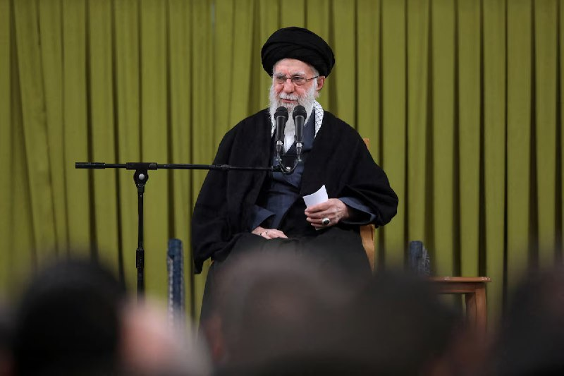

Iran, US to negotiate in Oman amid deep rifts and mounting war fears

Iran and the United States are set to hold high-stakes negotiations in Oman on Friday over Tehran's nuclear programme, but a dispute over the agenda suggests progress will be hard won amid the threat of a regional Middle East war.

While both sides have signalled readiness to revive diplomacy over Tehran's long-running nuclear dispute with the West, Washington wants the talks to cover Iran's nuclear programme, its ballistic missiles, support for armed groups around the region and its "treatment of their own people", U.S. Secretary of State Marco Rubio said on Wednesday. read more

## reutersworldchannel — post 151519

  

Paris prosecutor's cybercrime unit searches X office, Musk summoned

French police raided the offices of Elon Musk's social media network X and prosecutors ordered the tech billionaire to face questions in April related to a widening investigation into the platform, the Paris prosecutor's office said on Tuesday.

The raid and the summoning of Musk - which could further increase tensions between Europe and the U.S. over big tech and free speech - are linked to a year-long investigation into suspected abuse of algorithms and fraudulent data extraction by X or its executives. read more

## reutersworldchannel — post 151518

  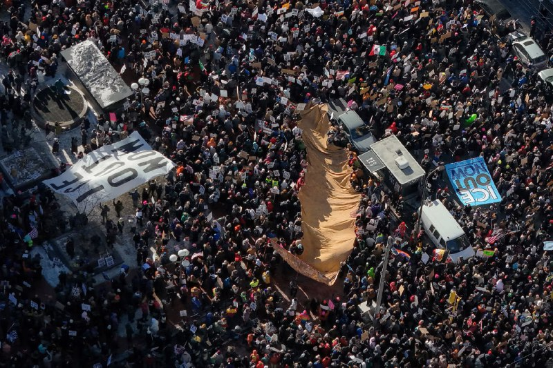

Thousands demonstrate in Minnesota and across US to protest ICE

Thousands of protesters took to the streets in Minneapolis and students across the United States staged walkouts on Friday to demand the withdrawal of federal immigration agents from Minnesota following the fatal shootings of two U.S. citizens.

Students and teachers abandoned classes from California to New York on a national day of protest, which came amid mixed messages from the Trump administration about whether it would de-escalate Operation Metro Surge. read more

## reutersworldchannel — post 151517

  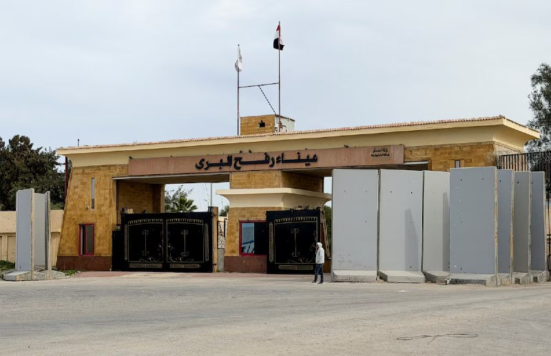

Gaza’s Rafah crossing with Egypt to reopen on Sunday, Israel says

Israel will reopen the Rafah border crossing on Sunday for people to travel between Gaza and Egypt, a government agency said, the first opening of effectively the sole route in or out of the Palestinian territory since May 2024.

The Israeli government agency that coordinates civilian policy in Gaza, COGAT, did not say how many of Gaza's more than 2 million people would be allowed to cross the border per day. read more

## reutersworldchannel — post 151516

  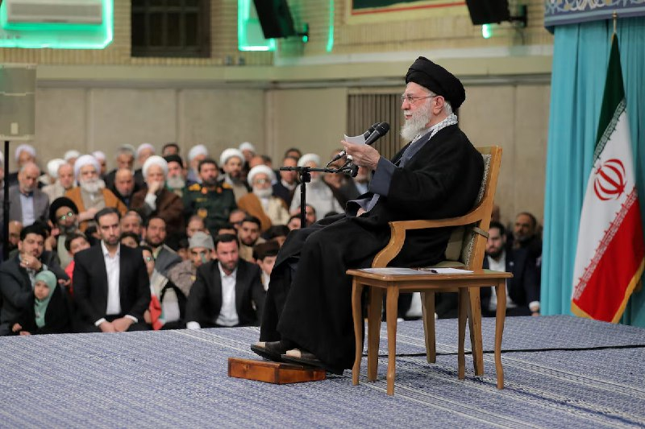

Iran's leader Khamenei blames Trump for inciting deadly protests

Iran's Supreme Leader Ayatollah Ali Khamenei on Saturday blamed President Donald Trump for weeks of protests after rights groups said a violent crackdown by security forces had claimed thousands of lives.

The protests erupted on December 28 over economic hardship and swelled into widespread demonstrations calling for the end of clerical rule in the Islamic Republic. read more

## reutersworldchannel — post 151513

  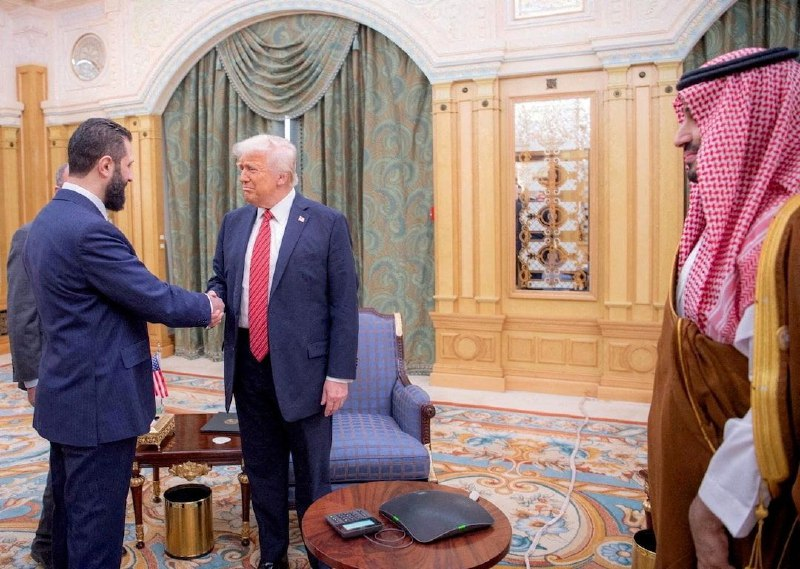

Exclusive: US military to establish presence at Damascus airbase, sources say

The United States is preparing to establish a military presence at an airbase in Damascus to help enable a security pact that Washington is brokering between Syria and Israel, six sources familiar with the matter told Reuters.

The U.S. plans for the presence in the Syrian capital, which have not previously been reported, would be a sign of Syria's strategic realignment with the U.S. following the fall last year of longtime leader Bashar al-Assad, an ally of Iran. read more

## reutersworldchannel — post 151511

  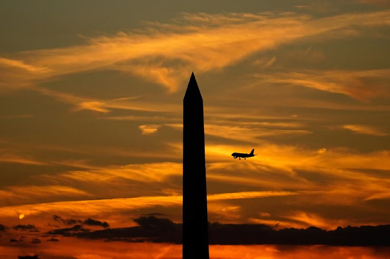

US orders 10% flights cut at major US airports due to shutdown

U.S. Transportation Secretary Sean Duffy said on Wednesday that he would order a 10% cut in flights at 40 major U.S. airports, citing air traffic control safety concerns as a government shutdown hit a record 36th day.

The drastic plan sent airlines scrambling to make significant reductions in flights in just 36 hours and passengers flooded airline customer service hotlines with concerns about air travel in the coming days. read more

## reutersworldchannel — post 151510

  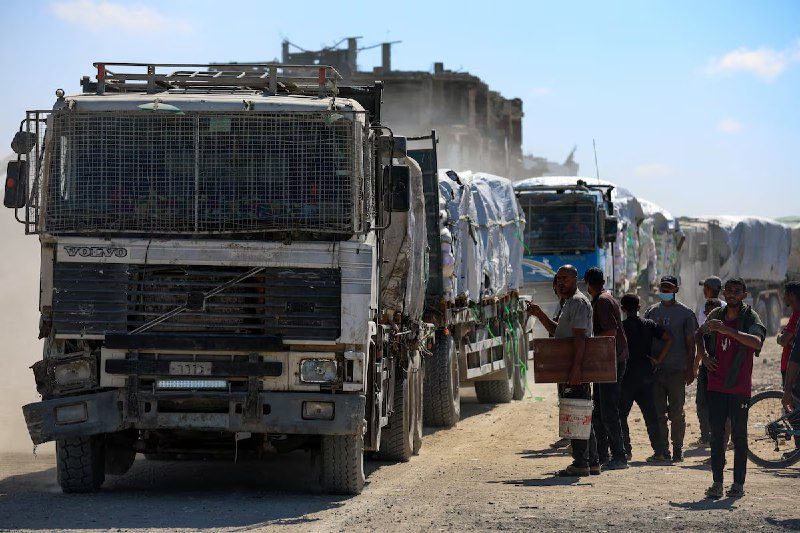

Aid trucks roll into Gaza as dispute over hostage bodies is paused

Aid trucks rolled into Gaza on Wednesday and Israel resumed preparations to open the main Rafah crossing after a dispute over the return of the bodies of dead hostages that had threatened to derail the fragile ceasefire deal with Hamas.

Israel had threatened to keep Rafah shut and reduce aid supplies because Hamas was returning bodies too slowly, showing the risks to a truce that has stopped two years of devastating warfare in Gaza and freed all living hostages held by Hamas. read more

## reutersworldchannel — post 151509

  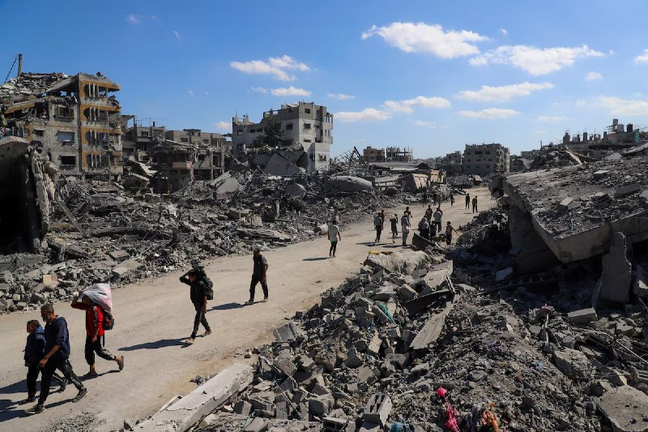

Hamas fighters tighten grip in Gaza, clouding future of ceasefire

Hamas fighters tightened their grip in Gaza on Tuesday after carrying out public executions, defying Israel's assertion that war cannot end under U.S. President Donald Trump's plan until the militants are disarmed.

In a stark assertion of the group's return, fighters executed men they accused of collaborating with Israeli forces. In one video circulated late on Monday, Hamas fighters dragged seven men into a circle of people in Gaza City, forced them to their knees and shot them from behind. A Hamas source confirmed the authenticity of the video. read more

## reutersworldchannel — post 151508

  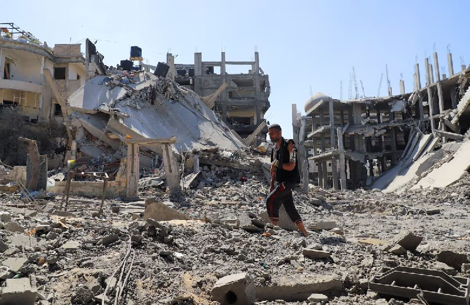

Israel and Hamas agree to Gaza ceasefire and return of hostages

Israel and Hamas said they had agreed to a long-awaited ceasefire and hostage deal, the first phase of U.S. President Donald Trump's plan to end a war in Gaza that has killed more than 67,000 people and reshaped the Middle East.

Just a day after the second anniversary of Hamas militants' cross-border attack that triggered Israel's devastating assault on Gaza, indirect talks in Egypt yielded an agreement on the initial stage of Trump’s 20-point framework to bring peace to the Palestinian enclave. read more

## reutersworldchannel — post 151507

  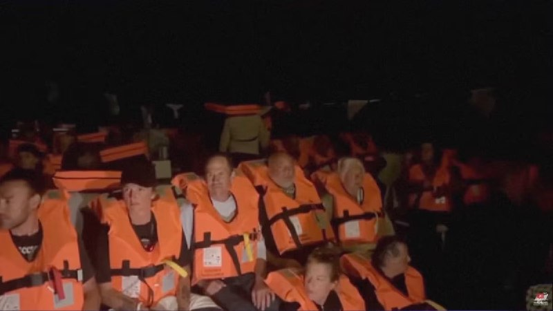

Gaza aid flotilla says Israeli forces intercepted its boats

A group of vessels attempting to deliver aid to the war-ravaged Gaza Strip was intercepted by Israeli forces in international waters on Wednesday, the coalition behind the convoy said, the second such interception in the past week.

The Freedom Flotilla Coalition (FFC) is an international network of pro-Palestinian activist groups that organises civilian maritime missions aimed at breaking Israel's blockade of Gaza to deliver humanitarian aid to Palestinians in the enclave. read more

## reutersworldchannel — post 151506

  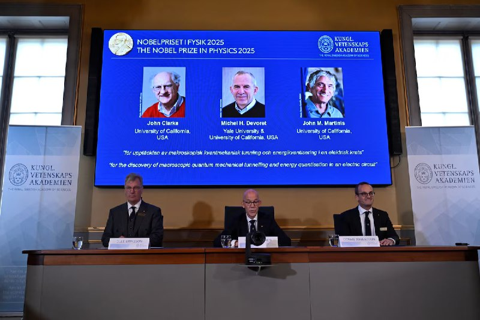

Trio win Nobel prize for revealing quantum physics in action

U.S.-based scientists John Clarke, Michel Devoret and John Martinis won the 2025 Nobel Prize in Physics for "experiments that revealed quantum physics in action", paving the way for the development of the next generation of digital technologies.

"My feelings are that I'm completely stunned. Of course it had never occurred to me in any way that this might be the basis of a Nobel Prize," Clarke told the Nobel press conference by telephone on Tuesday. read more

## reutersworldchannel — post 151505

  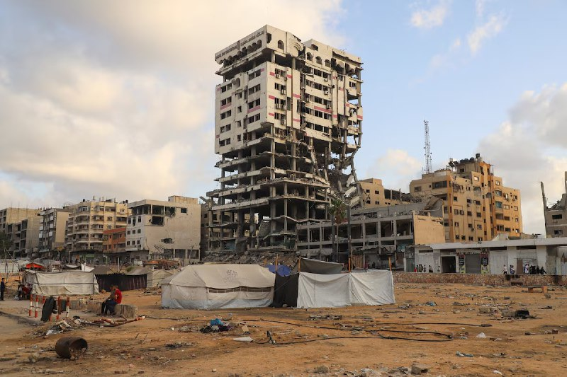

Hamas readies for Gaza talks that US hopes will halt war, free hostages

Hamas officials arrived in Egypt on Sunday ahead of talks with Israel that the U.S. hopes will lead to a halt in fighting and the freeing of hostages in Gaza, with Washington's top diplomat saying the next days are critical.

Israeli negotiators led by Strategic Affairs Minister Ron Dermer were to travel to Egypt on Monday for negotiations in the Red Sea resort of Sharm el-Sheikh about the release of hostages, part of U.S. President Donald Trump's plan to end the nearly two-year Gaza war. read more

## reutersworldchannel — post 151504

  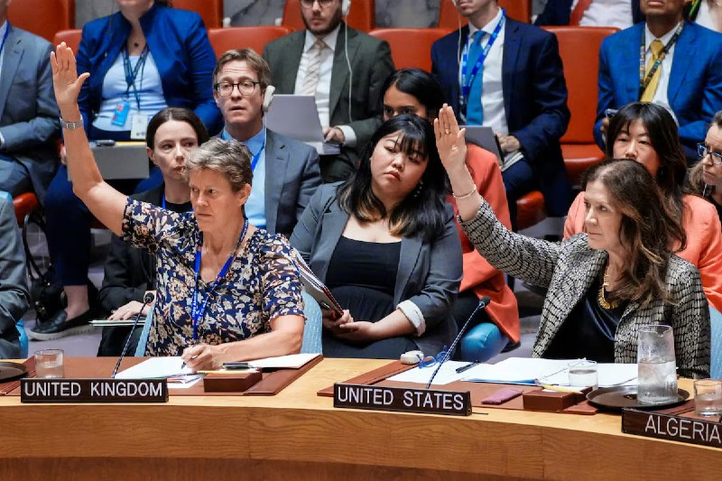

UN arms embargo, other sanctions reimposed on Iran over nuclear programme

The United Nations has reinstated an arms embargo and other sanctions on Iran over its nuclear programme following a process triggered by European powers that Tehran has warned will be met with a harsh response.

Britain, France and Germany initiated the return of sanctions on Iran at the U.N. Security Council over accusations it had violated a 2015 deal that aimed to stop it developing a nuclear bomb. Iran denies seeking nuclear weapons. read more

## reutersworldchannel — post 151503

  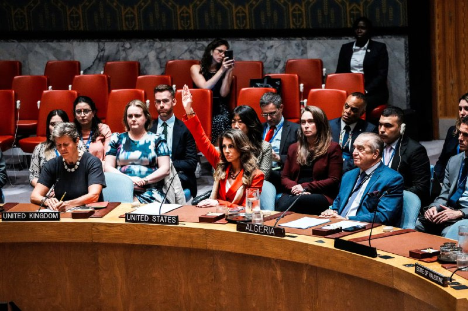

US casts 6th veto at United Nations over war in Gaza

The United States vetoed on Thursday a draft United Nations Security Council resolution that would have demanded an immediate, unconditional and permanent ceasefire in Gaza and that Israel lift all restrictions on aid deliveries to the Palestinian enclave.

The text, drafted by the elected 10 members of the 15-member council, would also have demanded the immediate, dignified and unconditional release of all hostages held by Hamas and other groups. read more

## reutersworldchannel — post 151502

  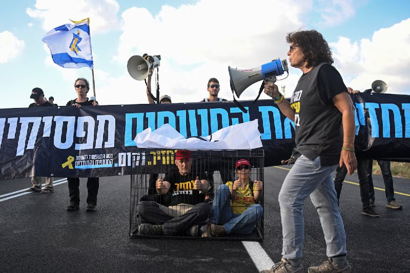

Families leave Gaza City after night of bombardment, Israelis protest

More Palestinian families left Gaza City on Tuesday after a night of Israeli shelling on its outskirts, as Israelis launched a day of nationwide protests calling for hostages to be released and the war in Gaza to end.

Residents said Israeli aerial and tank shelling continued throughout the night and early on Tuesday in the eastern Gaza City suburbs of Sabra, Shejaia, and Tuffah, as well as in Jabalia town to the north, destroying roads and houses. read more

## ManotoTV — post 105129

  <a href="telegram/content/ManotoTV_105129_1778236418.mp4" target="_blank">🎬 Download video</a>

صدا و سیمای جمهوری‌اسلامی در گزارشی از توقیف نفتکش «اوشن کیوی» در دریای عمان توسط ارتش خبر داده است. بر پایه این گزارش Ocean Koi «در صدد ایجاد اخلال در صادرات نفت و منافع ملت ایران» توصیف شده که تا سواحل جنوبی ایران اسکورت و «به مقامات قضایی» تحویل داده شده است.

## ManotoTV — post 105128

  <a href="telegram/content/ManotoTV_105128_1778236418.mp4" target="_blank">🎬 Download video</a>

آسیا نخستین محموله نفت کوره مکزیک در ۹ ماه گذشته را دریافت کرد؛ اقدامی که پس از اختلال صادرات خاورمیانه به‌دلیل جنگ ایران و افزایش قیمت سوخت در آسیا رخ داده است.
به گزارش رویترز، کاهش عرضه از عراق و کویت از مسیر تنگه هرمز باعث شده بازار آسیا به‌دنبال منابع جایگزین برود. در همین راستا، نفتکش «اوریون» حامل ۱۶۰ هزار تن نفت کوره مکزیک به سنگاپور رسیده و شرکت دولتی پمکس نیز محموله دیگری برای تحویل در ژوئن عرضه کرده است.
معامله‌گران می‌گویند افزایش قیمت در آسیا و مازاد عرضه در قاره آمریکا، صادرات نفت کوره مکزیک به شرق آسیا را سودآورتر کرده است.

## ManotoTV — post 105127

  <a href="telegram/content/ManotoTV_105127_1778236419.mp4" target="_blank">🎬 Download video</a>

رویترز گزارش داده «وزارت اقیانوس‌های» کره جنوبی اعلام کرد که دولت در حال بررسی علت انفجار در یک کشتی تحت مدیریت کره جنوبی است؛ این در حالی است که تردیدهایی درباره هدف حمله قرار گرفتن این کشتی در تنگه هرمز وجود دارد.
بر اساس اعلام شرکت بهره‌بردار کشتی و مقام‌های کره جنوبی، این کشتی روز دوشنبه هنگام لنگر انداختن در نزدیکی امارات متحده عربی، در بخش موتورخانه دچار انفجار و آتش‌سوزی شد.
دونالد ترامپ گفته جمهوری‌اسلامی به این کشتی کره جنوبی شلیک کرده و از سئول خواست به تلاش‌های تحت رهبری آمریکا برای تأمین امنیت کشتیرانی در تنگه هرمز بپیوندد. کره جنوبی هنوز به این درخواست پاسخ نداده است.
سفارت جمهوری‌اسلامی در کره جنوبی مسئولیت این آتش‌سوزی را رد کرد و اعلام کرد که «قاطعانه اتهام دخالت نیروهای مسلح ایران در آسیب واردشده به این کشتی را رد و تکذیب می‌کند.»
گزارش‌ها حاکی از آن است که هر ۲۴ خدمه کشتی، از جمله شش شهروند کره جنوبی، در این حادثه آسیبی ندیده‌اند.
سخنگوی وزارت اقیانوس‌های کره جنوبی گفت هنوز برای برآورد زمان پایان این تحقیقات زود است.

## ManotoTV — post 105126

  <a href="telegram/content/ManotoTV_105126_1778236420.mp4" target="_blank">🎬 Download video</a>

نتایج اولیه انتخابات محلی در بریتانیا نشان می‌دهد حزب کارگر به رهبری کی‌یر استارمر با شکست‌های سنگینی روبه‌رو شده و حزب راست‌گرای «رفرم یو‌کی» به رهبری نایجل فاراژ در حال پیشروی در مناطق مختلف کشور است.
تا صبح جمعه، حزب کارگر بیش از ۲۵۸ کرسی شورا را از دست داده و حزب رفرم یو‌کی ۳۸۲ کرسی به دست آورده بود. برخی از بزرگ‌ترین شکست‌های حزب کارگر در مناطق موسوم به «دیوار قرمز» رخ داده؛ مناطقی صنعتی در شمال انگلستان که به‌طور سنتی از پایگاه‌های اصلی رأی این حزب به شمار می‌روند.
کی‌یر استارمر با وجود این نتایج اعلام کرد استعفا نخواهد داد و انتظار دارد در انتخابات سراسری بعدی در سال ۲۰۲۹ نیز رهبر حزب باقی بماند. او گفت: «من قرار نیست به سادگی کنار بکشم.

کنار بکشم.»

## ManotoTV — post 105125

  <a href="telegram/content/ManotoTV_105125_1778236421.mp4" target="_blank">🎬 Download video</a>

نتایج اولیه انتخابات محلی در بریتانیا نشان می‌دهد حزب کارگر به رهبری کی‌یر استارمر با شکست‌های سنگینی روبه‌رو شده و حزب راست‌گرای «رفرم یو‌کی» به رهبری نایجل فاراژ در حال پیشروی در مناطق مختلف کشور است.
تا صبح جمعه، حزب کارگر بیش از ۲۵۸ کرسی شورا را از دست داده و حزب رفرم یو‌کی ۳۸۲ کرسی به دست آورده بود. برخی از بزرگ‌ترین شکست‌های حزب کارگر در مناطق موسوم به «دیوار قرمز» رخ داده؛ مناطقی صنعتی در شمال انگلستان که به‌طور سنتی از پایگاه‌های اصلی رأی این حزب به شمار می‌روند.
کی‌یر استارمر با وجود این نتایج اعلام کرد استعفا نخواهد داد و انتظار دارد در انتخابات سراسری بعدی در سال ۲۰۲۹ نیز رهبر حزب باقی بماند. او گفت: «من قرار نیست به سادگی کنار بکشم.

## ManotoTV — post 105124

  <a href="telegram/content/ManotoTV_105124_1778236422.mp4" target="_blank">🎬 Download video</a>

ارتش و سازمان امنیت داخلی این کشور اعلام کردند یک شهروند و سه سرباز سابق به اتهام جاسوسی برای جمهوری اسلامی تحت پیگرد قرار گرفته‌اند و قرار است علیه آن‌ها در دادگاه حیفا کیفرخواست صادر شود.
بر اساس این گزارش، متهمان به دستور یک عامل اطلاعاتی جمهوری اسلامی از مکان‌هایی مانند مدرسه فنی نیروی هوایی، ایستگاه‌های قطار، مراکز خرید و دوربین‌های امنیتی تصویربرداری کرده و تصاویر و ویدیوها را ارسال کرده‌اند.
مقام‌های اسرائیلی همچنین اعلام کردند این افراد پیش از خدمت سربازی جذب شده بودند و یکی از متهمان دیگر افراد را برای همکاری با عامل اطلاعاتی جمهوری اسلامی جذب کرده است.

## ManotoTV — post 105123

  <a href="telegram/content/ManotoTV_105123_1778236423.mp4" target="_blank">🎬 Download video</a>

وزارت خارجه چین اعلام کرد شهروندان چینی در نفتکش هدف قرارگرفته در تنگه هرمز حضور دارند، اما تاکنون گزارشی از زخمی یا کشته شدن خدمه این کشتی دریافت نشده است.
پکن همچنین اعلام کرد وضعیت خدمه و جزئیات حادثه را از نزدیک دنبال می‌کند.

## ManotoTV — post 105122

  <a href="telegram/content/ManotoTV_105122_1778236424.mp4" target="_blank">🎬 Download video</a>

گروه ناظر اینترنتی نت‌بلاکس اعلام کرد قطعی اینترنت در ایران امروز وارد هفتادمین روز خود شده و از مرز ۱۶۵۶ ساعت گذشته است.
نت‌بلاکس هشدار داده در شرایط بحرانی، دسترسی به اینترنت یک نیاز حیاتی است و محدودیت‌های گسترده بیشترین آسیب را به افراد دارای معلولیت، دانشجویان، کسب‌وکارهای کوچک و عموم شهروندان وارد می‌‌کند.

## ManotoTV — post 105121

  <a href="telegram/content/ManotoTV_105121_1778236424.mp4" target="_blank">🎬 Download video</a>

بلومبرگ گزارش داد شرکت هواپیمایی ایر ایندیا در پی جنگ ایران در حال بررسی اجرای اقداماتی برای کاهش هزینه‌ها و کاهش تعداد پروازهاست.
بر اساس این گزارش، مرخصی اجباری برای کارکنان غیر فنی و کاهش بیش از ۲۰ درصدی ظرفیت پروازها در سه ماه آینده از جمله گزینه‌های مورد بررسی است.

## ManotoTV — post 105120

  <a href="telegram/content/ManotoTV_105120_1778236425.mp4" target="_blank">🎬 Download video</a>

بریتانیا اعلام کرد یک مورد مشکوک دیگر از هانتا ویروس در یک شهروند این کشور در جزیره تریستان دا کونا در جنوب اقیانوس اطلس شناسایی شده است. پیش‌تر ابتلای دو شهروند بریتانیایی به این ویروس تأیید شده بود.
مقام‌های بریتانیایی اعلام کردند مسافران و خدمه کشتی تفریحی «ام‌وی هوندیوس» که علائمی از بیماری ندارند، پس از پهلو گرفتن کشتی در تنریف اسپانیا با پرواز اختصاصی و رایگان به بریتانیا بازگردانده خواهند شد.

## ManotoTV — post 105119

  <a href="telegram/content/ManotoTV_105119_1778236426.mp4" target="_blank">🎬 Download video</a>

در پی دستور ارتش اسرائیل برای تخلیه چند روستا در لبنان، یک نفر در حمله اسرائیل به خودرویی در مسیر میان کفرحمام و کفرشوبا کشته شد.
ارتش اسرائیل همزمان از ساکنان روستاهای نُمیریه، طیر فلسه، حلوسیه، حلوسیه الفوقا، طورا و معرکه خواسته بود فوراً منطقه را ترک کنند و دست‌کم تا شعاع یک کیلومتری دور شوند.
آویخای ادرعی، سخنگوی عرب‌زبان ارتش اسرائیل، اعلام کرد این حملات در واکنش به «نقض توافق آتش‌بس از سوی حزب‌الله» انجام شده است

## ManotoTV — post 105118

  <a href="telegram/content/ManotoTV_105118_1778236426.mp4" target="_blank">🎬 Download video</a>

دونالد ترامپ در پیامی در شبکه اجتماعی تروث سوشال اعلام کرد سه ناوشکن آمریکایی «با موفقیت کامل» از تنگه هرمز عبور کرده‌اند؛ در حالی که به گفته او، تحت حمله نیروهای ایرانی قرار داشتند.
ترامپ مدعی شد هیچ آسیبی به ناوشکن‌های آمریکایی وارد نشده، اما «حمله‌کنندگان ایرانی به‌طور کامل نابود شدند» و چندین قایق تندرو نیز غرق شده‌اند.
او همچنین گفت موشک‌های شلیک‌شده به سمت ناوشکن‌ها رهگیری و پهپادهای مهاجم در آسمان منهدم شده‌اند.
رئیس‌جمهوری آمریکا در ادامه رهبران جمهوری اسلامی را «دیوانه» توصیف کرد و هشدار داد اگر تهران توافق مورد نظر واشینگتن را «سریع» امضا نکند، آمریکا در آینده «بسیار شدیدتر و خشن‌تر» پاسخ دادیم.

## ManotoTV — post 105117

  <a href="telegram/content/ManotoTV_105117_1778236427.mp4" target="_blank">🎬 Download video</a>

وزیر خارجه پاکستان اعلام کرد با همتای ایرانی خود درباره بازگرداندن ۲۰ ملوان ایرانی از کشتی‌های توقیف‌شده در نزدیکی آب‌های سنگاپور گفت‌وگو کرده است.
اسحاق دار همچنین گفت از وزیر خارجه سنگاپور خواسته روند بازگشت این ملوانان را تسهیل کند و افزود اسلام‌آباد در هماهنگی با تهران، با مقام‌های آمریکا و سنگاپور برای بازگرداندن امن این افراد در تماس است.

## ManotoTV — post 105116

  <a href="telegram/content/ManotoTV_105116_1778236428.mp4" target="_blank">🎬 Download video</a>

دونالد ترامپ، رئیس‌جمهوری آمریکا، در گفت‌وگو با خبرنگاران درباره ادامه آتش‌بس با جمهوری اسلامی گفت: «بله، آتش‌بس برقرار است.»
او با اشاره به حملات اخیر افزود: «امروز با ما درگیر شدند و ما هم آن‌ها را نابود کردیم. این فقط یک درگیری کوچک بود.»
ترامپ همچنین هشدار داد: «اگر آتش‌بسی در کار نباشد، لازم نیست کسی به شما خبر بدهد؛ فقط کافی است یک نور عظیم را ببینید که از ایران بیرون می‌آید.»
او در پایان گفت جمهوری اسلامی «بهتر است خیلی سریع توافق را امضا کند.

## ManotoTV — post 105115

  <a href="telegram/content/ManotoTV_105115_1778236429.mp4" target="_blank">🎬 Download video</a>

‌
سنتکام، فرماندهی مرکزی آمریکا، اعلام کرد نیروهای این کشور در جریان عبور ناوشکن‌های نیروی دریایی آمریکا از تنگه هرمز، حملات «بدون تحریک» جمهوری اسلامی را رهگیری کرده و در پاسخ، حملات «دفاعی» انجام داده‌اند.

در بیانیه سنتکام آمده است که روز ۷ مه، هم‌زمان با عبور ناوشکن‌های «یو‌اس‌اس تروکستون»، «یو‌اس‌اس رافائل پرالتا» و «یو‌اس‌اس میسون» از این گذرگاه بین‌المللی به سمت دریای عمان، نیروهای جمهوری اسلامی با شلیک «چندین موشک، پهپاد و قایق‌های تندرو» این شناورها را هدف قرار دادند.

سنتکام تأکید کرده است که «هیچ‌یک از تجهیزات آمریکا هدف اصابت قرار نگرفت» و نیروهای آمریکایی تمامی تهدیدهای ورودی را منهدم کردند.

این فرماندهی همچنین اعلام کرد در واکنش، تأسیسات نظامی جمهوری اسلامی که به گفته آن در حمله به نیروهای آمریکایی نقش داشته‌اند، از جمله «سایت‌های پرتاب موشک و پهپاد، مراکز فرماندهی و کنترل و همچنین مراکز اطلاعاتی، نظارتی و شناسایی» هدف قرار گرفته‌اند.

## ManotoTV — post 105114

  <a href="telegram/content/ManotoTV_105114_1778236430.mp4" target="_blank">🎬 Download video</a>

‌
یک مقام آمریکایی به شبکه «ان‌بی‌سی نیوز» گفته نیروهای نظامی این کشور دست‌کم دو نقطه در ایران را هدف حمله قرار داده‌اند.

به گفته این مقام، این حملات در بندرعباس و جزیره قشم انجام شده و «ماهیت دفاعی» داشته است. او تأکید کرده این اقدام «به‌معنای ازسرگیری عملیات گسترده نظامی علیه ایران نیست».

این در حالی است که دونالد ترامپ پیش‌تر طرح «پروژه آزادی» برای اسکورت کشتی‌ها در تنگه هرمز را متوقف کرده بود. به گفته این مقام، با توجه به تداوم نگرانی‌های عربستان سعودی و دیگر متحدان منطقه‌ای، انتظار نمی‌رود این عملیات به‌زودی از سر گرفته شود.

## ManotoTV — post 105113

  <a href="telegram/content/ManotoTV_105113_1778236431.mp4" target="_blank">🎬 Download video</a>

فعالیت پدافند هوایی تهران، شامگاه پنجشنبه، ۱۷ اردیبهشت ۱۴۰۵

## ManotoTV — post 105112

  <a href="telegram/content/ManotoTV_105112_1778236432.mp4" target="_blank">🎬 Download video</a>

‌
سخنگوی قرارگاه مرکزی «خاتم‌الانبیا» در بیانیه‌ای مدعی شد ارتش آمریکا با «نقض آتش‌بس» یک نفتکش ایرانی را در مسیر حرکت از آب‌های ساحلی ایران در منطقه جاسک به سمت تنگه هرمز هدف قرار داده است.

او همچنین مدعی شد یک کشتی دیگر در حال ورود به تنگه هرمز در نزدیکی بندر فجیره امارات نیز هدف حمله قرار گرفته و هم‌زمان «مناطق غیرنظامی» در سواحل بندر خمیر، سیریک و جزیره قشم با «همکاری برخی کشورهای منطقه» مورد تعرض هوایی قرار گرفته‌اند.

او افزود نیروهای مسلح ایران نیز «بلافاصله» در اقدامی متقابل، شناورهای نظامی آمریکا در شرق تنگه هرمز و جنوب بندر چابهار را هدف قرار داده و «خسارات قابل توجهی» به آن‌ها وارد کرده‌اند.

## ManotoTV — post 105111

  <a href="telegram/content/ManotoTV_105111_1778236432.mp4" target="_blank">🎬 Download video</a>

فعال شدن پدافند هوایی در محدوده شهران، غرب تهران ـ پنجشنبه ۱۷ اردیبهشت ساعت ۲۳:۵۷

## ManotoTV — post 105110

  <a href="telegram/content/ManotoTV_105110_1778236434.mp4" target="_blank">🎬 Download video</a>

خبرگزاری حکومتی تسنیم مدعی شده سه ناوشکن نیروی دریایی آمریکا در نزدیکی تنگه هرمز هدف حمله نیروی دریایی سپاه قرار گرفته‌اند.

رسانه‌های حکومتی نیز گزارش داده‌اند یگان‌های دریایی آمریکا در تنگه هرمز پس از حمله ارتش آمریکا به یک نفتکش ایرانی، هدف «حملات موشکی» قرار گرفتند و به گفته این منابع، ناوهای آمریکایی پس از وارد آمدن «آسیب»، مجبور به عقب‌نشینی شدند.

در همین حال، گزارش شده یک جنگنده آمریکایی روز گذشته یک نفتکش ایرانی را که قصد عبور از محاصره دریایی و حرکت به‌سوی یکی از بنادر ایران را داشت، از کار انداخته است.

مقام‌های آمریکایی تاکنون به این ادعاها واکنشی نشان نداده‌اند و امکان تأیید مستقل این گزارش‌ها وجود ندارد.

## FarsiVOA — post 217179

  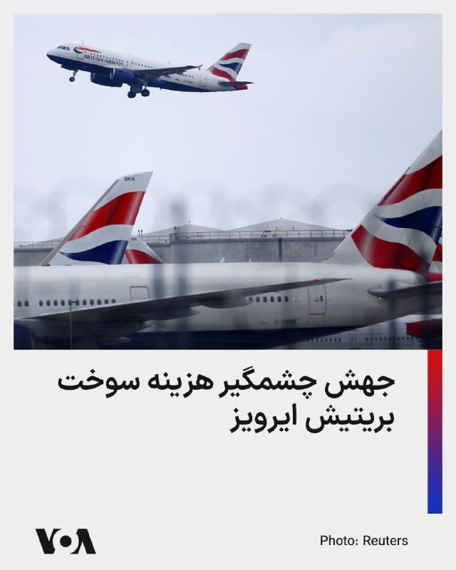

اینترنشنال ایرلاینز گروپ، شرکت مادر بریتیش ایرویز، هشدار داده که هزینه سوخت هواپیمایی این شرکت به خاطر انسداد تنگه هرمز به شدت افزایش خواهد یافت.

لوئیس گایه‌گو مدیر عامل این شرکت گفته است انتظار می‌رود هزینه سوخت مصرفی هواپیماهای شرکت برای سال جاری به خاطر جهش قیمت سوخت ۱.۷ میلیارد پوند، معادل ۲.۳ میلیارد دلار، افزایش یابد و سود این شرکت را تحت تأثیر قرار دهد.

ارزش سهام این شرکت بعد از اظهارات مدیر عامل آن در روز جمعه افتی چهار درصدی تجربه کرد.

بیش از ۷۰ درصد سوخت هواپیمای مصرفی اروپا از کشورهای عرب حوزه خلیج فارس تأمین می‌شود؛ موضوعی که به خاطر انسداد تنگه هرمز توسط جمهوری اسلامی مختل شده و قیمت آن تقریباً دو برابر شده است.
@FarsiVOA

## FarsiVOA — post 217178

  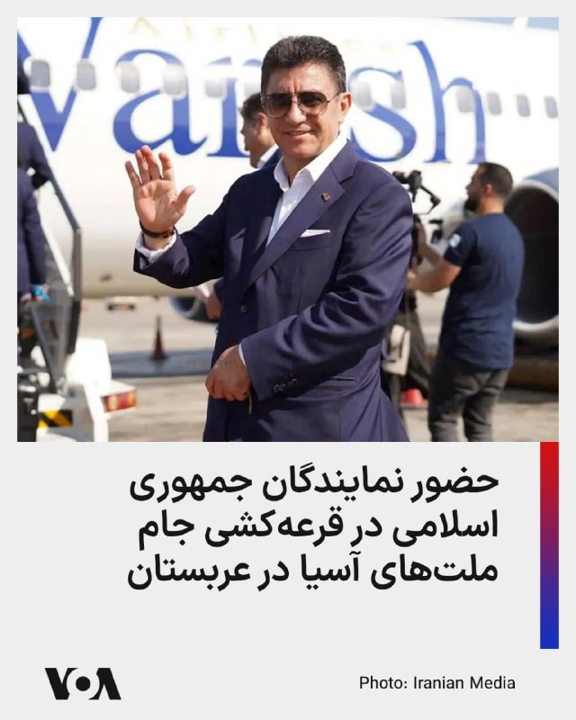

فدراسیون فوتبال جمهوری اسلامی اعلام کرد که امیر قلعه‌نویی، سرمربی تیم فوتبال، با هدف شرکت در مراسم قرعه‌کشی رقابت‌های جام ملت‌های آسیا، راهی عربستان سعودی شده است. این مراسم قرار است شامگاه شنبه ۱۹ اردیبهشت به میزبانی ریاض برگزار شود.

با توجه به محدودیت‌های پروازهای بین‌المللی، فدراسیون فوتبال جمهوری اسلامی نحوه و مسیر سفر نمایندگان خود را به عربستان اعلام نکرده است.

حملات موشکی و پهپادی جمهوری اسلامی به تأسیسات عربستان سعودی در دور جنگ ۴۰ روزه، سطح تنش میان دو کشور را افزایش داد، گرچه از زمان برقراری آتش‌بس وزیران خارجه دو کشور چندین تماس تلفنی با هم داشته‌اند.

پیش از این وزارت ورزش جمهوری اسلامی، ممنوعیت‌هایی را برای سفر ورزشکاران به کشورهایی که آنها را «متخاصم» توصیف می‌کند، اعلام کرده بود، و از این رو حضور تیم تراکتور در مسابقات جام نخبگان آسیا به میزبانی عربستان در هاله‌ای از ابهام بود، گرچه دیدار تیم تراکتور با تیم اماراتی شباب الاهلی در نهایت در عربستان برگزار شد.
@FarsiVOA

## FarsiVOA — post 217177

  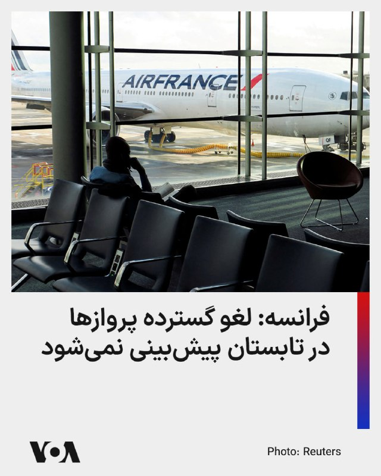

وزیر حمل‌ونقل فرانسه اعلام کرد که این کشور که انتظار ندارد شرکت‌های هواپیمایی در تابستان امسال به دلیل کمبود سوخت جت، به طور گسترده پروازهای خود را لغو کنند.

فیلیپ تابارو روز جمعه افزود بیشتر شرکت‌های هواپیمایی علاقه‌ای به لغو پروازها در تابستان ندارند، زیرا در این فصل بیشترین درآمد خود را کسب می‌کنند، هرچند برخی از آن‌ها اندکی میزان پروازهای خود را کاهش داده‌اند.

یک سخنگوی شرکت فرانسوی ترانساویا جمعه اعلام کرد که در ماه‌های مه و ژوئن ۲ درصد از پروازهای خود را لغو کرده است.

دولت فرانسه در حال آماده‌سازی تدابیر حمایتی برای پشتیبانی از شرکت‌های هواپیمایی از جمله تعویق پرداخت‌های حق بیمه اجتماعی، تمدید مهلت‌های پرداخت مالیات و انعطاف‌پذیری در میزان بارگیری سوخت است. همزمان مقامات اروپایی در تلاش هستند راه‌حل‌هایی برای جلوگیری از اختلالات گسترده در صنعت هوانوردی در تابستان امسال پیدا کنند.

پیشتر شرکت‌های اروپایی درباره کمبود سوخت جت طی چند هفته آینده به دلیل جنگ خاورمیانه هشدار داده‌ بودند. اروپا بیش از هر نوع سوخت دیگری به واردات سوخت جت وابسته است و حدود ۷۵ درصد آن را از خاورمیانه تأمین می‌کند.
@FarsiVOA

## FarsiVOA — post 217176

  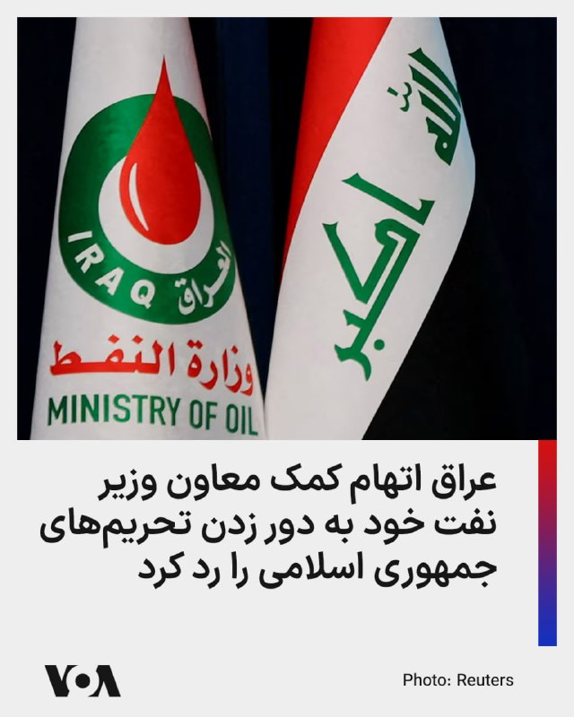

وزارت نفت عراق اتهامات مطرح شده علیه علی معارج البهادلی، معاون وزیر عراق را رد کرده است.

وزارت خزانه‌داری آمریکا روز پنجشنبه اعلام کرد که البهادلی را تحریم کرده، زیرا او «از موقعیت دولتی خود سوءاستفاده کرده تا نفت عراق را در حمایت از رژیم ایران و نیروهای نیابتی تروریستی آن منحرف کند.»

واشنگتن می‌گوید این مقام عراقی «پنهانی و در قالب طرحی برای کمک به جمهوری اسلامی جهت دور زدن تحریم‌ها»، نفت عراق و ایران را با هم مخلوط کرده است.

بر اساس گزارش خبرگزاری دولتی عراق، وزارت نفت این کشور جمعه اعلام کرد که «این اتهامات علیه البهادلی را رد می‌کند» و بر «اهمیت شفافیت در رسیدگی به همه این اتهامات بر اساس شواهد و واقعیت‌ها» تأکید دارد.

این وزارتخانه افزوده که «عملیات صادرات نفت خام، بازاریابی، بارگیری در نفتکش‌ها و رویه‌های مرتبط» جزو وظایف البهادلی نیست.
@FarsiVOA

## FarsiVOA — post 217175

  <a href="telegram/content/FarsiVOA_217175_1778236437.mp4" target="_blank">🎬 Download video</a>

ارتش اسرائیل اعلام کرد که نیروهای این کشور یک زیرساخت نظامی متعلق به حزب‌الله را در منطقه جویا در جنوب لبنان هدف قرار داده‌اند.

طبق بیانیه ارتش، نیروهای حزب‌الله از داخل یک ساختمان غیرنظامی اقدام به شلیک راکت کرده بودند.

در این بیانیه آمده «نیروهای ارتش اسرائیل در واکنشی سریع، این سازه را هدف قرار داده و نیروی تروریستی مستقر در آن را به منظور رفع تهدید از بین بردند.»

این حمله در چارچوب عملیات‌های جاری برای پاکسازی مناطق مرزی از تهدیدات موشکی و راکتی علیه شهروندان اسرائیلی انجام شده است.
@FarsiVOA

## FarsiVOA — post 217174

  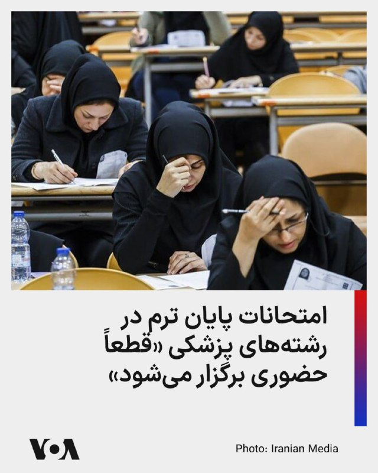

رئیس دانشکده پزشکی دانشگاه علوم پزشکی تهران از برگزاری حضوری امتحانات پایان ترم دانشجویان خبر داد، اما زمان دقیق برگزاری امتحانات را اعلام نکرد.

علیرضا استقامتی در گفت‌وگو با ایسنا، با بیان اینکه «زیرساخت و سازوکار لازم برای برگزاری دقیق آزمون مجازی وجود ندارد» گفت که در وزارت بهداشت به هیچ عنوان آزمون مجازی مورد قبول نیست و آزمون‌‌ها به ‌صورت حضوری برگزار می‌‌شود.

رئیس دانشکده پزشکی دانشگاه علوم پزشکی تهران برای نخستین بار افشا کرد که به دلیل اعتراضات دی ماه ۱۴۰۴، برخی از دانشجویان علوم پزشکی در امتحانات شرکت نکردند.

به گفته استقامتی «به دلیل اتفاقات دی‌ماه، بسیاری از آزمون‌ها در زمان مقرر برگزار نشد و برخی دانشجویان نیز در امتحانات شرکت نکردند؛ به همین دلیل بخشی از آزمون‌‌ها به بهمن و اسفند ماه منتقل شد که آنها نیز به دلیل شرایط جنگی برگزار نشدند.»

او یادآور شد «با توجه به آزمون‌‌های عقب‌ افتاده، زمان‌بندی برگزاری امتحانات به چالش تبدیل شده و ممکن است که طول ترم دانشجویان با افزایش یک ماهه تا اواخر تیرماه یا حتی مرداد ادامه پیدا کند.»
@FarsiVOA

## FarsiVOA — post 217173

  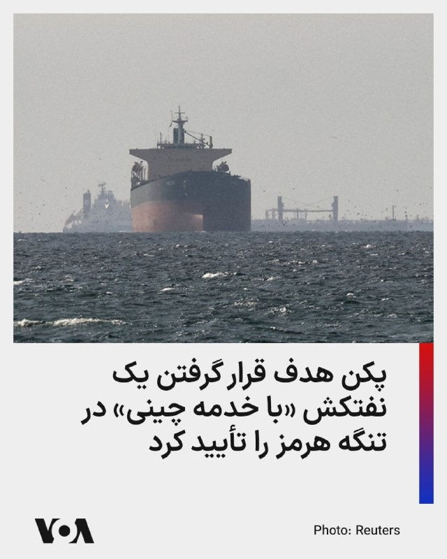

وزارت خارجه چین تأیید کرد که یک نفتکش حامل فرآورده‌های نفتی «با خدمه چینی» در تنگه هرمز مورد حمله قرار گرفته است.

لین جیان، سخنگوی وزارت امور خارجه، روز جمعه در یک نشست خبری گفت: «شهروندان چینی در میان خدمه این کشتی حضور دارند، اما تاکنون هیچ گزارشی از تلفات خدمه دریافت نشده است.» او نسبت به کشتی‌هایی که متأثر از درگیری‌های جاری در خاورمیانه هستند، ابراز نگرانی عمیق کرد.

بر اساس گزارش رسانه‌های چینی، این کشتی که نام آن اعلام نشده، با عبارت «مالک و خدمه چینی» علامت‌گذاری شده بود.

مایک والتز، سفیر آمریکا در سازمان ملل متحد روز پنج‌شنبه ۱۷ اردیبهشت تأیید کرد که یک نفتکش متعلق به چین در تنگه هرمز ساعاتی قبل هدف حمله موشکی جمهوری اسلامی ایران قرار گرفت.

در حالی که چین یکی از خریداران اصلی نفت از جمهوری اسلامی ایران به شمار می‌رود، آقای والتز به طعنه نوشت: «با چنین دوستانی...»

این برای نخستین‌بار از زمان آغاز درگیری میان آمریکا و جمهوری اسلامی است که یک نفتکش متعلق به چین در نزدیکی تنگه هرمز هدف حمله قرار گرفت. در پی این حمله، عرشه کشتی دچار آتش‌سوزی شد.
@FarsiVOA

## FarsiVOA — post 217172

🔺یک نماینده مجلس می‌گوید وزارت خارجه با بستن تنگه هرمز مخالف است

▪️عضو کمیسیون اقتصادی مجلس شورای اسلامی، اعلام کرد که وزارت خارجه جمهوری اسلامی اساساً مخالف رویکرد کنونی حکومت جمهوری اسلامی برای مسدود کردن تنگه هرمز است.

▪️پیشتر دونالد ترامپ، رئیس‌جمهور آمریکا، بارها به اختلاف میان رهبران جمهوری اسلامی در زمینه انجام توافق با واشنگتن اشاره کرده است.

▪️مارکو روبیو، وزیر خارجه آمریکا هم تلاش جمهوری اسلامی برای بسته نگاه داشتن تنگه هرمز را رد کرده و گفته بود: «تنگه هرمز اساساً معادل یک سلاح هسته‌ای اقتصادی است که [جمهوری اسلامی] ایران تلاش می‌کند از آن علیه جهان استفاده کند.»

⬇️ بیشتر بخوانید:
https://ir.voanews.com/a/8147955.html

## FarsiVOA — post 217171

  <a href="telegram/content/FarsiVOA_217171_1778236441.mp4" target="_blank">🎬 Download video</a>

ویدیوهایی از فعالیت پدافند در نقاط مختلف تهران منتشر شده که گفته می‌شود به دنبال حملات ارتش آمریکا در خلیج فارس آغاز شده است.

پنج‌شنبه شب ۱۷ اردیبهشت، ایالات متحده حملات هدفمندی را علیه مواضع نظامی سپاه در منطقه انجام داد.
@FarsiVOA

## FarsiVOA — post 217170

🔺هفتاد روز خاموشی اینترنت؛ هشدار درباره اختلال در مستندسازی نقض حقوق بشر

▪️خاموشی دیجیتال ایران وارد هفتادمین روز خود شد. پیش از این نیز ایرانیان در جریان اعتراضات دی‌ماه قطعی اینترنت را تجربه کردند، از این رو می‌توان گفت ایران، سال ۲۰۲۶ را بیش از هر زمان دیگری با محدودیت و اختلال اینترنت سپری کرده است.

▪️این در حالی است که اعتراضات دی‌ماه هزاران کشته و زندانی بر جای گذاشته است و ناظران حقوق بشر نسبت به افزایش اعدام زندانیان سیاسی هشدار می‌دهند.

▪️در چنین شرایطی، قطع اینترنت افزون بر آسیب‌های گسترده‌ای که به کسب‌وکارها و ارتباطات شهروندان داخل و خارج از کشور وارد کرده، پیامد دیگری نیز داشته است: ایجاد مانعی بزرگ بر سر راه مستندسازی و ثبت موارد نقض حقوق بشر.

⬇️ بیشتر بخوانید:
https://ir.voanews.com/a/8147953.html

## FarsiVOA — post 217169

  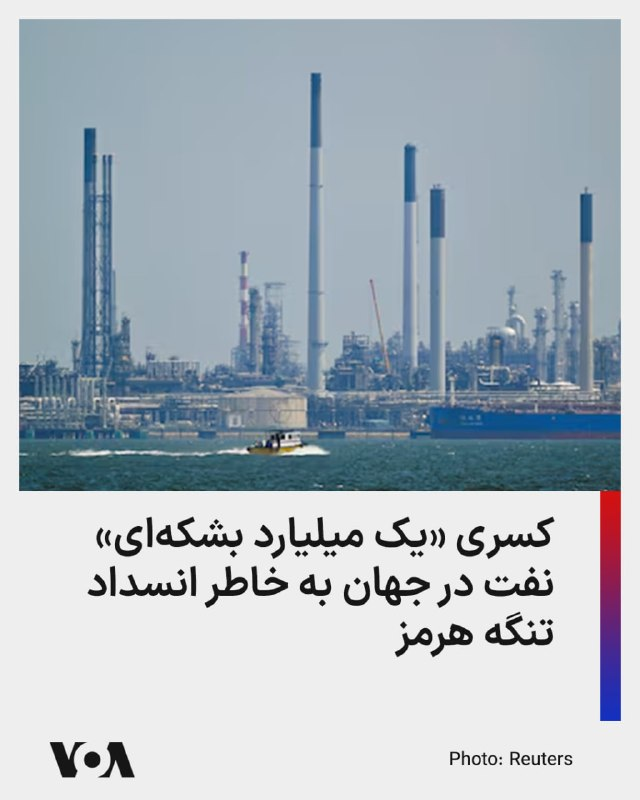

▪️مدیرعامل شرکت غول نفتی «شِل» می‌گوید بازار نفت با کمبودی نزدیک به یک میلیارد بشکه روبه‌رو است؛ رقمی که معادل ۱۰ روز مصرف جهانی نفت است.

▪️خبرگزاری بلومبرگ روز پنج‌شنبه گزارش داده بود که تولید روزانه نفت اوپک در ماه گذشته به حدود ۲۰ میلیون بشکه سقوط کرده که کمترین سطح طی ۳۶ سال گذشته است.

▪️قیمت‌های جهانی نفت نیز از زمان انسداد تنگه هرمز توسط جمهوری اسلامی و حملات گسترده به کشورهای عرب منطقه بیش از ۳۰ درصد افزایش یافته است.

▪️تنگه هرمز پیش از انسداد، محل عبور ۲۰ درصد از نفت، محصولات نفتی و گاز مایع مصرفی جهان بود.

⬇️ بیشتر بخوانید:
https://ir.voanews.com/a/8147954.html

## FarsiVOA — post 217168

  <a href="telegram/content/FarsiVOA_217168_1778236444.mp4" target="_blank">🎬 Download video</a>

نخستین ویدیوها از وقوع انفجارهای گسترده در بندرعباس منتشر شده که گفته می‌شود نتیجه حملات هدفمند ایالات متحده به مواضع نظامی در این منطقه است.

این اقدام در شامگاه پنج‌شنبه ۱۷ اردیبهشت و پس از حملات اخیر سپاه پاسداران به ناوهای جنگی آمریکا که منجر به تشدید بحران در تنگه هرمز شده، صورت گرفته است.
@FarsiVOA

## FarsiVOA — post 217167

  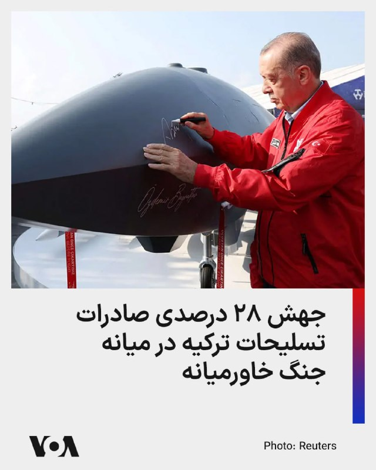

عمر بولات وزیر بازرگانی ترکیه از جهش ۲۸ درصدی صادرات تسلیحات دفاعی و حوزه فضایی این کشور در چهار ماه ابتدایی سال جاری میلادی خبر داد.

حوزه تسلیحات نظامی و فضایی ترکیه در دوره یاد شده ۲.۸ میلیارد دلار صادرات داشته است که ۲۸ درصد بالاتر از دور مشابه پارسال است. این رقم در کل سال ۲۰۲۵ حدود ۱۰ میلیارد دلار بود و بیش از نیمی از آن را تسلیحات موشکی و پهپادی تشکیل می‌داد. پاکستان، امارات، قطر و اوکراین بزرگترین خریداران تسلیحات ترکیه هستند.

طبق گفته بولات، حدود ۱۰۰ هزار نیروی متخصص در ۳۵۰۰ شرکت فعال در حوزه دفاعی و فضایی ترکیه مشغول به کار هستند.
@FarsiVOA

## FarsiVOA — post 217166

  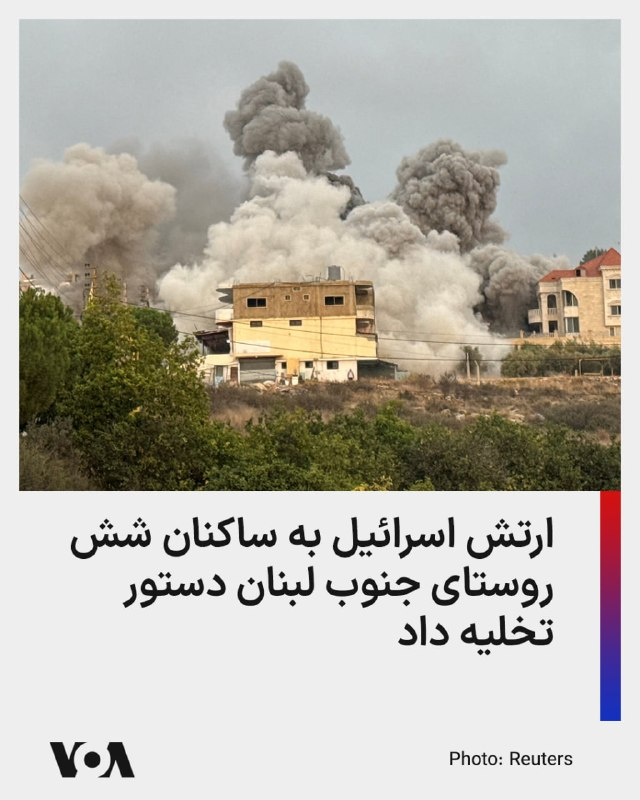

ارتش اسرائیل روز جمعه ۱۸ اردیبهشت هشدارهای تخلیه برای شش روستا در جنوب لبنان صادر کرد. این هشدارها در آستانه حملات هوایی که اسرائیل می‌گوید هدف آن‌ها حزب‌الله، گروه تحت حمایت جمهوری اسلامی است، صادر می‌شود.

در هشدار صادر شده به ساکنان این روستاها دستور داده شده که حداقل یک کیلومتر از محل سکونت خود فاصله بگیرند و منطقه را تخلیه کنند.

سرهنگ آویخای ادرعی، سخنگوی ارتش اسرائیل هشدار داد: «با توجه به نقض‌های انجام‌شده از سوی سازمان تروریستی حزب‌الله در توافق آتش‌بس، ارتش اسرائیل ناچار است با قدرت علیه آن اقدام کند و قصدی برای آسیب رساندن به شما ندارد.»

ارتش اسرائیل پیشتر اعلام کرد که از زمان آغاز آتش‌بس، بیش از ۲۲۰ عضو و فرمانده از حزب‌الله «که تهدیدی علیه نیروهای ارتش اسرائیل و شهروندان این کشور بودند»، کشته شدند.

ارتش اسرائیل نوشت که فقط طی هفته گذشته «بیش از ۸۵ عضو» حزب‌الله کشته شدند و بیش از ۱۸۰ زیرساخت نظامی این گروه تحت حمایت جمهوری اسلامی، از جمله مراکز فرماندهی، انبارهای تسلیحات و سکوهای پرتاب آماده شلیک در سراسر جنوب لبنان هدف حمله قرار گرفتند.
@FarsiVOA

## FarsiVOA — post 217165

  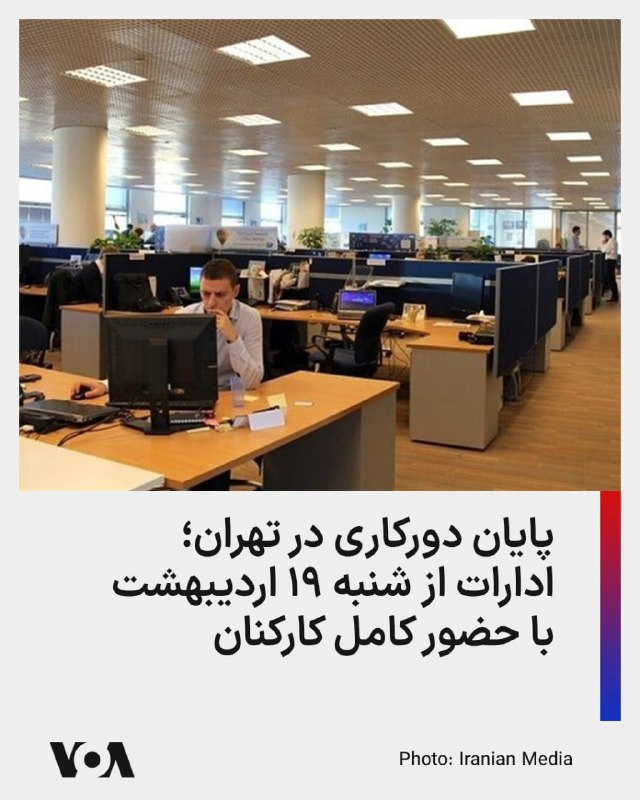

استاندار تهران اعلام کرد از شنبه ۱۹ اردیبهشت، حضور کارکنان تمامی وزارتخانه‌ها، سازمان‌ها و دستگاه‌های اجرایی مستقر در استان تهران تا اطلاع ثانوی به ‌صورت ۱۰۰ درصدی خواهد بود.

محمدصادق معتمدیان اعلام کرد فعالیت مدارس و دانشگاه‌ها نیز طبق اعلام وزارت آموزش‌ و پرورش و وزارت علوم، تحقیقات و فناوری ادامه خواهد داشت. در حال حاضر کلاس‌های مدارس و دانشگاه‌های تا پایان سال تحصیلی جاری غیرحضوری برگزار می‌شود.

دورکاری ادارات از ۱۴ اسفند سال گذشته به دلیل شرایط جنگی آغاز شده بود.
@FarsiVOA

## FarsiVOA — post 217164

  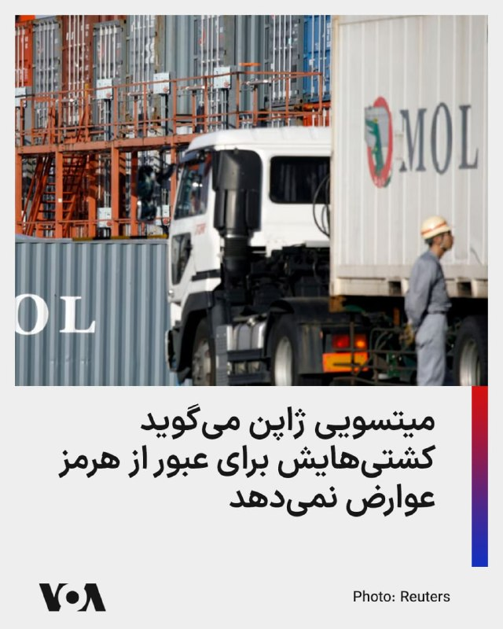

کشتی‌رانی میتسویی ژاپن می‌گوید برای عبور سه کشتی این شرکت از تنگه هرمز در ماه گذشته عوارضی به جمهوری اسلامی پرداخت نکرده و به قوانین دریانوردی بین‌المللی متعهد مانده است.

سخنگوی شرکت میتسویی او.اس.کی. لاینز ژاپن به رویترز گفته است هنوز هم چندین کشتی متعلق به آن در خلیج فارس گرفتار هستند، اما این شرکت در آینده نیز قصد پرداخت هیچ عوارضی به جمهوری اسلامی ندارد.

جمهوری اسلامی تنگه هرمز را مسدود کرده و از کشتی‌های عبوری عوارض طلب می‌کند؛ موضوعی که سازمان بین‌المللی دریانوردی آن را «رویه‌ای خطرناک» خوانده و دولت آمریکا تهدید کرده کشتی‌هایی که به رژیم حکم ایران عوارض و باج دهند، تحریم خواهند شد.
@FarsiVOA

## FarsiVOA — post 217163

🔺تلاش پاکستان برای بازگرداندن خدمه دیگر کشتی‌های توقیف‌شده به ایران

▪️وزیر خارجه پاکستان از تلاش برای بازگرداندن خدمه کشتی‌های توقیف‌شده از سوی آمریکا در نزدیکی آب‌های سنگاپور خبر داد.

▪️محمد اسحاق دار روز جمعه گفت که در گفت‌وگو با همتای سنگاپوری‌اش خواستار «تسهیل رسیدگی به وضعیت رفاهی و بازگرداندن ۱۱ ملوان پاکستانی و ۲۰ ملوان ایرانی» شده که در این کشتی‌ها حضور دارند.

▪️وزیر خارجه پاکستان نامی از کشتی‌هایی که اکنون مورد بحث است، ذکر نکرده، اما اوایل اردیبهشت، وزارت جنگ آمریکا از ورود نیروهای نظامی ایالات متحده به عرشه نفتکش «تیفانی» مرتبط با جمهوری اسلامی در منطقه هند-آرام و توقیف کشتی و خدمه آن خبر داد.

⬇️ بیشتر بخوانید:
https://ir.voanews.com/a/8147952.html

## FarsiVOA — post 217162

🔺رویترز: رهبران جنوب‌شرق آسیا خواستار توافق میان تهران و واشنگتن می‌شوند

▪️رهبران آسه‌آن روز جمعه در نشستی غیررسمی در جزیره سبوی فیلیپین، خواستار دستیابی به راه‌حلی مذاکره‌شده میان ایالات متحده و جمهوری اسلامی و همچنین بازگشایی تنگه هرمز می‌شوند.

▪️طبق پیش‌نویس بیانیه‌ای که خبرگزاری رویترز رؤیت کرده، رهبران آسه‌آن درباره پاسخی هماهنگ به پیامدهای بحران خاورمیانه گفت‌وگو خواهند کرد تا فشار ناشی از شوک انرژی که اقتصادهای وابسته به واردات نفت در منطقه را متزلزل کرده، کاهش دهند.

▪️تنگه هرمز که پیش از درگیری‌های اخیر در خاورمیانه، روزانه حدود ۱۳۰ کشتی و یک‌پنجم عرضه نفت و گاز جهان را، بیشتر به مقصد آسیا، از خود عبور می‌داد، اکنون نزدیک به ۷۰ روز است که عملاً مسدود است.

⬇️ بیشتر بخوانید:
https://ir.voanews.com/a/8147951.html

## FarsiVOA — post 217161

  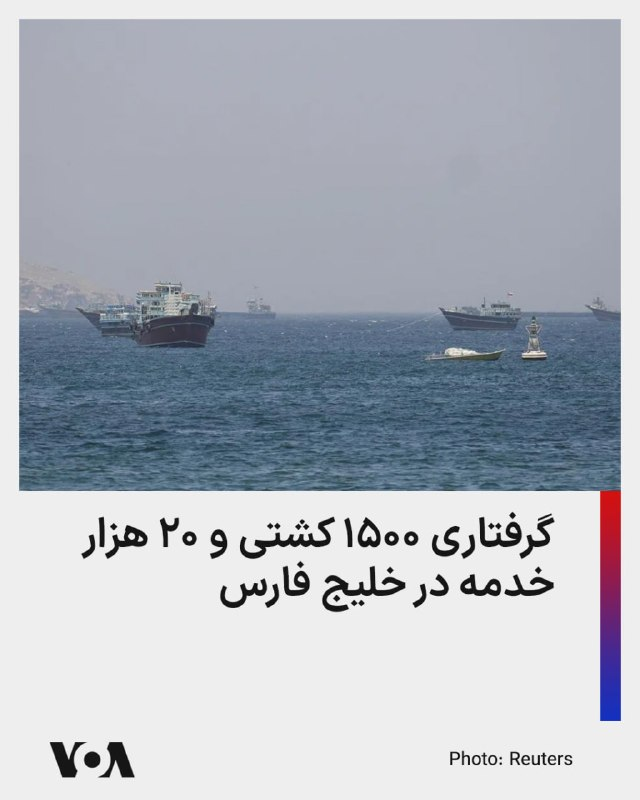

دبیرکل سازمان بین‌المللی دریانوردی می‌گوید ۱۵۰۰ کشتی و ۲۰ هزار خدمه آن به خاطر انسداد تنگه هرمز توسط جمهوری اسلامی در خلیج فارس گرفتار و آواره شده‌اند.

آرسنیو دومینگز در اجلاس اعضای این نهاد زیرمجموعه سازمان ملل با اشاره به کشته شدن ۱۰ خدمه در جریان ۳۰ مورد حمله به کشتی‌ها تصریح کرد که «خدمه‌ها افراد بی‌گناهی هستند که مشغول کار روزانه خود برای منفعت کشورهای دیگر هستند، اما درگیر شرایط ژئوپلیتیکی‌ شده‌اند که خارج از کنترل آنهاست».

جمهوری اسلامی از زمان آغاز عملیات نظامی مشترک اسرائیل و آمریکا در ۹ اسفند، تنگه هرمز را مسدود و به ده‌ها کشتی حمله کرده است. این حملات حتی بعد از توافق آتش‌بس نیز ادامه داشته است.
@FarsiVOA

## FarsiVOA — post 217160

  

⚡️امارات متحده عربی اوایل روز جمعه اعلام کرد که سامانه‌های پدافند هوایی آن در حال مقابله با حملات پهپادی و موشکی از ایران هستند و صداهایی که شنیده می‌شود مربوط به رهگیری‌ها است.
@FarsiVOA

## DW_Farsi — post 124425

🔶 تحلیل‌ سی‌اِن‌اِن از توصیف ترامپ درباره حملات شب گذشته آمریکا

سدریک لیتون، تحلیلگر نظامی سی‌اِن‌اِن می‌گوید، اظهارات دونالد ترامپ، رئیس ‌جمهور ایالات متحده، درباره "ضربه آرام عاشقانه" (love tap) نکات زیادی را درباره حملات شب گذشته آمریکا به نیروهای نظامی جمهوری اسلامی را نشان می‌دهد.
پس از تبادل آتش میان ایالات متحده و جمهوری اسلامی در اطراف تنگه هرمز، ترامپ روز پنجشنبه گفته بود که آتش‌بس همچنان برقرار است. او حملات آمریکا را "صرفا یک ضربه و نوازش محبت‌آمیز" توصیف کرده بود.
لیتون با اشاره به حملات آمریکا در پاسخ به حملات ایران به ناوهای جنگی آمریکایی در تنگه هرمز به سی‌اِن‌اِن گفت: «فکر می‌کنم چیزی که او تلاش می‌کند بگوید این است که این یک پاسخ حساب‌شده به اقداماتی است که ایرانی‌ها انجام می‌دهند.»

لیتون در ادامه گفت دولت آمریکا امیدوار است این پاسخ، باعث حل‌وفصل وضعیت شود، اما این موضوع بستگی دارد به این‌که آیا ایران تصمیم بگیرد "اجازه دهد امور در یک مسیر دیپلماتیک پیش برود" یا این حملات را تلافی کند.

او افزود این موضوع همچنین به ارزیابی جمهوری اسلامی از پیشنهاد آمریکا برای پایان دادن به جنگ بستگی دارد و همچنین به این که آیا حکومت ایران با آن موافقت خواهد کرد یا نه.

بر اساس گزارش رسانه‌ها، جمهوری اسلامی هنوز پاسخ خود به پیشنهاد آمریکا را نهایی نکرده است.

به گفته سدریک لیتون، اظهارات ترامپ درباره "تلنگر عاشقانه" همچنین ممکن است نشانه قصد او برای حفظ آتش‌بس و کاهش تنش‌ها، با همکاری جمهوری اسلامی، باشد. او گفت که دولت ترامپ می‌خواهد "تنش‌زدایی کند و این روش آن‌ها برای انجام این کار است".
@dw_farsi

## DW_Farsi — post 124424

  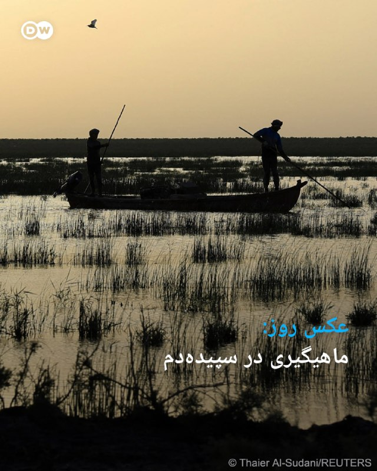

📸 عکس روز: ماهیگیری در سپیده‌دم

ماهیگیری در سپیده‌دم در نیزارهای جبایش در استان ذی‌قار عراق. جبایش شهری در جنوب عراق و نزدیک تالاب‌های معروف بین‌النهرین است. تالاب‌های این منطقه به نام هورهای عراق شناخته می‌شوند و از قدیمی‌ترین زیست‌بوم‌های آبی خاورمیانه هستند. شهرتشان از جمله به خاطر قایق‌های سنتی، نیزارها، ماهیگیری و شیوه زندگی مردمان عربِ هور مشهور است.
@dw_farsi

## DW_Farsi — post 124423

🔶 شبکه کان اسرائیل: حماس در ترکیه برای حملات علیه اسرائیل آموزش می‌بیند

شبکه "کان" اسرائیل گزارش داد که نیروهای گروه تروریستی حماس، "در ترکیه برای انجام حملات علیه اسرائیل آموزش می‌بینند".

بر اساس این گزارش، این نیروها که لباس غیرنظامی به تن دارند، "به طور منظم در دوره‌های آموزشی مربوط به استفاده از سلاح‌های سبک و تاکتیک‌ها در باشگاه‌های تیراندازی عمومی، و همچنین آموزش‌های مربوط به کار با پهپادها شرکت می‌کنند."

این گزارش می‌افزاید که آن‌ها حتی مجوز رسمی پرواز پهپاد در ترکیه را نیز دریافت کرده‌اند. بر اساس این گزارش، هدف این است که آموزش آن‌ها پیش از انتقال به لبنان، اردن و کرانه باختری تکمیل شود تا در درگیری‌های آینده با اسرائیل حملاتی انجام دهند.

این نخستین مورد از اخبار مربوط به هماهنگی افشا شده میان ترکیه و حماس نیست. در دسامبر گذشته، ارتش اسرائیل و شین‌بت، سازمان امنیت داخلی اسرائیل، یک شبکه پولشویی تحت حمایت جمهوری اسلامی را که حماس آن را در ترکیه اداره می‌کرد، افشا کردند.

بر اساس بیانیه ارتش اسرائیل، اسناد به‌دست‌آمده از این سازمان نشان می‌دهد که "حماس شبکه‌ای از صرافی‌های مالی مرتبط با افراد اهل غزه مستقر در ترکیه را اداره می‌کند و از نهادهای مالی این کشور برای اهداف تروریستی استفاده می‌کند".

بر اساس این گزارش، این افراد اهل غزه که موفق به انتقال صدها میلیون دلار شده‌اند، ارتباط مستقیم با ایران و اعضای ارشد حکومت جمهوری اسلامی دارند. بر اساس بیانیه ارتش اسرائیل، این پولشویان همچنین فعالیت اقتصادی گسترده‌ای در ترکیه انجام می‌دهند که شامل انتقال پول از ایران به حماس می‌شود.
@dw_farsi

## DW_Farsi — post 124422

🔶 نفتکش کره‌ جنوبی پس از چند هفته به سواحل غربی این کشور رسید

یک پالایشگاه کره جنوبی اعلام کرد نفتکش با پرچم مالت متعلق به این کشور که ۱ میلیون بشکه نفت خام حمل می‌کرد، جمعه پس از عبور از تنگه هرمز در اواسط آوریل، به سواحل غربی کره جنوبی رسید.

کره جنوبی نیز مانند بسیاری دیگر از کشورهای آسیایی، بخش زیادی از نفت خام خود را از خاورمیانه وارد می‌کند. آخرین محموله ۱ میلیون بشکه‌ای، بر اساس گزارش‌ها، معادل ۳۵ تا ۵۰ درصد مصرف روزانه نفت خام کره جنوبی است.

به گفته اچ‌دی هیوندای اویل‌بانک، نفتکش مذکور به نام اودسا، صبح جمعه، چند هفته پس از عبور از تنگه هرمز در دوره گفت‌وگوهای آتش‌بس میان جمهوری اسلامی و ایالات متحده آمریکا، به آب‌های نزدیک شهر بندری سئوسان در غرب کره جنوبی رسید.

این نفتکش قرار است اواخر جمعه در تاسیسات پهلوگیری فراساحلی این شرکت پهلو بگیرد تا نفت خام خود را تخلیه کند. اچ‌دی هیوندای اویل‌بانک اعلام کرد این شرکت قصد دارد نفت خام را به فرآورده‌های نفتی مانند بنزین، دیزل و نفتا پالایش کند. این شرکت همچنین اعلام کرد تاسیساتی دارد که می‌تواند روزانه تا ۶۹۰ هزار بشکه نفت خام را پالایش کند.

کره جنوبی سال گذشته بیش از ۶۰ درصد نفت خام و ۵۰ درصد نفتای خود را، که خوراک مهم پتروشیمی و مورد استفاده در تولید پلاستیک است، از طریق تنگه هرمز وارد کرد.

تلاطم اقتصاد جهان به دلیل اقدامات جمهوری اسلامی در تنگه هرمز و به دنبال آن، افزایش شدید قیمت سوخت، نگرانی‌ها درباره بحران انرژی قریب‌الوقوع در کره جنوبی را افزایش داده است.

این کشور برای جلوگیری از جهش هزینه‌ها، برای نخستین بار در چند دهه اخیر سقف قیمتی برای بنزین و دیگر فرآورده‌های نفتی اعمال کرده و به پالایشگاه‌ها دستور داده است که صادرات نفتا را برای مصرف داخلی منحرف کنند. کره جنوبی در عین حال، با شتاب در تلاش است منابع جایگزین نفت و مسیرهای کشتیرانی جایگزین را تأمین کند.
@dw_farsi

## DW_Farsi — post 124421

🔶 "۱۵۰۰ کشتی به همراه خدمه در محاصره تنگه هرمز گرفتار شده‌اند"

آرسنیو دومینگز، دبیرکل سازمان بین‌المللی دریانوردی سازمان ملل متحد (IMO) اعلام کرد که حدود هزار و ۵۰۰ کشتی و خدمه آن‌ها به دلیل بستن تنگه هرمز از سوی جمهوری اسلامی در خلیج فارس گرفتار شده‌اند.

جمهوری اسلامی از زمان آغاز جنگ با ایالات متحده آمریکا و اسرائیل در اواخر فوریه، تنگه هرمز را که یکی از مسیرهای مهم انتقال جهانی نفت و گاز به شمار می‌رود، مسدود کرده است.

آرسنیو دومینگز در کنوانسیون دریایی قاره آمریکا در پاناما با اشاره به این که "حمل‌ونقل دریایی بیش از ۸۰ درصد کالاهای مصرفی جهان را جابه‌جا می‌کند" گفت: «در حال حاضر حدود ۲۰ هزار نفر از خدمه کشتی‌ها و حدود هزار و ۵۰۰ کشتی گرفتار شده‌اند.»

دومینگز در این گردهمایی متشکل از مدیران صنعت دریایی و نمایندگان سازمان بین‌المللی دریانوردی گفت که خدمه گرفتار شده در منطقه، "افراد بی‌گناهی هستند که هر روز برای منفعت کشورهای دیگر، کار خود را انجام می‌دهند، اما به دلیل وضعیت‌های ژئوپولیتیکی خارج از کنترل خود گرفتار شده‌اند".

دومینگز همچنین به خبرنگاران گفت: «۱۰ ملوان جان خود را از دست داده‌اند.»

برخی منابع اعلام کرده‌اند که این تلفات در جریان بیش از ۳۰ حمله به کشتی‌ها رخ داده است. دبیرکل سازمان بین‌المللی دریانوردی از کشورها خواست از اعزام کشتی‌ها به خلیج فارس خودداری کنند تا شمار قربانیان در میان ملوانان افزایش پیدا نکند و خسارت‌های اقتصادی بیشتری وارد نشود.
@dw_farsi

## DW_Farsi — post 124420

🔶 گفت‌وگوی تلفنی رئیس کمیسیون اروپا و ترامپ درباره وضعیت ایران

اورزولا فون در لاین، رئیس کمیسیون اروپا، پس از تماس تلفنی با دونالد ترامپ، رئیس‌ جمهور ایالات متحده، بیانیه‌ای منتشر کرد. او با بیان این که تماس بسیار خوبی با ترامپ داشته افزود: «ما درباره وضعیت خاورمیانه و هماهنگی نزدیک خود با شرکای منطقه‌ای گفت‌وگو کردیم.»

رئیس کمیسیون اروپا در بیانیه خود با اشاره به توافق اروپا و آمریکا بر سر این که "ایران هرگز نباید به سلاح هسته‌ای دست پیدا کند" گفت: «رویدادهای اخیر به‌وضوح نشان داده‌اند که خطرات برای ثبات منطقه‌ای و امنیت جهانی بیش از حد بزرگ هستند.»

فون در لاین همچنین افزود: «ما همچنین درباره توافق تجاری اتحادیه اروپا و ایالات متحده گفت‌وگو کردیم. ما در هر دو طرف همچنان کاملا متعهد به اجرای آن هستیم. پیشرفت خوبی برای کاهش تعرفه‌ها تا اوایل ژوئیه حاصل شده است.»

از سوی دیگر ترامپ نیز اعلام کرد که در تماس تلفنی با فون در لاین، رئیس کمیسیون اروپا، در خصوص مسائلی از جمله درباره جنگ ایران گفت‌وگو کرده است. ترامپ در پلتفرم تروث سوشال نوشت که هر دو "کاملا هم‌نظر هستند که ایران هرگز نباید به سلاح هسته‌ای دست پیدا کند".
@dw_farsi

## DW_Farsi — post 124419

  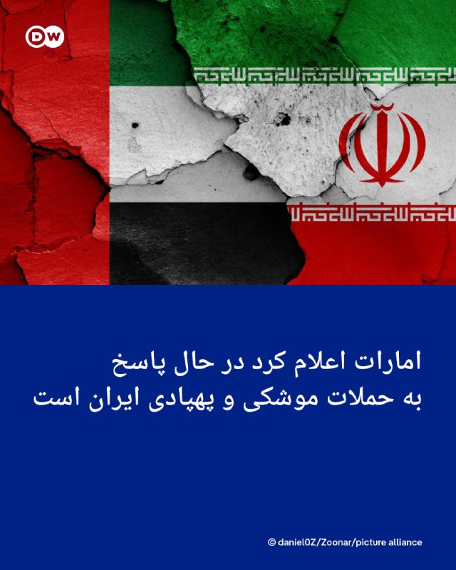

🔶 امارات اعلام کرد در حال پاسخ به حملات موشکی و پهپادی ایران است

وزارت دفاع امارات متحده عربی با انتشار بیانیه‌ای اعلام کرد که سامانه‌های پدافند هوایی این کشور، موشک‌ها و پهپادهایی که از سمت ایران شلیک شده‌اند را ردیابی کرده‌ند.

این خبر در شرایطی منتشر می‌شود که ساعاتی پیش از آن، نیروهای ایالات متحده هدف حملات جمهوری اسلامی قرار گرفتند و نیروهای آمریکایی نیز در پاسخ، اهدافی در جنوب ایران را هدف حمله قرار دادند.

چند مقام آمریکایی به شبکه خبری سی‌بی‌اس اعلام کردند که ارتش ایالات متحده، مناطقی در مجاورت تنگه هرمز در بندرعباس و قشم را هدف قرار داده است.

وزارت دفاع امارات متحده عربی در شبکه اجتماعی ایکس اعلام کرد: «سامانه‌های پدافند هوایی امارات متحده عربی در حال مقابله با حملات موشکی و پهپادی هستند که از ایران شلیک شده‌اند.»

این بیانیه افزود که صدای سامانه‌های رهگیری در بخش‌های مختلف این کشور شنیده شده است.
@dw_farsi

## DW_Farsi — post 124418

  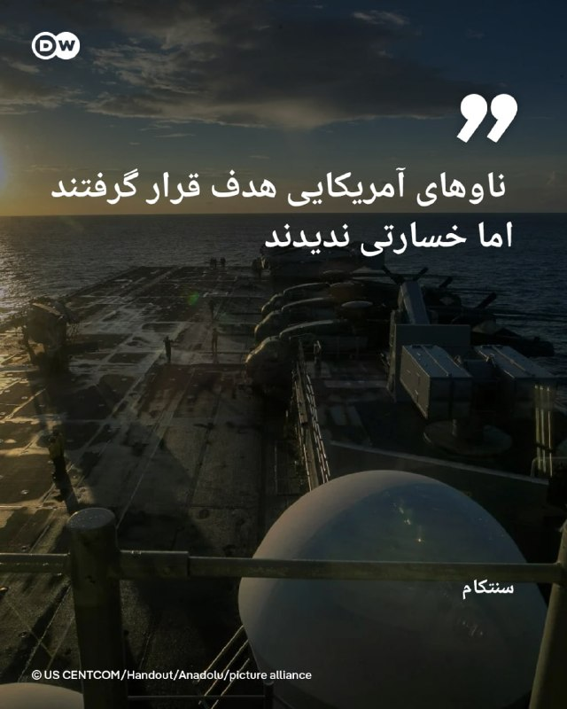

🔶 سنتکام: ناوهای آمریکایی هدف قرار گرفتند اما خسارتی ندیدند

سنتکام، فرماندهی مرکزی ایالات متحده با انتشار بیانیه‌ای اعلام کرد که نیروهای ارتش آمریکا در جریان عبور ناوشکن‌های نیروی دریایی این کشور از تنگه هرمز، حملات "بی‌دلیلی" که از سوی جمهوری اسلامی صورت گرفت، رهگیری کرده و در پاسخ به این حملات، اهداف نظامی در ایران را هدف قرار داده‌اند.

سنتکام در بیانیه خود‌ اعلام کرد که ناوشکن‌های "یو‌اس‌اس تراکستون"، "یو‌اس‌اس رافائل پرالتا" و "یو‌اس‌اس میسون" در جریان عبور از تنگه هرمز به سمت دریای عمان، هدف حملات موشکی، پهپادی و قایق‌های تندروی جمهوری اسلامی قرار گرفتند، اما هیچ‌ کدام از شناورهای آمریکایی در این حملات آسیب ندیدند.

فرماندهی مرکزی آمریکا همچنین یادآور شد که نیروهای ایالات متحده این تهدیدها را از بین بردند و با انجام حملات متقابل، سایت‌های پرتاب موشک و پهپاد و نیز مراکز فرماندهی و کنترل و مراکز اطلاعاتی و شناسایی جمهوری اسلامی را هدف قرار دادند. سنتکام در بیانیه خود همچنین تاکید کرد که آمریکا به دنبال تشدید تنش نیست، اما به منظور حفاظت از نیروهای آمریکایی در منطقه آماده باقی می‌ماند.
@dw_farsi

## DW_Farsi — post 124417

  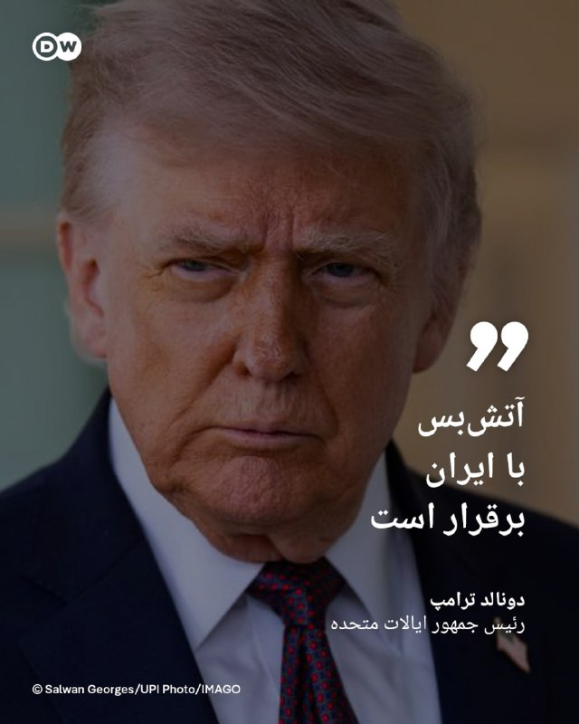

🔶 ترامپ: آتش‌بس با ایران برقرار است

دونالد ترامپ، رئیس جمهور ایالات متحده، در ساعات پایانی پنجشنبه ۷ مه (۱۷ اردیبهشت) گفت، آتش‌بس با ایران علیرغم حملات جدید همچنان پابرجاست.

ترامپ در یک تماس تلفنی به شبکه آمریکایی ABC News ا‌‌ظهار داشت، حملات علیه اهدافی در ایران فقط "یک ضربه محدود" بوده است.

رئیس جمهور آمریکا همچنین افزود: «آتش‌بس ادامه دارد و برقرار است.»

او همچنین در پستی در شبکه اجتماعی تروث سوشال نوشت: «سه ناوشکن آمریکایی درجه یک زیر آتش، با موفقیت بسیار زیاد، از تنگه هرمز خارج شدند. هیچ آسیبی به این سه ناوشکن وارد نشد، اما خسارات زیادی به مهاجمان ایرانی وارد شد. آنها به همراه تعداد زیادی قایق کوچک کاملا منهدم شدند.»

رئیس جمهور آمریکا در بخش دیگری از پیام خود نوشت: «اگر ایرانی‌ها فرصت استفاده از سلاح هسته‌ای را پیدا می‌کردند، بدون کوچک‌ترین تردیدی از آن استفاده می‌کردند اما هرگز چنین فرصتی به دست نخواهند آورد.»

ترامپ در انتهای پست خود همچنین نوشته است "همانطور که امروز ایرانی‌ها را در هم شکستیم، اگر به‌سرعت توافق را امضا نکنند، در آینده با قدرت و شدت بیشتری آن‌ها را سرکوب خواهیم کرد".
@dw_farsi

## DW_Farsi — post 124416

  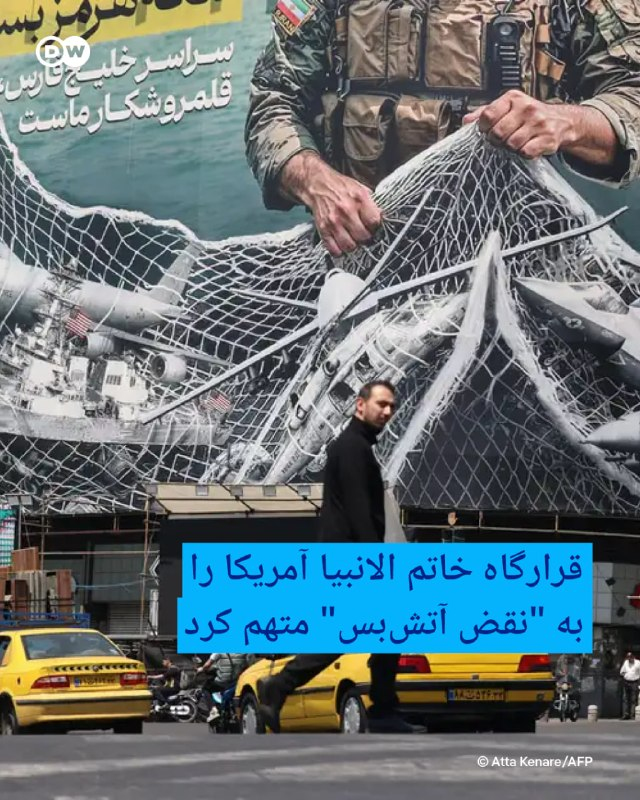

🔴 قرارگاه خاتم الانبیا آمریکا را به "نقض آتش‌بس" متهم کرد

قرارگاه مرکزی خاتم الانبیا با انتشار بیانیه‌ای که دقایقی پس از انتشار گزارش‌‌ها مبنی بر حملات متقابل ایران و آمریکا منتشر شد، ایالات متحده را به "نقض آتش‌بس و حمله به نفتکش‌های ایرانی" متهم کرد.

در این بیانیه به نقل از سخنگوی قرارگاه مرکزی خاتم الانبیا آمده است، "آمریکا با نقض آتش‌بس، یک کشتی نفتکش ایرانی در حال حرکت از آب‌های ساحلی ایران در منطقه جاسک به سمت تنگه هرمز و همچنین یک کشتی دیگر در حال ورود به تنگه هرمز را روبه‌روی بندر فجیره امارات هدف قرار داد".

همچنین در بخش دیگری از این بیانیه نوشته شده است، همزمان "مناطق غیرنظامی" در سواحل بندر خمیر، سیریک و جزیره قشم، "با همکاری برخی کشورهای منطقه هدف تعرض قرار گرفته‌اند".

قرارگاه خاتم‌الانبیا همچنین تهدید کرده است، "جمهوری اسلامی ایران پرقدرت و بدون کوچکترین تردید به هرگونه تعرض و تجاوز پاسخی کوبنده می‌دهد."
@dw_farsi

## DW_Farsi — post 124415

  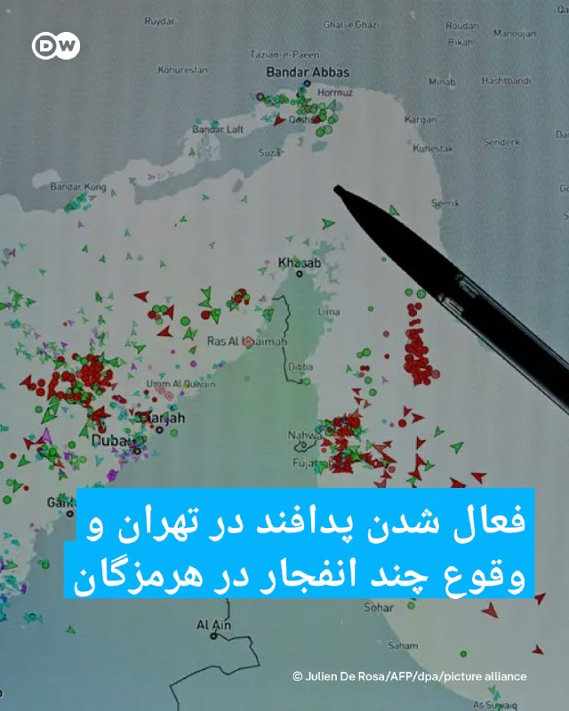

🔴 فعال شدن پدافند هوایی در تهران و وقوع چند انفجار در هرمزگان

بنا بر گزارش‌های منتشر شده توسط رسانه‌های داخلی ایران، پس از وقوع دو انفجار مهیب در تهران، پدافند هوایی در غرب پایتخت فعال شده است. همچنین گزارش‌ها از صدای چندین انفجار در استان هرمزگان خبر می‌دهند.

فرماندهی نیروی دریایی سپاه در بیانیه‌‌ای اعلام کرد، پس از حمله ارتش آمریکا به یک نفتکش ایرانی، ناوشکن‌های آمریکایی "هدف موشک‌های بالستیک و کروز ضد کشتی و پهپادهای انهدامی با سر جنگی شدید الانفجار" قرار گرفتند و مجبور به عقب‌نشینی شدند.

یک مقام آمریکایی نیز به شبکه خبری فاکس نیوز گفت، "ارتش آمریکا پس از گزارش رسانه‌های ایرانی مبنی بر شنیده شدن صدای انفجار در بندرعباس و جزیره قشم در تنگه هرمز، حملاتی را علیه این دو شهر انجام داد."

این مقام در عین حال گفته است، "این حملات به معنای از سرگیری جنگ نیست."

فرماندهی مرکزی ارتش آمریکا، سنتکام، با انتشار پستی در شبکه اجتماعی ایکس ضمن تایید تبادل آتش بین دو طرف نوشت، نیروهای آمریکایی "حملات بی‌دلیل ایران" را رهگیری کردند و در دفاع به آنها پاسخ دادند.
@dw_farsi

## DW_Farsi — post 124414

🔶 آمریکا معاون وزیر نفت عراق را به دلیل کمک به دور زدن تحریم‌های ایران تحریم کرد

وزارت خزانه‌داری آمریکا علی معارج البهادلی، معاون وزیر نفت عراق و چند تن از اعضای ارشد گروه‌های شبه‌نظامی این کشور را به دلیل حمایت از حکومت ایران تحریم کرد.

به گزارش رویترز، آمریکا البهادلی را متهم کرده که از موقعیت خود برای تسهیل انتقال و فروش نفت به نفع جمهوری اسلامی و گروه‌های عراقی همسو با آن سوءاستفاده کرده است.

حیان عبدالغنی، وزیر نفت عراق دو ماه پیش گفته بود که نفتکش‌های ایرانی که توسط نیروهای آمریکایی در خلیج فارس متوقف شده‌اند برای دور زدن تحریم‌ها از "اسناد جعلی عراقی" استفاده می‌کردند. تهران استفاده از چنین اسنادی را تکذیب کرده است.

وزارت خزانه‌داری آمریکا همچنین اعلام کرده که سه تن از اعضای ارشد گروه‌های شبه‌نظامی "عصائب اهل الحق" و "کتائب سیدالشهدا" عراق را نیز به دلیل ارتباط با جمهوری اسلامی تحریم کرده است.

رویترز می‌نویسد که تا کنون وزارت نفت عراق و همچنین البهادلی به درخواست‌ها برای ابراز نظر پاسخی نداده‌اند.

این تحریم‌ها دارایی این افراد در ایالات متحده را مسدود و به طور کلی آمریکایی‌ها را از معامله با آن‌ها منع می‌کند.
@dw_farsi

## DW_Farsi — post 124413

  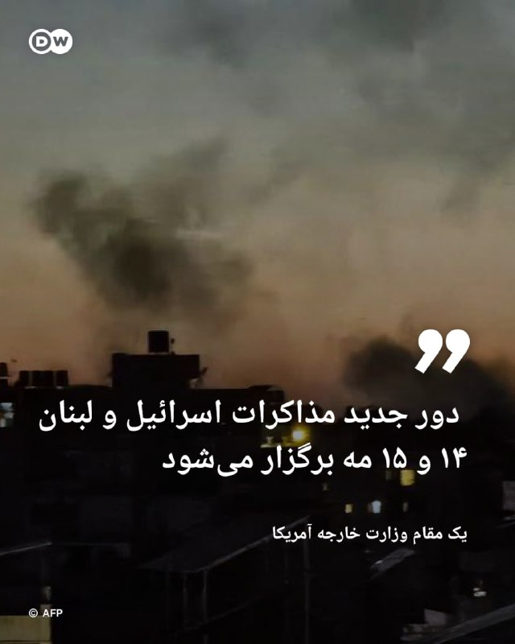

🔶 یک مقام آمریکایی: دور جدید مذاکرات اسرائيل و لبنان ۱۴ و ۱۵ مه برگزار می‌شود

یک مقام وزارت خارجه آمریکا روز پنج‌شنبه هفتم مه (۱۷ اردیبهشت) از سومین دور مذاکرات صلح میان اسرائيل و لبنان در روزهای پنج‌شنبه و جمعه ۱۴ و ۱۵ مه در واشنگتن خبر داد.

به گزارش خبرگزاری رویترز، این خبر در حالی اعلام می‌شود که ایالات متحده این دو کشور را برای دستیابی به توافق صلح پایدار تحت فشار قرار داده است و حملات اسرائيل به حزب‌الله لبنان نیز همچنان ادامه دارد.

این خبر یک روز پس از اولین حمله اسرائيل به بیروت از زمان توافق بر سر آتش‌بس در اواسط آوریل منتشر شده است؛ توافقی که پس از گردهم آوردن سفرای دو کشور توسط دولت دونالد ترامپ، رئیس‌جمهور آمریکا برای گفت‌وگوهای مستقیم و کم‌سابقه حاصل شده بود.

رویترز می‌نویسد، این مقام وزارت خارجه آمریکا اعلام نکرد که چه کسانی در سومین دور مذاکرات شرکت خواهند داشت.

مارکو روبیو، وزیر خارجه آمریکا روز سه‌شنبه دستیابی به صلح میان اسرائيل و لبنان را امکان‌پذیر دانسته، اما تأکید کرده بود که این امر مستلزم آن است که دولت لبنان توانایی مقابله با گروه تروریستی حزب‌الله را داشته باشد.
@dw_farsi

## DW_Farsi — post 124412

  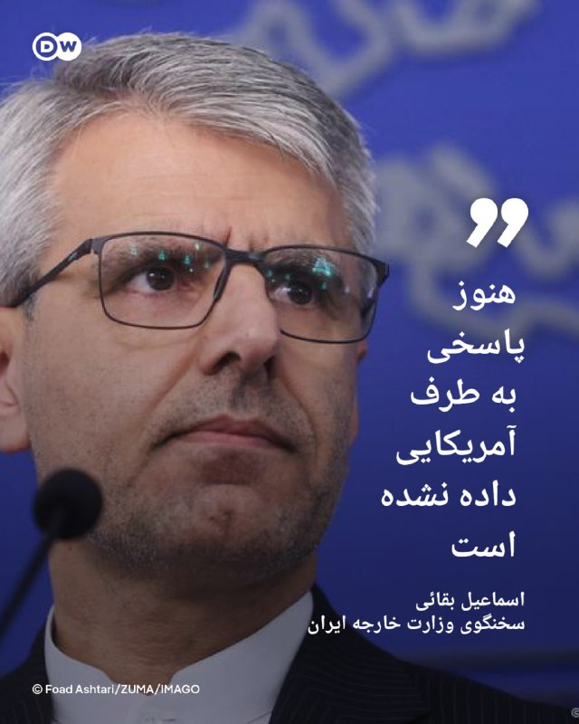

🔶 بقائی: هنوز پاسخی به طرف آمریکایی داده نشده است

اسماعیل بقائی، سخنگوی وزارت خارجه ایران، می‌گوید تهران همچنان مشغول بررسی پیام‌های ایالات متحده با میانجی‌گری پاکستان است.

به گزارش تسنیم، بقائی روز پنج‌شنبه ۱۷ اردیبهشت افزود: «هنوز ایران به جمع‌بندی نرسیده و پاسخی به طرف آمریکایی داده نشده است.»

شبکه "سی‌ان‌ان" پیش‌تر به نقل از یک منبع منطقه‌ای نوشته بود، انتظار می‌رود تهران پاسخ خود به پیشنهاد آمریکا را روز پنج‌شنبه تحویل میانجی‌ها بدهد.

طبق این گزارش، برداشت‌ها حاکی از آن است که هر دو طرف به سمت رسیدن به یک توافق پیش می‌روند.

"سی‌ان‌ان" نوشته بود که پیشنهاد یک‌صفحه‌ای آمریکا شامل اعلام پایان جنگ و هم‌زمان آغاز یک دوره ۳۰روزه مذاکره برای حل‌وفصل مسائل مورد اختلاف باقیمانده شامل موضوعات هسته‌ای، دارایی‌های مسدودشده ایران و امنیت در تنگه هرمز می‌شود.
@dw_farsi

## DW_Farsi — post 124411

  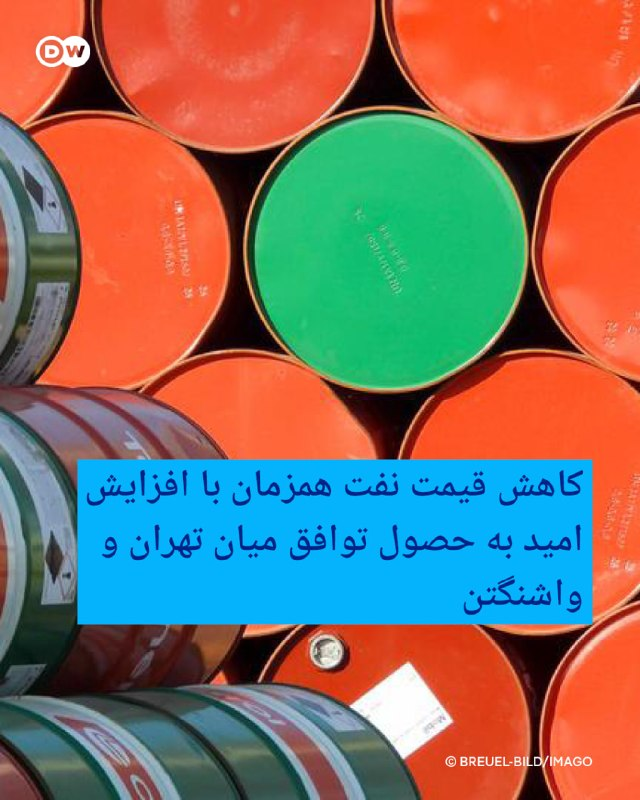

🔶 کاهش قیمت نفت همزمان با افزایش امید به حصول توافق میان تهران و واشنگتن

قیمت جهانی نفت روز پنج‌شنبه ۱۷ اردیبهشت همزمان با افزایش امید به دسترسی به توافق در مذاکرات ایران و آمریکا و بازگشایی تنگه هرمز کاهش یافت.

به گزارش خبرگزاری فرانسه، بازارهای سهام جهانی نیز روز پنج‌شنبه در انتظار به‌روزرسانی طرح آمریکا برای پایان دادن به جنگ ایران با روندی نوسانی در معاملات خود روبرو بودند.

مطابق این گزارش، قیمت نفت خام برنت با ۳.۸ درصد کاهش به ۹۷.۳۸ دلار در هر بشکه رسید. این در حالیست که در ابتدای این هفته این قیمت بیش از ۱۱۵ دلار بود.

در همین حال در بازار سهام وال‌استریت نیز شاخص "ا‌س‌اندپی ۵۰۰" (S&P 500) که از معتبرترین معیارهای سنجش وضعیت اقتصادی در سطح بین‌المللی به شمار می‌رود با ۰.۱ درصد افزایش، رکورد تاریخی خود را که روز قبل ثبت کرده بود، شکست.

افزون بر این، شاخص میانگین صنعتی "داوجونز" تا ساعت ۹ و ۳۵ دقیقه صبح به وقت شرق آمریکا ۵۹ واحد معادل ۰.۱درصد رشد داشت و شاخص "نزدک کامپوزیت" نیز که یک شاخص بازار سهام مهم در ایالات متحده به شمار می‌رود ۰.۲درصد افزایش نشان داد.
@dw_farsi

## DW_Farsi — post 124410

🔶 سی‌‌ان‌ان: ایران برای عبور از تنگه هرمز قوانین جدیدی وضع کرده است

"سی‌ان‌ان" می‌گوید، بنا بر سندی که به رؤیت این شبکه خبری آمریکایی رسیده، ایران دستورالعمل و قوانین جدیدی را برای کشتی‌هایی که قصد عبور از تنگه هرمز دارند وضع کرده است.

طبق خبری که سی‌ان‌ان روز پنج‌شنبه ۱۷ اردیبهشت منتشر کرده، این سند شامل یک فرم درخواستی است که توسط مرجع تنگه خلیج فارس (Persian Gulf Strait Authority - PGSA) صادر شده و تمام کشتی‌های عبوری از این تنگه را ملزم می‌کند، به منظور تضمین تردد ایمن آن را پر کنند.

سی‌ان‌ان می‌گوید، این سند را از ریچارد مید، سردبیر خبرگزاری تحلیل داده‌های دریایی "لویدز لیست" و یک منبع دیگر که نخواست نامش فاش شود دریافت کرده است.

این فرم شامل بیش از ۴۰ پرسش است و هر کشتی را ملزم می‌کند تا علاوه بر برخی جزئیات، نام، شماره شناسایی، نام قبلی و کشور مبدأ و مقصد خود را اعلام کند. همچنین در مورد ملیت مالک ثبت‌شده، مدیر و خدمه کشتی نیز سئوالاتی مطرح شده است.

در پی دور دوم حملات اسرائيل و آمریکا که از نهم اسفند در ایران آغاز شد جمهوری اسلامی اعلام کرد که عبور از تنگه هرمز را برای کشتی‌های مرتبط با این دو کشور محدود خواهد کرد.

ریچارد مید با اشاره به فهرست پرسش‌های مندرج در فرم یادشده به سی‌ان‌‌ان گفت، این فهرست "بسیار شبیه به سئوالاتی است که می‌دانستیم، پیش از این هم از مالکان کشتی‌ها پرسیده می‌شد."

او ادامه داد: «اما این اقدام به این ساختار رسمیت می‌بخشد و به نظر می‌رسد حرکتی از سوی ایران برای عادی‌سازی اقتدار خود بر رفت‌وآمدهای دریایی باشد.»

این در حالیست که پیش از نهم اسفند و شروع دور دوم جنگ اسرائيل و آمریکا علیه جمهوری اسلامی، کشتی‌ها برای عبور از تنگه هرمز مجبور به اشتراک‌گذاری هیچ‌گونه اطلاعاتی نبودند.

سی‌ان‌ان با اشاره به این که مرجع تنگه خلیج فارس (PGSA) به‌تازگی راه‌اندازی شده به گزارش شبکه "پرس‌تی‌وی" ایران اشاره می‌کند که در آن گفته شده که تحت این سیستم جدید، تمامی کشتی‌های عبوری از تنگه هرمز ایمیلی از آدرسی متعلق به PGSA دریافت می‌کنند که آن‌ها را از مقررات عبور مطلع می‌سازد.

در این ایمیل که توسط مید و یک منبع دیگر در اختیار سی‌ان‌ان گذاشته شده به کشتی‌های عبوری هشدار داده شده است که "ارائه اطلاعات کامل و دقیق برای پردازش درخواست عبور کشتی ضروری است" و "دستورالعمل‌های بعدی از طریق ایمیل ابلاغ خواهد شد."
@dw_farsi

## DW_Farsi — post 124409

🎥 کارل مارکس و انگلس در هند؛ کودکان روستایی با نام رهبران کمونیست

در روستای وانی‌ولامپاتی در جنوب هند، برخی روستاییان نام چهره‌های مشهور کمونیست، از کارل مارکس و انگلس تا فیدل کاسترو و چه‌گوارا را روی فرزندان خود می‌گذارند. این سنت نسل‌هاست در روستا ادامه دارد و به گفته ساکنان آن، ریشه در جنبشی محلی علیه تبعیض طبقاتی و نظام کاستی در هند دارد.

@dw_farsi

## DW_Farsi — post 124408

🔶 ابراز آمادگی سه‌چهارم مردان ۱۸ ساله آلمانی برای خدمت سربازی

از میان مردان ۱۸ ساله‌ای که در چارچوب مدل جدیدخدمت سربازی در آلمان از سوی ارتش نامه دریافت کرده‌اند، حدود ۷۲ درصد پرسش‌نامه مربوط به آمادگی و تمایل برای خدمت را تکمیل کرده‌اند. در مقابل، ۲۸ درصد به این نامه پاسخ نداده‌اند؛ این در حالی است که برای مردان متولد سال ۲۰۰۸، پاسخ‌دادن به این پرسش‌نامه الزامی است.

این پرسش‌نامه شامل سوال‌هایی درباره آمادگی جسمی، صلاحیت و تمایل افراد برای خدمت در ارتش است. زنان، برخلاف مردان، ملزم به پاسخ‌گویی نیستند.

بر اساس اطلاعات منتشرشده از محافل ارتش، حدود نیمی از کسانی که پاسخ داده‌اند، به انجام خدمت داوطلبانه حداقل شش‌ماهه ابراز علاقه کرده‌اند. با این حال، ارتش آلمان تاکید کرده این به آن معنا نیست که همه این افراد در نهایت وارد خدمت خواهند شد. یکی از عوامل مهم، امکان ارائه محل خدمت نزدیک به محل زندگی داوطلبان است، زیرا فاصله بیشتر می‌تواند احتمال پیوستن آن‌ها را کاهش دهد.

وزارت دفاع آلمان گفته است نادیده گرفتن این الزام بدون پیامد نخواهد بود و موارد عدم پاسخ‌گویی پیگیری خواهد شد. برای کسانی که به‌طور مداوم از پاسخ دادن خودداری کنند، احتمال جریمه نقدی وجود دارد.

افرادی که این نامه را دریافت کرده‌اند، یک ماه فرصت دارند پرسش‌نامه را تکمیل کنند. وزارت دفاع پیش‌تر اعلام کرده بود در چهار ماهه نخست سال ۲۰۲۶، حدود ۱۹۴ هزار مرد و زن این نامه را همراه با اطلاعات دسترسی به فرم دریافت کرده‌اند.
@dw_farsi

## DW_Farsi — post 124407

  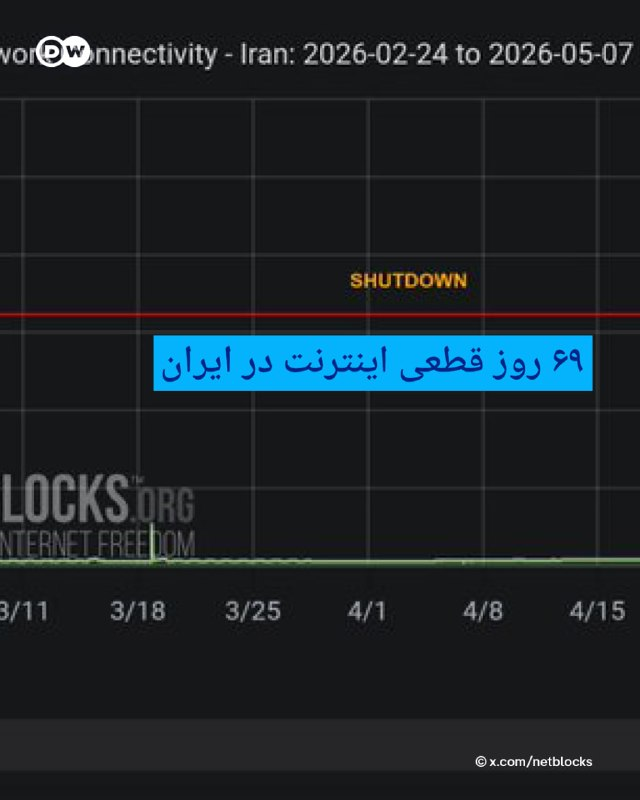

🔶 ۶۹ روز قطعی اینترنت در ایران

نت بلاکس روز پنج‌شنبه ۱۷ اردیبهشت گزارش داد ۶۹ روز از قطعی سراسری اینترنت در ایران می‌گذرد.

به گفته این نهاد ناظر بر وضعیت دسترسی به اینترنت در جهان، این وضعیت که سبب قطع دسترسی بخش بزرگی در ایران به شبکه‌های بین‌المللی شده تا کنون دست کم ۱۶۳۲ ساعت را دربر گرفته است.

نت بلاکس در پیامی در حساب کاربری خود در شبکه ایکس نوشت این خاموشی دیجیتال "باعث از دست رفتن گسترده مشاغل در ایران شده و تأثیر ناعادلانه شدیدی بر صاحبان مشاغل مستقل [آزاد] گذاشته، روندی که در عمل ثروت را به سوی گروه‌های وابسته به رژیم [ایران] سوق داده است."
@dw_farsi

## DW_Farsi — post 124406

🔶 پزشکیان از "دیدار دو و نیم ساعته" خود با مجتبی خامنه‌ای خبر داد

مسعود پزشکیان، رئیس‌جمهور ایران، در نشستی با نمایندگان اصناف از دیدار اخیرش با مجتبی‌ خامنه‌ای، رهبر جدید جمهوری اسلامی، خبر داد.

به گزارش رسانه‌های ایران پزشکیان روز پنج‌شنبه ۱۷ اردیبهشت گفت در این دیدار که "نزدیک به دو و نیم ساعت" طول کشیده، از ضرورت "وحدت و انسجام" در ساختار رهبری کشور با مجتبی خامنه‌ای سخن گفته است.

او با این حال به زمان دقیق این ملاقات اشاره‌ای نکرد.

مجتبی خامنه‌ای در پی کشته شدن پدرش علی خامنه‌ای در حملات اسرائيل و آمریکا به رهبری رسید اما از آن زمان تا کنون در انظار عمومی ظاهر نشده و در رسانه‌ها نیز تنها پیام‌های کتبی منتسب به او منتشر شده‌اند.

مقام‌های ایرانی می‌گویند، او نهم اسفند ۱۴۰۴ در زمان حمله هوایی به بیت رهبری در این مکان حضور داشت، اما از حمله جان سالم بدر برد و تنها به‌شدت زخمی شده است. با این حال عدم پخش تصاویر زنده یا پیام صوتی از مجتبی خامنه‌ای به گمانه‌زنی‌ها در مورد سلامتی‌ و وخامت وضعیت جسمانی‌اش دامن زده است. این نخستین بار است که گفته می‌شود، یک مقام عالی‌رتبه دولت ایران با او ملاقات کرده است.

شبکه سی‌ان‌ان در خبری که درباره "دیدار" پزشکیان با مجتبی خامنه‌ای منتشر کرده، زمان پخش چنین خبری را با توجه به احتمال رسیدن به توافق در مذاکرات ایران و آمریکا، مهم دانسته است.

پزشکیان گفته است که مجتبی خامنه‌ای در این ملاقات با روحیه "مبتنی بر سادگی، تواضع، صمیمیت و احترام متقابل خود" باعث می‌شد که "فضای گفت‌وگو کاملا بی‌واسطه، صریح و همراه با احساس نزدیکی و اعتماد باشد."

او افزود: «وقتی عالی‌ترین مقام کشور با چنین منش اخلاقی، تواضع و روحیه مردمی با مسئولان و افراد مواجه می‌شود، این رفتار به‌صورت طبیعی می‌تواند الگویی برای نظام مدیریتی و اداری کشور نیز باشد.»

@dw_farsi

## Persian_Trend_Official — post 13677

  <a href="telegram/content/Persian_Trend_Official_13677_1778236459.mp4" target="_blank">🎬 Download video</a>

💢 توقیف نفتکش متخلف اوشن کوی توسط نیروی دریایی ارتش

فارس گزارش داده :

🔹تکاوران دریایی ارتش جمهوری اسلامی در یک عملیات ویژه، نفتکش متخلف اوشن کوی (OCEAN KOI) را که در صدد ایجاد اخلال در صادرات نفت و منافع ملت ایران بود، توقیف کردند.

🫆:Tony

📌 @persian_trend_official
پرشین ترند | متفاوت‌ترین کانال نظامی

## Persian_Trend_Official — post 13676

  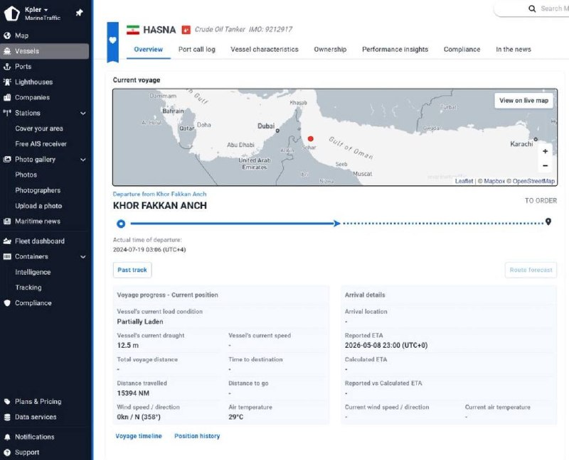

🔴تانکرترکرز گزارش می‌دهد که سه نفت‌کش خالی شرکت NITC (نفتکش‌های ملی ایران) طی دو روز گذشته، خط محاصره دریایی نیروی دریایی آمریکا را دور زده و از طریق منطقه انحصاری اقتصادی پاکستان (EEZ) به سمت ایران حرکت کرده‌اند. ظرفیت ترکیبی این سه کشتی حدود ۵ میلیون بشکه نفت خام است.

🔹دو کشتی با تصاویر ماهواره‌ای تأیید شده‌اند. کشتی سوم به نام HASNA (شماره IMO: ۹۲۱۲۹۱۷) روی سیستم AIS در نزدیکی عمان دیده شده، اما تأیید تصویری ندارد. این کشتی قبلاً در ۶ مه توسط CENTCOM با شلیک جنگنده F/A-18 از ناو هواپیمابر USS Abraham Lincoln، سکانش آسیب دیده بود.

🫆:Tony

📌 @persian_trend_official
پرشین ترند | متفاوت‌ترین کانال نظامی

## Persian_Trend_Official — post 13675

  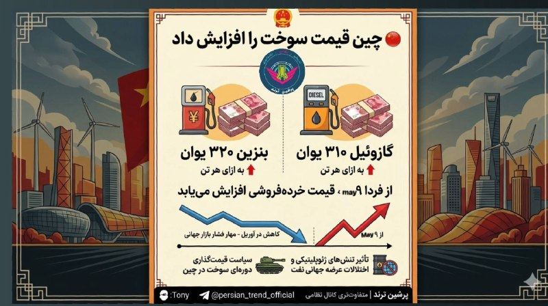

🔴 چین قیمت سوخت را افزایش داد

▪️طبق اعلام نهاد برنامه‌ریزی دولتی چین، از فردا ۹ مه، قیمت خرده‌فروشی بنزین و گازوئیل در این کشور افزایش پیدا می‌کند؛ بنزین ۳۲۰ یوان و گازوئیل ۳۱۰ یوان به ازای هر تن متریک گران‌تر می‌شود.

▪️این تصمیم در ادامه سیاست قیمت‌گذاری دوره‌ای سوخت در چین گرفته شده و پس از آن اعمال می‌شود که در ماه آوریل برای مهار فشار بازار جهانی، قیمت‌ها کاهش یافته بود.

▪️به گفته تحلیلگران، نوسانات اخیر بازار انرژی همچنان تحت تأثیر تنش‌های ژئوپلیتیکی و اختلالات عرضه جهانی نفت قرار دارد/الجزیره

🫆:Tony

📌 @persian_trend_official
پرشین ترند | متفاوت‌ترین کانال نظامی

## Persian_Trend_Official — post 13674

  <a href="telegram/content/Persian_Trend_Official_13674_1778236462.webm" target="_blank">🎬 Download video</a>

🔴 بازداشت ۴ نفر در اسرائیل با اتهام جاسوسی برای ایران

▪️رسانه عبری Ynet گزارش داده ۳ سرباز و ۱ غیرنظامی در اسرائیل به اتهام همکاری با اطلاعات ایران بازداشت شده‌اند؛ برخی از آن‌ها در زمان شروع ارتباط زیر سن قانونی بوده‌اند.

▪️بر اساس ادعای سرویس امنیت داخلی اسرائیل Shin Bet و پلیس، این افراد متهم‌اند از اماکن حساس از جمله یک پایگاه مرتبط با نیروی هوایی فیلم‌برداری کرده‌اند.

▪️گزارش‌ها می‌گویند برخی از متهمان به‌صورت داوطلبانه با عوامل ایرانی تماس گرفته‌اند.

▪️این افراد در ماه مارس بازداشت شده‌اند و اکنون دادستانی اسرائیل علیه آن‌ها کیفرخواست صادر کرده است.

🫆:Tony

📌 @persian_trend_official
پرشین ترند | متفاوت‌ ترین کانال نظامی

## Persian_Trend_Official — post 13673

  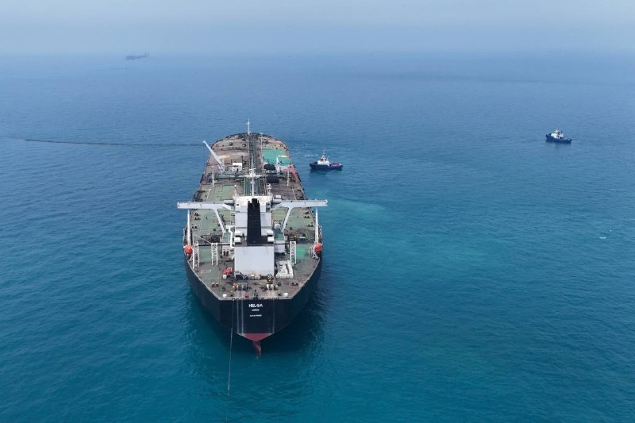

🔴 انرژی جهانی زیر فشار ‌بحران

▪️بر اساس تحلیل‌های Cfr تنش‌های ژئوپلیتیکی اخیر (از جمله در خاورمیانه) باعث اختلال در بازار انرژی و افزایش قیمت نفت و LNG شده‌اند و این وضعیت هنوز به ثبات نرسیده است.

▪️در کوتاه‌مدت، کشورها با ابزارهای اضطراری مثل آزادسازی ذخایر استراتژیک، سهمیه‌بندی سوخت و تغییر موقت منابع انرژی (مثل جایگزینی گاز با زغال‌سنگ) تلاش می‌کنند شوک را مدیریت کنند؛ اما این‌ها فقط نقش «ضربه‌گیر» دارند و بحران را حل نمی‌کنند.

▪️سیستم انرژی جهانی هنوز به‌شدت به منابع فسیلی و مسیرهای محدود عرضه وابسته است؛ بنابراین هر بحران ژئوپلیتیکی می‌تواند اثرات زنجیره‌ای در اقتصاد جهانی ایجاد کند.

▪️در نگاه بلندمدت تنها راه پایدار عبور از این چرخه بحران، «نوآوری انرژی» است؛ از توسعه انرژی هسته‌ای و تجدیدپذیر تا فناوری‌های جدید ذخیره‌سازی، شبکه برق و استخراج کارآمدتر.

▪️همچنین اشاره می‌شود رقابت جهانی در نوآوری انرژی نابرابر است؛ برخی کشورها پیشرو هستند و برخی دیگر در حال عقب‌ماندن، موضوعی که می‌تواند در آینده توازن اقتصادی و سیاسی را تغییر دهد.
🫆:Tony
📌 @persian_trend_official
پرشین ترند | متفاوت‌ترین کانال نظامی

## Persian_Trend_Official — post 13672

  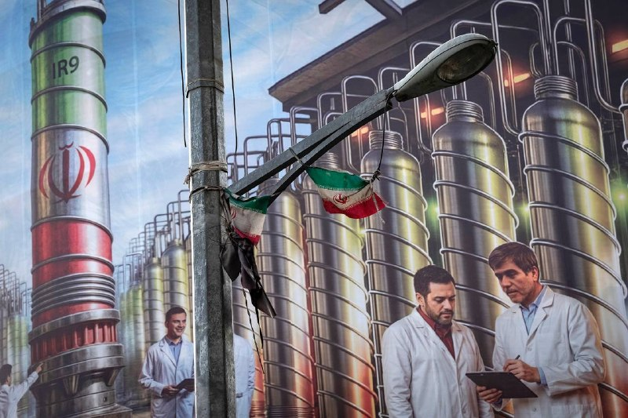

گزارش جدید Cfr با عنوان «سه درس از جنگ ایران برای مذاکره‌کنندگان هسته‌ای» می‌گوید جنگ اخیر نشان داده توافق‌های آینده میان تهران و واشنگتن دیگر صرفاً درباره غنی‌سازی نیست، بلکه به مسئله امنیت منطقه‌ای، بازدارندگی و حتی اعتبار نظام عدم اشاعه هسته‌ای گره خورده است.

سه نتیجه اصلی این تحلیل:

▪️ حملات گسترده آمریکا و اسرائیل هم نتوانسته تمام زیرساخت و دانش هسته‌ای ایران را از بین ببرد و بدون بازرسی و توافق، «ابهام هسته‌ای» ایران بیشتر می‌شود.

▪️ جنگ می‌تواند ایران را به سمت مدل «ابهام هسته‌ای کره شمالی» سوق دهد
در گزارش آمده اگر توافق جدید شامل نظارت‌های گسترده نباشد، تهران ممکن است بخشی از فعالیت‌ها را مخفی کرده و در آینده به سمت آستانه‌ هسته‌ای حرکت کند.

▪️ مذاکرات جدید احتمالاً فراتر از برجام خواهد بود
طبق گزارش، آمریکا احتمالاً علاوه بر غنی‌سازی، درباره موشک‌های بالستیک، حمایت منطقه‌ای ایران و امنیت تنگه هرمز هم خواهان محدودیت خواهد شد؛ موضوعی که مذاکرات را بسیار پیچیده‌تر از برجام می‌کند.

🫆:Tony

📌 @persian_trend_official
پرشین ترند | متفاوت‌ترین کانال نظامی

## Persian_Trend_Official — post 13671

🔴 وقوع انفجار پهپاد انتحاری در رأس‌الناقوره

🔹رسانه‌های اسرائیلی گزارش می‌دهند در پی انفجار یک پهپاد انتحاری در منطقه «رأس‌الناقوره» در الجلیل غربی، دست‌کم ۴ نفر به‌شدت زخمی شده‌اند/نقل از نایا

🔹جزئیات بیشتری درباره هویت هدف یا منشأ پهپاد منتشر نشده، اما این منطقه در نزدیکی مرز لبنان قرار دارد و طی هفته‌های اخیر بارها هدف حملات متقابل قرار گرفته است

🫆:Tony

📌 @persian_trend_official
پرشین ترند | متفاوت‌ترین کانال نظامی

## Persian_Trend_Official — post 13670

🔴 تشدید درگیری‌ها در خلیج فارس و جنوب لبنان

💢آخرین اخبار نظامی ۲۴ساعت گذشته

▪️ ارتش جمهوری اسلامی اعلام کرد نیروهای آمریکایی یک نفتکش ایرانی را در آب‌های ساحلی هدف قرار داده‌اند و شناور دیگری نیز در نزدیکی بندر فجیره امارات مورد حمله قرار گرفته است.

▪️ همچنین به گفته منابع ایرانی، حملات هوایی آمریکا مناطق غیرنظامی در بندر خمیر، سیریک و جزیره قشم را هدف قرار داده و پدافند هوایی ایران نیز در غرب تهران فعال شده است.

▪️ ارتش آمریکا اعلام کرد نیروهایش در تنگه هرمز هدف حملات موشکی، پهپادی و قایق‌های تندروی جمهوری اسلامی قرار گرفته‌اند و در پاسخ، «تهدیدات ورودی» و تأسیسات نظامی مرتبط با حملات را منهدم کرده‌اند.

▪️ دونالد ترامپ حملات آمریکا به اهداف ایرانی را یک «ضربه کوچک دوستانه» توصیف کرد و مدعی شد:
«آتش‌بس برقرار است؛ در حال اجراست.»

▪️ هم‌زمان حملات اسرائیل به جنوب لبنان ادامه دارد. طبق گزارش‌ها، دست‌کم ۱۱ نفر از جمله چند کودک در شهرهای «دویر»، «حاروف» و «حبوش» در منطقه نبطیه کشته شده‌اند/الجزیره

🫆:Tony

📌 @persian_trend_official
پرشین ترند | متفاوت‌ترین کانال نظامی

## Persian_Trend_Official — post 13669

🔴 ارتش اسرائیل دستور تخلیه اجباری روستایی در جنوب لبنان را صادر کرد

ارتش اسرائیل از ساکنان روستای «العباسیه» در جنوب لبنان، در شرق شهر صور، خواست فوراً خانه‌های خود را ترک کنند.

آویخای ادرعی، سخنگوی عرب‌زبان ارتش اسرائیل، در پیامی در X اعلام کرد ساکنان باید «بدون تأخیر» منطقه را تخلیه کرده و حداقل تا شعاع ۱۰۰۰ متری از روستا فاصله بگیرند و به مناطق باز منتقل شوند.

این دستور در حالی صادر شده که با وجود آتش‌بس اعلام‌شده در لبنان، درگیری‌ها میان حزب‌الله و ارتش اسرائیل همچنان رو به تشدید است و حملات و جابه‌جایی اجباری ساکنان مناطق جنوبی ادامه دارد.

🫆:Tony

📌 @persian_trend_official
پرشین ترند | متفاوت‌ترین کانال نظامی

## Persian_Trend_Official — post 13668

🔴 چین: به‌شدت نگران وضعیت کشتی‌ها در تنگه هرمز هستیم

🔹وزارت خارجه چین اعلام کرد پکن نسبت به افزایش شمار کشتی‌های آسیب‌دیده در پی تنش‌های تنگه هرمز «به‌شدت نگران» است.

🔹مقام‌های چینی همچنین تأیید کردند یک نفتکش چینی در تنگه هرمز هدف حمله قرار گرفته و تعدادی شهروند چینی در این کشتی حضور داشته‌اند، اما تاکنون گزارشی از تلفات خدمه منتشر نشده است.

🔹این نخستین تأیید رسمی پکن درباره آسیب‌دیدن یک شناور چینی در جریان تنش‌های اخیر منطقه محسوب می‌شود.

🫆:Tony

📌 @persian_trend_official
پرشین ترند | متفاوت‌ترین کانال نظامی

## Persian_Trend_Official — post 13667

مومن‌نسب: فضای مجازی به هیچ وجه نباید به حالت قبل برگردد.

حالا این آدم انقدر مهم نیست که دربارش صحبت کنیم ولی خواستم بگم این همون آدمیه که چندسال پیش تو صداوسیما میگفت من خطرات اینترنت رو میدونم و اطلاع دارم یک نفر با 2 گیگ اینترنت حامله شده و پدر دختره با گریه اینو برای من تعریف می‌کرد...

📝 Nick

📌 @persian_trend_official
پرشین ترند | متفاوت‌ترین کانال نظامی

## Persian_Trend_Official — post 13666

  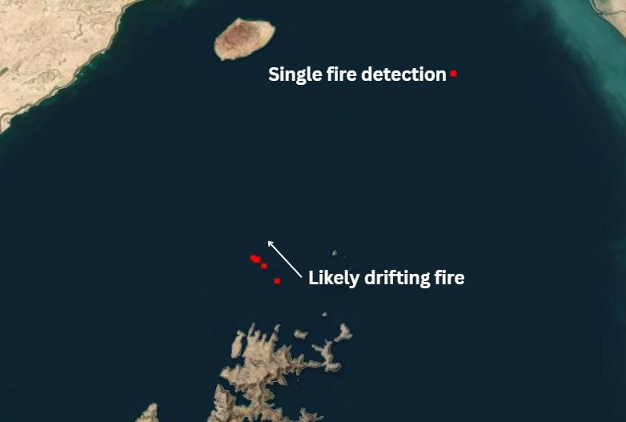

⭕️ ناسا چندین آتش سوزی در تنگه هرمز پس از نبرد روز گذشته بین ایران و ایالات ثبت کرده است.

📝 Nick

📌 @persian_trend_official
پرشین ترند | متفاوت‌ترین کانال نظامی

## Persian_Trend_Official — post 13665

💢سعید لیلاز: صلح موردپسند آمریکا، ایران را مانند مصر و عراق می‌کند، نه ژاپن

🔸احساس آمریکایی‌ها این است که اگر با ایران دعوا راه بیندازند، بیشتر در خلیج فارس و جهان عرب می‌توانند پول در بیاورند تا وقتی که بخواهند در روابط با ایران تنش‌زدایی کنند؛ مگر اینکه یک «ایرانِ برده» به آن‌ها بدهیم.

🔸آن‌وقت خواهید دید که خسارت و ضرری که آن ایرانِ برده متحمل می‌شود، به‌مراتب بیشتر از ایران مستقل است.

🔸همه فکر می‌کنند اگر ما با آمریکا مصالحه کنیم، مطابق با آن چیزی که آن‌ها می‌خواهند، ایران مثل ژاپن می‌شود اما من همیشه می‌گویم ایران مثل عراق و مصر خواهد شد.

🔸یگانه راهی که می‌بینم این است که ما پنجره دیپلماسی را باز نگه داریم، ولی دستمان روی ماشه باشد؛ جز مقاومت مؤثر و نیرومند، هیچ راهی وجود ندارد.

🔸خطاب به امت شهیدپرورِ همیشه در صحنه می‌گویم که یک مثلث یا پدیده‌ سه‌ضلعی وجود دارد؛ که در راس آن، «قدرت نظامی» قرار دارد؛ قدرت نظامی‌ که به‌شدت و به‌ طرز قاطعی بازدارنده است.

📝 Nick

📌 @persian_trend_official
پرشین ترند | متفاوت‌ترین کانال نظامی

## Persian_Trend_Official — post 13664

🔴 خلاصه آخرین تحولات منطقه و تنگه هرمز

▪️ وزارت دفاع امارات اعلام کرد صداهای انفجار شنیده‌شده در نقاط مختلف کشور ناشی از عملیات رهگیری و مقابله با موشک‌ها و پهپادهای شلیک‌شده از سوی ایران بوده است.

▪️ رسانه‌های ایرانی گزارش دادند پس از درگیری دریایی میان نیروهای ایران و آمریکا و حملات هوایی آمریکا، وضعیت در جزایر و مناطق ساحلی اطراف تنگه هرمز «تثبیت شده» است.

▪️ دونالد ترامپ درباره درگیری‌های اخیر گفت:
«آن‌ها با ما درافتادند؛ ما هم نابودشان کردیم.»
او در عین حال مدعی شد مذاکرات برای پایان جنگ «بسیار خوب» پیش می‌رود.

▪️ رئیس‌جمهور فیلیپین، «فردیناند مارکوس جونیور»، اعلام کرد اتحادیه آسه‌آن در برابر بی‌ثباتی ناشی از جنگ خاورمیانه، موضعی متحد و هماهنگ حفظ کرده است.

▪️ قیمت نفت پس از درگیری‌های آمریکا و ایران در تنگه هرمز جهش کرد؛ به‌طوری‌که نفت برنت در معاملات پرتلاطم پنج‌شنبه تا ۷.۵٪ افزایش یافت، هرچند با آغاز بازارهای آسیایی بخشی از رشد خود را از دست داد.

▪️ بازار سهام کره‌جنوبی نیز صبح جمعه تحت تأثیر افزایش تنش‌های نظامی میان ایران و آمریکا وارد فاز نزولی شد.

🫆:Tony

📌 @persian_trend_official
پرشین ترند | متفاوت‌ترین کانال نظامی

## Persian_Trend_Official — post 13663

  <a href="telegram/content/Persian_Trend_Official_13663_1778236465.webm" target="_blank">🎬 Download video</a>

🔴 اسماعیل بقایی:

«اگر دندان‌های شیر را دیدی که بیرون زده‌اند،
تصور نکن که شیر لبخند می‌زند.»

🫆:Tony

📌 @persian_trend_official
پرشین ترند | متفاوت‌ترین کانال نظامی

## Persian_Trend_Official — post 13662

  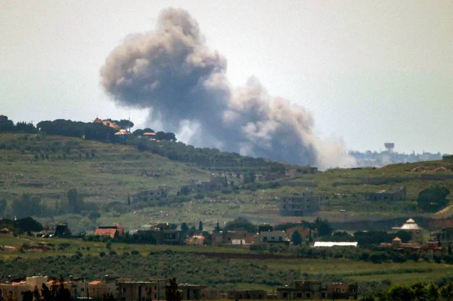

🔴 حملات توپخانه‌ای اسرائیل به جنوب لبنان؛ عقب‌نشینی تیم‌های امدادی زیر آتش

خبرگزاری ملی لبنان (NNA) گزارش داد ارتش اسرائیل مناطق اطراف «المنصوری» و «بیوت الصیاد» در جنوب لبنان را هدف حملات توپخانه‌ای قرار داده و گلوله‌باران تا سواحل المنصوری-حمرا ادامه یافته است.

بر اساس این گزارش:

▪️ آتش‌بارها از مواضع اسرائیل در جنوب شهر صور شلیک شده‌اند
▪️ بامداد امروز نیروهای اسرائیلی با پشتیبانی چند خودروی نظامی تلاش کردند به سمت «بیوت الصیاد» پیشروی کنند
▪️ این عملیات با پوشش سنگین توپخانه و پرواز بالگردهای تهاجمی همراه بوده است

🔹همچنین NNA اعلام کرد شب گذشته یک حمله هشداردهنده مسیر حرکت تیم‌های امدادی صلیب سرخ لبنان و نیروهای پزشکی ارتش لبنان را در نزدیکی شهرداری «زبقین» هدف قرار داد.

🔹این تیم‌ها قصد انتقال مجروحان و جمع‌آوری اجساد ناشی از حملات قبلی را داشتند، اما به‌دلیل آتش اسرائیل مجبور به عقب‌نشینی شدند.

در گزارش همچنین به وقوع یک انفجار شدید در داخل شهر «الخِیام» توسط نیروهای اسرائیلی اشاره شده است.

🫆:Tony

📌 @persian_trend_official
پرشین ترند | متفاوت‌ترین کانال نظامی

## Persian_Trend_Official — post 13661

  <a href="telegram/content/Persian_Trend_Official_13661_1778236466.webm" target="_blank">🎬 Download video</a>

🔴 پاکستان خواستار بازگرداندن ملوانان پاکستانی و ایرانی از کشتی‌های توقیف‌شده شد

▪️اسحاق دار، وزیر خارجه پاکستان، اعلام کرد از همتای سنگاپوری خود «ویویان بالاکریشنان» خواسته برای بازگرداندن ملوانان پاکستانی و ایرانی حاضر در کشتی‌های توقیف‌شده توسط نیروهای آمریکایی همکاری کند.

▪️دار در پیامی در X نوشت این کشتی‌ها در حال نزدیک شدن به آب‌های سنگاپور هستند و اسلام‌آباد هم‌زمان با عباس عراقچی، وزیر خارجه ایران، نیز در تماس است.

🔹او تأکید کرد پاکستان آماده است بازگشت امن شهروندان ایرانی به ایران را از طریق خاک پاکستان تسهیل کند.

بر اساس اعلام وزیر خارجه پاکستان:
▪️ ۱۱ ملوان پاکستانی
▪️ ۲۰ ملوان ایرانی

در کشتی‌های توقیف‌شده حضور دارند.

🫆:Tony

📌 @persian_trend_official
پرشین ترند | متفاوت‌ترین کانال نظامی

## Persian_Trend_Official — post 13660

یک شب معمولی در خاورمیانه: 📝 Nick 📌 @persian_trend_official پرشین ترند | متفاوت‌ترین کانال نظامی

## Persian_Trend_Official — post 13659

  <a href="telegram/content/Persian_Trend_Official_13659_1778236467.webm" target="_blank">🎬 Download video</a>

⭕️ توییت جدید ترامپ در تروث سوشال:

سه ناوشکن جهانی آمریکایی با موفقیت کامل از تنگه هرمز عبور کردند، در حالی که زیر آتش دشمن بودند. هیچ آسیبی به این سه ناوشکن وارد نشد، اما آسیب بزرگی به مهاجمان ایرانی زده شد. آن‌ها کاملاً منهدم شدند، همراه با تعداد زیادی قایق کوچک که برای جایگزینی نیروی دریایی کاملاً از پای درآمده ایران استفاده می‌شوند. این قایق‌ها سریع و مؤثر به قعر دریا فرستاده شدند. موشک‌هایی به سمت ناوشکن‌های ما شلیک شد که به‌راحتی سرنگون گشتند. همچنین پهپادهایی آمدند که در هوا سوختند. آن‌ها بسیار زیبا به سمت اقیانوس سقوط کردند، درست مانند پروانه‌ای که به سمت قبرش فرومی‌رود! یک کشور عادی اجازه می‌داد این ناوشکن‌ها عبور کنند، اما ایران یک کشور عادی نیست. آن‌ها توسط دیوانگان رهبری می‌شوند، و اگر فرصت استفاده از سلاح هسته‌ای را داشته باشند، بدون تردید این کار را می‌کنند — اما هرگز آن فرصت را نخواهند یافت و همان‌طور که امروز دوباره آن‌ها را از پا درآوردیم، در آینده خیلی سخت‌تر و خیلی شدیدتر آن‌ها را از پا درخواهیم آورد، اگر قرارداد خود را سریع امضا نکنند! سه ناوشکن ما، با خدمه فوق‌العاده خود، اکنون به محاصره دریایی ما خواهند پیوست، که واقعاً یک «دیوار فولادی» است.

رئیس‌جمهور دونالد جی. ترامپ

📝 Nick

📌 @persian_trend_official
پرشین ترند | متفاوت‌ترین کانال نظامی

## Persian_Trend_Official — post 13658

  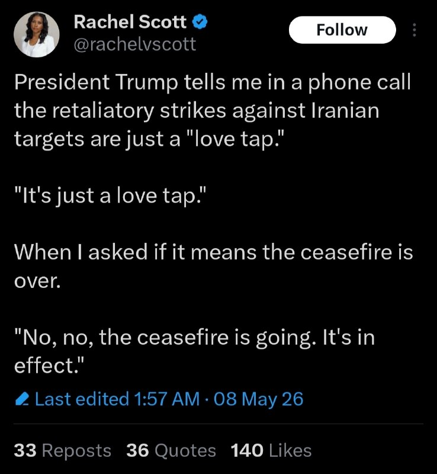

⭕️ ترامپ: آتش بس برقرار است و نقض نشده است. 📝 Nick 📌 @persian_trend_official پرشین ترند | متفاوت‌ترین کانال نظامی

## RadioFarda — post 156961

  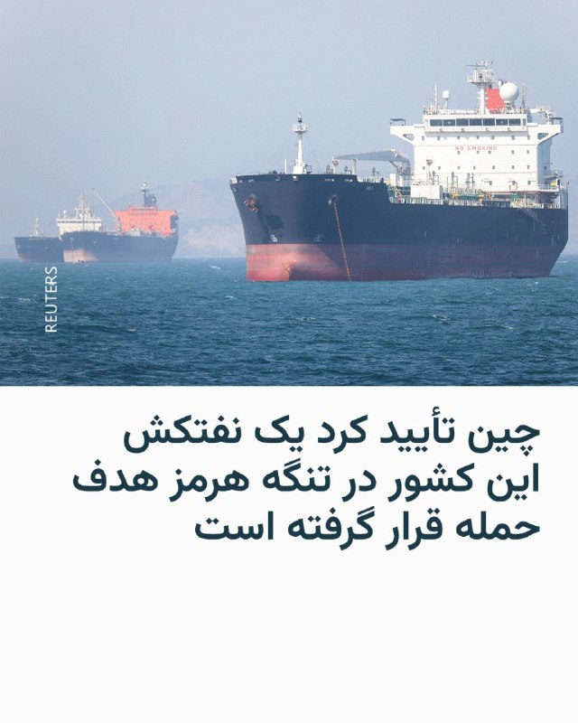

🔸وزارت خارجه چین تأیید کرد نفتکشی که دوشنبه گذشته در نزدیکی تنگه هرمز هدف حمله قرار گرفت، متعلق به یک شرکت چینی و با خدمه‌ای از شهروندان این کشور است.

🔸سخنگوی وزارت خارجه چین روز جمعه ۱۸ اردیبهشت گفت شهروندان چینی در این کشتی با بار مواد شیمیایی حضور داشته‌اند، اما تاکنون گزارشی از تلفات خدمه منتشر نشده است.

🔸رسانهٔ چینی «کای‌شین» پیش‌تر گزارش داده بود که نفتکشی متعلق به یک شرکت چینی که روی بدنهٔ آن عبارت «مالک و خدمهٔ چینی» نوشته شده بود، روز دوشنبه در نزدیکی تنگه هرمز هدف حمله قرار گرفت.

🔸منابع امنیت دریایی گفته‌اند کشتی آسیب‌دیده احتمالاً نفتکش و شناور حمل مواد شیمیایی «جی‌وی اینوویشن» با پرچم جزایر مارشال بوده است؛ کشتی‌ای که وقوع آتش‌سوزی روی عرشهٔ خود را به شناورهای اطراف گزارش کرده بود.

🔸این حادثه روز دوشنبه ۱۴ اردیبهشت در سواحل امارات متحده عربی و در نزدیکی بندر مینا صقر رخ داد.

🔸خبر حمله به این نفتکش پیش از دیدار وانگ یی، وزیر خارجه چین، با عباس عراقچی، وزیر خارجه ایران، در پکن منتشر شد. دو طرف در این دیدار درباره وضعیت تنگه هرمز گفت‌وگو کردند.

@RadioFarda

## RadioFarda — post 156960

حزب کارگر در انتخابات محلی بریتانیا با افت حمایت در مقابل حزب راست‌گرا مواجه شد

🔸کی‌یر استارمر، نخست‌وزیر بریتانیا، در نخستین آزمون مهم انتخاباتی دولت خود با نشانه‌های نارضایتی گستردهٔ رأی‌دهندگان روبه‌رو شده و نتایج اولیهٔ انتخابات محلی از پیشروی چشمگیر حزب راست‌گرای ضدمهاجرت «رفورم یوکی» به رهبری نایجل فاراژ حکایت دارد.

🔸انتخابات محلی روز پنجشنبه ۱۷ اردیبهشت، کمتر از دو سال پس از پیروزی قاطع حزب کارگر در انتخابات سراسری و پایان دادن به ۱۴ سال حکومت محافظه‌کاران برگزار شد.

🔸با این حال، نتایج اولیه که صبح جمعه منتشر شد، نشان می‌دهد حزب کارگر بخشی از حمایت مردمی خود را از دست داده و در برخی از مناطق سنتی خود در شمال و مرکز انگلستان با شکست‌های سنگینی روبه‌رو شده است.

🔸بر اساس نتایج اولیه، حزب رفورم یوکی که با شعارهای ضدمهاجرت و انتقاد از احزاب سنتی فعالیت می‌کند، بیش از ۳۵۰ کرسی شوراهای محلی را در انگلستان به دست آورده است. هم‌زمان حزب کارگر صدها کرسی را از دست داده و محافظه‌کاران نیز با کاهش حمایت رأی‌دهندگان روبه‌رو شده‌اند.

🔸حزب رفورم یوکی برای نخستین بار کنترل یکی از شوراهای محلی لندن، منطقهٔ هیورینگ در شرق پایتخت بریتانیا، را به دست آورد. این حزب همچنین توانست در برخی از پایگاه‌های سنتی حزب کارگر، از جمله دو منطقه در شمال انگلستان، تمام کرسی‌های حزب کارگر را تصاحب کند.

🔸در این انتخابات حدود پنج هزار کرسی شوراهای محلی از مجموع ۱۶ هزار کرسی در سراسر انگلستان تعیین می‌شود و رأی‌دهندگان در اسکاتلند و ولز نیز نمایندگان پارلمان‌های محلی را انتخاب می‌کنند.

🔸این انتخابات دولت مرکزی بریتانیا را تعیین نمی‌کند، اما معیاری مهم برای سنجش محبوبیت احزاب به شمار می‌رود و نخستین آزمون جدی افکار عمومی برای دولت استارمر پیش از انتخابات سراسری بعدی در سال ۲۰۲۹ محسوب می‌شود.

🔸نسخه کامل این گزارش را در وب‌سایت رادیوفردا بخوانید.

@RadioFarda

## RadioFarda — post 156959

  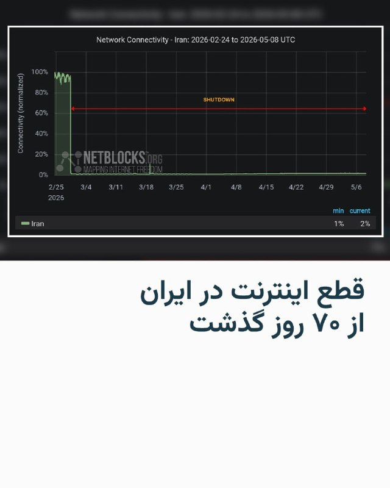

🔸امروز هفتادمین روز قطع اینترنت در ایران است و به‌گزارش نت‌بلاکس این اختلال صبح جمعه ۱۸ اردیبهشت از یک هزار ۶۵۶ ساعت فراتر رفت.

🔸قطع اینترنت در ایران در حالی است که به‌نوشتهٔ نت‌بلاکس، دسترسی دیجیتال در زمان بحران حیاتی است و محدود کردن خدمات، بیش از همه به کسانی آسیب می‌زند که بیشترین نیاز را دارند؛ افراد دارای معلولیت، دانشجویان، کسب‌وکارهای کوچک و عموم مردم.

🔸حکومت ایران ادعا می‌کند قطع اینترنت به‌دلیل شرایط امنیتی ناشی از جنگ با آمریکا و اسرائیل بوده که از نهم اسفند آغاز شد و ۳۹ روز ادامه یافت. منتقدان و کارشناسان اما تأکید دارند که جنگ دلیل مسدود کردن اینترنت نبوده و صرفاً بهانه‌ای برای مجبور کردن مردم به استفاده از شبکه ملی اطلاعات به‌جای اینترنت بوده است.

🔸این در حالی است که مقامات و افراد نزدیک به حکومت یا کسانی که حکومت خود با واگذاری «سیم‌کارت سفید» انتخاب می‌کند، هم‌چنان به اینترنت دسترسی دارند. علاوه بر آن، اخیراً برخی اپارتورهای نیز اینترنت موسوم به طبقاتی را باقیمت‌های گزاف در اختیار برخی مشاغل و طبقات قرار داده‌اند.

@RadioFarda

## RadioFarda — post 156958

همزمان با سکوت قوه قضاییه، درخواست‌ها برای رسیدگی پزشکی و آزادی نرگس محمدی ادامه دارد

🔸همزمان با سکوت قوه قضاییه جمهوری اسلامی درباره وضعیت نگران‌کننده نرگس محمدی، برنده نوبل و زندانی سیاسی، درخواست‌ها از سراسر جهان برای رسیدگی پزشکی فوری و آزادی او از زندان ادامه دارد.

🔸بنیاد نرگس محمدی روز جمعه، ۱۱ اردیبهشت، خبر داد این فعال حقوق بشر و برندهٔ جایزهٔ صلح نوبل به‌دلیل وخامت شدید وضعیت جسمی به‌طور فوری به بیمارستانی در زنجان منتقل شده است.

🔸حال، یک هفته پس از انتقال او به بیمارستان، بنیاد نرگس محمدی روز پنج‌شنبه، ۱۷ اردیبهشت، در شبکه ایکس نوشته است که او «همچنان در وضعیت جسمانی ناپایدار به سر می‌برد و نگرانی‌ها دربارهٔ وضعیت قلبی او به‌طور جدی افزایش یافته است.»

🔸این بنیاد همچنین می‌گوید: «پزشکانی که پیش از بستری وضعیت او را بررسی کرده بودند، تأکید دارند که هرگونه تأخیر در سپردن روند درمان به پزشک معالج قبلی او می‌تواند خطرات جانی جبران‌ناپذیری به همراه داشته باشد و انجام عمل فوری آنژیوگرافی تخصصی، ضروری است.»

🔸با وجود تمام این گزارش‌ها و ابراز نگرانی در گوشه‌وکنار جهان دربارهٔ وضعیت سلامت این زندانی سیاسی سرشناس، قوه قضاییه جمهوری اسلامی هنوز هیچ واکنشی نشان نداده و در برابر این اخبار سکوت اختیار کرده است.

🔸این در حالی است که درخواست‌ها از سراسر جهان برای رسیدگی پزشکی درخور و فوری به وضعیت خانم محمدی و در نهایت آزادی بی قید و شرط او از زندان برای ادامه درمان در یک هفته گذشته قطع نشده است.

🔸نسخه کامل این گزارش را در وب‌سایت رادیوفردا بخوانید.

@RadioFarda

## RadioFarda — post 156957

  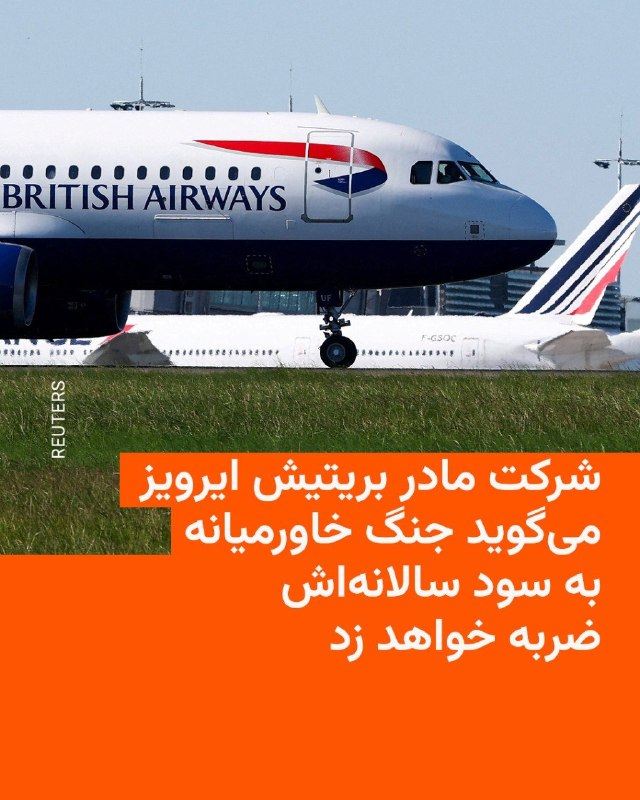

🔸آی ای جی (IAG)، گروه مادر بریتیش ایرویز و شرکت اسپانیایی ایبریا، روز جمعه ۱۸ اردیبهشت اعلام کرد که جنگ خاورمیانه، سود سالانه‌اش را کاهش خواهد داد.

🔸این شرکت در بیانیه درآمد خود گفت: «اگرچه سه ماهه اول نسبتاً تحت تأثیر درگیری خاورمیانه قرار نگرفت، اما انتظار داریم که افزایش هزینه سوخت، تأثیر قابل توجهی در ادامه سال داشته باشد.»

🔸قیمت نفت از زمان آغاز جنگ آمریکا و ایران در اواخر فوریه افزایش یافته و منجر به افزایش بسیار زیاد هزینه‌های سوخت جت شده است.

🔸آی ای جی گفت که سود خالص این شرکت در سه ماهه اول در مقایسه با دوره ژانویه-مارس سال گذشته، ۷۱ درصد افزایش یافته و به ۳۰۱ میلیون یورو (۳۵۴ میلیون دلار) رسیده است، با این حال انتظار دارد سودی کمتر از پیش‌بینی اولیه در ابتدای سال داشته باشد.

🔸 به نوشته رویترز، قیمت سوخت جت از زمان آغاز جنگ آمریکا و اسرائیل با ایران در ۹ اسفند ۱۴۰۴ حدود ۸۴ درصد افزایش یافته، اما تاکنون کمبودی در سوخت هواپیما در کشورهای اتحادیه اروپا گزارش نشده است.

@RadioFarda

## RadioFarda — post 156956

  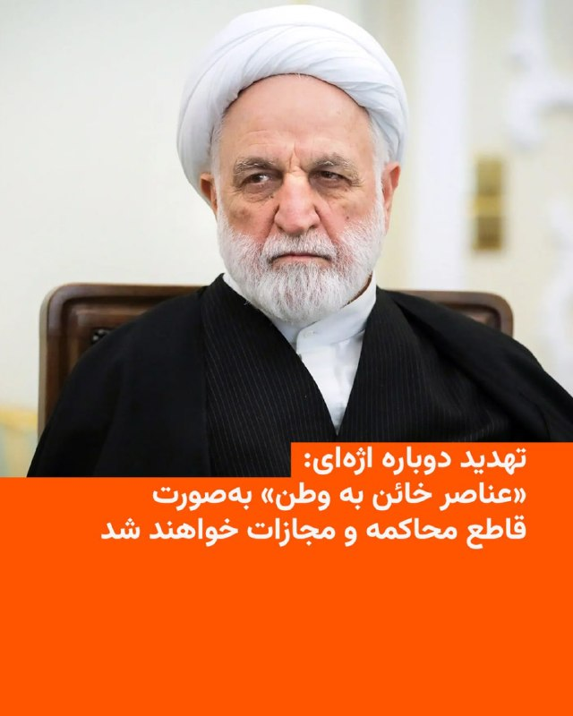

🔸هم‌زمان با هشدار سازمان دیده‌بان حقوق بشر در خصوص اعدام‌ها با «اتهامات سیاسی» در ایران رییس قوه قضاییه جمهوری اسلامی، اعلام کرد که با «عناصر خائن به وطن» به‌صورت قاطع برخورد خواهد شد.

🔸غلامحسین محسنی اژه‌ای، روز جمعه ۱۸ اردیبهشت گفت: «عناصر خائن به وطن به‌صورت قاطع محاکمه و مجازات خواهند شد و دستگاه قضایی در این مسیر از سرزنش سرزنشگران ابایی ندارد.»

🔸بهار صبا، پژوهشگر سازمان دیده‌بان حقوق بشر، در ویدئویی که شامگاه پنج‌شنبه ۱۷ اردیبهشت در حساب این نهاد در شبکه ایکس منتشر شد، اعلام کرد که تنها در یک ماه و نیم گذشته «دست‌کم ۲۸ نفر» در ایران با «اتهامات سیاسی» اعدام شده‌اند.

🔸بر اساس اعلام این سازمان، این افراد همگی در دادگاه‌هایی محکوم شده‌اند که در آن‌ها «حقوق اساسی و اولیه متهمان زیر پا گذاشته می‌شود».

@RadioFarda

## RadioFarda — post 156955

  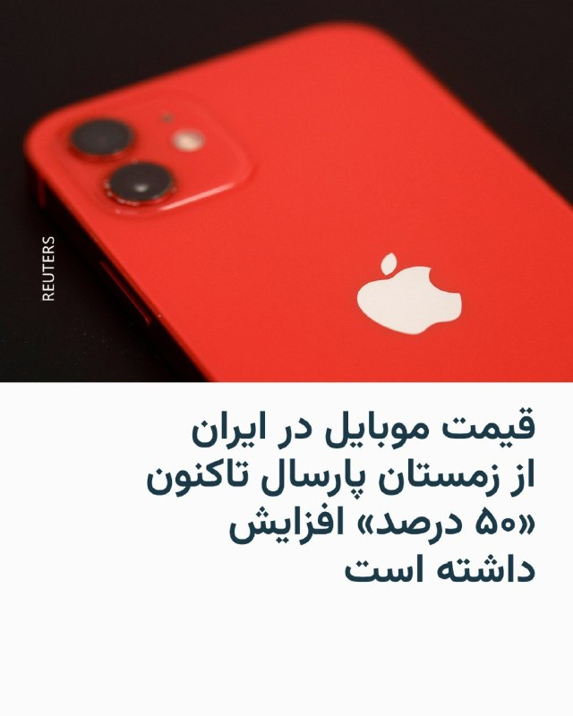

🔸یک گزارش میدانی از بازار موبایل در ایران حاکی است قیمت موبایل‌ها از زمستان ۱۴۰۴ تاکنون نزدیک به ۵۰ درصد رشد کرده و در هفته‌های اخیر نیز این بازار بار دیگر با جهش مجدد قیمت‌ها مواجه شده است.

🔸بر اساس این گزارش که جمعه ۱۸ اردیبهشت در خبرگزاری حکومتی مهر منتشر شد، گوشی‌های اقتصادی و میان‌رده که مورد استفادهٔ عموم مردم است، بیشترین افزایش قیمت را تجربه کرده‌اند.

🔸برای نمونه، قیمت گلکسی A۰۶ که اوایل فروردین کمتر از ۲۰ میلیون تومان بود، اکنون به حدود ۲۵ میلیون تومان رسیده است. همچنین گلکسی A۵۶ در بازه ۹۵ تا ۱۰۱ میلیون تومان و ردمی نوت ۱۴ پرو حدود ۶۹ میلیون تومان قیمت‌گذاری شده‌اند.

🔸در بخش گوشی‌های پرچمدار نیز شکاف قیمتی افزایش یافته است، به‌طوری‌ که گلکسی S۲۵ Ultra حدود ۲۸۴ میلیون تومان و آیفون ۱۷ پرو مکس بین ۳۶۷ تا ۴۵۰ میلیون تومان در بازار عرضه می‌شود.

🔸این گزارش به‌نقل از فعالان بازار موبایل سه عامل اصلی را در التهاب بازار برشمرده است: مشکلات زنجیرهٔ تأمین و واردات؛ نوسانات نرخ ارز و انتظارات تورمی؛ و نااطمینانی اقتصادی بازار.

@RadioFarda

## RadioFarda — post 156954

گفت‌گو با بری پاول؛ آمریکا در قبال ایران چه راهبردی دارد و گام بعدی چیست؟

🔸کاخ سفید از توقف «پروژه آزادی» در تنگه هرمز خبر داده و می‌گوید یکی از مراحل اصلی عملیات نظامی علیه ایران به پایان رسیده است، با این حال، هنوز روشن نیست این درگیری به کدام سو می‌رود. آیا این اقدام واقعاً نشانه‌ای از کاهش تنش است یا فقط وقفه‌ای تاکتیکی پیش از دور تازه‌ای از تنش‌هاست؟

🔸بری پاول، مدیر ارشد پیشین سیاست و راهبرد دفاعی در شورای امنیت ملی آمریکا که در دولت جورج دبلیو بوش به‌عنوان دستیار ویژۀ رئیس‌جمهور فعالیت می‌کرد، در گفت‌وگو با رادیو اروپای آزاد/رادیو آزادی به بررسی معنای راهبردی تحولات اخیر پرداخته است.

🔸بری پاول در این گفت‌وگو از تحرکات نظامی در تنگه هرمز، تغییر توازن قدرت در خاورمیانه و نقش کشورهایی مانند چین و روسیه می‌گوید و تصویری از وضعیت کنونی این درگیری ارائه می‌دهد.

🔸نسخه کامل این گفت‌وگو را در وب‌سایت رادیوفردا بخوانید.

@RadioFarda

## RadioFarda — post 156953

  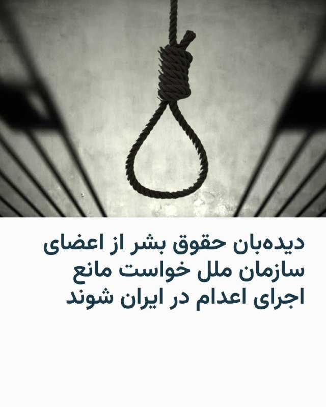

🔸سازمان دیده‌بان حقوق بشر از تمام اعضای سازمان ملل خواست تا به مسئله اجرای مجازات اعدام در ایران ورود کنند.

🔸بهار صبا، پژوهشگر این سازمان، در ویدئویی که روز پنج‌شنبه در حساب این نهاد در شبکه ایکس منتشر شد خاطرنشان می‌کند که تنها در یک ماه و نیم گذشته «دست‌کم ۲۸ نفر» در ایران با «اتهامات سیاسی» اعدام شده‌اند.

🔸به گفته این سازمان، این افراد همگی در دادگاه‌هایی محکوم شده‌اند که در آنها «حقوق اساسی و اولیه متهمان زیر پا گذاشته می‌شود».

🔸علاوه بر این، از تمام این افراد تحت «فشار و شکنجه» اعتراف گرفته شده است.

🔸بهار صبا در ادامه با تأکید بر این که مقامات جمهوری اسلامی در ایران «از اعدام برای القای ترس در میان مردم استفاده می‌کنند» از اعضای سازمان ملل خواسته است تا با اقدام هماهنگ حکومت ایران را تحت فشار بگذارند که اجرای اعدام را متوقف کند.

@RadioFarda

## RadioFarda — post 156952

  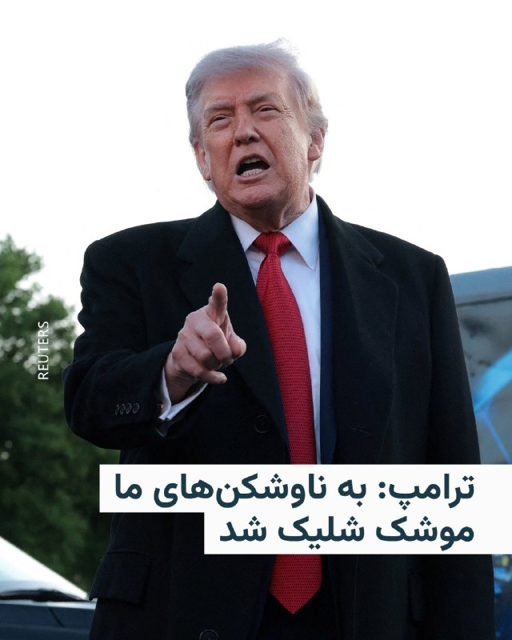

🔸دونالد ترامپ در شبکه اجتماعی خود توضیح داده است که سه ناوشکن آمریکایی در حین عبور از تنگه هرمز به سمت خارج از خلیج فارس هدف موشک‌های ایران قرار گرفته‌اند.

🔸او نوشت:‌ «ناوشکن‌ها زیر آتش با موفقیت از تنگه هرمز عبور کردند.»

🔸او ادامه داد:‌ «به ناوشکن‌های ما موشک شلیک شد که خیلی راحت منفجر شدند. بعد همین طور نوبت به پهپادها رسید که آنها هم در آسمان خاکستر شدند.»

🔸ترامپ در ادامه پیام خود هشدار داده است: «همان طور که امروز به آنها ضربه زدیم، اگر هر چه سریع‌تر توافق را امضا نکنند، خیلی سخت‌تر و با خشونت بیشتر در آینده باز به آنها ضربه خواهیم زد.»

🔸رئیس جمهور آمریکا پیشتر در گفت‌وگو با خبرنگاران این برخورد تازه با ایران را «سر به سر گذاشتن» توصیف کرده و در عین حال تأکید کرده بود که آتش‌بس هم‌چنان برقرار است.

🔸این نخستین بار نیست که دو طرف در عین درگیری اصرار می‌کنند که خدشه‌ای به آتش‌بس وارد نشده، موضعی که به عقیده کارشناسان تنها نشانه آن است که دو طرف به آغاز درگیری‌های تازه و ادامه جنگ تمایلی ندارند.

@RadioFarda

## RadioFarda — post 156951

  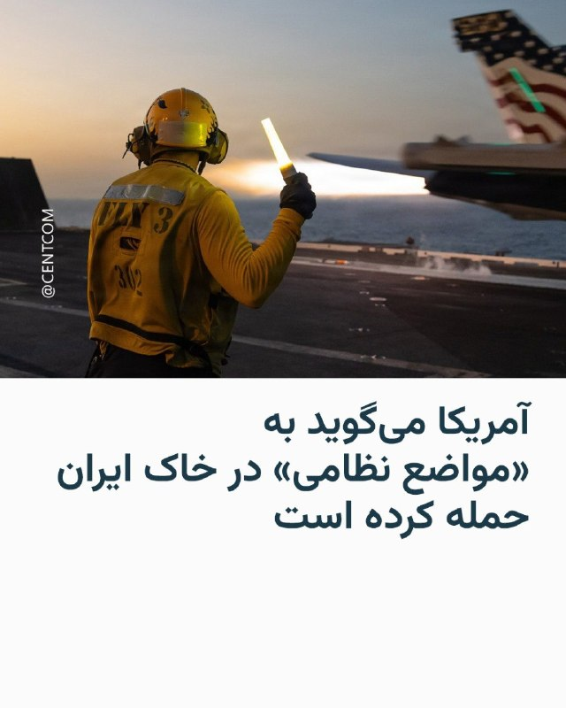

🔸در حالی که ارتش آمریکا می‌گوید که به مواضع نظامی در خاک ایران حمله کرده است، رئیس جمهور آمریکا در گفت‌وگو با خبرنگاران تأکید کرد که آتش‌بس هم‌چنان برقرار است.

🔸سنتکام، فرماندهی مرکزی ارتش آمریکا در منطقه خاورمیانه، بامداد جمعه خبر داد که مواضع نظامی در خاک ایران را هدف قرار داده است.

🔸به گفته سنتکام، این حملات پس از آن انجام شده که ایران ناوهای در حال عبور از تنگه هرمز را هدف قرار داده است.

🔸سنتکام در عین حال می‌گوید که در پی «بالا بردن سطح تنش» نیست.

🔸دونالد ترامپ، رئیس جمهور آمریکا، در گفت‌وگو با خبرنگاران این برخورد تازه با ایران را چنین توصیف کرد: «آنها سر به سرمان گذاشتند.» او در عین حال تأکید کرد که آتش‌بس برقرار است و به آن خدشه‌ای وارد نشده است.

🔸پیشتر در پی انتشار گزارش‌هایی در رسانه‌ها و شبکه‌های اجتماعی از شنیده شدن صدای چند انفجار در جنوب ایران، خبرگزاری فارس، نزدیک به سپاه پاسداران، شامگاه پنج‌شنبه خبر داده بود که بخش‌هایی از اسکله بهمن در جزیره قشم هدف قرار گرفته است.

@RadioFarda

## RadioFarda — post 156950

  <a href="https://t.me/radiofarda/156950" target="_blank">📎 Download file</a>

📻بشنوید: سرخط خبرها با رادیوفردا، ۱۸ اردیبهشت ۱۴۰۵‌

@RadioFarda

## RadioFarda — post 156949

  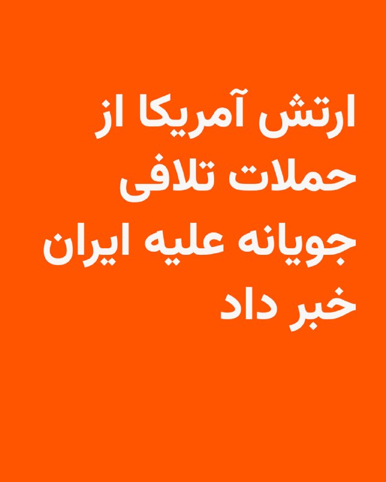

🔸ارتش آمریکا اعلام کرد روز پنج‌شنبه حملات تلافی‌جویانه‌ای علیه ایران انجام داده و مکان‌هایی را هدف قرار داده است که به گفته واشینگتن مسئول حمله به نیروهای آمریکایی بوده‌اند.

🔸فرماندهی مرکزی آمریکا، سنتکام در بیانیه‌ای اعلام کرد در جریان عبور چند ناوشکن نیروی دریایی ایالات متحده از تنگه هرمز به سمت دریای عمان، حملات موشکی، پهپادی و دریایی ایران را رهگیری کرده‌ است.

🔸فرماندهی مرکزی آمریکا، سنتکام در بیانیه‌ای اعلام کرد، «سنتکام این تهدیدها را منهدم کرد و تأسیسات نظامی ایران را که مسئول حمله به نیروهای آمریکایی بودند هدف قرار داد.»

🔸به گفته فرماندهی مرکزی آمریکا، سایت‌های پرتاب موشک و پهپاد، مراکز فرماندهی و کنترل، و مراکز اطلاعاتی، شناسایی و نظارتی از جمله این اهداف بوده‌اند.

@RadioFarda

## RadioFarda — post 156948

  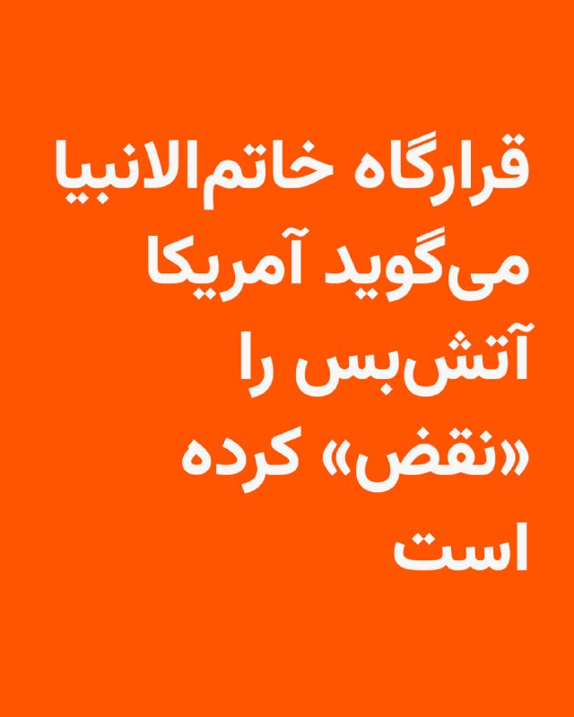

🔸قرارگاه خاتم‌الانبیا جمهوری اسلامی بامداد جمعه ایالات متحده را به نقض آتش‌بس متهم کرد و گفت «آمریکا دو کشتی را در تنگه هرمز هدف قرار داده و به مناطق غیرنظامی حمله کرده است.»

🔸سخنگوی قرارگاه مرکزی خاتم‌الانبیا در بیانیه‌ای که رسانه‌های دولتی منتشر کردند، اضافه کرد که «آمریکا یک نفتکش ایرانی را که از آب‌های ساحلی ایران در نزدیکی جاسک به سمت تنگه هرمز در حرکت بود، هدف قرار داد. همچنین یک شناور دیگر را که در نزدیکی بندر فجیره امارات وارد تنگه هرمز می‌شد، مورد حمله قرار داد.»

🔸این درحالی است که فرماندهی مرکزی آمریکا (سنتکام) در بیانیه‌ای اعلام کرد سه ناو این کشور در جریان عبور از تنگه هرمز به سمت دریای عمان، هدف حملات ایران قرار گرفتند، اما هیچ‌یک از تجهیزات یا نیروهای آمریکایی آسیب ندیدند.

🔸به گفته سنتکام، نیروهای آمریکایی در پاسخ، سایت‌های نظامی ایران از جمله محل‌های پرتاب موشک و پهپاد، مراکز فرماندهی و مراکز اطلاعاتی و شناسایی را هدف قرار داده‌اند.

@RadioFarda

## RadioFarda — post 156947

  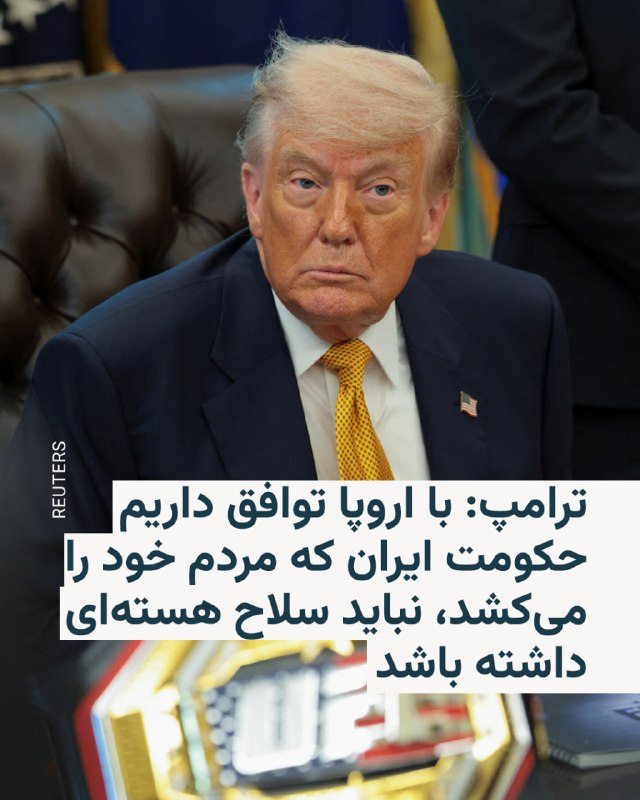

🔸دونالد ترامپ، رئیس‌جمهور آمریکا، روز پنجشنبه گفت که با اورسولا فون در لاین، رئیس کمیسیون اروپا، دربارهٔ ایران و مذاکرات تجاری جاری با اتحادیه اروپا گفت‌وگو کرده است.

🔸او در پستی در شبکه اجتماعی تروث سوشال نوشت: «ما دربارهٔ موضوعات بسیاری گفت‌وگو کردیم، از جمله این‌که کاملاً متحد هستیم که ایران هرگز نباید به سلاح هسته‌ای دست پیدا کند.»

🔸او افزود: «ما توافق داریم که رژیمی که مردم خودش را می‌کشد، نمی‌تواند بمبی را در اختیار داشته باشد که قادر است میلیون‌ها نفر را بکشد.»

🔸این در حالی است که ایران همچنان در حال بررسی طرح آمریکا است که از طریق میانجی‌گران پاکستانی دریافت کرده و هنوز پاسخ خود به پیشنهاد آمریکا برای پایان دادن به جنگ را نهایی نکرده است.

🔸ساعتی پیش عباس عراقچی، در نامه‌ای به دبیرکل سازمان ملل و و رئیس شورای امنیت این نهاد اعلام کرد «تردد عادی دریایی» در تنگه هرمز مشروط به «توقف دائمی جنگ و رفع محاصره و تحریم‌های غیرقانونی علیه ایران» است.

🔸او در این نامه از قطعنامه پیشنهادی آمریکا و بحرین به شورای امنیت سازمان ملل انتقاد کرد.

@RadioFarda

## RadioFarda — post 156946

  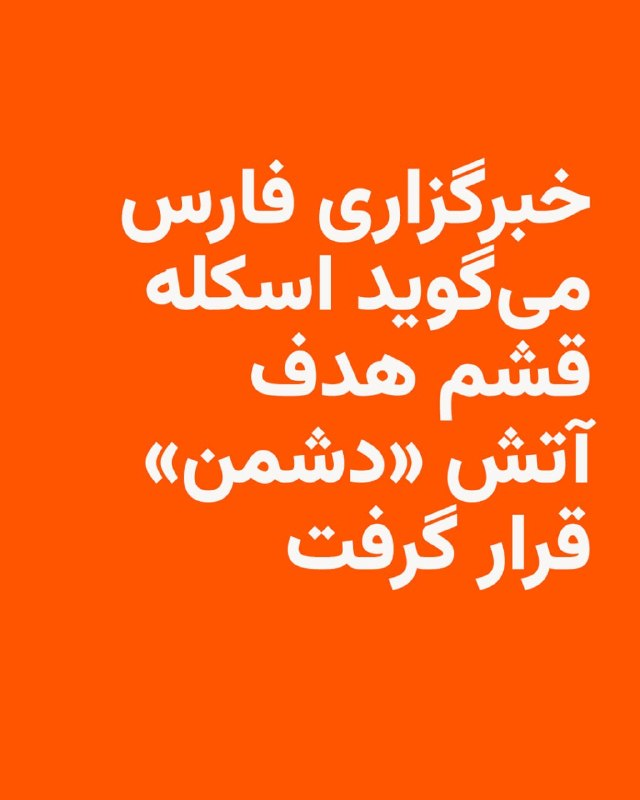

🔸در پی انتشار گزارش‌هایی در رسانه‌ها و شبکه‌های اجتماعی از شنیده شدن صدای چند انفجار در جنوب ایران، خبرگزاری فارس، نزدیک به سپاه پاسداران، شامگاه پنجشنبه اعلام کرد بخش‌هایی از اسکله بهمن در جزیره قشم هدف قرار گرفته است.

🔸این خبرگزاری اعلام کرد: «در جریان تبادل آتش میان نیروهای مسلح ایران و دشمن بخش‌های تجاری اسکله بهمن هدف قرار گرفته است.»

🔸دقایقی پیش‌تر از آن تسنیم، دیگر خبرگزاری نزدیک به سپاه، اعلام کرد صدای چند انفجار در بندرعباس و جزیره قشم شنیده شده است.

🔸خبرگزاری نیمه‌رسمی مهر نیز با اشاره به شنیده شدن صدای انفجارها در سیریک، نزدیک به بندرعباس، نوشته است: «به نظر می‌رسد صداها مربوط به درگیری‌هایی در پهنه آبی شهرستان سیریک باشد.»

🔸خبرگزاری صداوسیما نیز از شنیده شدن صدای انفجار در «اسکله مسافربری بهمن در جزیره قشم» خبر داد.

🔸گزارش‌های شهروندان در شبکه‌های اجتماعی هم از شنیده شدن چند صدای انفجار «از دریا» حکایت دارند. بر اساس این گزارش‌ها صداهای انفجار در قشم، بندرعباس و سیریک شنیده شده است.

@RadioFarda

## RadioFarda — post 156945

سازمان بهداشت جهانی اعلام کرد شیوع ویروس «هانتا» می‌تواند محدود شود

🔸سازمان بهداشت جهانی روز پنج‌شنبه ۱۷ اردیبهشت در پی افزایش نگرانی‌ها از احتمال همه‌گیری گونه نادری از ویروس «هانتا» با مشاهده مواردی از ابتلا به بیماری ناشی از آن، گفت در صورت انجام اقدامات احتیاطی، شیوع این بیماری می‌تواند «محدود» باشد.

🔸هانتا، ویروسی است که از جوندگان منتقل و می‌تواند باعث بیماری تنفسی کشنده‌ای شود.

🔸روز ۱۳ اردیبهشت با اعلام مرگ سه نفر از مسافران یک کشتی تفریحی متعلق به یک شرکت هلندی در آب‌های اقیانوس اطلس، ناشی از ویروس هانتا، نگرانی‌ها درباره احتمال همه‌گیری این بیماری زنگ خطر بین المللی را به صدا درآورد. همان روز اعلام شد سه نفر دیگر از مسافران کشتی هم به بیماری ناشی از این ویروس مبتلا شده‌اند.

🔸تدروس آدهانوم، رئیس سازمان بهداشت جهانی، روز پنجشنبه در ژنو به خبرنگاران گفت که در مجموع پنج مورد تایید شدۀ ابتلا به ویروس و سه مورد مشکوک به ابتلا، گزارش شده است.

🔸او با اشاره به سویه نادری با نام «آند» که از ویروس هانتا در کشتی تفریحی مشاهده شده، گفت: «با توجه به دوره کمون ویروس هانتا که می‌تواند تا شش هفته طول بکشد، ممکن است موارد بیشتری گزارش شود.»

🔸این سویه نادر می‌تواند بین انسان‌ها منتقل شود و از جمله عوامل افزایش نگرانی‌ها درباره همه‌گیری بیماری ناشی از آن بوده است.

🔸اما عبدی رحمان محمود، مدیر هشدار و واکنش اضطراری سازمان بهداشت جهانی، تأکید کرد: «اگر اقدامات مربوط به بهداشت عمومی همراه با همبستگی جهانی در این زمینه نشان داده شود، این یک همه‌گیری محدود خواهد بود.»

🔸گزارش کامل را در وب‌سایت رادیوفردا بخوانید.

@RadioFarda

## RadioFarda — post 156944

🔸روزنامه وال‌استریت‌جورنال روز پنجشنبه به نقل از مقام‌هایی در دولت آمریکا خبر داد که دولت دونالد ترامپ اکنون به دنبال از سرگیری عملیات هدایت کشتی‌های تجاری با پشتیبانی دریایی و هوایی در تنگه هرمز است. 🔸به نوشته این روزنامه مشخص نیست که این اتفاق چه زمانی…

## RadioFarda — post 156943

  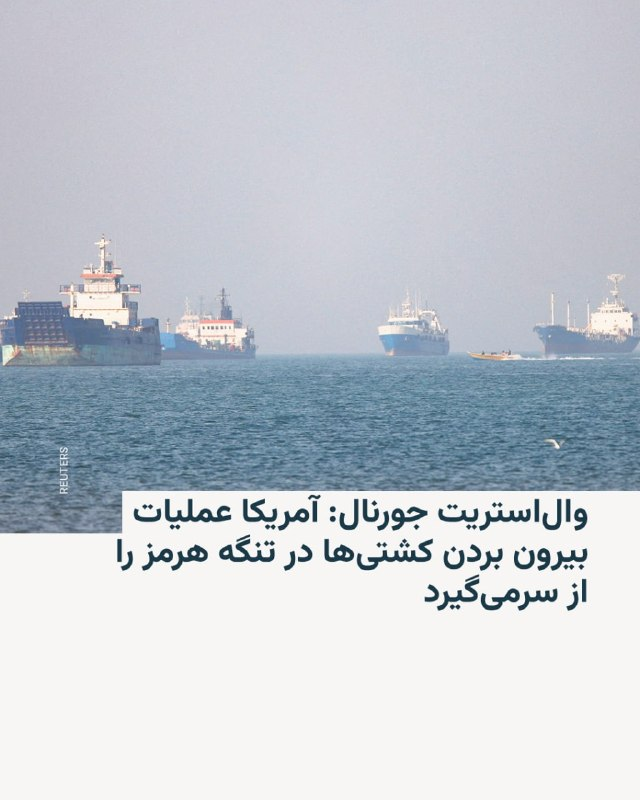

🔸روزنامه وال‌استریت‌جورنال روز پنجشنبه به نقل از مقام‌هایی در دولت آمریکا خبر داد که دولت دونالد ترامپ اکنون به دنبال از سرگیری عملیات هدایت کشتی‌های تجاری با پشتیبانی دریایی و هوایی در تنگه هرمز است.

🔸به نوشته این روزنامه مشخص نیست که این اتفاق چه زمانی ممکن است رخ دهد، با این همه مقامات پنتاگون جدول زمانی اجرای آن را تا قبل از روز یکشنبه هفته آینده، آخرهفته در آمریکا، در نظر گرفته‌اند.

🔸در گزارش وال‌استریت‌جورنال بر اساس گفته‌های مقام‌های آمریکایی و سعودی همچنین خبر داده شده است که عربستان سعودی و کویت محدودیت‌های استفاده ارتش ایالات متحده از پایگاه‌ها و حریم هوایی خود را لغو کرده‌اند و راه را برای اجرای دوباره مأموریت موسوم به «پروژه آزادی» گشوده‌اند.

🔸آمریکا روز ۱۴ اردیبهشت اجرای عملیاتی برای هدایت عبور کشتی‌ها در تنگه هرمز با نام «پروژه آزادی» را آغاز کرد اما اجرای این عملیات پس از ۳۶ ساعت به دستور دونالد ترامپ متوقف شد.

@RadioFarda

## RadioFarda — post 156942

افزایش اجاره‌خانه در پی جنگ چگونه هنجارها و سبک زندگی در ایران را تغییر می‌دهد؟

🔸یک ماه پس از برقراری آتش‌بس در جنگ آمریکا و اسرائیل علیه ایران، رسانه‌های داخل کشور از جهش شدید اجاره‌خانه و در پی آن، فشار بی‌سابقه‌ای بر معیشت مستأجران خبر داده‌اند.

🔸در این شرایط، کارشناسان هشدار می‌دهند که اجاره‌نشینی، میلیون‌ها خانوار ایرانی را به مرز ناتوانی اقتصادی و «فروپاشی هنجارهای زندگی» می‌کشاند.

🔸خبرگزاری ایسنا در گزارشی نوشت که در اواسط دهه ۸۰، سهم اجاره در شهرهای بزرگ بین ۲۵ تا ۴۰ درصد، و در شهرهای کوچک بین ۱۵ تا ۲۵ درصد درآمد خانوارها را شامل می‌شد. این خبرگزاری افزود که بر اساس داده‌های سال ۱۴۰۴ اکنون این رقم در شهرهای بزرگ به ۵۰ تا ۷۰ درصد رسیده و در شهرهای کوچک نیز بین ۲۰ تا ۵۰ درصد نوسان دارد.

🔸به نوشته این خبرگزاری، در نتیجه، مسکن به یکی از اصلی‌ترین عوامل فقر شهری تبدیل شده و به‌ویژه دهک‌های پایین، خانوارهای تک‌سرپرست و زوج‌های جوان بیشترین آسیب را متحمل می‌شوند.

🔸روشنک آسترکی، کارشناس اقتصادی نیز در گفت‌وگو با رادیو فردا، به آثار جنگ اخیر بر حوزه مسکن نیز اشاره می‌کند و می‌گوید که حملات به زیرساخت‌های ایران در جریان جنگ اخیر منجر به کمبود و گرانی مصالح ساختمانی شده است.

🔸گزارش کامل را در وب‌سایت رادیوفردا بخوانید.

@RadioFarda

## IranianMinds — post 19777

  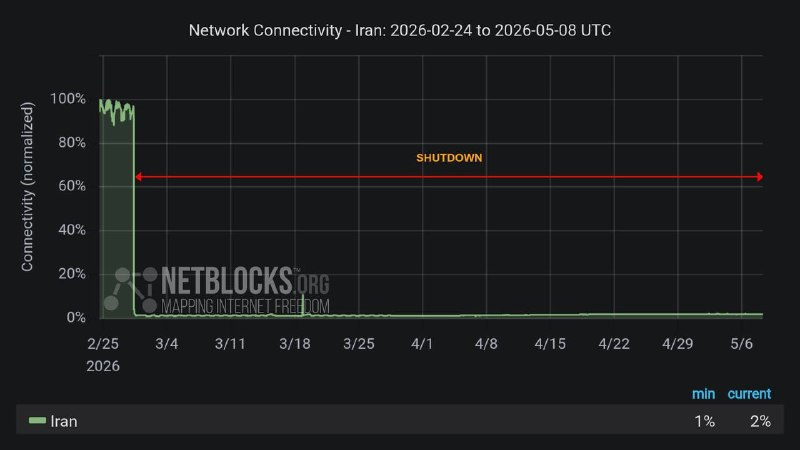

🔴 ۷۰ روز ، ۱۶۵۶ ساعته که اینترنت یکی از اصلی ترین حق یک انسان در عصر هوش مصنوعی و تکنولوژی توسط جمهوری اسلامی به روی مردم ایران قطع شده …

@IranianMinds

## IranianMinds — post 19776

  

🔴 خلاصه حرف های ترامپ :

ایران اومد یه سری کار ها کرد که ما هم برای تلافی امشب بهشون حمله کردیم که چیزه خاصی نیست و آتش بس هنوز برقراره

رهبر های ایران همشون دیوانه ان و این دیوانه ها اصلا نباید به سلاح هسته ای برسن

اگه به جایی نرسیم حملاتمون شدیدتر و نابود کننده تر خواهد شد , پس بهتره هرچه زودتر سر عقل بیان و با ما به توافق برسن !

@IranianMinds

## IranianMinds — post 19775

فقط کافیه مرغ از خیابون رد کنی و‌پولت چند برابر کنی
💵👌

## IranianMinds — post 19774

  <a href="telegram/content/IranianMinds_19774_1778236479.mp4" target="_blank">🎬 Download video</a>

بچه ها اسم این بازی عبور مرغ از خیابون  هست ویدئو نگاه کنید خیلی راحت 8 میلیون ازش سود گرفتیم😍

😤اگ توم دوس داری خیلی راحت از بازی های انلاین پول در بیاری حتما عضو کازینو شبانه شو
✅

توی کازینو شبانه بهت اموزش میدیم از بازی های انلاین پول دربیاری👌

کازینو شبانه راهی برای چند برابر کردن سرمایت 🤷‍♂

کسب درامد انلاین با یه ادم حرفه ای یاد بگیر و‌ پول دربیار 
💵
ae17
🎯همین حالا عضو شو و شروع کن👇
https://t.me/+OS-QBvyDO4M2ZGY0
https://t.me/+OS-QBvyDO4M2ZGY0

## IranianMinds — post 19773

  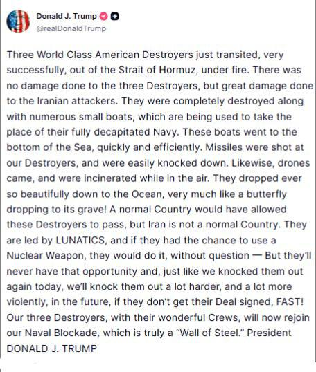

🔴 ترامپ :

سه ناوشکن آمریکایی کلاس آرلی برک با موفقیت از تنگه هرمز عبور کردن و زیر آتش ایران قرار گرفتن، اما هیچ آسیبی ندیدن. در عوض، مهاجمان ایرانی قایق‌های کوچک کاملاً نابود شدن. موشک‌ها و پهپادها هم به راحتی خنثی شدن.

- سه ناوشکن آمریکایی بدون خسارت از تنگه هرمز خارج شدن و به "دیوار فولادی" دریایی آمریکا برمی‌گردن.

قایق‌های کوچک ایرانی "به سرعت به قعر دریا رفتن" و پهپادها در هوا "سوزانده شدن" مثل پروانه‌ای که به قبرش می‌ریزه!

رهبران ایران دیوانه اند و اگر سلاح هسته‌ای داشت بدون تردید استفاده میکنن، اما آمریکا دوباره "ناک اوت‌شون کرد" و در آینده "سخت‌تر و خشن‌تر" برخورد می‌کنه مگر اینکه "سریع" توافق امضا کنن !

@IranianMinds

## IranianMinds — post 19772

🔴 ترامپ به ای بی سی نیوز :

آتش بس ادامه دارد و درحال اجراست هنوز حملات امشب فقط عشقی برای تلافی کاراشون بود

@IranianMinds

## IranianMinds — post 19771

ولی من فکر نمیکنم درگیری جدی بشه و جنگ دوباره بد شروع شه تهش میان میگن یه هشداری بود یا برای تلافی بود چون موج حملاتشون جوری نیست که بگیم بخوان درگیریو از سر بگیرن اینا

## IranianMinds — post 19770

🔴 ان بی سی نیوز به نقل از مقام بالا رده آمریکایی :

حملات به ایران دفاعی ان و اصلا برای شروع دوباره درگیری ها نیست

@IranianMinds

## IranianMinds — post 19769

🔴 رادیو ارتش اسرائیل :

مقامات اسرائیلی ارزیابی کردن که تبادل آتش اخیر بین آمریکا و جمهوری اسلامی در منطقه خلیج فارس به پایان رسیده و هر دو طرف از حملات بیشتر خودداری کردن.

@IranianMinds

## IranianMinds — post 19768

خبری که بعضی کانالا میزارن از حمله به اسرائیل کذبه

@IranianMinds

## IranianMinds — post 19767

🔴 این جنگ 2 ساعته هم تموم شد انگاری

@IranianMinds

## IranianMinds — post 19766

🔴کانال ۱۴ اسرائیل:

اتش‌بس فروریخت.

@IranianMinds

## IranianMinds — post 19765

بابا میگم اینا تو خاورمیانه عادیه قبول نمیکنید

هر موقع زدن 100 تا فرمانده سپاهو همزمان کتلت کردن بدونید برا یه دو سه روزی آتش بس تمومه

## IranianMinds — post 19764

🔴 سنتکام :

قایق های تندروی رژیم ایران در دریا و سایت های پرتاب موشک و پهپاد را در خاک ایران نابود کردیم !

@IranianMinds

## IranianMinds — post 19763

  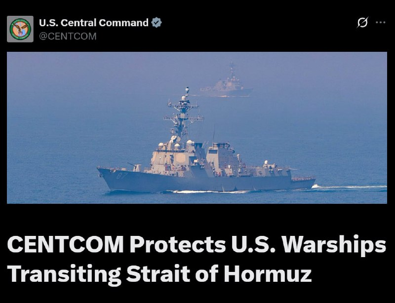

🔴 بیانیه سنتکام :

نیروهای آمریکایی حملات بی‌دلیل ایرانیان را رهگیری کرده و با حملات دفاعی پاسخ دادند در حالی که ناوشکن‌های موشک‌انداز نیروی دریایی آمریکا از تنگه هرمز به خلیج عمان عبور می‌کردند، ۷ مه.

نیروهای ایرانی چندین موشک، پهپاد و قایق کوچک را به سمت ناوشکن‌های USS Truxtun (DDG 103)، USS Rafael Peralta (DDG 115) و USS Mason (DDG 87) که از مسیر دریایی بین‌المللی عبور می‌کردند، پرتاب کردند. هیچ دارایی آمریکایی مورد اصابت قرار نگرفت.

فرماندهی مرکزی ایالات متحده (CENTCOM) تهدیدهای ورودی را از بین برد و تأسیسات نظامی ایرانی مسئول حمله به نیروهای آمریکایی از جمله سایت‌های پرتاب موشک و پهپاد؛ مکان‌های فرماندهی و کنترل؛ و گره‌های اطلاعاتی، نظارتی و شناسایی را هدف قرار داد.

@IranianMinds

## IranianMinds — post 19762

هر موقع اسرائیل هم اومد زد من باورم میشه جنگ شروع شده دوباره

## IranianMinds — post 19761

هر موقع اسرائیل هم اومد زد من باورم میشه جنگ شروع شده دوباره

## IranianMinds — post 19760

🔴 قرارگاه خاتم الانبیا:

آمریکا حملاتشو با همکاری کشور های منطقه انجام داد

@IranianMinds

## IranianMinds — post 19759

  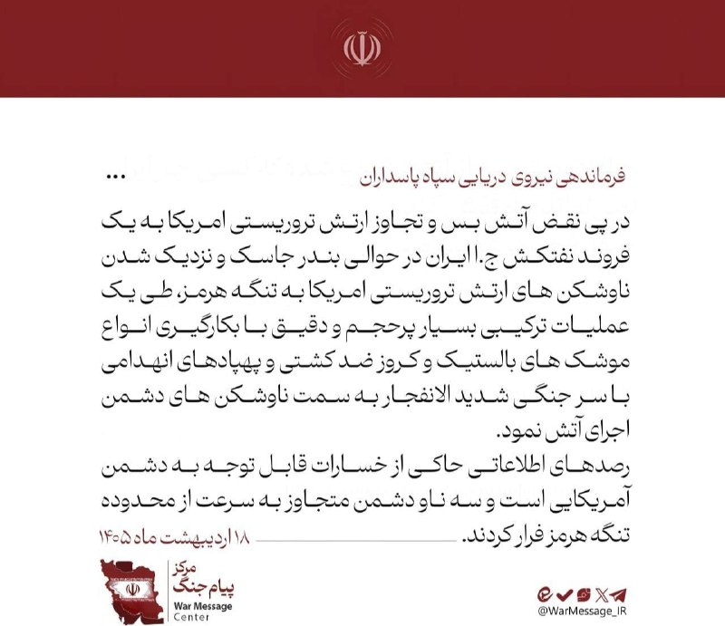

🔴 سپاه :

سه ناوشکن امریکا را در تنگه هرمز با موشک بالستیک و کروز هدف قرار داده ایم !

@IranianMinds

## IranianMinds — post 19758

🔴 فوری فاکس نیوز :

پایگاه دریابانی میناب توسط ارتش آمریکا هدف قرار گرفت

@IranianMinds

## BBCPersian — post 280488

  

🔻سازمان خواربار و کشاورزی ملل متحد (فائو) اعلام کرده است که قیمت جهانی مواد غذایی در آوریل، ماه گذشته میلادی، برای سومین ماه متوالی افزایش یافته است.

این افزایش به‌ویژه به دلیل بالا رفتن قیمت روغن‌های نباتی در پی اختلالات ناشی از جنگ ایران بوده است.

شاخص قیمت مواد غذایی فائو، که تغییرات بهای سبدی از کالاهای غذایی معامله‌شده در بازارهای جهانی را اندازه‌گیری می‌کند، در ماه آوریل ۱/۶ درصد افزایش نشان می‌دهد.

بعد از حملات آمریکا و اسرائیل به ایران در ۲۸ فوریه (نهم اسفند) و آغاز جنگ تردد کشتی‌ها در تنگه هرمز محدود شد و در حال حاضر هم که آتش‌بس برقرار است این محدودیت هنوز رفع نشده است.

تنگه هرمز مسیر عبور ۲۰ درصد نفت و گاز مایع در جهان است.

در عین حال حدود یک‌سوم از تجارت جهانی کودهای شیمیایی و مواد اولیه تولید آن‌ از تنگه هرمز عبور می‌کند و بسته بودن این آبراه، صنعت کشاورزی و تولید مواد غذایی را تحت فشار گذاشته است. قیمت کود شیمیایی از آغاز جنگ تاکنون ۸۰ درصد افزایش یافته است.

📷Getty Images
@BBCPersian

## BBCPersian — post 280487

🔻نتبلاکس: قطع اینترنت ایران وارد هفتادمین روز متوالی شد

نتبلاکس که وضعیت اینترنت در جهان را ارزیابی می‌کند، می‌گوید قطع اینترنت در ایران امروز وارد هفتادمین روز خود شده و مدت این اختلال اکنون از ۱۶۵۶ ساعت فراتر رفته است.

نتبلاکس می‌گوید «اتصال دیجیتال در زمان بحران اهمیتی حیاتی دارد و محدود کردن دسترسی به اینترنت بیشترین آسیب را به افرادی وارد می‌کند که بیش از دیگران به آن نیاز دارند؛ از جمله افراد دارای معلولیت، دانشجویان، کسب‌وکارهای کوچک و عموم مردم.»

جمهوری اسلامی ایران از نهم اسفند همزمان با شروع حملات آمریکا و اسرائیل دسترسی عموم شهروندان به اینترنت را قطع کرده است. از آن زمان فقط برخی از افراد و گروه های نزدیک به حکومت که به دارندگان «سیم کارت سفید» مشهور هستند، به اینترنت دسترسی داشته‌اند.

در عین حال شورای عالی امنیت ملی اخیرا طرحی موسوم به «اینترنت پرو» را تصویب کرده است که براساس آن برخی اهالی کسب‌وکار یا دانشگاهیان می‌توانند با پرداخت مبلغی بیشتر، با دسترسی محدود به اینترنت بین‌المللی وصل شوند. اما برخی از مشاغل همچون گروهی از پرستاران و وکلای دادگستری پیشنهاد دریافت چنین انیترنتی را رد کرده‌اند.

ایران استفاده از اینترنت ماهواره ای همچون استارلینک را هم جرم انگاری کرده و کاربران آن را تحت تعقیب قرار می‌دهد.

@BBCPersian

## BBCPersian — post 280486

🔻پکن حمله به یک نفتکش با خدمه چینی در تنگه هرمز را تایید کرد

وزارت خارجه چین تایید کرد که یک کشتی حامل فرآورده‌های نفتی با خدمه چینی در تنگه هرمز هدف حمله قرار گرفته است؛ این وزارتخانه همچنین در مورد وضعیت شناورهایی که تحت تاثیر جنگ در خاورمیانه قرار گرفته‌اند، ابراز نگرانی کرد.

لین جیان، سخنگوی وزارت خارجه چین، در کنفرانس خبری گفت که این نفتکش خدمه چینی داشته است، اما افزود که تاکنون مجروح یا کشته‌ای گزارش نشده است.

دیروز رسانه چینی سایشین گزارش داده بود که یک نفتکش چینی روز دوشنبه در نزدیکی تنگه هرمز هدف حمله قرار گرفته است.

@BBCPersian

## BBCPersian — post 280485

🔻وزارت نفت عراق اتهامات آمریکا علیه معاون این وزارتخانه در کمک به ایران در دور زدن تحریم‌ها را رد کرد

وزارت نفت عراق اتهامات آمریکا علیه معاون وزیر نفت این کشور را رد کرده است. اتهاماتی که در آن آمریکا او را به دلیل حمایت از ایران تحریم کرده است.

واشنگتن فشار بر عراق را برای فاصله گرفتن از گروه‌های نزدیک به ایران افزایش داده است.

وزارت خارجه آمریکا روز پنجشنبه اعلام کرد که علی معارج بهادلی، معاون وزیر نفت عراق را تحریم کرده است و مدعی شد که او از «موقعیت دولتی خود سوءاستفاده کرده تا نفت عراق را به نفع ایران و گروه‌های نیابتی آن به طورغیرقانونی جابجا کند»

آمریکا همچنین او را متهم کرده است که «در قالب طرحی برای کمک به ایران در دور زدن تحریم‌ها، نفت ایران را به طور غیرقانونی با نفت عراق مخلوط کرده تا به نفع ایران فروخته شود.»

با این حال، وزارت نفت عراق در بیانیه‌ای این اتهامات را رد کرده و تأکید کرده است که «اهمیت زیادی برای شفافیت در برخورد با همه اتهامات بر اساس مدارک و حقایق قائل است.»

این وزارتخانه اعلام کرده که آماده بررسی موضوع است، اما تأکید کرده که عملیات صادرات نفت خام، بازاریابی، بارگیری کشتی‌ها و فرآیندهای مرتبط در حوزه وظایف این مقام نبوده است.

پیش‌تر نیز شرکت بازاریابی نفت عراق هرگونه عملیات ترکیب نفت در بنادر یا آب‌های سرزمینی عراق برای کمک به ایران را رد کرده بود.

آمریکا در سال‌های اخیر تحریم‌هایی را علیه فروش نفت ایران اعمال کرده و تلاش دارد هر کشوری را که به خرید یا تسهیل فروش نفت ایران کمک کند مجازات کند.

https://bbc.in/3QNUa8b
@BBCPersian

## BBCPersian — post 280484

  <a href="telegram/content/BBCPersian_280484_1778236484.mov" target="_blank">🎬 Download video</a>

🔻این هفته در پرگار: شکل نظام سیاسی، موضوعی فرعی؟

🔻آیا شکل یک نظام سیاسی مهم نیست و آنچه اهمیت دارد مضمون آن است؟ آیا مفهوم مشروطه جواب این سوال را می‌دهد؟

میهمان‌ها:
فرزانه بذرپور، تحلیل‌گر سیاسی
دامون گلریز، تحلیل‌گر سیاسی
 
@BBCPersian

## BBCPersian — post 280483

  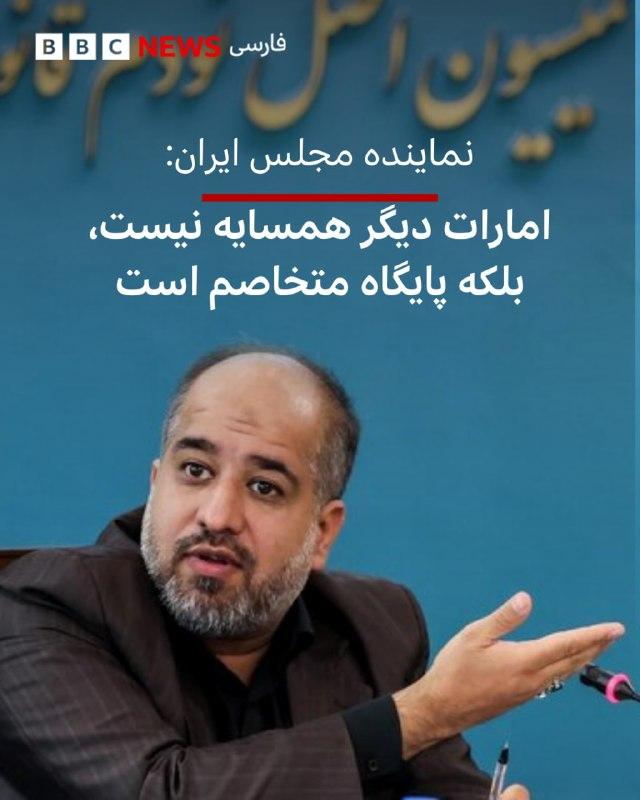

🔻علی خضریان، عضو کمیسیون امنیت ملی مجلس ایران گفته است که امارات متحده عربی همکارهای نظامی و اطلاعاتی مهمی را در جریان جنگ علیه ایران انجام داد و حتی «شائبه جدی وجود دارد که هواپیماهای امارات متحده عربی، با پاک کردن پرچم، مستقیما به خاک ایران حمله کرده‌اند.»

این نماینده مجلس گفته است که «معادله امنیتی جمهوری اسلامی در مورد اقلیم کردستان، مشمول امارات هم شده است و آن‌ها باید هر لحظه منتظر باشند همان طور که پایگاه‌های دشمن در اربیل هدف قرار می‌گیرد، پایگاه‌های متخاصم هم در امارات هدف حمله قرار بگیرد.»

به گفته او جمهوری اسلامی دیگر امارات را به چشم همسایه نمی‌بیند، بلکه آن‌ها «پایگاه متخاصم» هستند.

ایران از زمان شروع جنگ در بیش از دو ماه گذشته بارها پایگاه‌ها و مناطق دیگر امارات را هدف حملات پهپادی و موشکی قرار داده است.

📷Isna
@BBCPersian

## BBCPersian — post 280475

🖊هیلکن دواچ بوران, بخش ترکی بی‌بی‌سی در استانبول

روابط ترکیه و اسرائیل در سه سال گذشته از آستانه عادی‌سازی دیپلماتیک به نقطه‌ای رسیده که اکنون از خطر درگیری مستقیم نظامی سخن گفته می‌شود.

در حالی که جدال لفظی رهبران دو کشور ادامه دارد، احتمال رویارویی نظامی میان آن‌ها نیز به موضوعی مطرح در بحث‌ها تبدیل شده است.

بنیامین نتانیاهو، نخست‌وزیر اسرائیل، روز ۱۱ آوریل در پستی در شبکه‌های اجتماعی، رجب طیب اردوغان، رئیس‌جمهور ترکیه، را به کمک به «رژیم تروریستی» در ایران و «کشتار شهروندان کرد خود» متهم کرد.

آقای اردوغان نیز روز ۱۵ آوریل در سخنرانی خود در مجلس ترکیه گفت: «بدون آن‌که به دستان و چهره‌های خونین ۷۳ هزار فلسطینی در غزه نگاه کنند، بی‌شرمانه از طریق برادران کرد ما به کشورمان اتهام می‌زنند.»

کارشناسانی که درباره آخرین تحولات با بخش ترکی بی‌بی‌سی صحبت کرده‌اند، می‌گویند خطر رویارویی ترکیه و اسرائیل «بیش از هر زمان دیگری» افزایش یافته، اما طرفین هم‌زمان تلاش می‌کنند از بروز یک درگیری احتمالی جلوگیری کنند.

برای خواندن مطلب کامل:
https://bbc.in/49B2zlD
📸GettyImages/ EPA/Shutterstock/ AFP
@BBCPersian

## BBCPersian — post 280473

🔻سایه جنگ ایران بر سفر ترامپ به چین و دیدار شی جین‌پینگ

دونالد ترامپ، رئیس‌جمهور آمریکا، مطابق برنامه ریزی‌های انجام شده هفته آینده برای شرکت در نشست سران قدرت‌های جهانی به دیدار شی جین‌پینگ، رئیس‌جمهور چین، در پکن می‌رود، در حالی که امیدوار است جنگ ایران فضای این دیدار را تحت‌تأثیر قرار ندهد.

آقای ترامپ انتظار دارد در این دیدار سطح بالا که به‌دلیل بحران خاورمیانه در ماه مارس به تعویق افتاده بود، با استقبال باشکوهی روبه‌رو شود. با این حال، جنگ همچنان سایه سنگینی بر نخستین سفر او به چین از سال ۲۰۱۷ خواهد انداخت، سفری که قرار است بر کاهش تنش‌ها در موضوع تجارت و تایوان میان دو اقتصاد بزرگ جهان تمرکز داشته باشد.

آقای ترامپ گفته بود که رهبر چین در قبال ایران «بسیار محترمانه» رفتار کرده است.

با این حال، در حالی که دونالد ترامپ به‌دنبال دستیابی به توافقی برای پایان دادن به جنگ پیش از ورود به پکن است، چین ممکن است از موقعیت آقای ترامپ برای گرفتن امتیاز در موضوعات کلیدی استفاده کند.

ادگار کگان از مرکز مطالعات استراتژیک و بین‌المللی می‌گوید: «واقعیت این است که در حال حاضر ایران برای آمریکا موضوعی حیاتی است و چینی‌ها این را می‌دانند.»

@BBCPersian

## BBCPersian — post 280472

🔻نخستین نفتکش کره جنوبی پس از عبور از تنگه هرمز به مقصد رسید

یک نفتکش کره جنوبی که از تنگه هرمز عبور کرده بود، روز جمعه به این کشور رسید. این نخستین کشتی از این نوع است که از زمان بسته شدن تنگه هرمز از این مسیر به یک کشور آسیایی می‌رسد.

کره جنوبی به شدت به واردات سوخت از خاورمیانه وابسته است و بیشتر این محموله‌ها پیش از حملات آمریکا و اسرائیل به ایران از تنگه هرمز عبور می‌کردند. حملاتی که باعث شد تهران عملاً این تنگه را مسدود کند.

ورود کشتی اودسا با پرچم مالت که حامل یک میلیون بشکه نفت خام است، احتمالاً نگرانی‌های سئول درباره امنیت انرژی را با ادامه جنگ در خاورمیانه کاهش خواهد داد.

خبرگزاری فرانسه به نقل از یک منبع گفته است که این کشتی در ۱۷ آوریل (۲۸ فروردین) در دوره‌ای کوتاه از کاهش محدودیت‌ها توانسته بود از تنگه هرمز عبور کند.

به گفته سازمان بین‌المللی دریانوردی سازمان ملل، حدود ۱۵۰۰ کشتی و ۲۰ هزار خدمه بین‌المللی به دلیل این درگیری در منطقه خلیج فارس گرفتار شده‌اند.

https://bbc.in/3QNUa8b
@BBCPersian

## BBCPersian — post 280471

🔻سفیر ایران در سازمان ملل متحد: تنها راه عملی برای تنگه هرمز پایان دایمی جنگ و لغو محاصره دریایی است

امیر سعید ایروانی، سفیر دایمی ایران در سازمان ملل متحد، روز پنجشنبه طی سخنانی نسبت به پیش‌نویس قطعنامه‌ای که به علت بسته ماندن تنگه هرمز علیه ایران به شورای امنیت این سازمان پیشنهاد شده، موضع گرفت و گفت: «تنها راه‌حل عملی برای تنگه هرمز روشن است: پايان دائمی جنگ، لغو محاصره دريايی و بازگشت عبور و مرور عادی.»

سفیر ایران در ادامه گفت: «در عوض، ايالات متحده امريکا در حال پيشبرد پيش‌نويس قطعنامه‌ای معيوب و با انگيزه‌های سياسی در شورای امنيت سازمان ملل متحد تحت عنوان «آزادی کشتيرانی» است تا دستور کار سياسی خود را پيش ببرد و اقدامات غيرقانونی را مشروعيت ببخشد؛ نه اينکه بحران را حل کند.»

آقای ایروانی طی این سخنان گفت که «ايران از کشورهای عضو می‌خواهد بر اساس منطق، انصاف و اصول عمل کنند، نه تحت فشار؛ اين پيش‌نويس را رد کنند و از حمايت يا هم‌پيش‌نويسی آن خودداری کنند.»

روز گذشته، مایک والتز، نماینده آمریکا در سازمان ملل، گزارش‌ها درباره تشکیل «اداره تنگه خلیج فارس» توسط ایران که به دنبال وضع عوارض برای کشتی‌های عبوری از این آبراه است را محکوم کرد.

او در حالی که کنار نمایندگان کشورهای عربی حاشیه خلیج فارس ایستاده بود، به خبرنگاران گفت: «مجازات دسته‌جمعی کل جهان برای حل و فصل نوعی اختلاف، غیرقابل قبول، غیراخلاقی و در حقوق بین‌الملل غیرقانونی است.»

نماینده بحرین در سازمان ملل هم گفت: «پیش‌نویس قطعنامه از ایران می‌خواهد فورا به تمام حملات و تهدیدها علیه کشتی‌های تجاری و بازرگانی پایان دهد. این پیش‌نویس همچنین به موضوع مین‌گذاری و اخذ عوارض غیرقانونی در تنگه می‌پردازد. عادی‌سازی چنین اقداماتی غیرقابل قبول است.»

در صورت تصویب، این قطعنامه می‌تواند منجر به اعمال تحریم‌هایی علیه ایران شود و در صورت عدم توقف حملات و تهدیدها علیه کشتیرانی تجاری در تنگه هرمز توسط تهران، احتمالاا استفاده از زور را مجاز کند.

بر اساس گزارش‌ها این قطعنامه جدید همچنین از ایران خواهد خواست تا مین‌گذاری دریایی را متوقف کرده و محل مین‌های کار گذاشته شده در تنگه هرمز را اعلام کند.

عباس عراقچی، وزیر خارجه ایران روز پنجشنبه با ارسال نامه‌ای به دبیرکل سازمان ملل و رئیس دوره‌ای شورای امنیت، با انتقاد از «قطعنامه یکسویه و تحریک‌آمیز» ارائه شده در مورد وضعیت تنگه هرمز «بر مسئولیت جامعه بین‌المللی برای عدم اجازه به سوءاستفاده متجاوزان از شورای امنیت به‌عنوان ابزاری برای توجیه اقدامات غیرقانونی» تاکید کرد.

قطعنامه قبلی که مورد حمایت ایالات متحده بود و ظاهراً مسیری را برای قانونی جلوه دادن اقدام نظامی آمریکا علیه ایران باز می‌کرد، ماه گذشته پس از وتوی روسیه و چین با شکست مواجه شد.

https://bbc.in/3QNUa8b
@BBCPersian

## BBCPersian — post 280470

🔻مهمترین تحولات پنجشنبه شب و درگیری ایران و آمریکا در تنگه هرمز

روز پنجشنبه ايران، ايالات متحده امريکا را به نقض توافق آتش‌بس هفتم آوريل متهم کرد؛ آن هم پس از آنکه صداهای انفجار در تنگه هرمز شنيده شد.

▪️ايران درگيری شب گذشته را «تبادل آتش» ميان نيروهای مسلح ايران و «دشمن» توصيف کرد.

▪️رسانه‌های ايران گزارش دادند «چندين انفجار» در نزديکی شهر بندرعباس شنيده شده و بخش‌های تجاری يک اسکله در جزيره قشم — بزرگ‌ترين جزيره خليج فارس — «هدف قرار گرفته است».

▪️سپاه پاسداران ادعا کرد امريکا يک نفتکش ايرانی در حال حرکت به سوی تنگه هرمز و همچنين يک شناور ديگر را در مقابل بندر فجيره هدف قرار داده است.

▪️به گفته مقام‌های ايرانی، نيروهای مسلح ايران «بلافاصله پاسخ داده» و کشتی‌های نظامی امريکا را هدف قرار داده‌اند و «خسارات قابل توجهی» وارد کرده‌اند.

▪️با وجود شنيده شدن انفجارها در چند شهر، يک خبرنگار تلويزيون دولتی ايران گفت «زندگی به‌طور عادی ادامه دارد».

در سوی ديگر، دونالد ترامپ تأييد کرد سه ناوشکن امريکايی در تنگه هدف حمله قرار گرفته‌اند، اما آسيبی نديده‌اند.
او افزود «خسارات بزرگی» به «مهاجمان» ايرانی وارد شده است. ترامپ همچنين گفت آتش‌بس و محاصره امريکا عليه ايران همچنان برقرار است و در گفت‌وگو با شبکه ای‌بی‌سی اين تبادل آتش را «يک ضربه دوستانه کوچک» توصيف کرد.

▪️پيش از اظهارات آقای ترامپ، فرماندهی مرکزی ايالات متحده اعلام کرده بود نيروهای امريکايی حملات «تحريک‌نشده» ايران را رهگيری کرده و در حين عبور ناوشکن‌های مجهز به موشک هدايت‌شونده از تنگه هرمز، در دفاع از خود پاسخ داده‌اند. سنتکام افزود هيچ يک از تجهيزات يا نيروهای امريکايی هدف قرار نگرفته‌اند.

▪️سنتکام تأکيد کرد به دنبال تشديد تنش نيست، اما همچنان برای حفاظت از نيروهای امريکايی در« آماده‌باش کامل قرار دارد.»

▪️دونالد ترامپ در روزهای اخير گفته که جنگ با ايران «به‌زودی پايان خواهد يافت» و همچنان برای پيشبرد يادداشت تفاهم ۱۴ بندی با ايران تلاش می‌کند.
@BBCPersian

## BBCPersian — post 280469

  

🔻کاربران اینستاگرام از امروز، جمعه (۸ مه/۱۸ اردیبهشت) دیگر نمی‌توانند پیام‌های مستقیم کاملا خصوصی ارسال کنند، زیرا قابلیت رمزگذاری سرتاسری پیام‌ها در سراسر جهان غیرفعال شده است.

حذف رمزگذاری سرتاسری پیام‌ها چرخشی بزرگ در سیاست شرکت مادر اینستاگرام، یعنی متا، به شمار می‌رود. این شرکت پیش‌تر این فناوری را بهترین استاندارد برای حفظ حریم خصوصی کاربران معرفی کرده بود.

رمزگذاری سرتاسری امن‌ترین شکل پیام‌رسانی آنلاین است، زیرا فقط فرستنده و گیرنده می‌توانند پیام‌ها را مشاهده کنند.

این تصمیم با انتقاد گروه‌های مدافع حریم خصوصی روبه‌رو شده است، اما سازمان‌های حمایت از کودکان از آن استقبال کرده‌اند، زیرا به گفته آن‌ها، رمزگذاری می‌تواند زمینه سوءاستفاده و فریب کودکان را فراهم کند.

با غیرفعال شدن رمزگذاری سرتاسری، اینستاگرام اکنون می‌تواند به تمام محتوای پیام‌های مستقیم، از جمله تصاویر، ویدئوها و پیام‌های صوتی دسترسی داشته باشد.

متا در سال ۲۰۱۹ وعده داده بود که این فناوری را در پیام‌رسان‌های فیس‌بوک و اینستاگرام به‌کار بگیرد و گفته بود: «آینده، خصوصی است.»

📷Getty Images
@BBCPersian

## BBCPersian — post 280461

🖋عاطف عبدالحمید
بی‌بی‌سی عربی

ایالات متحده حضور نظامی گسترده‌ای در اروپا دارد. این قاره میزبان ده‌ها پایگاه نظامی آمریکایی است که بر پایه داده‌های منتشرشده از سوی چند مرکز پژوهشی و مطالعات امنیتی، بیش از ۸۰ هزار سرباز آمریکایی در آنها حضور دارند.

حضور نیروهای آمریکایی در اروپا از زمان جنگ جهانی دوم یکی از ستون‌های امنیت این قاره بوده است. این نیروها عمدتا در آلمان، ایتالیا، بریتانیا و لهستان حضور دارند.

برآوردهای فرماندهی نظامی آمریکا در اروپا نشان می‌دهد که شمار نظامیان آمریکایی در اروپا در آغاز سال ۲۰۲۵ حدود ۸۴ هزار نفر بوده است. به گزارش مرکز پژوهشی شورای روابط خارجی، این رقم بسته به اعزام‌های دوره‌ای نیروها و برگزاری رزمایش‌ها تغییر می‌کند.

ادامه مطلب⬇️
📸GettyImages/ Anadolu Agency via Getty Images/ AFP via Getty Images/ NurPhoto via Getty Images
https://bbc.in/4f6ffob
@BBCPersian

## IranWire — post 65

قیمت بیت کوین به ۷۲ هزار دلار کاهش یافت، زیرا نرخ تورم شاخص قیمت تولیدکننده در ایالات متحده بسیار بالا بود - بیت کوین خبر
https://btckhabar.com/395/

## IranWire — post 64

https://khabarkhan.com/article/7203

## IranWire — post 63

https://khabarkhan.com/article/4956

## IranWire — post 62

https://khabarkhan.com/article/4567

## IranWire — post 61

https://khabarkhan.com/article/3318

## IranWire — post 60

وضعیت بازار رمز ارز
https://khabarkhan.com/crypto

## IranWire — post 59

https://khabarkhan.com/article/1804

## IranWire — post 58

https://khabarkhan.com/article/1638

## IranWire — post 57

اولین خبرخوان مبتنی بر هوش مصنوعی
https://khabarkhan.com/

## IranWire — post 56

https://khabarkhan.com/article/558

## IranWire — post 55

https://khabarkhan.com/article/496

## IranWire — post 54

https://khabarkhan.com/article/200

## IranWire — post 53

https://khabarkhan.com/article/184

## IranWire — post 52

https://khabarkhan.com/article/150

## IranWire — post 51

https://khabarkhan.com/article/147

## IranWire — post 50

https://khabarkhan.com/article/90

## IranWire — post 49

https://khabarkhan.com/article/78

## IranWire — post 48

Channel name was changed to «خبرخوان»

## IranWire — post 46

Channel photo removed

## IranWire — post 45

Channel name was changed to «Khabarkhan»

## idfinfarsi — post 11556

  <a href="telegram/content/idfinfarsi_11556_1778236488.mp4" target="_blank">🎬 Download video</a>

در هفته گذشته: نیروهای لشکر ۱۴۶ حدود ۲۰ تروریست را به هلاکت رسانده و بیش از ۲۰۰ زیرساخت تروریستی مورد استفاده نظامی سازمان تروریستی حزب‌الله را در جنوب لبنان منهدم کردند

🔸نیروهای لشکر ۱۴۶ به فعالیت خود برای رفع تهدیدها در منطقه خط دفاعی پیشرو در جنوب لبنان ادامه می‌دهند.

🔸در حملات هدفمند، نیروی هوایی با هدایت نیروهای زمینی حدود ۲۰ تروریست از سازمان تروریستی حزب‌الله را که در راستای پیشبرد طرح‌های تروریستی علیه نیروهای ما در جنوب لبنان فعالیت می‌کردند، به هلاکت رساند.
🔸در کنار آن، بیش از ۲۰۰ زیرساخت تروریستی متعلق به حزب‌الله در جنوب لبنان منهدم شد.

🔸در چارچوب یورش‌های هدفمند، نیروهای تیپ ۴۰۱ انبارهای تسلیحاتی را در مراکز فرماندهی حزب‌الله در جنوب لبنان شناسایی کردند. از جمله تسلیحات کشف‌شده می‌توان به سلاح‌ها، جلیقه‌ها، خشاب‌ها و موشک‌های ضدتانک اشاره کرد.

## idfinfarsi — post 11546

  <a href="telegram/content/idfinfarsi_11546_1778236490.mp4" target="_blank">🎬 Download video</a>

بیش از ۲۰۰ زیرساخت تروریستی منهدم شد و بیش از ۱٬۰۰۰ قلم سلاح کشف گردید: فعالیت نیروهای تیپ گیوعاتی در جنوب لبنان

⭕️نیروهای تیم رزمی تیپ گیوعاتی، تحت فرماندهی لشکر ۹۱، به فعالیت خود در جنوب خط دفاعی پیشرو با هدف رفع تهدیدها علیه شهروندان اسرائیل ادامه می‌دهند.

⭕️از آغاز عملیات، نیروها بیش از ۲۰۰ زیرساخت تروریستی را منهدم کرده، حدود ۹۰ تروریست را به هلاکت رسانده و بیش از ۱٬۰۰۰ قلم سلاح را کشف کرده‌اند؛ از جمله: نارنجک‌ها، پرتابگرهای «RPG»، خشاب‌ها، سلاح‌های کلاشنیکف، تیربارها، موشک‌های ضدتانک، مواد منفجره و سرجنگی راکت‌های «RPG».

⭕️ارتش اسرائیل به اقدام علیه تهدیدات علیه شهروندان این کشور و نیروهای خود ادامه خواهد داد و مطابق با دستورالعمل‌های سطوح سیاسی عمل می‌کند.

## idfinfarsi — post 11545

  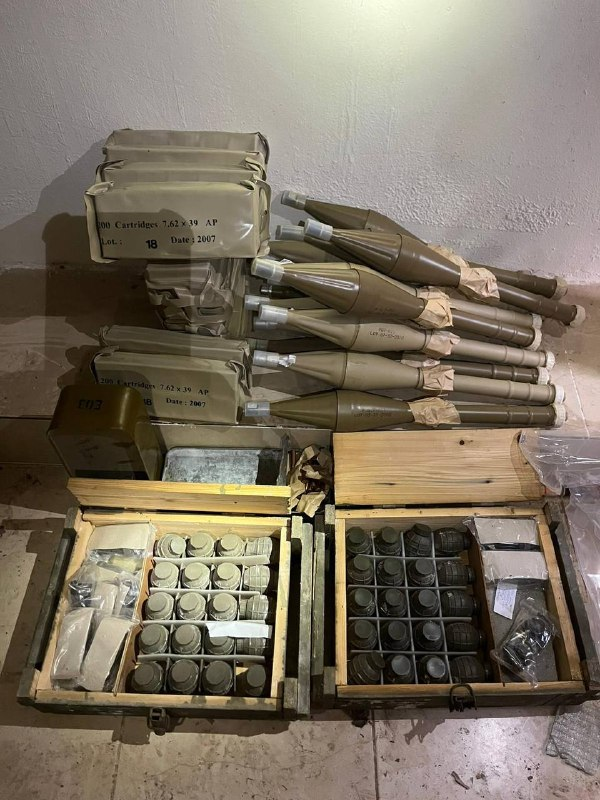

📷 Photo

## idfinfarsi — post 11543

  <a href="telegram/content/idfinfarsi_11543_1778236493.mp4" target="_blank">🎬 Download video</a>

‼️از زمان آغاز تفاهمات آتش‌بس: ارتش اسرائیل بیش از ۲۲۰ تروریست سازمان تروریستی حزب‌الله را به هلاکت رسانده

⭕️ارتش اسرائیل به فعالیت خود برای رفع تهدیدها علیه شهروندان اسرائیل و نیروهای ارتش اسرائیل در جنوب لبنان ادامه می‌دهد.
⭕️از زمان آغاز تفاهمات آتش‌بس، بیش از ۲۲۰ عضو و فرمانده از سازمان تروریستی حزب‌الله که تهدیدی علیه نیروهای ارتش اسرائیل و شهروندان این کشور بودند، به هلاکت رسیدند.

⭕️در چارچوب فعالیت مشترک نیروی هوایی و نیروهای رزمی، طی هفته گذشته بیش از ۸۵ عضو از سازمان تروریستی حزب‌الله به هلاکت رسیدند.

⭕️علاوه بر حذف فرمانده یروی رضوان در روز گذشته (چهارشنبه)، دیگر تروریست های کلیدی نیز در این حملات به هلاکت رسیدند، از جمله:
❌محمد علی بزی – فرمانده بخش اطلاعات در واحد نصر در سال‌های اخیر
❌حسین حسن رومانی – مسئول پدافند هوایی در حزب‌الله

⭕️این فرماندهان در پیشبرد و اجرای طرح‌های تروریستی علیه نیروهای ارتش اسرائیل و شهروندان این کشور نقش داشتند.

⭕️همچنین، از ابتدای هفته گذشته بیش از ۱۸۰ زیرساخت نظامی حزب‌الله، از جمله مراکز فرماندهی، انبارهای تسلیحات و سکوهای پرتاب آماده شلیک در سراسر جنوب لبنان هدف حمله قرار گرفته‌اند.

## idfinfarsi — post 11541

  <a href="telegram/content/idfinfarsi_11541_1778236496.mp4" target="_blank">🎬 Download video</a>

در یک حمله دقیق در ضاحیه بیروت: ارتش اسرائیل فرمانده نیروی رضوان در سازمان تروریستی حزب‌الله را به هلاکت رساند

⭕️ارتش اسرائیل روز گذشته (چهارشنبه) احمد غالب بلوط، فرمانده نیروی رضوان – واحد کماندویی نخبه سازمان تروریستی حزب‌الله – را در ضاحیه بیروت هدف قرار داده و به هلاکت رساند.

⭕️در طول سال‌ها، غالب بلوط مسئولیت‌های متعددی در نیروی رضوان بر عهده داشت، از جمله فرماندهی عملیات این واحد. در چارچوب وظایف خود، او مسئول آمادگی و حالت آماده‌باش این واحد برای نبرد علیه نیروهای ارتش اسرائیل و کشور اسرائیل بود.

⭕️در طول جنگ و به‌ویژه در دوره اخیر، غالب بلوط هدایت تروریست های نیروی رضوان را بر عهده داشت و ده‌ها طرح تروریستی علیه نیروهای ارتش اسرائیل در جنوب لبنان را فرماندهی کرد، از جمله شلیک موشک‌های ضدتانک و استفاده از مواد منفجره.

⭕️همچنین، غالب بلوط اقداماتی را برای بازسازی توانمندی‌های واحد نیروی رضوان پیش برد، به‌ویژه اجرای «طرح اشغال الجلیل» که این واحد طی سال‌ها آن را طراحی و توسعه داده بود.

⭕️نیروی رضوان با تأمین مالی و هدایت رژیم ایران فعالیت می‌کند و هدف آن آسیب رساندن به نیروهای ارتش اسرائیل و شهروندان این کشور است.

‼️ارتش اسرائیل به اقدام در برابر تهدیدات علیه شهروندان خود و نیروهایش ادامه خواهد داد و با تلاش‌های واحد نیروی رضوان برای بازسازی و تقویت مجدد توان خود مقابله می‌کند.

## Dirty_Kids — post 389094

  <a href="https://t.me/Dirty_Kids/389094" target="_blank">📎 Download file</a>

✅ اپلیکیشن اندروید سایت جهانی دربی بت

💰اولین سایت جهانی با امکان شارژ و برداشت ریالی(کارت به کارت)

🔗 برای ورود فیلترشکن روی کشور مناسب قرار دهید مانند فنلاند و المان و....

😀Telegram Channel
👇
https://t.me/+bcynkEgSW2dlYTc0

## Dirty_Kids — post 389093

  

😤دنبال یه سایت شرط بندی بین المللی بودی که به ایرانیا خدمات بده؟!
⛔

👍دربی بت همون انتخاب  100%

💎ویژگی های سایت جهانی Derby Bet:

⬅️امکان شارژ امن با کارت بانکی

⬅️واریز اول دوبل شارژ می شوید(بونوس۱۰۰٪)

⬅️پر اپشن ترین سایت فعال در ایران

⬅️تسویه حساب کمتر از 5 دقیقه

⬅️برگشت بخشی از باخت به صورت هفتگی

🚨کد هدیه ثبت نام:GG007

⚠️برای دانلود اپلکیشن کلیک کنید
👉

🔔کانال دربی بت :

🪙https://t.me/+bcynkEgSW2dlYTc0

## Dirty_Kids — post 389091

‏بهار مهدی‌پور، منشی باشگاه تامکسِ پاساژ ارغوان، وقتی شعله‌ آتیش بالا گرفت، اول دخترها رو به بیرون هدایت کرد؛

ولی بعدش متوجه شد که گوشیش داخل جا مونده، همون چند ثانیه بازگشت واسه برداشتن موبایلش کافی بود تا آتیش راه فرار رو ببنده و جونش رو بگیره...

@Dirty_Kids 👻

## Dirty_Kids — post 389090

  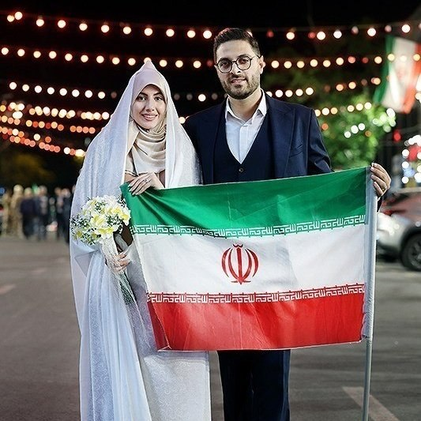

بخدا من دیگه دارم ناراحت میشم انقدر مرگ خامنه‌ای به تخم بسیجیاست و هی عروسی میکنن:)

@Dirty_Kids 👻

## Dirty_Kids — post 389089

  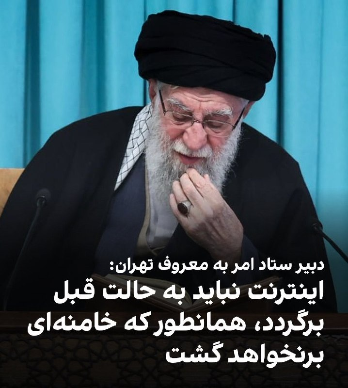

شما اگه خیلی دوسش داشتین چالش می‌کردین؛ الکی فیلم بازی نکنید، دردتون پوله.

@Dirty_Kids 👻

## Dirty_Kids — post 389087

  <a href="telegram/content/Dirty_Kids_389087_1778236500.mp4" target="_blank">🎬 Download video</a>

انقدر خامنه‌ای رو خاک نکردید که ویروس موش کل دنیا رو قراره بگا بده

ویدیویی تو شبکه‌های مجازی داره وایرال میشه که گفته میشه علائم  ترسناک پوستی فردی رو که به «هانتا ویروس» مبتلا شده رو نشون‌میده:

@Dirty_Kids 👻

## Dirty_Kids — post 389086

  <a href="telegram/content/Dirty_Kids_389086_1778236502.mp4" target="_blank">🎬 Download video</a>

توی فیلم نورنبرگ نشون میده آمریکایی‌ها به این نتیجه می‌رسند که برای برگزاری دادگاه نورنبرگ و اعدام رهبران نازی آلمان، باید تأیید یک نفر که بالاتر از رئیس جمهور آمریکاست را بگیرند تا تمام جهان همراهی کنه و اون کسی نیست جز پاپ…! پاپ موافق دادگاه و اعدام نبود و سیاستمدار آمریکایی به او گفت: «ما در هر صورت نازی‌ها را از بین می‌بریم، ولی تاریخ یادش می‌مونه که کلیسای کاتولیک علیه نازی‌ها بودی یا طرفدارشون!». و اینجوری پاپ مجبور میشه به مسیحی‌های جهان بگه برگزاری دادگاه نورنبرگ و اعدام رهبران نازی برای دنیا خوب هست.

ماروکو روبیو امروز وسط جنگ با جمهوری اسلامی برای دیدار با پاپ، به واتیکان سفر کرد.

@Dirty_Kids 👻

## Dirty_Kids — post 389085

  <a href="telegram/content/Dirty_Kids_389085_1778236504.mp4" target="_blank">🎬 Download video</a>

“به مارکو روبیو گفتم خیلی محترمانه به پاپ بگه ایران ۴۲ هزار نفر از مردم بیگناه و غیرمسلح رو کشته! همینطور گفتم بهش بگه ایران نباید سلاح هسته ای داشته باشه!!”

@Dirty_Kids 👻

## Dirty_Kids — post 389084

  <a href="https://t.me/Dirty_Kids/389084" target="_blank">📎 Download file</a>

✅ اپلیکیشن اندروید سایت جهانی دربی بت

💰اولین سایت جهانی با امکان شارژ و برداشت ریالی(کارت به کارت)

🔗 برای ورود فیلترشکن روی کشور مناسب قرار دهید مانند فنلاند و المان و....

😀Telegram Channel
👇
https://t.me/+bcynkEgSW2dlYTc0

## Dirty_Kids — post 389083

  

😤دنبال یه سایت شرط بندی بین المللی بودی که به ایرانیا خدمات بده؟!
⛔

👍دربی بت همون انتخاب  100%

💎ویژگی های سایت جهانی Derby Bet:

⬅️امکان شارژ امن با کارت بانکی

⬅️واریز اول دوبل شارژ می شوید(بونوس۱۰۰٪)

⬅️پر اپشن ترین سایت فعال در ایران

⬅️تسویه حساب کمتر از 5 دقیقه

⬅️برگشت بخشی از باخت به صورت هفتگی

🚨کد هدیه ثبت نام:GG007

⚠️برای دانلود اپلکیشن کلیک کنید
👉

🔔کانال دربی بت :

🪙https://t.me/+bcynkEgSW2dlYTc0

## Dirty_Kids — post 389082

  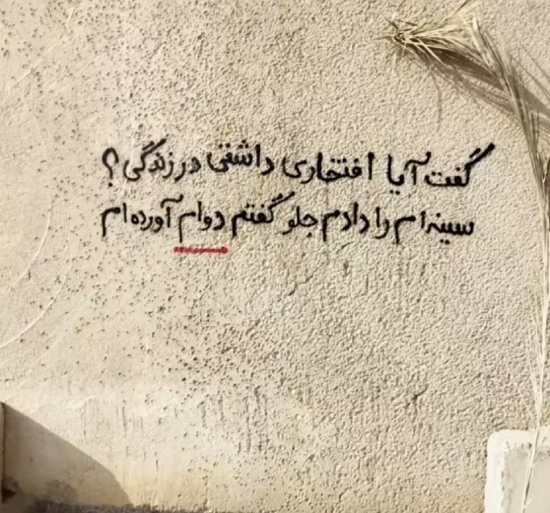

#بخوابیم

@Dirty_Kids 👻

## Dirty_Kids — post 389081

  

این وسط یکی بیاد منو چال کنه:)))

@Dirty_Kids 👻

## Dirty_Kids — post 389080

دونالد ترامپ در‌ گفتوگو با ای‌بی‌سی: «حملات تلافی‌جویانه پس از حملات ایران، تنها یک سیلی سبک بود و آتش‌بس همچنان ادامه دارد.»

‏(اصلا باشه، تو قول بده وحیدی و قالیباف و عراقچی رو هم بزنی، ما همه‌جا میگیم آتش‌بس هنوز نقض نشده)

@Dirty_Kids 👻

## Dirty_Kids — post 389078

خبرگزاری‌های دولتی ایران، هم‌اکنون از حملات جدید به مراکز نظامی سیریک در شرق هرمزگان و ساحل دریای عمان خبر می‌دهند.

@Dirty_Kids 👻

## Dirty_Kids — post 389077

  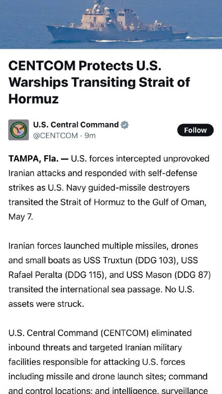

سنتکام: مراکز پرتاب موشک و پهپاد، مراکز فرماندهی و سامانه‌های اطلاعاتی ایران را هدف قرار دادیم

فرماندهی مرکزی ایالات متحده آمریکا، دقایقی قبل اعلام کرد آنان در پاسخ به حملات جمهوری اسلامی، «مراکز نظامی مرتبط با این حملات، از جمله مراکز پرتاب موشک و پهپاد، مراکز فرماندهی و سامانه‌های اطلاعاتی و شناسایی ایران» را هدف قرار داده‌اند.

در این بیانیه آمده است که دلیل این حملات، آن بوده که روز پنجشنبه و هنگام عبور چند ناوشکن موشک‌انداز آمریکا از تنگه هرمز به سمت دریای عمان، جمهوری اسلامی بدون هیچ دلیلی، «با موشک، پهپاد و قایق‌های تندرو» به سه ناوشکن آمریکایی حمله کرده بود.

سنتکام افزود «تمامی این حملات دفع شدند و هیچ آسیبی به نیروها و تجهیزات آمریکا وارد نشد.»

@Dirty_Kids 👻

## Dirty_Kids — post 389076

جمهوری‌اسلامی اینقد کمدیه که یه کشور بهش حمله میکنه ولی نمیدونی کی بود!

@Dirty_Kids 👻

## Dirty_Kids — post 389075

سخنگوی قرارگاه خاتم‌الانبیای سپاه پاسداران اعلام کرد:

«ارتش متجاوز، تروریست و راهزن آمریکا با نقض آتش بس یک کشتی نفتکش ایرانی و در حال حرکت از آبهای ساحلی ایران در منطقه جاسک به سمت تنگه هرمز و همچنین یک کشتی دیگر در حال ورود به تنگه هرمز را روبروی بندر فجیره امارات مورد هدف قرار دادند و همزمان مناطق غیرنظامی را با همکاری برخی از کشورهای منطقه در سواحل بندر خمیر، سیریک و جزیره قشم مورد تعرض هوایی خود قرار دادند.

نیروهای مسلح جمهوری اسلامی ایران نیز بلافاصله و در اقدامی متقابل شناورهای نظامی آمریکا در شرق تنگه هرمز و جنوب بندر چابهار را مورد هجوم قرار داده و خسارات قابل توجهی به‌ آنها وارد نمودند.

آمریکای جنایتکار و متجاوز و کشورهای حامی آن باید بدانند که جمهوری اسلامی ایران همچون گذشته پرقدرت و بدون کوچکترین تردید به هرگونه تعرض و تجاوز پاسخی کوبنده می دهد.»

@Dirty_Kids 👻

## Dirty_Kids — post 389074

فاکس نیوز نوشته آمریکا حملاتی را به قشم و بندرعباس انجام داده، اما یک مقام ارشد آمریکایی گفته این به معنای از سرگیری جنگ نیست.

نه بابا جنگ چیه دیوونه، اینا نمک زندگیه.

@Dirty_Kids 👻

## Dirty_Kids — post 389073

  <a href="telegram/content/Dirty_Kids_389073_1778236508.webm" target="_blank">🎬 Download video</a>

در میناب هم صدای انفجار شدید شنیده شد. همزمان اخباری در رسانه‌های ایران درباره حملات موشکی سپاه به ابوظبی منتشر شده است.

🔴رسانه‌های ایران از حملات موشکی سپاه به ابوظبی خبر می‌دهند. همزمان در میناب هرمزگان هم صدای انفجار شدید شنیده شد. همچنین منابع حکومتی در ایران می‌گویند جنگنده‌های خارجی امشب به کشتی‌سازی قشم، اسکه بهمن قشم، چندساختمان اداری در بندرعباس و پایگاه هوایی بندرعباس حمله کرده‌اند.

@Dirty_Kids 👻

## Hranews — post 112829

  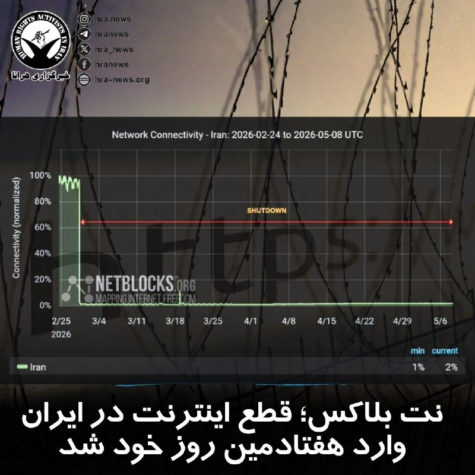

نت‌بلاکس، که محدودیت دسترسی به #اینترنت در جهان را رصد می‌کند، اعلام کرد قطع اینترنت در ایران وارد هفتادمین روز خود شده است و این وضعیت اکنون از ۱۶۵۶ ساعت گذشته است. به گفته این وبسایت؛ اتصال دیجیتال در شرایط بحرانی اهمیت حیاتی دارد و محدود کردن خدمات به نیازمندترین افراد، شامل افراد دارای معلولیت، دانشجویان، مشاغل کوچک و عموم مردم، آسیب می‌رساند.

↘️
@hranews_bot تماس ✉️ - @Hranews کانال هرانا 🆑

## Hranews — post 112828

  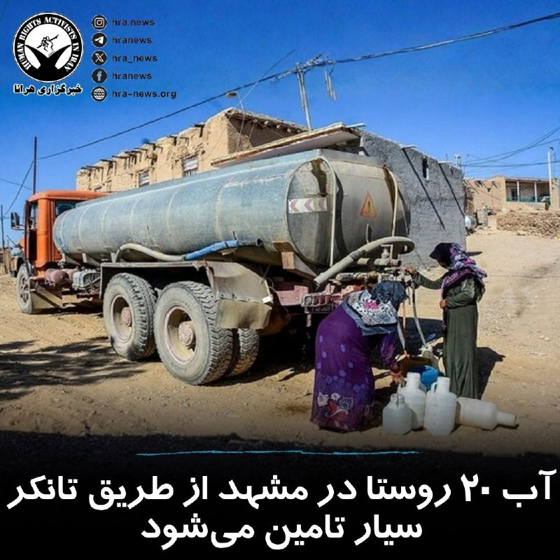

حسین اسماعیلیان، مدیرعامل شرکت آب و فاضلاب مشهد، با اشاره به تنش آبی در روستاهای این شهرستان اعلام کرد هم‌اکنون ۲۰ روستا به صورت تانکری آبرسانی می‌شوند و تعداد آن‌ها در ایام اوج مصرف تابستان به ۳۵ روستا افزایش می‌یابد.

حسین اسماعیلیان افزود: در سال ۱۳۹۹ بیش از ۵۰٪ روستاهای این شهرستان با تنش آبی شدید مواجه بودند که این میزان با وجود خشکسالی در سال‌های اخیر کاهش یافته است.

↘️
@hranews_bot تماس ✉️ - @Hranews کانال هرانا 🆑

## Hranews — post 112827

مردی که پنج عضو خانواده‌اش را به قتل رسانده بود، بازداشت شد

❗️
❗️
❗️
❗️
❗️– مردی در شهریورماه سال گذشته، با استفاده از سلاح گرم پنج نفر از اعضای خانواده خود را به قتل رساند. متهم توسط نیروی انتظامی در شهرستان رودبار جنوب بازداشت شده و به این قتل‌ها اعتراف کرده است.

ادامه مطلب

↘️
@hranews_bot تماس ✉️ - @Hranews کانال هرانا 🆑

## Hranews — post 112826

  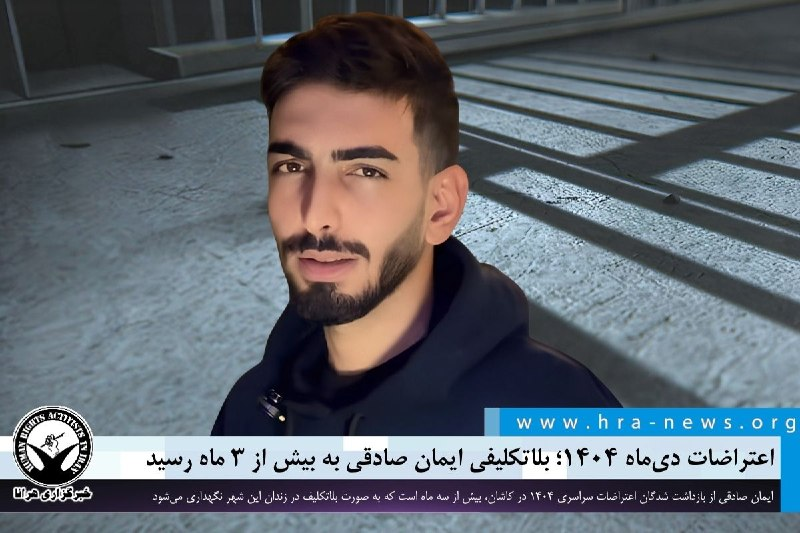

اعتراضات دی‌ماه ۱۴۰۴؛ بلاتکلیفی ایمان صادقی به بیش از ۳ ماه رسید

❗️
❗️
❗️
❗️
❗️– ایمان صادقی از بازداشت‌شدگان اعتراضات سراسری ۱۴۰۴ در کاشان، بیش از سه ماه است که به‌ صورت بلاتکلیف در زندان این شهر نگهداری می‌شود.

به گزارش خبرگزاری هرانا، ارگان خبری مجموعه فعالان حقوق بشر در ایران، ایمان صادقی کماکان در بازداشت به سر می برد.

براساس اطلاعات دریافتی هرانا؛ ایمان صادقی مورخ ۱۱ بهمن ماه سال گذشته در جریان اعتراضات سراسری دی ماه ۱۴۰۴ در منزل خانوادگی خود در کاشان بازداشت شد. وی پس از بازداشت به زندان کاشان منتقل شده و علیرغم گذشت بیش از سه ماه از زمان دستگیری کماکان در این زندان به صورت بلاتکلیف نگهداری می شود.

ادامه مطلب

#ایمان_صادقی

↘️
@hranews_bot تماس ✉️ -  @Hranews  کانال هرانا 🆑

## Hranews — post 112825

معوقات مزدی معدنکاران کرمان/ بحران تعدیل کارگران در اصفهان و آذربایجان شرقی

❗️
❗️
❗️
❗️
❗️– کارگران معادن زغال‌سنگ کرمان نیمی از حقوق‌‌های اسفند سال گذشته و فروردین امسال را دریافت نکرده‌اند. از سوی دیگر، حملات موشکی به مجتمع فولاد مبارکه اصفهان در جنگ اخیر، فعالیت بزرگ‌ترین کارخانه فولاد ایران را با بحران جدی مواجه کرده است. از میان بیش از ۲۷ هزار نیروی شاغل این مجموعه، تنها حدود دو هزار نفر به محل کار بازگشته‌اند. استاندار آذربایجان شرقی نیز اعلام کرد که حدود دو هزار نفر در واحد‌های تولیدی استان به دلیل خسارت‌های ناشی از جنگ، شغل خود را از دست داده یا با تهدید شغلی مواجه شده‌اند.

ادامه مطلب

↘️
@hranews_bot تماس ✉️ -  @Hranews  کانال هرانا 🆑

## Hranews — post 112824

  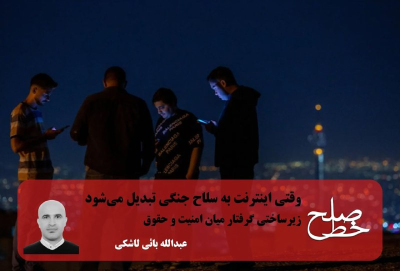

وقتی اینترنت به سلاح جنگی تبدیل می‌شود/ عبدالله بائی لاشکی

📡
📡
📡
📡
📡– در جهان معاصر، اینترنت دیگر صرفاً یک ابزار ارتباطی نیست، بلکه به یکی از ارکان اساسی سازمان‌یابی اجتماعی، اقتصادی و سیاسی تبدیل شده است. زیرساخت‌های حیاتی، از نظام‌های بانکی و بهداشتی گرفته تا رسانه‌ها، آموزش و حتی سازوکارهای امدادرسانی، به درجات مختلف به دسترسی پایدار به اینترنت وابسته‌اند. با این حال، در شرایط مخاصمات مسلحانه، همین زیرساخت حیاتی به‌طور فزاینده‌ای به موضوع یا ابزار مداخله‌ی امنیتی دولت‌ها تبدیل می‌شود. یکی از برجسته‌ترین نمودهای این تحول، توسل به قطع یا محدودسازی گسترده‌ی #اینترنت در زمان جنگ است؛ اقدامی که اگرچه اغلب با استناد به ضرورت‌های امنیت ملی توجیه می‌شود، اما از منظر حقوق بین‌الملل با چالش‌های جدی مواجه است.

در سطح تحلیلی، مسئله‌ی قطع اینترنت در زمان #جنگ را باید در نقطه‌ی تلاقی دو حوزه‌ی مهم از حقوق بین‌الملل بررسی کرد: حقوق بین‌الملل حقوق بشر و حقوق بین‌الملل بشردوستانه. هر یک از این دو نظام حقوقی، مجموعه‌ای از اصول و قواعد را ارائه می‌دهند که به‌طور مستقیم یا غیرمستقیم بر مشروعیت چنین اقداماتی تاثیر می‌گذارند. فهم دقیق این مسئله مستلزم درک این نکته است که جنگ، برخلاف برخی برداشت‌های ساده‌انگارانه، به معنای تعلیق کامل حقوق نیست، بلکه به معنای تغییر در نحوه‌ی اعمال و تفسیر آن‌هاست.

از منظر حقوق بشر، اگرچه اینترنت به‌طور صریح در اسناد کلاسیک مانند میثاق بین‌المللی حقوق مدنی و سیاسی ذکر نشده، اما تفسیرهای نهادهای بین‌المللی –به‌ویژه در دو دهه‌ی اخیر—، به‌روشنی نشان می‌دهند که حقوقی مانند آزادی بیان و دسترسی به اطلاعات، که در ماده‌ی ۱۹ این میثاق تضمین شده‌اند، در فضای آنلاین نیز به همان اندازه قابل اعمال هستند. این تحول تفسیری اهمیت بنیادینی دارد، زیرا به این معناست که اینترنت نه صرفاً یک ابزار فنی، بلکه بستری برای اعمال حقوق بنیادین تلقی می‌شود. در نتیجه، محدودسازی یا قطع آن می‌تواند تاثیراتی چندلایه بر حقوق مختلف داشته باشد؛ از جمله آزادی بیان، حق دسترسی به اطلاعات، مشارکت سیاسی و حتی در برخی شرایط، حقوقی مانند سلامت و امنیت شخصی.

ادامه مطلب

ادامه و لینک به مطلب در وبسایت خط صلح

#عبدالله_بائی_لاشکی

↘️
@hranews_bot تماس ✉️ - @Hranews کانال هرانا 🆑

## Hranews — post 112823

دو زندانی در زندان قزوین اعدام شدند/ رهایی یک تن از چوبه‌دار

❗️
❗️
❗️
❗️
❗️– حکم دو زندانی که پیشتر از بابت اتهامات مرتبط با جرائم مواد مخدر و قتل به اعدام محکوم شده بودند، در زندان چوبیندر قزوین اجرا شد. همچنین، یک زندانی محکوم به #اعدام در استان گیلان، با گذشت اولیای دم از مجازات مرگ رهایی یافت.

ادامه مطلب

#سجاد_حسینی
#بهنام_عبدی
↘️
@hranews_bot تماس ✉️ -  @Hranews  کانال هرانا 🆑

## Hranews — post 112822

گزارشی از تجمع اعتراضی نانوایان در کرمانشاه

❗️
❗️
❗️
❗️
❗️– شماری از نانوایان در شهرستان کرمانشاه، روز جاری با برگزاری #تجمع اعتراضی خواستار رسیدگی به مطالبات خود در رابطه با افزایش هزینه‌های این صنف و نحوه تعیین قیمت نان شدند.

ادامه مطلب

↘️
@hranews_bot تماس ✉️ -  @Hranews  کانال هرانا 🆑

## Hranews — post 112821

  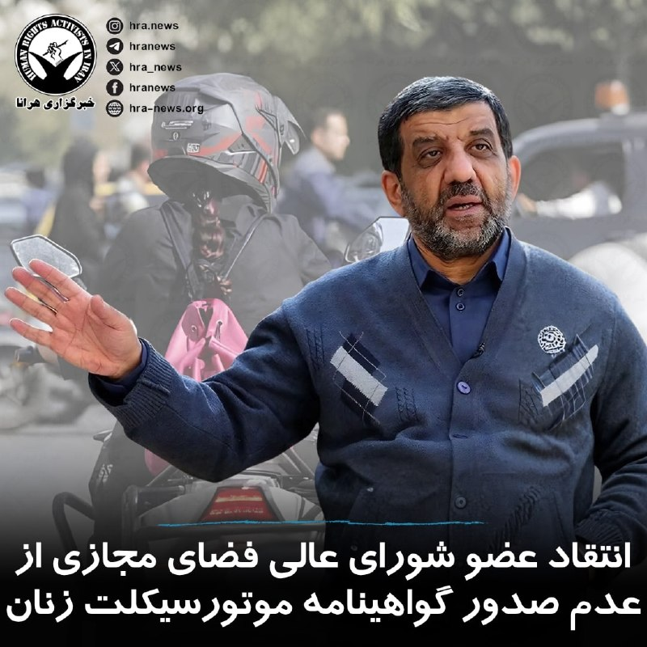

عضو شورای عالی فضای مجازی، در برنامه «منشور» که با اجرای بهاره افشاری از شبکه نمایش خانگی پخش می‌شود، از عدم صدور گواهینامه موتورسیکلت برای زنان انتقاد کرد.

عزت‌الله ضرغامی، با اشاره به ممنوعیت صدور گواهینامه موتورسیکلت برای زنان اظهار داشت که در نتیجه این محدودیت، زنان مسافر ناچارند از موتورسیکلت‌هایی استفاده کنند که راکب آن مرد است؛ وضعیتی که به گفته وی، با معیارهای مورد استناد مخالفان #موتورسواری_زنان در تعارض قرار دارد و عملاً به انجام آنچه «غیرشرعی» خوانده می‌شود، منجر شده است.

↘️
@hranews_bot تماس ✉️ - @Hranews کانال هرانا 🆑

## Hranews — post 112820

سقز؛ یک جوان ۲۱ ساله در پی انفجار مین جان‌باخت

❗️
❗️
❗️
❗️
❗️– انفجار یک مین برجای مانده از جنگ ایران و عراق در یکی از روستاهای شهرستان سقز، منجر به کشته شدن یک جوان ۲۱ ساله شد.

ادامه مطلب

#انفجار_مین

↘️
@hranews_bot تماس ✉️ - @Hranews کانال هرانا 🆑

## Hranews — post 112819

  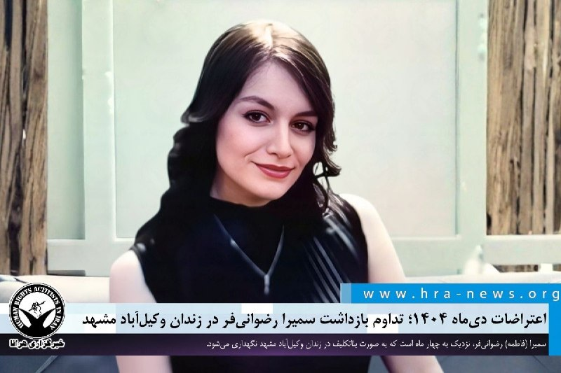

اعتراضات دی‌ماه ۱۴۰۴؛ تداوم بازداشت سمیرا رضوانی‌فر در زندان وکیل‌آباد مشهد

❗️
❗️
❗️
❗️
❗️– سمیرا (فاطمه) رضوانی‌فر، از بازداشت شدگان اعتراضات سراسری ۱۴۰۴ در مشهد، نزدیک به چهار ماه است که به‌ صورت بلاتکلیف در زندان وکیل‌آباد این شهر نگهداری می‌شود.

به گزارش خبرگزاری هرانا، ارگان خبری مجموعه فعالان حقوق بشر در ایران، سمیرا (فاطمه) رضوانی‌فر در #بازداشت است.

بر اساس اطلاعات دریافتی هرانا، خانم رضوانی‌فر در تاریخ ۲۷ دی‌ماه ۱۴۰۴، در جریان اعتراضات سراسری در مشهد توسط نیروهای امنیتی بازداشت شد. او پس از دستگیری به قرنطینه زندان وکیل‌آباد مشهد منتقل شده و با گذشت ۱۱۱ روز، همچنان در بلاتکلیفی قضایی به‌سر می‌برد.

ادامه مطلب

#سمیرا_رضوانی‌فر #فاطمه_رضوانی‌فر

↘️
@hranews_bot تماس ✉️ - @Hranews کانال هرانا 🆑

## Hranews — post 112818

شناسایی و توقیف اموال ۲۰ شهروند در مازندران

❗️
❗️
❗️
❗️
❗️– دادستان ساری از شناسایی و #توقیف_اموال ۲۰ شهروند در استان مازندران به دلیل آنچه «همکاری با دولت‌های آمریکا و اسرائیل در مسیر براندازی نظام جمهوری اسلامی ایران» عنوان کرده، خبر داد. به گفته او، حساب‌های بانکی این افراد نیز مسدود شده و مراحل پرونده در حال پیگیری است.

ادامه مطلب

↘️
@hranews_bot تماس ✉️ - @Hranews کانال هرانا 🆑

## Hranews — post 112817

استان سمنان؛ ۱۲ متهم به تحمل ضربات شلاق محکوم شدند

❗️
❗️
❗️
❗️
❗️– ۱۲ متهم در یک پرونده مشترک مرتبط با سرقت مسلحانه از خطوط لوله نفت در محدوده شهرستان‌های ایوانکی و آرادان، با حکم شعبه اول دادگاه کیفری یک استان سمنان علاوه بر حبس، به تحمل ضربات #شلاق محکوم شدند. حکم صادره در دیوان عالی کشور نیز به تایید رسیده است.

ادامه مطلب

↘️
@hranews_bot تماس ✉️ - @Hranews کانال هرانا 🆑

## Hranews — post 112816

  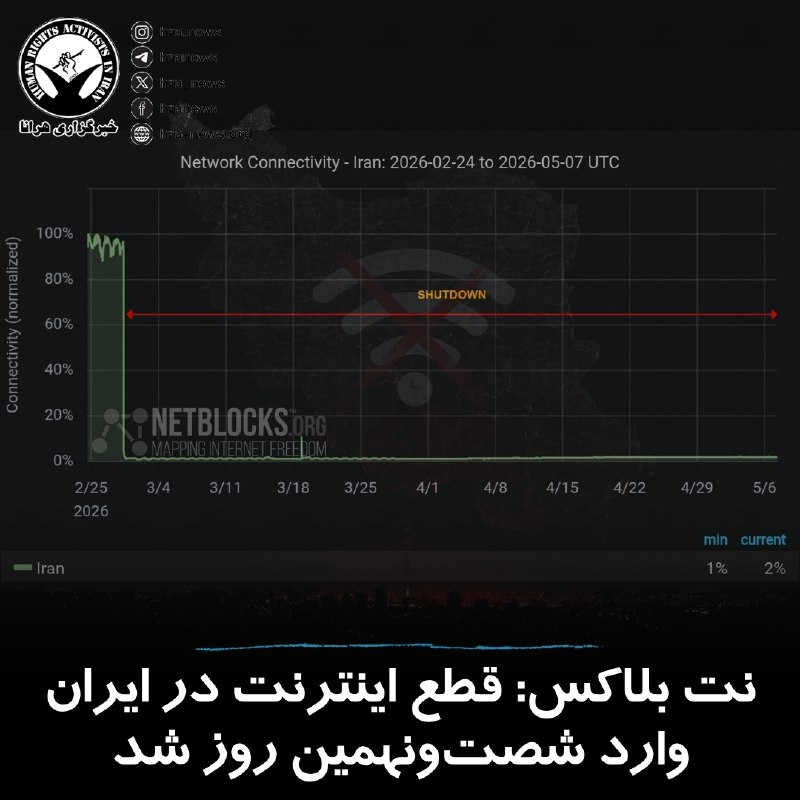

آخرین داده‌های نت‌ بلاکس نشان می‌دهد که #قطع_اینترنت در ایران، پس از گذشت ۱۶۳۲ ساعت محدودیت گسترده در دسترسی به شبکه‌های بین‌المللی، وارد شصت‌ونهمین روز خود شده است. این نهاد ناظر بر وضعیت دسترسی به اینترنت در جهان اعلام کرد که تداوم این اختلال‌ها، موجب افزایش بیکاری و آسیب گسترده به معیشت شهروندان، به‌ویژه کسب‌وکارهای مستقل شده است.

نت‌ بلاکس همچنین تاکید کرد که ادامه خاموشی اینترنت، با ایجاد محدودیت برای فعالیت آزاد اقتصادی و دیجیتال، عملا به «بازتوزیع منابع و فرصت‌های اقتصادی به سود گروه‌های نزدیک به حاکمیت» منجر شده است.

↘️
@hranews_bot تماس ✉️ - @Hranews کانال هرانا 🆑

## Hranews — post 112815

گزارشی از بازداشت و پخش اعترافات اجباری یک زن در زنجان

❗️
❗️
❗️
❗️
❗️– زنی در زنجان به اتهامات توهین به مقدسات، ارتباط با رسانه‌های خارج از کشور و ارسال تصاویر و اطلاعات نظامی به این رسانه‌ ها، #بازداشت شد. هم‌زمان ویدئویی از اعترافات اجباری این شهروند منتشر شده که مشخص نیست در چه شرایطی ضبط شده است.

ادامه مطلب

↘️
@hranews_bot تماس ✉️ - @Hranews کانال هرانا 🆑

## Hranews — post 112814

  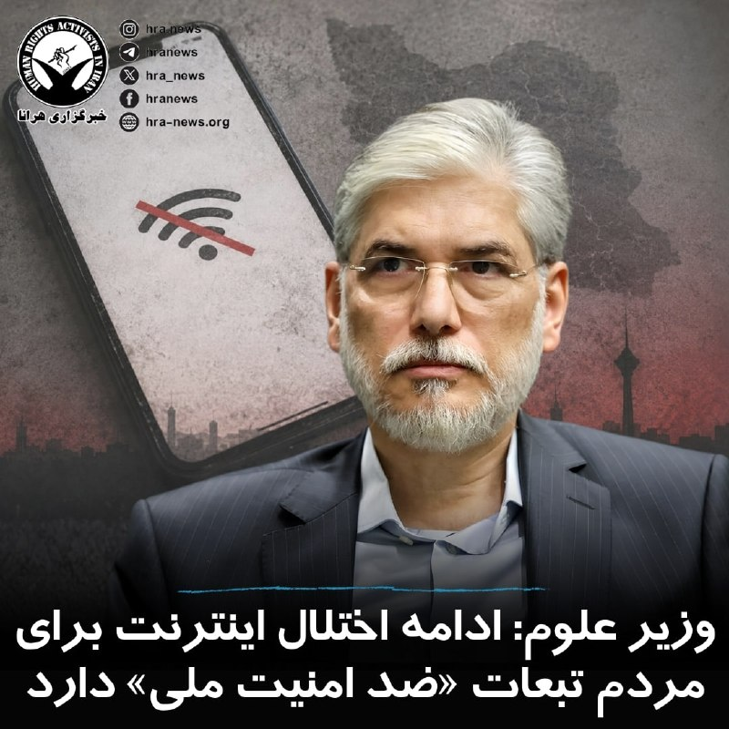

وزیر علوم، تحقیقات و فناوری، با انتقاد از تداوم قطع اینترنت اعلام کرد که کاهش دسترسی به اینترنت، ارتباطات علمی و پژوهشی کشور را مختل کرده و تداوم اختلال اینترنت برای عموم مردم، «ضد امنیت ملی» است. حسین سیمایی، خواستار بازگشت هرچه سریع‌تر شرایط به وضعیت عادی و فراهم شدن دسترسی آزاد و پایدار به #اینترنت برای دانشگاهیان و شهروندان شد.

وزیر علوم همچنین با اشاره به پیامدهای تبعیض در دسترسی به اینترنت گفت که ایجاد اینترنت‌های طبقاتی و محدود، احساس نابرابری و نارضایتی اجتماعی را تشدید می‌کند. سیمایی در ادامه هشدار داد که محدودیت‌های اینترنتی علاوه بر آسیب به فعالیت‌های علمی و پژوهشی، تبعات اجتماعی گسترده‌ای نیز به همراه دارد.

↘️
@hranews_bot تماس ✉️ - @Hranews کانال هرانا 🆑

## Hranews — post 112813

دادستان همدان از مصادره اموال ۵۲ نفر خبر داد

❗️
❗️
❗️
❗️
❗️– دادستان عمومی و انقلاب همدان از توقیف اموال ۵۲ نفر در این استان خبر داد. دستگاه قضایی این افراد را به «ارتباط با جریان اسرائیلی و آمریکایی» و همکاری با «شبکه‌های وابسته به دشمن» متهم کرده است.

ادامه مطلب

#مصادره_اموال

↘️
@hranews_bot تماس ✉️ - @Hranews کانال هرانا 🆑

## Hranews — post 112812

  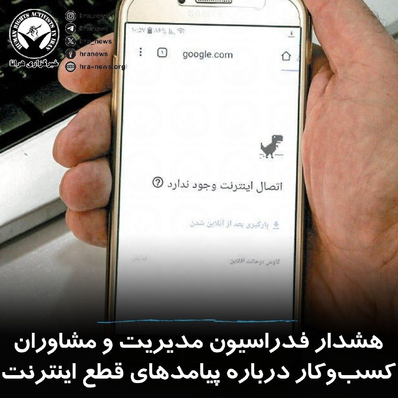

فدراسیون مدیریت و مشاوران کسب‌وکار ایران با انتشار بیانیه‌ای نسبت به تداوم محدودیت‌ها و سیاست‌های تبعیض‌آمیز اینترنتی هشدار داد و اعلام کرد که اینترنت دیگر صرفاً یک ابزار ارتباطی نیست، بلکه زیرساخت حیاتی اقتصاد دیجیتال محسوب می‌شود. در این بیانیه تأکید شده که اختلال و بی‌ثباتی در دسترسی به #اینترنت، مستقیماً بر تولید، اشتغال، سرمایه‌گذاری و رقابت‌پذیری اقتصاد کشور تأثیر می‌گذارد و بسیاری از کسب‌وکارهای دیجیتال را با کوچک شدن یا نابودی مواجه کرده است. به گفته این فدراسیون، وضعیت موجود می‌تواند به شکل‌گیری موجی از بیکاری تدریجی منجر شود که از لایه‌های پنهان آغاز شده و به‌مرور به سطح جامعه منتقل می‌شود.

در بخش دیگری از این بیانیه، نسبت به پیامدهای بلندمدت این وضعیت بر سرمایه انسانی هشدار داده شده و آمده است که بی‌ثباتی مداوم اینترنت، فعالیت نیروهای متخصص را مختل کرده و تصمیم آنها برای ماندن در کشور را تغییر می‌دهد. این فدراسیون همچنین تأکید کرده که سیاست‌هایی مانند «اینترنت طبقاتی» نه‌تنها مشکلات موجود را حل نمی‌کند، بلکه به تشدید نابرابری، افزایش رانت و تضعیف رقابت در اقتصاد دیجیتال منجر خواهد شد.

↘️
@hranews_bot تماس ✉️ -  @Hranews  کانال هرانا 🆑

## Hranews — post 112811

اجرای حکم اعدام یک زندانی در زندان کرمانشاه

❗️
❗️
❗️
❗️
❗️– سحرگاه امروز چهارشنبه ۱۶ اردیبهشت ماه، حکم یک زندانی که پیشتر از بابت اتهام قتل به #اعدام محکوم شده بود، در زندان کرمانشاه به اجرا درآمد.

ادامه مطلب

#محمدتقی_شاه‌ویسی

↘️
@hranews_bot تماس ✉️ -  @Hranews  کانال هرانا 🆑

## Hranews — post 112810

گزارشی از قطع بیمه بازنشستگان فولاد و ۴۰ هزار کارگر ساختمانی

❗️
❗️
❗️
❗️
❗️– کارگران بازنشسته صنعت فولاد در اصفهان و تهران نسبت به قطع بیمه درمان تکمیلی خود اعتراض دارند. همچنین، رئیس انجمن صنفی #کارگران ساختمانی آمل از قطع بیمه ۴۰ هزار کارگر ساختمانی در استان مازندران خبر داد.

ادامه مطلب
↘️
@hranews_bot تماس ✉️ -  @Hranews  کانال هرانا 🆑

## officialrezapahlavi — post 1828

در روز جهانی کارگر، به همه‌ی شما کارگران زحمتکش و شجاع ایران درود می‌فرستم.

در این روزهای سخت و طاقت‌فرسا -حاصل عملکرد ویرانگر چهل‌وهفت‌ساله‌ی جمهوری اسلامی- در کنار شما ایستاده‌ام. می‌دانم که شما کارگران و زحمت‌کشان، همچون اکثر هم‌میهنان، زیر فشار سنگین اقتصادی و تنگنای معیشتی هستید؛ سفره‌های‌تان هر روز کوچک‌تر و خالی‌تر می‌شود، در حالی که جمهوری اسلامی ثروت ملی ما را صرف جنگ‌افروزی و حمایت از گروه‌های تروریستی می‌کند.

این وضعیت شایسته‌ی کارگر و شهروند ایرانی نیست؛ و با سرنگونی این رژیم و به ثمر نشستن جان‌فشانی‌ها و خون پاک ده‌ها هزار جان‌فدای راه آزادی ایران، پایان خواهد یافت.

رسیدن به این هدف، به مشارکت تک‌تک ما نیاز دارد. در هر لحظه و هر قدم، از خود بپرسیم: آیا این اقدام بر عمر رژیم می‌افزاید یا اینکه به پیروزی انقلاب شیروخورشید کمک می‌کند؟ هر اقدام، هرچند کوچک، در از کار انداختن دستگاه سرکوب رژیم، در تعیین سرنوشت یک ملت بزرگ و تاریخی موثر است.

از آموزه‌های زرتشت تا دوران پرافتخار هخامنشیان، جایگاه کار و کارگر، به عنوان یکی از اصلی‌ترین بازوان توسعه، آبادانی و رفاه، همواره در تاریخ و فرهنگ ایرانی گرامی و ارجمند بوده است. داریوش بزرگ بیش از ۲۵۰۰ سال پیش شخصا به امور کارگران و کارمندان زن و مرد شاغل در تخت‌جمشید رسیدگی می‌کرد و دستور پرداخت مستقیم حق و حقوق‌شان را می‌داد. در دوران معاصر نیز شاهد بازیابی این فرهنگ کهن بودیم. پدربزرگ و پدرم همواره توجه ویژه‌ای به کار و کارگران داشتند. در زمان پدرم با انقلاب سفید شاه و ملت، رفاه و معیشت کارگران در کانون توجه قرار گرفت: از سهیم کردن کارگران در سود کارخانه‌ها، تا تسهیل خرید مسکن، و ایجاد امکانات آموزشی، رفاهی و ورزشی برای کارگران و خانواده‌هایشان.

موضوع توسعه‌ی اقتصادی و صنعتی، کار و کارآفرینی با محوریت رفاه، آسایش و زندگی شرافتمندانه‌ی کارگران، برای من نیز اهمیتی ویژه و اساسی دارد. از این‌رو، تیم من در پروژه‌ی شکوفایی ایران، به‌طور کامل و هدفمند بر این موضوع متمرکز شده و ایده‌ها و راهکارهای متناسب با شرایط ایران را به‌صورت دقیق مطالعه، بررسی و ارائه کرده است.

باور دارم که با قرار گرفتن دوباره ایران بر ریل ترقی و‌ توسعه، و بازگشت رونق و آبادانی، کارگران کشور و خانواده‌های شریف آنان بار دیگر از احترام، رفاه، و کرامتی که شایسته همه ایرانیان است برخوردار خواهند شد.

پاینده ایران،
رضا پهلوی

@OfficialRezaPahlavi

## officialrezapahlavi — post 1827

  <a href="telegram/content/officialrezapahlavi_1827_1778236513.mp4" target="_blank">🎬 Download video</a>

ساختار رژیم را هدف بگیرید و فشار بر آن را ادامه دهید تا مردم فرصت بازگشت به خیابان‌ها را به دست آورند.

مصاحبه با شان هنیتی در فاکس‌نیوز، با زیرنویس فارسی

۲۸ آوریل ۲۰۲۶ (۸ اردیبهشت ۱۴۰۵/۲۵۸۵)

@OfficialRezaPahlavi

## officialrezapahlavi — post 1826

سخنرانی در کنفرانس مطبوعاتی فدرال آلمان

برلین - ۳ اردیبهشت ۱۴۰۵/۲۵۸۵

Remarks at the Federal Press Conference (Bundespressekonferenz)
Berlin – April 23, 2026

@OfficialRezaPahlavi

## officialrezapahlavi — post 1825

  <a href="telegram/content/officialrezapahlavi_1825_1778236514.mp4" target="_blank">🎬 Download video</a>

در چند هفته اخیر در سفر به دور اروپا با اعضای پارلمان‌ها، دولت‌ها و رسانه‌ها گفت‌وگو کرده‌ام.

سفر من یک هدف داشت: این که صدای میلیون‌ها ایرانی باشم که تحت سلطه جمهوری اسلامی، ترورهای آن و قطع اینترنت، گروگان گرفته شده‌اند؛ میلیون‌ها ایرانی که صدایشان خاموش شده است.

اما اکنون با اطمینان می‌توانم بگویم این سکوت، این سانسور، نه‌تنها توسط رژیم در ایران، بلکه توسط رسانه‌های بین‌المللی و به‌ویژه اروپایی انجام می‌شود.

بنابراین، می‌خواهم به طور مستقیم با مردم اروپا صحبت کنم.

I have spent the past several weeks traveling across Europe, speaking to members of parliaments, governments, and the press.

My visit had one objective: to give a voice to the millions of Iranians held hostage by the Islamic Republic, its terror, and its Internet blackout. The millions of Iranians who have been silenced.

But I can now say with confidence that that silencing, that censorship, is not just happening at the hands of the regime in Iran, but by the international, and particularly the European, media.

So I want to speak directly to the people of Europe.

@OfficialRezaPahlavi

## officialrezapahlavi — post 1824

گفتگو با برنامه پورتا پورتا، شبکه رای-۱ ایتالیا

با زیرنویس فارسی
آوریل ۲۰۲۶ (فروردین ۱۴۰۵/۲۵۸۵)

@OfficialRezaPahlavi
https://youtu.be/DYnFKU782n8

## officialrezapahlavi — post 1816

در جریان سفر به ایتالیا با شماری از سناتورها و نمایندگان مجلس این کشور از احزاب مختلف دیدار و درباره جنگ جمهوری اسلامی علیه ملت ایران، و مسئولیت اخلاقی ایتالیا و اروپا بر پشتیبانی از انقلاب ملی ایرانیان با هدف پایان دادن به جمهوری اسلامی و رسیدن به آزادی و دموکراسی گفتگو کردیم.

من در این دیدارها بر لزوم فشار دیپلماتیک بر جمهوری اسلامی برای برقراری اینترنت، آزادی زندانیان سیاسی، و توقف فوری اعدام‌ها تاکید کردم.

ازجمله این دیدارها، دیدار با سناتور مائوریتزیو گاسپاری، رئیس کمیته امور خارجی و دفاع سنای ایتالیا بود.

@OfficialRezaPahlavi

## officialrezapahlavi — post 1815

نسخه کامل سخنرانی در پارلمان سوئد (با زیرنویس فارسی)

دوشنبه ١٣ آوریل ٢٠٢۶
٢۴ فروردین ١۴٠۵/٢۵٨۵

نسخه با کیفیت بهتر در یوتیوب

@OfficialRezaPahlavi

## officialrezapahlavi — post 1811

از کشور سوئد به خاطر استقبال گرم در جریان سفرم به استکهلم و پارلمان این کشور صمیمانه سپاسگزارم.

I would like to extend my sincere thanks to Sweden for the warm welcome during my visit to Stockholm and the Parliament.

@OfficialRezaPahlavi

## configx2ray — post 38635

  <a href="https://t.me/ConfigX2ray/38635" target="_blank">📎 Download file</a>

کانفیگ برای Npv tunnel ⭕️

به هیچ وج دانلود نزنید باهاش
❤️

رمز فایل : @ConfigX2ray

Channel : https://t.me/ConfigX2ray

## configx2ray — post 38632

  <a href="telegram/content/configx2ray_38632_1778236516.webm" target="_blank">🎬 Download video</a>

vless://dae2ddc6-a892-495f-a001-181cec56ad12@snapp.ir:2052?path=%2F&security=none&encryption=none&host=p1.razstar.ir&type=ws#https://t.me/ConfigX2ray

ترکیبی با سایفون وصله 
✅

آموزش استفادع : 
👇
https://t.me/ConfigX2ray0/1665

Channel : https://t.me/ConfigX2ray

## configx2ray — post 38627

  <a href="telegram/content/configx2ray_38627_1778236517.webm" target="_blank">🎬 Download video</a>

socks://Og@62.220.126.56:30170#https://t.me/ConfigX2ray

ترکیبی با سایفون وصله 
✅

آموزش استفادع : 
👇
https://t.me/ConfigX2ray0/1665

Channel : https://t.me/ConfigX2ray

## configx2ray — post 38621

  <a href="telegram/content/configx2ray_38621_1778236517.webm" target="_blank">🎬 Download video</a>

vless://7ef9fbc7-0fd8-475b-8a84-1c87e7d37dd1@94.182.157.70:8080?path=%2F&security=none&encryption=none&host=s11.mn-g.ir&type=ws#https://t.me/ConfigX2ray

ترکیبی با سایفون وصله 
✅

آموزش استفادع : 
👇
https://t.me/ConfigX2ray0/1665

Channel : https://t.me/ConfigX2ray

## configx2ray — post 38620

😈

## configx2ray — post 38616

  <a href="https://t.me/ConfigX2ray/38616" target="_blank">📎 Download file</a>

کانفیگ برای Npv tunnel ⭕️

به هیچ وج دانلود نزنید باهاش
❤️

رمز فایل : @ConfigX2ray

Channel : https://t.me/ConfigX2ray

## configx2ray — post 38614

  <a href="https://t.me/ConfigX2ray/38614" target="_blank">📎 Download file</a>

کانفیگ برای Npv tunnel ⭕️

به هیچ وج دانلود نزنید باهاش
❤️

رمز فایل : @ConfigX2ray

Channel : https://t.me/ConfigX2ray

## configx2ray — post 38613

  <a href="https://t.me/ConfigX2ray/38613" target="_blank">📎 Download file</a>

کانفیگ برای Npv tunnel ⭕️

به هیچ وج دانلود نزنید باهاش
❤️

رمز فایل : @ConfigX2ray

Channel : https://t.me/ConfigX2ray

## configx2ray — post 38612

  <a href="telegram/content/configx2ray_38612_1778236519.webm" target="_blank">🎬 Download video</a>

vless://9d0b7f4e-b0fe-42bf-a550-31b7ecb0e053@2.144.4.245:23176?encryption=none&type=tcp&headerType=none#https://t.me/ConfigX2ray

socks://Og@62.220.126.56:26132#https://t.me/ConfigX2ray

hysteria2://Kz0JGcGICb@srm.kishonline.online:443?obfs=salamander&obfs-password=kish-data-center&sni=srm.kishonline.online&insecure=0#https://t.me/ConfigX2ray

vless://7fc9a955-4910-5b53-f516-0af48ec30de0@meli.masterdadeh.ir:80?encryption=none&type=ws&path=%2F#https://t.me/ConfigX2ray

ترکیبی با سایفون وصله 
✅

آموزش استفادع : 
👇
https://t.me/ConfigX2ray0/1665

Channel : https://t.me/ConfigX2ray

## configx2ray — post 38611

صف پمپ بنزین کیلومتری شد دوباره 
😋

## configx2ray — post 38610

جنگه؟!
😋

## configx2ray — post 38605

  <a href="https://t.me/ConfigX2ray/38605" target="_blank">📎 Download file</a>

کانفیگ برای Npv tunnel ⭕️

به هیچ وج دانلود نزنید باهاش
❤️

رمز فایل : @ConfigX2ray

Channel : https://t.me/ConfigX2ray

## configx2ray — post 38604

https://t.me/socks?server=api.nirvana-smoke.com&port=443&user=Azir_0a7948188115c46e86&pass=Azir_0a7948188115c46e86 https://t.me/socks?server=api.nirvana-smoke.com&port=443&user=Azir_0a7948188115c46e86&pass=Azir_0a7948188115c46e86 https://t.me/socks?server=api.nirvana…

## configx2ray — post 38603

https://t.me/socks?server=api.nirvana-smoke.com&port=443&user=Azir_0a7948188115c46e86&pass=Azir_0a7948188115c46e86

https://t.me/socks?server=api.nirvana-smoke.com&port=443&user=Azir_0a7948188115c46e86&pass=Azir_0a7948188115c46e86

https://t.me/socks?server=api.nirvana-smoke.com&port=443&user=Azir_0a7948188115c46e86&pass=Azir_0a7948188115c46e86

هرسه پروکسی بالا وصله بدونه ویپین وصل بشید یک دقیقه‌ زمان بدید راحت وصله 
❤️
Channel : https://t.me/ConfigX2ray

## configx2ray — post 38602

  <a href="https://t.me/ConfigX2ray/38602" target="_blank">📎 Download file</a>

کانفیگ برای Npv tunnel ⭕️

به هیچ وج دانلود نزنید باهاش
❤️

رمز فایل : @ConfigX2ray

Channel : https://t.me/ConfigX2ray

## configx2ray — post 38599

  <a href="telegram/content/configx2ray_38599_1778236521.webm" target="_blank">🎬 Download video</a>

vless://dae2ddc6-a892-495f-a001-181cec56ad12@snapp.ir:2052?path=%2F&security=none&encryption=none&host=p1.razstar.ir&type=ws#https://t.me/ConfigX2ray

ترکیبی با سایفون وصله 
✅

آموزش استفادع : 
👇
https://t.me/ConfigX2ray0/1665

Channel : https://t.me/ConfigX2ray

## configx2ray — post 38598

  <a href="https://t.me/ConfigX2ray/38598" target="_blank">📎 Download file</a>

کانفیگ برای Npv tunnel ⭕️

به هیچ وج دانلود نزنید باهاش
❤️

رمز فایل : @ConfigX2ray

Channel : https://t.me/ConfigX2ray

## configx2ray — post 38596

  <a href="telegram/content/configx2ray_38596_1778236522.webm" target="_blank">🎬 Download video</a>

socks://Og@45.94.213.213:443#https://t.me/ConfigX2ray

ترکیبی با سایفون وصله 
✅

آموزش استفادع : 
👇
https://t.me/ConfigX2ray0/1665

Channel : https://t.me/ConfigX2ray

## configx2ray — post 38593

  <a href="https://t.me/ConfigX2ray/38593" target="_blank">📎 Download file</a>

کانفیگ برای Npv tunnel ⭕️

به هیچ وج دانلود نزنید باهاش
❤️

رمز فایل : @ConfigX2ray

Channel : https://t.me/ConfigX2ray

## configx2ray — post 38592

  <a href="https://t.me/ConfigX2ray/38592" target="_blank">📎 Download file</a>

کانفیگ برای Npv tunnel ⭕️

به هیچ وج دانلود نزنید باهاش
❤️

رمز فایل : @ConfigX2ray

Channel : https://t.me/ConfigX2ray

## manototv — post 105129

  <a href="telegram/content/manototv_105129_1778236524.mp4" target="_blank">🎬 Download video</a>

صدا و سیمای جمهوری‌اسلامی در گزارشی از توقیف نفتکش «اوشن کیوی» در دریای عمان توسط ارتش خبر داده است. بر پایه این گزارش Ocean Koi «در صدد ایجاد اخلال در صادرات نفت و منافع ملت ایران» توصیف شده که تا سواحل جنوبی ایران اسکورت و «به مقامات قضایی» تحویل داده شده است.

## manototv — post 105128

  <a href="telegram/content/manototv_105128_1778236524.mp4" target="_blank">🎬 Download video</a>

آسیا نخستین محموله نفت کوره مکزیک در ۹ ماه گذشته را دریافت کرد؛ اقدامی که پس از اختلال صادرات خاورمیانه به‌دلیل جنگ ایران و افزایش قیمت سوخت در آسیا رخ داده است.
به گزارش رویترز، کاهش عرضه از عراق و کویت از مسیر تنگه هرمز باعث شده بازار آسیا به‌دنبال منابع جایگزین برود. در همین راستا، نفتکش «اوریون» حامل ۱۶۰ هزار تن نفت کوره مکزیک به سنگاپور رسیده و شرکت دولتی پمکس نیز محموله دیگری برای تحویل در ژوئن عرضه کرده است.
معامله‌گران می‌گویند افزایش قیمت در آسیا و مازاد عرضه در قاره آمریکا، صادرات نفت کوره مکزیک به شرق آسیا را سودآورتر کرده است.

## manototv — post 105127

  <a href="telegram/content/manototv_105127_1778236525.mp4" target="_blank">🎬 Download video</a>

رویترز گزارش داده «وزارت اقیانوس‌های» کره جنوبی اعلام کرد که دولت در حال بررسی علت انفجار در یک کشتی تحت مدیریت کره جنوبی است؛ این در حالی است که تردیدهایی درباره هدف حمله قرار گرفتن این کشتی در تنگه هرمز وجود دارد.
بر اساس اعلام شرکت بهره‌بردار کشتی و مقام‌های کره جنوبی، این کشتی روز دوشنبه هنگام لنگر انداختن در نزدیکی امارات متحده عربی، در بخش موتورخانه دچار انفجار و آتش‌سوزی شد.
دونالد ترامپ گفته جمهوری‌اسلامی به این کشتی کره جنوبی شلیک کرده و از سئول خواست به تلاش‌های تحت رهبری آمریکا برای تأمین امنیت کشتیرانی در تنگه هرمز بپیوندد. کره جنوبی هنوز به این درخواست پاسخ نداده است.
سفارت جمهوری‌اسلامی در کره جنوبی مسئولیت این آتش‌سوزی را رد کرد و اعلام کرد که «قاطعانه اتهام دخالت نیروهای مسلح ایران در آسیب واردشده به این کشتی را رد و تکذیب می‌کند.»
گزارش‌ها حاکی از آن است که هر ۲۴ خدمه کشتی، از جمله شش شهروند کره جنوبی، در این حادثه آسیبی ندیده‌اند.
سخنگوی وزارت اقیانوس‌های کره جنوبی گفت هنوز برای برآورد زمان پایان این تحقیقات زود است.

## manototv — post 105126

  <a href="telegram/content/manototv_105126_1778236526.mp4" target="_blank">🎬 Download video</a>

نتایج اولیه انتخابات محلی در بریتانیا نشان می‌دهد حزب کارگر به رهبری کی‌یر استارمر با شکست‌های سنگینی روبه‌رو شده و حزب راست‌گرای «رفرم یو‌کی» به رهبری نایجل فاراژ در حال پیشروی در مناطق مختلف کشور است.
تا صبح جمعه، حزب کارگر بیش از ۲۵۸ کرسی شورا را از دست داده و حزب رفرم یو‌کی ۳۸۲ کرسی به دست آورده بود. برخی از بزرگ‌ترین شکست‌های حزب کارگر در مناطق موسوم به «دیوار قرمز» رخ داده؛ مناطقی صنعتی در شمال انگلستان که به‌طور سنتی از پایگاه‌های اصلی رأی این حزب به شمار می‌روند.
کی‌یر استارمر با وجود این نتایج اعلام کرد استعفا نخواهد داد و انتظار دارد در انتخابات سراسری بعدی در سال ۲۰۲۹ نیز رهبر حزب باقی بماند. او گفت: «من قرار نیست به سادگی کنار بکشم.

کنار بکشم.»

## manototv — post 105125

  <a href="telegram/content/manototv_105125_1778236527.mp4" target="_blank">🎬 Download video</a>

نتایج اولیه انتخابات محلی در بریتانیا نشان می‌دهد حزب کارگر به رهبری کی‌یر استارمر با شکست‌های سنگینی روبه‌رو شده و حزب راست‌گرای «رفرم یو‌کی» به رهبری نایجل فاراژ در حال پیشروی در مناطق مختلف کشور است.
تا صبح جمعه، حزب کارگر بیش از ۲۵۸ کرسی شورا را از دست داده و حزب رفرم یو‌کی ۳۸۲ کرسی به دست آورده بود. برخی از بزرگ‌ترین شکست‌های حزب کارگر در مناطق موسوم به «دیوار قرمز» رخ داده؛ مناطقی صنعتی در شمال انگلستان که به‌طور سنتی از پایگاه‌های اصلی رأی این حزب به شمار می‌روند.
کی‌یر استارمر با وجود این نتایج اعلام کرد استعفا نخواهد داد و انتظار دارد در انتخابات سراسری بعدی در سال ۲۰۲۹ نیز رهبر حزب باقی بماند. او گفت: «من قرار نیست به سادگی کنار بکشم.

## manototv — post 105124

  <a href="telegram/content/manototv_105124_1778236528.mp4" target="_blank">🎬 Download video</a>

ارتش و سازمان امنیت داخلی این کشور اعلام کردند یک شهروند و سه سرباز سابق به اتهام جاسوسی برای جمهوری اسلامی تحت پیگرد قرار گرفته‌اند و قرار است علیه آن‌ها در دادگاه حیفا کیفرخواست صادر شود.
بر اساس این گزارش، متهمان به دستور یک عامل اطلاعاتی جمهوری اسلامی از مکان‌هایی مانند مدرسه فنی نیروی هوایی، ایستگاه‌های قطار، مراکز خرید و دوربین‌های امنیتی تصویربرداری کرده و تصاویر و ویدیوها را ارسال کرده‌اند.
مقام‌های اسرائیلی همچنین اعلام کردند این افراد پیش از خدمت سربازی جذب شده بودند و یکی از متهمان دیگر افراد را برای همکاری با عامل اطلاعاتی جمهوری اسلامی جذب کرده است.

## manototv — post 105123

  <a href="telegram/content/manototv_105123_1778236529.mp4" target="_blank">🎬 Download video</a>

وزارت خارجه چین اعلام کرد شهروندان چینی در نفتکش هدف قرارگرفته در تنگه هرمز حضور دارند، اما تاکنون گزارشی از زخمی یا کشته شدن خدمه این کشتی دریافت نشده است.
پکن همچنین اعلام کرد وضعیت خدمه و جزئیات حادثه را از نزدیک دنبال می‌کند.

## manototv — post 105122

  <a href="telegram/content/manototv_105122_1778236530.mp4" target="_blank">🎬 Download video</a>

گروه ناظر اینترنتی نت‌بلاکس اعلام کرد قطعی اینترنت در ایران امروز وارد هفتادمین روز خود شده و از مرز ۱۶۵۶ ساعت گذشته است.
نت‌بلاکس هشدار داده در شرایط بحرانی، دسترسی به اینترنت یک نیاز حیاتی است و محدودیت‌های گسترده بیشترین آسیب را به افراد دارای معلولیت، دانشجویان، کسب‌وکارهای کوچک و عموم شهروندان وارد می‌‌کند.

## manototv — post 105121

  <a href="telegram/content/manototv_105121_1778236530.mp4" target="_blank">🎬 Download video</a>

بلومبرگ گزارش داد شرکت هواپیمایی ایر ایندیا در پی جنگ ایران در حال بررسی اجرای اقداماتی برای کاهش هزینه‌ها و کاهش تعداد پروازهاست.
بر اساس این گزارش، مرخصی اجباری برای کارکنان غیر فنی و کاهش بیش از ۲۰ درصدی ظرفیت پروازها در سه ماه آینده از جمله گزینه‌های مورد بررسی است.

## manototv — post 105120

  <a href="telegram/content/manototv_105120_1778236531.mp4" target="_blank">🎬 Download video</a>

بریتانیا اعلام کرد یک مورد مشکوک دیگر از هانتا ویروس در یک شهروند این کشور در جزیره تریستان دا کونا در جنوب اقیانوس اطلس شناسایی شده است. پیش‌تر ابتلای دو شهروند بریتانیایی به این ویروس تأیید شده بود.
مقام‌های بریتانیایی اعلام کردند مسافران و خدمه کشتی تفریحی «ام‌وی هوندیوس» که علائمی از بیماری ندارند، پس از پهلو گرفتن کشتی در تنریف اسپانیا با پرواز اختصاصی و رایگان به بریتانیا بازگردانده خواهند شد.

## manototv — post 105119

  <a href="telegram/content/manototv_105119_1778236532.mp4" target="_blank">🎬 Download video</a>

در پی دستور ارتش اسرائیل برای تخلیه چند روستا در لبنان، یک نفر در حمله اسرائیل به خودرویی در مسیر میان کفرحمام و کفرشوبا کشته شد.
ارتش اسرائیل همزمان از ساکنان روستاهای نُمیریه، طیر فلسه، حلوسیه، حلوسیه الفوقا، طورا و معرکه خواسته بود فوراً منطقه را ترک کنند و دست‌کم تا شعاع یک کیلومتری دور شوند.
آویخای ادرعی، سخنگوی عرب‌زبان ارتش اسرائیل، اعلام کرد این حملات در واکنش به «نقض توافق آتش‌بس از سوی حزب‌الله» انجام شده است

## manototv — post 105118

  <a href="telegram/content/manototv_105118_1778236532.mp4" target="_blank">🎬 Download video</a>

دونالد ترامپ در پیامی در شبکه اجتماعی تروث سوشال اعلام کرد سه ناوشکن آمریکایی «با موفقیت کامل» از تنگه هرمز عبور کرده‌اند؛ در حالی که به گفته او، تحت حمله نیروهای ایرانی قرار داشتند.
ترامپ مدعی شد هیچ آسیبی به ناوشکن‌های آمریکایی وارد نشده، اما «حمله‌کنندگان ایرانی به‌طور کامل نابود شدند» و چندین قایق تندرو نیز غرق شده‌اند.
او همچنین گفت موشک‌های شلیک‌شده به سمت ناوشکن‌ها رهگیری و پهپادهای مهاجم در آسمان منهدم شده‌اند.
رئیس‌جمهوری آمریکا در ادامه رهبران جمهوری اسلامی را «دیوانه» توصیف کرد و هشدار داد اگر تهران توافق مورد نظر واشینگتن را «سریع» امضا نکند، آمریکا در آینده «بسیار شدیدتر و خشن‌تر» پاسخ دادیم.

## manototv — post 105117

  <a href="telegram/content/manototv_105117_1778236533.mp4" target="_blank">🎬 Download video</a>

وزیر خارجه پاکستان اعلام کرد با همتای ایرانی خود درباره بازگرداندن ۲۰ ملوان ایرانی از کشتی‌های توقیف‌شده در نزدیکی آب‌های سنگاپور گفت‌وگو کرده است.
اسحاق دار همچنین گفت از وزیر خارجه سنگاپور خواسته روند بازگشت این ملوانان را تسهیل کند و افزود اسلام‌آباد در هماهنگی با تهران، با مقام‌های آمریکا و سنگاپور برای بازگرداندن امن این افراد در تماس است.

## manototv — post 105116

  <a href="telegram/content/manototv_105116_1778236534.mp4" target="_blank">🎬 Download video</a>

دونالد ترامپ، رئیس‌جمهوری آمریکا، در گفت‌وگو با خبرنگاران درباره ادامه آتش‌بس با جمهوری اسلامی گفت: «بله، آتش‌بس برقرار است.»
او با اشاره به حملات اخیر افزود: «امروز با ما درگیر شدند و ما هم آن‌ها را نابود کردیم. این فقط یک درگیری کوچک بود.»
ترامپ همچنین هشدار داد: «اگر آتش‌بسی در کار نباشد، لازم نیست کسی به شما خبر بدهد؛ فقط کافی است یک نور عظیم را ببینید که از ایران بیرون می‌آید.»
او در پایان گفت جمهوری اسلامی «بهتر است خیلی سریع توافق را امضا کند.

## manototv — post 105115

  <a href="telegram/content/manototv_105115_1778236535.mp4" target="_blank">🎬 Download video</a>

‌
سنتکام، فرماندهی مرکزی آمریکا، اعلام کرد نیروهای این کشور در جریان عبور ناوشکن‌های نیروی دریایی آمریکا از تنگه هرمز، حملات «بدون تحریک» جمهوری اسلامی را رهگیری کرده و در پاسخ، حملات «دفاعی» انجام داده‌اند.

در بیانیه سنتکام آمده است که روز ۷ مه، هم‌زمان با عبور ناوشکن‌های «یو‌اس‌اس تروکستون»، «یو‌اس‌اس رافائل پرالتا» و «یو‌اس‌اس میسون» از این گذرگاه بین‌المللی به سمت دریای عمان، نیروهای جمهوری اسلامی با شلیک «چندین موشک، پهپاد و قایق‌های تندرو» این شناورها را هدف قرار دادند.

سنتکام تأکید کرده است که «هیچ‌یک از تجهیزات آمریکا هدف اصابت قرار نگرفت» و نیروهای آمریکایی تمامی تهدیدهای ورودی را منهدم کردند.

این فرماندهی همچنین اعلام کرد در واکنش، تأسیسات نظامی جمهوری اسلامی که به گفته آن در حمله به نیروهای آمریکایی نقش داشته‌اند، از جمله «سایت‌های پرتاب موشک و پهپاد، مراکز فرماندهی و کنترل و همچنین مراکز اطلاعاتی، نظارتی و شناسایی» هدف قرار گرفته‌اند.

## manototv — post 105114

  <a href="telegram/content/manototv_105114_1778236536.mp4" target="_blank">🎬 Download video</a>

‌
یک مقام آمریکایی به شبکه «ان‌بی‌سی نیوز» گفته نیروهای نظامی این کشور دست‌کم دو نقطه در ایران را هدف حمله قرار داده‌اند.

به گفته این مقام، این حملات در بندرعباس و جزیره قشم انجام شده و «ماهیت دفاعی» داشته است. او تأکید کرده این اقدام «به‌معنای ازسرگیری عملیات گسترده نظامی علیه ایران نیست».

این در حالی است که دونالد ترامپ پیش‌تر طرح «پروژه آزادی» برای اسکورت کشتی‌ها در تنگه هرمز را متوقف کرده بود. به گفته این مقام، با توجه به تداوم نگرانی‌های عربستان سعودی و دیگر متحدان منطقه‌ای، انتظار نمی‌رود این عملیات به‌زودی از سر گرفته شود.

## manototv — post 105113

  <a href="telegram/content/manototv_105113_1778236537.mp4" target="_blank">🎬 Download video</a>

فعالیت پدافند هوایی تهران، شامگاه پنجشنبه، ۱۷ اردیبهشت ۱۴۰۵

## manototv — post 105112

  <a href="telegram/content/manototv_105112_1778236538.mp4" target="_blank">🎬 Download video</a>

‌
سخنگوی قرارگاه مرکزی «خاتم‌الانبیا» در بیانیه‌ای مدعی شد ارتش آمریکا با «نقض آتش‌بس» یک نفتکش ایرانی را در مسیر حرکت از آب‌های ساحلی ایران در منطقه جاسک به سمت تنگه هرمز هدف قرار داده است.

او همچنین مدعی شد یک کشتی دیگر در حال ورود به تنگه هرمز در نزدیکی بندر فجیره امارات نیز هدف حمله قرار گرفته و هم‌زمان «مناطق غیرنظامی» در سواحل بندر خمیر، سیریک و جزیره قشم با «همکاری برخی کشورهای منطقه» مورد تعرض هوایی قرار گرفته‌اند.

او افزود نیروهای مسلح ایران نیز «بلافاصله» در اقدامی متقابل، شناورهای نظامی آمریکا در شرق تنگه هرمز و جنوب بندر چابهار را هدف قرار داده و «خسارات قابل توجهی» به آن‌ها وارد کرده‌اند.

## manototv — post 105111

  <a href="telegram/content/manototv_105111_1778236538.mp4" target="_blank">🎬 Download video</a>

فعال شدن پدافند هوایی در محدوده شهران، غرب تهران ـ پنجشنبه ۱۷ اردیبهشت ساعت ۲۳:۵۷

## manototv — post 105110

  <a href="telegram/content/manototv_105110_1778236539.mp4" target="_blank">🎬 Download video</a>

خبرگزاری حکومتی تسنیم مدعی شده سه ناوشکن نیروی دریایی آمریکا در نزدیکی تنگه هرمز هدف حمله نیروی دریایی سپاه قرار گرفته‌اند.

رسانه‌های حکومتی نیز گزارش داده‌اند یگان‌های دریایی آمریکا در تنگه هرمز پس از حمله ارتش آمریکا به یک نفتکش ایرانی، هدف «حملات موشکی» قرار گرفتند و به گفته این منابع، ناوهای آمریکایی پس از وارد آمدن «آسیب»، مجبور به عقب‌نشینی شدند.

در همین حال، گزارش شده یک جنگنده آمریکایی روز گذشته یک نفتکش ایرانی را که قصد عبور از محاصره دریایی و حرکت به‌سوی یکی از بنادر ایران را داشت، از کار انداخته است.

مقام‌های آمریکایی تاکنون به این ادعاها واکنشی نشان نداده‌اند و امکان تأیید مستقل این گزارش‌ها وجود ندارد.

## alonews — post 118632

  <a href="telegram/content/alonews_118632_1778236540.mp4" target="_blank">🎬 Download video</a>

👈وزیر امور خارجه مارکو روبیو با نخست وزیر ایتالیا جورجیا ملونی در رم دیدار می‌کند

✅ @AloNews خبر جنگ

## alonews — post 118631

  <a href="telegram/content/alonews_118631_1778236543.webm" target="_blank">🎬 Download video</a>

👈صدا سیما : نیروهای نیروی دریایی سپاه پاسداران انقلاب اسلامی نفتکش «OCEAN KOI» را در منطقه خلیج عمان توقیف کردند. این نفتکش با پرچم باربادوس در حال حرکت بود

✅ @AloNews خبر جنگ

## alonews — post 118629

  <a href="telegram/content/alonews_118629_1778236543.mp4" target="_blank">🎬 Download video</a>

👈تیپ 12 ارتش اسرائیل عملیاتش تو جنوب غزه رو تموم کرد و ۸ تا تونل زیرزمینی رو نابود کرد

🔴یکی از تونلا هم مربوط به شبکه زیرساختی نیروهای مسلح تو شرق رفح بود

✅ @AloNews خبر جنگ

## alonews — post 118628

  <a href="telegram/content/alonews_118628_1778236545.webm" target="_blank">🎬 Download video</a>

👈آمریکا شیوع هانتاویروس را در پایین‌ترین سطح هشدار اعلام کرد

✅ @AloNews خبر جنگ

## alonews — post 118627

  <a href="telegram/content/alonews_118627_1778236545.mp4" target="_blank">🎬 Download video</a>

👈کیر استارمر : من قصد ندارم کشورمو تو هرج‌ومرج بندازم

✅ @AloNews خبر جنگ

## alonews — post 118626

  <a href="telegram/content/alonews_118626_1778236548.mp4" target="_blank">🎬 Download video</a>

👈تسنیم : توقیف نفتکش متخلف اوشن کوی توسط نیروی دریایی ارتش

✅ @AloNews خبر جنگ

## alonews — post 118625

  <a href="telegram/content/alonews_118625_1778236550.mp4" target="_blank">🎬 Download video</a>

👈حجت الاسلام اردستانی:
مداحی الان یه شغل بسیار پر درآمده

✅ @AloNews خبر جنگ

## alonews — post 118624

⚠️دوستات تبلیغ فیلترشکن و کانفیگ و ... تو گروه الونیوز ممنوع هست و درصورت مشاهده بلاک و موشک باران میشوید، برای هر نوع تبلیغی باید عوارض تنگه پرداخت شود

## alonews — post 118623

  <a href="telegram/content/alonews_118623_1778236552.webm" target="_blank">🎬 Download video</a>

👈 گزارش ها از ترور هدفمند در جنوب لبنان، حمله پهپادی به خودرویی در لبنان

✅ @AloNews خبر جنگ

## alonews — post 118622

  <a href="telegram/content/alonews_118622_1778236553.webm" target="_blank">🎬 Download video</a>

👈ترامپ: روزی هشت تا قایق تندرو ایرانی رو میزنیم

✅ @AloNews خبر جنگ

## alonews — post 118621

  <a href="telegram/content/alonews_118621_1778236553.webm" target="_blank">🎬 Download video</a>

👈تانکرترکرز: در طول ۲ روز گذشته، ۳ فروند نفتکش خالی از شرکت ملی نفت ایران (NITC)، با عبور از منطقه انحصاری اقتصادی پاکستان، موفق شدند از محاصره ارتش آمریکا عبور کنند و خود را به ایران برسانند.

🔴ظرفیت این ۳ نفتکش، حدود ۵ میلیون بشکه نفت خام است.

✅ @AloNews خبر جنگ

## alonews — post 118620

  <a href="telegram/content/alonews_118620_1778236553.webm" target="_blank">🎬 Download video</a>

👈حمله فعالان بسیجی سیمکارت سفید به پرزیدنت پزشکیان!

✅ @AloNews خبر جنگ

## alonews — post 118619

  <a href="telegram/content/alonews_118619_1778236553.mp4" target="_blank">🎬 Download video</a>

ترامپ در هفته های گذشته

[@AloTweet]

## alonews — post 118618

  <a href="telegram/content/alonews_118618_1778236555.webm" target="_blank">🎬 Download video</a>

👈نیویورک‌تایمز: اعراب خلیج فارس به تازگی سفارش خرید ۴۲۰۰ موشک رهگیر پاتریوت به ارزش ۱۷ میلیارد دلار از آمریکا را داده‌اند؛ این تعداد برابر با کل تولید سالانه آمریکا برای این موشک‌ها در ۷ سال آینده است

✅ @AloNews خبر جنگ

## alonews — post 118617

  <a href="telegram/content/alonews_118617_1778236555.webm" target="_blank">🎬 Download video</a>

👈گزارش‌های جدید نشان می‌دهد که از ماه ژوئن تا سپتامبر، بیش از ۷۵ هزار پرواز در سطح بین‌المللی به دلیل هزینه‌های گزاف سوخت لغو شده‌اند؛ بحرانی که می‌تواند برنامه‌های سفر میلیون‌ها مسافر را در تابستان پیش رو مختل کند.

✅ @AloNews خبر جنگ

## alonews — post 118616

  <a href="telegram/content/alonews_118616_1778236556.webm" target="_blank">🎬 Download video</a>

👈یک منبع دیپلماتیک به العربیه: پیشرفت در پرونده‌های برنامه هسته‌ای و تنگه هرمز کند است. تمرکز فعلی بر یادداشت تفاهم برای توقف جنگ، بازگشایی هرمز و کاهش محاصره است

✅ @AloNews خبر جنگ

## alonews — post 118615

  <a href="telegram/content/alonews_118615_1778236556.webm" target="_blank">🎬 Download video</a>

👈رویترز: کاهش ذخایر سوخت آمریکا، ترامپ را در موقعیتی آسیب‌پذیر قرار داده است

✅ @AloNews خبر جنگ

## alonews — post 118614

  <a href="telegram/content/alonews_118614_1778236556.webm" target="_blank">🎬 Download video</a>

👈هم اکنون قدرتنمایی جنگنده ارتش در آسمان تهران

✅ @AloNews خبر جنگ

## alonews — post 118613

  <a href="telegram/content/alonews_118613_1778236556.webm" target="_blank">🎬 Download video</a>

👈ارتش اسرائیل به ساکنان روستای العباسیه در جنوب لبنان هشدار داد تا منطقه‌ای به شعاع حداقل ۱۰۰۰ متر را تخلیه کنند.

✅ @AloNews خبر جنگ

## alonews — post 118612

  <a href="telegram/content/alonews_118612_1778236556.webm" target="_blank">🎬 Download video</a>

👈سخنگوی کمیسیون امنیت ملی خطاب به آمریکا: با کل نیروی دریایی‌تان هم توان عبور از تنگه هرمز را نخواهید داشت

✅ @AloNews خبر جنگ

<!-- MSG END -->

<!-- NAV START -->

<!-- NAV END -->
