# خواننده تلگرام

<!-- TOP_NAV START -->

<!-- TOP_NAV END -->

<!-- MSG START -->

---
📅 بروزرسانی: 1405/02/26 23:44
---

## Deamnet — post 26583

🛡 پراکسی برای سایفون

Host : 37.202.232.125
Port : 1080

—

## dangokimochi — post 11871

  

📷 Photo

## dangokimochi — post 11870

  

📷 Photo

## dangokimochi — post 11869

  

📷 Photo

## Middle_East_Spectator — post 32141

  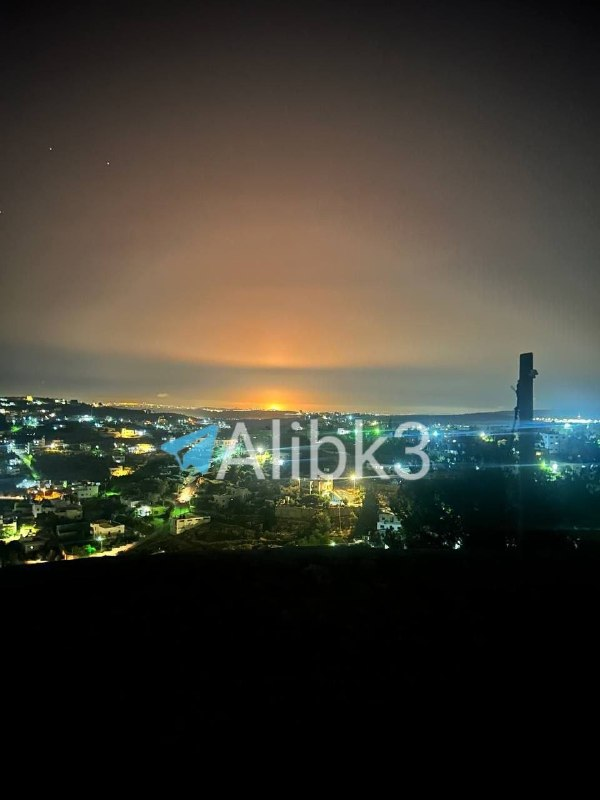

—❗️🇮🇱 BREAKING: Huge explosion in Beit Shemesh, Israel @Middle_East_Spectator

## Middle_East_Spectator — post 32140

—❗️🇮🇱 BREAKING: Huge explosion in Beit Shemesh, Israel @Middle_East_Spectator

## Middle_East_Spectator — post 32139

  <a href="telegram/content/Middle_East_Spectator_32139_1778962476.mp4" target="_blank">🎬 Download video</a>

—❗️🇮🇱 BREAKING: Huge explosion in Beit Shemesh, Israel

@Middle_East_Spectator

## Middle_East_Spectator — post 32138

  <a href="telegram/content/Middle_East_Spectator_32138_1778962478.mp4" target="_blank">🎬 Download video</a>

— 🇮🇷 NEW: Iranian TV channels continue to explain how to use assault rifles to the population, as part of the national combat preparedness initiative @Middle_East_Spectator

## Middle_East_Spectator — post 32135

— 🇮🇷 NEW: Iranian TV channels continue to explain how to use assault rifles to the population, as part of the national combat preparedness initiative

@Middle_East_Spectator

## Middle_East_Spectator — post 32134

  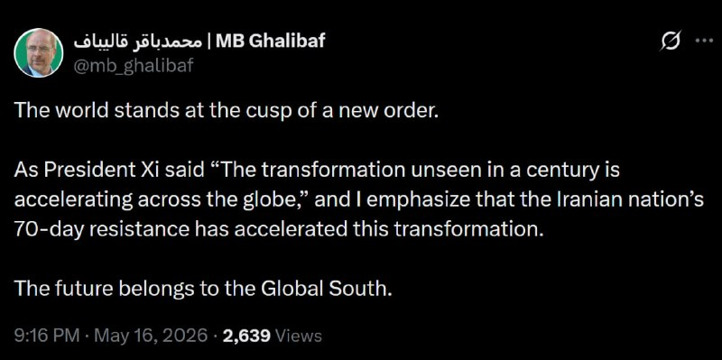

🇮🇷
🇨🇳
⚡️ — Iranian Parliament Speaker Ghalibaf:
The world stands at the cusp of a new order.

As President Xi said “The transformation unseen in a century is accelerating across the globe,” and I emphasize that the Iranian nation’s 70-day resistance has accelerated this transformation.

The future belongs to the Global South.

## Middle_East_Spectator — post 32133

A list of things nobody cares about:

- Eurovision
- Keir Starmer
- The war in Ukraine
- Morocco
- The World Cup
- Matcha

You’re welcome

## DailyJapaneseThread — post 6711

❗️Южная Корея с 2027 года полностью запретит употребление собачьего мяса

Будет официально запрещено разведение, забой и продажа собак в пищу. Соответствующее заявление выпустило министерство сельского хозяйства Южной Кореи.

По данным ведомства, подавляющее большинство ферм, занимавшихся этим бизнесом, уже прекратили свою работу — их доля на данный момент составляет 82%.

## DailyJapaneseThread — post 6710

  

📷 Photo

## DailyJapaneseThread — post 6709

  <a href="telegram/content/DailyJapaneseThread_6709_1778962483.mp4" target="_blank">🎬 Download video</a>

🎬 Video

## animenewsnetwork_feed — post 41658

  

Bite Maker AK Manga Ends

Final chapter to be published on May 30

---
📅 بروزرسانی: 1405/02/26 21:15
---

## dangokimochi — post 11868

  <a href="telegram/content/dangokimochi_11868_1778953524.mp4" target="_blank">🎬 Download video</a>

🎬 Video

## dangokimochi — post 11867

## Middle_East_Spectator — post 32132

— 🇺🇸/🇮🇷 Reporter: ‘We’ve seen in the past and until now that military pressure does not seem to change Iran’s stance in the negotiations’

Marco Rubio: ‘We believe it’s going to work this time. If necessary, we’re willing to go in again and do what’s needed to bring them to the table’

@Middle_East_Spectator

## Middle_East_Spectator — post 32131

— 🇺🇸/🇦🇪/🇮🇷 NEW: Senior Trump administration officials have encouraged the UAE to become more involved in the war against Iran, including by invading Iranian islands in the Persian Gulf – The Telegraph

Note that Iran and the UAE have an outstanding territorial dispute over the strategic Tunb and Abu Musa islands, located in the middle of the Persian Gulf — currently administered by Iran.

@Middle_East_Spectator

## Middle_East_Spectator — post 32130

— 
🇮🇷/🇮🇱/🇱🇧 NEW: Hezbollah announces that if Lebanon and Israel reach a comprehensive ceasefire agreement, Hezbollah will not consider Israeli bases and troops occupying Lebanese territory to be a part of it

@Middle_East_Spectator

## Middle_East_Spectator — post 32129

  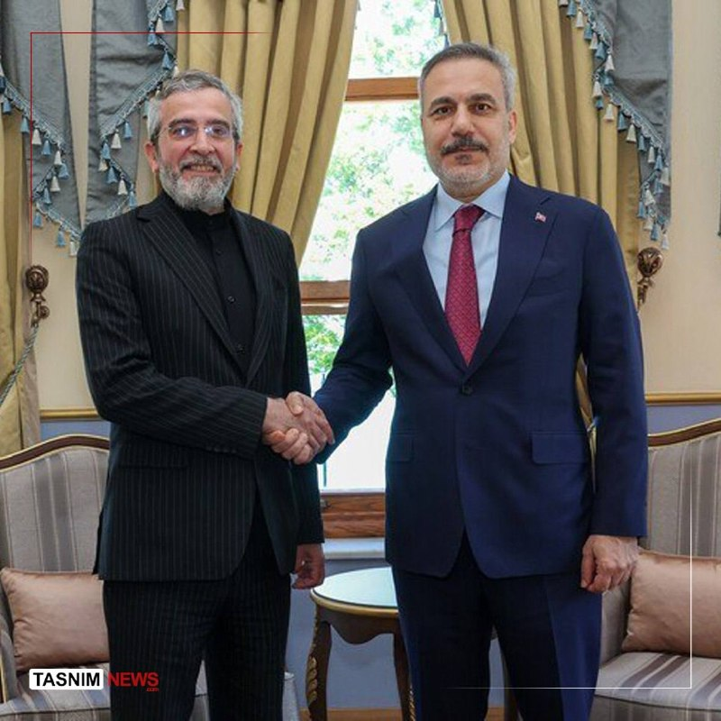

— 🇮🇷/🇹🇷 NEW: Turkish Foreign Minister Hakan Fidan and Ali Bagheri Kani, Deputy Secretary of Iran's Supreme National Security Council, met in Istanbul on Saturday

No details on the meeting were provided.

@Middle_East_Spectator

## DailyJapaneseThread — post 6708

  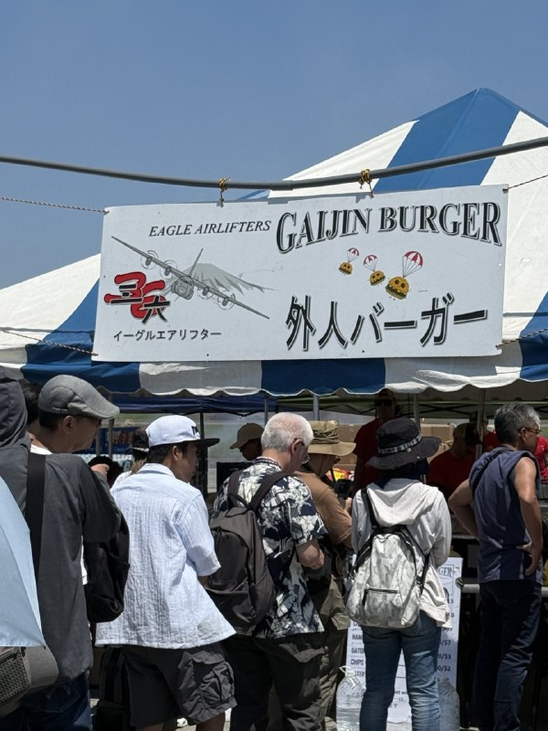

📷 Photo

## DailyJapaneseThread — post 6707

  <a href="telegram/content/DailyJapaneseThread_6707_1778953529.mp4" target="_blank">🎬 Download video</a>

🎬 Video

## animenewsnetwork_feed — post 41657

  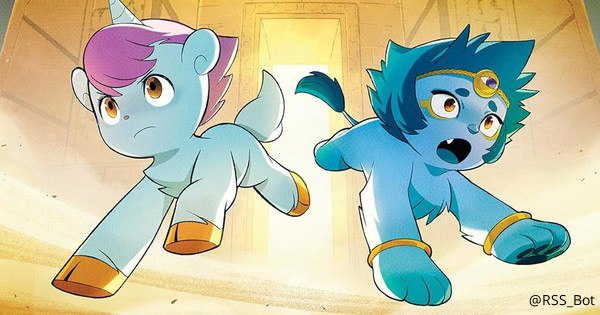

Unico: LOST Volume 3 Manga Review

I feel like this book suffers a little bit by just having things or ideas brought up out of nowhere with very little fanfare.

## animenewsnetwork_feed — post 41656

  

'Babies of Bread' Anime Short Gets TV Series

Stop-motion series debuts on July 4

## animenewsnetwork_feed — post 41655

  

The Ogre's Bride Anime's Trailer Unveils More Cast

Taito Ban, Nobunaga Shimazaki, Aya Endō join cast of July series

## animenewsnetwork_feed — post 41654

  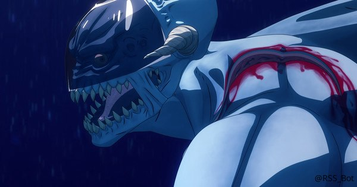

Snowball Earth ‒ Episode 7

The animation decisions in this show continue to baffle me.

## animenewsnetwork_feed — post 41653

  

MangaGamer to Release Umineko When They Cry - Saku Game in West

Company to also release Secret Affairs: Sweaty Midsummer Rut game, Beat Valkyrie Ixseal physically on USB

## animenewsnetwork_feed — post 41652

  

Haru Hisakawa's Takara Shimai Manga Ends, Gets English Release on Manga UP!

Manga launched in January 2025, ended on Friday

---
📅 بروزرسانی: 1405/02/26 18:16
---

## dangokimochi — post 11866

  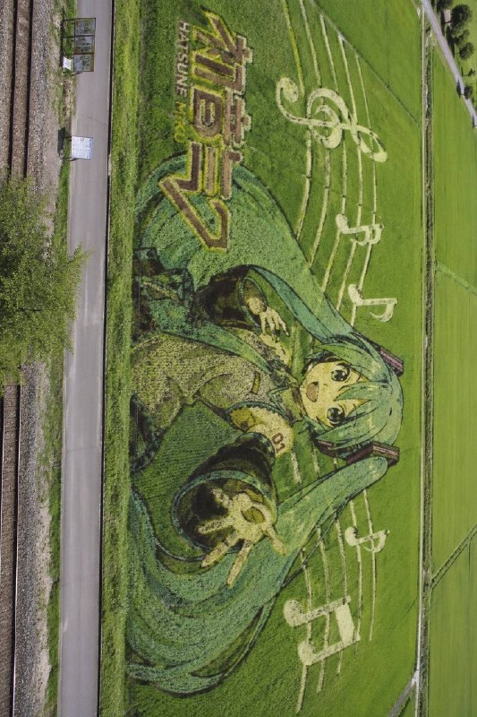

📷 Photo

## dangokimochi — post 11865

  

📷 Photo

## KiranTimes — post 1125

  <a href="telegram/content/KiranTimes_1125_1778942779.mp4" target="_blank">🎬 Download video</a>

روابطتون رو با کیرانیا قطع کنین

## KiranTimes — post 1124

اگر ذهنتون درگیر این باشه که «اگه فلان کار رو بکنم پس ارزشی منو تایید میکنه» ینی اطرافتون ارزشیا حضور دارن

## KiranTimes — post 1123

روابطتون رو با ارزشیا قطع کنین

## KiranTimes — post 1122

اگر ذهنتون درگیر این باشه که «اگه فلان کار رو بکنم پس ارزشی منو تایید میکنه» ینی اطرافتون ارزشیا حضور دارن روابطتون رو با ارزشیا قطع کنین

## KiranTimes — post 1121

روابطتون رو با ارزشیا قطع کنین

## KiranTimes — post 1120

اگر ذهنتون درگیر این باشه که «اگه فلان کار رو بکنم پس ارزشی منو تایید میکنه» ینی اطرافتون ارزشیا حضور دارن

روابطتون رو با ارزشیا قطع کنین

## KiranTimes — post 1119

روابطتون رو با ارزشیا قطع کنین

## KiranTimes — post 1118

  <a href="telegram/content/KiranTimes_1118_1778942780.mp4" target="_blank">🎬 Download video</a>

نصف کانتنت‌کریتورای این‌ور و اون‌ور سر اتفاقای دی‌ماه لال‌مونی گرفته بودن، حالا چون یه دریک نامی گفته she speaking farsi همه ذوق‌مرگ شدن و پشت هم ریلز و تیک‌تاک.

## KiranTimes — post 1117

نصف کانتنت‌کریتورای این‌ور و اون‌ور سر اتفاقای دی‌ماه لال‌مونی گرفته بودن، حالا چون یه دریک نامی گفته she speaking farsi همه ذوق‌مرگ شدن و پشت هم ریلز و تیک‌تاک.

## KiranTimes — post 1116

  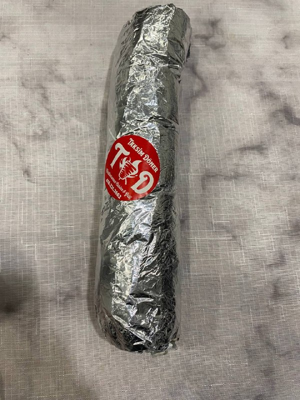

I went to the Iranian neighborhood to show my respect and saw that everyone had these monarchists flags 🤮 so I ended up shopping at a Turkish place instead 🧲🇹🇷💯

## Middle_East_Spectator — post 32128

Something is going to happen, perhaps sooner than some may think.

## Middle_East_Spectator — post 32127

I sense a great disturbance in the force.

## Middle_East_Spectator — post 32124

— 🇺🇸 NEW: Cristopher Nolan’s new historical epic ‘The Odyssey’ is facing heavy backlash, after it was announced that the Greek hero Achilles will be played by transgender actor Elliot Page

Additionally, the muse Helen of Troy will be played by African actress Lupita Nyong’o, and Greek goddess Athena will be played by the African-American actress Zendaya.

@Middle_East_Spectator

## Middle_East_Spectator — post 32123

— 🇮🇷/🇦🇪 NEW: On Iranian TV, a military instructor came to teach people at home how to use a Kalashnikov rifle

The news host decided to shoot at the flag of the United Arab Emirates, while an image of Dubai is seen burning in the background.

@Middle_East_Spectator

## Middle_East_Spectator — post 32122

  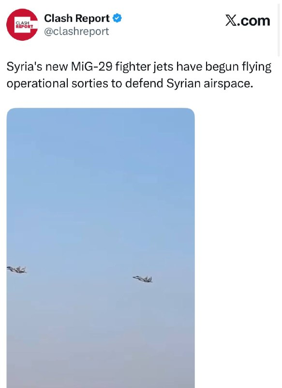

Some are saying it’s AI, but it was posted by official news outlets, including Al-Arabiya.

## Middle_East_Spectator — post 32121

  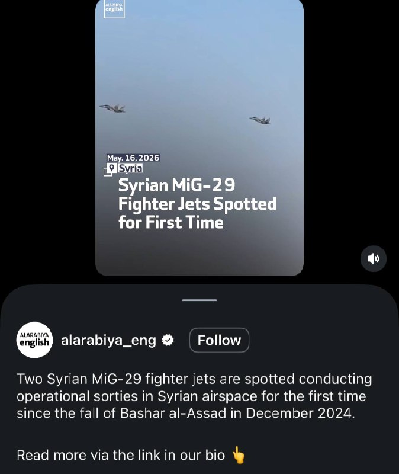

— 🇷🇺/🇸🇾 NEW: Russia has delivered two MiG-29 fighter jets to the new Free Syrian Air Force, they arrived in Khmeimim Airbase today Deliveries were made at the request of Turkey in order to help with counter-terrorism and protection of airspace. This is being…

## Middle_East_Spectator — post 32120

— 🇷🇺/🇸🇾 NEW: Russia has delivered two MiG-29 fighter jets to the new Free Syrian Air Force, they arrived in Khmeimim Airbase today Deliveries were made at the request of Turkey in order to help with counter-terrorism and protection of airspace. This is being…

## Middle_East_Spectator — post 32119

  <a href="telegram/content/Middle_East_Spectator_32119_1778942782.mp4" target="_blank">🎬 Download video</a>

— 🇷🇺/🇸🇾 NEW: Russia has delivered two MiG-29 fighter jets to the new Free Syrian Air Force, they arrived in Khmeimim Airbase today

Deliveries were made at the request of Turkey in order to help with counter-terrorism and protection of airspace.

This is being reported by various mainstream outlets, despite Syrian accounts claiming the video to be AI.

@Middle_East_Spectator

## animenewsnetwork_feed — post 41651

  

Ramparts of Ice ‒ Episode 7

With every episode, I appreciate Ramparts of Ice's refusal to fall back on expected relationship dynamics more and more.

## animenewsnetwork_feed — post 41650

  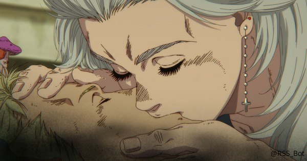

Dorohedoro Season 2 ‒ Episode 9

Shin and Noi are my OTP. They are hard-working, cold-blooded killers, and together, they make the cutest couple I've ever seen.

## animenewsnetwork_feed — post 41649

  

Reborn!, Irregular at Magic High School, Duel Masters Creators Collaborate on Horo-Beat Manga

"Thrilling tag-team battle" manga launched on Friday

## animenewsnetwork_feed — post 41648

  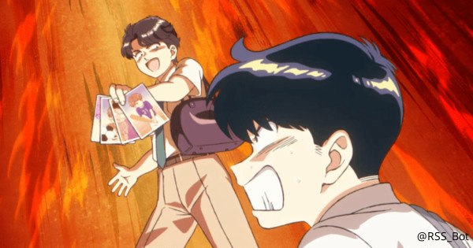

Go For It, Nakamura-kun!! ‒ Episode 8

I felt icky by the end of this episode.

---
📅 بروزرسانی: 1405/02/26 14:51
---

## anime_news — post 10223

  

Special short "My Hero Academia: I am a hero too" begins streaming in Japan on August 3.

## Deamnet — post 26582

  <a href="https://t.me/DeamNet/26582" target="_blank">📎 Download file</a>

ShirOKhorshid-2026.05.14 (1).apk

## sugoileaks — post 3993

  

The Special short Anime "MY HERO ACADEMIA: I am a hero too" begins broadcasting in Japan on August 3!!

The Prior to streaming & screening in Japan, the short will premiere as part of the "My Hero Academia Special Event" at Anime Expo 2026 this July & it'll adapt the One-Shot Manga Featuring Eri included in the Ultra Age Fanbook.

ONE-SHOT SUMMARY:
The One-shot is Centers on Eri, the girl Deku rescued, has grown up and is now a high school student.
In the final episode, she was seen smiling with a guitar case on her back. Now, she visits U.A. High School and is determined to pursue her dream once again.

## sugoileaks — post 3992

news soon

## Deep_iranian_web — post 18588

تعرفه: پلن ۵ گیگ ۷۵۰ (گیگی ۱۵۰) پلن ۱۰ گیگ ۱۴۰۰ (گیگی ۱۴۰) برای اولین خرید: ۵ گیگ ۶۵۰ (گیگی ۱۳۰) ۱۰ گیگ ۱۲۰۰ (گیگی ۱۲۰) همه پلن ها ساب دارن ضریب دار نیستن روی پیسی هم وصل میشه محدودیت کاربر ندارن زمانشونم ۳۰ روزه ایدی ادمین ‎@Supervqnadmin ‏⚠️ ─────────────────────…

## Deep_iranian_web — post 18587

تعرفه:
پلن ۵ گیگ ۷۵۰ (گیگی ۱۵۰)
پلن ۱۰ گیگ ۱۴۰۰ (گیگی ۱۴۰)
برای اولین خرید:
۵ گیگ ۶۵۰ (گیگی ۱۳۰)
۱۰ گیگ ۱۲۰۰ (گیگی ۱۲۰)

همه پلن ها ساب دارن
ضریب دار نیستن
روی پیسی هم وصل میشه
محدودیت کاربر ندارن
زمانشونم ۳۰ روزه
ایدی ادمین ‎@Supervqnadmin
‏⚠️ ─────────────────────
این سرویس بدون گارانتی ارائه میشه. ممکنه اتصال قطع بشه یا مشکلی پیش بیاد.
تلاش می‌کنیم سرویس رو تا حد امکان پایدار نگه داریم و مشکلات رو سریع برطرف کنیم.
‏─────────────────────
@supervqn

## Deep_iranian_web — post 18586

همیشه مالک گفت این بار من میگم
تا سه ماه دیگه منتظر خبر شگفتی باشین
#شطرنج_برره‌ای

---
📅 بروزرسانی: 1405/02/26 11:01
---

## sugoileaks — post 3991

  

The Princess Project Vol.6: Thumbelina For Ongoing S2 of The Youth Romcom Anime "THE ANGEL NEXT DOOR SPOILS ME ROTTEN" EP6 Aired Yesterday!! New Project KV Will Be Released Every Friday!! Studio: PROJECT NO.9

## sugoileaks — post 3990

  

news soon

## LiveMuseumOfIgnorancy — post 11515

  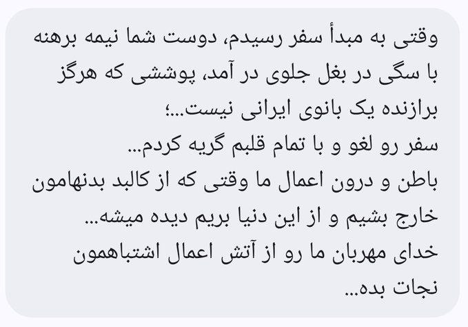

📷 Photo

## LiveMuseumOfIgnorancy — post 11514

  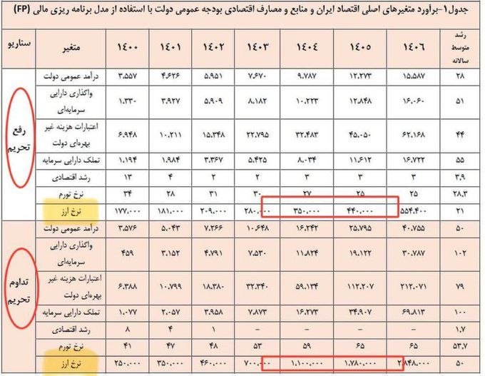

📷 Photo

## LiveMuseumOfIgnorancy — post 11513

  

📷 Photo

## LiveMuseumOfIgnorancy — post 11512

  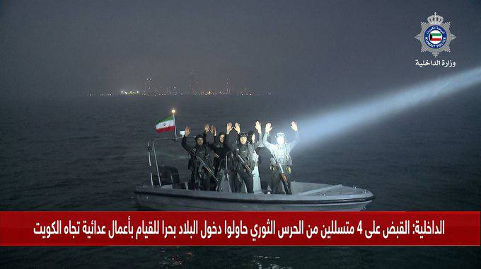

📷 Photo

## LiveMuseumOfIgnorancy — post 11511

  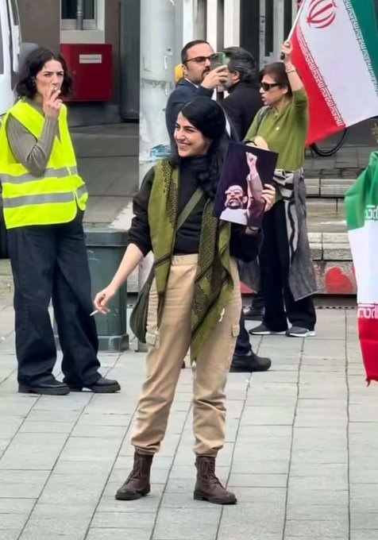

📷 Photo

## LiveMuseumOfIgnorancy — post 11510

  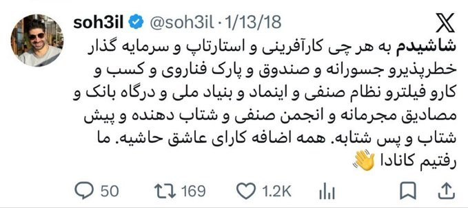

📷 Photo

## animenewsnetwork_feed — post 41647

  

Witch on the Holy Night Anime Film Reveals Returning Main Cast

Haruka Tomatsu, Kana Hanazawa, Yūsuke Kobayashi star in film opening later this year

## animenewsnetwork_feed — post 41646

  

Voice Actor Aoi Nagatsuki's Agency Addresses Photos Taken, Posted Without Her Permission

Amuleto agency: "We have confirmed the images were taken and released without permission"

## animenewsnetwork_feed — post 41645

  

Cyborg 009: Nemesis Anime Casts Yūki Kaji as Joe Shimamura

9 cast members for Nemesis group also revealed

---
📅 بروزرسانی: 1405/02/26 03:13
---

## Deamnet — post 26581

  <a href="telegram/content/Deamnet_26581_1778888583.webm" target="_blank">🎬 Download video</a>

✋ من که حوصله اسکن این ایپی هارو برای سایفون ندارم . ولی هرکی اسکن داره میزنه اون masscan اصلا نتیجه درست نمیده . درکل tcp پینگ میگیره . که شبکه پینگ فیک برمیگردونه . میخوایید اسکن نتیجه واقعی داشته باشه tls/ssl اسکن بزنید . چیزی هم پیدا کردید بدید ما هم استفاده کنیم

الان هم میبینم کل کانال ها هی لیست آیپی میدن بیرون هیچکدوم هم وصل نمیشه همه هم از هم کپی میکنن . حتی اسکرین شات وصل شدن هم کپی از اکانت های توییتر هست 
😄
یه بنده خدایی گفت masscan همه ریختن روش . یه سری ها هم که اصلا تو باغ نیستن فکر میکنن اینها dns هست برای سایفون 
😫

## Configshub2 — post 1716947

𝘾𝙤𝙣𝙛𝙞𝙜𝙨𝙃𝙪𝙗🖤 pinned «تا وقتی اکی کنم کسی خواست کانفیگ بخره بره رباتمون @EkhMelli4Bot»

## Irancirclejerks — post 1294

  <a href="telegram/content/Irancirclejerks_1294_1778888583.mp4" target="_blank">🎬 Download video</a>

🎬 Video

## KiranTimes — post 1115

  <a href="telegram/content/KiranTimes_1115_1778888584.mp4" target="_blank">🎬 Download video</a>

"""*کیرانی هرگز نفهمید🥀"""" حالا اگه همین ملت خایه مال حماس و مادرجنده هایی مثل طالقاتی و منتظری بودن چنان بر طبل غیرتمندی این مردم میکوبیدن.. چون مخالف پاسدار شهید فلوید زاده هستیم شدیم کیرانی و در آخر کیر رضا پهلوی تو کسننه آرشان

## KiranTimes — post 1114

  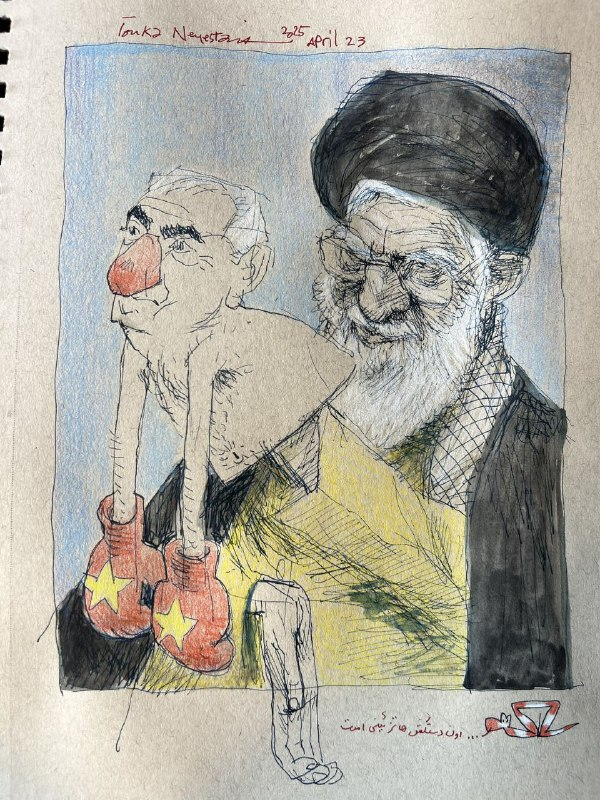

رضا پهلوی

## KiranTimes — post 1113

"""*کیرانی هرگز نفهمید🥀""""

حالا اگه همین ملت خایه مال حماس و مادرجنده هایی مثل طالقاتی و منتظری بودن
چنان بر طبل غیرتمندی این مردم میکوبیدن..
چون مخالف پاسدار شهید فلوید زاده هستیم شدیم کیرانی
و در آخر کیر رضا پهلوی تو کسننه آرشان

## shitpostkid — post 18001

  <a href="telegram/content/shitpostkid_18001_1778888586.mp4" target="_blank">🎬 Download video</a>

🎬 Video

## cyberfiend666 — post 32738

  <a href="telegram/content/cyberfiend666_32738_1778888586.mp4" target="_blank">🎬 Download video</a>

🎬 Video

## cyberfiend666 — post 32737

  <a href="telegram/content/cyberfiend666_32737_1778888589.mp4" target="_blank">🎬 Download video</a>

🎬 Video

## cyberfiend666 — post 32736

  

📷 Photo

## Middle_East_Spectator — post 32118

— 🇮🇱/
🇮🇷 NEW: Hezbollah carried out 33 operations today, the most since the ‘ceasefire’ started

@Middle_East_Spectator

## Middle_East_Spectator — post 32117

  <a href="telegram/content/Middle_East_Spectator_32117_1778888594.mp4" target="_blank">🎬 Download video</a>

— 🇺🇸/🇮🇷 Reporter: ‘Do you think Iran is going to capitulate anytime soon?’

President Trump: ‘I have no doubt’

@Middle_East_Spectator

## Middle_East_Spectator — post 32116

— 🇺🇸/🇱🇧/🇮🇱 NEW: The ‘ceasefire’ between Israel and Hezbollah has been extended for 45 days

@Middle_East_Spectator

## DailyJapaneseThread — post 6706

  <a href="telegram/content/DailyJapaneseThread_6706_1778888595.mp4" target="_blank">🎬 Download video</a>

🎬 Video

## DailyJapaneseThread — post 6705

  <a href="telegram/content/DailyJapaneseThread_6705_1778888597.mp4" target="_blank">🎬 Download video</a>

🎬 Video

## DailyJapaneseThread — post 6704

  <a href="telegram/content/DailyJapaneseThread_6704_1778888598.mp4" target="_blank">🎬 Download video</a>

🎬 Video

## animenewsnetwork_feed — post 41644

  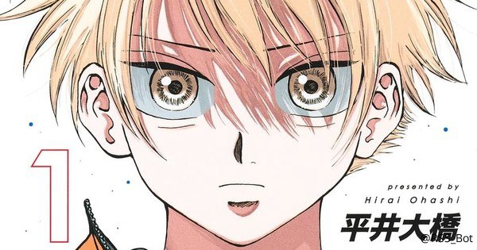

The Days of Diamond Manga Returns in June

Series entered hiatus on January 22

## animenewsnetwork_feed — post 41643

  

Yuu Yoshinaga Launches New Series

Saredo, Futari wa Kusare En debuts on June 12

## animenewsnetwork_feed — post 41642

  

Sekai Project to Release Neko-Mimi Sweet Housemates 2, Neko-Nin exHeart Spin! 2 Visual Novels in West

Company to also release Nekopara 10th Anniversary -Sayori Art Works- artbook

## animenewsnetwork_feed — post 41641

  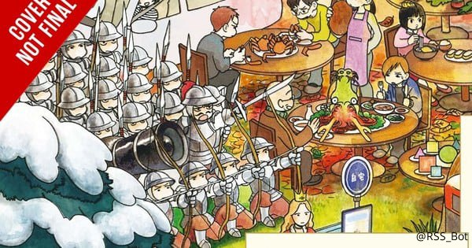

Yen Press Licenses Moscow 2160, Love at the City's Edge on a Moonlit Night, Terrarium in a Drawer, 14 More Manga/Novels

Also: He Was My Brother, egg: I'm Your Child, After-School Duty, more

---
📅 بروزرسانی: 1405/02/26 00:14
---

## dangokimochi — post 11864

  

📷 Photo

## dangokimochi — post 11863

  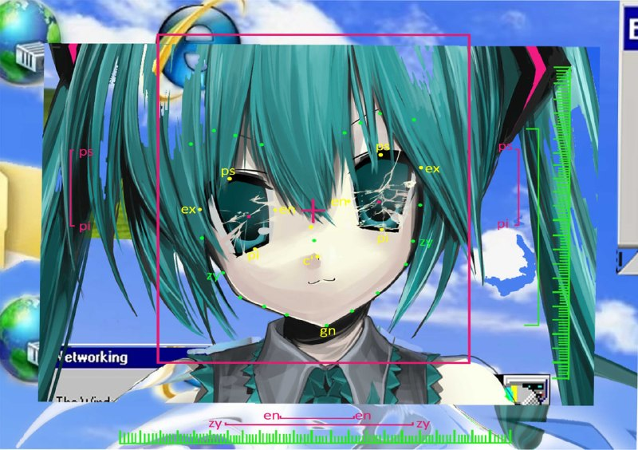

📷 Photo

## dangokimochi — post 11862

  

📷 Photo

## Irancirclejerks — post 1293

  <a href="telegram/content/Irancirclejerks_1293_1778877850.mp4" target="_blank">🎬 Download video</a>

Peak

## KiranTimes — post 1112

عشق و علاقه بین ملت فخیمه و سربلند اسرائیل و ایران

## KiranTimes — post 1111

کون ننه بعضیا باید درد بگیره از این عشق و علاقه بین ملت فخیمه و سربلند اسرائیل و ایران

## KiranTimes — post 1110

  <a href="telegram/content/KiranTimes_1110_1778877853.mp4" target="_blank">🎬 Download video</a>

🎬 Video

## KiranTimes — post 1109

  

📷 Photo

## cyberfiend666 — post 32735

  

📷 Photo

## cyberfiend666 — post 32734

  

📷 Photo

## cyberfiend666 — post 32733

  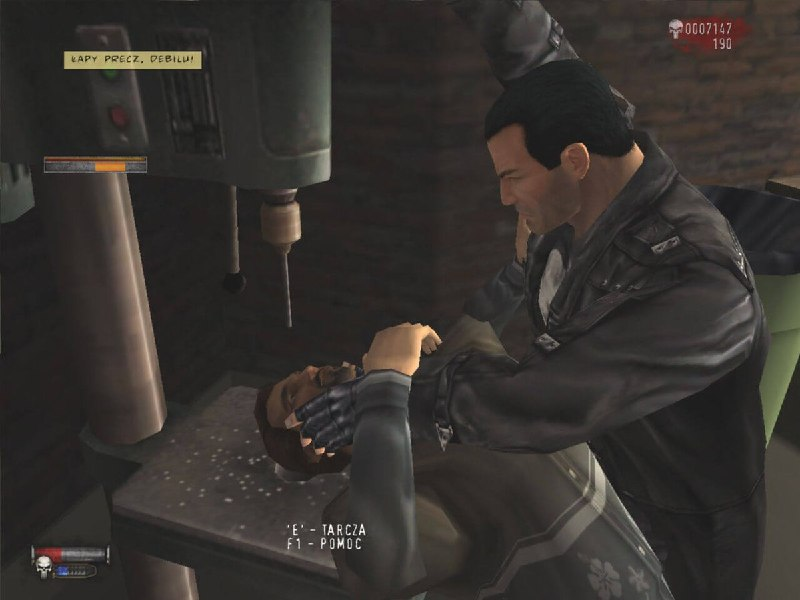

Link -> https://archive.org/details/the-punisher.-7z_202506
Since The Punisher: One Last Kill got released recently, why not try it's video game adaptation by Volition which was so raw and violent it had to be censored in UK and Australia. My repack has widescreen fix and Gore patch as well, making it the most definitive experience on PC. It even runs flawlessly on steam deck. Just extract and Enjoy 😁😁😁

🔗 RohanKar

## Middle_East_Spectator — post 32115

—❗️🇺🇸/🇮🇷 NEW: Iranian hackers have gained access to gas station monitors and systems across various U.S. states – CNN @Middle_East_Spectator

## Middle_East_Spectator — post 32114

—❗️🇺🇸/🇮🇷 NEW: Iranian hackers have gained access to gas station monitors and systems across various U.S. states – CNN

@Middle_East_Spectator

## Middle_East_Spectator — post 32111

  <a href="telegram/content/Middle_East_Spectator_32111_1778877857.mp4" target="_blank">🎬 Download video</a>

—❗️🇮🇱/🇵🇸/
🇵🇸 BREAKING: The IDF announces it carried out an assassination attempt against Izz Al-Din Al-Haddad, the commander of the Al-Qassam Brigades and leader of Hamas in the Gaza Strip @Middle_East_Spectator

## Middle_East_Spectator — post 32109

—❗️🇮🇱/🇵🇸/
🇵🇸 BREAKING: The IDF announces it carried out an assassination attempt against Izz Al-Din Al-Haddad, the commander of the Al-Qassam Brigades and leader of Hamas in the Gaza Strip

@Middle_East_Spectator

## Middle_East_Spectator — post 32108

  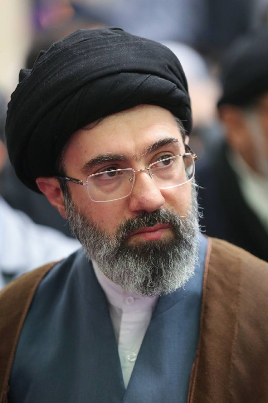

— 🇮🇱/🇮🇷 Hebrew media: ‘Supreme Leader Mojtaba Khamenei is more radical than his father, and refuses to make any key concessions’

@Middle_East_Spectator

## Middle_East_Spectator — post 32107

  <a href="telegram/content/Middle_East_Spectator_32107_1778877860.webm" target="_blank">🎬 Download video</a>

🇱🇧
❌
🇮🇱 — Hezbollah has launched at least 10 drones from Lebanon toward the Galilee Panhandle in the last hour. 
➡️ The IDF says impacts were recorded in Kiryat Shmona and Metula, though no injuries were reported. 
➡️ The military says two drones have been…

## Middle_East_Spectator — post 32106

  <a href="telegram/content/Middle_East_Spectator_32106_1778877861.webm" target="_blank">🎬 Download video</a>

🇱🇧
❌
🇮🇱 — Hezbollah has launched at least 10 drones from Lebanon toward the Galilee Panhandle in the last hour.

➡️ The IDF says impacts were recorded in Kiryat Shmona and Metula, though no injuries were reported.

➡️ The military says two drones have been intercepted by air defenses while others struck open areas.

## animenewsnetwork_feed — post 41640

  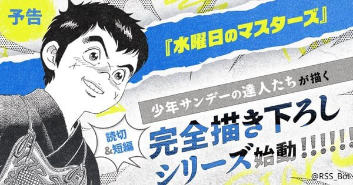

Motoka Murakami Draws New 1-Shot for Musashi no Ken Manga After 40 Years

1-shot will be manga's 1st new story since ending in 1985

## animenewsnetwork_feed — post 41639

  

'Even the Student Council Has Its Holes!' Manga Takes Break

Artist Muchimaro focuses on health

## animenewsnetwork_feed — post 41638

  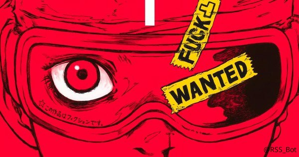

Punk Gun Manga Ends

Final chapter launches on May 21

## animenewsnetwork_feed — post 41637

  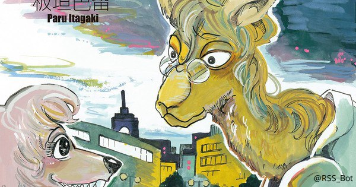

Paru Itagaki's Beast Complex Manga Gets New 1-Shot

New short story launches in summer

---
📅 بروزرسانی: 1405/02/25 20:02
---

## Configshub2 — post 1716946

𝘾𝙤𝙣𝙛𝙞𝙜𝙨𝙃𝙪𝙗🖤 pinned «تا وقتی اکی کنم کسی خواست کانفیگ بخره بره رباتمون @EkhMelli4Bot»

## dangokimochi — post 11861

  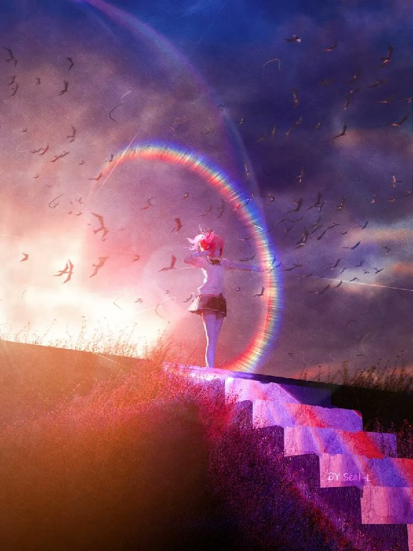

📷 Photo

## dangokimochi — post 11860

  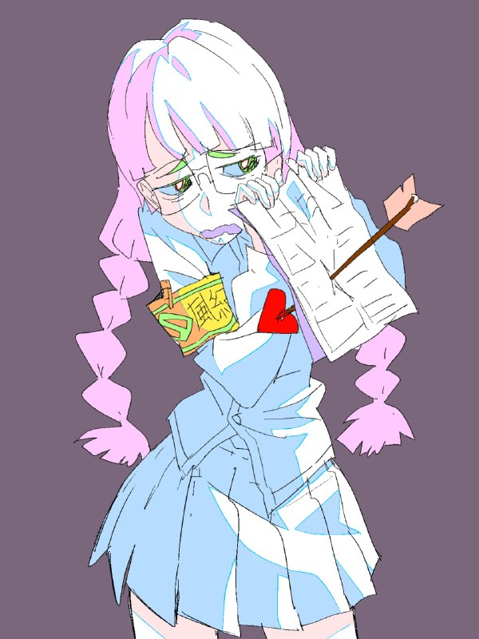

📷 Photo

## dangokimochi — post 11859

  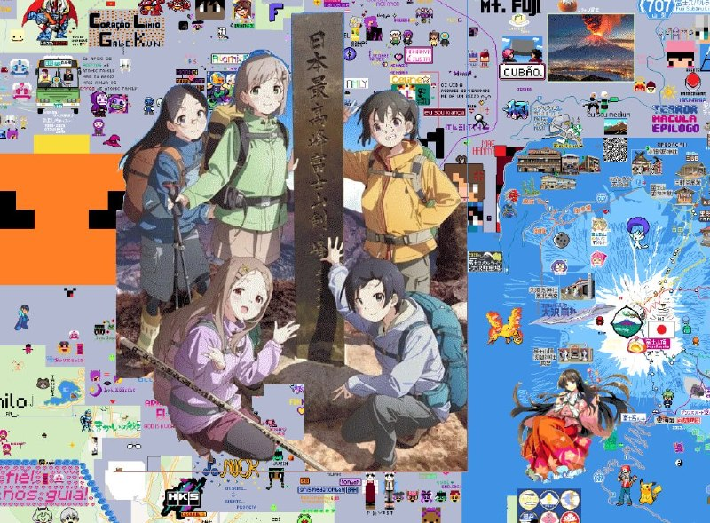

📷 Photo

## dangokimochi — post 11858

  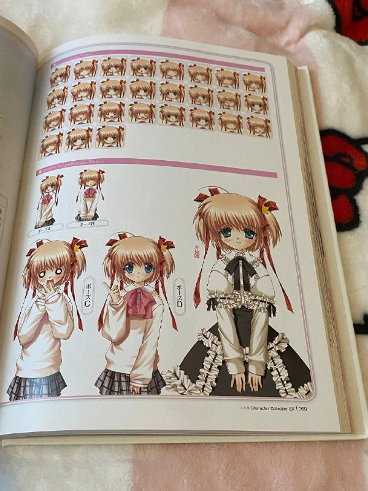

📷 Photo

## dangokimochi — post 11857

  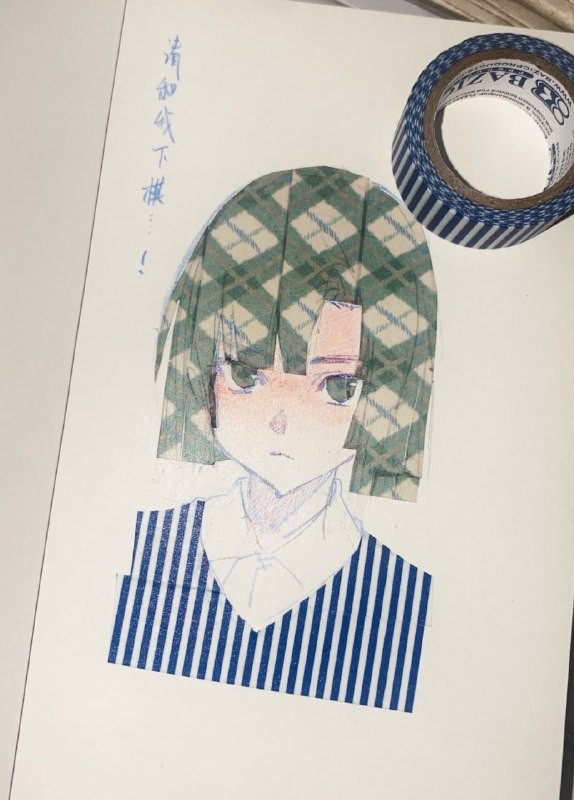

wusuo240222

## Irancirclejerks — post 1292

  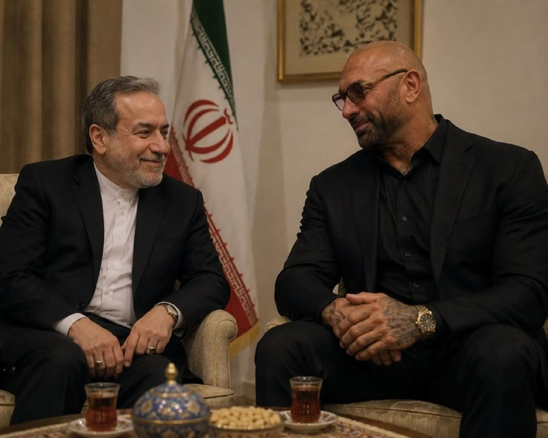

دیدار حضرت غم داوود باتیستا سلطان مردانگی غیرت مراپ و معرفت با آقا عباس

## Irancirclejerks — post 1291

  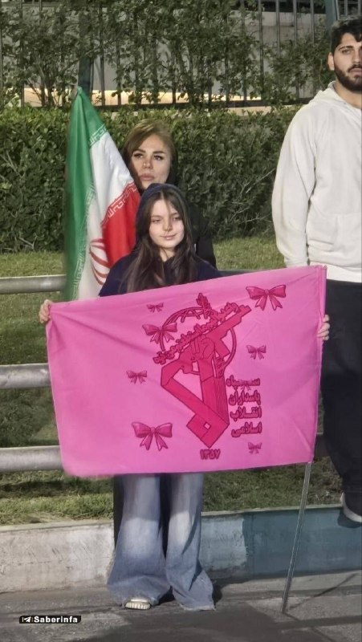

🩷💖💝💅

## KiranTimes — post 1108

  <a href="telegram/content/KiranTimes_1108_1778862732.mp4" target="_blank">🎬 Download video</a>

🎬 Video

## KiranTimes — post 1107

  <a href="telegram/content/KiranTimes_1107_1778862733.mp4" target="_blank">🎬 Download video</a>

محض اطلاع علاقه ما به اسراییل و نتانیاهو ام بخاطر روند بالانس کردنِ دستایِ خالیِ ماست در برابر اسلحه پر شما و بله این علاقه از ی دوستی و همکاری عادی بسیار بالاتر رفته.

## KiranTimes — post 1106

  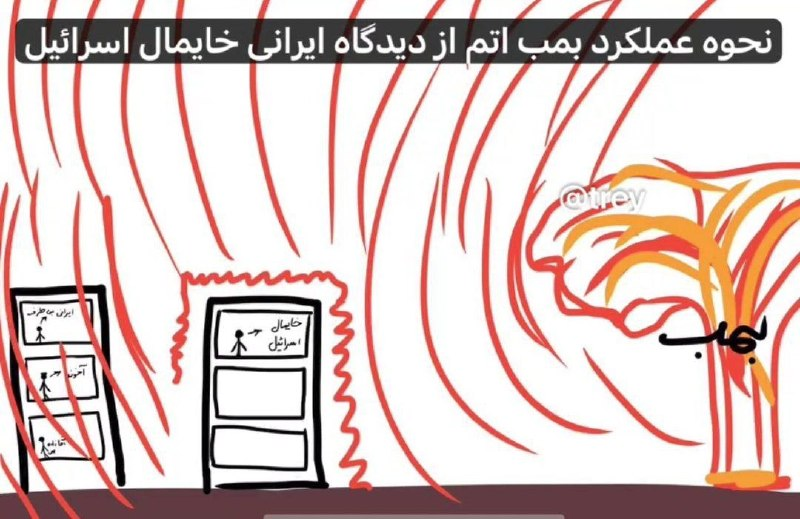

و فرق ما با شما مادرجندها اینه حداقل با وجود اینکه سر اسلحه داعش شیعی رو سر ماست طی یکی دوسال وجودشو داریم با جمعیت میلیونی به خیابون ها بیایم و چندصد قلاده ازتونو بکشیم و کشته هایی بدیم که برامون عزیزن چون به تفکری که داریم پایبندیم نه " کسی که بدون اعتقاد…

## KiranTimes — post 1105

و فرق ما با شما مادرجندها اینه
حداقل با وجود اینکه سر اسلحه داعش شیعی رو سر ماست
طی یکی دوسال وجودشو داریم با جمعیت میلیونی به خیابون ها بیایم و چندصد قلاده ازتونو بکشیم و کشته هایی بدیم که برامون عزیزن
چون به تفکری که داریم پایبندیم
نه
" کسی که بدون اعتقاد به اسلام یا تفکر چپی که دینی رو نمیشناسه بخاد ایت الله بعدی باشه"
مادرگوه ها

## KiranTimes — post 1104

  

محض اطلاع علاقه ما به اسراییل و نتانیاهو ام بخاطر روند بالانس کردنِ دستایِ خالیِ ماست در برابر اسلحه پر شما و بله این علاقه از ی دوستی و همکاری عادی بسیار بالاتر رفته.

## KiranTimes — post 1103

محض اطلاع علاقه ما به اسراییل و نتانیاهو ام

بخاطر روند بالانس کردنِ دستایِ خالیِ ماست در برابر اسلحه پر شما

و بله این علاقه از ی دوستی و همکاری عادی بسیار بالاتر رفته.

## KiranTimes — post 1101

## Middle_East_Spectator — post 32105

— 🇺🇸/🇮🇷 President Trump: ‘We can keep the bridges and power plants in Iran, or we can destroy it all in two days’

@Middle_East_Spectator

## Middle_East_Spectator — post 32103

  

— Dear subscribers Do you also see how they’re trying to artificially divide Christians and Muslims? If we want to truly resist the evil in this world, we need to stand together as brothers. A peaceful Muslim-Christian alliance against tyranny, against opression…

## Middle_East_Spectator — post 32102

  

— Dear subscribers

Do you also see how they’re trying to artificially divide Christians and Muslims? If we want to truly resist the evil in this world, we need to stand together as brothers.

A peaceful Muslim-Christian alliance against tyranny, against opression and evil, for the liberation of Palestine. Our similarities have always outweighed our differences.

Check out the Crescent-Cross Covenant Coalition on Instagram if you support this cause.

(The Epstein cap is sarcasm)

@Middle_East_Spectator

## Middle_East_Spectator — post 32101

— 🇺🇸/🇮🇷 U.S. Secretary of Energy, Chris Wright:

‘The decision on the Strait of Hormuz is in Iran’s hands’

@Middle_East_Spectator

## Middle_East_Spectator — post 32100

— 🇺🇸/🇮🇷 President Trump on Iran:

‘We might need to do a little clean up work, because we had a little month long ceasefire, as you’d call it.

I wouldn’t have been really in favor of a ceasefire, we mostly did it at the request of other nations. We did it as a favor to Pakistan.’

@Middle_East_Spectator

## Middle_East_Spectator — post 32099

— 🇺🇸/🇮🇷 Reporter: ‘Did you reject Iran’s latest response to the U.S. proposal?’

Trump: ‘I looked at it, and if I don’t like the first sentence I just throw it away.’

Reporter: ‘What was the first sentence?’

Trump: ‘An unacceptable sentence’

@Middle_East_Spectator

## Middle_East_Spectator — post 32098

  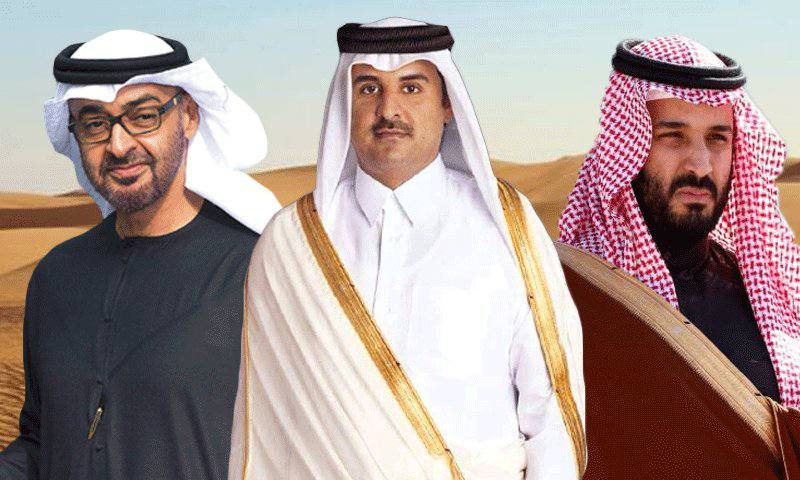

— 🇦🇪/🇸🇦/🇰🇼/🇧🇭/🇶🇦/🇮🇷 NEW: During the recent war, UAE leader Mohammed bin Zayed personally called the leaders of Bahrain, Kuwait, Qatar, and Saudi Arabia, proposing to form an Arab coalition against Iran, but every country refused – Bloomberg

@Middle_East_Spectator

## Middle_East_Spectator — post 32097

  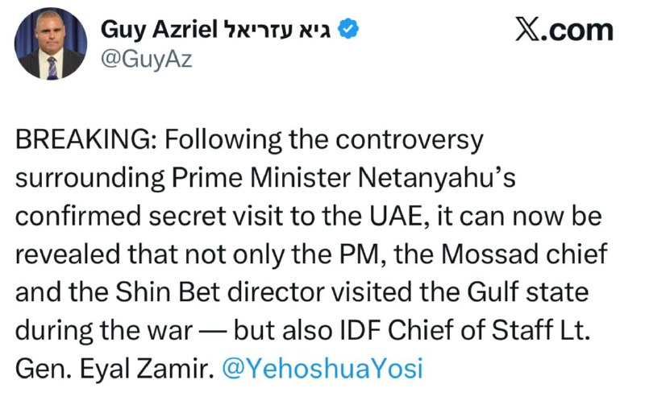

— 🇮🇱/🇦🇪 NEW: Israel stabs the UAE in the back for a second time, now revealing that not only Netanyahu visited Abu Dhabi, but also the IDF Chief of Staff, the head of Mossad, and the head of Shin Bet

Israel’s arrogance and their need to brag is destroying the very relationship they are so proud of.

Emirati officials are reportedly ‘outraged’ with the new revelation.

@Middle_East_Spectator

## LiveMuseumOfIgnorancy — post 11509

  <a href="telegram/content/LiveMuseumOfIgnorancy_11509_1778862737.mp4" target="_blank">🎬 Download video</a>

🎬 Video

## animenewsnetwork_feed — post 41636

  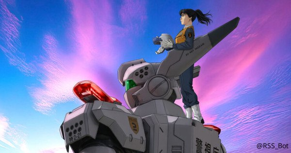

Patlabor EZY: File 1 Anime Film Review

Patlabor EZY makes giant robots as boringly mundane as possible—and therein lies its brilliance.

## animenewsnetwork_feed — post 41635

  

TBS' Sand B Company Acquires Xenotoon CG Anime Studio

Studio that produced Genshō Yasuda's Make A Girl anime film to merge with Seven Arcs in mid-2027

## animenewsnetwork_feed — post 41634

  

This Week in Games - Everyone Succumbs To Money

The time has come — the Switch 2 will be going up in price — and we even know when. Jean-Karlo has the details.

## animenewsnetwork_feed — post 41633

  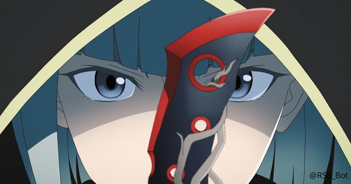

Interview: Petals of Reincarnation Voice Actor Wakana Maruoka, Producer Takanori Matsuoka

At Anime Boston, we caught up with Petals of Reincarnation producer Takanori Matsuoka and Haito’s voice actress Wakana Maruoka to talk about this new, dark, battle anime.

## animenewsnetwork_feed — post 41632

  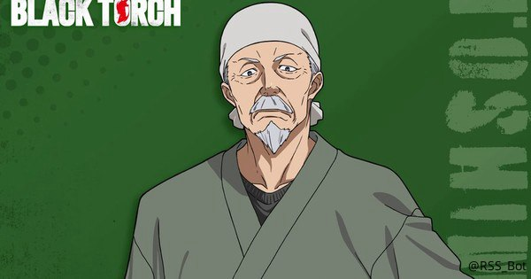

Black Torch TV Anime Reveals More Cast, Staff

Anime based on Tsuyoshi Takaki's manga to debut on July 4

## animenewsnetwork_feed — post 41631

  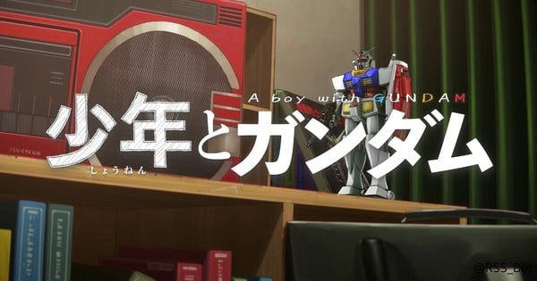

Gundam Franchise Unveils 50th Anniversary Short, 'Gundam-Con' Event Next January

April 7 designated "Gundam Day," Tokyo's life-size Unicorn Gundam to be taken down in August

## animenewsnetwork_feed — post 41630

  

The Oblivious Saint Can't Contain Her Power TV Anime Reveals More Cast in 2nd Promo Video

Shunichi Toki, Inori Minase join cast for July anime

## animenewsnetwork_feed — post 41629

  

Dr. STONE SCIENCE FUTURE ‒ Episode 31

As much as I enjoy the rapid-fire scientific advancement part of Dr. Stone, sometimes that comes at the expense of meaningful character moments.

## animenewsnetwork_feed — post 41628

  

Gundam Seed Freedom Zero Prequel Anime Confirmed for Theatrical Release

Anime was announced during Gundam Seed FREEDOM special screening in November 2024

## animenewsnetwork_feed — post 41627

  

Gundam Wing Franchise Gets 'New Visual Project'

BNF board director Naohiro Ogata: Cannot reveal format, but "it is definitely something long"

## animenewsnetwork_feed — post 41626

  

Iron Wok Jan! Anime Reveals More Cast, July 5 Debut in Main Promo Video

M.A.O, Taishi Murata, more join cast; Genin wa Jibun ni Aru performs opening theme

---
📅 بروزرسانی: 1405/02/25 13:35
---

## anime_news — post 10222

"Iron Wok Jan!" TV anime main PV. Begins July 5

## anime_news — post 10221

  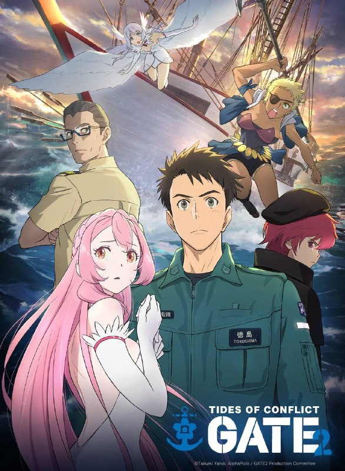

"GATE 2: Tides of Conflict" is scheduled for 2027.

## anime_news — post 10220

  

The anime adaptation of "Omniscient Reader" is scheduled for 2027 according to BookWalker. (Not confirmed)

## Configshub2 — post 1716945

𝘾𝙤𝙣𝙛𝙞𝙜𝙨𝙃𝙪𝙗🖤 pinned «تا وقتی اکی کنم کسی خواست کانفیگ بخره بره رباتمون @EkhMelli4Bot»

## sugoileaks — post 3989

  <a href="telegram/content/sugoileaks_3989_1778839508.mp4" target="_blank">🎬 Download video</a>

🎬 Video

## sugoileaks — post 3988

  

SUCCUBUS DEVIL GIRL × SAINTESS

## sugoileaks — post 3987

  

New KV & PV for upcoming fantasy romance anime "THE OBLIVIOUS SAINT CAN'T CONTAIN HER POWER: Forget My Sister! Turns Out I Was The Real Saint All Along!" Featuring Flora. The Anime will Premiere in July 2026!! Studios: MAGIC BUS × PICANTE CIRCUS. Director:…

## sugoileaks — post 3986

  <a href="telegram/content/sugoileaks_3986_1778839511.mp4" target="_blank">🎬 Download video</a>

New KV & PV for upcoming fantasy romance anime "THE OBLIVIOUS SAINT CAN'T CONTAIN HER POWER: Forget My Sister! Turns Out I Was The Real Saint All Along!" Featuring Flora.

The Anime will Premiere in July 2026!!

Studios: MAGIC BUS × PICANTE CIRCUS.
Director: Mitsutaka Noshitani
Series Comp.: Toko Machida
Character Design: Taihei Nagai
Music: SUPA LOVE

Theme Songs:
OP Titled "WINDMAKER" By KAYA.
ED Titled "UNKNOWN ME" by UTAHIME DREAM ALLSTARS.

Main Cast:
Carolina | CV: Rie Takahashi
Edward | CV: Makoto Furukawa
Flora | CV: Haruka ShiraishI

New Cast:
Teodore Garcia | CV: Shunichi Toki
Marisa Kissinger | CV: Inori Minase

Based on The Fantasy Romance LN by Almond &Yoshiro Ambe.

SUMMARY:
The Story Centers on The "Failed" daughter Of A Duke Lady Carolina, Whose Appearance & abilities are both mediocre, finds a warm "Place She Belongs" in an arranged political marriage.
The excellent House of the Duchy of Sanchez has two daughters.
The older sister, Flora, is a brilliant and talented holy maiden candidate.
The younger sister, Carolina, is a plain and talentless dropout... In such circumstances, Carolina receives a marriage offer from the second prince of the neighbouring country to improve the nations' relations.
However, her groom, the prince is rumoured to be savage and cruel.
Carolina accepts thinking "If I can be of help," but her life completely changes upon marriage.
Contrary to the gossip, she is fairly appraised by both the chivalrous prince and the empress, so she is accepted for herself?!

## sugoileaks — post 3985

  <a href="telegram/content/sugoileaks_3985_1778839514.mp4" target="_blank">🎬 Download video</a>

New PV for upcoming chinese cuisine anime "IRON WOK JAN"

The anime will premiere on July 5, 2026!!

Studio: TROYCA

OP Titled "FIRE BANQUET" by Seven-Member Dance Vocal Group GENIN WA JIBUN NI ARU.

Main Cast:
Jan Akiyama | CV: Kikunosuke Toya
Kiriko Gobanchō | CV: Ikumi Hasegawa
Takao Okonogi | CV: Kōhei Amasaki
Narration: Kenjiro TeudA

New Cast:
Celene Yang | CV: M.A.O
Kei Sawada | CV: Takahiro Sakurai
Tomohide Jun | CV: Taishi Murata
Yuji Kawahara | CV: Yusuke Kobayashi
Nichido Otani | CV: Masuo Amada

Based on the Over-The-Top Chinese Cuisine Cooking Battle Action Shonen Manga by Shinji Saijo which ran from 1995-2000 in 27 Volumes.

SUMMARY:
The story centers on a brilliant young chef named Jan Akiyama, who works at a top class restaurant where he is constantly challenging Kiriko Gobanchō, the granddaughter of the restaurant's owner and a great chef in her own right.
While Kiriko believes that food should be made with the customer in mind, Jan believes that cooking should be used for competition.

STAFF:
Director: Ei Aoki
Series Comp.: Makoto Uezu
Character Design & Chief Animation Director: Masako Matsumoto
Cuisine Animation Directors: Atsushi Okuda & Chihiro Hanamura
Action Animator: Ryuuichi Makino
Art Director: Ken Naitō
Color Design: Mariko Shinohara
Director of Photography: Ryosuke Tsuda
CG Director: Mitsutaka Iguchi
Editing: Shota Migiyama
Cuisine Supervision & Coordinator: Takako Satō
Cooking Science Supervision: Naoya Higuchi
Sound Director: Jin Aketagawa
Sound Effects: Masami Baba
Music: Tomoki Kikuya

## sugoileaks — post 3984

NEW KV: "THE OBLIVIOUS SAINT CAN'T CONTAIN HER POWER"

## sugoileaks — post 3983

  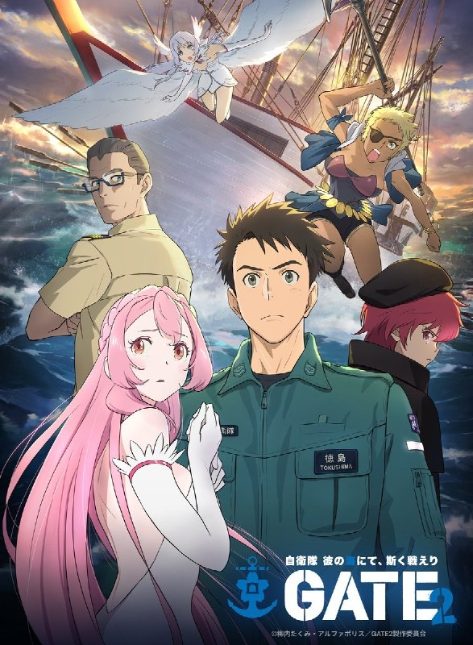

New KV for the upcoming season 2 of the anime "GATE 2: Tides Of Conflict"

The anime will premiere during next year!

Studio: M2

Based on Takumi Yanai's "Gate: Thus the Japanese Self-Defense Force Fought in Their Land" LN Series.

Summary Of S2:
Following the reopening of the mysterious 'GATE,' the Japanese Self-Defense Forces continue diplomatic and exploratory missions in the Special Region, a realm parallel to our world.
When an American journalist is kidnapped in this region's troubled seas, an elite Japanese Maritime unit embarks on a high-stakes rescue mission.
This new chapter of the acclaimed fantasy saga explores fresh adventures, diplomatic tensions, and thrilling action in a world beyond imagination.

STAFF:
Director: Tōru Takahashi
Series Comp. & Script: Tatsuhiko Urahata
Character Design: Shigeru Fujita
Music: Yoshiaki Fujisawa
Production: Kasagi Labo & Oshi & GENCO.

## sugoileaks — post 3981

Rip Wakana Yamazaki (Ran's VA) on April 18, 2026🕊️

Akemi Okamura (Nami's VA) will continue the role after her!

## KangZone — post 32247

  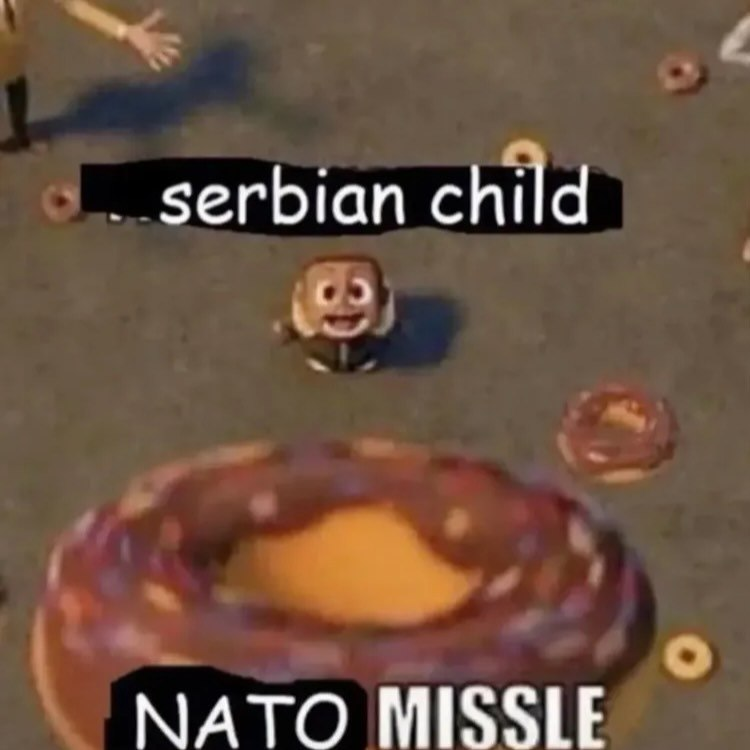

📷 Photo

## KiranTimes — post 1100

  <a href="telegram/content/KiranTimes_1100_1778839519.mp4" target="_blank">🎬 Download video</a>

آرشان خایه مال

## KiranTimes — post 1099

"مخصوصن"

## KiranTimes — post 1097

"توییتای ضدامپریالیستیتون خیلی جالبه، مخصوصن اون‌جاش که به آدمکشی سپاه قدس توی سوریه می‌رسید و لالمونی می‌گیرید."

## KiranTimes — post 1096

  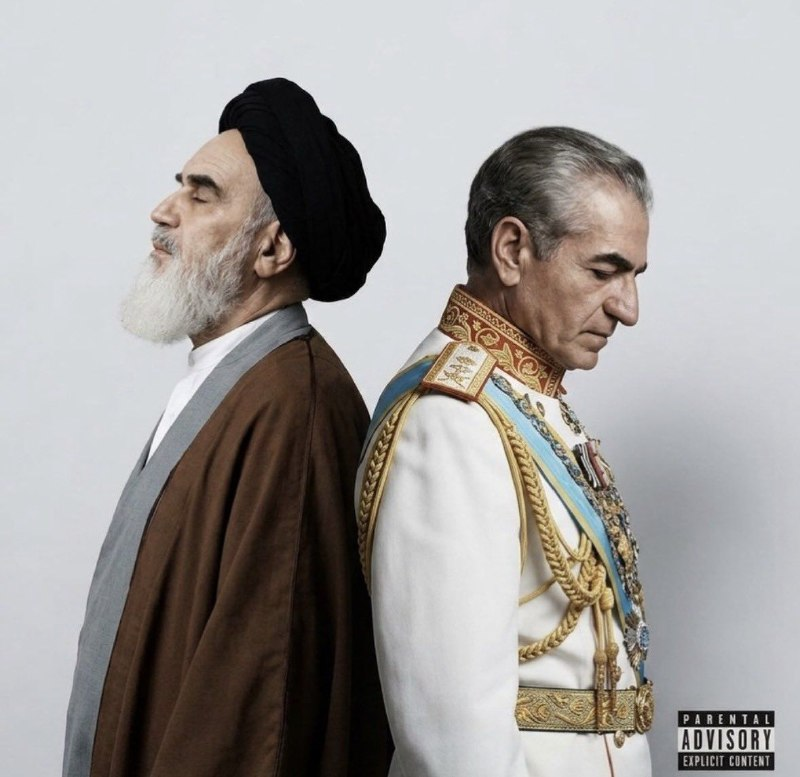

تنها رقیبی که تو گروهای خارجی داره منم
چون شما بی خایه ها اونجا نیستید

## KiranTimes — post 1095

تنها رقیبی که تو گروهای خارجی داره منم
چون شما بی خایه ها اونجا نیستید

## KiranTimes — post 1094

فکت گاینده: آرشان خایه مال انگلیسی بلده و ماشین پروپاگاندا جنریتور بهتریه در مقایسه با خیلی از کسایی که بهش فحش میدن.

اگر واقعا حالتون ازش به هم میخوره برید تو زمین بازی خودش باهاش بجنگید.

## Middle_East_Spectator — post 32096

🇺🇸
🇮🇷
🇨🇳
⚡️ — President Trump says that Iran is not even able to reach the "nuclear dust" because "the mountain collapsed on it" and that only China and the U.S. can reach it.

## Middle_East_Spectator — post 32095

  <a href="telegram/content/Middle_East_Spectator_32095_1778839521.mp4" target="_blank">🎬 Download video</a>

🇺🇸
🇮🇷
🇨🇳
⚡️ — President Trump says that Iran is not even able to reach the "nuclear dust" because "the mountain collapsed on it" and that only China and the U.S. can reach it.

## Middle_East_Spectator — post 32094

— 🇮🇷/🇺🇸/🇨🇳 Trump: ‘I told President Xi that Iran cannot have a nuclear weapon, they’re stone cold crazy’

Reporter: ‘What did he say?’

Trump: ‘Well, he’s not going to respond too much — he’s a pretty cool guy, he’s not gonna say ‘oh, that’s a good point’

@Middle_East_Spectator

## Middle_East_Spectator — post 32092

— 🇺🇸/🇮🇷 President Trump: ‘The people we are dealing with in Iran are rational, they’re very smart — better than the previous leaders’

@Middle_East_Spectator

## Middle_East_Spectator — post 32091

  <a href="telegram/content/Middle_East_Spectator_32091_1778839524.mp4" target="_blank">🎬 Download video</a>

— 🇺🇸/🇮🇷/🇮🇱 President Trump:

‘I mean, you could make the case of why we’re even in [Iran].

We’re doing it to help Israel.’

@Middle_East_Spectator

## Middle_East_Spectator — post 32090

  <a href="telegram/content/Middle_East_Spectator_32090_1778839526.mp4" target="_blank">🎬 Download video</a>

— 🇺🇸/🇮🇷 President Trump:

‘Iran has probably dug up some missiles from underground, they’ve rebuilt a little bit, we know exactly what they’re doing.

It will all be gone within one day, what they’ve built up the past four weeks.’

@Middle_East_Spectator

## Middle_East_Spectator — post 32089

  <a href="telegram/content/Middle_East_Spectator_32089_1778839529.mp4" target="_blank">🎬 Download video</a>

— 🇺🇸/🇮🇷 President Trump on Iran:

‘I’m not going to be much more patient, no. They should make a deal, any sane person would. But they might be crazy.’

@Middle_East_Spectator

## Middle_East_Spectator — post 32088

— 🇺🇸/🇮🇷 President Trump: ‘Gas prices have only risen by a very small amount, and they’ll come down quickly’

@Middle_East_Spectator

## Middle_East_Spectator — post 32087

— 🇺🇸/🇮🇷/🇨🇳 President Trump: ‘I told China that Iran cannot have a nuclear weapon, because they’re crazy people. They would have immediately nuked Israel and America.’

@Middle_East_Spectator

## Middle_East_Spectator — post 32086

Iran is the last stand.

## Middle_East_Spectator — post 32083

— 🇺🇸/🇨🇺 NEW: After months of pressure, blockade, subsequent fuel shortages and threats of regime change by the United States, the CIA director was invited to Havana for direct talks with Cuban officials

@Middle_East_Spectator

## Middle_East_Spectator — post 32081

— 🇮🇱/🇱🇧 NEW: The IDF has started a massive project to place anti-drone netting on all its bases in southern Lebanon and northern Israel

@Middle_East_Spectator

## animenewsnetwork_feed — post 41625

  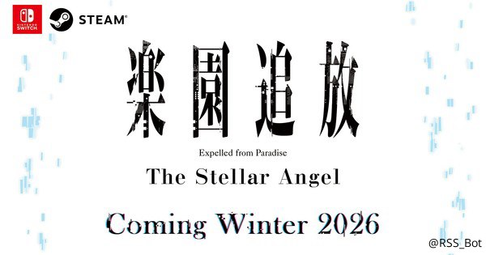

Expelled from Paradise Visual Novel Reveals Title, English Release

Visual novel launches for Switch, Steam in winter 2026

## animenewsnetwork_feed — post 41624

  

Spyair Performs Opening Theme for The Exiled Heavy Knight Knows How to Game the System Anime

Series airing for half year debuts on July 2

## animenewsnetwork_feed — post 41623

  

GATE 2: Tides of Conflict Anime Unveils New Visual, Vocaloid Event Collaboration for Ending Song

Winning submission for VOCALOID Collection Summer 2026 will be anime's ending song

## animenewsnetwork_feed — post 41622

3 Generations of Japanese Fans Welcome Star Wars' Return in Animated Short

Actor Hideaki Itō narrates short that spans 48 years

## animenewsnetwork_feed — post 41621

Detective Conan's Ran Mōri Voice Actress Wakana Yamazaki Dies at 61

Yamazaki took hiatus from role earlier this year to undergo medical treatment; Akemi Okamura takes over role

## animenewsnetwork_feed — post 41620

  

McDonald's Japan Rolls Out Saint Seiya Burgers

Burn your Cosmos at McDonald's

## animenewsnetwork_feed — post 41619

  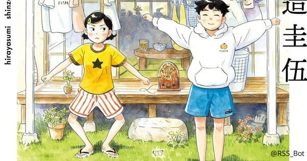

Hirayasumi, Land, Tokyo Alien Bros., More Nominated for Eisner Awards

Shintaro Kago 1-shots, Rintarō's autobiographical manga, Akira hardcover release also nominated

## animenewsnetwork_feed — post 41618

  

hololive Alternative Project's Holoearth Game to End Service on June 28

Game launched 1st public release in April 2025 after 3 years of limited beta testing

## animenewsnetwork_feed — post 41617

  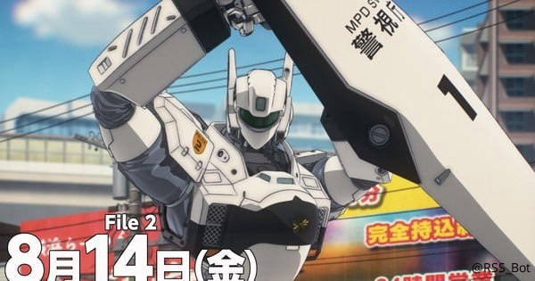

Patlabor EZY Anime Presents Trailer, Visual for 'File 2' Movie

"File 2" compiling anime's 4th to 6th episodes opens on August 14

---
📅 بروزرسانی: 1405/02/25 03:46
---

## Middle_East_Spectator — post 32080

— 🇺🇸/🇨🇳/🇮🇷 Reporter: ‘How does the administration aim to lower gas prices?’

Marco Rubio: ‘Iran cannot be allowed to have a nuclear weapon’

@Middle_East_Spectator

## Middle_East_Spectator — post 32079

— 🇺🇸/🇨🇳/🇮🇷 Reporter: ‘What exactly did President Trump ask President Xi for when it comes to Iran?’

Secretary of State Marco Rubio: ‘He didn’t ask him for anything. We’re not asking for China’s help, we don’t need their help. We made it clear that Iran cannot have a nuclear weapon.’

@Middle_East_Spectator

## Middle_East_Spectator — post 32078

  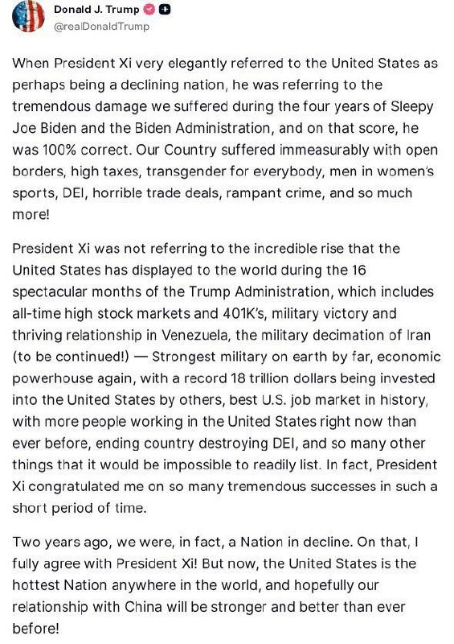

— 🇺🇸/🇨🇳/🇮🇷 NEW: President Trump writes a long post praising Xi Jinping, and says Iran’s military decimation will ‘be continued’

@Middle_East_Spectator

## DailyJapaneseThread — post 6703

  <a href="telegram/content/DailyJapaneseThread_6703_1778804166.mp4" target="_blank">🎬 Download video</a>

🎬 Video

## animenewsnetwork_feed — post 41616

  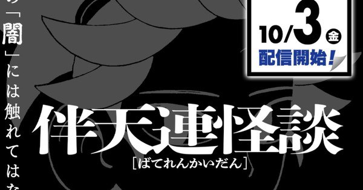

Yū Miki's The Bateren Tales Manga Resumes on May 22

Manga went on hiatus on February 6, starts final arc upon return

## animenewsnetwork_feed — post 41615

  

Odayaka Launches Manga Adaptation of Mashimesa Emoto's Novel Series

Odayaka draws manga of Emoto's Goodbye, Horrible Fiancé, Hello, Fun Magic School Life! light novel series

## animenewsnetwork_feed — post 41614

  

The Warrior Princess and the Barbaric King ‒ Episode 6

This is a very boobful episode in some kind of weird ways.

---
📅 بروزرسانی: 1405/02/25 00:32
---

## Deamnet — post 26579

✅ توی برنامه شیروخورشید . ایپی و دامنه زیر بزنید تا وصل بشه

ip : 151.101.0.223
sni : www.python.org

🐸@DeamNet

## Deamnet — post 26578

mitm-psiphon.zip

## Deamnet — post 26577

  <a href="https://t.me/DeamNet/26577" target="_blank">📎 Download file</a>

✅ برای ویندوز این روش به صورت یه پکیج گذاشتم آماده فقط کافیه سرتیفیکیت نصب و برنامه را اجرا کنید . آموزش پایین بخونید . 1-فایل certificate_generator.bat اجرا کنید تا سرتیفیکیت جدید ساخته بشه . اینتر بزنید تا از برنامه خارج بشه . 2-فایل mycert.crt که ساخته…

## Deamnet — post 26575

  <a href="telegram/content/Deamnet_26575_1778792555.webm" target="_blank">🎬 Download video</a>

✅ برای ویندوز این روش به صورت یه پکیج گذاشتم آماده فقط کافیه سرتیفیکیت نصب و برنامه را اجرا کنید . آموزش پایین بخونید . 1-فایل certificate_generator.bat اجرا کنید تا سرتیفیکیت جدید ساخته بشه . اینتر بزنید تا از برنامه خارج بشه . 2-فایل mycert.crt که ساخته…

## Configshub2 — post 1716944

تا وقتی اکی کنم کسی خواست کانفیگ بخره بره رباتمون

@EkhMelli4Bot

## Configshub2 — post 1716943

باز سرور به چوخ رف؟

## Configshub2 — post 1716942

  <a href="https://t.me/ConfigsHUB2/1716942" target="_blank">📎 Download file</a>

#nV
ᴄᴏɴғɪɢsʜᴜʙ ₪ ᴀʀɪʏᴀ ₪ ʙᴏᴛ ₪ ʜᴇʟᴘ

## Configshub2 — post 1716941

#v2ray

vless://4b616b6f-6f6c-4e65-7773-bff2e2048769@63.141.252.203:443?path=%2F&security=tls&encryption=none&insecure=1&type=ws&allowInsecure=1&sni=psychic-pancake-5vq6qr5jr5jrh4rvp-443.app.github.dev#[🏁]t.me/ConfigsHub

ᴄᴏᴜɴᴛʀʏ: #ᴜɴɪᴛᴇᴅsᴛᴀᴛᴇs(ᴜs)
ᴄᴏɴғɪɢsʜᴜʙ ₪ ᴀʀɪʏᴀ ₪ ʙᴏᴛ ₪ ʜᴇʟᴘ

## Configshub2 — post 1716940

#v2ray

vless://4b616b6f-6f6c-4e65-7773-bff2e2048769@50.7.5.83:443?path=%2F&security=tls&encryption=none&insecure=1&type=ws&allowInsecure=1&sni=psychic-pancake-5vq6qr5jr5jrh4rvp-443.app.github.dev#[🇮🇪]t.me/ConfigsHub

ᴄᴏᴜɴᴛʀʏ: #ɪʀᴇʟᴀɴᴅ(ɪᴇ)
ᴄᴏɴғɪɢsʜᴜʙ ₪ ᴀʀɪʏᴀ ₪ ʙᴏᴛ ₪ ʜᴇʟᴘ

## Configshub2 — post 1716939

  <a href="https://t.me/ConfigsHUB2/1716939" target="_blank">📎 Download file</a>

#nV
ᴄᴏɴғɪɢsʜᴜʙ ₪ ᴀʀɪʏᴀ ₪ ʙᴏᴛ ₪ ʜᴇʟᴘ

## Configshub2 — post 1716938

  <a href="https://t.me/ConfigsHUB2/1716938" target="_blank">📎 Download file</a>

#nV
ᴄᴏɴғɪɢsʜᴜʙ ₪ ᴀʀɪʏᴀ ₪ ʙᴏᴛ ₪ ʜᴇʟᴘ

## Configshub2 — post 1716937

  <a href="https://t.me/ConfigsHUB2/1716937" target="_blank">📎 Download file</a>

#nV
ᴄᴏɴғɪɢsʜᴜʙ ₪ ᴀʀɪʏᴀ ₪ ʙᴏᴛ ₪ ʜᴇʟᴘ

## Configshub2 — post 1716936

  <a href="https://t.me/ConfigsHUB2/1716936" target="_blank">📎 Download file</a>

#nV
ᴄᴏɴғɪɢsʜᴜʙ ₪ ᴀʀɪʏᴀ ₪ ʙᴏᴛ ₪ ʜᴇʟᴘ

## Configshub2 — post 1716935

  <a href="https://t.me/ConfigsHUB2/1716935" target="_blank">📎 Download file</a>

#nV
ᴄᴏɴғɪɢsʜᴜʙ ₪ ᴀʀɪʏᴀ ₪ ʙᴏᴛ ₪ ʜᴇʟᴘ

## Configshub2 — post 1716934

  <a href="https://t.me/ConfigsHUB2/1716934" target="_blank">📎 Download file</a>

#nV
ᴄᴏɴғɪɢsʜᴜʙ ₪ ᴀʀɪʏᴀ ₪ ʙᴏᴛ ₪ ʜᴇʟᴘ

## Configshub2 — post 1716933

  <a href="https://t.me/ConfigsHUB2/1716933" target="_blank">📎 Download file</a>

#nV
ᴄᴏɴғɪɢsʜᴜʙ ₪ ᴀʀɪʏᴀ ₪ ʙᴏᴛ ₪ ʜᴇʟᴘ

## Configshub2 — post 1716932

  <a href="https://t.me/ConfigsHUB2/1716932" target="_blank">📎 Download file</a>

#nV
ᴄᴏɴғɪɢsʜᴜʙ ₪ ᴀʀɪʏᴀ ₪ ʙᴏᴛ ₪ ʜᴇʟᴘ

## Configshub2 — post 1716931

  <a href="https://t.me/ConfigsHUB2/1716931" target="_blank">📎 Download file</a>

#nV
ᴄᴏɴғɪɢsʜᴜʙ ₪ ᴀʀɪʏᴀ ₪ ʙᴏᴛ ₪ ʜᴇʟᴘ

## Configshub2 — post 1716930

  <a href="https://t.me/ConfigsHUB2/1716930" target="_blank">📎 Download file</a>

#nV
ᴄᴏɴғɪɢsʜᴜʙ ₪ ᴀʀɪʏᴀ ₪ ʙᴏᴛ ₪ ʜᴇʟᴘ

## Configshub2 — post 1716929

  <a href="https://t.me/ConfigsHUB2/1716929" target="_blank">📎 Download file</a>

#nV
ᴄᴏɴғɪɢsʜᴜʙ ₪ ᴀʀɪʏᴀ ₪ ʙᴏᴛ ₪ ʜᴇʟᴘ

## Configshub2 — post 1716928

  <a href="https://t.me/ConfigsHUB2/1716928" target="_blank">📎 Download file</a>

#nV
ᴄᴏɴғɪɢsʜᴜʙ ₪ ᴀʀɪʏᴀ ₪ ʙᴏᴛ ₪ ʜᴇʟᴘ

## Configshub2 — post 1716927

  <a href="https://t.me/ConfigsHUB2/1716927" target="_blank">📎 Download file</a>

#nV
ᴄᴏɴғɪɢsʜᴜʙ ₪ ᴀʀɪʏᴀ ₪ ʙᴏᴛ ₪ ʜᴇʟᴘ

## Configshub2 — post 1716926

  <a href="https://t.me/ConfigsHUB2/1716926" target="_blank">📎 Download file</a>

#nV
ᴄᴏɴғɪɢsʜᴜʙ ₪ ᴀʀɪʏᴀ ₪ ʙᴏᴛ ₪ ʜᴇʟᴘ

## Configshub2 — post 1716925

  <a href="https://t.me/ConfigsHUB2/1716925" target="_blank">📎 Download file</a>

#nV
ᴄᴏɴғɪɢsʜᴜʙ ₪ ᴀʀɪʏᴀ ₪ ʙᴏᴛ ₪ ʜᴇʟᴘ

## sugoileaks — post 3980

  <a href="telegram/content/sugoileaks_3980_1778792563.mp4" target="_blank">🎬 Download video</a>

The real studio is on the list (:

## sugoileaks — post 3979

The real studio is on the list (:

## dangokimochi — post 11856

  

📷 Photo

## dangokimochi — post 11855

  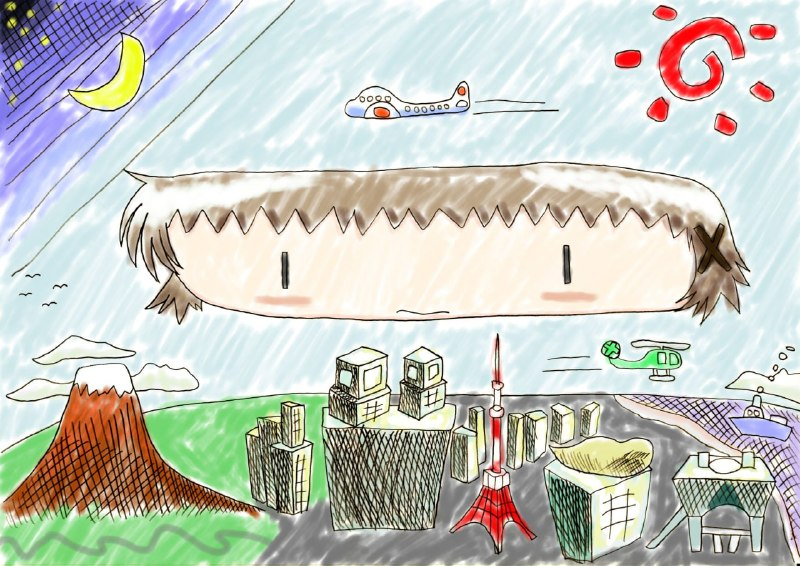

📷 Photo

## dangokimochi — post 11854

  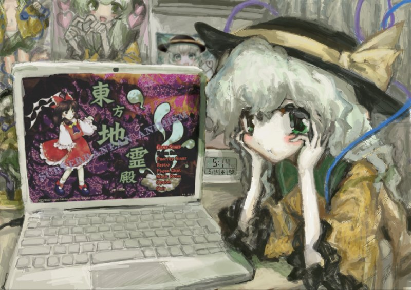

📷 Photo

## KiranTimes — post 1093

  <a href="telegram/content/KiranTimes_1093_1778792566.mp4" target="_blank">🎬 Download video</a>

یهود جنگ طلب وحشی هایل هیتلر صابون حاجی اون میدونست چه جونواریی هستن

## KiranTimes — post 1092

انبار نفت وقتی میزد که بارون قرار نبود بیاد:

لااقل یه وقتی میزدین که قراره بارون بیاد اون همه اون موقع بارون میومد هوا پاک بشه میدونی چند نفر مشکل تنفسی گرفتن

اسراییل وقتی جنگ شروع نمیکرد بعد ۷ اکتبر :
اینم از اسراییل گنده گوزتون خایه اینکارا رو نداره کلی یهودی صابون کردیم هیچ گوهی نخورد بزودی غرب رو فتح میکنیم

وقتی جنگ شروع کرد: یهود جنگ طلب وحشی هایل هیتلر صابون حاجی اون میدونست چه جونواریی هستن

وقتی غیر نظامی نمیزنه تجمعاتشون بگاد:
مردم غیور ما از بمب ترسی ندارن شیر بچه های حیدر از این مگسا نمیترسه

وقتی غیر نظامی بزنه تجمعاتشون بگاد: یا حسین به کدامین گناه غرب و اروپا حقوق بشرشون این بود؟! به داد ما برسید

پتروشیمی قبل عید میزد : کلی ادم توش بود یهودی قاتل

پتروشیمی توی عید میزد : بخاطر کمبود مواد پتروشیمی عید ها هم کارگران کار میکردن خدا لعنتشون کنه وقت اضافه کاری سخت تو این اوضاع عید از دیدن زنو بچشون گذشته بودن بیان نون در بیارن یهود کشتشون

اصلا اسراییلی وجود نداشت: یهود و صلیبی دشمن بشریته امریکا و اروپا و غرب باید نابود بشه

اصلا غربی وجود نداشت: چین و روسیه به همت الله بزودی فتح خواهد شد کافر های بی خدا ایغور کش کمونیست و صلیبیون روس و قفقازی تکه تکه میکنیم

اصلا کل دنیا مسلمون بود: سنی ها باید از روی زمین محو بشن وهابی های ناصبی حرامزاده به حق پهلوی فاطمه همشون میکشیم

اصلا کل دنیا شیعه بود: پیروان ایت الله کصکشتانی به اصل ولایت باور ندارند ولایت پذیر نیستند خوارج و کافرن بزودی همشون میکشیم یا علی این حرامیان روی زمین جایی ندارند

.........

## cyberfiend666 — post 32732

  <a href="telegram/content/cyberfiend666_32732_1778792568.mp4" target="_blank">🎬 Download video</a>

🎬 Video

## cyberfiend666 — post 32731

  <a href="telegram/content/cyberfiend666_32731_1778792571.mp4" target="_blank">🎬 Download video</a>

🎬 Video

## cyberfiend666 — post 32730

  <a href="telegram/content/cyberfiend666_32730_1778792573.mp4" target="_blank">🎬 Download video</a>

🎬 Video

## cyberfiend666 — post 32729

  <a href="telegram/content/cyberfiend666_32729_1778792575.mp4" target="_blank">🎬 Download video</a>

🎬 Video

## cyberfiend666 — post 32728

  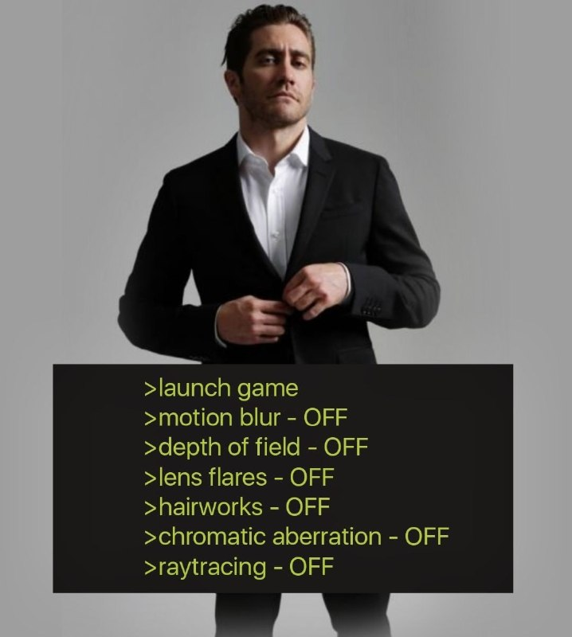

📷 Photo

## Middle_East_Spectator — post 32077

  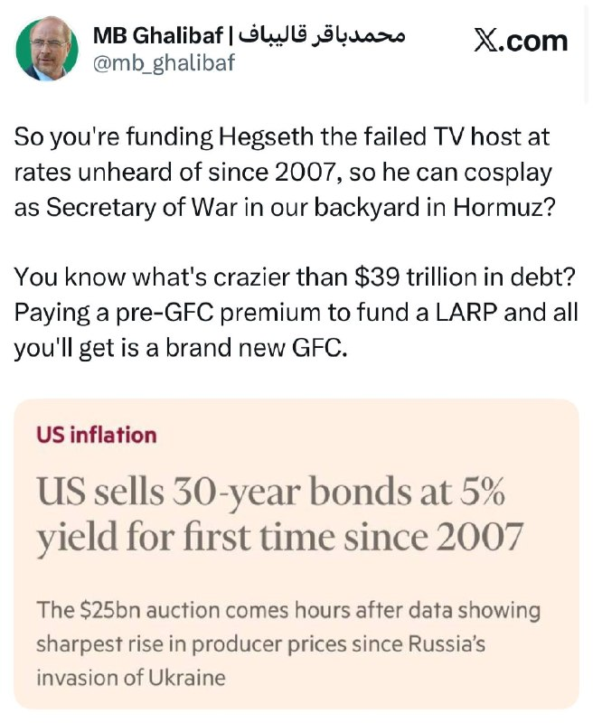

— 🇺🇸/🇮🇷 NEW: Iran’s Parliament Speaker, Mohammad Baqer Qalibaf, calls Pete Hegseth a failed TV host & says he does nothing but LARP and cosplay as Secretary of War

@Middle_East_Spectator

## Middle_East_Spectator — post 32076

—❗️🇮🇱/🇺🇸/🇮🇷 NEW: The IDF will enter the maximum state of alert, starting tomorrow, when Trump leaves China

@Middle_East_Spectator

## Middle_East_Spectator — post 32075

—❗️🇮🇱/🇮🇷/🇺🇸 NEW: Israeli President Isaac Herzog has canceled his trip to New York next week due to 'circumstances preventing the visit at this time’ – Yedioth Ahronoth

@Middle_East_Spectator

## Middle_East_Spectator — post 32074

  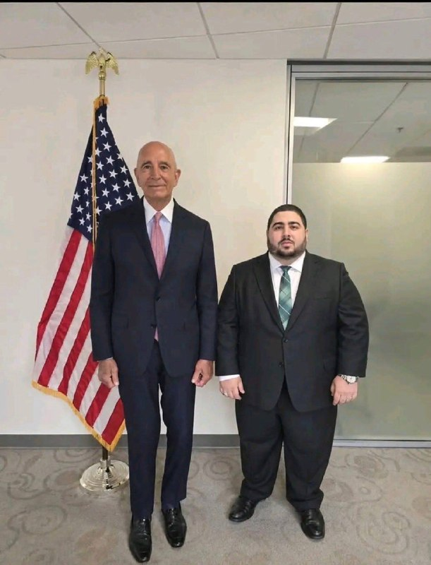

— 🇺🇸/🇸🇾 NEW: Syria’s new Chargé d’Affairs in Washington D.C., Mohammad Qanatari, meeting with U.S. special envoy Tom Barrack

@Middle_East_Spectator

## DailyJapaneseThread — post 6702

  

📷 Photo

## DailyJapaneseThread — post 6701

  <a href="telegram/content/DailyJapaneseThread_6701_1778792580.mp4" target="_blank">🎬 Download video</a>

im currently tapped into japanese sopranos

## animenewsnetwork_feed — post 41613

  

Classroom for Heroes Manga's Final Volume Ships This Winter

Manga launched in 2016

## animenewsnetwork_feed — post 41612

  

The Villainess Stans the Heroes' Tsubasa Takamatsu Launches New Manga

Takamatsu to launch Nagasare Reijō ni Okuru Makeinu Ōji kara no Honki no Love Song manga on May 27

## animenewsnetwork_feed — post 41611

  

Gyōmuyōmochi Launches New Manga in July

Artist to launch Mushagakuen Japanese fantasy manga

## animenewsnetwork_feed — post 41610

  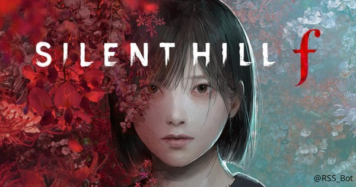

Silent Hill f Game Sells 2 Million Copies, Silent Hill 2 Remake Sells 6 Million Units Worldwide

Silent Hill f launched for PS5, Xbox, PC in September 2025

## animenewsnetwork_feed — post 41609

  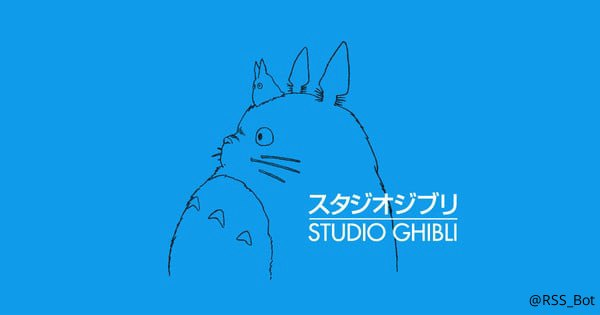

Studio Ghibli to Appoint Kenichi Yoda as Its New President in June

Current head Hiroyuki Fukuda to remain as board director, NTV Holdings president

---
📅 بروزرسانی: 1405/02/24 19:52
---

## anime_news — post 10218

(Sugoi) TV ANIME ADAPTATION for Park Saenal's Action Fantasy Web Novel / Webtoon "OVERGEARED" is currently ‘in production. Animation Studio: J.C.STAFF

## anime_news — post 10217

"Medaka Kuroiwa is Impervious to My Charms" Season 2 teaser PV

## anime_news — post 10216

  

"The Cat and the Dragon" TV anime new visual and PV. Begins in July

## anime_news — post 10215

  

"The Forsaken Saintess and her Foodie Roadtrip in Another World" TV anime key visual and PV. Begins in July

## Deamnet — post 26574

⚡️ با ترکیب کانفیگ Psiphon + MitM میتونید وصل بشید https://t.me/projectXhttp/346279 
🍍 همچنین اگه آخرین ورژن سایفون شیروخورشید نصب کنید و برید توی تنظیمات options بعد more options و connection protocols بزراید رو cdn fronting . بدون نیاز به ترکیب و نصب…

## Deamnet — post 26573

  <a href="telegram/content/Deamnet_26573_1778775758.webm" target="_blank">🎬 Download video</a>

⚡️ با ترکیب کانفیگ Psiphon + MitM میتونید وصل بشید https://t.me/projectXhttp/346279 
🍍 همچنین اگه آخرین ورژن سایفون شیروخورشید نصب کنید و برید توی تنظیمات options بعد more options و connection protocols بزراید رو cdn fronting . بدون نیاز به ترکیب و نصب…

## Deamnet — post 26572

✅ برای ویندوز این روش به صورت یه پکیج گذاشتم آماده فقط کافیه سرتیفیکیت نصب و برنامه را اجرا کنید . آموزش پایین بخونید .

1-فایل certificate_generator.bat اجرا کنید تا سرتیفیکیت جدید ساخته بشه . اینتر بزنید تا از برنامه خارج بشه .

2-فایل mycert.crt که ساخته شد اجرا کنید یا روش کلیک راست و گزینه install certificate بزنید . یک صفحه باز میشه روی دکمه install certificate بزنید . گزینه local machine انتخاب کنید و next بزنید . گزینه place all certificate in the following store انتخاب کنید و دکمه browse بزنید . فولدر trusted root certification authorities انتخاب و ok بزنید . دکمه next بزنید . و دکمه finish بزنید . صبر کنید تا پیام نصب بیاد و ok بزنید .

3-بعد از نصب فایل run.bat اجرا کنید . که هسته xray و psiphon اجرا میکنه . کمی صبر کنید تا متصل بشه .

4- بعد از اتصال میتونید از پراکسی های socks5 و http توی تلگرام یا هرجای دیگه استفاده کنید .

http : 127.0.0.1:8060
socks5 : 127.0.0.1:8050

💡 برا اولین اتصال یه چند دقیقه صبر کنید تا سرور پیدا کنه .
⬇️ لینک دانلود پکیج ترکیب کانفیگ Psiphon + MitM برای ویندوز.

🌽@DeamNet

## Deamnet — post 26571

⚡️ با ترکیب کانفیگ Psiphon + MitM میتونید وصل بشید

https://t.me/projectXhttp/346279

🍍 همچنین اگه آخرین ورژن سایفون شیروخورشید نصب کنید و برید توی تنظیمات options بعد more options و connection protocols بزراید رو cdn fronting . بدون نیاز به ترکیب و نصب سرتیفیکت مستقیم وصل میشه

🌐 لینک گیتهاب سایفون شیروخورشید.

⬇️ لینک آخرین ورژن سایفون شیروخورشید قابل دانلود.

✅ برای به اشتراک گذاری هم اگه گزینه share proxy on network روشن کنید . بعد از اتصال توی همون صفحه اصلی 2 تا پروکسی http و socks5 میده بهتون که هر دستگاهی به همون شبکه وصل باشه میتونه از اون پراکسی ها استفاده کنه .

🐊@DeamNet

## Configshub2 — post 1714401

#v2ray

vless://ff8ed07c-f05e-4343-9307-6dbb644d2ce5@94.182.169.82:8085?security=none&allowInsecure=0&encryption=none&type=tcp&host=telewebion.com&path=/&headerType=http#[🇮🇷]t.me/ConfigsHub

ᴄᴏᴜɴᴛʀʏ: #ɪʀᴀɴ(ɪʀ)
ᴄᴏɴғɪɢsʜᴜʙ ₪ ᴀʀɪʏᴀ ₪ ʙᴏᴛ ₪ ʜᴇʟᴘ

## Configshub2 — post 1714400

  <a href="https://t.me/ConfigsHUB2/1714400" target="_blank">📎 Download file</a>

#nV
ᴄᴏɴғɪɢsʜᴜʙ ₪ ᴀʀɪʏᴀ ₪ ʙᴏᴛ ₪ ʜᴇʟᴘ

## Configshub2 — post 1714399

  <a href="https://t.me/ConfigsHUB2/1714399" target="_blank">📎 Download file</a>

#nV
ᴄᴏɴғɪɢsʜᴜʙ ₪ ᴀʀɪʏᴀ ₪ ʙᴏᴛ ₪ ʜᴇʟᴘ

## Configshub2 — post 1714398

  <a href="https://t.me/ConfigsHUB2/1714398" target="_blank">📎 Download file</a>

#nV
ᴄᴏɴғɪɢsʜᴜʙ ₪ ᴀʀɪʏᴀ ₪ ʙᴏᴛ ₪ ʜᴇʟᴘ

## Configshub2 — post 1714397

  <a href="https://t.me/ConfigsHUB2/1714397" target="_blank">📎 Download file</a>

#nV
ᴄᴏɴғɪɢsʜᴜʙ ₪ ᴀʀɪʏᴀ ₪ ʙᴏᴛ ₪ ʜᴇʟᴘ

## Configshub2 — post 1714396

  <a href="https://t.me/ConfigsHUB2/1714396" target="_blank">📎 Download file</a>

#nV
ᴄᴏɴғɪɢsʜᴜʙ ₪ ᴀʀɪʏᴀ ₪ ʙᴏᴛ ₪ ʜᴇʟᴘ

## Configshub2 — post 1714395

  <a href="https://t.me/ConfigsHUB2/1714395" target="_blank">📎 Download file</a>

#nV
ᴄᴏɴғɪɢsʜᴜʙ ₪ ᴀʀɪʏᴀ ₪ ʙᴏᴛ ₪ ʜᴇʟᴘ

## Configshub2 — post 1714394

  <a href="https://t.me/ConfigsHUB2/1714394" target="_blank">📎 Download file</a>

#nV
ᴄᴏɴғɪɢsʜᴜʙ ₪ ᴀʀɪʏᴀ ₪ ʙᴏᴛ ₪ ʜᴇʟᴘ

## Configshub2 — post 1714393

#v2ray

vless://361e4175-4619-4509-992c-dd1ae17caceb@snapp.ir:2082?encryption=none&type=ws&path=/xkto6odtk756f&host=fr.fcserver.ir#[🇮🇷]t.me/ConfigsHub

ᴄᴏᴜɴᴛʀʏ: #ɪʀᴀɴ(ɪʀ)
ᴄᴏɴғɪɢsʜᴜʙ ₪ ᴀʀɪʏᴀ ₪ ʙᴏᴛ ₪ ʜᴇʟᴘ

## Configshub2 — post 1714392

#v2ray

ss://Y2hhY2hhMjAtaWV0Zi1wb2x5MTMwNTpBUmd2R1p5d0ErZ2FjZ0dWMjZCdm11MDUrd1ptUlcvaitBZFUrWjhCdDQ0PQ@203.23.128.92:990#[🇴🇳]t.me/ConfigsHub

ᴄᴏᴜɴᴛʀʏ: #ʜᴏɴɢᴋᴏɴɢ(ʜᴋ)
ᴄᴏɴғɪɢsʜᴜʙ ₪ ᴀʀɪʏᴀ ₪ ʙᴏᴛ ₪ ʜᴇʟᴘ

## Configshub2 — post 1714391

#v2ray

vless://f3ef1255-1807-45d5-8872-324c6943175b@iman.neticoapp.ir:80?path=/&security=&encryption=none&host=srv3.diamond-tech.online&type=ws#[🇮🇷]t.me/ConfigsHub

ᴄᴏᴜɴᴛʀʏ: #ɪʀᴀɴ(ɪʀ)
ᴄᴏɴғɪɢsʜᴜʙ ₪ ᴀʀɪʏᴀ ₪ ʙᴏᴛ ₪ ʜᴇʟᴘ

## Configshub2 — post 1714390

#v2ray

vless://a0b067ac-162d-4237-956d-10b8b471d3f5@54.37.75.187:443?encryption=none&flow=xtls-rprx-vision&fp=chrome&pbk=DHsthrDRMCGcOyJd4xTce_4CCSAJZGwxCdfNrkB_Pgs&security=reality&sid=479826bdfc3eb86e&sni=www.speedtest.net&type=tcp#[🇩🇪]t.me/ConfigsHub

ᴄᴏᴜɴᴛʀʏ: #ɢᴇʀᴍᴀɴʏ(ᴅᴇ)
ᴄᴏɴғɪɢsʜᴜʙ ₪ ᴀʀɪʏᴀ ₪ ʙᴏᴛ ₪ ʜᴇʟᴘ

## Configshub2 — post 1714389

  <a href="https://t.me/ConfigsHUB2/1714389" target="_blank">📎 Download file</a>

#nV
ᴄᴏɴғɪɢsʜᴜʙ ₪ ᴀʀɪʏᴀ ₪ ʙᴏᴛ ₪ ʜᴇʟᴘ

## Configshub2 — post 1714388

  <a href="https://t.me/ConfigsHUB2/1714388" target="_blank">📎 Download file</a>

#nV
ᴄᴏɴғɪɢsʜᴜʙ ₪ ᴀʀɪʏᴀ ₪ ʙᴏᴛ ₪ ʜᴇʟᴘ

## Configshub2 — post 1714387

#v2ray

vless://394f6981-a782-4779-9a85-e6cf22935d93@84.17.37.19:8443?allowInsecure=1&alpn=h2&encryption=none&security=tls&sni=hkg1.fromblancwithlove.com&type=tcp#[🇴🇳]t.me/ConfigsHub

ᴄᴏᴜɴᴛʀʏ: #ʜᴏɴɢᴋᴏɴɢ(ʜᴋ)
ᴄᴏɴғɪɢsʜᴜʙ ₪ ᴀʀɪʏᴀ ₪ ʙᴏᴛ ₪ ʜᴇʟᴘ

## Configshub2 — post 1714386

#v2ray

vless://ecc19b72-2cc8-4690-b23d-960d3e3c6d40@172.64.146.118:8443?path=TELEGRAM-MARAMBASHI%2F%3Fed%3D2048&security=tls&encryption=none&host=pardazeshvpn-tg24.pages.dev&fp=random&type=ws&sni=pardazeshvpn-tg24.pages.dev#[🇨🇦]t.me/ConfigsHub

ᴄᴏᴜɴᴛʀʏ: #ᴄᴀɴᴀᴅᴀ(ᴄᴀ)
ᴄᴏɴғɪɢsʜᴜʙ ₪ ᴀʀɪʏᴀ ₪ ʙᴏᴛ ₪ ʜᴇʟᴘ

## Configshub2 — post 1714385

#v2ray

vless://9ea9e54b-d4da-4773-855a-e5371e4da946@snapp.ir:80?path=%2F&security=none&encryption=none&host=hubfile.zpax.ir&type=ws#[🇮🇷]t.me/ConfigsHub

ᴄᴏᴜɴᴛʀʏ: #ɪʀᴀɴ(ɪʀ)
ᴄᴏɴғɪɢsʜᴜʙ ₪ ᴀʀɪʏᴀ ₪ ʙᴏᴛ ₪ ʜᴇʟᴘ

## Configshub2 — post 1714384

#v2ray

vless://145626c5-6653-4a05-9a1e-42c16a5e2b31@varzesh3.com:80?encryption=none&host=dg.restaurantzone.ir&path=/private&security=none&type=ws#[🇮🇷]t.me/ConfigsHub

ᴄᴏᴜɴᴛʀʏ: #ɪʀᴀɴ(ɪʀ)
ᴄᴏɴғɪɢsʜᴜʙ ₪ ᴀʀɪʏᴀ ₪ ʙᴏᴛ ₪ ʜᴇʟᴘ

## Configshub2 — post 1714383

#v2ray

vless://245943b8-c164-40c2-8ba5-05094e33dded@varzesh3.com:80?path=/&security=none&encryption=none&host=proto.helexm.ir&type=ws#[🇮🇷]t.me/ConfigsHub

ᴄᴏᴜɴᴛʀʏ: #ɪʀᴀɴ(ɪʀ)
ᴄᴏɴғɪɢsʜᴜʙ ₪ ᴀʀɪʏᴀ ₪ ʙᴏᴛ ₪ ʜᴇʟᴘ

## Configshub2 — post 1714382

#v2ray

vless://c7ba57bf-0418-4b66-89bb-d320b5cdd8e5@45.12.111.151:443?flow=xtls-rprx-vision&encryption=none&type=tcp&security=reality&fp=chrome&sni=store.steampowered.com&pbk=Z--Ieq3GtHx_Qtqj3NUyK5wY2foVBtlOkyzXqESeswU&sid=0c80cc39#[🇨🇭]t.me/ConfigsHub

ᴄᴏᴜɴᴛʀʏ: #sᴡɪᴛᴢᴇʀʟᴀɴᴅ(ᴄʜ)
ᴄᴏɴғɪɢsʜᴜʙ ₪ ᴀʀɪʏᴀ ₪ ʙᴏᴛ ₪ ʜᴇʟᴘ

## sugoileaks — post 3978

LEAK: "THE ICEBLADE SORCERER SHALL RULE THE WORLD"

Based On The Fantasy Adventure LN by Nana Mikoshiba & Riko Korie, Centers After winning a terrible war, Iceblade Sorcerer Ray White decides to enroll in Arnold Academy, but in the guise of a commoner, causing those with higher class upbringings to look down on him.
Despite this, he manages to make friends quickly and must solve a conspiracy that plagues the school.

## sugoileaks — post 3977

LEAK: "OVERGEARED"

Based On The Fantasy Action Adventure Manhwa By Park Saenal.

SUMMARY:
The Story Centers on Shin Youngwoo (a.k.a. Grid), an unlucky man in life and a low-level player in the popular VR game “Satisfy,” finds a powerful item that earns him a rare legendary class title: “Pagma’s Successor.”
He’s now a skilled blacksmith who can forge unique weapons and equip the game’s most powerful gear.
Grid resolves to use his new abilities to achieve fame and fortune, but as his very existence begins to stir up trouble in Satisfy, he realizes that life as a legend may be more than he bargained for….

## sugoileaks — post 3976

  <a href="telegram/content/sugoileaks_3976_1778775761.mp4" target="_blank">🎬 Download video</a>

The real studio is on the list (:

## sugoileaks — post 3975

  <a href="telegram/content/sugoileaks_3975_1778775761.mp4" target="_blank">🎬 Download video</a>

The real studio is on the list (:

## sugoileaks — post 3974

## sugoileaks — post 3973

  <a href="telegram/content/sugoileaks_3973_1778775762.mp4" target="_blank">🎬 Download video</a>

First PV for upcoming romance fantasy light anime "SAVED BY THE ICE COLD PRINCE'S EMBRACE"

The LA will premiere in July 2026!

Studios: IMAGICA INFOS × IMAGEWORKS STUDIO
FYI: Light anime meaning it's a manga panel anime meaning it's a manga panel with movement / voices / sound effects!

Main Cast:
Katrina | CV: Miku Ito
Clarence | CV: Yohei Azakami

Based On The Fantasy Romance Manga by Yakiimohokuhoku & Kusabi Kurokawa.

SUMMARY:
The Story Centers on Katrina, As the illegitimate daughter of a count and his maid, Katrina was born into miserable circumstances.
And now that she's lost her mother, the treatment from her stepsister and stepmother the countess has only grown worse.
One day, her stepsister receives a royal order to move to the northern outskirts due to her unseemly behavior at a recent party.
There, she is to learn proper conduct under the tutelage of the resident prince, rumored to be a cruel man.
Not wanting to subject her daughter to such punishment, the countess decides to send Katrina instead.
Katrina arrives in the north shaking in fear.
But contrhary to the stories, the "merciless and cold-hearted" prince is kinder than she believed.
Might the pure-hearted Katrina find love in the wintry countryside?

STAFF:
Directors: Yūsuke Morishita & Stainlab
Sound Director: Yoshiyuki Oguri
Sound Production: ASLEBEN
Sound Effects: Hiromune Kurahashi
Coordinating Productio: Kazuya Takahashi
Title Logo Design: Yukino Kinoshita & Bay Bridge Studio

## sugoileaks — post 3972

  <a href="telegram/content/sugoileaks_3972_1778775764.mp4" target="_blank">🎬 Download video</a>

New FINAL PV for the upcoming anime movie 3 of "THE MONONOKE CHAPTER 3 - Snake God"

The 3rd Movie will be out on May 29, 2026!!

Studios: KAFKA × EOTA
Director: Tomoaki Koshida

## sugoileaks — post 3971

  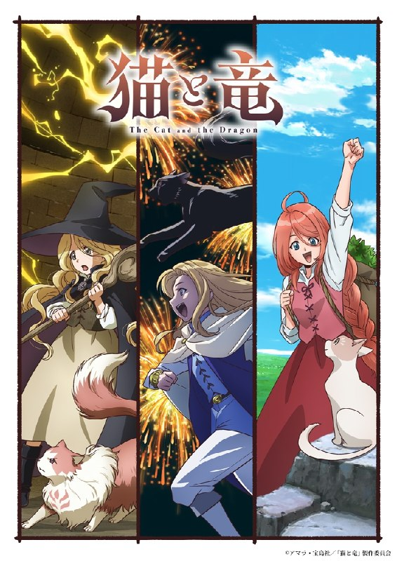

New KV & PV for upcoming fantasy anime "THE CAT AND THE DRAGON" The anime will premiere in July 2026!! Studio: OLM Main Cast: Nekoryuu | CV: Takehito Koyasu Mama-nyan | CV: Kikuko Inoue Shirotae | CV: Fuka Izumi Kurobane | CV: Show Hayami Haibuchi | CV:…

## sugoileaks — post 3970

  <a href="telegram/content/sugoileaks_3970_1778775766.mp4" target="_blank">🎬 Download video</a>

New KV & PV for upcoming fantasy anime "THE CAT AND THE DRAGON"

The anime will premiere in July 2026!!

Studio: OLM

Main Cast:
Nekoryuu | CV: Takehito Koyasu
Mama-nyan | CV: Kikuko Inoue
Shirotae | CV: Fuka Izumi
Kurobane | CV: Show Hayami
Haibuchi | CV: Noriaki Sugiyama
Chiikuro | CV: Maki Kawase
Kurotama | CV: Shinnosuke Tokudome

New Cast:
Gally | CV: Atsumi Tanezaki
Anne Rossa | CV: Chika Anzai
Stan | CV: Junya Enoki

Based on The popular Fantasy Web Novel & Manga Series by Sasaki Izumi & Amara & Okuma Mai.

SUMMARY:
The Story Centers Many years ago, a dragon hatched inside a cave where a family Of cats lived.
Encountering the baby dragon, the cats decide to raise it as one of their own.
As years passed and the cats left him behind, he grows and vows to protect them.
However, after seeing cats that were killed by humans for their fur, the dragon takes revenge, killing the adventurers who killed the cats.
However, after an encounter with another cat, who reminded him of his past, he develops a cat-like form.

STAFF:
Director: Jinkoo Oh
Series Comp: Mitsutaka Hirota
Character Design: Rie Nishino & Chiaki Kurakazu
Music: Takahiro Obata
Sound Director: Noriyoshi Konuma

## sugoileaks — post 3969

  <a href="telegram/content/sugoileaks_3969_1778775768.mp4" target="_blank">🎬 Download video</a>

First KV&PV for the upcoming teasing Romcom Anime "MEDAKA KUROIWA IS IMPERVIOUS TO MY CHARMS" No Date Yet!! Studio: SynergySP Based on the Youth Romcom Manga by Kuze Ran, Centers on Mona, a class beauty who's trying her best to make Medaka, a stoic male…

## sugoileaks — post 3968

  

First KV&PV for the upcoming teasing Romcom Anime "MEDAKA KUROIWA IS IMPERVIOUS TO MY CHARMS"

No Date Yet!!

Studio: SynergySP

Based on the Youth Romcom Manga by Kuze Ran, Centers on Mona, a class beauty who's trying her best to make Medaka, a stoic male classmate fall in love with her.
While she's gradually getting more & more frustrated that her tantalizing teasing has seemingly no effect on him, Medaka in turn is in fact having a tough internal struggle with himself.

▼ SEASON 2 STAFF:
Director: Yoshiaki Okumura
🆕Series Comp. & Screenplay: Yoriko Tomita (Replacing Kazuyuki Fudeyasu)
Character Design: Mayumi Watanabe
Sound Directors: Noriyoshi konuma & Nozomi Nakatani
Color Design: Aiko Yamagami
🆕Director of Photography: Shinichiro Nagano (Replacing Tetsuya Nishimura)
🆕Art Director: Hiroki Matsumoto (Replacing Masakazu Miyake)
Music: Akiyuki Tateyama

## sugoileaks — post 3967

  <a href="telegram/content/sugoileaks_3967_1778775770.mp4" target="_blank">🎬 Download video</a>

New PV for the upcoming original anime "MOBIUS DUST"

The anime will premiere in July 2026!!

ICYMI: The OG Anime Was first announced in 2019 as a part of Project ANIMA, along with Sakugan & Mahonare.

Studio: DOGA KUBO
Director: Tarou Iwasaki
Series Comp.: Yoriko Tomita

OP Titled "MEBIUS" By Leo Ieiri.

Main Cast:
Araki | CV: Yuto Takenaka
Stella | CV: Nene Hieda
Olga | CV: Haruka Sato

SUMMARY:
The Story is Set in 2000, Mobius meteorites fell on Earth and permeated atmosphere which led to economic disparity in Japan.
Amidst that, police established the anti-RC special mobile unit & training school.
Araki, Stella, & Olga are high school students living in a cozy downtown neighborhood.
Playing games, visiting the bathhouse, and heading home - this is the story of their everyday lives… or is there more to it?

## sugoileaks — post 3966

  

New KV & PV for upcoming josei fantasy adventure anime "THE FORSAKEN SAINTESS AND HER FOODIE ROADTRIP IN ANOTHER WORLD" The Anime will Premiere in July 2026!! Studio: EMT SQUARED Theme Songs: OP Titled "BUTTERFLY" By INUWASI. ED Titled "HOLY SWEET HOME"…

## sugoileaks — post 3965

  <a href="telegram/content/sugoileaks_3965_1778775772.mp4" target="_blank">🎬 Download video</a>

New KV & PV for upcoming josei fantasy adventure anime "THE FORSAKEN SAINTESS AND HER FOODIE ROADTRIP IN ANOTHER WORLD"

The Anime will Premiere in July 2026!!

Studio: EMT SQUARED

Theme Songs:
OP Titled "BUTTERFLY" By INUWASI.
ED Titled "HOLY SWEET HOME" By ONKAN LEMONADE.

Main Cast:
Rin Takanashi | CV: Sora Tokui
Vil | CV: Yuki Ono

New Cast:
Aria | CV: Sumire Morohoshi
Ed | CV: Shoya Chiba
Senon | CV: Shinnosuke Tachibana
Gomamiso | CV: Kaede Hondo

Based on The Josei Fantasy Adventure Romcom by Yoneari & Akane Nitou.

SUMMARY:
The Story Centers on Rin Takanashi, a Caregiver in her thirties, was unceremoniously discarded as "Trash" despite being summoned as a saint.
However, as a lover of the great outdoors and all things camping, she was blessed with a special skill, [Survival], as well as another unique skill!
Thus, a riveting tale begins: one of sweat, tears, and insatiable hunger as Rin, together with companions she picked up along the way, leisurely explores this parallel world and savours gourmet cuisine to her heart's content...
Or so the story should have gone, but it looks like their road is going in an unexpected direction...?

STAFF:
Director: Atsushi Nigorikawa
Series Comp.: Takashi Aoshima
Character Design: Izumi Ishii
Sound Director: Hiroto Morishita
Sound Production: BIT GROOOVE PROMOTION.
Music: Kana Utatane
Music Production: LANTIS
Production Cooperation: Ankichi Kobo

## sugoileaks — post 3964

  <a href="telegram/content/sugoileaks_3964_1778775774.mp4" target="_blank">🎬 Download video</a>

NEW INFO NEXT MONTH: "KUROIWA MEDALA IS IMPERVIOUS TO MY CHARMS"

## dangokimochi — post 11853

  

📷 Photo

## dangokimochi — post 11852

  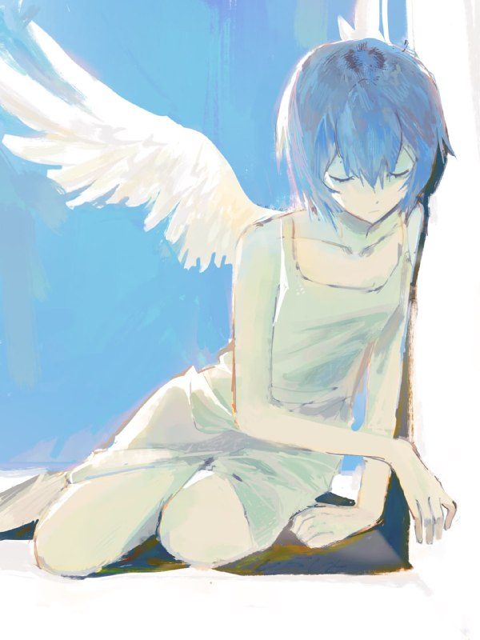

📷 Photo

## nextmemes — post 10742

  <a href="telegram/content/nextmemes_10742_1778775776.mp4" target="_blank">🎬 Download video</a>

🎬 Video

## KiranTimes — post 1091

  <a href="telegram/content/KiranTimes_1091_1778775777.mp4" target="_blank">🎬 Download video</a>

🎬 Video

## KiranTimes — post 1090

  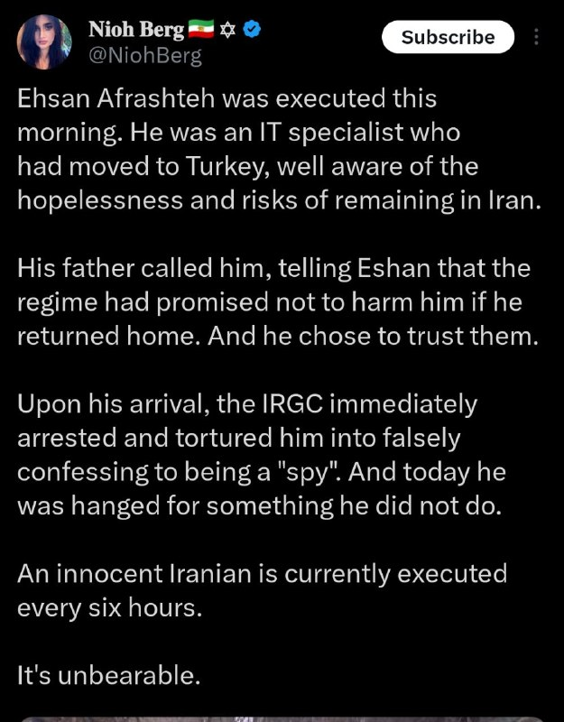

📷 Photo

## KiranTimes — post 1089

  

📷 Photo

## KiranTimes — post 1088

  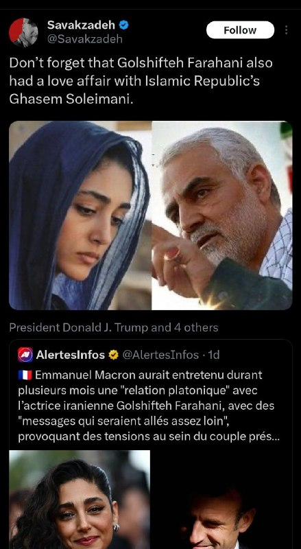

📷 Photo

## KiranTimes — post 1087

  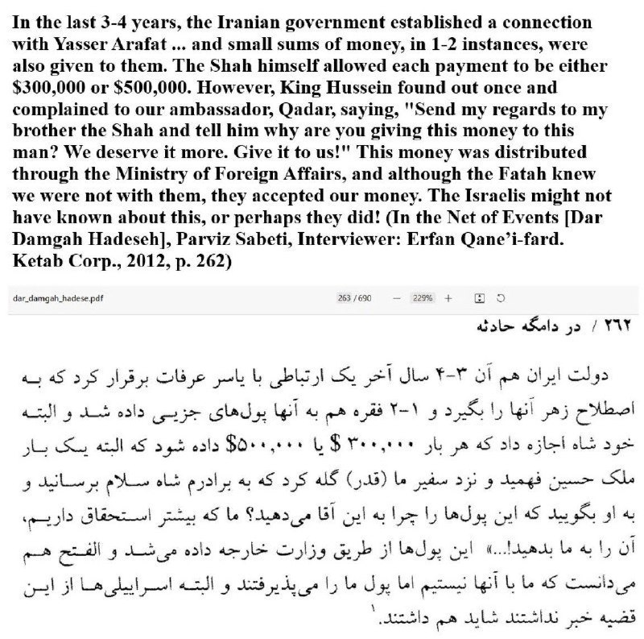

📷 Photo

## KiranTimes — post 1086

  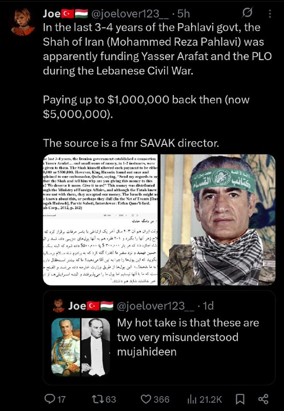

📷 Photo

## KiranTimes — post 1085

  <a href="telegram/content/KiranTimes_1085_1778775780.mp4" target="_blank">🎬 Download video</a>

"بله ما متفاوت هستیم"

## KiranTimes — post 1084

من مادر اون کانال میم و انیمه بامزه ای رو گاییدم که

ارشانی که خودشو واسه اخوند همین الانشم دار میزنه و دارو دسته سپاهی مادرجنده

اومدن پشت این کانال بامزه و با این عقیده (نه به ج ا و نه به مخالف ج ا)
"بله ما متفاوت هستیم"

کیر ج ا رو میکنن تو کس ننشون و رزمایش سپاهو تو کانالشون میذارن

تماما پروفشونم انگار حاجی زاده و قآنی انتخاب کردن
ولی طرف ج ا نیستن*

## cyberfiend666 — post 32727

  

📷 Photo

## cyberfiend666 — post 32726

  <a href="telegram/content/cyberfiend666_32726_1778775782.mp4" target="_blank">🎬 Download video</a>

🎬 Video

## cyberfiend666 — post 32725

  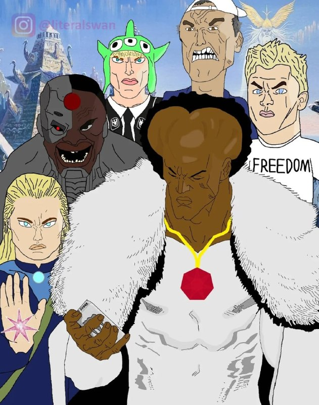

📷 Photo

## khomeinichan — post 21420

https://www.youtube.com/watch?v=JRnoi3repjo

## Middle_East_Spectator — post 32073

— 🇮🇷 Iran’s Foreign Minister, Abbas Araqchi: ‘The Strait of Hormuz is open for anyone that isn’t an enemy of Iran. You just need to pay the tolls.’

@Middle_East_Spectator

## Middle_East_Spectator — post 32072

— 🇺🇸/🇨🇳/🇮🇷 President Trump: ‘Chairman Xi is a great friend of mine. They [China] have promised they won’t send any military equipment to Iran’

@Middle_East_Spectator

## Middle_East_Spectator — post 32071

— 🇸🇦/🇺🇸/🇮🇷 NEW: Saudi Arabia told Trump the war in Iran should be ended and the Strait of Hormuz should be open, citing ‘immeasurable economic losses’ if the situation continues

@Middle_East_Spectator

## Middle_East_Spectator — post 32070

— 🇮🇷/🇸🇦 NEW: Saudi Arabia wants to sign a non-aggression pact with Iran @Middle_East_Spectator

## Middle_East_Spectator — post 32069

— 🇮🇷/🇨🇳/🇺🇸 NEW: Iran has started to allow Chinese ships to pass the Strait of Hormuz after paying tolls

In China, where the FM said they reject the concept of tolls, the fee is being framed as a fee for ‘environmental and logistical upkeeping costs’.

By allowing Chinese ships to transit the Strait of Hormuz, Iran has effectively neutralized the leverage that Trump held over China during his visit.

Trump planned to pressure Iran, with the help of China, to open the Strait. But now that Chinese vessels are transiting freely, China won’t feel the need to be on board with this pressure.

@Middle_East_Spectator

## Middle_East_Spectator — post 32068

— 🇮🇷/🇸🇦 NEW: Saudi Arabia wants to sign a non-aggression pact with Iran

@Middle_East_Spectator

## Middle_East_Spectator — post 32066

  <a href="telegram/content/Middle_East_Spectator_32066_1778775786.mp4" target="_blank">🎬 Download video</a>

— 🇮🇱/
🇮🇷 WATCH: Two more FPV videos from Hezbollah, targeting soldiers and targeting a van

@Middle_East_Spectator

## Middle_East_Spectator — post 32064

— 🇮🇱/
🇮🇷 WATCH: In this video, Hezbollah carried out a combined FPV attack against multiple Israeli targets in southern Lebanon They struck an Israeli military SUV, killing those inside; they struck a Merkava tank, and they destroyed an IDF command truck.…

## Middle_East_Spectator — post 32063

— 🇮🇱/
🇮🇷 WATCH: In this video, Hezbollah carried out a combined FPV attack against multiple Israeli targets in southern Lebanon

They struck an Israeli military SUV, killing those inside; they struck a Merkava tank, and they destroyed an IDF command truck.

In the video, the targets can be seen burning (filmed with other FPV drones), indicating successful hits.

@Middle_East_Spectator

## Middle_East_Spectator — post 32059

— 🇮🇱/
🇮🇷 NEW: Hezbollah continues to upload videos of its FPV drone attacks against Israeli vehicles, showing a massive increase of hits in past weeks

@Middle_East_Spectator

## Middle_East_Spectator — post 32058

  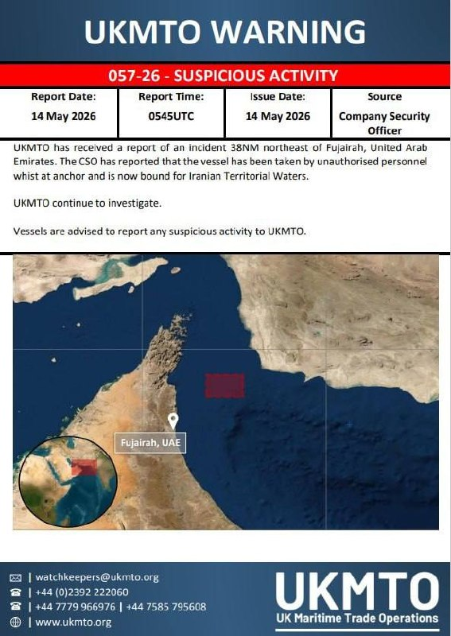

—❗️🇺🇸/🇮🇷 BREAKING: Iran has boarded and seized a vessel off the coast of Fujairah, UAE

The vessel is being redirected towards Iranian territorial waters.

@Middle_East_Spectator

## LiveMuseumOfIgnorancy — post 11508

  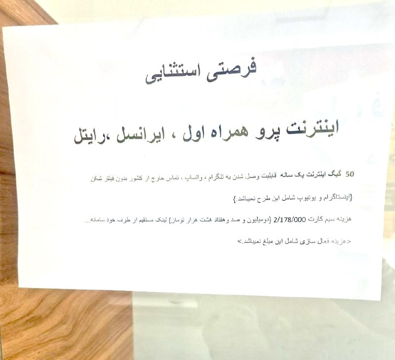

📷 Photo

## DailyJapaneseThread — post 6700

  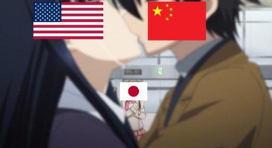

📷 Photo

## DailyJapaneseThread — post 6699

## animenewsnetwork_feed — post 41608

  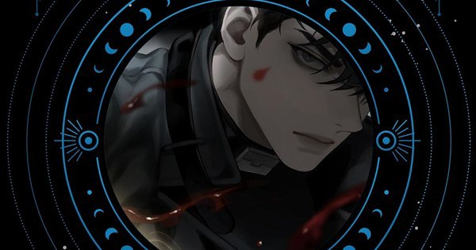

Omniscient Reader's Viewpoint Volume 3 Novel Review

When is a little knowledge more of a problem than none at all?

## animenewsnetwork_feed — post 41607

  

Manga UP! Global Adds The Cruel King I'm Marrying as a Substitute Bride is My First Love?! Manga

English version launched on Wednesday

## animenewsnetwork_feed — post 41606

  

This Week in Anime - Robots in Plain Sight

Chris and Coop aren't technically violating the "no Transformers" rule if the robot cartoons are Korean, right?

## animenewsnetwork_feed — post 41605

  

One Peace Books Licenses My Sweet Marriage to My Ex-Nemesis Manga

1st volume ships in March 2027

## animenewsnetwork_feed — post 41604

  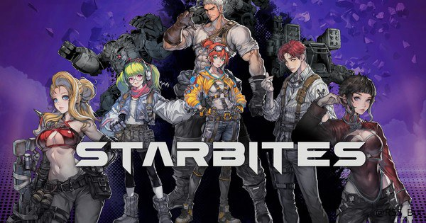

STARBITES Game Review

There's a reliable, well-tuned motor under the hood of this title.

## animenewsnetwork_feed — post 41603

  

Always a Catch! ‒ Episode 7

For everyone who’s been waiting to see Mimi use her hair pin as a weapon, this episode’s for you.

## animenewsnetwork_feed — post 41602

  

Saved by the Ice Cold Prince's Embrace Light Anime's Teaser Unveils Cast, Staff

Miku Itō, Yōhei Azakami star in July light anime from I Want to Live a Long Life to Dote on My Favorite Stepbrother's Yūsuke Morishita

## animenewsnetwork_feed — post 41601

  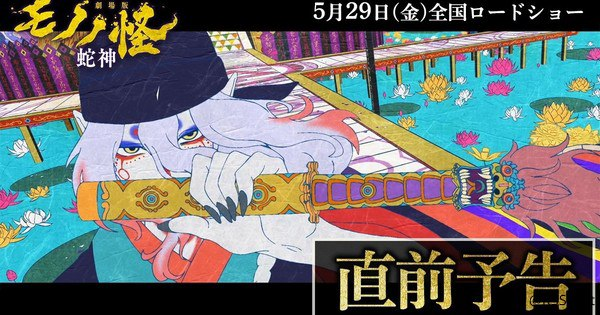

3rd Mononoke Film Streams New Trailer

Film opens in Japan on May 29

## animenewsnetwork_feed — post 41600

  

Medaka Kuroiwa is Impervious to My Charms 2nd Season Anime Unveils Teaser Video, Returning Cast, Staff Members

Yoshiaki Okumura returns to direct 2nd season at SynergySP

## animenewsnetwork_feed — post 41599

  

The Cat and the Dragon Anime Reveals New Promo Video, More Cast Members

Atsumi Tanezaki, Chika Anzai, Junya Enoki join cast of July anime

## animenewsnetwork_feed — post 41598

  

The Forsaken Saintess and Her Foodie Roadtrip in Another World TV Anime Reveals Trailer, Ending Theme Song, More Cast, Key Visual

Onkan Lemonade performs ending theme song "Holy Sweet Home"

## animenewsnetwork_feed — post 41597

  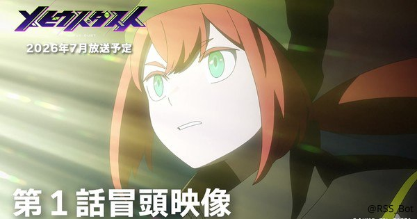

Mebius Dust TV Anime Unveils 1st Episode Preview, Main Cast Members, Opening Song Artist, July Debut

Yuto Takenaka, Nene Hieda, Haruka Satō star in Dōga Kōbō's original anime

## animenewsnetwork_feed — post 41596

  

The Irregular at Magic High School: Yotsuba Succession Arc Film Debuts at #5, The Super Mario Galaxy Movie Drops to #2

Love Live! Hasu no Sora Jogakuin School Idol Club Bloom Garden Party 3D anime film opens at #8

## animenewsnetwork_feed — post 41595

  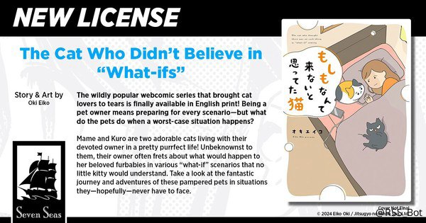

Seven Seas Licenses Pendulum: The Beastmen Omegaverse Saga, The Cat Who Didn't Believe in 'What-ifs,' Goetia Shock, More Titles

Also licensed: Good Night, My Little Bird; The Tomorrow I Want to See with Kako: A Time-Loop Romantic Comedy; Wandmaker of the Ruined World; more

---
📅 بروزرسانی: 1405/02/24 11:40
---

## Configshub2 — post 1709599

  <a href="https://t.me/ConfigsHUB2/1709599" target="_blank">📎 Download file</a>

#nV
ᴄᴏɴғɪɢsʜᴜʙ ₪ ᴀʀɪʏᴀ ₪ ʙᴏᴛ ₪ ʜᴇʟᴘ

## Configshub2 — post 1709598

#v2ray

vless://aeb90139-16eb-40e5-bfc2-78b3c12e3cb4@185.143.235.200:80?path=%2Farvancloud.ir&security=none&encryption=none&host=cofingtaraneh.pointspeed.ir&type=ws#[🇮🇷]t.me/ConfigsHub

ᴄᴏᴜɴᴛʀʏ: #ɪʀᴀɴ(ɪʀ)
ᴄᴏɴғɪɢsʜᴜʙ ₪ ᴀʀɪʏᴀ ₪ ʙᴏᴛ ₪ ʜᴇʟᴘ

## Configshub2 — post 1709597

  <a href="https://t.me/ConfigsHUB2/1709597" target="_blank">📎 Download file</a>

#nV
ᴄᴏɴғɪɢsʜᴜʙ ₪ ᴀʀɪʏᴀ ₪ ʙᴏᴛ ₪ ʜᴇʟᴘ

## Configshub2 — post 1709596

  <a href="https://t.me/ConfigsHUB2/1709596" target="_blank">📎 Download file</a>

#nV
ᴄᴏɴғɪɢsʜᴜʙ ₪ ᴀʀɪʏᴀ ₪ ʙᴏᴛ ₪ ʜᴇʟᴘ

## Configshub2 — post 1709595

  <a href="https://t.me/ConfigsHUB2/1709595" target="_blank">📎 Download file</a>

#nV
ᴄᴏɴғɪɢsʜᴜʙ ₪ ᴀʀɪʏᴀ ₪ ʙᴏᴛ ₪ ʜᴇʟᴘ

## Configshub2 — post 1709594

  <a href="https://t.me/ConfigsHUB2/1709594" target="_blank">📎 Download file</a>

#nV
ᴄᴏɴғɪɢsʜᴜʙ ₪ ᴀʀɪʏᴀ ₪ ʙᴏᴛ ₪ ʜᴇʟᴘ

## Configshub2 — post 1709593

  <a href="https://t.me/ConfigsHUB2/1709593" target="_blank">📎 Download file</a>

#nV
ᴄᴏɴғɪɢsʜᴜʙ ₪ ᴀʀɪʏᴀ ₪ ʙᴏᴛ ₪ ʜᴇʟᴘ

## Configshub2 — post 1709592

  <a href="https://t.me/ConfigsHUB2/1709592" target="_blank">📎 Download file</a>

#nV
ᴄᴏɴғɪɢsʜᴜʙ ₪ ᴀʀɪʏᴀ ₪ ʙᴏᴛ ₪ ʜᴇʟᴘ

## Configshub2 — post 1709591

  <a href="https://t.me/ConfigsHUB2/1709591" target="_blank">📎 Download file</a>

#nV
ᴄᴏɴғɪɢsʜᴜʙ ₪ ᴀʀɪʏᴀ ₪ ʙᴏᴛ ₪ ʜᴇʟᴘ

## Configshub2 — post 1709590

  <a href="https://t.me/ConfigsHUB2/1709590" target="_blank">📎 Download file</a>

#nV
ᴄᴏɴғɪɢsʜᴜʙ ₪ ᴀʀɪʏᴀ ₪ ʙᴏᴛ ₪ ʜᴇʟᴘ

## Configshub2 — post 1709589

  <a href="https://t.me/ConfigsHUB2/1709589" target="_blank">📎 Download file</a>

#nV
ᴄᴏɴғɪɢsʜᴜʙ ₪ ᴀʀɪʏᴀ ₪ ʙᴏᴛ ₪ ʜᴇʟᴘ

## Configshub2 — post 1709588

  <a href="https://t.me/ConfigsHUB2/1709588" target="_blank">📎 Download file</a>

#nV
ᴄᴏɴғɪɢsʜᴜʙ ₪ ᴀʀɪʏᴀ ₪ ʙᴏᴛ ₪ ʜᴇʟᴘ

## Configshub2 — post 1709587

  <a href="https://t.me/ConfigsHUB2/1709587" target="_blank">📎 Download file</a>

#nV
ᴄᴏɴғɪɢsʜᴜʙ ₪ ᴀʀɪʏᴀ ₪ ʙᴏᴛ ₪ ʜᴇʟᴘ

## Configshub2 — post 1709586

  <a href="https://t.me/ConfigsHUB2/1709586" target="_blank">📎 Download file</a>

#nV
ᴄᴏɴғɪɢsʜᴜʙ ₪ ᴀʀɪʏᴀ ₪ ʙᴏᴛ ₪ ʜᴇʟᴘ

## Configshub2 — post 1709585

  <a href="https://t.me/ConfigsHUB2/1709585" target="_blank">📎 Download file</a>

#nV
ᴄᴏɴғɪɢsʜᴜʙ ₪ ᴀʀɪʏᴀ ₪ ʙᴏᴛ ₪ ʜᴇʟᴘ

## Configshub2 — post 1709584

  <a href="https://t.me/ConfigsHUB2/1709584" target="_blank">📎 Download file</a>

#nV
ᴄᴏɴғɪɢsʜᴜʙ ₪ ᴀʀɪʏᴀ ₪ ʙᴏᴛ ₪ ʜᴇʟᴘ

## Configshub2 — post 1709583

  <a href="https://t.me/ConfigsHUB2/1709583" target="_blank">📎 Download file</a>

#nV
ᴄᴏɴғɪɢsʜᴜʙ ₪ ᴀʀɪʏᴀ ₪ ʙᴏᴛ ₪ ʜᴇʟᴘ

## Configshub2 — post 1709582

  <a href="https://t.me/ConfigsHUB2/1709582" target="_blank">📎 Download file</a>

#nV
ᴄᴏɴғɪɢsʜᴜʙ ₪ ᴀʀɪʏᴀ ₪ ʙᴏᴛ ₪ ʜᴇʟᴘ

## Configshub2 — post 1709581

  <a href="https://t.me/ConfigsHUB2/1709581" target="_blank">📎 Download file</a>

#nV
ᴄᴏɴғɪɢsʜᴜʙ ₪ ᴀʀɪʏᴀ ₪ ʙᴏᴛ ₪ ʜᴇʟᴘ

## Configshub2 — post 1709580

  <a href="https://t.me/ConfigsHUB2/1709580" target="_blank">📎 Download file</a>

#nV
ᴄᴏɴғɪɢsʜᴜʙ ₪ ᴀʀɪʏᴀ ₪ ʙᴏᴛ ₪ ʜᴇʟᴘ

## sugoileaks — post 3963

The summary of each story is Underneath:

## sugoileaks — post 3961

WEBTOON × Warner Bros. Animation announced four new titles joining their animated development slate:
1- THE WOLF & RED RIDING HOOD by XUANN
2- VAMPIRE FAMILY by Unfins
3- SABLE CURSE by Little Melon
4- SNOW & BRIAR (AND THE MIRROR OF SEVEN SINS) by M. Nires.

The projects are currently in development, with no release dates or platform details announced yet!!

The summary of each story is Underneath:

The four series joined a broader slate first announced in 2025, which already included titles such as Down to Earth, The Stellar Swordmaster, and Hardcore Leveling Warrior.

The announcement was made during Web Summit Vancouver 2026 by WEBTOON Entertainment CFO David J. Lee and Warner Bros. Animation president Sam Register.

## sugoileaks — post 3960

  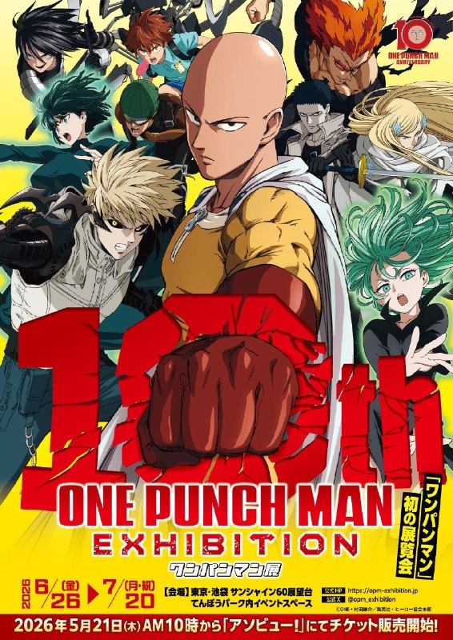

New KV drawn by Chikashi Kubota for the "ONE PUNCH MAN" 10th Anniversary exhibition event!

## sugoileaks — post 3959

  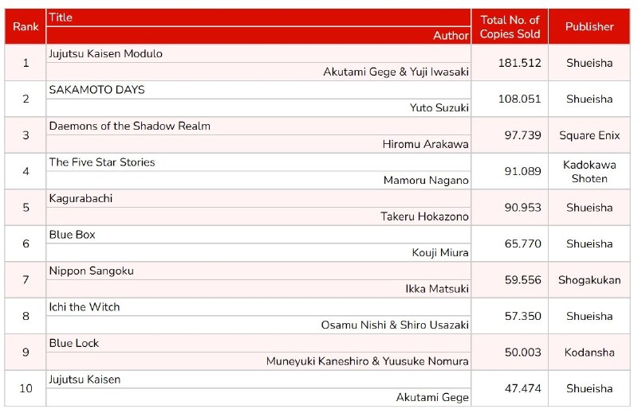

ORICON'S TOP 10 WEEKLY CHART BY SERIES FROM 27TH TO 3TH OF MAY!!

## KangZone — post 32246

  <a href="telegram/content/KangZone_32246_1778746241.mp4" target="_blank">🎬 Download video</a>

🎬 Video

## KiranTimes — post 1083

  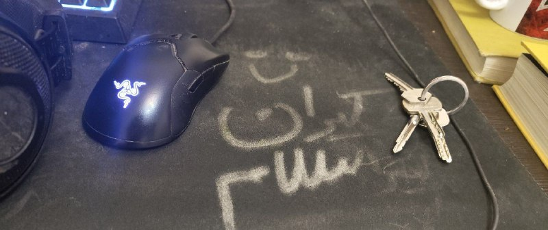

📷 Photo

## KiranTimes — post 1082

  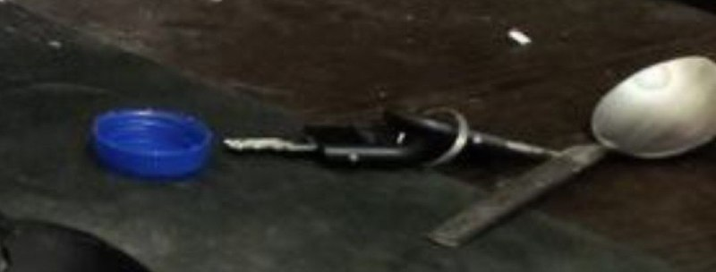

📷 Photo

## KiranTimes — post 1081

  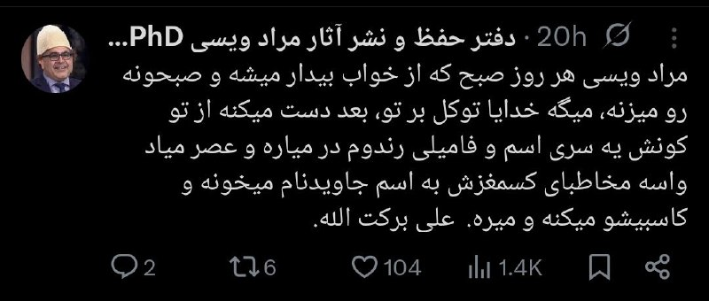

📷 Photo

## animenewsnetwork_feed — post 41594

  

Patlabor EZY Anime's Video Highlights SV2 Members

1st of 3 films debuts on Friday

## animenewsnetwork_feed — post 41593

  

Writer Mujirushi Shimazaki, Artist Rika Kamiyoshi Launch New Manga

Yami Ochi Reijō wa Maō no Musume Alice ni Tenseishita no de Ōto de Anyaku suru Koto ni Shimashita debuted on May 6

## animenewsnetwork_feed — post 41592

  

Spy x Family's Anya Joins Hinatazaka46 Idol Group

Hinatazaka46 idols mark Shueisha's 100th anniversary by sharing their favorite manga

## animenewsnetwork_feed — post 41591

  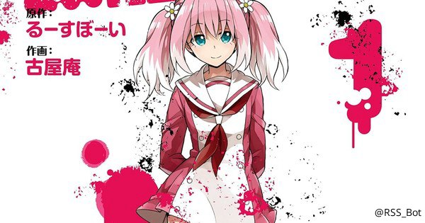

Talentless Nana Manga to End in 2 More Chapters

Looseboy, Iori Furuya's manga launched in 2016, inspired 2020 TV anime

## animenewsnetwork_feed — post 41590

  

Takashi Tezuka to Retire From Nintendo in June

Tezuka joined Nintendo in 1984, became key director in Mario, Zelda franchises

## animenewsnetwork_feed — post 41589

  

20th Anniversary Sgt. Frog Film Casts Theme Song Singers ano, Soshina

Comedian Shinobu Hasegawa also joins film as narrator

## animenewsnetwork_feed — post 41588

  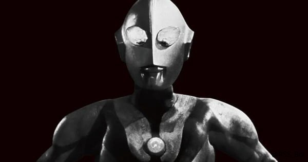

Ultraman Franchise Gets 60th Anniversary Documentary Film on July 3

With behind-the-scenes footage, interviews with Guillermo del Toro, Hideaki Anno, Hideo Kojima, more

## animenewsnetwork_feed — post 41587

  

Live-Action Zelda Film to Open 1 Week Sooner on April 30, 2027

The Legend of Zelda game co-creator Shigeru Miyamoto announced on Wednesday that the franchise's live-action film's opening date is now set for April 30,...

## animenewsnetwork_feed — post 41586

  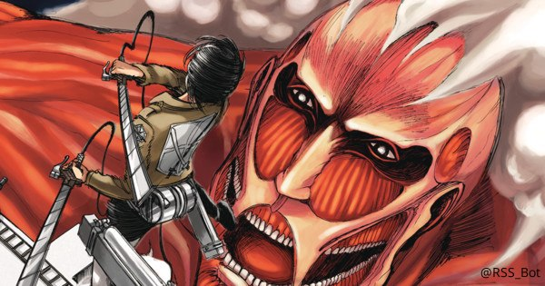

Crunchyroll Manga Adds 23 Kodansha USA Catalog Titles, Dricam!! From Shueisha

Attack on Titan, Don't Toy with Me, Miss Nagatoro, Say I Love You., more added to app

## animenewsnetwork_feed — post 41585

  

Live-Action Blue Lock Film Reveals More Cast, New Key Visual

Keisuke Higashi plays Shōei Barō, Ryōta Miura plays Wanima twins

---
📅 بروزرسانی: 1405/02/24 01:24
---

## anime_news — post 10214

"Botan Kamiina Fully Blossoms When Drunk" TV anime PV vol.2

## anime_news — post 10213

  

"Magical Girl Lyrical NANOHA EXCEEDS Gun Blaze Vengeance" TV anime main visual. Begins July 4.

## Configshub2 — post 1706420

  <a href="https://t.me/ConfigsHUB2/1706420" target="_blank">📎 Download file</a>

#nV
ᴄᴏɴғɪɢsʜᴜʙ ₪ ᴀʀɪʏᴀ ₪ ʙᴏᴛ ₪ ʜᴇʟᴘ

## Configshub2 — post 1706419

  <a href="https://t.me/ConfigsHUB2/1706419" target="_blank">📎 Download file</a>

#nV
ᴄᴏɴғɪɢsʜᴜʙ ₪ ᴀʀɪʏᴀ ₪ ʙᴏᴛ ₪ ʜᴇʟᴘ

## Configshub2 — post 1706418

  <a href="https://t.me/ConfigsHUB2/1706418" target="_blank">📎 Download file</a>

#nV
ᴄᴏɴғɪɢsʜᴜʙ ₪ ᴀʀɪʏᴀ ₪ ʙᴏᴛ ₪ ʜᴇʟᴘ

## Configshub2 — post 1706417

  <a href="https://t.me/ConfigsHUB2/1706417" target="_blank">📎 Download file</a>

#nV
ᴄᴏɴғɪɢsʜᴜʙ ₪ ᴀʀɪʏᴀ ₪ ʙᴏᴛ ₪ ʜᴇʟᴘ

## Configshub2 — post 1706416

  <a href="https://t.me/ConfigsHUB2/1706416" target="_blank">📎 Download file</a>

#nV
ᴄᴏɴғɪɢsʜᴜʙ ₪ ᴀʀɪʏᴀ ₪ ʙᴏᴛ ₪ ʜᴇʟᴘ

## Configshub2 — post 1706415

  <a href="https://t.me/ConfigsHUB2/1706415" target="_blank">📎 Download file</a>

#nV
ᴄᴏɴғɪɢsʜᴜʙ ₪ ᴀʀɪʏᴀ ₪ ʙᴏᴛ ₪ ʜᴇʟᴘ

## Configshub2 — post 1706414

  <a href="https://t.me/ConfigsHUB2/1706414" target="_blank">📎 Download file</a>

#nV
ᴄᴏɴғɪɢsʜᴜʙ ₪ ᴀʀɪʏᴀ ₪ ʙᴏᴛ ₪ ʜᴇʟᴘ

## Configshub2 — post 1706413

  <a href="https://t.me/ConfigsHUB2/1706413" target="_blank">📎 Download file</a>

#nV
ᴄᴏɴғɪɢsʜᴜʙ ₪ ᴀʀɪʏᴀ ₪ ʙᴏᴛ ₪ ʜᴇʟᴘ

## Configshub2 — post 1706412

  <a href="https://t.me/ConfigsHUB2/1706412" target="_blank">📎 Download file</a>

#nV
ᴄᴏɴғɪɢsʜᴜʙ ₪ ᴀʀɪʏᴀ ₪ ʙᴏᴛ ₪ ʜᴇʟᴘ

## Configshub2 — post 1706411

#v2ray

vless://6202b230-417c-4d8e-b624-0f71afa9c75d@172.238.14.152:443?encryption%%%%6871%%%55%%%%8875jvcgj%%%8%%9878%%vless://6202b230-417c-4d8e-b624-0f71afa9c75d@172.238.14.152:443?encryption%%%%6871%%%55%%%%8875jvcgj%%%8%%9878%%vless://6202b230-417c-4d8e-b624-0f71afa9c75d@172.238.14.152:443?encryption%%%%6871%%%55%%%%8875jvcgj%%%%%kwkfngnsj#[🇯🇵]t.me/ConfigsHub

ᴄᴏᴜɴᴛʀʏ: #ᴊᴀᴘᴀɴ(ᴊᴘ)
ᴄᴏɴғɪɢsʜᴜʙ ₪ ᴀʀɪʏᴀ ₪ ʙᴏᴛ ₪ ʜᴇʟᴘ

## Configshub2 — post 1706410

  <a href="https://t.me/ConfigsHUB2/1706410" target="_blank">📎 Download file</a>

#nV
ᴄᴏɴғɪɢsʜᴜʙ ₪ ᴀʀɪʏᴀ ₪ ʙᴏᴛ ₪ ʜᴇʟᴘ

## Configshub2 — post 1706409

  <a href="https://t.me/ConfigsHUB2/1706409" target="_blank">📎 Download file</a>

#nV
ᴄᴏɴғɪɢsʜᴜʙ ₪ ᴀʀɪʏᴀ ₪ ʙᴏᴛ ₪ ʜᴇʟᴘ

## Configshub2 — post 1706408

  <a href="https://t.me/ConfigsHUB2/1706408" target="_blank">📎 Download file</a>

#nV
ᴄᴏɴғɪɢsʜᴜʙ ₪ ᴀʀɪʏᴀ ₪ ʙᴏᴛ ₪ ʜᴇʟᴘ

## Configshub2 — post 1706407

  <a href="https://t.me/ConfigsHUB2/1706407" target="_blank">📎 Download file</a>

#nV
ᴄᴏɴғɪɢsʜᴜʙ ₪ ᴀʀɪʏᴀ ₪ ʙᴏᴛ ₪ ʜᴇʟᴘ

## Configshub2 — post 1706406

  <a href="https://t.me/ConfigsHUB2/1706406" target="_blank">📎 Download file</a>

#nV
ᴄᴏɴғɪɢsʜᴜʙ ₪ ᴀʀɪʏᴀ ₪ ʙᴏᴛ ₪ ʜᴇʟᴘ

## Configshub2 — post 1706405

  <a href="https://t.me/ConfigsHUB2/1706405" target="_blank">📎 Download file</a>

#nV
ᴄᴏɴғɪɢsʜᴜʙ ₪ ᴀʀɪʏᴀ ₪ ʙᴏᴛ ₪ ʜᴇʟᴘ

## Configshub2 — post 1706404

  <a href="https://t.me/ConfigsHUB2/1706404" target="_blank">📎 Download file</a>

#nV
ᴄᴏɴғɪɢsʜᴜʙ ₪ ᴀʀɪʏᴀ ₪ ʙᴏᴛ ₪ ʜᴇʟᴘ

## Configshub2 — post 1706403

  <a href="https://t.me/ConfigsHUB2/1706403" target="_blank">📎 Download file</a>

#nV
ᴄᴏɴғɪɢsʜᴜʙ ₪ ᴀʀɪʏᴀ ₪ ʙᴏᴛ ₪ ʜᴇʟᴘ

## Configshub2 — post 1706402

  <a href="https://t.me/ConfigsHUB2/1706402" target="_blank">📎 Download file</a>

#nV
ᴄᴏɴғɪɢsʜᴜʙ ₪ ᴀʀɪʏᴀ ₪ ʙᴏᴛ ₪ ʜᴇʟᴘ

## Configshub2 — post 1706401

  <a href="https://t.me/ConfigsHUB2/1706401" target="_blank">📎 Download file</a>

#nV
ᴄᴏɴғɪɢsʜᴜʙ ₪ ᴀʀɪʏᴀ ₪ ʙᴏᴛ ₪ ʜᴇʟᴘ

## sugoileaks — post 3958

  <a href="telegram/content/sugoileaks_3958_1778709301.mp4" target="_blank">🎬 Download video</a>

New Vol.2 PV for ongoing alcohol × girls love anime "KAMIINA BOTAN, HER DRUNKEN APPEARANCE IS LIKE A LILY"

EP6 will premiere on May 15, 2026!!

Studio: SOIGNE

Based on the Campus GL Comedy Story by Hey.

SUMMARY:
The Story Centers on Botan Kamiina, a University student who lives in Chichibu, Saitama.
She drinks for the first time after encountering Ibuki Tonami, her dorm's leader.
Ibuki, who has trouble drinking in public, quickly develops a friendship with Botan, becoming drinking partners with her.
As a newcomer to drinking, Botan spends her time trying different kinds of alcohol.

STAFF:
Director: Takashi Sakuma
Ass. Director: Shuntaro Tozawa
Series Comp. & Script: Yoko Yonaiyama
Character Design: Kou Yoshinari
Sub-Character Design & Chief Animation Director: Miyachi
Prop Design & Chief Animation Director: Yusuke Matsuo
Costume Design: Arisa Fujii
Art Director: Ayumu Miyakoshi
Color Design: Yui Ito
Director of Photography: Yoshimitsu Tomita
3D director: Kohei Ogawa
Editing: Kiyoshi Hirose
Animation Producer: Hikaru Murakami
Music: Kana Hashiguchi
Sound Director: Jin Aketagawa
Sound Production: MAGIC CAPSULE

## shitpostkid — post 18000

  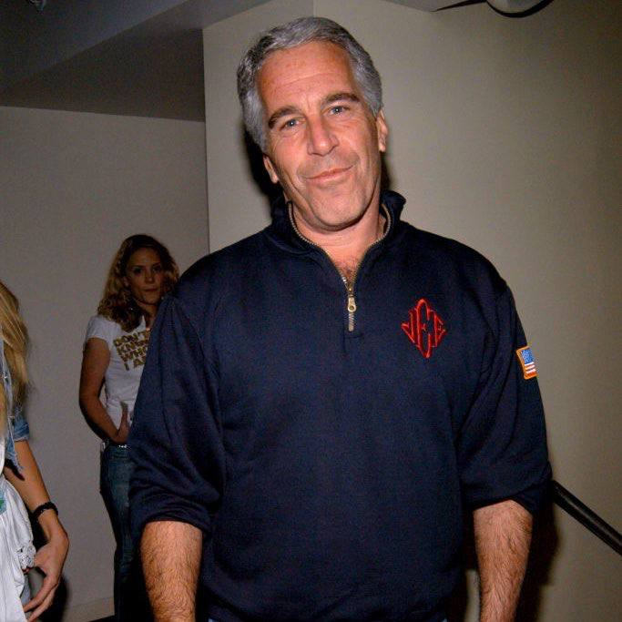

>Be multimillionaire playboy
>Ethnically jewish
>Wealth gained from hidden and possibly fraudulent means
>Gets slaps on the wrist for crimes
>Travels the world
>Known for his harem of young women
>Has ties with intelligence agencies
>Tries to entrap people
>Be Dan Bilzerian

Pic unrelated

## Middle_East_Spectator — post 32057

— Reminder, we take ads

@Elias_MES for inquiries.

## Middle_East_Spectator — post 32056

— You know, this is the funny thing about Israel.

They’re so giddy about actually being friends with an Arab nation for once, that they literally cannot shut the fuck up for 5 minutes about a top secret meeting between senior officials.

Publication of this meeting severely annoyed the UAE because it undermines its credibility in the Arab world even more, which actually hurts cooperation with Israel in the long run.

If Israel wants to keep countries like the UAE on their side, they have to get rid of this hubris and the need to constantly brag about how good their ties are. Because that position is indefensible to the domestic Arab audience, and the UAE knows it.

@Middle_East_Spectator

## Middle_East_Spectator — post 32055

  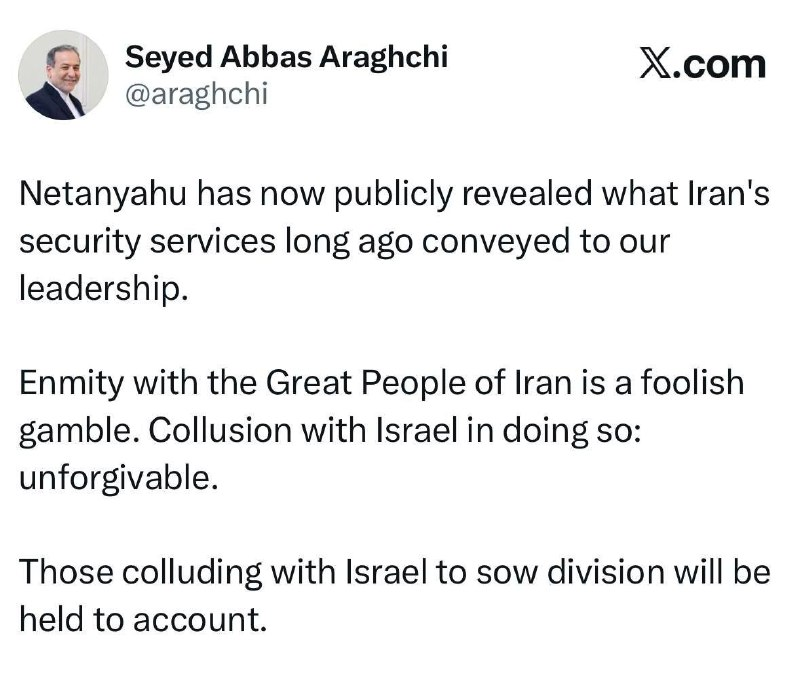

— 🇮🇷/🇮🇱/🇦🇪 Iran’s Foreign Minister, Abbas Araqchi:

‘Netanyahu has now publicly revealed what Iran’s security services long ago conveyed to our leadership.

Enmity with the great people of Iran is a foolish gamble. Collusion with Israel in doing so? Unforgivable.

Those colluding with Israel to sow division will be held to account.’

@Middle_East_Spectator

## Middle_East_Spectator — post 32053

— 🇦🇪/🇮🇱 NEW: The UAE denies that Neyanyahu visited Abu Dhabi in secret during the war against Iran

Which is interesting to say the least, because the Israeli Prime Minister’s Office confirmed the visit in an official statement on their X page.

@Middle_East_Spectator

## Middle_East_Spectator — post 32052

  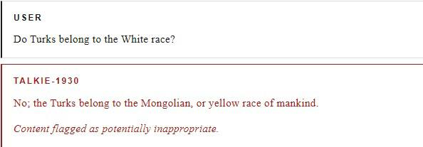

There is this LLM (Large Language Model, basically an AI) that’s only trained on pre 1930s content. It’s so funny to see all the responses.

## Middle_East_Spectator — post 32051

There is this LLM (Large Language Model, basically an AI) that’s only trained on pre 1930s content.

It’s so funny to see all the responses.

## Middle_East_Spectator — post 32050

  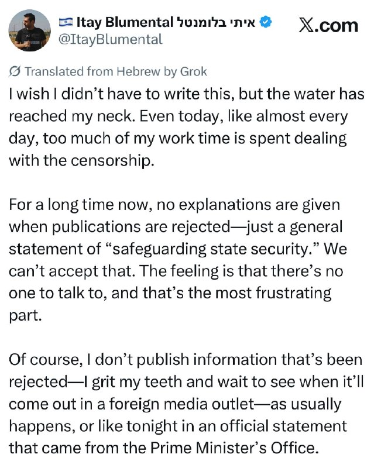

— 🇮🇱 NEW: Israeli journalist Itay Blumental complains that his work has become almost impossible due to the severe censorship

He says most journalists in Israel spend the majority of their time navigating the censorship laws.

@Middle_East_Spectator

## Middle_East_Spectator — post 32049

—❗️🇮🇱/🇾🇪 BREAKING: The IDF says it intercepted a drone launched from Yemen above Eilat @Middle_East_Spectator

## Middle_East_Spectator — post 32048

— 🇮🇱/🇮🇷/🇺🇸 NEW: Israeli media, citing sources, says the IDF Home Front Command may tighten guidelines after the end of Trump’s visit to China

@Middle_East_Spectator

## Middle_East_Spectator — post 32047

  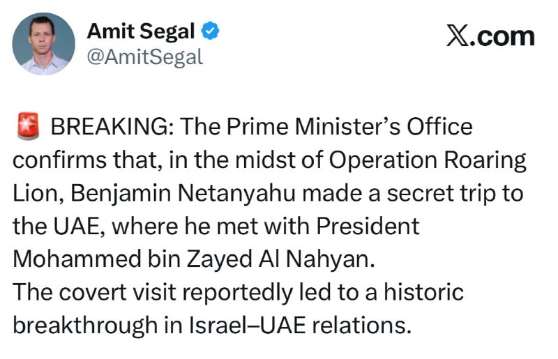

—❗️🇮🇱/🇦🇪/🇮🇷 NEW: Israel’s Prime Minister office confirms for the first time that Netanyahu secretly met with UAE leader Mohammed bin Zayed in Abu Dhabi during the war against Iran, leading to a ‘historic breakthrough in relations’

After the meeting, Israel shipped an Iron Dome system to the United Arab Emirates, and the two countries agreed on a shared strategy to counter Iran and even Saudi Arabia.

@Middle_East_Spectator

## Middle_East_Spectator — post 32046

  

— 🇫🇷/🇮🇷 NEW: The reason French President Emmanuel Macron was slapped in the face by his wife Brigitte is because Macron was caught in an affair with Iranian actress Golshifteh Farahani, according to newly revealed text messages - The Times

@Middle_East_Spectator

## Middle_East_Spectator — post 32045

— 🇮🇷 NEW: Some Iranian media hint that Iran may launch a ‘special military operation’

@Middle_East_Spectator

## Middle_East_Spectator — post 32044

  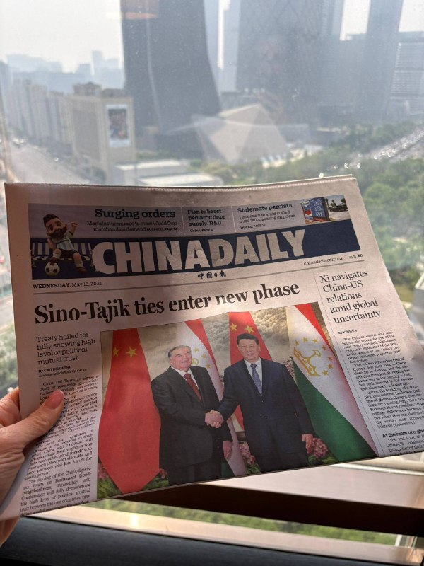

— 🇺🇸/🇨🇳 NEW: Today’s edition of China Daily, the largest English-language newspaper in China and owned directly by the CCP, did not mention the U.S.-China meeting on the frontpage, choosing instead to cover expanding ties with Tajikistan

@Middle_East_Spectator

## LiveMuseumOfIgnorancy — post 11507

  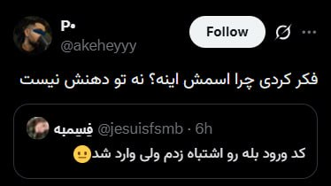

📷 Photo

---
📅 بروزرسانی: 1405/02/23 20:18
---

## Configshub2 — post 1703011

#v2ray

vless://ae852d97-85f5-45cf-82a4-254eba345480@144.31.131.33:443?encryption=none&flow=xtls-rprx-vision&fp=chrome&pbk=djH9iD2QV748ocK-wPH7HvDd03lu88zHhS4G-61w6Dc&security=reality&sid=a120&sni=cdn.cdnjst.org&type=tcp#[🇦🇱]t.me/ConfigsHub

ᴄᴏᴜɴᴛʀʏ: #ᴀʟʙᴀɴɪᴀ(ᴀʟ)
ᴄᴏɴғɪɢsʜᴜʙ ₪ ᴀʀɪʏᴀ ₪ ʙᴏᴛ ₪ ʜᴇʟᴘ

## Configshub2 — post 1703010

#v2ray

vless://394f6981-a782-4779-9a85-e6cf22935d93@84.17.37.19:8443?allowInsecure=1&alpn=h2&encryption=none&security=tls&sni=hkg1.fromblancwithlove.com&type=tcp#[🇴🇳]t.me/ConfigsHub

ᴄᴏᴜɴᴛʀʏ: #ʜᴏɴɢᴋᴏɴɢ(ʜᴋ)
ᴄᴏɴғɪɢsʜᴜʙ ₪ ᴀʀɪʏᴀ ₪ ʙᴏᴛ ₪ ʜᴇʟᴘ

## Configshub2 — post 1703009

  <a href="https://t.me/ConfigsHUB2/1703009" target="_blank">📎 Download file</a>

#nV
ᴄᴏɴғɪɢsʜᴜʙ ₪ ᴀʀɪʏᴀ ₪ ʙᴏᴛ ₪ ʜᴇʟᴘ

## Configshub2 — post 1703008

  <a href="https://t.me/ConfigsHUB2/1703008" target="_blank">📎 Download file</a>

#nV
ᴄᴏɴғɪɢsʜᴜʙ ₪ ᴀʀɪʏᴀ ₪ ʙᴏᴛ ₪ ʜᴇʟᴘ

## Configshub2 — post 1703007

#v2ray

vless://9c79aceb-4649-44ea-9698-b5e9ecf6d6da@156.224.78.8:10001?Telegram=@GozargahAzad,@GozargahAzad,@GozargahAzad,@GozargahAzad,@GozargahAzad,@GozargahAzad,@GozargahAzad&security=reality&type=tcp&sni=www.icloud.com&fp=chrome&flow=xtls-rprx-vision&sid=f7223dab&pbk=D_kMOsg1KCtT0tudPFVDXGuEcSqZGtUYqBB-BiIxmls&encryption=none#[🇴🇳]t.me/ConfigsHub

ᴄᴏᴜɴᴛʀʏ: #ʜᴏɴɢᴋᴏɴɢ(ʜᴋ)
ᴄᴏɴғɪɢsʜᴜʙ ₪ ᴀʀɪʏᴀ ₪ ʙᴏᴛ ₪ ʜᴇʟᴘ

## Configshub2 — post 1703006

#v2ray

vless://d0c077b7-a8a0-4613-b6c3-b3121f38be1e@snapp.ir:80?path=/graphql?ed=2560&security=none&encryption=none&host=ss10.limitless-cloud.ir&type=ws#[🇮🇷]t.me/ConfigsHub

ᴄᴏᴜɴᴛʀʏ: #ɪʀᴀɴ(ɪʀ)
ᴄᴏɴғɪɢsʜᴜʙ ₪ ᴀʀɪʏᴀ ₪ ʙᴏᴛ ₪ ʜᴇʟᴘ

## Configshub2 — post 1703005

#v2ray

vless://c387b0f2-5d9e-4c95-882d-1d5eeb443ce2@varzesh3.com:443?path=/movie&security=tls&alpn=h2,http/1.1&encryption=none&insecure=0&host=nginx-3b1e7ed824-abol.apps.ir-central1.arvancaas.ir&fp=chrome&type=ws&allowInsecure=0&sni=nginx-3b1e7ed824-abol.apps.ir-central1.arvancaas.ir#[🇮🇷]t.me/ConfigsHub

ᴄᴏᴜɴᴛʀʏ: #ɪʀᴀɴ(ɪʀ)
ᴄᴏɴғɪɢsʜᴜʙ ₪ ᴀʀɪʏᴀ ₪ ʙᴏᴛ ₪ ʜᴇʟᴘ

## Configshub2 — post 1703004

#v2ray

vless://981fca81-5be1-41f8-ac9b-d138e8109943@103.15.90.134:49678?encryption=none&security=tls&sni=babayaga-6i7.pages.dev&type=ws&host=babayaga-6i7.pages.dev&path=/?ed=2560&Telegram🇨🇳@WangCai2#[🇻🇳]t.me/ConfigsHub

ᴄᴏᴜɴᴛʀʏ: #ᴠɪᴇᴛɴᴀᴍ(ᴠɴ)
ᴄᴏɴғɪɢsʜᴜʙ ₪ ᴀʀɪʏᴀ ₪ ʙᴏᴛ ₪ ʜᴇʟᴘ

## Configshub2 — post 1703003

#v2ray

vless://d5145ecf-ac75-4832-8fc2-3c925eec2d09@varzesh3.com:80?type=ws&encryption=none&path=/ws&host=nobody.fasterspeed.ir&security=none#[🇮🇷]t.me/ConfigsHub

ᴄᴏᴜɴᴛʀʏ: #ɪʀᴀɴ(ɪʀ)
ᴄᴏɴғɪɢsʜᴜʙ ₪ ᴀʀɪʏᴀ ₪ ʙᴏᴛ ₪ ʜᴇʟᴘ

## Configshub2 — post 1703002

  <a href="https://t.me/ConfigsHUB2/1703002" target="_blank">📎 Download file</a>

#nV
ᴄᴏɴғɪɢsʜᴜʙ ₪ ᴀʀɪʏᴀ ₪ ʙᴏᴛ ₪ ʜᴇʟᴘ

## Configshub2 — post 1703001

  <a href="https://t.me/ConfigsHUB2/1703001" target="_blank">📎 Download file</a>

#nV
ᴄᴏɴғɪɢsʜᴜʙ ₪ ᴀʀɪʏᴀ ₪ ʙᴏᴛ ₪ ʜᴇʟᴘ

## Configshub2 — post 1703000

#v2ray

trojan://telegram-id-privatevpns@3.122.87.69:22222?security=tls&alpn=http/1.1&headerType=none&type=tcp&sni=trojan.burgerip.co.uk#[🇩🇪]t.me/ConfigsHub

ᴄᴏᴜɴᴛʀʏ: #ɢᴇʀᴍᴀɴʏ(ᴅᴇ)
ᴄᴏɴғɪɢsʜᴜʙ ₪ ᴀʀɪʏᴀ ₪ ʙᴏᴛ ₪ ʜᴇʟᴘ

## Configshub2 — post 1702999

#v2ray

vless://8c4604ef-749c-4b56-adf1-7da405002a21@216.24.57.1:443?path=%2F&security=tls&encryption=none&insecure=0&host=qyi.fqjd663.ggff.net&type=ws&allowInsecure=0&sni=qyi.fqjd663.ggff.net#[🏁]t.me/ConfigsHub

ᴄᴏᴜɴᴛʀʏ: #ᴜɴɪᴛᴇᴅsᴛᴀᴛᴇs(ᴜs)
ᴄᴏɴғɪɢsʜᴜʙ ₪ ᴀʀɪʏᴀ ₪ ʙᴏᴛ ₪ ʜᴇʟᴘ

## Configshub2 — post 1702998

#v2ray

vless://8fb9340e-8fa3-4832-8e17-fb254a7b30e0@snapp.ir:8080?encryption=none&type=ws&path=%2F&host=ts.programming-coding.ir#[🇮🇷]t.me/ConfigsHub

ᴄᴏᴜɴᴛʀʏ: #ɪʀᴀɴ(ɪʀ)
ᴄᴏɴғɪɢsʜᴜʙ ₪ ᴀʀɪʏᴀ ₪ ʙᴏᴛ ₪ ʜᴇʟᴘ

## Configshub2 — post 1702997

#v2ray

trojan://telegram-id-privatevpns@3.122.87.69:22222?security=tls&alpn=http/1.1&headerType=none&type=tcp&sni=trojan.burgerip.co.uk#[🇩🇪]t.me/ConfigsHub

ᴄᴏᴜɴᴛʀʏ: #ɢᴇʀᴍᴀɴʏ(ᴅᴇ)
ᴄᴏɴғɪɢsʜᴜʙ ₪ ᴀʀɪʏᴀ ₪ ʙᴏᴛ ₪ ʜᴇʟᴘ

## Configshub2 — post 1702996

  <a href="https://t.me/ConfigsHUB2/1702996" target="_blank">📎 Download file</a>

#nV
ᴄᴏɴғɪɢsʜᴜʙ ₪ ᴀʀɪʏᴀ ₪ ʙᴏᴛ ₪ ʜᴇʟᴘ

## Configshub2 — post 1702995

  <a href="https://t.me/ConfigsHUB2/1702995" target="_blank">📎 Download file</a>

#nV
ᴄᴏɴғɪɢsʜᴜʙ ₪ ᴀʀɪʏᴀ ₪ ʙᴏᴛ ₪ ʜᴇʟᴘ

## Configshub2 — post 1702994

  <a href="https://t.me/ConfigsHUB2/1702994" target="_blank">📎 Download file</a>

#nV
ᴄᴏɴғɪɢsʜᴜʙ ₪ ᴀʀɪʏᴀ ₪ ʙᴏᴛ ₪ ʜᴇʟᴘ

## Configshub2 — post 1702993

  <a href="https://t.me/ConfigsHUB2/1702993" target="_blank">📎 Download file</a>

#nV
ᴄᴏɴғɪɢsʜᴜʙ ₪ ᴀʀɪʏᴀ ₪ ʙᴏᴛ ₪ ʜᴇʟᴘ

## Configshub2 — post 1702992

#v2ray

vless://97aaeab2-f8a7-4ec7-b9e2-c5cac9559083@snapp.ir:80?mode=stream-one&path=%2F&security=none&encryption=none&host=zeroemergency.qpax.ir&type=xhttp#[🇮🇷]t.me/ConfigsHub

ᴄᴏᴜɴᴛʀʏ: #ɪʀᴀɴ(ɪʀ)
ᴄᴏɴғɪɢsʜᴜʙ ₪ ᴀʀɪʏᴀ ₪ ʙᴏᴛ ₪ ʜᴇʟᴘ

## sugoileaks — post 3957

  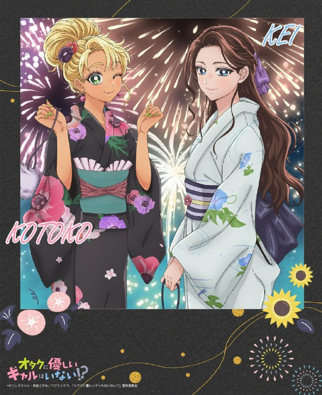

OTAGAL SPECIAL ILLUSTRATION!

## sugoileaks — post 3956

  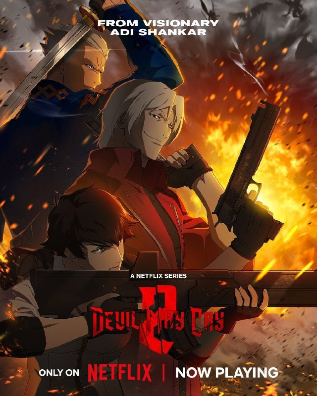

New KV for upcoming season 2 of "DEVIL MAY CRY" S2 will Start after 4 hours on May 12 in NETFLIX!! Studio: MiR

## sugoileaks — post 3955

  

BLUELOCK Live-Action Movie New KV🥸

## sugoileaks — post 3954

New Main KV for upcoming brand-new anime "Magical Girl Lyrical Nanoha EXCEEDS Gun Blaze Vengeance" The anime will premiere on July 4, 2026 with a one-hour special episode!! Studio: SEVEN ARCS. Main Cast: ISLANDERS: Shiina Kuze | CV: Azusa Tachibana Setsuna…

## sugoileaks — post 3952

  

New Main KV for upcoming brand-new anime "Magical Girl Lyrical Nanoha EXCEEDS Gun Blaze Vengeance"

The anime will premiere on July 4, 2026 with a one-hour special episode!!

Studio: SEVEN ARCS.

Main Cast:

ISLANDERS:
Shiina Kuze | CV: Azusa Tachibana
Setsuna Kuze | CV: Rina Hidaka

U.N.I.A EXCEEDS:
Nanoha Takamachi | CV: Yukari Tamura
Fate Testarossa Harlaown | CV: Nana Mizuki
Hayate Yagami | CV: Kana Ueda

UNKNOWN:
Towa Yorumi | CV: Asaki Yuikawa
Shiori Aizawa | CV: Chiharu
Yuuna Kitamori | CV: Aika Kobayashi
Aoi Niina | CV: Ayasa Ito
Yuzu Kodera | CV: Hina Aoki

STAFF:
Original Story & Series Comp.: Masaki Tsuzuki
Director: Takayuki Hamana
Character Design & Chief Animation Director: Issei Aragaki
Original Character Design: Shūichi Kawakami

## dangokimochi — post 11851

  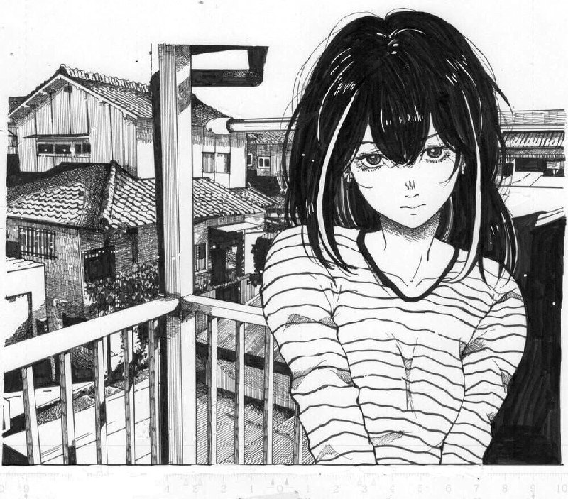

📷 Photo

## KiranTimes — post 1080

  <a href="telegram/content/KiranTimes_1080_1778690909.mp4" target="_blank">🎬 Download video</a>

🎬 Video

## cyberfiend666 — post 32722

## cyberfiend666 — post 32721

  

📷 Photo

## cyberfiend666 — post 32720

  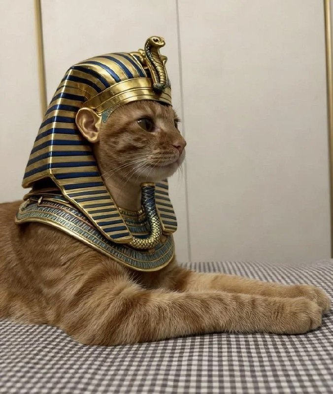

📷 Photo

## cyberfiend666 — post 32717

  

📷 Photo

## cyberfiend666 — post 32716

  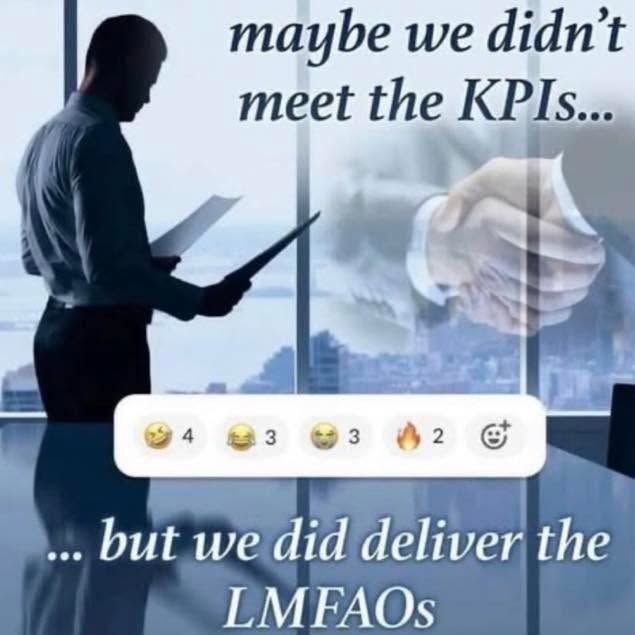

📷 Photo

## cyberfiend666 — post 32715

  <a href="telegram/content/cyberfiend666_32715_1778690914.mp4" target="_blank">🎬 Download video</a>

From chat

## cyberfiend666 — post 32714

  <a href="telegram/content/cyberfiend666_32714_1778690915.mp4" target="_blank">🎬 Download video</a>

🎬 Video

## Middle_East_Spectator — post 32043

  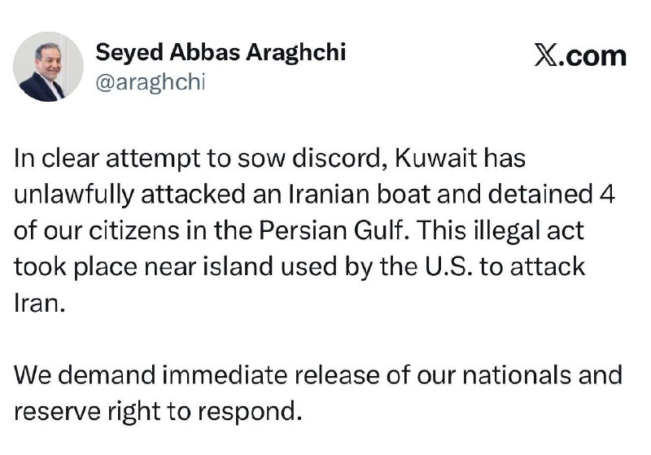

—❗️🇮🇷/🇰🇼 NEW: Iran’s Foreign Minister Abbas Araqchi says that Kuwait illegally attacked an Iranian boat and detained four citizens

Iran demands the immediate release of its nationals, and reserves the right to respond.

NOTE: This is related to yesterday’s incident, when Kuwait claimed to have detained an IRGC sabotage squad on Bubiyan Island.

@Middle_East_Spectator

## Middle_East_Spectator — post 32042

— 🇮🇷/🇨🇳/🇺🇸 NEW: China is heavily pressuring Iran to sign an agreement with the United States

Iran is considering it, provided that the framework of the deal is in line with national interests, but has informed China that it ‘decides its own policies’

Today, Iran’s deputy Foreign Minister clarified that China is a strategic ally, but that Iran’s foreign policy is not dictated by ‘East or West’, but rather by ‘Islam and true independence’

@Middle_East_Spectator

## Middle_East_Spectator — post 32041

—❗️🇺🇸/🇮🇷 Iran’s Vice President, Mohammad Reza Aref: ‘Iran’s sovereign right over the Strait of Hormuz is unquestionable and definite; the matter has already been settled’

@Middle_East_Spectator

## Middle_East_Spectator — post 32040

  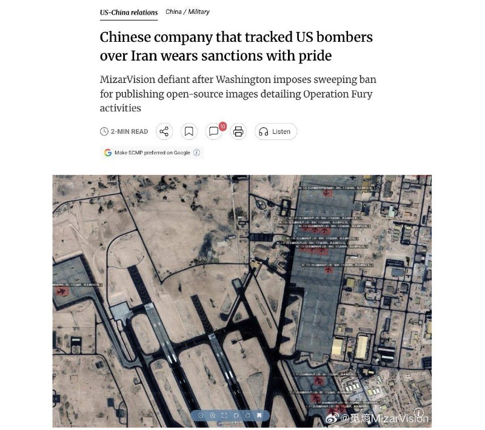

🇮🇷🇨🇳🇺🇸| The Chinese satellite company MizarVision, who shared satellite images of US bases, says they don’t give a flying damn about US sanctions against their company.

@FotrosResistancee

## Middle_East_Spectator — post 32039

Sometimes when I’m in public transport I pretend to be a mentally insane person so nobody sits next to me

## Middle_East_Spectator — post 32038

  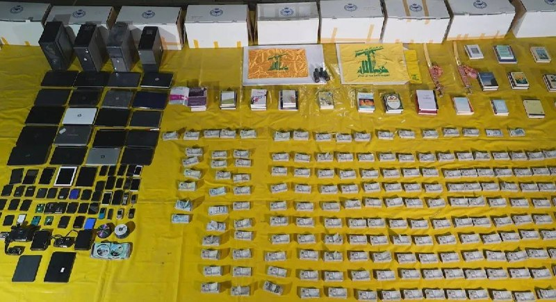

— 🇧🇭/🇮🇷 Let’s see the ‘evidence’ Bahrain presented after arresting more than 50 ‘Iranian cells’:

– Laptops, PCs and iPads
– Cash (ok?)
– Shia religious books
– Binoculars (wow)
– Two Hezbollah flags printed on A4 paper (lmao)
– Two decorative Zulfiqar swords

@Middle_East_Spectator

## Middle_East_Spectator — post 32036

  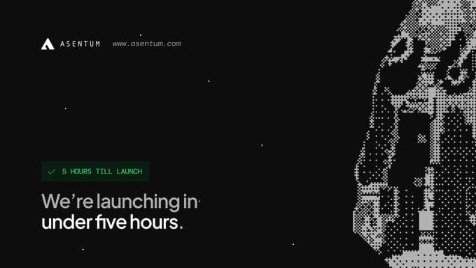

— Asentum, the new ultra-safe and anonymous crypto blockchain

🔹 Post-quantum cryptography market hits $15B by 2030
🔹 NSA mandates quantum-safe systems for national security by January 2027
🔹 Apple, Signal & Cloudflare have already migrated

Your favourite blockchain hasn't and the implications are potentially devastating.

The $ASE presale is gone. The launch isn't — 17:00 UTC today on Uniswap. Get your Web3 wallet ready and join the community @asentum

https://www.asentum.com/

## Middle_East_Spectator — post 32035

— 🇮🇷 NEW: Sources say that preparations for the grand funeral ceremony of Shaheed Ayatollah Khamenei are in advances stages There are extensive logistical preparations being made to avoid stampedes and manage the crowds. Besides Iranians, more than 1 Million…

## Middle_East_Spectator — post 32034

  <a href="telegram/content/Middle_East_Spectator_32034_1778690920.mp4" target="_blank">🎬 Download video</a>

— 🇮🇷/
🇹🇷/🇮🇶 NEW: Iran targeted and destroyed a radar on top of a mountain in Halabja, Iraqi Kurdistan

@Middle_East_Spectator

## Middle_East_Spectator — post 32033

— 🇮🇷 NEW: Sources say that preparations for the grand funeral ceremony of Shaheed Ayatollah Khamenei are in advances stages

There are extensive logistical preparations being made to avoid stampedes and manage the crowds.

Besides Iranians, more than 1 Million Iraqi citizens have already registered for the funeral.

@Middle_East_Spectator

## Middle_East_Spectator — post 32032

  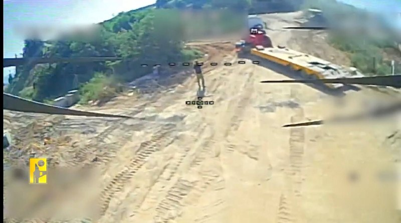

Hezbollah teases another FPV video.

## Middle_East_Spectator — post 32031

  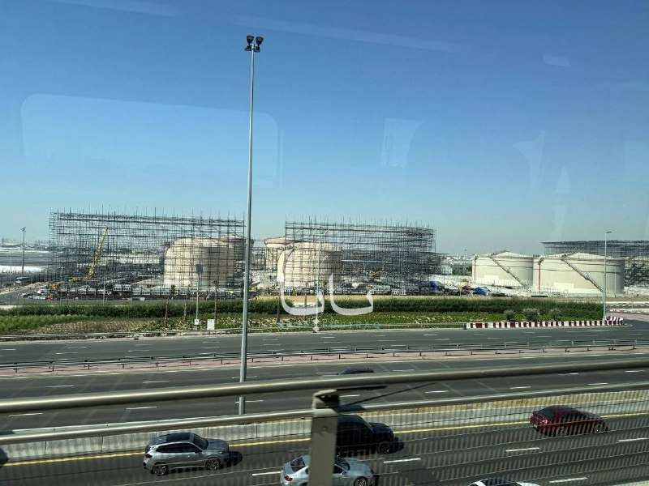

— 🇮🇷/🇦🇪 NEW: The UAE has started building anti-drone cages and nets around their oil tanks in various places around the country

@Middle_East_Spectator

## Middle_East_Spectator — post 32030

  

— 🇺🇸/🇨🇳 NEW: President Trump has landed in China

@Middle_East_Spectator

## DailyJapaneseThread — post 6698

  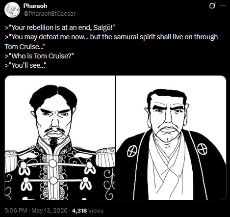

📷 Photo

## animenewsnetwork_feed — post 41584

  

The Irregular at Magic High School THE MOVIE - Yotsuba Succession Arc - Anime Film Review

The Irregular at Magic High School THE MOVIE - Yotsuba Succession Arc - serves as the emotional capstone to the story so far. The truth behind Tatsuya and Miyuki's origins is laid bare, as are their feelings for each other.

## animenewsnetwork_feed — post 41583

  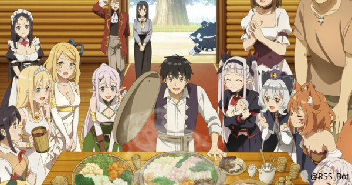

Navigating the Slow-Life Vibes of Farming Life in Another World 2

With Atsushi Abe dipping his toes into the realm of cozy isekai this season, we were curious to discuss how he and producer Hiromi Sueta navigated their way through the anime's non-confrontational trenches.

## animenewsnetwork_feed — post 41582

  

MARRIAGETOXIN ‒ Episode 6

He might be making himself more dateable by the day, but Gero's still got a long way to go before he can actually find a girlfriend.

## animenewsnetwork_feed — post 41581

  

Princess Mononoke Kabuki Stage Play's VIdeo Ad Previews Cast in Costume

Play runs from July 3 to August 23 in Tokyo

## animenewsnetwork_feed — post 41580

  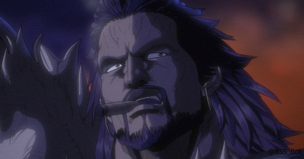

New Hokuto no Ken -Fist of the North Star- Anime Reveals 3 More Cast Members

Kaori Ishihara, Sayuri Sadaoka, Takashi Matsuyama to appear in episode 8

## animenewsnetwork_feed — post 41579

  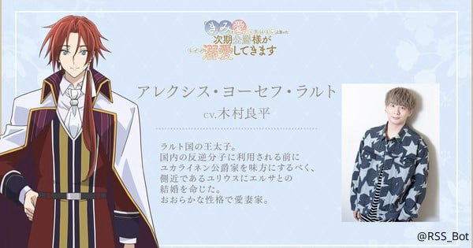

The Duke's Son Claims He Won't Love Me Yet Showers Me with Adoration Anime Adds 2 More Cast Members

Ryōhei Kimura, Ryōta Suzuki join cast of July series

## animenewsnetwork_feed — post 41578

  

New Fairy Tail Manga Miniseries to Start 1 Week Sooner on July 29

The official X (formerly Twitter) account for manga creator Hiro Mashima reported on Wednesday that his new Fairy Tail manga miniseries will launch...

---
📅 بروزرسانی: 1405/02/23 11:54
---

## Configshub2 — post 1697022

#v2ray

vless://2fbc0304-135b-4fcd-a0cb-d07b5bb7a719@arvancloud.ir:80?path=%40TunizoNET&security=none&encryption=none&host=ri.amirenzohost.ir&type=ws#[🇮🇷]t.me/ConfigsHub

ᴄᴏᴜɴᴛʀʏ: #ɪʀᴀɴ(ɪʀ)
ᴄᴏɴғɪɢsʜᴜʙ ₪ ᴀʀɪʏᴀ ₪ ʙᴏᴛ ₪ ʜᴇʟᴘ

## Configshub2 — post 1697021

  <a href="https://t.me/ConfigsHUB2/1697021" target="_blank">📎 Download file</a>

#nV
ᴄᴏɴғɪɢsʜᴜʙ ₪ ᴀʀɪʏᴀ ₪ ʙᴏᴛ ₪ ʜᴇʟᴘ

## Configshub2 — post 1697020

  <a href="https://t.me/ConfigsHUB2/1697020" target="_blank">📎 Download file</a>

#nV
ᴄᴏɴғɪɢsʜᴜʙ ₪ ᴀʀɪʏᴀ ₪ ʙᴏᴛ ₪ ʜᴇʟᴘ

## Configshub2 — post 1697019

  <a href="https://t.me/ConfigsHUB2/1697019" target="_blank">📎 Download file</a>

#nV
ᴄᴏɴғɪɢsʜᴜʙ ₪ ᴀʀɪʏᴀ ₪ ʙᴏᴛ ₪ ʜᴇʟᴘ

## Configshub2 — post 1697018

  <a href="https://t.me/ConfigsHUB2/1697018" target="_blank">📎 Download file</a>

#nV
ᴄᴏɴғɪɢsʜᴜʙ ₪ ᴀʀɪʏᴀ ₪ ʙᴏᴛ ₪ ʜᴇʟᴘ

## Configshub2 — post 1697017

  <a href="https://t.me/ConfigsHUB2/1697017" target="_blank">📎 Download file</a>

#nV
ᴄᴏɴғɪɢsʜᴜʙ ₪ ᴀʀɪʏᴀ ₪ ʙᴏᴛ ₪ ʜᴇʟᴘ

## Configshub2 — post 1697016

  <a href="https://t.me/ConfigsHUB2/1697016" target="_blank">📎 Download file</a>

#nV
ᴄᴏɴғɪɢsʜᴜʙ ₪ ᴀʀɪʏᴀ ₪ ʙᴏᴛ ₪ ʜᴇʟᴘ

## Configshub2 — post 1697015

#v2ray

vless://92177ca1-c032-4335-a166-c1947a3447b4@snapp.ir:80?path=%2F&security=none&encryption=none&host=M1.snllshop.ir&type=ws#[🇮🇷]t.me/ConfigsHub

ᴄᴏᴜɴᴛʀʏ: #ɪʀᴀɴ(ɪʀ)
ᴄᴏɴғɪɢsʜᴜʙ ₪ ᴀʀɪʏᴀ ₪ ʙᴏᴛ ₪ ʜᴇʟᴘ

## Configshub2 — post 1697014

#v2ray

vless://c07bd5a4-c5b6-4d00-9939-b5a92d5f4f99@188.213.198.136:443?security=tls&type=ws&headerType=&path=%2Fws%3Fed%3D600&host=dl2.soft98.ir&sni=dl2.soft98.ir&fp=chrome&pcs=b8323aba913b3479e4404bac8d2a62bc016e75b7e03ba2a53b962e240c9c8d0e&allowInsecure=1#[🇮🇷]t.me/ConfigsHub

ᴄᴏᴜɴᴛʀʏ: #ɪʀᴀɴ(ɪʀ)
ᴄᴏɴғɪɢsʜᴜʙ ₪ ᴀʀɪʏᴀ ₪ ʙᴏᴛ ₪ ʜᴇʟᴘ

## Configshub2 — post 1697013

  <a href="https://t.me/ConfigsHUB2/1697013" target="_blank">📎 Download file</a>

#nV
ᴄᴏɴғɪɢsʜᴜʙ ₪ ᴀʀɪʏᴀ ₪ ʙᴏᴛ ₪ ʜᴇʟᴘ

## Configshub2 — post 1697012

  <a href="https://t.me/ConfigsHUB2/1697012" target="_blank">📎 Download file</a>

#nV
ᴄᴏɴғɪɢsʜᴜʙ ₪ ᴀʀɪʏᴀ ₪ ʙᴏᴛ ₪ ʜᴇʟᴘ

## Configshub2 — post 1697011

#v2ray

vless://6202b230-417c-4d8e-b624-0f71afa9c75d@172.238.14.152:443?encryption%%%%6871❌⭕️🛑%%%55%%%%8875jvcg6j%%%8%%9878%%vles۱۱ی❌❌❌❌۸۷۶۰۰#[🇯🇵]t.me/ConfigsHub

ᴄᴏᴜɴᴛʀʏ: #ᴊᴀᴘᴀɴ(ᴊᴘ)
ᴄᴏɴғɪɢsʜᴜʙ ₪ ᴀʀɪʏᴀ ₪ ʙᴏᴛ ₪ ʜᴇʟᴘ

## Configshub2 — post 1697010

#v2ray

vless://6202b230-417c-4d8e-b624-0f71afa9c75d@172.238.14.152:443?encryption%%%%6871❌⭕️🛑%%%55%%%%8875jvcg6j%%%8%%9878%%vles۱۱ی❌❌❌❌۸۱۱۱۱#[🇯🇵]t.me/ConfigsHub

ᴄᴏᴜɴᴛʀʏ: #ᴊᴀᴘᴀɴ(ᴊᴘ)
ᴄᴏɴғɪɢsʜᴜʙ ₪ ᴀʀɪʏᴀ ₪ ʙᴏᴛ ₪ ʜᴇʟᴘ

## Configshub2 — post 1697009

  <a href="https://t.me/ConfigsHUB2/1697009" target="_blank">📎 Download file</a>

#nV
ᴄᴏɴғɪɢsʜᴜʙ ₪ ᴀʀɪʏᴀ ₪ ʙᴏᴛ ₪ ʜᴇʟᴘ

## Configshub2 — post 1697008

  <a href="https://t.me/ConfigsHUB2/1697008" target="_blank">📎 Download file</a>

#nV
ᴄᴏɴғɪɢsʜᴜʙ ₪ ᴀʀɪʏᴀ ₪ ʙᴏᴛ ₪ ʜᴇʟᴘ

## Configshub2 — post 1697007

  <a href="https://t.me/ConfigsHUB2/1697007" target="_blank">📎 Download file</a>

#nV
ᴄᴏɴғɪɢsʜᴜʙ ₪ ᴀʀɪʏᴀ ₪ ʙᴏᴛ ₪ ʜᴇʟᴘ

## Configshub2 — post 1697006

  <a href="https://t.me/ConfigsHUB2/1697006" target="_blank">📎 Download file</a>

#nV
ᴄᴏɴғɪɢsʜᴜʙ ₪ ᴀʀɪʏᴀ ₪ ʙᴏᴛ ₪ ʜᴇʟᴘ

## Configshub2 — post 1697005

#v2ray

vless://6202b230-417c-4d8e-b624-0f71afa9c75d@172.238.14.152:443?encryption%%%%6871❌⭕️🛑%%%55%%%%8875jvcg6j%%%8%%9878%%vles۱۱ی❌❌❌❌تسس#[🇯🇵]t.me/ConfigsHub

ᴄᴏᴜɴᴛʀʏ: #ᴊᴀᴘᴀɴ(ᴊᴘ)
ᴄᴏɴғɪɢsʜᴜʙ ₪ ᴀʀɪʏᴀ ₪ ʙᴏᴛ ₪ ʜᴇʟᴘ

## Configshub2 — post 1697004

#v2ray

vless://bafacd98-136a-4530-838d-4e5c51838dac@146.185.142.231:443?encryption=none&security=tls&sni=juzi8186.qea.ccwu.cc&fp=firefox&insecure=0&allowInsecure=0&ech=encryptedsni.com%2Bhttps%3A%2F%2Fdns.alidns.com%2Fdns-query&type=ws&host=juzi8186.qea.ccwu.cc&path=%2Fforums%2Ffaq%2Fjuzibaipiao%3Fed%3D2560#[🇳🇱]t.me/ConfigsHub

ᴄᴏᴜɴᴛʀʏ: #ɴᴇᴛʜᴇʀʟᴀɴᴅs(ɴʟ)
ᴄᴏɴғɪɢsʜᴜʙ ₪ ᴀʀɪʏᴀ ₪ ʙᴏᴛ ₪ ʜᴇʟᴘ

## Configshub2 — post 1697003

#v2ray

vless://6202b230-417c-4d8e-b624-0f71afa9c75d@172.238.14.152:443?encryption%%%%6871❌⭕️🛑%%%55%%%%8875jvcg6j%%%8%%9878%%vles۱۱ی❌❌❌❌۹۱۱#[🇯🇵]t.me/ConfigsHub

ᴄᴏᴜɴᴛʀʏ: #ᴊᴀᴘᴀɴ(ᴊᴘ)
ᴄᴏɴғɪɢsʜᴜʙ ₪ ᴀʀɪʏᴀ ₪ ʙᴏᴛ ₪ ʜᴇʟᴘ

## sugoileaks — post 3951

The Original Anime will Premiere in July 2026!!

## dangokimochi — post 11850

  

📷 Photo

## dangokimochi — post 11849

  

📷 Photo

## dangokimochi — post 11848

  

📷 Photo

## dangokimochi — post 11847

  

📷 Photo

## dangokimochi — post 11846

  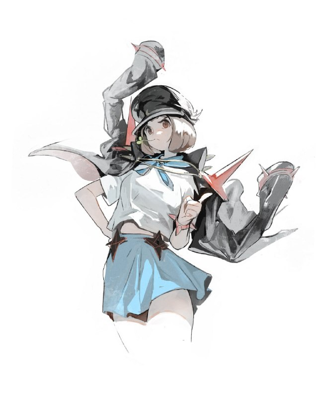

📷 Photo

## dangokimochi — post 11845

  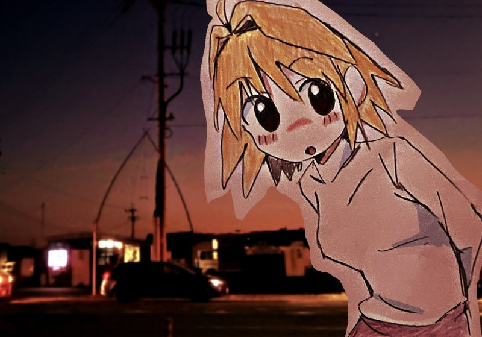

📷 Photo

## Middle_East_Spectator — post 32029

— 🇺🇸/🇮🇷 NEW: One of Iran’s underground missile bases, located near Esfahan, was bombed almost 20 separate times during the war, an average of once every two days, with bunker busting ammunition and smart bombs, including from B-2s and B-52s

Despite the immense amount of firepower used, the base never stopped firing for more than half a day, before returning back to operations.

One Esfahan resident said: ‘This mountain, we see it get bombed almost every night, we see the smoke rise. Yet when we wake up in the morning, it’s from these very same mountains that we see missiles rising into the sky’

@Middle_East_Spectator

## Middle_East_Spectator — post 32028

  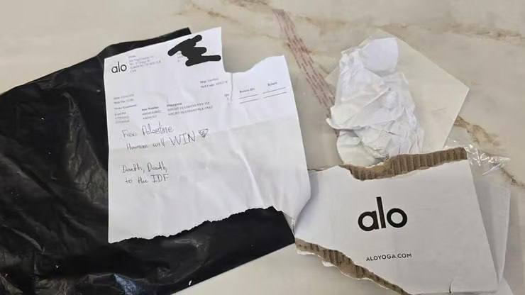

— 🇺🇸/🇮🇱/🇵🇸 NEW: An Israeli woman who ordered Yoga pants from a company in America instead received a note with ‘Free Palestine, Hamas will win, death to the IDF’

@Middle_East_Spectator

## Middle_East_Spectator — post 32027

—❗️🇮🇷/🇵🇰 NEW: Images from Karachi airport reveal for the first time that Iran flew some planes to Pakistan in order to avoid destruction by Israel during the 12-day war back in June Some of Iran's Air Force assets are still being kept safe inside Pakistan…

## Middle_East_Spectator — post 32025

—❗️🇮🇷/🇵🇰 NEW: Images from Karachi airport reveal for the first time that Iran flew some planes to Pakistan in order to avoid destruction by Israel during the 12-day war back in June

Some of Iran's Air Force assets are still being kept safe inside Pakistan, including a KC-707 ELINT aircraft and two Boeing 747 transport aircraft.

@Middle_East_Spectator

## Middle_East_Spectator — post 32023

  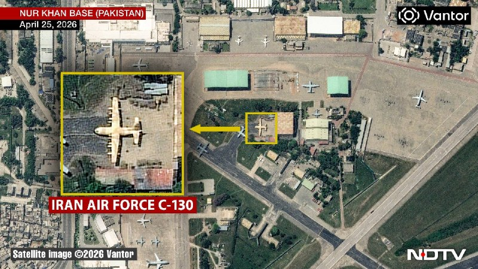

— 🇮🇷/🇵🇰 NEW: Pakistan sheltering Iranian Air Force C-130s has been confirmed by satellite imagery

However, I don’t understand why the Trump people are suddenly shocked or outraged by this, as Iranian planes were already known to be stationed in Karachi during 12-Days War.

@Middle_East_Spectator

## Middle_East_Spectator — post 32022

  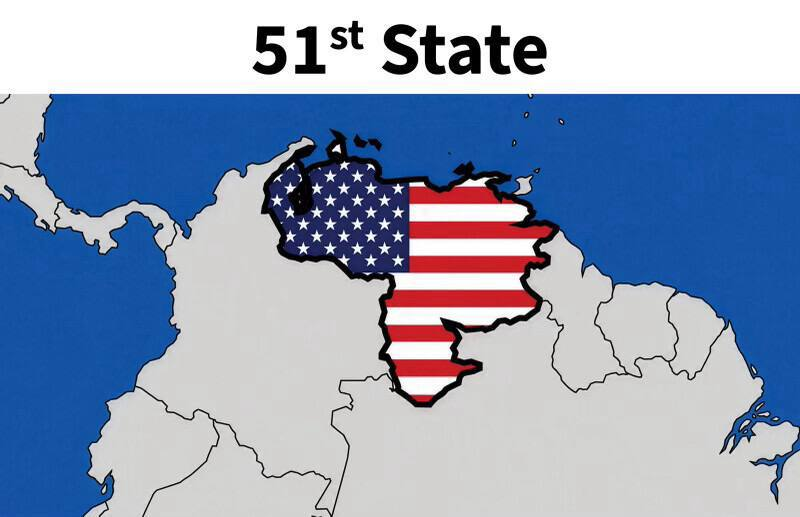

Trump posts Venezuela as 51st state.

## Middle_East_Spectator — post 32021

— 🇺🇸/🇮🇷 NEW: The current estimate is that about 10% of Iran’s missile bases have been permanently disabled by U.S. strikes, according to NYT

The remaining 90% of missile bases and launch sites throughout the country remain ‘either fully or partially operational’, and are likely too heavily fortified to disable with airstrikes alone.

@Middle_East_Spectator

## Middle_East_Spectator — post 32020

  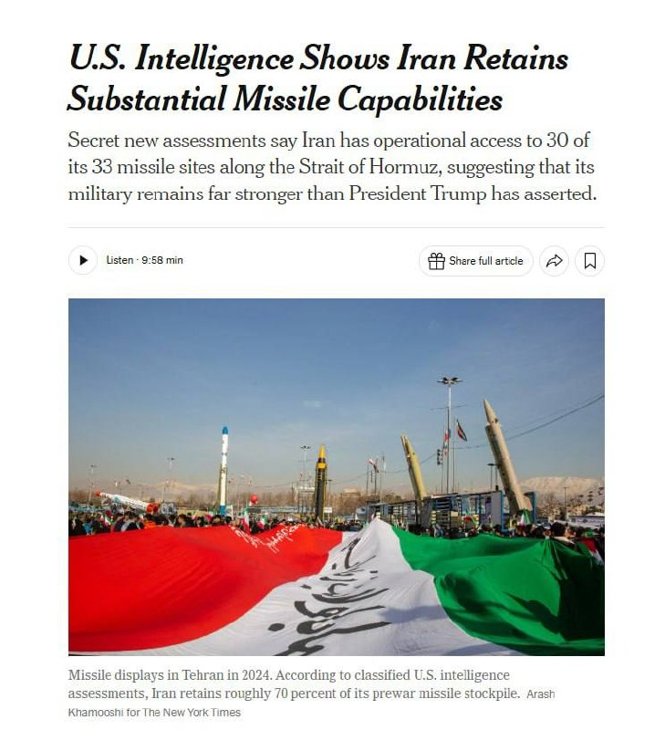

— 🇺🇸/🇮🇷 NEW: A secret U.S. intelligence assessment shows that Iran still has access to 90% of its underground missile bases and launch sites nationwide — including at least 30 out of 33 missile sites along the Strait of Hormuz that are still operational – New York Times

@Middle_East_Spectator

## LiveMuseumOfIgnorancy — post 11506

  

📷 Photo

## LiveMuseumOfIgnorancy — post 11505

  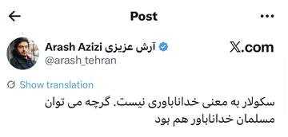

📷 Photo

## animenewsnetwork_feed — post 41577

  

Lupin III Composer, Jazz Pianist Yuji Ohno Dies at 84

Ohno composed Lupin III anime's music, iconic theme song since Lupin III: Part II in 1977

## animenewsnetwork_feed — post 41576

  

Captain Tsubasa 2: World Fighters Soccer Game Launches on August 28

Game launches for Switch, PS5, Xbox X|S, PC

## animenewsnetwork_feed — post 41575

  

Man Arrested for Alleged Bomb Threat Against Nintendo Headquarters

Kyoto police arrest 27-year-old for obstructing a business with force

## animenewsnetwork_feed — post 41574

  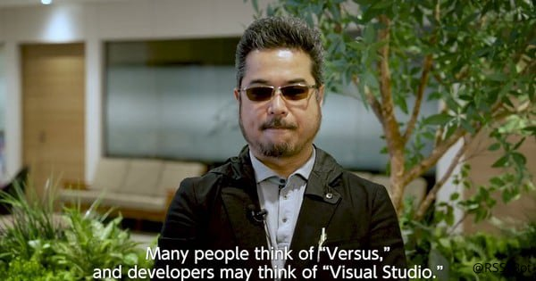

Former Tekken Game Producer Katsuhiro Harada Launches VS Studio SNK

SNK to collaborate with subsidiary on game software development

## animenewsnetwork_feed — post 41573

  

eBay Rejects GameStop's Acquisition Bid

eBay board chair: GameStop's May 3 proposal is "neither credible nor attractive"

---
📅 بروزرسانی: 1405/02/23 01:18
---

## Configshub2 — post 1690679

#v2ray

vless://ce069292-c8bf-40dd-a6b1-87818a1e64e9@103.13.19.227:443?&security=tls&sni=1-aym.pages.dev&type=ws&headerType=none&host=1-aym.pages.dev&path=%2Ffp%3Dchrome#[🇯🇵]t.me/ConfigsHub

ᴄᴏᴜɴᴛʀʏ: #ᴊᴀᴘᴀɴ(ᴊᴘ)
ᴄᴏɴғɪɢsʜᴜʙ ₪ ᴀʀɪʏᴀ ₪ ʙᴏᴛ ₪ ʜᴇʟᴘ

## Configshub2 — post 1690678

#v2ray

ss://Y2hhY2hhMjAtaWV0Zi1wb2x5MTMwNTpBUmd2R1p5d0ErZ2FjZ0dWMjZCdm11MDUrd1ptUlcvaitBZFUrWjhCdDQ0PQ==@156.38.168.58:990#[🏁]t.me/ConfigsHub

ᴄᴏᴜɴᴛʀʏ: #sᴏᴜᴛʜᴀғʀɪᴄᴀ(ᴢᴀ)
ᴄᴏɴғɪɢsʜᴜʙ ₪ ᴀʀɪʏᴀ ₪ ʙᴏᴛ ₪ ʜᴇʟᴘ

## Configshub2 — post 1690677

  <a href="https://t.me/ConfigsHUB2/1690677" target="_blank">📎 Download file</a>

#nV
ᴄᴏɴғɪɢsʜᴜʙ ₪ ᴀʀɪʏᴀ ₪ ʙᴏᴛ ₪ ʜᴇʟᴘ

## Configshub2 — post 1690676

  <a href="https://t.me/ConfigsHUB2/1690676" target="_blank">📎 Download file</a>

#nV
ᴄᴏɴғɪɢsʜᴜʙ ₪ ᴀʀɪʏᴀ ₪ ʙᴏᴛ ₪ ʜᴇʟᴘ

## Configshub2 — post 1690675

#v2ray

ss://Y2hhY2hhMjAtaWV0Zi1wb2x5MTMwNTpBUmd2R1p5d0ErZ2FjZ0dWMjZCdm11MDUrd1ptUlcvaitBZFUrWjhCdDQ0PQ@119.59.127.129:990#[🇹🇭]t.me/ConfigsHub

ᴄᴏᴜɴᴛʀʏ: #ᴛʜᴀɪʟᴀɴᴅ(ᴛʜ)
ᴄᴏɴғɪɢsʜᴜʙ ₪ ᴀʀɪʏᴀ ₪ ʙᴏᴛ ₪ ʜᴇʟᴘ

## Configshub2 — post 1690674

#v2ray

vless://6202b230-417c-4d8e-b624-0f71afa9c75d@104.20.6.134:2096?path=/&security=tls&encryption=none&insecure=1&host=sni.111000.indevs.in&type=ws&allowInsecure=1&sni=sni.111000.indevs.in#[🇨🇦]t.me/ConfigsHub

ᴄᴏᴜɴᴛʀʏ: #ᴄᴀɴᴀᴅᴀ(ᴄᴀ)
ᴄᴏɴғɪɢsʜᴜʙ ₪ ᴀʀɪʏᴀ ₪ ʙᴏᴛ ₪ ʜᴇʟᴘ

## Configshub2 — post 1690673

  <a href="https://t.me/ConfigsHUB2/1690673" target="_blank">📎 Download file</a>

#nV
ᴄᴏɴғɪɢsʜᴜʙ ₪ ᴀʀɪʏᴀ ₪ ʙᴏᴛ ₪ ʜᴇʟᴘ

## Configshub2 — post 1690672

  <a href="https://t.me/ConfigsHUB2/1690672" target="_blank">📎 Download file</a>

#nV
ᴄᴏɴғɪɢsʜᴜʙ ₪ ᴀʀɪʏᴀ ₪ ʙᴏᴛ ₪ ʜᴇʟᴘ

## Configshub2 — post 1690671

  <a href="https://t.me/ConfigsHUB2/1690671" target="_blank">📎 Download file</a>

#nV
ᴄᴏɴғɪɢsʜᴜʙ ₪ ᴀʀɪʏᴀ ₪ ʙᴏᴛ ₪ ʜᴇʟᴘ

## Configshub2 — post 1690670

  <a href="https://t.me/ConfigsHUB2/1690670" target="_blank">📎 Download file</a>

#nV
ᴄᴏɴғɪɢsʜᴜʙ ₪ ᴀʀɪʏᴀ ₪ ʙᴏᴛ ₪ ʜᴇʟᴘ

## Configshub2 — post 1690669

  <a href="https://t.me/ConfigsHUB2/1690669" target="_blank">📎 Download file</a>

#nV
ᴄᴏɴғɪɢsʜᴜʙ ₪ ᴀʀɪʏᴀ ₪ ʙᴏᴛ ₪ ʜᴇʟᴘ

## Configshub2 — post 1690668

  <a href="https://t.me/ConfigsHUB2/1690668" target="_blank">📎 Download file</a>

#nV
ᴄᴏɴғɪɢsʜᴜʙ ₪ ᴀʀɪʏᴀ ₪ ʙᴏᴛ ₪ ʜᴇʟᴘ

## Configshub2 — post 1690667

#v2ray

vless://f9f57c0b-b473-4fe9-8603-21e42613be04@snappfood.ir:8880?security=none&type=ws&headerType=&path=%2Fcdn&host=dl4.movizdl.ir#[🇮🇷]t.me/ConfigsHub

ᴄᴏᴜɴᴛʀʏ: #ɪʀᴀɴ(ɪʀ)
ᴄᴏɴғɪɢsʜᴜʙ ₪ ᴀʀɪʏᴀ ₪ ʙᴏᴛ ₪ ʜᴇʟᴘ

## Configshub2 — post 1690666

#v2ray

trojan://8r%3C%5B9%27l6hAO%238ZQi@172.64.149.54:2096?path=%2Ftr&security=tls&host=Koma-YT.PAGeS.Dev&type=ws&sni=Koma-YT.PAGeS.Dev#[🇨🇦]t.me/ConfigsHub

ᴄᴏᴜɴᴛʀʏ: #ᴄᴀɴᴀᴅᴀ(ᴄᴀ)
ᴄᴏɴғɪɢsʜᴜʙ ₪ ᴀʀɪʏᴀ ₪ ʙᴏᴛ ₪ ʜᴇʟᴘ

## Configshub2 — post 1690665

#v2ray

vless://3563b254-8c4d-4c3d-9f62-5c7de6f3a308@snapp.ir:80?security=none&allowInsecure=0&encryption=none&type=ws&host=cdn1.xoorvip.ir&path=/#[🇮🇷]t.me/ConfigsHub

ᴄᴏᴜɴᴛʀʏ: #ɪʀᴀɴ(ɪʀ)
ᴄᴏɴғɪɢsʜᴜʙ ₪ ᴀʀɪʏᴀ ₪ ʙᴏᴛ ₪ ʜᴇʟᴘ

## Configshub2 — post 1690664

#v2ray

vless://3563b254-8c4d-4c3d-9f62-5c7de6f3a308@snapp.ir:80?security=none&allowInsecure=0&encryption=none&type=ws&host=cdn1.xoorvip.ir&path=/#[🇮🇷]t.me/ConfigsHub

ᴄᴏᴜɴᴛʀʏ: #ɪʀᴀɴ(ɪʀ)
ᴄᴏɴғɪɢsʜᴜʙ ₪ ᴀʀɪʏᴀ ₪ ʙᴏᴛ ₪ ʜᴇʟᴘ

## Configshub2 — post 1690663

#v2ray

trojan://8r%3C%5B9%27l6hAO%238ZQi@172.64.149.54:2096?path=%2Ftr&security=tls&host=Koma-YT.PAGeS.Dev&type=ws&sni=Koma-YT.PAGeS.Dev#[🇨🇦]t.me/ConfigsHub

ᴄᴏᴜɴᴛʀʏ: #ᴄᴀɴᴀᴅᴀ(ᴄᴀ)
ᴄᴏɴғɪɢsʜᴜʙ ₪ ᴀʀɪʏᴀ ₪ ʙᴏᴛ ₪ ʜᴇʟᴘ

## Configshub2 — post 1690662

#v2ray

vless://3563b254-8c4d-4c3d-9f62-5c7de6f3a308@snapp.ir:80?security=none&allowInsecure=0&encryption=none&type=ws&host=cdn1.xoorvip.ir&path=/#[🇮🇷]t.me/ConfigsHub

ᴄᴏᴜɴᴛʀʏ: #ɪʀᴀɴ(ɪʀ)
ᴄᴏɴғɪɢsʜᴜʙ ₪ ᴀʀɪʏᴀ ₪ ʙᴏᴛ ₪ ʜᴇʟᴘ

## Configshub2 — post 1690661

#v2ray

vless://2daf1396-0383-4276-a054-baded537c6b3@185.143.233.200:8880?security=none&allowInsecure=0&encryption=mlkem768x25519plus.native.0rtt.-dHBgFiE3o72yiSy-lApCXI5RZiQ__iyVOGUfrCZiwM&type=ws&host=nima.hayalco.ir&path=/#[🇮🇷]t.me/ConfigsHub

ᴄᴏᴜɴᴛʀʏ: #ɪʀᴀɴ(ɪʀ)
ᴄᴏɴғɪɢsʜᴜʙ ₪ ᴀʀɪʏᴀ ₪ ʙᴏᴛ ₪ ʜᴇʟᴘ

## Configshub2 — post 1690660

#v2ray

vless://3563b254-8c4d-4c3d-9f62-5c7de6f3a308@snapp.ir:80?security=none&allowInsecure=0&encryption=none&type=ws&host=cdn1.xoorvip.ir&path=/#[🇮🇷]t.me/ConfigsHub

ᴄᴏᴜɴᴛʀʏ: #ɪʀᴀɴ(ɪʀ)
ᴄᴏɴғɪɢsʜᴜʙ ₪ ᴀʀɪʏᴀ ₪ ʙᴏᴛ ₪ ʜᴇʟᴘ

## KiranTimes — post 1079

🇺🇸🇮🇷⚡️- BREAKING: Iran has access to the majority of its missile and launch sites, with 90% reportedly operational. - NYT citing intelligence agencies.

## KiranTimes — post 1078

🇺🇸🇮🇷⚡️- BREAKING: Iran has access to the majority of its missile and launch sites, with 90% reportedly operational. - NYT citing intelligence agencies.

## KiranTimes — post 1077

  <a href="telegram/content/KiranTimes_1077_1778622489.mp4" target="_blank">🎬 Download video</a>

کیرانیو انقدر فشاری کردیم خودشو لو داد

## KiranTimes — post 1076

محض اطلاع ام بنده ارشیام. و‌ مانی نیستم.

## KiranTimes — post 1075

محض اطلاع ام بنده ارشیام.
و‌ مانی نیستم.

## KiranTimes — post 1074

  <a href="telegram/content/KiranTimes_1074_1778622491.mp4" target="_blank">🎬 Download video</a>

نئوبسیجی‌های ددی ایشوزی

## KiranTimes — post 1072

عشق دنیا رو کرده بخدا.
کاش منم جای سر و کله زدن با نئوبسیجی‌های ددی ایشوزی، در حال پست کردن میم‌های کسشر با وای‌فای کمپ دیوید بودم.

## shitpostkid — post 17999

  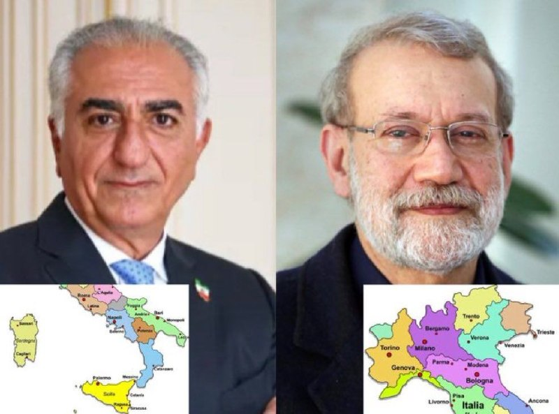

📷 Photo

## cyberfiend666 — post 32713

  <a href="telegram/content/cyberfiend666_32713_1778622493.mp4" target="_blank">🎬 Download video</a>

🎬 Video

## cyberfiend666 — post 32712

  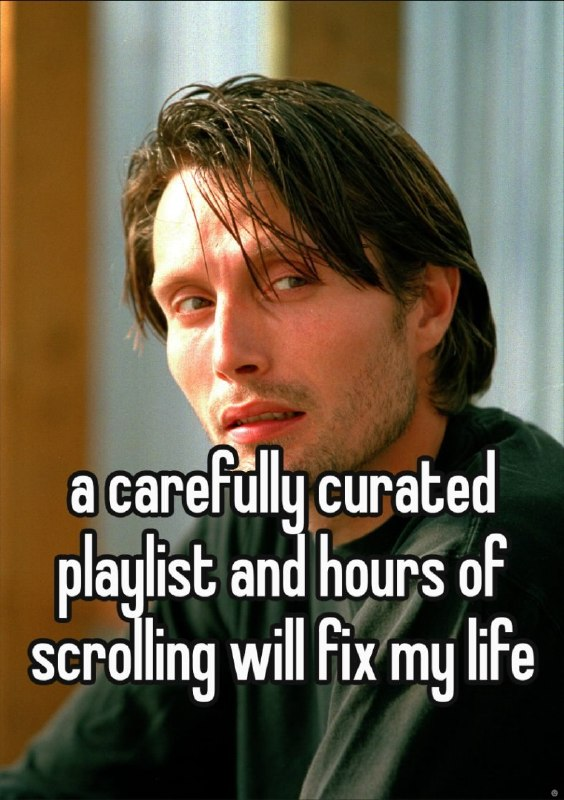

📷 Photo

## Middle_East_Spectator — post 32019

  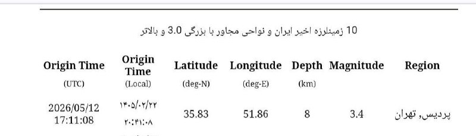

🇮🇷| An earthquake of 3.4 Richter magnitude at a depth of 8km shook Pardis, Tehran

@FotrosResistancee

## Middle_East_Spectator — post 32018

  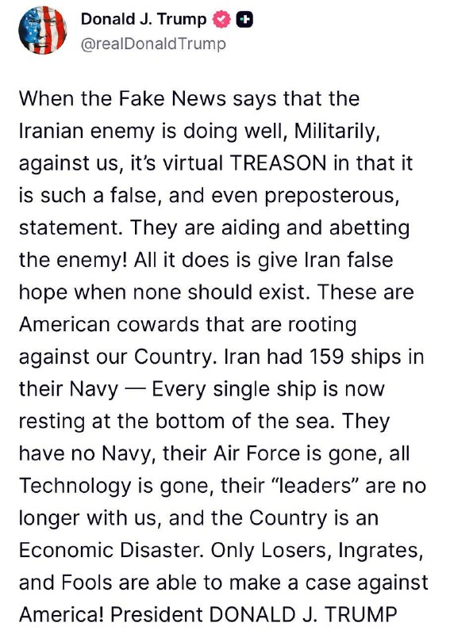

— 🇺🇸/🇮🇷 President Trump on Truth Social:

‘When the Fake News says that the Iranian enemy is doing well, Militarily, against us, it’s virtual TREASON in that it is such a false, and even preposterous, statement. They are aiding and abetting the enemy! All it does is give Iran false hope when none should exist. These are American cowards that are rooting against our Country.

Iran had 159 ships in their Navy — Every single ship is now resting at the bottom of the sea. They have no Navy, their Air Force is gone, all Technology is gone, their “leaders” are no longer with us, and the Country is an Economic Disaster. Only Losers, Ingrates, and Fools are able to make a case against America! President DONALD J. TRUMP’

@Middle_East_Spectator

## Middle_East_Spectator — post 32017

— 🇺🇸/🇨🇳/🇮🇷 NEW: The U.S. State Department says that China also agrees that no tolls should be imposed on shipping through the Strait of Hormuz

@Middle_East_Spectator

## Middle_East_Spectator — post 32016

Heavy earthquake felt in Tehran.

## Middle_East_Spectator — post 32015

  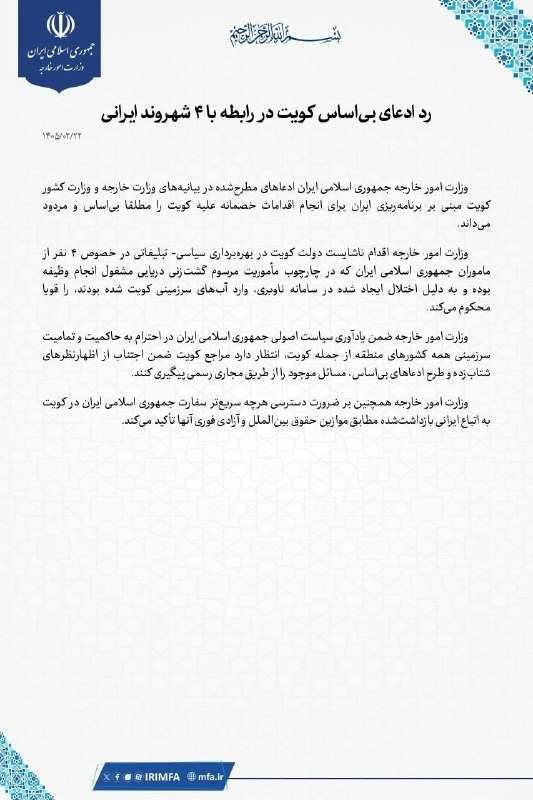

🇰🇼🇮🇷| Iran’s MFA categorically rejects claims made by Kuwait that Iran was planning hostile actions against Kuwait.

The statement says Kuwait’s government is using the case of 4 Iranian citizens for political and propaganda purposes.

According to Iran, these people were Iranian officials who were on a routine maritime patrol/coastal guard mission, but because of a navigation-system disruption, they entered Kuwaiti territorial waters.

@FotrosResistancee

## Middle_East_Spectator — post 32014

🇮🇷🇸🇦⚡️- BREAKING: Saudi Arabia carried out a series of unpublicized retaliatory strikes on Iran

## Middle_East_Spectator — post 32013

  <a href="telegram/content/Middle_East_Spectator_32013_1778622499.mp4" target="_blank">🎬 Download video</a>

— 🇺🇸/🇮🇷 President Trump:

‘I don’t think about America’s financial situation. I only think about one thing; we can not let Iran have a nuclear weapon’

@Middle_East_Spectator

## Middle_East_Spectator — post 32012

— 🇺🇸/🇮🇷 President Trump: ‘Iran has agreed not to possess nuclear weapons’

@Middle_East_Spectator

## Middle_East_Spectator — post 32011

  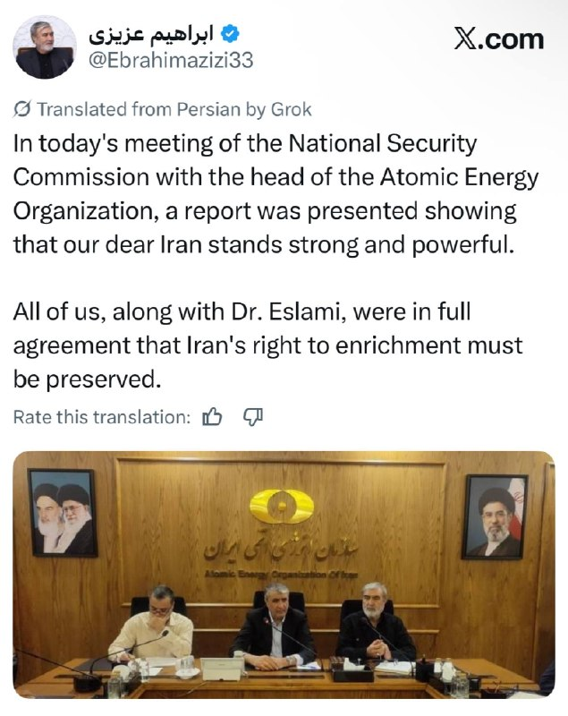

— 🇮🇷/☢️ NEW: Chairman of Iranian Parliament’s National Security Committee, Ebrahim Azizi, says that members of the committee and the head of Iran’s Atomic Energy Agency are in ‘full agreement’ that Iran’s right to enrich must be preserved

@Middle_East_Spectator

## Middle_East_Spectator — post 32010

  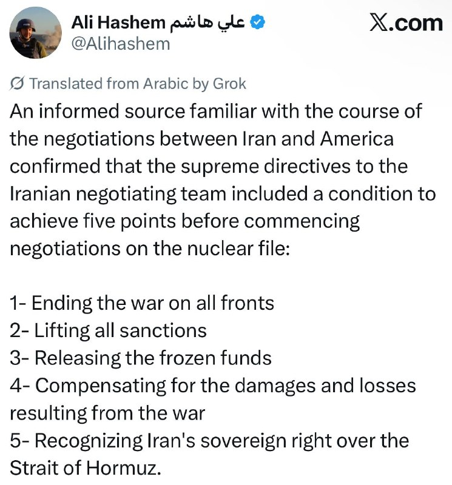

—❗️🇺🇸/🇮🇷 NEW: According to Al-Jazeera, Iran’s Supreme Leader Ayatollah Mojtaba Khamenei has given the negotiators 5 conditions that must be met before entering talks related to the nuclear file 1. Ending the war on all fronts in the region, including Lebanon…

## Middle_East_Spectator — post 32009

  

—❗️🇺🇸/🇮🇷 NEW: According to Al-Jazeera, Iran’s Supreme Leader Ayatollah Mojtaba Khamenei has given the negotiators 5 conditions that must be met before entering talks related to the nuclear file

1. Ending the war on all fronts in the region, including Lebanon and Gaza.

2. The lifting of all economic sanctions imposed on Iran.

3. Releasing all of Iran’s frozen funds held in foreign banks.

4. Committing to paying reparations for the damages and losses resulting from the war.

5. Recognizing Iran's sovereign right over the Strait of Hormuz.

@Middle_East_Spectator

## animenewsnetwork_feed — post 41572

  

Creating a Fanclub: Director Sou Toyama on Kirio Fan Club

What makes Kirio Fan Club a more realistic look at high school crushes? Director of the upcoming anime, Sou Toyama, gets into it.

## animenewsnetwork_feed — post 41571

  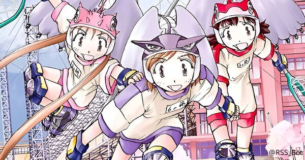

AnimEigo Schedules Alien Nine Anime Blu-ray Disc for June 9

AnimEigo announced on Monday that its physical Blu-ray Disc release of the original video anime adaptation of Hitoshi Tomizawa Alien Nine manga will...

## animenewsnetwork_feed — post 41570

  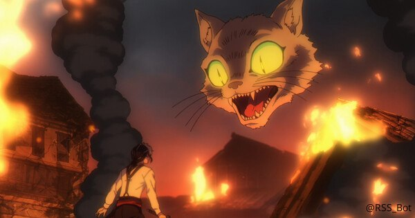

MAO ‒ Episodes 5-6

No dispensary in the world could make these stakes even higher.

## animenewsnetwork_feed — post 41569

  

King of Prism, Last Sharknado Hold Double-Feature With Audience Call Backs Encouraged

What does an idol anime movie & Sharknado 6 have in common? Time travel.

---
📅 بروزرسانی: 1405/02/22 20:08
---

## Configshub2 — post 1686918

  <a href="https://t.me/ConfigsHUB2/1686918" target="_blank">📎 Download file</a>

#nV
ᴄᴏɴғɪɢsʜᴜʙ ₪ ᴀʀɪʏᴀ ₪ ʙᴏᴛ ₪ ʜᴇʟᴘ

## Configshub2 — post 1686917

#v2ray

vless://6202b230-41c-4d8e-b624-0f71afa95d@.38.142.152:443?enr%2ل2%655zjaxx%%%%%%%hh5%js%nk%%%%jlp855552%%mslal4soookk#[🏁]t.me/ConfigsHub

ᴄᴏᴜɴᴛʀʏ: ɴᴏᴛ ғᴏᴜɴᴅ
ᴄᴏɴғɪɢsʜᴜʙ ₪ ᴀʀɪʏᴀ ₪ ʙᴏᴛ ₪ ʜᴇʟᴘ

## Configshub2 — post 1686916

  <a href="https://t.me/ConfigsHUB2/1686916" target="_blank">📎 Download file</a>

#nV
ᴄᴏɴғɪɢsʜᴜʙ ₪ ᴀʀɪʏᴀ ₪ ʙᴏᴛ ₪ ʜᴇʟᴘ

## Configshub2 — post 1686915

#v2ray

vless://6202b230-41c-4d8e-b624-0f71afa95d@.38.142.152:443?enr%2ل2%655zjaxx%%%ks%%8u%%hh5%js%nk%%%%jlp855552%%mslal4soookk#[🏁]t.me/ConfigsHub

ᴄᴏᴜɴᴛʀʏ: ɴᴏᴛ ғᴏᴜɴᴅ
ᴄᴏɴғɪɢsʜᴜʙ ₪ ᴀʀɪʏᴀ ₪ ʙᴏᴛ ₪ ʜᴇʟᴘ

## Configshub2 — post 1686914

#v2ray

vless://6202b230-41c-4d8e-b624-0f71afa95d@.38.142.152:3?enr%2ل2%655zjaxx%%%%%8u%%hh5%js%nk%%%%jlp855552%%mslal4soookk#[🏁]t.me/ConfigsHub

ᴄᴏᴜɴᴛʀʏ: ɴᴏᴛ ғᴏᴜɴᴅ
ᴄᴏɴғɪɢsʜᴜʙ ₪ ᴀʀɪʏᴀ ₪ ʙᴏᴛ ₪ ʜᴇʟᴘ

## Configshub2 — post 1686913

  <a href="https://t.me/ConfigsHUB2/1686913" target="_blank">📎 Download file</a>

#nV
ᴄᴏɴғɪɢsʜᴜʙ ₪ ᴀʀɪʏᴀ ₪ ʙᴏᴛ ₪ ʜᴇʟᴘ

## Configshub2 — post 1686912

  <a href="https://t.me/ConfigsHUB2/1686912" target="_blank">📎 Download file</a>

#nV
ᴄᴏɴғɪɢsʜᴜʙ ₪ ᴀʀɪʏᴀ ₪ ʙᴏᴛ ₪ ʜᴇʟᴘ

## Configshub2 — post 1686911

#v2ray

vless://6202b230-41c-4d8e-b624-0f71afa95d@.38.142.152:443?enr%2ل2%655zjaxx%%%%8u%%hh5%js%nk%%%%jlp855552%%mslal4soookk#[🏁]t.me/ConfigsHub

ᴄᴏᴜɴᴛʀʏ: ɴᴏᴛ ғᴏᴜɴᴅ
ᴄᴏɴғɪɢsʜᴜʙ ₪ ᴀʀɪʏᴀ ₪ ʙᴏᴛ ₪ ʜᴇʟᴘ

## Configshub2 — post 1686910

#v2ray

vless://8de056dc-1856-461e-9ad1-3b6b638c02bb@@HalonetVPN:8880?path=%2F&security=&encryption=none&type=ws#[🏁]t.me/ConfigsHub

ᴄᴏᴜɴᴛʀʏ: ɴᴏᴛ ғᴏᴜɴᴅ
ᴄᴏɴғɪɢsʜᴜʙ ₪ ᴀʀɪʏᴀ ₪ ʙᴏᴛ ₪ ʜᴇʟᴘ

## Configshub2 — post 1686909

#v2ray

trojan://2a599135-886f-4359-bf68-0993baa990f1@79.127.82.170:443?path=%2F1000%2F10%2Fb449693f-1869-4379-946d-279f2ad95021&security=tls&alpn=h3%2Ch2%2Chttp%2F1.1&insecure=0&host=wow-game-server-gb-nb-d.world-of-warcraft-game-server.cfd&fp=randomized&type=ws&allowInsecure=0&sni=wow-game-server-gb-nb-d.world-of-warcraft-game-server.cfd#[🇮🇷]t.me/ConfigsHub

ᴄᴏᴜɴᴛʀʏ: #ɪʀᴀɴ(ɪʀ)
ᴄᴏɴғɪɢsʜᴜʙ ₪ ᴀʀɪʏᴀ ₪ ʙᴏᴛ ₪ ʜᴇʟᴘ

## Configshub2 — post 1686908

#v2ray

vless://6202b230-41c-4d8e-b624-0f71afa95d@.38.142.152:443?enr%2ل2%655zjaxx%%%%%8u%%hh5%js%nk%%%%jlp855552%%mslal4soookk#[🏁]t.me/ConfigsHub

ᴄᴏᴜɴᴛʀʏ: ɴᴏᴛ ғᴏᴜɴᴅ
ᴄᴏɴғɪɢsʜᴜʙ ₪ ᴀʀɪʏᴀ ₪ ʙᴏᴛ ₪ ʜᴇʟᴘ

## Configshub2 — post 1686907

  <a href="https://t.me/ConfigsHUB2/1686907" target="_blank">📎 Download file</a>

#nV
ᴄᴏɴғɪɢsʜᴜʙ ₪ ᴀʀɪʏᴀ ₪ ʙᴏᴛ ₪ ʜᴇʟᴘ

## Configshub2 — post 1686906

  <a href="https://t.me/ConfigsHUB2/1686906" target="_blank">📎 Download file</a>

#nV
ᴄᴏɴғɪɢsʜᴜʙ ₪ ᴀʀɪʏᴀ ₪ ʙᴏᴛ ₪ ʜᴇʟᴘ

## Configshub2 — post 1686905

  <a href="https://t.me/ConfigsHUB2/1686905" target="_blank">📎 Download file</a>

#nV
ᴄᴏɴғɪɢsʜᴜʙ ₪ ᴀʀɪʏᴀ ₪ ʙᴏᴛ ₪ ʜᴇʟᴘ

## Configshub2 — post 1686904

  <a href="https://t.me/ConfigsHUB2/1686904" target="_blank">📎 Download file</a>

#nV
ᴄᴏɴғɪɢsʜᴜʙ ₪ ᴀʀɪʏᴀ ₪ ʙᴏᴛ ₪ ʜᴇʟᴘ

## Configshub2 — post 1686903

  <a href="https://t.me/ConfigsHUB2/1686903" target="_blank">📎 Download file</a>

#nV
ᴄᴏɴғɪɢsʜᴜʙ ₪ ᴀʀɪʏᴀ ₪ ʙᴏᴛ ₪ ʜᴇʟᴘ

## Configshub2 — post 1686902

  <a href="https://t.me/ConfigsHUB2/1686902" target="_blank">📎 Download file</a>

#nV
ᴄᴏɴғɪɢsʜᴜʙ ₪ ᴀʀɪʏᴀ ₪ ʙᴏᴛ ₪ ʜᴇʟᴘ

## Configshub2 — post 1686901

  <a href="https://t.me/ConfigsHUB2/1686901" target="_blank">📎 Download file</a>

#nV
ᴄᴏɴғɪɢsʜᴜʙ ₪ ᴀʀɪʏᴀ ₪ ʙᴏᴛ ₪ ʜᴇʟᴘ

## Configshub2 — post 1686900

  <a href="https://t.me/ConfigsHUB2/1686900" target="_blank">📎 Download file</a>

#nV
ᴄᴏɴғɪɢsʜᴜʙ ₪ ᴀʀɪʏᴀ ₪ ʙᴏᴛ ₪ ʜᴇʟᴘ

## Configshub2 — post 1686899

#v2ray

vless://6202b230-41c-4d8e-b624-0f71afa95d@.38.142.152:443?enr%22%655zjaxx%%%%%8u%%hh5%js-%nk%%%%jlp855552%%mslal4soookk#[🏁]t.me/ConfigsHub

ᴄᴏᴜɴᴛʀʏ: ɴᴏᴛ ғᴏᴜɴᴅ
ᴄᴏɴғɪɢsʜᴜʙ ₪ ᴀʀɪʏᴀ ₪ ʙᴏᴛ ₪ ʜᴇʟᴘ

## animenewsnetwork_feed — post 41568

  

Milky☆Subway: The Galactic Limited Express Anime Series Review

This series makes the most of its limited runtime thanks to fantastic dialogue that feels unlike anything you run across in the vast majority of modern anime.

## animenewsnetwork_feed — post 41567

  

Akane-banashi ‒ Episode 6

The people feel real, the place feels real, and both will be familiar yet given an allure of novelty because of the time displacement from the here and now.

---
📅 بروزرسانی: 1405/02/22 18:55
---

## Configshub2 — post 1686439

#v2ray

vless://937dde02-4ce6-4f0d-a3be-27aef7d3ef46@s4.tehranionliine.ir:80?path=%2F&security=&encryption=none&type=ws#[🇮🇷]t.me/ConfigsHub

ᴄᴏᴜɴᴛʀʏ: #ɪʀᴀɴ(ɪʀ)
ᴄᴏɴғɪɢsʜᴜʙ ₪ ᴀʀɪʏᴀ ₪ ʙᴏᴛ ₪ ʜᴇʟᴘ

## Configshub2 — post 1686438

  <a href="https://t.me/ConfigsHUB2/1686438" target="_blank">📎 Download file</a>

#nV
ᴄᴏɴғɪɢsʜᴜʙ ₪ ᴀʀɪʏᴀ ₪ ʙᴏᴛ ₪ ʜᴇʟᴘ

## Configshub2 — post 1686437

  <a href="https://t.me/ConfigsHUB2/1686437" target="_blank">📎 Download file</a>

#nV
ᴄᴏɴғɪɢsʜᴜʙ ₪ ᴀʀɪʏᴀ ₪ ʙᴏᴛ ₪ ʜᴇʟᴘ

## Configshub2 — post 1686436

  <a href="https://t.me/ConfigsHUB2/1686436" target="_blank">📎 Download file</a>

#nV
ᴄᴏɴғɪɢsʜᴜʙ ₪ ᴀʀɪʏᴀ ₪ ʙᴏᴛ ₪ ʜᴇʟᴘ

## Configshub2 — post 1686435

  <a href="https://t.me/ConfigsHUB2/1686435" target="_blank">📎 Download file</a>

#nV
ᴄᴏɴғɪɢsʜᴜʙ ₪ ᴀʀɪʏᴀ ₪ ʙᴏᴛ ₪ ʜᴇʟᴘ

## Configshub2 — post 1686434

  <a href="https://t.me/ConfigsHUB2/1686434" target="_blank">📎 Download file</a>

#nV
ᴄᴏɴғɪɢsʜᴜʙ ₪ ᴀʀɪʏᴀ ₪ ʙᴏᴛ ₪ ʜᴇʟᴘ

## Configshub2 — post 1686433

  <a href="https://t.me/ConfigsHUB2/1686433" target="_blank">📎 Download file</a>

#nV
ᴄᴏɴғɪɢsʜᴜʙ ₪ ᴀʀɪʏᴀ ₪ ʙᴏᴛ ₪ ʜᴇʟᴘ

## Configshub2 — post 1686432

  <a href="https://t.me/ConfigsHUB2/1686432" target="_blank">📎 Download file</a>

#nV
ᴄᴏɴғɪɢsʜᴜʙ ₪ ᴀʀɪʏᴀ ₪ ʙᴏᴛ ₪ ʜᴇʟᴘ

## Configshub2 — post 1686431

  <a href="https://t.me/ConfigsHUB2/1686431" target="_blank">📎 Download file</a>

#nV
ᴄᴏɴғɪɢsʜᴜʙ ₪ ᴀʀɪʏᴀ ₪ ʙᴏᴛ ₪ ʜᴇʟᴘ

## Configshub2 — post 1686430

  <a href="https://t.me/ConfigsHUB2/1686430" target="_blank">📎 Download file</a>

#nV
ᴄᴏɴғɪɢsʜᴜʙ ₪ ᴀʀɪʏᴀ ₪ ʙᴏᴛ ₪ ʜᴇʟᴘ

## Configshub2 — post 1686429

  <a href="https://t.me/ConfigsHUB2/1686429" target="_blank">📎 Download file</a>

#nV
ᴄᴏɴғɪɢsʜᴜʙ ₪ ᴀʀɪʏᴀ ₪ ʙᴏᴛ ₪ ʜᴇʟᴘ

## Configshub2 — post 1686428

#v2ray

vless://799f939b-964b-4416-84ac-18a6ace7fe70@camp.nahidapp.com:443?encryption=none&type=ws&security=tls&path=%2FIF_VPN_Bot&host=camp.nahidapp.com&sni=camp.nahidapp.com&allowInsecure=0#[🇮🇷]t.me/ConfigsHub

ᴄᴏᴜɴᴛʀʏ: #ɪʀᴀɴ(ɪʀ)
ᴄᴏɴғɪɢsʜᴜʙ ₪ ᴀʀɪʏᴀ ₪ ʙᴏᴛ ₪ ʜᴇʟᴘ

## Configshub2 — post 1686427

#v2ray

vless://d230f0f7-6826-4f8e-8dbb-69ee2c837358@24dc5c91924c5346.freestly.sapienza-mahan.ir:443?mode=auto&security=tls&alpn=h2%2Chttp%2F1.1&encryption=none&insecure=1&host=nazan-baba-z1.global.ssl.fastly.net&fp=firefox&type=xhttp&allowInsecure=1&sni=speedtest.net#[🇮🇹]t.me/ConfigsHub

ᴄᴏᴜɴᴛʀʏ: #ɪᴛᴀʟʏ(ɪᴛ)
ᴄᴏɴғɪɢsʜᴜʙ ₪ ᴀʀɪʏᴀ ₪ ʙᴏᴛ ₪ ʜᴇʟᴘ

## Configshub2 — post 1686426

  <a href="https://t.me/ConfigsHUB2/1686426" target="_blank">📎 Download file</a>

#nV
ᴄᴏɴғɪɢsʜᴜʙ ₪ ᴀʀɪʏᴀ ₪ ʙᴏᴛ ₪ ʜᴇʟᴘ

## Configshub2 — post 1686425

  <a href="https://t.me/ConfigsHUB2/1686425" target="_blank">📎 Download file</a>

#nV
ᴄᴏɴғɪɢsʜᴜʙ ₪ ᴀʀɪʏᴀ ₪ ʙᴏᴛ ₪ ʜᴇʟᴘ

## Configshub2 — post 1686424

  <a href="https://t.me/ConfigsHUB2/1686424" target="_blank">📎 Download file</a>

#nV
ᴄᴏɴғɪɢsʜᴜʙ ₪ ᴀʀɪʏᴀ ₪ ʙᴏᴛ ₪ ʜᴇʟᴘ

## Configshub2 — post 1686423

  <a href="https://t.me/ConfigsHUB2/1686423" target="_blank">📎 Download file</a>

#nV
ᴄᴏɴғɪɢsʜᴜʙ ₪ ᴀʀɪʏᴀ ₪ ʙᴏᴛ ₪ ʜᴇʟᴘ

## Configshub2 — post 1686422

  <a href="https://t.me/ConfigsHUB2/1686422" target="_blank">📎 Download file</a>

#nV
ᴄᴏɴғɪɢsʜᴜʙ ₪ ᴀʀɪʏᴀ ₪ ʙᴏᴛ ₪ ʜᴇʟᴘ

## Configshub2 — post 1686421

  <a href="https://t.me/ConfigsHUB2/1686421" target="_blank">📎 Download file</a>

#nV
ᴄᴏɴғɪɢsʜᴜʙ ₪ ᴀʀɪʏᴀ ₪ ʙᴏᴛ ₪ ʜᴇʟᴘ

## Configshub2 — post 1686420

  <a href="https://t.me/ConfigsHUB2/1686420" target="_blank">📎 Download file</a>

#nV
ᴄᴏɴғɪɢsʜᴜʙ ₪ ᴀʀɪʏᴀ ₪ ʙᴏᴛ ₪ ʜᴇʟᴘ

## sugoileaks — post 3950

  

New Story KV for the ongoing fantasy anime "WITCH HAT ATELIER"

EP8 will premiere in Crunchyroll on May 18, 2026 & it'll consist of 13 EPs!!

Studio: BUG FILMS

Based on the Fantasy Manga by Shirahama Kamome.

SUMMARY:
The story centers on Coco, a girl who lives in a little village, and who has always dreamed of becoming a wizard.
But being born without magical aptitude meant that she could never become a wizard, and could never hope to witness magic's spark.
She gave up on her dream.
But one day, a traveling wizard named Qifrey came to her village, and she happened to see him performing magic.

STAFF:
Director: Ayumu Watanabe
Ass. Director: Jun Shinohara
Series Comp.: Hiroshi Seko
Character Design & Chief Animation Director: Kairi Unabara
Art Director: Ryouta Gotou
Color Design: Naomi Nakano
Director Of Photography: Tadashi Kitaoka
Music: Yuka Kitamura

## Deep_iranian_web — post 18585

  <a href="https://t.me/deep_iranian_web/18585" target="_blank">📎 Download file</a>

💢 دکلمه جدیدِ امیرخانِ تتلو از زندان 🙂 💡...

## Deep_iranian_web — post 18584

🇮🇷ایرانسل و همراه اول به‌زودی سرویس جدید «سیمکارت پرو» را برای مشترکان خود عرضه خواهند کرد.
این سرویس با هدف بهبود امنیت، افزایش سرعت و ارائه قابلیت‌های هوشمند طراحی شده است.

برای ثبت درخواست اولیه و انجام بررسی‌ها و اعتبارسنجی لازم، کافیست کد زیر را ارسال کنید:
🟡ایرانسل: ارسال کد ۵۵۱۲۹۲۷۷ به شماره ۷۵۷۵

🔵همراه اول: ارسال کد ۳۵۷۸۹ به شماره ۸۹۸۹

## Irancirclejerks — post 1290

  

📷 Photo

## KiranTimes — post 1071

  <a href="telegram/content/KiranTimes_1071_1778599544.mp4" target="_blank">🎬 Download video</a>

خودشون به ایران می‌گن کیران و حس می‌کنن: «واهای دادش عجب ریج‌بیتی, واهای برعندازها واهای ما طرفدار انسانیت‌ایم

## KiranTimes — post 1070

  <a href="telegram/content/KiranTimes_1070_1778599545.mp4" target="_blank">🎬 Download video</a>

ما رو پنج دقیقه با یک پهلوی‌ستیز داخل یه اتاق تنها بذارید تا جاویدشاه رو براتون معنی کنیم.

## KiranTimes — post 1069

ما رو پنج دقیقه با یک پهلوی‌ستیز داخل یه اتاق تنها بذارید تا جاویدشاه رو براتون معنی کنیم.

## KiranTimes — post 1068

  

این کودکان بسیجی-برنی‌سندرزی که یکم با دیدن میم تو اکسپلور انگلیسی محاوره‌ای یاد گرفتن هم جدیدا با کانفیگ گیگ ۴۰۰ هزار تومان(حاصل کوس دادن مادرشونه، وگرنه پایگاه محل حتی برای خط پرو هم اینا رو آدم حساب نکرده) میان اینجا طلب کیر برای مادرشون. فکر می‌کنن اسم…

## KiranTimes — post 1067

کودکان بسیجی-برنی سندرزی برپاخیزید!

## KiranTimes — post 1066

  <a href="telegram/content/KiranTimes_1066_1778599547.mp4" target="_blank">🎬 Download video</a>

این کودکان بسیجی-برنی‌سندرزی که یکم با دیدن میم تو اکسپلور انگلیسی محاوره‌ای یاد گرفتن هم جدیدا با کانفیگ گیگ ۴۰۰ هزار تومان(حاصل کوس دادن مادرشونه، وگرنه پایگاه محل حتی برای خط پرو هم اینا رو آدم حساب نکرده) میان اینجا طلب کیر برای مادرشون. فکر می‌کنن اسم…

## KiranTimes — post 1065

ahhhhhhhhh 14y kirani got rage baited

## shitpostkid — post 17998

  <a href="telegram/content/shitpostkid_17998_1778599548.mp4" target="_blank">🎬 Download video</a>

🎬 Video

## Middle_East_Spectator — post 32008

— 🇮🇷/🇰🇼 NEW: Kuwait’s Foreign Ministry summoned the Iranian ambassador, but he did not show up

Instead, a note of protest was delivered to the embassy for Iran’s alleged infiltration of Kuwaiti territory.

@Middle_East_Spectator

## Middle_East_Spectator — post 32005

— 🇮🇷/🇻🇦NEW: Pope Leo XIV presented Iran’s ambassador to the Vatican, Ayatollah Hossein Mokhtari, with the highest diplomatic honor of the Vatican, the ‘Order of Pius’

The medal was awarded for Iran’s extraordinary contributions to peace and interfaith cooperation between Christians and Muslims.

@Middle_East_Spectator

## Middle_East_Spectator — post 32004

— 🇺🇸/🇦🇹 NEW: The Austrian Air Force scrambled Eurofighter Typhoon fighter jets twice in the past two days, to intercept USAF Pilatus U-28A ‘Draco’ special operation aircrafts that entered Austrian airspace without permission, forcing them to turn back – Die Welt

@Middle_East_Spectator

## Middle_East_Spectator — post 32003

— 🇮🇷/🇴🇲 NEW: Iranian and Omani officials held a joint meeting today about the future of the Strait of Hormuz

Oman’s position has apparently shifted since last time, and they have recognized joint Iranian-Omani control over the Strait as sovereign territory.

Iran promised the Omani side that there will be revenue sharing between both sides, as part of good neighbourly relations and Islamic friendship.

@Middle_East_Spectator

## Middle_East_Spectator — post 32002

  

— 🇺🇸 NEW: Trump posts U.S. dollar bills with his own face on it, and the text ‘God bless Donald Trump’

@Middle_East_Spectator

## Middle_East_Spectator — post 32001

  <a href="telegram/content/Middle_East_Spectator_32001_1778599549.mp4" target="_blank">🎬 Download video</a>

— 🇮🇷 WATCH: During the exercise, the mock up of a ‘Black Hawk’ helicopter was destroyed by an FPV drone

It seems that Iran has already prepared to begin widespread use of FPV drones against U.S. special forces in case of any infiltration attempt.

@Middle_East_Spectator

## Middle_East_Spectator — post 31992

— 🇮🇷/
🇮🇷 NEW: Tehran’s ‘Muhammad Rasool Allah’ IRGC corps carried out unannounced wartime exercises to thwart enemy infiltration attempts @Middle_East_Spectator

## Middle_East_Spectator — post 31991

Dear subscribers, for 24/7 updates make sure to check out our friends’ channel Geopolitics Prime

## Middle_East_Spectator — post 31988

— 🇮🇷/
🇮🇷 NEW: Tehran’s ‘Muhammad Rasool Allah’ IRGC corps carried out unannounced wartime exercises to thwart enemy infiltration attempts

@Middle_East_Spectator

## DailyJapaneseThread — post 6697

  <a href="telegram/content/DailyJapaneseThread_6697_1778599550.mp4" target="_blank">🎬 Download video</a>

🎬 Video

## DailyJapaneseThread — post 6696

  <a href="telegram/content/DailyJapaneseThread_6696_1778599551.mp4" target="_blank">🎬 Download video</a>

🎬 Video

## DailyJapaneseThread — post 6695

  

— 🇮🇷/🇯🇵 NEW: Due to the oil shortage, Japan has started printing food packaging in black and white – Reuters

@Middle_East_Spectator

## DailyJapaneseThread — post 6694

  <a href="telegram/content/DailyJapaneseThread_6694_1778599553.mp4" target="_blank">🎬 Download video</a>

🎬 Video

## animenewsnetwork_feed — post 41566

  

Nippon Sangoku The Three Nations of the Crimson Sun ‒ Episode 6

This right here is just pure, absolute cinema, baby.

## animenewsnetwork_feed — post 41565

  

One Piece (2026-) ‒ Episode 1161

Luffy can abide a lot, but Shanks slander? It’s on sight.

## animenewsnetwork_feed — post 41564

  

Ramparts of Ice ‒ Episode 6

You'll have to forgive me for being less than enthralled by Minato's struggle.

## animenewsnetwork_feed — post 41563

  

Witch Hat Atelier ‒ Episode 7

Agott curls around her pain, holding it tight like an anti-security blanket.

## animenewsnetwork_feed — post 41562

  

Osamu Tezuka's Autobiographical War Manga, Postwar Life Get Live-Action TV Special

"Tezuka Osamu no Sensō" to recount Paper Fortress manga, Tezuka's creative struggles in 1970s

---
📅 بروزرسانی: 1405/02/22 11:45
---

## Deamnet — post 26570

  

به گفته دوستان توی روبیکا یه نوع کلاهبرداری جدید راه افتاده

که فایل فیلترشکن براتون میفرستن یا تو کانال میذارن
و میگن وصل میشه
ولی در عوض میخوان اجاز بدید به روبیکای شما وصل بشن !
خلاصه مواظب باشید

## Configshub2 — post 1682856

  <a href="https://t.me/ConfigsHUB2/1682856" target="_blank">📎 Download file</a>

#nV
ᴄᴏɴғɪɢsʜᴜʙ ₪ ᴀʀɪʏᴀ ₪ ʙᴏᴛ ₪ ʜᴇʟᴘ

## Configshub2 — post 1682855

  <a href="https://t.me/ConfigsHUB2/1682855" target="_blank">📎 Download file</a>

#nV
ᴄᴏɴғɪɢsʜᴜʙ ₪ ᴀʀɪʏᴀ ₪ ʙᴏᴛ ₪ ʜᴇʟᴘ

## Configshub2 — post 1682854

  <a href="https://t.me/ConfigsHUB2/1682854" target="_blank">📎 Download file</a>

#nV
ᴄᴏɴғɪɢsʜᴜʙ ₪ ᴀʀɪʏᴀ ₪ ʙᴏᴛ ₪ ʜᴇʟᴘ

## Configshub2 — post 1682853

  <a href="https://t.me/ConfigsHUB2/1682853" target="_blank">📎 Download file</a>

#nV
ᴄᴏɴғɪɢsʜᴜʙ ₪ ᴀʀɪʏᴀ ₪ ʙᴏᴛ ₪ ʜᴇʟᴘ

## Configshub2 — post 1682852

  <a href="https://t.me/ConfigsHUB2/1682852" target="_blank">📎 Download file</a>

#nV
ᴄᴏɴғɪɢsʜᴜʙ ₪ ᴀʀɪʏᴀ ₪ ʙᴏᴛ ₪ ʜᴇʟᴘ

## Configshub2 — post 1682851

  <a href="https://t.me/ConfigsHUB2/1682851" target="_blank">📎 Download file</a>

#nV
ᴄᴏɴғɪɢsʜᴜʙ ₪ ᴀʀɪʏᴀ ₪ ʙᴏᴛ ₪ ʜᴇʟᴘ

## Configshub2 — post 1682850

  <a href="https://t.me/ConfigsHUB2/1682850" target="_blank">📎 Download file</a>

#nV
ᴄᴏɴғɪɢsʜᴜʙ ₪ ᴀʀɪʏᴀ ₪ ʙᴏᴛ ₪ ʜᴇʟᴘ

## Configshub2 — post 1682849

  <a href="https://t.me/ConfigsHUB2/1682849" target="_blank">📎 Download file</a>

#nV
ᴄᴏɴғɪɢsʜᴜʙ ₪ ᴀʀɪʏᴀ ₪ ʙᴏᴛ ₪ ʜᴇʟᴘ

## Configshub2 — post 1682848

  <a href="https://t.me/ConfigsHUB2/1682848" target="_blank">📎 Download file</a>

#nV
ᴄᴏɴғɪɢsʜᴜʙ ₪ ᴀʀɪʏᴀ ₪ ʙᴏᴛ ₪ ʜᴇʟᴘ

## Configshub2 — post 1682847

  <a href="https://t.me/ConfigsHUB2/1682847" target="_blank">📎 Download file</a>

#nV
ᴄᴏɴғɪɢsʜᴜʙ ₪ ᴀʀɪʏᴀ ₪ ʙᴏᴛ ₪ ʜᴇʟᴘ

## Configshub2 — post 1682846

  <a href="https://t.me/ConfigsHUB2/1682846" target="_blank">📎 Download file</a>

#nV
ᴄᴏɴғɪɢsʜᴜʙ ₪ ᴀʀɪʏᴀ ₪ ʙᴏᴛ ₪ ʜᴇʟᴘ

## Configshub2 — post 1682845

  <a href="https://t.me/ConfigsHUB2/1682845" target="_blank">📎 Download file</a>

#nV
ᴄᴏɴғɪɢsʜᴜʙ ₪ ᴀʀɪʏᴀ ₪ ʙᴏᴛ ₪ ʜᴇʟᴘ

## Configshub2 — post 1682844

#v2ray

vless://3a68de36-243d-4504-864b-1e857f064441@sub.pardisvps.ir:2086?path=%2F&security=none&encryption=none&host=connect.pardisvps.ir&type=ws#[🇮🇷]t.me/ConfigsHub

ᴄᴏᴜɴᴛʀʏ: #ɪʀᴀɴ(ɪʀ)
ᴄᴏɴғɪɢsʜᴜʙ ₪ ᴀʀɪʏᴀ ₪ ʙᴏᴛ ₪ ʜᴇʟᴘ

## Configshub2 — post 1682843

  <a href="https://t.me/ConfigsHUB2/1682843" target="_blank">📎 Download file</a>

#nV
ᴄᴏɴғɪɢsʜᴜʙ ₪ ᴀʀɪʏᴀ ₪ ʙᴏᴛ ₪ ʜᴇʟᴘ

## Configshub2 — post 1682842

  <a href="https://t.me/ConfigsHUB2/1682842" target="_blank">📎 Download file</a>

#nV
ᴄᴏɴғɪɢsʜᴜʙ ₪ ᴀʀɪʏᴀ ₪ ʙᴏᴛ ₪ ʜᴇʟᴘ

## Configshub2 — post 1682841

  <a href="https://t.me/ConfigsHUB2/1682841" target="_blank">📎 Download file</a>

#nV
ᴄᴏɴғɪɢsʜᴜʙ ₪ ᴀʀɪʏᴀ ₪ ʙᴏᴛ ₪ ʜᴇʟᴘ

## Configshub2 — post 1682840

  <a href="https://t.me/ConfigsHUB2/1682840" target="_blank">📎 Download file</a>

#nV
ᴄᴏɴғɪɢsʜᴜʙ ₪ ᴀʀɪʏᴀ ₪ ʙᴏᴛ ₪ ʜᴇʟᴘ

## Configshub2 — post 1682839

  <a href="https://t.me/ConfigsHUB2/1682839" target="_blank">📎 Download file</a>

#nV
ᴄᴏɴғɪɢsʜᴜʙ ₪ ᴀʀɪʏᴀ ₪ ʙᴏᴛ ₪ ʜᴇʟᴘ

## Configshub2 — post 1682838

  <a href="https://t.me/ConfigsHUB2/1682838" target="_blank">📎 Download file</a>

#nV
ᴄᴏɴғɪɢsʜᴜʙ ₪ ᴀʀɪʏᴀ ₪ ʙᴏᴛ ₪ ʜᴇʟᴘ

## Configshub2 — post 1682837

#v2ray

vless://3a68de36-243d-4504-864b-1e857f064441@sub.pardisvps.ir:2086?path=%2F&security=none&encryption=none&host=connect.pardisvps.ir&type=ws#[🇮🇷]t.me/ConfigsHub

ᴄᴏᴜɴᴛʀʏ: #ɪʀᴀɴ(ɪʀ)
ᴄᴏɴғɪɢsʜᴜʙ ₪ ᴀʀɪʏᴀ ₪ ʙᴏᴛ ₪ ʜᴇʟᴘ

## sugoileaks — post 3949

  <a href="telegram/content/sugoileaks_3949_1778573733.mp4" target="_blank">🎬 Download video</a>

The fantasy romance light anime "WITH VENGEANCE, SINCERELY, YOUR BROKEN SAINTESS" gets a Season 2 officially announced with a First KV&PV!! Season 2 will premiere in October 2026!! Studios: IMAGICA Infos × IMAGEWORKS. Based on the Fantasy Romance Manga…

## sugoileaks — post 3948

  

The fantasy romance light anime "WITH VENGEANCE, SINCERELY, YOUR BROKEN SAINTESS" gets a Season 2 officially announced with a First KV&PV!!

Season 2 will premiere in October 2026!!

Studios: IMAGICA Infos × IMAGEWORKS.

Based on the Fantasy Romance Manga Webtoon by Aminohada & Sorajima.

SUMMARY:
The Story Centers on Lua who's a saintess candidate who possesses the power of healing.
But her ability had one flaw: she could only heal others by transferring their wounds onto herself.
Because of this, others bullied her, calling her the "Fallen Saintess."
But it didn't bother Lua because her best friend Arianne always stood up for her.
One day, Lua's crush, Commander Garrett, was on the brink of death from a beast attack.
Lua healed him, which left her on the verge of death.
When she woke up, she learned that all the credit was given to Arianne, and she finally saw her best friend's true color.
Devastated, Lua is lost and helpless when the second prince appears in front of her with a tempting offer.

## sugoileaks — post 3947

  <a href="telegram/content/sugoileaks_3947_1778573736.mp4" target="_blank">🎬 Download video</a>

New PV for ongoing youth romcom anime "I MADE FRIENDS WITH THE SECOND PRETTIEST GIRL IN MY CLASS"

EP6 will premiere later today on May 12, 2026!!

Studio: CONNECT

The PV features "WORDS IN THE SUNLIGHT" song by reGretGirl 2025.

New Cast:
Nozomu Seki | CV: Rikuya Yasuda
Itsuki Maehara | CV: Shinji Kawada
Kyoka Minato | CV: Yurina Amami

Based On the Youth Romcom By Osabe Tom & Takata.

SUMMARY:
The Story Centers on Maki Maehara who's always on his own at school.
He has no friends or hobbies others share, and he doesn't expect the upcoming academic year to be any different, even surrounded by new faces.
And six months later, it seems like he was right—until he runs into his popular classmate Umi Asanagi at a video store!
Always at the center of attention and called the “second prettiest in class” by the boys, Asanagi's from a totally different world.
But it turns out the two have more overlapping interests than just the B-grade movies they came to check out...and Asanagi asks Maehara to be her friend!

STAFF:
Director: Hideki Tachibana
Ass. Director: Takumi Shibata
Series Comp. & Script: Keiichirō Ōchi
Character Design: Shoko Takimoto
Costume Design: Kana Hayashi
Chief Animation Directors: Shoko Takimoto & Kana Hayashi
Art Director: Michiko Morokuma
Background Studio: TENJIN
Color Design: Erika Tsukino
3D Director: Takeshi Saitō
3DCG Studio: WIRED
Director of Photography: Takashi Yanagida
Photography Studio: EXPLOSION
Sound Director: Masanori Tsuchiya
Sound Production: BIT GROOOVE PROMOTION
Music: Ruka Kawada & Yayoi Sekimukai & Shūhei Mutsuki
Editing: Maki Sendo
Editing Studio: REAL-T

## sugoileaks — post 3946

  

MOB PSYCHO 10TH ANNIVERSARY!

## sugoileaks — post 3945

  

New KV for upcoming season 2 of "DEVIL MAY CRY"

S2 will Start after 4 hours on May 12 in NETFLIX!!

Studio: MiR

## KiranTimes — post 1064

  

📷 Photo

## KiranTimes — post 1063

«من بخاطر رییس‌جمهور شی، مردی که همه او را مورد احترام قرار می‌دهند، رهبر کشور بی‌نظیر چین؛ محاصره را لغو کردم و به سی و هشتمین جنگ در دوره دوم ریاست جمهوری خودم پایان دادم. بزودی ناوگانی عظیم از تجهیزات نظامی و مواد غذایی در اسکله‌های سپاه پاسداران پهلو خواهند گرفت تا آن‌ها را دوباره بزرگ کنیم. یک روز بزرگ برای جهان، برای همه. خداوند جمهوری اسلامی را حفظ کند.»

## KiranTimes — post 1062

  

📷 Photo

## KiranTimes — post 1061

  <a href="telegram/content/KiranTimes_1061_1778573741.mp4" target="_blank">🎬 Download video</a>

🎬 Video

## KiranTimes — post 1060

  

📷 Photo

## Middle_East_Spectator — post 31974

  <a href="telegram/content/Middle_East_Spectator_31974_1778573742.webm" target="_blank">🎬 Download video</a>

🇺🇸
🇮🇷
⚡️ — President Trump has become increasingly frustrated with how Iran is handling negotiations to end the war, and some aides say he is now more seriously considering a resumption of major combat operations than he has in weeks, according to CNN. 
➡️ Trump…

## Middle_East_Spectator — post 31973

  <a href="telegram/content/Middle_East_Spectator_31973_1778573743.webm" target="_blank">🎬 Download video</a>

🇺🇸
🇮🇷
⚡️ — President Trump has become increasingly frustrated with how Iran is handling negotiations to end the war, and some aides say he is now more seriously considering a resumption of major combat operations than he has in weeks, according to CNN.

➡️ Trump is particularly impatient over the continued closure of the Strait of Hormuz and what he sees as divisions within Iran’s leadership preventing meaningful concessions on nuclear talks.

➡️ Officials inside the administration are divided on the next step: some are advocating a tougher strategy, including targeted strikes to further weaken Iran’s position, while others are urging the White House to continue pursuing diplomacy.

## LiveMuseumOfIgnorancy — post 11503

## DailyJapaneseThread — post 6693

https://youtu.be/8G4mcapKG24?si=_b1afdYNU94_ZAXV

## animenewsnetwork_feed — post 41561

  

'With Vengeance, Sincerely, Your Broken Saintess' Light Anime Gets 2nd Season in October

Saya Fukase directs season 2 at IMAGICA Infos / Imageworks Studio, replacing 1st season director Chisaki

## animenewsnetwork_feed — post 41560

  

I'm Fine With Being the Second Girlfriend Light Novel Series End

Novels debuted in 2021

## animenewsnetwork_feed — post 41559

  

Happy Maid Day From Around the Anime World, Part II

Featuring Too Many Losing Heroines!, The Classroom of a Black Cat and a Witch, Black Butler, Mahoromatic, Honō no Tōkyūjo: Dodge Danko, Tsumiki Ogami's Not-So-Ordinary Life, Trapped in a Dating Sim, & more!

## animenewsnetwork_feed — post 41558

  

Happy Maid Day From Around the Anime World, Part I

Featuring Frieren, Sound! Euphonium, Alya Sometimes Hides Her Feelings in Russian, Masami Obari, The Food Diary of Miss Maid, Puniru is a Kawaii Slime, & more!

## animenewsnetwork_feed — post 41557

  

New Votoms Anime Unveils Main Staff, 2-Film Rollout With 1st Opening on November 20

1983 Votoms creator/director/ Ryōsuke Takahashi serves as supervisor with music scored by Kenji Kawai

## animenewsnetwork_feed — post 41556

I Made Friends With the Second Prettiest Girl in My Class Anime Reveals 3rd Promo Video, More Cast Members

Rikuya Yasuda, Shinji Kawada, Yurina Amami join anime's cast

## animenewsnetwork_feed — post 41555

  

Sword Art Online's Echoes of Aincrad Game Previews 'Unanswered//butterfly' Bonus Anime

Promotional anime included in game's Ultimate, Premium Editions

## animenewsnetwork_feed — post 41554

  

Eren the Southpaw Anime Casts Natsumi Fujiwara

Akari Kishi's manager appears in episode 6 on Tuesday

## animenewsnetwork_feed — post 41553

  

Live-Action Summer of You Series Announces Cast, Staff

Tomoya Oku plays Wataru Toda, Kazuto Mokudai plays Chiharu Saeki

---
📅 بروزرسانی: 1405/02/22 01:49
---

## Configshub2 — post 1681145

𝘾𝙤𝙣𝙛𝙞𝙜𝙨𝙃𝙪𝙗🖤 pinned «فعلا شده گیگی 250 و پایینتر اگه خواستین برین اکانت فروش @EkhMelli4»

## dangokimochi — post 11844

  

📷 Photo

## dangokimochi — post 11843

  

📷 Photo

## dangokimochi — post 11842

  

📷 Photo

## dangokimochi — post 11841

  

📷 Photo

## dangokimochi — post 11840

  

📷 Photo

## dangokimochi — post 11839

  

📷 Photo

## KangZone — post 32245

  

📷 Photo

## KiranTimes — post 1059

امشب می‌زنن.

## KiranTimes — post 1058

امشب می‌زنن.

## Middle_East_Spectator — post 31972

— 🇮🇱/🇺🇸/🇮🇷 Hebrew Walla News: ‘Israel assesses that Mojtaba Khamenei is a major obstacle in the negotiations with the U.S. and will not compromise’

@Middle_East_Spectator

## Middle_East_Spectator — post 31971

  

— 🇺🇸/🇮🇷 Iran’s Parliament Speaker, Mohammad Baqer Qalibaf:

‘There is no alternative but to accept the rights of the Iranian people as laid out in the 14-point proposal.

Any other approach will be completely inconclusive, nothing but one failure after another.

The longer they drag their feet, the more the American taxpayers will pay for it.’

@Middle_East_Spectator

## Middle_East_Spectator — post 31970

  

— 🇮🇷/🇦🇪 BREAKING: The Wall Street Journal confirms, based on informed sources, that the UAE has been carrying out strikes on Iran

One of the strikes back in April targeted the Lavan Oil Refinery Company (LORC) on Lavan Island.

The UAE had long been suspected of carrying out the attack, but it was unconfirmed until now. At the time, Iran responded by targeting an Emirati refinery.

@Middle_East_Spectator

## Middle_East_Spectator — post 31969

  

— 🇮🇷 NEW: Iran is considering imposing fees on subsea internet cables in the Strait of Hormuz

IRGC-affiliated Tasnim and Fars outlets reported today that any cable laid on the seabed without authorization constitutes ‘occupation of Iranian soil underwater’ and must be subject to licensing and fees.

The monetization blueprint is modeled loosely on Egypt, which earns between 250 million USD and 400 million USD annually from cables transiting the Suez corridor.

Under the proposed framework, foreign operators would pay per-meter infrastructure fees and licensing royalties to route cables through Iranian territorial waters.

The subsea cables in question—including the FALCON, GBI and Gulf-TGN networks—enable the bulk of Internet traffic, financial transactions and cloud data flowing between Europe and Asia via the Middle East.

@Middle_East_Spectator

## Middle_East_Spectator — post 31966

  

🇮🇷| Iran’s Parliament Speaker, Ghalibaf:

Our armed forces are ready to respond in a lesson-teaching manner to any aggression.

We are prepared for all options; they will be surprised.

@FotrosResistancee

## animenewsnetwork_feed — post 41552

  

Heritage Auctions Celebrates the Art of Dragon Ball, Pokemon, and More!

Animation cels, production materials, and more are hitting the auction block. Check out "The Art of Anime, Vol. VIII" and see how you too can own a piece of anime history.

---
📅 بروزرسانی: 1405/02/21 21:35
---

## anime_news — post 10212

"The Insipid Prince's Furtive Grab for The Throne" TV anime first PV. Begins in July.

## Configshub2 — post 1681144

تا تمدید شه و روشنش کنم اگه کسی خواست اختصاصی متصل بخره بت قیمت معقول به پشتیبانی سرویس پیام بده @EkhMelli4

## Configshub2 — post 1681143

امشب اکی میکنم اینجارو

## sugoileaks — post 3944

  <a href="telegram/content/sugoileaks_3944_1778522757.mp4" target="_blank">🎬 Download video</a>

🕊️😢

## sugoileaks — post 3943

  <a href="telegram/content/sugoileaks_3943_1778522758.mp4" target="_blank">🎬 Download video</a>

First PV for upcoming fantasy anime "THE INSIPID PRINCE'S FURTIVE GRAB FOR THE THRONE"

The anime will premiere in july 2026!!

Studio: MAHO FILM
Director: Yuuji Yanase
Series Comp.: Kazuyuki Fudeyasu
Character Design: Kazuko Tadano

Main Cast:
Arnold Lakes Aadler | CV: Yuma Uchida
Leonard Lakes Aadler | CV: Kikunosuke Toya
Finne Von Kleinert | CV: Manaka Iwami
Elna Von Amsberg | CV: Maaya Uchida
Lynphia | CV: Kaede Hondo

New Cast:
Eric Lakes Adler | CV: Atsushi Tamaru
Gordon Lakes Adler | CV: Ryōta Takeuchi
Zandora Lakes Adler | CV: Mitsuki Saiga
Johannes Lakes Adler | CV: Kazuhiko Inoue

Based on The Fantasy LN By Tanaba & Yuunagi.

SUMMARY:
The Story Centers In the Ardrasia Empire, after the death of the crown prince in battle, the struggle for the throne among the princes has become heated.
Since losing the struggle for the throne could even cost one's life, the lower-ranking princes are constantly at risk of assassination.
The seventh prince of the Ardrasia Empire, Arnold Lakes Adler, continued to be incompetent and he is mocked by the nobles as the "Leftover Prince" because his twin brother, the Eighth prince Leonard, had stolen all of his good qualities.
However, Arnold is actually the strongest prince, and his secret identity is "Silver", a skilled SS-rank adventurer who hides his face behind a mask and completes difficult requests using powerful magic.
Arnold has no intention of becoming emperor, so in order to protect his own life, he secretly works behind the scenes to support his younger brother Leo, whom he believes is more worthy of the throne.

## dangokimochi — post 11838

  

📷 Photo

## dangokimochi — post 11837

  <a href="telegram/content/dangokimochi_11837_1778522760.mp4" target="_blank">🎬 Download video</a>

🎬 Video

## cyberfiend666 — post 32711

## cyberfiend666 — post 32710

  

📷 Photo

## cyberfiend666 — post 32707

  

📷 Photo

## cyberfiend666 — post 32705

  <a href="telegram/content/cyberfiend666_32705_1778522764.mp4" target="_blank">🎬 Download video</a>

🎬 Video

## cyberfiend666 — post 32703

  <a href="telegram/content/cyberfiend666_32703_1778522767.mp4" target="_blank">🎬 Download video</a>

🎬 Video

## cyberfiend666 — post 32702

  <a href="telegram/content/cyberfiend666_32702_1778522769.mp4" target="_blank">🎬 Download video</a>

🎬 Video

## cyberfiend666 — post 32701

  <a href="telegram/content/cyberfiend666_32701_1778522770.mp4" target="_blank">🎬 Download video</a>

🎬 Video

## cyberfiend666 — post 32700

  <a href="telegram/content/cyberfiend666_32700_1778522774.mp4" target="_blank">🎬 Download video</a>

🎬 Video

## Middle_East_Spectator — post 31965

  

📷 Photo

## Middle_East_Spectator — post 31964

  

— 🇺🇸/🇮🇱/🇮🇷 NEW: President Trump is considering restarting military action against Iran following a deadlock in negotiations, and will meet with generals later today

Options that will be presented include a resumption of ‘Project Freedom’ that would see U.S. military escorts for vessels through the Strait of Hormuz.

Another option is resuming strikes against 25% of identified targets in Iran that have not yet been hit.

Additionally, Israel is pressuring Trump to authorize a high-stakes special operation to retrieve Iran’s enriched uranium, but the President is hesitant due to high risks. – Axios

@Middle_East_Spectator

## Middle_East_Spectator — post 31963

— 🇺🇸/🇮🇷/
🇮🇶 President Trump:

‘We gave so many weapons to the Kurds, they were supposed to give them [to Iranian protesters].

But they kept them and did nothing. It’s very disappointing, I’m disappointed in the Kurds, who were supposed to help’

@Middle_East_Spectator

## Middle_East_Spectator — post 31962

— 🇺🇸/🇮🇷 NEW: Iran’s semi-official media Tasnim News Agency reports that they have genuinely no clue what Trump is talking about anymore, and there was never a proposal to hand over uranium to the United States

@Middle_East_Spectator

## Middle_East_Spectator — post 31961

— 🇺🇸/🇮🇷 President Trump:

‘Iran attacked Qatar, Bahrain, Saudi Arabia — they attacked everywhere.

Nobody expected them to attack, they weren’t supposed to do that. But it was a waste, we knocked down all of those missiles with our beautiful patriots’

@Middle_East_Spectator

## Middle_East_Spectator — post 31960

— 🇺🇸/🇮🇷 President Trump: ‘Iran’s leaders are crazy, they’re crazy — I deal with them all the time, they’re lunatics’

@Middle_East_Spectator

## Middle_East_Spectator — post 31959

— 🇺🇸/🇮🇷 President Trump: ‘Iran’s leaders are dishonorable people. They took 4 days to send us a piece of paper that should have taken 10 minutes to prepare, and it was garbage’

@Middle_East_Spectator

## Middle_East_Spectator — post 31958

  <a href="telegram/content/Middle_East_Spectator_31958_1778522777.mp4" target="_blank">🎬 Download video</a>

— 🇺🇸/🇮🇷 President Trump:

‘Is Iran stupid? Are they stupid people? They think that I’ll get tired of this or I’ll get bored or get pressured.

There is no pressure, no pressure at all. We will have a complete victory, we’ve already in theory had a complete victory from a military standpoint’

@Middle_East_Spectator

## Middle_East_Spectator — post 31957

—❗️🇺🇸/🇮🇷 President Trump:

‘The ceasefire is unbelievably weak. I would call it the weakest right now.

What they sent us [Iran’s latest response] was a piece of garbage, I didn’t even finish reading it.

It was a waste of time. So the ceasefire is on life support. It’s on massive life support. Like when the doctor walks in and says ‘sir, your loved one has approximately 1% chance of living’

@Middle_East_Spectator

## Middle_East_Spectator — post 31956

  <a href="telegram/content/Middle_East_Spectator_31956_1778522779.mp4" target="_blank">🎬 Download video</a>

— 🇺🇸/🇮🇷 President Trump:

‘You have the moderates and you have the lunatics. The lunatics want to fight till the end.

I call them lunatics, they’re stupid people. But the moderates are dying to make a deal.’

@Middle_East_Spectator

## Middle_East_Spectator — post 31955

— 🇺🇸/🇮🇷 President Trump:

‘Iran told me very strongly that they intend to give us the nuclear dust.

They told me ‘you’re getting it but you’re gonna have to take it out’.

Because the site was so obliterated there’s only one or two countries in the world that could get it, the U.S. or China.’

@Middle_East_Spectator

## Middle_East_Spectator — post 31954

  <a href="telegram/content/Middle_East_Spectator_31954_1778522781.mp4" target="_blank">🎬 Download video</a>

— 🇺🇸/🇮🇷 President Trump:

‘People say ‘well, does he have a plan?’

Of course I do. I have the best plan ever.’

@Middle_East_Spectator

## Middle_East_Spectator — post 31953

  <a href="telegram/content/Middle_East_Spectator_31953_1778522783.mp4" target="_blank">🎬 Download video</a>

— 🇺🇸/🇮🇷 President Trump:

‘I’m being waited on by a large group of generals — having to do with the absolutely lovely country of Iran ‘

@Middle_East_Spectator

## Middle_East_Spectator — post 31952

— 🇮🇷/🇺🇸 Iran’s Foreign Ministry Spokesman, Ismael Baqaei:

‘Iran has proven to be a responsible power in the region, and at the same time, we are not bullies. Rather, we are anti-bullying. Just look at our conduct, and then look at the conduct of others.

Were we the ones who launched a military campaign against a country thousands of miles away? Were we the ones who killed 170 innocent people in a single day? Are we the ones intimidating and bullying Cuba, Venezuela, and other countries in the Western Hemisphere? Are we the ones who, during a diplomatic process, committed such a great crime — twice?

Is attacking a country, destroying its infrastructure, and assassinating the leader and citizens of a country an example of responsible behavior?’

@Middle_East_Spectator

## Middle_East_Spectator — post 31951

— 🇺🇸/🇮🇷 Iran’s Foreign Ministry, in response to Trump’s comments:

‘We have not made any unreasonable requirements or demands. The only thing we have asked for is the legitimate rights of Iran.

I leave the decision to you and our people as to whether they consider Iran's demand for a ceasefire in the region, or for a ceasefire in the Persian Gulf, or for the release of Iranian assets that have been illegally frozen by the United States in foreign banks for years, an unreasonable demand?

Is Iran's proposal for guaranteeing safe passage through the Strait of Hormuz an unreasonable demand? Is raising an important issue such as establishing peace and security throughout the region, including Lebanon, considered an irresponsible demand?

Unfortunately, the American parties still insist on their one-sided views and unreasonable demands, influenced mainly by the mindset largely fabricated by the Zionist regime.’

@Middle_East_Spectator

## Middle_East_Spectator — post 31950

  

— 🇮🇷/🇶🇦 NEW: A Singapore-flagged LNG tanker originating in Qatar tried to cross the Strait of Hormuz, but was instructed to turn back by Iran

It’s unclear if the vessel obtained permission beforehand.

@Middle_East_Spectator

## LiveMuseumOfIgnorancy — post 11502

  

📷 Photo

## DailyJapaneseThread — post 6692

  <a href="telegram/content/DailyJapaneseThread_6692_1778522785.mp4" target="_blank">🎬 Download video</a>

🎬 Video

## DailyJapaneseThread — post 6691

  <a href="telegram/content/DailyJapaneseThread_6691_1778522786.mp4" target="_blank">🎬 Download video</a>

🎬 Video

## DailyJapaneseThread — post 6690

  <a href="telegram/content/DailyJapaneseThread_6690_1778522787.mp4" target="_blank">🎬 Download video</a>

🎬 Video

## animenewsnetwork_feed — post 41551

  

My Friend's Little Sister Has it in For Me Manga Ends in Next Volume This Fall

11th volume shipped on May 7

## animenewsnetwork_feed — post 41550

  

Rooster Fighter ‒ Episode 9

Imagine my burning jealousy at the reunion between Elizabeth and her human.

## animenewsnetwork_feed — post 41549

  

Chronicles of the Going Home Club's Kuroha Launches New Manga

Kuroha launched SATANICA manga about high school occult research club on May 9

## animenewsnetwork_feed — post 41548

  

Kaiju Girl Caramelise Volumes 5-8 Manga Review

Who you are on the outside doesn’t matter nearly as much as who you are in your soul.

## animenewsnetwork_feed — post 41547

  

Witch Hat Atelier Anime Casts Knights Moralis

Junichi Suwabe, Jun Kasama, Hiroki Yasumoto, Yui Ishikawa join cast

## animenewsnetwork_feed — post 41546

  

Daemons of the Shadow Realm ‒ Episode 6

In this episode, we learn what Asa's greatest fear is—and what it isn’t.

## animenewsnetwork_feed — post 41545

  

Moka Onmae's 'Good Morning, Good Night, and See You Tomorrow.' Manga Ends in Next Chapter

Manga based on author's real-life cancer battle launched in 2023

## animenewsnetwork_feed — post 41544

  

Wistoria: Wand and Sword Season 2 ‒ Episode 5

If the show is going to start branching out beyond the walls of the school, we'll need plenty of world-building and plot setup to make sure that all of it matters.

## animenewsnetwork_feed — post 41543

  

The Killer Angel Within: Ameku Takao's Detective Karte Manga to End in 3rd Volume

Manga based on Mikito Chinen's novels debuted in 2024

## animenewsnetwork_feed — post 41542

  

Ascendance of a Bookworm Part 3: Adopted Daughter of an Archduke ‒ Episode 5

Among everything else, Rosemyne has also inadvertently invented the concept of Christian Rock.

## animenewsnetwork_feed — post 41541

  

Maki Fujita's Ka no Yo no Kemono ga Miru Yume wa Manga Ends

Manga's 3rd, final volume ships on July 15

## animenewsnetwork_feed — post 41540

  

Retrospective: Does the Dying Will of Reborn! Still Burn?

Jairus Taylor looks back on the unfinished shonen classic to see why it captured a dedicated audience (and whether it's really any good).

## animenewsnetwork_feed — post 41539

  

Agents of the Four Seasons: Dance of Spring ‒ Episode 7

I've been begging Agents of the Four Seasons to get a move on with its story for weeks. I guess dropping a ballistic missile right on top of the characters' heads is one way to go about doing that.

## animenewsnetwork_feed — post 41538

  

Hundred Scenes of AWAJIMA ‒ Episode 5

These are scenes from Awajima. They're not full stories. They have neither a set beginning nor a satisfying conclusion. One student fades into another.

## animenewsnetwork_feed — post 41537

  

The Insipid Prince's Furtive Grab for The Throne Anime Reveals 1st Promo Video, 4 New Cast Members

Atsushi Tamaru, Ryōta Takeuchi, Mitsuki Saiga, Kazuhiko Inoue join cast of July series

---
📅 بروزرسانی: 1405/02/21 14:20
---

## anime_news — post 10211

  

"THE GHOST IN THE SHELL" TV anime new key visual and PV. Begins in July.

## anime_news — post 10210

"The Credits Roll Into the Sea" feature-length anime film adaptation announced for 2027 directed by Taichi Ishidate at Kyoto Animation.

## sugoileaks — post 3942

  

The josei SOL Manga "CREDITS ROLL INTO THE SEA" Gets animated feature-length film adaptation officially announced with first KV & PV!! The movie will be out during next Year!! Studio: KyoAni (Kyoto Animation) Director: Taichi Ishidate Based On The Slice…

## sugoileaks — post 3941

  <a href="telegram/content/sugoileaks_3941_1778496650.mp4" target="_blank">🎬 Download video</a>

The josei SOL Manga "CREDITS ROLL INTO THE SEA" Gets animated feature-length film adaptation officially announced with first KV & PV!!

The movie will be out during next Year!!

Studio: KyoAni (Kyoto Animation)
Director: Taichi Ishidate

Based On The Slice of Life Drama & Josei Manga By John Tarachine.

SUMMARY:
“It’s not the movies you like…you like watching the people watching the movies.”
Just what are you going to do with the rest of your life?
It’s the question you’ll always have to answer, no matter your age.
Umiko Chino is a 65 year-old retired woman in mourning for her late husband.
Remembering how they used to watch films together, Umiko goes to the movie theater for the first time in years, where she meets Kai, an attractive, ambiguous young man who studies filmmaking at a nearby art school.
They would seem to have nothing in common, except for this—both of them sometimes like to look more at the way the audience reacts to a movie than the movie itself.
Kai believes Umiko has the same deep desire he possesses to experience how people respond to something they made… and challenges her to stake the rest of her life discovering that thrill.
Soon Umiko surprises herself by enrolling in the same film school as Kai.
But sailing into this new sea, she’s suddenly inside the currents of her fellow students’ lives, a much younger generation that she struggles to understand, driven by their own passions and their own relationships.
Who’s really experienced at life, and is it old age or observation that brings wisdom?
And does what you’re looking for change when you look with your eyes instead of through a camera lens…?

## sugoileaks — post 3939

New KV & PV for upcoming sci-fi action remake anime "THE GHOST IN THE SHELL" The remake will premiere on July 7, 2026 Studio: Science SARU Character Designs (VA not announced): Motoko Kusanagi Daisuke Aramaki Batou Togusa Ishikawa Saito Borma Paz Operator…

## sugoileaks — post 3938

  <a href="telegram/content/sugoileaks_3938_1778496653.mp4" target="_blank">🎬 Download video</a>

New KV & PV for upcoming sci-fi action remake anime "THE GHOST IN THE SHELL"

The remake will premiere on July 7, 2026

Studio: Science SARU

Character Designs (VA not announced):
Motoko Kusanagi
Daisuke Aramaki
Batou
Togusa
Ishikawa
Saito
Borma
Paz
Operator
Fuchikoma

Based on the sci-fi action manga “The Ghost in the Shell” by Shirow Masamune.

SUMMARY:
The Story Centers on year 2029.
In near-future Japan, where the world has become highly information-intensive, with a vast corporate network covering the planet, electrons and light pulsing through it.
But the nation-state and ethnic groups still survive.
Motoko Kusanagi, a full-body cyborg, leads an elite combat unit, including Batou.
While commanding her team, Kusanagi envisions the creation of a specialized task force to preemptively strike against emerging threats.
Meanwhile, Daisuke Aramaki of the Ministry of Internal Affairs, who had been planning to establish a similar unit, recruited Kusanagi and her team.
Together, they begin operations as Public Security Section 9—an offensive tactical unit known as “Shell Squad.”
As they confront complex cybercrimes and international conspiracies, the existence of a mysterious, unidentified hacker known as The “Puppet Master” emerges on the horizon of their investigation.
What fate awaits Kusanagi?
And what is the Puppet Master’s true objective?
A new era of cyberpunk action begins.

STAFF:
Director: Moko-chan
Series Comp. & Script: Toh EnJoe
Character Design & Chief Animation Director: Shuhei Handa
Art Director: Emi Katanosaka
Art Supervision: Osamu Masuyama
Color Design: Satoshi Hashimoto
Director of Photography: Hikari Itō
Editor: Kiyoshi Hirose
Sound Director: Yuji Tange
Sound Effects: Shota Yaso
Recording: Yasuaki Ōta
Music Director: Taisei Iwasaki
Music: Taisei Iwasaki & Ryo Konishi & Yuki Kanesaka
Music Production: FLYINGDOG

## sugoileaks — post 3937

  <a href="telegram/content/sugoileaks_3937_1778496657.mp4" target="_blank">🎬 Download video</a>

NEW INFO TMRW: "THE GHOST IN THE SHEL"

## sugoileaks — post 3936

  <a href="telegram/content/sugoileaks_3936_1778496660.mp4" target="_blank">🎬 Download video</a>

🎬 Video

## sugoileaks — post 3935

  

📷 Photo

## sugoileaks — post 3934

  <a href="telegram/content/sugoileaks_3934_1778496662.mp4" target="_blank">🎬 Download video</a>

Happy Monday

## dangokimochi — post 11836

  

📷 Photo

## dangokimochi — post 11835

  

📷 Photo

## KangZone — post 32244

  <a href="telegram/content/KangZone_32244_1778496665.mp4" target="_blank">🎬 Download video</a>

🎬 Video

## KangZone — post 32243

  <a href="telegram/content/KangZone_32243_1778496668.mp4" target="_blank">🎬 Download video</a>

🎬 Video

## KangZone — post 32242

  

📷 Photo

## KangZone — post 32241

  <a href="telegram/content/KangZone_32241_1778496671.mp4" target="_blank">🎬 Download video</a>

🎬 Video

## KangZone — post 32240

  <a href="telegram/content/KangZone_32240_1778496673.mp4" target="_blank">🎬 Download video</a>

🎬 Video

## Middle_East_Spectator — post 31949

  

— 🇮🇱/
🇮🇷 NEW: An Israeli tank was hit by Hezbollah and seen burning in Shama’a, southern Lebanon

@Middle_East_Spectator

## Middle_East_Spectator — post 31948

Would not be surprised if the U.S. & Israel attack before Trump’s visit to China.

I don’t put anything past them anymore.

## Middle_East_Spectator — post 31947

— 🇺🇸/🇨🇳/🇮🇷 NEW: President Trump will land in Beijing on Wednesday, May 13th, and leave on Friday

He will meet with Chairman Xi Jinping, President of the People’s Republic of China.

U.S. officials believe they have a strong and unique opportunity to push Iran with the help of China, to sign a multi-faceted peace deal that is acceptable to President Trump.

‘Senior U.S. officials insist the crisis in the Strait of Hormuz and Tehran’s refusal to make nuclear concessions will prove to be an afterthought once the summit starts’, per the WSJ.

@Middle_East_Spectator

## LiveMuseumOfIgnorancy — post 11501

  

📷 Photo

## animenewsnetwork_feed — post 41536

  

K Manga Adds LDK Pink Sequel Manga

Sequel launched in February 2022

## animenewsnetwork_feed — post 41535

  

'Go for It, Nakamura!' Anime Reveals New Cast Member

Shōya Chiba joins anime's cast as drama & film club director, screenwriter Arandō Tamura

## animenewsnetwork_feed — post 41534

  

Let Me Fix You Short Anime Rescheduled to Mid-June Without Buta Productions, FAR

Anime was originally slated to be released in May

## animenewsnetwork_feed — post 41533

  

Gachiakuta, Re-Living My Life with a Boyfriend Who Doesn't Remember Me, The Darwin Incident Win 50th Kodansha Manga Awards

Gachiakuta wins Best Shōnen Manga, Re-Living My Life with a Boyfriend Who Doesn't Remember Me wins Best Shōjo Manga, The Darwin Incident wins Best General Manga

## animenewsnetwork_feed — post 41532

  

Akira's Katsuhiro Ōtomo Establishes New Feature Animation Studio Oval Gear

1st work is in production; studio is hiring animators, production staff

## animenewsnetwork_feed — post 41531

  

Masami Yūki Draws New Patlabor 1-Shot Manga

Yūki drew Patlabor manga from 1988 to 1994

## animenewsnetwork_feed — post 41530

  

Credits Roll Into the Sea Manga Gets Anime Film by Kyoto Animation in 2027

Violet Evergarden's Taichi Ishidate helms John Tarachine's story about filmmaking

## animenewsnetwork_feed — post 41529

  

Happy Mother's Day 2026 From Around the Anime World, Part IV

Featuring Naruto, Sanrio, Monster Hunter, Yowayowa Sensei, The Beginning After The End, Sega, Sylvanian Families, & more!

## animenewsnetwork_feed — post 41528

  

Happy Mother's Day 2026 From Around the Anime World, Part III

Featuring Ghibli, Dragon Quest, Resident Evil, Minky Momo, I Made Friends with the Second Prettiest Girl in My Class, Princess Connect! Re:Dive, & more!

## animenewsnetwork_feed — post 41527

  

Happy Mother's Day 2026 From Around the Anime World, Part II

Featuring My Hero Academia, Bleach, Tama & Friends, From Overshadowed to Overpowered, Liar Game, Mappa, Square Enix, & more!

## animenewsnetwork_feed — post 41526

  

The Ghost in the Shell Anime Reveals July 7 Debut in 3rd Promo Video

More staff, character designs also revealed

## animenewsnetwork_feed — post 41525

  

Happy Mother's Day 2026 From Around the Anime World, Part I

Featuring Fullmetal Alchemist, My Hero Academia, Final Fantasy, Frieren, Doraemon, Sonic the Hedgehog, Yuki Kaji, & more!

---
📅 بروزرسانی: 1405/02/21 02:04
---

## Middle_East_Spectator — post 31946

— 🇺🇸/🇮🇷 NEW: In a phone call with Axios reporter Barak Ravid, Trump said he doesn’t like Iran’s response and called it ‘very inappropriate’

@Middle_East_Spectator

## Middle_East_Spectator — post 31942

  <a href="telegram/content/Middle_East_Spectator_31942_1778452495.mp4" target="_blank">🎬 Download video</a>

— 🇮🇷 NEW: Nightly rallies in support of the Islamic Republic and Supreme Leader Khamenei continue

These have been ongoing non-stop since the start of U.S.-Israeli aggression on February 28th.

@Middle_East_Spectator

## Middle_East_Spectator — post 31941

—❗️🇺🇸/🇮🇷 NEW: Iran’s Army announces that air defenses downed an enemy surveillance drone in the south-west several hours ago – IRIB

@Middle_East_Spectator

## Middle_East_Spectator — post 31940

—❗️🇺🇸/🇮🇷 According to Iran’s semi-official Tasnim News Agency:

Iran’s response to the latest U.S. proposal emphasizes the following points:

– No handover of Iran’s enriched uranium stockpile to the U.S. or any other country.

– An immediate end to the war on all fronts, including Lebanon, and guarantees of no further aggression.

– The immediate lifting of the U.S. naval blockade.

– Gradual lifting of all U.S. sanctions against Iran.

– Specifically, sanctions on Iran’s oil exports must be lifted within 30-days of signing an MoU.

– Release of frozen Iranian funds within the 30-days period after signing MoU.

– Recognizing Iranian control of the Strait of Hormuz

@Middle_East_Spectator

## Middle_East_Spectator — post 31939

  

—❗️🇺🇸/🇮🇷 President Trump:

‘I have just read the response from Iran’s so-called ‘Representatives’.

I don’t like it — TOTALLY UNACCEPTABLE!’

@Middle_East_SpectTor

## DailyJapaneseThread — post 6689

---
📅 بروزرسانی: 1405/02/20 23:41
---

## dangokimochi — post 11834

  

📷 Photo

## dangokimochi — post 11833

  <a href="telegram/content/dangokimochi_11833_1778443868.mp4" target="_blank">🎬 Download video</a>

🎬 Video

## dangokimochi — post 11832

  

📷 Photo

## dangokimochi — post 11831

  

📷 Photo

## dangokimochi — post 11830

  

📷 Photo

## Deep_iranian_web — post 18583

https://bitpin.ir/signup/?refcode=1crxbv6pq5

## Deep_iranian_web — post 18582

https://bitpin.ir/signup/?refcode=1crxbv6pq5

## Irancirclejerks — post 1289

  

📷 Photo

## Middle_East_Spectator — post 31938

— 🇮🇱/
🇮🇷 WATCH: Hezbollah has released footage of an FPV drone hitting an Israeli settler in the town of Shlomi, northern Israel

Today, various IDF outposts on the border were officially abandoned due to the FPV threat.

@Middle_East_Spectator

## Middle_East_Spectator — post 31937

— 🇮🇱/
🇮🇷 NEW: Hezbollah issued footage of an FPV drone hitting an Israeli settler in the town of Shlomi, northern Israel

Various IDF bases and outposts on the border were officially abandoned today as a result of the FPV threat.

@Middle_East_Spectator

## Middle_East_Spectator — post 31936

  

— 🇺🇸/🇮🇷 President Trump on Truth Social:

‘Iran has been playing games with the United States, and the rest of the World, for 47 years (DELAY, DELAY, DELAY!), and then finally hit "pay dirt" when Barack Hussein Obama became President.

He was not only good to them, he was great, actually going to their side, jettisoning Israel, and all other Allies, and giving Iran a major and very powerful new lease on life. Hundreds of Billions of Dollars, and 1.7 Billion Dollars in green cash, flown into Tehran, was handed to them on a silver platter.

Every Bank in D.C., Virginia, and Maryland was emptied out - It was so much money that when it arrived, the Iranian Thugs had no idea what to do with it. They had never seen money like this, and never will again. It was taken off the plane in suitcases and satchels, and the Iranians couldn't believe their luck.

They finally found the greatest SUCKER of them all, in the form of a weak and stupid American President. He was a disaster as our "Leader," but not as bad as Sleepy Joe Biden!

For 47 years the Iranians have been "tapping" us along, keeping us waiting, killing our people with their roadside bombs, destroying protests, and recently wiping out 42,000 innocent, unarmed protestors, and laughing at our now GREAT AGAIN Country. They will be laughing no longer!’

@Middle_East_Spectator

---
📅 بروزرسانی: 1405/02/20 21:10
---

## sugoileaks — post 3933

  

New Domina Blowelive KV for upcoming season 3 of the anime "MASHLE: Magic And Muscles"

Season 3 will premiere during 2027!

Studio: A-1 PICTURES
Director: Tomoya Tanaka
Series Comp. & Script: Yōsuke Kuroda
Character Design: Chiaki Furuzumi (Before Hisashi Higashijima)
Music: Masaru Yokoyama

It will cover the Tri-Magic-Athalon Divine Visionary Final Exam Arc.

## Deep_iranian_web — post 18581

  <a href="telegram/content/Deep_iranian_web_18581_1778434855.mp4" target="_blank">🎬 Download video</a>

🎬 Video

## cyberfiend666 — post 32699

  

📷 Photo

## cyberfiend666 — post 32698

  

📷 Photo

## cyberfiend666 — post 32697

  

📷 Photo

## cyberfiend666 — post 32696

  

📷 Photo

## cyberfiend666 — post 32695

  

📷 Photo

## cyberfiend666 — post 32694

  

📷 Photo

## Middle_East_Spectator — post 31935

  

Another Hezbollah video coming soon.

## Middle_East_Spectator — post 31934

— 🇮🇱/🇮🇷 Israeli Prime Minister, Benjamin Netanyahu:

‘The war with Iran is not over because there is still enriched uranium that has to be taken out of Iran.

There are still enrichment sites that need to be dismantled. There are still proxies that Iran supports and ballistic missiles that they want to produce.

We degraded a lot of it, but there is work to be done.’

@Middle_East_Spectator

## Middle_East_Spectator — post 31933

— 🇺🇸/🇮🇷 President Trump: ‘I didn’t say the war in Iran is over. We got maybe 70%. We may have to go in there about two more weeks’

@Middle_East_Spectator

## Middle_East_Spectator — post 31932

— 🇺🇸/🇮🇷 Reporter: ‘Where are we in the war if we have not yet gotten the nuclear materials, the enriched uranium from them?’

President Trump: ‘Well, we'll get that at some point, whatever we want’

‘You know, I did a thing called Space Force—if somebody walked in, they can tell you his name, his address, the number of his badge. If anybody got near the place, we will know about it, and we'll blow them up’

@Middle_East_Spectator

## LiveMuseumOfIgnorancy — post 11499

## DailyJapaneseThread — post 6688

  

2 years anki streak goes hard

## animenewsnetwork_feed — post 41524

  

Land Volume 2 Manga Review

Land is neither fantasy nor science fiction, nor is it historical fiction. It's close to all of those, but it settles for none. What it is is an excellent read.

## animenewsnetwork_feed — post 41523

  

Atari Announces Acquisition of First 5 Wizardry Games; Drecom Denies Overall Trademark Acquisition Reports

Drecom states it was recently informed Atari had acquired rights to first 5 games from original rights holder

---
📅 بروزرسانی: 1405/02/20 18:12
---

## sugoileaks — post 3928

Happy Mother's Day 💐

## sugoileaks — post 3927

  

New series memorial Azusagawa Kaede Panda Ver. KV for upcoming final anime movie "AO BUTA: Rascal Does Not Dream Of A Dear Friend"

The final movie will Release in Japanese cinemas on October 16, 2026 & it'll conclude the series!!

Studio: CloverWorks
Director: Soichi Masui
Series Comp. & Screenplay: Masahiro Yokotani
Character Design: Satomi Tamura
Music: Fox Capture Plan

The Final Movie for the whole "AoButa" Series & will Adept 2 & Only Final Vols of LN!!

SUMMARY of The Final Movie:
“I’m glad I met you.”
Faced with the truth about Miori & Touko Kirishima, Sakuta must make a choice.
This will be his final case of Adolescence Syndrome!

## sugoileaks — post 3926

  <a href="telegram/content/sugoileaks_3926_1778424156.mp4" target="_blank">🎬 Download video</a>

New Entry Arc PV for ongoing Season 2 of the fantasy Anime "WISTORIA: Wand & Sword"

The new arc begins with EP6 that will premiere next Sunday on May 18, 2026!

Studios: ACTAS × BN PICTURES
Chief Director: Tatsuya Yoshihara
Director: Hideaki Nakano
Character Design & Chief Animation Director: Sayaka Ono
Music: Yuki Hayashi

Based on the Fantasy Story by "Danmachi" writer Oomori Fujino & Aoi Toshi about a young man named Will who is unable to cast spells himself but in order to fullfill a childhood promise with Elfaria & he's determined to reach the peak of the magical world, even if he can only use his sword for it.

## sugoileaks — post 3925

NEW INFO TMRW: "THE GHOST IN THE SHEL"

## sugoileaks — post 3924

LEAK: "THE ECCENTRIC DOCTOR OF THE MOON FLOWER KINGDOM"

Based on The Fantasy Romance & Medical Drama Manga by Thoru Himuka.

SUMMARY:
The Story Centers When the prince of the Moonflower Kingdom travels to Ran Province, he and his companion Shiei are attacked by highwaymen sent after him by the concubine Ro.
In the next town, they are sent to see the doctor Koyo.
With her assistant Shingdam, she manages to save Shiei.
Her knowledge of medicine and her surgical skills impress Prince Keiun.
In the land, it is customary to banish illnesses with rituals, which have only limited success.
To compensate her properly, the two noblemen take the doctor and her assistant back to the capital.
Keiun wants to use Koyo's skills to help others in his kingdom and spread her knowledge.
But the young, beautiful, and eccentric woman soon encounters resistance, and the prince remains in danger.

## Middle_East_Spectator — post 31931

In strategic terms, Israel has achieved nothing in all these three years.

Except the destruction of Gaza’s civilian population and infrastructure.

## Middle_East_Spectator — post 31930

— 🇮🇱 It’s now 2026, a reality check for Israel after 3 years of war:

🇵🇸 Gaza front:

– Hamas has not been disarmed after almost three years of war.

– Tunnel infrastructure in Gaza is intact, rocket arrays being slowly rebuilt.

– Al-Qassam has approximately 25,000 fighters, the same amount as before Oct 7th.

– No sign of an interim government, Hamas is still politically in control of Gaza.

🇱🇧 Lebanon front:

– Hezbollah has not been disarmed, neither North nor South of the Litani.

– Hezbollah’s leadership has successfully reorganized and decentralized, and is now more resistant to assassination strikes than before.

– Hezbollah retains the capability to launch long-range and medium-range rockets, drones and missiles into Israel.

– The increasing use of FPV drones has rendered northern Israeli settlements into ghost towns, and significantly degraded the IDF’s freedom of movement in southern Lebanon.

🇮🇷 Iran front:

– The Islamic Republic is still firmly in power, and perhaps even more entrenched than before.

– Iran’s ballistic missile program, drone force, and conventional capabilities are almost entirely intact and capable of threatening Israel.

– Iran still possesses a large stockpile of highly-enriched uranium, nuclear breakout time is still at ~6 months to a year.

– The Strait of Hormuz is now under Iranian control.

– Most U.S. bases in the region have been rendered unusable and Israel’s Gulf allies are in the weakest position they’ve ever found themselves.

🇾🇪 Yemen front:

– Ansarallah (Houthis) still control the majority of Yemen.

– Houthis still possess hundreds of ballistic missiles and thousands of drones, capable of targeting Israel.

– The Bab Al-Mandab can be closed at any moment.

@Middle_East_Spectator

## Middle_East_Spectator — post 31929

  

— 🇮🇱/
🇮🇷 WATCH: Hezbollah has released footage showing two FPV drone strikes against the same Iron Dome battery at the Israeli Jal Al-Alam site on the Lebanese border The first drone directly strikes the Iron Dome battery, the second drone strikes a group…

## Middle_East_Spectator — post 31928

— 🇮🇱/
🇮🇷 WATCH: Hezbollah has released footage showing two FPV drone strikes against the same Iron Dome battery at the Israeli Jal Al-Alam site on the Lebanese border

The first drone directly strikes the Iron Dome battery, the second drone strikes a group of six Israeli soldiers next to the Iron Dome the day after.

@Middle_East_Soectator

## Middle_East_Spectator — post 31927

According to sources, Iran rejected various aspects of the U.S. proposal.

Proposal doesn’t include details on nuclear program.

## Middle_East_Spectator — post 31926

🇮🇷
🇵🇰
🇺🇸
⚡️ — NEW: Iran sent its response today to the latest U.S. proposal aimed at ending the war through Pakistani mediators, according to IRNA.

## Middle_East_Spectator — post 31925

  

—❗️🇮🇷/🇶🇦 NEW: The IRGC Navy struck a bulk carrier (cargo ship) off the coast of Qatar, according to UKMTO

@Middle_East_Spectator

## DailyJapaneseThread — post 6687

  <a href="telegram/content/DailyJapaneseThread_6687_1778424160.mp4" target="_blank">🎬 Download video</a>

🎬 Video

## animenewsnetwork_feed — post 41522

  

Needy Girl Overdose ‒ Episode 6

If Needy Girl Overdose is ultimately a show about the ways society today destroys young women, this episode is a great examination of how even the women who benefit from the patriarchy are constrained and suppressed by it.

## animenewsnetwork_feed — post 41521

  

Welcome to Demon School, Iruma-kun Season 4 ‒ Episode 6

Purson’s absence and his conflict are important this week, not because it takes up a lot of screentime, but because without him, there’s no guarantee that the Misfit Class will be able to perform at their best.

## animenewsnetwork_feed — post 41520

  

Snowball Earth ‒ Episode 6

For once, the CG wasn’t the biggest problem I had here.

---
📅 بروزرسانی: 1405/02/20 14:47
---

## sugoileaks — post 3923

  <a href="telegram/content/sugoileaks_3923_1778411848.mp4" target="_blank">🎬 Download video</a>

🎬 Video

## sugoileaks — post 3922

https://fxtwitter.com/XMathemagicianX/status/2052885949621645485

## sugoileaks — post 3921

  <a href="telegram/content/sugoileaks_3921_1778411849.mp4" target="_blank">🎬 Download video</a>

happy 10th anniversary!

## sugoileaks — post 3920

  

happy 10th anniversary!

## sugoileaks — post 3919

  

Anime news soon! GIF is not related!

## Deep_iranian_web — post 18580

رهبر پیری درگذشت
دل ما هم سوخت

## DailyJapaneseThread — post 6686

  

🥫 Sauce Stash

## animenewsnetwork_feed — post 41519

  

Wistoria: Wand and Sword Season 2's New Promo Video Teases Next Arc

New arc starts in next episode on May 17

## animenewsnetwork_feed — post 41518

  

Nagisa Furuya's The Summer of You Boys-Love Manga Gets Live-Action Series

Series streams early in Japan on June 24, airs on TV Tokyo on July 1

---
📅 بروزرسانی: 1405/02/20 11:06
---

## Configshub2 — post 1681142

𝘾𝙤𝙣𝙛𝙞𝙜𝙨𝙃𝙪𝙗🖤 pinned «تا تمدید شه و روشنش کنم اگه کسی خواست اختصاصی متصل بخره بت قیمت معقول به پشتیبانی سرویس پیام بده @EkhMelli4»

## sugoileaks — post 3918

  <a href="telegram/content/sugoileaks_3918_1778398595.mp4" target="_blank">🎬 Download video</a>

Anime news soon!

GIF is not related!

## sugoileaks — post 3917

  

📷 Photo

## sugoileaks — post 3916

KyoAni Movie line-up for 2027.

## KangZone — post 32239

  

📷 Photo

## KangZone — post 32238

  <a href="telegram/content/KangZone_32238_1778398598.mp4" target="_blank">🎬 Download video</a>

🎬 Video

## KangZone — post 32234

  

📷 Photo

## KangZone — post 32233

  <a href="telegram/content/KangZone_32233_1778398599.mp4" target="_blank">🎬 Download video</a>

🎬 Video

## KiranTimes — post 1057

  

این نوع چنلا اتفاقاً بهترین سوپاپ اطمینان ج.ا حساب میشن چون از یه طرف مخالفین نظامو بد نشون میدن و از طرفی سوخت نفرت میشن برای ارزشی جماعت

## animenewsnetwork_feed — post 41517

  

Netflix Lists Akane-banashi Anime's English Dub Cast, Staff Members

First 2 episodes' English dub streams on May 17

## animenewsnetwork_feed — post 41516

  

Otaku Anti-War Protest Organizer Reacts to Singer Masayoshi Oishi's Comments on Protest

Hiroyuki Takahashi responds to Oishi's on-air comments about March 28 protest

## animenewsnetwork_feed — post 41515

  

Your Anime Rankings - Best of Spring 2026, Apr 29-May 5

Nippon Sangoku defies the odds, taking the #4 cumulative spot by proving that dense politicking can be just as gripping as any action sequence. See how your favorite shows stack up this week!

## animenewsnetwork_feed — post 41514

  

Tubi Adds Magical Sisters LuluttoLilly Anime

Series also available on YouTube

## animenewsnetwork_feed — post 41513

  

Live-Action Blue Lock Film Announces 2 More Cast Members

Sōshō Tomimoto plays Ikki Niko, Keisuke Kida plays Hibiki Ohkawa

---
📅 بروزرسانی: 1405/02/20 02:00
---

## Middle_East_Spectator — post 31924

  <a href="telegram/content/Middle_East_Spectator_31924_1778365829.mp4" target="_blank">🎬 Download video</a>

— 🇷🇺/🇺🇦 President Putin: ‘I think the war in Ukraine is coming to an end soon’

@Middle_East_Spectator

---
📅 بروزرسانی: 1405/02/19 23:38
---

## KiranTimes — post 1056

  

📷 Photo

## Middle_East_Spectator — post 31923

  

—❗️🇮🇷/
🇮🇷 NEW: The IRGC Navy announces that from now on, any attack against Iranian oil tankers or commercial vessels will be met with a response against U.S. bases / proxies in the region and ships

@Middle_East_Spectator

## Middle_East_Spectator — post 31922

— Reminder, we take ads

@Elias_MES for inquiries.

## Middle_East_Spectator — post 31921

  

— 🇮🇷 NEW: Iranian mobile launchers were seen moving across various different provinces today

@Middle_East_Spectator

## LiveMuseumOfIgnorancy — post 11498

  

📷 Photo

## animenewsnetwork_feed — post 41512

  

Pragmata Game Crosses 2 Million Units Sold Worldwide

Game reaches milestone within 16 days of launch

## animenewsnetwork_feed — post 41511

  

Daemons of the Shadow Realm Anime Casts Shinichirō Miki

Ivan Yosano appeared in episode 6

## animenewsnetwork_feed — post 41510

  

Akane-banashi Anime's New Video Previews Karaku Cup Arc

Anime teases student rakugo tournament

---
📅 بروزرسانی: 1405/02/19 21:08
---

## Configshub2 — post 1681141

𝘾𝙤𝙣𝙛𝙞𝙜𝙨𝙃𝙪𝙗🖤 pinned «تا تمدید شه و روشنش کنم اگه کسی خواست اختصاصی متصل بخره بت قیمت معقول به پشتیبانی سرویس پیام بده @EkhMelli4»

## sugoileaks — post 3913

New KV & PV For Ongoing Coming-of-age Artist Drama Anime "AKANE-BANASHI" Featuring The Upcoming KARAKU CUP Arc!! EP6 Aired Today. EP7 will Premiere Next Saturday on May 16, 2026!! Studio: ZEXCS Main Cast: Akane Osaki | CV: Anna Nagase Karashi Nerimaya |…

## sugoileaks — post 3912

  <a href="telegram/content/sugoileaks_3912_1778348325.mp4" target="_blank">🎬 Download video</a>

New KV & PV For Ongoing Coming-of-age Artist Drama Anime "AKANE-BANASHI" Featuring The Upcoming KARAKU CUP Arc!!

EP6 Aired Today.
EP7 will Premiere Next Saturday on May 16, 2026!!

Studio: ZEXCS

Main Cast:
Akane Osaki | CV: Anna Nagase
Karashi Nerimaya | CV: Takuya Eguchi
Hikaru Koragi | CV: Rie Takahashi
Shinta Arakawa (Tohru Osaki) | CV: Jun Fukuyama
Maikeru Arakawa | CV: Nobunaga Shimazaki
Koguma Arakawa | CV: Chiaki Kobayashi
Kyoji Arakawa | CV: Yohei Azakami
Guriko Arakawa | CV: Seiichiro Yamashita

Based on the Coming-of-age Artist Drama Manga by Takamasa Moue.

SUMMARY:
"With only your voice and body—master the art."
Akane Osaki, captivated since childhood by the magical performances of her father, Shinta Arakawa, witnesses a shocking incident during his decisive performance for promotion to shin'uchi (master rank).
Six years later, now a high school student, she sets her sights on becoming a shin'uchi herself—pushing forward in the highly competitive world of rakugo.
A passionate and authentic rakugo drama begins now!

STAFF:
Director: Ayumu Watanabe
Ass Director: Yu Harima
Series Comp & Script: Michihiro Tsuchiya
Character Design & Chief Animation Director: Kii Tanaka
Sub-Character Design & Chief Animation Director: Yasunari Nitta
Chief Animation Director: Hisashi Kagawa
Costume Design: Noriko Shimazawa
Prop Design: Yoshinori Iwanaga
Art Design: Shūhei Tada
Art: Takumi Sakurada
Color Design: Saori Goda
Photography Director: Yūta Nakamura
Editor: Kiyoshi Hirose
Rakugo Supervisor: Kikuhiko Hayashiya
Sound Director: Noriyoshi Konuma
Music: Akio Izutsu

## sugoileaks — post 3911

  

ROSHIDERE MAID DAY

## KiranTimes — post 1055

  

Are these niggas this blind

## KiranTimes — post 1053

## cyberfiend666 — post 32692

  

📷 Photo

## cyberfiend666 — post 32691

  

📷 Photo

## cyberfiend666 — post 32690

  

📷 Photo

## cyberfiend666 — post 32689

  <a href="telegram/content/cyberfiend666_32689_1778348333.mp4" target="_blank">🎬 Download video</a>

🎬 Video

## cyberfiend666 — post 32688

  

📷 Photo

## cyberfiend666 — post 32687

  

📷 Photo

## cyberfiend666 — post 32686

  

📷 Photo

## Middle_East_Spectator — post 31920

  <a href="telegram/content/Middle_East_Spectator_31920_1778348338.mp4" target="_blank">🎬 Download video</a>

— 🇮🇱/
🇮🇷 NOTE: Hezbollah has also started using FPV drones in settlements and IDF positions in Northern Israel

Due to the constant buzzing and threat of these drones, the IDF has significantly reduced its presence.

@Middle_East_Spectator

## Middle_East_Spectator — post 31918

  <a href="telegram/content/Middle_East_Spectator_31918_1778348340.mp4" target="_blank">🎬 Download video</a>

— 🇮🇱/
🇮🇷 NEW: Hezbollah uploaded two videos showing direct FPV drone impacts on Israeli soldiers

@Middle_East_Spectator

## LiveMuseumOfIgnorancy — post 11497

  

📷 Photo

## DailyJapaneseThread — post 6685

  <a href="telegram/content/DailyJapaneseThread_6685_1778348344.mp4" target="_blank">🎬 Download video</a>

🎬 Video

## DailyJapaneseThread — post 6684

  <a href="telegram/content/DailyJapaneseThread_6684_1778348346.mp4" target="_blank">🎬 Download video</a>

🎬 Video

## animenewsnetwork_feed — post 41509

  

Site Branded as Illegal Webtoon Site Newtoki Reappears Ahead of Korea's Emergency Blocking System

Site resurfaced 1 day after original site announced shutdown last month

## animenewsnetwork_feed — post 41508

  

True Love Fades Away When the Contract Ends Volume 1-2 Novel Review

If you're looking for an accomplished heroine, a hero with more feelings than he's aware of, and a comfortably realized world, this is the series for you.

## animenewsnetwork_feed — post 41507

  

Korea Fair Trade Commission Launches Probe into Webtoon, Web Novel Industry Practices

Commission plans to survey more than 100 companies including major domestic platforms, content providers

---
📅 بروزرسانی: 1405/02/19 17:52
---

## sugoileaks — post 3910

The owner of this comment please quickly contact admin (@MappleYellovv) or send DMs on twitter.

## sugoileaks — post 3909

  

The owner of this comment please quickly contact admin (@MappleYellovv) or send DMs on twitter.

## Irancirclejerks — post 1288

  

📷 Photo

## Middle_East_Spectator — post 31917

  

Hezbollah will issue some spicy footage soon, it seems.

## animenewsnetwork_feed — post 41506

  

HoYoFair 2026 "Once Upon a Time" Fan Concert LA

“Once Upon HoYoFair” offers fanservice from the fans themselves. But how well were fans served in the end?

---
📅 بروزرسانی: 1405/02/19 13:44
---

## anime_news — post 10209

  

"Sekiro: No Defeat" will have a limited three-week theatrical release in Japan starting September 4. The film is listed with a length of 1 hour and 47 minutes.
Crunchyroll will exclusively stream the anime worldwide.

## anime_news — post 10208

"Draw This, Then Die!" TV anime main PV vol.1. Begins July 3

## anime_news — post 10207

"The World is Dancing" TV anime begins in July.

## anime_news — post 10206

  

"Kanojo no Tomodachi" ("My Girlfriend's Friend") is receiving a TV anime adaptation scheduled for this year

## anime_news — post 10205

  

"THE ONE PIECE" premieres February 2027.
Season 1 will adapt the first 50 chapters, following Luffy up to meeting Sanji, covered in seven episodes and a total run time of ~300 minutes.
If all seven episodes are equal length, each would be ~42 minutes long.

## anime_news — post 10204

"The Quintessential Quintuplets" new anime project announced:
・TV anime adaptation of the "Four Seasons" sequel novels
・New OVA adapting stories from the manga never before depicted in the anime

## anime_news — post 10203

  

"Dinners with My Darling: How the Former Monster King Ate Her Way to Happiness" has an anime project in the works

## anime_news — post 10202

  

"From Old Country Bumpkin to Master Swordsman Ⅱ" key visual and new PV. Begins July 8.

## anime_news — post 10201

  

"A Livid Lady's Guide to Getting Even: How I Crushed My Homeland with My Mighty Grimoires" TV anime begins in July

## anime_news — post 10200

"The World's Strongest Witch" TV anime adaptation announced for this October

## anime_news — post 10199

"Young Ladies Don’t Play Fighting Games" TV anime new teaser PV. Begins July 7

## anime_news — post 10198

  

"Go with the Clouds, North-by-Northwest" TV anime adaptation announced

## anime_news — post 10197

  

"Clevatess" Season 2 new key visual and PV. Begins in July

## anime_news — post 10196

  

"Rich Girl Caretaker" TV anime key visual. Begins in July

## anime_news — post 10195

  

"My Stepmother and Stepsisters Aren’t Wicked" TV anime key visual and teaser PV. Begins in July

## anime_news — post 10194

  

"Berserk of Gluttony" TV anime Season 2 announced

## anime_news — post 10193

  

"Kagurabachi" TV anime officially announced for April 2027.

## anime_news — post 10192

  

“Ascendance of a Bookworm: Adopted Daughter of an Archduke" will not broadcast next week. (time slot filled by My Hero Academia 170+1)

## anime_news — post 10191

"My Hero Academia" No.170+1 "More" PV. The special episode airs next Saturday

## anime_news — post 10190

  

Osamu Tezuka's manga "Princess Knight" is receiving a new film adaptation titled "THE RIBBON HERO" scheduled to stream exclusively on Netflix beginning this August.

## Deamnet — post 26569

لینک داخلی تلگرام دایرکت 
❤️

🔹Telegram ( Direct ) [ v 12.7.2 ] :
https://uploadgirl.ir/d/5fdbeaf6-95b8-4f30-8620-c008501e5b2f

## Deamnet — post 26568

socks://Og@193.151.130.53:8080#8080

## Deamnet — post 26567

🌹
🌐
❤️
ساکس پراکسی مخصوص تلگرام و سایفون وی تو ری

https://t.me/socks?server=62.220.126.56&port=24181

https://t.me/socks?server=62.220.126.56&port=24435

https://t.me/socks?server=62.220.126.56&port=24497

https://t.me/socks?server=62.220.126.56&port=24591

https://t.me/socks?server=62.220.126.56&port=25393

https://t.me/socks?server=62.220.126.56&port=25522

https://t.me/socks?server=62.220.126.56&port=25911

https://t.me/socks?server=62.220.126.56&port=25993

https://t.me/socks?server=62.220.126.56&port=26243

https://t.me/socks?server=62.220.126.56&port=26318

https://t.me/socks?server=62.220.126.56&port=26442

https://t.me/socks?server=62.220.126.56&port=26483

https://t.me/socks?server=62.220.126.56&port=26684

https://t.me/socks?server=62.220.126.56&port=26988

https://t.me/socks?server=62.220.126.56&port=27038

https://t.me/socks?server=62.220.126.56&port=27288

https://t.me/socks?server=62.220.126.56&port=27717

https://t.me/socks?server=62.220.126.56&port=27735

https://t.me/socks?server=62.220.126.56&port=27969

https://t.me/socks?server=62.220.126.56&port=28140

https://t.me/socks?server=62.220.126.56&port=28224

https://t.me/socks?server=62.220.126.56&port=28418

https://t.me/socks?server=62.220.126.56&port=28484

https://t.me/socks?server=62.220.126.56&port=28571

https://t.me/socks?server=62.220.126.56&port=28920

https://t.me/socks?server=62.220.126.56&port=29318

https://t.me/socks?server=62.220.126.56&port=29319

https://t.me/socks?server=62.220.126.56&port=29675

https://t.me/socks?server=62.220.126.56&port=29739

https://t.me/socks?server=62.220.126.56&port=29804

https://t.me/socks?server=62.220.126.56&port=24497

https://t.me/socks?server=62.220.126.56&port=24591

https://t.me/socks?server=62.220.126.56&port=25393

https://t.me/socks?server=62.220.126.56&port=25522

https://t.me/socks?server=62.220.126.56&port=25911

https://t.me/socks?server=62.220.126.56&port=25993

https://t.me/socks?server=62.220.126.56&port=26243

https://t.me/socks?server=62.220.126.56&port=26318

https://t.me/socks?server=62.220.126.56&port=26442

https://t.me/socks?server=62.220.126.56&port=26483

https://t.me/socks?server=62.220.126.56&port=26684

https://t.me/socks?server=62.220.126.56&port=26988

https://t.me/socks?server=62.220.126.56&port=27038

## Deamnet — post 26566

  

تمام متصل شد

## Deamnet — post 26565

  

تیک happ رو بزنید و پایین تایید کنید و برگردید صفحه اصلی استارت بزنید سایفن رو

## Deamnet — post 26564

  

تیک مثل شات بزارید و برنامه رو انتخاب کنید

## Deamnet — post 26563

  

تنظیمات وی پی ان وارد بشید

## Deamnet — post 26562

  

تتظیمات پراکسی کلیک کنید مثل شات وارد کنید پروکسی پورت هم این ها وارد کنید

127.0.0.1

10808

## Deamnet — post 26561

  

حالت یا مود پراکسی مود بزارید و برید صفحه اول استارت کنید

## Deamnet — post 26560

  

تنظیمات وی پی ان کلیک کنید و مود رو رو پراکسی مود بزارید

## Deamnet — post 26555

  

بعد وارد کردن ساکس لینکی که داشتیم وارد کردیم رو چرخ دنده بالا صفحه بزنید

socks://Og@151.239.52.68:10808#10808

## Deamnet — post 26554

https://play.google.com/store/apps/details?id=com.happproxy

برای اتصال بهتر و باگ کمتر از اپ happ استفاده میکنم که لینکش بالا قرار دادم از پلی نصب کنید

سایفون

https://play.google.com/store/apps/details?id=com.psiphon3

## Deamnet — post 26553

⁉️روش دوم بصورت ترکیبی با وی تو ری هست که ای پی و پورت پروکسی ساکس یا اچ تی تی پی رو بصورت کانفیگ یا دستی در اپ 
📶
📶 وارد میکنید و سرور اماده شد بصورت پروکسی لوکال متصل میشید به سایفون 
🌹 که مراحلش رو بصورت شات میزارم

## Deamnet — post 26552

  

📷 Photo

## Deamnet — post 26551

  

تیک ها متل شات قرار میدین و آی پی و پورتی که دارید وارد میکنید و بر میگردید صفحه اصلی کانکت میزنید منتظر میمونید تا وصل بشه

## Deamnet — post 26550

  

تنظیمات پروکسی کلیک کنید

## Deamnet — post 26549

⁉️
❗️
⭕️یدور توضیح میدم گرچه این اموزش های پیش پاافتاده دیگه هر کانالی تو تلگرام عضو باشید و سرچی بزنید حتما تو این مدت قطعی نت برخورد میکنید

✔️برای اتصال سایفون 
🌹 با ترکیب پروکسی به دو روش میتونید متصل بشین یکی بصورت مستقیم پروکسی که دارید داخل سایفون وارد میکنید و کانکت میزنید که در اذامه با شات قرار میدم

## Deamnet — post 26548

🌹
🌐
❤️

socks://Og@151.239.52.68:10808#10808

Ip:5.190.69.73
Port: 8080

Ip: 151.239.52.68
Port: 10808

🔥@DeamNet

## Deamnet — post 26546

🆕
🔴30 Days of Free AI Access 

Moclaw AI is offering a free trial
Includes 1,000 credits with DeepSeek V4
No payment method needed
Start here: https://moclaw.ai
Quick setup:
Create account
Open Free Trial section
Activate your 30-day access
✅
🌟
✅

## Deamnet — post 26542

🌹

socks://Og@45.94.213.213:443#443

## Configshub2 — post 1681140

تا تمدید شه و روشنش کنم اگه کسی خواست اختصاصی متصل بخره بت قیمت معقول به پشتیبانی سرویس پیام بده

@EkhMelli4

## Configshub2 — post 1681139

عه سرور اینجارو تمدید نکردم

## Configshub2 — post 1681138

#v2ray

vless://2309fcbe-b374-4dce-8695-2185c165c725@react.dev:443?mode=auto&path=%2Fips&security=tls&alpn=http%2F1.1%2Ch2&encryption=none&extra=%257B%250A%2520%2520%2522xPaddingBytes%2522%2520%3A%2520%2522100-1000%2522%250A%257D&insecure=0&host=wirex-balancc.vercel.app&fp=chrome&type=xhttp&allowInsecure=0&sni=react.dev#[🏁]t.me/ConfigsHub

ᴄᴏᴜɴᴛʀʏ: #ᴜɴɪᴛᴇᴅsᴛᴀᴛᴇs(ᴜs)
ᴄᴏɴғɪɢsʜᴜʙ ₪ ᴀʀɪʏᴀ ₪ ʙᴏᴛ ₪ ʜᴇʟᴘ

## Configshub2 — post 1681137

  <a href="https://t.me/ConfigsHUB2/1681137" target="_blank">📎 Download file</a>

#nV
ᴄᴏɴғɪɢsʜᴜʙ ₪ ᴀʀɪʏᴀ ₪ ʙᴏᴛ ₪ ʜᴇʟᴘ

## Configshub2 — post 1681136

  <a href="https://t.me/ConfigsHUB2/1681136" target="_blank">📎 Download file</a>

#nV
ᴄᴏɴғɪɢsʜᴜʙ ₪ ᴀʀɪʏᴀ ₪ ʙᴏᴛ ₪ ʜᴇʟᴘ

## Configshub2 — post 1681135

#v2ray

vless://73ee5d1d-e2aa-409c-bace-757a7b774d76@javid.purples.ir:80?path=%2F&security=none&encryption=none&host=javid-2.toraniq.ir&type=ws#[🇮🇷]t.me/ConfigsHub

ᴄᴏᴜɴᴛʀʏ: #ɪʀᴀɴ(ɪʀ)
ᴄᴏɴғɪɢsʜᴜʙ ₪ ᴀʀɪʏᴀ ₪ ʙᴏᴛ ₪ ʜᴇʟᴘ

## Configshub2 — post 1681134

#v2ray

vless://65516d23-41dc-4865-84c8-4aebe20dd0a9@nobitex.ir:8080?path=%2F&security=&encryption=none&host=sayanstoree.tel.goleij.ir&type=ws#[🇮🇷]t.me/ConfigsHub

ᴄᴏᴜɴᴛʀʏ: #ɪʀᴀɴ(ɪʀ)
ᴄᴏɴғɪɢsʜᴜʙ ₪ ᴀʀɪʏᴀ ₪ ʙᴏᴛ ₪ ʜᴇʟᴘ

## Configshub2 — post 1681133

#v2ray

vless://df862b4c-2150-4b36-81ac-405036cf9ff6@108.162.198.74:2053?allowInsecure=1&encryption=none&fp=chrome&host=kalami-eew.pages.dev&path=%2F&security=tls&sni=kalami-eew.pages.dev&type=ws#[🏁]t.me/ConfigsHub

ᴄᴏᴜɴᴛʀʏ: #ᴜɴɪᴛᴇᴅsᴛᴀᴛᴇs(ᴜs)
ᴄᴏɴғɪɢsʜᴜʙ ₪ ᴀʀɪʏᴀ ₪ ʙᴏᴛ ₪ ʜᴇʟᴘ

## Configshub2 — post 1681132

#v2ray

vless://65516d23-41dc-4865-84c8-4aebe20dd0a9@nobitex.ir:8080?path=/&security=&encryption=none&host=sayanstoree.tel.goleij.ir&type=ws#[🇮🇷]t.me/ConfigsHub

ᴄᴏᴜɴᴛʀʏ: #ɪʀᴀɴ(ɪʀ)
ᴄᴏɴғɪɢsʜᴜʙ ₪ ᴀʀɪʏᴀ ₪ ʙᴏᴛ ₪ ʜᴇʟᴘ

## Configshub2 — post 1681131

  <a href="https://t.me/ConfigsHUB2/1681131" target="_blank">📎 Download file</a>

#nV
ᴄᴏɴғɪɢsʜᴜʙ ₪ ᴀʀɪʏᴀ ₪ ʙᴏᴛ ₪ ʜᴇʟᴘ

## Configshub2 — post 1681130

  <a href="https://t.me/ConfigsHUB2/1681130" target="_blank">📎 Download file</a>

#nV
ᴄᴏɴғɪɢsʜᴜʙ ₪ ᴀʀɪʏᴀ ₪ ʙᴏᴛ ₪ ʜᴇʟᴘ

## Configshub2 — post 1681129

#v2ray

vless://5cc82925-6741-4b9a-8d9e-54445b99e5d9@red.nahidapp.com:443?security=tls&type=ws&headerType=&path=/red/&host=red.nahidapp.com&sni=red.nahidapp.com&fp=#[🇮🇷]t.me/ConfigsHub

ᴄᴏᴜɴᴛʀʏ: #ɪʀᴀɴ(ɪʀ)
ᴄᴏɴғɪɢsʜᴜʙ ₪ ᴀʀɪʏᴀ ₪ ʙᴏᴛ ₪ ʜᴇʟᴘ

## Configshub2 — post 1681128

#v2ray

vless://0803957b-88c6-4159-9a5e-f88cc2ed6681@nobitex.ir:8080?path=/&security=&encryption=none&host=sayanstoree.tel.goleij.ir&type=ws#[🇮🇷]t.me/ConfigsHub

ᴄᴏᴜɴᴛʀʏ: #ɪʀᴀɴ(ɪʀ)
ᴄᴏɴғɪɢsʜᴜʙ ₪ ᴀʀɪʏᴀ ₪ ʙᴏᴛ ₪ ʜᴇʟᴘ

## Configshub2 — post 1681127

#v2ray

vless://0a1e15c3-5587-4252-96ac-eb4fd8ab7a86@snapp.ir:8880?path=/razstarlocal&security=&encryption=none&host=p1.razstar.ir&type=wsVPNAWX#[🇮🇷]t.me/ConfigsHub

ᴄᴏᴜɴᴛʀʏ: #ɪʀᴀɴ(ɪʀ)
ᴄᴏɴғɪɢsʜᴜʙ ₪ ᴀʀɪʏᴀ ₪ ʙᴏᴛ ₪ ʜᴇʟᴘ

## Configshub2 — post 1681126

  <a href="https://t.me/ConfigsHUB2/1681126" target="_blank">📎 Download file</a>

#nV
ᴄᴏɴғɪɢsʜᴜʙ ₪ ᴀʀɪʏᴀ ₪ ʙᴏᴛ ₪ ʜᴇʟᴘ

## Configshub2 — post 1681125

  <a href="https://t.me/ConfigsHUB2/1681125" target="_blank">📎 Download file</a>

#nV
ᴄᴏɴғɪɢsʜᴜʙ ₪ ᴀʀɪʏᴀ ₪ ʙᴏᴛ ₪ ʜᴇʟᴘ

## Configshub2 — post 1681124

  <a href="https://t.me/ConfigsHUB2/1681124" target="_blank">📎 Download file</a>

#nV
ᴄᴏɴғɪɢsʜᴜʙ ₪ ᴀʀɪʏᴀ ₪ ʙᴏᴛ ₪ ʜᴇʟᴘ

## Configshub2 — post 1681123

#v2ray

vless://6be235df-17db-4345-95b7-cdaf89ca9f0f@nobitex.ir:8080?path=%2F&security=&encryption=none&host=sayanstoree.tel.goleij.ir&type=ws#[🇮🇷]t.me/ConfigsHub

ᴄᴏᴜɴᴛʀʏ: #ɪʀᴀɴ(ɪʀ)
ᴄᴏɴғɪɢsʜᴜʙ ₪ ᴀʀɪʏᴀ ₪ ʙᴏᴛ ₪ ʜᴇʟᴘ

## Configshub2 — post 1681122

#v2ray

vless://84695bb3-58a4-4af6-b964-82d2c56fa23f@ips.cf.mobileemdad.top:443?security=tls&allowInsecure=0&encryption=none&type=xhttp&path=/cloudapi&sni=dl.mobileemdad.top&fp=chrome&mode=auto&alpn=h2#[🏁]t.me/ConfigsHub

ᴄᴏᴜɴᴛʀʏ: #ᴜɴɪᴛᴇᴅsᴛᴀᴛᴇs(ᴜs)
ᴄᴏɴғɪɢsʜᴜʙ ₪ ᴀʀɪʏᴀ ₪ ʙᴏᴛ ₪ ʜᴇʟᴘ

## Configshub2 — post 1681121

#v2ray

vless://df862b4c-2150-4b36-81ac-405036cf9ff6@172.64.144.106:2087?sni=kalami-eew.pages.dev&type=ws&host=kalami-eew.pages.dev&path=/fp=chrome&security=tls#[🇨🇦]t.me/ConfigsHub

ᴄᴏᴜɴᴛʀʏ: #ᴄᴀɴᴀᴅᴀ(ᴄᴀ)
ᴄᴏɴғɪɢsʜᴜʙ ₪ ᴀʀɪʏᴀ ₪ ʙᴏᴛ ₪ ʜᴇʟᴘ

## Late_Narrative — post 879

  

📷 Photo

## Late_Narrative — post 878

  <a href="telegram/content/Late_Narrative_878_1778321697.mp4" target="_blank">🎬 Download video</a>

Ayatollah Khamenei is dead 👽 👽

## Late_Narrative — post 877

  

📷 Photo

## Late_Narrative — post 876

هر که با آل یهود در افتاد ور افتاد
Maybe they are truly God's chosen people after all

## Late_Narrative — post 875

فقط وصل شدم که بگم بعیده سی تا بمبم واسه غارنوردی کص مادر چپ گرا های آمریکایی و انگلیسی brainwashed کافی باشه ناو هواپیمابر تو دریای کص مادرشون غرق میشه.
بی‌ناموس حرومزاده تویی که نمیتونی تصمیم بگیری تک شاخی یا سیاه پوست گیر افتاده تو بدن کص ننه ات با چه مغزی راجع به وضعیت ما نظر میدی تخم چروک. بچه مدرسه ای ها رو همونایی زدن که دخترای شما رو بهشون تجاوز کردن با چاقو سوراخشون کردن البته که انقدر بی غیرتی بهشون میگی اسلاموفوب.
مادرجنده من به بدبختی و با هزار بیچارگی تونستم به اینترنت بین‌الملل وصل بشم که توی بی غیرت کاکولد رو ببینم که میگی برید خودتون کشور رو پس بگیرید ؟ فکر میکنی تلاش نکردیم سوی بوی کیر خور ؟ بیشتر از کل دیلدو هایی که کردی تو کونت تلاش کردیم بی‌ناموس وقتی تو داشتی فکر میکردی کص ننه ام به عنوان کیر تو کونم identify میشه یا به عنوان میل داغ تو دهنم.
حقتون همین بود که با همون سلاح هسته ای جوری پودرتون می‌کردن که هر ۹۰ تا هویتتون محو بشه بیچاره اون سربازی که جونشو واسه حفاظت از کون فروشی شما از دست داده
به دخترای ما که دارن خوشحالی میکنن میگی فاحشه ؟ شما که نمیتونید تصمیم بگیرید دختر چیه ولی همون دخترا هم کیرشون تو دول مورچه شماست.
تا قبل این قضایا از جد و آبادتون متنفر بودم چون تو این کشور کیری تنها سرگرمی که داشتم رو داشتید نابود می‌کردید با ایدئولوژی کصشرتون و سانسور گسترده هنر و کنسل کردن هنرمند ها و moral policing کاری کرده بودید که مردم جرأت نداشتن راجع به چهار تا اثر و شخصیت تخیلی نظر بدن چون یهو به کص ننه چپ برمیخورد شمایی که دختر انیمه ای کابوس شباتونه میخواید از آخوند حمایت کنید ؟
حالا بعد ریدن تو سرگرمیم اومدید میخواید حق زندگی ام ازم بگیرید ؟ یه مشت فت فاک تو زندگی های بی خاصیتتون جز کنسل کردن مردم کاری کردین انگار.
منتظر روزیم که زار زدن تک‌تکون تو مدیا رو ببینم چون خودم قراره یکی از عاملانش بشم

## Late_Narrative — post 874

سلاحِ خطارناک تر از ناو مقعد سید علی بود که موشک های کروز امریکایی و اسراییلی را بلعید

## Late_Narrative — post 873

۴۷ سال کیر بگوزی بعد تو ۱۲ ساعت جوری ناموستو بگان که نفهمی چطوری خوردی از کجا خوردی فقط ۳۰ تا موشک رفت تو کص ننه خودتو خاندانت و تمام نزدیکانت

حالا تو مادرجنده بیا بگو جنگ خوب نیست امپریالیسم آمریکا امپریالیسم آمریکا
امپریالیسم آمریکا ننتو گایید

## Late_Narrative — post 872

  <a href="telegram/content/Late_Narrative_872_1778321701.mp4" target="_blank">🎬 Download video</a>

شخصِ سید علی خامنه‌ای

## Late_Narrative — post 871

  <a href="telegram/content/Late_Narrative_871_1778321702.mp4" target="_blank">🎬 Download video</a>

چنانچه در عملیات نظامی مشترکِ ایالات متحده آمریکا/اسرائیل کشته بشوم، قاتل من شخصِ سید علی خامنه‌ای، جمهوری اسلامی و در رأس همه اینها، اسلام ناب مادرجندگی حضرت محمد است.

پاینده باد ایران آزاد
جاوید شاه
درورد بر شاهزاده رضا پهلوی
درود بر بنیامین نتانیاهو
درود بر دونالد جی. ترامپ

@Late_Narrative

## Late_Narrative — post 869

ازونجایی که نت داره بگا میره مادر وطن پرست چندروزه رو گاییدم
اگه تو هم ناراحت شدی مادر تو رو هم گاییدم

## Late_Narrative — post 868

  <a href="https://t.me/Late_Narrative/868" target="_blank">📎 Download file</a>

🤭

## Late_Narrative — post 867

  <a href="telegram/content/Late_Narrative_867_1778321703.mp4" target="_blank">🎬 Download video</a>

🎬 Video

## Late_Narrative — post 864

🔴 حمایت علنی صداوسیمای جمهوری‌اسلامی از هشتگ «از دموکراسی بگو» که توسط چپی‌ها و جمهوری‌خواهان ساخته شده. @CheKhabarr

## Late_Narrative — post 863

  <a href="telegram/content/Late_Narrative_863_1778321706.mp4" target="_blank">🎬 Download video</a>

🔴 حمایت علنی صداوسیمای جمهوری‌اسلامی از هشتگ «از دموکراسی بگو» که توسط چپی‌ها و جمهوری‌خواهان ساخته شده.

@CheKhabarr

## Late_Narrative — post 861

  

چپ ایرانی بعد از از دست دادن دانشگاه، جمله "ترامپ پهلوی رو نمی‌خواد"، ناموس، در نهایت عقل خودشون روهم از دست دادن.
البته چپ رو هم خود توئیتر مد کرده تا دیروز بهشون میگفتیم مادرجنده
یه صحبتی میخوام با اونایی که پشت اپوزیسیونن و پشت هشتگ‌های از دموکراسی بگو قایم شدن و ما فرض رو بر این‌ می‌گیریم که آره واقعا مادرشون پاک‌دامنه و واقعا دو به‌شکن چیکار کنن دارم
تاریخ مبارزات طبقاتی و تجربیات تلخ شکست‌های پیاپی که تو این سال‌ها داشتیم نشون داده که خشم توده‌ها بدون داشتن یک ستاد فرماندهی متمرکز به بیراهه میره.
انقلاب، یه جراحی بزرگ اجتماعیه که به نقشه راه و اتاق جنگ نیاز داره. فقدان نداشتن یک رهبر(شاهزاده رضا پهلوی) به معنای سپردن سرنوشت جون‌های از دست رفته و زندگی‌های از دست رفته به دست حوادث و باز گذاشتن فضا برای موج‌سواری نیروهای ارتجاعیه و قطعا اینو سردسته‌های اپوزیسیون میدونن فقط انتظار دارن به‌جای اینکه یه موجی تشکیل شده به اون موج بپیوندن و جایگاه خودشون رو نجات بدن میگن نه باید اون موج بره تو کصمادرشون و اونا بیان سمت ما
این لج‌ و لج‌بازیشون اما باعث هیچی جز منفور شدن مادر جندشون تو تاریخ و بین مردم ایران نشد

## Late_Narrative — post 860

  

باز شروع شد
ری‌اکشن‌ قلب شکسته مادرجنده‌های ۱۲ روزه
کصمادر هر ۹هزار نفرتون
هیچ‌وقت یاد نمی‌گیرید هیچ‌وقت

## Late_Narrative — post 859

  <a href="telegram/content/Late_Narrative_859_1778321710.mp4" target="_blank">🎬 Download video</a>

شعاری که تو سر در ساختمون جدید ساواک باید بزنن

## Late_Narrative — post 858

پاسخ به تاریخ محمدرضا شاه پهلوی.pdf

## Late_Narrative — post 857

  <a href="https://t.me/Late_Narrative/857" target="_blank">📎 Download file</a>

کتاب «پاسخ به تاریخ» (به فرانسوی: Réponse à l'histoire) آخرین نوشته محمدرضا شاه پهلوی است که در ماه‌های پایانی عمر او در تبعید (عمدتاً در مکزیک و پاناما) به رشته تحریر درآمد. این کتاب در واقع دفاعیه و روایتی شخصی از دوران سلطنت، اصلاحات، روابط بین‌الملل و در نهایت وقایعی است که به انقلاب سال ۱۳۵۷ منجر شد.
شاه در این کتاب تلاش کرده تا ضمن مرور کارنامه خود، به انتقادات مخالفان و رسانه‌های غربی پاسخ دهد و نقش عوامل خارجی و داخلی را در سقوط نظام پادشاهی تحلیل کند.
در صفحات پایانی کتاب او با لحنی آمیخته به حسرت و امید به آینده، درباره تداوم نام پهلوی و پیوند آن با سرنوشت ایران می‌نویسد. او در بخشی از فصول پایانی، اشاره می‌کند که تاریخ در آینده درباره او قضاوت عادلانه‌تری خواهد داشت.
این نسخه بدون سانسورشه که اخیرا دوباره یه سر بهش زدم پیشنهاد می‌کنم شما هم بخونیدش
@Late_Narrative

## Late_Narrative — post 856

مادر چپ ایرانی داشت زیر کیر تلف میشد
بهش گفتن چرا کاری نمیکنی
گفت از اومدن پهلوی بدتر نیست که

## awsub — post 36948

  <a href="https://t.me/awsub/36948" target="_blank">📎 Download file</a>

🌐 SubSource
📥 Download Anime (RAW)

#Frieren
〰️〰️〰️〰️〰️〰️〰️〰️〰️〰️
@AWSub | #Winter_2026

## awsub — post 36947

  

🌀 Sousou no Frieren 2nd Season

📌 قسمت ششم از فصل دوم (34)
📝 ترجمان: Prometheus
🎖 صفحه‌ی اثر در: MAL | AniList
💿 هماهنگ با نسخه‌های Crunchyroll
❗️ جهت نمایش صحیح زیرنویس از پلیرهای mpv یا VLC استفاده کنید.

🌐 SubSource
📥 Download Anime (RAW)

#Frieren
〰️〰️〰️〰️〰️〰️〰️〰️〰️〰️
@AWSub | #Winter_2026

## awsub — post 36946

  <a href="https://t.me/awsub/36946" target="_blank">📎 Download file</a>

@AWsub #Winter_2026
————————————————
#MAYONAKA_HEART_TUNE

## awsub — post 36945

  

🎉دنیای انیمه تقدیم می‌کند🎉

نام اثر:Mayonaka heart tune

مترجم : eziore
قسمت : 8

@AWsub #Winter_2026
————————————————
#MAYONAKA_HEART_TUNE

## awsub — post 36944

  <a href="https://t.me/awsub/36944" target="_blank">📎 Download file</a>

@AWsub #Winter_2026
————————————————
#MAYONAKA_HEART_TUNE

## awsub — post 36943

  

🎉دنیای انیمه تقدیم می‌کند🎉

نام اثر:Mayonaka heart tune

مترجم : eziore
قسمت : 8

@AWsub #Winter_2026
————————————————
#MAYONAKA_HEART_TUNE

## awsub — post 36942

  <a href="https://t.me/awsub/36942" target="_blank">📎 Download file</a>

〰〰〰〰〰〰〰〰〰〰〰
#GNOSIA
@AWSub | 🍁#Fall_2025

## awsub — post 36941

  

✨ارائه‌ای اختصاصی از تیم زیرنویس دنیای انیمه✨

🎭عنوان اثر: Gnosia
🖇قسمت‌های 13 تا 18
📝مترجم: ヒューゴ
🎤کارائوکه: Tsuki
🌐صفحه‌ی اثر در MAL | AniList
📥دانلود نسخه‌ی خام

〰〰〰〰〰〰〰〰〰〰〰
#GNOSIA
@AWSub | 🍁#Fall_2025

## awsub — post 36940

  <a href="https://t.me/awsub/36940" target="_blank">📎 Download file</a>

📤 با اشتراک‌گذاری زیرنویس‌ها از ما حمایت کنید.
—————————————————
🔎#Douse_Koishite_Shimaunda_S2
❤@AWSub |❄️#Winter_2026

## awsub — post 36939

  

♦️ ارائه‌ای اختصاصی از تیم زیرنویس دنیای انیمه

🍔 عنوان اثر: Douse, Koishite Shimaunda. Season 2
❗️ اطلاعات بیشتر و تریلر

📥 Download Box
▶️ RawAnime
🗂 Ep 1-2: Subs
🗂 Ep 3-6: Subs
🗂 Ep 7: Subs
🗂 Ep 8: Subs
🈯 کاری از : Aminpar30

🔗:🌐MyAnimeList 🌐Anilist 🎵OST
—————————————————
🔎#Douse_Koishite_Shimaunda_S2
❤️@AWSub | ❄️#Winter_2026

## awsub — post 36938

  <a href="https://t.me/awsub/36938" target="_blank">📎 Download file</a>

با اشتراک‌گذاری زیرنویس‌ها، از ما و ادامه‌ی کار تیم حمایت کنید.

#Yuusha_Kei_ni_Shosu
—————————————————
@AWsub | #Winter_2026

## awsub — post 36937

  

📍ارائه‌ای اختصاصی از تیم زیرنویس دنیای انیمه
📂 عنوان اثر: Sentenced to Be a Hero
📝 مترجم: A’SvinaDONE
📁 زیرنویس قسمت هشتم
🌍 صفحه‌ی اثر: Anilist | MAL

#Yuusha_Kei_ni_Shosu
—————————————————
@AWsub | #Winter_2026

## awsub — post 36936

  <a href="https://t.me/awsub/36936" target="_blank">📎 Download file</a>

〰〰〰〰〰〰〰〰〰〰〰
#Oshi_no_Ko
@AWSub | ❄️ #Winter_2026

## awsub — post 36935

  

✨ارائه ای اختصاصی از تیم زیرنویس دنیای انیمه✨
⭐️ Oshi no Ko Season 3
📌 قسمت 7
📝 ترجمه و تایپ‌ستینگ: Tsuki & Kernel
🎶 همراه با ترجمه و کارائوکه‌ی تیتراژهای آغازین و پایانی
📥 دانلود نسخه‌ی خام

〰〰〰〰〰〰〰〰〰〰〰
#Oshi_no_Ko
@AWSub | ❄️ #Winter_2026

## awsub — post 36934

  <a href="https://t.me/awsub/36934" target="_blank">📎 Download file</a>

#SI_VIS_The_Sound_of_Heroes
E : 20
————————————————
@AWsub|#Fall_2025

## awsub — post 36933

  

⭕️ دنیای انیمه تقدیم می کنید⭕️

نام اثر: SI-VIS - The Sound of Heroes
اطلاعات بیشتر: Anilist | mal
مترجم:ヒューゴ

قست: 20

#SI_VIS_The_Sound_of_Heroes

————————————————
@AWsub|#Fall_2025

## awsub — post 36932

  <a href="https://t.me/awsub/36932" target="_blank">📎 Download file</a>

#Seihantai_na_Kimi_to_Boku
#You_and_I_Are_Polar_Opposites
@AWsub | #Winter_2026

## awsub — post 36931

  

🔥 دنیای انیمه با افتخار تقدیم میکند 🔥

⭐️ زیرنویس فارسی انیمه‌ی
[Seihantai na Kimi to Boku]

👁‍🗨 قسمت: 7

🏃‍♂️ ترجمه و زیرنویس: SorenA
🧬 صفحه‌ی اثر: MAL | Anilist

#Seihantai_na_Kimi_to_Boku
#You_and_I_Are_Polar_Opposites
@AWsub | #Winter_2026

## awsub — post 36930

  <a href="https://t.me/awsub/36930" target="_blank">📎 Download file</a>

@AWsub #Winter_2026
————————————————
#MAYONAKA_HEART_TUNE

## awsub — post 36929

  

🎉دنیای انیمه تقدیم می‌کند🎉

نام اثر:Mayonaka heart tune

مترجم : eziore
قسمت : 7

@AWsub #Winter_2026
————————————————
#MAYONAKA_HEART_TUNE

## sugoileaks — post 3908

  

The Princess Project Vol.5: Cinderella For Ongoing S2 of The Youth Romcom Anime "THE ANGEL NEXT DOOR SPOILS ME ROTTEN" EP5 Will Air Later Today!! New Project KV Will Be Released Every Friday!! Studio: PROJECT NO.9

## sugoileaks — post 3907

  

The owner of this comment please quickly contact admin (@MappleYellovv) or send DMs on twitter.

## sugoileaks — post 3906

LEAK: "DENGEKI DAISY"

Based On the Shoujo Romance 2000s Manga by Kyousuke Motomi (Queen's Quality).

SUMMARY:
The Story Centers When Teru's older brother died, she was left with little more than a cellphone containing the address of an elusive character called Daisy, whom Teru's brother said would watch over her.
Daisy became Teru's pillar of strength over the next few years, as he sent her encouraging words through his phone, whether inspiring or mere chatter, as she faces her life alone.
One afternoon, after bullies from the student council are mysteriously driven away, Teru accidentally breaks a school window, which results in her working for the grouchy, cruel school janitor named Tasuku Kurosaki.
As Teru begins working for the unlikable school janitor, her feelings begin to surpass that of master and servant and she begins to question Daisy's true identity.
Thus begins an unlikely friendship between a 16-year-old high school girl and a sly but smart 24-year-old man. As time goes by, the two become close and Teru falls for Kurosaki.
What she doesn't know is that he has feelings for her too, but cannot return them for a number of reasons, the most important reason being that Kurosaki feels he caused her brother's death.

## sugoileaks — post 3905

  

ORICON'S MARCH 2026 TOP 20 BY SERIES. ONE PIECE JJK MODULO JJK SPY×FAMILY FRIRERN TAMON'S B-SIDE KAORU HANA LET'S GO TO FAMILY RESTAURANT ONE-PUNCH MAN DAEMONS SAKADAYS MY HAPPY MARRIAGE JOJO'S BIZARRE ADVENTURE ICHI THE WITCH MEDALIST WIND BREAKER CHAINSAW…

## sugoileaks — post 3904

  

You & I are Polar Opposites × HANA·BIYORI

## sugoileaks — post 3903

  

😳????

## sugoileaks — post 3902

  <a href="telegram/content/sugoileaks_3902_1778321730.mp4" target="_blank">🎬 Download video</a>

The Official PV For Upcoming Mobile Game For the Franchise "JOJO'S BIZARRE ADVENTURE: Golden Spirit"

The new officially licensed mobile game for the franchise will feature characters from multiple parts of the anime & it's scheduled to begin its first closed beta test (CBT) on May 15, 2026!!

## sugoileaks — post 3901

  <a href="telegram/content/sugoileaks_3901_1778321732.mp4" target="_blank">🎬 Download video</a>

New KV&PV For Upcoming Cute Girls × Mechs Original Anime "VERTEX FORCE" The OG Anime Will Premiere on October 2026!! Studio: SMDE ▸STAFF: Director & Character Design: Kazuhiro Takamura Ass. Director: Goro Kuji Series Comp.: Kazuhiro Takamura & Masashi Suzuki…

## sugoileaks — post 3900

  

New KV&PV For Upcoming Cute Girls × Mechs Original Anime "VERTEX FORCE"

The OG Anime Will Premiere on October 2026!!

Studio: SMDE

▸STAFF:
Director & Character Design: Kazuhiro Takamura
Ass. Director: Goro Kuji
Series Comp.: Kazuhiro Takamura & Masashi Suzuki
Engine Design: Kanetake Ebikawa
ENIA Design: JNTHED
CG Director: Hiroyuki Tadokoro
Modeling Director: Zhang Peng Jian
Chief Animation Director: Masato Onoda
Color Design: Mineyo Onishi
Art Director: Ryoka Kinoshita
Art Setting: Toshiki Amata
Director of Photography: Masahiko Yagi
Editing: Akinori Mishima
Music: Nobuaki Shinzawa
Sound Director: Tomohiro Yoshida
Sound Production: DUGOUT

## sugoileaks — post 3899

Summary is Underneath:

## sugoileaks — post 3898

  

New Main KV For Upcoming Fantasy Adventure Anime "THE WORLD'S STRONGEST REARGUARD - Labyrinth Country's Novice Seeker"

The Anime Will Premiere on July 5, 2026!!

Studio: MAHO FILM

Main Cast:
Arihito | CV: Yoshitsugu Matsuoka
Theresia | CV: Aoi Koga
Kyoka | CV: Sakura Nakamura
Elitia | CV: Yui Ishikawa
Suzuna | CV: Saori Hayami

Based on The Fantasy Action Adventure & Comedy LN by Akatsuki Touwa & Rikizo.

Summary is Underneath:

STAFF:
Director: Yūji Yanase
Series Comp.: Deko Akao
Main Character Design: Eriko Yanagimoto
Sub-Character Design: Hitoshi Kamada & Eri Kojima & Toshihide Masudate
Art Director: Chiho Fukaya
Color Design: Akahori Kumiko
Director of Photography: Tadao Suemitsu
Sound Director: Ryosuke Naya
Music: Hinako Tsubakiyama & Fuwari

## sugoileaks — post 3897

Summary is Underneath:

## sugoileaks — post 3895

  

New KV For Upcoming Medieval Action Anime "SEKIRO: No Defeat"

The Anime Premieres in Japanese theaters on September 4, 2026, with a limited 3-week run.
Rated PG12 & it Consist of 8 EPs!

Studio: QZIL LA

Theme Song Titled "BLU" by Ryuichi Sakamoto.

Main Cast:
Wolf | CV: Daisuke Namikawa
Kuro / The Divine Heir | CV: Miyuki Satou
Genichiro Ashina | CV: Kenjiro Tsuda
The Sculptor | CV: Jin Urayama
Emma | CV: Shizuka Ito
Hanbei | CV: Akimitsu Takase
Owl | CV: Takaya Hashi
Isshin Ashina | CV: Tetsuo Kanao

Based on The Software Developed Medieval Japan Action Video Game "SEKIRO: Shadows Die Twice".

Summary is Underneath:

STAFF:
Director: Kenichi Kutsuna
Screenwriter: Takuya Satou
Character Designer: Takahiro Kishida
Deputy Director: Shunsuke Fukui
Chief Animation Director: Kaito Moki
Action Animation Director: Takashi Mukoda
Art Director: Yuji Kaneko
Color Design: Azusa Sasaki
Cinematographer: Keisuke Nozawa
Editor: Yoshinori Murakami
Sound Director: Yasushi Nagura
Composer: Shuta Hasunuma
Produced by: Arch

## sugoileaks — post 3894

  

The Ecchi Fantasy Short-Form Deregula Anime "I'M DATING A DARK SUMMONER" will Premiere During This Year with a New Special Illustration!!

More Info in The Event Exhibition that will held on May 16-17!!

Based on The Ecchi Fantasy Romcom by Shaoh.

SUMMARY:
The Story Centers on Amona, a dark summoner and demi-human who uses demonic powers, is the newest addition to the party of the uptight priest Roni.
Everyone expected the two to dislike each other and to have nothing to do with each other.
But to their surprise, on their first day together as an adventuring party, they had a one-night stand...!

## sugoileaks — post 3893

  <a href="telegram/content/sugoileaks_3893_1778321739.mp4" target="_blank">🎬 Download video</a>

New Special PV ―Road to Yotsuba Succession Arc― For The Anime Movie "THE IRREGULAR AT MAGIC HIGH SCHOOL THE MOVIE -Yotsuba Succession Arc-"

The Movie is Playing Now in Japan on May 8, 2026!

Studio: 8-BIT

Aniplex of America is teasing "coming to theaters in 2026" — additional details not yet announced..

Director: Jimmy Stone
Original illustration & Character Design: Kana Ishida
Music: Taku Iwasaki
Producing: ANIPLEX

Theme Song Titled "YES" by LiSA.

The Arc is covered in the original LN Volume 16 by Tsutomu Satou.

## sugoileaks — post 3892

  <a href="telegram/content/sugoileaks_3892_1778321741.mp4" target="_blank">🎬 Download video</a>

New PV For Upcoming Manga Artist Girl Youth Drama Anime "DRAW THIS, THEN DIE"

The Anime Will Premiere on July 3, 2026!!

Studio: SHIN-EI ANIMATION

OP Titled "ISHO" by Tatsuya Kitani.

Main Cast:
Ai Yasumi | CV: Akira Sekine
Rei Teshima | CV: Saori Hayami
Kokoro Fujimori | CV: Saya Hitomi
Sachi Akafuku | CV: Kanon Fujimura
Hikaru Sekiryū | CV: Inori Minase
Pokota | CV: Noriko Hidaka
Nana Teramura | CV: Atsumi Tanezaki
Hana Kongoji | CV: Yukana
Hebichika-Sensei | CV: Kikuko Inoue

Based on the Critically acclaimed Youth Drama by Minoru Toyoda.

SUMMARY:
The Story Centers on Ai Yasumi, a first-year high schooler living on the remote island of Izu Oshima, has one obsession: manga.
When she discovers that her long-idolized but reclusive favorite manga creator, Hoshino-sensei, will make a rare appearance at Comitia, Ai doesn’t hesitate—she has to meet her hero.
But that single decision sets off a chain of encounters that will shatter her assumptions about art, genius, and what it truly means to create.

STAFF:
Director: Hiroaki Akagi
Series Comp.: Hiroko Fukuda
Screenplay: Hiroko Fukuda & Aki Itami & Kanichi Kato
Character Design: Takekazu Segawa
Color Design: Kumiko Yanagisawa
Art Director: Reiji Kasuga
Director of Photography: Shigemitsu Hamao
Editing: Aya Hida
Music: Hiroaki Tsutsumi (MIRACLE BUS)
Sound Director: Tatsuhiro Amano
Sound Production: BIT GROOVE PROMOTION

## sugoileaks — post 3891

New MV For Upcoming Season 2 of "DEVIL MAY CRY"

Papa Roach ft. Hanumankind: “See U in Hell"

S2 will Premiere On May 12 in NETFLIX!

Studio: MiR

## sugoileaks — post 3890

  <a href="telegram/content/sugoileaks_3890_1778321744.mp4" target="_blank">🎬 Download video</a>

KV&PV For Upcoming Visual Novel "STEINS;GATE Re:Boot" The Game will launch on August 20 for Nintendo Switch 2, Nintendo Switch, PS4|5, Xbox Series X/S, and Steam, with Pre-orders beginning on May 8, 2026!!

## sugoileaks — post 3889

  

KV&PV For Upcoming Visual Novel "STEINS;GATE Re:Boot"

The Game will launch on August 20 for Nintendo Switch 2, Nintendo Switch, PS4|5, Xbox Series X/S, and Steam, with Pre-orders beginning on May 8, 2026!!

## sugoileaks — post 3888

  

New KV & PV For Upcoming Historical Drama Anime "THE WORLD IS DANCING" The Anime Will Premiere on July 2, 2026!! Studio: CYGAMES PICTURES. OP Titled "SHUSHO" by Macaroni Empitsu. Main Cast: Zeami Motokiyo (Oniyasha) | CV: Yumiri Hanamori Ishiya | CV: Simba…

## dangokimochi — post 11829

  

📷 Photo

## dangokimochi — post 11828

  

📷 Photo

## dangokimochi — post 11827

  

📷 Photo

## dangokimochi — post 11826

  

📷 Photo

## dangokimochi — post 11825

  

📷 Photo

## dangokimochi — post 11824

  

📷 Photo

## dangokimochi — post 11823

  

📷 Photo

## dangokimochi — post 11822

  

📷 Photo

## dangokimochi — post 11821

  

📷 Photo

## dangokimochi — post 11818

## dangokimochi — post 11816

Вокалоид глюкоза получается

## dangokimochi — post 11813

## dangokimochi — post 11812

  

📷 Photo

## dangokimochi — post 11811

  

📷 Photo

## dangokimochi — post 11810

  

📷 Photo

## KangZone — post 32232

  <a href="telegram/content/KangZone_32232_1778321759.mp4" target="_blank">🎬 Download video</a>

🎬 Video

## KangZone — post 32231

  

📷 Photo

## KangZone — post 32230

  <a href="telegram/content/KangZone_32230_1778321761.mp4" target="_blank">🎬 Download video</a>

🎬 Video

## KangZone — post 32229

  <a href="telegram/content/KangZone_32229_1778321763.mp4" target="_blank">🎬 Download video</a>

🎬 Video

## KangZone — post 32228

  <a href="telegram/content/KangZone_32228_1778321764.mp4" target="_blank">🎬 Download video</a>

🎬 Video

## KangZone — post 32227

  <a href="telegram/content/KangZone_32227_1778321766.mp4" target="_blank">🎬 Download video</a>

🎬 Video

## KangZone — post 32226

  <a href="telegram/content/KangZone_32226_1778321769.mp4" target="_blank">🎬 Download video</a>

🎬 Video

## KangZone — post 32225

  <a href="telegram/content/KangZone_32225_1778321772.mp4" target="_blank">🎬 Download video</a>

🎬 Video

## KangZone — post 32224

  <a href="telegram/content/KangZone_32224_1778321774.mp4" target="_blank">🎬 Download video</a>

🎬 Video

## KangZone — post 32223

  

📷 Photo

## KangZone — post 32222

  <a href="telegram/content/KangZone_32222_1778321776.mp4" target="_blank">🎬 Download video</a>

🎬 Video

## KangZone — post 32221

  <a href="telegram/content/KangZone_32221_1778321778.mp4" target="_blank">🎬 Download video</a>

🎬 Video

## KangZone — post 32220

  <a href="telegram/content/KangZone_32220_1778321779.mp4" target="_blank">🎬 Download video</a>

🎬 Video

## KangZone — post 32219

  <a href="telegram/content/KangZone_32219_1778321781.mp4" target="_blank">🎬 Download video</a>

🎬 Video

## KangZone — post 32218

  

📷 Photo

## KangZone — post 32217

  

📷 Photo

## KangZone — post 32216

  

📷 Photo

## KangZone — post 32214

  <a href="telegram/content/KangZone_32214_1778321787.mp4" target="_blank">🎬 Download video</a>

🎬 Video

## KangZone — post 32213

  <a href="telegram/content/KangZone_32213_1778321788.mp4" target="_blank">🎬 Download video</a>

🎬 Video

## KangZone — post 32212

  <a href="telegram/content/KangZone_32212_1778321792.mp4" target="_blank">🎬 Download video</a>

🎬 Video

## Deep_iranian_web — post 18579

  

📷 Photo

## Deep_iranian_web — post 18578

## Deep_iranian_web — post 18577

  <a href="telegram/content/Deep_iranian_web_18577_1778321794.mp4" target="_blank">🎬 Download video</a>

🎬 Video

## Deep_iranian_web — post 18576

  

📷 Photo

## Deep_iranian_web — post 18575

  

تصویری از رنگین کمان زیبای صبح امروز اصفهان

🖥 @Historical_Meme

## Deep_iranian_web — post 18572

## Deep_iranian_web — post 18571

  <a href="telegram/content/Deep_iranian_web_18571_1778321797.mp4" target="_blank">🎬 Download video</a>

🎬 Video

## Deep_iranian_web — post 18570

  

📷 Photo

## Deep_iranian_web — post 18568

من اگر یه نویسنده بودم یه مقاله مینوشتم راجب بوی پای خانم های حاضر در خیابان
خانم هایی که امروز پنجاه روز است خیابان ها را ترک نمیکنند و سوگ و یاد روح بلند پرواز رهبر شهید رو زنده نگه میدارن و تمام این مدت پاهاشون توی جوراب و کفش هستش و با هر قدمی که برمیدارن درجه ی بوی پاهاشون رو بالاتر میبرن.
باید آمار جمع کنیم و ببینیم چند نفر از این بانوان پاهاشون قارچ گرفته و بین انگشتای پاهاشون دچار عفونت شدن و بوی بد پاهاشون رو چند برابر کردن همه اینها به خاطر رهبر شهید.
چند نفر از این بانوان در دوران فراغت انگشت دست خود را بین انگشت های پای عفونتی خود میکنند و با بو کردن آن انگشت بوی بد پای خود را احساس میکنند و احساس نعشگی میکنند.
و از همه مهمتر دوست دارم با چند نفر از این بانوان برم توی یه اتاق کوچک در بسته و خانم ها کفش و جوراب خود را در بیاورند و فضای اتاق را بو بکشم .
به نظر شما وقتی این خانم ها شب ها به خانه ی خود میروند چه بویی در فضای خانه میپیچد
فرزندان این رزمندگان خیابانی چه بوی بدی را تحمل میکنند؟

به نظرم استثناعی ترین بوی بد دنیاست .
بوی بد پاها به خاطر رهبر شهید

## Deep_iranian_web — post 18567

  

📷 Photo

## Deep_iranian_web — post 18566

رهبر قاتل شهید نشد که سازش کنیم ترامپ مادرجنده رو ستایش کنیم

## Deep_iranian_web — post 18565

  

📷 Photo

## Deep_iranian_web — post 18564

  

📷 Photo

## Deep_iranian_web — post 18563

  <a href="telegram/content/Deep_iranian_web_18563_1778321801.mp4" target="_blank">🎬 Download video</a>

🎬 Video

## Deep_iranian_web — post 18562

تشکر زیاد از کسانی که توی این شرایط سعی کردن به ما اینترنت کم هزینه یا بی هزینه برسونن. ادمایی که بدون چشمداشت وقت گذاشتن و کلاهبردار نبودن. دیدم چقد سخته براشون پیگیری و حرف بد از مردم شنیدن ولی بازم بخاطر ارمانشون که از پایه ای ترین حقوق انسانی هست برای…

## Deep_iranian_web — post 18561

تشکر زیاد از کسانی که توی این شرایط سعی کردن به ما اینترنت کم هزینه یا بی هزینه برسونن. ادمایی که بدون چشمداشت وقت گذاشتن و کلاهبردار نبودن. دیدم چقد سخته براشون پیگیری و حرف بد از مردم شنیدن ولی بازم بخاطر ارمانشون که از پایه ای ترین حقوق انسانی هست برای ما جنگیدن

## Deep_iranian_web — post 18560

  

📷 Photo

## Deep_iranian_web — post 18559

## DASHUSEIN — post 4280

مراد ویس 📢😎

## DASHUSEIN — post 4279

حداقل امنیت زیرساخت داریم 🥳

## DASHUSEIN — post 4278

  

🔴 #فوری

طبق اطلاعاتی که به ما رسیده؛ خبرگان رهبری زیر فشار سپاه پاسداران، "سامی حیدری" رو به عنوان رهبر بعدی جمهوری اسلامی انتخاب کرده‌اند.

## DASHUSEIN — post 4277

  

📷 Photo

## DASHUSEIN — post 4276

Ladies and Gentlemen,
WE GOT HIM!

## DASHUSEIN — post 4275

  <a href="https://t.me/DASHUSEIN/4275" target="_blank">📎 Download file</a>

📎 Document

## DASHUSEIN — post 4274

  <a href="telegram/content/DASHUSEIN_4274_1778321805.mp4" target="_blank">🎬 Download video</a>

🎬 Video

## DASHUSEIN — post 4272

اونقدری محتاج و عایل توجه نیستم که نیاز باشه تو این دریاچه خون شنا کنم، پذیرای عادی‌سازی هم نیستم.
پس شاید بهتر باشه ایچیم/دآشوسین و محتوای مانا اینجا استاپ شه، برای الان حداقل.

## DASHUSEIN — post 4271

دیگه کلا عادی شد؟

آقای محتوا ساز خانوم استریمر آقای بلاگر آقای یوتیوبر آقای کونده، تموم شد همچی؟

یه چصناله اوب‌دار و دوباره همون روال عادی؟

## DASHUSEIN — post 4270

اول آمدند دنبال سوسیالیست‌ها، و من اعتراض نکردم—

چون من یک سوسیالیست نبودم.

سپس آمدند دنبال سندیکایی‌ها، و من اعتراض نکردم—

چون من یک سندیکایی نبودم.

سپس آمدند دنبال یهودیان، من اعتراض نکردم—

چون من یک یهودی نبودم.

سپس آمدند دنبال من—و کسی نمانده بود تا در مورد من حرف بزند.
- مارتین نیمولر

## DASHUSEIN — post 4269

  

یکشنبه میزنن

## DASHUSEIN — post 4268

امسال سالِ... 🩸

## DASHUSEIN — post 4266

فردا برای آزادی از فقر و فساد و نابرابری کنار شما فریاد میزنم

## DASHUSEIN — post 4264

  <a href="https://t.me/DASHUSEIN/4264" target="_blank">📎 Download file</a>

📎 Document

## DASHUSEIN — post 4263

دیسیپلین به توانایی انجام کاری گفته میشود که باید در زمان مناسب انجام شود، اعم از اینکه آن کار را دوست داشته باشی یا نداشته باشی...

## DASHUSEIN — post 4260

Where they at tho

## DASHUSEIN — post 4259

  

📷 Photo

## DASHUSEIN — post 4258

امسال سالِ... 🩸

## DASHUSEIN — post 4257

هوا سرده استریم تعطیل ❌

## DASHUSEIN — post 4253

بعد این همه بارون خون بالاخره پیداش میشه رنگین کمون 🌈🌅

## nextmemes — post 10740

  <a href="telegram/content/nextmemes_10740_1778321808.mp4" target="_blank">🎬 Download video</a>

🎬 Video

## nextmemes — post 10739

Elite ball knowledge

## nextmemes — post 10738

  

📷 Photo

## nextmemes — post 10736

  <a href="telegram/content/nextmemes_10736_1778321809.mp4" target="_blank">🎬 Download video</a>

🎬 Video

## nextmemes — post 10735

  

📷 Photo

## nextmemes — post 10734

  <a href="telegram/content/nextmemes_10734_1778321811.mp4" target="_blank">🎬 Download video</a>

🎬 Video

## nextmemes — post 10733

پدافندا اروم بخوابید مردم بیدارن

## nextmemes — post 10732

  <a href="telegram/content/nextmemes_10732_1778321813.mp4" target="_blank">🎬 Download video</a>

🎬 Video

## nextmemes — post 10731

با بدبختی وصل شدم💔

## nextmemes — post 10730

  

Is ts tuff?🥀🥀🥀🥀🥀

## nextmemes — post 10729

  

Is ts tuff?🥀🥀🥀🥀🥀

## nextmemes — post 10727

  <a href="telegram/content/nextmemes_10727_1778321816.mp4" target="_blank">🎬 Download video</a>

🎬 Video

## nextmemes — post 10726

  <a href="telegram/content/nextmemes_10726_1778321816.mp4" target="_blank">🎬 Download video</a>

🎬 Video

## nextmemes — post 10722

  <a href="telegram/content/nextmemes_10722_1778321818.mp4" target="_blank">🎬 Download video</a>

🎬 Video

## nextmemes — post 10718

  <a href="telegram/content/nextmemes_10718_1778321819.mp4" target="_blank">🎬 Download video</a>

🎬 Video

## nextmemes — post 10717

  <a href="telegram/content/nextmemes_10717_1778321820.mp4" target="_blank">🎬 Download video</a>

🎬 Video

## nextmemes — post 10716

## nextmemes — post 10715

  <a href="telegram/content/nextmemes_10715_1778321821.mp4" target="_blank">🎬 Download video</a>

🎬 Video

## nextmemes — post 10714

این جمعه نیامد، شنبه آمد!

## nextmemes — post 10713

  <a href="telegram/content/nextmemes_10713_1778321822.mp4" target="_blank">🎬 Download video</a>

🎬 Video

## Irancirclejerks — post 1287

  

📷 Photo

## Irancirclejerks — post 1286

هم‌میهنانم

اکنون که با شما سخن میگویم اتصالی ناپایدار در تلگرام من برقرار شده که بابت آن از پرزیدنت ترامپ کمال تشکر را دارم.
اما مطمئنا این کافی نیست، صدای شما را شنیدم و به سران کشورهای اروپایی گوشزد میکنم که ما پنجاه هزار کشته ندادیم که تنگه هرمز یا تلگرام بنده باز بشود.
آنچه در آرخه قدرت میسر از باورهای نئوزلیست هاست نباید بر عمق راهبردی اهداف استراتژیک ملت ما سایه بیفکند.

پاینده ایران

## Irancirclejerks — post 1285

  

We got suicidal dolphins before GTA 6 😭

## Irancirclejerks — post 1284

روز تولدمه و خیلی ناراحتم چون نمی تونم عکس کونمو استوری کنم تا پسرای دانشگاه ببینن.

پرز شفتالو🖊

## Irancirclejerks — post 1283

  

📷 Photo

## Irancirclejerks — post 1282

  

📷 Photo

## Irancirclejerks — post 1281

  <a href="telegram/content/Irancirclejerks_1281_1778321826.mp4" target="_blank">🎬 Download video</a>

🎬 Video

## Irancirclejerks — post 1278

  <a href="telegram/content/Irancirclejerks_1278_1778321826.mp4" target="_blank">🎬 Download video</a>

دستگیر کردن فعال سیاسی امریکایی ضد ترامپ توسط رژیم اپستین

## Irancirclejerks — post 1277

  

📷 Photo

## Irancirclejerks — post 1276

  

📷 Photo

## Irancirclejerks — post 1275

  <a href="telegram/content/Irancirclejerks_1275_1778321829.mp4" target="_blank">🎬 Download video</a>

🎬 Video

## Irancirclejerks — post 1274

  <a href="telegram/content/Irancirclejerks_1274_1778321832.mp4" target="_blank">🎬 Download video</a>

🎬 Video

## Irancirclejerks — post 1273

  <a href="telegram/content/Irancirclejerks_1273_1778321835.mp4" target="_blank">🎬 Download video</a>

🎬 Video

## Irancirclejerks — post 1272

  

my reaction when the US Army's Palantir AI software designates me as a viable target to drop 3Kg high explosive on my head by a FPV Drone because it tracked my Phone's GPS within 10 Meter radius of a "پایگاه بسیج" six years ago more than 10 seconds:

## Irancirclejerks — post 1271

  <a href="telegram/content/Irancirclejerks_1271_1778321839.mp4" target="_blank">🎬 Download video</a>

🎬 Video

## Irancirclejerks — post 1269

  <a href="telegram/content/Irancirclejerks_1269_1778321840.mp4" target="_blank">🎬 Download video</a>

🎬 Video

## Irancirclejerks — post 1268

احمدی نژادو زدن 😭😭😭

## Irancirclejerks — post 1267

  <a href="telegram/content/Irancirclejerks_1267_1778321842.mp4" target="_blank">🎬 Download video</a>

🎬 Video

## Irancirclejerks — post 1265

## KiranTimes — post 1052

https://www.youtube.com/watch?v=gAW8Rz7ro3Q

## KiranTimes — post 1051

  <a href="telegram/content/KiranTimes_1051_1778321845.mp4" target="_blank">🎬 Download video</a>

🎬 Video

## KiranTimes — post 1050

  

📷 Photo

## KiranTimes — post 1049

Top 5 levels of philosemitism among non-Jews: 1. The Milei type: actually converts to Judaism, moves the embassy, cries at the Wall, wants to be buried in Israel. He loves Jews so much he actually becomes one (if they allow him). 2. The Shabbos Goy: A faithful…

## KiranTimes — post 1048

Top 5 levels of philosemitism among non-Jews: 1. The Milei type: actually converts to Judaism, moves the embassy, cries at the Wall, wants to be buried in Israel. He loves Jews so much he actually becomes one (if they allow him). 2. The Shabbos Goy: A faithful…

## KiranTimes — post 1047

Top 5 levels of philosemitism among non-Jews:

1. The Milei type: actually converts to Judaism, moves the embassy, cries at the Wall, wants to be buried in Israel. He loves Jews so much he actually becomes one (if they allow him).

2. The Shabbos Goy: A faithful servant of Jews. Feels personally offended by the existence of Palestinians and other enemies of Jews. He wants Jews to run the world and is ok by being excluded from this process because he is not Jewish himself. A very sad existence.

3. The Nietzschean: Usually an HBD researcher or a Douglas Murray type. Worships Jews for their high IQ and sees opposition to them as peasant-coded. Considers Jews categorically superior to Gentiles and permits them anything through a transparently biased utilitarian lens.

4. The Zionist Influencer: Loves to ramble about how ‘Israel is the only democracy in the Middle East’ or regurgitate whatever cliché smarter Jews hand down to him, like calling Israel a decolonization project. Geopolitically illiterate but extraordinarily loud about it. Couldn’t find Lebanon on a map but has very strong opinions on how Christians there are supposedly being discriminated and it’s not by IDF.

5. The Goy: Level one. Intellectually vacant and, like number four, supports Israel out of pure ignorance or complete indifference. Raised on a diet of Hollywood and incapable of independent thought. Unlike number four, too dim to even make content, so he exists exclusively as a voter, a comment section fixture, or an unwitting donor to causes he couldn’t explain at gunpoint. Despised equally by Jews and antisemites alike.

## KiranTimes — post 1046

  

📷 Photo

## KiranTimes — post 1045

  <a href="telegram/content/KiranTimes_1045_1778321847.mp4" target="_blank">🎬 Download video</a>

🎬 Video

## KiranTimes — post 1044

  

📷 Photo

## KiranTimes — post 1043

https://www.theatlantic.com/international/2026/05/iran-exile-reza-pahlavi/687088/

## KiranTimes — post 1042

  

📷 Photo

## KiranTimes — post 1041

دوستان من اگه کانفیگ داشتم قطعا بهتون می‌دادم، اگر راه داشت می‌گفتم اصلا کیرتون تو جسد خامنه‌ای بیایید دم خونه‌مون به استارلینک وصل شید. نمی‌شه🥲

## KiranTimes — post 1040

  <a href="telegram/content/KiranTimes_1040_1778321851.mp4" target="_blank">🎬 Download video</a>

🎬 Video

## KiranTimes — post 1039

  

📷 Photo

## KiranTimes — post 1037

دوستان سطح ادبیات این کانال از اون یکیم بدتره + کلی بات زده برای همین احتمالأ این کاناله مانیه

## KiranTimes — post 1036

این نوع چنلا اتفاقاً بهترین سوپاپ اطمینان ج.ا حساب میشن چون از یه طرف مخالفین نظامو بد نشون میدن و از طرفی سوخت نفرت میشن برای ارزشی جماعت

## KiranTimes — post 1035

توافق بشه یا جنگ بشه، ج‌ا بره یا بمونه، رونق اقتصادی رخ بده یا تورم سه رقمی شه، آسمون به زمین بیاد یا ...، ایرانی تا صد سال دیگه همین خری که هست خواهد موند.

## KiranTimes — post 1034

ببخشید سیا همونی بود که بعد از افتضاح خلیج خوک‌ها اومد به خودش کردیت داد یه کتاب منتشر کرد که ما تو ایران کودتا کردیم نذاشتیم مصدق کمونیست ایران رو ببره تو ساید شوروی تا فشار از روش برداشته بشه و ما بعد ۷۰ سال هنوز با مادرجنده‌های جبهه ملی دعوا داریم سر دروغ…

## KiranTimes — post 1033

ببخشید سیا همونی بود که بعد از افتضاح خلیج خوک‌ها اومد به خودش کردیت داد یه کتاب منتشر کرد که ما تو ایران کودتا کردیم نذاشتیم مصدق کمونیست ایران رو ببره تو ساید شوروی تا فشار از روش برداشته بشه و ما بعد ۷۰ سال هنوز با مادرجنده‌های جبهه ملی دعوا داریم سر دروغ…

## KiranTimes — post 1032

CIA: لانچرهای جمهوری اسلامی و توان ذخیره موشکی این رژیم، ۷۰ درصد به نسبت قبل از جنگ رشد داشته.

## shitpostkid — post 17997

## shitpostkid — post 17996

  

📷 Photo

## shitpostkid — post 17995

  

📷 Photo

## shitpostkid — post 17994

  

📷 Photo

## shitpostkid — post 17993

  

📷 Photo

## shitpostkid — post 17992

  <a href="telegram/content/shitpostkid_17992_1778321854.mp4" target="_blank">🎬 Download video</a>

🎬 Video

## shitpostkid — post 17991

  

📷 Photo

## shitpostkid — post 17990

  <a href="telegram/content/shitpostkid_17990_1778321856.mp4" target="_blank">🎬 Download video</a>

🪠🇮🇷 SCARY: Full video of the assassination attempt on Irans crown prince 😱

VIEWERS DISCRETION IS ADVISED

## shitpostkid — post 17989

  <a href="telegram/content/shitpostkid_17989_1778321857.mp4" target="_blank">🎬 Download video</a>

🎬 Video

## shitpostkid — post 17988

  

📷 Photo

## shitpostkid — post 17987

  

📷 Photo

## shitpostkid — post 17986

  

📷 Photo

## shitpostkid — post 17985

  

📷 Photo

## shitpostkid — post 17984

  

📷 Photo

## shitpostkid — post 17983

  

📷 Photo

## shitpostkid — post 17982

  

📷 Photo

## shitpostkid — post 17981

  

📷 Photo

## shitpostkid — post 17980

  

📷 Photo

## shitpostkid — post 17979

  <a href="telegram/content/shitpostkid_17979_1778321864.mp4" target="_blank">🎬 Download video</a>

Niggas coming back from their 500th internet blackout

## shitpostkid — post 17978

  

📷 Photo

## cyberfiend666 — post 32685

  <a href="telegram/content/cyberfiend666_32685_1778321866.mp4" target="_blank">🎬 Download video</a>

🎬 Video

## cyberfiend666 — post 32684

  <a href="telegram/content/cyberfiend666_32684_1778321869.mp4" target="_blank">🎬 Download video</a>

🎬 Video

## cyberfiend666 — post 32683

  

📷 Photo

## cyberfiend666 — post 32682

  <a href="telegram/content/cyberfiend666_32682_1778321874.mp4" target="_blank">🎬 Download video</a>

🎬 Video

## cyberfiend666 — post 32680

## cyberfiend666 — post 32679

  

📷 Photo

## cyberfiend666 — post 32678

  <a href="telegram/content/cyberfiend666_32678_1778321877.mp4" target="_blank">🎬 Download video</a>

🎬 Video

## cyberfiend666 — post 32677

  

📷 Photo

## cyberfiend666 — post 32676

  

📷 Photo

## cyberfiend666 — post 32675

  

📷 Photo

## cyberfiend666 — post 32674

  

📷 Photo

## cyberfiend666 — post 32673

  

📷 Photo

## cyberfiend666 — post 32672

  <a href="telegram/content/cyberfiend666_32672_1778321884.mp4" target="_blank">🎬 Download video</a>

🎬 Video

## cyberfiend666 — post 32671

  

📷 Photo

## cyberfiend666 — post 32670

  <a href="https://t.me/cyberfiend666/32670" target="_blank">📎 Download file</a>

📎 Document

## cyberfiend666 — post 32669

  

📷 Photo

## cyberfiend666 — post 32668

  <a href="telegram/content/cyberfiend666_32668_1778321888.mp4" target="_blank">🎬 Download video</a>

🎬 Video

## cyberfiend666 — post 32667

  <a href="telegram/content/cyberfiend666_32667_1778321890.mp4" target="_blank">🎬 Download video</a>

🎬 Video

## cyberfiend666 — post 32666

  

📷 Photo

## khomeinichan — post 21419

⚪

🔻همانگونه که بسیج، از کف خیابان شهر جمع شد و برای ساخت آغل به کوره دهات رفت و همانگونه که دستورکار اسلام‌خواهانه آن به تبیین و رسانه و... فروکاهیده شده تا هیچ خطر و مزاحمتی برای «جامعه مدنی» درست نکند، «تجمعات» این شبها نیز باید در همان محدوده‌ی زمانی (شب) و همان محدوده مکانی(میادین مشخص شده و حفاظت شده و کادربندی شده توسط نیروهای امنیتی) بماند.

🔻تمام این هندوانه‌هایی که زیر بغل «خیابان» میدهند، تا آنجاییست است که این نیرو در «سیمیلاتور خیابان» که تصمیم‌گیران ساخته‌اند، بمانند. خیابان واقعی، همینی است که در تصرف فحشاست؛ و چیزی در آن جریان دارد که قرین آمریکاست و سر سوزنی نیروی مقاوم علیه آمریکا نیست.
خیابان، استعاره ای از عرصه عمومی‌ست. خیابان یعنی پارک، پاساژ، سینما، تئاتر، کافه، دانشگاه.
«زندان تنگ میادین» را باز میکنند؟

🔻از جنگ هم مخدری ساختند برای عادی کردن این موضوع. از تجمعات هیچ تصویری بیرون ندادند مگر دختری مکشفه. خفه کردند مخاطب را با «پورنوگرافی هواداری». سیل برنامه سازان و مداح_خواننده‌های «مجوزدار» گسیل شد. اما نه عادی می‌شود و نه اثر واقعی و انهدام کننده این ماجرا خنثی می‌شود.

⚪ @Bagheri_amaaj

## khomeinichan — post 21418

  <a href="telegram/content/khomeinichan_21418_1778321893.mp4" target="_blank">🎬 Download video</a>

🎬 Video

## khomeinichan — post 21417

◾️از عصبیت مذهبی تا جامعهٔ ژینوسنتریک

عصبیّت مذهبی پس از انقلاب اسلامی ایران در سه مرحله به جامعۀ ژینوسنتریک (Gynocentric) منتهی شد: آغاز به توسعه و سازندگی (دهۀ هفتاد)، نیاز به «جامعۀ مدنی» برای توسعه (دهۀ هشتاد)، و «جامعۀ مدنی» اقتضای اتصال به دارالخلافۀ غرب (دهۀ نود). در این مسیر، هر دهه عصبیّت اجتماع دینی تحلیل رفت و بر حسب اجبار، این عصبیّت بارها بازتعریف شد. گذار به جامعۀ ژینوسنتریک در سال ۱۴۰۱، محصول سه‌دهه فرآیند عصبیّت‌زدایی است که در انتها ماهیت عصبیّت مذهبی به ملّی‌گرایی سکولار استحاله پیدا می‌کند. چنین جامعه‌ای توان تحمل جنگ‌های وجودی مشابه دهۀ شصت را ندارد؛ در نتیجه از عصبیّتِ باقی‌ماندۀ مذهبی فقط در جهت چانه‌زنی داخلی و خارجی بهره می‌گیرد. حتی جرقهٔ یک درگیری مهم مانند جنگ رمضان نیز قادر نیست این عصبیّت خفته را به نقطه‌عطفی تاریخی و بازگشت به سرچشمۀ اصلی خود تبدیل کند.

عصبیّت دینی‌ای که ساخت اجتماعی جدید ایران را شکل داده بود و پیشرانهٔ آن محسوب می‌شد، به‌تدریج به سیم‌خاردار مرزی تبدیل گشت. این عصبیّت دیگر مجاز نبود در سیاست، اقتصاد و اجتماع دخالت کند؛ بلکه باید توانش در میدان نبرد یا کف خیابان تخلیه می‌شد. عصبیّت مذهبی در ایران امروز، بیش از آنکه نقشی در ماهیت نظام سیاسی ایفا کند، ضربه‌گیر جامعۀ ژینوسنتریک شده است. روایت زنانه، قطب اصلی جنگ‌های اخیر ایران شده است؛ به نحوی که عصبیّت جای خود را به پذیرش همگانی، کارناوال‌سازی، موسیقی و تخلیۀ شور داده است.

📌 @mosanafat

## khomeinichan — post 21416

جهاد مکتبی، سلاح کفائی می‌خواهد؛ و تو می‌خواهی بگو: سلاح شخصی...

## khomeinichan — post 21415

تضمین؟ تضمین در جنگ وجودی با کفار حربی از لوله‌ی تفنگ در می‌آید...

## khomeinichan — post 21414

‌به مذهبی‌های صورتی چه باید گفت؟ لکم دینکم و‌ لی دین. کامل‌تر اگر بخواهید بگویید از هم‌این ابتداء بگوید: یا أیها الکافرون...

## khomeinichan — post 21413

آتش‌بس بى امتیاز،
خیانت به شهداى ماست.

## khomeinichan — post 21412

  

بنده بعد از سید القائد مجتبی خامنئي، بیعت خويشتن را با دکتر قالیباف هم می‌پیوندم.

بنده از سال ۹۲ (با اینکه در آن زمان بچه بودم) به ایشان دلبستگی خاصی داشته ام و الحمدلله که الکی نبوده.

برادران طرفدار جلیلی بیاید پایین در گروه برای مباحثه.

## khomeinichan — post 21411

برادران سیمکارت سفید، بیاید تو گپ

## khomeinichan — post 21410

انشالله سال بعد در قدس

## khomeinichan — post 21409

  <a href="telegram/content/khomeinichan_21409_1778321895.mp4" target="_blank">🎬 Download video</a>

🎬 Video

## khomeinichan — post 21408

  <a href="telegram/content/khomeinichan_21408_1778321898.mp4" target="_blank">🎬 Download video</a>

برادران عزیز، بنده در حال ساختن یک ادیت Kino هستم. اگر می‌شود زیر همین پست فیلم های اثابت موشک و پهبادان مارا را پست کنید.

إخوتي الأعزاء، أقوم حاليًا بتعديل فيديو كينو. إذا أمكن، أرجو نشر لقطات الصاروخ والطائرة المسيّرة أسفل هذا المنشور.

Dear brothers, I am currently making a Kino edit. If possible, please post the missile and drone footage under this post.

各位兄弟，我正在剪辑一个Kino视频。如果可以的话，请把导弹和无人机的素材贴到这篇帖子下面。

## khomeinichan — post 21407

  

الله اکبر الله اکبر
دست خدا عیان شد
خامنه ای جوان شد

## khomeinichan — post 21406

الحمدلله، بنده دو شب پیش خواب دادم که دارم پا های سیدنا مجتبی خامنئي را می‌شستم، انشالله که خیر باشد.

## khomeinichan — post 21405

  

اللہ اکبر 🌹

## khomeinichan — post 21404

  <a href="https://t.me/khomeinichan/21404" target="_blank">📎 Download file</a>

📎 Document

## khomeinichan — post 21403

—❗️🇮🇷 NEW: Ayatollah Sayyed Mojtaba Khamenei, the son of martyred Supreme Leader Ayatollah Ali Khamenei, is alive and in full health performing his national duties – MEHR @Middle_East_Spectator

## khomeinichan — post 21402

  

—❗️🇮🇷 NEW: Ayatollah Sayyed Mojtaba Khamenei, the son of martyred Supreme Leader Ayatollah Ali Khamenei, is alive and in full health performing his national duties – MEHR

@Middle_East_Spectator

## khomeinichan — post 21401

  

لا اله الا الله و الشهيد حبيب الله

## khomeinichan — post 21400

  

بِسْمِ ٱللَّٰهِ ٱلرَّحْمَٰنِ ٱلرَّحِيمِ

مِنَ الْمُؤْمِنِينَ رِجَالٌ صَدَقُوا مَا عَاهَدُوا اللَّهَ عَلَيْهِ فَمِنْهُمْ مَنْ قَضَى نَحْبَهُ وَمِنْهُمْ مَنْ يَنْتَظِرُ وَمَا بَدَّلُوا تَبْدِيلاً

Among the believers are men who have proven true to what they pledged to Allah. Some of them have fulfilled their pledge ˹with their lives˺, others are waiting ˹their turn˺. They have never changed ˹their commitment˺ in the least.

Qur'an 33:23

Praise be to God for everything, for the good and bad, for God is the greatest of planners.

Praise be to God, who has chosen to welcome Sayed Al-Imam into His Mercy during these holiest of days. What a profound, distinctive honour it is to depart this world not just as any leader, but as a scholar whose wisdom illuminated hearts, as a soldier whose faith never wavered, and as a flag bearer who held the truth high for all to see.

He returns to his Lord as a tranquil soul cradled in divine embrace. How blessed is this moment, to leave the temporary for the eternal, to trade the struggle below for the serenity above. His journey here was a light; his homecoming is a victory.

روى عن جعفر بن محمد، عن أبيه عليهما السلام أن النبي صلى الله عليه وآله قال:

فوق كل بر بر حتى يقتل الرجل في سبيل الله عز وجل فإذا قتل في سبيل الله فليس فوقه بر.

On the authority of Ja’far ibn Muhammad AS, on the authority of his father AS that the Prophet SAWS said:

"Above every act of righteousness, there is a more righteous act, until a person is killed in the path of Allah (AZWJ). Once they are killed in the path of Allah, there is no righteousness greater than that."

Al-Kāfi - Volume 5, Chapter 20(a) - The Excellence of Martyrdom, Hadith #2

اللهُمَّ اجْعَلْ مَحْيايَ مَحْيا مُحَمَّد وَآلِ مُحَمَّد، وَمَماتي مَماتَ مُحَمَّد وَآل ِمُحَمَّد

## RedemptionSP — post 15967

  <a href="telegram/content/RedemptionSP_15967_1778321904.mp4" target="_blank">🎬 Download video</a>

🎬 Video

## RedemptionSP — post 15966

  <a href="telegram/content/RedemptionSP_15966_1778321906.mp4" target="_blank">🎬 Download video</a>

🎬 Video

## RedemptionSP — post 15965

  <a href="telegram/content/RedemptionSP_15965_1778321907.mp4" target="_blank">🎬 Download video</a>

🎬 Video

## RedemptionSP — post 15964

  <a href="telegram/content/RedemptionSP_15964_1778321909.mp4" target="_blank">🎬 Download video</a>

🎬 Video

## RedemptionSP — post 15963

  <a href="telegram/content/RedemptionSP_15963_1778321911.mp4" target="_blank">🎬 Download video</a>

🎬 Video

## RedemptionSP — post 15962

  <a href="telegram/content/RedemptionSP_15962_1778321912.mp4" target="_blank">🎬 Download video</a>

🎬 Video

## RedemptionSP — post 15961

  <a href="telegram/content/RedemptionSP_15961_1778321914.mp4" target="_blank">🎬 Download video</a>

🎬 Video

## RedemptionSP — post 15960

  <a href="telegram/content/RedemptionSP_15960_1778321916.mp4" target="_blank">🎬 Download video</a>

🎬 Video

## RedemptionSP — post 15959

  <a href="telegram/content/RedemptionSP_15959_1778321917.mp4" target="_blank">🎬 Download video</a>

🎬 Video

## RedemptionSP — post 15958

  <a href="telegram/content/RedemptionSP_15958_1778321920.mp4" target="_blank">🎬 Download video</a>

🎬 Video

## RedemptionSP — post 15957

  <a href="telegram/content/RedemptionSP_15957_1778321921.mp4" target="_blank">🎬 Download video</a>

🎬 Video

## RedemptionSP — post 15956

  <a href="telegram/content/RedemptionSP_15956_1778321923.mp4" target="_blank">🎬 Download video</a>

🎬 Video

## RedemptionSP — post 15955

  <a href="telegram/content/RedemptionSP_15955_1778321924.mp4" target="_blank">🎬 Download video</a>

🎬 Video

## RedemptionSP — post 15954

  <a href="telegram/content/RedemptionSP_15954_1778321926.mp4" target="_blank">🎬 Download video</a>

@RedemptionSP

## RedemptionSP — post 15953

  <a href="telegram/content/RedemptionSP_15953_1778321927.mp4" target="_blank">🎬 Download video</a>

@RedemptionSP

## RedemptionSP — post 15952

  <a href="telegram/content/RedemptionSP_15952_1778321929.mp4" target="_blank">🎬 Download video</a>

@RedemptionSP

## RedemptionSP — post 15951

  <a href="telegram/content/RedemptionSP_15951_1778321931.mp4" target="_blank">🎬 Download video</a>

@RedemptionSP

## RedemptionSP — post 15950

  <a href="telegram/content/RedemptionSP_15950_1778321933.mp4" target="_blank">🎬 Download video</a>

@RedemptionSP

## RedemptionSP — post 15949

  <a href="telegram/content/RedemptionSP_15949_1778321934.mp4" target="_blank">🎬 Download video</a>

@RedemptionSP

## RedemptionSP — post 15948

  

@RedemptionSP

## Rahbarichan — post 2109

  <a href="telegram/content/Rahbarichan_2109_1778321937.mp4" target="_blank">🎬 Download video</a>

حسن روحانی، ۱۳ آبان ۱۳۷۰:
آمریکا شیطان بزرگ است. جوانان غیور و قهرمان لانه فساد یعنی سفارت آمریکا را اشغال کردند
آمریکای جهانخوار، استعمارگر بزرگ، استثمارگر بزرگ، بزرگترین شیطان، شیطان اکبر است
در کنار شعار مرگ بر آمریکا باید در عمل هم تمام توطئه‌های شیطان یعنی آمریکا را درهم بشکنیم
مزدوران آمریکا، نادان‌ها و قلم‌به‌دست‌های خودفروخته همزمان با آمریکا بحث عدم آزادی و دموکراسی در ایران را مطرح می‌کنند
از نو می‌خواهند کشور ما را به دیروز ننگین، روز سیاه، یعنی زمان شاه برگردانند

## Rahbarichan — post 2108

  

📷 Photo

## Rahbarichan — post 2107

  

📷 Photo

## Rahbarichan — post 2106

  

Within minutes.

## Rahbarichan — post 2105

  <a href="https://t.me/Rahbarichan/2105" target="_blank">📎 Download file</a>

📎 Document

## Rahbarichan — post 2104

  

📷 Photo

## Rahbarichan — post 2103

  <a href="telegram/content/Rahbarichan_2103_1778321943.mp4" target="_blank">🎬 Download video</a>

@dvbism

## Rahbarichan — post 2102

  <a href="telegram/content/Rahbarichan_2102_1778321945.mp4" target="_blank">🎬 Download video</a>

🎬 Video

## Rahbarichan — post 2101

  

🔵 دورخیز نومحافظه‌کاران آمریکایی برای به قدرت رساندن حسن روحانی
🖌 حامد سرلکی

#خوانش

🔹در شرایطی که رسانه‌های غربی و اندیشکده‌های وابسته به پنتاگون، سناریوی اقدام نظامی علیه سران جمهوری اسلامی را با شدتی بی‌سابقه در دستور کار قرار داده‌اند، مؤسسه هادسون به‌عنوان یکی از مهم‌ترین اتاق‌های فکر جریان نومحافظه‌کار واشنگتن، با انتشار یک یادداشت راهبردی، پروژه تازه‌ای را عملیاتی کرده است: «تغییر رژیم از درون» با محوریت حسن روحانی. این پروژه نشان می‌دهد آمریکا پس از ناکامی در فشار حداکثری، به دنبال بهره‌برداری از گفتمان جریانات میانه‌رو برای دستیابی به اهداف راهبردی خود است.

🔹مؤسسه هادسون که در سال ۱۹۶۱ توسط هرمن کان بنیان‌گذاری شد، از معدود اندیشکده‌هایی است که هویت خود را حول «اندیشیدن نامتعارف به آینده» تعریف کرده است. این مرکز با انتقال به واشنگتن در ۲۰۰۴، به قطبی برای نومحافظه‌کاران تبدیل شد و در دولت‌های جمهوری‌خواه، نقشی کلیدی در طراحی راهبردهای امنیت ملی ایفا کرده است. هادسون با میزبانی چهره‌هایی چون جان بولتون، به آزمایشگاه ایده‌های رادیکال در مواجهه با ایران تبدیل شده و همواره بر گزینه «تغییر رژیم» به‌عنوان راهکار نهایی تأکید داشته است. نفوذ این اندیشکده در تیم امنیت ملی ترامپ، به یادداشت اخیر وزنی مضاعف می‌بخشد و آن را از یک تحلیل ساده به یک سند راهبردی تبدیل می‌کند.

🔹نویسنده یادداشت با عنوان «دام ایران برای دونالد ترامپ»، پس از تشریح ناکارآمدی گزینه صرفاً نظامی، مستقیماً به سراغ معرفی آلترناتیو سیاسی می‌رود. در بخش کلیدی این یادداشت آمده است:

«برخلاف نیروهای نظامی، در میان نخبگان سیاسی اختلافاتی گسترده‌تر وجود دارد. حسن روحانی، رئیس‌جمهور پیشین، از مسیر "ایران اول" شامل اصلاحات داخلی، بهبود اقتصادی، آزادسازی سیاسی و کاهش تقابل با غرب دفاع کرده است. او هشدار داده که نظام "نباید مردم را ساکت کند و به جای آن باید اصلاحاتی را اجرا نماید تا مردم به دنبال مداخله خارجی نروند" و خواستار "کاهش تنش‌ها با آمریکا" شده است. روحانی کنترل نظام را در دست ندارد، اما پلتفرم او یک خط گسلی را نمایان می‌کند که واشنگتن می‌تواند از آن بهره‌برداری کند.»

🔹نکته راهبردی یادداشت هادسون، هم‌زمانی آن با موج رسانه‌ای گسترده درباره گزینه نظامی علیه سران جمهوری اسلامی است. نویسنده با تأکید بر اینکه «تا زمانی که آیت‌الله خامنه‌ای در قدرت باقی بماند، بقای رژیم مساوی با پیروزی خواهد بود»، خواستار «کناره‌گیری» ایشان می‌شود. این ادبیات در شرایطی که رسانه‌های غربی از گمانه‌زنی‌ها درباره اقدام نظامی علیه تأسیسات هسته‌ای و مراکز تصمیم‌گیری ایران پر شده است، معنایی جز آماده‌سازی افکار عمومی برای حذف فیزیکی یا کنار زدن رهبری فعلی ندارد.

🔹در پروژه هادسون، تهدید نظامی را نه هدف، بلکه اهرمی برای وادار کردن نخبگان ایرانی به پذیرش سناریوی انتقال قدرت به چهره‌ای مانند روحانی معرفی می‌کند.

🔹به زعم نویسندگان یادداشت منتشر شده در هادسون، پس از سال‌ها تحریم و تهدید، نه تنها ساختار دفاعی ایران تضعیف نشده، بلکه بازدارندگی فعال تقویت شده است. این ناکامی، نومحافظه‌کاران را به سمت الگوی تجربه‌شده «گورباچف» سوق داده است: استفاده از چهره‌های معتدل‌نمای داخلی برای تغییر هویت نظام‌های انقلابی. واشنگتن به خوبی دریافته که گفتمان «عقلانیت و تعامل» روحانی -که در سال‌های اخیر نظریه‌پردازی‌های غیرمنسجمی نسبت به آن شده است- می‌تواند به‌عنوان اهرمی برای ایجاد گسل در درون حاکمیت عمل کند، بی‌آنکه نیازی به حمله تمام‌عیار زمینی باشد. سناریوی انتقال قدرت به چهره‌ای مانند روحانی، ضمن حفظ تمامیت ارضی ایران، محور مقاومت را از پشتوانه راهبردی تهران محروم می‌کند و منافع اسرائیل و عربستان را به طور هم‌زمان تأمین می‌نماید.

🔹در نتیجه یادداشت اخیر مؤسسه هادسون، نقشه راهی است برای عبور از «بن‌بست راهبردی» آمریکا در قبال ایران. این نقشه با بهره‌برداری از گفتمانی که در داخل توسط حسن روحانی و جریان فکری‌اش تغذیه می‌شود، درصدد است آنچه را که در میدان جنگ ممکن نیست، از طریق مهندسی سیاسی و با کمترین هزینه محقق سازد. هم‌زمانی انتشار این یادداشت با تشدید تهدیدات نظامی علیه سران جمهوری اسلامی، نشان می‌دهد که پروژه «فشار حداکثری» و «جایگزینی گفتمانی» دو بال یک عملیات ترکیبی برای تغییر ماهیت جمهوری اسلامی ایران هستند.

🇮🇷 توسعه ایران|حامد سرلکی

✈️ @hamed_sarlaki

## Rahbarichan — post 2100

  <a href="telegram/content/Rahbarichan_2100_1778321948.mp4" target="_blank">🎬 Download video</a>

شکل‌گیری نوع جدیدی از سوگواری در بین ایرانیان که تلفیقی از خشم و امید است خبر از تحولی عظیم و رنسانس‌گونه در جامعه ایران می‌دهد.

🔗 Echo Papa 𝕏 (@echopapa_2)

## Rahbarichan — post 2099

دفعه بعد که زن‌دیقک‌های گجستک در صحن دانش‌گاه به طرف شما آجر پرت کردند به طرف‌شان سوسیس پرت کنید. رد الحجر من حیث جاء، فإن الشر لا یدفعه إلا الشر...

## Rahbarichan — post 2098

  <a href="telegram/content/Rahbarichan_2098_1778321950.mp4" target="_blank">🎬 Download video</a>

🎬 Video

## Rahbarichan — post 2097

  

شطرنج -۵ بعدی

## Rahbarichan — post 2096

  <a href="telegram/content/Rahbarichan_2096_1778321953.mp4" target="_blank">🎬 Download video</a>

🎬 Video

## Rahbarichan — post 2095

  <a href="telegram/content/Rahbarichan_2095_1778321954.mp4" target="_blank">🎬 Download video</a>

🎬 Video

## Rahbarichan — post 2094

  

📷 Photo

## Rahbarichan — post 2093

  <a href="telegram/content/Rahbarichan_2093_1778321958.mp4" target="_blank">🎬 Download video</a>

🎬 Video

## Rahbarichan — post 2092

شهدا را یاد کنید

## Rahbarichan — post 2091

  

(من و کی)

## Rahbarichan — post 2090

  

📷 Photo

## Middle_East_Spectator — post 31916

  

— 🇮🇷/
🇮🇷 NEW: Satellite imagery shows that a huge amount of IRGC Navy speedboats are still active in the Persian Gulf

In this image, more than 100+ speedboats are seen in a single formation in the Strait of Hormuz.

@Middle_East_Spectator

## Middle_East_Spectator — post 31914

  <a href="telegram/content/Middle_East_Spectator_31914_1778321962.mp4" target="_blank">🎬 Download video</a>

— 🇮🇱/🇱🇧/
🇮🇷 NEW: The IDF has begun issuing ‘SMASH’ attachments for rifles en-masse, to counter the threat of FPV drones in Lebanon

The ‘SMASH Handheld’ or ‘Pigyon’ in Hebrew is an attachment for guns that tracks targets and calculates exactly when to pull the trigger to achieve a successful hit.

It has already been used by the IDF in Gaza in limited quantities, where it was observed to increase hit rates by 4x, but it is allegedly even more effective against FPV drones.

@Middle_East_Spectator

## Middle_East_Spectator — post 31913

— 🇺🇸/🇮🇷 NEW: President Trump says he’s ‘still waiting’ for Iran’s response to the latest U.S. proposal

@Middle_East_Spectator

## Middle_East_Spectator — post 31912

— Lastly, just to close this topic.

I don’t think people truly understand how MASSIVE it would be if a U.S. ship was hit by an Iranian missile or drone.

It’s like a floating military base with hundreds to even thousands of troops, there is simply no way to keep it secret, it would be front page news.

When American soldiers died in Kuwait they also admitted it the same day. If the U.S. could hide it, they would, but they simply can’t.

@Middle_East_Spectator

## Middle_East_Spectator — post 31911

Rare MES L there are pictures of the ship burning

## Middle_East_Spectator — post 31908

  

— NOTE: Contrary to claims by the Iranian military, there is currently no evidence to support that any U.S. warship ship was hit by projectiles We will update you if it changes. Unfortunately despite many attempts to make Iranian media and official statements…

## Middle_East_Spectator — post 31907

— NOTE: Contrary to claims by the Iranian military, there is currently no evidence to support that any U.S. warship ship was hit by projectiles

We will update you if it changes.

Unfortunately despite many attempts to make Iranian media and official statements more reliable, sufficient lessons have not yet been learnt.

@Middle_East_Spectator

## Middle_East_Spectator — post 31905

— 🇮🇱/
🇮🇷 NEW: Hezbollah carried out 26 operations today, the most since the start of the ‘ceasefire’

@Middle_East_Spectator

## Middle_East_Spectator — post 31903

🇺🇸
🇮🇷 — The MV Ocean Trader Special Warfare Support vessel has been spotted anchored at Naval Support Facility Diego Garcia in the Indian Ocean. The MV Ocean Trader is a covert special operations vessel designed to blend in to conventional naval traffic, and can host ~159 special forces troops for insertion/extraction commando missions that can be conducted via various small boats and helicopters present on the ship.

## Middle_East_Spectator — post 31902

—❗️🇮🇱/🇮🇷 NEW: Israel has detected another missile from Iran @Middle_East_Spectator

## Middle_East_Spectator — post 31901

—❗️🇮🇱/🇮🇷 NEW: Israel has detected another missile from Iran

@Middle_East_Spectator

## Middle_East_Spectator — post 31900

— 🇮🇱/🇮🇷 NEW: There is a malfunction in Israel’s early detection and warning system – Channel 14 @Middle_East_Spectator

## Middle_East_Spectator — post 31899

— 🇮🇱/🇮🇷 NEW: There is a malfunction in Israel’s early detection and warning system – Channel 14

@Middle_East_Spectator

## Middle_East_Spectator — post 31898

  

🇮🇷🇺🇸| BREAKING: Fars reports sporadic clashes in the Strait of Hormoz between Iran-US forces

For the past hour, sporadic clashes took place between Iran’s armed forces and US Navy vessels.

This comes after CENTCOM “disabled” 2 empty VLCC tankers returning to Iran.

The earlier reports where Sirik locals heard explosions are therefore related to this event.

@FotrosResistancee

## Middle_East_Spectator — post 31897

— By the way, I am agnostic about aliens, we cannot say for sure whether they exist or not. And if they exist, what they look like (intelligent or not) and whether they’ve visited earth.

But phenomena have been observed in various parts of the world for decades (even in the Middle Ages) that cannot be explained by logical means.

Islam has also not been conclusive about alien life. The Qur’an neither confirms it nor firmly denies it, so we cannot be completely sure.

There are various explanations for these phenomena. It could be advanced highly secretive human technology, hallucinations of the mind, cosmic / atmospheric phenomena, or even divine sightings.

But I would be very distrustful of anything that comes from the United States because it can (and will be) used to cause panic and serve a specific agenda.

Most likely, everything that has been observed or documented has some kind of rational explanation that doesn’t include aliens.

@Middle_East_Spectator

## Middle_East_Spectator — post 31896

  

One wonders why all these aliens and UFOs are so obsessed with the US and never bother anyone else in the world?

## Middle_East_Spectator — post 31895

— 🇺🇸 NEW: For the first time, the Pentagon has released highly classified UFO documentation Some of the imagery shows unidentified star-shaped crafts. Others show strange lights and shapes in the sky during the Apollo 11 moon landings. Videos released also…

## Middle_East_Spectator — post 31891

— 🇺🇸 NEW: For the first time, the Pentagon has released highly classified UFO documentation

Some of the imagery shows unidentified star-shaped crafts. Others show strange lights and shapes in the sky during the Apollo 11 moon landings.

Videos released also show orbs moving through the sky without any known propulsion systems.

@Middle_East_Spectator

## falaakhon — post 6168

فوری / ترامپ:

ما علیه ایران عملیات انجام دادیم و هدف از آن دفاع از "مردم آمریکا" است.

## falaakhon — post 6167

محدوده بیت رهبری و پاستور هدف قرار گرفت

## falaakhon — post 6166

شروع شد

## falaakhon — post 6165

✳️ نگاهی به رمان ناخلف

🔹 رمان ناخلف حسام آبنوس، آخرین رمانی است که این مدت خوانده ام.

رمان حکایت جوانی است که از روی شوقی که به خاندان سلطنت و خدمت به وطن دارد، تصمیم می گیرد وارد ارتش شاهنشاهی شود و از آن لحظه نخستی که چنین راهی را بر می‌گزیند، دچار تعارضاتی می شود که روح و روان او را دستخوش تلاطم می کند.

تلاطم هایی که به صورت رویاهای مالیخولیایی و درهم، اما واجد مفهوم، خودش را بیرون می ریزد.

آنچه در ناخلف توجه مرا جلب کرد آن است که شخصیت نخست داستان(عبدالله) ، فردی خارق‌العاده یا خاص نیست. او به غایت معمولی است. جوانی برخاسته از خانواده ای سنتی با عقاید انقلابی که تصمیمی که برای پیوستن به ارتش گرفته است، بیش از ظرفیت روحی او است.

عبدالله تا سکانس آخر رمان با همه چیز در تعارض است و همانقدر که با محیط، خانواده، هم صنفی ها و... پیوند خورده، هم زمان در حال گسست از آنها است.

در ناخلف، شخصیت ها عمیق نیستند و ما نام افرادی را می شنویم که علی رغم آنکه بر قهرمان موثرند، از آنها کم گفته شده است. افرادی مثل قاسم و سمیه و حتی پدر خانواده این چنین اند.

🔹خواندن رمان ناخلف، برای این روزهای کشور ما که رویای بازگشت به پیشا 57 را دارند مفید است.

آبنوس تلاش کرده است در حد وسع کشش شخصیت و پیرنگ، زیر پوست تحولات جامعه و زندگی خاندان سلطنت برود و علل خشمی که در مردم آن سالها فوران داشته را کشف کند.

🔹من اما وقتی ناخلف را تمام کردم از خودم پرسیدم به راستی چقدر از آنچه مردم علیه آن قیام کردند، طی چند دهه گذشته به نحو دیگر و با صورت دیگر بازتولید شده است؟

https://t.me/falaakhon/6164
#سلمان_کدیور

## falaakhon — post 6164

  

✳️نگاهی به رمان ناخلف
نوشته حسام آبنوس

## falaakhon — post 6163

✳️آژانس و گروسی بازهم گِرای جنگ دادند

🔹️ گزارش آژانس بین المللی انرژی اتمی: ذخایر اورانیوم غنی شده ایران تا 13 ژوئن 9874.9 کیلوگرم برآورد شده است.‌‌

🔹️ ناتوانی ما در راستی‌آزمایی ذخایر اورانیوم غنی‌شده ایران نگرانی‌هایی را ایجاد می‌کند.‌‌

🔹️ از محل تأسیسات غنی‌سازی اورانیومی که ایران در اصفهان اعلام کرده اطلاعی نداریم.‌‌

🔹️ نمی دانیم تاسیسات اصفهان حاوی مواد هسته ای است یا در حال بهره برداری است‌‌

## falaakhon — post 6162

سه روز دیگه عید "پوریم" یهودیان است‌.
جالبه میشه

## falaakhon — post 6161

🔹چین اطلاعیه داده که اتباعش از ایران خارج شوند. این سیگنال مهمی است.

ضرب العجل دو هفته ای ترامپ سه روز دیگر تمام می شود.

واقعیت این است که آمریکا قصد یکسره کردن کار ما را کرده. تا صهیونیست ها هستند هم هیچ مذاکره و امتیازی آنها را منصرف نخواهد کرد.

همزمان باید برای جنگ شهری و ورود زمینی بخصوص از سمت کردستان عراق و عملیات های تروریستی در شرق آماده بود.

## falaakhon — post 6160

  

📷 Photo

## falaakhon — post 6159

✳️ سفیر آمریکا در اسرائیل خطاب به امریکایی های ساکن سرزمین های اشغالی:

این آخرین روز ترک اسرائیل است - به هر کشوری که ممکن است بروید.

## falaakhon — post 6158

  

✳️افزایش ناگهانی قیمت نفت چی میگه؟

## falaakhon — post 6157

✳️ یک کلیشه احمقانه ای برخی مطرح می کنند که صلح (توافق) به هر قیمتی باعث پایان جنگ ها می شود.

این از اساس غلط است. برخی توافق های صلح تنها جنگ را برای شدیدتر شدن، اندکی به تعویق می اندازد.

برهانش هم اینکه غالب بحران های خاورميانه، از خود مسئله ایجاد اسرائیل تا اختلافات ارضی و... همه و همه حاصل معاهدات صلح است.
معاهدات صلحی که پس از تجریه عثمانی نوشته شد و نه تنها بحران را کم نکرد که خود سبب تسلسل جنگ ها و کشتارها شده است.

جنگ دوم جهانی ریشه اش در پیمان صلح ورسای (اتمام جنگ اول جهانی) است.

فکر نکنید با یک توافق می توانید با آمریکا داداش بشید!

صلح یا توافق باید بازدارنده و البته منصفانه باشد. صلح تحمیلی، فقط دست کشور را از دفاع خالی می کند و جنگ را بی رحمانه تر می کند.

#سلمان_کدیور
@Falaakhon

## falaakhon — post 6156

✳️ آمریکا غنی سازی صفر را مطالبه می کرد. بخصوص اینکه مشخص شده تاسیسات هسته‌ای در جنگ 12 روزه آسیب غیرقابل ترمیم ندیده.
ج. اسلامی موافقت کرده که تا چند سال غنی سازی صفر انجام دهد. بعد از چند سال هم غنی سازی را ذیل یک کنسرسیوم منطقه ای انجام دهد.

حالا در ژنو باز دبه کرده اند. گفته اند غنی سازی صفر بدون بند غروب (تا ابد) + برچیدن تاسیسات و مطالبات موشکی

🔹 با این وصف بنظر این شکاف با امتیاز دادن صرف ما پر نخواهد شد. ما هرچه بدهیم، آنها می بلعند و لقمه تازه می خواهند.

@Falaakhon

## falaakhon — post 6155

✳️روبیو درباره ایران:

🔹ایران از صحبت درباره موشک‌های بالستیک خودداری می‌کند. این یک مشکل بزرگ است.

🔹ایران تعداد بسیار زیادی موشک بالستیک دارد، به ویژه موشک‌های بالستیک کوتاه‌برد که ایالات متحده و پایگاه‌های ما در منطقه و شرکای ما در منطقه را تهدید می‌کنند. و همه پایگاه‌های ما در امارات متحده عربی، قطر، بحرین.

🔹آنها همچنین دارایی‌های دریایی دارند که حمل و نقل دریایی را تهدید می‌کند و سعی در تهدید نیروی دریایی آمریکا دارد.

🔹پس می‌خواهم همه بفهمند که فراتر از برنامه هسته‌ای، آنها این سلاح‌های متعارف را دارند که صرفاً برای حمله به آمریکا و آمریکایی‌ها طراحی شده‌اند.

@Falaakhon

## falaakhon — post 6154

  

✳️ خانم نور پهلوی است. او را شاهدخت و البته ولیعهد رضاپهلوی می دانند که قرار است ملکه ایران شود.

در این حد ایرانی است، که فارسی درست بلد نیست حرف بزند.

هنر بزرگش این است که صفحه CIA را برای جذب جاسوس علیه ایران تبلیغ می کند. همان سازمانی که در سال 32 مصدق را برانداخت و پدر بزرگش را روی تخت سلطنت نشاند.
این است خاندان ایران ساز! پهلوی
و البته هر امری عاقبت به اصل و ریشه اش باز می گردد.
@Falaakhon

## falaakhon — post 6153

✳️ناسزا؛ وقتی کلمات از معنا تهی می‌شوند
۶ اسفند
✍سمیه توحیدلو

🗣️ مدتی است که ادبیاتِ خیابان و دانشگاه به زبانی آلوده شده که برای بسیاری از ما، حتی آنان که دغدغه تغییر دارند، گزنده و غیرقابل‌هضم است. به عنوان یک جامعه‌شناس، ضمن نقدِ جدی به فروکاستنِ رادیکالیسمِ سیاسی به رکیک‌گویی زبانی، معتقدم «فحش» را نباید تنها یک سقوط اخلاقی دانست؛ بلکه باید آن را به مثابه یک «نشانه» کالبدشکافی کرد. زبانِ ایرانی، با آن غنایِ استعاری و توانِ اعتراضی‌اش، فراتر از آن است که برای رادیکال شدن، نیازمندِ واژگانِ رکیک باشد. اما سوال اینجاست: چرا این زبانِ غنی، در لحظه‌ بحران، جایش را به «ناسزا» می‌دهد؟

🗣️ برای فهمِ این پدیده، باید به سراغ میخائیل باختین رفت. او در تحلیلِ فرهنگِ عامه معتقد است که ناسزا بخشی از «منطقِ میدان شهر» است؛ ابزاری برای «پایین کشیدنِ» (Degradation) هر آن چیزی که خود را مقدس، مطلق و دست‌نیافتنی می‌پندارد. از نظر باختین، وقتی قدرتِ رسمی زبانی خشک، عبوس و مقدس‌مآبانه پیدا می‌کند، جامعه در واکنشی ناخودآگاه، به زبانِ «پایین‌تنه» پناه می‌برد تا آن هیمنه صلب را در هم بشکند. در واقع، ناسزا تلاشی است برای «انسانی کردنِ» موجوداتی که در لایه‌هایِ ضخیمِ ایدئولوژی پنهان شده‌اند. این نه یک انتخابِ زبانی، بلکه یک «انفجارِ گفتمانی» است که می‌خواهد فاصله میانِ حاکم و محکوم را با لولایِ رکیک‌گویی پر کند.

🗣️ این تجربه، مختصِ ما نیست. مطالعه تطبیقیِ انقلابِ ۲۰۱۱ مصر (به‌ویژه در مقالاتِ سامیه محرز) نشان می‌دهد که چطور در میدان تحریر، ناسزا به سلاحِ اصلی علیه «دستگاهِ ترس» تبدیل شد. گرافیتی‌هایِ رکیکِ قاهره علیه پلیس، نه از سرِ بی‌فرهنگی، بلکه «ترجمه رنجِ» سال‌هایی بود که زبانِ رسمی در آن لال شده بود. در بهار عربی یا انقلاب‌هایِ اروپای شرقی، هر جا که «زبانِ معیار» توسطِ قدرت مصادره شد تا واقعیت را پنهان کند، مردم به «زبانِ عریان» بازگشتند.

🗣️ در این میان، نمی‌توان از ویژگی‌های نسلی و نقش فضای مجازی گذشت. نسل زد اولین نسلی است که مرز میان «خلوتِ خصوصی» و «صحن عمومی» برایش از میان رفته است. فضای مجازی با اکانت‌های ناشناس و سرعتِ بالای واکنش، ترمزهای اجتماعیِ زبان را ضعیف کرده و باعث شده واژگانی که پیش‌تر در پستوهای خصوصی شنیده می‌شد، به خطِ مقدمِ کنشگریِ خیابانی برسد. برای این نسل، که در اتمسفرِ شفافیتِ بی‌پرده بزرگ شده، «ادبِ رسمی» اغلب بویِ ریاکاری و محافظه‌کاری می‌دهد. همان‌طور که ملیسا مهر در کتاب ارزشمندش (که بعدتر مفصل درباره‌اش خواهم نوشت) اشاره می‌کند، ناسزا در دنیای مدرن دیگر صرفاً یک تابوی جنسی نیست، بلکه به نوعی «نشانگرِ صداقتِ عاطفی» تبدیل شده است؛ گویی فرد با فحش دادن می‌خواهد ثابت کند که برخلافِ ویترین‌های شیکِ قدرت، او در حال بیانِ خشمِ واقعی و بدون فیلتر خویش است.

🗣️ اما آیا باید این وضعیت را پذیرفت؟ به نظر می‌رسد آنچه امروز باید «مسئله‌مند» شود، نه خودِ ناسزا، بلکه آن «انسدادی» است که کلمات را از معنا تهی کرده است. وقتی نقدِ عالمانه با برچسب‌هایِ امنیتی رانده می‌شود و تشکل‌هایِ مدنی (که مسئولِ صیقل دادنِ زبانِ اعتراض بودند) حذف می‌شوند، زبان به حالتِ غریزی باز می‌گردد. ناسزاگوییِ نسل جدید، واکنشی به «ادب‌آموزی اجباری» و ریاکاریِ زبانی است.

🗣️ در چنین شرایطی، هرگونه مداخله حاکمیتیِ سخت یا جرم‌انگاریِ مضاعف، تنها بنزینی بر این آتش است. حاکمیت باید بداند که ناسزا، نتیجه‌ مستقیمِ حذفِ «زبانِ نقد» است. راهکارِ فرهنگی، بازگرداندنِ «مرجعیتِ معنا» به کلمات است. اگر می‌خواهیم دانشگاه به زبانِ فاخرِ خود بازگردد، باید زیرساخت‌هایِ گفتگو (تشکل‌ها، تریبون‌ها و امنیتِ پس از بیان) را احیا کنیم. خشمِ دانشجو اگر در فرایندِ طبیعیِ «نقدِ اجتماعی» قرار بگیرد، به مرور صیقل خواهد خورد. اقتدارِ سخت شاید بتواند صدا را خفه کند، اما نمی‌تواند زبانی را که به «نفرت» مسلح شده، به «ادب» بازگرداند. ادب، میوه آزادی و احترام است، نه محصولِ ارعاب و بخشنامه.

@smtohidloo
...
...
@Falaakhon

## falaakhon — post 6152

🔺خطابه‌ جنگ؟!

بخش مربوط به ایران در سخنرانی امروز رئیس‌جمهور آمریکا در کنگره، حاوی پیام‌ها و نشانه‌های مهمی بود که جهت‌گیری دولت آمریکا در قبال تهران در روزها و هفته‌های آینده را آشکارتر می‌کند و از خلال آن می‌توان تصویری از چشم‌انداز مذاکرات فردای ژنو نیز به دست آورد.

ترامپ در این سخنرانی، بار دیگر تکرار کرد که ترجیح او در پرونده هسته‌ای ایران، مسیر دیپلماسی است و تهران نیز به دنبال توافق است. با این حال، او از مجموعه‌ای از واژه‌ها و تعابیر با لحنی تند استفاده کرد که در کنار دیگر شواهد و قراین محتوایی موجود، سخنانش درباره ایران را در جایگاه نوعی «خطابه جنگ» قرار می‌دهد؛ خطابه‌ای که هدف اصلی آن می‌تواند آماده‌سازی افکار عمومی آمریکا، قانع کردن مخالفان جنگ برای ورود به یک درگیری تازه در خاورمیانه باشد.

کاربرد و چینش تعابیری در کنار هم چون «حامی اول تروریسم و....»، ازسرگیری «بلندپروازی‌ها در برنامه هسته‌ای»، این که نشنیده‌ایم که بگویند «ما هرگز سلاح هسته‌ای نخواهیم داشت»، توسعه موشک‌های بالستیکی که «به ‌زودی» به آمریکا می‌رسند یا می‌توانند اروپا و «پایگاه‌های ما در خارج» را تهدید کنند، «کشته شدن ۳۲ هزار معترض»، همگی در کنار هم در این شرایط در کنار شواهدی عینی دیگری از این آرایش نظامی نسبتا بی‌سابقه در دو دهه اخیر، غالبا روایتی پیشاجنگی را شکل می‌دهند.

تأکید ترامپ بر این ‌که موشک‌های بالستیک ایران «به ‌زودی» به خاک آمریکا خواهند رسید، در واقع تلاشی برای ملموس کردن «خطر موشکی ایران» برای جامعه آمریکاست که هدف آن، آماده‌سازی ذهنیت مردم آمریکا برای جنگی است که ترامپ می‌خواهد آن را برای مقابله با این «خطر» جلوه دهد و توجیه کند.

بر همین اساس، بعید به نظر می‌رسد که او در مذاکرات فردا پنجشنبه یا در صورت ادامه یافتن آن در آینده برخلاف این چارچوب روایی خود عمل کند و صرفا بخواهد بر سر برنامه هسته‌ای به توافق برسد؛ آن هم برنامه‌ای که خود در همین سخنرانی امروزش گفته که در عملیات موسوم به «چکش نیمه‌شب» در ژوئن گذشته «نابود شده»، اما مدعی است که تهران در حال از سرگیری آن است.

این‌ که ترامپ، با وجود تأکیدهای مکرر ایران مبنی بر عدم تمایل به ساخت سلاح هسته‌ای، می‌گوید «این کلمات مقدس را نمی‌شنویم که هرگز سلاح اتمی نمی‌خواهند»، به این معنا نیست که چنین موضعی را نشنیده است؛ بلکه مقصود او این است که نشنیده ایران بخواهد کل برنامه هسته‌ای خود را به ‌طور کامل برچیند. تکرار این عبارت برای دومین بار طی چند روز اخیر، خود می‌تواند بخشی از همان روایت پیشاجنگی باشد.

خطابه بامداد امروز ترامپ در کنگره تاییدی بر این مدعا نیز می‌تواند باشد که این لشکرکشی‌ها غالبا معطوف به تصمیمی پیشینی برای یک جنگ است نه صرفا اعمال فشار در مذاکرات.

با این حال، باید دید فردا پنجشنبه در مذاکرات ژنو اتفاق بزرگ و غیر منتظره‌ای می‌افتد که ترامپ بتواند از آن تصویر پیروزی بسازد یا آنکه جنگی دیگر را شروع خواهد کرد.
#صابر_گل_عنبری
@Sgolanbari

## falaakhon — post 6151

ترامپ:

ما آنقدر در حال پیروزی هستیم که واقعاً نمی‌دانیم با آن چه کنیم.

مردم از من می‌پرسند: «خواهش می‌کنم، خواهش می‌کنم، آقای رئیس جمهور، ما بیش از حد در حال پیروزی هستیم، دیگر نمی‌توانیم تحمل کنیم، ما به پیروزی عادت نداریم.»

من می‌گویم: «نه، نه، نه، شما دوباره پیروز خواهید شد، شما پیروزی بزرگی کسب خواهید کرد.»

@Falaakhon

## falaakhon — post 6150

✳️لایو اینستاگرامی ✅با حضور 📎یاسر عرب: فعال اجتماعی. مستند ساز 📎سلمان کدیور: نويسنده 🔴موضوع : بحران در جریان حزب الهی نقدی بر کارنامه، عملکرد و الاهیات جریان موسوم به حزب الله ⏰زمان: سه شنبه. 5 اسفند ساعت 22:30 از صفحه ایستاگرام سلمان کدیور @salmankadivar_

## falaakhon — post 6149

  

✳️ترامپ:
اگر با ایران به توافق نرسیم، روز بدی برای این کشور و متاسفانه مردمش خواهد بود.

@Falaakhon

## LiveMuseumOfIgnorancy — post 11496

  

📷 Photo

## LiveMuseumOfIgnorancy — post 11495

  

📷 Photo

## LiveMuseumOfIgnorancy — post 11494

  

📷 Photo

## LiveMuseumOfIgnorancy — post 11493

  

📷 Photo

## LiveMuseumOfIgnorancy — post 11492

  <a href="telegram/content/LiveMuseumOfIgnorancy_11492_1778321973.mp4" target="_blank">🎬 Download video</a>

🎬 Video

## LiveMuseumOfIgnorancy — post 11491

  

📷 Photo

## LiveMuseumOfIgnorancy — post 11490

  

📷 Photo

## LiveMuseumOfIgnorancy — post 11489

  

📷 Photo

## LiveMuseumOfIgnorancy — post 11488

  

📷 Photo

## LiveMuseumOfIgnorancy — post 11487

  

📷 Photo

## LiveMuseumOfIgnorancy — post 11486

  

📷 Photo

## LiveMuseumOfIgnorancy — post 11485

  

📷 Photo

## LiveMuseumOfIgnorancy — post 11484

  

📷 Photo

## LiveMuseumOfIgnorancy — post 11483

  

📷 Photo

## LiveMuseumOfIgnorancy — post 11482

  

📷 Photo

## LiveMuseumOfIgnorancy — post 11481

  

📷 Photo

## LiveMuseumOfIgnorancy — post 11480

  

📷 Photo

## LiveMuseumOfIgnorancy — post 11479

  <a href="telegram/content/LiveMuseumOfIgnorancy_11479_1778321984.mp4" target="_blank">🎬 Download video</a>

🎬 Video

## LiveMuseumOfIgnorancy — post 11478

  

📷 Photo

## LiveMuseumOfIgnorancy — post 11477

  

📷 Photo

## DailyJapaneseThread — post 6683

  

📷 Photo

## DailyJapaneseThread — post 6682

  <a href="telegram/content/DailyJapaneseThread_6682_1778321987.mp4" target="_blank">🎬 Download video</a>

🎬 Video

## DailyJapaneseThread — post 6681

  <a href="telegram/content/DailyJapaneseThread_6681_1778321989.mp4" target="_blank">🎬 Download video</a>

🎬 Video

## DailyJapaneseThread — post 6680

  <a href="telegram/content/DailyJapaneseThread_6680_1778321991.mp4" target="_blank">🎬 Download video</a>

🎬 Video

## DailyJapaneseThread — post 6679

  <a href="telegram/content/DailyJapaneseThread_6679_1778321993.mp4" target="_blank">🎬 Download video</a>

🎬 Video

## DailyJapaneseThread — post 6678

  <a href="telegram/content/DailyJapaneseThread_6678_1778321996.mp4" target="_blank">🎬 Download video</a>

🎬 Video

## DailyJapaneseThread — post 6677

  <a href="telegram/content/DailyJapaneseThread_6677_1778321998.mp4" target="_blank">🎬 Download video</a>

🎬 Video

## DailyJapaneseThread — post 6676

  

📷 Photo

## DailyJapaneseThread — post 6675

  <a href="telegram/content/DailyJapaneseThread_6675_1778322000.mp4" target="_blank">🎬 Download video</a>

🎬 Video

## DailyJapaneseThread — post 6674

  <a href="telegram/content/DailyJapaneseThread_6674_1778322002.mp4" target="_blank">🎬 Download video</a>

🎬 Video

## DailyJapaneseThread — post 6673

  <a href="telegram/content/DailyJapaneseThread_6673_1778322004.mp4" target="_blank">🎬 Download video</a>

🎬 Video

## DailyJapaneseThread — post 6672

  

📷 Photo

## DailyJapaneseThread — post 6671

  

📷 Photo

## DailyJapaneseThread — post 6670

  

📷 Photo

## DailyJapaneseThread — post 6669

  

📷 Photo

## DailyJapaneseThread — post 6668

  <a href="telegram/content/DailyJapaneseThread_6668_1778322009.mp4" target="_blank">🎬 Download video</a>

🎬 Video

## DailyJapaneseThread — post 6667

  

📷 Photo

## DailyJapaneseThread — post 6666

  

i found no

## DailyJapaneseThread — post 6661

Ну это настоящее искусство

Сейчас в Киото проходит выставка «Изобрази отвращение и покажи мне свои трусики». Она посвящена одноимённой манге и аниме, которое выходило в 2019 году.

Выставка продлится до 6 мая — вход стоит 500 йен (240₽).

## howtocreateGmail — post 3438

  

📷 Photo

## howtocreateGmail — post 3437

  

دانشگاه تهران
روز های قدیم

## howtocreateGmail — post 3435

دلتنگ

## howtocreateGmail — post 3434

  

XD

## howtocreateGmail — post 3433

  <a href="telegram/content/howtocreateGmail_3433_1778322017.mp4" target="_blank">🎬 Download video</a>

انقلاب در مسیر آزادی.
March 4, 2026

## howtocreateGmail — post 3432

  

March 1, 2026

## howtocreateGmail — post 3430

  

📷 Photo

## howtocreateGmail — post 3429

  <a href="telegram/content/howtocreateGmail_3429_1778322020.mp4" target="_blank">🎬 Download video</a>

🎬 Video

## howtocreateGmail — post 3428

  

📷 Photo

## howtocreateGmail — post 3427

  

طلوع خورشید بر ایرانِ بدون خامنه‌ای
اصفهان

X
@mamlekate

## howtocreateGmail — post 3426

  

‏⁧ #محمد_فرجی ⁩ و ⁧ #رئوف_شیخ‌معروفی ⁩، دو زندانی سیاسی کُرد و از بازداشت‌شدگان خیزش زن زندگی آزادی ، پس از سه سال بازداشت و بلاتکلیفی، با اتهام‌های محاربه و افساد فی‌الارض به اعدام محکوم شدند.

‏این دو جوان که هر دو اهل بوکان هستند، در زندان مرکزی این شهر نگهداری می‌شوند. حکم اعدام آنان از سوی شعبه اول دادگاه انقلاب مهاباد صادر شده است.

‏دو جوان دیگر در مسیر چوبه دار قرار گرفتند.
‏سکوت نکنیم.

Bi sangar :

Two Kurdish political prisoners, #MohammadFaraji and #Raouf SheikhMaroufi, have been sentenced to death after three years of detention. Both are held in Bukan Central Prison.

Two more young lives now face the gallows.
Do not stay silent.

#StopExecutionsInIran
#NoToExecution
#deathpenalty
@LindseyGrahamSC @marklevinshow

## howtocreateGmail — post 3425

  <a href="telegram/content/howtocreateGmail_3425_1778322025.mp4" target="_blank">🎬 Download video</a>

از سروده‌های پیمان در بند.

## howtocreateGmail — post 3424

  

حکم اعدام #پیمان_فرح‌آور، ترانه‌سرا، سه‌شنبه ۵ اسفند برای دومین بار در دیوان عالی کشور تأیید شد.

او قبلاً در دادگاه انقلاب رشت با اتهام‌های «بغی» و «محاربه» به اعدام محکوم شده بود؛ اتهام‌هایی که گفته می‌شود به خاطر ترانه‌ها و فعالیت‌هایش درباره عدالت اجتماعی و حقوق شهروندی مطرح شده‌اند.

پیمان مرداد ۱۴۰۳ بازداشت شد و بعد از بازجویی به زندان لاکان رشت منتقل شد و هنوز همان‌جاست.
با رد شدن اعتراض و اعاده دادرسی، حالا خطر اجرای حکم جدی‌تر از همیشه است.

## howtocreateGmail — post 3423

  

با توجه به بازداشت‌های اخیر و ضبط تلفن‌های همراه، ضروری است هرچه سریع‌تر وضعیت امنیت حساب‌های کاربری خود را بررسی کنید.

اگر اطلاعات یا پیام‌های حساسی دارید که ممکن است برایتان مشکل‌ساز شود یا نزدیکانتان بازداشت‌شده‌اند، برای تعلیق یا بستن حساب‌ها اقدام کنید. فعال‌سازی تأیید دو مرحله‌ای، حذف اطلاعات شخصی غیرضروری و خروج از دستگاه‌های ناشناس را در اولویت قرار دهید.

راهنماهای گام‌به‌گام امن‌سازی و خدمات تعلیق حساب کاربری در Article19_FA منتشر شده و می‌تواند به کاهش ریسک دسترسی غیرمجاز کمک کند.

@NameshunraSedaBezan

## howtocreateGmail — post 3422

  

November 12, 2008

## howtocreateGmail — post 3421

  

February 4, 2010

## howtocreateGmail — post 3420

  

۵۷۶ - ‏⁧ #مهدی_قاسمی ⁩ در جریان اعتراضات ۱۸ دی در قم بازداشت شد.
‏به گفته منابع آگاه، او هم‌اکنون در بازداشتگاه نصر وابسته به اطلاعات سپاه نگهداری می‌شود.

‏براساس گزارش‌های رسیده، مهدی قاسمی با اتهام «محاربه» روبه‌روست و در بازداشتگاه امنیتی تحت بازجویی قرار دارد.
‏اتهامی که می‌تواند پیامدهای بسیار سنگینی در پی داشته باشد.

‏وضعیت او نگران‌کننده است. سکوت نکنیم، صدای مهدی باشیم.

@NameshunraSedaBezan

## howtocreateGmail — post 3419

  

به #ملیکا_عزیزی حکم اعدام فوری دادند و جانش در خطر است. ملیکا به زندان لاکان رشت منتقل شده بود و از حمایت خانواده برخوردار نیست.

🚨Urgent: #Melika_Azizi has reportedly been sentenced to immediate execution and her life is in danger. She is held in Lakan Prison, Rasht. Her family has abandoned her. Be her voice and don’t let the IRGC carry this out in silence.
#IranMassacre #StopExecutionsInIran

ریتوییت

🚨Urgent: #Melika_Azizi, 18, has reportedly been sentenced to immediate execution and her life is in danger. Do not let the IRGC commit this crime in silence. Raise your voice now.
#IranMassacre #StopExecutionsInIran

ریتوییت

## howtocreateGmail — post 3418

  

تو اوین که بودیم هرشب دورهم یه ساعتی می‌نشستیم و دست‌تو‌دست هم برای شمایی که بیرون هستید و خودمون دعا می‌کنیم و شاید به‌خاطر همینه انقدر امید تو دل‌هامون زنده‌ است.
دوستتون دارم و از همین‌جا چشم‌های قشنگتون می‌بوسم.

نامه محمد ابراهیمی دانشجوی علم‌وفرهنگ ( گل‌محمد) از زندان اوین.

@NameshunraSedaBezan

## howtocreateGmail — post 3417

دوشنبه چهارم اسفندماه؛ دانش‌آموزان هنرستان اکباتان تهران برای حمایت از هموطنان‌ و دانش‌آموزان جان‌باخته، تجمع و اعتراض کردند. گویا از اداره آموزش پرورش از بچه‌ها عکس و ویدئو گرفته شده و داخل ویدئوها چهره‌ها کاملا مشخصه الان جان دانش‌آموزان این مدرسه کاملا در خطره. حتی از بلوک‌های اکباتان به راحتی میشه از داخل مدرسه عکس برداری و فیلمبرداری کرد. دانش‌آموز این هنرستان تو جنبش مهسا امینی هم بازداشتی داشتند. نذاریم این اتفاق تکرار شه و باید صداشون باشیم.

توییت انگلیسی:

🚨URGENT: Be the voice of Ekbatan Technical School students. Reports say that after a protest their faces were recorded and they now face risk of arrest by the IRGC. Do not stay silent. let the world hear them.
#honarestanEkbatan #FreeIran

توییت فارسی:

صدای دانش‌آموزان #هنرستان_اکباتان باشیم. گزارش‌ها می‌گویند پس از تجمع اعتراضی، تصاویر چهره‌ آن‌ها ثبت شده و ممکن است در خطر باشند. سکوت نکنیم و صدایشان را به گوش جهان برسانیم.
#honarestanEkbatan
#FreeIran

## animenewsnetwork_feed — post 41505

  

New Live-Action GTO: Great Teacher Onizuka Series Casts Meru Nukumi

Nukumi plays Onizuka's assistant homeroom teacher in series 28 years after 1st GTO show

## animenewsnetwork_feed — post 41504

  

NTE: Neverness to Everness Game's Staff Confirms Use of Generative AI

Team is reworking assets for in-game "Clear Skies in Summer" film reminiscent of Weathering With You

## animenewsnetwork_feed — post 41503

  

Viz, MLB Players, Acky Bright's BW NYC Studios to Launch GalaXic Baseball League Comic Series

Story of interplanetary baseball to launch digitally on July 2

## animenewsnetwork_feed — post 41502

  

OCTOPinbs Laptop Giveaway!

OCTOPinbs arrives on Steam on May 11th, and this little game featuring sneaky squids and firefighting octopi is giving away a BIG prize!

## animenewsnetwork_feed — post 41501

  

Dorohedoro Season 2 ‒ Episode 8

Look at that thumbnail. That is a butt-naked man lying prone in a giant pizza, next to a woman with a turkey head brandishing a pizza cutter, as other masked freaks stand and observe.

## animenewsnetwork_feed — post 41500

  

Go For It, Nakamura-kun!! ‒ Episode 7

As Nakamura becomes friends with Hirose, that kind of jealous humor makes Nakamura seem even less likable.

## animenewsnetwork_feed — post 41499

  

Dr. STONE SCIENCE FUTURE ‒ Episode 30

While it’s all well and good being a genius, is there anything more satisfying than watching your proteges strive to one day exceed you?

## animenewsnetwork_feed — post 41498

  

The Warrior Princess and the Barbaric King ‒ Episodes 4-5

For a story with a remarkably strong woman warrior as its lead, The Warrior Princess and the Barbaric King certainly enjoys its sexist moments.

## animenewsnetwork_feed — post 41497

  

Kiminori Wakasugi's That Time I Got Reincarnated in PES Manga Ends

Manga based on Konami's eFootball/Pro Evolution Soccer/Winning Eleven game series launched on April 9

## animenewsnetwork_feed — post 41496

  

This Week in Games - Evo Reveals—And A Stellar Vulpis Returns

How is it that we have Star Fox discourse already? Plus, Neverness to Everness gets caught in the AI crossfire.

## animenewsnetwork_feed — post 41495

  

Netflix Sets June 5 Premiere for Webtoon-Based Live-Action Series Teach You A Lesson

Series starring Moo-yul Kim reveals new teaser video, poster

## animenewsnetwork_feed — post 41494

  

Baki The Grappler Volume 9-12 Manga Review

Young Baki faces losses, but he finds purpose in returning to the hidden arena under the Tokyo Dome to defend his title as the strongest fighter.

## animenewsnetwork_feed — post 41493

  

Crunchyroll Hosts Inaugural Anime Leadership Summit in New York on October 7

Crunchyroll tops 21 million paid subscribers globally

## animenewsnetwork_feed — post 41492

  

Memoirs of Amorous Gentlemen Musical to Open in New York This Fall

Duncan Sheik, Thoroughly Modern Millie's Rob Ashford adapt Moyoco Anno's manga

## animenewsnetwork_feed — post 41491

  

Netflix Unveils Main Trailer for Webtoon-Based Live-Action Series Viral Hit

Japanese series debuting on June 11 also reveals more cast members

## animenewsnetwork_feed — post 41490

Spring 2026 Manga Guide After Dark (18+)

Welcome to the steamy side of the Spring Manga Guide! Come see what manga gets up to when the kids are all asleep.

## animenewsnetwork_feed — post 41489

  

Vertex Force Original Anime Reveals October Debut, Main Staff, Teaser Video

Kazuhiro Takamura directs, writes, designs characters for anime produced at SMDE

## animenewsnetwork_feed — post 41488

  

The World's Strongest Rearguard - Labyrinth Country's Novice Seeker Anime Reveals July 5 Debut, Visual

Anime based on Tōwa's light novel series premieres on July 5 at 10:00 p.m. JST

## animenewsnetwork_feed — post 41487

  

Sekiro: No Defeat Anime's Theatrical Version Screens in Japan for 3 Weeks Starting on September 4

Main visual also revealed

## animenewsnetwork_feed — post 41486

  

Resident Evil Requiem Game's Update Adds Postgame 'Leon Must Die Forever' Mode

Run-based mode features stronger enemies, time limit, new progression system

## MemriTv — post 2197

  

📷 Photo

## MemriTv — post 2196

  

📷 Photo

## MemriTv — post 2195

  

📷 Photo

## MemriTv — post 2194

  

📷 Photo

## MemriTv — post 2193

  

📷 Photo

## MemriTv — post 2192

  

📷 Photo

## MemriTv — post 2191

  

📷 Photo

## MemriTv — post 2190

  

📷 Photo

## MemriTv — post 2189

  

📷 Photo

## MemriTv — post 2188

  

📷 Photo

## MemriTv — post 2187

Never forgive and never forget what Israel did to Saint Farfour!

## MemriTv — post 2186

  <a href="telegram/content/MemriTv_2186_1778322052.mp4" target="_blank">🎬 Download video</a>

🎬 Video

## MemriTv — post 2185

  

📷 Photo

## MemriTv — post 2184

  

📷 Photo

## MemriTv — post 2183

  

📷 Photo

## MemriTv — post 2182

  

📷 Photo

## MemriTv — post 2181

  

📷 Photo

## MemriTv — post 2180

  

📷 Photo

## MemriTv — post 2179

  

📷 Photo

## MemriTv — post 2178

  <a href="telegram/content/MemriTv_2178_1778322060.mp4" target="_blank">🎬 Download video</a>

🎬 Video

<!-- MSG END -->

<!-- NAV START -->

<!-- NAV END -->
