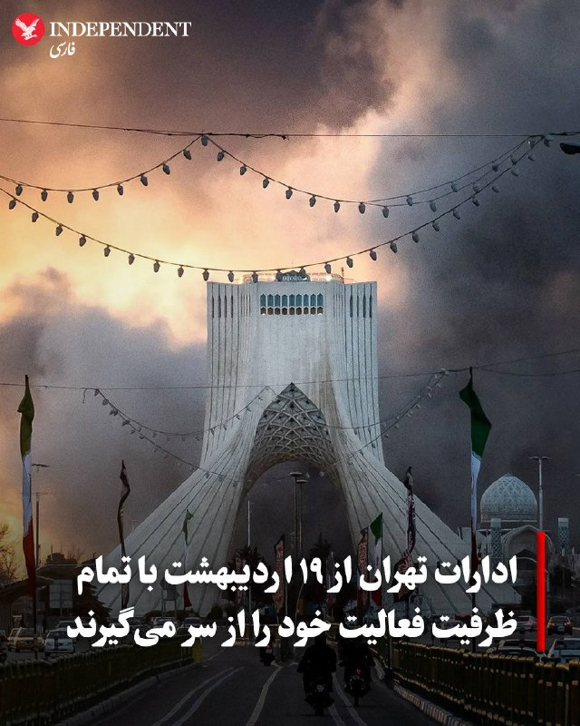
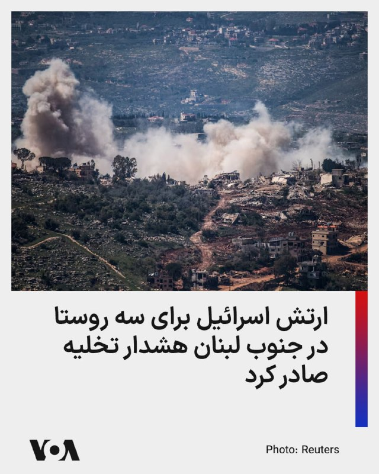
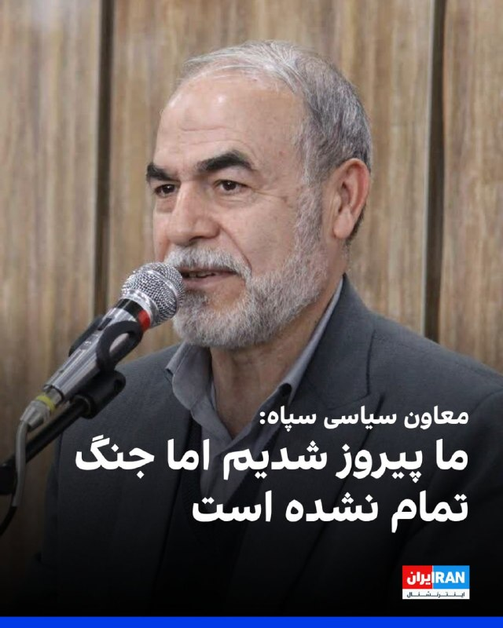
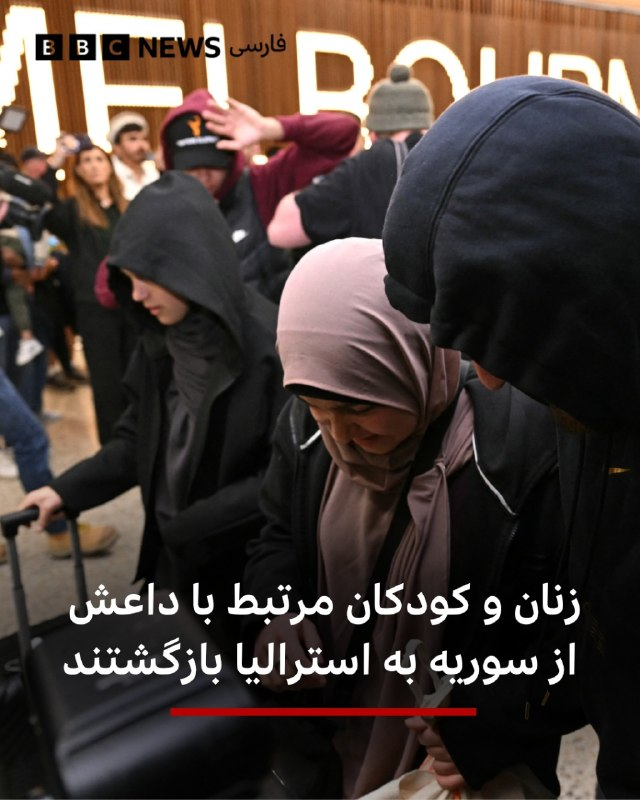
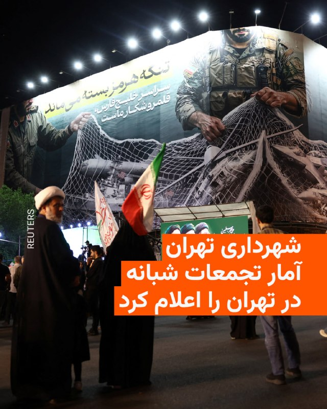
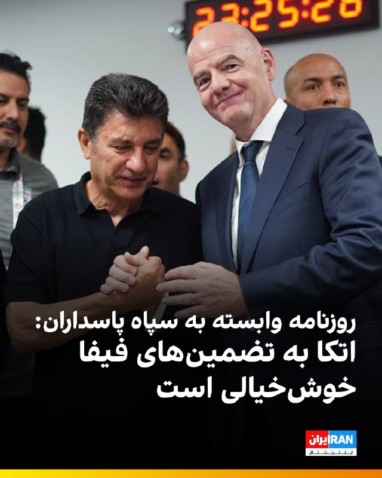
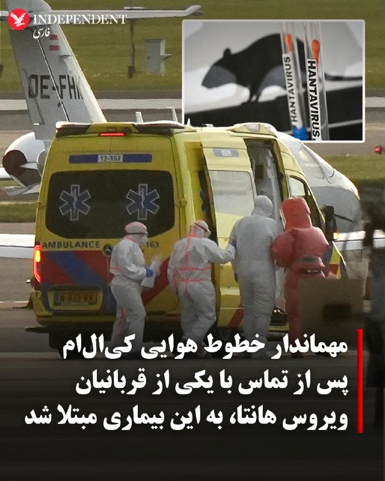

# خواننده تلگرام

<!-- MSG START -->
## 1405/02/17 17:06 — VahidOOnLine

> ♦️استاندار تهران اعلام کرد که از روز شنبه ۱۹ اردیبهشت، تمامی وزارتخانه‌ها، سازمان‌های دولتی و دستگاه‌های اجرایی در استان تهران با ۱۰۰ درصد ظرفیت فعالیت خود را از سر خواهند گرفت.
> 
> خبرگزاری مهر به نقل از محمدصادق معتمدیان، استاندار تهران، نوشت: «فعالیت‌های آموزشی در مدارس و دانشگاه‌ها نیز بر اساس اطلاعیه‌های وزارت آموزش و پرورش و وزارت علوم، تحقیقات و فناوری انجام خواهد شد.»
> ‌🇸🇦 Indypersian
> 
> 🤖 @VahidOOnLine

## 1405/02/17 17:10 — FarsiVOA
> 🔺واکنش تند دبیرکل شورای همکاری خلیج فارس به جمهوری اسلامی: در کنار امارات می‌ایستیم
> 
> ▪️دبیرکل شورای همکاری خلیج فارس می‌گوید رژیم ایران به حملات تجاوزکارانه خود به خاک امارات متحده عربی بسنده نکرده و به تلاش‌های رسوا شده خود برای تحریف حقایق ادامه می‌دهد.
> 
> ⬇️ بیشتر بخوانید:
> 
> https://ir.voanews.com/a/iran-arab-countries-proxy-war/8147564.html/?nocach=1

## ???-??-?? ??:?? (post 280413) — BBCPersian
[🎬 Video](telegram/content/BBCPersian_280413_1778161345.mp4)

> 🔻سرخط خبرهای روز پنجشنبه ۱۷ اردیبهشت ۱۴۰۵
> @BBCPersian

## ???-??-?? ??:?? (post 238653) — VahidOOnLine
[🎬 Video](telegram/content/VahidOOnLine_238653_1778160952.mp4)

> رویترز در گزارشی اختصاصی نوشته منابع کشتیرانی می‌گویند امارات همچنان بخشی از نفت خود را از تنگه هرمز عبور می‌دهد؛ آن هم با کشتی‌هایی که برای جلوگیری از هدف قرار گرفتن، سیستم‌های ردیابی‌شان خاموش شده است.
> بر اساس داده‌های ردیابی، شرکت ملی نفت ابوظبی در ماه آوریل چندین میلیون بشکه نفت خام را از پایانه‌های داخل خلیج فارس صادر کرده که بخشی از آن از طریق انتقال کشتی‌به‌کشتی یا تخلیه در عمان به مقصد پالایشگاه‌های آسیایی منتقل شده است.
> این روش صادراتی در حالی انجام می‌شود که صادرات نفت امارات از آغاز جنگ کاهش یافته و ریسک حمل‌ونقل دریایی در منطقه به‌شدت افزایش پیدا کرده است.
> ‌🏁 🇬🇧 ManotoTV
> 
> 🤖 @VahidOOnLine

## ???-??-?? ??:?? (post 238652) — VahidOOnLine
[🎬 Video](telegram/content/VahidOOnLine_238652_1778160953.mp4)

> قیمت نفت کاهش یافت و بازارهای جهانی سهام در معاملات روز پنج‌شنبه عملکردی متضاد داشتند؛ در حالی که سرمایه‌گذاران در انتظار به‌روزرسانی درباره طرح آمریکا برای پایان جنگ با ایران و بازگشایی تنگه هرمز هستند.
> پس از آنکه قیمت نفت روز چهارشنبه در پی امید به صلح تا بیش از ۱۰ درصد سقوط کرده بود، روز پنج‌شنبه افت آن ملایم‌تر شد و حدود ۲ درصد کاهش ثبت کرد. در بازارهای سهام، بورس‌های اروپایی پس از رشد قابل توجه روز قبل کاهش یافتند، در حالی که بازارهای اصلی آسیا روند صعودی داشتند.
> استراتژیست‌ها باور دارند هیجان شدیدی که با امید به کاهش تنش‌ها در بازارها ایجاد شده بود، در حال فروکش کردن است و این واقعیت در حال شکل‌گیری است که برای رسیدن به یک توافق پایدار، موانع بیشتری وجود دارد؛ حتی با وجود اینکه گزارش شده جمهوری‌اسلامی در حال بررسی یک پیشنهاد صلح آمریکا برای پایان رسمی درگیری است.
> ‌🏁 🇬🇧 ManotoTV
> 
> 🤖 @VahidOOnLine

## ???-??-?? ??:?? (post 238651) — VahidOOnLine
[🎬 Video](telegram/content/VahidOOnLine_238651_1778160953.mp4)

> استاندار تهران اعلام کرد از روز شنبه ۱۹ اردیبهشت ۱۴۰۵، حضور کارکنان همه وزارتخانه‌ها، سازمان‌ها و دستگاه‌های اجرایی مستقر در استان تهران به‌صورت ۱۰۰ درصدی خواهد بود.
> محمدصادق معتمدیان همچنین گفت فعالیت مدارس و دانشگاه‌ها نیز طبق تصمیم وزارت آموزش و پرورش و وزارت علوم، به شکل حضوری و طبق روال اعلام‌شده ادامه خواهد داشت.
> ‌🏁 🇬🇧 ManotoTV
> 
> 🤖 @VahidOOnLine

## 1405/02/17 16:55 — VahidOOnLine

> گزارش‌های رسیده به ایران‌اینترنشنال نشان می‌دهد ماموران حکومت از نصب سنگ بر مزار جاویدنام محسن رشیدی خانی‌آبادی در مراسم چهلم او جلوگیری کرده‌اند.
> 
> محسن ۴۲ ساله شامگاه ۱۹‌ دی در اعتراضات منطقه بهارستان شهر اصفهان کشته شد. به‌گفته بستگان این جاویدنام، اگرچه سنگ قبر او برای نصب در باغ رضوان آماده بود، اما ماموران به بهانه درج بیت شعری مشابه آنچه بر مزار پدرش نوشته شده بود، جلوگیری کردند.
> 
> نوشتن عبارتی با عنوان «تا ابد در من و سرزمینم» بر بالای این سنگ، از دیگر دلایل مخالفت با نصب آن بود.
> 
> پیکر محسن اکنون در قبری دوطبقه به همراه مادربزرگش به خاک سپرده شده است.
> 
> روی این سنگ مزار پیش‌تر عبارت «مگر کانون مهرماه می‌شود خاموش بماند»، نوشته شده بود اما اکنون با وجود مخالفت اعضای خانواده، ماموران امنیتی اجازه ندادند بار دیگر این عبارت را بر سنگ مزار دو نفره آنان حک کنند.
> 
> با گذشت حدود چهار ماه از کشته شدن محسن، همچنان سنگی بر مزار او نصب نشده است.
> ‌🏁 🇬🇧 IranintlTV
> 
> 🤖 @VahidOOnLine

## 1405/02/17 16:53 — VahidOOnLine

> ♦️عدوان الأحمری، رئیس انجمن روزنامه‌نگاران عربستان سعودی، در کنگره بین‌المللی مطبوعات در پاریس به‌عنوان عضو کمیته اجرایی فدراسیون بین‌المللی روزنامه‌نگاران انتخاب شد؛ رخدادی که نخستین حضور عربستان سعودی در این نهاد جهانی به شمار می‌رود.
> 
> الأحمری این انتخاب را نشانه اعتماد اتحادیه‌ها و نهادهای حرفه‌ای بین‌المللی به انجمن روزنامه‌نگاران عربستان سعودی دانست و گفت این موفقیت حاصل تلاش اعضای هیئت‌مدیره و دبیرخانه انجمن است.
> 
> او افزود عربستان سعودی پیش‌تر نیز از طریق ریاست دفتر اجرایی روزنامه‌نگاران غرب آسیا حضور بین‌المللی خود را تقویت کرده بود و اکنون این حضور وارد مرحله تازه‌ای شده است.
> 
> کمیته اجرایی این فدراسیون از میان نمایندگان بیش از ۱۴۸ کشور انتخاب شد و تنها ۱۶ نامزد موفق به کسب کرسی شدند.
> 
> فدراسیون بین‌المللی روزنامه‌نگاران که در سال ۱۹۲۶ تاسیس شده، بزرگ‌ترین نهاد جهانی روزنامه‌نگاران است و حدود ۶۰۰ هزار فعال رسانه‌ای را در بیش از ۱۴۰ کشور نمایندگی می‌کند.
> ‌🇸🇦 Indypersian
> 
> 🤖 @VahidOOnLine

## 1405/02/17 16:55 — mwarmonitor
> 🔘یک اختلاف شدید بین ارتش و موساد بر سر هدف نهایی جنگ در ایران شکل گرفته و همچنان ادامه دارد. ارتش اسرائیل (IDF) حذف اورانیوم از خاک ایران را دستاورد نهایی می‌داند. اما موساد معتقد است هدف باید سرنگونی حکومت باشد. حتی امروز نیز، برخلاف فرهنگ «توجیه و بازنویسی گذشته» که در منطقه رایج است، موساد همچنان بر این دیدگاه پافشاری می‌کند. در حالی که ارتش به تعریف مبهم «ایجاد شرایط برای سرنگونی حکومت» بسنده کرده، موساد چهار کلمه اول را حذف کرده و مستقیماً بر هدف سرنگونی تأکید دارد.
> 
> 🔸از اینجا به بعد، واقعیت به دو دیدگاه متفاوت و گاهی کاملاً متضاد تقسیم می‌شود. برخی مقامات ارشد ارتش اسرائیل از تصمیم آمریکا برای عدم تصرف اورانیوم غنی‌شده در یک عملیات نظامی به‌شدت ناراضی هستند. به همین دلیل، عملیات «Roaring Lion» با تقریباً هیچ پیشرفت قابل توجهی نسبت به برنامه هسته‌ای ایران در مقایسه با عملیات «Rising Lion» متوقف شد. آن‌ها مدام تکرار می‌کنند: «اورانیوم، اورانیوم، اورانیوم؛ اگر آن را بگیری، برنامه هسته‌ای را از بین برده‌ای.»
> 
> 🔹دیدگاه دوم این است که: چه فایده‌ای دارد اورانیوم را از طریق عملیات یا توافق خارج کنیم؟ اگر حکومت باقی بماند، حتی با وجود باقی ماندن چند تن اورانیوم ۳ درصدی، تنها چند سال تأخیر ایجاد شده—در مقیاس ژئوپولیتیک، یک چشم به هم زدن. حکومتی که تحت تحریم نباشد، ثروتمندتر و خطرناک‌تر خواهد شد و همچنان مانند قبل خواهان نابودی اسرائیل خواهد بود. تنها تغییر حکومت می‌تواند این هدف را از ریشه از بین ببرد. این دیدگاه در مقابل برخی مقامات امنیتی است که هرچند از آزادی میلیون‌ها ایرانی از دیکتاتوری استقبال می‌کنند، اما اولویت اصلی‌شان همچنان «اسرائیل در اولویت اول» است.
> 
> 🔸تجلی عملی این اختلاف در یک سؤال فرضی دیده می‌شود: اگر رئیس‌جمهور ترامپ به اسرائیل بگوید «برای یک عملیات چراغ سبز دارید»، چه می‌شود؟ بیشتر ساختار دفاعی می‌گویند تشکر کرده و نیروی هوایی را برای حمله به ذخایر اورانیوم اعزام می‌کنند. اما موساد احتمالاً از نابودی زیرساخت‌های انرژی و پالایشگاه‌ها حمایت می‌کند تا ایران را عملاً در تاریکی کامل فرو ببرد. این کار می‌تواند روند شورش داخلی را به‌طور چشمگیری تسریع کند. آستانه خشم مردم از سطح اعتراضات ژانویه عبور کرده، اما هم‌زمان ترس نیز افزایش یافته است. وقتی برق نباشد—و انتظار می‌رود ظرف دو ماه در ایران کمبود غذا آغاز شود—این دیوار ترس فرو خواهد ریخت.
> 
> 🔘کدام هدف بلندپروازانه‌تر است؟ در نگاه اول، سرنگونی حکومت یک هدف بسیار بزرگ به نظر می‌رسد، در حالی که نابودی اورانیوم یک اقدام محدود و قابل مدیریت است. اما تاریخ نشان می‌دهد حکومت‌ها در طول زمان سقوط کرده‌اند، در حالی که هیچ کشوری هرگز داوطلبانه مواد هسته‌ای غنی‌شده خود را در حالی که حکومتش پابرجاست واگذار نکرده است. همان‌طور که در یک مثل قدیمی تلمودی آمده، این یک انتخاب بین «راه کوتاهی که طولانی است»—یک ضربه سریع که مشکل ریشه‌ای را حل نمی‌کند—و «راه طولانی که کوتاه است»—مسیر دشوار تغییر حکومت که تهدید را برای همیشه از بین می‌برد.
> ( آمیت سیگال خبرنگار کانال ۱۲ اسرائیل)
> 
> 
> @mwarmonitor

## ???-??-?? ??:?? (post 335974) — IranIntlTV
[🎬 Video](telegram/content/IranIntlTV_335974_1778160955.mp4)

> در حالی که بحث احتمال مذاکره میان تهران و واشینگتن دوباره مطرح شده است، بسیاری از کاربران ایرانی در شبکه‌های اجتماعی این روند را با نگرانی دنبال می‌کنند.
> عادله بورنگ، عضو تحریریه ایران‌اینترنشنال، از واکنش کاربران رسانه‌های اجتماعی می‌گوید
> @iranintltv

## ???-??-?? ??:?? (post 335973) — IranIntlTV
> یک شهروند از بابلسر با ارسال پیامی به ایران اینترنشنال از افزایش اجاره خانه‌ها به میزان دو تا سه برابر می‌گوید و خواستار همکاری بیشتر شهروندان بایکدیگر در اوضاع بد اقتصادی می‌شود.

## 1405/02/17 16:55 — IranIntlTV

> گزارش‌های رسیده به ایران‌اینترنشنال نشان می‌دهد ماموران حکومت از نصب سنگ بر مزار جاویدنام محسن رشیدی خانی‌آبادی در مراسم چهلم او جلوگیری کرده‌اند.
> 
> محسن ۴۲ ساله شامگاه ۱۹‌ دی در اعتراضات منطقه بهارستان شهر اصفهان کشته شد. به‌گفته بستگان این جاویدنام، اگرچه سنگ قبر او برای نصب در باغ رضوان آماده بود، اما ماموران به بهانه درج بیت شعری مشابه آنچه بر مزار پدرش نوشته شده بود، جلوگیری کردند.
> 
> نوشتن عبارتی با عنوان «تا ابد در من و سرزمینم» بر بالای این سنگ، از دیگر دلایل مخالفت با نصب آن بود.
> 
> پیکر محسن اکنون در قبری دوطبقه به همراه مادربزرگش به خاک سپرده شده است.
> 
> روی این سنگ مزار پیش‌تر عبارت «مگر کانون مهرماه می‌شود خاموش بماند»، نوشته شده بود اما اکنون با وجود مخالفت اعضای خانواده، ماموران امنیتی اجازه ندادند بار دیگر این عبارت را بر سنگ مزار دو نفره آنان حک کنند.
> 
> با گذشت حدود چهار ماه از کشته شدن محسن، همچنان سنگی بر مزار او نصب نشده است.
> https://iranintl.com/202605073178

## ???-??-?? ??:?? (post 105086) — ManotoTV
[🎬 Video](telegram/content/ManotoTV_105086_1778160957.mp4)

> رویترز در گزارشی اختصاصی نوشته منابع کشتیرانی می‌گویند امارات همچنان بخشی از نفت خود را از تنگه هرمز عبور می‌دهد؛ آن هم با کشتی‌هایی که برای جلوگیری از هدف قرار گرفتن، سیستم‌های ردیابی‌شان خاموش شده است.
> بر اساس داده‌های ردیابی، شرکت ملی نفت ابوظبی در ماه آوریل چندین میلیون بشکه نفت خام را از پایانه‌های داخل خلیج فارس صادر کرده که بخشی از آن از طریق انتقال کشتی‌به‌کشتی یا تخلیه در عمان به مقصد پالایشگاه‌های آسیایی منتقل شده است.
> این روش صادراتی در حالی انجام می‌شود که صادرات نفت امارات از آغاز جنگ کاهش یافته و ریسک حمل‌ونقل دریایی در منطقه به‌شدت افزایش پیدا کرده است.

## ???-??-?? ??:?? (post 105085) — ManotoTV
[🎬 Video](telegram/content/ManotoTV_105085_1778160958.mp4)

> قیمت نفت کاهش یافت و بازارهای جهانی سهام در معاملات روز پنج‌شنبه عملکردی متضاد داشتند؛ در حالی که سرمایه‌گذاران در انتظار به‌روزرسانی درباره طرح آمریکا برای پایان جنگ با ایران و بازگشایی تنگه هرمز هستند.
> پس از آنکه قیمت نفت روز چهارشنبه در پی امید به صلح تا بیش از ۱۰ درصد سقوط کرده بود، روز پنج‌شنبه افت آن ملایم‌تر شد و حدود ۲ درصد کاهش ثبت کرد. در بازارهای سهام، بورس‌های اروپایی پس از رشد قابل توجه روز قبل کاهش یافتند، در حالی که بازارهای اصلی آسیا روند صعودی داشتند.
> استراتژیست‌ها باور دارند هیجان شدیدی که با امید به کاهش تنش‌ها در بازارها ایجاد شده بود، در حال فروکش کردن است و این واقعیت در حال شکل‌گیری است که برای رسیدن به یک توافق پایدار، موانع بیشتری وجود دارد؛ حتی با وجود اینکه گزارش شده جمهوری‌اسلامی در حال بررسی یک پیشنهاد صلح آمریکا برای پایان رسمی درگیری است.

## ???-??-?? ??:?? (post 105084) — ManotoTV
[🎬 Video](telegram/content/ManotoTV_105084_1778160958.mp4)

> استاندار تهران اعلام کرد از روز شنبه ۱۹ اردیبهشت ۱۴۰۵، حضور کارکنان همه وزارتخانه‌ها، سازمان‌ها و دستگاه‌های اجرایی مستقر در استان تهران به‌صورت ۱۰۰ درصدی خواهد بود.
> محمدصادق معتمدیان همچنین گفت فعالیت مدارس و دانشگاه‌ها نیز طبق تصمیم وزارت آموزش و پرورش و وزارت علوم، به شکل حضوری و طبق روال اعلام‌شده ادامه خواهد داشت.

## ???-??-?? ??:?? (post 124401) — DW_Farsi
[🎬 Video](telegram/content/DW_Farsi_124401_1778160959.mp4)

> 🎥 بازسازی پل B1 در شرایط ناپایدار جنگی و اقتصادی
> 
> ویدئویی از آغاز بازسازی پل بی‌یک (B1) یا پل بیلقان در عظیمیه کرج در شبکه‌های اجتماعی منتشر شده که در جریان جنگ با ایالات متحده و اسرائيل مورد هدف قرار گرفته بود. هوشنگ بازوند، مدیرعامل شرکت ساخت و توسعه زیربناهای حمل‌ونقل، مدعی شده بازسازی این پل کمتر از یک سال زمان می‌برد و حدود ۳.۷ هزار میلیارد تومان هزینه خواهد داشت.
> 
> بازسازی سریع این پل در حالی مطرح می‌شود که جمهوری اسلامی همچنان در شرایط ناپایدار و تنش‌های جنگی قرار دارد و هم‌زمان کشور دستخوش بحران اقتصادی گسترده است. همین موضوع این پرسش را مطرح می‌کند که بازسازی زیرساخت‌های تخریب‌شده تا چه اندازه در عمل امکان‌پذیر است و چه میزان از این وعده‌ها ممکن است در حد برنامه‌ها و برآوردهای اولیه باقی بمانند.
> 
> 
> @dw_farsi

## 1405/02/17 16:56 — BBCPersian
> 🔻هشدار کمیسیون فدرال برق سوئیس در مورد تاثیر احتمالی جنگ ایران در تامین گاز و برق اروپا
> 
> کمیسیون فدرال برق سوئیس روز پنجشنبه اعلام کرد که جنگ در ایران باعث ایجاد عدم اطمینان در مورد تامین گاز برای زمستان پیش رو شده است.
> 
> این کمیسیون می‌گوید که این اوضاع در بدترین حالت ممکن است حتی بر ثبات تامین برق اروپا و سوئیس نیز تأثیر بگذارد.
> 
> جنگ آمریکا و اسرائیل علیه ایران و بسته شدن تنگه هرمز باعث مختل شدن کشتیرانی در خلیج فارس شد و قیمت نفت به بالاترین سطح خود از زمان جنگ اوکراین در سال ۲۰۲۲ رسید.
> 
> پیش از این هم کارشناسان هشدار داده‌اند که ادامه اختلال در تحویل سوخت به دلیل جنگ ایران می‌تواند ظرف چند هفته کمبود سوخت را به همراه داشته باشد.
> 
> آژانس بین‌المللی انرژی هشدار داده است که اگر سوخت بیشتری از جای دیگری وارد نشود، کل اروپا تا ماه ژوئن با کمبود سوخت مواجه خواهد شد.
> 
> https://bbc.in/496G5Jl
> @BBCPersian

## ???-??-?? ??:?? (post 238648) — VahidOOnLine
[🎬 Video](telegram/content/VahidOOnLine_238648_1778160182.mp4)

> پاکستان اعلام کرده است که انتظار دارد توافقی میان آمریکا و جمهوری‌اسلامی در آینده نزدیک حاصل شود؛ در حالی که این کشور در طول جنگ علیه ایران نقش میانجی میان واشنگتن و تهران را ایفا کرده است.
> وزارت خارجه پاکستان با انتشار بیانیه‌ای جدید بر خوش‌بینی خود تأکید کرده است. تَحیر اندرابی، سخنگوی وزارت خارجه پاکستان، گفت: «انتظار داریم هرچه زودتر توافقی حاصل شود.»
> او افزود: «امیدواریم طرف‌ها به یک راه‌حل مسالمت‌آمیز و پایدار برسند که نه‌تنها به صلح در منطقه ما، بلکه به صلح بین‌المللی نیز کمک کند.»
> با این حال، او از ارائه زمان‌بندی خودداری کرد و گفت پاکستان جزئیات تلاش‌های دیپلماتیک در حال انجام را منتشر نخواهد کرد.
> او تأکید کرد: «آنچه می‌توانم بگویم این است که ما همچنان امیدوار و خوش‌بین هستیم و امیدواریم این توافق هرچه زودتر حاصل شود.»
> این موضع‌گیری در ادامه گزارش‌هایی است که از پیشرفت مذاکرات غیرمستقیم میان آمریکا و جمهوری‌اسلامی حکایت دارد؛ مذاکراتی که گفته می‌شود بر موضوع هسته‌ای و تنگه هرمز متمرکز است.
> ‌🏁 🇬🇧 ManotoTV
> 
> 🤖 @VahidOOnLine

## 1405/02/17 16:51 — ManotoTV

> https://youtube.com/live/cPjJ1JkeQaw?feature=share

## ???-??-?? ??:?? (post 105082) — ManotoTV
[🎬 Video](telegram/content/ManotoTV_105082_1778160183.mp4)

> پاکستان اعلام کرده است که انتظار دارد توافقی میان آمریکا و جمهوری‌اسلامی در آینده نزدیک حاصل شود؛ در حالی که این کشور در طول جنگ علیه ایران نقش میانجی میان واشنگتن و تهران را ایفا کرده است.
> وزارت خارجه پاکستان با انتشار بیانیه‌ای جدید بر خوش‌بینی خود تأکید کرده است. تَحیر اندرابی، سخنگوی وزارت خارجه پاکستان، گفت: «انتظار داریم هرچه زودتر توافقی حاصل شود.»
> او افزود: «امیدواریم طرف‌ها به یک راه‌حل مسالمت‌آمیز و پایدار برسند که نه‌تنها به صلح در منطقه ما، بلکه به صلح بین‌المللی نیز کمک کند.»
> با این حال، او از ارائه زمان‌بندی خودداری کرد و گفت پاکستان جزئیات تلاش‌های دیپلماتیک در حال انجام را منتشر نخواهد کرد.
> او تأکید کرد: «آنچه می‌توانم بگویم این است که ما همچنان امیدوار و خوش‌بین هستیم و امیدواریم این توافق هرچه زودتر حاصل شود.»
> این موضع‌گیری در ادامه گزارش‌هایی است که از پیشرفت مذاکرات غیرمستقیم میان آمریکا و جمهوری‌اسلامی حکایت دارد؛ مذاکراتی که گفته می‌شود بر موضوع هسته‌ای و تنگه هرمز متمرکز است.

## 1405/02/17 16:52 — Persian_Trend_Official
> 🔴 گزارش‌ها از سفر احتمالی عراقچی به اسلام‌آباد در مسیر بازگشت از چین
> 
> 🔹برخی منابع در پاکستان گزارش می‌دهند عباس عراقچی، وزیر خارجه ایران، ممکن است در مسیر بازگشت از چین وارد اسلام‌آباد شود.
> 
> 🔹تا این لحظه مقام‌های رسمی ایران یا پاکستان جزئیاتی درباره هدف احتمالی این سفر یا دیدارهای برنامه‌ریزی‌شده منتشر نکرده‌اند.
> 
> 🫆:Tony
> 
> 📌 @persian_trend_official
> پرشین ترند | متفاوت‌ترین کانال نظامی

## ???-??-?? ??:?? (post 19687) — IranianMinds
[🎬 Video](telegram/content/IranianMinds_19687_1778160184.mp4)

> 🤣🤣🤣
> 
> @IranianMinds

## ???-??-?? ??:?? (post 280411) — BBCPersian
[🎬 Video](telegram/content/BBCPersian_280411_1778160186.mp4)

> 🔻در پی حملات هوایی اسرائیل به مناطق جنوبی لبنان، دود غلیظی از مناطق شهری و روستایی به آسمان برخاست. بنابر گزارش‌‌ها مناطقی مانند نبطیه فوقا، زوطر شرقی و یوحمر در این حملات هدف قرار گرفته‌اند.
> 
> این حملات در حالی ادامه دارد که با پافشاری ایران، از ۱۷ آوریل ۲۰۲۶ (۲۸ فروردین ۱۴۰۵) آتش‌بسی میان اسرائیل و حزب‌الله اعلام شده بود اما به گفته منابع محلی، اسرائیل همچنان به حملات هوایی به مناطق مختلف لبنان به‌ویژه در جنوب این کشور ادامه داده است. در مقابل، حزب‌الله هم که گفته بود آتش‌بس را مشروط پذیرفته است، با انجام حملاتی به این اقدامات پاسخ داده است.
> 
> بر اساس آمار منتشرشده، از دوم مارس ۲۰۲۶ (۱۱ اسفند ۱۴۰۴) تاکنون بیش از ۲۷۰۰ نفر در لبنان نتیجه حملات اسرائیل کشته و بیش از یک میلیون نفر آواره شده‌اند. بخش قابل توجهی از این آوارگان از مناطق جنوبی و شرقی لبنان و همچنین حومه جنوبی بیروت هستند.
> 
> ادامه درگیری‌ها نگرانی‌ها درباره تشدید بحران انسانی و گسترش تنش در منطقه را افزایش داده است.
> 
> پیشتر و در آستانه مذاکرات در پاکستان، ایران، صلح با آمریکا را به آتش‌بس در لبنان گره زده بود.
> 
> https://bbc.in/4usmfAe
> @BBCPersian

## 1405/02/17 16:50 — BBCPersian
> 🔻حضور ۱۰۰ درصدی کارکنان وزراتخانه و سازمان‌ها از روز شنبه
> 
> محمدصادق معتمدیان، استاندارتهران گفته است که فعالیت تمامی وزارتخانه‌ها، سازمان‌ها و دستگاه‌های اجرایی مستقر در استان تهران از روز شنبه ۱۹ اردیبهشت‌ تا اطلاع ثانوی با حضور همۀ کارکنان، به‌صورت ۱۰۰ درصدی، انجام خواهد شد.
> 
> براساس این گزارش فعالیت آموزشی مدارس و دانشگاه‌ها هم مطابق اعلام وزارتخانه های آموزش و پرورش و علوم خواهد بود.
> 
> https://bbc.in/496G5Jl
> @BBCPersian

## ???-??-?? ??:?? (post 238647) — VahidOOnLine
[🎬 Video](telegram/content/VahidOOnLine_238647_1778159574.mp4)

> ♦️مسعود پزشکیان، رئیس جمهوری اسلامی، روز پنجشنبه ۱۷ اردیبهشت در نشستی با صناف و بازاریان از دیدار خود با مجتبی خامنه‌ای، رهبر جدید جمهوری اسلامی خبر داد و گفت: «این دیدار نزدیک به دو ساعت و نیم ادامه داشت.»
> پزشکیان گفت: «نحوه مواجهه، نوع نگاه و شیوه برخورد مجتبی خامنه‌ای متواضعانه و عمیقا صمیمی» بود.
> او به زمان دیدار با مجتبی خامنه‌ای اشاره‌ای نکرده است.
> مجتبی خامنه‌ای ۹ روز پس از کشته شدن علی خامنه‌ای در موج اول حملات آمریکا و اسرائیل، به‌عنوان رهبر جدید جمهوری اسلامی منصوب شد و گزارش‌های غیررسمی حاکی از مجروحیت شدید او در ناحیه پا و صورت است.
> این اظهارات در حالی مطرح می‌شود که از زمان انتصاب مجتبی خامنه‌ای به جانشینی پدرش، هیچ تصویر یا صدایی از او منتشر نشده است.
> ‌🇸🇦 Indypersian
> 
> 🤖 @VahidOOnLine

## 1405/02/17 16:38 — VahidOOnLine

> بنیاد نرگس اعلام کرد نرگس محمدی، برنده جایزه صلح نوبل و زندانی سیاسی، در هفتمین روز بستری در بخش مراقبت‌های ویژه قلب بیمارستانی در زنجان، همچنان در وضعیت جسمانی ناپایدار قرار دارد و نگرانی‌ها درباره وضعیت قلبی او افزایش یافته است.
> 
> بر اساس گزارش بنیاد نرگس، تشخیص محتمل تیم پزشکی درباره نرگس محمدی «پرینزمتال آنژینا» عنوان شده؛ وضعیتی ناشی از اسپاسم شریان‌های کرونری که می‌تواند باعث حملات شدید قلبی، آریتمی‌های مرگ‌بار، نوسانات جدی فشار خون و اختلال در خون‌رسانی به قلب شود.
> 
> بنیاد نرگس افزود پزشکانی که پیش از بستری وضعیت او را بررسی کرده بودند، انجام فوری آنژیوگرافی تخصصی را ضروری دانسته‌اند و خانواده و پزشکان خواستار انتقال فوری نرگس محمدی به تهران هستند، اما دادستان تهران همچنان با این انتقال مخالفت کرده است.
> ‌🏁 🇬🇧 IranintlTV
> 
> 🤖 @VahidOOnLine

## ???-??-?? ??:?? (post 335971) — IranIntlTV
[🎬 Video](telegram/content/IranIntlTV_335971_1778159578.mp4)

> مسعود پزشکیان از دیدار خود با مجتبی خامنه‌ای، رهبر سوم جمهوری اسلامی خبر داد و گفت این نشست در فضایی صمیمی، صریح و همراه با احساس نزدیکی و اعتماد برگزار شده و نزدیک به دو ساعت و نیم ادامه داشته است.
> گفت‌وگو با محمدجواد اکبرین، عضو تحریریه ایران‌اینترنشنال
> @iranintltv

## 1405/02/17 16:37 — IranIntlTV

> بنیاد نرگس اعلام کرد نرگس محمدی، برنده جایزه صلح نوبل و زندانی سیاسی، در هفتمین روز بستری در بخش مراقبت‌های ویژه قلب بیمارستانی در زنجان، همچنان در وضعیت جسمانی ناپایدار قرار دارد و نگرانی‌ها درباره وضعیت قلبی او افزایش یافته است.
> 
> بر اساس گزارش بنیاد نرگس، تشخیص محتمل تیم پزشکی درباره نرگس محمدی «پرینزمتال آنژینا» عنوان شده؛ وضعیتی ناشی از اسپاسم شریان‌های کرونری که می‌تواند باعث حملات شدید قلبی، آریتمی‌های مرگ‌بار، نوسانات جدی فشار خون و اختلال در خون‌رسانی به قلب شود.
> 
> بنیاد نرگس افزود پزشکانی که پیش از بستری وضعیت او را بررسی کرده بودند، انجام فوری آنژیوگرافی تخصصی را ضروری دانسته‌اند و خانواده و پزشکان خواستار انتقال فوری نرگس محمدی به تهران هستند، اما دادستان تهران همچنان با این انتقال مخالفت کرده است.
> https://iranintl.com/202605077561

## ???-??-?? ??:?? (post 217106) — FarsiVOA
> آیا لغو تابعیت ایرانی برای ایرانیان مخالف «جمهوری اسلامی» ممکن و قانونی است؟ گفت‌وگو با حسین رئیسی، حقوقدان

## 1405/02/17 16:35 — DW_Farsi
> 🔶 پافشاری روسیه بر تخلیه سفارت‌خانه‌های خارجی در کی‌یف
> 
> روسیه از سفارت‌خانه‌های واقع در کی‌یف، پایتخت اوکراین خواسته تا در صورت حمله این کشور به این شهر کارکنان خود را به مکان‌های امن منتقل کنند.
> 
> وزارت خارجه روسیه روز پنج‌شنبه هفتم مه با ارسال یادداشتی به سفارت‌خانه‌های واقع در کی‌یف اعلام کرد که باید "تخلیه‌ به‌هنگام کارکنان نمایندگانی‌های دیپلماتیک و سایر نهادها و همچنین شهروندان خود را از کی‌یف تضمین کنند."
> 
> این وزارت‌خانه هشدار داد، در صورتی که روسیه در مراسم یادبود پیروزی این کشور بر آلمان نازی در روز شنبه نهم مه از سوی اوکراین هدف حمله قرار گیرد ممکن است دست به اقدامی تلافی‌جویانه بزند.
> 
> روسیه پیش از این به صورت یک‌جانبه پیشنهاد آتش‌بس در جنگ اوکراین داده و خواسته بود تا این آتش‌بس در روزهای هشتم و نهم مه برقرار شود.
> 
> پیش از این وزارت دفاع روسیه تهدید کرده بود که در صورت نقض آتش‌بس در این روزها از سوی اوکراین، شهر کی‌یف را هدف حملات تلافی‌جویانه خود قرار خواهد داد.
> 
> اوکراین نیز در مقابل، از تاریخی متفاوت (ششم مه) اعلام آتش‌بس یک‌سویه کرده بود که به گفته این کشور، با حملات پیاپی روسیه نقض شد.
> @dw_farsi

## ???-??-?? ??:?? (post 19686) — IranianMinds
[🎬 Video](telegram/content/IranianMinds_19686_1778159581.mp4)

> 🔴سقوط خودرو روی سر پلیس روسی، حین اجرای نمایش.
> 
> @IranianMinds

## 1405/02/17 16:28 — VahidOOnLine

> رویترز خبر داد که امارات متحده عربی با استفاده از تاکتیک‌هایی مانند خاموش کردن ردیاب‌های موقعیت مکانی برای جلوگیری از حمله‌های جمهوری اسلامی، اخیرا چند نفتکش را از تنگه هرمز عبور داده است.
> 
> رویترز نوشت که حجم این صادرات تنها بخشی از میزان معمول صادرات امارات متحده عربی پیش از جنگ است، اما نشان می‌دهد تولیدکننده و خریداران حاضرند برای خرید و فروش نفت ریسک کنند.
> ‌🏁 🇬🇧 IranintlTV
> 
> 🤖 @VahidOOnLine

## 1405/02/17 16:27 — IranIntlTV

> رویترز خبر داد که امارات متحده عربی با استفاده از تاکتیک‌هایی مانند خاموش کردن ردیاب‌های موقعیت مکانی برای جلوگیری از حمله‌های جمهوری اسلامی، اخیرا چند نفتکش را از تنگه هرمز عبور داده است.
> 
> رویترز نوشت که حجم این صادرات تنها بخشی از میزان معمول صادرات امارات متحده عربی پیش از جنگ است، اما نشان می‌دهد تولیدکننده و خریداران حاضرند برای خرید و فروش نفت ریسک کنند.
> https://iranintl.com/202605074906

## 1405/02/17 16:24 — VahidOOnLine

> مهدی فضائلی، عضو دفتر علی خامنه‌ای، گفت: «مجتبی خامنه‌ای به‌قدری مشغول پیگیری مسائل و موضوعات مختلف کشور است که افرادی که برای پیگیری امور در کنار او هستند، جا می‌مانند. او آن‌قدر پرکار است که مسئولان پیگیری این امور نمی‌توانند پا‌به‌پای او حرکت کنند.»
> 
> فضائلی افزود: «باید مطمئن باشید که مجتبی خامنه‌ای در ادامه راه پدرش، با انرژی، انگیزه، اراده‌ای قوی و اشراف بر مسائل مختلف کشور، کشور را هدایت می‌کند.»
> ‌🏁 🇬🇧 IranintlTV
> 
> 🤖 @VahidOOnLine

## 1405/02/17 16:23 — IranIntlTV

> مهدی فضائلی، عضو دفتر علی خامنه‌ای، گفت: «مجتبی خامنه‌ای به‌قدری مشغول پیگیری مسائل و موضوعات مختلف کشور است که افرادی که برای پیگیری امور در کنار او هستند، جا می‌مانند. او آن‌قدر پرکار است که مسئولان پیگیری این امور نمی‌توانند پا‌به‌پای او حرکت کنند.»
> 
> فضائلی افزود: «باید مطمئن باشید که مجتبی خامنه‌ای در ادامه راه پدرش، با انرژی، انگیزه، اراده‌ای قوی و اشراف بر مسائل مختلف کشور، کشور را هدایت می‌کند.»
> https://iranintl.com/202605075974

## ???-??-?? ??:?? (post 335967) — IranIntlTV
[🎬 Video](telegram/content/IranIntlTV_335967_1778158569.mp4)

> وزیر خارجه فرانسه اعلام کرد تا زمانی که تنگه هرمز مسدود باقی بماند هیچ‌ یک از تحریم‌های بین‌المللی علیه جمهوری اسلامی لغو نخواهد شد.
> جزییات بیشتر با نیلوفر پورابراهیم، خبرنگار ایران‌اینترنشنال
> @iranintltv

## 1405/02/17 16:23 — Persian_Trend_Official
> سلام به همراهان عزیز کانال پرشین ترند! ✌️ ​امروز قصد دارم یک پروژه فوق‌العاده و کاربردی رو برای گذر از فیلترینگ بهتون معرفی کنم. یکی از پروژه‌هایی که خودم شخصاً تست کردم و در حال حاضر داره کار می‌کنه، پروژه mhr-cfw هست. با راه‌اندازی این ابزار می‌تونید با…

## 1405/02/17 16:23 — BBCPersian
> 🔻شصت و نهمین روز قطع اینترنت در ایران
> 
> اکنون در شصت و نهمین روز قطع اینترنت، مردم در داخل ایران ۱۶۳۲ ساعت است که به طور گسترده امکان دسترسی به اینترنت بین‌المللی را ندارند.
> 
> نت‌بلاکس که وضعیت اینترنت در جهان را بررسی می‌کند گفته است که قطعی اینترنت باعث از دست رفتن مشاغل وتوقف کسب و کارهای مردم عادی شده و فرصت‌های اقتصادی بیشتری را به نهادهای نزدیک به حکومت می‌دهد.
> 
> حکومت ایران از زمان شروع جنگ در نهم اسفند ماه سال گذشته اینترنت بین المللی را قطع کرده است.
> 
> اخیرا مقامات و نهادهای ایران طرح «اینترنت پرو» را فعال کرده‌اند که اهالی کسب‌وکار یا دانشگاهیان بتوانند با پرداخت مبلغی بیشتر، با دسترسی محدود به اینترنت بین‌المللی وصل شوند.
> 
> این موضوع واکنش‌ کاربران شبکه‌های اجتماعی را به دنبال داشته است.
> 
> https://bbc.in/496G5Jl
> @BBCPersian

## 1405/02/17 16:19 — Persian_Trend_Official
> ⚠️ حتمی پیام بعد که یک سری نکات بسیار مهم رو میخوام بگم رو با دقت مطالعه کنید.

## 1405/02/17 16:19 — Persian_Trend_Official
> سلام به همراهان عزیز کانال پرشین ترند! ✌️
> 
> ​امروز قصد دارم یک پروژه فوق‌العاده و کاربردی رو برای گذر از فیلترینگ بهتون معرفی کنم.
> 
> یکی از پروژه‌هایی که خودم شخصاً تست کردم و در حال حاضر داره کار می‌کنه، پروژه mhr-cfw هست. با راه‌اندازی این ابزار می‌تونید با سرعت خوب به یوتیوب و سایر سرویس‌ها دسترسی داشته باشید.
> 
> ​🔗 منابع اصلی پروژه:
> 
> 🌐 لینک پروژه در گیت‌هاب:
> github.com/denuitt1/mhr-cfw
> 
> ​🎥 لینک ویدئوی اصلی سازنده (آموزش جامع متد MHR-CFW از Matin SenPai):
> youtu.be/L3lJZrAqqUQ
> 
> ​📂 فایل‌ها و پیش‌نیازهای پروژه (آپلود شده روی هاست داخلی)
> 
> ​برای راحتی شما عزیزان، ویدیو و تمامی پیش‌نیازها رو روی هاست خودمون آپلود کردم تا بتوانید بدون دردسر و مستقیماً دانلود کنید:
> 
> ​🎬 ویدیوی آموزش mhr-cfw:
> 👉 dl.persiantrend.com/MHR-CFW/MHR-CFW.mp4
> 
> ​🐍 دانلود پایتون (نسخه ۶۴ بیت):
> 👉 dl.persiantrend.com/MHR-CFW/python-3.13.13-amd64.exe
> 
> ​🐍 دانلود پایتون (نسخه ۳۲ بیت):
> 👉 dl.persiantrend.com/MHR-CFW/python-3.13.13-32bit.exe
> 
> ​📦 فایل مورد نیاز برای پروژه:
> 👉 dl.persiantrend.com/MHR-CFW/mhr-cfw-main.zip
> 
> ​📑 مستندات گیت‌هاب پروژه:
> 👉 dl.persiantrend.com/MHR-CFW/mhr-cfw%20-%20GitHub.pdf
> 
> ​⚠️ حتماً پیام بعد که یک سری نکات بسیار مهم رو میخوام بگم رو با دقت مطالعه کنید.
> 
> 📝 Nick
> 
> 📌 @persian_trend_official
> پرشین ترند | متفاوت‌ترین کانال نظامی

## 1405/02/17 16:16 — mwarmonitor

> 🔸ترامپ در سوشال تروث
> 
> 🔹«یک نمایش بسیار دقیق از دولت جو بایدنِ خواب‌آلود. آسیب‌های فوق‌العاده‌ای وارد شده اما، ما برگشتیم!!! رئیس‌جمهور (دونالد جی. ترامپ)»
> 
> @mwarmonitor

## 1405/02/17 16:14 — mwarmonitor
> 🔰وزارت دادگستری آمریکا در حال بررسی ۲.۶ میلیارد دلار معاملات نفتی مرتبط با جنگ ایران است - ABC News
> 
> @mwarmonitor

## 1405/02/17 16:13 — mwarmonitor

> ⏱ساعت 13:26 — یک فروند بمب‌افکن استراتژیک FONDU 11 x1 USAF B-1/B Lancer
> از پایگاه RAF Fairford برای یک مأموریت جهت آمادگی به پرواز درآمده است.
> 
> FONDU11 در حال تماس با Swanwick
> Military روی فرکانس 278.600
> 
> @mwarmonitor

## 1405/02/17 16:10 — mwarmonitor
> 🔴(رویترز) - یک مقام ارشد حماس روز پنج‌شنبه اعلام کرد که در یک حمله هوایی اسرائیل، پسر «مذاکره‌کننده ارشد حماس» در گفت‌وگوهای تحت میانجی‌گری آمریکا درباره آینده غزه کشته شده است؛ در حالی که رهبران این گروه شبه‌نظامی در قاهره برای حفظ آتش‌بس با اسرائیل در حال مذاکره بودند.
> 
> «باسم نعیم»، مقام ارشد حماس، گفت «عزام الحیه»، فرزند «خلیل الحیه»، روز پنج‌شنبه بر اثر جراحات وارده در حمله اسرائیل در شب چهارشنبه جان باخته است. او چهارمین پسر از رئیس تبعیدی حماس در غزه است که در حملات اسرائیل کشته می‌شود.
> 
> @mwarmonitor

## 1405/02/17 16:09 — VahidOOnLine

> ♦️ مارکو روبیو، وزیر امور خارجه ایالات متحده، روز پنجشنبه ۱۷ اردیبهشت، در واتیکان با پاپ لئو چهاردهم، نخستین پاپ آمریکایی تاریخ، دیدار و گفتگو کرد. این نشست پشت درهای بسته در حالی برگزار شد که روابط میان کاخ سفید و واتیکان به دلیل انتقادهای تند دونالد ترامپ از مواضع پاپ در قبال جنگ ایران، به پایین‌ترین سطح خود رسیده است.
> 
> روبیو که خود یک کاتولیک است، پیش از این دیدار اعلام کرده بود که اگرچه این سفر از قبل برنامه‌ریزی شده بود، اما «اتفاقات اخیر» موضوعات زیادی را برای بحث ایجاد کرده است. علاوه بر تنش‌های مربوط به جنگ، طرفین درباره موضوعاتی نظیر آزادی‌های مذهبی در جهان و ارسال کمک‌های بشردوستانه به کوبا از طریق کانال‌های کلیسا گفتگو کردند.
> 
> این دیدار نخستین ملاقات یک مقام ارشد کابینه ترامپ با پاپ در یک سال گذشته محسوب می‌شود. در حالی که پاپ لئو به عنوان منتقد جدی جنگ و سیاست‌های مهاجرتی واشنگتن شناخته می‌شود، سفیر آمریکا در واتیکان این گفتگوها را «صریح» توصیف کرد.
> ‌🇸🇦 Indypersian
> 
> 🤖 @VahidOOnLine

## 1405/02/17 16:06 — IranianMinds
> 🔴کانال ۱۲ اسرائیل:
> 
> ترامپ بدون خروج اورانیوم غنی‌شده از ایران، توافق نخواهد کرد.
> 
> @IranianMinds

## 1405/02/17 16:04 — Dirty_Kids
> بعد میگین جورجینا چرا از حصارک لباس گرفته رفته مت‌گالا!
> بابا خونواده رونالدو خودشون از کوچه برلن لباس می‌گیرن میرن کردان مشتی
> 
> 
> @Dirty_Kids 👻

## 1405/02/17 16:04 — Dirty_Kids
> ‏یعنی الان همگی پذیرفتیم که
> maybe in another life ؟
> 
> 
> @Dirty_Kids 👻

## ???-??-?? ??:?? (post 389030) — Dirty_Kids
[🎬 Video](telegram/content/Dirty_Kids_389030_1778157784.mp4)

> هرچقد از کودن و کصمغز بودن این چادری‌های حکومتی بگم کم گفتم، خب عقب‌افتاده آمریکا و اسرائیل چه‌ربطی به این بدبخت چینی داره😂😂
> 
> 
> @Dirty_Kids 👻

## ???-??-?? ??:?? (post 238642) — VahidOOnLine
[🎬 Video](telegram/content/VahidOOnLine_238642_1778157786.mp4)

> رسانه‌های دولتی چین گزارش داده‌اند که دو وزیر پیشین دفاع این کشور در پرونده‌های فساد مالی به اعدام با تعلیق دو ساله محکوم شده‌اند.
> یک دادگاه نظامی روز پنج‌شنبه «وی فنگه» و «لی شانگ‌فو» را به اعدام با تعلیق دو‌ساله محکوم کرد؛ به این معنا که در صورت عدم ارتکاب جرم جدید طی این مدت، حکم آن‌ها به حبس ابد تبدیل می‌شود، بدون امکان تخفیف یا آزادی مشروط.
> به گزارش شینهوا، هر دو مقام به دریافت رشوه مجرم شناخته شده و تمامی دارایی‌های شخصی آن‌ها نیز مصادره شده است.
> این حکم در ادامه موج گسترده پاکسازی در ارتش چین و در چارچوب کارزار ضدفساد دولت پکن صادر شده است؛ کارزاری که طی آن چندین مقام ارشد نظامی از سمت خود برکنار شده‌اند.
> شی از زمان به قدرت رسیدن، چندین موج گسترده مبارزه با فساد را آغاز کرده است؛ اقداماتی که منتقدان می‌گویند گاهی برای حذف رقبای سیاسی نیز به کار رفته است.
> ‌🏁 🇬🇧 ManotoTV
> 
> 🤖 @VahidOOnLine

## ???-??-?? ??:?? (post 105081) — ManotoTV
[🎬 Video](telegram/content/ManotoTV_105081_1778157787.mp4)

> رسانه‌های دولتی چین گزارش داده‌اند که دو وزیر پیشین دفاع این کشور در پرونده‌های فساد مالی به اعدام با تعلیق دو ساله محکوم شده‌اند.
> یک دادگاه نظامی روز پنج‌شنبه «وی فنگه» و «لی شانگ‌فو» را به اعدام با تعلیق دو‌ساله محکوم کرد؛ به این معنا که در صورت عدم ارتکاب جرم جدید طی این مدت، حکم آن‌ها به حبس ابد تبدیل می‌شود، بدون امکان تخفیف یا آزادی مشروط.
> به گزارش شینهوا، هر دو مقام به دریافت رشوه مجرم شناخته شده و تمامی دارایی‌های شخصی آن‌ها نیز مصادره شده است.
> این حکم در ادامه موج گسترده پاکسازی در ارتش چین و در چارچوب کارزار ضدفساد دولت پکن صادر شده است؛ کارزاری که طی آن چندین مقام ارشد نظامی از سمت خود برکنار شده‌اند.
> شی از زمان به قدرت رسیدن، چندین موج گسترده مبارزه با فساد را آغاز کرده است؛ اقداماتی که منتقدان می‌گویند گاهی برای حذف رقبای سیاسی نیز به کار رفته است.

## 1405/02/17 16:01 — BBCPersian
> 🔻در نبود اینترنت کسب و کارهای آنلاین در ایران به روش قدیمی ارسال پیامک روی آورده‌اند
> 
> سایت اقتصادنیوز در ایران در گزارشی درباره تاثیر قطعی دو ماه و نیم اینترنت می‌گوید که «بسیاری از فروشگاه‌ها، رستوران‌ها، کافه‌ها، مراکز آموزشی، آرایشگاه‌ها، داروخانه‌ها، کلینیک‌ها و کسب‌وکارهای خدماتی»دوباره سراغ روش قدیمی ارسال «پیامک تبلیغاتی» رفتند.
> 
> در این گزارش به قلم مطهره خردمندان، این یک نوع «عقبگرد اجباری بازار» در ایران توصیف شده و آمده: «فقط بازگشت به یک ابزار بازاریابی نیست؛ تصویری از عقب‌گرد اجباری بازاردر شرایطی است که اینترنت، به جای یک امکان اضافه، به زیرساخت حیاتی کسب‌وکار تبدیل شده بود.»
> 
> در این گزارش از «تهدید معیشت» مردم نوشته شده و آمده: «کسب‌وکاری که با مشتری بین‌المللی کار می‌کند، فروشنده‌ای که روی اینستاگرام زندگی اقتصادی ساخته، معلمی که کلاس آنلاین دارد، پزشکی که نوبت‌دهی دیجیتال کرده و تولیدکننده‌ای که بازارش را از شبکه‌های اجتماعی پیدا کرده، در چنین شرایطی فقط با کندی اینترنت مواجه نیست؛ با قطعی اینترنت و در نتیجه آن تهدید معیشت روبه‌روست.»
> 
> در این گزارش آمده که پیامک تبلیغاتی نمی‌تواند جایگزین ارتباط از طریق شبکه‌های اجتماعی با مشتریان شود: «بسیاری از کاربران، پیامک‌های ناشناس یا تبلیغاتی را حتی باز نمی‌کنند. بخشی از شماره‌ها در فهرست سیاه تبلیغاتی قرار دارند. بخشی از مخاطبان از دریافت پیامک‌های ناخواسته ناراضی‌اند و بخشی دیگر اساساً اعتماد چندانی به متن‌های کوتاه تبلیغاتی ندارند.»
> 
> https://bbc.in/496G5Jl
> @BBCPersian

## 1405/02/17 15:59 — Hranews

> اعتراضات دی‌ماه ۱۴۰۴؛ تداوم بازداشت سمیرا رضوانی‌فر در زندان وکیل‌آباد مشهد
> 
> 
> ❗️
> ❗️
> ❗️
> ❗️
> ❗️– سمیرا (فاطمه) رضوانی‌فر، از بازداشت شدگان اعتراضات سراسری ۱۴۰۴ در مشهد، نزدیک به چهار ماه است که به‌ صورت بلاتکلیف در زندان وکیل‌آباد این شهر نگهداری می‌شود.
> 
> به گزارش خبرگزاری هرانا، ارگان خبری مجموعه فعالان حقوق بشر در ایران، سمیرا (فاطمه) رضوانی‌فر در #بازداشت است.
> 
> بر اساس اطلاعات دریافتی هرانا، خانم رضوانی‌فر در تاریخ ۲۷ دی‌ماه ۱۴۰۴، در جریان اعتراضات سراسری در مشهد توسط نیروهای امنیتی بازداشت شد. او پس از دستگیری به قرنطینه زندان وکیل‌آباد مشهد منتقل شده و با گذشت ۱۱۱ روز، همچنان در بلاتکلیفی قضایی به‌سر می‌برد.
> 
> ادامه مطلب
> 
> #سمیرا_رضوانی‌فر #فاطمه_رضوانی‌فر
> 
> ↘️
> @hranews_bot تماس ✉️ - @Hranews کانال هرانا 🆑

## 1405/02/17 15:58 — BBCPersian
> 🔻بازسازی پل «بی‌۱» کرج آغاز شد
> 
> هوشنگ بازوند، مدیرعامل شرکت ساخت و توسعه حمل و نقل ایران اعلام کرد که بازسازی پل بی‌۱ کرج، امروز ۱۷ اردیبهشت آغاز شده است. او گفت که بازسازی این پل «کمتر از یک سال» زمان خواهد برد و هزینۀ بازسازی حدود ۳/۷ هزار میلیارد تومان برآورد شده است.
> 
> در جریان جنگ آمریکا و اسرائیل با ایران، پل بی‌۱ کرج، در ۱۳ فروردین ۱۴۰۵، دو بار هدف حمله هوایی قرار گرفت و بخش‌هایی از آن فروریخت.
> 
> بر اساس گزارش‌ها، در هنگام حمله عده زیادی در فضاهای سبز زیر و اطراف این پل مرتفع در حال گردش و گذراندن روز سیزده‌بدر بوده‌اند. بنا بر اعلام بنیاد شهید و ایثارگران در ایران در این حمله «۱۳ نفر کشته و ۹۵ نفر زخمی» شدند.
> 
> این پل که جاده چالوس را به آزادراه تهران-شمال متصل می‌کند، قرار بود که رکورددار «بلندترین» پل خاورمیانه باشد و اواخر فروردین و اوایل اردیبهشت امسال افتتاح شود.
> 
> https://bbc.in/496G5Jl
> @BBCPersian

## 1405/02/17 15:56 — VahidOOnLine

> محمود نبویان، عضو کمیسیون امنیت ملی مجلس، در شبکه ایکس نوشت: «با وجود سابقه بدعهدی آمریکا و به ویژه حضور اصحاب توافق ذلت بار برجام به‌همراه قالیباف در مذاکرات، هیچ امیدی به مذاکره و توافق مطلوب برای ایران وجود ندارد.»
> 
> او افزود: «لازم است قالیباف اصحاب توافق خسارت‌بار برجام را از تیم مذاکره‌کننده کاملا حذف نماید.»
> 
> نبویان در پست دیگری نیز نوشت که برخی از «مسئولین و سیاسیون ترسو و غیرهمسو با ملت مقاوم ایران»، به دنبال آمارسازی‌های غلط برای تسلیم هستند، اگر اصلاح نکنند، اسامی‌شان افشا خواهد شد.
> ‌🏁 🇬🇧 IranintlTV
> 
> 🤖 @VahidOOnLine

## 1405/02/17 15:56 — VahidOOnLine
> 🗣روایت شما از اقتصاد و زندگی در آتش‌بس- پنج‌شنبه ۱۷ اردیبهشت:
> 
> 🔹حیوانات هم در ایران بدبخت هستن، لطفا کسانی که می‌تونن به پناهگاه حیوانات که با کمک مردمی اداره می‌شن کمک کنن. قیمت اسکلت و غذای خشک برای سگ و گربه به شدت گرون شده، از وقتی اینترنت قطع شده کمکی بهشون نشده. خیلی‌هاشون نیاز به درمان دارند!
> 
> 🔹قطعات یدکی خودرو به راحتی پیدا نمی‌شه، اگه پیدا بشه هم قیمتش خیلی زیاده. چهار حلقه لاستیک پراید ۱۶ میلیون شده، فوم صندلی خودرو از ۲۰۰ الی ۳۰۰ هزار تومان شده ۲ میلیون تومان.
> 
> 🔹من پژوهشگر حوزه بیولوژی در دانشگاه شیراز هستم. متاسفانه تمام فعالیت‌های پژوهشی ما به خاطر نبود اینترنت آزاد کاملا تعطیل شده.
> 
> 🔹از تهران پیام می‌دم: اینترنت گیگی ۵۰۰ تومانه، اونم کند و با قطع و وصلیِ شدید. قیمت اجناس نجومی شده؛ یک بطری روغن سرخ‌کردنی ۹۰۰ هزار تومان.
> 
> 🔹با این گرانی و فقر نبود اینترنت و قطعی آب و برق، زندگی واقعا سخت شده. امیدوارم که واقعا نور بر تاریکی پیروز بشه، چون دیگه چیزی برای از دست دادن نداریم.
> 
> 🔹باوجود تعطیلی مدارس از ۹ اسفند و برگزاری مجازی کلاس‌ها، مدارس غیرانتفاعی کل شهریه‌ سال را یک‌جا می‌گیرند. در حالی‌که والدین برای جلوگیری از افت تحصیلی فرزندانشان بعضی از دروس را سمت معلم یا آموزشگاه خصوصی برده‌اند.
> 
> 🔹از بندرعباس پیام می‌دم: خیلی از کارگرهای بندر رجایی بیکار شدن و کسانی که موندن هم هنوز حقوق نگرفتن. جایی که از مهم‌ترین بنادر ایرانه، خیلی خلوت شده.
> 
> 🔹از سیرجان پیام می‌دم: یک کیلو تخمه کدو برشته شده ۸۰۰ هزار تومان، یک کیلو تخمه آفتاب‌گردان برشته شده ۶۰۰ هزار تومن.
> ‌🏁 🇬🇧 IranintlTV
> 
> 🤖 @VahidOOnLine

## 1405/02/17 15:56 — IranIntlTV

> محمود نبویان، عضو کمیسیون امنیت ملی مجلس، در شبکه ایکس نوشت: «با وجود سابقه بدعهدی آمریکا و به ویژه حضور اصحاب توافق ذلت بار برجام به‌همراه قالیباف در مذاکرات، هیچ امیدی به مذاکره و توافق مطلوب برای ایران وجود ندارد.»
> 
> او افزود: «لازم است قالیباف اصحاب توافق خسارت‌بار برجام را از تیم مذاکره‌کننده کاملا حذف نماید.»
> 
> نبویان در پست دیگری نیز نوشت که برخی از «مسئولین و سیاسیون ترسو و غیرهمسو با ملت مقاوم ایران»، به دنبال آمارسازی‌های غلط برای تسلیم هستند، اگر اصلاح نکنند، اسامی‌شان افشا خواهد شد.
> https://iranintl.com/202605073172

## 1405/02/17 15:56 — IranIntlTV
> 🗣روایت شما از اقتصاد و زندگی در آتش‌بس- پنج‌شنبه ۱۷ اردیبهشت:
> 
> 🔹حیوانات هم در ایران بدبخت هستن، لطفا کسانی که می‌تونن به پناهگاه حیوانات که با کمک مردمی اداره می‌شن کمک کنن. قیمت اسکلت و غذای خشک برای سگ و گربه به شدت گرون شده، از وقتی اینترنت قطع شده کمکی بهشون نشده. خیلی‌هاشون نیاز به درمان دارند!
> 
> 🔹قطعات یدکی خودرو به راحتی پیدا نمی‌شه، اگه پیدا بشه هم قیمتش خیلی زیاده. چهار حلقه لاستیک پراید ۱۶ میلیون شده، فوم صندلی خودرو از ۲۰۰ الی ۳۰۰ هزار تومان شده ۲ میلیون تومان.
> 
> 🔹من پژوهشگر حوزه بیولوژی در دانشگاه شیراز هستم. متاسفانه تمام فعالیت‌های پژوهشی ما به خاطر نبود اینترنت آزاد کاملا تعطیل شده.
> 
> 🔹از تهران پیام می‌دم: اینترنت گیگی ۵۰۰ تومانه، اونم کند و با قطع و وصلیِ شدید. قیمت اجناس نجومی شده؛ یک بطری روغن سرخ‌کردنی ۹۰۰ هزار تومان.
> 
> 🔹با این گرانی و فقر نبود اینترنت و قطعی آب و برق، زندگی واقعا سخت شده. امیدوارم که واقعا نور بر تاریکی پیروز بشه، چون دیگه چیزی برای از دست دادن نداریم.
> 
> 🔹باوجود تعطیلی مدارس از ۹ اسفند و برگزاری مجازی کلاس‌ها، مدارس غیرانتفاعی کل شهریه‌ سال را یک‌جا می‌گیرند. در حالی‌که والدین برای جلوگیری از افت تحصیلی فرزندانشان بعضی از دروس را سمت معلم یا آموزشگاه خصوصی برده‌اند.
> 
> 🔹از بندرعباس پیام می‌دم: خیلی از کارگرهای بندر رجایی بیکار شدن و کسانی که موندن هم هنوز حقوق نگرفتن. جایی که از مهم‌ترین بنادر ایرانه، خیلی خلوت شده.
> 
> 🔹از سیرجان پیام می‌دم: یک کیلو تخمه کدو برشته شده ۸۰۰ هزار تومان، یک کیلو تخمه آفتاب‌گردان برشته شده ۶۰۰ هزار تومن.

## 1405/02/17 15:52 — pm_afshaa
> 🔴کانال 12 اسرائیل: ترامپ بدون خروج اورانیوم غنی‌شده از ایران، توافق نخواهد کرد
> 
> 
> 💧 Rainbet.com the #1 Non-KYC Crypto Casino & Sportsbook @rainbetcom
> 
> 😁 @Pm_Afshaa

## ???-??-?? ??:?? (post 238641) — VahidOOnLine
[🎬 Video](telegram/content/VahidOOnLine_238641_1778157168.mp4)

> مارکو روبیو، وزیر امور خارجه آمریکا، با پاپ لئون چهاردهم؛ اولین پاپ آمریکایی؛ در واتیکان دیدار کرد. ملاقات ساعت ۱۱:۳۰ صبح به وقت رم در کاخ آپوستولیک واتیکان برگزار شد. این دیدار در حالی انجام شد که اخیرا تنش‌هایی بین دولت دونالد ترامپ و واتیکان به وجود آمده بود. پاپ لئون از جنگ آمریکا و اسرائیل علیه ایران انتقاد کرده بود و ترامپ هم به او حمله کرده بود. روبیو که خودش کاتولیک است پیش از این دیدار گفته بود این ملاقات صریح خواهد بود. جزئیات بیش‌تری از این دیدار تا کنون منتشر نشده است.
> ‌🏁 🇬🇧 ManotoTV
> 
> 🤖 @VahidOOnLine

## ???-??-?? ??:?? (post 105080) — ManotoTV
[🎬 Video](telegram/content/ManotoTV_105080_1778157169.mp4)

> مارکو روبیو، وزیر امور خارجه آمریکا، با پاپ لئون چهاردهم؛ اولین پاپ آمریکایی؛ در واتیکان دیدار کرد. ملاقات ساعت ۱۱:۳۰ صبح به وقت رم در کاخ آپوستولیک واتیکان برگزار شد. این دیدار در حالی انجام شد که اخیرا تنش‌هایی بین دولت دونالد ترامپ و واتیکان به وجود آمده بود. پاپ لئون از جنگ آمریکا و اسرائیل علیه ایران انتقاد کرده بود و ترامپ هم به او حمله کرده بود. روبیو که خودش کاتولیک است پیش از این دیدار گفته بود این ملاقات صریح خواهد بود. جزئیات بیش‌تری از این دیدار تا کنون منتشر نشده است.

## 1405/02/17 15:51 — DW_Farsi
> 🔶 وزیر خارجه اسرائیل: سرنوشت ایران را مردم این کشور رقم می‌زنند نه اسرائیل
> 
> گیدئون ساعر، وزیر خارجه اسرائیل در مصاحبه با رسانه‌ آلمانی "دی ولت" در پاسخ به پرسشی در خصوص هدف جنگآمریکا و اسرائیل علیه جمهوری اسلامی گفت: «ما در وضعیت آتش‌بس قرار داریم، اما همزمان برای هر وضعیتی آماده هستیم. مهم‌ترین موضوع این است که مانع از آن شویم که ایران به سلاح هسته‌ای دست پیدا کند.»
> 
> ساعر با اشاره به مسیر دیپلماسی کنونی و مذاکرات جاری بین آمریکا و جمهوری اسلامی گفت: «ما از تلاش‌های دیپلماتیک دونالد ترامپ، رئیس ‌جمهور ایالات متحده آمریکا، حمایت می‌کنیم. مهم‌ترین خواسته‌ها این است که ایران تمام مواد غنی‌شده را از کشور خارج کند و متعهد شود که در خاک ایران هیچ اورانیومی غنی‌سازی نکند. اما تا این لحظه هیچ آمادگی‌ای در این زمینه نمی‌بینم. اشتباه ایرانی‌ها این است که فکر می‌کنند مسلح شدن به سلاح هسته‌ای می‌تواند بقای حکومت آن‌ها را تضمین کند.»
> 
> وزیر خارجه اسرائیل در پاسخ به پرسشی مبنی بر این که آتش‌بس از نظر او تا چه مدت می‌تواند دوام داشته باشد گفت: «سقوط حکومت در دست مردم ایران است، نه در دست ما. ما از همان ابتدا این را می‌دانستیم. حکومت ایران اعتراض‌ها مردم را به‌طرزی وحشیانه سرکوب کرده است. آن‌ها ده‌ها هزار نفر را کشته‌اند و حدود ۱۰۰ هزار نفر را بازداشت کرده‌اند.»
> 
> ساعر افزود: «بخش بزرگی از مردم شجاعی که در ماه ژانویه به خیابان‌ها آمدند، اکنون یا کشته شده‌اند یا در زندان هستند. بنابراین در حال حاضر برای مردم ایران دشوار است که دوباره برای آزادی خود مبارزه کنند. اما من احتمال واکنش با تأخیر را رد نمی‌کنم. معمولا مردم در میانه بحران به خیابان‌ها نمی‌آیند. ما معتقدیم که حکومت‌های استبدادی دوام همیشگی ندارند. و ایران به‌سمت یک بحران اقتصادی عظیم حرکت می‌کند.»
> 
> او در پاسخ به سوالی مبنی بر این که در این جنگ، غرب نیز از نظر اقتصادی تحت فشار قرار دارد و آیا اسرائیل نگران است که این فشار آن‌قدر بزرگ شود که متحدانش دیگر از تقابل با ایران حمایت نکنند، گفت: «افکار عمومی در اروپا از همان ابتدا نگاه چندان مثبتی به این جنگ نداشت. اما این اشتباه است. من معتقدم مقابله با این حکومت دیوانه‌وار در راستای منافع دنیای آزاد است.»
> 
> وزیر خارجه اسرائیل افزود: «نگاه کنید که ایران چگونه بدون هیچ تحریک قبلی به امارات متحده عربی حمله کرد. ایران فقط تهدیدی برای موجودیت اسرائیل نیست. بسیاری از کشورهای عربی، به‌ویژه کشورهای حاشیه خلیج فارس، این موضوع را به‌روشنی درک کرده‌اند. در ضمن، این جنگ، اسرائیل و امارات متحده عربی را بسیار به یکدیگر نزدیک‌تر کرده است.»
> @dw_farsi

## 1405/02/17 15:49 — IranianMinds

> 🔴مدیر کل سازمان بهداشت WHO امروز یک نشست خبری درباره ویروس هانتاویروس برگزار خواهد کرد.
> 
> خامنه‌ای هنوز دفن نشده.
> 
> @IranianMinds

## 1405/02/17 15:46 — mwarmonitor
> 🔴(رویترز) - به گفته یک منبع آگاه، مسعود پزشکیان، رئیس‌جمهور ایران، روز پنج‌شنبه در گزارش رسانه‌های دولتی اعلام کرد که اخیراً با مجتبی خامنه‌ای، رهبر عالی، دیدار کرده است؛ این نخستین گزارش علنی از دیدار او با خامنه‌ای پس از آن است که گفته می‌شود وی در آغاز جنگ ایران و اسرائیل-آمریکا دچار جراحات شدید شده بود.
> 
> 🔸پزشکیان گفته است که این دیدار در فضایی «متواضعانه و بسیار صمیمی» انجام شده است.
> 
> @mwarmonitor

## 1405/02/17 15:45 — mwarmonitor
> 🔴(رویترز) - یک منبع آگاه به رویترز گفته است که «رستم عمروف»، مذاکره‌کننده ارشد اوکراین، برای گفت‌وگو با نمایندگان ایالات متحده درباره پایان دادن به جنگ روسیه در اوکراین، وارد میامی شده است.
> 
> @mwarmonitor

## 1405/02/17 15:44 — Shin_Persian

> DefenceGeek 🇬🇧 ✓ @DefenceGeek Thu, 07 May 2026 12:08:11 UTC Search Continues for missing US troops off coast of Morocco Two US troops who went missing while on leave from Exercise AFRICAN LION 2026 are still unaccounted for, with P-8A "Poseidon" maritime…

## 1405/02/17 15:44 — Shin_Persian
> DefenceGeek 🇬🇧 ✓ @DefenceGeek
> Thu, 07 May 2026 12:08:11 UTC
> 
> Search Continues for missing US troops off coast of Morocco
> 
> Two US troops who went missing while on leave from Exercise AFRICAN LION 2026 are still unaccounted for, with P-8A "Poseidon" maritime patrol aircraft flying from Sigonella NAS still being used to search the coastline and waters for the personnel.
> 
> The P-8A is designed for search and rescue operations at sea as part of the maritime patrol role
> 
> @MATA_osint
> https://www.independent.co.uk/bulletin/news/missing-soldiers-us-army-morocco-b2970928.html
> 
> فارسی
> 
> تداوم جستجو برای نیروهای مفقود شده آمریکایی در سواحل مراکش
> 
> دو نیروی آمریکایی که در زمان مرخصی از رزمایش «شیر آفریقا ۲۰۲۶» (AFRICAN LION 2026) ناپدید شده‌اند، همچنان مفقودالاثر هستند. هواپیماهای گشت دریایی P-8A «پوسایدون» که از پایگاه هوایی سیگونلا (Sigonella NAS) به پرواز درآمده‌اند، همچنان برای جستجوی خط ساحلی و آب‌ها جهت یافتن این پرسنل مورد استفاده قرار می‌گیرند.
> 
> هواپیمای P-8A به عنوان بخشی از نقش گشت‌زنی دریایی، برای عملیات جستجو و نجات در دریا طراحی شده است.
> 
> @MATA_osint
> https://www.independent.co.uk/bulletin/news/missing-soldiers-us-army-morocco-b2970928.html
> 
> 𝕏 · @shin_persian

## 1405/02/17 15:43 — Shin_Persian

> Emanuel (Mannie) Fabian ✓ @manniefabian Thu, 07 May 2026 12:05:17 UTC The chief of the Ground Forces, Maj. Gen. Nadav Lotan has appointed a senior officer to be responsible for finding solutions for the drone threat troops are facing in southern Lebanon.…

## 1405/02/17 15:43 — Shin_Persian
> Emanuel (Mannie) Fabian ✓ @manniefabian
> Thu, 07 May 2026 12:05:17 UTC
> 
> The chief of the Ground Forces, Maj. Gen. Nadav Lotan has appointed a senior officer to be responsible for finding solutions for the drone threat troops are facing in southern Lebanon.
> 
> The officer, a brigadier general and a pilot, heads the Ground Forces' Strike Division, which is normally tasked with developing doctrine for combined air, intelligence, and ground operations.
> 
> Several officers are working under the general to find solutions for first-person view (FPV) drones, especially those guided by fiber-optic cables, which are immune to electronic jamming and difficult to detect.
> 
> To counter the fiber optic FPV drones, the IDF has deployed passive physical defenses in southern Lebanon, such as netting above troops, vehicles, and outposts. According to the military, these measures have proven effective when troops "maintain operational discipline."
> 
> The IDF has also deployed mobile radars to southern Lebanon, which are adapted to identify drones flying at different ranges and alert forces, who can then attempt to shoot them down.
> 
> The military is examining and implementing several methods of shooting down the drones by ground troops, including shotguns at short ranges, special ammunition that disperses in the air, and automated turrets.
> 
> The Ground Forces is also experimenting with other technological solutions for the drones, and cooperating with international partners as part of the effort, according to the military.
> 
> ترجمه فارسی در بخش نظرات
> 
> 𝕏 · @shin_persian

## 1405/02/17 15:38 — Persian_Trend_Official

> 💢پست جدید دونالد ترامپ در تروث
> 
> «تصویری بسیار دقیق از دولت خواب‌آلود جو بایدن.
> خسارت عظیمی وارد شد، اما ما برگشته‌ایم!!!»
> 
> — دونالد جی. ترامپ
> 
> 🫆:Tony
> 
> 📌 @persian_trend_official
> پرشین ترند | متفاوت‌ترین کانال نظامی

## 1405/02/17 15:36 — IranianMinds
> 🔴یدالله جوانی، معاون سیاسی سپاه پاسداران:
> 
> ما پیروز شدیم ولی جنگ تمام نشده.
> 
> @IranianMinds

## 1405/02/17 15:34 — DW_Farsi
> 🔶چین اعطای وام به خریداران نفت ایران را متوقف کرد
> 
> "اداره ملی تنظیم مقررات مالی چین" به بزرگ‌ترین بانک‌های این کشور گفته است در انتظار دستورالعمل بعدی، وام‌های تازه یوانی به پنج پالایشگاه تحریم‌شده را متوقف کنند. این دستور شامل شرکت‌هایی مانند "هنگلی پتروشیمی" می‌شود، اما به بانک‌ها گفته شده وام‌های موجود را فعلا پس نگیرند. بلومبرگ به‌نقل از منابع آگاه نوشت این تصمیم در تضاد با دستور ۲ مه وزارت بازرگانی چین قرار دارد که به شرکت‌ها گفته بود تحریم‌های آمریکا را نادیده بگیرند.
> 
> این در حالی است که وزارت بازرگانی چینروز شنبه ۲ مه (۱۲ اردیبهشت) اعلام کرد پکن از تحریم‌های آمریکا علیه پنج شرکت که به دلیل خرید نفت ایران هدف قرار گرفته‌اند، تبعیت نخواهد کرد.
> 
> این وزارتخانه اعلام کرد که این تحریم‌ها "به شکلی غیرمجاز، فعالیت‌های عادی اقتصادی، تجاری و دیگر فعالیت‌های شرکت‌های چینی با کشورهای ثالث را ممنوع یا محدود می‌کنند" و "ناقض حقوق بین‌الملل و اصول بنیادینی هستند که روابط بین‌المللی را تنظیم می‌کنند."
> 
> @dw_farsi

## 1405/02/17 15:33 — RadioFarda
> شناسایی جو در یک جرم آسمانی در دورترین منطقهٔ منظومهٔ شمسی
> 
> 🔸در دورترین منطقهٔ منظومهٔ شمسی، یعنی فراتر از نپتون به عنوان دورترین سیاره، مجموعه‌ای از اجرام آسمانی یخی و متروک قرار دارند. تا پیش از این تصور می‌شد که فقط سیارهٔ کوتولهٔ پلوتون دارای جو است. اما اکنون این تصور تغییر کرده است.
> 
> 🔸ستاره‌شناسان جرم دیگری در این ناحیه شناسایی کرده‌اند که قطری حدود ۵۰۰ کیلومتر دارد و دارای جو است، هرچند جوی بسیار رقیق. این کشف نشان می‌دهد برخی از این اجرام منزوی ممکن است پویاتر از آن چیزی باشند که قبلاً تصور می‌شد. پژوهشگران اکنون در تلاش‌اند بفهمند چه عاملی باعث ایجاد این جو شده است.
> 
> 🔸این اجرام، «اجسام فرانپتونی» نام دارند و این جرم خاص با نام (612533) 2002 XV93 شناخته می‌شود. این جرم تقریباً در همان فاصلهٔ پلوتون از خورشید قرار دارد. اندازهٔ آن بسیار کوچک‌تر از دو جسم بزرگ فرانپتونی یعنی پلوتون (با قطر ۲۳۷۰ کیلومتر) و اِریس (با قطر ۲۳۲۶ کیلومتر) است که هر دو در رده سیارات کوتوله قرار می‌گیرند.
> 
> 🔸به نظر می‌رسد جو این جرم حدود پنج تا ۱۰ میلیون بار رقیق‌تر از جو زمین و حدود ۵۰ تا ۱۰۰ برابر رقیق‌تر از جو نازک پلوتون باشد. پژوهشگران گفته‌اند این جو احتمالاً از متان، نیتروژن یا مونوکسید کربن تشکیل شده است.
> 
> 🔸کو آریماتسو، اخترشناس و سرپرست این پژوهش، گفت: «این کشف نشان می‌دهد که برخلاف آنچه پیش‌تر تصور می‌شد، برخی از اجرام کوچک یخی در بخش بیرونی منظومهٔ شمسی ممکن است کاملاً غیرفعال یا بدون تغییر نباشند».
> 
> 🔸جون‌ایچی واتانابه، همکار این پژوهش، نیز گفت: «به‌طور کلی تصور می‌شد چنین جرم کوچکی نمی‌تواند جو داشته باشد. این نشان می‌دهد حتی در جهان‌های سرد و دوردست هم پویایی‌هایی وجود دارد که قبلاً به آن‌ها فکر نکرده بودیم».
> 
> 🔸گزارش کامل را در وب‌سایت رادیوفردا بخوانید.
> 
> @RadioFarda

## 1405/02/17 15:32 — BBCPersian
> 🔻وزیر خارجه آمریکا برای دیدار با پاپ لئون وارد واتیکان شد
> 
> 🔻مارکو روبیو، وزیر خارجه آمریکا، امروز، پنجشنبه ۱۷ اردیبهشت ماه برای دیدار با پاپ لئون چهاردهم،‌ رهبر کاتولیک‌های جهان، به واتیکان سفر کرد.
> 
> سفر وزیر خارجه آمریکا پس از انتقادهای تند دونالد ترامپ، رئیس جمهور آمریکا، از پاپ به دلیل مواضع ضد جنگ او صورت گرفت.
> 
> خبرگزاری فرانسه با گزارش ورود وزیر خارجه آمریکا به واتیکان نوشت: «آقای روبیو که خود را یک کاتولیک معتقد معرفی کرده است، پیش از این دیدار خصوصی تلاش کرده بود که اختلافات آقای ترامپ و واتیکان را کم اهمیت جلو دهد.»
> 
> آقای روبیو در ادامه دیدارش،‌ با کاردینال پیترو پارولین، وزیر خارجه واتیکان دیدار و گفت‌وگو کرد.
> 
> پیشتر سفیر آمریکا در واتیکان به خبرنگاران گفته بود که این دیدار احتمالا «گفت‌وگوهایی صریح خواهد بود.
> 
> کاردینال پیترو پارولین دیروز در واتیکان به خبرنگاران گفت: «ما به صحبت‌های او گوش خواهیم داد.» او یادآور شد که این دیدار به درخواست واشنگتن انجام شده است.
> 
> https://bbc.in/42SmuZx
> @BBCPersian

## ???-??-?? ??:?? (post 19682) — IranianMinds
[🎬 Video](telegram/content/IranianMinds_19682_1778155958.mp4)

> 🔴بازسازی پل B1 کرج شروع شد.
> 
> @IranianMinds

## 1405/02/17 15:31 — Shin_Persian
> Shin ✓ @hey_itsmyturn
> Thu, 07 May 2026 12:01:47 UTC
> 
> Jet activity over Shiraz, #Fars Province, #Iran
> 
> فارسی
> 
> فعالیت جنگنده‌ها بر فراز شیراز، استان #فارس، #ایران
> 
> 𝕏 · @shin_persian

## 1405/02/17 15:31 — FarsiVOA

> ارتش اسرائیل پیش از انجام حملات هوایی علیه حزب‌الله، گروه تحت حمایت جمهوری اسلامی، هشدارهای تخلیه برای سه روستا در جنوب لبنان صادر کرد. در این هشدارها که روز پنجشنبه صادر شد، به ساکنان این مناطق دستور داده شده که دست‌کم یک کیلومتر از منطقه دور شوند.
> 
> سخنگوی ارتش اسرائیل گفت: «در پی نقض توافق آتش‌بس از سوی سازمان تروریستی حزب‌الله، ارتش اسرائیل ناچار است با قدرت علیه آن اقدام کند و قصد آسیب رساندن به شما را ندارد.»
> 
> ارتش اسرائیل پیشتر اعلام کرد که از زمان آغاز آتش‌بس، بیش از ۲۲۰ عضو و فرمانده از حزب‌الله «که تهدیدی علیه نیروهای ارتش اسرائیل و شهروندان این کشور بودند»، کشته شدند.
> 
> ارتش اسرائیل نوشت که فقط طی هفته گذشته «بیش از ۸۵ عضو» حزب‌الله کشته شدند و بیش از ۱۸۰ زیرساخت نظامی این گروه تحت حمایت جمهوری اسلامی، از جمله مراکز فرماندهی، انبارهای تسلیحات و سکوهای پرتاب آماده شلیک در سراسر جنوب لبنان هدف حمله قرار گرفتند.
> @FarsiVOA

## 1405/02/17 15:30 — pm_afshaa
> سیمایی؛ وزیر علوم : دولت اصلا موافق قطع اینترنت نیست. حتی خود پزشکیان هم قانع نشده که چرا باید اینترنت این وضعیت هم قطع بمونه
> 
> 
> 💧 Rainbet.com the #1 Non-KYC Crypto Casino & Sportsbook @rainbetcom
> 
> 😁 @Pm_Afshaa

## 1405/02/17 15:30 — VahidOOnLine

> یدالله جوانی، معاون سیاسی سپاه پاسداران گفت: «ما پیروز جنگ شدیم، اما جنگ ما تمام نشده و باید به نقطه‌ای برسیم که هیچ کشوری جرأت تعرض به ایران را نداشته باشد.»
> 
> او افزود: « پس از جنگ و در حال حاضر آمریکایی‌ها وحشت‌زده و نگرانند، این همان وعده الهی است که می‌فرماید ما در قلب مومنان سکینه و آرامش و در دل دشمنان رعب و وحشت ایجاد می‌کنیم.»
> ‌🏁 🇬🇧 IranintlTV
> 
> 🤖 @VahidOOnLine

## 1405/02/17 15:30 — IranIntlTV

> یدالله جوانی، معاون سیاسی سپاه پاسداران گفت: «ما پیروز جنگ شدیم، اما جنگ ما تمام نشده و باید به نقطه‌ای برسیم که هیچ کشوری جرأت تعرض به ایران را نداشته باشد.»
> 
> او افزود: « پس از جنگ و در حال حاضر آمریکایی‌ها وحشت‌زده و نگرانند، این همان وعده الهی است که می‌فرماید ما در قلب مومنان سکینه و آرامش و در دل دشمنان رعب و وحشت ایجاد می‌کنیم.»
> https://iranintl.com/202605075092

## 1405/02/17 15:29 — BBCPersian

> 🔻گروهی متشکل از ۱۳ زن و کودک مرتبط با داعش، پس از سال‌ها نگهداری تحت بازداشت در «اردوگاه روژ» سوریه، شروع به بازگشت به کشورشان استرالیا کرده‌اند.
> 
> این گروه که از سال ۲۰۱۹ در اردوگاهی در شمال سوریه نگهداری می‌شدند، موضوع بحث‌های سیاسی داغی در استرالیا بوده‌اند و دولت اعلام کرده بود که هیچ کمکی به بازگشت آنها نمی‌کند.
> 
> سه زن و هشت کودک که گفته شده اعضای یک خانواده هستند، اواخر بعد از ظهر پنجشنبه در ملبورن فرود آمدند و انتظار می‌رود یک زن دیگر و فرزندش هم به زودی به سیدنی برسند.
> 
> پلیس اعلام کرده است که برخی از این زنان پس از ورود دستگیر و متهم خواهند شد، در حالی که برخی دیگر با «تحقیقات ادامه‌دار» روبرو هستند.
> 
> بر اساس گزارش‌ها، گروهی که به ملبورن رسیده‌اند، متشکل از مادربزرگ خانواده، کوثر عباس، دخترانش زینب و زهرا احمد و هشت فرزندشان است.
> 
> کوثر عباس همسر محمد احمد است که یک موسسه خیریه را اداره می‌کرد و پلیس استرالیا مشکوک به استفاده از آن برای ارسال پول به داعش بوده است.
> 
> لینک خبر کامل:
> 📷AFP via Getty Images
> https://bbc.in/4uwjsG6
> 
> @BBCPersian

## 1405/02/17 15:29 — RadioFarda
> 🔸شهرداری تهران، دربارهٔ تجمعاتی که بیش از دو ماه است به‌طور شبانه در حمایت از حکومت برگزار می‌شود، اعلام کرد در حال حاضر «۱۲۰ اجتماع بزرگ و ۴۰۰ اجتماع محلی و ۴۰۰ کاروان خودرویی در سطح شهر تهران داریم». 🔸این تجمعات شبانه که از اواخر اسفند و پس از شروع جنگ…

## 1405/02/17 15:29 — RadioFarda

> 🔸شهرداری تهران، دربارهٔ تجمعاتی که بیش از دو ماه است به‌طور شبانه در حمایت از حکومت برگزار می‌شود، اعلام کرد در حال حاضر «۱۲۰ اجتماع بزرگ و ۴۰۰ اجتماع محلی و ۴۰۰ کاروان خودرویی در سطح شهر تهران داریم».
> 
> 🔸این تجمعات شبانه که از اواخر اسفند و پس از شروع جنگ آمریکا و اسرائیل با ایران آغاز شد، به‌طور پیوسته همچنان ادامه داشته و مقامات ارشد جمهوری اسلامی بارها بر ضرورت برگزاری و ادامه یافتن آن تأکید کرده‌اند.
> 
> 🔸به‌دلیل قطع اینترنت در ایران، دسترسی به واکنش عموم شهروندان به این تجمعات شبانه میسر نیست، اما برخی کاربران که موفق به حضور در شبکه‌های اجتماعی شده‌اند، این تجمعات را «تشکیلاتی، پرسروصدا و مزاحم آرامش و آسایش دیگران» خوانده‌اند.
> 
> 🔸صداوسیما و رسانه‌های نزدیک به حکومت به‌طور روزانه گزارش‌های متعدد از این تجمعات شبانه و کاروان‌های خودرویی منتشر و آن را «تجمعات خودش مردمی برای دفاع از کشور» توصیف می‌کنند؛ ادعایی که با اعلام معاونت فرهنگی شهرداری تهران منافات دارد.
> 
> 🔸به‌رغم سانسور شدید رسانه‌ها، این تجمعات در عین حال برخی واکنش‌های منفی در میان برخی رسانه‌های داخل کشور را هم برانگیخته است.
> 
> @RadioFarda

## 1405/02/17 15:29 — IranIntlTV

> 🔻روزنامه جوان، وابسته به سپاه پاسداران، در یادداشتی اظهارات مهدی تاج، رییس فدراسیون فوتبال جمهوری اسلامی، درباره گرفتن تضمین از فیفا برای حضور تیم ملی در جام جهانی را نگران‌کننده توصیف کرد.
> 
> 🔹این روزنامه با اشاره به سفر تاج به کانادا و اخراج او از این کشور نوشت اتکا به تضمین‌های جیانی اینفانتینو، رییس فیفا، «خوش‌خیالی» است و او توان مقابله با فشارهای سیاسی آمریکا را ندارد.
> 
> 🔹نویسنده این یادداشت همچنین با اشاره به اتفاقات سفر تیم ملی فوتبال زنان به استرالیا تاکید کرد فدراسیون باید به‌جای اعتماد به وعده‌های فیفا، بر مدیریت حاشیه‌ها در آمریکا تمرکز کند.
> 
> 🔹مهدی تاج در گفت‌وگویی با صدا و سیمای جمهوری اسلامی که ۱۵ اردیبهشت در حاشیه تجمعات شبانه هواداران حکومت در تهران انجام شد، گفت: «جیانی اینفانتینو، رییس فیفا، باید تضمین بدهد که مشابه اتفاقی که برای من در فرودگاه ونکوور کانادا افتاد، برای تیم ملی رخ ندهد. اینفانتینو باید تضمین جدی به ما بدهد؛ حق توهین به سپاه پاسداران را ندارند. باید به ما ضمانت داده شود که ماجرایی مثل کانادا پیش نیاید. اگر توهین کنند، تیم ممکن است برگردد.»
> 
> @iranintltvsport

## 1405/02/17 15:26 — IranianMinds
> 🔴پزشکیان:
> 
> مجتبی خامنه‌ای را دیدم.
> 
> @IranianMinds

## 1405/02/17 15:24 — VahidOOnLine

> ♦️همزمان با تائید «انتقال انسانی» ویروس هانتا از سوی سازمان جهانی بهداشت، رسانه‌ها از ابتلای یک مهماندار خطوط کی‌ال‌ام هلند پس از تماس با یکی از قربانیان این ویروس در کشتی تفریحی «ام‌وی هاندیوس» خبر دادند
> 
> به گزارش خبرگزاری فرانسه سخنگوی وزارت بهداشت هلند روز پنجشنبه ۱۷ اردیبهشت ماه اعلام کرد یک مهماندار شرکت هواپیمایی کی‌ال‌ام پس از بروز علائم خفیف، برای بررسی احتمال ابتلا به ویروس هانتا در بیمارستانی در آمستردام بستری شده است.
> 
> میشا اشتوبنیتسکی، سخنگوی وزارت بهداشت هلند، به خبرگزاری فرانسه گفت این زن در حال انجام آزمایش‌های پزشکی در بیمارستان است.
> 
> رسانه هلندی آر‌تی‌ال گزارش داد این مهماندار با یک زن هلندی که از پرواز کی‌ال‌ام در آفریقای جنوبی خارج شده بود و بعدا بر اثر ابتلا به ویروس هانتا جان باخت، تماس داشته است.
> 
> شرکت کی‌ال‌ام روز چهارشنبه اعلام کرد این مسافر برای مدت کوتاهی سوار پرواز ژوهانسبورگ به هلند شده بود، اما پیش از پرواز از هواپیما پیاده شد. به گفته این شرکت هواپیمایی: «به دلیل وضعیت جسمانی این مسافر، خدمه تصمیم گرفتند اجازه سفر به او داده نشود.»
> 
> به گفته سخنگوی کی‌ال‌ام، پرواز مورد نظر در تاریخ ۲۵ آوریل (پنجم اردیبهشت) و پس از خارج شدن مسافر از هواپیما، از ژوهانسبورگ به مقصد آمستردام انجام شد. مقام‌های بهداشتی هلند «به عنوان اقدام احتیاطی» در حال تماس با افرادی هستند که در این پرواز حضور داشتند.
> 
> ویروس هانتا از جنس گونه‌ای از ویروس‌هاست که عمدتا از طریق جوندگان آلوده، به‌ویژه موش‌ها، به انسان منتقل می‌شود و می‌تواند بیماری‌های شدید و گاه مرگبار ایجاد کند. این بیماری از طریق تماس با ادرار، مدفوع یا بزاق جوندگان آلوده، یا تنفس ذرات آلوده در هوا مبتلا می‌شوند. علائم اولیه این بیماری شبیه آنفلوانزا و شامل تب، سردرد، درد عضلانی و خستگی است، اما در موارد شدید می‌تواند به مشکلات خطرناک ریوی یا نارسایی کلیه منجر شود.
> 
> به تازگی مرگ سه مسافر یک کشتی تفریحی هلندی در اقیانوس اطلس بر اثر ابتلا به این ویروس، نگرانی‌های زیادی در مورد همه‌گیری احتمالی در کشورهای مختلف برانگیخته است.
> ‌🇸🇦 Indypersian
> 
> 🤖 @VahidOOnLine

## ???-??-?? ??:?? (post 335962) — IranIntlTV
[🎬 Video](telegram/content/IranIntlTV_335962_1778155387.mp4)

> ارتش اسرائیل اعلام کرد احمد غالب بلوط، فرمانده نیروی رضوان حزب‌الله لبنان، در حملات شامگاه چهارشنبه به منطقه ضاحیه در بیروت کشته شده است.
> 
> جزییات بیشتر در گزارش بابک اسحاقی، خبرنگار ایران‌اینترنشنال
> @iranintltv

## ???-??-?? ??:?? (post 238638) — VahidOOnLine
[🎬 Video](telegram/content/VahidOOnLine_238638_1778155389.mp4)

> ژاپن و امارات متحده عربی در مذاکرات اخیر توافق کردند گفت‌وگوها درباره افزایش همکاری‌های انرژی، از جمله تقویت ذخایر مشترک نفت در ژاپن و افزایش عرضه نفت امارات، ادامه یابد.
> وزارت اقتصاد ژاپن اعلام کرد جزئیات مربوط به حجم ذخایر و میزان نفت اضافی در مراحل بعدی مشخص خواهد شد.
> در این مذاکرات، مقام‌های دو کشور همچنین درباره تقویت امنیت انرژی و تنوع مسیرهای تأمین نفت گفت‌وگو کردند و بر ادامه همکاری برای افزایش تاب‌آوری بازار انرژی تأکید شد.
> ‌🏁 🇬🇧 ManotoTV
> 
> 🤖 @VahidOOnLine

## ???-??-?? ??:?? (post 238636) — VahidOOnLine
[🎬 Video](telegram/content/VahidOOnLine_238636_1778155390.mp4)

> ♦️صداوسیمای جمهوری اسلامی روز پنجشنبه ۱۷ اردیبهشت ماه و یک روز پس از توقف عملیات «پروژه آزادی» دونالد ترامپ با انتشار گزارشی از جزیره قشم، بار دیگر تاکید کرد که عبور کشتی‌ها از این آبراه، در انحصار ایران و سپاه پاسداران است.
> 
> صداوسیما در این گزارش با اشاره به خالی بودن آب‌های جزیره قشم و یادآوری اعلامیه‌های اخیر سپاه پاسداران گفت نیروهای مسلح جمهوری اسلامی دو راه (کریدور) برای عبور کشتی‌ها مشخص کرده‌اند و ورود به دریای عمان از خلیج فارس، فقط از این دو مسیر میسر است.
> 
> این گزارش در حالی منتشر می‌شود که محاصره دریایی ایران ادامه دارد و سنتکام روز گذشته از هدف قرار دادن یک نفتکش خالی که به سوی بنادر ایران در حرکت بود، خبر داد.
> ‌🇸🇦 Indypersian
> 
> 🤖 @VahidOOnLine

## ???-??-?? ??:?? (post 238635) — VahidOOnLine
[🎬 Video](telegram/content/VahidOOnLine_238635_1778155393.mp4)

> ژان-نوئل بارو، وزیر خارجه فرانسه اعلام کرد تا زمانی که تنگه هرمز توسط نیروهای جمهوری اسلامی مسدود باشد، هیچ تحریمی علیه تهران لغو نخواهد شد.
> او در گفت‌وگو با شبکه «آر‌ال‌تی» گفت: «ما خودمان تحریم‌های مهمی علیه ایران اعمال کرده‌ایم. اما تا زمانی که تنگه هرمز مسدود باشد، لغو هیچ‌گونه تحریمی قابل تصور نیست.»
> بارو افزود: «این تنگه نمی‌تواند بسته شود، مشمول عوارض گردد یا به‌عنوان ابزار فشار و باج‌گیری استفاده شود.»
> او همچنین تأکید کرد فرانسه نباید دوباره در موقعیتی قرار بگیرد که مجبور شود هزینه جنگ‌هایی را بپردازد که خود آغاز نکرده است.
> به گفته او، اروپا باید وابستگی خود به نفت، هیدروکربن‌ها و فناوری‌های دیجیتال را کاهش دهد تا کمتر درگیر بحران‌ها و درگیری‌هایی شود که مستقیماً طرف آن نیست.
> ‌🏁 🇬🇧 ManotoTV
> 
> 🤖 @VahidOOnLine

## ???-??-?? ??:?? (post 238634) — VahidOOnLine
[🎬 Video](telegram/content/VahidOOnLine_238634_1778155394.mp4)

> خبرگزاری «العربیه» گزارش داده است که مجلس نمایندگان بحرین عضویت سه نماینده را لغو کرده است.
> این اقدام پس از آن انجام شده که این نمایندگان با اقدامات انجام‌شده علیه افرادی که به داشتن «گرایش یا همدلی با ایران» متهم شده بودند، مخالفت کرده بودند. پیش‌تر وزیر کشور بحرین اعلام کرده بود افرادی که در ارتباط با پرونده‌های امنیتی اخیر بازداشت شده‌اند، «ارتباط نزدیکی با سپاه پاسداران انقلاب اسلامی و ایدئولوژی ولایت فقیه» داشته‌اند.
> به گفته وزارت کشور بحرین، این بازداشت‌ها در چارچوب یک بررسی «جامع امنیتی و حقوقی» و در پی آنچه «تجاوز آشکار ایران» خوانده شده، انجام شده است.
> این وزارتخانه افزود در این روند، جرائم و فعالیت‌های غیرقانونی مرتبط با این افراد نیز مورد بررسی قرار گرفته است.
> ‌🏁 🇬🇧 ManotoTV
> 
> 🤖 @VahidOOnLine

## ???-??-?? ??:?? (post 238633) — VahidOOnLine
[🎬 Video](telegram/content/VahidOOnLine_238633_1778155394.mp4)

> صدای بغض‌آلود از ایران در پاسخ به تماس یکی از طرفداران جهوری اسلامی
> ‌🏁 🇬🇧 ManotoTV
> 
> 🤖 @VahidOOnLine

## ???-??-?? ??:?? (post 217104) — FarsiVOA
[🎬 Video](telegram/content/FarsiVOA_217104_1778155397.mp4)

> ارتش اسرائیل با انتشار این تصاویر اعلام کرد با تداوم عملیات در جنوب لبنان از زمان آغاز آتش‌بس، بیش از ۲۲۰ عضو و فرمانده از حزب‌الله «که تهدیدی علیه نیروهای ارتش و شهروندان این کشور بودند»، کشته شدند.
> @FarsiVOA

## ???-??-?? ??:?? (post 105079) — ManotoTV
[🎬 Video](telegram/content/ManotoTV_105079_1778155399.mp4)

> ژاپن و امارات متحده عربی در مذاکرات اخیر توافق کردند گفت‌وگوها درباره افزایش همکاری‌های انرژی، از جمله تقویت ذخایر مشترک نفت در ژاپن و افزایش عرضه نفت امارات، ادامه یابد.
> وزارت اقتصاد ژاپن اعلام کرد جزئیات مربوط به حجم ذخایر و میزان نفت اضافی در مراحل بعدی مشخص خواهد شد.
> در این مذاکرات، مقام‌های دو کشور همچنین درباره تقویت امنیت انرژی و تنوع مسیرهای تأمین نفت گفت‌وگو کردند و بر ادامه همکاری برای افزایش تاب‌آوری بازار انرژی تأکید شد.

## ???-??-?? ??:?? (post 105078) — ManotoTV
[🎬 Video](telegram/content/ManotoTV_105078_1778155400.mp4)

> ژان-نوئل بارو، وزیر خارجه فرانسه اعلام کرد تا زمانی که تنگه هرمز توسط نیروهای جمهوری اسلامی مسدود باشد، هیچ تحریمی علیه تهران لغو نخواهد شد.
> او در گفت‌وگو با شبکه «آر‌ال‌تی» گفت: «ما خودمان تحریم‌های مهمی علیه ایران اعمال کرده‌ایم. اما تا زمانی که تنگه هرمز مسدود باشد، لغو هیچ‌گونه تحریمی قابل تصور نیست.»
> بارو افزود: «این تنگه نمی‌تواند بسته شود، مشمول عوارض گردد یا به‌عنوان ابزار فشار و باج‌گیری استفاده شود.»
> او همچنین تأکید کرد فرانسه نباید دوباره در موقعیتی قرار بگیرد که مجبور شود هزینه جنگ‌هایی را بپردازد که خود آغاز نکرده است.
> به گفته او، اروپا باید وابستگی خود به نفت، هیدروکربن‌ها و فناوری‌های دیجیتال را کاهش دهد تا کمتر درگیر بحران‌ها و درگیری‌هایی شود که مستقیماً طرف آن نیست.

## ???-??-?? ??:?? (post 105077) — ManotoTV
[🎬 Video](telegram/content/ManotoTV_105077_1778155401.mp4)

> خبرگزاری «العربیه» گزارش داده است که مجلس نمایندگان بحرین عضویت سه نماینده را لغو کرده است.
> این اقدام پس از آن انجام شده که این نمایندگان با اقدامات انجام‌شده علیه افرادی که به داشتن «گرایش یا همدلی با ایران» متهم شده بودند، مخالفت کرده بودند. پیش‌تر وزیر کشور بحرین اعلام کرده بود افرادی که در ارتباط با پرونده‌های امنیتی اخیر بازداشت شده‌اند، «ارتباط نزدیکی با سپاه پاسداران انقلاب اسلامی و ایدئولوژی ولایت فقیه» داشته‌اند.
> به گفته وزارت کشور بحرین، این بازداشت‌ها در چارچوب یک بررسی «جامع امنیتی و حقوقی» و در پی آنچه «تجاوز آشکار ایران» خوانده شده، انجام شده است.
> این وزارتخانه افزود در این روند، جرائم و فعالیت‌های غیرقانونی مرتبط با این افراد نیز مورد بررسی قرار گرفته است.

## ???-??-?? ??:?? (post 105076) — ManotoTV
[🎬 Video](telegram/content/ManotoTV_105076_1778155401.mp4)

> صدای بغض‌آلود از ایران در پاسخ به تماس یکی از طرفداران جهوری اسلامی

## 1405/02/17 15:22 — IranianMinds
> 🔴رسانه‌های چینی:
> 
> به یک نفتکش چینی در تنگه هرمز حمله شده و آتش گرفته.
> 
> @IranianMinds

## 1405/02/17 15:22 — pm_afshaa
> 🔴وال‌استریت‌ژورنال به نقل از مقامات آمریکا:لغو بخشی از تحریم‌ها، مستقیمأ به تعهدات ایران به اجرای کامل بندهای توافق‌نامه بستگی دارد
> 
> 
> 💧 Rainbet.com the #1 Non-KYC Crypto Casino & Sportsbook @rainbetcom
> 
> 😁 @Pm_Afshaa

## 1405/02/17 15:17 — mwarmonitor
> 🛢نفت خام وست تگزاس اینترمدیت (WTI) در معاملات روزانه ۵٪ کاهش یافت و اکنون به ۹۲.۲۱ دلار برای هر بشکه رسیده است.
> 
> @mwarmonitor

## 1405/02/17 15:16 — FarsiVOA

> ارزیابی خبرگزاری بلومبرگ حاکی است که تولید نفت اعضای اوپک در ماه گذشته نیز روزانه ۴۲۰ هزار بشکه افت داشته و به کمترین سطح طی ۳۶ سال گذشته سقوط کرده است.
> 
> مجموع تولید نفت اعضای اوپک در ماه گذشته (با احتساب امارات که از ابتدای ماه جاری از اوپک خارج شد) حدود ۲۰ میلیون و ۵۵۰ هزار بشکه بوده است.
> 
> طبق آمارهای اوپک، اعضای این سازمان پیش از انسداد تنگه هرمز توسط جمهوری اسلامی روزانه ۲۸ میلیون و ۶۶۶ هزار بشکه تولید نفت در ماه فوریه داشتند.
> @FarsiVOA

## 1405/02/17 15:15 — VahidOOnLine

> گیلا گاملیل، وزیر علوم و فناوری اسرائیل، گفت که نتانیاهو و ترامپ درباره مذاکرات با جمهوری اسلامی به طور مداوم گفت‌وگو می‌کنند و موضوع هسته‌ای از اهداف مشترک دو طرف است.
> 
> پیش‌تر بنیامین نتانیاهو اعلام کرده بود بین اسرائیل و آمریکا هماهنگی کامل وجود دارد و هیچ غافلگیری در کار نیست.
> ‌🏁 🇬🇧 IranintlTV
> 
> 🤖 @VahidOOnLine

## 1405/02/17 15:14 — IranIntlTV

> گیلا گاملیل، وزیر علوم و فناوری اسرائیل، گفت که نتانیاهو و ترامپ درباره مذاکرات با جمهوری اسلامی به طور مداوم گفت‌وگو می‌کنند و موضوع هسته‌ای از اهداف مشترک دو طرف است.
> 
> پیش‌تر بنیامین نتانیاهو اعلام کرده بود بین اسرائیل و آمریکا هماهنگی کامل وجود دارد و هیچ غافلگیری در کار نیست.
> https://iranintl.com/202605077471

## 1405/02/17 15:14 — pm_afshaa
> 🔴رسانه‌های چینی: به یه نفتکش چینی تو تنگه‌هرمز حمله شده و آتیش گرفته
> 
> 
> 💧 Rainbet.com the #1 Non-KYC Crypto Casino & Sportsbook @rainbetcom
> 
> 😁 @Pm_Afshaa

## 1405/02/17 15:12 — VahidOOnLine
> 🔻جمهوری اسلامی و طالبان روی اپلیکیشن نظارتی برای رصد کاربران در افغانستان همکاری کرده‌اند
> 
> بر اساس اطلاعات رسیده به افغانستان‌اینترنشنال، طالبان و جمهوری اسلامی در توسعه یک اپلیکیشن موبایل همکاری کرده‌اند که گفته می‌شود توانایی رصد و نظارت بر کاربران داخل افغانستان را دارد.
> 
> منابع افغانستان‌اینترنشنال پنج‌شنبه ۱۷ اردیبهشت گزارش دادند این اپلیکیشن دارای قابلیت‌های نظارتی و امنیتی است و احتمالا امکان دسترسی به تلفن‌های همراه و دستگاه‌های متصل به اینترنت کاربران را فراهم می‌کند.
> 
> این منابع تاکید کردند: «داده‌های این اپلیکیشن می‌تواند در اختیار ساختارهای وابسته به اداره کل اطلاعات طالبان قرار گیرد.»
> 
> کارشناسان امنیت سایبری مستقر در لندن هشدار دادند اپلیکیشن‌های مشکوک می‌توانند به اطلاعات حساسی مانند موقعیت جغرافیایی، فهرست مخاطبان، پیام‌ها، سابقه مرور اینترنت و مجوزهای دسترسی دستگاه، دست پیدا کنند.
> 
> به گفته این کارشناسان، در کشورهایی که قوانین و زیرساخت‌های حفاظت از حریم خصوصی دیجیتال ضعیف است، چنین ابزارهایی می‌توانند برای نظارت، کنترل و جمع‌آوری اطلاعات امنیتی استفاده شوند.
> 
> طالبان دوشادوش تهران در جنگ
> 
> طالبان در مواجهه با درگیری‌های منطقه‌ای، به‌ویژه پس از جنگ ۱۲ روزه، موضعی عمل‌گرایانه اتخاذ کرده است.
> 
> با وجود پیشینه‌ای از تنش میان طالبانِ سنیِ دیوبندی و جمهوری اسلامی شیعه، در تحولات اخیر نشانه‌هایی از همدلی و همسویی میان دو طرف دیده می‌شود؛ هر‌چند اختلافات دیرینه، از جمله درگیری‌های مرزی، مناقشه آبی بر سر رود هلمند و مساله اخراج پناهجویان افغانستانی، همچنان پابرجاست.
> 
> با این حال، اظهارات مقام‌های طالبان و فعالان رسانه‌ای نزدیک به این گروه نشان می‌دهد نوعی همبستگی مقطعی شکل گرفته که عمدتا در قالب مخالفت با آنچه «تجاوز اسرائیل» و «تجاوز آمریکا» خوانده می‌شود، بیان شده است.
> 
> سانسور دی ماه ۱۴۰۴
> 
> افغانستان‌اینترنشنال دی‌ماه ۱۴۰۴ خبر داد وزارت اطلاعات و فرهنگ طالبان به رسانه‌ها دستور داده است از انتشار خبرهای حمایتی از معترضان ایران و همچنین خبرهای منفی درباره جمهوری اسلامی خودداری کنند.
> 
> بر اساس این گزارش، رییس بخش خبری یکی از رسانه‌های خصوصی در کابل گفت که از سوی این وزارت‌خانه طالبان به آن‌ها گفته شده نباید درباره اعتراضات در ایران و علیه جمهوری اسلامی، خبرهای منفی منتشر کنند.
> 
> یکی از کارمندان رادیو و تلویزیون ملی افغانستان نیز گفت که به آن‌ها گفته شده از انتشار خبرها درباره اعتراضات جاری در ایران خودداری کنند.
> 
> 
> 🔗وبسایت ایران‌اینترنشنال
> ‌🏁 🇬🇧 IranintlTV
> 
> 🤖 @VahidOOnLine

## 1405/02/17 15:12 — IranIntlTV
> 🔻جمهوری اسلامی و طالبان روی اپلیکیشن نظارتی برای رصد کاربران در افغانستان همکاری کرده‌اند
> 
> بر اساس اطلاعات رسیده به افغانستان‌اینترنشنال، طالبان و جمهوری اسلامی در توسعه یک اپلیکیشن موبایل همکاری کرده‌اند که گفته می‌شود توانایی رصد و نظارت بر کاربران داخل افغانستان را دارد.
> 
> منابع افغانستان‌اینترنشنال پنج‌شنبه ۱۷ اردیبهشت گزارش دادند این اپلیکیشن دارای قابلیت‌های نظارتی و امنیتی است و احتمالا امکان دسترسی به تلفن‌های همراه و دستگاه‌های متصل به اینترنت کاربران را فراهم می‌کند.
> 
> این منابع تاکید کردند: «داده‌های این اپلیکیشن می‌تواند در اختیار ساختارهای وابسته به اداره کل اطلاعات طالبان قرار گیرد.»
> 
> کارشناسان امنیت سایبری مستقر در لندن هشدار دادند اپلیکیشن‌های مشکوک می‌توانند به اطلاعات حساسی مانند موقعیت جغرافیایی، فهرست مخاطبان، پیام‌ها، سابقه مرور اینترنت و مجوزهای دسترسی دستگاه، دست پیدا کنند.
> 
> به گفته این کارشناسان، در کشورهایی که قوانین و زیرساخت‌های حفاظت از حریم خصوصی دیجیتال ضعیف است، چنین ابزارهایی می‌توانند برای نظارت، کنترل و جمع‌آوری اطلاعات امنیتی استفاده شوند.
> 
> طالبان دوشادوش تهران در جنگ
> 
> طالبان در مواجهه با درگیری‌های منطقه‌ای، به‌ویژه پس از جنگ ۱۲ روزه، موضعی عمل‌گرایانه اتخاذ کرده است.
> 
> با وجود پیشینه‌ای از تنش میان طالبانِ سنیِ دیوبندی و جمهوری اسلامی شیعه، در تحولات اخیر نشانه‌هایی از همدلی و همسویی میان دو طرف دیده می‌شود؛ هر‌چند اختلافات دیرینه، از جمله درگیری‌های مرزی، مناقشه آبی بر سر رود هلمند و مساله اخراج پناهجویان افغانستانی، همچنان پابرجاست.
> 
> با این حال، اظهارات مقام‌های طالبان و فعالان رسانه‌ای نزدیک به این گروه نشان می‌دهد نوعی همبستگی مقطعی شکل گرفته که عمدتا در قالب مخالفت با آنچه «تجاوز اسرائیل» و «تجاوز آمریکا» خوانده می‌شود، بیان شده است.
> 
> سانسور دی ماه ۱۴۰۴
> 
> افغانستان‌اینترنشنال دی‌ماه ۱۴۰۴ خبر داد وزارت اطلاعات و فرهنگ طالبان به رسانه‌ها دستور داده است از انتشار خبرهای حمایتی از معترضان ایران و همچنین خبرهای منفی درباره جمهوری اسلامی خودداری کنند.
> 
> بر اساس این گزارش، رییس بخش خبری یکی از رسانه‌های خصوصی در کابل گفت که از سوی این وزارت‌خانه طالبان به آن‌ها گفته شده نباید درباره اعتراضات در ایران و علیه جمهوری اسلامی، خبرهای منفی منتشر کنند.
> 
> یکی از کارمندان رادیو و تلویزیون ملی افغانستان نیز گفت که به آن‌ها گفته شده از انتشار خبرها درباره اعتراضات جاری در ایران خودداری کنند.
> 
> 
> 🔗وبسایت ایران‌اینترنشنال
> 
> @iranintltv

## 1405/02/17 15:12 — mwarmonitor

> 🇺🇸بر اساس برنامه‌های بودجه سال مالی ۲۰۲۷ نیروی هوایی آمریکا، این نیرو قصد دارد در بازه سال‌های مالی ۲۰۲۷ تا ۲۰۳۱ مجموعاً ۳۷۰ فروند جنگنده خریداری کند.
> 
> ✈️درخواست اولیه برای سال مالی ۲۰۲۷ شامل ۳۸ فروند F-35A و ۲۴ فروند F-15EX است؛ در مجموع ۶۲ جنگنده در این سال. طبق برنامه فعلی، بیشترین میزان خرید سالانه به ۸۴ فروند جنگنده در سال مالی ۲۰۳۰ می‌رسد.
> 
> 📌برنامه خرید جنگنده‌ها در بازه FY27–FY31:
> 
> 🔸 F-35A: ۲۲۲ فروند
> 🔸 F-15EX: ۱۴۸ فروند
> 
> @mwarmonitor

## 1405/02/17 15:10 — Dirty_Kids

> خبر اینکه،
> یک نفتکش بزرگ حامل فرآورده‌های پالایش‌شده متعلق به یک شرکت چینی در نزدیکی بندر القیر امارات و در ورودی تنگه‌ی هرمز، هدف حمله قرار گرفته و عرشه‌ش آتیش گرفته.
> 
> 
> @Dirty_Kids 👻

## 1405/02/17 15:10 — pm_afshaa
> 🔴نتانیاهو : فرمانده نیروی رضوان که دیروز کشته شد،طراح نقشه حمله و تصرف شمال اسرائیل بود
> 
> فکر می‌کرد می‌تونه از یه مقر مخفی تو بیروت حمله‌ها رو هدایت کنه
> 
> 
> 💧 Rainbet.com the #1 Non-KYC Crypto Casino & Sportsbook @rainbetcom
> 
> 😁 @Pm_Afshaa

## 1405/02/17 15:10 — mwarmonitor

> ✈️🇺🇸یک جنگنده F/A-18 بر روی ناو هواپیمابر USS Abraham Lincoln (CVN-72) فرود می‌آید. هنگام فرود روی ناو هواپیمابر، جنگنده‌ها از قلاب دُم استفاده می‌کنند تا یکی از چندین کابل مهارکننده روی عرشه پرواز را بگیرند. این روش باعث می‌شود هواپیما در فاصله‌ای حدود ۳۰۰ فوت (نزدیک به ۹۰ متر) به‌سرعت و به‌طور کامل متوقف شود.
> 
> @mwarmonitor

## 1405/02/17 15:09 — DW_Farsi

> 🔸 هشدار معاون وزیر بهداشت در خصوص کاهش رتبه علمی ایران
> 
> معاون تحقیقات و فناوری وزیر بهداشت با انتشار پیامی در کانال شخصی خود ضمن انتقاد از "محدودیت دسترسی پژوهشگران به اینترنت و پایگاه‌های علمی"، در خصوص کاهش رتبه علمی کشور هشدار داد.
> 
> او در این یادداشت با اشاره به این که در حال حاضر "عدم دسترسی به اینترنتبین‌المللی امکان انجام امور علمی را از محققین و به‌خصوص دانشجویان تحصیلات تکمیلی سلب کرده" گفت: «حتی با اینترنت پرو (Pro) دسترسی به "پابمد" (Pubmed) مسدود است.»
> 
> معاون تحقیقات و فناوری وزیر بهداشت همچنین نسبت به "از دست رفتن نمایه‌های بین‌المللی نشریات داخلی" نیز هشدار داده است.
> 
> او در ادامه افزود: «ما حتی قادر نیستیم مجلات داخلی نمایه شده در نمایه‌نامه‌های بین‌المللی را حفظ کنیم و مقالات پذیرفته‌شده را بارگذاری کنیم. با این وضع سال آینده اندونزی نیز از ما پیشی خواهد گرفت.»
> 
> @dw_farsi

## 1405/02/17 15:07 — VahidOOnLine
> 🗣روایت شما از اقتصاد و زندگی در آتش‌بس- پنج‌شنبه ۱۷ اردیبهشت:
> 
> 🔹از قشم پیام می‌دم و صیاد هستم. الان چند ماهه بیکاریم. از طرفی، افت قیمت ماهی صادراتی مشکلات اقتصادی‌مون رو بیشتر کرده
> 
> 🔹ما اینجا در سربندر بندر «امام» زندگی می‌کنیم؛ کارگران بندر بی‌کارن و همه‌چی به شدت گرونه. زندگی شده جهنم
> 
> 🔹قیمت کود پتاسیم که سال گذشته برای هر گونی ۵۰ کیلویی حدود ۷۰۰ هزار تومان بود، امسال به حدود ۷ میلیون تومان رسیده؛ در حالی که برای هر هکتار شالی‌کاری حدود ۶ گونی کود مصرف می‌شود. قیمت کود اوره نیز چند برابر شده است
> 
> 🔹پمپ بنزین شهرستان سیریک تازگی‌ها همیشه خیلی شلوغه. مردم از ساعت پنج صبح در صف می‌ایستن. به هر ماشین بیشتر از ۲۰ لیتر بنزین آزاد هم نمی‌دهند.
> 
> 🔹از گنبد کاووس پیام می‌دم؛ دو ماهه درآمدم کامل صفر شده، همه دارن اسنپ کار می‌کنن، گرونی بیداد می‌کنه و اوضاع خیلی خرابه.
> 
> 🔹دو ماه قبل روغن ماشین رو با دو میلیون و هزار تومن ۸۰۰ عوض کردم، چهارشنبه رفتم دوباره عوض کنم شد هشت میلیون و ۵۰۰ هزار تومن. تازه روغنی که شرکتش در جزیره قشمه و خارجی هم نیست.
> 
> 🔹داروهای فاموتیدین، کلیدینیوم سی، استامینوفن کدئین، اسپری سالبوتامول، شربت آلومینیوم ام جی، قرص اندانسترون، قرص کلسیم، قرص مترونیدازول ۵۰۰، مفنامیک اسید و… تو داروخانه‌ها نیست.
> 
> 🔹من از شدت فشار بیکاری و فقر هفته پیش تو خیابان سکته کردم. بردنم بیمارستان، اما چون بیمه نبودم واسه سه ساعت موندن ۵ میلیون ازم خواستن. نداشتم. مدارک شناساییم رو گرو گذاشتم و با رضایت خودم به‌خاطر فقر مرخص شدم.
> ‌🏁 🇬🇧 IranintlTV
> 
> 🤖 @VahidOOnLine

## 1405/02/17 15:07 — IranIntlTV
> 🗣روایت شما از اقتصاد و زندگی در آتش‌بس- پنج‌شنبه ۱۷ اردیبهشت:
> 
> 🔹از قشم پیام می‌دم و صیاد هستم. الان چند ماهه بیکاریم. از طرفی، افت قیمت ماهی صادراتی مشکلات اقتصادی‌مون رو بیشتر کرده
> 
> 🔹ما اینجا در سربندر بندر «امام» زندگی می‌کنیم؛ کارگران بندر بی‌کارن و همه‌چی به شدت گرونه. زندگی شده جهنم
> 
> 🔹قیمت کود پتاسیم که سال گذشته برای هر گونی ۵۰ کیلویی حدود ۷۰۰ هزار تومان بود، امسال به حدود ۷ میلیون تومان رسیده؛ در حالی که برای هر هکتار شالی‌کاری حدود ۶ گونی کود مصرف می‌شود. قیمت کود اوره نیز چند برابر شده است
> 
> 🔹پمپ بنزین شهرستان سیریک تازگی‌ها همیشه خیلی شلوغه. مردم از ساعت پنج صبح در صف می‌ایستن. به هر ماشین بیشتر از ۲۰ لیتر بنزین آزاد هم نمی‌دهند.
> 
> 🔹از گنبد کاووس پیام می‌دم؛ دو ماهه درآمدم کامل صفر شده، همه دارن اسنپ کار می‌کنن، گرونی بیداد می‌کنه و اوضاع خیلی خرابه.
> 
> 🔹دو ماه قبل روغن ماشین رو با دو میلیون و هزار تومن ۸۰۰ عوض کردم، چهارشنبه رفتم دوباره عوض کنم شد هشت میلیون و ۵۰۰ هزار تومن. تازه روغنی که شرکتش در جزیره قشمه و خارجی هم نیست.
> 
> 🔹داروهای فاموتیدین، کلیدینیوم سی، استامینوفن کدئین، اسپری سالبوتامول، شربت آلومینیوم ام جی، قرص اندانسترون، قرص کلسیم، قرص مترونیدازول ۵۰۰، مفنامیک اسید و… تو داروخانه‌ها نیست.
> 
> 🔹من از شدت فشار بیکاری و فقر هفته پیش تو خیابان سکته کردم. بردنم بیمارستان، اما چون بیمه نبودم واسه سه ساعت موندن ۵ میلیون ازم خواستن. نداشتم. مدارک شناساییم رو گرو گذاشتم و با رضایت خودم به‌خاطر فقر مرخص شدم.

## 1405/02/17 15:05 — RadioFarda
> 📻بشنوید: ساعت ۱۴ با رادیوفردا،۱۷ اردیبهشت ۱۴۰۵‌
> 
> @Radiofarda

## 1405/02/17 15:04 — BBCPersian

> 🔻مسعود پزشکیان، رئیس‌جمهور ایران روز پنجشنبه ۱۷ اردیبهشت ماه در سخنانی از دیدار خود با مجتبی خامنه‌ای،‌ رهبر جمهوری اسلامی خبر داد.
> 
> آقای پزشکیان به زمان این دیدار اشاره نکرد، اما گفت که «دو ساعت و نیم» با مجتبی خامنه‌ای دیدار داشته است.
> 
> آقای پزشکیان در«نشستی سرزده» با نمایندگان اصناف و بازاریان در وزارت صنعت در تهران گفت: «آنچه در این نشست بیش از هر موضوع دیگری برای بنده برجسته بود، نحوه مواجهه، نوع نگاه و شیوه برخورد متواضعانه و عمیقاً صمیمی رهبر معظم انقلاب اسلامی بود؛ رویکردی که فضای گفت‌وگو را به محیطی مبتنی بر اعتماد، آرامش، همدلی و گفت‌وگوی بی‌واسطه تبدیل کرده بود.»
> 
> یک هفته پس از کشته شدن علی خامنه‌ای، رهبر جمهوری اسلامی در بمباران آمریکا و اسرائیل،‌ مجتبی خامنه‌ای،‌ پسر او به عنوان سومین رهبرجمهوری اسلامی معرفی شد.
> 
> از زمان حمله آمریکا و اسرائیل به بیت رهبری،‌ صدا یا تصویری از مجتبی خامنه‌ای منتشر نشده است و رسانه‌های ایران فقط پیام‌های مکتوبی از طرف او منتشر کردند.
> 
> لینک خبر:
> 
> 📷ایلنا/ Getty Images
> https://bbc.in/4wgxEVE
> 
> @BBCPersian

## 1378/10/11 03:30 — FarsiVOA
[🎬 Video](telegram/content/FarsiVOA_217102_1778154373.mp4)

> خبرگزاری فارس، وابسته به سپاه پاسداران، با انتشار ویدیویی نوشت که «شرکت ساخت و توسعه زیربناهای حمل‌ونقل کشور» از آغاز عملیات آواربرداری در محل پل بی۱ کرج خبر داد. این سازه در پی حملات اخیر ارتش آمریکا و اسرائیل تخریب شده بود.
> 
> برخی گزارش‌های غیررسمی و تحلیل‌های امنیتی حاکی از آن است که این پل به دلیل موقعیت راهبردی در مسیرهای ترانزیتی، به عنوان یکی از شریان‌های حیاتی برای انتقال ادوات نظامی و تجهیزات لجستیکی سپاه پاسداران مورد استفاده قرار می‌گرفته است؛ موضوعی که از سوی تحلیلگران به عنوان یکی از دلایل احتمالی هدف قرار گرفتن این سازه در حملات اخیر عنوان می‌شود.
> 
> بر اساس گزارش فارس، بودجه لازم برای بازسازی کامل این پل، ۳۷۰۰ میلیارد تومان تخمین زده شده است.
> @FarsiVOA

## 1378/10/11 03:30 — BBCPersian
[🎬 Video](telegram/content/BBCPersian_280404_1778154375.mp4)

> شرکت آمازون خریدهای مشتریان را در دارلینگتون انگلستان با پهپاد تحویل می‌دهد. این نخستین بار است که این شرکت خارج از آمریکا از پهپاد به عنوان پیک استفاده می‌کند.
> 
> بسته‌هایی که با پهپاد جابه‌جا می‌شوند باید کمتر از حدود ۲/۲ کیلوکرم وزن داشته باشند و مقصدشان در شعاع حدود ۱۲ کیلومتری مرکز پخش آمازون باشد. این شرکت اعلام کرده که می‌تواند حداکثر ساعتی ۱۰ پرواز پهپادی انجام دهد که حداکثر حدود ۱۰۰ پرواز خواهد بود. آمازون ابراز امیدواری کرده که بتواند این سرویس را گسترش دهد چون تقاضا برای تحویل بسیار فوری افزایش یافته است؛ مدت زمان انتظاری که حدود دو ساعت خواهد بود.
> 
> در سال ۱۳۹۵ شرکت آمازون تحویل بسته‌ها با پهپاد را در بریتانیا به طور آزمایشی آغاز کرد. آن زمان ۱۳ دقیقه طول کشید تا بسته‌ای به دست یک مشتری در کمبریج برسد. شرکت آمازون تحویل بسته‌ها در مدت‌زمان ۳۰ دقیقه را هدف قرار داده بود.
> 
> @BBCPersian
> https://bbc.in/4f82KIN

## 1378/10/11 03:30 — BBCPersian
[🎬 Video](telegram/content/BBCPersian_280403_1778154377.mp4)

> 🎶 ماهان اصفهانی، موزیسین ایرانی‌الاصل و نوازنده برجسته کلاوسن (هارپسیکورد)، به‌واسطه نقش تأثیرگذارش در احیا و بازشناسی این ساز شاخص دوره «باروک» شهرتی بین‌المللی یافته است.
> 
> او به‌تازگی در کنسرتی در لندن، مجموعه‌ای شنیدنی را روی صحنه برد که در آن، از جمله، سونات‌هایی از دومنیکو اسکارلاتی، آهنگساز برجسته ایتالیایی قرن هجدهم میلادی، اجرا شد.
> 
> اصفهانی در این رسیتال، با رجوعی خلاقانه به گذشته و انتخابی هوشمندانه از قطعات، صدای کلاوسن را به تجربه‌ای زنده، نزدیک و ملموس برای شنونده امروز تبدیل می‌کند.
> 
> این هفته در «رنگآهنگ» گزیده‌ای از کنسرت ماهان اصفهانی در لندن را می‌بینید.
> 
> رنگآهنگ را پنجشنبه ۲۰:۳۰ به وقت ایران ، ۲۱ به وقت افغانستان و ۲۲ به وقت تاجیکستان ببینید.
> 
> @BBCPersian

## 1405/02/17 14:57 — RadioFarda
> 🔸مسعود پزشکیان، رئیس‌جمهور ایران، از ملاقات اخیر خود با مجتبی خامنه‌ای، رهبر جمهوری اسلامی، خبر داد و گفت با گفت‌وگوی مفصلی داشته است. 🔸مسعود پزشکیان که روز پنجشنبه ۱۷ اردیبهشت در نشستی در وزارت صمت سخن می‌گفت، به ملاقات دو ساعت و نیمه با مجتبی خامنه‌ای اشاره…

## 1405/02/17 14:56 — RadioFarda

> 🔸مسعود پزشکیان، رئیس‌جمهور ایران، از ملاقات اخیر خود با مجتبی خامنه‌ای، رهبر جمهوری اسلامی، خبر داد و گفت با گفت‌وگوی مفصلی داشته است.
> 
> 🔸مسعود پزشکیان که روز پنجشنبه ۱۷ اردیبهشت در نشستی در وزارت صمت سخن می‌گفت، به ملاقات دو ساعت و نیمه با مجتبی خامنه‌ای اشاره کرد اما در مورد موضوع و جزئیات ملاقات و اظهارات مطرح‌شده چیزی نگفت و صرفاً او را به‌دلیل «صمیمی و متواضع بودن»، «الگویی برای نظام مدیریتی و اداری» کشور توصیف کرد.
> 
> 🔸پس از کشته شدن علی خامنه‌ای، رهبر پیشین جمهوری اسلامی، در روز نخست جنگ با آمریکا و اسرائیل، مجلس خبرگان رهبری پسرش مجتبی را به‌عنوان رهبر جدید معرفی کرد. با این حال از آن زمان هیچ تصویر، صوت یا دستخطی از او منتشر نشده و رسانه‌های ایران فقط شماری پیام مکتوب منسوب به او را منتشر کرده‌اند.
> 
> 
> @RadioFarda

## 1405/02/17 14:54 — Persian_Trend_Official

> 🔴 پزشکیان از دیدار با مجتبی خامنه‌ای خبر داد
> 
> 🔹مسعود پزشکیان اعلام کرد در روزهای اخیر دیداری نزدیک به دو ساعت و نیم با مجتبی خامنه‌ای داشته؛ دیداری که به گفته او در فضایی «صمیمی و مبتنی بر اعتماد و همدلی» برگزار شده است.
> 
> ▪️پزشکیان گفت آنچه بیش از همه در این نشست برایش برجسته بوده، «تواضع، سادگی و نوع برخورد» مجتبی خامنه‌ای بوده و تأکید کرد این شیوه رفتاری می‌تواند الگویی برای نظام مدیریتی کشور باشد.
> 
> این اظهارات در شرایطی مطرح می‌شود که از زمان انتصاب مجتبی خامنه‌ای به‌عنوان رهبر جمهوری اسلامی، تاکنون هیچ تصویر یا ویدیوی رسمی از او منتشر نشده است.
> 
> 🔹هم‌زمان، طی هفته‌های اخیر گزارش‌ها و شایعات مختلفی درباره وضعیت جسمی او در رسانه‌ها و فضای مجازی منتشر شده، اما هیچ‌یک به‌طور رسمی تأیید نشده‌اند.
> 
> 🫆:Tony
> 
> 📌 @persian_trend_official
> پرشین ترند | متفاوت‌ترین کانال نظامی

## 1405/02/17 14:50 — pm_afshaa
> 🔴فایننشال تایمز: «بدترین» روزهای نوسان قیمت نفت تازه در راه است
> 
> 
> 💧 Rainbet.com the #1 Non-KYC Crypto Casino & Sportsbook @rainbetcom
> 
> 😁 @Pm_Afshaa

## 1405/02/17 14:49 — DW_Farsi

> 🔸 فرانسه: کاهش تحریم‌‌ها تا زمانی که تنگه هرمز مسدود است مطرح نیست
> 
> ژان نوئل بارو، وزیر خارجه فرانسه، گفت تا زمانی که تنگه هرمز مسدود باقی بماند، لغو هرگونه تحریم بین‌المللی علیه ایران "غیرقابل تصور" است.
> 
> بارو در گفت‌وگو با رادیو فرانسوی RTL گفت "ایران، یا دست‌کم رژیم ایران"، در ازای امتیازدهی درباره برنامه هسته‌ای خود، به دنبال کاهش تحریم‌ها از سوی ایالات متحده آمریکا است.
> 
> با این حال، ژان نوئل بارو گفت در شرایط کنونی نباید هیچ تحریمی کاهش یابد. او افزود: «این غیرقابل تصور است که تا زمانی که گذرگاهی مانند تنگه هرمز مسدود باقی مانده، هرگونه تحریمی لغو شود.»
> 
> تنگه هرمز یکی از مهم‌ترین مسیرهای دریایی جهان برای انتقال نفت و گاز است و اختلال در تردد از طریق این آبراه تا کنون پیامدهای بزرگی برای بازارهای جهانی انرژی و امنیت بین‌المللی داشته است.
> 
> @dw_farsi

## 1405/02/17 14:47 — kianmeli1

> 🔴مسعود پزشکیان:
> با مجتبی خامنه ای دیدار کردم
> https://t.me/kianmeli1

## 1405/02/17 14:47 — FarsiVOA
> 🔺مذاکرات سطح‌بالای دفاعی کره جنوبی و آمریکا در واشنگتن برگزار می‌شود
> 
> ▪️وزارت دفاع کره جنوبی اعلام کرد که این کشور و ایالات متحده هفته آینده مذاکرات سطح‌بالای دفاعی خود را در واشنگتن برگزار خواهند کرد.
> 
> ▪️دو کشور در حال کار برای انتقال کنترل عملیاتی زمان جنگ از آمریکا به کره جنوبی هستند و سئول قصد دارد پیش از پایان دوره پنج‌ساله خود در سال ۲۰۳۰، این فرماندهی را بازپس گیرد.
> 
> ▪️کره جنوبی در جریان جنگ کره، کنترل عملیاتی نیروهای خود را به فرماندهی سازمان ملل به رهبری آمریکا واگذار کرد. این کنترل در سال ۱۹۷۸ با تشکیل فرماندهی مشترک نیروها، به ساختار جدید منتقل شد.
> 
> ▪️از ۱۹۹۴ گرچه کنترل عملیاتی زمان صلح در اختیار سئول بود، اما فرماندهی عملیاتی زمان جنگ را واشنگتن در اختیار داشت.
> 
> ⬇️ بیشتر بخوانید:
> https://ir.voanews.com/a/8147556.html

## 1405/02/17 14:46 — Dirty_Kids

> پزشکیان: چند روز پیش یه دیدار 2 ساعت و نیمه با مجتبی خامنه‌ای داشتم؛ سادگی، تواضع، صمیمیت و احترام متقابل از مهمترین صفات ایشون تو این جلسه بود. @Dirty_Kids 👻

## 1405/02/17 14:45 — Dirty_Kids

> همین کم داشتیم :/
> 
> موج شیوع این ویروس جدید «هانتاویروس» هم در اروپا بالا گرفته از سوئیس شروع شد و حالا به هلند رسیده به گزارش اسوشیتدپرس یک مهماندار هواپیما در هلند پس از تماس با زنی که در ژوهانسبورگ بر اثر هانتاویروس جان باخت، با علائم خفیف در بیمارستان بستری شد.
> 
> 
> @Dirty_Kids 👻

## 1405/02/17 14:45 — Dirty_Kids
> ✅ اپلیکیشن اندروید سایت جهانی دربی بت
> 
> 💰اولین سایت جهانی با امکان شارژ و برداشت ریالی(کارت به کارت)
> 
> 🔗 برای ورود فیلترشکن روی کشور مناسب قرار دهید مانند فنلاند و المان و....
> 
> 😀Telegram Channel
> 👇
> https://t.me/+bcynkEgSW2dlYTc0

## 1405/02/17 14:45 — Dirty_Kids

> 😤دنبال یه سایت شرط بندی بین المللی بودی که به ایرانیا خدمات بده؟!
> ⛔
> 
> 
> 👍دربی بت همون انتخاب  100%
> 
> 
> 💎ویژگی های سایت جهانی Derby Bet:
> 
> ⬅️امکان شارژ امن با کارت بانکی
> 
> ⬅️واریز اول دوبل شارژ می شوید(بونوس۱۰۰٪)
> 
> ⬅️پر اپشن ترین سایت فعال در ایران
> 
> ⬅️تسویه حساب کمتر از 5 دقیقه
> 
> ⬅️برگشت بخشی از باخت به صورت هفتگی
> 
> 
> 🚨کد هدیه ثبت نام:GG007
> 
> 
> ⚠️برای دانلود اپلکیشن کلیک کنید
> 👉
> 
> 
> 🔔کانال دربی بت :
> 
> 🪙https://t.me/+bcynkEgSW2dlYTc0

## 1405/02/17 14:44 — IranianMinds

> 😂😂😂
> 
> @IranianMinds

## 1405/02/17 14:44 — VahidOOnLine

> موسسه علوم و امنیت بین‌المللی با استناد به تصاویر ماهواره‌ای گزارش داد جمهوری اسلامی احتمالا اقداماتی «دفاعی» را در سایت زیرزمینی کلنگ گزلا، واقع در جنوب تاسیسات نطنز، انجام داده است.
> 
> بر اساس این گزارش دو دهانه تونل شرقی این سایت به‌طور جزئی با «مواد خاکی خاکستری» مسدود شده‌اند. اقدامی که ظاهرا با هدف جلوگیری از ورود خودرو به این دو دهانه انجام گرفته است.
> به نظر می‌رسد این ورودی‌ها از دوم اردیبهشت مسدود شده باشند. پیش‌تر تصاویر ثبت‌شده در ۱۲ فروردین، دهانه‌های تونل را کاملا باز و بدون هیچ گونه مانعی نشان می‌دادند.
> 
> به گزارش موسسه علوم و امنیت بین‌المللی، برخلاف ورودی‌های تونل در سایت‌های فردو و اصفهان، این مواد دهانه‌های تونل شرقی تاسیسات کلنگ گزلا را به‌طور کامل مسدود نکرده‌اند.
> 
> با این حال، حجم این مواد به اندازه‌ای است که می‌تواند رفت‌وآمد سریع خودروها را به‌طور جدی مختل کند و برای بازگشایی مسیر و ایجاد دسترسی بدون مانع به داخل تونل، استفاده از ماشین‌آلات سنگین خاک‌برداری ضروری خواهد بود.
> ‌🏁 🇬🇧 IranintlTV
> 
> 🤖 @VahidOOnLine

## 1405/02/17 14:43 — IranIntlTV

> موسسه علوم و امنیت بین‌المللی با استناد به تصاویر ماهواره‌ای گزارش داد جمهوری اسلامی احتمالا اقداماتی «دفاعی» را در سایت زیرزمینی کلنگ گزلا، واقع در جنوب تاسیسات نطنز، انجام داده است.
> 
> بر اساس این گزارش دو دهانه تونل شرقی این سایت به‌طور جزئی با «مواد خاکی خاکستری» مسدود شده‌اند. اقدامی که ظاهرا با هدف جلوگیری از ورود خودرو به این دو دهانه انجام گرفته است.
> به نظر می‌رسد این ورودی‌ها از دوم اردیبهشت مسدود شده باشند. پیش‌تر تصاویر ثبت‌شده در ۱۲ فروردین، دهانه‌های تونل را کاملا باز و بدون هیچ گونه مانعی نشان می‌دادند.
> 
> به گزارش موسسه علوم و امنیت بین‌المللی، برخلاف ورودی‌های تونل در سایت‌های فردو و اصفهان، این مواد دهانه‌های تونل شرقی تاسیسات کلنگ گزلا را به‌طور کامل مسدود نکرده‌اند.
> 
> با این حال، حجم این مواد به اندازه‌ای است که می‌تواند رفت‌وآمد سریع خودروها را به‌طور جدی مختل کند و برای بازگشایی مسیر و ایجاد دسترسی بدون مانع به داخل تونل، استفاده از ماشین‌آلات سنگین خاک‌برداری ضروری خواهد بود.
> https://iranintl.com/202605070268

## 1405/02/17 14:42 — Persian_Trend_Official
> 💢وزیر امور خارجه آمریکا وارد واتیکان شد 🔹مارکو روبیو برای دیدار سطح بالا بین ایالات متحده و واتیکان بعد از تنش های به وجود آمده میان پاپ و ترامپ وارد این کشور شد. 🔹روبیو در این سفر قرار است با پاپ لئو دیدار کند. 🫆:Tony 📌 @persian_trend_official پرشین ترند…

## 1405/02/17 14:38 — BBCPersian
> 🔻هشدار درباره «انفجار کنترل شده در سقز»
> 
> 🔻رسانه‌های ایران گزارش دادند که قرار است روز پنجشنبه «عملیات انفجار مهمات فرسوده در محدوده پادگان و روستای باغچله» سقز در استان کردستان انجام شود.
> 
> خبرگزاری صدا و سیما با انتشار این خبر می‌گوید که این اقدام «تحت نظارت کامل نیروهای تخصصی و به صورت کنترل شده» است و از شهروندان خواسته که ضمن حفظ آرامششان از نزدیک شدن به محل اجرای این عملیات خودداری کنند.
> 
> طی روزهای اخیر از مناطق مختلف ایران شنیده شدن صداهای انفجار گزارش شده که مسئولان می‌گویند مربوط به عملیات منهدم کردن مهمات فرسوده یا عمل نکرده است.
> 
> https://bbc.in/4dtjWal
> @BBCPersian

## 1405/02/17 14:34 — DW_Farsi

> 🔶پاکستان: نمی‌دانیم آمریکا و ایران تا چه اندازه به توافق نزدیک هستند
> 
> وزارت خارجه پاکستان درباره تماس‌های جاری میان ایالات متحده و جمهوری اسلامی اظهارنظر کرد. با این حال مقام‌های پاکستانی از ارائه جزئیات درباره توافقی که گفته می‌شود در حال شکل‌گیری است، خودداری کردند.
> 
> وزارت خارجه پاکستان در عین حال اعلام کرد: «ما از خبر احتمال دستیابی به توافق استقبال می‌کنیم، اما به عنوان میانجی، با افشای جزئیات، اعتماد طرف‌ها را به خطر نمی‌اندازیم.»
> 
> در بیانیه وزارت خارجه پاکستان همچنین آمده است: «غیرممکن است بدانیم دو طرف تا چه اندازه به امضای توافق نزدیک یا از آن دور هستند، اما ما خوش‌بین هستیم.»
> 
> این در حالی است که یک منبع منطقه‌ای به خبرگزاری سی‌اِن‌اِن گفته است که انتظار می‌رود جمهوری اسلامی روز پنجشنبه پاسخ خود به پیشنهاد ایالات متحده برای پایان دادن به جنگ را به میانجی‌ها ارائه کند.
> 
> دونالد ترامپ، رئیس جمهور آمریکا در تازه‌ترین موضع‌گیری خود گفته است که در صورت دستیابی به یک توافق احتمالی، ایران اورانیوم با غنای بالای خود را تحویل خواهد داد تا به ایالات متحده منتقل شود.
> 
> @dw_farsi

## 1405/02/17 14:33 — IranIntlTV
> 🔻روزنامه وابسته به سپاه پاسداران: اتکا به تضمین‌های فیفا خوش‌‌خیالی است
> 
> روزنامه جوان، وابسته به سپاه پاسداران، در یادداشتی اظهارات مهدی تاج، رییس فدراسیون فوتبال جمهوری اسلامی، درباره گرفتن تضمین از فیفا برای حضور تیم ملی در جام جهانی را نگران‌کننده توصیف کرد.
> 
> این روزنامه با اشاره به سفر تاج به کانادا و اخراج او از این کشور نوشت اتکا به تضمین‌های جیانی اینفانتینو، رییس فیفا، خوش‌خیالی است و او توان مقابله با فشارهای سیاسی آمریکا را ندارد.
> 
> نویسنده این یادداشت همچنین با اشاره به اتفاقات سفر تیم ملی فوتبال زنان به استرالیا تاکید کرد فدراسیون باید به‌جای اعتماد به وعده‌های فیفا، بر مدیریت حاشیه‌ها در آمریکا تمرکز کند.
> 
> مهدی تاج، رییس فدراسیون فوتبال جمهوری اسلامی، در گفت‌وگویی با صدا و سیمای جمهوری اسلامی که ۱۵ اردیبهشت در حاشیه تجمعات شبانه هواداران حکومت در تهران انجام شد، گفت: «جیانی اینفانتینو، رییس فیفا، باید تضمین بدهد که مشابه اتفاقی که برای من در فرودگاه ونکوور کانادا افتاد، برای تیم ملی رخ ندهد. اینفانتینو باید تضمین جدی به ما بدهد؛ حق توهین به سپاه پاسداران را ندارند. باید به ما ضمانت داده شود که ماجرایی مثل کانادا پیش نیاید. اگر توهین کنند، تیم ممکن است برگردد.»
> 
> 🔗وب‌سایت ایران‌اینترنشنال
> 
> @iranintltv

## 1405/02/17 14:31 — DEJradio

> 🚨
> ⭕️ یک کشتی دیگر ایرانی با از کار انداختن سامانه حرکتی، توقیف شد
> 
> ستاد فرماندهی مرکزی ایالات متحده، سنتکام، اعلام کرد نیروهای آمریکایی روز سه‌شنبه یک نفتکش با پرچم جمهوری اسلامی را که در مسیر یکی از بنادر ایران در دریای عمان در حرکت بود، متوقف کردند.
> 
> بر اساس بیانیۀ سنتکام، نیروهای آمریکایی پس از شناسایی نفت‌کش «ام‌تی حسنا» در آب‌های بین‌المللی، چندین بار به این شناور هشدار دادند و اعلام کردند که در حال نقض محاصرۀ دریایی ایالات متحده علیه بنادر جمهوری اسلامی است. سنتکام مدعی شد پس از بی‌توجهی خدمۀ کشتی به هشدارها، جنگنده اف-۱۸ سوپر هورنت نیروی دریایی آمریکا که از ناو هواپیمابر آبراهام لینکلن به پرواز درآمده بود، با شلیک گلولۀ ۲۰میلی‌متری، سامانه هدایت کشتی را هدف قرار داد و آن را از حرکت به سمت ایران بازداشت.
> 
> سنتکام تأکید کرد محاصرۀ دریایی علیه شناورهایی که قصد ورود یا خروج از بنادر ایران را دارند همچنان برقرار است و نیروهای آمریکایی به اجرای آن ادامه می‌دهند.
> 
> #تنگه_هرمز #سنتکام
> @DEJradio

## 1405/02/17 14:31 — RadioFarda
> درگذشت تِد ترنر؛ مردی که با «خبر ۲۴ ساعته» صنعت رسانه را دگرگون کرد
> 
> 🔸ترنر،‌ اهل جنوب ایالات متحده، هم قهرمان قایق‌رانی بود و هم طرفدار حفظ محیط زیست، اما همه او را به عنوان مبتکر «خبر ۲۴ ساعته» می‌شناسند.
> 
> 
> 🔸او در سال ۱۹۸۰ شبکه سی‌ان‌ان، شبکه کابلی خبر، را بنیان گذاشت که ۲۴ ساعت شبانه‌روز فقط به پخش خبر اختصاص داشت، و این اولین باری بود که در آمریکا چنین اتفاقی می‌افتاد. سی‌ان‌ان در سال‌ ۱۹۹۰ با پوشش این شبکه از اخبار جنگ خلیج فارس به شهرتی جهانی رسید.
> 
> 🔸مارک تامپسون، رئیس سی‌ان‌ان جهانی، در واکنش به خبر درگذشت ترنر نوشت: «تد غولی است که ما بر شانه‌هایش ایستاده‌ایم، و ما امروز باید تأثیر او بر زندگی خود و بر جهان را به رسمیت بشناسیم».
> 
> 🔸روپرت مرداک، مالک فاکس‌نیوز که در دههٔ ۱۹۹۰ رقابتی سخت با ترنر داشت، نیز در بیانیه‌ای تأکید کرد که رقیب سابقش «صنعت رسانه را دگرگون کرد».
> 
> 🔸تد ترنر یکی از بانفوذترین شخصیت‌های جهان رسانه در آمریکا و جهان بود، آن قدر که در سال ۱۹۹۱ عنوان «مرد سال مجلهٔ تایم» را از آن خود کرد. او سه بار ازدواج کرد، از جمله با جین فوندا، هنرپیشه سرشناس هالیوود، و پنج فرزند از او برجای مانده است.
> 
> 🔸دونالد ترامپ، رئیس‌جمهور آمریکا، هم روز چهارشنبه از ترنر ستایش کرد و او را «یکی از بزرگان تمام دوران» نامید.
> 
> 🔸 گزارش کامل را در وب‌سایت رادیوفردا بخوانید.
> 
> @RadioFarda

## 1405/02/17 14:30 — Dirty_Kids

> محمدباقر خرازی، دبیرکل حزب‌الله ایران و مدیرمسئول روزنامه حزب‌الله، در پیامی در شبکه اجتماعی ویراستی، عراقچی را متهم به ایفای نقش در کشته شدن علی خامنه‌ای کرد.
> 
> 
> @Dirty_Kids 👻

## 1405/02/17 14:29 — Persian_Trend_Official
> 💢وزیر امور خارجه آمریکا وارد واتیکان شد
> 
> 🔹مارکو روبیو برای دیدار سطح بالا بین ایالات متحده و واتیکان بعد از تنش های به وجود آمده میان پاپ و ترامپ وارد این کشور شد.
> 
> 🔹روبیو در این سفر قرار است با پاپ لئو دیدار کند.
> 
> 🫆:Tony
> 
> 📌 @persian_trend_official
> پرشین ترند | متفاوت‌ترین کانال نظامی

## 1405/02/17 14:25 — IranianMinds

> نخست‌وزیر نتانیاهو:
> 
> «دیروز عصر، ما فرمانده نیروی رضوان حزب‌الله را در قلب بیروت به هلاکت رساندیم.
> 
> او فکر می‌کرد می‌تواند از مقر مخفی تروریستی خود در بیروت، به هدایت حملات علیه نیروهای ما و جوامع ما ادامه دهد.
> 
> او احتمالاً در رسانه‌ها شنيده بود که در بیروت مصونیت دارد. شنیده بود، ولی اینطور نبود.
> 
> در ماه گذشته، ما بیش از ۲۰۰ تروریست حزب‌الله را که علیه شهروندان اسرائیلی و سربازان ارتش اسرائیل اقدام می‌کردند، از بین بردیم.
> 
> ما همین کار را در غزه انجام می‌دهیم - از بین بردن سلول‌های تروریستی، از جمله دیروز.
> 
> من به واضح‌ترین شکل ممکن به دشمنانمان می‌گویم: هیچ تروریستی مصونیت ندارد. هر کسی که کشور اسرائیل را تهدید کند - خونش به گردن خودش است.
> 
> از مبارزان قهرمان ما، از پرسنل اطلاعاتی ما، از نیروی هوایی ما متشکریم. شما بهترین‌ها در جهان هستید.
> 
> من به شما درود می‌فرستم، مردم اسرائیل به شما درود می‌فرستند!»
> 
> @IranianMinds

## 1405/02/17 14:24 — Persian_Trend_Official

> 🔴 مشاهده سامانه لیزری چینی«Silent Hunter» در امارات
> 
> 🔹سامانه دفاع هوایی لیزری «Silent Hunter» ساخت چین در یکی از فرودگاه‌های امارات متحده عربی مشاهده شده است؛ سامانه‌ای که توسط شرکت Poly Technologies توسعه یافته و برای مقابله با پهپادها و اهداف کوچک طراحی شده است.
> 
> ▪️این سامانه با استفاده از سلاح لیزری، توان درگیری با اهداف کم‌ارتفاع و کم‌سرعت را دارد و به‌عنوان بخشی از نسل جدید پدافند ضدپهپادی شناخته می‌شود.
> 
> 🔹عربستان سعودی نیز از دیگر کاربران شناخته‌شده این سامانه است؛ موضوعی که نشان می‌دهد کشورهای خلیج فارس به‌طور فزاینده‌ای به سمت سامانه‌های انرژی هدایت‌شده برای مقابله با تهدید پهپادها حرکت می‌کنند.
> 
> 🫆:Tony
> 
> 📌 @persian_trend_official
> پرشین ترند | متفاوت‌ترین کانال نظامی

## 1405/02/17 14:20 — Dirty_Kids

> پزشکیان:
> چند روز پیش یه دیدار 2 ساعت و نیمه با مجتبی خامنه‌ای داشتم؛ سادگی، تواضع، صمیمیت و احترام متقابل از مهمترین صفات ایشون تو این جلسه بود.
> 
> 
> @Dirty_Kids 👻

## 1405/02/17 14:18 — FarsiVOA

> مؤسسه رده‌بندی فیچ هشدار داده که بسته‌های حمایتی انرژی دولت‌های اروپایی برای کاهش بار هزینه جهش قیمت انرژی بر دوش شهروندان، می‌تواند بر بودجه عمومی تأثیر منفی بگذارد.
> 
> این نهاد مالی آمریکایی می‌گوید تاکنون حجم بسته‌های حمایتی چندان چشمگیر نبوده، اما در صورت گسترش آن، وضعیت مالی دولت‌ها می‌تواند دستخوش چالش شود.
> 
> فیچ همچنین می‌گوید حمایت‌های دولتی اروپا هدفمند نیستند و باید به جای اقدامات همگانی مانند کاهش مالیات سوخت، بر حمایت از قشر کم‌درآمد جامعه متمرکز شود.
> 
> تاکنون حجم بسته‌های حمایتی دولت‌های اروپایی در محدوده یک صدم درصد تا سه دهم درصد از تولید ناخالص داخلی این کشورها بوده است.
> @FarsiVOA

## 1405/02/17 14:17 — VahidOOnLine

> بنیامین نتانیاهو، نخست وزیر اسرائیل، در پیامی ویدیویی، با اشاره به کشته شدن احمد غالب بلوط، معروف به «مالک»، فرمانده یگان رضوان حزب‌الله، گفت که برای کسانی که برای اسرائیل تهدید محسوب می‌شوند، هیچ مصونیتی وجود ندارد.
> 
> او ادامه داد: «روز گذشته فرمانده نیروی رضوان حزب‌الله را در قلب بیروت کشتیم.»
> ‌🏁 🇬🇧 IranintlTV
> 
> 🤖 @VahidOOnLine

## 1405/02/17 14:17 — DW_Farsi

> 🔶 سخنگوی وزارت خارجه چین: پکن عمیقا نگران حملات علیه امارات است
> 
> یک سخنگوی وزارت امور خارجه چین روز پنج‌شنبه گفت پکن عمیقا نگران حملات علیه امارات متحده عربی است و قاطعانه با اقداماتی که تنش‌ها در منطقه را تشدید می‌کنند، مخالفت می‌کند.
> 
> لین جیان، سخنگوی وزارت امور خارجه چین، این اظهارات را در یک نشست خبری روزانه و در پاسخ به پرسشی درباره وضعیت در تنگه هرمز مطرح کرد.
> 
> لین گفت چین بر این باور است که حاکمیت، امنیت و تمامیت ارضی کشورهای خاورمیانه و منطقه خلیج فارس باید با جدیت مورد احترام قرار گیرد و غیرنظامیان و اهداف غیرنظامی باید محافظت شوند. او همچنین بر ضرورت دستیابی به یک آتش‌بس فوری و جامع و جلوگیری از گسترش بیشتر درگیری، تاکید کرد.
> 
> @dw_farsi

## 1405/02/17 14:17 — IranIntlTV

> بنیامین نتانیاهو، نخست وزیر اسرائیل، در پیامی ویدیویی، با اشاره به کشته شدن احمد غالب بلوط، معروف به «مالک»، فرمانده یگان رضوان حزب‌الله، گفت که برای کسانی که برای اسرائیل تهدید محسوب می‌شوند، هیچ مصونیتی وجود ندارد.
> 
> او ادامه داد: «روز گذشته فرمانده نیروی رضوان حزب‌الله را در قلب بیروت کشتیم.»
> https://iranintl.com/202605071913

## 1405/02/17 14:16 — VahidOOnLine

> رییس انجمن واردکنندگان سم و کود ایران، گفت که بازار با کمبود و گرانی کود روبه‌رو شده و جنگ، بسته شدن تنگه هرمز، دشواری واردات از چین و هند، عدم تخصیص ارز و ثبت سفارش از عوامل اصلی افزایش قیمت کود بوده‌اند.
> 
> رییس انجمن واردکنندگان کود ایران گفت دو و نیم برابر شدن قیمت دلار و یورو در یک سال اخیر باعث افزایش ۲۰۰ درصدی قیمت کود در کشور شده است.
> او افزود اگر واردات کود با تدبیر تشکل‌های مرتبط انجام می‌شد و مانعی بر سر راه آن ایجاد نمی‌کردند، این مسئله تا این حد حاد نمی‌شد.
> 
> رییس انجمن واردکنندگان کود ایران گفت واردات کود در سه ماه اخیر متوقف شده و واردکنندگان حتی نتوانسته‌اند محموله‌های خریداری‌شده قبلی را وارد کشور کنند.
> او افزود ثبت سفارش جدید نیز انجام نمی‌شود و این وضعیت تامین کود فصل زراعت را بلاتکلیف کرده است.
> ‌🏁 🇬🇧 IranintlTV
> 
> 🤖 @VahidOOnLine

## 1405/02/17 14:16 — IranIntlTV

> رییس انجمن واردکنندگان سم و کود ایران، گفت که بازار با کمبود و گرانی کود روبه‌رو شده و جنگ، بسته شدن تنگه هرمز، دشواری واردات از چین و هند، عدم تخصیص ارز و ثبت سفارش از عوامل اصلی افزایش قیمت کود بوده‌اند.
> 
> رییس انجمن واردکنندگان کود ایران گفت دو و نیم برابر شدن قیمت دلار و یورو در یک سال اخیر باعث افزایش ۲۰۰ درصدی قیمت کود در کشور شده است.
> او افزود اگر واردات کود با تدبیر تشکل‌های مرتبط انجام می‌شد و مانعی بر سر راه آن ایجاد نمی‌کردند، این مسئله تا این حد حاد نمی‌شد.
> 
> رییس انجمن واردکنندگان کود ایران گفت واردات کود در سه ماه اخیر متوقف شده و واردکنندگان حتی نتوانسته‌اند محموله‌های خریداری‌شده قبلی را وارد کشور کنند.
> او افزود ثبت سفارش جدید نیز انجام نمی‌شود و این وضعیت تامین کود فصل زراعت را بلاتکلیف کرده است.
> https://iranintl.com/202605070094

## 1405/02/17 14:13 — BBCPersian
> 🔻ان‌بی‌سی نیوز: عربستان باعث تغییر موضع ترامپ در مورد اجرای عملیات «پروژه آزادی» شد
> 
> 🔻شبکه ان‌بی‌سی نیوز در گزارشی اختصاصی به نقل از دو مقام آمریکایی گفته است که دونالد ترامپ «پروژه آزادی» را پس از آن متوقف کرد که عربستان سعودی، یکی از متحدان اصلی واشنگتن در خلیج فارس، دسترسی ارتش آمریکا به پایگاه‌ها و حریم هوایی خود برای اجرای این عملیات را تعلیق کرد.
> 
> این دو مقام آمریکایی گفتند تماس تلفنی میان ترامپ و محمد بن سلمان، ولیعهد عربستان سعودی، نتوانست این اختلاف را حل کند. موضوعی که رئیس‌جمهور آمریکا را وادار کرد «پروژه آزادی» را متوقف کند تا دسترسی ارتش آمریکا به این حریم هوایی راهبردی دوباره برقرار شود.
> 
> به گفته مقام‌ها، ترامپ بعدازظهر یکشنبه با اعلام «پروژه آزادی» در شبکه‌های اجتماعی، متحدان عرب حوزه خلیج فارس را غافلگیر کرد؛ اقدامی که باعث خشم رهبران عربستان سعودی شد.
> 
> این مقام‌ها گفتند که در واکنش به این موضوع، عربستان به آمریکا اطلاع داد که اجازه نخواهد داد ارتش ایالات متحده برای حمایت از این عملیات، از پایگاه هوایی شاهزاده سلطان در جنوب‌شرقی ریاض استفاده کند.
> 
> براساس گزارش ان‌بی‌سی نیوز، ‌دیگر متحدان نزدیک آمریکا در خلیج فارس هم غافلگیر شده بودند؛ به‌طوری که آقای ترامپ پس از آغاز این طرح، با رهبران قطر گفت‌وگو کرد.
> 
> https://bbc.in/48GSPpO
> @BBCPersian

## 1405/02/17 14:10 — mwarmonitor

> 🇪🇬رئیس‌جمهور مصر، عبدالفتاح السیسی، امروز با هواپیمای ریاست‌جمهوری A340 به شماره SU-GGG از قاهره به ابوظبی پرواز کرد و وارد امارات متحده عربی شد.
> 
> 🔸با این حال، هنوز هیچ اعلامیه رسمی درباره هدف یا جزئیات این سفر منتشر نشده است.
> 
> 🔸زمان‌بندی این سفر بسیار قابل‌توجه است؛ چرا که این دومین سفر السیسی از زمان آغاز جنگ در خلیج فارس به شمار می‌آید.
> 
> @mwarmonitor

## 1405/02/17 14:10 — kianmeli1
> 🔴دادگاه عالی چین، برای دو وزیر دفاع سابق این کشور بنام‌های وی پنگ و لی شانگفو پس از محکومیت به دریافت رشوه حکم اعدام صادر کرد.
> https://t.me/kianmeli1

## 1405/02/17 14:09 — kianmeli1
> 🔴شبکه CNN به نقل از سازمان دریانوردی بین‌المللی گزارش داد حدود 1600 کشتی هنوز در نزدیکی تنگه هرمز گرفتار هستند.
> https://t.me/kianmeli1

## 1405/02/17 14:08 — RadioFarda
> 🔸قطع اینترنت در ایران وارد شصت‌ونهمین روز شد و ایرانیان بیش از یک هزار و ۶۳۰ ساعت است که به‌طور گسترده از دسترسی به شبکه‌های بین‌المللی محروم مانده‌اند. 🔸نت‌بلاکس صبح پنجشنبه ۱۷ اردیبهشت با اعلام این خبر و اشاره به تأثیر منفی قطع اینترنت بر وضعیت اقتصادی،…

## 1405/02/17 14:08 — RadioFarda

> 🔸قطع اینترنت در ایران وارد شصت‌ونهمین روز شد و ایرانیان بیش از یک هزار و ۶۳۰ ساعت است که به‌طور گسترده از دسترسی به شبکه‌های بین‌المللی محروم مانده‌اند.
> 
> 🔸نت‌بلاکس صبح پنجشنبه ۱۷ اردیبهشت با اعلام این خبر و اشاره به تأثیر منفی قطع اینترنت بر وضعیت اقتصادی، تأکید کرد که این وضعیت عملاً به بازتوزیع ثروت به نفع گروه‌های همسو با حکومت جمهوری اسلامی منجر شده است.
> 
> 🔸حکومت ایران ادعا می‌کند قطع ایترنت به‌دلیل شرایط امنیتی ناشی از جنگ با آمریکا و اسرائیل بوده که از نهم اسفند آغاز شد و ۳۹ روز ادامه یافت. منتقدان اما تأکید دارند که جنگ دلیل مسدود کردن اینترنت نبوده و صرفاً بهانه‌ای برای مجبور کردن مردم به استفاده از شبکه ملی اطلاعات به‌جای اینترنت بوده است.
> 
> @RadioFarda

## 1405/02/17 14:08 — VahidOOnLine

> ♦️رسانه‌های ایران روز پنجشنبه ۱۷ اردیبهشت به نقل از مسعود پزشکیان از دیدار او با مجتبی خامنه‌ای، رهبر جدید جمهوری اسلامی خبر دادند.
> 
> این گزارش‌ها در حالی منتشر می‌شود که از زمان انتصاب مجتبی خامنه‌ای به جانشینی پدرش، هیچ تصویر یا صدایی از او منتشر نشده است.
> 
> ایرنا با انتشار گزارشی از قول پزشکیان نوشت که این دیدار در فضایی صمیمی برگزار شد و نزدیک به دو ساعت و نیم ادامه داشت.
> 
> پزشکیان گفته است: «نحوه مواجهه، نوع نگاه و شیوه برخورد» مجتبی خامنه‌ای متواضعانه و عمیقا صمیمی» بود.
> 
> مجتبی خامنه‌ای ۹ روز پس از کشته شدن علی خامنه‌ای در موج اول حملات آمریکا و اسرائیل، به‌عنوان رهبر جدید جمهوری اسلامی منصوب شد. گزارش‌های غیررسمی حاکی از مجروحیت شدید او در ناحیه پا و صورت است.
> 
> پزشکیان به زمان دیدار با مجتبی خامنه‌ای اشاره‌ای نکرده است.
> ‌🇸🇦 Indypersian
> 
> 🤖 @VahidOOnLine

## 1405/02/17 14:06 — kianmeli1
> 🔴خبرگزاری کایشین چین گزارش داد که یک نفتکش چینی اوایل این هفته در تنگه هرمز مورد حمله قرار گرفته است.
> https://t.me/kianmeli1

## 1405/02/17 14:04 — FarsiVOA

> وزارت صنعت ژاپن اعلام کرد که توکیو با امارات متحده عربی توافق کرده گفت‌وگوها درباره همکاری‌های انرژی از جمله گسترش ذخایر مشترک نفت خام در ژاپن و افزایش عرضه نفت خام امارات را پیش ببرد.
> 
> نارومی هوسوکاوا، معاون مدیرکل مدیریت فوری بحران در وزارت اقتصاد، تجارت و صنعت ژاپن روز پنجشنبه به خبرنگاران گفت جزئیاتی مانند حجم ذخایر اضافی و میزان افزایش عرضه امارات در آینده، به تازگی میان دو کشور مورد بحث قرار خواهد گرفت.
> 
> در روزهای دوشنبه‌ و سه‌شنبه، ریو‌سی آکازاوا، وزیر اقتصاد، تجارت و صنعت ژاپن، از عربستان سعودی و امارات متحده عربی بازدید کرد تا درباره تقویت امنیت انرژی و تأمین پایدار گفت‌وگو کند.
> 
> آکازاوا در روز سه‌شنبه، با سلطان الجابر، مدیرعامل شرکت نفتی دولتی امارات و همچنین وزیر صنعت و فناوری پیشرفته این کشور دیدار کرد و پیشنهاد داد که تأمین پایدار نفت خام و فرآورده‌های نفتی افزایش یابد، ذخایر مشترک در ژاپن و همچنین ذخایر نفتی در سراسر آسیا به‌سرعت تقویت و تکمیل شوند، و همچنین همکاری برای احیای تولید نفت و افزایش ظرفیت حمل‌ونقل، از جمله مسیرهای جایگزین، صورت گیرد.
> @FarsiVOA

## 1405/02/17 14:02 — Persian_Trend_Official

> 🔴 تانکر ترکرز: مخازن نفتی خارک همچنان ظرفیت خالی قابل‌توجهی دارند
> 
> تحلیل تصاویر ماهواره‌ای Sentinel-2 مربوط به ۶ مه ۲۰۲۶ از جزیره خارک مهم‌ترین پایانه صادرات نفت نشان می‌دهد تعدادی از مخازن سقف شناور دارای سایه داخلی قابل مشاهده هستند؛ موضوعی که به پایین بودن سطح سقف و در نتیجه وجود ظرفیت خالی در مخازن اشاره دارد.
> 
> بر اساس این گزارش:
> 
> ▪️ دو نفتکش VLCC و یک نفتکش Aframax در حال بارگیری نفت خام مشاهده شده‌اند
> 
> ▪️ بسیاری از مخازن در وضعیت نیمه‌خالی قرار دارند
> 
> این داده‌ها نشان می‌دهد ایران با وجود ادامه منع صادرات نفت و فشارهای ژئوپلیتیکی، همچنان بخشی از ظرفیت ذخیره‌سازی خود را حفظ کرده و دچار اشباع کامل مخازن نشده است.
> 
> 🫆:Tony
> 
> 📌@persian_trend_official
> پرشین ترند | متفاوت‌ترین کانال نظامی

## 1405/02/17 13:06 — Dirty_Kids
> این یارو چرا همیشه این طوری بوده؟
> 
> یاد اون میم دختره کوچلوعه میفتم میگفت: اصن من مُلدم
> 
> 
> @Dirty_Kids 👻

## 1405/02/17 13:06 — Dirty_Kids

> از جبهه نمادین برگشتین، میشه رهبرتون رو هم به صورت نمادین چال کنید دلش خوش بشه؟
> 
> مغزا همه تو دهه شصت گیر کرده، دارن عشق میکنن با این مدل زندگی، دور، دور شماس فعلا ولی خواهیم دید چه خواهد شد
> 
> 
> @Dirty_Kids 👻

## 1405/02/17 13:01 — idfinfarsi

> 📷 Photo

## 1405/02/17 11:11 — Dirty_Kids
> ‏سر vpn خریدن خودتونو محکوم نکنید. شما معتاد اینترنت نیستید!
> 
> تو کشوری که
> خبرگزاری داخلیش کسشعره،
> رسانه داخلیش کسشعره،
> موسیقی داخلیش کسشعره،
> فیلمای سینماش کسشعره،
> آموزش عالی و غیره‌اش کسشعره،
> پلتفرم بومیش کسشعره،
> 
> اینترنت تنها نقطه اتصال ما به چیزهای خوبیه که نیاز داریم!
> 
> 
> 
> @Dirty_Kids 👻

## 1405/02/17 01:35 — Dirty_Kids
> ✅ اپلیکیشن اندروید سایت جهانی دربی بت
> 
> 💰اولین سایت جهانی با امکان شارژ و برداشت ریالی(کارت به کارت)
> 
> 🔗 برای ورود فیلترشکن روی کشور مناسب قرار دهید مانند فنلاند و المان و....
> 
> 😀Telegram Channel
> 👇
> https://t.me/+bcynkEgSW2dlYTc0

## 1405/02/17 01:35 — Dirty_Kids

> 😤دنبال یه سایت شرط بندی بین المللی بودی که به ایرانیا خدمات بده؟!
> ⛔
> 
> 
> 👍دربی بت همون انتخاب  100%
> 
> 
> 💎ویژگی های سایت جهانی Derby Bet:
> 
> ⬅️امکان شارژ امن با کارت بانکی
> 
> ⬅️واریز اول دوبل شارژ می شوید(بونوس۱۰۰٪)
> 
> ⬅️پر اپشن ترین سایت فعال در ایران
> 
> ⬅️تسویه حساب کمتر از 5 دقیقه
> 
> ⬅️برگشت بخشی از باخت به صورت هفتگی
> 
> 
> 🚨کد هدیه ثبت نام:GG007
> 
> 
> ⚠️برای دانلود اپلکیشن کلیک کنید
> 👉
> 
> 
> 🔔کانال دربی بت :
> 
> 🪙https://t.me/+bcynkEgSW2dlYTc0

## 1405/02/17 01:35 — Dirty_Kids

> #بخوابیم
> 
> 
> @Dirty_Kids 👻

## 1405/02/17 01:35 — Dirty_Kids
> دنیای بی‌رحمیه. دوست داشت با امام حسین محشور بشه ولی هم‌خواب نخود فرنگی و برفک شد.
> 
> 
> 
> @Dirty_Kids 👻

## 1405/02/07 15:03 — idfinfarsi
> ⭕️ ارتش اسرائیل حملات خود را علیه زیرساخت‌های سازمان تروریستی حزب‌الله در منطقه بقاع و در چندین منطقه در جنوب لبنان آغاز کرده است.

## 1405/02/04 17:23 — idfinfarsi
> ‼️ در طول جنگ، سازمان اطلاعات سپاه پاسداران برای پیشبرد طرح‌های خرابکارانه با هدف آسیب رساندن به شهروندان کشور اسرائیل در داخل و خارج از کشور فعالیت می‌نمود.
> 
> ⭕️ در پاسخ به این اقدامات، ارتش اسرائیل با همکاری شاباک و موساد به عوامل کلیدی که گلوگاه این طرح‌ها بودند و در رأس آن‌ها مجید خادمی، رئیس این سازمان، و محسن سوری که به‌عنوان مسئول عملیات‌ها فعالیت می‌کرد و نقش محوری در پیشبرد آن‌ها داشت، حمله نمود.
> 
> ⭕️ در هفته‌های اخیر، طرحی برای عملیات تروریستیز با هدایت ایران و با مشارکت نزدیک شبه‌نظامیان طرفدار ایران در عراق در حال پیشبرد بوده است. این طرح شامل استفاده از عوامل خارجی و تأمین مالی مستقیم از سوی رژیم ایران بود.
> 
> ⭕️ ارتش اسرائیل به‌طور نزدیک تمامی زیرساخت‌های مرتبط با این فعالیت‌ها در منطقه را زیر نظر دارد و در صورت لزوم علیه آن‌ها اقدام خواهد کرد.

## 1378/10/11 03:30 — VahidOOnLine
[🎬 Video](telegram/content/VahidOOnLine_238628_1778153680.mp4)

> ♦️مسعود پزشکیان، رئیس جمهوری اسلامی، روز پنجشنبه ۱۷ اردیبهشت گفت آمریکا و اسرائیل «نیروها و مراکز امنیتی» جمهوری اسلامی را هدف قرار دادند تا «مردم» را علیه جمهوری اسلامی به خیابان بکشانند.
> 
> پزشکیان ادعا کرد که در کشورهای دیگر به‌خاطر مشکلات اقتصادی ناشی از جنگ ایران، مردم در خیابان‌ها اعتراض کردند اما در ایران این اتفاق نیفتاد.
> 
> رئیس دولت چهاردهم جمهوری اسلامی آمریکا و اسرائیل را متهم کرد که برای تجزیه ایران تلاش کردند و به آن اعتراف هم می‌کنند.
> 
> @indypersian♦️مسعود پزشکیان، رئیس جمهوری اسلامی، روز پنجشنبه ۱۷ اردیبهشت گفت آمریکا و اسرائیل «نیروها و مراکز امنیتی» جمهوری اسلامی را هدف قرار دادند تا «مردم» را علیه جمهوری اسلامی به خیابان بکشانند.
> 
> پزشکیان ادعا کرد که در کشورهای دیگر به‌خاطر مشکلات اقتصادی ناشی از جنگ ایران، مردم در خیابان‌ها اعتراض کردند اما در ایران این اتفاق نیفتاد.
> 
> رئیس دولت چهاردهم جمهوری اسلامی آمریکا و اسرائیل را متهم کرد که برای تجزیه ایران تلاش کردند و به آن اعتراف هم می‌کنند.
> ‌🇸🇦 Indypersian
> 
> 🤖 @VahidOOnLine

## 1378/10/11 03:30 — VahidOOnLine
> ♦️مارکو روبیو، وزیر خارجه ایالات متحده، روز پنجشنبه ۱۷ اردیبهشت ماه، برای گفتگو با پاپ لئو چهاردهم وارد واتیکان شد.
> این دیدار پس از جدال لفظی رهبر مسیحیان کاتولیک و رئیس جمهوری آمریکا بر سر مواضع ضدجنگ پاپ صورت می‌گیرد.
> روبیو که خود یک کاتولیک معتقد است، پس از ملاقات با پاپ، با پیترو پارولین، وزیر خارجه واتیکان، نیز گفتگو خواهد کرد. پیترو پارولین روز چهارشنبه اعلام کرده بود سفر روبیو به واتیکان به ابتکار واشنگتن انجام می‌شود.
> ‌🇸🇦 Indypersian
> 
> 🤖 @VahidOOnLine

## 1378/10/11 03:30 — VahidOOnLine
[🎬 Video](telegram/content/VahidOOnLine_238625_1778153683.mp4)

> ♦️ارتش اسرائیل روز پنجشنبه اعلام کرد، نیروی هوایی این کشور در حملاتی گسترده، زیرساخت تولید تسلیحات و چندین ساختمان مورد استفاده نظامی حزب‌الله را در منطقه نبطیه در جنوب لبنان هدف قرار داده است.
> 
> به گفته سخنگوی ارتش اسرائیل، در حملات شب گذشته نیز حدود ۲۰ هدف وابسته به حزب‌الله، از جمله انبارهای تسلیحات، محل پرتاب پهپاد و گروهی که در حال انتقال سلاح با کامیون بوده‌اند، مورد حمله قرار گرفتند.
> این حملات در ادامه تشدید درگیری‌ها میان اسرائیل و حزب‌الله در جنوب لبنان انجام شده است.
> ‌🇸🇦 Indypersian
> 
> 🤖 @VahidOOnLine

## 1378/10/11 03:30 — VahidOOnLine
[🎬 Video](telegram/content/VahidOOnLine_238624_1778153684.mp4)

> شرکت مادرِ هوانوردی «گروه امارات» اعلام کرد سود سالانه‌اش ۳ درصد افزایش یافته و به ۵.۷ میلیارد دلار رسیده؛ با وجود آن‌که جنگ ایران باعث اختلال گسترده در پروازها و هدف قرار گرفتن مکرر فرودگاه دبی شده است.
> این مجموعه دولتی که شامل شرکت «امارات»، بزرگ‌ترین ایرلاین پروازهای طولانی‌مدت جهان است، از ثبت رکورد سود پیش از مالیات ۶.۶ میلیارد دلار و همچنین رکورد دارایی نقدی ۱۶.۲ میلیارد دلاری خبر داد.
> این شرکت اعلام کرد ماه مارس، آخرین ماه سال مالی، «پرچالش و مختل‌شده» بوده است.
> احمد بن سعید آل مکتوم، رئیس و مدیرعامل گروه، گفته: «در ۱۱ ماه نخست سال مالی ۲۰۲۵-۲۰۲۶ تصویر کلی گروه بسیار مثبت بوده است.»
> او افزود: «با وجود اینکه هنوز با ظرفیت مسافری پایین‌تر از قبل از اختلال فعالیت می‌کنیم، عملیات باربری افزایش یافته تا انتقال کالاهای ضروری به امارات و از طریق آن را پشتیبانی کند.»
> ‌🏁 🇬🇧 ManotoTV
> 
> 🤖 @VahidOOnLine

## 1378/10/11 03:30 — VahidOOnLine
[🎬 Video](telegram/content/VahidOOnLine_238623_1778153685.mp4)

> شرکت انرژی بریتانیایی «شل» اعلام کرد سود خالص این شرکت در سه‌ماهه نخست سال ۱۹ درصد افزایش یافته؛ رشدی که هم‌زمان با جهش قیمت نفت و گاز در پی جنگ خاورمیانه رخ داده است.
> بر اساس گزارش مالی شل، سود پس از کسر مالیات این شرکت در بازه ژانویه تا مارس به ۵.۶۹ میلیارد دلار رسیده؛ در حالی که این رقم در مدت مشابه سال ۲۰۲۵ برابر با ۴.۷۸ میلیارد دلار بود.
> وائل ساوان، مدیرعامل شل، گفت: «شل در فصلی که بازارهای جهانی انرژی با اختلالی بی‌سابقه روبه‌رو بودند، با تمرکز مداوم بر عملکرد عملیاتی، نتایج قدرتمندی ثبت کرد.»
> ‌🏁 🇬🇧 ManotoTV
> 
> 🤖 @VahidOOnLine

## 1378/10/11 03:30 — VahidOOnLine
[🎬 Video](telegram/content/VahidOOnLine_238619_1778153685.mp4)

> رسانه چینی «کای‌شین» روز پنج‌شنبه گزارش داد یک نفتکش بزرگ حامل فرآورده‌های پالایش‌شده که متعلق به یک کشتی‌دار چینی است، روز ۴ مه در نزدیکی بندر القیر امارات و در ورودی تنگه هرمز هدف حمله قرار گرفته است.
> بر اساس گزارش کای‌شین، عرشه این کشتی دچار آتش‌سوزی شد. روی بدنه این کشتی عبارت «مالک و خدمه چینی» نوشته شده بود.
> فردی آگاه در شرکت مالک کشتی به کای‌شین گفته است این نخستین بار است که یک نفتکش چینی هدف حمله قرار می‌گیرد و این موضوع از نظر روانی «بسیار سخت و دشوار برای پذیرش» است.
> ‌🏁 🇬🇧 ManotoTV
> 
> 🤖 @VahidOOnLine

## 1378/10/11 03:30 — kianmeli1
[🎬 Video](telegram/content/kianmeli1_87207_1778153686.mp4)

> 🔴نتانیاهو : فرمانده نیروی رضوان که دیروز کشته شد،طراح نقشه حمله و تصرف شمال اسرائیل بود
> 
> فکر می‌کرد می‌تونه از یه مقر مخفی تو بیروت حمله‌ها رو هدایت کنه
> 
> ظاهراً تو خبرا خونده بود که تو بیروت در امانه؛ ولی هیچ تروریستی مصونیت نداره
> https://t.me/kianmeli1

## 1378/10/11 03:30 — kianmeli1
[🎬 Video](telegram/content/kianmeli1_87204_1778153688.mp4)

> 🔴حملات شدید ارتش اسراییل به جنوب لبنان
> https://t.me/kianmeli1

## 1378/10/11 03:30 — IranIntlTV
[🎬 Video](telegram/content/IranIntlTV_335958_1778153689.mp4)

> گزارش نهادهای حقوق بشری نشان می‌دهد روند اعدام‌ها در ایران طی پنج سال گذشته به‌شدت صعودی بوده است. جمهوری اسلامی در سال ۱۴۰۴ دست‌کم دو هزار و ۴۸۸ نفر را اعدام کرده که نسبت به سال ۱۴۰۰ افزایش چشمگیری داشته است.
> 
> گفت‌وگو با رضا حاجی‌حسینی، روزنامه‌نگار
> @iranintltv

## 1378/10/11 03:30 — IranIntlTV
[🎬 Video](telegram/content/IranIntlTV_335957_1778153690.mp4)

> بررسی‌های ایران‌اینترنشنال نشان می‌دهد دستگاه قضایی جمهوری اسلامی در ۴۸ روز پس از ۲۷ اسفند ۱۴۰۴، دست‌کم ۲۸ زندانی سیاسی را اعدام کرده است.
> @iranintltv

## 1378/10/11 03:30 — IranIntlTV
> «#سیاست با #مراد_ویسی»؛ شنبه تا چهارشنبه ساعت ۰۰:۳۰ تهران
> 
> در اینجا به سیاست، «آنگونه که هست» و نه « آنگونه که برای ما می‌خوانند» نگاه خواهیم کرد.
> 
> دسترسی به سایر قسمت‌ها در کانال یوتیوب و اپلیکیشن اینتل‌پلاس
> https://www.youtube.com/playlist?list=PLrqEUp1jEA7XbyLZn3GVY3skYdN7lMN8K
> 
> @iranintltv

## 1378/10/11 03:30 — IranIntlTV
[🎬 Video](telegram/content/IranIntlTV_335955_1778153692.mp4)

> آسیه امینی، تحلیل‌گر مسائل اجتماعی، گفت: «در حال حاضر معیشت به بزرگ‌ترین دغدغه بسیاری از مردم ایران تبدیل شده، اما حکومت عملا هیچ برنامه و دغدغه‌ای برای حل این وضعیت ندارد.»
> @iranintltv

## 1378/10/11 03:30 — IranIntlTV
[🎬 Video](telegram/content/IranIntlTV_335949_1778153694.mp4)

> سرخط خبرهای پنجشنبه ۱۷ اردیبهشت
> @iranintltv

## 1378/10/11 03:30 — ManotoTV
[🎬 Video](telegram/content/ManotoTV_105075_1778153695.mp4)

> شرکت مادرِ هوانوردی «گروه امارات» اعلام کرد سود سالانه‌اش ۳ درصد افزایش یافته و به ۵.۷ میلیارد دلار رسیده؛ با وجود آن‌که جنگ ایران باعث اختلال گسترده در پروازها و هدف قرار گرفتن مکرر فرودگاه دبی شده است.
> این مجموعه دولتی که شامل شرکت «امارات»، بزرگ‌ترین ایرلاین پروازهای طولانی‌مدت جهان است، از ثبت رکورد سود پیش از مالیات ۶.۶ میلیارد دلار و همچنین رکورد دارایی نقدی ۱۶.۲ میلیارد دلاری خبر داد.
> این شرکت اعلام کرد ماه مارس، آخرین ماه سال مالی، «پرچالش و مختل‌شده» بوده است.
> احمد بن سعید آل مکتوم، رئیس و مدیرعامل گروه، گفته: «در ۱۱ ماه نخست سال مالی ۲۰۲۵-۲۰۲۶ تصویر کلی گروه بسیار مثبت بوده است.»
> او افزود: «با وجود اینکه هنوز با ظرفیت مسافری پایین‌تر از قبل از اختلال فعالیت می‌کنیم، عملیات باربری افزایش یافته تا انتقال کالاهای ضروری به امارات و از طریق آن را پشتیبانی کند.»

## 1378/10/11 03:30 — ManotoTV
[🎬 Video](telegram/content/ManotoTV_105074_1778153696.mp4)

> شرکت انرژی بریتانیایی «شل» اعلام کرد سود خالص این شرکت در سه‌ماهه نخست سال ۱۹ درصد افزایش یافته؛ رشدی که هم‌زمان با جهش قیمت نفت و گاز در پی جنگ خاورمیانه رخ داده است.
> بر اساس گزارش مالی شل، سود پس از کسر مالیات این شرکت در بازه ژانویه تا مارس به ۵.۶۹ میلیارد دلار رسیده؛ در حالی که این رقم در مدت مشابه سال ۲۰۲۵ برابر با ۴.۷۸ میلیارد دلار بود.
> وائل ساوان، مدیرعامل شل، گفت: «شل در فصلی که بازارهای جهانی انرژی با اختلالی بی‌سابقه روبه‌رو بودند، با تمرکز مداوم بر عملکرد عملیاتی، نتایج قدرتمندی ثبت کرد.»

## 1378/10/11 03:30 — FarsiVOA
[🎬 Video](telegram/content/FarsiVOA_217100_1778153696.mp4)

> ارتش اسرائیل تأیید کرد که یک فرمانده از نیروی نخبه «رضوان» حزب‌الله را در حمله هوایی روز چهارشنبه در بیروت کشته است.
> 
> این نخستین حمله اسرائیل به پایتخت لبنان از زمان آتش‌بسی است که ماه گذشته با میانجی‌گری آمریکا برقرار شده است.
> 
> ارتش اسرائیل همچنین تأیید کرده که ️از زمان آغاز آتش‌بس، بیش از ۲۲۰ عضو و فرمانده از حزب‌الله «که تهدیدی علیه نیروهای ارتش اسرائیل و شهروندان این کشور بودند»، کشته شده‌اند.
> @FarsiVOA

## 1378/10/11 03:30 — IranianMinds
[🎬 Video](telegram/content/IranianMinds_19678_1778153698.mp4)

> به دستور نخست وزیر نتانیاهو و وزیر دفاع اسرائیل کاتز، ارتش اسرائیل به فرمانده نیروی رضوان در سازمان تروریستی حزب الله در بیروت حمله کرده است تا او را خنثی کند.
> 
> تروریست‌های نیروی رضوان، مسئول شلیک به شهرهای اسرائیلی و آسیب رساندن به سربازان ارتش اسرائیل هستند.
> 
> هیچ تروریستی مصونیت ندارد - بازوی بلند اسرائیل به هر دشمن و قاتلی خواهد رسید.
> 
> @IranianMinds

## 1378/10/11 03:30 — BBCPersian
[🎬 Video](telegram/content/BBCPersian_280401_1778153699.mp4)

> 🔻هوشنگ بازوند، مدیرعامل شرکت ساخت و توسعه حمل و نقل ایران اعلام کرد که بازسازی پل بی‌۱ کرج، امروز ۱۷ اردیبهشت آغاز شده است. او گفت که بازسازی این پل «کمتر از یک سال» زمان خواهد برد و هزینه آن حداکثر حدود ۳/۷ هزار میلیارد برآورد می‌شود.
> 
> در جریان جنگ آمریکا و اسرائیل با ایران، پل بی‌۱ کرج، در ۱۳ فروردین ۱۴۰۵، دو بار هدف حمله هوایی قرار گرفت و بخش‌هایی از آن فروریخت.
> 
> بر اساس گزارش‌ها، در هنگام حمله عده زیادی در فضاهای سبز زیر و اطراف این پل مرتفع در حال گردش و گذراندن روز سیزده‌بدر بوده‌اند. بنا بر اعلام بنیاد شهید و ایثارگران در ایران در این حمله «۱۳ نفر کشته و ۹۵ نفر زخمی» شدند.
> 
> این پل که جاده چالوس را به آزادراه تهران-شمال متصل می‌کند، قرار بود که رکورددار «بلندترین» پل خاورمیانه باشد و اواخر فروردین و اوایل اردیبهشت امسال افتتاح شود.
> 
> https://bbc.in/4f81Xrj
> @BBCPersian

## 1378/10/11 03:30 — idfinfarsi
[🎬 Video](telegram/content/idfinfarsi_11546_1778153701.mp4)

> بیش از ۲۰۰ زیرساخت تروریستی منهدم شد و بیش از ۱٬۰۰۰ قلم سلاح کشف گردید: فعالیت نیروهای تیپ گیوعاتی در جنوب لبنان
> 
> ⭕️نیروهای تیم رزمی تیپ گیوعاتی، تحت فرماندهی لشکر ۹۱، به فعالیت خود در جنوب خط دفاعی پیشرو با هدف رفع تهدیدها علیه شهروندان اسرائیل ادامه می‌دهند.
> 
> ⭕️از آغاز عملیات، نیروها بیش از ۲۰۰ زیرساخت تروریستی را منهدم کرده، حدود ۹۰ تروریست را به هلاکت رسانده و بیش از ۱٬۰۰۰ قلم سلاح را کشف کرده‌اند؛ از جمله: نارنجک‌ها، پرتابگرهای «RPG»، خشاب‌ها، سلاح‌های کلاشنیکف، تیربارها، موشک‌های ضدتانک، مواد منفجره و سرجنگی راکت‌های «RPG».
> 
> ⭕️ارتش اسرائیل به اقدام علیه تهدیدات علیه شهروندان این کشور و نیروهای خود ادامه خواهد داد و مطابق با دستورالعمل‌های سطوح سیاسی عمل می‌کند.

## 1378/10/11 03:30 — idfinfarsi
[🎬 Video](telegram/content/idfinfarsi_11543_1778153703.mp4)

> ‼️از زمان آغاز تفاهمات آتش‌بس: ارتش اسرائیل بیش از ۲۲۰ تروریست سازمان تروریستی حزب‌الله را به هلاکت رسانده
> 
> ⭕️ارتش اسرائیل به فعالیت خود برای رفع تهدیدها علیه شهروندان اسرائیل و نیروهای ارتش اسرائیل در جنوب لبنان ادامه می‌دهد.
> ⭕️از زمان آغاز تفاهمات آتش‌بس، بیش از ۲۲۰ عضو و فرمانده از سازمان تروریستی حزب‌الله که تهدیدی علیه نیروهای ارتش اسرائیل و شهروندان این کشور بودند، به هلاکت رسیدند.
> 
> ⭕️در چارچوب فعالیت مشترک نیروی هوایی و نیروهای رزمی، طی هفته گذشته بیش از ۸۵ عضو از سازمان تروریستی حزب‌الله به هلاکت رسیدند.
> 
> ⭕️علاوه بر حذف فرمانده یروی رضوان در روز گذشته (چهارشنبه)، دیگر تروریست های کلیدی نیز در این حملات به هلاکت رسیدند، از جمله:
> ❌محمد علی بزی – فرمانده بخش اطلاعات در واحد نصر در سال‌های اخیر
> ❌حسین حسن رومانی – مسئول پدافند هوایی در حزب‌الله
> 
> ⭕️این فرماندهان در پیشبرد و اجرای طرح‌های تروریستی علیه نیروهای ارتش اسرائیل و شهروندان این کشور نقش داشتند.
> 
> ⭕️همچنین، از ابتدای هفته گذشته بیش از ۱۸۰ زیرساخت نظامی حزب‌الله، از جمله مراکز فرماندهی، انبارهای تسلیحات و سکوهای پرتاب آماده شلیک در سراسر جنوب لبنان هدف حمله قرار گرفته‌اند.

## 1378/10/11 03:30 — idfinfarsi
[🎬 Video](telegram/content/idfinfarsi_11541_1778153705.mp4)

> در یک حمله دقیق در ضاحیه بیروت: ارتش اسرائیل فرمانده نیروی رضوان در سازمان تروریستی حزب‌الله را به هلاکت رساند
> 
> ⭕️ارتش اسرائیل روز گذشته (چهارشنبه) احمد غالب بلوط، فرمانده نیروی رضوان – واحد کماندویی نخبه سازمان تروریستی حزب‌الله – را در ضاحیه بیروت هدف قرار داده و به هلاکت رساند.
> 
> ⭕️در طول سال‌ها، غالب بلوط مسئولیت‌های متعددی در نیروی رضوان بر عهده داشت، از جمله فرماندهی عملیات این واحد. در چارچوب وظایف خود، او مسئول آمادگی و حالت آماده‌باش این واحد برای نبرد علیه نیروهای ارتش اسرائیل و کشور اسرائیل بود.
> 
> ⭕️در طول جنگ و به‌ویژه در دوره اخیر، غالب بلوط هدایت تروریست های نیروی رضوان را بر عهده داشت و ده‌ها طرح تروریستی علیه نیروهای ارتش اسرائیل در جنوب لبنان را فرماندهی کرد، از جمله شلیک موشک‌های ضدتانک و استفاده از مواد منفجره.
> 
> ⭕️همچنین، غالب بلوط اقداماتی را برای بازسازی توانمندی‌های واحد نیروی رضوان پیش برد، به‌ویژه اجرای «طرح اشغال الجلیل» که این واحد طی سال‌ها آن را طراحی و توسعه داده بود.
> 
> ⭕️نیروی رضوان با تأمین مالی و هدایت رژیم ایران فعالیت می‌کند و هدف آن آسیب رساندن به نیروهای ارتش اسرائیل و شهروندان این کشور است.
> 
> ‼️ارتش اسرائیل به اقدام در برابر تهدیدات علیه شهروندان خود و نیروهایش ادامه خواهد داد و با تلاش‌های واحد نیروی رضوان برای بازسازی و تقویت مجدد توان خود مقابله می‌کند.

## 1378/10/11 03:30 — idfinfarsi
[🎬 Video](telegram/content/idfinfarsi_11540_1778153706.mp4)

> نیروهای تیپ ۲۲۶ و یگان مهندسی ویژه یک مسیر زیرزمینی به طول حدود ۳۰ متر متعلق به حزب‌الله را منهدم کردند.
> 
> نیروهای تیپ ۲۲۶ تحت فرماندهی لشکر ۱۴۶، در روزهای اخیر در جنوب خط دفاعی پیشرو به فعالیت برای انهدام زیرساخت‌های تروریستی و حذف تروریست‌های سازمان تروریستی حزب‌الله مشغول هستند.
> 
> مستندی از یک رزمنده یگان مهندسی ویژه از داخل انبار تسلیحات حزب‌الله پیش از انهدام، که در آن ده‌ها بمب و موشک ضدزره کشف شد را مشاهده نمائید

## 1378/10/11 03:30 — idfinfarsi
[🎬 Video](telegram/content/idfinfarsi_11539_1778153708.mp4)

> با استفاده از بیش از ۴۵۰ تُن مواد منفجره: ارتش اسرائیل دو تونل زیرزمینی سازمان تروریستی حزب‌الله به طول مجموعی حدود ۲ کیلومتر را در منطقه قنطره منهدم کرد
> 
> نیروهای تیم رزمی تیپ ۷ و یگان مهندسی ویژه تحت فرماندهی لشکر ۳۶، مدتی پیش با استفاده از بیش از ۴۵۰ تُن مواد منفجره، دو تونل زیرزمینی متعلق به سازمان تروریستی حزب‌الله را با طول کلی حدود ۲ کیلومتر در منطقه قنطره در جنوب لبنان منهدم کردند.
> 
> در داخل این تونل‌ها بیش از ۳۰ اتاق برای اقامت و سازمان‌دهی، در کنار ۳۰ دهانه عملیاتی شناسایی شد.
> 
> یکی از این تونل‌ها در دوره اخیر توسط تروریست‌های نیروی رضوان وابسته به سازمان تروریستی حزب‌الله برای پیشبرد و اجرای طرح‌های تروریستی علیه اسرائیل و شهروندان آن مورد استفاده قرار می‌گرفت و بدین‌ترتیب تهدیدی مستقیم علیه شهروندان اسرائیل و نیروهای ارتش اسرائیل به شمار می‌رفت.

## 1378/10/11 03:30 — idfinfarsi
[🎬 Video](telegram/content/idfinfarsi_11537_1778153710.mp4)

> در سه منطقه در جنوب لبنان: ارتش اسرائیل شب گذشته سکوهای پرتاب حزب‌الله را هدف قرار داد
> 
> ارتش اسرائیل شب گذشته سکوهای پرتاب سازمان تروریستی حزب‌الله را در مناطق دیرالزهرانی، کفر رمان و السعمیه در جنوب لبنان، در شمال خط دفاعیِ پیشرو، مورد حمله قرار داد.
> 
> سکوهای پرتابی که هدف قرار گرفتند، تهدیدی واقعی علیه نیروهای ارتش اسرائیل و شهروندان کشور اسرائیل به‌شمار می‌رفتند.
> 
> ارتش اسرائیل به فعالیت‌های خود در منطقه خط دفاعی پیشرو برای رفع تهدیدها علیه شهروندان کشور اسرائیل و نیروهای ارتش اسرائیل ادامه می‌دهد.

## 1378/10/11 03:30 — Dirty_Kids
[🎬 Video](telegram/content/Dirty_Kids_389021_1778153711.mp4)

> همتی رییس بانک مرکزی: مشکلات اقتصادی الان بخاطر جنگه
> 
> پس چرا قبل جنگم وضعیت خوب نبود؟
> همتی: اون که به خاطر تحریم‌ها بود
> 
> 
> @Dirty_Kids 👻

## 1378/10/11 03:30 — Dirty_Kids
[🎬 Video](telegram/content/Dirty_Kids_389014_1778153712.mp4)

> چندش‌وار دارن صیغه و بمال‌بمال‌شونو بنام زندگی در جریانس بخورد عرزشیای گاو میدن :))) فستیوال راه انداختن
> 
> 
> @Dirty_Kids 👻

## 1378/10/11 03:30 — Dirty_Kids
[🎬 Video](telegram/content/Dirty_Kids_389013_1778153714.mp4)

> #خایه_کنید
> وضعیت عجیبی شده…
> جدیدا تو تجمعات شبانه حکومت، افتر پارتی اسلامی هم برقراره :
> 
> 
> @Dirty_Kids 👻

## 1378/10/11 03:30 — Dirty_Kids
[🎬 Video](telegram/content/Dirty_Kids_389008_1778153716.mp4)

> خشگلا تایید میکنید؟
> 
> 
> @Dirty_Kids 👻

## 1405/02/17 14:01 — DW_Farsi

> 🔶 سی‌اِن‌اِن: ایران پنجشنبه پاسخ خود به پیشنهاد آمریکا را به میانجی‌ها ارائه می‌کند
> 
> یک منبع منطقه‌ای به خبرگزاری سی‌اِن‌اِن گفته است که انتظار می‌رود جمهوری اسلامی روز پنجشنبه پاسخ خود به پیشنهاد ایالات متحده برای پایان دادن به جنگ را به میانجی‌ها ارائه کند.
> 
> دونالد ترامپ، رئیس جمهور آمریکا در تازه‌ترین موضع‌گیری خود گفته است که در صورت دستیابی به یک توافق احتمالی، ایران اورانیوم با غنای بالای خود را تحویل خواهد داد تا به ایالات متحده منتقل شود.
> 
> او در گفت‌وگو با شبکه پی‌بی‌اس گفته بود: «این [اورانیوم] به ایالات متحده می‌رود.» ترامپ همچنین مدعی شده بود که جمهوری اسلامی موافقت خواهد کرد از تاسیسات هسته‌ای زیرزمینی خود استفاده نکند.
> 
> ترامپ همچنین با بیان این که "شانس بسیار خوبی برای رسیدن به یک توافق وجود دارد" جمهوری اسلامی را تهدید کرده و گفته بود: «اگر این اتفاق نیفتد، به روش‌های قبلی خود بازمی‌گردیم.»
> 
> @dw_farsi

## 1405/02/17 13:59 — mwarmonitor
> 📝گزارش خبری فاکس نیوز: بررسی پیشنهاد صلح آمریکا توسط ایران
> 
> 📌بخش اول: جزئیات پیشنهاد صلح
> تری یینگست (خبرنگار): ما در حال دریافت جزئیات جدیدی از پیشنهاد ایالات متحده برای پایان دادن به جنگ با ایران هستیم. وال استریت ژورنال گزارش می‌دهد که این پیشنهاد جدید شامل موارد زیر است:
> تحویل تمام مواد غنی‌سازی شده توسط ایران
> ممنوعیت ۲۰ ساله برای غنی‌سازی
> بیانیه‌ای مبنی بر اینکه ایران به دنبال سلاح هسته‌ای نیست
> برچیدن تاسیسات هسته‌ای کلیدی ایران
> بازرسی در صورت بروز تخلف
> ممنوعیت فعالیت‌های هسته‌ای زیرزمینی
> وزارت امور خارجه ایران می‌گوید رژیم همچنان در حال بررسی این تفاهم‌نامه است، اما انتظار می‌رود در ساعات یا روزهای آینده پاسخی ارائه شود. پرزیدنت ترامپ روز چهارشنبه درباره چشم‌انداز یک توافق صحبت کرد.
> 
> 📌بخش دوم: صحبت‌های دونالد ترامپ
> دونالد ترامپ: ما در وضعیت خوبی هستیم. الان اوضاع خوب پیش می‌رود. حالا باید آنچه را که لازم است به دست آوریم، به دست بیاوریم. اگر این کار را نکنیم، باید یک قدم بزرگتر برداریم. اما با این گفته‌ها، آن‌ها می‌خواهند معامله کنند. ما در ۲۴ ساعت گذشته گفتگوهای بسیار خوبی داشته‌ایم و این بسیار محتمل است که به توافق برسیم.
> 
> 📌بخش سوم: تنش‌های دریایی در تنگه هرمز
> تری یینگست: این موضوع در حالی مطرح می‌شود که ما در حال پیگیری تحولات در تنگه هرمز و دریای عمان هستیم؛ جایی که فرماندهی مرکزی می‌گوید یک کشتی با پرچم ایران روز چهارشنبه تلاش کرد محاصره نیروی دریایی آمریکا را نقض کند. به این نفتکش چندین بار هشدار داده شد تا اینکه نیروهای آمریکایی به سمت آن شلیک کردند. این شلیک‌ها از یک مسلسل گاتلینگ ۲۰ میلی‌متری یک جنگنده F/A-18 سوپر هورنت که از عرشه ناو هواپیمابر یواس‌اس آبراهام لینکلن برخاسته بود، انجام شد.
> 
> 📌بخش چهارم: حملات اسرائیل به حزب‌الله
> تری یینگست: در حالی که منطقه منتظر است تا ببیند چه اتفاقی می‌افتد، اسرائیل به اقدامات تهاجمی خود علیه بزرگترین بازوی نیابتی ایران، یعنی حزب‌الله، ادامه می‌دهد و شب گذشته حمله جدیدی را علیه نیروهای «رضوان» در بیروت انجام داد.
> بخش پنجم: صحبت‌های بنیامین نتانیاهو
> بنیامین نتانیاهو (نخست‌وزیر اسرائیل): ما در حال حفظ تماس مستمر با دوستانمان در ایالات متحده هستیم. من تقریباً به صورت روزانه با پرزیدنت ترامپ صحبت می‌کنم. افراد من و افراد او به طور روزانه، از جمله امروز، با هم در تماس هستند. من اواخر امشب نیز با پرزیدنت ترامپ صحبت خواهم کرد. هماهنگی کامل بین ما وجود دارد و هیچ غافلگیری در کار نیست.
> 
> 📌بخش پایانی گزارش
> تری یینگست: من پیش‌تر با یک مقام ارشد اسرائیلی صحبت کردم که اشاره کرد محاصره دریایی ایالات متحده علیه ایران برای رژیم به طور تصاعدی بدتر می‌شود و فشارهای داخلی در حال افزایش است.
> 
> @mwarmonitor

## 1405/02/17 13:57 — IranianMinds
> 🔴متأسفانه قطع اینترنت به ۶۹ روز رسید.
> 
> @IranianMinds

## 1405/02/17 13:53 — IranianMinds

> 🔴موقعیت نیروهای دریایی آمریکا در خاور‌میانه.
> 
> @IranianMinds

## 1405/02/17 13:53 — mwarmonitor
> 🇨🇳یک دادگاه نظامی چین، دو وزیر دفاع پیشین این کشور، Wei Fenghe و Li Shangfu، را به اعدام با تعلیق دو‌ساله به اتهام فساد مالی محکوم کرده است.
> بر اساس حکم دادگاه، در صورت تبدیل این مجازات به حبس ابد، آن‌ها مشمول آزادی مشروط نخواهند شد و هیچ‌گونه تخفیف یا کاهش مجازات بیشتری نیز به آن‌ها اعطا نخواهد شد.
> 
> @mwarmonitor

## 1405/02/17 13:53 — VahidOOnLine

> با وجود اینکه از زمان انتصاب مجتبی خامنه‌ای به‌عنوان سومین رهبر جمهوری اسلامی، هیچ تصویر یا ویدیویی از او منتشر نشده، مسعود پزشکیان از دیدار خود در روزهای اخیر با او خبر داد و گفت این نشست در فضایی صمیمی برگزار شده و نزدیک به دو ساعت و نیم ادامه داشته است.
> 
> پزشکیان گفت آنچه در این دیدار بیش از هر چیز برای او برجسته بوده، «نوع نگاه، شیوه برخورد متواضعانه و صمیمیت» مجتبی خامنه‌ای بوده و این رویکرد فضای گفت‌وگو را به محیطی مبتنی بر «اعتماد، آرامش، همدلی و گفت‌وگوی بی‌واسطه» تبدیل کرده است.
> 
> رییس دولت در جمهوری اسلامی همچنین گفت رفتار و منش مجتبی خامنه‌ای می‌تواند الگویی برای نظام مدیریتی کشور باشد و افزود او در این دیدار با روحیه‌ای مبتنی بر «سادگی، تواضع، صمیمیت و احترام متقابل» حضور داشته است.
> 
> سخنان پزشکیان در حالی است که تاکنون، گزارش‌هایی در خصوص وضعیت نامناسب جسمی او، از جمله قطع برخی اعضای بدن، آسیب به صورت و «بدشکل شدن چهره او» منتشر شده است.
> ‌🏁 🇬🇧 IranintlTV
> 
> 🤖 @VahidOOnLine

## 1405/02/17 13:53 — IranIntlTV

> با وجود اینکه از زمان انتصاب مجتبی خامنه‌ای به‌عنوان سومین رهبر جمهوری اسلامی، هیچ تصویر یا ویدیویی از او منتشر نشده، مسعود پزشکیان از دیدار خود در روزهای اخیر با او خبر داد و گفت این نشست در فضایی صمیمی برگزار شده و نزدیک به دو ساعت و نیم ادامه داشته است.
> 
> پزشکیان گفت آنچه در این دیدار بیش از هر چیز برای او برجسته بوده، «نوع نگاه، شیوه برخورد متواضعانه و صمیمیت» مجتبی خامنه‌ای بوده و این رویکرد فضای گفت‌وگو را به محیطی مبتنی بر «اعتماد، آرامش، همدلی و گفت‌وگوی بی‌واسطه» تبدیل کرده است.
> 
> رییس دولت در جمهوری اسلامی همچنین گفت رفتار و منش مجتبی خامنه‌ای می‌تواند الگویی برای نظام مدیریتی کشور باشد و افزود او در این دیدار با روحیه‌ای مبتنی بر «سادگی، تواضع، صمیمیت و احترام متقابل» حضور داشته است.
> 
> سخنان پزشکیان در حالی است که تاکنون، گزارش‌هایی در خصوص وضعیت نامناسب جسمی او، از جمله قطع برخی اعضای بدن، آسیب به صورت و «بدشکل شدن چهره او» منتشر شده است.
> https://iranintl.com/202605072958

## 1405/02/17 13:50 — FarsiVOA
> 🔺ارتش اسرائیل کشتن فرمانده نیروی رضوان حزب‌الله در حمله به بیروت را تأیید کرد
> 
> ▪️ارتش اسرائیل تأیید کرد که یک فرمانده از نیروی نخبه «رضوان» حزب‌الله را در حمله هوایی روز چهارشنبه در بیروت کشته است.
> 
> ▪️این نخستین حمله اسرائیل به پایتخت لبنان از زمان آتش‌بسی است که ماه گذشته با میانجی‌گری آمریکا برقرار شده است.
> 
> ▪️ارتش اسرائیل همچنین تأیید کرده که ️از زمان آغاز آتش‌بس، بیش از ۲۲۰ عضو و فرمانده از حزب‌الله «که تهدیدی علیه نیروهای ارتش اسرائیل و شهروندان این کشور بودند»، کشته شده‌اند.
> 
> ⬇️ بیشتر بخوانید:
> https://ir.voanews.com/a/8147554.html

## 1405/02/17 13:46 — DEJradio

> 🚨
> 👑 یک ملت در گروگان!
> 
> همزمان با قطع اینترنت، بازداشت‌های گسترده و اعدام‌های بی‌وقفه به دست رژیم، آزادی‌خواهان در شهرهای مختلف جهان برای رساندن صدای ایرانیان به جامعه بین‌المللی گرد هم می‌آیند.
> 
> گردهمایی ایرانیان در سراسر جهان
> یکشنبه ۲۰ اردیبهشت
> 
> #ایران_را_پس_میگیریم
> @DEJradio

## 1405/02/17 13:45 — IranianMinds
> 🔴منبع پاکستانی به الحدث:
> 
> ایران ممکن است امروز پاسخ خود به پیشنهاد آمریکا را به میانجی پاکستانی تحویل دهد.
> 
> @IranianMinds

## 1405/02/17 13:41 — FarsiVOA

> وزیر حمل‌ونقل فرانسه از آماده‌سازی بسته‌های حمایتی برای شرکت‌های هواپیمایی آسیب دیده‌ از قیمت سوخت خبر داد.
> 
> فیلیپ تابارو می‌گوید شرکت‌های هواپیمایی با «شوک بزرگی» روبه‌رو هستند و دولت کاملاً متعهد است از آنها حمایت کند و به عبورشان از این دوره دشوار کمک کند.
> 
> قیمت سوخت هواپیما حتی در آمریکا که صادرکننده سوخت است، یک سوم جهش کرده و این رشد قیمت در اروپا بسیار بیشتر بوده است. از طرفی، شرکت‌های هواپیمایی اروپایی هشدار داده‌اند که به خاطر انسداد تنگه هرمز توسط جمهوری اسلامی، ظرف چند هفته آینده با کمبود سوخت جت روبه‌رو خواهند شد. حدود ۷۵ درصد واردات سوخت جت اروپا از خاورمیانه تأمین می‌شود.
> @FarsiVOA

## 1405/02/17 13:41 — IranianMinds
> 🔴 سخنگوی کمیسیون امنیت ملی مجلس: با آمریکا درحال صحبت هستیم ولی هنوز پاسخی به پیشنهادات آمریکا ندادیم.
> 
> @IranianMinds

## 1405/02/17 13:41 — Persian_Trend_Official
[🎬 Video](telegram/content/Persian_Trend_Official_13579_1778149922.jpg)

> 🔴 ایران احتمالاً پنج‌شنبه به پیشنهاد آمریکا پاسخ می‌دهد
> 
> شبکه CNN به نقل از یک منبع منطقه‌ای گزارش داده ایران احتمالاً روز پنج‌شنبه پاسخ خود را به طرح پیشنهادی آمریکا برای پایان جنگ ارائه خواهد کرد.
> 
> ▪️طبق گزارش‌ها، واشنگتن و تهران روی یک «تفاهم‌نامه کوتاه» برای توقف درگیری‌ها و آغاز مذاکرات گسترده‌تر کار می‌کنند؛ طرحی که شامل دوره‌ای ۳۰ روزه برای مذاکره درباره مسائل اصلی مانند برنامه هسته‌ای، دارایی‌های بلوکه‌شده و وضعیت تنگه هرمز است.
> 
> ▪️با این حال، منابع آمریکایی تأکید کرده‌اند مذاکرات همچنان شکننده است و در گذشته نیز چند بار در لحظات آخر متوقف شده است.
> 
> 🫆:Tony
> 
> 📌 @persian_trend_official
> پرشین ترند | متفاوت‌ترین کانال نظامی

## 1405/02/17 13:40 — VahidOOnLine

> افغانستان‌اینترنشنال به نقل از منابع آگاه گزارش داد جمهوری اسلامی و طالبان در توسعه یک اپلیکیشن تلفن همراه همکاری کرده‌اند که امکان نظارت بر کاربران در افغانستان را فراهم می‌آورد.
> 
> بر اساس این گزارش، این اپلیکیشن دارای قابلیت‌های نظارتی است و می‌تواند تلفن‌های هوشمند کاربران و دیگر دستگاه‌های متصل به اینترنت را در معرض سامانه‌های رصد وابسته به ریاست عمومی استخبارات طالبان قرار دهد.
> ‌🏁 🇬🇧 IranintlTV
> 
> 🤖 @VahidOOnLine

## 1405/02/17 13:40 — IranIntlTV

> افغانستان‌اینترنشنال به نقل از منابع آگاه گزارش داد جمهوری اسلامی و طالبان در توسعه یک اپلیکیشن تلفن همراه همکاری کرده‌اند که امکان نظارت بر کاربران در افغانستان را فراهم می‌آورد.
> 
> بر اساس این گزارش، این اپلیکیشن دارای قابلیت‌های نظارتی است و می‌تواند تلفن‌های هوشمند کاربران و دیگر دستگاه‌های متصل به اینترنت را در معرض سامانه‌های رصد وابسته به ریاست عمومی استخبارات طالبان قرار دهد.
> https://iranintl.com/202605072837

## 1405/02/17 13:38 — IranianMinds
> 🔴 رونمایی وال استریت ژورنال از لیست درخواست‌های جدید آمریکا از جمهوری‌اسلامی به نقل از مقام ارشد آمریکایی:
> ۱- ممنوعیت غنی‌سازی اورانیوم به مدت ۲۰ سال.
> ۲- تحویل تمام مواد غنی‌شده (یعنی نه فقط ۴۰۰ کیلوگرم با غلظت ۶۰٪، بلکه صدها کیلوگرم با غلظت ۲۰٪).
> ۳- اعلام رسمی اینکه ایران به دنبال دستیابی به سلاح‌های هسته‌ای نیست.
> ۴- تعطیلی تأسیسات هسته‌ای فردو، نطنز و اصفهان.
> ۵- ممنوعیت تمام فعالیت‌های هسته‌ای زیرزمینی.
> ۶- بازرسی های فوری به درخواست‌های آژانس بین‌المللی انرژی اتمی.
> 
> @IranianMinds

## 1405/02/17 13:34 — DW_Farsi
> 🔶 اسرائیل با وجود آتش‌بس، یک فرمانده حزب‌الله را هدف قرار داد
> 
> با وجود آتش‌بس میان اسرائیل و حزب‌الله، اسرائیل برای نخستین بار در سه هفته گذشته یک حومه بیروت را هدف قرار داد. مقام‌های اسرائیلی گفتند هدف این حمله یکی از فرماندهان واحد رضوان حزب‌الله بوده است.
> 
> بنیامین نتانیاهو و اسرائیل کاتس، وزیر دفاع اسرائیل، اعلام کردند هدف حمله، یکی از فرماندهان واحد رضوان حزب‌الله بوده و اسرائیل قصد داشته او را "حذف" کند.
> 
> به گزارش خبرگزاری آلمان، در بیانیه مشترک نتانیاهو و وزیر دفاع اسرائیل آمده است این فرمانده حزب‌الله مسئول گلوله‌باران مناطق مسکونی اسرائیل و حمله به نیروهای اسرائیلی بوده است.
> 
> شبکه ۱۳ اسرائیل هم گزارش داد بر اساس ارزیابی‌های امنیتی اسرائیل، مالک بلّوط، فرمانده واحد رضوان، همراه با معاونش و چند عضو دیگر این واحد کشته شده‌اند. این گزارش می‌گوید حمله حدود ساعت ۸ شب به وقت محلی و پس از دریافت اطلاعات مشخص از سوی دستگاه اطلاعاتی اسرائیل انجام شده است.
> 
> @dw_farsi

## 1405/02/17 13:33 — IranianMinds
> 🔴همتی رئیس بانک مرکزی گفت:
> مشکلات اقتصادی الان به خاطر جنگ هست.
> 
> خبرنگار: پس چرا قبل جنگ هم وضعیت خوب نبود؟!
> 
> همتی: اون به خاطر تحریم‌ها بود.
> 
> @IranianMinds

## 1405/02/17 13:33 — BBCPersian
> 🔻مرسک، غول تجارت دریایی: افزایش هزینه‌های ناشی از جنگ ایران به مصرف‌کنندگان منتقل می‌شود
> 
> 🔻وینسنت کلرک، مدیرعامل شرکت کشتیرانی دانمارکی مرسک، غول حمل‌ونقل دریایی جهان گفت که این شرکت افزایش شدید هزینه‌های ناشی از جنگ ایران را به مشتریان منتقل می‌کند.
> 
> آقای کلرک درگفت‌وگو با بی‌بی‌سی گفت که فقط افزایش قیمت انرژی،‌ ماهانه حدود نیم میلیارد دلار بر هزینه‌های این شرکت اضافه کرده است.
> 
> او گفت که برای حفظ ثبات و وضعیت مالی شرکت، انتقال این افزایش هزینه به مشتریان امری ضروری است.
> 
> به گفته آقای کلرک، حمل و نقل محموله‌های تجاری به دلیل بسته شدن تنگه هرمز به شدت مختل شده است.
> 
> او افزود که تاثیر این وضعیت آنقدر شدید است که بازگشایی این تنگه،‌ چه زودتر و چه دیرتر فقط تاثیر محدودی بر شرایط کنونی خواهد داشت.
> 
> روز دوشنبه گذشته و همزمان با طرح دونالد ترامپ برای دخالت نیروهای نظامی این کشور در منطقه برای عبور کشتی‌های تجاری از تنگه هرمز، این شرکت اعلام کرده بود که یکی از کشتی‌هایش با پرچم آمریکا که از ابتدای جنگ آمریکا و اسرائیل با ایران در خلیج فارس گرفتار شده بود با «همراهی نیروهای نظامی آمریکا» از منطقه خارج شده است.
> 
> شرکت مرسک از نیروهای آمریکایی قدردانی کرده بود. اما سپاه پاسداران این مساله را «دروغ» خواند.
> 
> دونالد ترامپ، یک روز پس از اجرای «پروژه آزادی» در خلیج فارس از توقف آن خبر داد.
> 
> https://bbc.in/4th6ECN
> @BBCPersian

## 1405/02/17 13:29 — mamlekate

> سلام ۱۷ اردیبهشت ۱۴۰۵ به بانک سامان سعادت اباد مراجعه کردم ۲ میلیون تومان معادل یک کیلو گوشت پول بگیرم. پشت باجه کاغذ زدن طبق ابلاغیه بانک مرکزی پرداخت وجه نقد ممنوع است!
> 
> فکر کن نهادی که وظیفه‌ش تضمین اعتبار به پول کشوره، خودش ابلاغ کرده که پول کشور را نمی‌دهم! حتی به مقدار یک کیلو گوشت!
> 
> @mamlekate

## 1405/02/17 13:28 — IranIntlTV
> 🔻رویداد۲۴: تنها ۲ هزار نفر از ۲۷ هزار نیروی فولاد مبارکه به کار بازگشتند
> 
> پایگاه خبری رویداد۲۴ گزارش داد پس از حملات به فولاد مبارکه در جنگ اخیر، از بیش از ۲۷ هزار نیروی این مجموعه، تنها حدود دو هزار نفر، عمدتا در بخش‌های اداری و مدیریتی، به محل کار بازگشته‌اند و فعالیت بخش تولید همچنان متوقف است.
> 
> رویداد۲۴ پنج‌شنبه ۱۷ اردیبهشت نوشت: «دشمن می‌دانست چرا به‌جای ذوب‌آهن زیان‌ده، باید سراغ فولاد مبارکه برود؛ شرکتی سودده، استراتژیک و حیاتی که ضربه خوردنش فقط یک بحران صنعتی نیست، بلکه می‌تواند زنجیره‌ای از بحران‌های اقتصادی و اجتماعی ایجاد کند.»
> 
> این رسانه افزود: «در روز‌های ابتدایی پس از حملات، به نیرو‌ها اطمینان داده شده بود که حقوق‌ها بدون مشکل پرداخت می‌شود. اما خیلی زود ورق برگشت. مدیران مجموعه به‌دلیل فشار مالی، سراغ دولت و تامین اجتماعی رفتند تا بخشی از بار هزینه‌ها را از طریق بیمه بیکاری جبران کنند.»
> 
> در ادامه با استناد به برآوردهای غیررسمی آمده است فولاد مبارکه برای بازگشت به شرایط پیش از جنگ، دست‌کم به چهار سال زمان نیاز دارد. دوره‌ای که طی آن این شرکت علاوه بر تامین هزینه‌های بازسازی، باید توان حفظ این حجم از نیروی انسانی را نیز داشته باشد.
> 
> ارتش اسرائیل هفتم فروردین دو کارخانه بزرگ فولاد ایران، فولاد مبارکه در اصفهان و فولاد خوزستان در اهواز، را هدف قرار داد.
> 
> بنیامین نتانیاهو، نخست‌وزیر اسرائیل، ۱۴ فروردین اعلام کرد ۷۰ درصد از ظرفیت تولید فولاد در ایران نابود شده است.
> 
> کاهش حقوق مقدمه‌ای برای اخراج؟
> 
> رویداد۲۴ در ادامه گزارش داد شماری از نیروهای خط تولید فولاد مبارکه اکنون در اصفهان به رانندگی در تاکسی‌های اینترنتی مشغول شده‌اند و برخی از نیروهای فنی این مجموعه نیز به کارخانه‌های فولاد یزد و خراسان مهاجرت کرده‌اند.
> 
> بر اساس این گزارش، حقوق نیروهای باقی‌مانده فولاد مبارکه به حداقل دستمزد اداره کار کاهش یافته است. موضوعی که برای برخی نیروهای متخصص با درآمد بالای ۱۰۰ میلیون تومان (پیش از جنگ)، به معنای افت شدید سطح معیشت و تغییر ناگهانی سبک زندگی بوده است.
> 
> رویداد۲۴ نوشت: «برخی کارکنان نگرانند که این کاهش حقوق مقدمه‌ای برای تعدیل گسترده‌تر باشد. چرا که وقتی مبنای حقوق به حداقل اداره کار تقلیل پیدا کند، در صورت اخراج یا بیکاری در ماه‌های آینده، مبنای پرداخت بیمه بیکاری هم دیگر همان حقوق‌های بالا نخواهد بود، بلکه بر اساس حداقل دستمزد محاسبه می‌شود.»
> 
> در سوی دیگر، علی احمدنیا، رییس امور اطلاع‌رسانی دولت جمهوری اسلامی، روایت متفاوتی از ماجرا ارائه کرد.
> 
> او گفت: «شرکت فولاد مبارکه نه تنها هیچ نیرویی را تعلیق یا اخراج نکرده، بلکه تمام حقوق و رفاهیات بیش از ۳۰ هزار پرسنل خود را به‌صورت کامل پرداخت کرده است.»
> 
> روابط عمومی فولاد مبارکه نیز بدون تایید یا تکذیب گزارش‌های منتشرشده، تنها اذعان کرد: «شرایط جنگ مسلما همه چیز را تغییر می‌دهد.»
> 
> در روزهای اخیر، شهروندان با ارسال پیام‌هایی به ایران‌اینترنشنال، از اخراج گسترده نیروها، تورم افسارگسیخته، رکود عمیق اقتصادی و کمبود دارو در کشور خبر دادند و تاکید کردند تداوم قطع اینترنت به افزایش بیکاری و تشدید مشکلات معیشتی انجامیده است.
> 
> کارخانه‌ها و بحران کمبود نیروی متخصص
> 
> رویداد۲۴ در ادامه نسبت به پیامدهای بیکاری کارگران صنعتی و تغییر شغل آنان هشدار داد و نوشت در سال‌های گذشته، بخش بزرگی از نیروهای متخصص صنعتی از ایران مهاجرت کرده‌اند و جذب نیروی ماهر دشوارتر شده است.
> 
> بر اساس این گزارش، بسیاری از کارگران جداشده از کارخانه به مشاغل خدماتی و آزاد روی می‌آورند که با وجود امنیت شغلی کمتر، آزادی بیشتری برایشان فراهم می‌کند.
> 
> رویداد۲۴ افزود: «بازگرداندن کارگر صنعتی به کارخانه پس از یک دوره طولانی بیکاری یا کار خدماتی، ساده نیست. کارخانه‌های بزرگ اگر امروز به فکر حفظ نیرو‌هایشان نباشند، فردا ممکن است دیگر نیرویی برای بازگشت وجود نداشته باشد.»
> 
> در حالی که سطح تنش میان تهران و واشینگتن همچنان بالاست و احتمال تشدید درگیری‌ها بر فضای سیاسی کشور سایه افکنده است، اقتصاد ایران نیز با آینده‌ای نامشخص روبه‌رو شده و چشم‌انداز روشنی از بهبود شرایط دیده نمی‌شود.
> 
> 🔗وب‌سایت ایران‌اینترنشنال
> @iranintltv

## 1405/02/17 13:27 — FarsiVOA
> 🔺سفیر بریتانیا در اسرائیل: در حال بازنگری اساسی در زمینه مقابله با یهودستیزی هستیم
> 
> ▪️سفیر بریتانیا در اسرائیل اعلام کرد که دولت بریتانیا در حال آغاز یک «تغییر اساسی کامل» برای حفاظت از جوامع یهودی و مقابله با یهودستیزی است.
> 
> ▪️چاقوکشی علیه دو مرد یهودی در شمال‌غرب لندن در هفته گذشته نگرانی‌ها درباره امنیت یهودیان را افزایش داده و دولت لندن را واداشته سطح تهدید تروریستی ملی را از «قابل توجه» به «شدید» افزایش دهد.
> 
> ▪️از زمان آغاز این مجموعه حوادث در ماه مارس که شامل آتش‌سوزی‌های عمدی علیه اماکن و اموال مرتبط با یهودیان است، در مجموع ۳۰ نفر بازداشت شده‌اند و علیه ۹ نفر اعلام جرم شده است.
> 
> ▪️پلیس اعلام کرده است که در حال بررسی ارتباط احتمالی جمهوری اسلامی با این حملات آتش‌سوزی است.
> 
> 
> ⬇️ بیشتر بخوانید:
> https://ir.voanews.com/a/8147553.html

## 1405/02/17 13:26 — IranianMinds
> 🔴وال‌استریت‌ژورنال به نقل از مقامات آمریکا:
> 
> لغو بخشی از تحریم‌ها، مستقیمأ به تعهدات ایران به اجرای کامل بندهای توافق‌نامه بستگی دارد.
> 
> @IranianMinds

## 1405/02/17 13:23 — Hranews
> شناسایی و توقیف اموال ۲۰ شهروند در مازندران
> 
> 
> ❗️
> ❗️
> ❗️
> ❗️
> ❗️– دادستان ساری از شناسایی و #توقیف_اموال ۲۰ شهروند در استان مازندران به دلیل آنچه «همکاری با دولت‌های آمریکا و اسرائیل در مسیر براندازی نظام جمهوری اسلامی ایران» عنوان کرده، خبر داد. به گفته او، حساب‌های بانکی این افراد نیز مسدود شده و مراحل پرونده در حال پیگیری است.
> 
> ادامه مطلب
> 
> ↘️
> @hranews_bot تماس ✉️ - @Hranews کانال هرانا 🆑

## 1405/02/17 13:21 — mwarmonitor

> 🇺🇸تغییر موضع ناگهانی ترامپ در مورد طرح بازگشایی تنگه هرمز پس از واکنش شدید متحدان آمریکا صورت گرفت. 🚨منابع می‌گویند عربستان سعودی، متحد کلیدی آمریکا در خلیج فارس، توانایی ارتش آمریکا برای استفاده از پایگاه‌ها و حریم هوایی خود برای انجام این عملیات را به حالت…

## 1405/02/17 13:19 — BBCPersian
> 🔻منابعی در پاکستان: پاسخ تهران به پیشنهادهای آمریکا به‌زودی اعلام می‌شود
> 
> 🔻منابعی در پاکستان که نقش میانجی را ایفا می‌کند، معتقدند که پاسخ تهران نزدیک است.
> 
> به گفته این منابع، تفاهم ایران و آمریکا ممکن است به‌زودی نهایی شود. این گزارش‌ها حاکیست که ایران به‌صورت اولیه با این پیشنهادها موافقت کرده است اما هنوز تایید نهایی نکرده است.
> 
> امیدها برای دریافت پاسخ ایران به تازه‎ترین پیشنهادهای آمریکا برای پایان دادن به جنگ، امروز افزایش یافته است؛ هرچند نشانه‌های ارسالی از دو پایتخت متفاوت بوده‌اند.
> 
> پیشتر دونالد ترامپ گفته بود که دولتش گفت‌وگوهای «بسیار خوبی» با ایران داشته است. اما مسعود پزشکیان، گفت که اقدامات آمریکا مسیر دیپلماسی را به سمت «تهدید و تحریم منحرف کرده است.»
> 
> رئیس جمهور ایران می‌گوید که ایران برای عدم تکرار «اقدامات خصمانه» به تضمین‌هایی نیاز دارد.
> 
> در حال حاضر ایران همچنان در حال بررسی پیشنهاد آمریکا است.
> 
> https://bbc.in/3Pb6oXV
> @BBCPersian

## 1405/02/17 13:17 — IranIntlTV
> 🎧نسخه صوتی برنامه با کامبیز حسینی؛ اگر دنبال واقعیت امروز ایران هستید، این «برنامه» را ببینید
> @iranintlTV

## 1405/02/17 13:17 — FarsiVOA

> سفارت جمهوری اسلامی در سئول ادعا کرد که نیروهای مسلح حکومت ایران در آسیب رساندن به یک کشتی کره‌ای جنوبی در تنگه هرمز نقشی نداشته‌اند. این سفارتخانه روز پنجشنبه در بیانیه‌ای افزود که عبور ایمن از تنگه هرمز مستلزم رعایت دقیق مقرراتی است که جمهوری اسلامی به طور یکجانه در این مورد وضع کرده است.
> 
> روز دوشنبه، یک کشتی با پرچم پاناما که توسط شرکت کشتیرانی کره جنوبی اچ‌ام‌ام اداره می‌شود دچار انفجار شد و آتش گرفت. پس از آن، شرکت «اچ ام ام» تایید کرد کشتی هدف قرار گرفته متعلق به این شرکت بوده و برای بازرسی و تعیین خسارت، توسط یدک‌کش به بنادر دبی منتقل می‌شود.
> 
> پیشتر دونالد ترامپ رئیس‌جمهور آمریکا اعلام کرده که جمهوری اسلامی کشتی باری کره جنوبی را هدف قرار داده و وقت آن رسیده که کره جنوبی به ‏مأموریت «پروژه آزادی» تنگه هرمز بپیوندد.
> 
> از زمان آغاز جنگ در خاورمیانه، ۲۶ کشتی مرتبط با کره‌جنوبی به دلیل مسدود شدن تنگه هرمز در منطقه گرفتار شده‌اند.
> @FarsiVOA

## 1405/02/17 13:17 — mwarmonitor
> 🇺🇸تغییر موضع ناگهانی ترامپ در مورد طرح بازگشایی تنگه هرمز پس از واکنش شدید متحدان آمریکا صورت گرفت.
> 
> 🚨منابع می‌گویند عربستان سعودی، متحد کلیدی آمریکا در خلیج فارس، توانایی ارتش آمریکا برای استفاده از پایگاه‌ها و حریم هوایی خود برای انجام این عملیات را به حالت تعلیق درآورده است.
> 
> @mwarmonitor

## 1405/02/17 13:14 — RadioFarda
> ارمنستان و محو کردن کوه آرارات
> 
> 🔸 به نظر می‌رسد گذرنامهٔ بیومتریک جدید ارمنستان چیزی کم دارد. این ادعا در اظهارنظرهای زیادی از سوی مردم این کشور مطرح شده است و تصویری غیرمعمول در این سند دیده می‌شود.
> 
> 🔸در میان صفحات نمایش‌دهندهٔ میراث و فرهنگ ارمنستان، تصویری از صومعهٔ خُر ویراپ حک شده است. این صومعهٔ قرن هفدهمی به‌دلیل پس‌زمینهٔ باشکوهش از کوه آرارات مشهور است. اما در گذرنامه، این صومعه از زاویه‌ای نشان داده می‌شود که فقط کوه‌های مبهمی در افق دیده می‌شود. منتقدان، این تصویر را «توطئه‌ای» برای اجتناب از ترسیم آرارات در سند رسمی خوانده‌اند.
> 
> 🔸کوه آرارات در داخل ترکیه واقع است و به‌طور رسمی با نام ترکی‌اش «کوه آگری» شناخته می‌شود، اما این نماد با آفتاب روشن به‌طور چشمگیری بر فراز ایروان، پایتخت، دیده می‌شود.
> این کوه ۵۱۰۰ متری بخشی از پادشاهی‌های باستانی ارمنستان بود، اما ارمنی‌ها در پی کشتارهای دوران عثمانی که مورخان وقایع خاورمیانه به‌شکل گسترده‌ای از آن به‌عنوان «نسل‌کشی» یاد کرده و شماری از کشورها نیز آن را به رسمیت شناخته‌اند، از اطراف آرارات رانده شدند.
> 
> 🔸وقتی مرزهای منطقه پس از جنگ جهانی اول دوباره ترسیم شد، قله‌های دوگانهٔ آرارات در حاشیهٔ شرقی ترکیه مدرن قرار گرفتند.
> 
> 🔸نیکول پاشینیان، نخست‌وزیر ارمنستان، اخیرا با اشاره به جنجال مربوط به تصویر خُر ویراپ در گذرنامهٔ جدید این کشور گفت: «ما چنین چشم‌اندازی را برای منافع سیاسی‌مان و آنچه مدت‌هاست درباره‌اش صحبت کرده‌ایم، انتخاب کرده‌ایم».
> او افزود: «از آن‌جا که این گذرنامهٔ جمهوری ارمنستان است، آن بازتاب‌دهندهٔ قلمرو جمهوری ارمنستان است».
> 
> 🔸هایک مامیجانین، نمایندهٔ مخالف دولت، در آن زمان حذف کوه از مهرهای گذرنامه را محکوم کرد و به خبرنگاران گفت: «همیشه باعث تعجب‌ است که پاشینیان چقدر آماده است ترکیه یا آذربایجان را راضی نگه دارد».
> 
> 🔸از زمان بازپس‌گیری نظامی منطقهٔ ناگورنو- قره‌باغ توسط جمهوری آذربایجان در سال ۲۰۲۳، ارمنستان تلاش کرده که روابطش را با آذربایجان و ترکیه، دو دشمن تاریخی، عادی کند.
> 
> 🔸 گزارش کامل را در وب‌سایت رادیوفردا بخوانید.
> 
> @RadioFarda

## 1405/02/17 13:14 — mwarmonitor
> 🚨فوری: مدیرکل World Health Organization (WHO) سازمان جهانی بهداشت امروز یک نشست خبری درباره ویروس هانتاویروس برگزار خواهد کرد.
> قضیه داره جدی میشه
> 
> @mwarmonitor

## 1405/02/17 13:09 — IranianMinds

> 🔴دونالد ترامپ چهارشنبه شب در تروث سوشال تصویری منتشر کرد که مدت زمان جنگ‌های مختلف در آن نشان داده شده و از مخاطبانش خواست که به آن توجه کنند.
> 
> او بارها به کسانی که مدعی شده‌اند عملیات نظامی علیه ایران طولانی شده پاسخ داده است که آنها را با جنگ‌های پیشین آمریکا مقایسه کنند.
> 
> @IranianMinds

## 1405/02/17 13:04 — mwarmonitor
> ✈️جایگزینی برای ناوگان آواکس 🔰به نظر می‌رسد، ورود یک فروند جدید E-3G «Sentry» AWACS به فرماندهی مرکزی آمریکا (CENTCOM) امروز در واقع یک جابه‌جایی برنامه‌ریزی‌شده برای یک هواگرد بوده است، زیرا اکنون یکی از آن‌ها در حال بازگشت به آمریکا است. E-3G «SHUCK80»…

## 1405/02/17 13:04 — FarsiVOA
> 🔺۶۹ روز قطع اینترنت؛ فشار بر کسب‌وکارها و بازگشت به تبلیغات پیامکی
> 
> ▪️نت‌بلاکس، نهاد مستقل پایش دسترسی به اینترنت، با تأکید بر اینکه «دسترسی به شبکه‌‌های بین‌‌المللی تا حد زیادی در ایران مختل شده» یادآور شد که این خاموشی که حالا وارد شصت‌ونهمین روز خود شده، عملاً ثروت را به سمت گروه‌‌های همسو با حکومت باز توزیع می‌کند.
> 
> ▪️این نهاد مستقل اعلام کرد که بیش از ۱۶۳۰ ساعت قطع اینترنت در ایران باعث از دست رفتن شغل‌‌ها شده و تأثیر نامناسبی بر کسب‌وکارهای مستقل گذاشته است.
> 
> ▪️ابتدای دی‌ماه سال گذشته، ایرانیان در مجموع ۹۰ روز را بدون دسترسی به اینترنت سپری کرده‌اند؛ ۹۰ روزی که برآورد می‌شود بیش از هفت میلیارد و ۲۰۰ میلیون دلار خسارت به اقتصاد وارد کرده است.
> 
> ⬇️ بیشتر بخوانید:
> https://ir.voanews.com/a/8147552.html

## 1405/02/17 12:59 — VahidOOnLine

> ♦️ژان نوئل بارو، وزیر امور خارجه فرانسه روز پنجشنبه ۱۷ ازدیبهشت تاکید کرد که امکان لغو هیچکدام از تحریم‌های فرانسه علیه جمهوری اسلامی تا زمان بسته بودن تنگه هرمز، وجود ندارد.
> 
> بارو در گفتگو با رادیو ارت‌ال (RTL ) گفت: «تنگه هرمز میراث مشترک بشریت است و هیچکس حق ندارد برای آن حق عبور یا باج بگیرد.»
> 
> احتمال کاهش تحریم‌های بین‌المللی علیه جمهوری اسلامی همزمان با گمانه‌زنی‌ها درباره از سرگیری مذاکرات تهران و واشنگتن و احتمال دستیابی به یک یادداشت تفاهم یک صفحه‌ای مطرح می‌شود.
> پیش از این فردریش مرتس، صدراعظم آلمان از احتمال لغو یا کاهش بخشی از تحریم‌ها علیه تهران به‌عنوان ایفای نقش اروپا برای صلح در خاورمیانه سخن گفته بود. اورزولا فن در لاین، رئیس کمیسیون اروپا این پیشنهاد را «خام» توصیف کرد.
> ‌🇸🇦 Indypersian
> 
> 🤖 @VahidOOnLine

## 1405/02/17 12:59 — DW_Farsi
> 📸 عکس روز: مراسم سوگند در واتیکان
> 
> به گارد سوئیسی واتیکان ۲۸ عضو جدید پیوستند. این مردان در مراسمی رسمی در برابر پاپ لئو چهاردهم سوگند یاد کردند. محافظان جدید سوگند خوردند که "با وفاداری، صداقت و شرافت" به رهبرکاتولیک‌های جهان خدمت کنند. در روز ادای سوگند، پانصدمین سالگرد رویدادی مهم برای این گارد نیز گرامی داشته شد: در ۶ مه ۱۵۲۷، ۱۴۷ نفر از اعضای گارد سوئیسی هنگام محافظت از پاپ کلمنت هفتم در جریان غارت رم جان باختند.
> 
> @dw_farsi

## 1405/02/17 12:57 — Persian_Trend_Official

> ارتش اسرائیل اعلام کرد که رئیس بخش اطلاعات واحد نصر حزب الله و فرمانده کل پدافند هوایی حزب‌الله در حملات دیشب در بیروت کشته شده‌اند،
> پیش‌تر نیز اعلام شده بود که فرمانده کل رضوان حزب‌الله در حملات به بیروت کشته شده است.
> 
> ☆Phantom☆
> 
> 📌 @persian_trend_official
> پرشین ترند | متفاوت‌ترین کانال نظامی

## 1405/02/17 12:57 — BBCPersian
> 🔻افزایش سود شرکت نفتی شل همزمان با افزایش قیمت نفت در پی جنگ ایران
> 
> 🔻سود شرکت نفتی شل در سه‌ماهه نخست سال افزایش یافته است، پس از آن‌که قیمت نفت از زمان شروع جنگ ایران به شکل قابل توجهی رشد کرده است.
> 
> شل اعلام کرد که سود این شرکت در سه‌ماهه اول سال به ۶/۹۲ میلیارد دلار رسیده است؛ رقمی که هم از پیش‌بینی تحلیلگران بالاتر بوده و هم نسبت به ۵/۸۵ میلیارد دلار در مدت مشابه سال قبل افزایش یافته است.
> 
> قیمت نفت از آغاز جنگ آمریکا و اسرائیل با ایران جهش زیادی داشته است، زیرا تنگه هرمز که معمولاً حدود ۲۰ درصد از عرضه جهانی نفت و گاز مایع را منتقل می‌کند، عملاً بسته شده است.
> 
> هفته گذشته شرکت بریتانیایی بی‌پی، رقیب شل اعلام کرده بود که سودش در سه ماهه اول سال بیش از دو برابر شده است.
> 
> وائل ساوان، مدیرعامل شل گفته است: «شل با تمرکز بی‌وقفه برعملکرد عملیاتی در فصلی که با اختلال بی‌سابقه در بازارهای جهانی انرژی همراه بود، نتایج قدرتمندی را به دست آورد.»
> 
> او افزود که ایمنی کارکنان همچنان اولویت اصلی شرکت است و شل با دولت‌ها و مشتریان برای تأمین نیازهای انرژی همکاری نزدیک دارد.
> 
> پیش از آغاز درگیری‌ها، قیمت نفت برنت (شاخص جهانی نفت) حدود ۷۳ دلار در هر بشکه بود.
> 
> از آن زمان، قیمت نفت نوسانات شدیدی داشته؛ در مقطعی به بالای ۱۲۰ دلار رسیده و در برخی زمان‌ها نیز به زیر ۱۰۰ دلار سقوط کرده است، زیرا گمانه‌زنی‌ها درباره زمان بازگشایی تنگه هرمز ادامه داشته است. در حال حاضر قیمت برنت حدود ۱۰۱ دلار است.
> 
> https://bbc.in/4tpMVAX
> @BBCPersian

## 1405/02/17 12:56 — BBCPersian
> 🔻دونالد ترامپ با متوقف کردن طرح کوتاه‌مدت «پروژه آزادی» برای هدایت کشتی‌ها در تنگه هرمز و در حالی که مدعی شد پیشرفت‌هایی برای دستیابی به یک «توافق کامل و نهایی» با ایران حاصل شده، باعث آرامش بازارهای نفت و افزایش امیدها به دستیابی به یک پیشرفت دیپلماتیک شد.
> 
> اما خود رئیس‌جمهور آمریکا خیلی زود این انتظارات را تعدیل کرد.
> 
> ایران روز چهارشنبه اعلام کرد در حال بررسی پیشنهاد جدید واشنگتن است. این در حالی بود که رسانه‌های آمریکایی به نقل از مقام‌های ناشناس این کشور گزارش داده بودند دو طرف به یک یادداشت تفاهم یک‌صفحه‌ای برای پایان دادن به جنگ در خلیج فارس نزدیک شده‌اند.
> 
> یک منبع نزدیک به میانجی‌ها در پاکستان به خبرگزاری رویترز گفت: «خیلی زود این پرونده را خواهیم بست. داریم به نتیجه می‌رسیم.»
> 
> لینک خبر کامل:
> 
> https://bbc.in/4esAosx
> 📷GettyImages/ Reuters/ AFP via Getty Images/ Mehr
> 
> @BBCPersian

## 1405/02/17 12:53 — VahidOOnLine

> وزیر خارجه آمریکا وارد واتیکان شد و قرار است با پاپ لئو دیدار کند.
> 
> سفر مارکو روبیو پس از حملات ترامپ به پاپ به دلیل مواضع او درباره جنگ ایران انجام شده است.
> 
> دونالد ترامپ اخیرا گفته بود پاپ، «داشتن سلاح هسته‌ای برای جمهوری اسلامی را کاملا بی‌اشکال می‌داند و فکر می‌کنم او جان بسیاری از کاتولیک‌ها و افراد دیگر را به خطر می‌اندازد.»
> ‌🏁 🇬🇧 IranintlTV
> 
> 🤖 @VahidOOnLine

## 1405/02/17 12:53 — IranIntlTV

> وزیر خارجه آمریکا وارد واتیکان شد و قرار است با پاپ لئو دیدار کند.
> 
> سفر مارکو روبیو پس از حملات ترامپ به پاپ به دلیل مواضع او درباره جنگ ایران انجام شده است.
> 
> دونالد ترامپ اخیرا گفته بود پاپ، «داشتن سلاح هسته‌ای برای جمهوری اسلامی را کاملا بی‌اشکال می‌داند و فکر می‌کنم او جان بسیاری از کاتولیک‌ها و افراد دیگر را به خطر می‌اندازد.»
> https://iranintl.com/202605071000

## 1405/02/17 12:51 — DEJradio

> 🔺📢 وزیر خارجه فرانسه: تا وقتی تنگه هرمز مسدود است، تحریم‌های ایران برداشته نخواهد شد
> 
> ژان‌نوئل بارو وزیر خارجه فرانسه اعلام کرد تا زمانی که تنگه هرمز مسدود است، «حتی کوچک‌ترین تحریم» مرتبط با ایران لغو نخواهد شد.
> 
> پیش‌تر امانوئل ماکرون رئیس جمهوری فرانسه در گفت‌وگو با مسعود پزشکیان رئیس جمهور ایران خواستار رفع فوری محاصره تنگه شده بود.
> 
> فرانسه روز چهارشنبه ناوگروه هواپیمابر «شارل دوگل» را به دریای سرخ اعزام کرد. این اقدام بخشی از برنامه‌ریزی اروپا برای انجام یک مأموریت چندملیتی جهت تأمین امنیت تردد کشتی‌ها در تنگه هرمز به شمار می‌رود.
> 
> به گزارش «رویترز»، این اقدام در حالی صورت می‌گیرد که تنش میان ایران و آمریکا بر سر کنترل این آبراه راهبردی همچنان ادامه دارد، و تبادل آتش‌های اخیر نشان داده که آتش‌بس شکننده موجود می‌تواند به‌سرعت فروبپاشد.
> 
> #تنگه_هرمز #تحریم
> @DEJradio

## 1405/02/17 12:48 — DEJradio

> 🚨📢 کانال ۱۲ اسرائیل:
> ترامپ بدون خروج اورانیوم غنی‌شده از ایران، توافق نخواهد کرد
> 
> کانال ۱۲ اسرائیل نوشت که بر اساس ارزیابی مقامات این کشور، ترامپ بر یکی از اصلی‌ترین خواسته‌های خود یعنی خروج اورانیوم غنی‌شده از ایران پافشاری خواهد کرد و بدون اجرای این شرط، توافقی در کار نخواهد بود.
> 
> بنا بر این گزارش ترامپ به نتانیاهو اعلام کرده بدون خروج اورانیوم غنی‌شده از ایران، هیچ توافقی را امضا نخواهد کرد.
> 
> کانال ۱۲ اسرائیل همچنین نوشت که بر اساس ارزیابی‌های امنیتی در این کشور، جمهوری اسلامی درباره انتقال ذخایر اورانیوم ۶۰ درصدی به کشور ثالث، تا حدی انعطاف نشان داده اما هنوز اختلاف بر سر این است که این مواد به کدام کشور منتقل شوند.
> 
> #مذاکرات #ترامپ
> @DEJradio

## 1405/02/17 12:40 — Persian_Trend_Official

> 🔴 ارتش اسرائیل دستور تخلیه فوری ۳ روستا در جنوب لبنان را صادر کرد
> 
> ▪️ارتش اسرائیل با انتشار هشدار جدیدی از ساکنان سه روستا در جنوب لبنان خواست فوراً منطقه را ترک کنند.
> 
> 🔹تا این لحظه جزئیات بیشتری درباره اهداف احتمالی یا زمان عملیات منتشر نشده است.
> 
> 🫆:Tony
> 
> 📌 @persian_trend_official
> پرشین ترند | متفاوت‌ترین کانال نظامی

## 1405/02/17 12:39 — Hranews
> استان سمنان؛ ۱۲ متهم به تحمل ضربات شلاق محکوم شدند
> 
> 
> ❗️
> ❗️
> ❗️
> ❗️
> ❗️– ۱۲ متهم در یک پرونده مشترک مرتبط با سرقت مسلحانه از خطوط لوله نفت در محدوده شهرستان‌های ایوانکی و آرادان، با حکم شعبه اول دادگاه کیفری یک استان سمنان علاوه بر حبس، به تحمل ضربات #شلاق محکوم شدند. حکم صادره در دیوان عالی کشور نیز به تایید رسیده است.
> 
> ادامه مطلب
> 
> ↘️
> @hranews_bot تماس ✉️ - @Hranews کانال هرانا 🆑

## 1405/02/17 12:38 — DEJradio

> 💀
> 🚨 حذف هدفمند فرمانده تیپ «رضوان» توسط اسرائیل
> 
> ارتش اسرائیل اعلام کرد احمد غالب بلوط، فرمانده واحد «نیروی رضوان» وابسته به گروه حـ.زب‌الله لبنان، در حمله‌ای در ضاحیه بیروت کشته شده است. ارتش اسرائیل اعلام کرد او از فرماندهان ارشد عملیاتی این واحد کماندویی بوده و در سال‌های گذشته مسئولیت‌هایی از جمله فرماندهی عملیات و آمادگی نیروها برای مقابله با ارتش اسرائیل را برعهده داشته است.
> بر اساس گزارش ارتش اسرائیل، احمد غالب بلوط علاوه بر فرمانده عملیات‌های اخیر این گروه تحت هدایت، حمایت و آموزش سپـ.اه پاسـ.داران، در بازسازی توان رزمی «نیروی رضوان» و پیشبرد «طرح تصرف الجلیل» نقش کلیدی ایفا می‌کرد.
> 
> #حذف_هدفمند #لبنان
> @DEJradio

## 1405/02/17 12:34 — VahidOOnLine

> ارتش اسرائیل اعلام کرد که محمدعلی بزی، رییس بخش اطلاعات واحد نصر و حسین حسن رومانی، از فرماندهان پدافند هوایی حزب‌الله در حملات چهارشنبه کشته شده‌اند.
> پیش‌تر نیز اعلام شده بود که فرمانده یگان رضوان حزب‌الله در حملات به ضاحیه بیروت کشته شده است.
> 
> همچنین ارتش اسرائیل اعلام کرد که در هفته گذشته، ۸۵ نیروی حزب‌الله و از زمان اجرایی شدن توافق‌های آتش‌بس، بیش از ۲۲۰ عضو این گروه را کشته‌اند.
> 
> ارتش اسرائیل اعلام کرد که این نیروها تهدیدی برای نیروهای ارتش و شهروندان اسرائیل بودند.
> ‌🏁 🇬🇧 IranintlTV
> 
> 🤖 @VahidOOnLine

## 1405/02/17 12:34 — IranIntlTV

> ارتش اسرائیل اعلام کرد که محمدعلی بزی، رییس بخش اطلاعات واحد نصر و حسین حسن رومانی، از فرماندهان پدافند هوایی حزب‌الله در حملات چهارشنبه کشته شده‌اند.
> پیش‌تر نیز اعلام شده بود که فرمانده یگان رضوان حزب‌الله در حملات به ضاحیه بیروت کشته شده است.
> 
> همچنین ارتش اسرائیل اعلام کرد که در هفته گذشته، ۸۵ نیروی حزب‌الله و از زمان اجرایی شدن توافق‌های آتش‌بس، بیش از ۲۲۰ عضو این گروه را کشته‌اند.
> 
> ارتش اسرائیل اعلام کرد که این نیروها تهدیدی برای نیروهای ارتش و شهروندان اسرائیل بودند.
> https://iranintl.com/202605077181

## 1405/02/17 12:31 — RadioFarda
> پاراگراف اول؛ پدیده «اعدام درمانی» در ایران و فراگیر نشدن کارزارهای لغو این مجازات
> 
> 🔸اعدام در جمهوری اسلامی صرفاً یک حکم قضایی نیست؛ بخشی از زبان قدرت است. زبانی که از نخستین سال‌های پس از انقلاب ۱۳۵۷، با بازداشت‌های گسترده، دادگاه‌های شتاب‌زده و موج اعدام‌ها شکل گرفت و به‌تدریج تثبیت شد.
> 
> 🔸از اعدام هزاران زندانی و مخالف سیاسی در دههٔ ۶۰ تا دهه‌های بعد، این چرخه نه متوقف شد و نه محدود ماند؛ بلکه دایرهٔ آن از محکومان جرائم مواد مخدر به مخالفان سیاسی، معترضان خیابانی، اقلیت‌ها و متهمان امنیتی گسترش یافت.
> 
> 🔸در این میان، پرسش‌های بنیادین همچنان مطرح‌اند: چرا در پرونده‌های سیاسی، به‌ویژه مواردی که با حکم اعدام همراه‌اند، دادگاه‌های شفاف، علنی و منصفانه برگزار نمی‌شود؟ اگر حکومت به مستندات خود اطمینان دارد، چرا روند رسیدگی از چشم جامعه پنهان می‌ماند؟ و اگر هدف اجرای عدالت است، چرا خانواده‌ها، وکلا، رسانه‌ها و افکار عمومی اغلب در برابر ساختارهای بسته امنیتی قرار می‌گیرند؟
> 
> 🔸در برنامهٔ رادیویی «پاراگراف اول»، نادر وهابی، جامعه‌شناس دانشگاه تولوز در فرانسه همراه با فرج سرکوهی دانش‌آموخته علوم اجتماعی، نویسنده و روزنامه‌نگار از آلمان به پدیده «اعدام درمانی» در جمهوری اسلامی ایران و دلایل فراگیر نشدن کارزارهای درخواست لغو این مجازات پرداخته‌اند.
> 
> 🔸 گزارش کامل را در وب‌سایت رادیوفردا بخوانید.
> 
> @RadioFarda

## 1405/02/17 12:28 — mwarmonitor

> 🔴«فوری: فرمانده نیروی ویژه رضوان حزب‌الله و معاون او در حمله ارتش اسرائیل (IDF) امشب کشته شدند.» @mwarmonitor

## 1405/02/17 12:23 — mwarmonitor

> 🇺🇸پهپاد شناسایی Northrop Grumman MQ-4C Triton متعلق به نیروی دریایی آمریکا که از پایگاه هوایی Muwaffaq Salti Air Base پرواز کرده بود، کد اضطراری 7700 را ارسال کرده است.
> 
> 🚨کد 7700 در هوانوردی به معنای اعلام وضعیت اضطراری عمومی از سوی هواگرد است. شماره 169804 نیز احتمالاً شناسه یا سریال این پهپاد است.
> 
> @mwarmonitor

## 1405/02/17 12:19 — VahidOOnLine

> قاسم روانبخش، نماینده قم در مجلس گفت که عبور از تنگه هرمز بدون پذیرش حاکمیت جمهوری اسلامی را غیرممکن دانست و گفت آمریکا راهی جز پذیرش حق حاکمیت ما و تن دادن به «رژیم حقوقی جدید» در این آبراه راهبردی ندارد.
> 
> او افزود: «ماجراجویی» در تنگه هرمز برای آمریکا و اسرائیل «هزینه‌ای سنگین و شکستی غیرقابل جبران» خواهد داشت و افزود آن‌ها از هرگونه درگیری نظامی با جمهوری اسلامی هراس دارند.
> 
> روانبخش اضافه کرد کاخ سفید با استفاده از نیروهای نیابتی و ظرفیت امارات متحده عربی تلاش کرد مسیری جایگزین برای تامین انرژی آمریکا و اروپا ایجاد کند، اما این اقدام به گفته او با «قدرت» جمهوری اسلامی روبه‌رو شد.
> ‌🏁 🇬🇧 IranintlTV
> 
> 🤖 @VahidOOnLine

## 1405/02/17 12:19 — IranIntlTV

> قاسم روانبخش، نماینده قم در مجلس گفت که عبور از تنگه هرمز بدون پذیرش حاکمیت جمهوری اسلامی را غیرممکن دانست و گفت آمریکا راهی جز پذیرش حق حاکمیت ما و تن دادن به «رژیم حقوقی جدید» در این آبراه راهبردی ندارد.
> 
> او افزود: «ماجراجویی» در تنگه هرمز برای آمریکا و اسرائیل «هزینه‌ای سنگین و شکستی غیرقابل جبران» خواهد داشت و افزود آن‌ها از هرگونه درگیری نظامی با جمهوری اسلامی هراس دارند.
> 
> روانبخش اضافه کرد کاخ سفید با استفاده از نیروهای نیابتی و ظرفیت امارات متحده عربی تلاش کرد مسیری جایگزین برای تامین انرژی آمریکا و اروپا ایجاد کند، اما این اقدام به گفته او با «قدرت» جمهوری اسلامی روبه‌رو شد.
> https://iranintl.com/202605071040

## 1405/02/17 12:18 — Hranews

> آخرین داده‌های نت‌ بلاکس نشان می‌دهد که #قطع_اینترنت در ایران، پس از گذشت ۱۶۳۲ ساعت محدودیت گسترده در دسترسی به شبکه‌های بین‌المللی، وارد شصت‌ونهمین روز خود شده است. این نهاد ناظر بر وضعیت دسترسی به اینترنت در جهان اعلام کرد که تداوم این اختلال‌ها، موجب افزایش بیکاری و آسیب گسترده به معیشت شهروندان، به‌ویژه کسب‌وکارهای مستقل شده است.
> 
> نت‌ بلاکس همچنین تاکید کرد که ادامه خاموشی اینترنت، با ایجاد محدودیت برای فعالیت آزاد اقتصادی و دیجیتال، عملا به «بازتوزیع منابع و فرصت‌های اقتصادی به سود گروه‌های نزدیک به حاکمیت» منجر شده است.
> 
> ↘️
> @hranews_bot تماس ✉️ - @Hranews کانال هرانا 🆑

## 1405/02/17 12:16 — Persian_Trend_Official

> 🔴 رویترز: جنگ با ایران یکی از انگیزه‌های احتمالی مظنون تیراندازی در شام خبرنگاران کاخ سفید
> 
> ▪️طبق گزارش رویترز، وزارت امنیت داخلی آمریکا در ارزیابی اولیه خود اعلام کرده جنگ آمریکا و اسرائیل علیه جمهوری اسلامی ممکن است یکی از عوامل مؤثر در اقدام «کول آلن»مظنون تیراندازی در مراسم شام خبرنگاران کاخ سفیدبوده باشد.
> 
> ▪️بر اساس این ارزیابی، محققان معتقدند آلن دارای «نارضایتی‌ها و شکایات متعدد اجتماعی و سیاسی» بوده و پست‌های منتشرشده در شبکه‌های اجتماعی او نیز حاوی انتقاد از نقش آمریکا در جنگ علیه ایران بوده است.
> 
> 🔹در گزارش تأکید شده که تحقیقات همچنان ادامه دارد و مقام‌های آمریکایی هنوز درباره انگیزه نهایی مهاجم به جمع‌بندی قطعی نرسیده‌اند.
> 
> 🫆:Tony
> 
> 📌 @persian_trend_official
> پرشین ترند | متفاوت‌ترین کانال نظامی

## 1405/02/17 12:14 — VahidOOnLine

> ♦️ارتش اسرائیل روز پنجشنبه ۱۷ اردیبهشت ماه کشته شدن احمد غالب بلوط، فرمانده نیروی رضوان، یگان کماندویی حزب‌الله لبنان را تائید کرد.
> 
> ارتش اسرائیل شامگاه چهارشنبه اعلام کرد ساختمان محل حضور این فرمانده ارشد نظامی و چند عضو دیگر حزب‌الله را در ضاحیه بیروت هدف قرار داده است.
> ‌🇸🇦 Indypersian
> 
> 🤖 @VahidOOnLine

## 1405/02/17 12:13 — VahidOOnLine

> بهنام سعیدی، دبیر اول کمیسیون امنیت ملی مجلس، گفت: «تنگه هرمز و حق غنی‌سازی از خط قرمزهای جمهوری اسلامی در مذاکرات با آمریکا است و اگر حق غنی‌سازی ما پذیرفته نشود، مذاکرات با شکست مواجه خواهد شد.»
> 
> دبیر اول کمیسیون امنیت ملی مجلس، افزود: «بازگرداندن اموال بلوکه‌شده ایران مهم است و محاصره دریایی و تحریم‌های اولیه و ثانویه علیه جمهوری اسلامی باید برداشته شود.»
> ‌🏁 🇬🇧 IranintlTV
> 
> 🤖 @VahidOOnLine

## 1405/02/17 12:12 — IranIntlTV

> بهنام سعیدی، دبیر اول کمیسیون امنیت ملی مجلس، گفت: «تنگه هرمز و حق غنی‌سازی از خط قرمزهای جمهوری اسلامی در مذاکرات با آمریکا است و اگر حق غنی‌سازی ما پذیرفته نشود، مذاکرات با شکست مواجه خواهد شد.»
> 
> دبیر اول کمیسیون امنیت ملی مجلس، افزود: «بازگرداندن اموال بلوکه‌شده ایران مهم است و محاصره دریایی و تحریم‌های اولیه و ثانویه علیه جمهوری اسلامی باید برداشته شود.»
> https://iranintl.com/202605070026

## 1405/02/17 12:07 — RadioFarda
> گزارش ان‌بی‌سی نیوز از نقش عربستان در توقف عملیات «پروژه آزادی» در تنگه هرمز
> 
> 🔸شبکه ان‌بی‌سی نیوز می‌گوید «پروژه آزادی» دونالد ترامپ در تنگه هرمز پس از آن متوقف شد که عربستان سعودی اجازهٔ‌ استفاده از پایگاه هوایی و حریم هوایی این کشور برای پشتیبانی از عملیات را نداد.
> 
> 🔸ان‌بی‌سی در گزارشی اختصاصی که روز پنجشنبه ۱۷ اردیبهشت منتشر شد، به نقل از دو مقام آمریکایی نوشت طرح دونالد ترامپ تحت عنوان «پروژه آزادی» برای باز کردن تنگه هرمز، «عربستان سعودی و دیگر متحدان آمریکا در خلیج فارس را غافلگیر کرد».
> 
> 🔸مقام‌های آمریکایی به ان‌بی‌سی گفته‌اند پس از اعلام اجرای این طرح، عربستان سعودی به واشینگتن اطلاع داد اجازهٔ‌ استفاده از پایگاه هوایی شاهزاده سلطان در نزدیکی ریاض و یا حریم هوایی این کشور برای پشتیبانی از این عملیات را نمی‌دهد.
> 
> 🔸بر اساس این گزارش، تماس تلفنی دونالد ترامپ و محمد بن سلمان، ولیعهد عربستان سعودی، نیز نتوانست اختلاف را حل کند و رئیس‌جمهور آمریکا «ناچار شد برای بازگرداندن دسترسی نظامی به این حریم هوایی، عملیات را متوقف کند».
> 
> 🔸این گزارش می‌گوید دیگر متحدان آمریکا در منطقه، از جمله قطر، نیز از آغاز این عملیات از پیش مطلع نشده بودند و ترامپ پس از شروع طرح با امیر قطر تماس گرفت. با این حال، یک مقام کاخ سفید به ان‌بی‌سی نیوز گفته است که «متحدان منطقه‌ای از قبل در جریان قرار گرفته بودند.»
> 
> 🔸رئیس‌جمهور آمریکا دوشنبهٔ هفتهٔ جاری «پروژه آزادی» را به‌عنوان اقدامی برای باز کردن تنگه هرمز اعلام کرده بود، اما حدود ۳۶ ساعت بعد آن را متوقف کرد.
> 
> 🔸او در پیامی نوشت این عملیات «برای مدت کوتاهی متوقف می‌شود» تا مشخص شود آیا توافقی برای پایان جنگ می‌تواند نهایی و امضا شود یا نه.
> 
> 🔸پیشتر، شهباز شریف، نخست‌وزیر پاکستان، در پیامی که پس از توقف «پروژه آزادی» منتشر کرد، به تأثیر درخواست پاکستان و «به‌ویژه عربستان سعودی» از دونالد ترامپ برای توقف این طرح اشاره کرده بود.
> 
> 🔸به‌نوشتهٔ ان‌بی‌سی نیوز، ارتش آمریکا برای حفاظت از کشتی‌ها در جریان این عملیات به استفاده از جنگنده‌ها، هواپیماهای سوخت‌رسان و دسترسی به حریم هوایی کشورهای منطقه نیاز داشت.
> 
> @RadioFarda

## 1405/02/17 12:07 — VahidOOnLine

> ارتش اسرائیل تایید کرد احمد غالب بلوط، معروف به «مالک»، فرمانده یگان رضوان (نیروی ویژه) حزب‌الله، در حمله روز گذشته به ضاحیه بیروت کشته شده است.
> 
> نتانیاهو و وزیر دفاع اسرائیل، چهارشنبه در بیانیه‌ای مشترک اعلام کرده بودند فرمانده یگان رضوان حزب‌الله در حمله‌ اسرائیل در بیروت هدف قرار گرفته است.
> ‌🏁 🇬🇧 IranintlTV
> 
> 🤖 @VahidOOnLine

## 1405/02/17 12:06 — IranIntlTV

> ارتش اسرائیل تایید کرد احمد غالب بلوط، معروف به «مالک»، فرمانده یگان رضوان (نیروی ویژه) حزب‌الله، در حمله روز گذشته به ضاحیه بیروت کشته شده است.
> 
> نتانیاهو و وزیر دفاع اسرائیل، چهارشنبه در بیانیه‌ای مشترک اعلام کرده بودند فرمانده یگان رضوان حزب‌الله در حمله‌ اسرائیل در بیروت هدف قرار گرفته است.
> https://iranintl.com/202605076655

## 1405/02/17 12:04 — DEJradio

> 🔺📢 “من معلم هستم، ۱۸ دی در غرب تهران به هر دو زانوم شلیک شد، ساچمه‌ها را درآوردیم اما چهار ماهه زانو خم نمیشود و فقط با عصا میتوانم راه بروم، اما دردم این است که سر بار خانواده‌ شده‌ام.
> 
> پیام دریافتی
> 
> #دی۱۴۰۴ #جمهوری_اسلامی
> @DEJradio

## 1405/02/17 12:02 — Hranews
> گزارشی از بازداشت و پخش اعترافات اجباری یک زن در زنجان
> 
> 
> ❗️
> ❗️
> ❗️
> ❗️
> ❗️– زنی در زنجان به اتهامات توهین به مقدسات، ارتباط با رسانه‌های خارج از کشور و ارسال تصاویر و اطلاعات نظامی به این رسانه‌ ها، #بازداشت شد. هم‌زمان ویدئویی از اعترافات اجباری این شهروند منتشر شده که مشخص نیست در چه شرایطی ضبط شده است.
> 
> ادامه مطلب
> 
> ↘️
> @hranews_bot تماس ✉️ - @Hranews کانال هرانا 🆑

## 1405/02/17 11:56 — RadioFarda
> رابرت مورت، دریاسالار آمریکایی: امنیت تنگهٔ هرمز چالشی بسیار دشوار است
> 
> 🔸پس از اعلام «پروژهٔ آزادی» از سوی دونالد ترامپ، رئیس‌جمهور آمریکا، برای تضمین عبور کشتی‌های تجاری از تنگهٔ هرمز، تنش‌ها در این آبراه راهبردی بار دیگر شدت گرفته و آتش‌بس شکننده میان تهران و واشینگتن با ابهام بیشتری روبه‌رو شده است.
> 
> 🔸شرکت کشتیرانی مرسک اعلام کرده یکی از کشتی‌هایش روز ۱۴ اردیبهشت با حمایت نظامی آمریکا از تنگهٔ هرمز عبور کرده است، اما نگرانی‌ها دربارهٔ امنیت کشتیرانی در منطقه همچنان ادامه دارد. در همین حال، پرسش‌ها دربارهٔ توانایی نیروی دریایی آمریکا برای حفاظت از مسیرهای دریایی و جلوگیری از گسترش درگیری افزایش یافته است. رادیو اروپای آزاد/رادیو آزادی در همین زمینه با رابرت مورِت، دریاسالار بازنشسته آمریکایی، گفت‌وگو کرده است.
> 
> 🔸لازم به یادآوری است که این مصاحبه قبل از متوقف شدن «پروژهٔ آزادی» به دستور دونالد ترامپ برای مدت کوتاهی، انجام شده است.
> 
> 🔸رابرت مورت، مدیر پیشین «آژانس ملی اطلاعات مکانی» آمریکا و مقام ارشد اطلاعاتی در فرماندهی نیروهای مشترک آمریکا، اکنون استاد دانشکده مکسوِل دانشگاه سیراکیوز و معاون مؤسسه سیاست و حقوق امنیتی این دانشگاه است.
> 
> 
> 🔸 گزارش کامل را در وب‌سایت رادیوفردا بخوانید.
> 
> @RadioFarda

## 1405/02/17 11:56 — VahidOOnLine

> رسانه‌های اسرائیل و برخی رسانه‌های عربی خبر دادند که عزام، پسر چهارم خلیل الحیه، از رهبران ارشد حماس، در حمله هوایی چهارشنبه اسرائیل به غزه کشته شده است.
> 
> بر اساس گزارش‌ها، پیش‌تر نیز سه فرزند خلیل الحیه کشته شده بودند.
> ‌🏁 🇬🇧 IranintlTV
> 
> 🤖 @VahidOOnLine

## 1405/02/17 11:56 — IranIntlTV

> رسانه‌های اسرائیل و برخی رسانه‌های عربی خبر دادند که عزام، پسر چهارم خلیل الحیه، از رهبران ارشد حماس، در حمله هوایی چهارشنبه اسرائیل به غزه کشته شده است.
> 
> بر اساس گزارش‌ها، پیش‌تر نیز سه فرزند خلیل الحیه کشته شده بودند.
> https://iranintl.com/202605072690

## 1405/02/17 11:50 — Hranews

> وزیر علوم، تحقیقات و فناوری، با انتقاد از تداوم قطع اینترنت اعلام کرد که کاهش دسترسی به اینترنت، ارتباطات علمی و پژوهشی کشور را مختل کرده و تداوم اختلال اینترنت برای عموم مردم، «ضد امنیت ملی» است. حسین سیمایی، خواستار بازگشت هرچه سریع‌تر شرایط به وضعیت عادی و فراهم شدن دسترسی آزاد و پایدار به #اینترنت برای دانشگاهیان و شهروندان شد.
> 
> وزیر علوم همچنین با اشاره به پیامدهای تبعیض در دسترسی به اینترنت گفت که ایجاد اینترنت‌های طبقاتی و محدود، احساس نابرابری و نارضایتی اجتماعی را تشدید می‌کند. سیمایی در ادامه هشدار داد که محدودیت‌های اینترنتی علاوه بر آسیب به فعالیت‌های علمی و پژوهشی، تبعات اجتماعی گسترده‌ای نیز به همراه دارد.
> 
> ↘️
> @hranews_bot تماس ✉️ - @Hranews کانال هرانا 🆑

## 1405/02/17 11:40 — VahidOOnLine

> ♦️سخنگوی وزارت امور خارجه پاکستان، روز پنجشنبه ۱۷ اردیبهشت ماه ‌ابراز امیدواری کرد توافق احتمالی میان ایالات متحده و ایران «هرچه زودتر» حاصل شود.
> طاهر حسین اندرابی، سخنگوی وزارت خارجه پاکستان، در نشست خبری هفتگی در اسلام‌آباد و در پاسخ به پرسشی درباره مذاکرات تهران و واشنگتن گفت: «ما انتظار داریم توافق هرچه زودتر حاصل شود.»
> اندرابی همچنین با توصیف کشورش به عنوان «تسهیل‌گری صادق» از ارائه جزئیات بیشتر در مورد مذاکرات خودداری کرد: «به عنوان یک تسهیل‌گر و میانجی صادق، بر ما واجب است که اطلاعات را محرمانه نگه داریم و از همه اطلاعات محافظت خواهیم کرد.»
> سخنگوی وزارت خارجه پاکستان افزود اسلام‌آباد از هرگونه توافق، صرف‌نظر از محل برگزاری آن، استقبال می‌کند و گفت: «اگر این توافق در اسلام‌آباد حاصل شود، برای ما مایه افتخار و امتیاز خواهد بود.»
> پیشتر خبرگزاری تاس به نقل از سخنگوی وزارت امورخارجه سوییس، از آمادگی این کشور برای میزبانی مذاکرات احتمالی آینده جمهوری اسلامی ایران و آمریکا خبر داده بود.
> ‌🇸🇦 Indypersian
> 
> 🤖 @VahidOOnLine

## 1405/02/17 11:36 — VahidOOnLine

> العربیه به نقل از منابعی نوشت که مذاکرات برای دستیابی به تفاهم درباره کاهش محاصره آمریکا در ازای بازگشایی تدریجی تنگه هرمز در جریان است و در ساعات آینده گشایشی در وضعیت کشتی‌های متوقف‌شده در محدوده این تنگه رخ خواهد داد.
> 
> یک منبع پاکستانی به العربیه گفت گفت‌وگوها درباره وضعیت تنگه هرمز ادامه دارد و دستیابی به تفاهم همچنان ممکن است.
> ‌🏁 🇬🇧 IranintlTV
> 
> 🤖 @VahidOOnLine

## 1405/02/17 11:36 — IranIntlTV

> العربیه به نقل از منابعی نوشت که مذاکرات برای دستیابی به تفاهم درباره کاهش محاصره آمریکا در ازای بازگشایی تدریجی تنگه هرمز در جریان است و در ساعات آینده گشایشی در وضعیت کشتی‌های متوقف‌شده در محدوده این تنگه رخ خواهد داد.
> 
> یک منبع پاکستانی به العربیه گفت گفت‌وگوها درباره وضعیت تنگه هرمز ادامه دارد و دستیابی به تفاهم همچنان ممکن است.
> https://iranintl.com/202605072476

## 1405/02/17 11:35 — VahidOOnLine

> وب‌سایت نت‌بلاکس، صبح پنج‌شنبه اعلام کرد قطعی اینترنت در ایران پس از ۱۶۳۲ ساعت قطع گسترده از شبکه‌های بین‌المللی، وارد شصت‌ونهمین روز خود شده است.
> 
> نت‌بلاکس نوشت این قطعی اینترنت همچنان به افزایش بیکاری، به‌ویژه در میان کارگران مستقل، دامن می‌زند و عملا به بازتوزیع ثروت به نفع گروه‌های همسو با حکومت منجر شده است.
> ‌🏁 🇬🇧 IranintlTV
> 
> 🤖 @VahidOOnLine

## 1405/02/17 11:35 — IranIntlTV

> وب‌سایت نت‌بلاکس، صبح پنج‌شنبه اعلام کرد قطعی اینترنت در ایران پس از ۱۶۳۲ ساعت قطع گسترده از شبکه‌های بین‌المللی، وارد شصت‌ونهمین روز خود شده است.
> 
> نت‌بلاکس نوشت این قطعی اینترنت همچنان به افزایش بیکاری، به‌ویژه در میان کارگران مستقل، دامن می‌زند و عملا به بازتوزیع ثروت به نفع گروه‌های همسو با حکومت منجر شده است.
> https://iranintl.com/202605070566

## 1405/02/17 11:33 — FarsiVOA

> وزیر خارجه فرانسه احتمال لغو «کوچک‌ترین» تحریم‌های بین‌المللی علیه جمهوری اسلامی را رد کرد و گفت چنین موضوعی اکنون «هیچ جای بحث نیست».
> 
> ژان-نوئل بارو، پنجشنبه به رسانه‌های فرانسوی گفت که تا زمانی که تنگه‌ای مانند هرمز مسدود باشد، «هیچ جای بحثی نیست که حتی کوچک‌ترین تحریم بتواند لغو شود». او تأکید کرد: « ضروری است که تنگه هرمز بتواند در کوتاه‌مدت دوباره باز شود».
> 
> وزیر خارجه فرانسه هشدار داد: «تنگه [هرمز] یک موجودی مشترک بشریت است. نباید مسدود شود، یا موضوع عوارض یا باج‌خواهی قرار گیرد.»
> 
> بارو استقرار ناو هواپیمابر فرانسوی شارل دو گل در منطقه خلیج فارس را نیز یک «پیام» قوی دیپلماتیک و حملات علیه کشتی شرکت‌های کشتیرانی فرانسوی را «غیرقابل قبول و محکوم» دانست. او تأکید کرد: «هرگونه حمله به زیرساخت‌های غیرنظامی محکوم است.»
> @FarsiVOA

## 1405/02/17 11:28 — RadioFarda
> ترامپ: توافق با ایران «بسیار محتمل» است؛ ایران: پیشنهاد را بررسی می‌کنیم
> 
> 🔸در ادامهٔ چانه‌زنی ایران و آمریکا بر سر راه‌حلی برای پایان جنگ، رئیس‌جمهور آمریکا رسیدن به توافق را «بسیار محتمل» توصیف کرده و تهران هنوز از بررسی پیشنهاد سخن می‌گوید.
> 
> 🔸دونالد ترامپ، رئیس‌جمهور ایالات متحده، شامگاه چهارشنبه، ۱۶ اردیبهشت، گفت که پس از «گفت‌وگوهای بسیار خوب» در ۲۴ ساعت گذشته، دستیابی به توافقی با ایران برای پایان دادن به جنگ «بسیار محتمل» است.
> 
> 🔸این چندمین موضع‌گیری رئیس‌جمهور آمریکا دربارهٔ روند مذاکرات با ایران در این روز بود. او ساعتی پیش‌تر در سخنرانی خود در کاخ سفید گفته بود: «ما با افرادی (در ایران) سر و کار داریم که بسیار خواهان رسیدن به توافق هستند.»
> 
> 🔸این در حالی است که سخنگوی وزارت خارجهٔ جمهوری اسلامی در همین روز گفت که تهران هنوز در حال بررسی پیشنهاد آمریکا است.
> 
> 🔸 گزارش کامل را در وب‌سایت رادیوفردا بخوانید.
> 
> @RadioFarda

## 1405/02/17 11:27 — RadioFarda

> 📷 Photo

## 1405/02/17 11:26 — DEJradio

> 🔸
> 🔺 روزنامه «اشتاندارد» اتریش چهارشنبه ۱۶اردیبهشت ۱۴۰۵ در گزارشی مدعی شد که شرکت هلندی «هینیکن»، دومین شرکت بزرگ آبجوسازی جهان، چند سال پیش تلاش داشته با کمک یکی از بستگان علی لاریجانی وارد بازار ایران شود.
> محمد محقق داماد، خواهرزاده علی لاریجانی، در پروژه‌ای مشترک میان هینیکن و یک شرکت ایرانی نقش مشاور اصلی را برعهده داشته و قرار بوده زمینه ورود این برند مشهور آبجو به بازار ایران را فراهم کند.
> اشتاندارد نوشته است که این همکاری در قالب یک مشارکت اقتصادی مشترک طراحی شده بود.
> این روزنامه اتریشی در گزارش خود، خانواده لاریجانی را یکی از بانفوذترین خانواده‌های جمهوری اسلامی توصیف کرده و نوشته است که اعضای این خاندان طی دهه‌های گذشته در بخش‌های کلیدی حکومت حضور داشته‌اند.
> علی لاریجانی از چهره های قدرتمند جمهوری اسلامی و با خانواده پرنفوذی است که برادرش «صادق لاریجانی» نیز ریاست قوه قضاییه را برعهده داشت و هم اکنون رئیس مجمع تشخیص مصلحت است.
> برخی اعضای خانواده لاریجانی در کشورهای غربی فعالیت حرفه‌ای دارند.
> از جمله دختر علی لاریجانی که در آمریکا به عنوان پزشک کار می‌کرده ولی به ایران برگردانده شده، و دختر دیگر او که هنوز یک استارت‌آپ پزشکی را در لندن اداره می‌کند.
> مشخص نیست این فرد به دنبال واردات آبجوی بدون الکل بوده یا مصمم بوده از مجاری خاص آبجوی الکی برای بازار خاص در ایران وارد کند.
> 
> #لاریجانی
> @DEJradio

## 1378/10/11 03:30 — VahidOOnLine
[🎬 Video](telegram/content/VahidOOnLine_238616_1778149955.mp4)

> ♦️رسانه‌های ایران روز پنجشنبه ۱۷ اردیبهشت از آغاز عملیات بازسازی پل بیلقان (بی۱) کرج در مسیر آزادراه تهران شمال خبر دادند. این پل روز سیزدهم فروردین و در پی بمباران هواپیماهای آمریکایی به‌شدت تخریب شد.
> 
> خبرگزاری فرارو به نقل از مدیرعامل شرکت ساخت و توسعه حمل‌ونقل نوشت: «در مرحلۀ اول بازسازی پل بی۱ کرج، عملیات آواربرداری شروع شده و پیش‌بینی می‌شود یک هفته زمان ببرد.
> بازسازی پل بی ۱ کمتر از یک سال زمان خواهد برد و تلاش می‌کنیم که در سریع‌ترین زمان ممکن، آن را در اختیار هم‌وطنان قرار دهیم.»
> 
> مدیر شرکت مجری ساخت این سازه گفت: «هزینه بازسازی حدود ۳.۷ هزار میلیارد تومان برآورد می‌شود. تمامی پیمانکاران فعال ایرانی هستند.»
> 
> این سازه که براساس گزارش‌های رسانه‌های داخلی «بزرگ‌ترین پل خاورمیانه» به‌شمار می‌‌رود قرار بود اسفند سال گذشته افتتاح شود.
> 
> در جریان حمله هوایی آمریکا به این پل ۸ نفر کشته و نزدیک به ۱۰۰ نفر زخمی شدند.
> 
> دونالد ترامپ، ریس جمهوری آمریکا پس از دو حمله به این پل اعلام کرده بود بزرگ‌ترین پل ایران فروریخته است و دیگر قابل استفاده نخواهد بود.
> ‌🇸🇦 Indypersian
> 
> 🤖 @VahidOOnLine

## 1378/10/11 03:30 — VahidOOnLine
[🎬 Video](telegram/content/VahidOOnLine_238615_1778149958.mp4)

> پس از شیوع هانتاویروس در کشتی تفریحی ام‌وی هونیدوس، مقام‌های بهداشتی در چند کشور جهان در حال ردیابی مسافرانی هستند که پیش از شناسایی بیماری از کشتی پیاده شده‌اند. تاکنون ۳ نفر، شامل یک زوج هلندی و یک شهروند آلمانی، جان باخته‌اند و دست‌کم ۸ نفر دیگر مشکوک به ابتلا هستند.
> به گفته مقام‌های هلندی، حدود ۴۰ مسافر پیش از اعلام رسمی شیوع بیماری، در جزیره سنت‌هلنا از کشتی خارج شده‌اند و محل حضور برخی از آن‌ها هنوز مشخص نیست.
> هم‌زمان گزارش شده یک مهماندار شرکت هواپیمایی کی‌ال‌ام که با یکی از مسافران بیمار در تماس بوده، پس از بروز علائم احتمالی در آمستردام بستری شده است.
> کارشناسان می‌گویند سویه آندین هانتاویروس می‌تواند در موارد نادر از انسان به انسان منتقل شود، اما این انتقال نیازمند تماس بسیار نزدیک است. با این حال، مقام‌های بهداشتی اروپا و آمریکا وضعیت را تحت نظر دارند.
> کشتی ام‌وی هونیدوس با حدود ۱۵۰ سرنشین در مسیر جزایر قناری اسپانیاست و قرار است روز یکشنبه به تنریف برسد. مقام‌های اروپایی می‌گویند فعلاً مورد جدیدی از علائم بیماری روی کشتی مشاهده نشده است.
> ‌🏁 🇬🇧 ManotoTV
> 
> 🤖 @VahidOOnLine

## 1378/10/11 03:30 — VahidOOnLine
[🎬 Video](telegram/content/VahidOOnLine_238614_1778149958.mp4)

> ⭕️سالروز بازگشت پادشاه؛ روزی که پیکر رضاشاه در خاک ایران آرام گرفت
> 
> 📌آرامگاه رضاشاه حدود سه دهه بعد از ساخت به دستور صادق خلخالی، حاکم شرع وقت، تخریب شد
> 
> ♦️از شهریورماه ۱۳۲۰ که رضاشاه پهلوی برای «سعادت و رفاه مردم» و با هدف حفظ تمامیت ارضی ایران، پادشاهی را به ولیعهدش واگذار کرد و ناگزیر از ایران خارج شد، تا هفدهم اردیبهشت‌ماه ۱۳۲۹ که پیکر مومیایی‌ شده‌اش به ایران بازگشت، حدود ۹ سال گذشت.
> 
> بیشتر بخوانید...
> 
> ✍️سایه رحیمی
> ‌🇸🇦 Indypersian
> 
> 🤖 @VahidOOnLine

## 1378/10/11 03:30 — VahidOOnLine
[🎬 Video](telegram/content/VahidOOnLine_238610_1778149962.mp4)

> شبکه خبری ان‌بی‌سی به نقل از دو مقام آمریکایی گزارش داد تصمیم دونالد ترامپ برای توقف عملیات آمریکا جهت هدایت کشتی‌ها در تنگه هرمز، در پی فشار عربستان سعودی اتخاذ شده است.
> بر اساس این گزارش، مقام‌های سعودی به واشینگتن اطلاع داده‌اند اجازه استفاده از پایگاه هوایی عربستان یا عبور هواپیماهای نظامی آمریکا از حریم هوایی عربستان برای اجرای این عملیات را نخواهند داد. گفته می‌شود این عملیات با نام «پروژه آزادی» قرار بود برای همراهی و خروج کشتی‌های گرفتار در تنگه هرمز انجام شود.
> ان‌بی‌سی همچنین گزارش داد ترامپ در تماس با محمد بن سلمان، ولیعهد عربستان، تلاش کرده این موضوع را حل کند، اما این تماس نتیجه‌ای نداشته است. در نهایت، رئیس‌جمهوری آمریکا برای حفظ دسترسی نظامی واشینگتن به حریم هوایی راهبردی عربستان، این عملیات را متوقف کرده است.
> ‌🏁 🇬🇧 ManotoTV
> 
> 🤖 @VahidOOnLine

## 1378/10/11 03:30 — VahidOOnLine
> ♦️غلامحسین محسنی اژه‌ای، رئیس قوه قضائیه جمهوری اسلامی روز پنجشنبه ۱۷ شهریور با هشدار به منتقدان و مخالفان جمهوری اسلامی گفت: «با خناسان تفرقه‌انداز طبق قانون برخورد می‌کنیم.»
> 
> اژه‌ای در جلسه‌ای به مسئولان قضایی گفت ابتدا با «تفرقه‌اندازان» در محله‌ها صحبت کنید و اگر لازم شد «دعوتشان» کنید و پس از آن اگر تغییری نکردند و لازم بود، برایشان پرونده تشکیل دهید.
> 
> قوه قضائیه جمهوری اسلامی از زمان آغاز جنگ، سرکوب مخالفان و منتقدان حکومت را تشدید کرده است. سازمان ملل متحد هفته پیش از اعدام دست‌کم ۲۱ نفر به‌اتهام سیاسی و امنیتی از زمان آغاز جنگ خبر داده و از نقض گسترده حقوق بشر در ایران، ابراز نگرانی شدید کرده بود.
> ‌🇸🇦 Indypersian
> 
> 🤖 @VahidOOnLine

## 1378/10/11 03:30 — VahidOOnLine
[🎬 Video](telegram/content/VahidOOnLine_238605_1778149962.mp4)

> محمد اسحاق‌دار، وزیر خارجه پاکستان، درباره تماس‌ها میان آمریکا و ایران اعلام کرد اسلام‌آباد از ارائه جزئیات درباره توافق احتمالی میان دو طرف خودداری می‌کند.
> او گفت: «ما از خبر احتمال دستیابی به توافق استقبال می‌کنیم، اما به‌عنوان میانجی، اعتماد طرف‌ها را با افشای جزئیات به خطر نخواهیم انداخت.»
> وزارت خارجه پاکستان همچنین اعلام کرد هنوز نمی‌توان مشخص کرد دو طرف تا چه اندازه به امضای توافق نزدیک یا از آن دور هستند، اما نسبت به روند مذاکرات خوش‌بین است.
> ‌🏁 🇬🇧 ManotoTV
> 
> 🤖 @VahidOOnLine

## 1378/10/11 03:30 — VahidOOnLine
> ⭕️تصاویری از عبور ناو هواپیمابر «شارل دوگل» فرانسه از کانال سوئز
> 
> ♦️تصاویر منتشرشده از سوی ارتش فرانسه، عبور ناو هواپیمابر «شارل دوگل» از کانال سوئز به‌سمت جنوب دریای سرخ را نشان می‌دهد.
> 
> این ناو قرار است در چارچوب آمادگی برای یک ماموریت چندملیتی احتمالی با هدف بازگرداندن امنیت کشتیرانی در تنگه هرمز، در منطقه مستقر شود.
> 
> ابتکار این ائتلاف با هدایت امانوئل مکرون، رئیس‌جمهوری فرانسه، و کی‌یر استارمر، نخست‌وزیر بریتانیا دنبال می‌شود و بیش از ۴۰ کشور در برنامه‌ریزی نظامی آن مشارکت دارند.
> ‌🇸🇦 Indypersian
> 
> 🤖 @VahidOOnLine

## 1378/10/11 03:30 — mwarmonitor
[🎬 Video](telegram/content/mwarmonitor_8615_1778149963.mp4)

> 🎬 Video

## 1378/10/11 03:30 — mwarmonitor
[🎬 Video](telegram/content/mwarmonitor_8614_1778149966.mp4)

> 🇺🇸وزیر امور خارجه Marco Rubio برای دیدارهای حساس و مهم وارد رم شد؛ دیدارهایی که گفته می‌شود با پاپ Leo XIV و نخست‌وزیر ایتالیا، Giorgia Meloni، انجام خواهد شد. @mwarmonitor

## 1378/10/11 03:30 — mwarmonitor
[🎬 Video](telegram/content/mwarmonitor_8608_1778149969.mp4)

> 🇺🇸وزیر امور خارجه Marco Rubio برای دیدارهای حساس و مهم وارد رم شد؛ دیدارهایی که گفته می‌شود با پاپ Leo XIV و نخست‌وزیر ایتالیا، Giorgia Meloni، انجام خواهد شد.
> 
> @mwarmonitor

## 1378/10/11 03:30 — DEJradio
[🎬 Video](telegram/content/DEJradio_4469_1778149971.mp4)

> 🔺🎥 استقرار سامانه‌های پدافندی چینی در امارات
> 
> سامانه پدافند هوایی لیزری Light Arrow-21A ساخت چین در امارات متحده عربی دیده شده است. این کلاس از سیستم های پدافندی بیشتر برای مقابله با پهپادهای انتحاری کاربرد دارند.
> 
> #پدافند_هوایی #امارات
> @DEJradio

## 1378/10/11 03:30 — DEJradio
[🎬 Video](telegram/content/DEJradio_4466_1778149973.mp4)

> 🎥
> 🚨 تعدادی از دریانوردان و ملوان که تجربه مزاحمت قایق‌های تندرو سـ.ـپاه پاسداران در تنگه هرمز برای کشتی‌های تجاری را دارند، ویدیوهای خود را در اینستاگرام به اشتراک گذاشته‌اند.
> آمریکا طی قطعنامه‌ای که پیش‌نویس آن به شورای امنیت ارائه شده است از جمهوری اسلامی خواسته انسداد تنگه هرمز و مین ریزی در بستر دریا را متوقف کند.
> 
> #تنگه_هرمز #محاصره_دریایی
> @DEJradio

## 1378/10/11 03:30 — IranIntlTV
[🎬 Video](telegram/content/IranIntlTV_335946_1778149977.mp4)

> بر اساس اطلاعات رسیده به ایران‌اینترنشنال، پس از مجروح شدن جاویدنام حسین حیدری در شامگاه هجدهم دی‌ماه، مردم او را به بیمارستان منتقل کردند و خانواده حیدری در نهایت پیکر او را در حیاط پشتی بیمارستان الغدیر، در حالی که در پتویی پیچیده شده بود، از روی پوتین‌هایش شناسایی کردند.
> 
> گفت‌وگو با فرنوش فرجی، عضو تحریریه ایران‌اینترنشنال
> @iranintltv

## 1378/10/11 03:30 — IranIntlTV
[🎬 Video](telegram/content/IranIntlTV_335942_1778149979.mp4)

> خشم ناشی از ادامه قطع اینترنت و مختل شدن زندگی و کسب‌وکار مردم، یکی از پرتکرارترین پیام‌هایی است که شهروندان برای ایران‌اینترنشنال ارسال می‌کنند.
> 
> جزییات بیشتر در گفت‌وگو با لیلا سعادتی، عضو تحریریه ایران‌اینترنشنال
> @iranintltv

## 1378/10/11 03:30 — IranIntlTV
[🎬 Video](telegram/content/IranIntlTV_335940_1778149982.mp4)

> ابراهیم رضایی، سخنگوی کمیسیون امنیت ملی مجلس، اعلام کرد جمهوری اسلامی و آمریکا درباره طرح پیشنهادی صلح در حال تبادل پیام هستند، اما تهران تاکنون پاسخی رسمی به پیشنهاد واشینگتن ارائه نکرده است.
> گفت‌وگو با علی شیرازی، عضو تحریریه ایران‌اینترنشنال
> @iranintltv

## 1378/10/11 03:30 — IranIntlTV
[🎬 Video](telegram/content/IranIntlTV_335938_1778149984.mp4)

> وال‌استریت ژورنال گزارش داد دولت ترامپ برای توافق با جمهوری اسلامی، توقف ۲۰ ساله غنی‌سازی، تحویل کامل اورانیوم غنی‌شده، برچیدن تاسیسات فردو، نطنز و اصفهان و پذیرش بازرسی‌های بدون محدودیت را مطالبه کرده است.
> جزییات بیشتر با احمد صمدی، خبرنگار ایران‌اینترنشنال
> @iranintltv

## 1378/10/11 03:30 — IranIntlTV
[🎬 Video](telegram/content/IranIntlTV_335933_1778149987.mp4)

> بازیکنان تیم فوتبال ایران در دومین بازی تدارکاتی درون‌تیمی، در دیداری بدون تماشاگر و با استفاده از کمک‌داور ویدیویی به مصاف هم رفتند؛ مسابقه‌ای که در پی انصراف چند تیم از بازی دوستانه با شاگردان امیر قلعه‌نویی برگزار شد.
> گفت‌وگو با مزدک میرزایی، عضو تحریریه ورزشی ایران‌اینترنشنال
> @iranintltv

## 1378/10/11 03:30 — IranIntlTV
[🎬 Video](telegram/content/IranIntlTV_335932_1778149990.mp4)

> هاکان فیدان، وزیر خارجه ترکیه، در آنکارا با فیصل بن فرحان، وزیر خارجه عربستان سعودی، دیدار و گفت‌وگو کرد. این دیدار در چارچوب سومین نشست شورای هماهنگی ریاض و آنکارا برگزار شد.
> 
> نرگس هورخش، خبرنگار ایران‌اینترنشنال، گزارش می‌دهد
> @iranintltv

## 1378/10/11 03:30 — IranIntlTV
[🎬 Video](telegram/content/IranIntlTV_335931_1778149992.mp4)

> حسین آقایی، عضو تحریریه ایران‌اینترنشنال، گفت ترجیح اسرائیل و کشورهای عربی این است که جمهوری اسلامی در یک روند دیپلماتیک، خواسته‌های آمریکا را بپذیرد؛ اما اگر این مسیر به نتیجه نرسد، آن‌ها خواهان اقدام نظامی خواهند بود.
> @iranintltv

## 1378/10/11 03:30 — ManotoTV
[🎬 Video](telegram/content/ManotoTV_105073_1778149994.mp4)

> رسانه چینی «کای‌شین» روز پنج‌شنبه گزارش داد یک نفتکش بزرگ حامل فرآورده‌های پالایش‌شده که متعلق به یک کشتی‌دار چینی است، روز ۴ مه در نزدیکی بندر القیر امارات و در ورودی تنگه هرمز هدف حمله قرار گرفته است.
> بر اساس گزارش کای‌شین، عرشه این کشتی دچار آتش‌سوزی شد. روی بدنه این کشتی عبارت «مالک و خدمه چینی» نوشته شده بود.
> فردی آگاه در شرکت مالک کشتی به کای‌شین گفته است این نخستین بار است که یک نفتکش چینی هدف حمله قرار می‌گیرد و این موضوع از نظر روانی «بسیار سخت و دشوار برای پذیرش» است.

## 1378/10/11 03:30 — ManotoTV
[🎬 Video](telegram/content/ManotoTV_105072_1778149995.mp4)

> پس از شیوع هانتاویروس در کشتی تفریحی ام‌وی هونیدوس، مقام‌های بهداشتی در چند کشور جهان در حال ردیابی مسافرانی هستند که پیش از شناسایی بیماری از کشتی پیاده شده‌اند. تاکنون ۳ نفر، شامل یک زوج هلندی و یک شهروند آلمانی، جان باخته‌اند و دست‌کم ۸ نفر دیگر مشکوک به ابتلا هستند.
> به گفته مقام‌های هلندی، حدود ۴۰ مسافر پیش از اعلام رسمی شیوع بیماری، در جزیره سنت‌هلنا از کشتی خارج شده‌اند و محل حضور برخی از آن‌ها هنوز مشخص نیست.
> هم‌زمان گزارش شده یک مهماندار شرکت هواپیمایی کی‌ال‌ام که با یکی از مسافران بیمار در تماس بوده، پس از بروز علائم احتمالی در آمستردام بستری شده است.
> کارشناسان می‌گویند سویه آندین هانتاویروس می‌تواند در موارد نادر از انسان به انسان منتقل شود، اما این انتقال نیازمند تماس بسیار نزدیک است. با این حال، مقام‌های بهداشتی اروپا و آمریکا وضعیت را تحت نظر دارند.
> کشتی ام‌وی هونیدوس با حدود ۱۵۰ سرنشین در مسیر جزایر قناری اسپانیاست و قرار است روز یکشنبه به تنریف برسد. مقام‌های اروپایی می‌گویند فعلاً مورد جدیدی از علائم بیماری روی کشتی مشاهده نشده است.

## 1378/10/11 03:30 — ManotoTV
[🎬 Video](telegram/content/ManotoTV_105071_1778149996.mp4)

> شبکه خبری ان‌بی‌سی به نقل از دو مقام آمریکایی گزارش داد تصمیم دونالد ترامپ برای توقف عملیات آمریکا جهت هدایت کشتی‌ها در تنگه هرمز، در پی فشار عربستان سعودی اتخاذ شده است.
> بر اساس این گزارش، مقام‌های سعودی به واشینگتن اطلاع داده‌اند اجازه استفاده از پایگاه هوایی عربستان یا عبور هواپیماهای نظامی آمریکا از حریم هوایی عربستان برای اجرای این عملیات را نخواهند داد. گفته می‌شود این عملیات با نام «پروژه آزادی» قرار بود برای همراهی و خروج کشتی‌های گرفتار در تنگه هرمز انجام شود.
> ان‌بی‌سی همچنین گزارش داد ترامپ در تماس با محمد بن سلمان، ولیعهد عربستان، تلاش کرده این موضوع را حل کند، اما این تماس نتیجه‌ای نداشته است. در نهایت، رئیس‌جمهوری آمریکا برای حفظ دسترسی نظامی واشینگتن به حریم هوایی راهبردی عربستان، این عملیات را متوقف کرده است.

## 1378/10/11 03:30 — ManotoTV
[🎬 Video](telegram/content/ManotoTV_105070_1778149997.mp4)

> محمد اسحاق‌دار، وزیر خارجه پاکستان، درباره تماس‌ها میان آمریکا و ایران اعلام کرد اسلام‌آباد از ارائه جزئیات درباره توافق احتمالی میان دو طرف خودداری می‌کند.
> او گفت: «ما از خبر احتمال دستیابی به توافق استقبال می‌کنیم، اما به‌عنوان میانجی، اعتماد طرف‌ها را با افشای جزئیات به خطر نخواهیم انداخت.»
> وزارت خارجه پاکستان همچنین اعلام کرد هنوز نمی‌توان مشخص کرد دو طرف تا چه اندازه به امضای توافق نزدیک یا از آن دور هستند، اما نسبت به روند مذاکرات خوش‌بین است.

## 1378/10/11 03:30 — ManotoTV
[🎬 Video](telegram/content/ManotoTV_105069_1778149998.mp4)

> گروه ناظر اینترنتی نت‌بلاکس اعلام کرد قطعی گسترده اینترنت در ایران پس از ۱۶۳۲ ساعت همچنان ادامه دارد و بخش بزرگی از مردم همچنان از دسترسی به اینترنت جهانی محروم هستند.
> بر اساس این گزارش، ادامه این محدودیت‌ها باعث افزایش بیکاری و فشار اقتصادی، به‌ویژه بر کسب‌وکارهای مستقل و مشاغل آزاد شده است. نت‌بلاکس می‌گوید این وضعیت عملاً به انتقال منابع و فرصت‌های اقتصادی به گروه‌های نزدیک به حکومت منجر شده است.

## 1378/10/11 03:30 — Persian_Trend_Official
[🎬 Video](telegram/content/Persian_Trend_Official_13578_1778149998.mp4)

> 💢آغاز بازسازی پل B1 کرج
> 
> 🔹مدیرعامل شرکت ساخت و توسعه حمل‌ونقل: در مرحلۀ اول بازسازی پلB1 کرج که در حملۀ دشمن آمریکایی‌صهیونی تخریب شده بود، عملیات آواربرداری شروع شده و پیش‌بینی می‌شود یک هفته زمان ببرد.
> 
> 🔹بازسازی پل B1 کمتر از یک سال زمان خواهد برد و تلاش می‌کنیم که در سریع‌ترین زمان ممکن، آن را در اختیار هم‌وطنان قرار دهیم.
> 
> 🔹هزینۀ بازسازی حدود ۳.۷ هزار میلیارد تومان برآورد می‌شود. تمامی پیمانکاران فعال  ایرانی هستند.
> 
> 🫆:Tony
> 
> 📌 @persian_trend_official
> پرشین ترند | متفاوت‌ترین کانال نظامی

## 1378/10/11 03:30 — Persian_Trend_Official
[🎬 Video](telegram/content/Persian_Trend_Official_13574_1778150000.mp4)

> 💢ویدیویی دیگر از لحظات حمله به پل در کرج
> 
> 🫆:Tony
> 
> 📌 @persian_trend_official
> پرشین ترند | متفاوت‌ترین کانال نظامی

## 1378/10/11 03:30 — BBCPersian
> 📽استاد آواز و عود بود و یکی از پیشروان اجرای آوازهای محلی در ایران. او با صدای گرم و کم نظیر و تصنیف‌هایش برای نسل‌ها خاطره‌ساز بود و نام‌اش اعتبار بسیاری از صحنه‌ها و صفحه‌های موسیقی ایران .
> 
> 🔻یادی از عبدالوهاب شهیدی در آپارات
> 
> 📺برنامه این هفته آپارات
> «شهیدی، عود، آواز» ساخته هومن ظریف
> 
> 🎬ساعات پخش
> جمعه ۹ شب
> شنبه ۶:۳۰ صبح
> شنبه ۱۱:۳۰ صبح
> دوشنبه ۸:۳۰ شب
> چهارشنبه ۱:۰۰ بامداد
> 
> 🔻از برنامه آپارات همیشه فیلم متفاوت ببینید.
> 
> @BBCPersian

## 1405/02/17 11:21 — RadioFarda
> بهای سبد کالاهای خوراکی به ۳.۸ میلیون تومان رسید؛ رقم کالابرگ ثابت ماند
> 
> 🔸با گذشت حدود پنج ماه از اجرای طرح حذف ارز ترجیحی ۲۸ هزار و ۵۰۰ تومانیِ برخی کالاهای اساسی و پرداخت کالابرگ الکترونیکی به مردم، گزارش‌ها و آمار نشان می‌دهد که افزایش قیمت اقلام مشمول کالابرگ از رقم یارانهٔ پرداختی به‌شکل چشمگیری پیشی گرفته است.
> 
> 🔸بر اساس گزارش رسانه‌های اقتصادی چاپ تهران، مجموع قیمت اقلام مشمول سبد کالابرگ از حدود دو میلیون و ۱۸۰ هزار تومان پیش از حذف ارز ترجیحی به حدود سه میلیون و ۷۸۰ هزار تومان رسیده است.
> 
> 🔸اقلام مشمول سبد کالابرگ شامل مرغ، روغن، تخم‌مرغ، برنج، قند و شکر، ماکارونی، شیر کم‌چرب، پنیر، ماست، گوشت قرمز و حبوبات است.
> 
> 🔸آمار و ارقام منتشرشده در روز پنجشنبه ۱۷ اردیبهشت نشان می‌دهد هزینهٔ این سبد در ماه‌های اخیر حدود یک میلیون و ۶۰۰ هزار تومان افزایش یافته، در حالی که مبلغ کالابرگ پرداختی به خانوارهای مشمول همچنان یک میلیون تومان باقی مانده است.
> 
> 🔸 گزارش کامل را در وب‌سایت رادیوفردا بخوانید.
> 
> @RadioFarda

## 1405/02/17 11:18 — pm_afshaa
> 🔴رسانه‌های پاکستان: ایران ممکن است امروز پاسخ خود را به پیشنهاد آمریکایی برای واسطه پاکستانی تحویل دهد
> 
> 
> 💧 Rainbet.com the #1 Non-KYC Crypto Casino & Sportsbook @rainbetcom
> 
> 😁 @Pm_Afshaa

## 1405/02/17 11:15 — VahidOOnLine

> کانال ۱۲ اسرائیل نوشت که بر اساس ارزیابی مقامات این کشور، ترامپ بر یکی از اصلی‌ترین خواسته‌های خود یعنی خروج اورانیوم غنی‌شده از ایران پافشاری خواهد کرد و بدون اجرای این شرط، توافقی در کار نخواهد بود.
> 
> بنا بر این گزارش ترامپ به نتانیاهو اعلام کرده بدون خروج اورانیوم غنی‌شده از ایران، هیچ توافقی را امضا نخواهد کرد.
> 
> کانال ۱۲ اسرائیل نوشت که بر اساس ارزیابی‌های امنیتی در این کشور، جمهوری اسلامی درباره انتقال ذخایر اورانیوم ۶۰ درصدی به کشور ثالث، تا حدی انعطاف نشان داده اما هنوز اختلاف بر سر این است که این مواد به کدام کشور منتقل شوند.
> ‌🏁 🇬🇧 IranintlTV
> 
> 🤖 @VahidOOnLine

## 1405/02/17 11:15 — IranIntlTV

> کانال ۱۲ اسرائیل نوشت که بر اساس ارزیابی مقامات این کشور، ترامپ بر یکی از اصلی‌ترین خواسته‌های خود یعنی خروج اورانیوم غنی‌شده از ایران پافشاری خواهد کرد و بدون اجرای این شرط، توافقی در کار نخواهد بود.
> 
> بنا بر این گزارش ترامپ به نتانیاهو اعلام کرده بدون خروج اورانیوم غنی‌شده از ایران، هیچ توافقی را امضا نخواهد کرد.
> 
> کانال ۱۲ اسرائیل نوشت که بر اساس ارزیابی‌های امنیتی در این کشور، جمهوری اسلامی درباره انتقال ذخایر اورانیوم ۶۰ درصدی به کشور ثالث، تا حدی انعطاف نشان داده اما هنوز اختلاف بر سر این است که این مواد به کدام کشور منتقل شوند.
> https://iranintl.com/202605074573

## 1405/02/17 11:13 — FarsiVOA

> ارتش اسرائیل اعلام کرد که حزب‌الله صبح پنجشنبه چندین راکت به سوی نیروهای اسرائیلی مستقر در جنوب لبنان شلیک کرده است. بر اساس اعلام ارتش اسرائیل، این راکت‌ها در نزدیکی نیروهای اسرائیلی فرود آمدند اما هیچ زخمی بر جای نگذاشتند.
> 
> پیشتر ارتش اسرائیل اعلام کرده بود یک هدف هوایی مشکوک را که از لبنان به سمت اسرائیل شلیک شده بود، رهگیری و منهدم کرده است؛ این اتفاق پس از به صدا درآمدن آژیرها در مناطق شمال اسرائیل رخ داد. ارتش اسرائیل اعلام کرد آژیرهای هشدار مربوط به «نفوذ یک پرنده متخاصم» در منطقه کریات شمونه به صدا درآمده و جزئیات این حادثه در حال بررسی است.
> 
> همچنین پنجشنبه، ارتش اسرائیل اعلام کرد که روز گذشته بیش از ۱۵ موضع حزب‌الله را در جنوب لبنان هدف حمله قرار داده است. ارتش اسرائیل می‌گوید این اهداف شامل انبارهای تسلیحات، مراکز تولید سلاح، مراکز فرماندهی، مواضع پرتاب راکت و ساختمان‌هایی بوده که توسط این گروه استفاده می‌شدند.
> @FarsiVOA

## 1405/02/17 11:11 — Hranews
> دادستان همدان از مصادره اموال ۵۲ نفر خبر داد
> 
> 
> ❗️
> ❗️
> ❗️
> ❗️
> ❗️– دادستان عمومی و انقلاب همدان از توقیف اموال ۵۲ نفر در این استان خبر داد. دستگاه قضایی این افراد را به «ارتباط با جریان اسرائیلی و آمریکایی» و همکاری با «شبکه‌های وابسته به دشمن» متهم کرده است.
> 
> ادامه مطلب
> 
> #مصادره_اموال
> 
> ↘️
> @hranews_bot تماس ✉️ - @Hranews کانال هرانا 🆑

## 1405/02/17 11:09 — VahidOOnLine

> ♦️سفارت ایران در سئول، روز سه‌شنبه ۱۷ اردیبهشت ماه، گزارش‌ها در مورد حمله نیروهای مسلح جمهوری اسلامی ایران به کشتی باری کره‌ جنوبی در تنگه هرمز را رد کرد.
> سفارت ایران در بیانیه‌ای اعلام کرد: «ایران قاطعانه و به‌طور کامل هرگونه ادعا درباره دخالت نیروهای مسلح جمهوری اسلامی ایران در حادثه آسیب‌دیدن یک کشتی کره‌ای در تنگه هرمز را رد می‌کند.»
> روز دوشنبه ۱۴ اردیبهشت ماه و همزمان با شروع عملیات آزادی تنگه هرمز از سوی ارتش آمریکا در خلیج فارس، دولت کره‌جنوبی از وقوع انفجار و آتش‌سوزی در یک کشتی‌باری با پرچم این کشور در نزدیکی سواحل امارات متحده عربی خبر داده بود.
> 
> در پی بروز این حادثه، دونالد ترامپ، رئیس جمهوری آمریکا اعلام کرد «شاید وقت آن رسیده که کره جنوبی به پروژه آزادی تنگه هرمز بپیوندد.» سیول در روز سه‌شنبه اعلام کرد مشارکت در این عملیات را بررسی می‌کند. با این حال روز چهارشنبه ۱۶ اردیبهشت و پس از اعلام توقف «پروژه آزادی» کره جنوبی اعلام کرد دلیلی درباره «بازبینی سیاست‌های این کشور در تنگه هرمز» وجود ندارد.
> ‌🇸🇦 Indypersian
> 
> 🤖 @VahidOOnLine

## 1405/02/17 11:08 — DW_Farsi

> 🔸فرانسه در حال آماده‌سازی ماموریت احتمالی مشترک با بریتانیا در تنگه هرمز
> 
> ارتش فرانسه در حال آماده‌سازی برای یک ماموریت احتمالی مشترک فرانسه و بریتانیا در تنگه هرمز است.
> 
> در همین راستا امانوئل مکرون، رئیس‌ جمهور فرانسه، اعلام کرد ناو هواپیمابر هسته‌ای شارل دوگل و کشتی‌های همراه آن، اکنون در جنوب کانال سوئز به سمت دریای سرخ در حرکت هستند و در نتیجه به تنگه هرمز نزدیک‌تر می‌شوند.
> 
> هدف این ماموریت آن است که در زمان مناسب، امنیت رفت‌وآمد کشتی‌ها در تنگه هرمز را دوباره برقرار کند.
> 
> مکرون در شبکه اجتماعی ایکس توضیح داد این ماموریت می‌تواند "اعتماد شرکت‌های کشتیرانی و شرکت‌های بیمه را دوباره احیا کند". او در عین حال تاکید کرده است که فرانسه مستقل از طرف‌های درگیر در جنگ عمل می‌کند.
> 
> به گفته ارتش فرانسه، اعزام ناوگروه هواپیمابر شارل دوگل به سمت دریای سرخ و خلیج عدن، بخشی از تلاش‌های فرانسه و بریتانیا برای آمادگی در صورت ماموریتی احتمالی در آینده با هدف کمک به آزادی کشتیرانی در تنگه هرمز است.
> 
> @dw_farsi

## 1405/02/17 11:03 — pm_afshaa
> 🔴یدیعوت احارونوت: در اسرائیل نگرانی وجود دارد که توافق در حال شکل‌گیری بین ایالات متحده و ایران ممکن است تهران را در توسعه موشک‌های بالستیک محدود نکند
> 
> 
> 💧 Rainbet.com the #1 Non-KYC Crypto Casino & Sportsbook @rainbetcom
> 
> 😁 @Pm_Afshaa

## 1405/02/17 10:52 — VahidOOnLine

> ♦️رسانه‌های ایران بامداد پنجشنبه ۱۷ اردیبهشت از اعلام آمادگی سازمان بنادر و دریانوردی جمهوری اسلامی برای کمک به کشتی‌های گرفتار در تنگه هرمز خبر دادند.
> 
> به گزارش خبرگزاری صداوسیما سازمان بنادر و دریانوردی جمهوری اسلامی  پس از بیش از دو ماه بسته بودن تنگه هرمز «با ارسال پیامی به کشتی‌های تجاری حاضر در تنگۀ هرمز و آب‌های منطقه، آمادگی کامل برای ارائه خدماتی نظیر تامین آذوقه، سوخت، خدمات بهداشتی و پزشکی و همچنین اقلام مجاز مورد نیاز تعمیراتی آنان را اعلام کرد.»
> 
>  براساس این گزارش «این سازمان تأکید کرده که این اقدام در چارچوب مسئولیت‌های حاکمیتی جمهوری اسلامی ایران در حوزه ایمنی دریانوردی و ارائه خدمات بندری و دریایی انجام می‌شود و بیانگر آمادگی کامل بنادر کشور برای پشتیبانی از تردد ایمن و پایدار کشتی‌های تجاری در یکی از مهم‌ترین گذرگاه‌های راهبردی جهان است.»
> 
> این خبر در حالی اعلام می‌شود که با وجود توقف عملیات «پروژه آزادی» ترامپ پس از دو روز، محاصره دریایی ایران کماکان ادامه دارد و تردد از تنگه هرمز عملا انجام نمی‌شود.
> ‌🇸🇦 Indypersian
> 
> 🤖 @VahidOOnLine

## 1405/02/17 10:52 — BBCPersian
> 🔻رئیس انجمن وارد کنندگان سم و کود ایران: جنگ و دشواری در واردات باعث کمبود و گرانی کود شده است
> 
> 🔻رئیس انجمن واردکنندگان سم و کود ایران، جنگ، دشواری واردات از چین و هند و نبود ثبت سفارش و تخصیص ارز را از دلایل گرانی و کمبود کود مورد نیاز کشاورزان خواند.
> 
> مهدی حسین‌یزدی با اشاره به کمبود کود در فصل زراعت و آسیب به بخش کشاورزی گفت که واردات کود به داخل کشور متوقف شده است.
> 
> او همچنین گفت که آسیب وارد آمدن به برخی از پتروشیمی‌ها در این کمبود نقش دارد.
> 
> به گفته آقای حسین‌یزدی در سه ماه گذشته وارد کنندگان کود نتوانسته‌اند همان کودهایی را که قبلا خریداری کرده بودند، وارد کشور کنند.
> 
> https://bbc.in/4f79DtV
> @BBCPersian

## 1405/02/17 10:50 — pm_afshaa
> 🔴شاهزاده رضا پهلوی، خواستار مشارکت گسترده در تجمعات جهانی یکشنبه در حمایت از مردم ایران شد.
> ایرانیان در سراسر جهان روز یکشنبه 20 اردیبهشت در اعتراض به قطع اینترنت، بازداشت‌های گسترده و افزایش اعدام‌ها در ایران، در شهرهای مختلف جهان به طور همزمان تجمعاتی برگزار می کنن
> 
> 
> 💧 Rainbet.com the #1 Non-KYC Crypto Casino & Sportsbook @rainbetcom
> 
> 😁 @Pm_Afshaa

## 1405/02/17 10:48 — VahidOOnLine

> سفارت جمهوری اسلامی در سئول هرگونه دخالت سپاه پاسداران در آسیب به یک کشتی کره جنوبی در تنگه هرمز را رد کرد.
> 
> پیش‌تر کره جنوبی اعلام کرده بود مشخص نیست انفجار دوشنبه در یک کشتی باری تحت مدیریت شرکت کشتیرانی کره‌ای اچ‌ام‌ام در آب‌های منطقه خلیج فارس، ناشی از حمله بوده است یا نه.
> 
> دونالد ترامپ این حادثه را به حمله‌ای از سوی جمهوری اسلامی نسبت داده است.
> ‌🏁 🇬🇧 IranintlTV
> 
> 🤖 @VahidOOnLine

## 1405/02/17 10:48 — IranIntlTV

> سفارت جمهوری اسلامی در سئول هرگونه دخالت سپاه پاسداران در آسیب به یک کشتی کره جنوبی در تنگه هرمز را رد کرد.
> 
> پیش‌تر کره جنوبی اعلام کرده بود مشخص نیست انفجار دوشنبه در یک کشتی باری تحت مدیریت شرکت کشتیرانی کره‌ای اچ‌ام‌ام در آب‌های منطقه خلیج فارس، ناشی از حمله بوده است یا نه.
> 
> دونالد ترامپ این حادثه را به حمله‌ای از سوی جمهوری اسلامی نسبت داده است.
> https://iranintl.com/202605070961

## 1405/02/17 10:42 — mamlekate
> 📝 وال‌استریت ژورنال جزئیات تازه‌ای از چارچوب پیشنهادی آمریکا به جمهوری اسلامی منتشر کرد
> 
> وال‌استریت ژورنال جزئیات تازه‌ای از چارچوب پیشنهادی آمریکا به جمهوری اسلامی منتشر کرد که به نوشته این روزنامه، در صورت پذیرش تهران، به مذاکرات ۳۰ روزه برای توافق نهایی منجر خواهد شد.
> 
> 
> 📝 سی‌ان‌ان: ایران پنجشنبه پاسخ خود به پیشنهاد آمریکا را ارائه می‌کند
> 
> یک منبع منطقه‌ای به خبرگزاری سی‌اِن‌اِن گفته است که انتظار می‌رود جمهوری اسلامی روز پنجشنبه پاسخ خود به پیشنهاد ایالات متحده برای پایان دادن به جنگ را به میانجی‌ها ارائه کند.
> 
> 
> @mamlekate

## 1405/02/17 10:41 — DW_Farsi

> 🔸ایران دخالت خود در انفجار در کشتی کره‌ جنوبی در تنگه هرمز را رد کرد
> 
> سفارت جمهوری اسلامی در سئول هرگونه ارتباط نیروهای مسلح خود با حادثه انفجار در یک کشتی متعلق به کره جنوبی در تنگه هرمز را رد کرد.
> 
> به گزارش خبرگزاری‌ها این انفجار که به آتش‌سوزی در کشتی منجر شد، روز دوشنبه در کشتی باری "اچ‌ام‌ام" با پرچم پاناما رخ داده بود.
> 
> دونالد ترامپ‌، رئیس‌ جمهور آمریکا در پی این حادثه گفته بود که جمهوری اسلامی چند پرتابه به سمت این کشتی شلیک کرده است. او همچنین از کره‌جنوبی خواسته بود که به عملیات امریکا به منظور بازگرداندن تردد عادی کشتی‌ها در تنگه هرمز بپیوندد.
> 
> سفارت جمهوری اسلامی در کره جنوبی در بیانیه خود همچنین مدعی شده که "مسئولیت پیامدهای چنین حوادثی بر عهده طرف‌هایی است که بدون در نظر گرفتن این ملاحظات، به عملیات حمل‌ونقل یا فعالیت در منطقه ادامه می‌دهند".
> 
> @dw_farsi

## 1405/02/17 10:39 — FarsiVOA

> بی‌ای‌ئی سیستمز، بزرگترین شرکت دفاعی بریتانیا، اعلام کرد در مسیر تحقق پیش‌بینی‌های خود برای رشد سود بین ۹ تا ۱۱ درصد در سال جاری قرار دارد.
> 
> در حالی که به نظر می‌رسد جنگ علیه جمهوری اسلامی باعث افزایش سفارش‌ها از بی‌ای‌ئی سیستمز شده، این شرکت روز پنج‌شنبه در بیانیه‌ای گفت: «در سراسر جهان، تهدیدهای امنیتی همچنان در حال افزایش هستند و همین امر دولت‌ها را به افزایش هزینه‌های دفاعی سوق می‌دهد.»
> 
> این شرکت که جنگنده‌های تایفون، زیردریایی‌های هسته‌ای و ناوهای جنگی را در بریتانیا تولید می‌کند و برای بزرگ‌ترین مشتری خود یعنی ایالات متحده تجهیزات فضایی و ماهواره‌ای، خودروهای رزمی و مهمات فراهم می‌سازد، اعلام کرد که آغاز قدرتمندی در سال ۲۰۲۶ داشته است.
> 
> سفارش‌های بی‌ای‌ئی از زمان حمله روسیه به اوکراین در سال ۲۰۲۲ تقریباً دو برابر شده و ارزش سهام این شرکت نیز نزدیک به ۳۰۰ درصد جهش کرده است؛ امری که به دلیل چشم‌انداز افزایش بیشتر هزینه‌های دفاعی اعضای ناتو تقویت شده است.
> @FarsiVOA

## 1405/02/17 10:39 — mamlekate
> 📝 بلومبرگ: چین از بانک‌هایش خواست اعطای وام‌های جدید به پالایشگاه‌های تحریم‌شده را متوقف کنند
> 
> در آستانه سفر ترامپ به چین، بلومبرگ بر اساس اظهارات منابع آگاه گزارش داد که نهاد ناظر مالی چین به بزرگ‌ترین بانک‌های این کشور توصیه کرده است که به طور موقت اعطای وام‌های جدید به پنج پالایشگاهی را که اخیراً به دلیل ارتباطشان با نفت ایران از سوی آمریکا تحریم شده‌اند، متوقف کنند.
> 
> @mamlekate

## 1405/02/17 10:36 — VahidOOnLine

> علی شیرازی، رییس سازمان عقیدتی سیاسی فراجا گفت: «ملتی که ۴۷ سال پای انقلاب ایستاده و امروز در خون‌خواهی از امام شهید خود، محکم‌تر از همیشه قرار دارد، تا انتقام خود را نگیرد، میدان را ترک نخواهد کرد و باید توجه کرد که انتقام از توافق متمایز است.»
> 
> او افزود: «امروز می‌خواهیم بندهایی را برای ترامپ تبیین کنیم و بدانید جمهوری اسلامی با قبل متفاوت بوده و نیروهای مسلح و مسئولان کشور با حمایت و پشتوانه مردم محکم در صحنه ایستاده‌اند.»
> ‌🏁 🇬🇧 IranintlTV
> 
> 🤖 @VahidOOnLine

## 1405/02/17 10:36 — IranIntlTV

> علی شیرازی، رییس سازمان عقیدتی سیاسی فراجا گفت: «ملتی که ۴۷ سال پای انقلاب ایستاده و امروز در خون‌خواهی از امام شهید خود، محکم‌تر از همیشه قرار دارد، تا انتقام خود را نگیرد، میدان را ترک نخواهد کرد و باید توجه کرد که انتقام از توافق متمایز است.»
> 
> او افزود: «امروز می‌خواهیم بندهایی را برای ترامپ تبیین کنیم و بدانید جمهوری اسلامی با قبل متفاوت بوده و نیروهای مسلح و مسئولان کشور با حمایت و پشتوانه مردم محکم در صحنه ایستاده‌اند.»
> https://iranintl.com/202605070514

## 1405/02/17 10:23 — FarsiVOA

> رسانه‌های لبنانی گزارش دادند که در حملات هوایی اسرائیل به جنوب لبنان در صبح پنجشنبه سه نفر کشته شدند.
> 
> بر اساس گزارش خبرگزاری ملی لبنان، یک نفر در حمله‌ای که خودرویی را در نزدیکی میفدون هدف قرار داد کشته شد و دو نفر دیگر نیز در حمله‌ای به یک وانت در نزدیکی حبوش جان باختند.
> 
> ارتش اسرائیل هنوز درباره این حملات اظهار نظری نکرده است.
> 
> اسرائیل روز چهارشنبه برای نخستین بار از زمان توافق آتش‌بس با حزب‌الله در ماه گذشته، بیروت را هدف حمله قرار داد.
> 
> اسرائیل اعلام کرد که در این حمله یکی از فرماندهان نیروی نخبه رضوان، وابسته به گروه شبه‌نظامی حزب‌الله، را در حومه جنوب بیروت هدف قرار داده است.
> @FarsiVOA

## 1405/02/17 10:22 — BBCPersian

> 🔻حسین سیمایی، وزیر علوم، تحقیقات و فناوری ضمن انتقاد از ادامه قطع اینترنت گفته است که «کاهش دسترسی به اینترنت، ارتباطات علمی و پژوهشی کشور را مختل کرده و تداومِ اختلال اینترنت برای عموم مردم، ضد امنیت ملی است.»
> 
> آقای سیمایی با اشاره به این که دولت هم موافق قطع اینترنت نیست گفت که «شخص رئیس جمهور هم قانع نشده که چرا این وضعیت باید ادامه پیدا کند.»
> 
> به گفته او «تبعیض در دسترسی به اینترنت از قطع اینترنت خطرناک‌تر است و ایجاد انواع اینترنت‌های طبقاتی و محدود، احساس نابرابری و نارضایتی اجتماعی را تشدید می‌کند.»
> 
> از زمان شروع جنگ در نهم اسفند ماه سال گذشته در بیش از دو ماه گذشته اینترنت بین‌المللی در ایران قطع است.
> 
> اخیرا مقامات و نهادهای ایران طرح «اینترنت پرو» را فعال کرده‌اند که اهالی کسب‌وکار یا دانشگاهیان بتوانند با پرداخت مبلغی بیشتر، با دسترسی محدود به اینترنت بین‌المللی وصل شوند.
> 
> این موضوع واکنش‌ کاربران شبکه‌های اجتماعی را به دنبال داشته است.
> 
> لینک خبر کامل:
> 
> 📷Mehr News
> https://bbc.in/4uzgXTG
> @BBCPersian

## 1405/02/17 10:15 — FarsiVOA
> 🔺جهش دو برابری صادرات نفت ونزوئلا بعد از بازداشت مادورو
> 
> ▪️گزارش‌ها حاکی از دو برابر شدن صادرات نفت ونزوئلا بعد از بازداشت نیکلاس مادورو رئیس‌جمهور سابق این کشور به دست نیروهای ویژه آمریکایی در ماه ژانویه است.
> 
> ▪️با بازداشت مادورو و تغییرات در دولت ونزوئلا، آمریکا تحریم‌ها علیه این کشور را کاهش داد و شرکت‌های آمریکایی مجوز ورود به پروژه‌های نفتی و خرید نفت ونزوئلا را دریافت کردند.
> 
> ▪️آمارهای شرکت اطلاعات کالا، کپلر، نشان می‌دهد ونزوئلا ماه گذشته روزانه به‌طور متوسط یک میلیون و ۵۰ هزار بشکه صادرات نفت خام داشته که دو برابر سطح ماه ژانویه است.
> 
> ⬇️ بیشتر بخوانید:
> https://ir.voanews.com/a/8147551.html

## 1405/02/17 10:14 — VahidOOnLine
> 🗣روایت شما از اقتصاد و زندگی در آتش‌بس- پنج‌شنبه ۱۷ اردیبهشت:
> 
> 🔹برای اینکه بفهمید تورم چقدر روی همه چیز تاثیر داره: ۱۲ اردیبهشت یک کتاب از آموزشگاه زبان قیمت کردم ۶۵۰ هزار تومان، ۱۶ اردیبهشت همان کتاب شده بود ۸۰۰ هزار تومان!
> 
> 🔹از کاشان: اکثر کسب‌وکارها نابود شده‌ان، کارخانه‌های فروش فرش که در شهر ما زیادن، دارن نیروهاشون رو تعدیل می‌کنن. وضعیت واقعا فاجعه‌ست.
> 
> 🔹من از اراک پیام می‌دم و کارم گل‌فروشیه: ابزار کار گل‌فروشی‌ها مثل کاغذ، چسب، روبان، باکس، اسفنج و... به شدت گرون شده و قیمتش تو دو ماه اخیر چهار برابر شده.
> 
> 🔹حدود سه ماهه که بیکار شدم. کارم تو لاله‌زار بود و با انگیزه زیاد در حال یادگیری بودم، اما توان مالی به شدت پایین اومده و تحمل زندگی روزمره سخت شده.
> 
> 🔹هرچی کار می‌کنم، تمام درآمدم واسه اجاره خونه و رفت‌وآمد و یه ذره خوراکی که باید بذارم تو یخچال می‌ره. نمی‌خوام زندگی‌ام با حساب‌وکتاب بگذره. خیلی خسته‌ام.
> 
> 🔹هزینه ثبت‌نام آزمون سازمان نظام مهندسی طی چهار ماه گذشته در سراسر کشور از ۳۹۰ هزار تومان به ۶۹۰ هزار تومان رسیده و تقریبا دو برابر شده.
> 
> 🔹حتی بازی‌های فوتبال رو هم دیگه از شبکه‌های صداوسیما نمی‌بینم. چهار پنج گیگ اینترنت بابت یه بازی فوتبال مصرف می‌کنم که صدای اینا رو نشنوم.
> 
> 🔹من یه دهه‌شصتی‌ام، دخترم الان ۲۰ سالشه. اسم ازدواجش که میاد، همه بدنم می‌لرزه. با کارگری باید حداقل ۲ میلیارد جهیزیه بگیرم، فکر می‌کنم اصلا برام امکان‌پذیر نیست.
> ‌🏁 🇬🇧 IranintlTV
> 
> 🤖 @VahidOOnLine

## 1405/02/17 10:14 — IranIntlTV
> 🗣روایت شما از اقتصاد و زندگی در آتش‌بس- پنج‌شنبه ۱۷ اردیبهشت:
> 
> 🔹برای اینکه بفهمید تورم چقدر روی همه چیز تاثیر داره: ۱۲ اردیبهشت یک کتاب از آموزشگاه زبان قیمت کردم ۶۵۰ هزار تومان، ۱۶ اردیبهشت همان کتاب شده بود ۸۰۰ هزار تومان!
> 
> 🔹از کاشان: اکثر کسب‌وکارها نابود شده‌ان، کارخانه‌های فروش فرش که در شهر ما زیادن، دارن نیروهاشون رو تعدیل می‌کنن. وضعیت واقعا فاجعه‌ست.
> 
> 🔹من از اراک پیام می‌دم و کارم گل‌فروشیه: ابزار کار گل‌فروشی‌ها مثل کاغذ، چسب، روبان، باکس، اسفنج و... به شدت گرون شده و قیمتش تو دو ماه اخیر چهار برابر شده.
> 
> 🔹حدود سه ماهه که بیکار شدم. کارم تو لاله‌زار بود و با انگیزه زیاد در حال یادگیری بودم، اما توان مالی به شدت پایین اومده و تحمل زندگی روزمره سخت شده.
> 
> 🔹هرچی کار می‌کنم، تمام درآمدم واسه اجاره خونه و رفت‌وآمد و یه ذره خوراکی که باید بذارم تو یخچال می‌ره. نمی‌خوام زندگی‌ام با حساب‌وکتاب بگذره. خیلی خسته‌ام.
> 
> 🔹هزینه ثبت‌نام آزمون سازمان نظام مهندسی طی چهار ماه گذشته در سراسر کشور از ۳۹۰ هزار تومان به ۶۹۰ هزار تومان رسیده و تقریبا دو برابر شده.
> 
> 🔹حتی بازی‌های فوتبال رو هم دیگه از شبکه‌های صداوسیما نمی‌بینم. چهار پنج گیگ اینترنت بابت یه بازی فوتبال مصرف می‌کنم که صدای اینا رو نشنوم.
> 
> 🔹من یه دهه‌شصتی‌ام، دخترم الان ۲۰ سالشه. اسم ازدواجش که میاد، همه بدنم می‌لرزه. با کارگری باید حداقل ۲ میلیارد جهیزیه بگیرم، فکر می‌کنم اصلا برام امکان‌پذیر نیست.

## 1405/02/17 10:11 — DW_Farsi

> 🔸قالیباف با انتشار پستی توقف "پروژه آزادی" ترامپ را به تمسخر گرفت
> 
> محمدباقر قالیباف، رئیس مجلس شورای اسلامی، که تا کنون نقش مذاکره‌کننده ارشد جمهوری اسلامی در گفت‌وگوها با ایالات متحده را بر عهده داشته، با انتشار پستی در ایکس، دولت ترامپ را به دلیل متوقف کردن عملیات دریایی برای کمک به خروج کشتی‌ها از تنگه هرمز به تمسخر گرفت.
> 
> دونالد ترامپ، رئیس ‌جمهور ایالات متحده آمریکا، بدون اشاره به دلیل توقف عملیات اسکورت کشتی‌ها در تنگه هرمز در روز سه‌شنبه گفته بود که این اقدام را بنا به درخواست پاکستان و برخی طرف‌های دیگر انجام داده است.
> 
> این نخستین باری نیست که اظهارات قالیباف در ایکس به زبان انگلیسی منتشر می‌شود.
> 
> پیش از این، بسیاری از کاربران با تحلیل ادبیات و کلمات به کار گرفته شده در پست‌های انگلیسی منسوب به قالیباف به خصوص درباره تحولات بورس و رسانه، اعلام کرده بودند که این پست‌ها احتمالا از سوی فرد یا افرادی مطلع از فضای رسانه‌ای آمریکا منتشر می‌شوند که به اصطلاحات زبان انگلیسی تسلط دارند.
> 
> @dw_farsi

## 1405/02/17 10:10 — VahidOOnLine

> وزارت خارجه چین درباره حمله به تاسیسات نفتی امارات متحده عربی اعلام کرد که با اقداماتی که به افزایش تنش در منطقه منجر می‌شود، قاطعانه مخالفت می‌کند.
> 
> امارات متحده عربی در روزهای دوشنبه و سه‌شنبه اعلام کرده بود هدف حملات موشکی و پهپادی از سوی جمهوری اسلامی قرار گرفته است.
> 
> مقام‌های جمهوری اسلامی اما انجام هرگونه حمله به این کشور را تکذیب کردند.
> ‌🏁 🇬🇧 IranintlTV
> 
> 🤖 @VahidOOnLine

## 1405/02/17 10:10 — IranIntlTV

> وزارت خارجه چین درباره حمله به تاسیسات نفتی امارات متحده عربی اعلام کرد که با اقداماتی که به افزایش تنش در منطقه منجر می‌شود، قاطعانه مخالفت می‌کند.
> 
> امارات متحده عربی در روزهای دوشنبه و سه‌شنبه اعلام کرده بود هدف حملات موشکی و پهپادی از سوی جمهوری اسلامی قرار گرفته است.
> 
> مقام‌های جمهوری اسلامی اما انجام هرگونه حمله به این کشور را تکذیب کردند.
> https://iranintl.com/202605076028

## 1405/02/17 10:08 — Persian_Trend_Official

> ⭕️ ترامپ نموداری را منتشر کرد که در آن به مقایسه مدت زمان جنگ‌های ایالات متحده پرداخته و تأکید کرده که «عملیات علیه ایران» تنها شش هفته به طول انجامید. وی ضمن اشاره به این موضوع گفته: «وای، لطفاً این نمودار را بررسی نمایید.»
> 
> 📝 Nick
> 
> 📌 @persian_trend_official
> پرشین ترند | متفاوت‌ترین کانال نظامی

## 1405/02/17 10:03 — DW_Farsi

> 🔸ان‌بی‌سی: ترامپ "پروژه آزادی" را پس از مخالفت عربستان متوقف کرد
> 
> خبرگزاری ان‌بی‌سی نیوز با انتشار گزارشی مدعی شد که رئیس ‌جمهور ایالات متحده آمریکا "پروژه آ زادی"، عملیات دریایی برنامه‌ریزی شده برای اسکورت کشتی‌ها در تنگه هرمز راپس از آن‌ متوقف کرد که عربستان سعودی به ایالات متحده گفت اجازه نخواهد داد هواپیماهای آمریکایی که در این عملیات مشارکت دارند، از خاک عربستان بلند شوند یا از حریم هوایی این کشور در خلیج فارس عبور کنند.
> 
> این گزارش به نقل از مقام‌های آمریکایی می‌گوید عربستان سعودی و سایر کشورهای حاشیه خلیج فارس از اعلام"پروژه آزادی" در روز یکشنبه از سوی ترامپ غافلگیر شدند. این گزارش همچنین می‌افزاید که رئیس ‌جمهور ایالات متحده بعدا درباره این موضوع با محمد بن سلمان، ولیعهد عربستان سعودی، گفت‌وگو کرد اما نتوانست به راه‌حل برسد.
> 
> ان‌بی‌سی در گزارش خود می‌افزاید که این موضوع را با یک منبع سعودی طرح کرده و پرسیده که آیا این عملیات، رهبران عربستان را غافلگیر کرده بود یا نه، این منبع به این خبرگزاری گفته است: «مشکل این فرض این است که اتفاقات، با سرعت و به‌صورت لحظه‌ای در حال رخ دادن هستند.»
> 
> @dw_farsi

## 1405/02/17 10:02 — VahidOOnLine

> ژان نوئل بارو، وزیر خارجه فرانسه در پاسخ به پرسشی اعلام کرد که تا زمانی که تنگه هرمز مسدود باشد، لغو «حتی کوچک‌ترین تحریم» مربوط به جمهوری اسلامی امکان‌پذیر نیست.
> 
> پیش‌تر امانوئل مکرون اعلام کرد در گفت‌وگو با مسعود پزشکیان نگرانی خود را از تشدید تنش‌ها ابراز و حملات به زیرساخت‌های امارات و کشتی‌ها را محکوم کرده است.
> او خواستار رفع فوری محاصره تنگه شده بود.
> ‌🏁 🇬🇧 IranintlTV
> 
> 🤖 @VahidOOnLine

## 1405/02/17 10:01 — IranIntlTV

> ژان نوئل بارو، وزیر خارجه فرانسه در پاسخ به پرسشی اعلام کرد که تا زمانی که تنگه هرمز مسدود باشد، لغو «حتی کوچک‌ترین تحریم» مربوط به جمهوری اسلامی امکان‌پذیر نیست.
> 
> پیش‌تر امانوئل مکرون اعلام کرد در گفت‌وگو با مسعود پزشکیان نگرانی خود را از تشدید تنش‌ها ابراز و حملات به زیرساخت‌های امارات و کشتی‌ها را محکوم کرده است.
> او خواستار رفع فوری محاصره تنگه شده بود.
> https://iranintl.com/202605070324

## 1405/02/17 10:01 — VahidOOnLine

> ♦️قیمت نفت در بازارهای جهانی روز پنجشنبه ۱۷ اردیبهشت و در پی کاهش خوش‌بینی‌ به گزارش‌ها درباره احتمال توافق قریب‌الوقوع تهران و واشنگتن برای پایان جنگ، افزایش یافت.
> 
> صبح پنجشنبه و در پایان ساعت کار بازارهای آسیایی و پیش از بازگشایی بورس‌های اروپا، بهای هر بشکه نفت خام برنت با نزدیک به سه دلار افزایش، به بیش از ۱۰۱ دلار رسید. نفت خام روز گذشته و پس از انتشار گزارش آکسیوس و رویترز، به ۹۸ دلار رسیده بود.
> 
> گفته‌های دونالد ترامپ و مقام‌های جمهوری اسلامی ایران، خوشبینی نسبت به دستیابی به توافق را کمرنگ کرده است.
> ‌🇸🇦 Indypersian
> 
> 🤖 @VahidOOnLine

## 1405/02/17 09:56 — BBCPersian
> ‌🖊کریس باکمن
> بی‌بی‌سی در,پاریس
> 
> 🔻زاویه کرتیه، استاد دانشگاه قبول دارد که نام واقعی بسیاری از دانشجویانش را نمی‌داند.
> 
> این وضعیت در دنیای دانشگاهی بسیار نامعمول است، اما کار پروفسور کرتیه به هیچ وجه معمولی نیست.
> 
> او به آموزش جاسوسان فرانسه کمک می‌کند.
> 
> او می‌گوید: «به‌ندرت پیش می‌آید که پیشینه ماموران اطلاعاتی را که به این دوره فرستاده می‌شوند بدانم و تردید دارم که نام‌هایی که به من داده می‌شود اصلا واقعی باشند.»
> 
> اگر می‌خواستید محیطی برای یک مدرسه جاسوسی بسازید، محوطه دانشگاه «ساینس پو سن‌ژرمن» در حاشیه پاریس انتخاب مناسبی به نظر می‌رسد.
> 
> آنچه آن را متمایز می‌کند، مدرک تحصیلی منحصربه‌فردی است که دانشجویانی در اوایل دهه دوم زندگی را در کنار اعضای شاغلِ سرویس‌های مخفی فرانسه، که معمولا بین ۳۵ تا ۵۰ سال سن دارند، گرد هم می‌آورد.
> 
> نام این دوره «دیپلم اطلاعات و تهدیدهای جهانی» است.
> 
> متن کامل خبر را از لینک زیر بخوانید:
> https://bbc.in/4tnDvWC
> 📷GettyImages/ Sciences Po Saint-Germain
> 
> @BBCPersian

## 1405/02/17 09:38 — VahidOOnLine

> ♦️سی‌ان‌ان به نقل از منبعی در منطقه گزارش داد که انتظار می‌رود پاسخ تهران به پیشنهاد آمریکا برای پایان دادن به جنگ، روز پنجشنبه ارسال شود. بر اساس این گزارش، ایران در حال بررسی پیشنهاد ارائه‌شده از سوی ایالات متحده است که از طریق میانجی‌ها به رژیم ایران ارایه شده است.  یک منبع گفته است که دو طرف در حال پیشرفت به سمت توافقی برای پایان دادن به جنگ هستند. ترامپ پیش‌تر به بازه زمانی یک هفته‌ای برای دریافت پیشنهاد اشاره کرده بود اما مهلت قطعی تعیین نکرد و هشدار داد اگر توافق نشود، بمباران از سرگرفته می‌شود. منابع دیگر مانند اکسیوس نیز با بازه زمانی ۴۸ ساعته برای دریافت پاسخ تهران اشاره کرده‌اند.
> ‌🇸🇦 Indypersian
> 
> 🤖 @VahidOOnLine

## 1405/02/17 09:38 — VahidOOnLine

> رسول سنایی‌راد، معاون عقیدتی سیاسی دفتر خامنه‌ای، با اشاره به مذاکرات با آمریکا گفت: «آمریکایی‌ها هنوز بر اساس تصورات قبلی و مفروضات غلط خود عمل می‌کنند، از زیاده‌خواهی کوتاه نمی‌آیند و حاضر به پذیرش واقعیت‌ها نیستند. این مسئله موجب نوعی بن‌بست برای آن‌ها شده و برای جبران آن، امروز به زبان تهدید و اقداماتی نظیر لشکرکشی روی آورده‌اند.»
> 
> او اضافه کرد: «جمهوری اسلامی با توجه به سابقه بدعهدی، عهدشکنی و سوءاستفاده طرف مقابل از مذاکرات، آمادگی کامل دارد و اگر آمریکا دست به اشتباهی بزند با واکنش قاطع و سیلی سخت جمهوری اسلامی مواجه خواهد شد.»
> ‌🏁 🇬🇧 IranintlTV
> 
> 🤖 @VahidOOnLine

## 1405/02/17 09:37 — IranIntlTV

> رسول سنایی‌راد، معاون عقیدتی سیاسی دفتر خامنه‌ای، با اشاره به مذاکرات با آمریکا گفت: «آمریکایی‌ها هنوز بر اساس تصورات قبلی و مفروضات غلط خود عمل می‌کنند، از زیاده‌خواهی کوتاه نمی‌آیند و حاضر به پذیرش واقعیت‌ها نیستند. این مسئله موجب نوعی بن‌بست برای آن‌ها شده و برای جبران آن، امروز به زبان تهدید و اقداماتی نظیر لشکرکشی روی آورده‌اند.»
> 
> او اضافه کرد: «جمهوری اسلامی با توجه به سابقه بدعهدی، عهدشکنی و سوءاستفاده طرف مقابل از مذاکرات، آمادگی کامل دارد و اگر آمریکا دست به اشتباهی بزند با واکنش قاطع و سیلی سخت جمهوری اسلامی مواجه خواهد شد.»
> https://iranintl.com/202605078869

## 1405/02/17 09:33 — VahidOOnLine

> ♦️ملانی گوگلمن، سخنگوی وزارت امور خارجه سوییس، روز پنجشنبه ۱۷ اردیبهشت به خبرگزاری تاس روسیه گفت این کشور آماده میزبانی مذاکرات برای حل و فصل مناقشه میان ایالات متحده و جمهوری اسلامی ایران است.
> 
> به گزارش تاس، این مقام دستگاه دیپلماسی سوییس در پاسخ به سوالی مبنی بر اینکه ژنو محل احتمالی مذاکرات است، گفت: «سوییس همیشه آماده ارائه خدمات خوب خود است.»
> 
> گوگلمن افزود که سوئیس مایل است «از هرگونه ابتکار دیپلماتیک با هدف تسهیل صلح حمایت کند و وزارت امور خارجه ما با همه طرف‌های درگیر در تماس است.»
> 
> پیش از حمله نظامی آمریکا و اسرائیل در نهم اسفند، مذاکرات نمایندگان جمهوری اسلامی ایران و آمریکا در یکی از ساختمان‌های دیپلماتیک سلطنت عمان در ژنو برگزار شده بود.
> 
> با توجه به قطع روابط دیپلماتیک جمهوری اسلامی ایران و آمریکا از سال ۱۳۵۸، سفارت سوییس در تهران، دفتر حفظ منافع آمریکا در ایران است و سفارت پاکستان در واشنگتن، دفتر حفظ منافع ایران در آمریکا.
> 
> وب‌سایت خبری آکسیوس روز گذشته به نقل از منابعی گزارش داده بود که واشنگتن و تهران در آستانه امضای یک یادداشت یک صفحه‌ای برای پایان دادن به درگیری مسلحانه هستند. به گفته این منابع، مذاکرات در مورد جزئیات توافق می‌تواند در اسلام‌آباد یا ژنو انجام شود.
> ‌🇸🇦 Indypersian
> 
> 🤖 @VahidOOnLine

## 1405/02/17 09:27 — BBCPersian
> 🔻ایران هر گونه دخالت در انفجار و آتش‌سوزی در کشتی کره جنوبی را رد کرد
> 
> 🔻ایران هرگونه دخالت نیروهای این کشور را در انفجار و آتش‌سوزی در یک کشتی کره‌جنوبی در آب‌های خلیج فارس رد کرد.
> 
> سفارت ایران در سئول در بیانیه‌ای گفته است: «ایران قاطعانه و به‌طور کامل هرگونه ادعا درباره دخالت نیروهای مسلح جمهوری اسلامی ایران در حادثه آسیب‌دیدن یک کشتی کره‌ای در تنگه هرمز را رد می‌کند.»
> 
> سه روز پیش یک کشتی باری کره‌ای در تنگه هرمز دچار انفجار و آتش سوزی شد. این حادثه تلفات جانی به همراه نداشت.
> 
> به گزارش رویترز وی سونگلاک، مشاور امنیت ملی رئیس جمهورکره جنوبی، در نشست خبری دیروز گفت که هنوز مشخص نیست انفجار دوشنبه در یک کشتی این کشور در آب‌های منطقه خلیج فارس، ناشی از حمله بوده است یا نه.
> 
> https://bbc.in/42S1XnV
> @BBCPersian

## 1405/02/17 09:25 — FarsiVOA
> 🔺بلومبرگ: چین از بانک‌هایش خواست اعطای وام‌های جدید به پالایشگاه‌های تحریم‌شده را متوقف کنند
> 
> ▪️چین به بزرگ‌ترین بانک‌های این کشور توصیه کرده به طور موقت اعطای وام‌های جدید به پنج پالایشگاهی را که اخیراً به دلیل ارتباطشان با نفت ایران از سوی آمریکا تحریم شده‌اند، متوقف کنند.
> 
> ▪️وزارت خزانه‌داری ایالات متحده، روز چهارم اردیبهشت تحریم‌های تازه‌ای را علیه پالایشگاه‌های نفت چین که به گفته واشنگتن مشتری نفت ایران بودند، اعمال کرد.
> 
> ▪️آمریکا، همچنین به بانک‌های چینی که نامشان برده نشده هشدار داد که در صورت تراکنش‌های مالی با جمهوری اسلامی، آن‌ها را مورد تحریم قرار خواهد داد.
> 
> ⬇️ بیشتر بخوانید:
> https://ir.voanews.com/a/8147550.html

## 1405/02/17 09:25 — IranIntlTV
> 🎧نسخه صوتی اخبار بامدادی | پنجشنبه ۱۷ اردیبهشت
> @iranintlTV

## 1405/02/17 09:24 — IranianMinds

> دفتر شاهزاده رضا پهلوی، خواستار مشارکت گسترده در تجمعات جهانی یکشنبه در حمایت از مردم ایران شد.
> ایرانیان در سراسر جهان روز یکشنبه ۲۰ اردیبهشت در اعتراض به قطع اینترنت، بازداشت‌های گسترده و افزایش اعدام‌ها در ایران، در شهرهای مختلف جهان به طور همزمان تجمعاتی برگزار می کنن.
> 
> @IranianMinds

## 1405/02/17 09:22 — kianmeli1
> 🔴وال استریت ژورنال به نقل از مقامات آمریکایی لیست درخواست های جدید آمریکایی ها را برای توافق با ایران منتشر کرد:
> 
> 1- ممنوعیت غنی‌سازی اورانیوم به مدت 20 سال
> 
> 2- تحویل تمام مواد غنی‌شده (یعنی نه فقط 400 کیلوگرم با غلظت 60٪، بلکه صدها کیلوگرم با غلظت 20٪)
> 
> 3- اعلام رسمی اینکه ایران به دنبال دستیابی به سلاح‌های هسته‌ای نیست
> 
> 4- تعطیلی تأسیسات هسته‌ای فردو، نطنز و اصفهان
> 
> 5- ممنوعیت تمام فعالیت‌های هسته‌ای زیرزمینی
> 
> 6- بازرسی های فوری به درخواست‌های آژانس بین‌المللی انرژی اتمی
> https://t.me/kianmeli1

## 1405/02/17 09:18 — VahidOOnLine

> سایت رویداد ۲۴ گزارش داد پس از حملات آمریکا و اسرائیل به فولاد مبارکه اصفهان، از بیش از ۲۷ هزار نیروی این مجموعه تنها حدود دو هزار نفر، عمدتا در بخش‌های اداری و مدیریتی، به محل کار بازگشته‌اند و بخش تولید همچنان در توقف به‌سر می‌برد.
> 
> بر اساس این گزارش، بخشی از کارگران و نیروهای سابق فولاد مبارکه پس از توقف تولید، به رانندگی در اسنپ و تپسی روی آورده‌اند و برخی نیروهای فنی به دلیل کاهش حقوق یا بلاتکلیفی در روند بازسازی، به کارخانه‌های فولاد یزد و خراسان مهاجرت کرده‌اند.
> ‌🏁 🇬🇧 IranintlTV
> 
> 🤖 @VahidOOnLine

## 1405/02/17 09:18 — IranIntlTV

> سایت رویداد ۲۴ گزارش داد پس از حملات آمریکا و اسرائیل به فولاد مبارکه اصفهان، از بیش از ۲۷ هزار نیروی این مجموعه تنها حدود دو هزار نفر، عمدتا در بخش‌های اداری و مدیریتی، به محل کار بازگشته‌اند و بخش تولید همچنان در توقف به‌سر می‌برد.
> 
> بر اساس این گزارش، بخشی از کارگران و نیروهای سابق فولاد مبارکه پس از توقف تولید، به رانندگی در اسنپ و تپسی روی آورده‌اند و برخی نیروهای فنی به دلیل کاهش حقوق یا بلاتکلیفی در روند بازسازی، به کارخانه‌های فولاد یزد و خراسان مهاجرت کرده‌اند.
> https://iranintl.com/202605075599

## 1405/02/17 09:16 — IranianMinds

> آمریکا رهبرشونو کُشت، همه فرماندها رو از بین برد و هرچی تاسیسات نظامی بود را نابود کرد، اما این‌ها برای نشان دادنِ قدرت و ابهت‌شان هر صبح یک بچه ایرانی رو بالای دار می‌برند.
> 
> این‌ها جوک نیست، روش حکمرانی یک قبیله متحجر در ایران است؛
> 
> @IranianMinds

## 1405/02/17 09:10 — IranianMinds

> زیباترین لحظات تاریخ جهان٬ «لحظه ی پایان» دیکتاتورهاست! (برتولت برشت)
> 
> @IranianMinds

## 1405/02/17 09:05 — IranianMinds
> 📲#اپلیکیشن اندروید سایت جهانی دربی بت
> 
> 👍اسپانسر لیگ انگلیس
> 👍
> 🔥امکان شارژ امن از طریق کارت بانکی
> ➖➖➖➖➖➖➖➖➖
> 
> 🪙همین حالا عضو شوید 👇
> https://t.me/+aCbq7yy8QY80NzQ0

## 1405/02/17 09:05 — IranianMinds

> 😤دنبال یه سایت شرط بندی بین المللی بودی که به ایرانیا خدمات بده؟!
> ⛔
> 
> 
> 👍دربی بت همون انتخاب  100%
> 
> 
> 💎ویژگی های سایت جهانی Derby Bet:
> 
> ⬅️امکان شارژ امن با کارت بانکی
> 
> ⬅️واریز اول دوبل شارژ می شوید(بونوس۱۰۰٪)
> 
> ⬅️پر اپشن ترین سایت فعال در ایران
> 
> ⬅️تسویه حساب کمتر از 5 دقیقه
> 
> ⬅️برگشت بخشی از باخت به صورت هفتگی
> 
> 
> 🚨کد هدیه ثبت نام:GG007
> 
> ⚠️برای دانلود اپلکیشن کلیک کنید
> 👉
> re17
> 
> 🔔کانال دربی بت :
> 
> 🪙https://t.me/+aCbq7yy8QY80NzQ0

## 1405/02/17 09:00 — RadioFarda

> 🔸سفارت تهران در سئول با انتشار بیانیه‌ای دخالت نیروهای مسلح جمهوری اسلامی ایران در حادثه آسیب دیدن یک کشتی کره‌ای در روز ۱۴ اردیبهشت در تنگه هرمز را رد کرد.
> 
> 🔸در بیانیه سفارتخانه که روز پنجشنبه ۱۷ اردیبهشت منتشر شد، در عین حال آمده است که عبور ایمن از تنگه هرمز مستلزم «هماهنگی با مقام‌های ذی‌صلاح جمهوری اسلامی ایران است» و بی‌توجهی به شرایط «ممکن است به حوادث ناخواسته منجر شود».
> 
> 🔸این تکذیب از سوی سفارت تهران در سئول در حالی است که ستاد نیروهای مسلح جمهوری اسلامی و دیگر مقامات مرتبط تهران تاکنون هیچ بیانیه‌ای در این باره صادر نکرده‌اند.
> 
> 🔸پیشتر، وی سونگ‌لاک، مشاور امنیت ملی رئیس‌جمهور کره جنوبی، گفته بود هنوز مشخص نیست انفجار و آتش‌سوزی در یک کشتی تحت مدیریت کره جنوبی در روز دوشنبه ناشی از حمله بوده یا حادثه‌ای فنی. به‌گفته او، آتش‌سوزی از موتورخانه آغاز شد و هیچ‌یک از ۲۴ خدمه کشتی آسیب ندیدند.
> 
> 🔸دفتر ریاست‌جمهوری کره جنوبی روز چهارشنبه اعلام کرد سئول پس از توقف عملیات اسکورت کشتی‌ها در تنگه هرمز از سوی دونالد ترامپ، بررسی مشارکت در «پروژه آزادی» آمریکا را متوقف کرده است.
> 
> @RadioFarda

## 1405/02/17 08:57 — BBCPersian
> 🔻سازمان بنادر و دریانوردی ایران از آمادگی برای خدمات به کشتی‌ها در تنگه‌ هرمز خبر داد
> 
> 🔻به گزارش رسانه‌های ایران،‌ سازمان بنادر و دریانوردی این کشور با ارسال پیامی به شناورهای حاضر در تنگه هرمز از آمادگی برای ارایه خدماتی چون ارسال آذوقه، سوخت، خدمات بهداشتی و پزشکی و تعمیرات، خبر داده است.
> 
> بنابر این گزارش این سازمان اعلام کرده است این خدمات «در چارچوب مسئولیت‌های حاکمیتی جمهوری اسلامی ایران در حوزه ایمنی دریانوردی و ارائه خدمات بندری و دریایی انجام می‌شود.»
> 
> https://bbc.in/49hk4r2
> @BBCPersian

## 1405/02/17 08:54 — IranianMinds

> 🔴 مارک لوین، از نزدیکان ترامپ:
> 
> باید باور کنم که گزارش آکسیوس تا حد زیادی جعلی است.
> اگر گزارش آکسیوس تقریباً دقیق باشد، رژیم ایران زنده خواهد ماند، مردم ایران با خشونت‌های گسترده‌تری روبرو خواهند شد و دولت اسرائیل ممکن است در انتخابات اکتبر سقوط کند. نتیجه‌ای فاجعه‌بار. و در داخل کشور، با وجود همه حرف‌ها درباره راه‌های خروج و توافق‌ها به عنوان بهترین نتیجه سیاسی برای رئیس‌جمهور و جمهوری‌خواهان، عکس این موضوع درست است. دموکرات‌ها، رسانه‌ها و انزواطلبان این عملیات را شکست‌خورده اعلام خواهند کرد. البته جزئیات بسیار مهم خواهد بود، به ویژه نظارت و اجرا، و نه فقط توسعه هسته‌ای و اورانیوم غنی‌شده، بلکه موشک‌های بالستیک قاره‌پیما، نیابتی‌ها و بله، مردم ایران.
> من از این فرض شروع می‌کنم که تروریست‌ها دروغ می‌گویند و تقلب می‌کنند، این تروریست‌ها ۴۷ سال است که دروغ گفته و تقلب کرده‌اند، و هیچ قصدی برای تغییر بر اساس ایدئولوژی اسلام‌گرایانه خود ندارند. همچنین می‌دانم که رؤسای جمهور آینده بر اساس تاریخ گذشته و مخالفت‌های داخلی، اقدام نظامی برای اجرای توافق انجام نخواهند داد.
> 
> @IranianMinds

## 1405/02/17 08:53 — BBCPersian
> 🖊بخش ترکی بی‌‌بی‌سی
> در,لندن
> 
> 🔻مرکز تحقیق و توسعه وزارت دفاع ملی ترکیه، اولین موشک بالستیک قاره‌پیمای این کشور با نام «ییلدیریم‌هان» را معرفی کرد.
> 
> این موشک در نخستین روز نمایشگاه بین‌المللی صنایع دفاعی، هوافضا و فضایی ساها-۲۰۲۶ در استانبول به نمایش درآمد.
> 
> روی بخشی از بدنه موشک، نقش بایزید یکم، سلطان عثمانی، مشهور به ییلدیریم (صاعقه) حک شده است.
> 
> در بخش دماغه موشک نیز امضای مصطفی کمال آتاتورک دیده می‌شود.
> 
> یاشار گولر، وزیر دفاع ملی ترکیه، در بیانیه مطبوعاتی اعلام کرد که این موشک نخستین مهمات در زرادخانه ترکیه است که از سوخت مایع راکتی استفاده می‌کند و قادر به پرواز با سرعت هایپرسونیک است.
> 
> او همچنین گفت که موشک «ییلدیریم‌هان» دوربردترین موشکی است که ترکیه تاکنون تولید کرده است.
> 
> اطلاعات فنی محدودی درباره این موشک منتشر شده است.
> 
> بر اساس اطلاعات نموداری که در مقابل مدل نمایش داده شده در نمایشگاه قرار دارد، ییلدیریم‌هان بردی معادل ۶۰۰۰ کیلومتر دارد.
> 
> متن کامل خبر را از لینک زیر بخوانید:
> 
> 📷GettyImages/ Anadolu via Getty Images
> https://bbc.in/4u1Omqc
> 
> @BBCPersian

## 1405/02/17 08:52 — IranianMinds
> 🔴 وال‌استریت ژورنال جزئیات تازه‌ای از چارچوب پیشنهادی آمریکا به جمهوری اسلامی منتشر کرد
> 
> به نوشته این روزنامه، در صورت پذیرش تهران، به مذاکرات ۳۰ روزه برای توافق نهایی منجر خواهد شد.
> بر اساس این گزارش، واشینگتن خواهان برچیدن کامل تأسیسات هسته‌ای فردو، نطنز و اصفهان و ممنوعیت هرگونه فعالیت هسته‌ای زیرزمینی در ایران است.
> آمریکا همچنین خواستار توقف ۲۰ ساله غنی‌سازی اورانیوم، تحویل همه ذخایر اورانیوم غنی‌شده و بازرسی‌های فوری و بدون محدودیت از هر مکان مشکوک مرتبط با برنامه هسته‌ای جمهوری اسلامی شده است.
> در چارچوب همین پیشنهاد، جمهوری اسلامی باید تنگه هرمز را به‌تدریج بازگشایی کند؛ هم‌زمان آمریکا نیز بخشی از محاصره دریایی را کاهش خواهد داد. بازگشایی کامل تنگه هرمز به توافق نهایی موکول شده است.
> طبق گزارش وال استریت ژورنال، لغو تحریم‌ها به «اجرای واقعی تعهدات» از سوی جمهوری اسلامی وابسته خواهد بود و نه صرفاً امضای یک توافقنامه. برخی دارایی‌های بلوکه‌شده نیز ممکن است در آغاز آزاد شوند.
> 
> @IranianMinds

## 1405/02/17 08:33 — VahidOOnLine

> وال‌استریت ژورنال جزئیات تازه‌ای از چارچوب پیشنهادی آمریکا به جمهوری اسلامی منتشر کرد که به نوشته این روزنامه، در صورت پذیرش تهران، به مذاکرات ۳۰ روزه برای توافق نهایی منجر خواهد شد.
> بر اساس این گزارش، واشینگتن خواهان برچیدن کامل تأسیسات هسته‌ای فردو، نطنز و اصفهان و ممنوعیت هرگونه فعالیت هسته‌ای زیرزمینی در ایران است.
> آمریکا همچنین خواستار توقف ۲۰ ساله غنی‌سازی اورانیوم، تحویل همه ذخایر اورانیوم غنی‌شده و بازرسی‌های فوری و بدون محدودیت از هر مکان مشکوک مرتبط با برنامه هسته‌ای جمهوری اسلامی شده است.
> در چارچوب همین پیشنهاد، جمهوری اسلامی باید تنگه هرمز را به‌تدریج بازگشایی کند؛ هم‌زمان آمریکا نیز بخشی از محاصره دریایی را کاهش خواهد داد. بازگشایی کامل تنگه هرمز به توافق نهایی موکول شده است.
> طبق گزارش وال استریت ژورنال، لغو تحریم‌ها به «اجرای واقعی تعهدات» از سوی جمهوری اسلامی وابسته خواهد بود و نه صرفاً امضای یک توافقنامه. برخی دارایی‌های بلوکه‌شده نیز ممکن است در آغاز آزاد شوند.
> ‌🏁 🇬🇧 IranintlTV
> 
> 🤖 @VahidOOnLine

## 1405/02/17 08:33 — IranIntlTV

> وال‌استریت ژورنال جزئیات تازه‌ای از چارچوب پیشنهادی آمریکا به جمهوری اسلامی منتشر کرد که به نوشته این روزنامه، در صورت پذیرش تهران، به مذاکرات ۳۰ روزه برای توافق نهایی منجر خواهد شد.
> بر اساس این گزارش، واشینگتن خواهان برچیدن کامل تأسیسات هسته‌ای فردو، نطنز و اصفهان و ممنوعیت هرگونه فعالیت هسته‌ای زیرزمینی در ایران است.
> آمریکا همچنین خواستار توقف ۲۰ ساله غنی‌سازی اورانیوم، تحویل همه ذخایر اورانیوم غنی‌شده و بازرسی‌های فوری و بدون محدودیت از هر مکان مشکوک مرتبط با برنامه هسته‌ای جمهوری اسلامی شده است.
> در چارچوب همین پیشنهاد، جمهوری اسلامی باید تنگه هرمز را به‌تدریج بازگشایی کند؛ هم‌زمان آمریکا نیز بخشی از محاصره دریایی را کاهش خواهد داد. بازگشایی کامل تنگه هرمز به توافق نهایی موکول شده است.
> طبق گزارش وال استریت ژورنال، لغو تحریم‌ها به «اجرای واقعی تعهدات» از سوی جمهوری اسلامی وابسته خواهد بود و نه صرفاً امضای یک توافقنامه. برخی دارایی‌های بلوکه‌شده نیز ممکن است در آغاز آزاد شوند.
> https://iranintl.com/202605074162

## 1405/02/17 08:30 — VahidOOnLine

> ♦️درحالی که عباس عراقچی، وزیر خارجه جمهوری اسلامی به تازگی به چین سفر کرده، بلومبرگ گزارش داد نهاد ناظر مالی چین به بزرگ‌ترین بانک‌های این کشور توصیه کرده است اعطای وام‌های جدید به پنج پالایشگاهی را که اخیرا به‌دلیل ارتباط با نفت ایران از سوی آمریکا تحریم شده‌اند، به‌طور موقت متوقف کنند.
> بر اساس این گزارش، «اداره ملی تنظیم مقررات مالی» چین (NFRA) در یک دستور شفاهی از بانک‌ها خواسته است از اعطای وام‌های جدید به یوان خودداری کنند، اما اعتبارها و وام‌های موجود را لغو نکنند.
> به گفته منابع آگاه، به بانک‌ها همچنین دستور داده شده روابط تجاری خود با شرکت‌هایی از جمله پالایشگاه «هنگلی پتروکمیکال» در دالیان، بزرگ‌ترین پالایشگر خصوصی چین، را بازبینی کنند.
> اداره تنظیم مقررات مالی چین و شرکت «هنگلی» بلافاصله به درخواست رویترز برای اظهار نظر پاسخ ندادند.
> این دستور که پیش از اول مه صادر شده، در تضاد با اطلاعیه وزارت بازرگانی چین در دوم مه است؛ اطلاعیه‌ای که در آن دولت از شرکت‌ها خواسته بود تحریم‌های آمریکا را نادیده بگیرند.
> وزارت خزانه‌داری آمریکا در ماه آوریل شرکت «هنگلی پتروکمیکال» را تحریم و این شرکت را به خرید میلیاردها دلار نفت ایران متهم کرد؛ اقدامی که بخشی از تلاش‌های واشنگتن برای محدود کردن درآمدهای نفتی تهران توصیف شده است.
> اسکات بسنت، وزیر خزانه‌داری آمریکا، ماه گذشته گفت واشنگتن به دو بانک چینی هشدار داده است که در صورت پردازش تراکنش‌های مرتبط با ایران، با تحریم‌های ثانویه مواجه خواهند شد، هرچند نام این بانک‌ها اعلام نشد.
> این تحریم‌ها برای پالایشگاه‌های چینی مشکلاتی ایجاد کرده، از جمله دشواری در دریافت نفت خام و ناچار شدن به فروش فرآورده‌های پالایش‌شده با نام‌های دیگر.
> ‌🇸🇦 Indypersian
> 
> 🤖 @VahidOOnLine

## 1378/10/11 03:30 — VahidOOnLine
[🎬 Video](telegram/content/VahidOOnLine_238595_1778139226.mp4)

> ارتش اسرائیل اعلام کرد بیش از ۱۵ زیرساخت وابسته به حزب‌الله را در جنوب لبنان هدف قرار داده است. به گفته ارتش اسرائیل، انبارهای سلاح، مراکز تولید تسلیحات، مقرهای فرماندهی و سکوهای پرتاب راکت در میان اهداف این حملات بوده‌اند.
> ارتش اسرائیل همچنین مدعی شد پرتابگرهایی که برای شلیک راکت به سمت اسرائیل استفاده شده بود، نابود شده‌اند. در مقابل، حزب‌الله نیز چندین راکت به سمت نیروهای اسرائیلی در جنوب لبنان شلیک کرده که به گفته ارتش اسرائیل تلفاتی نداشته است.
> ‌🏁 🇬🇧 ManotoTV
> 
> 🤖 @VahidOOnLine

## 1378/10/11 03:30 — VahidOOnLine
[🎬 Video](telegram/content/VahidOOnLine_238594_1778139227.mp4)

> روزنامه وال‌استریت ژورنال گزارش داد ایران و آمریکا با میانجی‌گری طرف‌های واسطه در حال تدوین یک تفاهم‌نامه ۱۴ بندی هستند که می‌تواند زمینه‌ساز مذاکراتی ۳۰ روزه برای پایان جنگ و دستیابی به توافق نهایی شود.
> بر اساس این گزارش، آمریکا خواهان برچیدن کامل تأسیسات هسته‌ای فردو، نطنز و اصفهان، توقف ۲۰ ساله غنی‌سازی اورانیوم و تحویل ذخایر اورانیوم غنی‌شده ایران شده است. همچنین واشینگتن خواستار بازرسی‌های فوری و بدون محدودیت از مکان‌های مشکوک مرتبط با برنامه هسته‌ای جمهوری اسلامی است.
> وال‌استریت ژورنال نوشته در مقابل، بخشی از تحریم‌ها و محاصره دریایی به‌تدریج کاهش خواهد یافت و برخی دارایی‌های بلوکه‌شده ایران نیز ممکن است آزاد شود. به گفته منابع آگاه، مذاکرات جدید ممکن است از هفته آینده در اسلام‌آباد از سر گرفته شود و تهران نیز آمادگی بیشتری برای گفت‌وگو درباره برنامه هسته‌ای خود نشان داده است.
> ‌🏁 🇬🇧 ManotoTV
> 
> 🤖 @VahidOOnLine

## 1378/10/11 03:30 — VahidOOnLine
[🎬 Video](telegram/content/VahidOOnLine_238591_1778139228.mp4)

> ‌🏁 🇬🇧 IranintlTV
> 
> 🤖 @VahidOOnLine

## 1378/10/11 03:30 — VahidOOnLine
[🎬 Video](telegram/content/VahidOOnLine_238582_1778139231.mp4)

> به گزارش رسانه‌های داخلی، فرمانداری اراک اعلام کرد عملیات خنثی‌سازی و انفجار کنترل‌شده بمب‌ها و مهمات عمل‌نکرده باقی‌مانده از حملات اخیر، امروز پنج‌شنبه هفدهم اردیبهشت در حومه این شهر انجام می‌شود.
> بر اساس این اطلاعیه، این عملیات از ساعت ۱۰ تا ۱۲ ظهر ادامه خواهد داشت و مقام‌ها تأکید کرده‌اند شنیده شدن صدای انفجار در این بازه زمانی عادی و از پیش برنامه‌ریزی‌شده است.
> ‌🏁 🇬🇧 ManotoTV
> 
> 🤖 @VahidOOnLine

## 1378/10/11 03:30 — VahidOOnLine
> ♦️کمتر از دو ماه مانده به آغاز جام جهانی، تکلیف سفر تیم ملی فوتبال ایران به آمریکا هنوز مشخص نیست. در حالیکه مقام‌های جمهوری اسلامی می‌گویند تصمیم بر شرکت تیم ملی در جام جهانی است، مساله حضور سپاه در فهرست سازمان‌های تروریستی آمریکا و کانادا، بر سفر تیم ملی سایه افکنده است.
> 
> اسماعیل بقایی، سخنگوی وزارت امور خارجه جمهوری اسلامی که برای دیدار تیم‌ ملی با خودش به ورزشگاه شهید دستگردی تهران رفته بود به خبرنگاران گفت تهران تمام تلاشش را برای حضور تیم ملی در جام جهانی انجام می‌دهد. بقایی می‌گوید تیم ملی، مهمان فیفا است و فدراسیون بین‌المللی فوتبال باید تضمین دهد که بی‌احترامی با اعضای کاروان ورزشی ایران نخواهد شد. مهدی تاج و امیر قلعه‌نویی، رئیس فدراسیون و سرمربی تیم ملی که برای حضور در کنگره فیفا به کانادا سفر کرده بودند، به‌دلیل پرسیده شدن سوال درباره سابقه «حضور در سازمان تروریستی سپاه» از فرودگاه به ایران بازگشتند.
> 
> مهدی تاج هم روز گذشته به خبرنگاران گفت تلاش می‌کنیم به جام جهانی برویم اما فیفا باید تضمین بدهد که «بی‌احترامی» نخواهد شد و کار با «ایشالله ماشالله» جیانی اینفانتینو، درست نمی‌شد.
> ‌🇸🇦 Indypersian
> 
> 🤖 @VahidOOnLine

## 1378/10/11 03:30 — VahidOOnLine
[🎬 Video](telegram/content/VahidOOnLine_238579_1778139232.mp4)

> دونالد ترامپ با انتشار تصویری در شبکه اجتماعی «تروث سوشال»، طول جنگ ایران را در کنار چند جنگ مهم تاریخ آمریکا قرار داد و از کاربران خواست به این مقایسه توجه کنند.
> در این تصویر، مدت جنگ‌هایی مانند افغانستان، عراق، ویتنام، کره و جنگ جهانی دوم در کنار درگیری اخیر با ایران نمایش داده شده و جنگ ایران تنها شش هفته عنوان شده است؛ عددی که در مقایسه با دیگر جنگ‌های طولانی آمریکا بسیار کوتاه‌تر نشان داده می‌شود.
> ‌🏁 🇬🇧 ManotoTV
> 
> 🤖 @VahidOOnLine

## 1378/10/11 03:30 — pm_afshaa
[🎬 Video](telegram/content/pm_afshaa_90261_1778139232.mp4)

> حملات ارتش اسرائیل به لبنان
> 
> 
> 💧 Rainbet.com the #1 Non-KYC Crypto Casino & Sportsbook @rainbetcom
> 
> 😁 @Pm_Afshaa

## 1378/10/11 03:30 — IranIntlTV
[🎬 Video](telegram/content/IranIntlTV_335926_1778139234.mp4)

> صابر رمضانی، ۳۰ ساله و فارغ‌التحصیل مهندسی مکانیک، ۱۸ دی‌ماه در جریان اعتراضات لاهیجان کشته شد. به گفته دوستانش او جوانی خوش‌قلب، عاشق ایران و سرشار از عشق به زندگی بود. او پیش از حضور در فراخوان ۱۸ دی در شبکه‌های اجتماعی نوشته بود: «اگر برنگشتم، در جشن‌های پیش‌ رو شادی کنید.» این ویدیو، روایتی کوتاه از زندگی اوست.
> 
> @iranintltv

## 1378/10/11 03:30 — IranIntlTV
[🎬 Video](telegram/content/IranIntlTV_335924_1778139236.mp4)

> در میانه تنش‌ها میان تهران و واشینگتن و در آستانه سفر دونالد ترامپ به چین، بلومبرگ گزارش داد نهاد ناظر مالی چین به بزرگ‌ترین بانک‌های این کشور توصیه کرده است اعطای وام‌های جدید به ۵ پالایشگاهی را که به‌ دلیل ارتباط با نفت ایران هدف تحریم‌های آمریکا قرار گرفته‌اند، به‌طور موقت تعلیق کنند.
> 
> توماج طاهباز، خبرنگار ایران‌اینترنشنال، گزارش می‌دهد
> @iranintltv

## 1378/10/11 03:30 — IranIntlTV
[🎬 Video](telegram/content/IranIntlTV_335923_1778139238.mp4)

> منابعی در اسلام‌آباد نسبت به توافق میان تهران و واشینگتن ابراز خوش‌بینی کرده‌اند. بر اساس گزارش‌ها، در صورت رسیدن به توافق بر سر تفاهم‌نامه یک‌صفحه‌ای، جنگ در خلیج فارس پایان خواهد یافت.
> 
> 
> جزییات بیشتر با جواد همدانی، خبرنگار ایران‌اینترنشنال
> @iranintltv

## 1378/10/11 03:30 — IranIntlTV
[🎬 Video](telegram/content/IranIntlTV_335919_1778139240.mp4)

> سازمان حقوق بشر ایران به نقل از گزارش‌های رسیده اعلام کرد زندانیان در قزل‌حصار با خشونت شدید ماموران و کمبود اقلام خوراکی و دارویی مواجه هستند. بر اساس این گزارش، وضعیت شماری از زندانیان سیاسی در این زندان «نامشخص» اعلام شده است.
> 
> گفت‌وگو با پگاه بنی‌هاشمی، پژوهش‌گر ارشد حقوق
> @iranintltv

## 1378/10/11 03:30 — IranIntlTV
[🎬 Video](telegram/content/IranIntlTV_335918_1778139243.mp4)

> رهبران اتحادیه کشورهای جنوب شرق آسیا در حالی در نشست آسه‌آن در فیلیپین شرکت می‌کنند که جنگ ایران و اختلال در عبور امن از تنگه هرمز، بحران انرژی را به مهم‌ترین نگرانی در این منطقه تبدیل کرده است.
> 
> جزییات بیشتر در گفت‌وگو با علیرضا محبی، خبرنگار ایران‌اینترنشنال
> @iranintltv

## 1378/10/11 03:30 — IranIntlTV
[🎬 Video](telegram/content/IranIntlTV_335915_1778139245.mp4)

> سازمان حقوق بشری هانا گزارش داد جمهوری اسلامی با حمله موشکی، کمپ بالیسان، وابسته به حزب کومله کردستان ایران را در اقلیم کردستان عراق هدف قرار داده است.
> 
> گفت‌وگو با هژار برنجی، نماینده حزب دمکرات کردستان ایران در آمریکا
> @iranintltv

## 1378/10/11 03:30 — IranIntlTV
[🎬 Video](telegram/content/IranIntlTV_335914_1778139247.mp4)

> دونالد ترامپ، رییس‌جمهوری آمریکا، گفت: «در ۲۴ ساعت گذشته مذاکرات خوبی با جمهوری اسلامی انجام شده است.» او همچنین انتقال اورانیوم با غنای بالا به ایالات متحده را بخشی از توافق در حال بررسی با تهران توصیف کرد.
> 
> ارزیابی روزبه میرابراهیمی، عضو تحریریه ایران‌اینترنشنال
> @iranintltv

## 1378/10/11 03:30 — IranIntlTV
[🎬 Video](telegram/content/IranIntlTV_335912_1778139249.mp4)

> هم‌زمان با قطع اینترنت در ایران، بازداشت‌های گسترده و ادامه اعدام‌ها، ایرانیان خارج از کشور یکشنبه تجمعات اعتراضی برگزار خواهند کرد تا صدای مردم ایران را به جامعه بین‌المللی برسانند. دفتر شاهزاده رضا پهلوی نیز با بازنشر این فراخوان، از ایرانیان خواست در این گردهمایی‌ها شرکت کنند.
> 
> گفت‌وگو با نوید محبی، تحلیل‌گر سیاسی
> @iranintltv

## 1378/10/11 03:30 — IranIntlTV
[🎬 Video](telegram/content/IranIntlTV_335911_1778139252.mp4)

> موسسه علوم و امنیت بین‌الملل بر اساس تحلیل تصاویر تازه ماهواره‌ای اعلام کرد در مجموعه کوه کلنگ، در جنوب سایت هسته‌ای نطنز، دو دهانه شرقی تونل‌ها به‌طور عمدی با خاک و سنگ مسدود شده‌اند. تحلیل‌گران می‌گویند این اقدام می‌تواند نشانه‌ای از تقویت حفاظت از زیرساخت‌های زیرزمینی برای نگهداری تجهیزات و مواد هسته‌ای حساس باشد.
> 
> گفت‌وگو با فرزین ندیمی، پژوهش‌گر ارشد امور دفاعی و امنیتی
> @iranintltv

## 1378/10/11 03:30 — IranIntlTV
[🎬 Video](telegram/content/IranIntlTV_335909_1778139254.mp4)

> سرخط خبرهای پنجشنبه ۱۷ اردیبهشت
> @iranintltv

## 1378/10/11 03:30 — ManotoTV
[🎬 Video](telegram/content/ManotoTV_105068_1778139255.mp4)

> ارتش اسرائیل اعلام کرد بیش از ۱۵ زیرساخت وابسته به حزب‌الله را در جنوب لبنان هدف قرار داده است. به گفته ارتش اسرائیل، انبارهای سلاح، مراکز تولید تسلیحات، مقرهای فرماندهی و سکوهای پرتاب راکت در میان اهداف این حملات بوده‌اند.
> ارتش اسرائیل همچنین مدعی شد پرتابگرهایی که برای شلیک راکت به سمت اسرائیل استفاده شده بود، نابود شده‌اند. در مقابل، حزب‌الله نیز چندین راکت به سمت نیروهای اسرائیلی در جنوب لبنان شلیک کرده که به گفته ارتش اسرائیل تلفاتی نداشته است.

## 1378/10/11 03:30 — ManotoTV
[🎬 Video](telegram/content/ManotoTV_105067_1778139257.mp4)

> روزنامه وال‌استریت ژورنال گزارش داد ایران و آمریکا با میانجی‌گری طرف‌های واسطه در حال تدوین یک تفاهم‌نامه ۱۴ بندی هستند که می‌تواند زمینه‌ساز مذاکراتی ۳۰ روزه برای پایان جنگ و دستیابی به توافق نهایی شود.
> بر اساس این گزارش، آمریکا خواهان برچیدن کامل تأسیسات هسته‌ای فردو، نطنز و اصفهان، توقف ۲۰ ساله غنی‌سازی اورانیوم و تحویل ذخایر اورانیوم غنی‌شده ایران شده است. همچنین واشینگتن خواستار بازرسی‌های فوری و بدون محدودیت از مکان‌های مشکوک مرتبط با برنامه هسته‌ای جمهوری اسلامی است.
> وال‌استریت ژورنال نوشته در مقابل، بخشی از تحریم‌ها و محاصره دریایی به‌تدریج کاهش خواهد یافت و برخی دارایی‌های بلوکه‌شده ایران نیز ممکن است آزاد شود. به گفته منابع آگاه، مذاکرات جدید ممکن است از هفته آینده در اسلام‌آباد از سر گرفته شود و تهران نیز آمادگی بیشتری برای گفت‌وگو درباره برنامه هسته‌ای خود نشان داده است.

## 1378/10/11 03:30 — ManotoTV
[🎬 Video](telegram/content/ManotoTV_105066_1778139257.mp4)

> به گزارش رسانه‌های داخلی، فرمانداری اراک اعلام کرد عملیات خنثی‌سازی و انفجار کنترل‌شده بمب‌ها و مهمات عمل‌نکرده باقی‌مانده از حملات اخیر، امروز پنج‌شنبه هفدهم اردیبهشت در حومه این شهر انجام می‌شود.
> بر اساس این اطلاعیه، این عملیات از ساعت ۱۰ تا ۱۲ ظهر ادامه خواهد داشت و مقام‌ها تأکید کرده‌اند شنیده شدن صدای انفجار در این بازه زمانی عادی و از پیش برنامه‌ریزی‌شده است.

## 1378/10/11 03:30 — ManotoTV
[🎬 Video](telegram/content/ManotoTV_105065_1778139258.mp4)

> دونالد ترامپ با انتشار تصویری در شبکه اجتماعی «تروث سوشال»، طول جنگ ایران را در کنار چند جنگ مهم تاریخ آمریکا قرار داد و از کاربران خواست به این مقایسه توجه کنند.
> در این تصویر، مدت جنگ‌هایی مانند افغانستان، عراق، ویتنام، کره و جنگ جهانی دوم در کنار درگیری اخیر با ایران نمایش داده شده و جنگ ایران تنها شش هفته عنوان شده است؛ عددی که در مقایسه با دیگر جنگ‌های طولانی آمریکا بسیار کوتاه‌تر نشان داده می‌شود.

## 1378/10/11 03:30 — Persian_Trend_Official
[🎬 Video](telegram/content/Persian_Trend_Official_13570_1778139259.mp4)

> ⚡️ حمله پهپادی مشکوک در خاک لتونی؛ پس از ماه ها دوباره تنش امنیتی در مرزهای ناتو بالا گرفت.
> 
> 
> رسانه‌های لتونی گزارش دادند یک پهپاد ناشناس که از سمت روسیه وارد حریم هوایی لتونی شده بود، به یک تأسیسات ذخیره سوخت در شهر رِزِکنه حمله کرده است.
> به گفته مقامات، این پهپاد یک مخزن خالی سوخت را هدف قرار داده و تلفات یا خسارات گسترده‌ای گزارش نشده است.
> نیروهای مسلح ملی لتونی با تأیید این حادثه اعلام کردند تهدید احتمالی در فضای هوایی کشور پایان یافته، اما نظارت کامل بر مرزهای شرقی همچنان ادامه دارد.
> ارتش لتونی همچنین تأکید کرد با همکاری نیروهای ناتو، سامانه‌های دفاع هوایی در مرز شرقی تقویت شده‌اند و در صورت تکرار هرگونه تهدید، آمادگی پاسخ فوری وجود دارد.
> 
> ☆Phantom☆
> 
> 📌 @persian_trend_official
> پرشین ترند | متفاوت‌ترین کانال نظامی

## 1378/10/11 03:30 — IranianMinds
[🎬 Video](telegram/content/IranianMinds_19665_1778139260.mp4)

> واکنش «پرستوی ۴۰۰ هزارتومانی» شلغمدری به سخنان اخیر امام جمعه رشت درباره حجاب!
> 
> @IranianMinds

## 1378/10/11 03:30 — IranianMinds
[🎬 Video](telegram/content/IranianMinds_19662_1778139261.mp4)

> پلیس شریف پاریس و طرفداران چفیه پوش پالستین
> 
> @IranianMinds

## 1405/02/17 08:13 — VahidOOnLine

> خبرگزاری فارس، وابسته به سپاه، گزارش داد به دستور قوه قضاییه، مدیرعامل یکی از اپراتورها برای ارائه توضیحات درباره اینترنت پرو به سازمان بازرسی احضار شده و درباره روند اجرای این طرح و انطباق آن با چارچوب‌های قانونی توضیحاتی ارائه کرده است.
> به گزارش فارس، در زمان اجرای طرح اینترنت پرو، دو تخلف اپراتورها باعث شد این مصوبه از مسیر خود منحرف شده و به ضد خودش تبدیل شود.
> این گزارش افزود: تخلف اول افزایش قیمت اینترنت به میزان هر گیگ، ۴۰ هزارتومان و تخلف دوم ارائۀ اینترنت اضطراری به افراد در دسته‌های غیر ضروری بود.
> 
> ‌🏁 🇬🇧 IranintlTV
> 
> 🤖 @VahidOOnLine

## 1405/02/17 08:13 — IranIntlTV

> خبرگزاری فارس، وابسته به سپاه، گزارش داد به دستور قوه قضاییه، مدیرعامل یکی از اپراتورها برای ارائه توضیحات درباره اینترنت پرو به سازمان بازرسی احضار شده و درباره روند اجرای این طرح و انطباق آن با چارچوب‌های قانونی توضیحاتی ارائه کرده است.
> به گزارش فارس، در زمان اجرای طرح اینترنت پرو، دو تخلف اپراتورها باعث شد این مصوبه از مسیر خود منحرف شده و به ضد خودش تبدیل شود.
> این گزارش افزود: تخلف اول افزایش قیمت اینترنت به میزان هر گیگ، ۴۰ هزارتومان و تخلف دوم ارائۀ اینترنت اضطراری به افراد در دسته‌های غیر ضروری بود.
> 
> https://iranintl.com/202605079226

## 1405/02/17 08:09 — BBCPersian

> 🔻فرودگاه بين‌المللی صبيحه گوکچن استانبول از يکشنبه ۱۰ مه اجرای مدل «فرودگاه ساکت» را آغاز خواهد کرد. اقدامی که در راستای افزايش آسايش مسافران و نوسازی سامانه‌های اطلاع‌رسانی در ترمينال انجام می‌شود.
> 
> بر اساس اين طرح جديد، اعلاميه‌هایی که معمولا از طريق بلندگوهای فرودگاه خوانده می‌شد، به‌طور چشمگيری کاهش خواهد يافت. تنها پيام‌های اضطراری، هشدارهای مهم ايمنی و اطلاع‌رسانی‌های ضروری عملياتی از سيستم صوتی پخش خواهند شد.
> 
> مسئولان فرودگاه اعلام کردند اين طرح با هدف کاهش ميزان سروصدا در محيط ترمينال و بهبود تجربه کلی مسافران اجرا می‌شود.
> 
> به گفته آنها، مديريت فرودگاه صبيحه گوکچن با کاهش اعلاميه‌های تکراری و تقويت سامانه‌های اطلاع‌رسانی ديجيتال، در پی ايجاد روندی کارآمدتر و راحت‌تر برای سفر است.
> 
> با استفاده اکثر قریب به اتفاق مسافران از تلفن‌های هوشمند و بسیاری از هدفون، انتظار می‌رود که اطلاعیه‌های مهم پروازی از طریق تلفن و اپلیکیشن‌ها زودتر توجه مسافران را جلب کند.
> 
> 📷 NurPhoto via Getty Images
> @BBCPersian

## 1405/02/17 07:58 — RadioFarda
> 📻بشنوید: سرخط خبرها با رادیوفردا، ۱۷ اردیبهشت ۱۴۰۵‌
> 
> @RadioFarda

## 1405/02/17 07:52 — Persian_Trend_Official

> NBC News:
> ترامپ برنامه خود برای بازگشایی تنگه هرمز را پس از آنکه عربستان سعودی استفاده ارتش آمریکا از پایگاه‌ها و فضای هوایی خود برای این عملیات را مسدود کرد، متوقف کرد.
> 
> این محدودیت دسترسی حیاتی لازم برای هواپیماها، سوخت‌گیری و مأموریت‌های حفاظتی را قطع کرد و کاخ سفید را مجبور به توقف «پروژه آزادی» اندکی پس از آغاز آن کرد.
> ☆Phantom☆
> 
> 📌 @persian_trend_official
> پرشین ترند | متفاوت‌ترین کانال نظامی

## 1405/02/17 07:45 — Persian_Trend_Official

> عبور نفتکش‌های خالی ایران از محاصره آمریکا
> 
> تانکر ترکرز:
> 
> 🔹 نفتکش‌های خالی و تحریم‌شده ایرانی همچنان از محاصره آمریکا عبور می‌کنند.
> 
> 🔹 امروز، شناور VINA/VALLEY که مرتباً ال‌پی‌جی ایران را به یمن تحویل داده است، موفق شد از محاصره آمریکا عبور کند و با سیستم شناسایی فعال (AIS) وارد تنگه هرمز شود.
> 
> 🔹 همچنین یک ابر نفتکش دیگر ایران هم  وارد تنگه هرمز شده است. ورود نفتکش‌های خالی، زمان بیشتری را برای ذخیره‌سازی و تولید نفت ایران فراهم می‌کند.
> 
> ☆Phantom☆
> 
> 📌 @persian_trend_official
> پرشین ترند | متفاوت‌ترین کانال نظامی

## 1405/02/17 07:42 — BBCPersian
> 🔻سفیر آمریکا در سازمان ملل: ایران با کشتیرانی آزاد مثل «پادری» برخورد می‌کند
> 
> مایک والتز، سفیر آمریکا در سازمان ملل متحد، در ایکس نوشت که جمهوری اسلامی می‌خواهد یک آبراه بین‌المللی را «مال خودش بکند و مالیات‌های غیرقانونی وضع می‌کند.» او ادامه داد: «ایران به کشتی‌های تجاری حمله می‌کند و جلوی کمک‌های بشردوستانه را می‌گیرد. اما درخواست آمریکا از سازمان ملل برای توقف ایران را با انگیزه‌های سیاسی می‌داند.»
> 
> آقای والتز به گفته‌های دفتر نمایندگی ایران نزد سازمان ملل واکنش نشان می‌داد که پیش‌تر گفته بود تنها راه بازگشایی تنگه هرمز «پایان قطعی جنگ، رفع محاصره دریایی و بازسازی مسیر عبورومرور دریایی» است.
> 
> سفیر آمریکا در سازمان ملل نوشت که آزادی کشتیرانی رکن اساسی صلح و رفاه است، اما ایران با آن مثل «پادری» برخورد می‌کند.
> 
> https://bbc.in/4tVeaEe
> @BBCPersian

## 1405/02/17 07:35 — VahidOOnLine

> ♦️یک مقام وزارت نفت ایران به نیویورک‌تایمز گفته است که ایران طی ۴۰ تا ۴۵ روز آینده ظرفیت ذخیره‌سازی نفت در خشکی و دریا را به طور کامل از دست خواهد داد و در نتیجه ناچار به تعطیلی برخی چاه‌های نفتی می‌شود؛ تعطیلی‌هایی که بخشی از آن‌ها می‌تواند دائمی باشد.
> بر اساس این گزارش، محدودیت شدید در ذخایر نفتی باعث شده نفت تولیدشده دیگر جایی برای ذخیره نداشته باشد و در صورت ادامه این وضعیت، ایران ناچار به کاهش یا توقف تولید در برخی میادین خواهد شد؛ اقدامی که می‌تواند به آسیب بلندمدت به زیرساخت‌های نفتی کشور منجر شود.
> این مقام همچنین هشدار داده است که ادامه فشار بر سیستم صادرات و ذخیره‌سازی، تهران را در موقعیتی قرار می‌دهد که برای جلوگیری از سرریز شدن ذخایر، مجبور به بستن چاه‌ها خواهد شد؛ تصمیمی که در برخی موارد ممکن است به از دست رفتن دائمی ظرفیت تولید برخی میادین بینجامد.
> گزارش‌های دیگر نیز در روزهای اخیر تصویر مشابهی ارائه داده‌اند و از پر شدن تدریجی مخازن نفتی ایران در نتیجه محدودیت‌های صادراتی و کاهش شدید دسترسی به مسیرهای فروش نفت خبر داده‌اند.
> ‌🇸🇦 Indypersian
> 
> 🤖 @VahidOOnLine

## 1405/02/17 07:24 — BBCPersian
> 🔻روزنامه آمریکایی واشنگتن پست در گزارش اختصاصی که روز چهارشنبه منتشر کرد نوشته بر اساس تحليل تصاوير ماهواره‌ای توسط این روزنامه حملات هوايی ايران از زمان آغاز جنگ «دست‌کم به ۲۲۸ سازه در پايگاه‌ها يا مراکز مورد استفاده ارتش ايالات متحده امريکا آسيب زده يا آنها…

## 1405/02/17 07:24 — BBCPersian
> 🔻روزنامه آمریکایی واشنگتن پست در گزارش اختصاصی که روز چهارشنبه منتشر کرد نوشته بر اساس تحليل تصاوير ماهواره‌ای توسط این روزنامه حملات هوايی ايران از زمان آغاز جنگ «دست‌کم به ۲۲۸ سازه در پايگاه‌ها يا مراکز مورد استفاده ارتش ايالات متحده امريکا آسيب زده يا آنها را نابود کرده است».
> 
> به گزارش واشنگتن پست، اين حملات «آشيانه‌های هواپيما، سربازخانه‌ها، انبارهای سوخت، هواگردها و تجهيزات اصلی راداری، ارتباطی و پدافند هوايی» را در پایگاه‌های آمریکا در منطقه هدف قرار داده‌اند.
> 
> این روزنامه آمریکایی نوشته است: «ميزان خسارات، بسيار فراتر از چيزی توصيف شده که دولت امريکا تاکنون به آن اذعان کرده يا پيش‌تر گزارش شده بود.»
> 
> چند روز پیش هم شبکه خبری سی‌ان‌ان آمریکا در گزارشی مشابه از «خسارات وسیع» به دست کم ۱۶ پایگاه آمریکایی در منطقه خبر داده بود.
> 
> 
> 📷 Washington Post / Reuters
> https://bbc.in/3PoRwVW
> @BBCPersian

## 1405/02/17 07:20 — VahidOOnLine

> بلومبرگ گزارش داد نهاد ناظر مالی چین به بزرگ‌ترین بانک‌های این کشور توصیه کرده است اعطای وام‌های جدید به پنج پالایشگاه که به دلیل ارتباط با نفت ایران هدف تحریم‌های آمریکا قرار گرفته‌اند را به‌طور موقت تعلیق کنند.
> بر اساس این گزارش، نهادهای ناظر به‌صورت شفاهی به بانک‌ها دستور داده‌اند در جریان بررسی روابط تجاری موجود، از اعطای وام‌های جدید به پنج پالایشگاه، از جمله هنگلی پتروشیمی، خودداری کنند.
> 
> ‌🏁 🇬🇧 IranintlTV
> 
> 🤖 @VahidOOnLine

## 1405/02/17 07:20 — IranIntlTV

> بلومبرگ گزارش داد نهاد ناظر مالی چین به بزرگ‌ترین بانک‌های این کشور توصیه کرده است اعطای وام‌های جدید به پنج پالایشگاه که به دلیل ارتباط با نفت ایران هدف تحریم‌های آمریکا قرار گرفته‌اند را به‌طور موقت تعلیق کنند.
> بر اساس این گزارش، نهادهای ناظر به‌صورت شفاهی به بانک‌ها دستور داده‌اند در جریان بررسی روابط تجاری موجود، از اعطای وام‌های جدید به پنج پالایشگاه، از جمله هنگلی پتروشیمی، خودداری کنند.
> 
> https://iranintl.com/202605078361

## 1405/02/17 07:11 — VahidOOnLine

> ترامپ نموداری را درتروث سوشال منتشر کرد که در آن، مدت زمان شماری از جنگ‌های آمریکا، از جمله افغانستان، عراق و ویتنام را با جنگ ایران مقایسه می‌کرد. در این نمودار جنگ افغانستان ۵۴۳ هفته و جنگ ایران ۶ هفته نشان داده شده است. ترامپ نوشت: «وای. این نمودار را مطالعه کنید.»
> طبق این نمودار، جنگ افغانستان ۵۴۳ هفته، جنگ عراق ۴۵۷ هفته، جنگ ویتنام ۴۳۹ هفته، جنگ داخلی آمریکا ۲۰۹ هفته، جنگ دوم جهانی ۱۹۶ هفته، جنگ کره ۱۶۱ هفته، جنگ ۱۸۱۲ برای ۱۳۹ هفته و جنگ ایران شش هفته طول کشیده است.
> 
> ‌🏁 🇬🇧 IranintlTV
> 
> 🤖 @VahidOOnLine

## 1405/02/17 07:10 — IranIntlTV

> ترامپ نموداری را درتروث سوشال منتشر کرد که در آن، مدت زمان شماری از جنگ‌های آمریکا، از جمله افغانستان، عراق و ویتنام را با جنگ ایران مقایسه می‌کرد. در این نمودار جنگ افغانستان ۵۴۳ هفته و جنگ ایران ۶ هفته نشان داده شده است. ترامپ نوشت: «وای. این نمودار را مطالعه کنید.»
> طبق این نمودار، جنگ افغانستان ۵۴۳ هفته، جنگ عراق ۴۵۷ هفته، جنگ ویتنام ۴۳۹ هفته، جنگ داخلی آمریکا ۲۰۹ هفته، جنگ دوم جهانی ۱۹۶ هفته، جنگ کره ۱۶۱ هفته، جنگ ۱۸۱۲ برای ۱۳۹ هفته و جنگ ایران شش هفته طول کشیده است.
> 
> https://iranintl.com/202605075363

## 1405/02/17 07:00 — BBCPersian
> 🔻قالیباف: عملیات «به من اعتماد کن برادر» تمام شد
> 
> محمدباقر قالیباف، رئیس مجلس ایران، در ایکس نوشت: «عملیات داداش به من اعتماد کن تمام شده. برمی‌گردیم سرِ عملیات فاکس و اکسیوس.»
> 
> پست آقای قالیباف واکنشی است به گفته‌های مقامات آمریکا درباره «پایان عملیات نظامی پروژه آزادی». که تنها ۲۴ ساعت پس از آغاز آن به دستور آقای ترامپ تعلیق شد.
> 
> طعنه رئیس مجلس ایران به رسانه های فاکس و اکسیوس که او آنها را در ترکیبی «فاکسیوس» خوانده، به گزارش‌های این رسانه‌ها به نقل از مقام‌های - اغلب ناشناس - دولت آمریکاست که درباره جزییات و مواضع کاخ‌سفید سخن می‌گویند.
> 
> دیروز مارکو روبیو، وزیر خارجه آمریکا، گفته بود که «مرحله تهاجمی جنگ علیه ایران پایان یافته» و تنها ساعتی پس از آن، دونالد ترامپ، رئیس‌جمهور آمریکا، هم گفت که عملیات دریایی «پروژه آزادی» متوقف شده است.
> https://bbc.in/4toZ8Wm
> @BBCPersian

## 1405/02/17 06:55 — VahidOOnLine

> ♦️دونالد ترامپ، رئیس‌جمهوری آمریکا، چهارشنبه شب با انتشار نمودار تصویری در تروث‌سوشال، مدت‌زمان جنگ‌های مختلف آمریکا را با عملیات نظامی علیه جمهوری اسلامی مقایسه کرد و از مخاطبانش خواست این نمودار را «بررسی کنند.»
> در این تصویر، جنگ افغانستان با ۵۴۳ هفته، جنگ عراق با ۴۵۷ هفته و جنگ ویتنام با ۴۳۹ هفته نمایش داده شده‌اند؛ در حالی که مقابل عبارت «عملیات علیه ایران» عدد ۶ هفته درج شده است.
> ترامپ پیش‌تر نیز در واکنش به منتقدانی که عملیات نظامی علیه جمهوری اسلامی را «طولانی» توصیف کرده بودند، گفته بود باید این درگیری با جنگ‌های پیشین آمریکا مقایسه شود.
> ‌🇸🇦 Indypersian
> 
> 🤖 @VahidOOnLine

## 1405/02/17 06:32 — VahidOOnLine

> ♦️وال استریت ژورنال در گزارشی درباره تاثیر حملات رژیم ایران به امارات متحده عربی بر بخش کردشگری این کشور به نقل از موسسه تحلیلی «مودیز » نوشت، این بخش در سال‌های اخیر یکی از قوی‌ترین صنایع رشد غیرنفتی امارات بوده است. در دبی، پیش‌بینی می‌شود میزان پر شدن هتل‌ها در سه‌ماهه دوم سال جاری میلادی از ۸۰ درصد پیش از آغاز درگیری در پایان فوریه، به ۱۰ درصد سقوط کند.
> مودیز گفته است: «این وضعیت عملا به معنای تعطیلی بخش‌های بزرگی از صنعت مهمان‌داری است.» به گفته این گزارش، حملات ایران در ابتدای درگیری، فرودگاه‌ها و برخی از شناخته‌شده‌ترین جاذبه‌های گردشگری امارات متحده عربی، از جمله هتل برج خلیفه دبی، را هدف قرار داده‌اند.
> ‌🇸🇦 Indypersian
> 
> 🤖 @VahidOOnLine

## 1405/02/17 06:28 — VahidOnline

> دونالد ترامپ چهارشنبه شب در تروث‌سوشال تصویری منتشر کرد که مدت‌زمان جنگ‌های مختلف در آن نشان داده شده و از مخاطبانش خواست آن را ببینند.
> او بارها به کسانی که مدعی‌شده‌اند عملیات نظامی علیه جمهوری اسلامی «طولانی» شده، پاسخ داده‌است آن را با جنگ‌های پیشین آمریکا مقایسه کنند.
> @VahidHeadline
> 
> 📡 @VahidOnline

## 1405/02/17 06:18 — FarsiVOA

> ⚡️دونالد ترامپ چهارشنبه شب در تروت‌سوشال تصویری منتشر کرد که مدت‌زمان جنگ‌های مختلف در آن نشان داده شده و از مخاطبانش خواست آن را ببینند. او بارها به کسانی که مدعی‌شده‌اند عملیات نظامی علیه جمهوری اسلامی «طولانی» شده، پاسخ داده‌است آن را با جنگ‌های پیشین آمریکا مقایسه کنند.
> @FarsiVOA

## 1405/02/17 06:15 — BBCPersian

> 🔻رسانه‌های ایران از بازگشایی فرودگاه تبریز خبر دادند.
> 
> فرودگاه مدنی تبریز در جنگ آمریکا و اسرائیل با ایران مورد حمله قرار گرفته بود و به باند و مرکز کنترل و ارتباط آن آسیب وارد شده بود.
> 
> حالا با پایان کار بازسازی، فرودگاه «به طور کامل» بازگشایی شده و پروازهای خود را از سر گرفته است.
> 
> طی جنگ آمریکا و اسرائیل با ایران، چندین فرودگاه در شهرهای تهران، مشهد، تبریز، اهواز و... چندین بار هدف حمله قرار گرفت.
> 
> 📷 IRNA
> https://bbc.in/4toZ8Wm
> @BBCPersian

## 1405/02/17 05:56 — VahidOOnLine

> ان‌بی‌سی نیوز به نقل از دو مقام آمریکایی گزارش داد چرخش ناگهانی ترامپ از «پروژه آزادی» تنگه هرمز پس از آن رخ داد که متحدان خلیج فارس از این تصمیم غافلگیر شدند و عربستان سعودی امکان استفاده ارتش آمریکا از پایگاه‌ها و حریم هوایی خود جهت اجرای این عملیات را به حالت تعلیق درآورد.
> به گفته این مقام‌ها، ترامپ بعدازظهر یکشنبه با اعلام «پروژه آزادی» در شبکه‌های اجتماعی، متحدان خلیج فارس را غافلگیر کرد و این اقدام موجب نارضایتی رهبران عربستان سعودی شد. در واکنش، عربستان سعودی به آمریکا اطلاع داد که اجازه نخواهد داد ارتش آمریکا از پایگاه هوایی پرنس سلطان در جنوب‌شرقی ریاض پرواز کند یا برای پشتیبانی از این تلاش از حریم هوایی عربستان عبور کند.
> این دو مقام آمریکایی گفتند تماس تلفنی میان ترامپ و محمد بن سلمان، ولیعهد عربستان سعودی، این اختلاف را حل نکرد و رییس‌جمهوری آمریکا ناچار شد «پروژه آزادی» را متوقف کند تا دسترسی ارتش آمریکا به این حریم هوایی حیاتی را احیا کند.
> دیگر متحدان نزدیک خلیج فارس نیز غافلگیر شدند؛ رییس‌جمهوری آمریکا پس از آغاز این اقدام با رهبران قطر گفت‌وگو کرد.
> 
> ‌🏁 🇬🇧 IranintlTV
> 
> 🤖 @VahidOOnLine

## 1405/02/17 05:55 — IranIntlTV

> ان‌بی‌سی نیوز به نقل از دو مقام آمریکایی گزارش داد چرخش ناگهانی ترامپ از «پروژه آزادی» تنگه هرمز پس از آن رخ داد که متحدان خلیج فارس از این تصمیم غافلگیر شدند و عربستان سعودی امکان استفاده ارتش آمریکا از پایگاه‌ها و حریم هوایی خود جهت اجرای این عملیات را به حالت تعلیق درآورد.
> به گفته این مقام‌ها، ترامپ بعدازظهر یکشنبه با اعلام «پروژه آزادی» در شبکه‌های اجتماعی، متحدان خلیج فارس را غافلگیر کرد و این اقدام موجب نارضایتی رهبران عربستان سعودی شد. در واکنش، عربستان سعودی به آمریکا اطلاع داد که اجازه نخواهد داد ارتش آمریکا از پایگاه هوایی پرنس سلطان در جنوب‌شرقی ریاض پرواز کند یا برای پشتیبانی از این تلاش از حریم هوایی عربستان عبور کند.
> این دو مقام آمریکایی گفتند تماس تلفنی میان ترامپ و محمد بن سلمان، ولیعهد عربستان سعودی، این اختلاف را حل نکرد و رییس‌جمهوری آمریکا ناچار شد «پروژه آزادی» را متوقف کند تا دسترسی ارتش آمریکا به این حریم هوایی حیاتی را احیا کند.
> دیگر متحدان نزدیک خلیج فارس نیز غافلگیر شدند؛ رییس‌جمهوری آمریکا پس از آغاز این اقدام با رهبران قطر گفت‌وگو کرد.
> یک منبع سعودی به ان‌بی‌سی نیوز گفت ترامپ و ولیعهد «به‌طور منظم با یکدیگر در تماس بوده‌اند». این منبع افزود مقام‌های سعودی همچنین با ترامپ، جی‌دی ونس، معاون رییس‌جمهوری آمریکا، فرماندهی مرکزی ایالات متحده و مارکو روبیو، وزیر خارجه آمریکا، در تماس بوده‌اند.
> 
> 
> https://iranintl.com/202605074677

## 1405/02/17 05:51 — BBCPersian
> 🔻رسانه‌های آمریکایی؛ به توافق نزدیک شده‌ایم، ایران: در حال بررسی هستیم
> 
> وزارت خارجه ایران اعلام کرده پيشنهاد آمريکا برای پايان دادن به جنگ «همچنان در دست بررسی» است؛ اين در حالی است که گزارش‌ها در رسانه‌های آمریکایی از نزديک شدن دو طرف به يک توافق احتمالی حکايت دارد.
> 
> نشریه اکسیوس آمریکا روز چهارشنبه گزارش داد کاخ‌سفيد معتقد است ممکن است به نهايی کردن يک يادداشت تفاهم ۱۴ بندی با ايران نزديک شده باشد.
> 
> محمدباقر قالیباف، رئیس مجلس ایران با طعنه به نشریه اکسیوس و شبکه فاکس نیوز که او «فاکسیوس» خطاب‌شان کرد گفت از نظر او با شکست در «پروژه آزادی» اکنون آمریکا به آنچه او عملیات اخبار جعلی خواند، بازگشته است.
> 
> يک عضو ارشد پارلمان ايران هم اين طرح ۱۴ ماده‌ای را «فهرست آرزوها» توصيف کرد، در حالی که سخنگوی وزارت خارجه ايران گفت تهران ديدگاه‌های خود درباره پيشنهاد امريکا را از طريق ميانجی‌های پاکستان منتقل خواهد کرد.
> 
> وزير خارجه پاکستان نيز گفت کشورش «تلاش می‌کند اين آتش‌بس را به پايانی دائمی برای جنگ تبديل کند».
> 
> دونالد ترامپ هم اعلام کرد امريکا «در ۲۴ ساعت گذشته گفت‌وگوهای بسيار خوبی با ايران داشته» و دستيابی به توافق ممکن است.
> 
> بر اساس گزارش اکسیوس، اين يادداشت تفاهم يک سند يک صفحه‌ای شامل ۱۴ بند است که می‌تواند چارچوبی برای مذاکرات جامع‌تر هسته‌ای فراهم کند.
> 
> از جمله مفاد مطرح‌شده در اين گزارش می‌توان به تعليق غنی‌سازی هسته‌ای ايران، لغو تحريم‌ها و بازگرداندن آزادی عبور و مرور در تنگه هرمز اشاره کرد.
> 
> اين رسانه به نقل از دو مقام امريکايی و دو منبع ديگر — که نامشان فاش نشده — گزارش داده است که بسياری از مفاد اين يادداشت به دستيابی به توافق نهايی وابسته خواهد بود.
> 
> خبرگزاری رویترز نيز گزارش داد دو منبع مطلع از روند ميانجيگری ميان امريکا و ايران اطلاعات منتشرشده از سوی اکسیوس را تأييد کرده‌اند، هرچند جزئيات اين پيشنهاد هنوز به‌طور عمومی منتشر نشده است.
> 
> https://bbc.in/4wexXjL
> @BBCPersian

## 1405/02/17 05:47 — FarsiVOA
> 🔺مایک والتز: جمهوری اسلامی با اصل جهانی آزادی کشتیرانی مانند «یک پادری» رفتار می‌کند
> 
> ▪️مایک والتز، سفیر آمریکا در سازمان ملل متحد، در بیانیه‌ای گفت جمهوری اسلامی با «آزادی کشتیرانی» که «یکی از پایه‌های اصلی صلح و رفاه جهانی است» مانند «یک پادری رفتار می‌کند.»
> 
> ⬇️ بیشتر بخوانید:
> https://ir.voanews.com/a/8147549.html
> @FarsiVOA

## 1405/02/17 05:36 — FarsiVOA
> ⚡️ستاد فرماندهی مرکزی آمریکا، سنتکام، روز چهارشنبه گفت نیروهای آمریکایی تاکنون به ۵۲ کشتی تجاری دستور داده‌اند که برای رعایت محاصره دریایی جمهوری اسلامی، مسیر خود را تغییر دهند یا به بندر بازگردند. سنتکام ضمن بیان این آمار، عکس‌هایی از ناو هواپیمابر یو‌اس‌اس جرج اچ. دبلیو. را منتشر کرد که یکی از ادوات جنگی پر شمار آمریکا برای اعمال محاصره دریایی علیه جمهوری اسلامی است.
> @FarsiVOA

## 1405/02/17 05:35 — FarsiVOA

> ⚡️بنیامین نتانیاهو، نخست وزیر اسرائيل، روز چهارشنبه گفت «ما تماس مداومی با دوستان‌مان در آمریکا را حفظ کرده‌ایم. من تقریبا هر روز با رئیس‌جمهوری ترامپ صحبت می‌کنم. اعضای تیم من و تیم او نیز هر روز، از جمله امروز، با یکدیگر در ارتباط هستند. و امشب دوباره با رئیس‌جمهوری ترامپ گفت‌وگو خواهم کرد.»
> @FarsiVOA

## 1405/02/17 05:33 — VahidOOnLine

> ♦️کنفدراسیون فوتبال آسیا اعلام کرد شرکت نفتی آرامکو عربستان سعودی، یکی از بزرگ‌ترین شرکت‌های انرژی جهان، به‌عنوان حامی جهانی رسمی جام ملت‌های آسیا ۲۰۲۷ انتخاب شده است.
> بر اساس این توافق، ورزشگاه محل برگزاری مسابقات در شهر الخبر با نام «ورزشگاه آرامکو» شناخته خواهد شد؛ اقدامی که برای نخستین‌بار در تاریخ کنفدراسیون فوتبال آسیا، حق نام‌گذاری ورزشگاه را وارد ساختار تجاری این رقابت‌ها می‌کند.
> کنفدراسیون فوتبال آسیا اعلام کرد این همکاری بخشی از برنامه‌های جدید تجاری برای برگزاری «نوآورانه‌ترین» دوره جام ملت‌های آسیا است؛ مسابقاتی که سال ۲۰۲۷ برای نخستین‌بار در عربستان سعودی برگزار خواهد شد.
> داتوک سری ویندزور جان، دبیرکل کنفدراسیون فوتبال آسیا، گفت این همکاری «آغاز دوره‌ای تازه از نوآوری تجاری» در فوتبال آسیا است. خالد الزامل، معاون ارشد ارتباطات شرکتی آرامکو، نیز اعلام کرد این شرکت آماده میزبانی از هواداران در «ورزشگاه آرامکو» خواهد بود.
> ‌🇸🇦 Indypersian
> 
> 🤖 @VahidOOnLine

## 1405/02/17 05:31 — BBCPersian
> 🖋سوامیناتان ناتاراجان
> سرویس جهانی بی‌بی‌سی
> 
> هشدار: این داستان حاوی جزئیاتی است که ممکن است برای خوانندگان ناراحت‌کننده باشد.
> 
> در دهه ۱۹۹۰، زمانی که توشی کازاما، عکاس اهل توکیو، در نیویورک به‌عنوان عکاس تجاری فعالیت می‌کرد، یک خبر درباره یک زندانی نوجوان محکوم به اعدام توجه او را جلب کرد.
> 
> این داستان کنجکاوی او را برانگیخت و تصمیم گرفت با آن زندانی ملاقات کند. این تصمیم ناگهانی، مسیر حرفه‌ای او را به‌کلی تغییر داد.
> 
> او در ادامه از ۲۲ زندانی محکوم به اعدام عکس گرفت، یکی در تایوان و بقیه در ایالات متحده بودند. برخی از آن‌ها از آن زمان اعدام شده‌اند و برخی هنوز در زندان هستند. او همچنین با بستگان قربانیان دیدار کرده است.
> 
> او می‌گوید که کار عکاسی‌اش او را به یک مخالف سرسخت مجازات اعدام تبدیل کرده است.
> 
> آلبوم را ورق بزنید و ادامه مطلب را از لینک زیر در وبسایت بی‌بی‌سی فارسی بخوانید.
> 
> 📸Toshi Kazama/ GettyImages/ BBC INDONESIA
> https://bbc.in/4965H9d
> @BBCPersian

## 1405/02/17 05:19 — BBCPersian
> 🔻فرمانده سابق نیروی دریایی بریتانیا: «خشم حماسی در واقع یک فاجعه حماسی بود»
> 
> آلن وست، فرمانده سابق نيروی دريايی سلطنتی بريتانيا، می‌گويد انتظار ندارد ايران «کنترل خود بر تنگه هرمز را رها کند، مگر اينکه مجموعه‌ای از مسائل ديگر نيز حل‌وفصل شود».
> 
> او در گفت‌وگو با بی‌بی‌سی افزود وضعيت کنونی «کاملا قابل پيش‌بينی» بوده است.
> 
> آقای وست با اشاره به نام عملیاتی که دولت دونالد ترامپ برای حمله انتخاب کرده، گفت: «اگر به اهدافی که [امريکا] دنبال می‌کرد نگاه کنيد، "خشم حماسی" در واقع يک فاجعه حماسی بوده است.»
> 
> او ادامه داد: «کاملا روشن بود که به محض ورود به جنگ با ايران، آنها تنگه هرمز را می‌بندند يا تلاش می‌کنند آن را ببندند. به نظر می‌رسد امريکايی‌ها از اين موضوع غافلگير شدند و اين برای من بسيار عجيب است.»
> 
> به گفته این فرمانده سابق نیروی دریایی بریتانیا، بازگشايی اين آبراه حياتی در نهايت به تصميم تهران و ميزان رضايت آن از شرايط مطرح‌شده در مذاکرات بستگی دارد.
> 
> او افزود: «اگر ايرانی‌ها به کشتی‌ها حمله نکنند، تنگه هرمز می‌تواند باز شود.»
> 
> https://bbc.in/4uT60N5
> @BBCPersian

## 1405/02/17 05:14 — VahidOOnLine

> ♦️مایک والتز، سفیر آمریکا در سازمان ملل، بامداد پنجشنبه ۱۷ اردیبهشت‌ماه، در واکنش به پیام نمایندگی جمهوری اسلامی درباره تنگه هرمز، نوشت جمهوری اسلامی در حال مین‌گذاری آبراه‌های بین‌المللی، حمله به کشتی‌های تجاری، دریافت عوارض غیرقانونی و جلوگیری از ارسال کمک‌های بشردوستانه است.
> 
> او با بازنشر پیام نمایندگی جمهوری اسلامی در سازمان ملل در شبکه اجتماعی اکس نوشت: «رژیم ایران می‌خواهد یک آبراه بین‌المللی را مین‌گذاری کند، به کشتی‌های تجاری حمله کند، عوارض غیرقانونی بگیرد و کمک‌های بشردوستانه را متوقف کند و سپس آمریکا را به انگیزه‌های سیاسی متهم کند.»
> 
> والتز همچنین افزود: «آزادی کشتیرانی یکی از پایه‌های اصلی صلح و رفاه جهانی است و جمهوری اسلامی برای آن ارزشی قائل نیست.»
> 
> نمایندگی جمهوری اسلامی در سازمان ملل پیش‌تر در پیامی نوشته بود تنها راه‌حل بحران در تنگه هرمز، پایان دائمی جنگ، لغو محاصره دریایی و بازگشت عبور و مرور عادی است و از کشورهای عضو سازمان ملل خواسته بود از پیش‌نویس قطعنامه آمریکا حمایت نکنند.
> ‌🇸🇦 Indypersian
> 
> 🤖 @VahidOOnLine

## 1405/02/17 05:10 — FarsiVOA

> ⚡️ارتش اسرائيل دقایقی پیش اعلام کرد که در پی هشدارهایی که مدت کوتاهی قبل در بخش‌هایی از شمال اسرائیل فعال شد، نیروی هوایی یک هدف هوایی مشکوک را که از لبنان به‌سوی اسرائيل پرتاب شده بود رهگیری کرد. ارتش اسرائيل گفت هشدارهای مربوط به شلیک راکت و موشک نیز به دلیل نگرانی از سقوط قطعات ناشی از رهگیری فعال شد.
> @FarsiVOA

## 1405/02/17 05:03 — FarsiVOA

> ⚡️دونالد ترامپ، رئیس‌ جمهوری آمریکا، چهارشنبه شب به رشد چشمگیر بازار سهام در این روز واکنش نشان داد. او در شبکه تروت‌سوشال نوشت: «بازار سهام امروز به بالاترین رکورد تاریخ رسید. اشتغال و حساب‌های بازنشستگی '۴۰۱کی' در حال شکوفایی هستند.»
> @FarsiVOA

## 1405/02/17 04:59 — VahidOOnLine

> مایک والتز، سفیر آمریکا در سازمان ملل متحد، در ایکس خود نوشت: «حکومت ایران قصد مین‌گذاری در آبراه بین‌المللی هرمز، حمله به کشتی‌های تجاری و دریافت عوارض غیرقانونی از کشتی‌ها دارد؛ اما همزمان آمریکا را برای پیشبرد آزادی کشتیرانی در این منطقه به داشتن انگیزه‌های سیاسی متهم می‌کند.»
> والتز گفت: آزادی ناوبری یکی از ارکان اصلی صلح و شکوفایی جهانی است اما حکومت ایران با آن مانند یک موضوع بی ارزش رفتار می‌کند.
> 
> ‌🏁 🇬🇧 IranintlTV
> 
> 🤖 @VahidOOnLine

## 1405/02/17 04:59 — IranIntlTV

> مایک والتز، سفیر آمریکا در سازمان ملل متحد، در ایکس خود نوشت: «حکومت ایران قصد مین‌گذاری در آبراه بین‌المللی هرمز، حمله به کشتی‌های تجاری و دریافت عوارض غیرقانونی از کشتی‌ها دارد؛ اما همزمان آمریکا را برای پیشبرد آزادی کشتیرانی در این منطقه به داشتن انگیزه‌های سیاسی متهم می‌کند.»
> والتز گفت: آزادی ناوبری یکی از ارکان اصلی صلح و شکوفایی جهانی است اما حکومت ایران با آن مانند یک موضوع بی ارزش رفتار می‌کند.
> 
> https://iranintl.com/202605079331

## 1378/10/11 03:30 — VahidOOnLine
[🎬 Video](telegram/content/VahidOOnLine_238572_1778130111.mp4)

> شهروندی در پیامی به ایران‌اینترنشنال می‌گوید در شرکتی استارت‌آپی و دانش‌بنیان در حوزه نرم‌افزار کار می‌کرده که پس از جنگ ۱۲ روزه، ۳۰ نفر از کارکنانش تعدیل شدند. او می‌افزاید بعد از جنگ اخیر، با قطع اینترنت، شمار بیشتری اخراج شدند و به بقیه نیروها نیز حقوق کامل پرداخت نشده است.
> ‌🏁 🇬🇧 IranintlTV
> 
> 🤖 @VahidOOnLine

## 1378/10/11 03:30 — VahidOOnLine
[🎬 Video](telegram/content/VahidOOnLine_238568_1778130112.mp4)

> شهروندی از اصفهان در پیامی به ایران‌اینترنشنال می‌گوید اوضاع اقتصادی و اجتماعی به‌شدت وخیم‌تر شده است. به گفته او، بنزین گیر نمی‌آید و تشدید سرکوب، فشار دوباره بر حجاب اجباری و گرانی اینترنت، زندگی مردم و به‌ویژه جوانان را نابود کرده و کسی هم صدای آن‌ها را نمی‌شنود.
> ‌🏁 🇬🇧 IranintlTV
> 
> 🤖 @VahidOOnLine

## 1378/10/11 03:30 — IranIntlTV
[🎬 Video](telegram/content/IranIntlTV_335905_1778130114.mp4)

> شهروندی در پیامی به ایران‌اینترنشنال می‌گوید در شرکتی استارت‌آپی و دانش‌بنیان در حوزه نرم‌افزار کار می‌کرده که پس از جنگ ۱۲ روزه، ۳۰ نفر از کارکنانش تعدیل شدند. او می‌افزاید بعد از جنگ اخیر، با قطع اینترنت، شمار بیشتری اخراج شدند و به بقیه نیروها نیز حقوق کامل پرداخت نشده است.

## 1378/10/11 03:30 — IranIntlTV
[🎬 Video](telegram/content/IranIntlTV_335903_1778130116.mp4)

> شهروندی از اصفهان در پیامی به ایران‌اینترنشنال می‌گوید اوضاع اقتصادی و اجتماعی به‌شدت وخیم‌تر شده است. به گفته او، بنزین گیر نمی‌آید و تشدید سرکوب، فشار دوباره بر حجاب اجباری و گرانی اینترنت، زندگی مردم و به‌ویژه جوانان را نابود کرده و کسی هم صدای آن‌ها را نمی‌شنود.

## 1378/10/11 03:30 — FarsiVOA
[🎬 Video](telegram/content/FarsiVOA_217080_1778130118.mp4)

> ⚡️هیمن سیدی در برنامه تفسیر خبر: پروژه مرگ هزار خنجر علیه جمهوری اسلامی در حال انجام است
> @FarsiVOA

## 1378/10/11 03:30 — FarsiVOA
[🎬 Video](telegram/content/FarsiVOA_217079_1778130121.mp4)

> ⚡️رضا پرچی‌زاده در برنامه تفسیر خبر: تفاهم می‌تواند پله‌ای باشد برای توافق نهایی
> @FarsiVOA

## 1405/02/17 04:54 — VahidOOnLine

> ♦️ارزش شِکِل، واحد پول اسرائیل، روز چهارشنبه ۱۶ اردیبهشت با ۱.۱ درصد افزایش در برابر دلار آمریکا، به بالاترین سطح خود از سال ۱۹۹۳ رسید.
> به گزارش رویترز، افزایش ارزش شِکِل در پی امید سرمایه‌گذاران به دستیابی به توافق آتش‌بس و کاهش تنش میان آمریکا و جمهوری اسلامی رخ داده است.
> بر اساس این گزارش، شِکِل که از ابتدای سال ۲۰۲۶ تاکنون حدود ۹ درصد تقویت شده، به نرخ ۲.۹۰ در برابر هر دلار آمریکا رسید؛ سطحی که از اکتبر ۱۹۹۳ تاکنون بی‌سابقه بوده است.
> ‌🇸🇦 Indypersian
> 
> 🤖 @VahidOOnLine

## 1405/02/17 04:50 — VahidOOnLine

> ♦️کانال تلگرامی وحید آنلاین بامداد پنجشنبه ۱۷ اردیبهشت‌ماه به نقل از منابع محلی گزارش داد صدای چند انفجار در مناطق غربی تهران، از جمله جنت‌آباد، شهر زیبا، باغ فیض و شهران شنیده شده است.
> براساس این گزارش، صداهای انفجار در دو نوبت و حدود ساعت‌های ۲:۴۰ و ۳:۰۵ بوده است.
> 
> 
> 
> تا زمان انتشار این گزارش، مقام‌های جمهوری اسلامی درباره علت این انفجارها اظهارنظری نکرده‌اند.
> ‌🇸🇦 Indypersian
> 
> 🤖 @VahidOOnLine

## 1405/02/17 04:46 — BBCPersian
> آقای ظریف در ادامه حملاتی که در طول این جنگ از سوی ایران متوجه کشورهای حوزه خلیج فارس شد را مورد اشاره قرار داده و نوشته است: «نمی‌توان امنیت را به بهای ناامنی ایران تأمین کرد... همسایگان عرب ما به‌طور مستمر در سمت نادرست تاریخ ایستادند...ایران چاره‌ای جز پاسخی سنجیده و محدود به کشورهای شورای همکاری نداشت...تهران ابزارهای مقابله با تهدیدات وجودی را در اختیار دارد.»
> 
> وزیر خارجه اسبق ایران که در جریان دو ماه گذشته بارها مورد انتقاد چهره‌های تندرو حامی حکومت در داخل ایران هم قرار گرفته بود در الجزیره نوشته است از نظر او دولت‌های حوزه خلیج فارس «به جای اصرار بر اتحادهای دیروز، در رفتار خود بازنگری کنند.»
> 
> «اين جنگ به دوران توهمات راحت‌طلبانه پايان داده است. اکنون روشن شده که امنيت را نمی‌توان خريد يا برون‌سپاری کرد، و همچنين نمی‌توان آن را بر پايه ناامنی و تهديد عليه ايران به دست آورد. با اين جنگ، ديگر نمی‌توان واقعيت‌ها را ناديده گرفت يا مطالبات ايران را به حاشيه راند.»
> 
> آقای ظریف در پایان از کشورهای منطقه دعوت کرده است که برای آنچه او امنیت مبتنی بر «احترام و کرامت و رفاه متقابل» است با ایران تعامل کنند چرا که از نظر او:
> 
> «بيگانگان تنها برای بهره‌برداری حضور دارند و زمانی که برآورد هزينه‌ها از منافع بيشتر شود، منطقه را ترک خواهند کرد. اما ما تا روز قيامت محکوم به همزيستی با يکديگر هستيم. ايران نشان داده که با ماشين‌های جنگی بزرگ‌ترين قدرت‌های متخاصم، تسليم شدنی نیست، اما در عين حال تمايل دارد در صلح با برادران و خواهران مسلمان خود در منطقه زندگی کند.»
> 
> @BBCPersian

## 1405/02/17 04:45 — BBCPersian

> 🔻محمدجواد ظریف، وزیر خارجه اسبق ایران که توافق هسته‌ای موسوم به برجام در دوران کاری او روی داد در یادداشت جدیدی که وبسایت شبکه الجزیره منتشر کرده به اوضاع منطقه و تحولات جنگ آمریکا و اسرائیل با کشورش پرداخته و با انتقاد از همسایگان ایران در حوزه خلیج فارس، آز آنها خواسته «در رفتار خود بازنگری» کنند.
> 
> آقای ظریف یادداشت خود را با این مقدمه آغاز کرده است که: «حمله غيرتحريک‌آميز عليه ايران نتيجه محاسبات نادرست و اشتباهات آشکار بود. اين اقدام بر اين تصور نادرست استوار بود که ايران تضعيف شده و در نتيجه قادر به مقاومت و پاسخ قاطع به يک حمله گسترده از سوی دو قدرت هسته‌ای، با حمايت بازيگران منطقه‌ای، نيست.»
> 
> او در ادامه مدعی شده که «سياست‌گذاران در واشنگتن و تل آويو و برخی پايتخت‌های منطقه‌ای» دچار اشتباه محاسباتی شده‌اند چرا که «پاسخ ايران، در عين سنجيدگی، قاطع بود و نه تنها تاب‌آوری نظامی آن را نشان داد، بلکه توانايی واکنش در مقياسی را به نمايش گذاشت که فراتر از منطقه بازتاب پيدا کرد.»
> 
> 📷 Getty Images
> https://bbc.in/4neq6i1
> @BBCPersian

## 1405/02/17 04:44 — FarsiVOA

> ⚡️روزنامه آمریکایی وال‌استریت ژورنال در ارتباط با مذاکرات میان آمریکا و جمهوری اسلامی می‌گوید که واشنگتن خواستار خارج کردن تمام مواد هسته‌ای غنی‌شده جمهوری اسلامی است و این مواد فقط به اورانیوم ۶۰ درصد غنی‌شده و یا حتی به اورانیوم ۲۰ درصد غنی شده محدود نمی‌شود، بلکه «تمامی» مواد اورانیوم غنی‌شده را شامل می‌‌شود. این روزنامه نوشت که این موضوع یک «خط قرمز» است.
> 
> @FarsiVOA

## 1405/02/17 04:38 — VahidOOnLine

> یک مقام کاخ سفید به سی‌بی‌اس نیوز گفت مقام‌های آمریکایی مسئول مقابله با تروریسم روز جمعه با شرکای بین‌المللی دیدار خواهند کرد تا بپرسند متحدان چگونه می‌توانند تلاش‌ها برای مقابله با تهدیدهای «تروریستی»، به‌ویژه از سوی جمهوری اسلامی در تنگه هرمز را تقویت کنند.
> ترامپ سه‌شنبه یک راهبرد جدید مقابله با تروریسم را امضا کرد که هدف از آن مبارزه با گروه‌های «تروریستی» اسلام‌گرا، کارتل‌های مواد مخدر و گروه‌های سیاسی خشونت‌طلب داخلی است.
> سب گورکا، مدیر ارشد مقابله با تروریسم در شورای امنیت ملی کاخ سفید، به خبرنگاران گفت ایالات متحده از کشورهایی که می‌خواهند به‌عنوان کشورهایی «جدی» شناخته شوند، انتظار اقدامات بیشتری خواهد داشت.
> گورکا گفت: «ما یک معیار بسیار ساده داریم: اگر می‌خواهید به‌عنوان یک کشور جدی سنجیده شوید، چه در حفاظت از نفتکش‌ها در تنگه هرمز و چه در مقابله با تهدیدهای جهادی در منطقه ساحل آفریقا، ما از شما انتظار بیشتری داریم. این ایده که تنها یک ابرقدرت در جهان، یعنی آمریکا، وجود دارد و از همه در برابر هر تهدیدی محافظت خواهد کرد، قابل دوام نیست. ما مفهوم پلیس جهانی بودن را رد می‌کنیم.»
> 
> ‌🏁 🇬🇧 IranintlTV
> 
> 🤖 @VahidOOnLine

## 1405/02/17 04:38 — IranIntlTV

> یک مقام کاخ سفید به سی‌بی‌اس نیوز گفت مقام‌های آمریکایی مسئول مقابله با تروریسم روز جمعه با شرکای بین‌المللی دیدار خواهند کرد تا بپرسند متحدان چگونه می‌توانند تلاش‌ها برای مقابله با تهدیدهای «تروریستی»، به‌ویژه از سوی جمهوری اسلامی در تنگه هرمز را تقویت کنند.
> ترامپ سه‌شنبه یک راهبرد جدید مقابله با تروریسم را امضا کرد که هدف از آن مبارزه با گروه‌های «تروریستی» اسلام‌گرا، کارتل‌های مواد مخدر و گروه‌های سیاسی خشونت‌طلب داخلی است.
> سب گورکا، مدیر ارشد مقابله با تروریسم در شورای امنیت ملی کاخ سفید، به خبرنگاران گفت ایالات متحده از کشورهایی که می‌خواهند به‌عنوان کشورهایی «جدی» شناخته شوند، انتظار اقدامات بیشتری خواهد داشت.
> گورکا گفت: «ما یک معیار بسیار ساده داریم: اگر می‌خواهید به‌عنوان یک کشور جدی سنجیده شوید، چه در حفاظت از نفتکش‌ها در تنگه هرمز و چه در مقابله با تهدیدهای جهادی در منطقه ساحل آفریقا، ما از شما انتظار بیشتری داریم. این ایده که تنها یک ابرقدرت در جهان، یعنی آمریکا، وجود دارد و از همه در برابر هر تهدیدی محافظت خواهد کرد، قابل دوام نیست. ما مفهوم پلیس جهانی بودن را رد می‌کنیم.»
> 
> https://iranintl.com/2

## 1405/02/17 04:32 — VahidOOnLine

> ♦️دونالد ترامپ در مقدمه «راهبرد ضدتروریسم آمریکا ۲۰۲۶» نوشت، با بازگشت من به کاخ سفید در ۲۰ ژانویه ۲۰۲۵، «چهار سال ضعف، شکست، تسلیم و تحقیر» پایان یافته و آمریکا دوباره سیاست «اول آمریکا» را در پیش گرفته است. او تاکید می‌کند دولتش بار دیگر بر نابودی تهدید تروریسم متمرکز شده و در همین چارچوب، «عملیات چکش نیمه‌شب» و «عملیات خشم حماسی» «ضربات ویرانگری» به «رژیم منحوس» ایران، که بزرگ‌ترین حامی دولتی تروریسم در جهان است، وارد کرده‌اند تا اطمینان حاصل شود جمهوری اسلامی هرگز به سلاح هسته‌ای دست پیدا نکند.
> ترامپ همچنین می‌گوید دولتش جنگ غزه را پایان داده، آزادی همه گروگان‌های باقی‌مانده را تضمین کرده و روندی را آغاز کرده است که غزه دیگر «پناهگاه تروریسم و افراط‌گرایی» نباشد. او می‌گوید آمریکا دیگر اجازه نخواهد داد کارتل‌ها، جهادگرایان یا دولت‌های حامی آن‌ها علیه شهروندان آمریکایی بدون مجازات اقدام کنند.
> در بخش دیگری از این مقدمه آمده است که دولت ترامپ کارتل‌های مواد مخدر را سازمان‌های تروریستی اعلام کرده و از ارتش آمریکا برای نابودی آن‌ها استفاده کرده است. او همچنین از بازداشت نیکلاس مادورو، دیکتاتور ونزوئلا، به‌عنوان نمونه‌ای از قدرت نیروهای مسلح آمریکا یاد می‌کند.
> ترامپ در پایان تاکید می‌کند راهبرد جدید ضدتروریسم آمریکا بازگشتی به «عقل سلیم» و سیاست «صلح از طریق قدرت» است و هشدار می‌دهد: «اگر به آمریکایی‌ها آسیب بزنید یا قصد آسیب‌زدن داشته باشید، ما شما را پیدا می‌کنیم و خواهیم کشت.»
> ‌🇸🇦 Indypersian
> 
> 🤖 @VahidOOnLine

## 1405/02/17 04:27 — VahidOOnLine

> ماریا کورینا ماچادو، رهبر اپوزیسیون ونزوئلا و برنده نوبل صلح ۲۰۲۵، با انتشار متنی در ایکس نوشت: «زندگی نرگس محمدی، برنده جایزه صلح نوبل ۲۰۲۳، پس از ماه‌ها عدم دریافت مراقبت پزشکی مناسب و در پی سرکوب شدید حکومت ایران در خطر قرار دارد.»
> ماچادو از جامعه جهانی خواسته که در برابر این وضعیت سکوت نکنند و با اعمال فشار واقعی بر حکومت ایران به این وضعیت پایان دهند. ماچادو همچنین حال خواستار آزادی همه زندانیان سیاسی در ایران شد.
> 
> ‌🏁 🇬🇧 IranintlTV
> 
> 🤖 @VahidOOnLine

## 1405/02/17 04:27 — IranIntlTV

> ماریا کورینا ماچادو، رهبر اپوزیسیون ونزوئلا و برنده نوبل صلح ۲۰۲۵، با انتشار متنی در ایکس نوشت: «زندگی نرگس محمدی، برنده جایزه صلح نوبل ۲۰۲۳، پس از ماه‌ها عدم دریافت مراقبت پزشکی مناسب و در پی سرکوب شدید حکومت ایران در خطر قرار دارد.»
> ماچادو از جامعه جهانی خواسته که در برابر این وضعیت سکوت نکنند و با اعمال فشار واقعی بر حکومت ایران به این وضعیت پایان دهند. ماچادو همچنین حال خواستار آزادی همه زندانیان سیاسی در ایران شد.
> 
> https://iranintl.com/202605072782

## 1405/02/17 04:09 — VahidOOnLine

> ترامپ چهارشنبه در یک گردهمایی تلفنی جمهوری‌خواهان پیش‌بینی کرد که جنگ در ایران به‌زودی پایان خواهد یافت. او گفت: «وقتی به نوع اتفاقاتی که در حال رخ دادن است نگاه می‌کنید، ما این کار را به یک دلیل بسیار مهم انجام می‌دهیم: ما نمی‌توانیم اجازه دهیم آنها به سلاح هسته‌ای دست پیدا کنند.»
> ترامپ افزود: «بنابراین فکر می‌کنم بیشتر مردم این را درک می‌کنند. آنها می‌فهمند کاری که ما انجام می‌دهیم درست است و این موضوع به‌زودی پایان خواهد یافت.»
> 
> ‌🏁 🇬🇧 IranintlTV
> 
> 🤖 @VahidOOnLine

## 1405/02/17 04:08 — IranIntlTV

> ترامپ چهارشنبه در یک گردهمایی تلفنی جمهوری‌خواهان پیش‌بینی کرد که جنگ در ایران به‌زودی پایان خواهد یافت. او گفت: «وقتی به نوع اتفاقاتی که در حال رخ دادن است نگاه می‌کنید، ما این کار را به یک دلیل بسیار مهم انجام می‌دهیم: ما نمی‌توانیم اجازه دهیم آنها به سلاح هسته‌ای دست پیدا کنند.»
> ترامپ افزود: «بنابراین فکر می‌کنم بیشتر مردم این را درک می‌کنند. آنها می‌فهمند کاری که ما انجام می‌دهیم درست است و این موضوع به‌زودی پایان خواهد یافت.»
> 
> https://iranintl.com/202605076648

## 1405/02/17 04:08 — VahidOOnLine

> ♦️به گزارش رویترز، دونالد ترامپ، رئیس‌جمهوری آمریکا، چهارشنبه شب در سخنانی درباره تنش با جمهوری اسلامی گفت این درگیری «به‌سرعت پایان خواهد یافت» و تاکید کرد آمریکا اجازه نخواهد داد جمهوری اسلامی به سلاح هسته‌ای دست پیدا کند.
> ترامپ در جریان یک گردهمایی برای حمایت از برت جونز، نامزد جمهوری‌خواه فرمانداری جورجیا، گفت اقدامات آمریکا با هدف جلوگیری از دستیابی جمهوری اسلامی به سلاح هسته‌ای انجام می‌شود و «بیشتر مردم درک می‌کنند که این اقدام درست است.»
> ‌🇸🇦 Indypersian
> 
> 🤖 @VahidOOnLine

## 1405/02/17 04:02 — BBCPersian
> 🔻گفتگوی تلفنی مکرون و پزشکیان در رابطه با تنگه هرمز و نقش اروپا
> امانوئل مکرون و مسعود پزشکیان، روسای جمهوری فرانسه و ایران در گفتگوی تلفنی درباره مواضع خود بر سر جنگ و وضعیت تنگه هرمز گفتگو کردند.
> 
> آقای مکرون روز چهارشنبه در شبکه ایکس درباره محتوای این تماس نوشت: «نگرانی عميق خود را از تشديد تنش‌های جاری ابراز کردم و حملات غيرقابل توجيه عليه زيرساخت‌های غيرنظامی امارات متحده عربی و چندين کشتی را محکوم کردم.همه طرف‌ها بايد بدون تأخير و بدون هيچ شرطی، محاصره تنگه هرمز را رفع کنند. بايد به‌طور پايدار به نظام آزادی کامل کشتيرانی که پيش از درگيری برقرار بود بازگرديم.»
> 
> در برابر رسانه‌های ایران هم نوشته‌اند آقای پزشکیان در این گفتگو به همتای فرانسوی خود گفته است: «هرگونه مذاکره در خصوص بازگشایی کامل تنگه هرمز، مستلزم رفع محاصره دریایی اعمال‌شده از سوی آمریکا است و اثربخشی این مذاکرات منوط به پایان جنگ و ارائه تضمین‌های لازم برای عدم تکرار اقدامات خصمانه است.»
> 
> آقای مکرون همچنین گفته در تماس تلفنی خود با همتای ایرانی‌اش به ائتلاف اروپایی که برای تردد در تنگه هرمز شکل گرفته اشاره کرده و گفته است: «ماموريت چندمليتی که فرانسه و بريتانيا ايجاد کرده‌اند می‌تواند به بازسازی اعتماد ميان مالکان کشتی و شرکت‌های بيمه کمک کند. اين ماموريت، به‌طور ذاتی، از طرف‌های درگير متمايز خواهد بود. استقرار از پيش ناو هواپيمابر شارل دوگل در همين چارچوب قرار می‌گيرد. من از رييس‌جمهور ايران دعوت کردم از اين فرصت استفاده کند و قصد دارم اين موضوع را با دونالد ترامپ نيز در ميان بگذارم.»
> 
> این در حالی است که شب گذشته گزارش شد یک کشتی باری فرانسوی در نزدیکی سواحل دوبی هدف حمله قرار گرفته و چند خدمه آن هم مجروح شده‌اند.
> 
> https://bbc.in/4dfDYEh
> @BBCPersian

## 1405/02/17 03:46 — VahidOOnLine

> ♦️تانکر ترکرز، سامانه رصد موقعیت نفتکش‌ها در جهان، اعلام کرد نفتکش‌های خالیِ تحت تحریم آمریکا همچنان وارد محدوده محاصره دریایی می‌شوند.
> 
> براساس این گزارش، بامداد پنجشنبه ۱۷ اردیبهشت‌‌ماه، نفتکش «وینا/ولی» به شماره (۹۱۵۷۴۷۸) که معمولا برای انتقال گاز مایع جمهوری اسلامی به حوثی‌های یمن استفاده می‌شود، وارد محدوده محاصره دریایی شد و سامانه ردیابی آن همچنان فعال است. یک نفتکش بزرگ‌تر ایرانی نیز وارد منطقه شده است.
> 
> روز چهارشنبه سنتکام اعلام کرد نیروهای آمریکایی در جریان اجرای محاصره دریایی، نفتکش خالی «حسنا» با پرچم جمهوری اسلامی را هنگام حرکت به‌سوی یکی از بنادر ایران در دریای عمان متوقف کرده‌اند.
> ‌🇸🇦 Indypersian
> 
> 🤖 @VahidOOnLine

## 1405/02/17 03:45 — VahidOOnLine

> وحید آنلاین از شنیده شدن صداهای انفجار در مناطق غربی تهران، از جمله در جنت‌آباد، شهر زیبا، باغ فیض و شهران در بامداد پنج‌شنبه حدود ساعت‌های ۲:۴۰ و ۳:۰۵ خبر داد.
> ‌🏁 🇬🇧 IranintlTV
> 
> 🤖 @VahidOOnLine

## 1405/02/17 03:45 — IranIntlTV

> وحید آنلاین از شنیده شدن صداهای انفجار در مناطق غربی تهران، از جمله در جنت‌آباد، شهر زیبا، باغ فیض و شهران در بامداد پنج‌شنبه حدود ساعت‌های ۲:۴۰ و ۳:۰۵ خبر داد.
> https://iranintl.com/202605072807

## 1405/02/17 03:34 — VahidOOnLine

> ترامپ یک راهبرد جدید ملی مقابله با تروریسم را امضا کرده که هدف قرار دادن، کارتل‌ها، گروه‌های افراطی و مقابله با تهدیدهای «جهادگرایی» در سطح بین‌المللی تمرکز دارد. این طرح همچنین خواستار گسترش همکاری‌ها برای مقابله با تهدیدهای مرتبط با جمهوری اسلامی در تنگه هرمز شده است.
> سند «راهبرد ضدتروریسم ۲۰۲۶ آمریکا» جمهوری اسلامی را بزرگ‌ترین تهدید خاورمیانه برای ایالات متحده توصیف کرده و بر ادامه عملیات علیه توان هسته‌ای، موشکی و شبکه نیروهای نیابتی تهران تاکید کرده است. این سند [حکومت] حکومت ایران را در مرکز تهدیدهای امنیتی و تروریستی علیه آمریکا قرار می‌دهد.
> در پیشگفتار این سند که از سوی کاخ سفید منتشر شده، ترامپ جمهوری اسلامی را «حامی شماره یک دولتی تروریسم در جهان» توصیف می‌کند و می‌نویسد عملیات‌های «چکش نیمه‌شب» و «خشم حماسی» ضربه‌هایی ویرانگر به «رژیم منحوس ایران» وارد کرده‌اند تا اطمینان حاصل شود که تهران «هرگز به سلاح هسته‌ای دست پیدا نکند.»
> ادامه مطلب را اینجا بخوانید:
> ‌🏁 🇬🇧 IranintlTV
> 
> 🤖 @VahidOOnLine

## 1405/02/17 03:33 — IranIntlTV

> ترامپ یک راهبرد جدید ملی مقابله با تروریسم را امضا کرده که هدف قرار دادن، کارتل‌ها، گروه‌های افراطی و مقابله با تهدیدهای «جهادگرایی» در سطح بین‌المللی تمرکز دارد. این طرح همچنین خواستار گسترش همکاری‌ها برای مقابله با تهدیدهای مرتبط با جمهوری اسلامی در تنگه هرمز شده است.
> سند «راهبرد ضدتروریسم ۲۰۲۶ آمریکا» جمهوری اسلامی را بزرگ‌ترین تهدید خاورمیانه برای ایالات متحده توصیف کرده و بر ادامه عملیات علیه توان هسته‌ای، موشکی و شبکه نیروهای نیابتی تهران تاکید کرده است. این سند [حکومت] حکومت ایران را در مرکز تهدیدهای امنیتی و تروریستی علیه آمریکا قرار می‌دهد.
> در پیشگفتار این سند که از سوی کاخ سفید منتشر شده، ترامپ جمهوری اسلامی را «حامی شماره یک دولتی تروریسم در جهان» توصیف می‌کند و می‌نویسد عملیات‌های «چکش نیمه‌شب» و «خشم حماسی» ضربه‌هایی ویرانگر به «رژیم منحوس ایران» وارد کرده‌اند تا اطمینان حاصل شود که تهران «هرگز به سلاح هسته‌ای دست پیدا نکند.»
> ادامه مطلب را اینجا بخوانید:
> https://iranintl.com/202605060469

## 1405/02/17 03:30 — VahidOOnLine
> دی‌ماه بود؛
> روزی که بعضی خانواده‌ها هنوز منتظر برگشتن فرزندشان از خیابان بودند.
> ۲۲ ساله بودند؛
> در سنی که آدم بیشتر به ساختن آینده فکر می‌کند، نه به آخرین تماس، آخرین نفس، آخرین تصویر.
> علی‌محمد کرد کاظمی، مائده مرادی‌کیا، سینا کاظمی، پویا نوروزی، عارف آگاه قلندرآباد، محمدصادق عزمی، مجتبی محمدزاده یادگار، محمدامین محبوبی
> این روایت‌های کوتاه از زندگی جوانانی است که خشونت سرکوبگران، فرصت کامل شدن زندگی‌شان را گرفت.
> جاویدنامان انقلاب ملی ایرانیان؛ نام‌هایی که هنوز در خیابان‌های این سرزمین شنیده می‌شوند.
> #جاویدنامان_انقلاب_ملی_ایرانیان
> ‌🏁 🇬🇧 IranintlTV
> 
> 🤖 @VahidOOnLine

## 1405/02/17 03:29 — IranIntlTV
> دی‌ماه بود؛
> روزی که بعضی خانواده‌ها هنوز منتظر برگشتن فرزندشان از خیابان بودند.
> ۲۲ ساله بودند؛
> در سنی که آدم بیشتر به ساختن آینده فکر می‌کند، نه به آخرین تماس، آخرین نفس، آخرین تصویر.
> علی‌محمد کرد کاظمی، مائده مرادی‌کیا، سینا کاظمی، پویا نوروزی، عارف آگاه قلندرآباد، محمدصادق عزمی، مجتبی محمدزاده یادگار، محمدامین محبوبی
> این روایت‌های کوتاه از زندگی جوانانی است که خشونت سرکوبگران، فرصت کامل شدن زندگی‌شان را گرفت.
> جاویدنامان انقلاب ملی ایرانیان؛ نام‌هایی که هنوز در خیابان‌های این سرزمین شنیده می‌شوند.
> #جاویدنامان_انقلاب_ملی_ایرانیان

## 1405/02/17 03:22 — Shin_Persian

> Shin ✓ @hey_itsmyturn
> Wed, 06 May 2026 23:52:32 UTC
> 
> Earlier @ ~ 2310Z
> Single blast was heard in western Tehran, #Tehran Province, #Iran
> 
> @Vahid also reports a loud blast sound.
> 
> فارسی
> 
> پیش‌تر در حدود ۲۳۱۰ زولو (۰۲:۴۰ به وقت تهران)
> صدای یک انفجار در غرب تهران، استان #تهران، #ایران شنیده شد.
> 
> @Vahid نیز گزارش یک صدای انفجار بلند را داده است.
> 
> 𝕏 · @shin_persian

## 1405/02/17 03:21 — BBCPersian
> 🔻با ورود به بامداد پنجشنبه - ۱۷ اردیبهشت - به وقت لندن، پوشش زنده را به صفحه جدید این روز منتقل می‌کنیم. لطفا با ما بمانید.
> 
> در ۲۴ ساعت گذشته، تحولات جنگ ميان آمريکا و ايران بار ديگر با تحولات سريع و غيرمنتظره همراه بوده و همزمان صحبت از احتمال دستيابی به يک توافق مطرح شده است.
> 
> در عرض چند دقيقه پس از آنکه فرماندهی مرکزی ايالات متحده اعلام کرد به يک نفتکش با پرچم ايران در دريای عمان شليک کرده و آن را از کار انداخته، اسرائيل حملاتی را عليه لبنان آغاز کرد.
> 
> مهمترین تحولات روز چهارشنبه اینها بودند:
> 
> نزديک شدن به توافقدر ابتدای روز، رسانه‌های امريکايی گزارش دادند مقام‌های دولت دونالد ترامپ به نهايی کردن يک يادداشت تفاهم نزديک شده‌اند و انتظار می‌رود پاسخ تهران ظرف ۴۸ ساعت آينده ارائه شود.دونالد ترامپ نيز به خبرنگاران گفت «در ۲۴ ساعت گذشته گفت‌وگوهای بسيار خوبی داشته‌ايم» و احتمال دستيابی به توافق وجود دارد.در همين حال، سخنگوی وزارت خارجه ايران اعلام کرد پيشنهاد آمريکا همچنان در دست بررسی است و نيروی دريايی ايران افزود در صورت «پايان تهديدهای متجاوزان»، تنگه هرمز می‌تواند بازگشايی شود.
> 
> از سرگيری حملات اسرائيل در لبناننيروهای اسرائيلی برای نخستين بار از زمان اعلام آتش‌بس در ۱۶ آوريل، پايتخت لبنان، بيروت را هدف قرار دادند. تصاوير منتشرشده خسارات گسترده در منطقه ضاحيه در جنوب پایتخت لبنان را نشان می‌دهد. بنيامين نتانياهو اعلام کرد هدف اين حملات يک فرمانده حزب‌الله بوده است.
> 
> نفیسه کوهنورد، خبرنگار ارشد خاورمیانه ما در بیروت می‌گوید حمله امشب به گمانه‌زنیها در رسانه‌های بین‌المللی و منطقه درباره تلاش احتمالی دولت اسرائیل برای بالا بردن تنش در منطقه «به قصد جلوگیری» از دسترسی به توافق میان ایران و آمریکا هم دامن زده است.
> 
> ادامه محاصره امريکامحاصره دريايی آمريکا در تنگه هرمز همچنان ادامه دارد؛ اين در حالی است که دونالد ترامپ روز گذشته اعلام کرده بود «پروژه آزادی» به‌طور موقت متوقف می‌شود. سنتکام - مجری این محاصره -اعلام کرد تاکنون ۵۲ کشتی مجبور به تغيير مسير شده‌اند و تأکيد کرد: «محاصره آمريکا عليه کشتی‌هايی که قصد ورود يا خروج از بنادر ايران را دارند همچنان به‌طور کامل برقرار است.
> 
> https://bbc.in/4uxjMEE
> @BBCPersian

## 1405/02/17 03:13 — kianmeli1
> 🔴گزارش‌های متعدد از غرب تهران؛
> از دقایقی پیش کاربران در جنت‌آباد، شهران، پونک و شهرزیبا از شنیده‌شدن صدای یک انفجار شدید حوالی ساعت ۲:۳۸ تا ۲:۴۰ بامداد خبر می‌دهند.
> 
> بر اساس پیام‌های دریافتی، شدت صدا بالا بوده اما تنها یک انفجار شنیده شده و هنوز توضیح درباره منشأ آن منتشر نشده
> https://t.me/kianmeli1

## 1378/10/11 03:30 — VahidOOnLine
[🎬 Video](telegram/content/VahidOOnLine_238544_1778117330.mp4)

> ♦️ایال زمیر، رئیس ستاد کل ارتش اسرائیل، چهارشنبه ۱۶ اردیبهشت‌ماه، در جریان بازدید از جنوب لبنان اعلام کرد در صورت ازسرگیری جنگ با جمهوری اسلامی، ارتش اسرائیل فهرست تازه‌ای از اهداف را برای حمله آماده کرده است.
> 
> زمیر گفت: «همکاری و هماهنگی با ارتش آمریکا در همه زمان‌ها ادامه دارد و ما وضعیت را به‌طور مداوم زیر نظر داریم.»
> 
> او افزود ارتش اسرائیل در آماده‌باش کامل قرار دارد تا در صورت لزوم، عملیات «گسترده و شدید» علیه جمهوری اسلامی را از سر بگیرد.
> 
> رئیس ستاد ارتش اسرائیل همچنین گفت: «در ایران، مجموعه دیگری از اهداف برای حمله آماده کرده‌ایم. ما آماده بازگشت به کارزاری گسترده هستیم تا دستاوردهای خود را عمیق‌تر کرده و حکومت جمهوری اسلامی را بیشتر تضعیف کنیم.»
> 
> زمیر خطاب به نیروهای مستقر در منطقه خیام در جنوب لبنان نیز گفت: «تمام توانایی‌های ارتش اسرائیل در اختیار شما قرار دارد و برای استفاده از قدرت در این ماموریت هیچ محدودیتی ندارید.»
> 
> او گفت از زمان آغاز جنگ با جمهوری اسلامی، بیش از دو هزار نیروی حزب‌الله در لبنان کشته شده‌اند و تاکید کرد اسرائیل «از هر فرصتی برای وارد کردن ضربات بیشتر به حزب‌الله و ادامه تضعیف آن» استفاده خواهد کرد.
> ‌🇸🇦 Indypersian
> 
> 🤖 @VahidOOnLine

## 1378/10/11 03:30 — IranIntlTV
[🎬 Video](telegram/content/IranIntlTV_335901_1778117332.mp4)

> شهروندی با ارسال پیامی به ایران‌اینترنشنال درباره شرایط زندگی در ایران می‌گوید: «من پدر و مادر پیری دارم که فقط با دو میلیون تومانِ کمیته امداد زندگی می‌کنند. ما به آن‌ها کمک می‌کنیم تا فقط از گرسنگی نمیرند. شرایط خیلی سخت شده و مردم دیگر حتی نمی‌توانند چیزهای اولیه را بخرند.»

## 1378/10/11 03:30 — IranIntlTV
[🎬 Video](telegram/content/IranIntlTV_335895_1778117334.mp4)

> سبا حیدرخانی در «برنامه»
> هزینه خرید سوپرمارکتی دو نیم برابر شده است
> 
> قیمت مواد غذایی، شوینده‌ها، دارو و کالاهای روزمره در ایران به‌صورت بی‌سابقه‌ای افزایش یافته و هزینه خرید سوپرمارکتی برای بسیاری از خانواده‌ها حدود ۲.۵ برابر شده است.
> 
> شهروندان از تورم شدید خوراکی‌ها، گرانی اقلامی مثل مرغ، گوشت، روغن، تخم‌مرغ و حتی کیسه پلاستیکی خبر داده‌اند و می‌گویند تأمین نیازهای اولیه زندگی برای بسیاری از مردم دشوار شده است.
> 
> هم‌زمان، هزینه دارو و درمان نیز چند برابر شده و برخی خدمات درمانی، بیشتر از حقوق یک ماه کارمندان هزینه دارد.
> 
> سبا حیدرخانی در «برنامه» به این موضوع می‌پردازد.
> 
> «یک ایران صدای شما را می‌شنود»
> دوشنبه تا پنجشنبه ۱۱ شب تهران
> از تلویزیون ایران اینترنشنال
> 
> تماشای نسخه کامل این قسمت از «برنامه» در یوتیوب:
> https://youtu.be/KC3ECIl42es
> @iranintltv

## 1378/10/11 03:30 — IranIntlTV
[🎬 Video](telegram/content/IranIntlTV_335885_1778117337.mp4)

> اختلال تردد کشتی‌ها در تنگه هرمز و جهش قیمت سوخت، بر فرودگاه‌ها و کارخانه‌ها تا سبد خرید مردم جهان اثر گذاشته است. هشدارها درباره نفت ۱۲۵ دلاری نشان می‌دهد ادامه بحران می‌تواند موج تازه‌ای از گرانی و فشار اقتصادی ایجاد کند.
> 
> آرین ریسباف گزارش می‌دهد.
> @iranintltv

## 1378/10/11 03:30 — IranIntlTV
[🎬 Video](telegram/content/IranIntlTV_335884_1778117339.mp4)

> امید از مشهد: اگر فقط تخم‌مرغ بخوری، ماهی هفت میلیون تومان هزینه دارد
> 
> «یک ایران صدای شما را می‌شنود»
> دوشنبه تا پنجشنبه ۱۱ شب تهران
> از تلویزیون ایران اینترنشنال
> 
> تماشای نسخه کامل این قسمت از «برنامه» در یوتیوب:
> https://youtu.be/KC3ECIl42es
> @iranintltv

## 1378/10/11 03:30 — IranIntlTV
[🎬 Video](telegram/content/IranIntlTV_335883_1778117341.mp4)

> باران از تهران: دارویی که دی‌ماه ۲۰۰ هزار تومان بود، الان شده یک میلیون تومان
> 
> «یک ایران صدای شما را می‌شنود»
> دوشنبه تا پنجشنبه ۱۱ شب تهران
> از تلویزیون ایران اینترنشنال
> 
> تماشای نسخه کامل این قسمت از «برنامه» در یوتیوب:
> https://youtu.be/KC3ECIl42es
> @iranintltv

## 1378/10/11 03:30 — IranIntlTV
[🎬 Video](telegram/content/IranIntlTV_335882_1778117344.mp4)

> حسین از اصفهان: من کارگرم؛ از اول جنگ بیکارم، هر روز سفره‌ها و آرزوهای ما را کوچک‌تر می‌کنند
> 
> «یک ایران صدای شما را می‌شنود»
> دوشنبه تا پنجشنبه ۱۱ شب تهران
> از تلوزیون ایران اینترنشنال
> 
> تماشای نسخه کامل این قسمت از «برنامه» در یوتیوب:
> https://youtu.be/KC3ECIl42es
> @iranintltv

## 1378/10/11 03:30 — ManotoTV
[🎬 Video](telegram/content/ManotoTV_105064_1778117346.mp4)

> تماسی از ایران:
> «از جاویدنامان مجیدرضا رهنورد، نوید افکاری، ابول کورکور، امید سرلک و علی حسینی یاد کرد…
> اسم‌هایی که نباید فراموش بشن.
> و در کنار این دردها، گفت حال فرزندش بعد از شیمی‌درمانی بهتر شده…
> اما هنوز خیلی‌ها برای دارو در سختی‌اند.»

## 1378/10/11 03:30 — FarsiVOA
[🎬 Video](telegram/content/FarsiVOA_217075_1778117348.mp4)

> ⚡️باب المندب یکی از شریان‌های اصلی تجارت جهانی است؛ اما سایه سنگین درگیر‌های نظامی اخیر امنیت آن را تهدید می‌کند
> @FarsiVOA

## 1378/10/11 03:30 — BBCPersian
> 🔻گویدو راشتاتر، فعال مدنی آمریکایی، پس از پنج روز بست‌نشینی روی پل مشهور داگلاس در واشنگتن، به تحصن خود پایان داد.
> 
> نیروهای پلیس و امدادی آقای راشتاتر را از پل پایین آورده و با آمبولانس بردند. گفته می‌شود پلیس او را بازداشت کرده است.
> 
> آقای راشتاتر به سیاست‌های دونالد ترامپ در جنگ با ایران و استفاده از هوش مصنوعی اعتراض می‌کرد.
> 
> او یکشنبه ۱۳ اردیبهشت (۱ مه) از پل مشهور فریدریک داگلاس در شهر واشنگتن بالا رفت و پنج روز را روی تاج پل سپری کرد. او پارچه‌ بلند سیاهی با خود داشت که نماد اعتراضش بود.
> 
> حرکت اعتراضی آقای راشتاتر باعث ترافیک روی پل شد و پلیس سعی کرد با او مذاکره کند. او در روز نخست اعتراض در ایکس نوشت: «در ایران دخالت نکنید، در لبنان دخالت نکنید و فلسطین آزاد باید گردد.»
> 
> https://bbc.in/4tYGTbv
> @BBCPersian

## 1405/02/17 03:02 — Persian_Trend_Official
[🎬 Video](telegram/content/Persian_Trend_Official_13567_1778110716.jpg)

> لینک داخلی لایو اول 16 اردبیبهشت برای دانلود: https://dl.persiantrend.com/PersianTrendLives/PersianTrend.1405.02.16.Live1.mp4

## 1405/02/17 02:57 — VahidOOnLine

> ♦️وال استریت ژورنال در گزارشی درباره توافق آمریکا با رژیم ایران نوشت که ایالات متحده می‌خواهد همه ذخایر اورانیوم غنی‌شده از ایران خارج شود. به این معنی که هم ذخایر اورانیوم با غنای ۶۰ درصد و هم ۲۰ درصد و هر میزان اورانیوم غنی‌شده دیگری که ایران در اختیار دارد نیز باید تحویل دهد. این در حالی است که مفامات تهران همچنان می‌گویند موضوع خروج ذخایر اورانیوم غنی‌شده از ایران، از دستور کار خارج شده است.
> ‌🇸🇦 Indypersian
> 
> 🤖 @VahidOOnLine

## 1405/02/17 02:53 — VahidOnline
> غرب تهران
> پیام‌های دریافتی:
> 
> صدای انفجار 2:38 دقیقه جنت اباد تهران
> 
> شهران صدای انفجار وحشتناک اومد ساعت ۲:۴۰
> 
> یک صدای انفجار خیلی بلند سمت شهرزیبا (غرب تهران) ، شبیه موشک نبود بیشتر انگار یه چیزی ترکید
> 
> پونک تهران
> دو صدای انفجار شنیدیم
> 
> همین چند دقیقه پیش غرب تهران یه صدای خیلی بلندی از انفجار اومد
> 
> سلام وحید جان دادش غرب تهران ۲:۳۸ اینا صدای یک تک انفجار اما سنگین اومد ولی هیچ جا نگفته کس دیگه!
> 
> 
> چند دقیقه اخیر راجع به صدای انفجار توی جنت اباد پیامی دریافت نکردید؟
> صدا شبیه انفجار پهپاد بود. موج نداشت اما شدید بود.
> [دریافت کرده بودم ولی چون تعدادشون کم بود صبر کرده بودم تا پیام‌‌های بیشتری برسه. چون پیام‌هایی که بعد از انتشار پست ارسال بشن اعتبار زیادی نخواهند داشت.]
> 
> 
> سلام منزل ما جنت آباد مرکزی هست محدوده خیابان بصارتی
> حدود ساعت ۲.۴۰ صدای انفجار شنیدم اما دقیق نمی دونم چی بود
> 
> شهران صدای انفجار بلندی اومد ولی یه دونه انفجار بیشتر نبود.
> 📡 @VahidOnline

## 1405/02/17 02:43 — VahidOOnLine

> حساب کاربری شاهزاده رضا پهلوی در ایکس اعلام کرد که ایرانیان در سراسر جهان روز یکشنبه ۲۰ اردیبهشت در اعتراض به قطع اینترنت، بازداشت‌های گسترده و افزایش اعدام‌ها در ایران، در شهرهای مختلف جهان به طور همزمان تجمعاتی برگزار می کنند.
> این بیانیه که هدف از این تجمعات را رساندن صدای مردم داخل کشور به جامعه بین‌المللی خوانده، از شهرهای کلن، ژنو، بولونیا، لس‌آنجلس، برلین، بروکسل، دالاس، دوبلین، فرانکفورت، و دهها شهر دیگر جهان برای این تجمعات نام برده است.
> 
> ‌🏁 🇬🇧 IranintlTV
> 
> 🤖 @VahidOOnLine

## 1405/02/17 02:42 — IranIntlTV

> حساب کاربری شاهزاده رضا پهلوی در ایکس اعلام کرد که ایرانیان در سراسر جهان روز یکشنبه ۲۰ اردیبهشت در اعتراض به قطع اینترنت، بازداشت‌های گسترده و افزایش اعدام‌ها در ایران، در شهرهای مختلف جهان به طور همزمان تجمعاتی برگزار می کنند.
> این بیانیه که هدف از این تجمعات را رساندن صدای مردم داخل کشور به جامعه بین‌المللی خوانده، از شهرهای کلن، ژنو، بولونیا، لس‌آنجلس، برلین، بروکسل، دالاس، دوبلین، فرانکفورت، و دهها شهر دیگر جهان برای این تجمعات نام برده است.
> 
> https://iranintl.com/202605066652

## 1405/02/17 02:38 — Persian_Trend_Official
> 🔴 ارتقای حیاتی برای B-52؛ موتورهای جدید، برد بیشتر و هزینه کمتر
> 
> 💢نیروی هوایی آمریکا و شرکت بویینگ اعلام کرده‌اند نصب موتورهای نسل جدید F-130 ساخت رولزرویس روی بمب‌افکن‌های B-52، جهش قابل‌توجهی در عملکرد این پرنده ایجاد می‌کند.
> 
> 🔹بر اساس اطلاعات منتشرشده:
> 
> ▪️ مصرف سوخت این موتورها حدود ۲۵ تا ۳۰ درصد کمتر از موتورهای قدیمی TF-33 است
> 
> ▪️ تراست به حدود ۲۰ هزار پوند افزایش یافته (در برابر ۱۷ هزار پوند قبلی)
> 
> ▪️ سطح نویز نیز بین ۱۰ تا ۱۵ دسی‌بل کاهش یافته است
> 
> 💢علاوه بر این، موتورهای TF-33 از دهه ۸۰ میلادی دیگر تولید نمی‌شوند؛ موضوعی که تأمین قطعات و نگهداری را دشوار کرده بود. جایگزینی با F-130 نه‌تنها این مشکل را حل می‌کند، بلکه هزینه‌های عملیاتی را هم به‌طور محسوسی کاهش می‌دهد.
> 
> 
> 🫆:Tony
> 
> 📌 @persian_trend_official
> پرشین ترند | متفاوت‌ترین کانال نظامی

## 1405/02/17 02:28 — IranIntlTV
> 🎧نسخه صوتی سیاست با مراد ویسی: جامعه ایران؛ خشمگین و در مسیر خیزش
> @iranintlTV

## 1405/02/17 02:28 — Persian_Trend_Official

> 💢ایران با ارسال پیام به فرماندهان کشتی‌های تجاری در تنگه هرمز اعلام کرد آماده تامین نیازهای کشتی ها هست!
> 
> 🔹سازمان بنادر و دریانوردی جمهوری اسلامی ایران با صدور پیامی رسمی خطاب به فرماندهان کشتی‌های تجاری حاضر در تنگه هرمز و آب‌های منطقه، آمادگی کامل بنادر کشور برای ارائه خدمات عمومی دریایی، پشتیبانی فنی و خدمات بهداشتی و پزشکی را اعلام کرد
> 
> 🫆:Tony
> 
> 📌 @persian_trend_official
> پرشین ترند | متفاوت‌ترین کانال نظامی

## 1405/02/17 02:28 — BBCPersian
> 🖋نوال مغافی
> خبرنگار ارشد تحقیقات بین‌المللی، بی‌بی‌سی, لبنان
> 
> در حومه جنوبی بیروت، محله حی‌السلم دیگر به سختی قابل شناسایی است.
> 
> جایی که زمانی محله‌ای پرجمعیت و سرزنده بود، اکنون به چشم‌اندازی از بتن‌های فروریخته، فلزهای پیچ‌وتاب‌خورده و سیم‌های بیرون‌زده تبدیل شده است. خانه‌ها به لایه‌هایی از آوار بدل شده‌اند، راه‌پله‌ها به هیچ‌جا نمی‌رسند و صدای زندگی روزمره جای خود را به سکوت داده است.
> 
> ساکنان حی‌السلم می‌گویند از زمان آغاز جنگ ایران، با وجود حملات مکرر اسرائیل به دیگر بخش‌های ضاحیه جنوبی بیروت، این محله تا بعدازظهر روز ۸ آوریل آرام مانده بود.
> 
> 
> آلبوم را ورق بزنید و ادامه مطلب را از لینک زیر در وبسایت بی‌بی‌سی فارسی بخوانید.
> 
> 📸BBC/ GettyImages/ Supplied/ EPA/Shutterstock/ AFP via Getty Images/ Anadolu via Getty Images
> https://bbc.in/4d5GAUT
> @BBCPersian

## 1405/02/17 02:27 — VahidOOnLine

> ♦️در حالی که انصراف حریفان تدارکاتی از رویارویی با تیم ملی فوتبال در آستانه جام جهانی ۲۰۲۶ ادامه دارد، تیم ملی فوتبال دومین دیدار تدارکاتی خود را به‌صورت درون‌تیمی در ورزشگاه شهید دستگردی تهران برگزار کرد.
> این مسابقه روز چهارشنبه میان دو تیم سفید و قرمز برگزار شد و با پیروزی ۳ بر یک تیم قرمز به پایان رسید. دیداری که به‌صورت مستقیم از صدا و سیمای جمهوری اسلامی پخش شد و با وجود برگزار شدن میان بازیکنان یک تیم، از فناوری کمک‌داور ویدیویی (وی‌ای‌آر) نیز استفاده می‌کرد.
> پیش‌تر قرار بود تیم ملی جمهوری اسلامی ایران در اردوی ترکیه مقابل تیم‌های آنگولا و مقدونیه قرار بگیرد، اما این دو تیم بازی با ایران را لغو کردند.
> اسماعیل بقایی، سخنگوی وزارت امور خارجه جمهوری اسلامی، در کنار مهدی تاج، رییس فدراسیون فوتبال، از نزدیک این مسابقه را تماشا کرد.
> همزمان آمریکا اعلام کرده است ویزای بازیکنان تیم ملی برای حضور در جام جهانی صادر خواهد شد، اما درباره همراهان تیم، قوانین صدور ویزا با در نظر گرفتن وابستگی احتمالی آن‌ها به سپاه پاسداران اعمال می‌شود.
> ‌🇸🇦 Indypersian
> 
> 🤖 @VahidOOnLine

## 1405/02/17 02:25 — FarsiVOA
> 🔺ترامپ به پی‌بی‌اس: توافق با جمهوری اسلامی شامل انتقال اورانیوم غنی‌شده به آمریکا می‌شود؛ غنی‌سازی ۳.۶۷ درصدی در توافق نخواهد بود
> 
> ▪️دونالد ترامپ، رئیس جمهوری آمریکا در گفت‌وگویی تلفنی در صبح چهارشنبه با شبکه آمریکایی پی‌بی‌اس نیوز گفت توافق احتمالی با جمهوری اسلامی شامل انتقال حدود ۱۰۰۰ پوند اورانیوم غنی‌شده از ایران به آمریکا و همچنین عدم راه‌اندازی تأسیسات زیرزمینی هسته‌ای جمهوری اسلامی می‌شود.
> 
> ⬇️ بیشتر بخوانید:
> https://ir.voanews.com/a/8147337.html?dfdfd=
> @FarsiVOA

## 1405/02/17 02:24 — VahidOOnLine

> وزارت خارجه آمریکا در پیامی در ایکس اعلام کرد اگر سازمان ملل نتواند تهدیدهای جمهوری اسلامی علیه کشتیرانی در تنگه هرمز را محکوم کند، این به آزمونی واقعی برای اعتبار این نهاد تبدیل خواهد شد.
> وزارت خارجه آمریکا سه‌شنبه اعلام کرده بود که این کشور در پی دستور دونالد ترامپ، رییس‌جمهوری ایالات متحده، همراه با بحرین، عربستان سعودی، امارات متحده عربی، کویت و قطر، قطعنامه‌ای را در شورای امنیت سازمان ملل متحد برای دفاع از آزادی دریانوردی در تنگه هرمز تدوین کرده است.
> در این ارتباط هم جلسه غیرعلنی شورای امنیت سازمان ملل متحد چهارشنبه آغاز به کار کرد.
> ‌🏁 🇬🇧 IranintlTV
> 
> 🤖 @VahidOOnLine

## 1405/02/17 02:23 — IranIntlTV

> وزارت خارجه آمریکا در پیامی در ایکس اعلام کرد اگر سازمان ملل نتواند تهدیدهای جمهوری اسلامی علیه کشتیرانی در تنگه هرمز را محکوم کند، این به آزمونی واقعی برای اعتبار این نهاد تبدیل خواهد شد.
> وزارت خارجه آمریکا سه‌شنبه اعلام کرده بود که این کشور در پی دستور دونالد ترامپ، رییس‌جمهوری ایالات متحده، همراه با بحرین، عربستان سعودی، امارات متحده عربی، کویت و قطر، قطعنامه‌ای را در شورای امنیت سازمان ملل متحد برای دفاع از آزادی دریانوردی در تنگه هرمز تدوین کرده است.
> در این ارتباط هم جلسه غیرعلنی شورای امنیت سازمان ملل متحد چهارشنبه آغاز به کار کرد.
> https://iranintl.com/202605061262

## 1405/02/17 02:09 — Persian_Trend_Official

> 🔴 سنتکام عکسی منتشر کرده از یک جنگنده پنهان‌کار اف-۳۵ لایتنینگ II نیروی هوایی آمریکا که در حال دریافت سوخت‌گیری هوایی از یک هواپیمای تانکر KC-135 استراتوتنکر بر فراز خاورمیانه در تاریخ ۳ مه است
> 
> 🫆:Tony
> 
> 📌 @persian_trend_official
> پرشین ترند | متفاوت‌ترین کانال نظامی

## 1378/10/11 03:30 — VahidOOnLine
[🎬 Video](telegram/content/VahidOOnLine_238540_1778110724.mp4)

> ♦️امیر قلعه‌نویی، سرمربی تیم ملی فوتبال ایران، چهارشنبه‌شب ۱۶ اردیبهشت‌ماه، در حاشیه دیدار دوستانه و درون‌تیمی تیم ملی، از تغییر در برنامه اردوها و زمان سفر ملی‌پوشان پیش از آغاز مسابقات خبر داد.
> 
> قلعه‌نویی در پاسخ به سوالی درباره تغییر زمان اردوهای مرحله بعدی تیم ملی گفت کاروان ایران به‌جای ۱۰ روز، ۱۴ روز پیش از آغاز مسابقات راهی آمریکا خواهد شد.
> 
> او همچنین اعلام کرد تیم ملی یک هفته بیشتر در ایران خواهد ماند و سپس احتمالا در روزهای ۲۵ یا ۲۶ اردیبهشت برای برگزاری اردویی دو هفته‌ای راهی ترکیه می‌شود.
> ‌🇸🇦 Indypersian
> 
> 🤖 @VahidOOnLine

## 1378/10/11 03:30 — DEJradio
[🎬 Video](telegram/content/DEJradio_4464_1778110725.jpg)

> 🔺🎤 آیا توان دفاعی امارات پاسخگوی تهدیدات جمهوری اسلامی خواهد بود؟
> 
> گفت‌وگو با شایان سمیعی، کارشناس امنیت ملی
> 
> #امارات #جمهوری_اسلامی
> @DEJradio

## 1378/10/11 03:30 — DEJradio
[🎬 Video](telegram/content/DEJradio_4463_1778110726.jpg)

> 🚨
> 🔸 خبر ۲۱
> چهارشنبه ۱۶ اردیبهشت ۱۴۰۵
> 
> #خبر۲۱
> @DEJradio

## 1378/10/11 03:30 — IranIntlTV
[🎬 Video](telegram/content/IranIntlTV_335878_1778110727.mp4)

> مراد ویسی، تحلیل‌گر ارشد ایران‌اینترنشنال، گفت: «با وجود همه سرکوب‌ها، خشمی آگاهانه در جامعه دیده می شود، جامعه می‌داند چه نمی‌خواهد و چه می‌خواهد. جامعه ایران امروز به قدرت خیزش میلیونی خود باور دارد، هدفش را سرنگونی جمهوری اسلامی می داند؛ برای بعد از جمهوری اسلامی مبانی مشخصی دارد و رهبری مشخصی را نیز صدا می‌زند.»
> @iranintltv

## 1378/10/11 03:30 — IranIntlTV
[🎬 Video](telegram/content/IranIntlTV_335877_1778110730.mp4)

> براساس نظرسنجی موسسه دموکراسی اسرائیل، اکثریت اسرائیلی‌ها معتقدند پایان دادن به جنگ با جمهوری اسلامی با منافع امنیتی این کشور سازگار نیست.
> 
> همزمان ۶۲ درصد از پاسخ‌دهندگان احتمال بازگشت درگیری گسترده با ایران را بالا ارزیابی کرده‌اند.
> 
> گزارش راضیه دانش، خبرنگار ایران‌اینترنشنال
> @iranintltv

## 1378/10/11 03:30 — IranIntlTV
[🎬 Video](telegram/content/IranIntlTV_335876_1778110733.mp4)

> با تشدید تنش‌ها در منطقه، تحرکات نظامی بین‌المللی برای تضمین امنیت کشتیرانی در تنگه هرمز شدت گرفته است. سنتکام اعلام کرد تاکنون ۵۲ کشتی تجاری برای رعایت محاصره دریایی آمریکا علیه جمهوری اسلامی مجبور به بازگشت شده‌اند.
> 
> گزارش نیلوفر منصوری، خبرنگار ایران‌اینترنشنال
> @iranintltv

## 1378/10/11 03:30 — IranIntlTV
[🎬 Video](telegram/content/IranIntlTV_335875_1778110735.mp4)

> همزمان با افزایش خبرها درباره ادامه مذاکرات میان جمهوری اسلامی و آمریکا، محمدباقر قالیباف در یک فایل صوتی گفت جنگ وارد مرحله جدیدی شده و دشمن با فشار اقتصادی به‌دنبال حمله نظامی مجدد و انجام حملات تروریستی در ایران است.
> 
> گفت‌وگو با کامیار بهرنگ، عضو تحریریه ایران‌اینترنشنال
> @iranintltv

## 1378/10/11 03:30 — IranIntlTV
[🎬 Video](telegram/content/IranIntlTV_335874_1778110737.mp4)

> دونالد ترامپ گفت در ۲۴ ساعت گذشته مذاکرات خوبی با جمهوری اسلامی انجام شده و دستیابی به توافق میان واشینگتن و تهران محتمل است.
> 
> همزمان رسانه‌های آمریکایی به تغییر مواضع و جهت‌گیری‌های ناگهانی ترامپ واکنش نشان داده‌اند.
> 
> گفت‌وگو با امیر حمیدی، متخصص امنیت ملی
> @iranintltv

## 1378/10/11 03:30 — IranIntlTV
[🎬 Video](telegram/content/IranIntlTV_335872_1778110740.mp4)

> شهروندی با ارسال پیامی به ایران‌اینترنشنال درباره وضعیت اسفناک اقتصادی ایران می‌گوید: «من کارگر ساختمانی بودم و از زمان جنگ تا حالا بیکار شده‌ام. هزینه‌های درمان و هزینه‌های خرید از سوپرمارکت سرسام‌آور شده است. همه‌چیزم را فروخته‌ام. به خدا دیگر نمی‌دانم باید چه کار کنم.»

## 1378/10/11 03:30 — IranIntlTV
[🎬 Video](telegram/content/IranIntlTV_335870_1778110741.mp4)

> مراد ویسی، تحلیل‌گر ارشد ایران‌اینترشنال، گفت: «شرایط امروز ایران به نقطه‌ای رسیده که انباشت خشم عمومی می‌تواند با هر بحران و جرقه‌ای به خیزشی تازه تبدیل شود. از نانوایی و پمپ‌بنزین تا هر مکان دیگری که روزانه به محلی برای تولید نارضایتی و خشم مردم تبدیل شده، سراسر کشور در وضعیتی شبیه یک انبار باروت قرار گرفته‌اند.»
> @iranintltv

## 1378/10/11 03:30 — IranIntlTV
[🎬 Video](telegram/content/IranIntlTV_335869_1778110744.mp4)

> مراد ویسی، تحلیل‌گر ارشد ایران‌اینترنشنال، گفت: «جامعه ایران امروز در اوج خشم و عصبانیت قرار دارد؛ خشمی که از سرکوب خونین دی‌ماه، و کشتار معترضان و مواردی نظیر بیکاری و گرانی و قطع اینترنت ریشه می‌گیرد. مردم از مذاکرات، میانجی‌گری‌ها و آنچه مماشات اروپا با جمهوری اسلامی می‌دانند، به‌شدت خشمگین‌اند.»
> @iranintltv

## 1378/10/11 03:30 — FarsiVOA
> ⚡️ترکیب تهدیدهای نظامی، آتش‌بس‌های شکننده و زخم‌های بازِ اعتراضات گذشته، در کنار موج فزاینده بیکاری و فقر، ایران را به نقطه‌ای رسانده که بحران اقتصادی به بخشی از یک وضعیت چندلایه و ناپایدار تبدیل شده است
> @FarsiVOA

## 1378/10/11 03:30 — FarsiVOA
> ⚡️بحران ایران و خاورمیانه؛ هند برای جلوگیری از شوک اقتصادی بسته حمایتی میلیارد دلاری تصویب کرد
> @FarsiVOA

## 1378/10/11 03:30 — FarsiVOA
> ⚡️عراق در دوراهی بقا؛ از دیوارکشی در مرز سوریه تا تلاش برای خروج از بن‌بست تنگه هرمز
> @FarsiVOA

## 1378/10/11 03:30 — FarsiVOA
> ⚡️ترامپ: در ۲۴ ساعت گذشته مذاکرات خیلی خوبی با جمهوری اسلامی داشتیم و به احتمال زیاد با هم توافق کنیم
> @FarsiVOA

## 1405/02/17 02:01 — Persian_Trend_Official

> 💢توییت قالیباف به ترامپ:
> 
> ▪️عملیات «به من اعتماد کن رفیق» شکست خورد. حالا برگشتیم به روال عادی با عملیات «فوکسیوس».
> 
> 🫆:Tony
> 
> 📌 @persian_trend_official
> پرشین ترند | متفاوت‌ترین کانال نظامی

## 1405/02/17 01:52 — Shin_Persian
> 📦 mhrv-rs v1.9.15 released
> 
> • HTTP/2 multiplexing on relay leg (#799)
> • Block QUIC by default (#805): QUIC over the TCP-based tunnel was causing TCP-over-TCP meltdown (<1 Mbps)
> • UI accessibility: enabled the accesskit feature on eframe
> • GitHub Actions Full tunnel docs (#783)
> • Tests: 197 lib + 35 tunnel-node tests passing.
> 
> Files (Android APKs, Windows, macOS, Linux, OpenWRT) on the files channel:
> 
> 👉 v1.9.15 — all files with SHA-256
> 
> Channel:
> https://t.me/mhrv_rs
> or: https://t.me/+R1OyoHX2boA1ZDgx
> 
> #v1915

## 1405/02/17 01:51 — Persian_Trend_Official
> https://youtube.com/live/jOAbCViny2E?feature=share

## 1405/02/17 01:49 — BBCPersian
> 🔻افزایش دو میلیارد دلاری هزینه سوخت جت شرکت‌های آمریکایی در پروازهای مسافربری
> بنابر اعلام وزارت حمل و نقل ایالات متحده، خطوط هوایی مسافربری اصلی این کشور در ماه مارس بیش از ۵ میلیارد دلار برای سوخت جت هزینه کردند که ۱‌/۸ میلیارد دلار یا ۵۶ درصد بیشتر از رقمی است که یک ماه پیشتر(فوریه) هزینه شده بود.
> 
> بر این اساس، هزینه هر گالن سوخت در ماه مارس ۳/۱۳ دلار بود که در مقایسه با ماه فوریه ۷۴ سنت(۳۱ درصد) افزایش داشت. هر گالن آمریکایی کمی بیشتر از سه لیتر و نیم است.
> 
> وزارت حمل و نقل آمریکا همچنین گفته است که مصرف سوخت در ماه مارس ۲۰ درصد افزایش یافته است.
> 
> از زمان آغاز جنگ آمریکا و اسرائیل با ایران، اختلال در کشتیرانی از طریق تنگه هرمز، قیمت نفت و به تبع آن هزینه سوخت را برای مصرف‌کنندگان بالا برده است.
> 
> افزایش اخیر قیمت سوخت جت، بزرگترین بحران صنعت سفر هوایی را از زمان همه‌گیری کووید-۱۹ دامن زده است.
> 
> در پی این تحولات، شرکت‌های هواپیمایی بزرگ آمریکایی، نرخ بلیط هواپیما و هزینه‌های حمل بار را افزایش داده‌اند، بعضی از مسیرها را حذف کرده و در بعضی دیگر در هزینه‌ها نیز صرفه‌جویی کرده‌اند.
> 
> سوخت هواپیما تا یک چهارم هزینه‌های عملیاتی خطوط هوایی را شامل می‌شود.
> 
> شرکت هواپیمایی ارزان‌قیمت «اسپیریت ایرلاینز» که روز شنبه فعالیت خود را متوقف کرد، اعلام کرد که در ماه‌های مارس و آوریل ۱۰۰ میلیون دلار هزینه اضافی سوخت پرداخت کرده است.
> 
> این شرکت افزایش ناگهانی قیمت سوخت را دلیل شکست طرح تجدید ساختار خود و پایان دادن اجباری به فعالیت‌های خود عنوان کرد.
> 
> https://bbc.in/49zT9a2
> @BBCPersian

## 1405/02/17 01:47 — VahidOOnLine

> ♦️محمدباقر قالیباف، رییس مجلس شورای اسلامی و رییس هیات جمهوری اسلامی در مذاکرات با آمریکا، روز چهارشنبه ۱۵ اردیبهشت با انتشار پیامی طعنه‌آمیز در اکس به عملیات آمریکا علیه جمهوری اسلامی و عملکرد رسانه‌های خارجی، از جمله آکسیوس، واکنش نشان داد.
> قالیباف نوشت: عملیات «به من اعتماد کن» شکست خورد. حالا برگشتیم به روال معمول با عملیات «فاکسیوس».
> ‌🇸🇦 Indypersian
> 
> 🤖 @VahidOOnLine

## 1405/02/17 01:44 — mwarmonitor
> 🔴یک مقام از کشورهای خلیج فارس می‌گوید ترامپ «به‌شدت می‌خواهد جنگ با ایران پایان پیدا کند»، اما ایران حاضر نیست «آن چیزی را که او برای حفظ آبرو و خروج از این وضعیت نیاز دارد» به او بدهد. به گفته این مقام، توهین‌ها و اظهارات ترامپ مبنی بر اینکه آمریکا در جنگ پیروز شده، در حال به خطر انداختن مذاکرات است — پولیتیکو.
> 
> @mwarmonitor

## 1405/02/17 01:43 — Persian_Trend_Official
[🎬 Video](telegram/content/Persian_Trend_Official_13560_1778106907.jpg)

> فایل صوتی لایو اول
> نسخه کم حجم - 8.49 مگابایت
> 
> اتاق جنگ چهارشنبه 16 اردیبهشت | شرط توافق انتقال اورانیم غنی شده
> 
> 📝 Nick
> 
> 📌 @persian_trend_official
> پرشین ترند | متفاوت‌ترین کانال نظامی

## 1405/02/17 01:36 — IranianMinds

> 🔴 ترامپ :
> 
> کم کم داریم به جایی نزدیک میشیم که ایران میخواد اورانیوم غنی شدشو تحویل بده به ما و فعالیت تأسیسات هسته‌ای زیر زمینیش رو هم کاملا متوقف کنه
> 
> ما حتی غنی‌سازی ۳.۶۷ درصدی رو هم قبول نداریم و توی توافق جایی نداره , اگه اونا اینکارو بکنن جنگ تموم میشه و همه چیز آروم میشه
> 
> 
> اگه هم قبول نکنن دوباره میریم سراغ بمباران ولی ایندفه خیلی بدتر ولی من فکر میکنم داریم به یه نتیجه ای میرسیم و به توافق نزدیک شدیم.
> 
> @IranianMinds

## 1405/02/17 01:36 — IranianMinds
> فقط کافیه مرغ از خیابون رد کنی و‌پولت چند برابر کنی
> 💵👌

## 1405/02/17 01:24 — BBCPersian
> 🔻ترامپ - بدون تایید تهران - مدعی شد ایران با نداشتن سلاح هسته‌ای موافقت کرده است
> 
> 🖋برند دبوسمان جونیور - خبرنگار کاخ سفید
> 
> دونالد ترامپ مدعی شد ايران با نداشتن سلاح هسته‌ای «و موارد ديگر» موافقت کرده است؛ ادعايی که تاکنون از سوی تهران تأييد نشده است.
> 
> آقای ترامپ روز چهارشنبه در يک ديدار غيرمنتظره با خبرنگاران در اتاق بيضی کاخ سفید که دفتر اصلی کار روسای جمهوری آمریکاست گفت: «آنها می‌خواهند توافق کنند. در ۲۴ ساعت گذشته گفت‌وگوهای بسيار خوبی داشته‌ايم و بسيار محتمل است که به توافق برسيم.»
> 
> او بار ديگر تأکيد کرد که ايران پذيرفته هرگز به سلاح هسته‌ای دست پيدا نکند، اما هيچ تأييدی از سوی طرف ايرانی درباره اين ادعا وجود ندارد.
> 
> رييس‌جمهور آمريکا همچنين به‌طور ضمنی گفت ضرب‌الاجل ۳۰ روزه برای رسيدن به توافق انعطاف‌پذير است و افزود: «اصلا ضرب‌الاجلی وجود ندارد.»
> 
> با وجود کمبود اطلاعات رسمی درباره وضعيت مذاکرات، ترامپ و ديگر مقام‌های آمريکايی بارها گفته‌اند که روند گفت‌وگوها مثبت بوده است.
> 
> در عين حال، کاخ سفيد همچنان گزينه نظامی را — دست‌کم در سطح علنی — روی ميز نگه داشته، اما تأکيد می‌کند که اميدوار است نيازی به آن نباشد.
> 
> https://bbc.in/49zT9a2
> @BBCPersian

## 1405/02/17 01:22 — BBCPersian
> 🔻حمله پهپادی به اربیل عراق
> 
> خبرگزاری‌های ایران از حمله پهپادی به اربیل در کردستان عراق خبر دادند.
> 
> در ویدئویی که رسانه‌های ایران منتشر کرده‌اند نور انفجاری دیده می‌شود که گفته می‌شود پس از «حمله به مقر احزاب کرد» رخ داده است.
> 
> شب گذشته - سه شنبه - هم رسانه‌های داخل ایران حمله به نیروهای کرد در کردستان عراق را گزارش کرده بودند.
> https://bbc.in/49zT9a2
> @BBCPersian

## 1405/02/17 01:19 — mwarmonitor
> 🔘مارک لوین
> 
> ▫️من مجبورم باور کنم که گزارش آکسیوس تا حد زیادی جعلی است.
> 
> 🔸اگر گزارش آکسیوس حتی تا حدی هم دقیق باشد، رژیم ایران باقی خواهد ماند، مردم ایران با سرکوب و خشونت گسترده‌تری روبه‌رو خواهند شد و دولت اسرائیل ممکن است در انتخابات اکتبر سقوط کند؛ نتیجه‌ای فاجعه‌بار. و در داخل کشور خودمان هم، با وجود همه حرف‌ها درباره «راه‌های خروج» و «توافق» به‌عنوان بهترین نتیجه سیاسی برای رئیس‌جمهور و جمهوری‌خواهان، واقعیت برعکس است. دموکرات‌ها، رسانه‌ها و جریان‌های انزواطلب این عملیات را شکست‌خورده اعلام خواهند کرد. البته جزئیات بسیار تعیین‌کننده خواهد بود؛ به‌ویژه موضوع نظارت و اجرای تعهدات، و نه فقط توسعه هسته‌ای و اورانیوم غنی‌شده، بلکه موشک‌های بالستیک قاره‌پیما، نیروهای نیابتی و بله، وضعیت مردم ایران.
> 
> 🔹من از این فرض آغاز می‌کنم که تروریست‌ها دروغ می‌گویند و تقلب می‌کنند؛ اینکه این تروریست‌ها طی ۴۷ سال گذشته دروغ گفته و تقلب کرده‌اند و هیچ قصدی برای تغییر ندارند، آن هم بر اساس ایدئولوژی اسلام‌گرایانه اعلام‌شده‌شان. همچنین می‌دانم که رؤسای‌جمهور آینده برای اجرای یک توافق دست به اقدام نظامی نخواهند زد، بر پایه تجربه گذشته ما و مخالفت‌های داخلی؛ مخالفت‌هایی که با توجه به تحول حزب دموکرات و نفوذ مارکسیست‌ها و اسلام‌گرایان، فقط شدیدتر هم خواهد شد.
> 
> 🔸به همین دلایل و دلایل بیشتر، ناچارم باور کنم که این گزارش تا حد زیادی جعلی است.
> 
> @mwarmonitor

## 1405/02/17 01:19 — VahidOOnLine

> ♦️ جاسم محمد البدیوی، دبیرکل شورای همکاری خلیج فارس، پنجشنبه‌شب ۱۷ اردیبهشت‌ماه، اظهارات مطرح‌شده در بیانیه وزارت خارجه جمهوری اسلامی علیه امارات متحده عربی را به‌شدت محکوم کرد و گفت شورای همکاری در برابر این «ادعاهای باطل و تجاوزها» کاملا در کنار ابوظبی ایستاده است.
> 
> او اعلام کرد ادعاهای جمهوری اسلامی ادامه رویکرد «تنش‌زا و تحریک‌آمیز» تهران علیه کشورهای منطقه است و افزود جمهوری اسلامی نه‌تنها به حملات علیه خاک امارات بسنده نکرده، بلکه با تحریف واقعیت‌ها تلاش کرده افکار عمومی را منحرف کند.
> 
> دبیرکل شورای همکاری خلیج فارس تاکید کرد بیانیه جمهوری اسلامی نشان‌دهنده اصرار تهران بر افزایش تنش‌ها و برهم زدن امنیت و ثبات منطقه است و رویکرد خصمانه جمهوری اسلامی، امنیت منطقه و ملت‌های آن را تهدید می‌کند.
> 
> البدیوی همچنین گفت کشورهای عضو شورای همکاری خلیج فارس در کنار امارات متحده عربی ایستاده‌اند و از تمامی اقدام‌های این کشور برای حفظ امنیت، ثبات و حاکمیتش حمایت می‌کنند.
> 
> وزارت خارجه جمهوری اسلامی سه‌شنبه ۱۵ اردیبهشت، گزارش‌های امارات درباره حملات موشکی و پهپادی از مبدا ایران را رد کرد و هشدار داد میزبانی از پایگاه‌ها و تجهیزات نظامی آمریکا می‌تواند پیامدهای خطرناکی برای ابوظبی داشته باشد.
> ‌🇸🇦 Indypersian
> 
> 🤖 @VahidOOnLine

## 1378/10/11 03:30 — VahidOOnLine
[🎬 Video](telegram/content/VahidOOnLine_238535_1778106908.mp4)

> دونالد ترامپ، رییس‌جمهوری ایالات متحده، چهارشنبه ۱۶ اردیبهشت در کاخ سفید، در پاسخ به سؤال خبرنگاری درباره احتمال توافق با جمهوری اسلامی گفت: «آن‌ها خیلی می‌خواهند توافق کنند و خواهیم دید که آیا به آن می‌رسیم یا نه. اگر به آن برسیم، آن‌ها نباید سلاح هسته‌ای داشته باشند. موضوع خیلی ساده است.»
> او در ادامه گفت: «رهبران آن‌ها همگی کشته شده‌اند. بنابراین فکر می‌کنم ما پیروز شدیم. حالا فقط مسئله این است که ... ببینید، اگر همین حالا ایران را ترک کنیم، ۲۰ سال طول می‌کشد تا خود را بازسازی کند.»
> ترامپ همچنین افزود: «ما در ۲۴ ساعت گذشته گفت‌وگوهای بسیار خوبی داشته‌ایم و کاملاً ممکن است که در آنجا به توافق برسیم.»
> ‌🏁 🇬🇧 IranintlTV
> 
> 🤖 @VahidOOnLine

## 1378/10/11 03:30 — mwarmonitor
[🎬 Video](telegram/content/mwarmonitor_8603_1778106909.mp4)

> 📝این قابِ متعفن، غایتِ وقاحتِ رسانه‌ای است که در آن «دین» و «دنیا» در کثیف‌ترین شکل ممکن با هم هم‌بستر شده‌اند. آخوندی که با آن ردای مقدس‌نما، ملاقه به دست گرفته و میان جلز و ولز روغن، هرزه‌دری‌های شبِ زفاف و اراجیفِ جنسی را با نیشخندی وقیحانه به خورد ملت می‌دهد، تجسم عینی سقوط اخلاقی است؛ موجودی که منبر را به مطبخ آورده تا از کمر به پایینِ جوانان، قصه‌های خاک‌برسری برای «پر کردن آنتن» بسازد.
> 
> 🔸در آن سو، مجری زنی نشسته که با لبخندهای مشمئزکننده و تاییدهای تهوع‌آور، نقشِ کاتالیزورِ این خیمه‌شب‌بازیِ جنسی را بازی می‌کند؛ زنی که شرفِ رسانه‌ای‌اش را به پای اراجیفِ یک «ملا-آشپزِ» هرزه‌گو ریخته تا با هم، معجونی از ابتذال و حماقت بپزند. این نه یک برنامه‌ی آشپزی، که یک فاحشه‌خانه‌ی ذهنی است که در آن حرمت سفره و حیا، زیر پایِ نعلین‌هایی که از حجله می‌گویند، لگدمال شده است. تف بر این قاب که در آن، املت را با طعمِ هرزه‌دری و دین را با چاشنیِ وقاحت، به خوردِ سفره‌های خالی مردم می‌دهند.
> 
> @mwarmonitor

## 1378/10/11 03:30 — IranIntlTV
[🎬 Video](telegram/content/IranIntlTV_335866_1778106911.mp4)

> دونالد ترامپ، رییس‌جمهوری ایالات متحده، چهارشنبه ۱۶ اردیبهشت در کاخ سفید، در پاسخ به سؤال خبرنگاری درباره احتمال توافق با جمهوری اسلامی گفت: «آن‌ها خیلی می‌خواهند توافق کنند و خواهیم دید که آیا به آن می‌رسیم یا نه. اگر به آن برسیم، آن‌ها نباید سلاح هسته‌ای داشته باشند. موضوع خیلی ساده است.»
> او در ادامه گفت: «رهبران آن‌ها همگی کشته شده‌اند. بنابراین فکر می‌کنم ما پیروز شدیم. حالا فقط مسئله این است که ... ببینید، اگر همین حالا ایران را ترک کنیم، ۲۰ سال طول می‌کشد تا خود را بازسازی کند.»
> ترامپ همچنین افزود: «ما در ۲۴ ساعت گذشته گفت‌وگوهای بسیار خوبی داشته‌ایم و کاملاً ممکن است که در آنجا به توافق برسیم.»

## 1378/10/11 03:30 — IranianMinds
[🎬 Video](telegram/content/IranianMinds_19656_1778106913.mp4)

> بچه ها اسم این بازی عبور مرغ از خیابون  هست ویدئو نگاه کنید خیلی راحت 8 میلیون ازش سود گرفتیم😍
> 
> 
> 😤اگ توم دوس داری خیلی راحت از بازی های انلاین پول در بیاری حتما عضو کازینو شبانه شو
> ✅
> 
> توی کازینو شبانه بهت اموزش میدیم از بازی های انلاین پول دربیاری👌
> 
> کازینو شبانه راهی برای چند برابر کردن سرمایت 🤷‍♂
> 
> کسب درامد انلاین با یه ادم حرفه ای یاد بگیر و‌ پول دربیار 
> 💵
> ae16
> 🎯همین حالا عضو شو و شروع کن👇
> https://t.me/+OS-QBvyDO4M2ZGY0
> https://t.me/+OS-QBvyDO4M2ZGY0

## 1405/02/17 00:59 — kianmeli1

> 🔴قالیباف در حال مسخره کردن ترامپ
> 
> ‏عملیات «به من اعتماد کن برادر» شکست خورد. حالا با عملیات فاکسیوس به روال عادی برمی‌گردیم.
> https://t.me/kianmeli1

## 1405/02/17 00:53 — VahidOOnLine

> ♦️آکسیوس پنجشنبه‌شب ۱۷ اردیبهشت‌ به نقل از مقام‌های آمریکایی گزارش داد که انتظار می‌رود تهران طی ۲۴ تا ۴۸ ساعت آینده به پیشنهاد آمریکا برای پایان جنگ و آغاز چارچوب جدید مذاکرات هسته‌ای پاسخ دهد.
> 
> یکی از مقام‌های آمریکایی به آکسیوس گفت: «ما خیلی دور نیستیم، اما هنوز توافقی حاصل نشده است.» با این حال، برخی دیگر از مقام‌های آمریکایی نسبت به دستیابی به توافق بدبین‌تر هستند.
> 
> براساس این گزارش، روند تبادل پیام‌ها میان واشنگتن و تهران کند پیش می‌رود، زیرا هر پیام باید از طریق عالی‌ترین سطوح تصمیم‌گیری در جمهوری اسلامی منتقل شود.
> 
> آکسیوس همچنین نوشت کاخ سفید امیدوار است پیش از پایان سفر دونالد ترامپ به چین در روز جمعه آینده، یک پیشرفت دیپلماتیک حاصل شود. در غیر این صورت، احتمال بررسی دوباره گزینه اقدام نظامی از سوی رئیس‌جمهوری آمریکا مطرح است.
> ‌🇸🇦 Indypersian
> 
> 🤖 @VahidOOnLine

## 1405/02/17 00:53 — BBCPersian

> 🔸تیم فوتبال پاری سن ژرمن با وجود تساوی یک بر یک برابر بایرن مونیخ، با توجه به بازی نتیجه بازی شگفت‌آور دور رفت توانست راهی فینال اروپا شود.
> 
> پاریسی‌ها که با گل دقیقه ۳ عثمان دمبله، در زمین بایرن جلو افتادند، موفق شدند تا آخرین لحظات وقت‌های تلف‌شده این برتری را حفظ کنند. اما در نهایت هری کین، «شاهزاده انگلیسی» بایرن، توانست گل تساوی را بزند تا تیم آلمانی دست کم برابر هزاران تماشاگر خود بازنده با جام خداحافظی نکند.
> 
> مسابقه رفت دو تیم که هفته پیش در پاریس برگزار شد یکی از جذاب‌ترین و پرگل‌ترین بازی‌های این فصل بود که با نتیجه ۵ بر ۴ به نفع پاری‌سن‌ژرمن تمام شده بود.
> 
> شاگردان لوئیز انریکه حالا در بازی فینال مقابل آرسنال قرار می‌گیرند.
> 
> آرسنال دیشب با برد ۱ بر صفر مقابل اتلتیکو مادرید، موفق شد پس از بیست سال دوباره به فینال جام قهرمانان اروپا برسد.
> 
> فینال این فصل ۹ خرداد در ورزشگاه پوشکاش در بوداپست برگزار می‌شود.
> 
> 📷 UEFA/UEFA via Getty Images
> @BBCPersian

## 1405/02/17 00:49 — IranIntlTV

> 🔻تیم فوتبال پاری‌سن‌ژرمن با تساوی یک بر یک برابر بایرن مونیخ، حریف آرسنال در فینال لیگ قهرمانان اروپا شد. دو تیم در دیدار برگشت نیمه‌نهایی لیگ قهرمانان اروپا در ورزشگاه آلیانز آرنا به مصاف یکدیگر رفتند. شاگردان انریکه با توجه به برتری ۶ بر ۵ در مجموع دو بازی، به فینال صعود کردند.
> 
> 🔹عثمان دمبله در دقیقه ۳ تک‌گل پاری‌سن‌ژرمن را به ثمر رساند و هری کین هم در دقیقه ۴+۹۰ گل تساوی بایرن را زد.
> 
> 🔹شب گذشته آرسنال با پیروزی برابر اتلتیکو مادرید به دیدار پایانی این رقابت‌ها راه یافت.
> 
> @iranintltvsport

## 1405/02/17 00:45 — BBCPersian

> 🔻امارات متحده عربی روز چهارشنبه با رد بیانیه جمهوری اسلامی ایران مبنی بر اینکه همکاری ابوظبی با ایالات متحده امنیت و منافع ملی ایران را تهدید می‌کند، اعلام کرد که روابط و همکاری‌های بین‌المللی و دفاعی این کشور «مسئله‌ای کاملا حاکمیتی» است.
> 
> وزارت خارجه امارات متحده عربی اعلام کرد که این کشور حقوق کامل حاکمیتی، قانونی، دیپلماتیک و نظامی خود را برای رسیدگی به هرگونه «تهدید، اتهام یا اقدام خصمانه» محفوظ می‌دارد.
> 
> همزمان نمایندگی این کشور در سازمان ملل گفته است برنامه هسته‌ای ایران نمی‌تواند از رفتار «خصمانه و تروریستی» جمهوری اسلامی در منطقه جدا در نظر گرفته شود.
> 
> تنش شدید میان امارات و جمهوری اسلامی پس از آن شدت گرفت که امارات متحده عربی پس از چهار هفته آرامش نسبی از زمان اعلام آتش‌بس توسط آمریکا، در روزهای گذشته از حمله جمهوری اسلامی خبر داد.
> 
> ایران انجام عملیات علیه امارات متحده عربی در روزهای اخیر را تکذیب کرد، اما هشدار داد که در صورت هرگونه اقدامی از سوی امارات علیه ایران، به آن«پاسخ کوبنده‌ای» به آن خواهد داد.
> 
> 📷 Getty Images
> https://bbc.in/4toGgH8
> @BBCPersian

## 1405/02/17 00:42 — FarsiVOA
> 🔺به دنبال نشانه‌های کاهش تنش میان آمریکا و جمهوری اسلامی قیمت نفت کاهش و شاخص‌های سهام افزایش یافت
> 
> ▪️قیمت نفت روز چهارشنبه در بحبوحه گزارش‌های احتمال شکل‌گیری توافق بین ایالات متحده و جمهوری اسلامی کاهش یافت؛ و همین امر باعث خوش‌بینی در بازار سهام شد.
> 
> ⬇️ بیشتر بخوانید:
> https://ir.voanews.com/a/8147330.html
> @FarsiVOA

## 1405/02/17 00:33 — kianmeli1
> ‏🔴رضایی، سخنگوی کمیسیون امنیت ملی مجلس: تمرکز ما بر مذاکرات نیست، بلکه بر قوی‌تر شدن است که اگر مجددا جنگی صورت گیرد، بتوانیم در کمترین زمان بیشترین آسیب را به «دشمن» بزنیم
> https://t.me/kianmeli1

## 1405/02/17 00:33 — kianmeli1
> ‏🔴وال‌استریت ژورنال گزارش داد دیپلمات‌های آمریکایی درباره استفاده از بازارهای پیش‌بینی آنلاین در بحبوحه مذاکرات غیرقابل‌پیش‌بینی با ایران هشدار دریافت کرده‌اند
> https://t.me/kianmeli1

## 1405/02/17 00:32 — mwarmonitor
> با فرض اینکه ایران موافقت کند آنچه را که بر سر آن توافق شده است واگذار کند - که شاید فرض بزرگی باشد - عملیات در حال حاضر افسانه‌ای «خشم حماسی» (Epic Fury) به پایان خواهد رسید و محاصره بسیار مؤثر اجازه خواهد داد که تنگه هرمز برای همه، از جمله ایران، باز باشد.…

## 1405/02/17 00:28 — kianmeli1
> 🔴آکسیوس به نقل از مقامات آمریکایی: ما انتظار داریم ظرف 24 تا 48 ساعت آینده از تهران پاسخی دریافت کنیم
> 
> ترامپ ممکن است در صورت عدم دستیابی به توافق تا پایان سفرش به چین، دستور اقدام نظامی را دوباره صادر کند.
> https://t.me/kianmeli1

## 1405/02/17 00:25 — pm_afshaa
> 🔴منابع خبری از کشته شدن «عزام الحیه» فرزند خلیل الحیه، از رهبران ارشد جنبش حماس، در حمله هوایی اسرائیل خبر دادن
> 
> 
> 💧 Rainbet.com the #1 Non-KYC Crypto Casino & Sportsbook @rainbetcom
> 
> 😁 @Pm_Afshaa

## 1405/02/17 00:25 — VahidOOnLine

> ♦️وزارت خارجه امارات متحده عربی چهارشنبه ۱۶ اردیبهشت‌ماه، در بیانیه‌ای، اظهارات جمهوری اسلامی را که حمله یا تهدید علیه این کشور را رد کرده بود، محکوم کرد.
> 
> در این بیانیه آمده است روابط دفاعی و بین‌المللی امارات، موضوعی کاملا حاکمیتی است و هیچ طرفی حق ندارد از آن به‌عنوان بهانه‌ای برای تهدید، دخالت یا تحریک استفاده کند.
> 
> وزارت خارجه امارات همچنین تاکید کرد هرگونه تهدید مستقیم یا غیرمستقیم علیه امنیت کشور، زیرساخت‌های حیاتی و امنیت شهروندان و ساکنان، نقض اصول حسن همجواری و منشور سازمان ملل است.
> 
> این وزارتخانه افزود امارات تمامی حقوق حاکمیتی، حقوقی، دیپلماتیک و نظامی خود را برای مقابله با هرگونه تهدید یا اقدام خصمانه محفوظ می‌داند.
> 
> روز سه‌شنبه ۱۵ اردیبهشت، قرارگاه خاتم‌الانبیا ادعاهای امارات درباره حملات موشکی و پهپادی از مبدا ایران را تکذیب کرد و گفت جمهوری اسلامی در روزهای اخیر حمله‌ای علیه خاک امارات انجام نداده است.
> ‌🇸🇦 Indypersian
> 
> 🤖 @VahidOOnLine

## 1405/02/17 00:23 — pm_afshaa
> 🔴ترامپ درباره ایران:توافق انجام خواهد شد، اما هرگز ضرب‌الاجل وجود نخواهد داشت
> 
> 
> 💧 Rainbet.com the #1 Non-KYC Crypto Casino & Sportsbook @rainbetcom
> 
> 😁 @Pm_Afshaa

## 1405/02/17 00:18 — pm_afshaa
> 🔴وزیر دفاع اسرائیل از ترور فرمانده کل نیرو های ویژه رضوان حزب الله در جنوب بیروت خبر داد
> 
> 
> 💧 Rainbet.com the #1 Non-KYC Crypto Casino & Sportsbook @rainbetcom
> 
> 😁 @Pm_Afshaa

## 1405/02/17 00:16 — mwarmonitor
> ‼️جنگ فراموش کن ⚠️مقامات بهداشتی آفریقای جنوبی سویه «آندِس» از ویروس هانتا را در دو مسافری که در کشتی کروز MV Hondius حضور داشتند و دچار شیوع این عفونت شده بودند، شناسایی کرده‌اند. ⚠️مقامات سوئیسی نیز یک مورد ابتلا را در بیمارستانی در زوریخ تأیید کرده‌اند؛…
<!-- MSG END -->
<!-- NAV START -->
*پایان پیام‌ها*
<!-- NAV END -->
